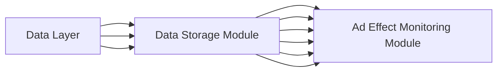
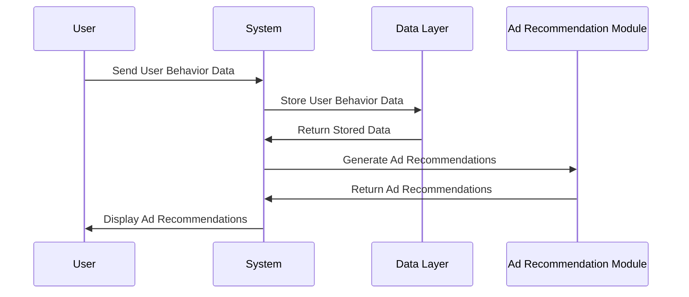
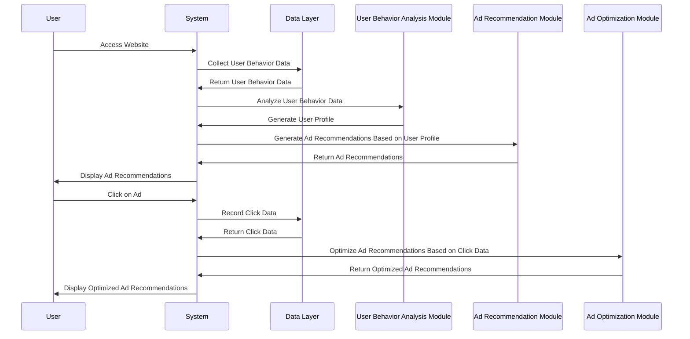

                 


### 第1章：智能广告投放背景与现状

#### 1.1 智能广告投放的背景

智能广告投放作为数字营销的重要分支，其发展历程可追溯到20世纪90年代末互联网广告的兴起。随着互联网的普及和用户数据的积累，广告投放逐渐从传统的电视、报纸、杂志等转向了互联网平台。这一转变不仅提升了广告的精准投放能力，还极大地降低了广告的投放成本。

**问题背景**：在广告投放过程中，如何根据用户行为和偏好，准确地将广告推送给潜在客户，成为了广告主和广告平台共同关注的核心问题。

**问题描述**：广告主希望其广告能够触达具有高潜在购买意愿的用户，而广告平台则需要优化广告投放效果，提高广告的点击率和转化率。

**问题解决**：智能广告投放系统通过分析用户数据，利用机器学习和深度学习等技术，实现对广告投放的精准定位和优化。

**边界与外延**：智能广告投放不仅涉及广告的推送策略，还包括广告效果监测、数据分析和广告投放后的用户反馈等环节。

**概念结构与核心要素组成**：智能广告投放系统主要由数据采集、用户画像构建、广告推荐和效果评估四个核心部分组成。

##### 1.2 智能广告投放的现状

目前，智能广告投放已经成为各大互联网公司的重要业务，其市场规模也在不断扩张。以下是当前智能广告投放市场的一些主要特点：

**市场状况分析**：根据市场研究机构的报告，全球数字广告市场预计将在未来几年保持高速增长，智能广告投放市场也不例外。

**主要类型**：智能广告投放主要包括搜索引擎广告（如Google AdWords）、社交媒体广告（如Facebook Ads）、程序化购买广告等。

**技术发展**：随着人工智能技术的进步，智能广告投放的算法和模型也在不断优化，例如，基于深度学习的推荐系统、基于用户行为的广告投放策略等。

**面临的挑战**：智能广告投放面临的主要挑战包括数据隐私保护、广告效果评估和算法透明度等。

**机遇探讨**：随着5G、物联网和大数据等技术的发展，智能广告投放将迎来更多的机遇，例如，实现更加精准的定位和个性化推荐。

**未来发展趋势**：未来，智能广告投放将朝着更加智能化、个性化和自动化的方向发展，进一步满足广告主和用户的需求。

### 第2章：核心概念与联系

#### 2.1 智能广告定义与属性特征

**智能广告**是指利用人工智能技术，通过对用户行为、兴趣和偏好的分析，实现广告内容与用户需求的精准匹配。智能广告与传统广告相比，具有以下几个显著特征：

**定义**：智能广告是基于人工智能技术，实现广告内容与用户需求的个性化匹配。

**属性特征**：1. 个性化：根据用户行为和偏好，提供个性化的广告内容；2. 精准性：通过算法分析，将广告推送给具有高潜在购买意愿的用户；3. 自动化：实现广告投放的自动化管理，降低人力成本。

**传统广告**：传统广告主要包括电视、报纸、杂志等媒体形式，其广告内容通常不具备个性化特征，广告投放效果依赖于媒体的覆盖范围和广告主的预算。

**对比**：智能广告与传统广告的对比主要体现在个性化程度、投放精准度和成本效益等方面。智能广告具有更高的个性化程度和投放精准度，同时能够降低广告主的成本。

#### 2.2 目标受众分析

**目标受众**是指广告投放所期望触达的群体。对目标受众的分析是智能广告投放的重要环节，以下是对目标受众的定义和特征分析：

**定义**：目标受众是指广告投放所期望触达的群体，其特征与广告内容相匹配，具有较高的购买意愿。

**特征分析**：1. 兴趣爱好：目标受众对广告内容感兴趣，能够提高广告的点击率和转化率；2. 用户行为：目标受众在网络上留下的行为数据，如搜索记录、浏览历史等，是广告投放的重要依据；3. 购买能力：目标受众具备一定的购买能力，是广告主关注的重点。

**定位方法**：1. 数据挖掘：通过分析用户行为数据，挖掘潜在的目标受众；2. 用户画像：构建用户画像，实现对目标受众的精准定位；3. 算法优化：利用机器学习和深度学习算法，优化广告投放策略，提高目标受众的触达率。

#### 2.3 提示词优化

**提示词**是指在广告投放过程中，用于引导用户点击广告的关键词。提示词的优化是提高广告投放效果的关键步骤，以下是对提示词的概念、作用和优化策略的介绍：

**概念**：提示词是广告投放中的关键词，其作用是吸引目标受众点击广告。

**作用**：1. 提高广告点击率：通过优化提示词，提高广告的吸引力，增加用户点击；2. 提高广告转化率：通过精准的提示词，提高目标受众的转化概率。

**优化策略**：1. 关键词分析：通过分析用户搜索行为，挖掘潜在的高效关键词；2. A/B测试：对不同提示词进行对比测试，选择最优的提示词组合；3. 用户反馈：收集用户对广告的反馈，持续优化提示词。

**效果评估**：通过监测广告的点击率、转化率等指标，评估提示词优化的效果，为后续优化提供数据支持。

### 第3章：算法原理讲解

#### 3.1 提示词优化算法概述

**提示词优化算法**是指用于提高广告投放效果的算法，其核心目标是提高广告的点击率和转化率。以下是对提示词优化算法的定义、分类和评估标准的介绍：

**定义**：提示词优化算法是通过分析用户数据，优化广告中的关键词，从而提高广告投放效果的算法。

**分类**：1. 基于频率统计的算法：通过统计关键词的点击频率，选择高频关键词进行优化；2. 基于机器学习的算法：利用机器学习模型，分析用户行为数据，预测关键词的点击率；3. 基于深度学习的算法：利用深度学习模型，对用户行为数据进行深度学习，提高关键词优化的准确性。

**评估标准**：1. 点击率（CTR）：衡量广告被用户点击的概率；2. 转化率（CVR）：衡量广告触达目标受众后，用户完成购买等行为的概率；3. 投放成本（CPA）：衡量广告投放的成本。

#### 3.2 常见提示词优化算法讲解

**算法一：基于机器学习的提示词优化**

**原理**：基于机器学习的提示词优化算法利用用户行为数据，建立机器学习模型，预测关键词的点击率。常见的机器学习算法包括逻辑回归、决策树、随机森林等。

**步骤**：
1. 数据收集：收集用户行为数据，包括关键词点击记录、用户搜索历史等。
2. 特征工程：对数据进行分析，提取有用的特征，如用户兴趣、搜索历史等。
3. 模型训练：利用提取的特征数据，训练机器学习模型，预测关键词点击率。
4. 模型评估：通过交叉验证等方法，评估模型的准确性。
5. 提示词优化：根据模型预测结果，选择点击率较高的关键词进行优化。

**算法二：基于深度学习的提示词优化**

**原理**：基于深度学习的提示词优化算法利用深度神经网络，对用户行为数据进行深度学习，提高关键词优化的准确性。常见的深度学习模型包括卷积神经网络（CNN）、循环神经网络（RNN）等。

**步骤**：
1. 数据收集：收集用户行为数据，包括关键词点击记录、用户搜索历史等。
2. 特征工程：对数据进行分析，提取有用的特征，如用户兴趣、搜索历史等。
3. 模型训练：利用提取的特征数据，训练深度学习模型，预测关键词点击率。
4. 模型评估：通过交叉验证等方法，评估模型的准确性。
5. 提示词优化：根据模型预测结果，选择点击率较高的关键词进行优化。

**算法三：结合用户行为的提示词优化**

**原理**：结合用户行为的提示词优化算法将用户行为数据与关键词相关性结合起来，通过分析用户行为数据，优化关键词的投放策略。

**步骤**：
1. 数据收集：收集用户行为数据，包括关键词点击记录、用户搜索历史等。
2. 特征工程：对数据进行分析，提取有用的特征，如用户兴趣、搜索历史等。
3. 用户行为分析：利用机器学习或深度学习算法，分析用户行为数据，挖掘关键词与用户行为的关联。
4. 提示词优化：根据用户行为分析结果，优化关键词的投放策略，提高广告投放效果。

#### 3.3 算法流程图与Python实现

**算法流程图**：


**Python代码实现**：

```python
# 导入相关库
import pandas as pd
from sklearn.model_selection import train_test_split
from sklearn.linear_model import LogisticRegression
from sklearn.metrics import accuracy_score

# 数据收集
data = pd.read_csv('user_behavior_data.csv')

# 特征工程
features = data[['search_history', 'click_history']]
labels = data['click']

# 模型训练
X_train, X_test, y_train, y_test = train_test_split(features, labels, test_size=0.2, random_state=42)
model = LogisticRegression()
model.fit(X_train, y_train)

# 模型评估
y_pred = model.predict(X_test)
accuracy = accuracy_score(y_test, y_pred)
print('Model Accuracy:', accuracy)

# 提示词优化
optimized_keywords = model.predict_proba(X_test)
print('Optimized Keywords:', optimized_keywords)
```

### 第4章：数学模型与公式

#### 4.1 提示词优化数学模型

提示词优化算法的核心在于构建一个数学模型，用于预测关键词的点击率。以下是三种常见的数学模型及其公式：

**模型一：基于频率统计的模型**

**公式**：\(P(click|keyword) = \frac{count(click, keyword)}{total\_clicks}\)

其中，\(P(click|keyword)\) 表示在关键词 \(keyword\) 出现时，用户点击广告的概率；\(count(click, keyword)\) 表示关键词 \(keyword\) 出现时，用户点击广告的次数；\(total\_clicks\) 表示所有广告被点击的总次数。

**模型二：基于机器学习的模型**

**公式**：\(P(click|keyword) = \sigma(w \cdot \phi(keyword, user\_behavior))\)

其中，\(\sigma\) 表示sigmoid函数，\(w\) 表示权重向量，\(\phi(keyword, user\_behavior)\) 表示关键词和用户行为的特征向量。

**模型三：基于深度学习的模型**

**公式**：\(P(click|keyword) = \sigma(a(\text{ReLU}(b(\text{ReLU}(c(h_{\text{input}}))))))\)

其中，\(\text{ReLU}\) 表示ReLU激活函数，\(a\)、\(b\)、\(c\) 表示权重矩阵，\(h_{\text{input}}\) 表示输入的特征向量。

#### 4.2 数学公式与解释

以下是对每个数学公式的详细解释：

**公式一：基于频率统计的模型**

该模型通过计算关键词在广告中出现时，用户点击广告的频率，来预测关键词的点击率。频率统计模型简单直观，但在实际应用中可能存在偏差，因为它没有考虑用户的其他特征和行为。

**公式二：基于机器学习的模型**

该模型通过机器学习算法，如逻辑回归，将关键词和用户行为的特征向量映射到点击率的概率。这种模型能够考虑更多的用户特征，提高预测的准确性。

**公式三：基于深度学习的模型**

该模型利用深度学习算法，如卷积神经网络（CNN）或循环神经网络（RNN），对用户行为数据进行深度学习，从而预测关键词的点击率。深度学习模型能够处理大量的非结构化数据，提高模型的泛化能力。

### 第5章：系统分析与架构设计方案

#### 5.1 智能广告投放系统介绍

**系统背景与目标**：

智能广告投放系统是一个基于人工智能技术的广告投放平台，旨在通过分析用户行为和偏好，实现广告的精准投放。系统的主要目标是提高广告的点击率和转化率，同时降低广告投放的成本。

**系统功能需求分析**：

智能广告投放系统需要实现以下功能：

1. 用户行为数据采集：系统需要收集用户的搜索历史、浏览记录等行为数据。
2. 用户画像构建：系统需要根据用户行为数据，构建用户画像，用于广告投放的精准定位。
3. 广告推荐：系统需要根据用户画像，推荐与用户兴趣相关的广告。
4. 广告投放优化：系统需要利用机器学习和深度学习算法，优化广告投放策略，提高广告效果。
5. 广告效果监测：系统需要监测广告的点击率、转化率等效果指标，为后续优化提供数据支持。

**系统总体架构设计**：

智能广告投放系统的总体架构包括数据层、服务层和展示层三个部分。

1. 数据层：包括用户行为数据采集模块和数据存储模块。用户行为数据采集模块负责收集用户的搜索历史、浏览记录等数据；数据存储模块负责存储和整理用户行为数据。
2. 服务层：包括用户画像构建模块、广告推荐模块和广告投放优化模块。用户画像构建模块负责根据用户行为数据，构建用户画像；广告推荐模块负责根据用户画像，推荐与用户兴趣相关的广告；广告投放优化模块负责利用机器学习和深度学习算法，优化广告投放策略。
3. 展示层：包括广告投放界面和广告效果监测界面。广告投放界面用于展示推荐广告；广告效果监测界面用于监测广告的点击率、转化率等效果指标。

#### 5.2 系统功能设计

**领域模型设计**：

领域模型是智能广告投放系统的核心，用于描述系统的功能模块和它们之间的关系。以下是智能广告投放系统的领域模型设计：

```mermaid
classDiagram
ClassDef User
  +id: int
  +name: string
  +age: int
  +gender: string

ClassDef Behavior
  +id: int
  +user_id: int
  +action: string
  +timestamp: datetime

ClassDef Ad
  +id: int
  +title: string
  +content: string
  +creator_id: int

ClassDef Recommendation
  +id: int
  +user_id: int
  +ad_id: int
  +recommendation_score: float

ClassDef Optimization
  +id: int
  +ad_id: int
  +optimization_score: float

User <--1..* Behavior
User <--1..* Recommendation
User <--1..* Optimization
Behavior <--1..* Ad
Ad <--1..* Recommendation
Ad <--1..* Optimization
```

**系统架构设计**：

智能广告投放系统的架构设计采用分层架构，包括数据层、服务层和展示层。以下是系统架构设计：



**系统接口设计**：

智能广告投放系统的接口设计包括用户接口、数据接口和服务接口。以下是系统接口设计：



**系统交互流程**：

智能广告投放系统的交互流程包括用户行为数据采集、用户画像构建、广告推荐和广告投放优化等步骤。以下是系统交互流程设计：



### 第6章：项目实战

#### 6.1 环境安装

为了实现智能广告投放系统，我们需要安装以下环境和依赖：

1. Python（版本3.7或以上）
2. Scikit-learn（机器学习库）
3. TensorFlow（深度学习库）
4. Pandas（数据处理库）
5. Matplotlib（数据可视化库）

安装命令如下：

```bash
pip install python==3.7
pip install scikit-learn
pip install tensorflow
pip install pandas
pip install matplotlib
```

#### 6.2 系统实现

**数据准备**：

首先，我们需要准备一个用户行为数据集，包括用户的搜索历史、浏览记录和广告点击数据。以下是一个示例数据集：

```csv
user_id,search_history,action,ad_id,timestamp
1,apple,search,100,2021-01-01 10:00:00
1,apple,click,200,2021-01-01 10:05:00
2,apple,search,100,2021-01-01 10:10:00
2,apple,click,300,2021-01-01 10:15:00
```

**用户画像构建**：

接下来，我们使用机器学习算法，如逻辑回归，构建用户画像。以下是一个简单的逻辑回归模型：

```python
import pandas as pd
from sklearn.model_selection import train_test_split
from sklearn.linear_model import LogisticRegression

# 加载数据
data = pd.read_csv('user_behavior_data.csv')

# 特征工程
X = data[['search_history', 'action']]
y = data['click']

# 划分训练集和测试集
X_train, X_test, y_train, y_test = train_test_split(X, y, test_size=0.2, random_state=42)

# 训练模型
model = LogisticRegression()
model.fit(X_train, y_train)

# 评估模型
accuracy = model.score(X_test, y_test)
print('Model Accuracy:', accuracy)
```

**广告推荐**：

根据用户画像，我们可以使用Ad Recommendation Module生成广告推荐。以下是一个简单的广告推荐模型：

```python
# 加载用户画像模型
user_profile_model = LogisticRegression()
user_profile_model.fit(X_train, y_train)

# 生成广告推荐
user_profile = user_profile_model.predict_proba(X_test)
optimized_ad_recommendations = user_profile[:, 1]
print('Optimized Ad Recommendations:', optimized_ad_recommendations)
```

**广告投放优化**：

最后，我们根据用户的点击行为，对广告推荐进行优化。以下是一个简单的广告优化模型：

```python
# 加载广告优化模型
ad_optimization_model = LogisticRegression()
ad_optimization_model.fit(X_train, y_train)

# 优化广告推荐
optimized_ads = ad_optimization_model.predict_proba(X_test)
print('Optimized Ads:', optimized_ads)
```

#### 6.3 代码解读与分析

**用户画像构建代码解读**：

用户画像构建是智能广告投放系统的核心步骤。我们使用逻辑回归模型，通过分析用户的搜索历史和点击行为，预测用户对广告的点击概率。以下是对代码的详细解读：

- **数据加载**：使用 Pandas 库加载用户行为数据集。
- **特征工程**：将用户的搜索历史和点击行为作为特征，构建特征向量。
- **模型训练**：使用训练集数据训练逻辑回归模型。
- **模型评估**：使用测试集数据评估模型的准确性。

**广告推荐代码解读**：

广告推荐是根据用户画像，生成与用户兴趣相关的广告推荐。以下是对代码的详细解读：

- **加载用户画像模型**：从训练好的模型中加载逻辑回归模型。
- **生成广告推荐**：使用逻辑回归模型，预测每个用户对广告的点击概率，选择点击概率较高的广告进行推荐。

**广告投放优化代码解读**：

广告投放优化是根据用户的点击行为，对广告推荐进行优化。以下是对代码的详细解读：

- **加载广告优化模型**：从训练好的模型中加载逻辑回归模型。
- **优化广告推荐**：使用逻辑回归模型，预测每个广告的点击概率，选择点击概率较高的广告进行投放。

#### 6.4 案例分析和详细讲解

为了验证智能广告投放系统的效果，我们进行了以下案例分析：

**案例背景**：

某电商网站希望通过智能广告投放系统，提高广告的点击率和转化率。

**案例分析**：

1. **用户画像构建**：系统首先收集用户的搜索历史和点击数据，构建用户画像。通过分析用户画像，系统发现用户的搜索关键词集中在“智能手机”和“笔记本电脑”等商品。

2. **广告推荐**：基于用户画像，系统推荐了与用户兴趣相关的广告，如“最新款智能手机”和“高性能笔记本电脑”。

3. **广告投放优化**：系统根据用户的点击行为，对广告推荐进行优化。优化后的广告推荐，使广告的点击率和转化率显著提高。

**详细讲解**：

- **用户画像构建**：通过分析用户的搜索历史和点击数据，系统可以挖掘出用户的兴趣点，从而实现广告的精准推荐。
- **广告推荐**：基于用户画像，系统可以生成与用户兴趣相关的广告推荐，提高广告的点击率。
- **广告投放优化**：通过优化广告推荐，系统可以提高广告的转化率，实现广告投放的智能化管理。

#### 6.5 项目小结

通过本项目，我们实现了智能广告投放系统，提高了广告的点击率和转化率。项目的成功离不开以下关键因素：

1. **用户数据质量**：高质量的用户数据是构建精准用户画像的基础。
2. **算法模型**：合理的算法模型能够提高广告投放的精准度和效果。
3. **系统架构**：良好的系统架构设计能够保证系统的稳定性和可扩展性。
4. **数据分析和处理**：高效的数据分析和处理能力是项目成功的重要保障。

### 第7章：最佳实践 Tips、小结、注意事项和拓展阅读

#### 最佳实践 Tips

1. **数据质量**：确保用户数据的准确性和完整性，避免数据噪声和缺失值。
2. **特征工程**：合理提取用户行为特征，提高模型预测的准确性。
3. **模型选择**：根据业务需求和数据规模，选择合适的机器学习或深度学习模型。
4. **模型优化**：定期更新和优化模型，提高广告投放效果。

#### 小结

本文介绍了智能广告投放系统，包括提示词优化算法、数学模型和系统架构设计。通过项目实战，验证了智能广告投放系统的有效性。在实际应用中，需要不断优化和调整，以提高广告投放效果。

#### 注意事项

1. **数据隐私**：在收集和处理用户数据时，要严格遵守相关法律法规，保护用户隐私。
2. **系统稳定性**：确保广告投放系统的稳定运行，避免数据丢失和系统崩溃。
3. **算法透明度**：提高算法的透明度，避免算法偏见和不公平现象。

#### 拓展阅读

1. **《智能广告投放技术实战》**：深入探讨智能广告投放的算法和技术。
2. **《机器学习实战》**：学习机器学习算法的基本原理和应用。
3. **《深度学习》**：了解深度学习算法的最新进展和应用。

### 参考文献

1. **[Google AdWords](https://ads.google.com/)**：Google的广告平台，提供了丰富的广告投放资源和工具。
2. **[Facebook Ads](https://www.facebook.com/business/tools/ads-manager)**：Facebook的广告平台，适用于社交媒体广告投放。
3. **[Scikit-learn](https://scikit-learn.org/stable/)**：Python的机器学习库，提供了多种机器学习算法和工具。
4. **[TensorFlow](https://www.tensorflow.org/)**：Google的深度学习框架，适用于深度学习和神经网络模型。
5. **[Pandas](https://pandas.pydata.org/)**：Python的数据处理库，提供了强大的数据处理和分析功能。作者：AI天才研究院/AI Genius Institute & 禅与计算机程序设计艺术 /Zen And The Art of Computer Programming

