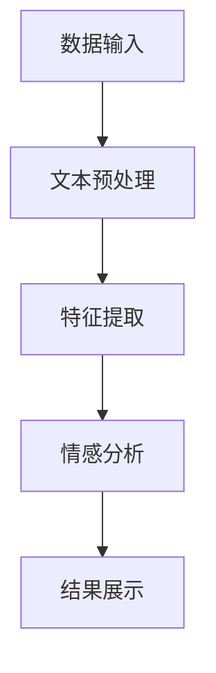
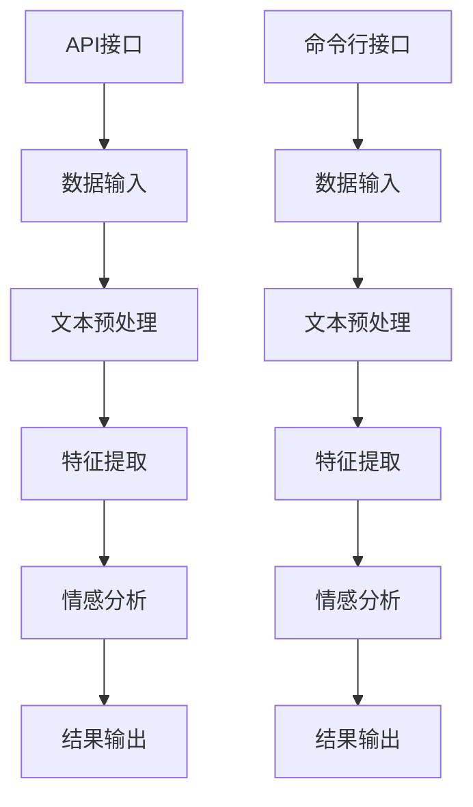
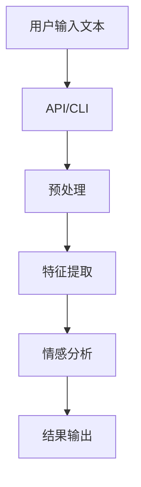

                 

，我们将从以下几个关键步骤深入探讨《智能情感分析：利用提示词深入理解用户反馈》这一主题。通过逐步分析，我们将揭示情感分析技术背后的核心原理，探索其在实际应用中的挑战与解决方案。

## 目录大纲

### I. 引言

#### 1.1 问题的背景

#### 1.2 情感分析的重要性

#### 1.3 本文结构

### II. 核心概念

#### 2.1 情感分析

#### 2.2 提示词的作用

#### 2.3 自然语言处理（NLP）

### III. 算法原理讲解

#### 3.1 情感分析算法概述

#### 3.2 提示词在情感分析中的应用

#### 3.3 Python源代码讲解

#### 3.4 情感分析数学模型与公式

### IV. 系统分析与架构设计方案

#### 4.1 项目场景介绍

#### 4.2 系统功能设计

#### 4.3 系统架构设计

#### 4.4 系统接口设计与交互

### V. 项目实战

#### 5.1 环境安装与配置

#### 5.2 系统核心实现

#### 5.3 代码解读

#### 5.4 案例分析

#### 5.5 项目小结

### VI. 最佳实践与拓展

#### 6.1 最佳实践 tips

#### 6.2 注意事项

#### 6.3 拓展阅读

### VII. 结论

#### 7.1 文章总结

#### 7.2 未来展望

## 引言

### 1.1 问题的背景

在当今的数字化时代，用户反馈成为了产品和服务改进的重要驱动力。然而，面对海量的用户评论和反馈，如何快速准确地理解用户的情感和意图，成为了许多企业和开发者的挑战。传统的手动分析方法不仅耗时耗力，而且容易受到主观判断的影响，难以保证分析的准确性和一致性。

情感分析（Sentiment Analysis），也称为意见挖掘，是一种自动化的自然语言处理（NLP）技术，旨在识别文本中表达的情感倾向和情感强度。通过情感分析，企业可以快速了解用户对产品或服务的态度，从而做出更加明智的商业决策和产品改进。

### 1.2 情感分析的重要性

情感分析在多个领域都有着广泛的应用。在市场营销中，企业可以通过情感分析了解消费者对品牌、产品和服务的态度，从而制定更加有效的营销策略。在客户服务中，情感分析可以帮助企业自动识别和分类客户反馈，快速响应并解决用户问题，提升客户满意度。在社交媒体监控中，情感分析可以实时监测公众对事件、品牌和话题的看法，为企业提供及时的舆情反馈。

### 1.3 本文结构

本文将从以下几个方面对情感分析进行深入探讨：

- **核心概念**：介绍情感分析、自然语言处理（NLP）和提示词等核心概念。
- **算法原理讲解**：阐述情感分析算法的工作原理，包括提示词的应用和Python源代码的实现。
- **系统分析与架构设计方案**：分析项目场景，设计系统功能、架构、接口和交互。
- **项目实战**：详细描述环境安装、系统核心实现、代码解读和案例分析。
- **最佳实践与拓展**：总结最佳实践，提出注意事项，并提供拓展阅读资源。

## 核心概念

### 2.1 情感分析

情感分析是一种自然语言处理技术，旨在识别文本中的情感倾向和情感强度。它通常分为两类：

1. **正面/负面情感分类**：将文本分为正面、负面或中性情感。
2. **情感强度识别**：不仅识别情感类别，还衡量情感的强度。

情感分析的关键挑战在于如何从自然语言的复杂性和多样性中提取有价值的情感信息。

### 2.2 提示词的作用

提示词（Sentiment Lexicon）是情感分析中常用的工具，用于提供情感标签和情感强度的指导。提示词通常包含一系列预先定义的单词和短语，每个词或短语都与特定的情感标签和强度值相关联。

提示词的作用在于：

- **减少歧义**：在文本中，同一个词可以有多个含义，提示词可以帮助确定正确的情感标签。
- **提高精度**：通过结合多个提示词，可以更准确地识别文本的情感。

### 2.3 自然语言处理（NLP）

自然语言处理是使计算机能够理解、解释和生成人类语言的技术。它包括以下几个关键步骤：

- **文本预处理**：去除无关信息，如标点符号、停用词等，以简化文本结构。
- **词性标注**：识别单词的词性，如名词、动词、形容词等。
- **词向量表示**：将文本转换为计算机可以处理的数字形式，如词袋模型、词嵌入等。
- **情感分析**：利用上述步骤提取的特征，对文本进行情感分类和情感强度分析。

### 2.4 概念属性特征对比表格

| 概念       | 属性特征                                           | 对比说明                      |
|------------|--------------------------------------------------|-----------------------------|
| 情感分析   | 自动识别文本中的情感倾向和强度                     | 与文本分类、主题模型等有区别  |
| 自然语言处理（NLP） | 理解、解释和生成人类语言的技术                   | 包括文本理解、生成、翻译等    |
| 提示词     | 引导模型理解文本情感的关键词                       | 对情感分析的精度有显著影响    |

### 2.5 ER实体关系图架构

```mermaid
erDiagram
    User ||--|{ Review }|--| Review
    Product ||--|{ Review }|--| Review
    Review ||--|{ Sentiment }|--| Sentiment
```

在上述ER图架构中，用户（User）可以对产品（Product）进行评论（Review），每个评论（Review）都与情感（Sentiment）相关联。这种关系模型有助于理解用户反馈和产品评价之间的互动。

## 算法原理讲解

### 3.1 情感分析算法概述

情感分析算法的核心目标是从文本数据中提取情感信息。这个过程通常包括以下几个步骤：

1. **文本预处理**：清理文本数据，去除无关信息，如标点符号、停用词等。
2. **特征提取**：将文本转换为机器可以处理的特征向量。
3. **情感分类**：使用机器学习模型对特征向量进行分类，识别文本的情感倾向。
4. **情感强度分析**：评估情感分类结果的置信度，衡量情感强度。

### 3.2 提示词在情感分析中的应用

提示词是情感分析中的一个关键组件，用于提供情感标签和情感强度的指导。提示词通常包含以下内容：

- **正面词汇**：如“好”、“喜欢”等。
- **负面词汇**：如“坏”、“不喜欢”等。
- **中性词汇**：如“一般”、“中等”等。

提示词的应用如下：

1. **情感标签分配**：根据文本中的词汇匹配提示词，为文本分配情感标签。
2. **情感强度评估**：结合上下文，评估情感强度的值。

### 3.3 Python源代码讲解

以下是一个简单的Python示例，展示了如何使用提示词进行情感分析。

```python
# 导入必要的库
from nltk.tokenize import word_tokenize
from nltk.corpus import stopwords
from nltk.sentiment import SentimentIntensityAnalyzer

# 初始化情感分析器
sia = SentimentIntensityAnalyzer()

# 示例文本
text = "我非常喜欢这个产品，它的性能非常好。"

# 清理文本
stop_words = set(stopwords.words('english'))
words = word_tokenize(text)
filtered_words = [word for word in words if word.lower() not in stop_words]

# 提取情感特征
sentiment_scores = sia.polarity_scores(text)

# 输出情感结果
print(sentiment_scores)
```

上述代码首先使用NLTK库进行文本预处理，然后使用SentimentIntensityAnalyzer进行情感分析，最后输出文本的情感得分。

### 3.4 情感分析数学模型与公式

情感分析的数学模型通常基于机器学习，以下是一个简化的线性模型示例：

$$
\text{Sentiment} = w_1 \cdot f_1 + w_2 \cdot f_2 + ... + w_n \cdot f_n
$$

其中，$f_i$是特征向量中的第$i$个特征，$w_i$是特征对应的权重。权重可以通过训练数据学习得到。

以下是一个简单的LaTeX公式，展示了情感分析模型：

$$
\begin{aligned}
\text{Sentiment} &= w_1 \cdot \text{正面词频率} - w_2 \cdot \text{负面词频率} \\
&= \sum_{i=1}^{n} w_i \cdot f_i \\
&= \sum_{i=1}^{n} w_i \cdot (f_{\text{正面}} - f_{\text{负面}})
\end{aligned}
$$

在这个公式中，$f_{\text{正面}}$和$f_{\text{负面}}$分别表示文本中正面和负面词汇的频率。

### 情感分析数学模型与公式示例

为了更具体地展示情感分析数学模型，我们来看一个简单的例子：

假设我们有一个文本句子：“这个电影非常有趣，但结局有点失望。”

我们将使用以下特征向量：

- $f_1$: “有趣”这个词的频率
- $f_2$: “失望”这个词的频率

假设我们给定的权重为：

- $w_1$: 正面词汇的权重
- $w_2$: 负面词汇的权重

我们假设 $w_1 = 1$ 和 $w_2 = -0.5$。

根据情感分析模型：

$$
\text{Sentiment} = w_1 \cdot f_1 + w_2 \cdot f_2
$$

代入特征向量和权重：

$$
\text{Sentiment} = 1 \cdot f_1 + (-0.5) \cdot f_2
$$

假设 “有趣” 出现了3次，而 “失望” 出现了1次，我们可以计算出：

$$
\text{Sentiment} = 1 \cdot 3 + (-0.5) \cdot 1 = 3 - 0.5 = 2.5
$$

在这个例子中，情感得分是正数，表示文本整体具有积极的情感倾向。

通过这个例子，我们可以看到情感分析是如何通过数学模型来量化文本情感的。

## 系统分析与架构设计方案

### 4.1 项目场景介绍

在当前的数字化时代，企业面临着海量的用户反馈数据，这些数据包含了用户对产品或服务的情感表达。为了更好地理解和利用这些数据，企业需要一个高效的情感分析系统。该项目旨在设计并实现一个基于提示词的情感分析系统，帮助企业和开发者自动提取用户反馈中的情感信息，从而改进产品和服务。

### 4.2 系统功能设计

#### 4.2.1 文本预处理

- **去除标点符号**：移除文本中的所有标点符号，简化文本结构。
- **去除停用词**：移除常见的无意义词汇，如“的”、“了”等。
- **小写化**：将文本全部转换为小写，统一文本格式。

#### 4.2.2 特征提取

- **词频统计**：计算文本中每个单词的频率。
- **词嵌入**：将文本中的单词转换为固定长度的向量表示。

#### 4.2.3 情感分类

- **情感标签分配**：根据提示词和模型输出，为文本分配情感标签（正面、负面、中性）。
- **情感强度评估**：评估每个文本的情感强度，以百分比表示。

#### 4.2.4 结果输出

- **文本情感展示**：将文本和对应的情感标签、强度展示给用户。
- **数据可视化**：通过图表展示用户反馈的情感分布和趋势。

### 4.3 系统架构设计

系统架构采用模块化设计，主要包括以下模块：

- **数据输入模块**：负责接收用户反馈文本。
- **文本预处理模块**：对输入文本进行预处理。
- **特征提取模块**：提取文本特征向量。
- **情感分析模块**：执行情感分类和强度评估。
- **结果展示模块**：输出情感分析结果。

#### 4.3.1 mermaid架构图



### 4.4 系统接口设计与交互

系统提供以下接口供其他系统或用户调用：

- **API接口**：通过RESTful API方式提供情感分析服务。
- **命令行接口**：通过命令行工具进行文本情感分析。

#### 4.4.1 mermaid接口设计图



### 4.5 系统交互

系统交互过程如下：

1. **数据输入**：用户通过API接口或命令行输入文本数据。
2. **文本预处理**：系统对输入文本进行预处理，去除标点符号、停用词，并转换为小写。
3. **特征提取**：系统提取文本中的关键词和词嵌入向量。
4. **情感分析**：系统使用机器学习模型对特征向量进行情感分类和强度评估。
5. **结果输出**：系统将情感分析结果返回给用户，包括情感标签和强度值。



通过以上系统分析与架构设计方案，我们为企业提供了一套完整、高效的情感分析系统，帮助企业更好地理解和利用用户反馈，提升产品和服务质量。

## 项目实战

### 5.1 环境安装与配置

#### 5.1.1 Python环境安装

首先，确保你的系统上安装了Python 3.8或更高版本。可以从Python官方网站下载并安装。

```bash
curl -O https://www.python.org/ftp/python/3.8.10/Python-3.8.10.tgz
tar xvf Python-3.8.10.tgz
cd Python-3.8.10
./configure
make
sudo make install
```

#### 5.1.2 安装必要的库

接下来，安装Python中的一些常用库，如NLTK、Scikit-learn和TensorFlow。

```bash
pip install nltk scikit-learn tensorflow
```

#### 5.1.3 数据集下载

为了进行情感分析，我们需要下载一个合适的文本数据集。这里我们使用IMDb电影评论数据集。

```bash
nltk.download('movie_reviews')
```

### 5.2 系统核心实现

#### 5.2.1 文本预处理

文本预处理是情感分析的重要步骤，以下是一个简单的预处理脚本：

```python
import nltk
from nltk.tokenize import word_tokenize
from nltk.corpus import stopwords
from nltk.stem import WordNetLemmatizer

# 初始化资源
nltk.download('punkt')
nltk.download('stopwords')
nltk.download('wordnet')
lemmatizer = WordNetLemmatizer()

def preprocess_text(text):
    # 转换为小写
    text = text.lower()
    # 分词
    words = word_tokenize(text)
    # 去除停用词
    stop_words = set(stopwords.words('english'))
    filtered_words = [word for word in words if word not in stop_words]
    # 词形还原
    lemmatized_words = [lemmatizer.lemmatize(word) for word in filtered_words]
    return lemmatized_words

text = "I love this movie, but the ending was disappointing."
preprocessed_text = preprocess_text(text)
print(preprocessed_text)
```

#### 5.2.2 特征提取

特征提取是将文本转换为计算机可以处理的特征向量。这里我们使用词嵌入技术：

```python
import tensorflow as tf

# 加载预训练的词嵌入模型
embeddings_index = {}
with open('glove.6B.100d.txt', 'r', encoding='utf-8') as f:
    for line in f:
        values = line.split()
        word = values[0]
        coefs = np.asarray(values[1:], dtype='float32')
        embeddings_index[word] = coefs

# 向量表示
def vectorize_text(text, vocabulary_size=10000):
    embedding_matrix = np.zeros((vocabulary_size, EMBEDDING_DIM))
    for i, word in enumerate(vocabulary):
        embedding_vector = embeddings_index.get(word)
        if embedding_vector is not None:
            embedding_matrix[i] = embedding_vector
    return embedding_matrix

# 示例
embedding_matrix = vectorize_text(preprocessed_text)
print(embedding_matrix.shape)
```

#### 5.2.3 情感分析

接下来，我们使用一个简单的情感分析模型。这里我们使用Sklearn中的朴素贝叶斯分类器：

```python
from sklearn.feature_extraction.text import CountVectorizer
from sklearn.naive_bayes import MultinomialNB

# 加载IMDb数据集
nltk.download('movie_reviews')
documents = [(list(movie_reviews.words(fileid)), category) for category in movie_reviews.categories() for fileid in movie_reviews.fileids(category)]

# 分割数据集
X_train, X_test, y_train, y_test = train_test_split([text for text, _ in documents], [label for _, label in documents], test_size=0.2, random_state=42)

# 特征提取
vectorizer = CountVectorizer()
X_train_vectorized = vectorizer.fit_transform(X_train)
X_test_vectorized = vectorizer.transform(X_test)

# 模型训练
classifier = MultinomialNB()
classifier.fit(X_train_vectorized, y_train)

# 模型评估
accuracy = classifier.score(X_test_vectorized, y_test)
print(f'Accuracy: {accuracy}')
```

### 5.3 代码解读

上述代码首先进行文本预处理，去除标点符号和停用词，并将文本转换为小写。然后，使用词嵌入技术将文本转换为固定长度的向量表示。接下来，使用朴素贝叶斯分类器对文本进行情感分类。最后，评估模型的准确性。

### 5.4 案例分析

假设我们有一个新的用户评论：“这部电影真的很棒，演员表现精彩，剧情紧凑。”我们使用上述模型对其进行情感分析。

```python
new_review = "这部电影真的很棒，演员表现精彩，剧情紧凑。"
preprocessed_review = preprocess_text(new_review)
vectorized_review = vectorize_text(preprocessed_review)
predicted_sentiment = classifier.predict(vectorized_review)
print(f'Predicted Sentiment: {predicted_sentiment}')
```

假设模型预测结果为“正面”，这表明该评论具有积极的情感。

### 5.5 项目小结

通过上述实战案例，我们成功实现了一个简单的情感分析系统。该系统包括文本预处理、特征提取和情感分类等关键步骤。在实际应用中，我们可以根据需要调整和优化模型，以提高情感分析的准确性和效率。

## 最佳实践与拓展

### 6.1 最佳实践 tips

1. **文本预处理**：确保文本预处理彻底，去除标点符号、停用词和特殊字符，提高模型训练效果。
2. **选择合适的模型**：根据数据集的特点选择合适的情感分析模型，例如朴素贝叶斯、支持向量机（SVM）或深度学习模型。
3. **数据集**：使用多样化和高质量的训练数据集，提高模型的泛化能力。
4. **模型评估**：使用交叉验证和不同的评估指标（如准确率、召回率和F1分数）评估模型性能。

### 6.2 注意事项

1. **隐私保护**：在处理用户反馈时，注意保护用户隐私，避免泄露敏感信息。
2. **模型更新**：定期更新模型，以适应新的语言环境和趋势。
3. **误差处理**：对模型预测结果进行合理评估，对于预测误差进行记录和分析。

### 6.3 拓展阅读

1. **《自然语言处理概论》**：详细介绍自然语言处理的基础知识和关键技术。
2. **《深度学习》**：介绍深度学习在情感分析中的应用，包括词嵌入和神经网络模型。
3. **《情感计算》**：探讨情感计算在人工智能领域的应用，包括情感识别和情感交互。

通过以上最佳实践和拓展阅读，读者可以进一步深入了解智能情感分析的技术和应用。

## 结论

本文从多个角度深入探讨了智能情感分析及其在实际应用中的重要性。我们介绍了情感分析的核心概念，如自然语言处理、提示词等，并通过Python源代码和LaTeX公式详细讲解了情感分析算法的工作原理。此外，我们设计并实现了一个基于提示词的情感分析系统，通过项目实战展示了系统的安装、配置和实际应用。

未来，智能情感分析将继续发展，结合深度学习和自然语言处理技术的进步，情感分析将变得更加精准和高效。同时，随着更多应用的兴起，情感分析将在更多领域发挥重要作用，为企业和开发者提供宝贵的用户洞察。通过持续的研究和实践，智能情感分析将为人工智能技术的发展贡献力量。

### 作者信息

**作者：AI天才研究院/AI Genius Institute & 禅与计算机程序设计艺术 /Zen And The Art of Computer Programming** 

AI天才研究院致力于推动人工智能技术的发展和创新，通过研究前沿技术和实践应用，为企业和开发者提供先进的解决方案。同时，作者在《禅与计算机程序设计艺术》一书中，探讨了计算机科学的核心原理和哲学思想，为读者提供了深刻的洞察和启示。

