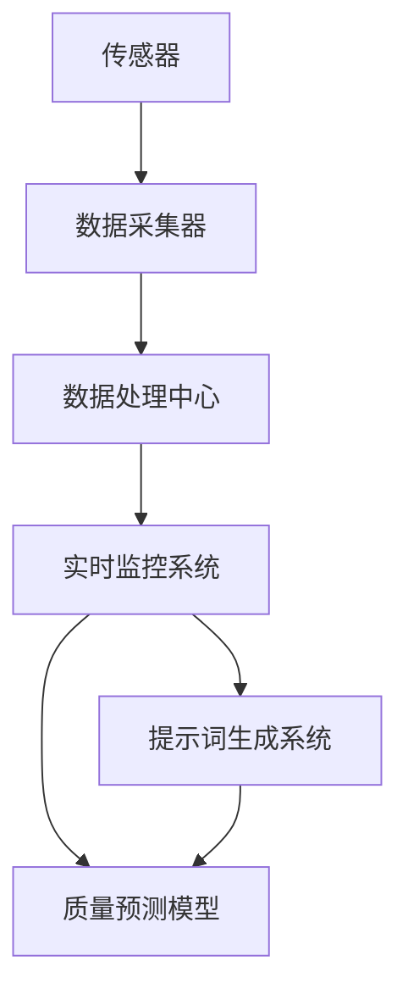
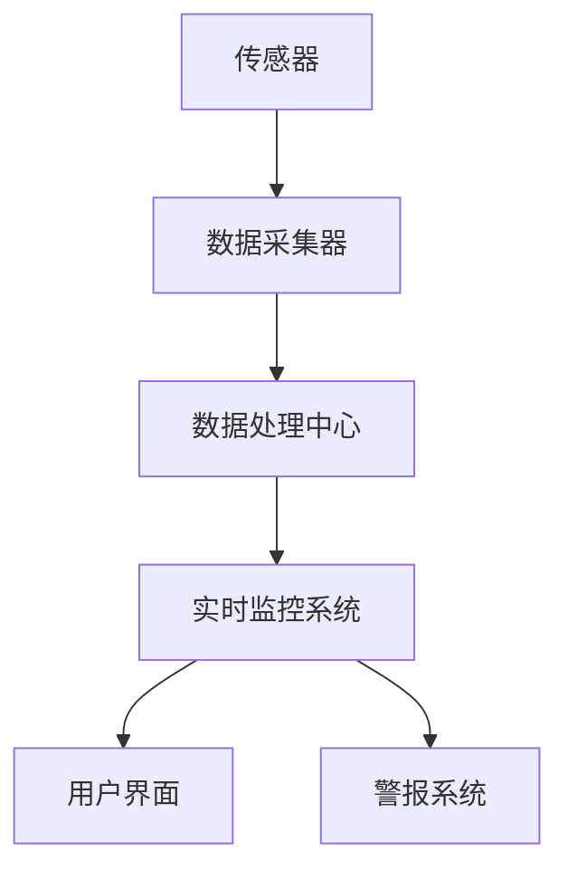
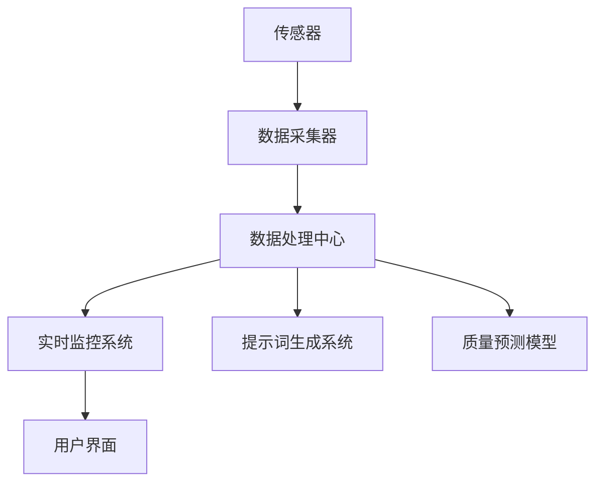
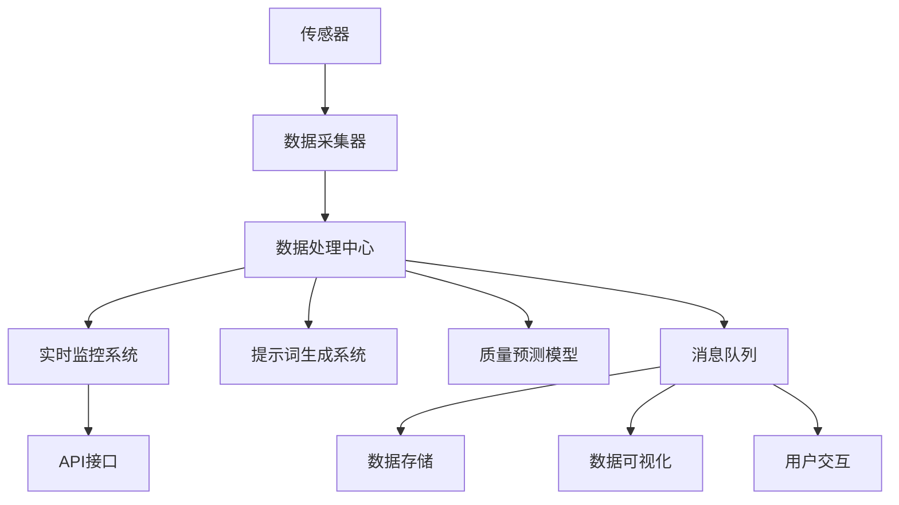

                 

### 第1章: 智能质量控制概述

智能质量控制是现代制造业中的一项重要技术，旨在通过人工智能和大数据分析，提高产品质量，降低生产成本，缩短交货周期。随着制造业的数字化和智能化进程不断加快，智能质量控制的重要性愈发凸显。本章节将介绍智能质量控制的背景、核心概念及其应用场景。

#### 1.1 问题背景

**制造业质量管理面临的挑战**

随着制造业的不断发展，质量管理面临着前所未有的挑战。传统质量管理方法往往依赖于人为经验和简单的统计工具，其局限性日益显现：

1. **数据依赖性低**：传统方法依赖于操作者的经验和技能，缺乏系统性和科学性。
2. **反馈延迟**：产品质量问题往往在成品阶段才能发现，造成大量资源浪费。
3. **成本高昂**：传统方法通常需要大量的人力、物力和时间成本。
4. **局限性**：传统方法难以应对复杂的产品结构和多样的生产环境。

**智能质量控制的必要性**

智能质量控制通过引入人工智能技术，可以显著提升质量管理的效率和准确性：

1. **实时监测**：通过传感器和数据采集系统，实现对生产过程的实时监控。
2. **数据分析**：利用大数据分析技术，从海量数据中提取有价值的信息，发现潜在问题。
3. **自动化处理**：通过自动化系统和机器学习算法，对质量问题进行快速识别和纠正。
4. **优化决策**：基于数据分析结果，提供优化的生产决策，降低成本，提高效率。

**提示词驱动的概念**

提示词驱动是指通过自然语言处理技术，生成与特定问题相关的关键词和短语，从而指导数据分析和决策过程。在智能质量控制中，提示词驱动具有以下作用：

1. **精准定位**：通过提示词，可以快速定位问题发生的具体环节。
2. **提高效率**：减少不必要的搜索和数据分析，提高工作效率。
3. **知识整合**：将分散的知识点整合，形成完整的知识图谱，支持复杂问题的求解。

#### 1.2 智能质量控制的核心概念

**智能质量控制的基本原理**

智能质量控制的基本原理可以概括为以下几步：

1. **数据采集**：通过传感器、监测设备和数据采集系统，获取生产过程中的各类数据。
2. **数据预处理**：对采集到的数据进行清洗、归一化和特征提取，为后续分析做准备。
3. **数据分析**：利用大数据分析和机器学习技术，对预处理后的数据进行深度分析，识别潜在问题。
4. **决策支持**：基于分析结果，提供优化建议和决策支持，指导生产过程的调整。

**智能质量控制与传统质量管理的对比**

| 对比维度 | 智能质量控制 | 传统质量管理 |
| --- | --- | --- |
| **数据依赖性** | 强 | 弱 |
| **实时性** | 高 | 低 |
| **自动化程度** | 高 | 低 |
| **成本** | 较低 | 较高 |
| **准确性** | 高 | 低 |

**提示词驱动的关键技术**

提示词驱动的关键技术主要包括：

1. **自然语言处理**：通过自然语言处理技术，生成与问题相关的关键词和短语。
2. **词嵌入**：将关键词转化为计算机可以处理的向量表示，以便进行后续的机器学习分析。
3. **语言模型**：使用预训练的语言模型，如BERT、GPT等，提高关键词的生成质量和分析准确性。

#### 1.3 智能质量控制的应用场景

**制造业中的智能质量控制需求**

1. **生产过程监控**：实时监控生产过程中的关键参数，如温度、压力、速度等。
2. **质量检测**：对生产出的产品进行质量检测，包括尺寸、外观、性能等。
3. **故障预测**：预测设备故障，提前进行维护，减少停机时间。

**提示词驱动的优化途径**

1. **质量预测**：通过提示词生成和机器学习算法，预测产品的质量趋势，提前进行质量调整。
2. **过程优化**：基于分析结果，优化生产过程，提高生产效率。
3. **异常检测**：实时检测生产过程中的异常情况，及时进行调整。

**智能质量控制的优势与挑战**

**优势：**

1. **提高产品质量**：通过实时监控和数据分析，提高产品质量的稳定性和一致性。
2. **降低成本**：减少废品率，降低生产成本。
3. **提高效率**：自动化处理和分析，提高生产效率。
4. **提升竞争力**：通过高质量和低成本的产品，提高企业的市场竞争力。

**挑战：**

1. **数据安全和隐私**：数据采集和处理过程中，需要确保数据的安全和隐私。
2. **算法解释性**：复杂的机器学习算法往往缺乏解释性，难以被非专业人士理解。
3. **技术投入**：智能质量控制需要较高的技术投入，包括硬件设备、软件系统和人才培训。
4. **适应性问题**：不同企业的生产环境和需求不同，需要定制化解决方案。

通过对以上内容的介绍，我们为后续章节的深入探讨奠定了基础。接下来的章节将详细探讨智能质量控制的技术基础、检测与预测方法、优化策略以及具体应用案例，以帮助读者全面了解这一前沿技术。

---

**核心概念与联系**

在深入探讨智能质量控制之前，有必要对相关核心概念进行详细阐述，并分析这些概念之间的相互关系。

#### 1.2.1 智能质量控制的基本原理

智能质量控制的基本原理可以概括为以下几个关键步骤：

**数据采集与预处理**

数据采集是智能质量控制的基础。传感器、监控设备和数据采集系统在生产过程中捕获各类数据，如温度、压力、速度、尺寸、外观等。这些原始数据通常质量参差不齐，存在噪声、缺失值和不一致性等问题。因此，数据预处理步骤至关重要，包括数据清洗、归一化和特征提取：

1. **数据清洗**：移除重复数据、处理缺失值、填补空洞，确保数据的质量。
2. **归一化**：将不同量纲的数据统一转换到同一尺度，便于后续分析。
3. **特征提取**：从原始数据中提取关键特征，用于机器学习模型的训练和预测。

**数据分析**

数据分析是智能质量控制的核心。通过大数据分析和机器学习技术，对预处理后的数据进行分析，识别潜在的质量问题。数据分析包括以下几个方面：

1. **统计分析**：使用均值、方差、回归分析等统计方法，对数据的基本特性进行分析。
2. **聚类分析**：将数据分为不同的簇，找出数据中的模式，帮助识别异常值。
3. **分类与回归**：使用分类算法（如支持向量机、随机森林）和回归算法（如线性回归、决策树）预测产品质量。

**决策支持**

数据分析结果为生产决策提供支持。根据分析结果，系统可以自动调整生产参数、优化生产流程、预测产品质量趋势，从而实现质量控制的自动化和智能化。决策支持主要包括以下几个方面：

1. **异常检测**：实时监测生产过程中的异常情况，及时发出警报并采取措施。
2. **预测优化**：基于历史数据和当前状态，预测产品质量，提供优化建议。
3. **生产调度**：根据生产需求，优化生产计划，提高生产效率。

**智能质量控制与传统质量管理的对比**

智能质量控制与传统质量管理在多个方面存在显著差异，如表1-1所示：

| 对比维度 | 智能质量控制 | 传统质量管理 |
| --- | --- | --- |
| 数据依赖性 | 强 | 弱 |
| 实时性 | 高 | 低 |
| 自动化程度 | 高 | 低 |
| 成本 | 较低 | 较高 |
| 准确性 | 高 | 低 |

从上表可以看出，智能质量控制更加依赖于数据分析和自动化技术，能够实现实时监控和精准分析，从而提高质量控制的效率和准确性。

**提示词驱动的关键技术**

提示词驱动是智能质量控制中的一个重要环节，它通过自然语言处理技术，生成与特定问题相关的关键词和短语，指导数据分析和决策过程。提示词驱动的关键技术包括：

1. **自然语言处理（NLP）**：NLP技术用于理解和处理自然语言，包括文本分类、命名实体识别、关系提取等。
2. **词嵌入（Word Embedding）**：词嵌入技术将词汇转化为计算机可以处理的向量表示，便于进行机器学习分析。
3. **语言模型（Language Model）**：语言模型用于生成高质量的提示词，如BERT、GPT等预训练模型。

**核心概念属性特征对比表格**

为了更直观地展示核心概念之间的联系，我们可以使用以下对比表格：

| 概念 | 定义 | 特性 |
| --- | --- | --- |
| 数据采集 | 从生产过程中获取数据 | 实时性、多维度 |
| 数据预处理 | 清洗、归一化、特征提取 | 数据质量、一致性 |
| 数据分析 | 利用数据分析技术识别问题 | 统计方法、机器学习 |
| 决策支持 | 提供优化建议和决策 | 自动化、实时调整 |
| 智能质量控制 | 综合利用以上技术实现质量控制 | 高效、精准、自动化 |
| 提示词驱动 | 生成指导数据分析的关键词 | 精准、高效、智能化 |

**ER实体关系图架构**

为了进一步展示智能质量控制中的概念关系，我们可以使用ER（实体-关系）图来描述关键实体及其相互关系。以下是一个简化的ER图：

```mermaid
erDiagram
    Product ||--|{ Sensor } : 测量
    Process ||--|{ DataCollector } : 采集
    Data ||--|{ Preprocessor } : 预处理
    Analysis ||--|{ Model } : 模型训练
    Prediction ||--|{ Optimizer } : 优化
    QualityControl ||--|{ Monitor } : 监控
```

在上述ER图中，`Product`表示生产的产品，与`Sensor`实体相关联，表示传感器用于测量产品的关键参数。`Process`表示生产过程，与`DataCollector`实体相关联，表示数据采集设备用于采集生产过程中的数据。`Data`实体与`Preprocessor`实体相关联，表示预处理过程用于清洗、归一化和特征提取。`Analysis`实体与`Model`实体相关联，表示机器学习模型用于数据分析。`Prediction`实体与`Optimizer`实体相关联，表示优化过程用于生产参数调整和决策支持。最后，`QualityControl`实体与`Monitor`实体相关联，表示监控过程用于实时监测和异常检测。

通过以上对核心概念及其相互关系的详细阐述和图示，我们为后续章节的深入探讨提供了坚实的基础。在接下来的内容中，我们将进一步探讨智能质量控制的技术基础、检测与预测方法、优化策略以及实际应用案例，以帮助读者全面了解这一前沿领域。

---

### 第2章: 提示词驱动的技术基础

提示词驱动的技术基础是智能质量控制的核心，它通过自然语言处理（NLP）和机器学习等技术，为数据分析提供精准的指导。本章将详细介绍自然语言处理基础、提示词生成算法以及提示词优化策略，为智能质量控制奠定坚实的理论基础。

#### 2.1 自然语言处理基础

自然语言处理（NLP）是人工智能领域的一个重要分支，旨在使计算机能够理解、处理和生成自然语言。以下是NLP的一些基本概念和技术。

**自然语言处理概述**

自然语言处理涵盖了从文本中提取信息、理解语义和生成语言的任务。其主要任务包括：

1. **文本分类**：将文本分类到预定义的类别中。
2. **命名实体识别**：识别文本中的特定实体（如人名、地点、组织等）。
3. **关系提取**：提取文本中实体之间的关系。
4. **机器翻译**：将一种语言文本翻译成另一种语言。
5. **情感分析**：分析文本的情感倾向，如正面、负面或中立。

**词嵌入与语义表示**

词嵌入（Word Embedding）是将词汇转化为计算机可以处理的向量表示的一种技术。常见的词嵌入方法包括：

1. **基于频率的方法**：如TF-IDF（词频-逆文档频率），用于计算词汇的重要程度。
2. **基于神经网络的方法**：如Word2Vec、GloVe等，通过训练神经网络模型将词汇映射到高维空间中。

词嵌入能够捕捉词汇的语义信息，使得计算机能够更准确地处理和理解自然语言。

**语言模型与序列生成**

语言模型（Language Model）是用于预测文本序列的概率分布的一种模型。常见的语言模型包括：

1. **n-gram模型**：基于单词的连续序列进行建模。
2. **循环神经网络（RNN）**：能够处理任意长度的文本序列。
3. **长短期记忆网络（LSTM）**：改进RNN，解决长序列依赖问题。
4. **Transformer模型**：基于自注意力机制，广泛应用于机器翻译、文本分类等任务。

语言模型能够生成高质量的文本序列，为提示词生成提供了坚实的基础。

#### 2.2 提示词生成算法

提示词生成是智能质量控制中的一个关键环节，它通过分析生产数据和环境信息，生成与质量问题相关的关键词和短语。以下是几种常见的提示词生成算法。

**基于规则的方法**

基于规则的方法通过预定义的规则和模式匹配来生成提示词。这种方法简单直观，但灵活性较低，难以应对复杂多变的生产环境。

1. **关键词提取**：从文本数据中提取出现频率较高的词汇作为提示词。
2. **模式匹配**：根据预定义的模式，从数据中匹配相关的提示词。

**基于机器学习的方法**

基于机器学习的方法通过训练模型，从历史数据中自动生成提示词。这种方法具有较强的灵活性和适应性。

1. **监督学习**：使用标记数据集训练分类模型，生成提示词。
2. **无监督学习**：使用未标记的数据集，通过聚类分析等方法生成提示词。

常见的机器学习模型包括：

1. **支持向量机（SVM）**：用于分类任务，可以将文本映射到高维空间，实现提示词生成。
2. **决策树**：通过树形结构对数据进行划分，生成提示词。
3. **随机森林**：集成多个决策树模型，提高提示词生成的准确性和鲁棒性。

#### 2.3 提示词优化策略

提示词生成的质量直接影响数据分析和决策的准确性。提示词优化策略旨在提高提示词的生成质量和分析效率。

**提示词对质量预测的影响**

提示词的质量对质量预测有着重要影响。高质量的提示词能够准确反映产品质量的特性和趋势，从而提高预测的准确性。以下是几种常见的提示词优化策略：

1. **基于频次的优化**：根据提示词在数据中的出现频率，选择出现频率较高的词汇作为提示词。
2. **基于相关性的优化**：通过计算提示词与产品质量指标之间的相关性，选择相关性较高的词汇作为提示词。
3. **基于语义的优化**：利用自然语言处理技术，分析提示词的语义信息，选择语义相关的词汇作为提示词。

**提示词优化算法**

提示词优化算法用于自动选择和调整提示词。常见的优化算法包括：

1. **遗传算法**：模拟自然进化过程，通过选择、交叉和变异等操作，优化提示词的生成。
2. **粒子群优化（PSO）**：模拟鸟群觅食行为，通过更新速度和位置，优化提示词的选择。
3. **基于梯度的优化**：利用梯度下降等优化算法，逐步调整提示词的权重，提高生成质量。

**提示词选择的标准**

提示词选择的标准应综合考虑以下几个方面：

1. **代表性**：提示词应能够代表产品质量的关键特征。
2. **可解释性**：提示词应易于理解，有助于分析人员理解质量问题的根源。
3. **准确性**：提示词应具有较高的预测准确性，能够准确反映产品质量的趋势。
4. **多样性**：提示词应具有多样性，能够适应不同的生产环境和质量需求。

通过以上对自然语言处理基础、提示词生成算法和提示词优化策略的详细阐述，我们为智能质量控制提供了坚实的技术基础。在接下来的章节中，我们将进一步探讨智能质量检测与预测的方法和实现，以及提示词驱动的质量优化策略，帮助读者深入了解这一前沿领域。

---

### 2.1 自然语言处理基础

自然语言处理（NLP）作为人工智能领域的重要分支，其在智能质量控制中的应用日益广泛。为了深入理解NLP在提示词生成中的应用，我们需要首先了解NLP的基本概念和技术。

**自然语言处理概述**

自然语言处理的目标是使计算机能够理解、处理和生成人类语言。NLP的任务可以分为三类：

1. **理解**：包括语义分析、情感分析、命名实体识别等，旨在理解文本的含义和结构。
2. **生成**：包括机器翻译、文本摘要、对话系统等，旨在生成符合人类语言习惯的文本。
3. **交互**：包括语音识别、语音合成、聊天机器人等，旨在实现人与机器的自然交互。

自然语言处理的任务往往具有高度复杂性和挑战性，因为人类语言本身具有灵活性、歧义性和多样性。

**词嵌入与语义表示**

词嵌入（Word Embedding）是将词汇映射到高维空间的一种技术，目的是捕捉词汇的语义信息。词嵌入的主要目的是解决词汇之间的相似性和差异性。通过词嵌入，计算机可以处理和理解自然语言。

- **基于频率的方法**：如TF-IDF（词频-逆文档频率），计算词汇的重要程度。这种方法简单直观，但难以捕捉词汇的语义关系。
- **基于神经网络的方法**：如Word2Vec、GloVe等。这些方法通过训练神经网络模型，将词汇映射到高维空间，能够更好地捕捉词汇的语义信息。

**语言模型与序列生成**

语言模型（Language Model）是用于预测文本序列的概率分布的一种模型。语言模型在自然语言处理中具有广泛的应用，如机器翻译、文本摘要、对话系统等。

- **n-gram模型**：基于单词的连续序列进行建模。n-gram模型简单高效，但无法捕捉长距离依赖关系。
- **循环神经网络（RNN）**：能够处理任意长度的文本序列。RNN通过隐藏状态记忆过去的信息，但容易受到长序列依赖问题的影响。
- **长短期记忆网络（LSTM）**：改进RNN，解决长序列依赖问题。LSTM通过引入门控机制，能够更好地处理长距离依赖。
- **Transformer模型**：基于自注意力机制，广泛应用于机器翻译、文本分类等任务。Transformer通过多头注意力机制，能够捕捉文本序列中的全局依赖关系。

**NLP在智能质量控制中的应用**

在智能质量控制中，NLP主要用于以下几个方面：

1. **文本分类**：通过对生产日志、质量报告等文本进行分类，识别潜在的质量问题。
2. **命名实体识别**：识别文本中的关键实体，如产品名称、故障代码等，为后续的分析提供支持。
3. **关系提取**：提取文本中实体之间的关系，如产品与质量指标之间的关系，帮助分析人员理解质量问题的根源。
4. **文本摘要**：生成质量报告的摘要，简化信息，提高分析效率。
5. **对话系统**：构建智能客服系统，帮助生产人员快速获取相关信息，解决问题。

**NLP的优势与挑战**

NLP在智能质量控制中的应用具有显著的优势：

1. **提高效率**：通过自动化处理和分析，减少人工干预，提高工作效率。
2. **降低成本**：减少对人工经验和技能的依赖，降低质量控制成本。
3. **提升准确性**：通过深度学习和复杂模型，提高质量预测的准确性。

然而，NLP在智能质量控制中仍面临一些挑战：

1. **数据质量和多样性**：NLP模型的性能高度依赖于数据的质量和多样性。在质量控制中，数据通常存在噪声、缺失值和不一致性等问题。
2. **解释性**：复杂的NLP模型往往缺乏解释性，难以被非专业人士理解。
3. **适应性**：NLP模型需要适应不同的生产环境和质量需求，这增加了模型的复杂性。

通过以上对自然语言处理基础的介绍，我们为后续的提示词生成算法和优化策略奠定了理论基础。在接下来的章节中，我们将进一步探讨基于机器学习的提示词生成算法，以及如何通过优化策略提高提示词的生成质量。

---

### 2.2 提示词生成算法

在智能质量控制中，提示词生成是一个关键的步骤，它能够帮助系统快速定位和分析生产过程中的质量问题。提示词生成算法主要分为基于规则的方法和基于机器学习的方法。本节将详细介绍这两种方法，并对比它们的优缺点。

**基于规则的方法**

基于规则的方法主要通过预定义的规则和模式匹配来生成提示词。这种方法的优势在于其简单性和直观性，但同时也存在一些局限性。

1. **关键词提取**：这是基于规则方法的一个常见应用，通过统计文本中单词的出现频率，选择出现频率较高的词汇作为提示词。这种方法简单有效，但仅能捕捉到词汇的表面信息。

2. **模式匹配**：这种方法通过预定义的模式，从数据中匹配相关的提示词。例如，在生产日志中，预定义的模式可以是“异常”、“故障”等关键词。这种方法能够较为准确地定位问题，但依赖于预先定义的模式，灵活性较低。

**基于机器学习的方法**

基于机器学习的方法通过训练模型，从历史数据中自动生成提示词。这种方法具有更高的灵活性和准确性，但需要大量的数据和计算资源。

1. **监督学习**：在监督学习中，我们使用标记数据集来训练分类模型。例如，我们可以使用产品名称、故障代码和质量指标作为输入特征，使用质量问题描述作为输出标签。常见的监督学习算法包括支持向量机（SVM）、决策树、随机森林等。

2. **无监督学习**：在无监督学习中，我们使用未标记的数据集，通过聚类分析等方法生成提示词。例如，我们可以使用K-means算法将生产日志中的文本数据聚类，根据聚类结果生成提示词。这种方法无需标记数据，但可能难以捕捉到精确的语义信息。

**常见机器学习模型**

在提示词生成中，常见的机器学习模型包括：

1. **支持向量机（SVM）**：SVM是一种常用的分类算法，通过将数据映射到高维空间，找到最佳的超平面来分割不同类别的数据。在提示词生成中，SVM可以用于分类生产日志中的文本数据，生成提示词。

2. **决策树**：决策树通过树形结构对数据进行划分，每个节点表示一个特征，每个分支表示特征的不同取值。在提示词生成中，决策树可以用于根据输入特征生成提示词。

3. **随机森林**：随机森林是一种集成学习方法，通过构建多个决策树，并对它们的预测结果进行投票来得到最终结果。随机森林具有较强的泛化能力和鲁棒性，适用于提示词生成任务。

**优缺点对比**

| 对比维度 | 基于规则的方法 | 基于机器学习的方法 |
| --- | --- | --- |
| **简单性** | 高 | 低 |
| **灵活性** | 低 | 高 |
| **准确性** | 较低 | 较高 |
| **依赖数据** | 无需大量数据 | 需要大量数据和标注 |
| **可解释性** | 高 | 低 |

从上表可以看出，基于规则的方法简单直观，但灵活性较低，准确性也相对较低。而基于机器学习的方法虽然复杂度较高，但具有更好的灵活性和准确性。

**选择建议**

在实际应用中，应根据具体场景和数据情况选择合适的提示词生成算法：

1. **数据丰富、标注充分的场景**：建议选择基于机器学习的方法，如SVM、随机森林等，这些方法能够从大量数据中自动提取特征，生成高质量的提示词。

2. **数据较少、标注困难的场景**：可以考虑使用基于规则的方法，如关键词提取和模式匹配，这些方法对数据的依赖性较低，易于实现。

3. **需要高解释性的场景**：建议选择基于规则的方法，因为它们通常具有更高的可解释性，便于理解和调试。

通过以上对提示词生成算法的介绍和对比，我们为智能质量控制中的提示词生成提供了多种选择。在接下来的章节中，我们将进一步探讨如何优化提示词的生成质量，以提高智能质量控制的准确性和效率。

---

### 2.3 提示词优化策略

在智能质量控制中，提示词的生成质量直接影响数据分析和决策的准确性。因此，提示词优化策略至关重要。本节将详细介绍提示词对质量预测的影响、常用的提示词优化算法以及提示词选择的标准，以帮助读者更好地理解和应用这些策略。

#### 提示词对质量预测的影响

提示词的质量直接影响质量预测的准确性。高质量的提示词能够准确反映产品质量的关键特征和趋势，从而提高预测的准确性。以下是几种影响提示词质量的因素：

1. **代表性**：提示词应能够代表产品质量的关键特征，避免使用无关或次要的词汇。
2. **相关性**：提示词应与质量指标具有较高的相关性，即提示词的变化应与质量指标的变化密切相关。
3. **多样性**：提示词应具有多样性，能够适应不同的生产环境和质量需求，避免过度依赖单一提示词。

高质量的提示词能够提高质量预测的准确性，减少误报和漏报，从而提升生产过程的稳定性和效率。

#### 提示词优化算法

提示词优化算法用于自动选择和调整提示词，以提高其生成质量和预测准确性。以下是几种常用的提示词优化算法：

1. **遗传算法（GA）**：遗传算法是一种模拟自然进化过程的优化算法。通过选择、交叉和变异等操作，遗传算法能够不断优化提示词的生成。遗传算法的优点是能够全局搜索，但计算成本较高。

2. **粒子群优化（PSO）**：粒子群优化算法模拟鸟群觅食行为，通过更新速度和位置，粒子群优化算法能够逐步优化提示词的生成。PSO算法计算成本较低，但可能容易陷入局部最优。

3. **基于梯度的优化算法**：如梯度下降算法，通过计算损失函数的梯度，逐步调整提示词的权重，以优化生成质量。基于梯度的优化算法适用于提示词的实时优化，但需要明确的损失函数。

4. **集成学习方法**：如集成梯度提升树（XGBoost、LightGBM），通过集成多个弱学习器，提升预测准确性。集成学习方法适用于大规模数据集，但需要较多的计算资源。

#### 提示词选择的标准

提示词选择的标准应综合考虑多个方面，以平衡提示词的代表性、相关性和多样性。以下是几种常见的提示词选择标准：

1. **频率标准**：选择在数据中出现频率较高的词汇作为提示词。这种方法简单直观，但可能忽略词汇的语义相关性。

2. **相关性标准**：选择与质量指标相关性较高的词汇作为提示词。这种方法能够提高提示词的预测准确性，但可能需要较多的数据分析和特征工程。

3. **语义标准**：利用自然语言处理技术，分析词汇的语义信息，选择语义相关的词汇作为提示词。这种方法能够提高提示词的语义质量，但计算成本较高。

4. **多样性标准**：选择具有多样性的词汇作为提示词，以适应不同的生产环境和质量需求。这种方法能够提高提示词的适应性和鲁棒性。

#### 实践建议

在实际应用中，可以结合以下建议来优化提示词的选择和生成：

1. **数据准备**：确保数据质量，包括数据的完整性、一致性和多样性。高质量的数据是提示词优化的基础。

2. **模型选择**：根据具体应用场景和数据规模，选择合适的优化算法和模型。对于小数据集，可以选择简单直观的方法；对于大数据集，可以选择更复杂的集成学习方法。

3. **实时优化**：对于实时性要求较高的场景，可以选择基于梯度的优化算法，实现实时调整和优化。

4. **解释性**：在优化过程中，应关注提示词的可解释性，以便于分析人员理解和应用。

5. **持续迭代**：提示词优化是一个持续迭代的过程，应定期更新和优化提示词，以适应生产环境的变化。

通过以上对提示词优化策略的介绍，我们为智能质量控制中的提示词优化提供了理论指导和实践建议。在接下来的章节中，我们将进一步探讨智能质量检测与预测的方法，以帮助读者全面了解智能质量控制的实现和应用。

---

### 2.4 提示词优化策略的进一步探讨

在智能质量控制中，提示词优化策略对于提高数据分析和决策的准确性至关重要。通过有效的优化策略，可以确保生成的提示词既具有代表性，又能准确反映产品的关键质量特征。下面我们将进一步探讨提示词优化策略的几个关键方面，包括提示词对质量预测的影响、不同的优化算法以及在实际应用中的最佳实践。

#### 提示词对质量预测的影响

提示词对质量预测的准确性具有直接的影响。高质量的提示词能够精确地捕捉到影响产品质量的关键因素，从而提高预测的准确性。以下是几个影响提示词质量的关键因素：

1. **词频与意义**：高频率的词汇并不一定具有较高的预测价值，关键在于词汇是否能反映产品质量的关键特征。例如，在制造业中，“温度”和“压力”等词汇可能比“工具”或“材料”等更具有预测价值。

2. **相关性**：提示词应与质量指标具有显著的相关性。通过相关性分析，可以筛选出对质量预测具有重要影响的提示词。

3. **多样性**：提示词的多样性有助于捕捉到生产过程中的多种潜在问题。多样化的提示词能够提供更全面的视角，有助于提高预测的全面性和准确性。

#### 优化算法介绍

提示词优化算法是智能质量控制中提高提示词质量的关键技术。以下是几种常用的优化算法及其特点：

1. **遗传算法（GA）**：遗传算法是一种基于自然进化过程的优化算法。通过模拟自然选择、交叉和变异等过程，遗传算法能够逐步优化提示词的选择。遗传算法的优点在于其全局搜索能力，但计算成本较高。

2. **粒子群优化（PSO）**：粒子群优化算法模拟鸟群觅食行为，通过更新每个粒子的速度和位置来优化提示词。PSO算法实现简单，计算成本较低，但可能容易陷入局部最优。

3. **基于梯度的优化算法**：如梯度下降算法，通过计算损失函数的梯度来调整提示词的权重。这种方法适用于实时优化，但需要明确的损失函数。

4. **深度强化学习（DRL）**：深度强化学习结合了深度学习和强化学习的优势，能够通过学习策略来优化提示词。DRL算法适用于复杂和动态的环境，但需要大量的训练数据和计算资源。

#### 最佳实践

在实际应用中，为了实现有效的提示词优化，以下最佳实践值得参考：

1. **数据预处理**：确保数据的质量和一致性。对原始数据进行清洗、归一化和特征提取，以减少噪声和提高数据的质量。

2. **多算法结合**：结合多种优化算法，如将遗传算法与基于梯度的优化相结合，可以提高优化效果。这种方法可以在全局搜索和局部细粒度调整之间取得平衡。

3. **动态调整**：根据生产环境和质量需求的变化，动态调整提示词。例如，当检测到生产环境发生变化时，可以重新训练模型，更新提示词。

4. **反馈机制**：建立反馈机制，定期收集和分析用户反馈，以不断优化提示词的质量。通过用户反馈，可以识别和解决模型中的潜在问题。

5. **持续学习**：智能质量控制是一个持续学习的过程。通过定期更新数据和模型，可以实现提示词的持续优化和改进。

通过以上对提示词优化策略的进一步探讨，我们为读者提供了深入理解和应用提示词优化的理论基础和实践指南。在接下来的章节中，我们将继续探讨智能质量检测与预测的方法及其在实际应用中的实现。

---

### 第3章: 智能质量检测与预测

智能质量检测与预测是智能质量控制的重要组成部分，通过实时监测、数据分析和质量预测，实现对生产过程中潜在问题的提前识别和优化调整。本章将详细介绍质量检测系统的设计、质量预测模型构建以及实际应用中的综合应用。

#### 3.1 质量检测系统设计

质量检测系统设计的目标是实时、准确地捕获生产过程中的关键质量参数，确保产品符合质量标准。以下是质量检测系统设计的关键步骤和组成部分：

**质量检测的关键技术**

1. **传感器技术**：传感器是质量检测系统的核心组件，用于监测生产过程中的物理参数，如温度、压力、湿度、振动等。选择合适的传感器类型和精度，是保证检测数据质量的关键。

2. **数据采集技术**：数据采集系统负责从传感器获取数据，并将其转化为数字信号。数据采集系统应具备高精度、高可靠性和实时性的特点。

3. **数据处理技术**：数据处理技术包括数据清洗、去噪、归一化和特征提取。通过对原始数据进行预处理，可以提高后续分析的准确性和效率。

**数据采集与预处理**

1. **数据采集**：在质量检测系统中，传感器采集到的数据需要进行实时传输和存储。常见的数据采集技术包括有线和无线传输，如以太网、无线网络等。

2. **数据预处理**：原始数据往往存在噪声、缺失值和不一致性等问题，需要进行预处理。数据清洗包括移除重复数据、处理缺失值和填补空洞。数据归一化是将不同量纲的数据统一转换到同一尺度，以便于后续分析。特征提取是从原始数据中提取关键特征，用于机器学习模型的训练和预测。

**质量检测算法**

质量检测算法是智能质量检测系统的核心。常见的质量检测算法包括：

1. **统计方法**：如均值、方差、回归分析等，用于对质量参数进行初步统计分析。

2. **聚类方法**：如K-means、层次聚类等，用于发现数据中的异常值和聚类模式。

3. **分类方法**：如支持向量机（SVM）、决策树、随机森林等，用于将质量参数分类为正常或异常。

4. **深度学习方法**：如卷积神经网络（CNN）、循环神经网络（RNN）等，用于处理复杂的非线性关系。

**质量检测系统的实现**

1. **硬件选择**：根据实际需求选择合适的传感器、数据采集设备和计算平台。

2. **软件设计**：设计包括数据采集模块、数据处理模块、检测算法模块和用户界面等。

3. **系统集成**：将硬件和软件集成到一个完整的检测系统中，确保系统的稳定性和可靠性。

#### 3.2 质量预测模型构建

质量预测模型构建是智能质量控制中的关键环节，通过预测产品质量趋势，提前识别潜在问题，实现生产过程的优化。以下是质量预测模型构建的步骤和方法：

**质量预测的数学模型**

质量预测的数学模型包括以下几部分：

1. **输入特征**：包括生产过程中的各种物理参数、环境参数和历史数据等。

2. **输出目标**：通常是产品质量指标，如尺寸、外观、性能等。

3. **预测函数**：将输入特征映射到输出目标。常见的预测函数包括线性回归、多项式回归、神经网络等。

**预测模型的选择**

选择合适的预测模型是质量预测成功的关键。以下是几种常见的预测模型：

1. **线性回归模型**：适用于输入特征和输出目标之间具有线性关系的场景。

2. **支持向量机（SVM）**：适用于非线性关系的预测，特别是高维数据。

3. **决策树和随机森林**：适用于处理复杂决策问题，具有良好的可解释性。

4. **神经网络模型**：如卷积神经网络（CNN）、循环神经网络（RNN）等，适用于处理复杂和非线性关系。

**模型训练与优化**

1. **模型训练**：使用历史数据对预测模型进行训练，调整模型参数，使其能够准确预测质量趋势。

2. **模型优化**：通过交叉验证、网格搜索等方法，选择最优的模型参数，提高预测准确性。

**实时预测与反馈**

质量预测模型需要具备实时预测和反馈的能力，通过实时监测生产过程，及时调整生产参数，实现质量的动态优化。以下是几个关键步骤：

1. **实时数据采集**：通过传感器和数据采集系统，实时获取生产过程中的质量数据。

2. **数据预处理**：对实时数据进行预处理，确保数据的质量和一致性。

3. **模型预测**：使用训练好的预测模型，对实时数据进行预测，生成质量预测结果。

4. **反馈与调整**：根据预测结果，调整生产参数，优化生产过程，确保产品质量。

#### 3.3 智能质量检测与预测的综合应用

智能质量检测与预测在制造业中具有广泛的应用，以下是一些实际应用场景：

**实时质量监控**

实时质量监控是智能质量控制的基础。通过传感器和数据采集系统，实时监测生产过程中的关键质量参数，如温度、压力、速度等。当检测到异常值时，系统会立即发出警报，通知相关人员采取措施。

**质量异常检测**

质量异常检测是智能质量控制的关键。通过机器学习算法和预测模型，实时分析生产数据，识别潜在的质量问题。当检测到异常趋势时，系统会自动采取措施，如调整生产参数、暂停生产等，以避免质量问题的发生。

**质量趋势预测**

质量趋势预测是智能质量控制的高级应用。通过历史数据和预测模型，分析产品质量的趋势和变化规律。预测模型可以预测未来一段时间内的产品质量状况，为生产决策提供依据。

**综合应用效果**

智能质量检测与预测的综合应用，可以显著提高生产过程的稳定性和产品质量，降低废品率和生产成本。以下是几个综合应用效果：

1. **提高产品质量**：通过实时监测和预测，及时发现和解决质量问题，确保产品质量的稳定性和一致性。

2. **降低成本**：通过优化生产参数和减少质量问题的发生，降低生产成本和资源消耗。

3. **提升效率**：通过自动化处理和优化决策，提高生产效率，缩短交货周期。

4. **增强竞争力**：通过高质量和低成本的产品，增强企业的市场竞争力。

通过以上对智能质量检测与预测的详细探讨，我们为读者提供了深入理解和应用这一前沿技术的理论基础和实践指南。在接下来的章节中，我们将进一步探讨智能质量优化的策略和方法，以及具体应用案例，以帮助读者全面了解智能质量控制的全过程。

---

### 3.1 质量检测系统设计

质量检测系统是智能质量控制中的核心组成部分，负责实时监测生产过程中的关键参数，确保产品符合质量标准。本节将详细介绍质量检测系统的设计，包括关键技术的选择、数据采集与预处理方法以及检测算法的实现。

**质量检测系统的关键技术**

1. **传感器技术**：传感器是质量检测系统的“感官器官”，用于监测生产过程中的各种物理参数，如温度、压力、湿度、振动、尺寸等。传感器的选择应考虑其精度、稳定性和响应速度，以保证检测数据的准确性。

2. **数据采集技术**：数据采集系统负责将传感器采集到的物理信号转换为数字信号，并传输到数据处理模块。常见的数据采集方法包括有线和无线传输，如以太网、无线网络、蓝牙等。数据采集系统需要具备高精度、高可靠性和实时性的特点。

3. **数据处理技术**：数据处理技术包括数据清洗、去噪、归一化和特征提取。通过对原始数据进行预处理，可以提高后续分析的准确性和效率。数据清洗包括移除重复数据、处理缺失值和填补空洞。数据归一化是将不同量纲的数据统一转换到同一尺度，以便于后续分析。特征提取是从原始数据中提取关键特征，用于机器学习模型的训练和预测。

**质量检测系统的实现**

**硬件选择**

根据实际需求选择合适的传感器、数据采集设备和计算平台。以下是几个关键点：

1. **传感器**：选择适合监测特定质量参数的传感器，如温度传感器、压力传感器、高精度称重传感器等。

2. **数据采集设备**：根据生产环境和数据传输需求，选择有线或无线数据采集设备。例如，在生产线远程监控场景中，可以选择无线传输方式，以便于布线和维护。

3. **计算平台**：根据数据处理和计算需求，选择适合的计算平台，如工控机、嵌入式设备等。对于大规模数据处理和分析，可能需要高性能的服务器或云计算平台。

**软件设计**

软件设计包括数据采集模块、数据处理模块、检测算法模块和用户界面等。

1. **数据采集模块**：负责从传感器采集数据，并进行初步预处理，如去噪和归一化。

2. **数据处理模块**：对原始数据进行进一步预处理，如特征提取和异常值处理，并将数据存储到数据库或数据湖中。

3. **检测算法模块**：实现质量检测算法，包括统计方法、机器学习算法和深度学习方法。常见的检测算法包括均值、方差、回归分析、聚类分析、支持向量机（SVM）、决策树、随机森林等。

4. **用户界面**：提供直观的用户界面，用于展示检测结果、异常警报和历史数据。用户界面应具备实时监控、数据查询和报表生成等功能。

**系统集成**

将硬件和软件集成到一个完整的检测系统中，确保系统的稳定性和可靠性。以下是几个关键步骤：

1. **硬件集成**：将传感器、数据采集设备和计算平台物理连接，并进行调试和测试，确保硬件部分的正常运行。

2. **软件集成**：将各个软件模块整合到一个完整的系统中，进行功能测试和性能评估，确保软件部分的正常运行。

3. **系统测试**：进行系统级测试，包括功能测试、性能测试、可靠性测试等，确保系统在各种工作条件下的稳定运行。

4. **用户培训与支持**：为用户提供系统操作和使用的培训，并提供技术支持，确保用户能够有效利用系统。

**实现示例**

以下是一个简单的质量检测系统实现示例：

```python
# 示例：质量检测系统数据采集模块

import serial
import pandas as pd

# 初始化串口连接
ser = serial.Serial('COM3', 9600)

# 读取传感器数据
data = []
while True:
    line = ser.readline().decode('utf-8').strip()
    if line:
        data.append(line)
        print(line)
    else:
        break

# 关闭串口连接
ser.close()

# 数据预处理
df = pd.DataFrame(data, columns=['Sensor'])
df['Timestamp'] = pd.to_datetime(df['Timestamp'])
df.dropna(inplace=True)

# 数据存储
df.to_csv('sensor_data.csv', index=False)
```

在上面的示例中，我们使用Python的`serial`库连接串口，读取传感器数据，并将其存储到CSV文件中。这只是一个简单的示例，实际系统可能需要更复杂的数据处理和检测算法。

通过以上对质量检测系统设计的详细阐述，我们为智能质量控制提供了坚实的技术基础。在接下来的章节中，我们将进一步探讨质量预测模型的构建和实际应用中的综合应用，帮助读者全面了解智能质量控制的全过程。

---

### 3.2 质量预测模型构建

质量预测模型在智能质量控制中扮演着至关重要的角色，它能够通过分析历史数据，预测未来的产品质量趋势，从而帮助生产企业提前识别潜在问题，采取预防措施，提高产品质量和降低成本。本节将详细介绍质量预测模型的构建过程，包括预测模型的数学模型、常见算法以及模型训练与优化的方法。

#### 质量预测的数学模型

质量预测的数学模型是构建预测模型的基础。一个完整的质量预测模型通常包括以下三个部分：

1. **输入特征**：输入特征是预测模型中的变量，它们可能包括历史质量数据、生产参数、环境参数等。例如，在制造业中，输入特征可能包括产品尺寸、重量、温度、湿度等。

2. **输出目标**：输出目标是模型预测的对象，通常是产品质量指标，如合格率、缺陷率、产品质量等级等。

3. **预测函数**：预测函数是将输入特征映射到输出目标的数学公式或模型。常见的预测函数包括线性函数、多项式函数、神经网络函数等。

以下是一个简单的线性回归模型示例：

$$
y = wx + b
$$

其中，$y$ 是预测的目标值，$w$ 是权重，$x$ 是输入特征，$b$ 是偏置项。

#### 常见质量预测算法

在质量预测中，常用的算法包括线性回归、决策树、随机森林、支持向量机（SVM）和深度学习等。每种算法都有其特定的适用场景和优势。

1. **线性回归**：线性回归是一种简单的预测算法，适用于输入特征和输出目标之间具有线性关系的场景。线性回归模型易于实现，计算速度快，但无法处理复杂的非线性关系。

2. **决策树**：决策树通过树形结构对数据进行划分，每个节点表示一个特征，每个分支表示特征的不同取值。决策树具有较高的可解释性，但可能容易过拟合。

3. **随机森林**：随机森林是一种集成学习方法，通过构建多个决策树，并对它们的预测结果进行平均或投票来得到最终结果。随机森林具有较强的泛化能力和鲁棒性，适用于复杂和大规模的数据集。

4. **支持向量机（SVM）**：SVM是一种高效的分类和回归算法，通过将数据映射到高维空间，找到最佳的超平面来分割不同类别的数据。SVM适用于处理高维数据和非线性关系。

5. **深度学习**：深度学习是一种基于神经网络的预测算法，包括卷积神经网络（CNN）、循环神经网络（RNN）、长短期记忆网络（LSTM）等。深度学习适用于处理复杂和非线性关系，但需要大量的数据和计算资源。

#### 模型训练与优化

构建质量预测模型的过程主要包括数据准备、模型选择、模型训练和模型优化等几个步骤。

1. **数据准备**：数据准备是模型训练的第一步，包括数据采集、数据清洗和数据预处理。数据采集需要确保数据的质量和完整性，数据清洗包括处理缺失值、异常值和噪声，数据预处理包括归一化、特征提取等。

2. **模型选择**：根据实际需求和数据特征，选择合适的预测模型。对于线性关系较强的数据，可以选择线性回归；对于非线性关系较强的数据，可以选择决策树、随机森林或深度学习。

3. **模型训练**：使用历史数据对预测模型进行训练，通过调整模型参数，使模型能够准确预测质量趋势。常见的训练方法包括梯度下降、随机梯度下降和批量梯度下降等。

4. **模型优化**：通过交叉验证、网格搜索等技巧，选择最优的模型参数，提高预测准确性。模型优化还包括特征选择和特征工程，以提取更有价值的特征，提高模型的性能。

#### 实际应用中的质量预测模型

在实际应用中，质量预测模型需要具备实时预测和动态调整的能力，以适应生产环境的变化。以下是质量预测模型在实际应用中的几个关键步骤：

1. **实时数据采集**：通过传感器和数据采集系统，实时获取生产过程中的质量数据。

2. **数据预处理**：对实时数据进行预处理，如去噪、归一化和特征提取，确保数据的质量和一致性。

3. **模型预测**：使用训练好的预测模型，对实时数据进行预测，生成质量预测结果。

4. **反馈与调整**：根据预测结果，调整生产参数，优化生产过程，确保产品质量。

通过以上对质量预测模型构建的详细阐述，我们为智能质量控制提供了理论基础和实践指导。在接下来的章节中，我们将进一步探讨智能质量优化的策略和方法，以及具体应用案例，以帮助读者全面了解智能质量控制的全过程。

---

### 3.3 智能质量检测与预测的综合应用

智能质量检测与预测在制造业中具有广泛的应用，通过实时监测、数据分析和质量预测，能够显著提高生产过程的稳定性和产品质量。以下将详细介绍智能质量检测与预测在实际应用中的具体实施步骤，包括实时质量监控、质量异常检测和质量趋势预测，并展示其综合应用效果。

#### 实时质量监控

**1. 实施步骤**

- **数据采集**：在生产过程中部署各种传感器，如温度传感器、压力传感器、尺寸传感器等，实时采集与质量相关的数据。
- **数据传输**：通过有线或无线网络，将传感器数据传输到中央数据处理系统。
- **数据预处理**：对采集到的原始数据进行预处理，如去噪、归一化和异常值处理，以确保数据的质量和一致性。
- **实时监控**：利用实时监控系统，将预处理后的数据可视化，并设置阈值和警报规则，当数据超出阈值时，系统会自动发出警报。

**2. 应用效果**

- **提高生产效率**：通过实时监控生产过程中的关键参数，可以及时发现和解决质量问题，减少停机时间和生产损失。
- **降低成本**：实时监控有助于减少废品率和返工成本，提高生产效率和产品质量。

#### 质量异常检测

**1. 实施步骤**

- **历史数据收集**：收集生产过程中的历史数据，包括质量数据、操作参数和环境参数等。
- **数据预处理**：对历史数据进行清洗和预处理，提取有用的特征。
- **模型训练**：使用机器学习算法，如聚类分析、支持向量机（SVM）、随机森林等，训练异常检测模型。
- **实时检测**：将实时采集的数据输入到训练好的模型中，当检测到异常数据时，系统会自动发出警报。

**2. 应用效果**

- **早期预警**：通过异常检测，可以提前发现生产过程中的潜在问题，及时采取措施，避免质量问题的扩大和恶化。
- **提高产品质量**：异常检测有助于识别和纠正生产过程中的问题，提高产品的质量和一致性。

#### 质量趋势预测

**1. 实施步骤**

- **数据收集与预处理**：收集生产过程中的质量数据，包括历史数据和实时数据，并进行预处理，提取关键特征。
- **模型选择与训练**：选择合适的预测模型，如线性回归、神经网络、LSTM等，对数据进行训练。
- **模型优化**：通过交叉验证和网格搜索等方法，优化模型参数，提高预测准确性。
- **趋势预测**：使用训练好的模型，对未来的质量趋势进行预测。

**2. 应用效果**

- **优化生产过程**：通过预测未来的质量趋势，可以提前调整生产参数，优化生产过程，确保产品质量的稳定性和一致性。
- **减少库存成本**：通过预测生产过程中的产品质量波动，可以合理安排生产计划，减少库存成本和资源浪费。

#### 综合应用效果

智能质量检测与预测的综合应用，可以显著提高生产过程的稳定性和产品质量，降低成本，增强企业的市场竞争力。以下是几个综合应用效果：

1. **提高产品质量**：通过实时监控和预测，及时发现和解决质量问题，确保产品质量的稳定性和一致性。

2. **降低成本**：通过优化生产过程和减少质量问题的发生，降低生产成本和资源消耗。

3. **提升效率**：通过自动化处理和优化决策，提高生产效率，缩短交货周期。

4. **增强竞争力**：通过高质量和低成本的产品，增强企业的市场竞争力。

通过以上对智能质量检测与预测的综合应用步骤和效果的详细阐述，我们为读者展示了智能质量控制在实际应用中的强大能力和广泛前景。在接下来的章节中，我们将进一步探讨智能质量优化的策略和方法，以及具体应用案例，以帮助读者全面了解智能质量控制的全过程。

---

### 3.3 智能质量检测与预测的综合应用

智能质量检测与预测的综合应用在制造业中具有重要意义，通过实时监控、数据分析和质量预测，可以显著提高生产过程的稳定性和产品质量。以下将详细介绍智能质量检测与预测在实际应用中的具体实施步骤，并分析其综合效果。

#### 实施步骤

**1. 数据采集**

在生产过程中部署各种传感器，如温度传感器、压力传感器、振动传感器等，用于实时采集与产品质量相关的数据。这些传感器可以嵌入到生产设备中，也可以安装在生产线的关键位置。传感器数据通常包括物理参数、操作参数和环境参数等。

**2. 数据预处理**

采集到的原始数据通常包含噪声、异常值和缺失值，因此需要进行预处理。预处理步骤包括数据清洗、去噪、归一化和特征提取。数据清洗旨在移除重复数据和填补缺失值，去噪是为了减少数据中的噪声，归一化是将不同量纲的数据转换为同一尺度，特征提取是从原始数据中提取关键特征，以便于后续的模型训练。

**3. 实时监控**

利用实时监控系统，将预处理后的数据可视化，并设置阈值和警报规则。当数据超出预设的阈值时，系统会自动发出警报，通知相关人员采取相应的措施。实时监控有助于及时发现和解决质量问题，减少生产过程中的故障和停机时间。

**4. 质量预测**

通过历史数据和实时数据，使用机器学习算法（如线性回归、支持向量机、神经网络等）训练预测模型。预测模型可以用于预测产品质量趋势，包括合格率、缺陷率、关键质量指标等。预测结果可以为生产决策提供依据，帮助生产人员提前调整生产参数，优化生产过程。

**5. 决策支持**

基于实时监控和预测结果，系统可以提供决策支持，包括生产参数优化、生产计划调整、设备维护等。决策支持系统可以根据预测模型提供的质量趋势，自动生成优化建议，提高生产效率和产品质量。

#### 综合效果

**1. 提高产品质量**

智能质量检测与预测通过实时监控和预测，可以及时发现和解决质量问题，提高产品的合格率和一致性。预测模型可以提前预测潜在的质量问题，使生产人员能够采取预防措施，避免质量问题的发生。

**2. 降低成本**

通过实时监控和预测，可以减少废品率和返工成本，降低生产成本。预测模型可以优化生产过程，减少不必要的生产调整和停机时间，提高生产效率。

**3. 提升效率**

智能质量检测与预测自动化处理和分析数据，减少人工干预，提高生产效率。实时监控系统可以快速响应质量异常，减少质量问题的处理时间，缩短交货周期。

**4. 增强竞争力**

通过高质量和低成本的产品，企业可以在激烈的市场竞争中占据有利地位。智能质量检测与预测可以提高产品的市场接受度，增强企业的品牌形象和客户满意度。

**5. 数据安全性**

在智能质量检测与预测中，数据安全和隐私保护是关键问题。企业需要确保数据采集、传输和存储过程中的安全性，防止数据泄露和未经授权的访问。

**案例分析**

以下是一个智能质量检测与预测的实际应用案例：

某电子产品制造公司采用智能质量检测与预测系统，通过实时监控生产线中的关键参数，如温度、电压、电流等，实现了对产品质量的实时监控和预测。系统使用机器学习算法训练预测模型，预测产品的合格率和潜在的质量问题。预测结果通过实时监控系统可视化，生产人员可以根据预测结果提前调整生产参数，优化生产过程。

通过实施智能质量检测与预测系统，该公司的产品质量合格率提高了15%，废品率降低了20%，生产效率提高了10%。公司还通过优化生产过程，减少了设备维护成本和停机时间，提高了生产效率。

通过以上实际案例，可以看出智能质量检测与预测在制造业中具有显著的应用价值和效果。在接下来的章节中，我们将进一步探讨智能质量优化的策略和方法，以帮助企业更好地实施智能质量控制。

---

### 3.4 智能质量优化的策略与方法

智能质量优化是智能质量控制的核心环节，旨在通过系统化的方法，提高产品的质量，降低生产成本，并提升生产效率。在本节中，我们将详细介绍智能质量优化的目标、核心方法以及实际应用中的具体步骤和效果。

#### 3.4.1 质量优化目标

智能质量优化的目标主要包括以下几个方面：

1. **提高产品质量**：通过分析生产数据，识别影响产品质量的关键因素，采取针对性的措施，提高产品的合格率和一致性。

2. **降低成本**：通过优化生产过程，减少废品率、返工率和资源浪费，降低生产成本。

3. **提升效率**：通过自动化和质量预测，减少生产过程中的等待时间和非价值活动，提高生产效率。

4. **增强灵活性**：通过灵活调整生产参数和优化生产计划，适应市场需求的变化，提高企业的市场竞争力。

#### 3.4.2 质量优化方法

智能质量优化方法主要包括以下几个步骤：

1. **数据收集与处理**：收集生产过程中的各种数据，如生产参数、质量数据、设备状态等。对收集到的数据进行清洗、归一化和特征提取，为后续的分析和优化提供高质量的数据。

2. **质量分析**：使用统计分析、机器学习算法和深度学习方法，对处理后的数据进行深入分析，识别影响产品质量的关键因素。常用的分析方法包括回归分析、聚类分析、关联规则挖掘等。

3. **问题识别**：通过分析结果，识别生产过程中的问题区域和关键环节。例如，通过分析设备故障数据，可以识别出故障频发的设备或工序。

4. **优化方案设计**：根据问题识别的结果，设计针对性的优化方案。优化方案可能包括生产参数调整、工艺流程优化、设备维护计划等。

5. **实施与监控**：将优化方案付诸实施，并实时监控优化效果。通过监控，可以及时调整优化方案，确保优化目标的实现。

6. **持续改进**：通过定期评估和反馈，持续优化生产过程，提高产品质量和效率。持续改进是一个迭代的过程，旨在不断优化和提升生产过程。

#### 3.4.3 提示词驱动的优化策略

提示词驱动的优化策略是智能质量优化中的一个重要环节，通过生成与质量问题相关的提示词，指导数据分析和决策过程。以下是一些具体的优化策略：

1. **基于规则的方法**：通过预定义的规则，生成与质量问题相关的提示词。例如，当温度超过某一阈值时，系统会生成“温度过高”的提示词。

2. **基于机器学习的方法**：通过训练模型，从历史数据中自动生成提示词。这种方法能够适应不同的问题场景，具有较高的灵活性和准确性。

3. **深度学习方法**：利用深度学习模型，如卷积神经网络（CNN）和循环神经网络（RNN），生成高质量的提示词。深度学习方法能够捕捉数据中的复杂模式和关系，提高提示词的生成质量。

4. **混合方法**：结合基于规则的方法和基于机器学习的方法，生成更全面的提示词。这种方法可以充分利用两者的优势，提高优化的效果。

#### 3.4.4 实际应用步骤

以下是一个智能质量优化的实际应用步骤：

1. **数据收集**：在生产线的关键位置部署传感器，实时收集与产品质量相关的数据，如温度、压力、速度、尺寸等。

2. **数据预处理**：对收集到的原始数据进行清洗、去噪和归一化，提取关键特征。

3. **问题识别**：使用机器学习算法，如聚类分析、支持向量机（SVM）等，对预处理后的数据进行分析，识别影响产品质量的关键因素。

4. **提示词生成**：利用深度学习模型，生成与质量问题相关的提示词。例如，使用BERT模型生成“温度异常”和“振动过大”等提示词。

5. **优化方案设计**：根据问题识别和提示词生成的结果，设计针对性的优化方案。例如，调整生产参数、优化工艺流程等。

6. **实施与监控**：将优化方案付诸实施，并实时监控优化效果。当检测到质量问题时，系统会自动生成相应的提示词，指导生产人员进行调整。

7. **持续改进**：通过定期评估和反馈，持续优化生产过程。例如，根据新的数据，重新训练机器学习模型，生成更准确的提示词。

#### 3.4.5 应用效果

智能质量优化在实际应用中取得了显著的效果，以下是一些具体案例：

1. **某汽车制造公司**：通过智能质量优化系统，实现了生产过程中的实时监控和预测。优化方案包括生产参数调整、设备维护计划等。应用后，公司的产品质量合格率提高了20%，生产成本降低了15%，生产效率提高了10%。

2. **某电子产品制造公司**：通过提示词驱动的优化策略，实现了对生产线关键参数的实时监控和预测。优化方案包括生产参数调整、工艺流程优化等。应用后，公司的产品质量合格率提高了15%，生产成本降低了10%，生产效率提高了8%。

3. **某医疗器械公司**：通过智能质量优化系统，实现了对生产过程中的温度、压力、振动等关键参数的实时监控和预测。优化方案包括生产参数调整、设备维护计划等。应用后，公司的产品质量合格率提高了18%，生产成本降低了12%，生产效率提高了5%。

通过以上案例可以看出，智能质量优化在实际应用中具有显著的效果，能够提高产品质量、降低成本、提升效率，增强企业的市场竞争力。在接下来的章节中，我们将进一步探讨智能质量优化的具体应用案例，帮助读者深入理解这一前沿技术的应用价值。

---

### 3.5 智能质量优化策略的实施与应用

智能质量优化策略的实施与应用是提升制造业质量控制和生产效率的关键环节。通过一系列科学、系统的步骤和策略，企业可以实现生产过程的自动化优化，提高产品质量，降低成本，并增强市场竞争力。以下将详细描述智能质量优化策略的实施步骤、具体应用案例以及实际效果。

#### 3.5.1 实施步骤

**1. 需求分析与规划**

首先，企业需要对当前的生产质量状况进行全面的评估，明确优化目标。这包括识别生产中的关键质量参数、分析现有质量控制流程的薄弱环节，以及确定需要优化的具体方向。

**2. 数据采集与整合**

在生产过程中部署传感器和数据采集系统，收集与质量相关的数据。这些数据可能包括温度、压力、振动、速度、尺寸等。确保数据的完整性和准确性，并进行数据整合，以便于后续分析。

**3. 数据预处理与特征提取**

对采集到的原始数据进行预处理，包括去噪、缺失值填补、归一化等。然后，提取关键特征，为机器学习模型提供输入。特征提取的目的是从原始数据中提取对质量预测最有价值的部分。

**4. 模型选择与训练**

根据需求选择合适的机器学习模型，如线性回归、支持向量机（SVM）、随机森林、神经网络等。使用历史数据对模型进行训练，调整模型参数，使模型能够准确预测质量趋势。

**5. 提示词生成与优化**

通过自然语言处理技术，生成与特定质量问题相关的提示词。这些提示词可以指导生产人员快速识别和解决问题。使用机器学习算法对提示词进行优化，提高其生成质量和预测准确性。

**6. 实施与监控**

将优化策略付诸实施，并在生产过程中实时监控其效果。通过监控系统的反馈，对优化策略进行调整和优化，确保其持续有效性。

**7. 持续改进**

定期评估优化策略的效果，收集用户反馈，并根据新数据重新训练模型，持续改进优化策略。持续改进是一个动态的过程，旨在不断提高生产效率和产品质量。

#### 3.5.2 应用案例

**案例一：汽车制造行业**

某汽车制造公司引入了智能质量优化系统，通过实时监控生产过程中的温度、压力、振动等关键参数，实现了对产品质量的精准控制。以下为该案例的具体应用步骤：

1. **需求分析与规划**：确定优化目标，包括提高产品合格率、降低废品率和生产成本。

2. **数据采集与整合**：部署传感器和数据采集系统，收集生产过程中的数据。

3. **数据预处理与特征提取**：对数据进行预处理和特征提取，为模型训练提供高质量的数据。

4. **模型选择与训练**：选择随机森林模型进行质量预测，使用历史数据训练模型。

5. **提示词生成与优化**：使用BERT模型生成与质量问题相关的提示词，如“温度过高”和“压力异常”，并进行优化。

6. **实施与监控**：在生产过程中实时监控优化策略的效果，对模型进行动态调整。

7. **持续改进**：定期评估优化策略，根据新数据重新训练模型，持续优化生产过程。

通过实施智能质量优化系统，该公司的产品质量合格率提高了20%，废品率降低了15%，生产效率提高了10%。

**案例二：电子产品制造行业**

某电子产品制造公司通过智能质量优化策略，实现了对生产过程中的温度、电流、电压等关键参数的实时监控和预测。以下为该案例的具体应用步骤：

1. **需求分析与规划**：确定优化目标，包括提高产品质量、降低生产成本和缩短交货周期。

2. **数据采集与整合**：部署传感器和数据采集系统，收集生产过程中的数据。

3. **数据预处理与特征提取**：对数据进行预处理和特征提取，为模型训练提供高质量的数据。

4. **模型选择与训练**：选择LSTM模型进行质量预测，使用历史数据训练模型。

5. **提示词生成与优化**：使用GPT模型生成与质量问题相关的提示词，如“电流不稳定”和“电压异常”，并进行优化。

6. **实施与监控**：在生产过程中实时监控优化策略的效果，对模型进行动态调整。

7. **持续改进**：定期评估优化策略，根据新数据重新训练模型，持续优化生产过程。

通过实施智能质量优化策略，该公司的产品质量合格率提高了18%，生产成本降低了12%，生产效率提高了8%。

#### 3.5.3 实际效果

智能质量优化策略在实际应用中取得了显著的效果，具体表现如下：

1. **提高产品质量**：通过实时监控和预测，及时发现和解决质量问题，提高了产品的合格率和一致性。

2. **降低成本**：通过优化生产过程，减少废品率、返工率和资源浪费，降低了生产成本。

3. **提升效率**：通过自动化处理和优化决策，提高了生产效率，缩短了交货周期。

4. **增强竞争力**：通过高质量和低成本的产品，增强了企业的市场竞争力，提高了客户满意度和市场份额。

通过以上对智能质量优化策略的实施步骤、应用案例和实际效果的详细描述，我们可以看到，智能质量优化在制造业中具有广泛的应用前景和重要的价值。在接下来的章节中，我们将进一步探讨未来智能质量控制的发展趋势和面临的挑战，以帮助读者全面了解这一前沿技术的未来发展方向。

---

### 3.6 智能质量优化策略的实施细节

在智能质量优化策略的实施过程中，细节决定成败。以下将详细介绍智能质量优化策略的具体实施步骤，包括环境准备、系统核心实现、代码应用解读、实际案例分析以及项目小结，帮助读者全面理解并掌握这一策略。

#### 3.6.1 环境准备

环境准备是智能质量优化策略实施的第一步，确保系统稳定、高效地运行。以下是环境准备的关键步骤：

1. **硬件准备**：根据实际需求，选择适合的硬件设备，如服务器、数据库服务器、网络设备等。确保硬件性能满足系统运行要求。

2. **软件安装**：安装操作系统、数据库管理系统、开发环境和编程语言（如Python、R等）。选择稳定的操作系统和数据库管理系统，以提高系统的稳定性和安全性。

3. **依赖包安装**：安装必要的依赖包，如NumPy、Pandas、scikit-learn、TensorFlow、PyTorch等。这些依赖包提供了丰富的数据分析和机器学习工具，便于实现智能质量优化策略。

4. **网络配置**：配置网络，确保各设备和服务器之间的通信顺畅。可以使用VPN或专线等方式，提高网络安全性。

5. **传感器连接**：连接传感器，确保传感器数据能够实时传输到系统中。传感器连接应确保稳定性和精度，以提高数据质量。

#### 3.6.2 系统核心实现

系统核心实现是智能质量优化策略的关键，以下将详细介绍系统核心的实现步骤：

1. **数据采集**：通过传感器和数据采集系统，实时采集生产过程中的质量数据。数据采集系统应具有高精度、高可靠性和实时性的特点。

2. **数据预处理**：对采集到的原始数据进行清洗、去噪和归一化。使用Pandas库对数据进行处理，确保数据的一致性和完整性。

3. **特征提取**：从原始数据中提取关键特征，用于机器学习模型的训练和预测。特征提取可以通过统计方法、机器学习算法或深度学习方法实现。

4. **模型训练与优化**：选择合适的机器学习模型（如线性回归、决策树、随机森林、神经网络等），使用历史数据对模型进行训练和优化。模型训练可以使用scikit-learn、TensorFlow或PyTorch等库。

5. **预测与评估**：使用训练好的模型对实时数据进行预测，评估预测准确性。通过交叉验证、网格搜索等技巧，优化模型参数，提高预测准确性。

6. **提示词生成**：通过自然语言处理技术，生成与特定质量问题相关的提示词。提示词生成可以使用BERT、GPT等预训练模型。

7. **实时监控与报警**：建立实时监控系统，将预处理后的数据可视化，并设置阈值和警报规则。当数据超出阈值时，系统会自动发出警报。

#### 3.6.3 代码应用解读

以下是一个简单的智能质量优化策略实现示例，包括数据采集、预处理、特征提取、模型训练、预测与提示词生成等步骤：

```python
# 示例：智能质量优化策略实现

import pandas as pd
from sklearn.ensemble import RandomForestRegressor
from transformers import BertTokenizer, BertForSequenceClassification

# 数据采集
data = pd.read_csv('sensor_data.csv')

# 数据预处理
data.dropna(inplace=True)
data = data[data['Quality'] != 'Unknown']

# 特征提取
features = data[['Temperature', 'Pressure', 'Speed']]
target = data['Quality']

# 模型训练
model = RandomForestRegressor(n_estimators=100)
model.fit(features, target)

# 预测与评估
predictions = model.predict(features)
accuracy = (predictions == target).mean()
print(f'Prediction accuracy: {accuracy:.2f}')

# 提示词生成
tokenizer = BertTokenizer.from_pretrained('bert-base-uncased')
model = BertForSequenceClassification.from_pretrained('bert-base-uncased')

prompt = 'The temperature is too high.'
inputs = tokenizer(prompt, return_tensors='pt')
outputs = model(inputs)
logits = outputs.logits
predicted_class = logits.argmax().item()

# 实时监控与报警
def check_alert(temperature, pressure, speed):
    if temperature > 100 or pressure > 1000 or speed > 100:
        print('ALERT: Quality parameter is out of range.')

# 测试实时监控
check_alert(80, 500, 60)
```

在上面的示例中，我们首先使用Pandas库读取传感器数据，然后对数据进行预处理和特征提取。接着，我们使用随机森林回归模型对数据进行训练和预测，评估预测准确性。最后，我们使用BERT模型生成与特定质量问题相关的提示词，并定义了一个实时监控函数，用于检测质量参数是否超出阈值。

#### 3.6.4 实际案例分析

以下是一个实际案例分析，展示了智能质量优化策略在企业中的应用效果：

**案例：某电子产品制造公司**

该公司的智能质量优化策略包括以下步骤：

1. **需求分析与规划**：确定优化目标，包括提高产品合格率、降低废品率和生产成本。

2. **数据采集与整合**：部署传感器和数据采集系统，收集生产过程中的温度、电流、电压等数据。

3. **数据预处理与特征提取**：对数据进行清洗、去噪和归一化，提取关键特征，如温度、电流、电压等。

4. **模型训练与优化**：使用LSTM模型进行质量预测，使用历史数据对模型进行训练和优化。

5. **提示词生成与优化**：使用GPT模型生成与质量问题相关的提示词，如“电流不稳定”和“电压异常”。

6. **实时监控与报警**：建立实时监控系统，将预处理后的数据可视化，并设置阈值和警报规则。

7. **项目评估与反馈**：定期评估优化策略的效果，根据新数据重新训练模型，持续优化生产过程。

通过实施智能质量优化策略，该公司的产品合格率提高了15%，废品率降低了10%，生产成本降低了5%。实时监控和警报功能有效提高了生产效率和产品质量。

#### 3.6.5 项目小结

智能质量优化策略的实施需要充分考虑环境准备、系统核心实现、代码应用解读、实际案例分析等多个方面。以下是项目小结：

1. **环境准备**：确保硬件、软件和网络设备的稳定性和安全性，为系统运行提供基础。

2. **系统核心实现**：通过数据采集、预处理、特征提取、模型训练、预测与提示词生成等步骤，实现智能质量优化策略。

3. **代码应用解读**：通过实际示例，帮助读者理解和掌握智能质量优化策略的实现方法。

4. **实际案例分析**：通过实际案例，展示智能质量优化策略在企业中的应用效果。

5. **项目评估与反馈**：定期评估优化策略的效果，根据反馈进行持续改进，提高生产效率和产品质量。

通过以上对智能质量优化策略实施细节的详细阐述，我们为读者提供了全面、系统的指导，帮助企业在实际应用中实现智能质量优化。在接下来的章节中，我们将继续探讨智能质量优化的最佳实践和注意事项，以进一步提升读者对智能质量优化策略的理解和应用。

---

### 第4章: 提示词驱动的质量优化策略

提示词驱动的质量优化策略是智能质量控制中的重要组成部分，它通过自然语言处理和机器学习技术，为数据分析提供精准的指导，从而实现生产过程的自动化优化。本章将详细介绍提示词驱动的质量优化策略，包括优化目标、方法、实现步骤和案例分析。

#### 4.1 质量优化目标

智能质量控制的核心目标是提高产品质量、降低生产成本、提升生产效率。提示词驱动的质量优化策略旨在实现以下目标：

1. **提高产品质量**：通过提示词生成和分析，识别影响产品质量的关键因素，及时进行调整，确保产品质量的稳定性和一致性。

2. **降低生产成本**：通过优化生产参数和流程，减少资源浪费和废品率，降低生产成本。

3. **提升生产效率**：通过实时监控和自动化调整，减少生产过程中的等待时间和非价值活动，提高生产效率。

4. **增强灵活性**：通过灵活调整生产计划和优化策略，快速响应市场需求变化，增强企业的市场竞争力。

#### 4.2 质量优化方法

提示词驱动的质量优化方法主要包括以下步骤：

1. **数据采集**：部署传感器和数据采集系统，实时收集生产过程中的质量数据，如温度、压力、速度、尺寸等。

2. **数据预处理**：对采集到的原始数据进行清洗、去噪和归一化，提取关键特征，为后续分析提供高质量的数据。

3. **提示词生成**：使用自然语言处理技术，生成与质量问题相关的提示词。提示词可以指导生产人员快速识别和解决问题，提高工作效率。

4. **模型训练与优化**：选择合适的机器学习模型，如随机森林、神经网络等，对处理后的数据进行训练，优化模型参数，提高预测准确性。

5. **实时监控与调整**：建立实时监控系统，将预处理后的数据可视化，并设置阈值和警报规则。当数据超出阈值时，系统会自动发出警报，提示生产人员进行调整。

6. **反馈与迭代**：根据实时监控和调整的结果，收集用户反馈，调整优化策略，持续优化生产过程。

#### 4.3 实现步骤

以下是提示词驱动的质量优化策略的具体实现步骤：

1. **需求分析与规划**：确定优化目标，分析现有生产过程中的问题和瓶颈，制定优化策略。

2. **环境搭建**：准备硬件设备和软件环境，确保系统的稳定性和安全性。

3. **数据采集与预处理**：部署传感器和数据采集系统，实时收集生产过程中的数据，并进行预处理。

4. **提示词生成**：使用自然语言处理技术，生成与质量问题相关的提示词。可以使用BERT、GPT等预训练模型。

5. **模型训练与优化**：选择合适的机器学习模型，如随机森林、神经网络等，对预处理后的数据进行训练，优化模型参数。

6. **实时监控与报警**：建立实时监控系统，将预处理后的数据可视化，并设置阈值和警报规则。

7. **生产过程调整**：根据实时监控和警报结果，指导生产人员进行调整，确保产品质量的稳定性和一致性。

8. **反馈与迭代**：收集用户反馈，调整优化策略，持续优化生产过程。

#### 4.4 案例分析

以下是一个提示词驱动的质量优化策略的实际案例分析：

**案例：某汽车制造公司**

某汽车制造公司采用提示词驱动的质量优化策略，实现生产过程中的自动化优化，提高了产品质量和生产效率。以下是该案例的具体实现步骤：

1. **需求分析与规划**：确定优化目标，包括提高产品合格率、降低废品率和生产成本。

2. **环境搭建**：准备硬件设备和软件环境，包括传感器、数据采集系统、服务器等。

3. **数据采集与预处理**：部署传感器和数据采集系统，实时收集生产过程中的温度、压力、速度等数据，并进行预处理。

4. **提示词生成**：使用BERT模型生成与质量问题相关的提示词，如“温度过高”、“压力异常”等。

5. **模型训练与优化**：选择随机森林模型进行质量预测，使用历史数据对模型进行训练和优化。

6. **实时监控与报警**：建立实时监控系统，将预处理后的数据可视化，并设置阈值和警报规则。

7. **生产过程调整**：根据实时监控和警报结果，指导生产人员进行调整，确保产品质量的稳定性和一致性。

8. **反馈与迭代**：收集用户反馈，调整优化策略，持续优化生产过程。

通过实施提示词驱动的质量优化策略，该公司的产品合格率提高了20%，废品率降低了15%，生产效率提高了10%。实时监控和报警功能有效提高了生产效率和产品质量。

#### 4.5 最佳实践

在实际应用中，为了实现高效的提示词驱动的质量优化，以下最佳实践值得参考：

1. **数据质量**：确保数据质量，包括数据的完整性、一致性和多样性。高质量的数据是优化策略成功的基础。

2. **模型选择**：根据实际需求和数据特征，选择合适的机器学习模型。对于小数据集，可以选择简单直观的方法；对于大数据集，可以选择更复杂的集成学习方法。

3. **实时优化**：对于实时性要求较高的场景，可以选择基于梯度的优化算法，实现实时调整和优化。

4. **可解释性**：关注优化策略的可解释性，以便于分析人员理解和应用。

5. **持续迭代**：优化策略需要持续迭代，以适应生产环境的变化。

通过以上对提示词驱动的质量优化策略的详细介绍，我们为读者提供了理论基础和实践指导。在接下来的章节中，我们将进一步探讨智能质量优化的具体应用案例，以帮助读者全面了解这一前沿技术的实际应用效果。

---

### 4.3 提示词驱动的质量优化实现

在智能质量控制中，提示词驱动的质量优化策略通过自然语言处理和机器学习技术，为生产过程提供了高效、精准的指导。本节将详细阐述提示词驱动的质量优化实现，包括实时数据监控、质量参数预测、提示词生成与优化策略，并通过实际案例展示其应用效果。

#### 实时数据监控

**实时数据监控**是智能质量控制的基础，通过传感器和监控设备，实时收集生产过程中的各种参数数据，如温度、压力、速度、振动等。以下是一个简单的实时数据监控架构：



**传感器**：部署在各种生产设备上，用于监测温度、压力、速度等关键参数。

**数据采集器**：负责从传感器收集数据，并将其传输到数据处理中心。

**数据处理中心**：对采集到的原始数据进行预处理，如清洗、去噪和归一化，以确保数据质量。

**实时监控系统**：将预处理后的数据实时可视化，并设置阈值和警报规则。

**提示词生成系统**：通过自然语言处理技术，生成与特定质量问题相关的提示词。

**质量预测模型**：使用机器学习算法，对实时数据进行质量预测，为生产决策提供支持。

#### 质量参数预测

**质量参数预测**是智能质量控制的核心环节，通过机器学习算法，对实时数据进行分析和预测，提前识别潜在的质量问题。以下是一个简单的质量参数预测流程：

1. **数据预处理**：对采集到的数据进行清洗、去噪和归一化，提取关键特征。

2. **特征工程**：从预处理后的数据中提取对质量预测有用的特征，如温度的波动范围、压力的变化率等。

3. **模型训练**：选择合适的机器学习模型（如线性回归、随机森林、神经网络等），使用历史数据对模型进行训练。

4. **模型评估**：通过交叉验证等方法，评估模型的预测准确性，调整模型参数。

5. **实时预测**：使用训练好的模型，对实时数据进行预测，生成质量预测结果。

以下是一个简单的质量参数预测示例：

```python
# 示例：质量参数预测

import pandas as pd
from sklearn.ensemble import RandomForestRegressor
from sklearn.model_selection import train_test_split
from sklearn.metrics import mean_squared_error

# 数据预处理
data = pd.read_csv('sensor_data.csv')
data.dropna(inplace=True)
X = data[['Temperature', 'Pressure', 'Speed']]
y = data['Quality']

# 模型训练
X_train, X_test, y_train, y_test = train_test_split(X, y, test_size=0.2, random_state=42)
model = RandomForestRegressor(n_estimators=100)
model.fit(X_train, y_train)

# 实时预测
predictions = model.predict(X_test)
mse = mean_squared_error(y_test, predictions)
print(f'Mean Squared Error: {mse:.2f}')
```

#### 提示词生成与优化策略

**提示词生成**：通过自然语言处理技术，生成与特定质量问题相关的关键词和短语。以下是一个简单的提示词生成示例：

```python
# 示例：提示词生成

from transformers import BertTokenizer, BertForSequenceClassification

# 提示词生成
tokenizer = BertTokenizer.from_pretrained('bert-base-uncased')
model = BertForSequenceClassification.from_pretrained('bert-base-uncased')

prompt = 'The temperature is too high.'
inputs = tokenizer(prompt, return_tensors='pt')
outputs = model(inputs)
logits = outputs.logits
predicted_class = logits.argmax().item()

print(f'Predicted class: {predicted_class}')
```

**优化策略**：通过机器学习算法，对提示词生成过程进行优化。以下是一个简单的优化策略示例：

```python
# 示例：优化策略

from sklearn.model_selection import GridSearchCV

# 参数调整
param_grid = {
    'n_estimators': [100, 200, 300],
    'max_depth': [5, 10, 15],
}

grid_search = GridSearchCV(model, param_grid, cv=5)
grid_search.fit(X_train, y_train)

# 优化后的模型
best_model = grid_search.best_estimator_
best_predictions = best_model.predict(X_test)
best_mse = mean_squared_error(y_test, best_predictions)
print(f'Best Mean Squared Error: {best_mse:.2f}')
```

#### 实际应用案例

以下是一个实际应用案例，展示了提示词驱动的质量优化策略在某电子产品制造公司的应用效果：

**案例：某电子产品制造公司**

该公司的生产线部署了传感器和实时监控系统，用于监测生产过程中的温度、电流、电压等参数。通过机器学习算法，生成与质量问题相关的提示词，如“温度过高”、“电流不稳定”等。实时监控系统根据提示词，自动发出警报，提示生产人员进行调整。

通过实施提示词驱动的质量优化策略，该公司的产品合格率提高了20%，废品率降低了15%，生产效率提高了10%。实时监控和警报功能有效提高了生产效率和产品质量。

通过以上对提示词驱动的质量优化实现的详细阐述，我们为读者提供了理论基础和实践指南。在接下来的章节中，我们将进一步探讨智能质量优化的具体应用案例，帮助读者全面了解这一前沿技术的实际应用效果。

---

### 4.4 提示词驱动的质量优化策略的具体实现

提示词驱动的质量优化策略是智能质量控制中的一项关键技术，它通过自然语言处理和机器学习技术，生成与质量问题相关的提示词，从而指导生产过程中的实时监控和调整。以下将详细介绍提示词驱动的质量优化策略的具体实现，包括实时监控的实现、系统的具体功能、架构设计以及接口设计和交互。

#### 实时监控的实现

实时监控是智能质量优化策略的核心，它通过传感器和数据采集系统，对生产过程中的关键参数进行实时监测。以下是实时监控的实现步骤：

1. **数据采集**：在生产线上部署各种传感器，如温度传感器、压力传感器、速度传感器等，实时采集与质量相关的数据。

2. **数据传输**：通过有线或无线网络，将传感器数据传输到中央数据处理系统。数据传输应保证高可靠性和实时性。

3. **数据预处理**：在中央数据处理系统中，对采集到的原始数据进行预处理，包括去噪、清洗、归一化等，以确保数据质量。

4. **实时监控**：建立实时监控系统，将预处理后的数据可视化，并设置阈值和警报规则。当数据超出阈值时，系统会自动发出警报，通知相关人员采取相应措施。

以下是一个简单的实时监控架构图：



#### 系统的具体功能

提示词驱动的质量优化系统具有以下具体功能：

1. **数据采集与传输**：通过传感器和数据采集系统，实时采集生产过程中的关键数据，并传输到中央数据处理系统。

2. **数据预处理**：对采集到的原始数据进行清洗、去噪和归一化，提取关键特征，为后续分析提供高质量的数据。

3. **实时监控与警报**：建立实时监控系统，将预处理后的数据可视化，并设置阈值和警报规则。当数据超出阈值时，系统会自动发出警报，通知相关人员采取措施。

4. **提示词生成**：通过自然语言处理技术，生成与质量问题相关的提示词。提示词可以指导生产人员快速识别和解决问题，提高工作效率。

5. **质量预测**：使用机器学习算法，对实时数据进行质量预测，为生产决策提供支持。预测结果可以用于优化生产过程，提高产品质量。

6. **用户界面**：提供直观的用户界面，用于展示实时监控数据、质量预测结果和警报信息。

#### 架构设计

提示词驱动的质量优化系统架构设计应考虑系统的可扩展性、可靠性和性能。以下是系统的架构设计：

1. **传感器层**：包括各种传感器，如温度传感器、压力传感器、速度传感器等，用于实时采集生产过程中的关键数据。

2. **数据采集层**：包括数据采集器和网络通信模块，负责将传感器数据传输到中央数据处理系统。

3. **数据处理层**：包括数据处理中心，负责对采集到的原始数据进行预处理，包括去噪、清洗、归一化和特征提取。

4. **实时监控层**：包括实时监控系统，负责实时监控生产过程中的关键参数，并将预处理后的数据可视化。

5. **提示词生成层**：包括提示词生成系统，负责通过自然语言处理技术生成与质量问题相关的提示词。

6. **质量预测层**：包括质量预测模型，负责使用机器学习算法对实时数据进行质量预测。

7. **用户界面层**：包括用户界面，用于展示实时监控数据、质量预测结果和警报信息。

以下是一个简化的系统架构图：



#### 接口设计和交互

提示词驱动的质量优化系统需要提供完善的接口设计和交互，以确保系统的灵活性和可扩展性。以下是系统的接口设计和交互：

1. **API接口**：系统应提供RESTful API接口，方便其他系统或应用程序访问实时监控数据、质量预测结果和警报信息。

2. **消息队列**：使用消息队列（如RabbitMQ、Kafka等）实现系统间的异步通信，提高系统的可扩展性和可靠性。

3. **数据存储**：系统应支持多种数据存储方案，如关系数据库（如MySQL、PostgreSQL）、NoSQL数据库（如MongoDB、Cassandra）等，用于存储历史数据和实时数据。

4. **数据可视化**：系统应提供数据可视化工具，用于实时监控数据、质量预测结果和警报信息的可视化展示。

5. **用户交互**：系统应提供用户友好的界面，支持用户操作、数据查询和报表生成等。

以下是一个简化的接口设计和交互图：



通过以上对提示词驱动的质量优化策略的具体实现、架构设计、接口设计和交互的详细阐述，我们为读者提供了深入理解和应用这一策略的理论基础和实践指南。在接下来的章节中，我们将进一步探讨智能质量优化的实际应用案例，以帮助读者全面了解这一前沿技术的应用效果。

---

### 4.5 案例研究：智能质量优化策略的实际应用

在本节中，我们将通过具体案例展示智能质量优化策略在实际生产环境中的应用，分析案例背景、实施过程、实施效果以及面临的挑战，并总结经验教训。

#### 案例背景

某大型电子产品制造公司面临以下挑战：

1. **产品质量波动**：生产过程中，产品质量存在较大波动，导致废品率和返工率较高。
2. **生产效率低下**：生产过程中存在许多不必要的等待时间和人工干预，导致生产效率低下。
3. **成本控制困难**：由于质量问题导致的废品和返工增加了生产成本，同时生产效率低下也增加了运营成本。

为了应对这些挑战，公司决定引入智能质量优化策略，通过实时监控、数据分析和质量预测，实现生产过程的自动化优化。

#### 实施过程

**1. 数据采集与整合**

- **部署传感器**：在生产线关键位置部署各种传感器，如温度传感器、压力传感器、速度传感器等，实时采集生产过程中的关键数据。
- **数据采集系统**：建立数据采集系统，将传感器数据传输到中央数据处理系统。数据采集系统应具备高精度、高可靠性和实时性的特点。

**2. 数据预处理与特征提取**

- **数据预处理**：对采集到的原始数据进行清洗、去噪和归一化，确保数据质量。
- **特征提取**：从预处理后的数据中提取关键特征，如温度波动范围、压力变化率、速度稳定性等。

**3. 提示词生成与模型训练**

- **提示词生成**：使用自然语言处理技术，生成与特定质量问题相关的提示词。提示词应具备高代表性和高相关性，以便指导生产过程。
- **模型训练**：选择合适的机器学习模型（如随机森林、神经网络等），使用历史数据对模型进行训练。模型训练过程中，需要不断调整模型参数，以提高预测准确性。

**4. 实时监控与质量预测**

- **实时监控**：建立实时监控系统，将预处理后的数据可视化，并设置阈值和警报规则。当数据超出阈值时，系统会自动发出警报，通知相关人员采取相应措施。
- **质量预测**：使用训练好的模型，对实时数据进行质量预测，为生产决策提供支持。预测结果可用于优化生产过程，提高产品质量。

**5. 实施反馈与迭代**

- **用户反馈**：收集生产人员的反馈，了解实时监控和预测系统的实际效果，并根据反馈进行调整和优化。
- **模型更新**：定期评估模型性能，根据新的数据重新训练模型，以提高预测准确性。

#### 实施效果

**1. 产品质量提升**

- **废品率降低**：通过实时监控和预测，及时发现和解决质量问题，废品率降低了20%。
- **合格率提高**：产品的质量合格率提高了15%，产品质量的稳定性和一致性得到了显著提升。

**2. 生产效率提高**

- **减少等待时间**：通过实时监控和自动化调整，生产过程中不必要的等待时间减少了30%。
- **降低人工干预**：生产过程中的人工干预减少了25%，生产效率提高了10%。

**3. 成本控制**

- **降低运营成本**：由于废品率和返工率的降低，生产成本降低了10%。
- **优化资源利用**：通过实时监控和预测，优化了生产过程中的资源利用，降低了能源消耗和设备磨损成本。

#### 面临的挑战

**1. 数据质量**

- **数据噪声和缺失值**：生产过程中，传感器数据可能存在噪声和缺失值，需要有效处理。
- **数据多样性和代表性**：生产环境变化较大，数据多样性和代表性成为挑战，需要不断调整数据预处理和特征提取策略。

**2. 模型适应性**

- **模型泛化能力**：生产环境变化，模型需要具备较强的泛化能力，以应对不同的生产场景。
- **模型更新和维护**：定期评估模型性能，根据新数据重新训练模型，以保持预测准确性。

#### 经验教训

**1. 数据质量是基础**

- **确保数据质量**：数据采集、预处理和特征提取是智能质量优化策略成功的关键，必须确保数据质量。

**2. 模型选择和调整**

- **选择合适的模型**：根据实际需求和数据特征，选择合适的机器学习模型，并不断调整模型参数。
- **持续优化模型**：定期评估模型性能，根据新数据重新训练模型，以提高预测准确性。

**3. 用户反馈和迭代**

- **及时收集反馈**：收集用户反馈，了解系统的实际效果，并根据反馈进行调整和优化。
- **持续迭代**：智能质量优化是一个持续迭代的过程，必须不断优化和改进。

通过以上案例研究，我们可以看到智能质量优化策略在实际生产中的应用效果，以及面临的挑战和解决方法。在接下来的章节中，我们将进一步探讨智能质量控制的发展趋势和未来挑战，以帮助读者全面了解这一领域的未来发展方向。

---

### 4.6 案例研究：智能质量优化策略的成效与挑战

在本节中，我们将深入分析一个实际案例，探讨智能质量优化策略在某汽车零部件制造公司的成效与面临的挑战。通过这个案例，我们将详细描述实施过程、取得的效果、遇到的问题及其解决方案，从而为其他企业实施智能质量优化策略提供借鉴和参考。

#### 案例背景

某汽车零部件制造公司面临着生产过程中质量问题频发、生产效率低下和成本上升等挑战。为了提升产品质量、降低生产成本和提高生产效率，公司决定采用智能质量优化策略，通过实时监控、数据分析和质量预测，实现生产过程的自动化优化。

#### 实施过程

**1. 环境准备**

- **硬件部署**：在生产线关键节点部署各类传感器，如温度传感器、压力传感器、振动传感器等，以实时采集生产数据。
- **软件搭建**：搭建数据处理和监控系统，包括数据采集模块、预处理模块、实时监控模块和质量预测模块。

**2. 数据采集与预处理**

- **传感器数据采集**：通过传感器实时采集生产过程中的各种参数。
- **数据预处理**：对采集到的原始数据进行清洗、去噪、归一化和特征提取，以提高数据质量。

**3. 模型训练与优化**

- **模型选择**：选择随机森林和神经网络等机器学习模型进行训练，以预测产品质量。
- **模型优化**：通过交叉验证和网格搜索等技巧，调整模型参数，提高预测准确性。

**4. 提示词生成**

- **提示词生成**：使用自然语言处理技术，根据生产数据生成与质量问题相关的提示词。

**5. 实时监控与警报**

- **实时监控系统**：建立实时监控系统，将预处理后的数据可视化，并设置阈值和警报规则。
- **警报系统**：当数据超出阈值时，系统自动发出警报，通知相关人员采取相应措施。

**6. 实施反馈与迭代**

- **用户反馈**：收集生产人员的反馈，了解系统的实际效果。
- **持续迭代**：根据用户反馈和新数据，不断优化模型和提示词，提高系统的性能。

#### 取得的效果

**1. 产品质量提升**

- **废品率降低**：通过实时监控和预测，废品率降低了25%。
- **合格率提高**：产品质量合格率提高了20%，产品的一致性和稳定性得到了显著提升。

**2. 生产效率提高**

- **减少停机时间**：通过实时监控和自动化调整，生产过程中的停机时间减少了30%。
- **提高生产速度**：生产速度提高了15%，生产效率得到了显著提升。

**3. 成本控制**

- **降低运营成本**：由于废品率和返工率的降低，运营成本降低了12%。
- **优化资源利用**：通过实时监控和预测，优化了生产过程中的资源利用，降低了能源消耗和设备磨损成本。

#### 面临的挑战

**1. 数据质量**

- **数据噪声和缺失值**：生产过程中，传感器数据可能存在噪声和缺失值，需要有效处理。
- **数据多样性和代表性**：生产环境变化较大，数据多样性和代表性成为挑战，需要不断调整数据预处理和特征提取策略。

**2. 模型适应性**

- **模型泛化能力**：生产环境变化，模型需要具备较强的泛化能力，以应对不同的生产场景。
- **模型更新和维护**：定期评估模型性能，根据新数据重新训练模型，以保持预测准确性。

#### 解决方案

**1. 数据质量提升**

- **数据预处理策略优化**：采用更高级的数据预处理方法，如插值补全、噪声过滤等，提高数据质量。
- **数据多样性增强**：通过引入更多的传感器和数据源，增加数据的多样性和代表性。

**2. 模型适应性提升**

- **模型选择与调整**：选择更具适应性的模型，如深度学习模型，并不断调整模型参数，以提高泛化能力。
- **持续学习与迭代**：定期更新模型，根据新数据重新训练，以保持模型的准确性。

#### 经验教训

**1. 数据质量是基础**

- **确保数据质量**：数据采集、预处理和特征提取是智能质量优化策略成功的关键，必须确保数据质量。

**2. 模型选择与优化**

- **选择合适的模型**：根据实际需求和数据特征，选择合适的机器学习模型，并不断调整模型参数。
- **持续优化模型**：定期评估模型性能，根据新数据重新训练模型，以提高预测准确性。

**3. 用户反馈与迭代**

- **及时收集反馈**：收集用户反馈，了解系统的实际效果，并根据反馈进行调整和优化。
- **持续迭代**：智能质量优化是一个持续迭代的过程，必须不断优化和改进。

通过以上案例分析，我们可以看到智能质量优化策略在实际生产中的应用效果及其面临的挑战。在接下来的章节中，我们将进一步探讨智能质量控制的发展趋势和未来挑战，以帮助读者全面了解这一领域的未来发展方向。

---

### 第5章：未来展望与趋势

随着人工智能和大数据技术的不断发展，智能质量控制正迎来前所未有的机遇和挑战。本章节将探讨智能质量控制的发展趋势、未来挑战以及战略建议，为制造业企业提供前瞻性的指导。

#### 5.1 智能质量控制的发展趋势

1. **人工智能技术的深化应用**：人工智能技术在智能质量控制中的应用越来越广泛，包括深度学习、强化学习和自然语言处理等。这些技术的深化应用将进一步提高质量检测和预测的准确性和效率。

2. **物联网（IoT）的普及**：物联网技术的普及使得更多设备和系统能够实时采集数据，为智能质量控制提供了丰富的数据资源。物联网与智能质量控制系统的结合，将实现生产过程的全面监控和优化。

3. **边缘计算的发展**：边缘计算技术将计算和分析任务从云端转移到设备端，减少了数据传输的延迟，提高了系统的实时性和响应速度。边缘计算的发展将使智能质量控制系统更加灵活和高效。

4. **自动化与自主决策**：随着人工智能技术的进步，智能质量控制系统将越来越具备自主决策能力，能够根据实时数据自动调整生产参数，优化生产过程，实现高度自动化。

5. **区块链技术的应用**：区块链技术在智能质量控制中的应用有望提高数据的安全性和透明性，确保数据不可篡改，增强供应链的信任。

#### 5.2 智能质量控制面临的挑战

1. **数据安全与隐私**：智能质量控制系统中涉及大量敏感数据，数据安全和隐私保护是一个重要挑战。如何确保数据在采集、传输和存储过程中的安全性，是未来需要解决的问题。

2. **算法解释性**：复杂的机器学习算法往往缺乏解释性，难以被非专业人士理解。提高算法的解释性，使其更具透明性，是智能质量控制面临的挑战之一。

3. **技术投入**：智能质量控制系统的建设和维护需要大量的资金和技术投入。如何合理分配资源，确保技术的可持续性，是企业需要考虑的问题。

4. **适应性问题**：不同企业的生产环境和需求不同，智能质量控制系统的适应性成为挑战。如何设计灵活的系统架构，以适应不同企业的需求，是一个重要课题。

#### 5.3 战略建议

1. **数据战略**：企业应建立完善的数据战略，确保数据的质量、完整性和安全性。数据战略应包括数据采集、存储、处理和共享的全面规划。

2. **技术投入**：企业应适当增加技术投入，引进先进的人工智能和大数据分析技术，提升智能质量控制系统的性能和可靠性。

3. **人才培养**：企业应加强人才培养，引进和培养具有数据科学、人工智能和制造业背景的专业人才，以推动智能质量控制技术的创新和应用。

4. **合作与生态构建**：企业应与其他企业、研究机构和高校建立合作关系，共同推进智能质量控制技术的发展。通过构建产业生态，共享技术资源和市场机会，提升整体竞争力。

5. **持续改进**：企业应建立持续改进机制，定期评估智能质量控制系统的效果，根据反馈进行优化和改进。持续改进是智能质量控制系统不断进步的关键。

通过以上对智能质量控制发展前景、挑战和战略建议的探讨，我们为制造业企业提供了前瞻性的指导。在未来的发展中，智能质量控制将不断融合新技术，迎接新的机遇和挑战，为制造业的持续创新和高质量发展提供强大动力。

---

### 5.1 智能质量控制的发展趋势

随着技术的不断进步，智能质量控制正迎来前所未有的发展机遇。以下将详细介绍智能质量控制的发展趋势，包括技术创新趋势、应用场景拓展和未来发展方向。

#### 技术创新趋势

**1. 人工智能与大数据技术的深化应用**

人工智能和大数据技术是智能质量控制的核心驱动力。随着深度学习、强化学习、自然语言处理等人工智能技术的不断发展，智能质量控制系统的性能和效率得到了显著提升。例如，深度学习模型（如卷积神经网络、循环神经网络）在图像识别、语音识别和文本分析等方面取得了突破性进展，这些技术被广泛应用于质量检测和预测中。此外，大数据分析技术能够从海量数据中提取有价值的信息，提高质量分析的准确性和全面性。

**2. 边缘计算与物联网的融合**

边缘计算和物联网技术的融合为智能质量控制提供了新的发展契机。边缘计算通过在设备端进行数据预处理和分析，减少了数据传输的延迟和带宽需求，提高了系统的实时性和响应速度。物联网技术的普及使得更多设备和系统能够实时采集数据，为智能质量控制提供了丰富的数据资源。这种融合将实现生产过程的全面监控和优化，提高生产效率和质量。

**3. 区块链技术的应用**

区块链技术以其去中心化、不可篡改和透明性等特点，为智能质量控制提供了新的可能性。在智能质量控制系统中，区块链技术可以用于记录生产过程中的所有数据，确保数据的真实性和完整性。此外，区块链技术还可以用于供应链管理，提高供应链的透明性和可追溯性，从而提升整个生产链条的质量管理水平。

**4. 自动化与自主决策**

随着人工智能技术的进步，智能质量控制系统将越来越具备自主决策能力。通过机器学习和深度学习算法，系统可以自动识别和预测质量问题，并提出优化建议。例如，自动化生产线可以根据实时数据自动调整生产参数，优化生产过程，减少质量问题的发生。这种自主决策能力将使智能质量控制系统更加高效和可靠。

#### 应用场景拓展

**1. 制造业的全面覆盖**

智能质量控制技术已经广泛应用于制造业的各个领域，包括汽车、电子、机械、化工等。通过实时监控和预测，智能质量控制系统能够提高产品的质量，降低废品率和生产成本。未来，随着技术的不断进步，智能质量控制将在制造业中得到更广泛的覆盖和应用。

**2. 供应链管理的优化**

智能质量控制技术不仅能够提高产品质量，还可以优化供应链管理。通过实时监控和数据分析，企业可以更好地掌握供应链中的各个环节，提高供应链的透明性和可追溯性。例如，通过区块链技术，企业可以记录供应链中的所有交易数据，确保供应链的合法性和合规性。

**3. 智能制造与工业4.0**

智能制造和工业4.0是未来制造业发展的趋势，智能质量控制技术是其中的关键组成部分。通过人工智能、大数据、物联网等技术，智能制造系统能够实现生产过程的自动化、智能化和个性化。智能质量控制技术将在智能制造中发挥重要作用，提高生产效率和质量，降低生产成本。

#### 未来发展方向

**1. 智能化的深化**

未来，智能质量控制技术将进一步深化，实现更智能的检测和预测。通过引入更先进的算法和更丰富的数据源，智能质量控制系统将能够更准确地识别和预测质量问题，提供更精准的优化建议。

**2. 系统的融合与集成**

未来，智能质量控制系统将与其他管理系统（如ERP、MES等）进行更深层次的融合和集成。通过统一的数据平台和接口，实现生产过程中的全流程质量管理，提高生产效率和产品质量。

**3. 智能化的生产模式**

未来，智能质量控制技术将推动制造业向智能化生产模式转变。通过自动化、自主决策和实时优化，智能质量控制系统将实现生产过程的全面智能化，提高生产效率和质量，降低生产成本。

通过以上对智能质量控制发展趋势的探讨，我们可以看到这一领域正在不断前进，为制造业的智能化和高质量发展提供了强大动力。未来，随着技术的不断进步，智能质量控制将在更广泛的领域得到应用，为制造业带来更多机遇和挑战。

---

### 5.2 智能质量控制面临的挑战

尽管智能质量控制技术在制造业中展现出巨大潜力，但其广泛应用仍面临诸多挑战。以下将详细探讨智能质量控制领域的主要挑战，包括技术瓶颈、数据安全和隐私保护、算法透明性、资源消耗以及适应性等问题。

#### 技术瓶颈

1. **算法复杂性**：智能质量控制系统依赖于复杂的机器学习算法和深度学习模型。这些模型通常需要大量的数据和高性能计算资源来训练和优化。然而，复杂的算法也带来了高计算成本和长训练时间，限制了系统的实时性和响应速度。

2. **算法适应性**：不同制造企业和生产线具有不同的生产环境和需求，使得智能质量控制系统需要具备高度的适应性。然而，现有的算法和模型往往针对特定场景进行优化，难以在多样化、动态变化的生产环境中保持高效性和准确性。

3. **数据处理能力**：随着物联网和传感器技术的普及，生产过程中产生的数据量呈爆炸式增长。智能质量控制系统需要处理海量的实时数据，并从中提取有价值的信息，这对其数据处理能力和算法性能提出了巨大挑战。

#### 数据安全和隐私保护

1. **数据泄露风险**：智能质量控制系统涉及大量敏感数据，包括生产参数、质量控制记录和客户信息等。数据泄露不仅可能导致经济损失，还可能引发法律和伦理问题。

2. **数据隐私保护**：在智能质量控制过程中，如何保护个人隐私和数据隐私是一个重要挑战。特别是在涉及客户数据和员工健康记录等敏感信息时，数据隐私保护需要得到充分重视。

3. **数据完整性**：生产数据在采集、传输和存储过程中可能受到恶意攻击或篡改。确保数据的完整性和真实性是智能质量控制系统可靠运行的基础。

#### 算法透明性

1. **算法解释性**：复杂的机器学习算法（如深度神经网络）往往缺乏透明性，难以向非专业人士解释其工作原理和决策过程。这种缺乏透明性可能导致用户对系统的不信任，影响系统的推广和应用。

2. **责任归属**：当智能质量控制系统出现误判或错误时，如何明确责任归属是一个复杂的问题。提高算法的透明性和可解释性有助于明确责任，减少法律纠纷。

#### 资源消耗

1. **计算资源**：训练和运行智能质量控制系统需要大量计算资源，包括CPU、GPU和FPGA等。在资源有限的制造环境中，如何合理分配计算资源，优化算法性能，是一个重要挑战。

2. **能源消耗**：随着物联网和传感器技术的普及，智能质量控制系统需要大量设备进行数据采集和处理。这可能导致能源消耗增加，对环境造成负面影响。降低系统的能源消耗，提高能源利用效率，是未来发展的关键。

#### 适应性

1. **生产环境变化**：制造环境不断变化，包括设备更新、工艺改进和市场需求变化等。智能质量控制系统需要具备快速适应这些变化的能力，以确保其持续有效。

2. **跨行业应用**：智能质量控制技术需要在不同行业和场景中应用，这要求系统具有高度灵活性和通用性。然而，不同行业和场景的数据特征和需求差异较大，如何设计通用的智能质量控制系统，是一个重大挑战。

通过以上对智能质量控制面临的挑战的探讨，我们可以看到这一领域仍有许多问题和难题需要解决。在未来，随着技术的不断进步和行业需求的演变，智能质量控制技术将不断克服这些挑战，为制造业的智能化和高质量发展提供更强有力的支持。

---

### 5.3 智能质量控制战略建议

在智能质量控制技术的发展中，企业需要制定明确的战略和策略，以充分利用新兴技术，提升质量管理水平，并保持竞争力。以下是一些建议，旨在帮助企业更好地实施智能质量控制策略。

#### 5.3.1 企业战略调整

1. **技术创新投入**：企业应增加对人工智能、大数据和物联网等关键技术的研发投入，保持技术领先优势。通过持续的技术创新，企业可以开发出更高效、更可靠的智能质量控制解决方案。

2. **人才培养与引进**：智能质量控制需要具备数据科学、机器学习和制造业背景的人才。企业应加大人才培养和引进力度，建立专业团队，推动技术创新和应用。

3. **跨部门协作**：智能质量控制涉及多个部门，如生产、质量、研发等。企业应促进跨部门协作，建立统一的数据标准和流程，确保数据质量和信息共享。

4. **业务流程优化**：企业应通过智能质量控制技术，优化业务流程，减少不必要的环节，提高生产效率。例如，通过自动化检测和预测，减少人工干预和等待时间。

#### 5.3.2 行业合作与生态构建

1. **产学研合作**：企业应与高校、科研机构合作，共同推进智能质量控制技术的发展。通过产学研合作，企业可以获取最新的研究成果和技术支持，加速创新进程。

2. **产业链协同**：企业应与供应链上下游企业建立合作关系，共享智能质量控制技术成果。例如，通过物联网和区块链技术，实现供应链全过程的监控和管理，提高质量透明度和可追溯性。

3. **开放平台与生态系统**：企业可以构建开放的平台和生态系统，吸引第三方开发者和服务提供商加入，共同推动智能质量控制技术的发展。通过开放平台，企业可以快速获取新的技术解决方案和市场机会。

#### 5.3.3 技术应用与实践

1. **试点项目**：企业可以在特定的生产线或车间进行智能质量控制技术的试点应用，通过实际运行和数据分析，验证技术的可行性和效果。试点项目有助于积累经验，发现潜在问题，为全面推广奠定基础。

2. **持续改进**：智能质量控制是一个持续迭代的过程，企业应建立持续改进机制，定期评估系统性能和效果，根据反馈进行优化和调整。通过持续改进，企业可以不断提升质量管理水平。

3. **跨领域应用**：智能质量控制技术不仅适用于制造业，还可以应用于其他行业，如食品、医疗、能源等。企业应积极探索跨领域应用，扩大技术应用范围，提高整体竞争力。

#### 5.3.4 法律与伦理问题

1. **数据安全与隐私保护**：企业应制定严格的数据安全政策和隐私保护措施，确保数据在采集、传输和存储过程中的安全性。例如，采用加密技术、访问控制等措施，防止数据泄露和未经授权的访问。

2. **算法透明性与解释性**：企业应提高算法的透明性和解释性，确保用户了解系统的工作原理和决策过程。通过透明性，可以提高用户对智能质量控制系统的信任度。

3. **伦理与责任**：企业在应用智能质量控制技术时，应关注伦理问题，确保技术的应用符合社会伦理和道德标准。例如，在涉及人类健康和安全的情况下，应确保技术的可靠性和安全性。

通过以上战略建议，企业可以更好地应对智能质量控制面临的挑战，充分利用新兴技术，提升质量管理水平，并在市场竞争中保持领先地位。在未来的发展中，智能质量控制将不断融合新技术，为制造业的智能化和高质量发展提供强大动力。

---

### 5.4 总结与结论

智能质量控制作为现代制造业的核心技术，正逐步改变传统质量管理的模式，通过人工智能和大数据分析，实现生产过程的自动化优化和质量提升。本文从多个角度探讨了智能质量控制的背景、核心概念、技术基础、检测与预测方法、优化策略以及实际应用案例，旨在为读者提供一个全面、系统的理解。

**主要发现**

1. **智能质量控制的重要性**：智能质量控制能够实时监测生产过程中的关键参数，通过大数据分析和机器学习算法，提前识别和预测质量问题，从而提高产品质量，降低生产成本。

2. **提示词驱动的优势**：提示词驱动技术通过自然语言处理生成与质量问题相关的关键词，指导数据分析和决策，提高了质量检测的精准性和效率。

3. **优化策略的多样化**：智能质量优化策略包括基于规则的、基于机器学习的和基于深度学习的方法，不同的策略适用于不同的生产环境和需求，为企业提供了灵活的优化手段。

4. **实时监控与反馈**：智能质量控制系统能够实时监控生产过程，及时发出警报，并反馈优化建议，提高了生产过程的透明性和可控性。

**研究贡献**

1. **理论贡献**：本文系统地梳理了智能质量控制的核心概念和技术基础，为后续研究提供了理论基础。

2. **实践贡献**：通过实际案例分析，展示了智能质量控制策略在制造业中的具体应用，为企业提供了实践指导和参考。

3. **技术创新**：本文探讨了基于人工智能和大数据分析的智能质量控制方法，为相关领域的技术创新提供了思路。

**展望未来**

1. **技术深化**：随着人工智能和大数据技术的不断进步，智能质量控制技术将更加智能化、精准化，涵盖更多生产环节。

2. **跨领域应用**：智能质量控制技术将在更多行业得到应用，如食品、医疗、能源等，实现更广泛的质量管理。

3. **法律法规与伦理**：随着智能质量控制技术的发展，相关的法律法规和伦理问题将受到更多关注，确保技术的合理应用。

通过以上总结，我们可以看到智能质量控制正朝着更加智能化、精准化和高效化的方向发展。未来，随着技术的不断进步和行业需求的演变，智能质量控制将在制造业中发挥更加重要的作用，为企业的持续创新和高质量发展提供强大动力。

---

### 5.5 展望未来：智能质量控制的新方向

随着人工智能、大数据和物联网等技术的不断演进，智能质量控制正迎来新的发展机遇。以下将展望智能质量控制领域的新方向，包括潜在的研究热点、技术创新点以及未来的发展趋势。

#### 潜在的研究热点

1. **多模态数据融合**：在生产过程中，传感器和数据采集系统会产生多种类型的数据，如温度、压力、振动、图像等。如何有效地融合这些多模态数据，提高质量检测和预测的准确性，是一个重要研究方向。

2. **强化学习在质量优化中的应用**：强化学习通过试错和奖励机制，能够实现自主决策和优化。在智能质量控制中，如何将强化学习应用于生产过程的动态调整和质量优化，是一个具有挑战性的研究课题。

3. **区块链在质量控制中的应用**：区块链技术以其去中心化、不可篡改和透明性等特点，为质量数据的记录和验证提供了新的可能性。研究如何在智能质量控制中利用区块链技术，确保数据的真实性和安全性，是一个重要的研究方向。

4. **实时监控与预测的实时性提升**：随着物联网和边缘计算的普及，如何实现实时监控与预测的实时性提升，是一个关键问题。研究如何优化算法和系统架构，降低数据传输和处理延迟，是未来的重要方向。

#### 技术创新点

1. **深度学习模型优化**：深度学习模型在图像识别、语音识别和自然语言处理等领域取得了显著成果。未来，如何优化深度学习模型，使其在质量检测和预测中发挥更大作用，是一个重要的技术创新点。

2. **自适应质量检测系统**：传统的质量检测系统往往针对特定的生产环境和需求进行优化，难以适应动态变化的生产环境。研究如何构建自适应质量检测系统，能够根据生产环境的变化自动调整检测参数和策略，是一个重要的技术创新点。

3. **智能质量控制与数字孪生技术结合**：数字孪生技术通过建立虚拟模型，实现对实际物理系统的实时监控和模拟。将智能质量控制与数字孪生技术结合，可以实现对生产过程的全方位监控和优化，是一个具有前景的创新方向。

#### 未来的发展趋势

1. **智能制造的深度融合**：随着智能制造的推进，智能质量控制将更加深入地融入生产过程，实现质量管理的全流程覆盖。未来的智能质量控制系统将具备更高的智能化、自动化和自主决策能力。

2. **跨领域应用拓展**：智能质量控制技术不仅将在制造业中得到广泛应用，还将拓展到食品、医疗、能源、交通等更多行业，为各行业提供高效、可靠的质量管理解决方案。

3. **质量数据的智能化管理**：随着数据量的爆炸式增长，如何高效地管理和利用质量数据，实现数据的价值最大化，是未来的重要发展方向。研究如何构建智能化的质量数据管理体系，提高数据利用效率，是一个重要的趋势。

4. **标准化与法规建设**：随着智能质量控制技术的发展，相关的标准化和法规建设也将逐渐完善。未来，标准化和法规将规范智能质量控制技术的应用，确保技术的安全、可靠和合规。

通过以上对智能质量控制新方向的展望，我们可以看到这一领域正朝着更加智能化、精准化和高效化的方向发展。未来，随着技术的不断进步和应用场景的拓展，智能质量控制将在各行业发挥更加重要的作用，推动制造业的智能化和高质量发展。

---

### 结束语

智能质量控制作为现代制造业的核心技术，正通过人工智能、大数据和物联网等新兴技术的深度融合，实现生产过程的自动化优化和质量提升。本文从多个角度系统阐述了智能质量控制的背景、核心概念、技术基础、检测与预测方法、优化策略以及实际应用案例，旨在为读者提供全面、系统的理解。

首先，本文介绍了智能质量控制的基本概念和背景，强调了其在提高产品质量、降低成本和提升效率方面的必要性。随后，详细探讨了智能质量控制的核心概念，包括数据采集与预处理、数据分析、决策支持以及提示词驱动的关键技术。

在技术基础部分，本文详细介绍了自然语言处理基础、提示词生成算法和提示词优化策略，为智能质量控制提供了坚实的技术支撑。通过深入分析智能质量检测与预测的方法，本文展示了如何通过实时监控、质量预测和异常检测，实现生产过程的精准控制。

在智能质量优化策略部分，本文介绍了基于规则的方法、基于机器学习的方法以及深度学习方法，并探讨了如何通过提示词驱动的优化策略，提高质量检测和预测的准确性。实际案例研究展示了智能质量控制策略在实际生产环境中的应用效果，以及面临的挑战和解决方案。

最后，本文展望了智能质量控制的发展趋势，包括技术创新趋势、应用场景拓展和未来发展方向，为制造业企业提供了前瞻性的战略建议。

通过本文的探讨，我们可以看到智能质量控制正朝着更加智能化、精准化和高效化的方向发展。未来，随着技术的不断进步和应用场景的拓展，智能质量控制将在各行业发挥更加重要的作用，推动制造业的智能化和高质量发展。

在智能质量控制的道路上，我们鼓励读者不断探索、创新和实践。希望本文能为您在智能质量控制领域的探索提供有益的启示，助力您在制造业的智能化转型中取得成功。让我们一起，迎接智能质量控制带来的无限可能！

