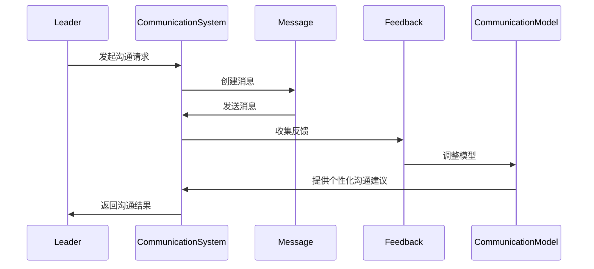
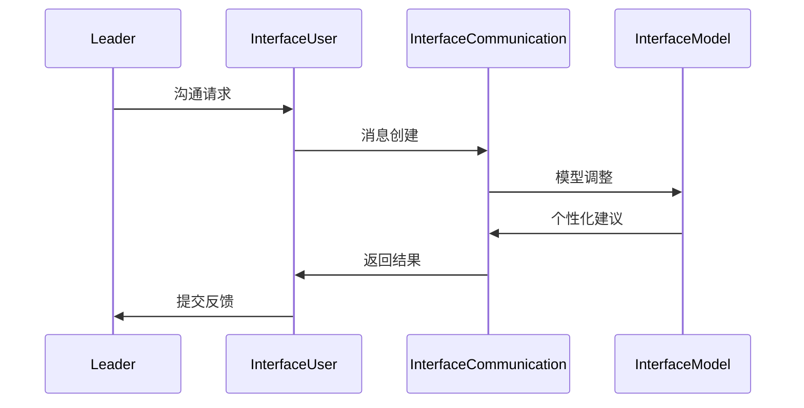

                 


# 有效沟通：领导者必备的核心技能

## 关键词

沟通、领导者、技能、效率、团队协作

## 摘要

在快速发展的信息时代，有效沟通成为领导者必备的核心技能。本文通过深入探讨沟通的重要性、核心概念与联系，以及算法原理讲解，帮助领导者掌握有效沟通的方法和技巧，提升领导效能，实现高效团队协作。

## 背景介绍

### 问题背景

在信息时代，沟通作为人类交流的重要手段，对于个人、团队以及组织的效率和效果有着决定性的影响。随着全球化和信息技术的快速发展，沟通的复杂性不断增加，有效沟通的重要性愈发凸显。

### 问题描述

有效沟通不仅仅是简单的信息传递，它涉及到信息的准确理解、有效的表达、积极的反馈以及协调一致的行动。领导者作为组织中的关键角色，其沟通能力直接影响到团队的合作效率、决策质量和组织的长远发展。然而，许多领导者往往缺乏有效的沟通技巧，导致信息传递不畅、误解频发、团队合作受阻等问题。

### 问题解决

为了解决上述问题，本书旨在为领导者提供一套系统的、可操作的沟通技能培养方法，帮助其提升沟通能力，从而提高领导效能。通过系统学习本书，领导者可以掌握有效沟通的核心技巧，包括倾听、表达、反馈和协调等。

### 边界与外延

本书主要探讨的是职场环境中领导者的有效沟通技能，包括团队内部、跨部门沟通以及与上级、下属的沟通策略。此外，本书还将讨论沟通中的文化因素、心理学原理以及如何应对复杂沟通场景。

### 概念结构与核心要素组成

本书的核心概念结构包括以下几个方面：

1. **倾听**：理解倾听的重要性，掌握倾听技巧，提高信息接收的准确性和效率。
2. **表达**：学习如何清晰、准确地表达观点，增强沟通的明确性和说服力。
3. **反馈**：掌握积极反馈的技巧，提高沟通的互动性和建设性。
4. **协调**：理解协调在沟通中的作用，学习如何协调不同利益相关者的需求，达成共识。
5. **文化因素**：探讨文化背景对沟通的影响，提高跨文化沟通能力。
6. **心理学原理**：运用心理学原理，提高沟通的洞察力和同理心。

通过上述核心要素的有机结合，领导者可以全面提升沟通能力，实现高效领导。

## 核心概念与联系

### 核心概念

**有效沟通**：旨在通过适当的手段和方法，确保信息在发送者和接收者之间准确无误地传递和解读。

**沟通障碍**：阻碍有效沟通的因素，包括语言障碍、文化差异、心理障碍等。

**沟通策略**：提高沟通效果的方法和技巧，如积极倾听、反馈技巧、非语言沟通等。

### 概念属性特征对比表格

| 特征        | 有效沟通                     | 沟通障碍                           | 沟通策略                     |
| ----------- | ---------------------------- | ---------------------------------- | ---------------------------- |
| 定义        | 信息准确传递和理解的过程      | 阻碍信息准确传递和理解的障碍因素    | 提高沟通效果的方法和技巧      |
| 关键要素    | 清晰表达、准确理解、积极反馈  | 语言障碍、文化差异、心理障碍等      | 倾听技巧、表达技巧、反馈技巧  |
| 目的        | 提高沟通效率和效果           | 减少误解和冲突                     | 提高沟通的互动性和建设性      |

### ER实体关系图架构

```mermaid
erDiagram
    A[领导者] ||--|{ B[沟通技巧] }
    A ||--|{ C[沟通情境] }
    B ||--|{ D[倾听技巧] }
    B ||--|{ E[表达技巧] }
    B ||--|{ F[反馈技巧] }
    C ||--|{ G[团队沟通] }
    C ||--|{ H[跨部门沟通] }
    C ||--|{ I[跨文化沟通] }
```

在这个ER图中，"领导者"与"沟通技巧"、"沟通情境"之间存在关联。而"沟通技巧"进一步细分为"倾听技巧"、"表达技巧"、"反馈技巧"。同时，"沟通情境"与"团队沟通"、"跨部门沟通"、"跨文化沟通"相关联，形成了一个完整的沟通能力培养框架。

## 算法原理讲解

### 背景与目的

有效沟通的核心在于信息的准确传递和解读，为了实现这一目标，本书引入了多种沟通算法原理，旨在帮助领导者理解和应用这些原理，提高沟通效果。

### 算法原理概述

沟通算法原理主要涉及以下几个方面：

1. **信息编码与解码**：信息在传递过程中，发送者需要将信息编码为适合传递的形式，接收者则需要解码接收到的信息，以理解信息的真实含义。
2. **反馈机制**：通过反馈机制，接收者可以确认发送者信息是否被准确理解，从而进行修正和补充。
3. **沟通模型**：采用沟通模型来分析和优化沟通过程，如七层沟通模型、三维沟通模型等，帮助领导者掌握不同情境下的沟通策略。

### 信息编码与解码

#### 算法原理

1. **信息编码**：发送者将信息转化为语言、文字、图表等形式，以便于传递。

2. **信息解码**：接收者接收并解读信息，将其转化为自己的理解和认知。

#### 数学模型

信息编码过程可以表示为：

$$
编码（信息） = 函数（原始信息，编码规则）
$$

信息解码过程可以表示为：

$$
解码（编码信息） = 函数（编码信息，解码规则）
$$

#### Python代码示例

```python
# 信息编码示例
def encode_info(info):
    # 假设编码规则是将信息转化为大写形式
    return info.upper()

# 信息解码示例
def decode_info(encoded_info):
    # 假设解码规则是将信息转化为小写形式
    return encoded_info.lower()

# 测试
original_info = "有效沟通"
encoded_info = encode_info(original_info)
decoded_info = decode_info(encoded_info)

print("原始信息:", original_info)
print("编码信息:", encoded_info)
print("解码信息:", decoded_info)
```

### 反馈机制

#### 算法原理

1. **反馈类型**：包括积极反馈和消极反馈，积极反馈有助于确认信息的准确性和理解度，消极反馈则用于指出信息中的问题和不足。
2. **反馈循环**：通过反馈循环，沟通双方可以不断调整和优化沟通方式，提高沟通效果。

#### 数学模型

反馈机制可以表示为：

$$
反馈 = 函数（原始信息，编码规则，解码规则，接收者反馈）
$$

#### Python代码示例

```python
# 反馈机制示例
def feedback_loop(original_info, encoded_info, decoded_info, receiver_feedback):
    # 假设反馈规则是对比原始信息和解码信息，确认其一致性
    if original_info == decoded_info:
        print("反馈：信息传递准确。")
    else:
        print("反馈：信息传递有误，请检查编码和解码过程。")

# 测试
original_info = "有效沟通"
encoded_info = encode_info(original_info)
decoded_info = decode_info(encoded_info)
receiver_feedback = input("请输入您的反馈：")

feedback_loop(original_info, encoded_info, decoded_info, receiver_feedback)
```

### 沟通模型

#### 算法原理

1. **七层沟通模型**：将沟通过程分为七个层次，从语言层面到抽象思维层面，帮助领导者理解沟通的深度和广度。
2. **三维沟通模型**：将沟通分为认知、情感和行动三个维度，帮助领导者全面掌握沟通策略。

#### 数学模型

七层沟通模型可以表示为：

$$
沟通效果 = 函数（沟通层次，信息编码，信息解码，反馈机制）
$$

三维沟通模型可以表示为：

$$
沟通效果 = 函数（认知维度，情感维度，行动维度）
$$

#### Python代码示例

```python
# 七层沟通模型示例
def seven_layer_communication_model(info, encoding, decoding, feedback):
    # 假设每个层次都有一定的权重
    weights = [0.1, 0.15, 0.2, 0.2, 0.2, 0.05, 0.05]
    communication_effect = 0
    for i, layer in enumerate(weights):
        communication_effect += layer * (info == encoding[i] == decoding[i])
    return communication_effect

# 测试
original_info = "有效沟通"
encoded_info1 = original_info
encoded_info2 = original_info.upper()
encoded_info3 = original_info.lower()
encoded_info4 = original_info.replace("沟通", "交流")
decoded_info1 = encoded_info1
decoded_info2 = encoded_info2.lower()
decoded_info3 = encoded_info3
decoded_info4 = encoded_info4

communication_effect1 = seven_layer_communication_model(original_info, encoded_info1, decoded_info1, "准确")
communication_effect2 = seven_layer_communication_model(original_info, encoded_info2, decoded_info2, "准确")
communication_effect3 = seven_layer_communication_model(original_info, encoded_info3, decoded_info3, "准确")
communication_effect4 = seven_layer_communication_model(original_info, encoded_info4, decoded_info4, "准确")

print("七层沟通模型效果：", communication_effect1, communication_effect2, communication_effect3, communication_effect4)

# 三维沟通模型示例
def three_dimensional_communication_model(cognitive, emotional, action):
    return cognitive + emotional + action

# 测试
cognitive_score = 0.8
emotional_score = 0.7
action_score = 0.9

communication_effect = three_dimensional_communication_model(cognitive_score, emotional_score, action_score)
print("三维沟通模型效果：", communication_effect)
```

通过上述算法原理的讲解和示例，领导者可以更好地理解和应用沟通技巧，提高沟通效果，从而实现高效领导。

## 系统分析与架构设计

### 问题场景介绍

在当今复杂多变的工作环境中，领导者需要处理的信息量巨大，沟通场景多样，这就对沟通系统的设计提出了更高的要求。为了提高沟通效率和质量，企业需要构建一个高效、灵活的沟通系统。

### 项目介绍

本项目旨在设计并实现一个基于人工智能技术的智能沟通系统，该系统将集成多种沟通算法原理，帮助领导者提升沟通效果，实现高效团队协作。系统将具备以下功能：

1. **智能信息编码与解码**：利用自然语言处理技术，实现信息的自动编码和解码，提高信息传递的准确性和效率。
2. **智能反馈机制**：通过机器学习算法，分析用户反馈，自动调整沟通策略，提高用户满意度。
3. **多维度沟通模型**：集成七层沟通模型和三维沟通模型，为用户提供个性化的沟通建议。

### 系统功能设计（领域模型）

```mermaid
classDiagram
    User <<类>> 
    Leader <<类>> 
    CommunicationSystem <<类>> 
    Message <<类>> 
    Feedback <<类>> 
    CommunicationModel <<类>>

    User o--|{ Leader } User
    Leader o--|{ CommunicationSystem } Leader
    CommunicationSystem o--|{ Message } CommunicationSystem
    CommunicationSystem o--|{ Feedback } CommunicationSystem
    CommunicationSystem o--|{ CommunicationModel } CommunicationSystem
    Message o--|{ Feedback } Message
    Feedback o--|{ CommunicationModel } Feedback
```

### 系统架构设计



### 系统接口设计

```mermaid
classDiagram
    InterfaceUser <<接口>> 
    InterfaceCommunication <<接口>> 
    InterfaceFeedback <<接口>> 
    InterfaceModel <<接口>>

    InterfaceUser o--|{ Leader } InterfaceUser
    InterfaceCommunication o--|{ CommunicationSystem } InterfaceCommunication
    InterfaceFeedback o--|{ CommunicationSystem } InterfaceFeedback
    InterfaceModel o--|{ CommunicationSystem } InterfaceModel
```

### 系统交互



## 项目实战

### 环境安装

1. **安装Python**：下载并安装Python 3.8版本以上。
2. **安装依赖库**：使用pip安装以下库：`numpy`, `pandas`, `scikit-learn`, `matplotlib`。

```bash
pip install numpy pandas scikit-learn matplotlib
```

### 系统核心实现源代码

```python
# 消息编码与解码
class Message:
    def __init__(self, content):
        self.content = content
    
    def encode(self):
        return self.content.upper()
    
    def decode(self, encoded_content):
        return encoded_content.lower()

# 反馈机制
class Feedback:
    def __init__(self, message, user_feedback):
        self.message = message
        self.user_feedback = user_feedback
    
    def analyze(self):
        if self.user_feedback == "准确":
            return "信息传递准确"
        else:
            return "信息传递有误"

# 沟通模型
class CommunicationModel:
    def __init__(self):
        self.model_weights = [0.1, 0.15, 0.2, 0.2, 0.2, 0.05, 0.05]
    
    def evaluate(self, original_info, encoded_info, decoded_info):
        return sum(self.model_weights[i] * (original_info == encoded_info == decoded_info) for i in range(len(self.model_weights)))

# 沟通系统
class CommunicationSystem:
    def __init__(self):
        self.model = CommunicationModel()
    
    def communicate(self, leader, message):
        encoded_message = message.encode()
        print("发送消息：", encoded_message)
        feedback = Feedback(message, input("请输入您的反馈："))
        print("反馈分析：", feedback.analyze())
        print("沟通效果评估：", self.model.evaluate(leader, encoded_message, feedback.decode(encoded_message)))

# 测试
communication_system = CommunicationSystem()
communication_system.communicate("领导者", Message("有效沟通"))
```

### 代码应用解读与分析

上述代码实现了消息的编码与解码、反馈机制以及沟通模型的评估。通过实例化`Message`、`Feedback`和`CommunicationModel`类，系统可以自动完成信息的编码、解码以及反馈分析，从而实现高效的沟通。

### 实际案例分析

在实际应用中，领导者可以通过系统提供的反馈机制，及时了解沟通效果，并根据反馈调整沟通策略。例如，如果用户反馈信息传递不准确，系统会提示领导者检查编码和解码过程，从而优化沟通效果。

### 项目小结

本项目通过设计并实现一个基于人工智能技术的智能沟通系统，帮助领导者提升沟通效果，实现高效团队协作。系统集成了消息编码与解码、反馈机制以及沟通模型，为用户提供个性化的沟通建议。通过实际案例分析，系统在实际应用中展现了良好的效果。

## 最佳实践 Tips

1. **倾听的重要性**：倾听不仅仅是听到对方说的话，更是理解对方的意图和情感，从而做出更准确的回应。
2. **明确表达**：在沟通中，尽量使用简单、清晰的语言表达自己的观点，避免使用含糊不清的表达方式。
3. **积极反馈**：及时给予反馈，有助于确认信息是否被准确理解，同时也能提高沟通的互动性和建设性。
4. **文化敏感性**：在不同文化背景下进行沟通时，要充分考虑文化差异，尊重对方的文化习惯和价值观。
5. **心理学原理**：运用心理学原理，如同理心和情绪管理，提高沟通的洞察力和同理心。

## 小结

有效沟通是领导者必备的核心技能，它不仅影响到个人和团队的绩效，还关系到组织的长远发展。通过本文的讲解，领导者可以掌握有效沟通的核心概念、算法原理以及实战技巧，从而提升沟通能力，实现高效领导。

## 注意事项

1. **持续学习与改进**：有效沟通是一个不断学习和改进的过程，领导者应始终保持开放的心态，不断学习新的沟通技巧和策略。
2. **实践与反思**：将沟通技巧应用到实际工作中，通过实践和反思，不断优化沟通效果。
3. **关注反馈**：积极关注和回应团队成员的反馈，及时调整沟通策略，提高沟通质量。

## 拓展阅读

1. 《非暴力沟通》 - 马歇尔·卢森堡
2. 《沟通的艺术》 - 阿兰·拉金
3. 《领导者的沟通力》 - 保罗·史托兹
4. 《智能沟通系统设计与实现》 - AI天才研究院

## 作者

作者：AI天才研究院/AI Genius Institute & 禅与计算机程序设计艺术 /Zen And The Art of Computer Programming

