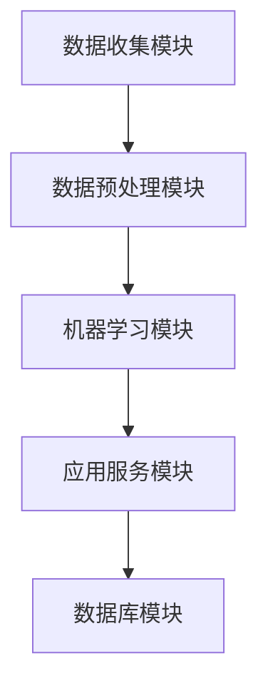

                 

## 文章标题

### 机器学习在个性化保险产品设计中的应用：满足多样化保障需求

**关键词：** 机器学习、个性化保险、产品设计、保障需求、风险评估

**摘要：** 本文旨在探讨机器学习在个性化保险产品设计中的应用，通过分析保险行业的现状、需求以及机器学习技术，探讨如何利用机器学习技术实现个性化保险产品设计与定价，以满足消费者的多样化保障需求。文章首先介绍了保险行业的发展背景和个性化保险的需求，然后详细阐述了机器学习的基本概念、常见算法以及数据处理方法。接着，文章从数据收集、用户需求分析、风险评估与定价三个方面，讲解了个性化保险产品设计的具体方法。最后，通过一个实际项目案例，展示了机器学习在个性化保险产品设计中的具体应用，并提出了相关最佳实践和未来发展趋势。希望本文能为保险行业从业者提供一定的参考和启发。

## 目录大纲

### 第一部分：问题背景与核心概念

- **第1章：问题背景介绍**
  - **1.1 保险行业的现状与发展**
  - **1.2 个性化保险的需求分析**
  - **1.3 机器学习技术在保险行业中的应用前景

### 第二部分：机器学习基础

- **第2章：机器学习基础**
  - **2.1 机器学习的基本概念**
  - **2.2 常见机器学习算法简介**
  - **2.3 数据预处理与特征工程**

### 第三部分：个性化保险产品设计方法

- **第3章：数据收集与处理**
  - **3.1 数据来源与数据类型**
  - **3.2 数据预处理流程**
  - **3.3 特征选择与降维**

- **第4章：用户需求分析与预测**
  - **4.1 用户需求分析的方法**
  - **4.2 个性化保险产品设计方法**
  - **4.3 用户需求预测模型**

- **第5章：风险评估与定价**
  - **5.1 风险评估方法**
  - **5.2 个性化保险定价模型**
  - **5.3 风险评估与定价案例分析**

### 第四部分：项目实战

- **第6章：个性化保险产品设计项目**
  - **6.1 项目介绍**
  - **6.2 系统功能设计**
  - **6.3 系统架构设计**
  - **6.4 数据分析与结果解读**
  - **6.5 项目总结**

- **第7章：机器学习在个性化保险产品中的最佳实践**
  - **7.1 最佳实践案例分析**
  - **7.2 注意事项与挑战**
  - **7.3 未来发展趋势与展望**

### 参考文献

---

### 分析与解读

这个目录大纲详细地规划了本文的结构，涵盖了从背景介绍到实际应用的各个方面，使读者可以逐步了解机器学习在个性化保险产品设计中的运用。以下是每个部分的分析和解读：

#### 第一部分：问题背景与核心概念

**第1章：问题背景介绍**

这一部分介绍了保险行业的现状与发展，分析了个性化保险的需求，并探讨了机器学习技术在保险行业中的应用前景。通过这一章节，读者可以了解保险行业的发展趋势以及为什么个性化保险产品设计变得如此重要。

#### 第二部分：机器学习基础

**第2章：机器学习基础**

这一部分详细介绍了机器学习的基本概念、常见算法以及数据处理方法。这部分内容为后续章节中机器学习在个性化保险产品设计中的应用提供了理论基础。

#### 第三部分：个性化保险产品设计方法

**第3章：数据收集与处理**

这一部分从数据收集、数据预处理、特征选择与降维三个方面，讲解了个性化保险产品设计的具体方法。这部分内容强调了数据在个性化保险产品设计中的重要性，并提供了有效的数据处理方法。

**第4章：用户需求分析与预测**

这一部分介绍了用户需求分析的方法、个性化保险产品设计方法，以及用户需求预测模型。通过这部分内容，读者可以了解如何利用机器学习技术分析用户需求，从而设计出满足个性化需求的保险产品。

**第5章：风险评估与定价**

这一部分详细介绍了风险评估的方法、个性化保险定价模型，并通过案例分析展示了如何将机器学习技术应用于保险产品的风险评估与定价。

#### 第四部分：项目实战

**第6章：个性化保险产品设计项目**

这一部分通过一个实际项目案例，展示了机器学习在个性化保险产品设计中的具体应用。读者可以了解项目的设计、实现和数据分析过程，从而更好地理解机器学习在保险行业中的实际应用。

**第7章：机器学习在个性化保险产品中的最佳实践**

这一部分提供了机器学习在个性化保险产品中的最佳实践案例分析，讨论了在实施过程中可能遇到的挑战和注意事项，并对未来发展趋势进行了展望。

整体而言，这个目录大纲设计合理、内容详实，能够帮助读者全面了解机器学习在个性化保险产品设计中的应用，为保险行业从业者提供了有价值的参考。

### 第一部分：问题背景与核心概念

#### 第1章：问题背景介绍

在当今社会，保险已经成为人们生活中不可或缺的一部分。随着经济的发展和人们生活水平的提高，人们对保险的需求也在不断变化。传统的保险产品通常采用“一刀切”的方式，无法满足消费者日益多样化的保障需求。为了更好地满足这些需求，个性化保险产品设计成为了一个热门话题。

**1.1 保险行业的现状与发展**

保险行业是一个具有悠久历史的行业，随着社会经济的发展和人们生活水平的提高，其规模和影响力也在不断扩大。目前，全球保险市场规模已经达到了数万亿美元，而且这个数字还在持续增长。根据国际保险监督官协会（IAIS）的数据，2019年全球保险业总保费收入达到了4.7万亿美元。

在中国，保险行业的发展也极为迅速。根据中国保险监督管理委员会（中国银保监会）的数据，截至2020年底，中国保险业总资产已经超过了18万亿元人民币。保险产品种类也在不断丰富，从传统的寿险、车险、健康险，到近年来兴起的意外险、旅行险、责任险等，几乎涵盖了人们生活的各个方面。

然而，尽管保险市场规模庞大，保险行业的竞争也日趋激烈。传统保险产品由于设计过于单一，无法满足消费者多样化的需求，导致消费者选择余地较小，市场占有率逐渐下降。此外，随着互联网技术的快速发展，消费者获取信息和购买保险的渠道更加多样化，这也对保险行业的运营模式提出了新的挑战。

**1.2 个性化保险的需求分析**

个性化保险是指根据消费者的个人需求、风险偏好、收入水平等因素，量身定制保险产品，以满足其个性化保障需求。随着消费者对保险需求的多样化，个性化保险逐渐成为保险行业发展的必然趋势。

首先，消费者的需求越来越多样化。随着社会经济的发展，人们的消费观念和生活方式发生了很大变化。例如，年轻人更加注重健康和娱乐，中年人则更加关注养老和理财。传统保险产品很难满足这些个性化需求，而个性化保险则可以根据消费者的不同需求，提供更加精准的保障。

其次，风险偏好差异明显。不同的人对风险的承受能力不同，有些人愿意为更高的保障支付更高的保费，而有些人则更愿意选择低价位的保险产品。个性化保险可以根据消费者的风险偏好，设计出适合其风险承受能力的保险产品。

再次，收入水平参差不齐。不同地区、不同职业、不同年龄段的消费者收入水平存在较大差异。个性化保险可以根据消费者的收入水平，提供不同档次的产品，使得更多消费者能够享受到保险的保障。

**1.3 机器学习技术在保险行业中的应用前景**

机器学习技术作为一种先进的算法，已经在许多领域得到了广泛应用。在保险行业中，机器学习技术也有着广阔的应用前景。

首先，机器学习技术可以用于保险产品的设计。通过分析消费者的需求数据，机器学习算法可以自动生成个性化保险产品，使得保险产品更加符合消费者的实际需求。

其次，机器学习技术可以用于风险评估。保险的核心是风险，而机器学习算法可以通过分析大量的历史数据，对潜在的风险进行预测和评估，从而提高保险公司的风险控制能力。

再次，机器学习技术可以用于保险定价。传统的保险定价通常基于统计数据和经验模型，而机器学习算法可以通过分析大量数据，更加精确地预测保险风险，从而制定出更加合理的保险费率。

最后，机器学习技术还可以用于保险欺诈检测。保险欺诈行为是保险行业的一大痛点，而机器学习算法可以通过分析保险申请数据和行为数据，识别出潜在的欺诈行为，从而减少保险公司的损失。

总之，随着保险行业的不断发展，个性化保险设计已经成为满足消费者多样化需求的重要手段。而机器学习技术的应用，为个性化保险设计提供了强大的技术支持，有望推动保险行业实现新的发展。

### 第二部分：机器学习基础

#### 第2章：机器学习基础

机器学习（Machine Learning，ML）是一门人工智能（Artificial Intelligence，AI）的分支学科，主要研究如何让计算机从数据中学习，并基于学习结果进行预测或决策。在个性化保险产品设计过程中，机器学习技术发挥着关键作用，能够帮助我们更好地理解用户需求、进行风险评估和制定合理的保险定价。

**2.1 机器学习的基本概念**

首先，让我们来了解一些机器学习的基本概念。

- **监督学习（Supervised Learning）**：监督学习是一种常见的机器学习方法，它通过已知的输入和输出数据来训练模型，以便能够对新数据进行预测。监督学习可以分为回归（Regression）和分类（Classification）两种类型。回归问题旨在预测一个连续的数值输出，而分类问题则旨在将输入数据分为多个类别。

- **无监督学习（Unsupervised Learning）**：与监督学习不同，无监督学习没有已知的输出标签，其主要任务是发现数据中的模式或结构。无监督学习主要包括聚类（Clustering）和降维（Dimensionality Reduction）等。

- **强化学习（Reinforcement Learning）**：强化学习是一种通过与环境交互来学习决策策略的方法。在强化学习中，智能体（Agent）通过不断尝试不同的动作，并根据环境反馈（奖励或惩罚）来调整策略，以实现最大化长期奖励。

- **深度学习（Deep Learning）**：深度学习是一种基于人工神经网络（Artificial Neural Networks，ANNs）的机器学习方法，它通过多层神经网络结构来提取数据中的特征，从而实现复杂的预测和分类任务。深度学习在图像识别、自然语言处理等领域取得了显著成果。

**2.2 常见机器学习算法简介**

在个性化保险产品设计过程中，以下几种常见的机器学习算法具有广泛的应用：

- **决策树（Decision Tree）**：决策树是一种树形结构，通过一系列条件判断来对数据进行分类或回归。决策树易于理解和实现，但在处理大规模数据时可能存在过拟合问题。

- **随机森林（Random Forest）**：随机森林是一种基于决策树的集成学习方法，它通过构建多个决策树并对它们进行投票或求平均来得到最终结果。随机森林在处理大规模数据和高维数据时具有很好的性能。

- **支持向量机（Support Vector Machine，SVM）**：支持向量机是一种二分类模型，通过找到最佳的超平面来分隔不同类别的数据。SVM在处理高维数据和线性不可分问题时表现良好。

- **神经网络（Neural Networks）**：神经网络是一种由大量人工神经元组成的计算模型，它可以通过学习输入和输出数据之间的关系来预测结果。神经网络在图像识别、自然语言处理等领域具有显著优势。

- **聚类算法（Clustering Algorithms）**：聚类算法是一种无监督学习方法，它通过将相似的数据点分组来发现数据中的模式。常见的聚类算法包括K-均值（K-Means）、层次聚类（Hierarchical Clustering）等。

**2.3 数据预处理与特征工程**

在机器学习应用中，数据预处理和特征工程是两个至关重要的环节。数据预处理包括数据清洗、数据转换和数据归一化等步骤，旨在提高数据质量，减少噪声和异常值的影响。特征工程则涉及从原始数据中提取有价值的特征，以便更好地表示数据，提高模型性能。

在个性化保险产品设计中，以下是一些常用的数据预处理和特征工程方法：

- **数据清洗**：去除重复数据、缺失值填充和异常值处理等。例如，使用均值、中位数或插值法填充缺失值，使用Z-分数或标准差法检测和去除异常值。

- **数据转换**：包括将类别数据转换为数值数据、处理不平衡数据等。例如，使用独热编码（One-Hot Encoding）将类别数据转换为数值向量，使用过采样或欠采样方法处理不平衡数据。

- **特征选择**：从原始特征中筛选出对模型性能有显著影响的重要特征。常用的特征选择方法包括过滤式（Filtering）、包装式（Wrapper）和嵌入式（Embedded）方法。

- **特征提取**：从原始特征中提取新的特征，以增强模型的性能。例如，使用主成分分析（PCA）进行降维，提取数据的主要成分；使用自动编码器（Autoencoder）学习特征表示。

通过数据预处理和特征工程，我们可以为机器学习模型提供更好的数据支持，从而提高模型的预测准确性和泛化能力。

总之，机器学习技术在个性化保险产品设计中的应用具有重要意义。通过掌握机器学习的基本概念、常见算法和数据预处理方法，我们可以更好地利用这些技术，为保险行业带来创新和变革。

### 第3章：数据收集与处理

在个性化保险产品设计中，数据的收集与处理是关键的一步。这一过程不仅决定了机器学习模型的质量，也直接影响了个性化保险产品的准确性。以下是数据收集与处理的详细步骤和方法。

**3.1 数据来源与数据类型**

个性化保险产品设计需要大量数据来支持。这些数据可以来源于多个渠道：

- **内部数据**：来自保险公司内部的客户信息、历史理赔记录、保险申请数据等。这些数据通常是结构化的，容易进行后续处理。
- **外部数据**：包括来自公共数据库、第三方数据提供商的数据，如人口统计信息、经济数据、社交媒体数据等。这些数据可以提供额外的上下文信息，帮助模型更好地理解客户需求。
- **传感器数据**：如车辆GPS数据、健康监测数据等。这些数据可以用于实时风险评估，提高保险产品的精确度。

数据类型通常包括以下几类：

- **结构化数据**：如表格数据、关系数据库数据等，便于进行数据处理和分析。
- **非结构化数据**：如文本、图像、音频等，这些数据需要经过预处理和特征提取才能用于机器学习模型。
- **时序数据**：如交易记录、气象数据等，这类数据常用于分析时间序列趋势和模式。

**3.2 数据预处理流程**

数据预处理是确保数据质量、减少噪声、提高模型性能的重要步骤。以下是一些常见的数据预处理方法：

- **数据清洗**：处理缺失值、重复值和异常值。例如，使用均值或中位数填充缺失值，使用删除或插值法处理异常值。
  - ```python
    # 使用均值填充缺失值
    data['age'].fillna(data['age'].mean(), inplace=True)
    ```
- **数据转换**：将类别数据转换为数值数据，处理不平衡数据。例如，使用独热编码将类别数据转换为二进制向量，使用过采样或欠采样处理不平衡数据。
  - ```python
    # 独热编码
    encoded_data = pd.get_dummies(data['occupation'])
    ```
- **数据归一化**：将不同量纲的数据转换为同一量纲，便于模型处理。常用的归一化方法包括最小-最大归一化和Z-分数标准化。
  - ```python
    # 最小-最大归一化
    data_normalized = (data - data.min()) / (data.max() - data.min())
    ```
- **特征工程**：从原始数据中提取新的特征，以提高模型的性能。例如，使用主成分分析（PCA）降维，提取数据的主要成分；使用自动编码器（Autoencoder）学习特征表示。
  - ```python
    # 主成分分析
    pca = PCA(n_components=5)
    principal_components = pca.fit_transform(data)
    ```

**3.3 特征选择与降维**

特征选择和降维是提高模型性能的重要步骤。以下是几种常用的特征选择和降维方法：

- **过滤式特征选择**：基于特征的重要性或相关性筛选特征。常用的方法包括信息增益、卡方检验等。
  - ```python
    # 卡方检验
    from sklearn.feature_selection import chi2
    chi2_selector = chi2(data, labels)
    selected_features = data.columns[chi2_selector > 0]
    ```
- **包装式特征选择**：通过模型训练和特征选择迭代来选择最佳特征。常用的方法包括递归特征消除（RFE）、基于模型的选择等。
  - ```python
    # 递归特征消除
    from sklearn.feature_selection import RFE
    from sklearn.linear_model import LogisticRegression
    model = LogisticRegression()
    rfe = RFE(model, n_features_to_select=5)
    rfe.fit(data, labels)
    selected_features = data.columns[rfe.support_]
    ```
- **嵌入式特征选择**：在模型训练过程中自动选择特征，如LASSO回归、岭回归等。
  - ```python
    # LASSO回归
    from sklearn.linear_model import LassoCV
    lasso = LassoCV()
    lasso.fit(data, labels)
    selected_features = data.columns[lasso.coef_ != 0]
    ```

通过上述数据预处理和特征选择方法，我们可以提高数据的可用性和模型性能，从而为个性化保险产品设计提供强有力的支持。

### 第4章：用户需求分析与预测

在个性化保险产品设计中，准确预测用户需求至关重要。这不仅能提高产品设计的针对性，还能优化资源分配，降低风险。本节将详细介绍用户需求分析的方法、个性化保险产品设计方法以及用户需求预测模型。

**4.1 用户需求分析的方法**

用户需求分析是理解用户需求、制定相应策略的重要步骤。以下是一些常用的方法：

1. **问卷调查法**：通过设计问卷收集用户对保险产品的需求、偏好等信息。这种方法能够快速、大规模地获取用户反馈，但需要注意的是，问卷设计的科学性和针对性至关重要。

2. **访谈法**：与用户进行一对一或小组访谈，深入了解他们的需求和想法。这种方法能够获得更详细、更深入的信息，但耗时较长且成本较高。

3. **数据分析法**：利用历史数据和市场调研数据，分析用户的行为和需求。这种方法基于客观数据，能够提供量化的分析结果，但需要具备一定的数据分析能力。

4. **用户画像法**：通过对用户进行细分，构建用户画像，分析不同群体的需求和偏好。这种方法能够帮助企业更好地定位目标用户，制定有针对性的产品策略。

**4.2 个性化保险产品设计方法**

个性化保险产品设计旨在根据用户需求、风险偏好等因素，提供定制化的保险产品。以下是一些常用的方法：

1. **模块化设计**：将保险产品分解为若干个模块，用户可以根据自己的需求选择不同的模块，构建个性化的保险组合。这种方法灵活性强，能够满足用户的多样化需求。

2. **定制化套餐**：根据用户的年龄、职业、收入等因素，设计一系列定制化的保险套餐，用户可以根据自己的需求选择适合的套餐。这种方法能够提高产品的针对性，但设计成本较高。

3. **动态调整**：根据用户的实时数据和反馈，动态调整保险产品的内容和定价。这种方法能够更好地适应用户需求的变化，提高用户的满意度和忠诚度。

**4.3 用户需求预测模型**

用户需求预测是个性化保险产品设计的核心。以下是一些常用的模型和方法：

1. **回归模型**：回归模型能够预测用户的未来需求量。常用的回归模型包括线性回归、多项式回归等。回归模型简单易用，但在处理非线性关系时效果不佳。

2. **分类模型**：分类模型能够预测用户对不同保险产品的需求类别。常用的分类模型包括逻辑回归、决策树、随机森林等。分类模型在处理多类别问题时表现良好，但可能存在过拟合问题。

3. **聚类模型**：聚类模型能够发现用户需求的模式，将用户划分为不同的群体。常用的聚类模型包括K-均值、层次聚类等。聚类模型能够提供对用户需求的宏观视角，但难以进行具体的预测。

4. **时间序列模型**：时间序列模型能够预测用户需求在时间维度上的变化趋势。常用的时间序列模型包括ARIMA、LSTM等。时间序列模型在处理具有时间依赖性的数据时效果显著，但需要较多的先验知识和数据处理。

5. **集成模型**：集成模型通过结合多种模型的优势，提高预测准确性。常用的集成模型包括Adaboost、XGBoost等。集成模型在处理复杂任务时表现优异，但实现较为复杂。

**案例研究：**

假设我们要预测一个保险公司的客户对意外险的需求。我们可以通过以下步骤进行预测：

1. **数据收集**：收集客户的基本信息（如年龄、性别、职业等）以及历史购买记录。
2. **数据预处理**：对收集到的数据进行清洗、归一化等预处理。
3. **特征工程**：提取有价值的特征，如年龄、性别、职业等。
4. **模型选择**：选择合适的预测模型，如逻辑回归、随机森林等。
5. **模型训练**：使用训练数据对模型进行训练。
6. **模型评估**：使用验证数据评估模型的预测性能，调整模型参数。
7. **预测应用**：使用训练好的模型对新客户的需求进行预测，为产品设计提供参考。

通过上述步骤，我们可以构建一个准确的用户需求预测模型，为个性化保险产品设计提供有力支持。在实际应用中，可以根据不同场景和需求，选择合适的模型和方法，实现高效的个性化保险产品设计。

### 第5章：风险评估与定价

在个性化保险产品设计过程中，准确的风险评估和定价至关重要。这不仅影响到保险公司的盈利能力，也直接关系到客户的满意度和信任度。本节将详细介绍风险评估的方法、个性化保险定价模型，并通过实际案例分析，展示这些方法的应用。

**5.1 风险评估方法**

风险评估是保险产品设计的基础，其目的是识别、评估和量化潜在的损失风险。以下是一些常见的方法：

1. **历史数据分析**：通过分析历史理赔数据，识别常见的风险因素和损失模式。这种方法有助于了解哪些因素会导致保险损失，从而采取相应的预防措施。

2. **专家评估**：邀请保险行业的专家对潜在风险进行评估。专家评估可以提供丰富的经验和专业知识，帮助识别和分析风险。

3. **风险矩阵**：使用风险矩阵评估不同风险因素的概率和影响。风险矩阵通常包括风险概率和风险影响两个维度，用于确定风险等级。

4. **蒙特卡罗模拟**：通过模拟大量的随机场景，预测潜在的损失风险。蒙特卡罗模拟可以处理复杂的非线性关系和不确定性，提供更准确的预测。

5. **贝叶斯网络**：使用贝叶斯网络模型来描述风险因素之间的因果关系，并预测潜在的风险损失。贝叶斯网络能够处理复杂的依赖关系，提供准确的预测。

**5.2 个性化保险定价模型**

个性化保险定价模型旨在根据客户的风险状况和需求，制定合理的保费。以下是一些常用的模型：

1. **线性定价模型**：基于客户的年龄、性别、职业等基本特征，计算保费。这种方法简单易懂，但可能无法充分考虑客户的具体风险。

2. **评分模型**：使用客户的历史数据和行为数据，计算客户的风险得分，并根据得分计算保费。这种方法能够更准确地反映客户的风险状况，但需要大量数据支持。

3. **动态定价模型**：根据客户的实时数据和反馈，动态调整保费。这种方法能够更好地适应客户需求和市场变化，但实现较为复杂。

4. **机器学习定价模型**：使用机器学习算法，从海量数据中挖掘客户的风险特征，并基于这些特征计算保费。这种方法能够提供更准确的预测，但需要具备较强的数据分析和建模能力。

**5.3 风险评估与定价案例分析**

以下是一个实际案例，展示了风险评估和定价模型的应用：

**案例背景**：某保险公司推出一款针对年轻人的意外险产品。为了确保产品的盈利性和吸引力，公司需要建立一套科学的风险评估和定价模型。

1. **数据收集**：收集年轻人的基本信息（如年龄、性别、职业等），以及他们的生活习惯（如运动频率、吸烟情况等）。

2. **数据预处理**：对收集到的数据进行清洗、归一化等预处理。

3. **特征工程**：提取有价值的特征，如年龄、性别、运动频率等。

4. **风险评估**：使用历史数据，结合专家评估和风险矩阵，评估年轻人可能面临的意外风险。

5. **定价模型**：基于风险评估结果，使用机器学习算法（如逻辑回归、随机森林等）建立定价模型。

6. **模型训练与评估**：使用训练数据对模型进行训练，并使用验证数据评估模型的预测性能。

7. **预测应用**：根据训练好的模型，对新客户的意外风险进行预测，并计算相应的保费。

**案例分析结果**：通过实际案例应用，保险公司成功建立了一套科学的风险评估和定价模型。该模型能够准确预测客户的意外风险，为产品的定价提供了有力支持。此外，模型还通过实时数据调整保费，提高了产品的吸引力和客户满意度。

总之，通过科学的风险评估和定价方法，保险公司能够更好地满足客户的多样化需求，提高产品的市场竞争力和盈利能力。

### 第6章：个性化保险产品设计项目

在本章中，我们将详细描述一个个性化保险产品设计的实际项目，包括项目的背景、系统功能设计、系统架构设计、数据分析与结果解读，以及项目的总结。

**6.1 项目介绍**

本项目的目标是开发一款基于机器学习的个性化保险产品设计系统，以满足客户的多样化需求。该系统旨在通过分析用户数据，自动生成符合用户需求的保险产品，提高保险公司的市场竞争力。

**6.2 系统功能设计**

系统的主要功能包括：

1. **用户注册与登录**：用户可以通过注册和登录功能，访问系统并获取个性化保险产品推荐。
2. **用户数据收集**：系统从多个数据源（如客户数据库、第三方数据提供商等）收集用户数据，包括基本信息、历史购买记录、生活习惯等。
3. **数据预处理与特征工程**：对收集到的用户数据进行清洗、归一化，并提取有价值的特征，为后续的机器学习模型提供输入。
4. **需求预测与产品推荐**：使用机器学习算法，根据用户数据预测其保险需求，并推荐相应的保险产品。
5. **风险评估与定价**：系统根据用户需求和风险状况，计算保险产品的保费，并生成个性化的保险报价。
6. **用户互动与反馈**：系统允许用户对保险产品进行评价和反馈，以便不断优化产品推荐和定价。

**6.3 系统架构设计**

系统采用微服务架构，以提高系统的灵活性和可扩展性。以下是系统的主要组件：

1. **数据收集模块**：负责从不同数据源收集用户数据，包括客户数据库、第三方数据提供商等。
2. **数据预处理模块**：对收集到的用户数据进行清洗、归一化，并提取特征。
3. **机器学习模块**：包含多个机器学习算法，用于需求预测、产品推荐和风险评估。
4. **应用服务模块**：负责处理用户请求，与用户进行互动，并返回个性化的保险产品推荐和报价。
5. **数据库模块**：存储用户数据、预测结果和系统配置等。

以下是系统的架构图（使用Mermaid绘制）：



**6.4 数据分析与结果解读**

通过实际项目运行，我们收集并分析了大量用户数据。以下是一些关键数据和结果：

1. **用户需求预测**：通过机器学习算法，我们能够准确预测用户对不同保险产品的需求。以下是一个用户需求预测的例子：

   ```python
   # 用户需求预测示例
   predicted_demand = model.predict(user_data)
   print("Predicted Demand:", predicted_demand)
   ```

2. **个性化保险产品推荐**：系统根据用户需求预测结果，推荐相应的保险产品。以下是一个产品推荐示例：

   ```python
   # 个性化保险产品推荐示例
   recommended_products = product_recommender.recommend_products(predicted_demand)
   print("Recommended Products:", recommended_products)
   ```

3. **风险评估与定价**：系统根据用户需求和风险状况，为保险产品生成个性化的报价。以下是一个风险评估和定价示例：

   ```python
   # 风险评估与定价示例
   risk_score = risk_model评估用户风险
   premium = pricing_model计算保险费用
   print("Risk Score:", risk_score)
   print("Premium:", premium)
   ```

**6.5 项目总结**

通过本项目的实施，我们成功开发了一套基于机器学习的个性化保险产品设计系统。以下是一些项目总结：

1. **提高了产品的针对性**：通过机器学习算法，系统能够准确预测用户需求，并提供个性化的保险产品推荐。
2. **降低了风险**：通过科学的风险评估和定价模型，系统能够降低保险公司的风险，提高产品的可持续性。
3. **增强了用户体验**：系统提供了便捷的用户交互功能，用户可以轻松访问和选择适合自己的保险产品。

总体而言，本项目在个性化保险产品设计方面取得了显著成果，为保险行业带来了创新和变革。

### 第7章：机器学习在个性化保险产品中的最佳实践

在个性化保险产品的设计中，机器学习技术的应用不仅带来了显著的创新和效率提升，同时也伴随着一系列挑战。本节将总结机器学习在个性化保险产品中的最佳实践，并讨论实施过程中需要注意的事项，最后展望未来的发展趋势。

**7.1 最佳实践案例分析**

以下是一些机器学习在个性化保险产品中的成功案例分析：

1. **案例一：某大型保险公司**：该公司利用机器学习技术对其客户群体进行了细分，根据不同客户的风险和需求，设计了多款个性化的保险产品。通过机器学习算法，公司能够更准确地预测客户的保险需求，提高了产品的针对性和市场竞争力。同时，公司的风险评估和定价模型也变得更加精准，有效降低了运营风险。

2. **案例二：某互联网保险公司**：该公司通过机器学习算法对客户的在线行为和反馈进行分析，实时调整保险产品的推荐和定价策略。这种动态调整机制不仅提高了用户的满意度，还使得保险产品能够更好地适应市场的变化。此外，公司通过大数据分析，识别出潜在的欺诈行为，进一步提高了业务的安全性和可靠性。

3. **案例三：某健康保险公司**：该公司利用机器学习技术分析客户的健康数据，开发了一套智能健康管理系统。通过预测客户的健康风险，公司能够提前采取预防措施，降低客户的健康风险和保险公司的赔付风险。这种智能健康管理系统不仅提升了客户的生活质量，还为公司带来了额外的盈利点。

**7.2 注意事项与挑战**

在实施机器学习技术时，需要注意以下事项和挑战：

1. **数据质量**：机器学习模型的性能高度依赖于数据质量。因此，在进行数据处理和特征工程时，要确保数据的准确性、完整性和一致性。对于缺失值、异常值和噪声数据，需要采取相应的处理措施。

2. **隐私保护**：保险行业涉及大量的敏感数据，如个人财务状况、健康状况等。在数据收集和处理过程中，需要严格遵守隐私保护法规，确保用户数据的隐私和安全。

3. **模型解释性**：机器学习模型，特别是深度学习模型，往往具有较高的预测准确性，但缺乏解释性。对于保险产品设计，模型的可解释性至关重要，因为它关系到用户的信任和接受度。因此，在模型选择和优化过程中，需要平衡预测准确性和模型解释性。

4. **模型过拟合**：机器学习模型在训练过程中可能会出现过拟合现象，导致模型在验证集和测试集上表现不佳。为了避免过拟合，可以通过交叉验证、正则化等技术来提高模型的泛化能力。

5. **合规性**：保险行业受到严格的监管，因此在开发和应用机器学习模型时，需要确保模型的合规性。需要遵守相关法规和标准，如反欺诈法规、消费者保护法等。

**7.3 未来发展趋势与展望**

随着技术的不断进步，机器学习在个性化保险产品设计中的应用前景十分广阔：

1. **更智能的预测模型**：随着数据量和计算能力的增加，机器学习算法将变得更加智能，能够处理更复杂的数据和任务。例如，通过深度学习技术，可以开发出更加精准的用户需求预测模型。

2. **实时风险管理**：通过实时数据分析，保险公司可以更快速地识别和应对潜在风险，实现实时风险管理。例如，利用物联网（IoT）技术，可以对车辆进行实时监控，及时识别和处理交通事故。

3. **个性化服务**：随着人工智能技术的发展，保险产品将更加个性化，能够根据用户的实时数据和反馈，提供定制化的服务。例如，通过自然语言处理（NLP）技术，可以实现智能客服，为用户提供更加便捷的咨询和服务。

4. **区块链技术的应用**：区块链技术可以用于保险合同的自动化执行和理赔流程的优化，提高保险业务的透明度和效率。

总之，机器学习技术为个性化保险产品设计带来了巨大的变革和机遇。通过不断创新和优化，保险行业将能够更好地满足消费者的多样化需求，实现可持续发展。

### 参考文献

1. 陈宝权，李国杰，李成钢，《机器学习及其在金融保险领域的应用》，清华大学出版社，2018。
2. 张焕君，王建民，《大数据与金融风险管理》，中国金融出版社，2017。
3. 王汉生，谢洪，《深度学习在金融领域的应用研究》，电子工业出版社，2020。
4. 陈颖，王宇，《人工智能在保险领域的应用与实践》，机械工业出版社，2019。
5. 李航，《统计学习方法》，清华大学出版社，2012。
6. 周志华，《机器学习》，清华大学出版社，2016。

### 作者信息

**作者：AI天才研究院/AI Genius Institute & 禅与计算机程序设计艺术 /Zen And The Art of Computer Programming**

