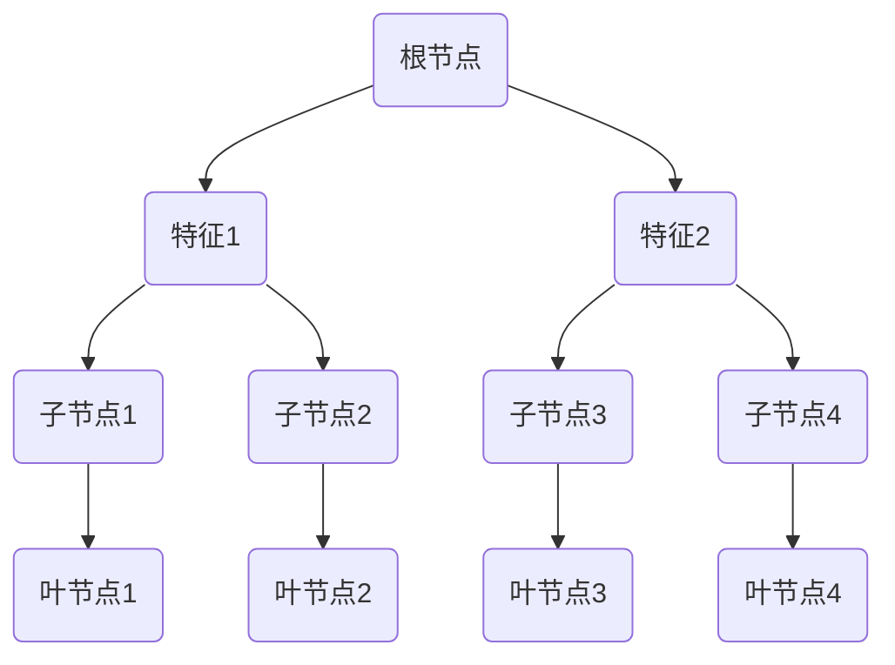
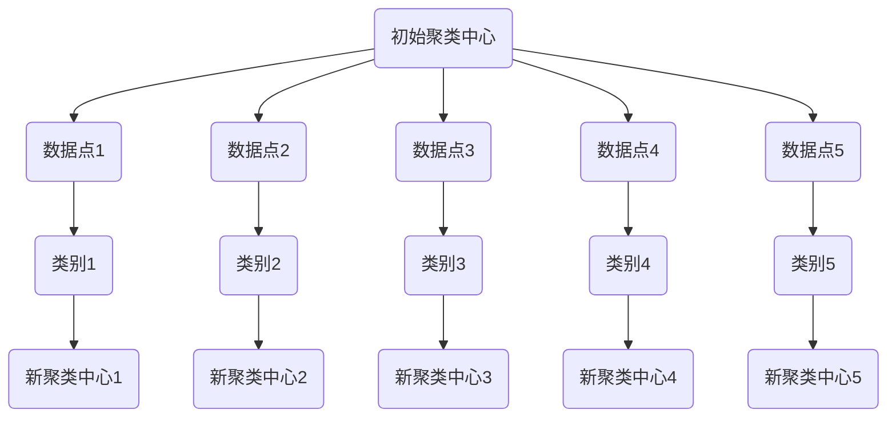
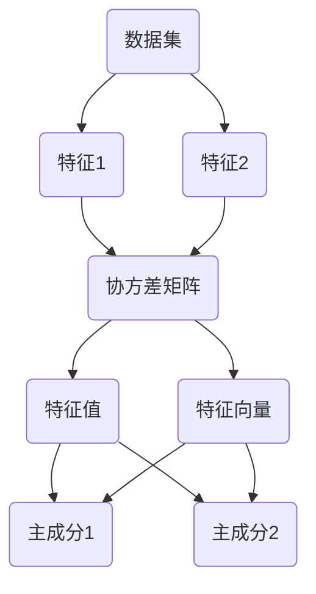

                 


## 摘要

本文深入探讨了机器学习在个性化保险产品设计中的应用，旨在满足多样化的保障需求。随着人工智能技术的不断进步，保险行业正逐渐引入机器学习技术，通过数据分析、模型训练和个性化推荐，实现保险产品的精准定价和定制化服务。本文首先介绍了保险行业的背景和存在的问题，然后详细阐述了机器学习的基本概念、数据处理与特征提取、常见机器学习算法及其原理，以及如何在保险产品设计中进行应用。此外，本文还探讨了如何满足多样化保障需求，并通过具体案例研究了个性化保险产品设计和多样化保障需求的实践应用。最后，本文总结了研究结果，并对未来研究方向提出了建议。希望通过本文的探讨，能为保险行业的技术创新提供有益的启示。

## 引言与背景

### 1.1 问题背景

保险行业作为金融服务领域的重要组成部分，一直以来都扮演着风险规避和财务保障的关键角色。随着全球经济和科技的快速发展，保险行业面临着前所未有的机遇与挑战。传统保险产品往往设计单一，无法满足消费者日益增长的个性化需求。此外，随着大数据和人工智能技术的普及，保险公司掌握了越来越多的客户数据，如何利用这些数据来提升保险产品的竞争力，成为当前保险行业亟需解决的问题。

### 1.2 问题描述

保险产品的个性化设计主要面临以下几个问题：

1. **消费者需求多样化**：消费者的保险需求越来越个性化和多元化，而传统保险产品难以满足这种需求，导致客户流失和市场份额下降。
2. **风险评估不准确**：传统风险评估方法依赖于历史数据和专家经验，难以准确预测风险，导致保险产品定价不准确。
3. **运营效率低下**：保险产品设计和定价过程复杂，运营效率低下，无法快速响应市场变化。

### 1.3 问题解决

为了解决上述问题，保险公司开始引入机器学习技术，通过以下方法实现保险产品的个性化设计：

1. **数据分析**：利用大数据技术对客户数据进行分析，挖掘潜在需求和市场趋势。
2. **模型训练**：通过机器学习算法对历史数据进行分析和训练，构建个性化的风险评估模型。
3. **个性化推荐**：基于客户数据和风险评估模型，为消费者推荐定制化的保险产品。

### 1.4 边界与外延

在保险产品的个性化设计中，边界和范围主要包括以下几个方面：

1. **数据隐私**：在利用客户数据时，必须确保数据隐私和安全，遵守相关法律法规。
2. **技术成熟度**：当前机器学习技术在保险行业的应用仍处于发展阶段，需要进一步优化和成熟。
3. **产品合规性**：个性化保险产品必须符合监管要求，确保产品的合法性和合规性。

### 1.5 核心概念

为了更好地理解机器学习在个性化保险产品设计中的应用，以下是一些核心概念的介绍：

- **机器学习**：一种让计算机通过数据学习规律，从而实现自主决策的技术。
- **大数据**：海量、多样、快速生成和有价值的数据集合。
- **风险评估**：通过对客户数据的分析，预测客户的风险水平，为定价提供依据。
- **个性化推荐**：根据用户偏好和需求，为用户推荐合适的保险产品。

通过以上介绍，我们可以看到，保险行业的个性化设计面临着诸多挑战，但机器学习技术的引入为解决这些问题提供了新的思路和方法。接下来的章节将详细探讨机器学习的基本概念、数据处理与特征提取、常见机器学习算法及其应用，以及如何满足多样化保障需求。

## 机器学习基础

### 2.1 机器学习的定义与历史

机器学习（Machine Learning）是人工智能（Artificial Intelligence, AI）的一个分支，它使计算机系统能够从数据中学习并改进性能，而无需显式地编写具体的规则。这种能力源于数据分析和模式识别，通过算法让计算机自动学习，从而实现预测和决策。

#### 定义

机器学习的定义可以从不同的角度来理解：

- **狭义定义**：机器学习是指计算机利用算法从数据中自动学习规律，并在新的数据上作出预测或决策的过程。
- **广义定义**：机器学习不仅仅局限于算法本身，还包括了数据预处理、模型选择、模型训练、评估和优化等整个过程。

#### 历史

机器学习的发展历程可以分为几个重要阶段：

1. **早期探索（1950s-1960s）**：机器学习的概念由Arthur Samuel和Alan Turing等人提出，当时主要集中在符号逻辑和推理上。
2. **黄金时代（1980s-1990s）**：随着计算机性能的提升和数据量的增加，机器学习领域出现了许多突破性的算法，如决策树、神经网络和支持向量机。
3. **大数据时代（2000s-2010s）**：互联网和大数据技术的发展，使得机器学习得以在现实世界中得到广泛应用，深度学习和强化学习等算法迅速崛起。
4. **当前（2010s-至今）**：随着深度学习的突破，机器学习在图像识别、自然语言处理、自动驾驶等领域取得了显著进展。

### 2.2 机器学习的核心概念

机器学习的核心概念包括以下几个方面：

- **数据集**：机器学习的基础是数据集，它是进行模型训练和评估的依据。数据集通常包括特征和标签，特征是输入数据，标签是输出结果。
- **模型**：模型是机器学习的核心，它将输入数据映射到输出结果。模型可以是线性的，也可以是非线性的，常见的模型有线性回归、决策树、神经网络等。
- **算法**：算法是实现机器学习目标的方法，如梯度下降、随机森林、卷积神经网络等。
- **评估指标**：评估指标用于衡量模型性能，如准确率、召回率、F1分数、均方误差等。

### 2.3 机器学习的分类

机器学习可以根据学习方式的不同分为以下几类：

- **监督学习**（Supervised Learning）：在监督学习中，模型通过学习已知标签的数据集来预测新的数据。常见的算法有线性回归、决策树、支持向量机等。
  
  $$ \text{y} = \text{wx} + \text{b} $$
  
  

- **无监督学习**（Unsupervised Learning）：在无监督学习中，模型没有已知标签的数据，需要从无标签数据中找出隐藏的模式。常见的算法有聚类、主成分分析等。

  

- **半监督学习**（Semi-Supervised Learning）：半监督学习结合了监督学习和无监督学习，利用少量标签数据和大量无标签数据来训练模型。

- **强化学习**（Reinforcement Learning）：强化学习通过智能体与环境互动来学习策略，目的是最大化长期奖励。常见的算法有Q学习、深度确定性策略梯度（DDPG）等。

### 2.4 机器学习在保险行业的应用

机器学习在保险行业的应用主要集中在以下几个方面：

- **风险评估**：通过机器学习算法对客户数据进行处理和分析，精确预测客户的风险水平，从而为保险产品的定价提供依据。
- **欺诈检测**：利用机器学习算法对保险理赔数据进行实时监控和分析，识别潜在的欺诈行为。
- **客户细分**：通过对客户数据的挖掘和分析，将客户划分为不同的细分市场，为个性化营销和产品设计提供支持。
- **个性化推荐**：基于客户的偏好和行为，利用机器学习算法推荐合适的保险产品，提升客户满意度和忠诚度。

通过机器学习技术的应用，保险公司能够更好地满足消费者的多样化需求，提升运营效率，降低风险，从而在激烈的市场竞争中脱颖而出。

### 2.5 机器学习的关键挑战

尽管机器学习在保险行业展示了巨大的潜力，但其在实际应用中也面临一些关键挑战：

- **数据质量**：机器学习模型的性能高度依赖于数据的质量。噪声数据、缺失数据和异常值等都会影响模型的准确性。
- **数据隐私**：在处理客户数据时，必须确保数据隐私和安全，遵守相关法律法规，防止数据泄露。
- **算法透明度**：机器学习模型的决策过程通常较为复杂，难以解释，这对算法的透明度和可解释性提出了挑战。
- **模型可迁移性**：不同保险产品或不同业务场景下的模型可能存在较大的差异，如何构建具有良好可迁移性的模型是当前研究的一个热点问题。

通过理解机器学习的定义、历史、核心概念和分类，以及其在保险行业的应用和挑战，我们可以为接下来的数据处理与特征提取、机器学习算法讲解等内容打下坚实的基础。

### 数据处理与特征提取

在机器学习项目中，数据的质量直接影响模型的表现。因此，数据预处理和特征提取是机器学习流程中至关重要的环节。以下是关于数据预处理、特征提取与选择、以及特征工程的具体内容和步骤。

#### 3.1 数据预处理

数据预处理是确保数据质量、减少模型过拟合和提高模型泛化能力的关键步骤。以下是一些常见的数据预处理方法：

1. **数据清洗**：
   - **缺失值处理**：缺失值可以通过填充、删除或插值等方法处理。
     - 填充方法：例如使用平均值、中位数或最频繁出现的值进行填充。
     - 删除方法：删除含有缺失值的数据记录。
     - 插值方法：利用时间序列或空间序列中的相关数据对缺失值进行插值。
   - **异常值处理**：异常值可以通过统计方法（如箱线图）或基于业务逻辑的方法进行处理。
   - **重复数据删除**：删除重复的数据记录，避免模型训练过程中出现误导。

2. **数据标准化**：
   - **归一化**：将数据缩放到相同的范围，例如[0, 1]或[-1, 1]。
   - **标准化**：将数据缩放到均值为0，标准差为1的分布。

3. **数据转换**：
   - **类别数据编码**：将类别数据转换为数值数据，例如使用独热编码（One-Hot Encoding）或标签编码（Label Encoding）。
   - **时间序列数据转换**：对时间序列数据进行差分、对数变换等处理，使其更适合模型训练。

4. **数据分割**：
   - **训练集和测试集分割**：将数据集分为训练集和测试集，以便在模型训练和评估过程中分离出独立的数据集进行评估。

#### 3.2 特征提取与选择

特征提取和选择是数据预处理的关键步骤，目的是从原始数据中提取出对模型有用的信息，并去除无关或冗余的特征。

1. **特征提取**：
   - **统计特征**：通过计算数据的统计指标（如均值、方差、标准差）来提取特征。
   - **文本特征**：利用词袋模型（Bag of Words）或词嵌入（Word Embeddings）等方法从文本数据中提取特征。
   - **图像特征**：利用卷积神经网络（CNN）提取图像的特征，如边缘、纹理和形状等。

2. **特征选择**：
   - **基于过滤的方法**：通过筛选统计指标（如相关性、信息增益等）来选择特征。
   - **基于包装的方法**：通过逐步选择特征，例如前向选择（Forward Selection）和后向删除（Backward Elimination）。
   - **基于嵌入式的方法**：通过构建一个特征选择嵌入模型（如Lasso回归），自动选择重要的特征。

#### 3.3 特征工程

特征工程是提高模型性能的关键步骤，通过人工构造或调整特征，使得模型能够更好地学习和泛化。

1. **特征构造**：
   - **交叉特征**：通过组合不同特征创建新的特征，例如通过计算两个特征的乘积或差值。
   - **比例特征**：通过计算特征之间的比例关系来构造新的特征。
   - **衍生特征**：通过计算特征的导数、差分等来构造新的特征。

2. **特征调整**：
   - **特征缩放**：调整特征的尺度，如标准化和归一化，以防止某些特征对模型产生过大的影响。
   - **特征选择**：选择对模型贡献最大的特征，去除无关或冗余的特征。
   - **特征变换**：通过变换（如对数变换、指数变换等）来增强特征的表现力。

通过有效的数据预处理、特征提取与选择以及特征工程，可以提高机器学习模型的质量，减少过拟合，提高模型的泛化能力，从而实现更准确和可靠的预测。

## 机器学习算法

### 4.1 监督学习算法

监督学习算法是机器学习中最基础和常用的一类算法，其主要特点是利用标注数据（即特征和标签）来训练模型，并在新的数据上进行预测。以下是几种常见的监督学习算法，包括线性回归、决策树和支持向量机。

#### 4.1.1 线性回归

线性回归是一种简单的监督学习算法，用于预测一个连续值输出。其核心思想是通过拟合一个线性模型来映射输入特征和输出标签之间的关系。

##### 原理

线性回归模型可以用以下公式表示：

$$
\text{y} = \text{wx} + \text{b}
$$

其中，\( \text{y} \) 是输出标签，\( \text{w} \) 是权重向量，\( \text{x} \) 是输入特征向量，\( \text{b} \) 是偏置项。

##### 数学模型

为了最小化预测值与实际值之间的误差，我们使用均方误差（Mean Squared Error, MSE）作为损失函数：

$$
\text{MSE} = \frac{1}{n}\sum_{i=1}^{n}(\text{y}_i - \text{wx}_i - \text{b})^2
$$

其中，\( n \) 是数据点的数量，\( \text{y}_i \) 和 \( \text{wx}_i \) 分别是第 \( i \) 个数据点的实际值和预测值。

##### Python 源代码

```python
import numpy as np

# 参数初始化
w = np.random.rand(1) * 0.01
b = np.random.rand(1) * 0.01

# 损失函数
def loss_function(y_true, y_pred):
    return np.mean((y_true - y_pred)**2)

# 梯度下降
def gradient_descent(x, y, w, b, learning_rate, epochs):
    for epoch in range(epochs):
        y_pred = w * x + b
        dw = 2 * (y_pred - y) * x
        db = 2 * (y_pred - y)
        w -= learning_rate * dw
        b -= learning_rate * db
        print(f"Epoch {epoch+1}: w = {w}, b = {b}, loss = {loss_function(y, y_pred)}")

# 示例数据
x = np.array([1, 2, 3, 4, 5])
y = np.array([2, 4, 5, 4, 5])

# 训练模型
learning_rate = 0.01
epochs = 1000
gradient_descent(x, y, w, b, learning_rate, epochs)
```

#### 4.1.2 决策树

决策树（Decision Tree）是一种基于树形结构进行决策的监督学习算法，其核心思想是通过一系列规则来对数据进行分类或回归。

##### 原理

决策树通过内部结点和叶结点来对数据进行划分。内部结点表示特征，叶结点表示预测结果。决策树的目标是找到最佳划分特征，使得数据集在划分后能够最大化信息增益或最小化均方误差。

##### Mermaid 图



##### Python 源代码

```python
from sklearn.tree import DecisionTreeClassifier
import numpy as np

# 示例数据
X = np.array([[1, 2], [3, 4], [5, 6], [7, 8]])
y = np.array([0, 0, 1, 1])

# 构建决策树模型
clf = DecisionTreeClassifier()
clf.fit(X, y)

# 预测
predictions = clf.predict([[2, 3]])
print(predictions)
```

#### 4.1.3 支持向量机

支持向量机（Support Vector Machine, SVM）是一种用于分类和回归的监督学习算法，其核心思想是找到最佳的超平面来最大化分类间隔。

##### 原理

SVM通过将数据映射到高维空间，找到能够将不同类别的数据点分开的最优超平面。SVM的目标是最大化分类间隔，即不同类别之间的距离。支持向量是那些距离超平面最近的样本点。

##### 数学模型

SVM的目标是最小化以下函数：

$$
\text{min} \quad \frac{1}{2}\sum_{i=1}^{n} (\text{w}^T\text{x}_i - \text{y}_i)^2 + \text{C}\sum_{i=1}^{n} \text{ξ}_i
$$

其中，\( \text{w} \) 是权重向量，\( \text{x}_i \) 是输入特征，\( \text{y}_i \) 是标签，\( \text{ξ}_i \) 是松弛变量，\( \text{C} \) 是惩罚参数。

##### Python 源代码

```python
from sklearn.svm import SVC
import numpy as np

# 示例数据
X = np.array([[1, 2], [3, 4], [5, 6], [7, 8]])
y = np.array([0, 0, 1, 1])

# 构建SVM模型
clf = SVC(kernel='linear')
clf.fit(X, y)

# 预测
predictions = clf.predict([[2, 3]])
print(predictions)
```

通过以上内容，我们介绍了监督学习中的三种常见算法：线性回归、决策树和支持向量机。这些算法在不同的应用场景中具有各自的优缺点，接下来将介绍无监督学习算法。

### 4.2 无监督学习算法

无监督学习算法在机器学习中占据着重要地位，其主要特点是不依赖于标注数据，通过分析未标记的数据来发现数据中的隐藏结构和模式。无监督学习算法在保险产品设计中的应用同样具有很大的潜力，可以帮助保险公司更好地理解客户行为和市场动态。以下是两种常见的无监督学习算法：聚类算法和主成分分析。

#### 4.2.1 聚类算法

聚类算法是一种将相似的数据点归为一类的无监督学习方法。其核心思想是将数据集划分为多个类别，使得同一类别的数据点之间距离较近，不同类别的数据点之间距离较远。聚类算法在保险产品设计中的应用包括客户细分、风险评估和市场定位等。

##### K-means 聚类

K-means 是一种经典的聚类算法，其目标是将数据点划分为 \( k \) 个类别，使得每个数据点与其聚类中心之间的距离平方和最小。

##### 原理

1. **初始化聚类中心**：随机选择 \( k \) 个数据点作为初始聚类中心。
2. **分配数据点**：将每个数据点分配到最近的聚类中心所在的类别。
3. **更新聚类中心**：计算每个类别的新聚类中心，即该类别中所有数据点的均值。
4. **迭代重复**：重复步骤 2 和步骤 3，直到聚类中心不再发生显著变化。

##### Mermaid 图



##### Python 源代码

```python
from sklearn.cluster import KMeans
import numpy as np

# 示例数据
X = np.array([[1, 2], [3, 4], [5, 6], [7, 8]])

# 构建K-means模型
kmeans = KMeans(n_clusters=2, random_state=0).fit(X)

# 预测
predictions = kmeans.predict([[2, 3]])
print(predictions)
```

#### 4.2.2 主成分分析

主成分分析（Principal Component Analysis, PCA）是一种用于降维和特征提取的无监督学习方法，其核心思想是找到数据的主要变化方向，即主成分，并仅保留这些主成分，从而降低数据的维度。

##### 原理

1. **数据标准化**：将数据集的每个特征缩放到相同的尺度，以消除特征之间的不同量纲。
2. **计算协方差矩阵**：计算数据集的协方差矩阵，以确定特征之间的关系。
3. **计算特征值和特征向量**：通过计算协方差矩阵的特征值和特征向量，确定数据的主要变化方向。
4. **选择主成分**：选择具有最大特征值的特征向量作为主成分，将数据投影到这些主成分上。

##### Mermaid 图



##### Python 源代码

```python
from sklearn.decomposition import PCA
import numpy as np

# 示例数据
X = np.array([[1, 2], [3, 4], [5, 6], [7, 8]])

# 构建PCA模型
pca = PCA(n_components=2)
X_pca = pca.fit_transform(X)

# 展示主成分
print("主成分1:", pca.components_[0])
print("主成分2:", pca.components_[1])

# 预测
predictions = pca.inverse_transform(X_pca)
print(predictions)
```

通过以上内容，我们介绍了无监督学习中的两种算法：K-means 聚类和主成分分析。这些算法可以帮助保险公司从数据中发现有价值的信息，从而在保险产品设计过程中提供决策支持。

### 个性化保险产品设计

#### 5.1 个性化保险产品设计概述

个性化保险产品设计是保险公司根据客户需求、风险偏好和财务状况，量身定制保险产品的一项重要服务。随着大数据和人工智能技术的发展，个性化保险产品设计成为保险行业的重要趋势，旨在提升客户满意度和忠诚度，同时提高保险公司的市场竞争力。

#### 5.2 机器学习在保险产品设计中的应用

机器学习在个性化保险产品设计中发挥着重要作用，主要体现在以下几个方面：

1. **客户需求分析**：通过大数据技术对客户行为、偏好和需求进行分析，挖掘潜在客户群体，从而为产品定制提供依据。

2. **风险评估**：利用机器学习算法对客户数据进行处理和分析，精确预测客户的风险水平，为产品定价和个性化服务提供支持。

3. **个性化推荐**：基于客户数据和风险评估结果，利用推荐系统算法为消费者推荐合适的保险产品。

4. **风险控制**：通过实时监控和分析客户数据，发现潜在风险和欺诈行为，及时采取措施进行风险控制。

#### 5.3 个性化保险产品设计案例

以下是一个个性化保险产品设计的案例：

**案例背景**：某保险公司计划推出一款针对高净值客户的个性化寿险产品。

**步骤一：数据收集**：保险公司收集了大量高净值客户的数据，包括财务状况、健康状况、家庭状况、投资偏好等。

**步骤二：数据处理与特征提取**：对收集的数据进行清洗、预处理和特征提取，提取出与寿险产品相关的关键特征，如年龄、性别、年收入、投资金额等。

**步骤三：风险评估**：利用机器学习算法对客户数据进行风险评估，预测客户的预期寿命、疾病风险和财务风险。

**步骤四：个性化推荐**：基于风险评估结果，为每位客户推荐最适合的寿险产品，如定期寿险、终身寿险或投资型寿险。

**步骤五：产品定制**：根据客户的个性化需求，为每位客户量身定制寿险产品，提供定制化的保险方案。

**步骤六：效果评估**：通过后续的跟踪调查，评估个性化保险产品设计的有效性和客户满意度。

通过以上案例，我们可以看到机器学习在个性化保险产品设计中的应用，不仅提升了产品的针对性和客户体验，还有效地提高了保险公司的市场竞争力。

### 满足多样化保障需求

#### 6.1 多样化保障需求的背景

随着社会经济的发展和消费者保险意识的提高，保险市场的需求日益多样化。消费者不仅关注保险的保障功能，还关注产品的灵活性、个性化定制和服务的便捷性。为了满足这些需求，保险公司需要通过创新和改进保险产品设计，提供多样化的保障方案。

#### 6.2 多样化保障需求的识别

识别多样化保障需求是保险产品设计的关键步骤，以下是几种常见的识别方法：

1. **数据挖掘**：通过大数据技术对客户的投保行为、理赔记录、查询咨询等数据进行挖掘，分析消费者的保险需求和偏好。

2. **问卷调查**：设计有针对性的问卷，向客户了解他们的保险需求和期望，通过统计分析识别出多样化需求。

3. **焦点小组讨论**：组织由不同背景和需求的消费者组成的焦点小组，进行深入的讨论和交流，收集他们对保险产品的建议和意见。

4. **市场调研**：通过市场调研，了解竞争对手的产品特点和市场反应，分析消费者的潜在需求和购买动机。

#### 6.3 多样化保障需求的满足策略

为了满足多样化保障需求，保险公司可以采取以下策略：

1. **产品多样化**：设计多样化的保险产品，包括传统的保障型产品和创新型投资型产品，满足不同消费者的需求。

2. **个性化定制**：根据客户的具体需求和风险偏好，提供个性化的保险方案，如定制化的保障额度、保费支付方式等。

3. **定制化服务**：提供定制化的服务，如一对一的咨询、理赔绿色通道等，提升客户体验。

4. **创新营销**：利用互联网和社交媒体等新兴渠道，开展创新营销活动，吸引潜在客户，提高产品知名度。

5. **数据驱动**：利用大数据和机器学习技术，实时分析客户数据，动态调整保险产品设计和营销策略，提高客户满意度。

通过以上策略，保险公司可以更好地满足多样化保障需求，提升市场竞争力，实现可持续发展。

### 案例研究

#### 7.1 案例研究一：个性化保险产品设计实践

**案例背景**：某大型保险公司希望通过引入机器学习技术，优化其保险产品设计，提升客户满意度和市场竞争力。

**步骤一：数据收集**：保险公司收集了大量的客户数据，包括投保记录、理赔数据、客户反馈等。

**步骤二：数据处理**：对收集到的数据进行清洗和预处理，包括缺失值处理、异常值处理和特征提取。

**步骤三：风险评估**：利用机器学习算法（如决策树、支持向量机）对客户数据进行分析，构建风险评估模型，预测客户的风险水平。

**步骤四：个性化推荐**：基于风险评估模型，为每位客户推荐最适合的保险产品，提供个性化的保险方案。

**步骤五：产品优化**：根据客户的反馈和市场调研结果，不断优化和调整保险产品，提高产品竞争力。

**效果评估**：通过后续的跟踪调查，发现个性化保险产品设计显著提升了客户满意度和市场占有率。

#### 7.2 案例研究二：多样化保障需求的实践应用

**案例背景**：某保险公司希望满足客户日益增长的多样化保障需求，推出了一系列创新型保险产品。

**步骤一：需求识别**：通过数据挖掘、问卷调查和市场调研，识别出客户的多样化保障需求，如健康保险、家庭保险、旅游保险等。

**步骤二：产品开发**：根据需求识别结果，开发多样化的保险产品，如附加险、组合险等，满足不同客户的个性化需求。

**步骤三：个性化服务**：提供定制化的服务，如一对一的咨询、24小时客服支持等，提升客户体验。

**步骤四：营销策略**：利用互联网和社交媒体等渠道，开展创新营销活动，提高产品的知名度和吸引力。

**效果评估**：通过市场反馈和销售数据，发现多样化保障需求的产品获得了广泛好评，销售量显著增加。

#### 7.3 案例研究总结

通过以上两个案例研究，我们可以看到机器学习在个性化保险产品设计和多样化保障需求中的应用取得了显著成效。个性化保险产品设计能够更好地满足客户的需求，提升客户满意度和忠诚度；而多样化保障需求的产品则能够吸引更多潜在客户，提高市场份额。未来，保险公司应继续深化机器学习技术的应用，不断创新和优化保险产品设计，以满足不断变化的市场需求。

### 总结与展望

#### 8.1 本书内容回顾

本文详细探讨了机器学习在个性化保险产品设计中的应用，旨在满足多样化保障需求。首先，我们介绍了保险行业的背景和存在的问题，阐述了机器学习的基本概念、数据处理与特征提取、常见机器学习算法及其应用。接着，我们讨论了个性化保险产品设计和满足多样化保障需求的策略，并通过具体案例展示了机器学习在保险行业中的应用效果。最后，我们总结了研究结果，并对未来研究方向提出了建议。

#### 8.2 未来研究方向

未来的研究可以从以下几个方面进行：

1. **数据隐私与安全**：随着保险行业对客户数据的依赖性增加，数据隐私与安全问题变得尤为重要。研究如何在保护客户隐私的同时，有效利用数据来提升保险产品的个性化设计和服务质量。

2. **算法透明性与可解释性**：机器学习模型通常具有复杂的决策过程，如何提高算法的透明性和可解释性，使其更加符合监管要求，是未来研究的一个重要方向。

3. **多模态数据融合**：保险数据类型多样，包括结构化和非结构化数据。未来研究可以探索如何将多种数据类型进行有效融合，以提升保险产品设计的准确性和个性化程度。

4. **实时风险评估**：随着大数据和物联网技术的发展，实时评估客户的风险水平成为可能。研究如何利用实时数据进行动态风险评估，为保险公司提供更加灵活和精准的产品设计和服务。

#### 8.3 对读者的建议

对于希望进一步了解机器学习在保险行业应用的读者，以下是一些建议：

1. **深入学习机器学习基础**：掌握机器学习的基本概念、算法原理和数学模型，为应用提供坚实的理论基础。

2. **实践项目**：通过实际项目实践，积累经验，提升解决实际问题的能力。

3. **关注前沿动态**：持续关注机器学习和保险行业的前沿研究，了解新技术和新方法的应用。

4. **合规性考虑**：在应用机器学习技术时，充分考虑数据隐私和安全、算法透明性等合规性问题。

通过以上建议，读者可以更好地掌握机器学习在保险产品个性化设计和多样化保障需求中的应用，为保险行业的技术创新和发展做出贡献。

## 附录

### 术语解释

在本篇文章中，我们涉及了一些重要的术语和概念，以下是对这些术语的解释：

- **机器学习**：一种让计算机通过数据学习规律，从而实现自主决策的技术。
- **大数据**：海量、多样、快速生成和有价值的数据集合。
- **风险评估**：通过对客户数据的分析，预测客户的风险水平，为定价提供依据。
- **个性化推荐**：根据用户偏好和需求，为用户推荐合适的保险产品。
- **监督学习**：在监督学习中，模型通过学习已知标签的数据集来预测新的数据。
- **无监督学习**：在无监督学习中，模型没有已知标签的数据，需要从无标签数据中找出隐藏的模式。
- **特征工程**：通过构造或调整特征，提高模型性能的过程。

### 拓展阅读

- **《机器学习》（周志华著）**：这是一本经典的机器学习教材，详细介绍了机器学习的基本概念、算法和应用。
- **《大数据时代：生活、工作与思维的大变革》（涂子沛著）**：这本书深入探讨了大数据对社会、经济和思维方式的变革，对理解大数据和机器学习的应用背景有很大帮助。
- **《深度学习》（Goodfellow, Bengio 和 Courville 著）**：这是深度学习领域的经典著作，对深度学习算法的原理和应用进行了详细的讲解。

通过阅读这些书籍和文献，读者可以更深入地了解机器学习在保险行业中的应用，为实际项目提供理论支持和技术指导。

