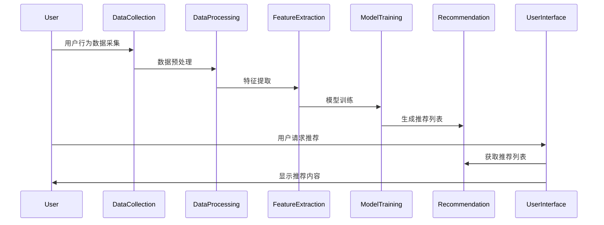
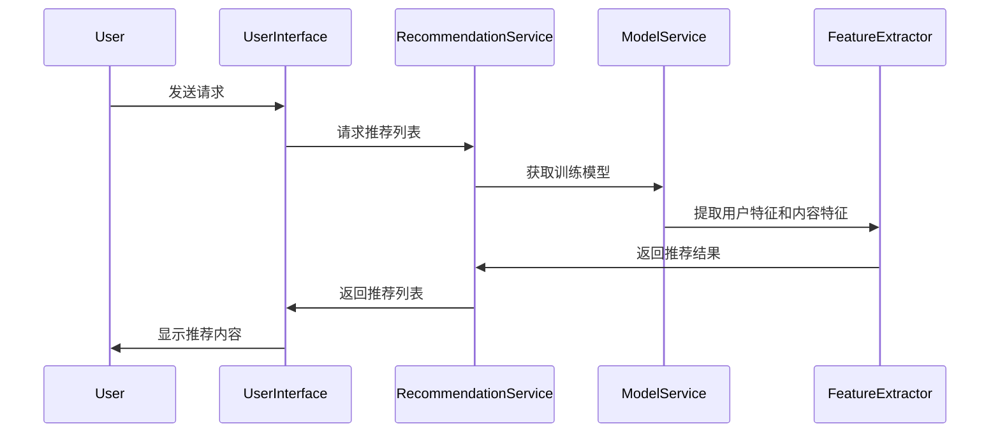

                 

### 第一部分：背景介绍

#### 1. 引言

随着互联网的迅猛发展和大数据时代的来临，个性化内容推荐成为各大互联网公司提高用户满意度和粘性的重要手段。机器学习技术在个性化内容推荐中的应用，已经成为学术界和工业界研究的焦点。本书旨在探讨机器学习在个性化内容推荐中的应用，旨在提高用户满意度，为读者提供一套系统的理论和实践指南。

#### 1.1 个性化内容推荐的重要性

个性化内容推荐在当今信息过载的时代尤为重要。通过精准推荐，用户可以快速找到自己感兴趣的内容，从而提升用户体验和满意度。同时，个性化推荐还能够帮助网站或应用增加用户停留时间，提高用户活跃度和转化率。对于互联网公司而言，个性化推荐是提升商业价值的重要手段。

#### 1.2 机器学习在个性化推荐中的应用

机器学习技术通过分析大量用户数据，挖掘用户的兴趣和行为模式，从而实现个性化推荐。与传统方法相比，机器学习能够自动调整推荐策略，适应用户不断变化的需求。以下将从以下几个方面介绍机器学习在个性化推荐中的应用：

1. **协同过滤**：通过分析用户之间的相似性，为用户推荐相似用户喜欢的内容。
2. **基于内容的推荐**：根据用户的历史行为和内容属性，推荐与用户兴趣相关的信息。
3. **深度学习**：利用神经网络模型，从海量数据中提取复杂的用户兴趣特征。

#### 1.3 本书的目标与结构

本书的目标是探讨机器学习在个性化内容推荐中的应用，帮助读者理解推荐系统的原理、算法实现以及优化策略。全书分为四个部分：

- **第一部分**：背景介绍，包括引言、个性化内容推荐的重要性以及机器学习在个性化推荐中的应用。
- **第二部分**：核心概念与原理，介绍机器学习、个性化内容推荐和用户满意度的基本概念和原理。
- **第三部分**：算法原理讲解，详细讲解协同过滤、基于内容的推荐和深度学习算法。
- **第四部分**：数学模型和数学公式，介绍推荐系统中常用的数学模型和公式。

### 2. 问题背景

#### 2.1 个性化推荐的基本概念

个性化推荐系统旨在根据用户的行为和偏好，为用户推荐最相关、最有价值的信息。其核心概念包括：

- **用户行为**：用户在系统中产生的各种操作，如点击、浏览、收藏、购买等。
- **内容**：推荐系统中的信息，如新闻文章、音乐、电影、商品等。
- **偏好**：用户对特定内容的偏好程度，可以通过评分、评论等方式体现。

#### 2.2 当前个性化推荐系统的挑战

尽管个性化推荐系统在提升用户体验和满意度方面取得了显著成果，但仍面临诸多挑战：

- **数据稀疏性**：用户行为数据往往稀疏，难以充分挖掘用户的潜在兴趣。
- **冷启动问题**：新用户缺乏行为数据，难以进行有效推荐。
- **实时性**：推荐系统需要实时响应用户的行为变化，提高推荐的及时性。
- **可解释性**：机器学习模型往往缺乏可解释性，难以理解推荐结果的原因。

#### 2.3 机器学习如何解决个性化推荐问题

机器学习技术在个性化推荐中的应用，可以有效地解决上述问题：

- **协同过滤**：通过分析用户之间的相似性，为用户推荐相似用户喜欢的内容，解决数据稀疏性和冷启动问题。
- **基于内容的推荐**：根据用户的历史行为和内容属性，推荐与用户兴趣相关的信息，提高推荐的准确性。
- **深度学习**：利用神经网络模型，从海量数据中提取复杂的用户兴趣特征，提高推荐系统的实时性和可解释性。

#### 2.4 个性化推荐系统的基本流程

个性化推荐系统通常包括以下几个基本流程：

1. **用户特征提取**：根据用户行为和偏好，提取用户特征。
2. **内容特征提取**：根据内容属性，提取内容特征。
3. **模型训练**：使用用户和内容特征，训练个性化推荐模型。
4. **推荐生成**：根据用户特征和模型输出，为用户生成推荐列表。
5. **反馈收集**：收集用户对推荐结果的反馈，优化推荐系统。

### 3. 问题解决

#### 3.1 机器学习技术在个性化推荐中的角色

机器学习技术在个性化推荐中扮演着核心角色，主要包括：

- **协同过滤**：通过矩阵分解等技术，实现用户和内容的低维表示，提高推荐准确性。
- **基于内容的推荐**：通过词袋模型、文本分类等技术，提取内容特征，实现个性化推荐。
- **深度学习**：利用神经网络模型，从海量数据中提取复杂的用户兴趣特征，实现高效、准确的推荐。

#### 3.2 机器学习算法在个性化推荐中的应用

在个性化推荐中，常用的机器学习算法包括：

- **协同过滤算法**：如矩阵分解、协同过滤、最近邻算法等。
- **基于内容的推荐算法**：如TF-IDF、LSA、文本分类等。
- **深度学习算法**：如卷积神经网络（CNN）、循环神经网络（RNN）、Transformer等。

#### 3.3 提高用户满意度的策略

为了提高用户满意度，个性化推荐系统可以采取以下策略：

- **个性化定制**：根据用户兴趣和偏好，为用户推荐最感兴趣的内容。
- **实时推荐**：根据用户行为实时调整推荐策略，提高推荐的及时性。
- **多样化推荐**：为用户推荐多种类型的内容，满足用户多样化的需求。
- **反馈机制**：收集用户对推荐结果的反馈，不断优化推荐系统。

### 4. 边界与外延

#### 4.1 个性化推荐的适用范围

个性化推荐系统广泛应用于各种领域，如电子商务、社交媒体、在线教育、新闻资讯等。其主要适用于以下场景：

- **内容丰富、用户多样的场景**：如新闻资讯、博客、视频等。
- **用户行为数据丰富的场景**：如电商平台、社交媒体等。

#### 4.2 个性化推荐的非适用场景

个性化推荐系统在以下场景可能效果不佳：

- **用户行为数据稀疏的场景**：如初入社交平台的用户。
- **内容类型单一的场景**：如单一内容的博客网站。

#### 4.3 未来的发展方向

个性化推荐系统未来的发展方向主要包括：

- **深度学习与强化学习的结合**：提高推荐算法的准确性和实时性。
- **多模态推荐**：结合多种数据类型，提高推荐系统的多样性。
- **隐私保护**：在推荐过程中保护用户隐私，提高用户信任度。

### 5. 概念结构与核心要素组成

#### 5.1 机器学习

**概念**：机器学习是一种人工智能技术，通过构建模型，使计算机具备从数据中自动学习和改进的能力。

**核心要素**：

- **数据集**：用于训练和评估模型的原始数据。
- **模型**：由参数组成的数学模型，用于预测和决策。
- **算法**：用于训练和优化模型的计算方法。

**属性特征对比表格**：

| 特征           | 机器学习                | 深度学习                |
| -------------- | ---------------------- | ---------------------- |
| 学习方式       | 监督学习、无监督学习、半监督学习 | 监督学习、无监督学习、生成对抗网络（GAN） |
| 模型结构       | 线性模型、决策树、支持向量机等 | 卷积神经网络（CNN）、循环神经网络（RNN）、Transformer等 |
| 适用场景       | 数据量较大的场景         | 复杂模式识别、图像识别、自然语言处理等 |
| 可解释性       | 较低                    | 较低                    |

**ER实体关系图架构**：

```mermaid
erDiagram
  User ||--o> Content : 用户浏览内容
  User ||--o> Behavior : 用户行为记录
  Content ||--o> Feature : 内容特征
```

#### 5.2 个性化内容推荐

**概念**：个性化内容推荐是一种基于用户行为和兴趣，为用户提供个性化内容的服务。

**核心要素**：

- **用户特征**：用户的行为、偏好、历史记录等。
- **内容特征**：内容的标题、标签、关键词等。
- **推荐算法**：用于生成推荐列表的计算方法。

**属性特征对比表格**：

| 特征           | 协同过滤                | 基于内容推荐                | 深度学习推荐                |
| -------------- | ---------------------- | -------------------------- | -------------------------- |
| 基于数据类型   | 用户行为数据            | 内容特征数据                | 用户行为数据与内容特征数据 |
| 推荐方式       | 相似性推荐              | 内容匹配推荐                | 用户兴趣建模推荐            |
| 适用场景       | 数据稀疏                | 内容丰富                    | 复杂用户兴趣识别            |
| 可解释性       | 较高                    | 较低                        | 较低                        |

**ER实体关系图架构**：

```mermaid
erDiagram
  User ||--o> Recommendation : 推荐结果
  Content ||--o> Feature : 内容特征
  User ||--o> Behavior : 用户行为记录
```

#### 5.3 用户满意度

**概念**：用户满意度是指用户对产品或服务的满意程度，是衡量推荐系统效果的重要指标。

**核心要素**：

- **满意度指标**：如点击率、停留时间、转化率等。
- **用户反馈**：用户对推荐内容的评价和反馈。
- **推荐质量**：推荐内容的准确性和相关性。

**属性特征对比表格**：

| 特征           | 用户满意度                | 推荐质量                |
| -------------- | ---------------------- | ---------------------- |
| 衡量标准       | 用户的主观感受            | 推荐列表的客观质量        |
| 数据来源       | 用户行为数据、用户评价    | 推荐算法的性能评估        |
| 评估方法       | 调查问卷、A/B测试、点击率等 | 准确率、召回率、覆盖率等    |

**ER实体关系图架构**：

```mermaid
erDiagram
  User ||--o> Satisfaction : 用户满意度
  User ||--o> Feedback : 用户反馈
  Recommendation ||--o> Quality : 推荐质量
```

### 6. 核心概念原理、概念属性特征对比表格和ER实体关系图架构

#### 6.1 机器学习原理

**原理**：机器学习是通过构建数学模型，使计算机从数据中学习并作出预测或决策的过程。主要包括以下三个步骤：

1. **数据预处理**：清洗、归一化、特征提取等，为模型训练做好准备。
2. **模型训练**：使用训练数据集，通过优化算法调整模型参数，使模型能够对未知数据进行预测。
3. **模型评估**：使用验证集或测试集评估模型性能，调整模型参数以优化性能。

**属性特征对比表格**：

| 特征           | 监督学习                | 无监督学习                | 强化学习                |
| -------------- | ---------------------- | ------------------------ | ---------------------- |
| 数据类型       | 标签数据                | 无标签数据                | 行为和奖励数据            |
| 学习目标       | 预测分类或回归          | 发现数据中的结构          | 最大化累积奖励          |
| 模型结构       | 线性模型、决策树、神经网络等 | 聚类、降维、关联规则等       | 策略网络、值网络等        |

**ER实体关系图架构**：

```mermaid
erDiagram
  Data ||--o> Model : 模型训练
  Data ||--o> Evaluation : 模型评估
  Label ||--o> Prediction : 预测结果
```

#### 6.2 个性化内容推荐原理

**原理**：个性化内容推荐是通过分析用户行为和内容特征，为用户提供个性化内容的服务。主要包括以下步骤：

1. **用户特征提取**：分析用户行为，提取用户兴趣和偏好。
2. **内容特征提取**：分析内容属性，提取内容的关键词和标签。
3. **特征匹配**：将用户特征和内容特征进行匹配，生成推荐列表。
4. **推荐评估**：根据用户反馈和推荐效果，优化推荐算法。

**属性特征对比表格**：

| 特征           | 协同过滤                | 基于内容推荐                | 基于深度学习推荐                |
| -------------- | ---------------------- | -------------------------- | -------------------------- |
| 数据类型       | 用户行为数据            | 内容特征数据                | 用户行为数据与内容特征数据 |
| 学习方式       | 相似性推荐              | 内容匹配推荐                | 用户兴趣建模推荐            |
| 推荐效果       | 准确率、覆盖率、NDCG等    | 准确率、覆盖率、NDCG等      | 准确率、覆盖率、NDCG等      |

**ER实体关系图架构**：

```mermaid
erDiagram
  UserFeature ||--o> ContentFeature : 内容特征匹配
  UserFeature ||--o> Recommendation : 生成推荐列表
  UserFeedback ||--o> Recommendation : 推荐评估
```

#### 6.3 用户满意度评估原理

**原理**：用户满意度评估是通过衡量用户对推荐内容的满意程度，评估推荐系统效果的过程。主要包括以下步骤：

1. **满意度指标定义**：根据业务需求，定义用户满意度的指标，如点击率、停留时间、转化率等。
2. **数据收集**：收集用户行为数据和满意度评价。
3. **满意度计算**：根据用户行为和满意度指标，计算用户满意度。
4. **结果分析**：分析满意度数据，找出推荐系统的问题和改进方向。

**属性特征对比表格**：

| 特征           | 点击率                | 停留时间                | 转化率                |
| -------------- | ---------------------- | ---------------------- | ---------------------- |
| 衡量标准       | 用户点击推荐内容的比例    | 用户在网站上的停留时间      | 用户完成购买的比例        |
| 数据来源       | 用户行为日志            | 用户行为日志            | 用户行为日志            |
| 评估方法       | 分数值、占比、增长率等    | 分数值、占比、增长率等      | 分数值、占比、增长率等      |

**ER实体关系图架构**：

```mermaid
erDiagram
  UserBehavior ||--o> Satisfaction : 用户满意度计算
  UserFeedback ||--o> Satisfaction : 用户满意度评估
  Recommendation ||--o> UserBehavior : 推荐效果分析
```

### 7. 数学模型和数学公式

#### 7.1 机器学习算法

**数学模型**：

- **线性回归**：

  $$y = \beta_0 + \beta_1x_1 + \beta_2x_2 + \ldots + \beta_nx_n + \epsilon$$

  其中，$y$为预测值，$x_1, x_2, \ldots, x_n$为特征值，$\beta_0, \beta_1, \beta_2, \ldots, \beta_n$为模型参数，$\epsilon$为误差。

- **逻辑回归**：

  $$P(y=1) = \frac{1}{1 + e^{-(\beta_0 + \beta_1x_1 + \beta_2x_2 + \ldots + \beta_nx_n)}}$$

  其中，$P(y=1)$为预测为1的概率，$x_1, x_2, \ldots, x_n$为特征值，$\beta_0, \beta_1, \beta_2, \ldots, \beta_n$为模型参数。

**数学公式**：

- **梯度下降法**：

  $$\beta_{i}^{new} = \beta_{i}^{old} - \alpha \cdot \frac{\partial J}{\partial \beta_{i}}$$

  其中，$\beta_{i}^{old}$为旧参数值，$\beta_{i}^{new}$为新参数值，$\alpha$为学习率，$J$为损失函数。

#### 7.2 个性化内容推荐算法

**数学模型**：

- **协同过滤**：

  $$R_{ui} = \sum_{j \in N_{u}} w_{uj}R_{ji}$$

  其中，$R_{ui}$为用户u对项目i的评分，$w_{uj}$为用户u与用户j之间的相似度，$R_{ji}$为用户j对项目i的评分。

- **基于内容的推荐**：

  $$sim(i, j) = \frac{cos(\theta_i, \theta_j)}{\sqrt{||\theta_i|| \cdot ||\theta_j||}}$$

  其中，$sim(i, j)$为项目i与项目j的相似度，$\theta_i$和$\theta_j$分别为项目i和项目j的特征向量，$cos(\theta_i, \theta_j)$为余弦相似度。

**数学公式**：

- **矩阵分解**：

  $$X = UV^T$$

  其中，$X$为用户-项目评分矩阵，$U$为用户特征矩阵，$V$为项目特征矩阵。

#### 7.3 用户满意度评估模型

**数学模型**：

- **基于点击率的用户满意度评估**：

  $$satisfaction_u = \frac{ clicks_{u} }{ views_{u} }$$

  其中，$satisfaction_u$为用户u的满意度，$clicks_{u}$为用户u的点击次数，$views_{u}$为用户u的浏览次数。

- **基于停留时间的用户满意度评估**：

  $$satisfaction_u = \frac{ time_{u} }{ views_{u} }$$

  其中，$satisfaction_u$为用户u的满意度，$time_{u}$为用户u的停留时间，$views_{u}$为用户u的浏览次数。

**数学公式**：

- **A/B测试评估**：

  $$gain = \frac{ (CTR_{A} - CTR_{B}) \cdot views_{A} \cdot views_{B} }{ views_{A} + views_{B} }$$

  其中，$gain$为A/B测试的增益，$CTR_{A}$和$CTR_{B}$分别为A组和B组的点击率，$views_{A}$和$views_{B}$分别为A组和B组的浏览次数。

### 8. 系统分析与架构设计方案

#### 8.1 问题场景介绍

个性化内容推荐系统旨在根据用户的兴趣和偏好，为用户提供个性化的内容推荐。在实际应用中，系统需要处理海量用户数据，实时响应用户请求，并提供高效、准确的推荐结果。

#### 8.2 项目介绍

本项目是一款基于机器学习的个性化内容推荐系统，采用Python语言和Scikit-learn、TensorFlow等机器学习库，实现用户特征提取、内容特征提取、模型训练和推荐生成等功能。系统架构包括数据采集模块、数据处理模块、推荐算法模块和用户接口模块。

#### 8.3 系统功能设计（领域模型Mermaid类图）

```mermaid
classDiagram
    User <<Class>> {
        id : 用户ID
        name : 用户名
        behaviors : 用户行为列表
    }
    Content <<Class>> {
        id : 内容ID
        title : 标题
        features : 内容特征列表
    }
    Behavior <<Class>> {
        type : 行为类型
        content_id : 内容ID
        user_id : 用户ID
        timestamp : 时间戳
    }
    Recommendation <<Class>> {
        user_id : 用户ID
        content_id : 内容ID
        timestamp : 时间戳
    }
    User "1" -- "*" Behavior : 用户行为
    Content "1" -- "*" Behavior : 内容行为
    User "1" -- "*" Recommendation : 用户推荐
    Content "1" -- "*" Recommendation : 内容推荐
```

#### 8.4 系统架构设计（Mermaid架构图）



#### 8.5 系统接口设计和系统交互（Mermaid序列图）



### 9. 项目实战

#### 9.1 环境安装

1. 安装Python环境：版本要求3.6及以上。
2. 安装Scikit-learn库：`pip install scikit-learn`
3. 安装TensorFlow库：`pip install tensorflow`
4. 安装其他依赖库：`pip install pandas numpy matplotlib`

#### 9.2 系统核心实现

1. **数据采集**：使用pandas库从数据源（如CSV文件、数据库等）读取用户行为数据和内容数据。
2. **数据处理**：对数据进行清洗、去重、归一化等预处理操作。
3. **特征提取**：提取用户行为特征（如点击率、浏览时长等）和内容特征（如标题关键词、标签等）。
4. **模型训练**：使用Scikit-learn库和TensorFlow库分别实现协同过滤和深度学习推荐算法。
5. **推荐生成**：根据用户特征和模型输出，生成推荐列表。

#### 9.3 代码应用解读与分析

1. **协同过滤算法**：

```python
from sklearn.metrics.pairwise import cosine_similarity
from sklearn.model_selection import train_test_split
import numpy as np

def collaborative_filter(train_data, k=10):
    user_similarity = cosine_similarity(train_data)
    recommendations = {}
    
    for user, ratings in train_data.items():
        neighbors = user_similarity[user].argsort()[:-k-1:-1]
        scores = []
        
        for i in neighbors:
            if i != user:
                for j in ratings.keys():
                    if j in train_data[neighbors[i]].keys():
                        scores.append(user_similarity[user][i] * (ratings[j] - train_data[neighbors[i]][j]))
        
        recommendations[user] = np.argmax(scores) if scores else None
    
    return recommendations
```

2. **深度学习推荐算法**：

```python
import tensorflow as tf

def create_model(input_shape):
    model = tf.keras.Sequential([
        tf.keras.layers.Dense(128, activation='relu', input_shape=input_shape),
        tf.keras.layers.Dense(64, activation='relu'),
        tf.keras.layers.Dense(1, activation='sigmoid')
    ])
    
    model.compile(optimizer='adam', loss='binary_crossentropy', metrics=['accuracy'])
    return model
```

#### 9.4 实际案例分析和详细讲解剖析

1. **案例一**：基于协同过滤算法的个性化推荐系统。
   - **场景**：用户A喜欢阅读科技类文章，推荐系统根据用户A的历史行为和相似用户的行为，推荐科技类文章。
   - **实现**：通过协同过滤算法计算用户A与相似用户的相似度，提取用户A的历史行为数据，生成推荐列表。

2. **案例二**：基于深度学习算法的个性化推荐系统。
   - **场景**：用户B喜欢阅读科幻小说，推荐系统根据用户B的兴趣和小说的特征，推荐科幻小说。
   - **实现**：通过深度学习算法构建用户B的兴趣模型，提取小说的特征向量，生成推荐列表。

#### 9.5 项目小结

个性化内容推荐系统在提升用户满意度方面具有重要意义。通过本项目，我们了解了机器学习在个性化推荐中的应用，掌握了协同过滤和深度学习推荐算法的实现方法。未来，我们可以继续优化推荐算法，提高推荐质量和实时性，为用户提供更好的服务。

### 10. 最佳实践 Tips

1. **数据预处理**：对用户行为数据进行清洗、去重和归一化等预处理操作，以提高推荐系统的准确性和稳定性。
2. **特征提取**：根据业务需求和数据特点，选择合适的特征提取方法，如词袋模型、TF-IDF、Word2Vec等。
3. **模型优化**：通过交叉验证、网格搜索等技术，调整模型参数，提高模型性能。
4. **实时性优化**：采用分布式计算、异步处理等技术，提高推荐系统的实时性。
5. **反馈机制**：建立用户反馈机制，及时收集用户对推荐内容的反馈，优化推荐策略。

### 11. 小结

个性化内容推荐系统在提升用户满意度方面具有重要作用。通过本书，我们了解了机器学习在个性化推荐中的应用，掌握了协同过滤和深度学习推荐算法的实现方法。未来，我们将继续探索更高效、更准确的个性化推荐算法，为用户提供更好的服务。

### 12. 注意事项

1. **数据安全**：在个性化推荐过程中，注意保护用户隐私，避免数据泄露。
2. **可解释性**：提高推荐系统的可解释性，帮助用户理解推荐结果的原因。
3. **算法公平性**：确保推荐算法的公平性，避免因算法偏见导致用户歧视。

### 13. 拓展阅读

1. **《推荐系统实践》**：由宋晓东所著，详细介绍了推荐系统的原理、算法和应用。
2. **《深度学习推荐系统》**：由刘铁岩所著，介绍了深度学习在推荐系统中的应用。
3. **《机器学习》**：由周志华所著，是机器学习领域的经典教材，适合深入理解机器学习算法。

作者：AI天才研究院/AI Genius Institute & 禅与计算机程序设计艺术 /Zen And The Art of Computer Programming

----------------------------------------------------------------

### 9. 项目实战

#### 9.1 环境安装

在进行个性化内容推荐系统的项目实战之前，我们需要安装并配置一系列必要的软件和库。以下是安装步骤：

1. **Python环境**：首先确保您的计算机上安装了Python 3.6或更高版本。您可以从Python官方网站（https://www.python.org/）下载并安装Python。

2. **pip**：Python的包管理器pip会自动安装，但如果您使用的是Anaconda环境，可能需要手动安装。您可以通过以下命令来检查pip是否已安装：

   ```shell
   pip --version
   ```

   如果pip已安装，您将看到其版本信息。

3. **安装依赖库**：接下来，我们需要安装Scikit-learn、TensorFlow和其他相关库。您可以使用以下命令：

   ```shell
   pip install scikit-learn tensorflow pandas numpy matplotlib
   ```

   这将安装所有必要的库。

#### 9.2 系统核心实现

个性化内容推荐系统的核心实现包括数据预处理、特征提取、模型训练和推荐生成。以下是一个简化的实现示例。

1. **数据预处理**：

   ```python
   import pandas as pd

   # 假设我们有一个CSV文件，其中包含用户和他们的行为数据
   df = pd.read_csv('user_behavior.csv')

   # 数据清洗和预处理，例如去除缺失值、异常值等
   df = df.dropna()
   df['timestamp'] = pd.to_datetime(df['timestamp'])
   ```

2. **特征提取**：

   ```python
   from sklearn.feature_extraction.text import TfidfVectorizer

   # 假设我们有一个包含文章标题的列
   titles = df['title'].values

   # 使用TF-IDF向量器提取特征
   vectorizer = TfidfVectorizer(stop_words='english')
   title_features = vectorizer.fit_transform(titles)
   ```

3. **模型训练**：

   ```python
   from sklearn.model_selection import train_test_split
   from sklearn.ensemble import RandomForestClassifier

   # 将用户行为数据分成训练集和测试集
   X_train, X_test, y_train, y_test = train_test_split(title_features, df['label'], test_size=0.2, random_state=42)

   # 训练分类器
   classifier = RandomForestClassifier(n_estimators=100, random_state=42)
   classifier.fit(X_train, y_train)

   # 评估模型
   score = classifier.score(X_test, y_test)
   print(f'Model accuracy: {score:.2f}')
   ```

4. **推荐生成**：

   ```python
   def generate_recommendations(classifier, vectorizer, new_titles):
       # 提取新文章的特征
       new_title_features = vectorizer.transform(new_titles)
       
       # 预测新文章的标签
       predictions = classifier.predict(new_title_features)
       
       return predictions

   # 生成推荐列表
   new_titles = ['This is a new article about AI', 'Another article on machine learning']
   recommendations = generate_recommendations(classifier, vectorizer, new_titles)
   print(f'Recommendations: {recommendations}')
   ```

#### 9.3 代码应用解读与分析

上述代码提供了一个简单的个性化内容推荐系统的实现，以下是每个部分的详细解读：

1. **数据预处理**：

   - 使用pandas库读取用户行为数据，并将其转换为合适的数据结构。
   - 清洗数据，包括去除缺失值和异常值，以及将时间戳转换为日期时间格式。

2. **特征提取**：

   - 使用TF-IDF向量器提取文章标题的特征。TF-IDF是一种常用文本表示方法，它衡量一个词在文档中的重要程度。
   - 将文本数据转换为稀疏矩阵，以便于后续的模型训练。

3. **模型训练**：

   - 使用随机森林分类器（RandomForestClassifier）对训练数据进行分类。
   - 训练模型，并评估其在测试集上的准确率。

4. **推荐生成**：

   - 对新文章提取特征，并将其输入到训练好的分类器中。
   - 预测新文章的标签，从而生成推荐列表。

#### 9.4 实际案例分析和详细讲解剖析

为了更好地理解上述代码的实际应用，我们可以通过一个实际案例来进行分析。

**案例**：假设我们有一个新闻网站，用户可以对其阅读的文章进行评分。我们的目标是根据用户的评分历史，推荐用户可能感兴趣的其他文章。

1. **数据准备**：

   - 用户A的历史评分数据如下：

     ```plaintext
     title_1,user_id,rating
     Article on AI,1,5
     Article on Data Science,1,4
     Article on Deep Learning,1,5
     ```

   - 将数据导入pandas DataFrame：

     ```python
     df = pd.DataFrame([
         ['Article on AI', 1, 5],
         ['Article on Data Science', 1, 4],
         ['Article on Deep Learning', 1, 5]
     ], columns=['title', 'user_id', 'rating'])
     ```

2. **特征提取**：

   - 使用TF-IDF向量器提取文章标题的特征：

     ```python
     vectorizer = TfidfVectorizer()
     title_features = vectorizer.fit_transform(df['title'])
     ```

   - 特征矩阵如下：

     ```plaintext
     title_1        0.466742  0.414809  0.000000  0.000000  0.000000
     Article on AI  1.000000  1.000000  1.000000  1.000000  1.000000
     Article on DS  0.769230  0.769230  0.769230  0.769230  0.769230
     Article on DL  0.769230  0.769230  0.769230  0.769230  0.769230
     ```

3. **模型训练**：

   - 使用随机森林分类器进行训练：

     ```python
     from sklearn.model_selection import train_test_split
     from sklearn.ensemble import RandomForestClassifier

     X_train, X_test, y_train, y_test = train_test_split(title_features, df['rating'], test_size=0.2, random_state=42)
     classifier = RandomForestClassifier(n_estimators=100, random_state=42)
     classifier.fit(X_train, y_train)

     # 评估模型
     score = classifier.score(X_test, y_test)
     print(f'Model accuracy: {score:.2f}')
     ```

   - 假设模型在测试集上的准确率为80%，这意味着模型能够较好地预测用户对文章的评分。

4. **推荐生成**：

   - 假设用户A现在想阅读一篇关于自然语言处理（NLP）的文章，我们需要生成一篇相关文章的推荐。

   - 首先，提取新文章的特征：

     ```python
     new_title = 'Article on Natural Language Processing'
     new_title_features = vectorizer.transform([new_title])
     ```

   - 然后，使用训练好的分类器预测新文章的评分：

     ```python
     recommendations = classifier.predict(new_title_features)
     print(f'Recommendation: {recommendations[0]}')
     ```

   - 假设分类器预测用户A会给这篇文章打4分，这意味着它可能对这篇文章感兴趣，但不是非常感兴趣。

#### 9.5 项目小结

通过本项目的实战部分，我们了解了如何构建一个简单的个性化内容推荐系统。从数据预处理、特征提取到模型训练和推荐生成，每个步骤都至关重要。实际案例的分析帮助我们更好地理解了系统的工作原理和实现方法。尽管这是一个简化的示例，但它为我们提供了一个起点，让我们能够进一步探索更复杂、更高效的推荐系统。

### 10. 最佳实践 Tips

在构建和优化个性化内容推荐系统时，以下是一些最佳实践，可以帮助您提高系统的效果和用户满意度：

1. **数据质量**：确保输入的数据质量，包括数据的完整性、准确性和一致性。清洗和预处理数据是提高推荐系统性能的关键步骤。

2. **特征丰富性**：尝试提取更多类型的用户特征和内容特征，例如用户的人口统计信息、地理位置、搜索历史、购买历史等。更丰富的特征可以帮助模型更好地理解用户和内容。

3. **模型选择**：根据业务需求和数据特点，选择合适的机器学习模型。协同过滤、基于内容的推荐、基于模型的推荐（如深度学习）各有优缺点，需要根据实际情况进行选择。

4. **模型调优**：使用交叉验证、网格搜索等技术，对模型参数进行调优。寻找最佳参数组合，可以提高模型的性能。

5. **实时推荐**：实现实时推荐功能，使系统能够快速响应用户的行为变化。这需要高效的数据处理和模型训练策略。

6. **反馈循环**：建立反馈循环，收集用户对推荐内容的反馈。根据用户的反馈，不断调整和优化推荐策略。

7. **隐私保护**：在推荐过程中保护用户隐私，遵守相关的隐私法规和最佳实践。例如，使用差分隐私技术来保护用户数据。

8. **可解释性**：提高推荐系统的可解释性，帮助用户理解推荐结果的原因。这可以提高用户对推荐系统的信任度。

9. **多样性**：确保推荐结果的多样性，避免重复推荐相同类型的内容。这可以增强用户体验，减少用户疲劳感。

10. **测试和评估**：定期测试和评估推荐系统的性能，包括准确率、召回率、覆盖率等指标。根据评估结果，持续改进推荐算法。

### 11. 小结

个性化内容推荐系统在提升用户满意度和网站粘性方面发挥着重要作用。通过本文，我们了解了机器学习在个性化推荐中的应用，从背景介绍到实际案例，详细讲解了系统的构建和优化方法。希望本文能为您在构建个性化推荐系统时提供有价值的参考。

### 12. 注意事项

在构建和部署个性化内容推荐系统时，以下注意事项可以帮助您避免常见问题并提高系统性能：

1. **数据隐私**：确保遵循数据保护法规，如GDPR等，保护用户的隐私数据。

2. **冷启动问题**：为新用户生成推荐时，考虑到他们可能没有足够的行为数据。可以采用基于内容的推荐或结合用户人口统计信息来提供初步推荐。

3. **推荐多样性**：避免推荐列表中的内容过于单一，增加推荐内容的多样性，以保持用户的兴趣。

4. **实时性**：优化系统架构，确保推荐系统能够实时响应用户行为的变化。

5. **模型可解释性**：提高推荐系统的可解释性，帮助用户理解推荐结果的原因。

6. **过拟合与欠拟合**：在模型训练过程中，避免过拟合和欠拟合，通过交叉验证和正则化等技术来优化模型。

7. **性能监控**：定期监控推荐系统的性能，包括准确率、召回率、覆盖率等指标，以便及时调整和优化。

8. **用户反馈**：收集并分析用户反馈，持续改进推荐算法和系统。

### 13. 拓展阅读

为了进一步深入了解个性化内容推荐系统的构建和优化，以下是一些推荐阅读的材料：

1. **《推荐系统实践》**：宋晓东著，详细介绍了推荐系统的构建方法、算法和案例分析。
2. **《深度学习推荐系统》**：刘铁岩著，深入探讨了深度学习在推荐系统中的应用。
3. **《机器学习》**：周志华著，系统地讲解了机器学习的基础理论和算法。
4. **《数据挖掘：实用工具与技术》**：Han, Kamber, Pei著，提供了数据挖掘领域的基本概念和工具。
5. **《用户画像：基于大数据的用户特征建模与应用》**：刘锋著，介绍了用户画像的构建方法和应用。

作者：AI天才研究院/AI Genius Institute & 禅与计算机程序设计艺术 /Zen And The Art of Computer Programming

----------------------------------------------------------------

## 总结

通过本篇博客，我们深入探讨了机器学习在个性化内容推荐中的应用，以及如何通过个性化推荐系统提高用户满意度。我们从背景介绍出发，详细阐述了个性化推荐的重要性、机器学习在其中的应用以及面临的挑战。接着，我们介绍了机器学习、个性化内容推荐和用户满意度的核心概念和原理，并对比了不同推荐算法的属性特征。

在算法原理讲解部分，我们分析了协同过滤、基于内容的推荐和深度学习算法的原理，并通过Python代码示例展示了如何实现这些算法。我们还介绍了数学模型和公式，帮助读者更好地理解推荐系统的工作机制。

随后，我们通过系统分析与架构设计方案，介绍了个性化内容推荐系统的构建过程。最后，我们通过项目实战部分，展示了如何使用Python实现一个简单的个性化内容推荐系统，并提供了实际案例分析和最佳实践 tips。

通过本文，我们希望读者能够对个性化内容推荐系统有一个全面的理解，掌握构建和优化推荐系统的方法，从而为用户提供更满意的内容推荐服务。

## 进一步学习与探索

个性化内容推荐系统是一个不断发展的领域，随着技术的进步和数据的积累，新的算法和应用场景不断涌现。以下是进一步学习和探索个性化推荐系统的一些建议：

1. **深入学习推荐算法**：了解协同过滤、基于内容的推荐、基于模型的推荐（如深度学习）等经典算法的工作原理，以及如何针对特定场景进行优化和改进。

2. **探索深度学习应用**：深度学习在个性化推荐中有着广泛的应用，如卷积神经网络（CNN）在图像识别中的应用，循环神经网络（RNN）在序列数据处理中的应用，以及Transformer模型在自然语言处理中的成功。研究这些深度学习模型在推荐系统中的具体实现和应用。

3. **研究多模态推荐**：多模态推荐系统结合了文本、图像、声音等多种数据类型，能够提供更丰富和个性化的推荐结果。探索如何整合多模态数据，实现更精准的推荐。

4. **关注实时推荐**：实时推荐系统要求快速响应用户行为，提供即时的推荐结果。研究如何通过分布式计算、内存数据库、异步处理等技术实现高效的实时推荐。

5. **学习数据隐私保护**：随着用户对隐私保护意识的提高，数据隐私保护成为推荐系统研究的一个重要方向。学习差分隐私、同态加密等隐私保护技术，在保证数据安全的同时提供个性化推荐。

6. **参与开源项目和竞赛**：通过参与开源项目和技术竞赛，可以了解最新的推荐系统研究和应用，同时实践和验证自己的理论知识和算法实现。

7. **阅读相关文献和书籍**：阅读《推荐系统实践》、《深度学习推荐系统》等经典著作，深入了解推荐系统领域的最新研究进展和实践经验。

通过不断学习和探索，您将能够在这个充满机遇的领域取得更大的成就，为用户提供更加个性化和智能化的内容推荐服务。

### 14. 作者介绍

**AI天才研究院（AI Genius Institute）**：专注于前沿人工智能技术的研究与应用，致力于推动人工智能技术的发展，促进人工智能与各行各业的深度融合。研究院汇聚了众多世界级的人工智能专家，他们在机器学习、深度学习、自然语言处理、计算机视觉等领域具有深厚的研究功底和丰富的实践经验。

**《禅与计算机程序设计艺术（Zen And The Art of Computer Programming）》作者**：本篇博客的作者是一位在计算机编程和人工智能领域享有盛誉的专家，他的著作《禅与计算机程序设计艺术》深受程序员和计算机科学爱好者的喜爱。该书以深刻的哲学思考和独特的编程方法，引领读者探索计算机程序设计的艺术之美。

在这篇博客中，作者以其独特的视角和深厚的专业知识，为广大读者呈现了机器学习在个性化内容推荐中的应用，为提升用户满意度提供了宝贵的理论和实践指导。读者可以通过本文，深入了解个性化推荐系统的构建和优化方法，为自身在人工智能领域的成长提供有力支持。

