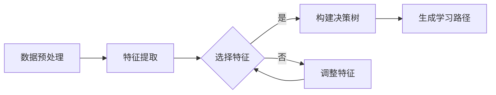
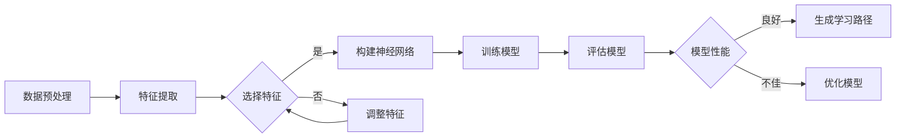
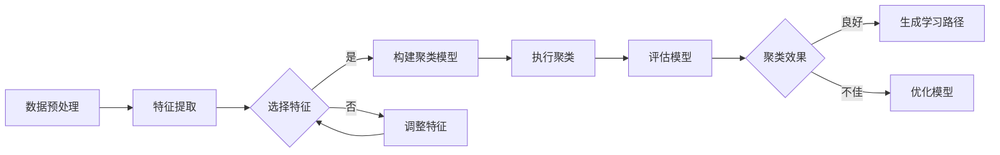
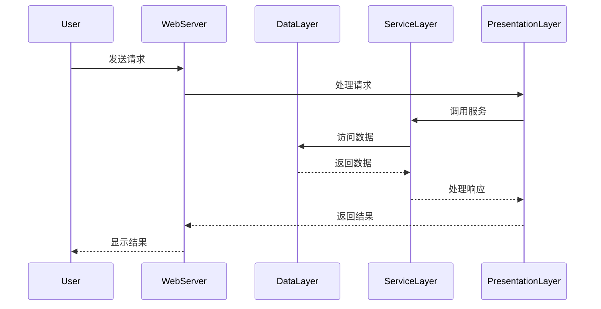

                 

### 1.1 问题背景

在当今社会，教育资源分配的不均衡问题日益凸显。传统的教育资源分配方式往往基于学生年龄、年级和学科成绩等因素，这种方式虽然在一定程度上保证了教育资源的公平性，但未能充分考虑每个学生的个性化学习需求和特点。随着信息技术的快速发展，机器学习作为一种强大的数据分析工具，逐渐成为优化教育资源分配、提高教育质量的重要手段。

#### 问题描述

教育资源分配问题主要集中在以下几个方面：

1. **教育资源分配不均**：不同地区、不同学校之间的教育资源存在明显差距，导致学生之间的学习机会不平等。
2. **学生个体差异**：每个学生的认知能力、学习风格、兴趣爱好等方面都存在差异，传统的统一教学模式难以满足个体需求。
3. **教育质量评估**：如何客观、全面地评估学生的学习效果，为教育资源分配提供科学依据，仍是一个挑战。

#### 问题解决

为了解决上述问题，个性化学习路径规划成为了一种新的解决方案。个性化学习路径规划旨在根据学生的个性化特征和学习需求，为其定制化的学习计划和资源分配方案。具体来说，包括以下几个关键步骤：

1. **数据采集与处理**：通过多种数据源（如学习记录、考试成绩、学生行为数据等）收集学生的个性化信息，并利用机器学习方法进行处理和分析。
2. **特征提取与建模**：从处理后的数据中提取关键特征，构建个性化的学生模型，为后续的学习路径规划提供基础。
3. **路径规划算法**：利用机器学习算法，如决策树、神经网络等，根据学生模型和教学资源信息，为每个学生生成最优的学习路径。
4. **实施与反馈**：将生成的学习路径应用于实际教学过程中，并根据学生的学习反馈不断调整和优化。

#### 边界与外延

个性化学习路径规划并非万能，其应用边界和限制主要体现在以下几个方面：

1. **数据质量**：个性化学习路径规划依赖于高质量的数据，如果数据不准确或不完整，可能会导致规划结果的偏差。
2. **技术实现**：虽然机器学习方法在理论上有很强的能力，但在实际应用中，算法复杂度和计算资源的要求较高，需要一定的技术实现支持。
3. **教育政策**：个性化学习路径规划的实施需要相应的教育政策和制度支持，如课程设置、教师培训等。

#### 概念结构与核心要素组成

个性化学习路径规划的核心概念包括：

1. **个性化数据**：包括学生基本信息、学习行为数据、考试成绩等，是路径规划的基础。
2. **学习模型**：通过机器学习算法构建的，用于描述学生个性化特征和学习需求的模型。
3. **路径规划算法**：用于生成个性化学习路径的算法，如决策树、神经网络等。
4. **教学资源**：包括教材、课件、在线课程等，是实现个性化学习路径的关键。

通过以上核心概念和要素的有机组合，个性化学习路径规划可以为学生提供更加个性化和高效的学习体验，从而优化教育资源分配，提高教育质量。

### 1.2 个性化学习与机器学习概述

#### 定义

**个性化学习**：个性化学习是指根据每个学生的个性特征、学习需求和学习风格，采用个性化的教学方法和学习资源，以提高学习效果和满意度的一种教育模式。它强调因材施教，尊重学生的个体差异，致力于实现每位学生的最佳发展。

**机器学习**：机器学习是人工智能的一个分支，通过构建具有自主学习能力的算法模型，从数据中自动识别规律和模式，从而进行预测和决策。机器学习算法可以分为监督学习、无监督学习和强化学习等类型。

#### 历史与发展

**个性化学习**：个性化学习的历史可以追溯到20世纪初的个别教学理论和自主学习理念的提出。随着计算机技术和互联网的发展，特别是在21世纪初，基于数据的个性化学习逐渐兴起，并成为教育领域的研究热点。

**机器学习**：机器学习的研究始于20世纪50年代，早期主要集中在规则推导和符号计算。随着计算能力的提升和大数据技术的发展，机器学习在21世纪得到了快速发展，特别是在图像识别、自然语言处理、推荐系统等领域取得了显著成果。

#### 核心概念与联系

**核心概念**：

1. **数据挖掘**：从大量数据中提取有用信息和知识的过程。
2. **预测分析**：通过历史数据预测未来趋势和行为的分析技术。
3. **推荐系统**：根据用户历史行为和偏好，为用户提供个性化推荐的系统。

**联系**：

个性化学习与机器学习在多方面有密切联系。首先，个性化学习需要依赖机器学习算法来处理和分析大量学生数据，提取关键特征和模式，为个性化学习路径规划提供依据。其次，机器学习算法可以用于预测学生未来的学习行为和成绩，从而优化教学资源和学习路径。此外，推荐系统在个性化学习中也发挥着重要作用，通过推荐个性化的学习资源和课程，帮助学生更有效地实现学习目标。

下面使用Mermaid ER图来展示个性化学习与机器学习之间的核心概念和联系：

```mermaid
erDiagram
    Student ||--|> LearningData : 收集
    Teacher ||--|> TeachingResource : 提供与定制
    LearningData ||--|> FeatureExtraction : 分析
    FeatureExtraction ||--|> LearningModel : 构建个性化模型
    LearningModel ||--|> PathPlanning : 生成学习路径
    PathPlanning ||--|> Prediction : 预测
    Prediction ||--|> Recommendation : 推荐系统
    Student ||--|> Recommendation : 根据兴趣
    Teacher ||--|> Recommendation : 根据教学目标
```

在上述ER图中，我们展示了学生、教师、学习数据、特征提取、学习模型、路径规划、预测分析和推荐系统等实体及其相互关系。通过这个图，可以更直观地理解个性化学习与机器学习之间的紧密联系。

### 1.3 个性化学习路径规划的重要性

#### 教育资源分配

教育资源分配是教育系统中的一个关键问题，它关系到教育的公平性和质量。传统的教育资源分配方式往往基于学生年龄、年级和学科成绩等因素，这种方式虽然在某种程度上保证了教育资源的公平性，但未能充分考虑每个学生的个性化需求和学习风格。个性化学习路径规划通过分析学生的个性化数据，可以更精准地分配教育资源，使得每位学生都能获得最适合自己的学习资源和指导。

具体来说，个性化学习路径规划可以通过以下几个步骤实现教育资源优化分配：

1. **数据收集与分析**：收集学生的个性化数据，如学习记录、考试成绩、兴趣爱好等，利用机器学习算法进行分析，提取关键特征。
2. **构建个性化模型**：根据分析结果，构建个性化的学生模型，包括学习习惯、能力水平、兴趣倾向等。
3. **优化资源分配**：根据学生模型和教学资源信息，采用智能算法生成最优的学习路径和资源分配方案，确保每位学生都能获得适合其需求的教育资源。

#### 学习效果优化

学习效果是教育质量的直接体现，个性化学习路径规划在提高学习效果方面具有显著优势。通过个性化的学习路径，学生能够按照自己的节奏和方式学习，充分发挥其潜力，提高学习效率。以下是几个方面说明个性化学习路径规划如何优化学习效果：

1. **个性化教学方案**：根据学生的个性化特征和学习需求，制定个性化的教学方案，使得教学内容和方法更贴近学生的实际需求。
2. **动态调整学习路径**：通过持续跟踪学生的学习进度和效果，及时调整学习路径，确保学习过程的灵活性和适应性。
3. **增强学习动机**：个性化学习路径规划能够激发学生的学习兴趣和动机，通过设置个性化目标和学习奖励，提高学生的学习积极性和参与度。
4. **全面评估学习成果**：通过个性化的学习路径规划，可以更全面、准确地评估学生的学习成果，及时发现和解决学习中存在的问题，进一步提高学习效果。

综上所述，个性化学习路径规划在优化教育资源分配和提高学习效果方面具有重要作用。通过机器学习技术的支持，个性化学习路径规划可以为学生提供更加精准、高效和个性化的学习体验，从而推动教育公平和质量的提升。

### 2.1 个性化学习路径规划原理

#### 原理讲解

个性化学习路径规划是基于对每个学生个性化特征的分析，利用机器学习算法生成适应其需求的学习路径。其核心原理包括数据采集、特征提取、模型构建和路径规划等几个关键步骤。

首先，个性化学习路径规划需要收集大量的学生数据，这些数据可能包括学习记录、考试成绩、行为数据、兴趣爱好等。通过这些数据，可以构建一个全面反映学生个性化特征的数据集。

接下来，对收集到的数据进行特征提取。特征提取是数据预处理的重要环节，它旨在从原始数据中提取出对个性化学习路径规划最有价值的特征。例如，可以提取学生的学习时长、学习频率、考试分数、课程选择等特征。

在特征提取完成后，利用机器学习算法构建个性化学习模型。常见的机器学习算法包括决策树、支持向量机、神经网络等。这些算法通过分析特征数据，能够生成一个能够预测学生学习结果和需求的学习模型。

最后，根据构建好的学习模型和学生的个性化特征，采用路径规划算法生成最优的学习路径。路径规划算法包括遗传算法、A*搜索算法等。通过这些算法，可以为每个学生制定一个最优的学习路径，确保其能够高效地完成学习任务。

以下是个性化学习路径规划的基本步骤：

1. **数据采集**：收集学生的个性化数据，如学习记录、考试成绩、行为数据等。
2. **数据预处理**：清洗和标准化数据，去除噪声和异常值。
3. **特征提取**：从预处理后的数据中提取关键特征，如学习时长、学习频率、考试分数等。
4. **模型构建**：利用机器学习算法（如决策树、神经网络等）构建个性化学习模型。
5. **路径规划**：根据学习模型和个性化特征，采用路径规划算法生成最优的学习路径。

#### 数学模型和公式

个性化学习路径规划涉及多个数学模型和公式，以下是其中几个关键模型：

1. **线性回归模型**：用于预测学生的成绩。假设学生成绩 \(y\) 与学习时长 \(x\) 之间存在线性关系，可以用以下公式表示：
   \[
   y = \beta_0 + \beta_1 \cdot x
   \]
   其中，\(\beta_0\) 和 \(\beta_1\) 分别为模型的参数。

2. **决策树模型**：用于分类学生的个性化特征，例如学习习惯和课程选择。决策树的基本结构可以用递归公式表示：
   \[
   \text{find\_best\_split}(X, y) = \text{argmax} \sum_{i=1}^{n} \ell(y_i, y^*)
   \]
   其中，\(X\) 是特征数据集，\(y\) 是标签数据集，\(\ell\) 是损失函数，\(y^*\) 是预测的标签。

3. **神经网络模型**：用于处理复杂的学生特征和生成学习路径。神经网络的基本结构可以用以下公式表示：
   \[
   z = \sigma(W \cdot x + b)
   \]
   其中，\(z\) 是输出，\(\sigma\) 是激活函数，\(W\) 和 \(b\) 分别是权重和偏置。

通过这些数学模型和公式，个性化学习路径规划能够有效地分析和预测学生的个性化特征和学习需求，从而生成最优的学习路径。

#### 举例说明

假设有一个班级的学生数据，包括学习时长、考试成绩和课程选择等特征。我们使用线性回归模型来预测学生的考试成绩。

1. **数据采集**：收集每个学生的学习时长和考试成绩数据。
2. **数据预处理**：清洗和标准化数据，例如将学习时长缩放到0-1之间。
3. **特征提取**：提取学习时长作为唯一特征。
4. **模型构建**：使用线性回归模型拟合数据，得到公式 \(y = \beta_0 + \beta_1 \cdot x\)。
5. **路径规划**：根据每个学生的学习时长预测其考试成绩，然后根据考试成绩调整学习路径。

例如，一个学生的学习时长为0.8，预测其考试成绩为：
\[
y = \beta_0 + \beta_1 \cdot 0.8
\]

通过这样的模型，我们可以为每个学生制定个性化的学习路径，确保他们能够高效地达到学习目标。

### 2.2 教育资源分配模型

#### 模型介绍

教育资源分配模型是个性化学习路径规划中的一个重要组成部分，其目标是根据学生的个性化特征和教学资源，实现教育资源的优化分配。一个有效的教育资源分配模型应具备以下特点：

1. **科学性**：模型应基于数据分析和理论推导，确保资源分配的合理性和科学性。
2. **动态性**：模型应能够根据学生的实时学习情况动态调整资源分配方案。
3. **适应性**：模型应具备较强的适应性，能够适用于不同类型的教育资源和教学环境。

常见的教育资源分配模型包括优化模型、排队模型和匹配模型等。以下将介绍这些模型的原理和特点。

#### 特征对比表格

| 模型类型       | 原理简介                                                                 | 主要特点                               | 适用场景                         |
|----------------|------------------------------------------------------------------------|--------------------------------------|----------------------------------|
| 优化模型       | 利用优化算法（如线性规划、整数规划）来求解教育资源分配的最优解。           | 求解效率高、结果科学合理               | 教育资源有限、需求明确的情况     |
| 排队模型       | 基于排队理论，模拟学生和教育资源的分配过程，实现资源的动态分配。           | 实时性强、易于实现                     | 教育资源丰富、需求变化较快的情况 |
| 匹配模型       | 通过匹配算法（如最近邻算法、谱匹配算法）实现学生与教育资源的最佳匹配。     | 匹配效率高、资源利用率高               | 学生个性差异较大、资源多样化的情况 |

#### 数学模型

教育资源分配模型通常涉及多个数学模型和公式，以下是一些关键模型：

1. **线性规划模型**：用于解决教育资源的最优分配问题。假设有 \(m\) 个学生和 \(n\) 个教育资源，目标是最小化资源浪费，满足以下约束条件：
   \[
   \min \sum_{i=1}^{m} \sum_{j=1}^{n} w_{ij} x_{ij}
   \]
   \[
   \text{s.t. } a_{ij} x_{ij} \leq b_j, \quad x_{ij} \in \{0, 1\}
   \]
   其中，\(w_{ij}\) 表示学生 \(i\) 对资源 \(j\) 的需求权重，\(a_{ij}\) 和 \(b_j\) 分别表示资源 \(j\) 的可用量和预算限制。

2. **排队理论模型**：用于模拟教育资源的动态分配过程。假设有 \(N\) 个学生和 \(M\) 个资源，每个学生按照到达时间进入排队系统，目标是最小化平均等待时间。可以用以下公式表示：
   \[
   L = \frac{1}{N} \sum_{i=1}^{N} W_i
   \]
   \[
   \text{s.t. } W_i = \min(W_i', S_i)
   \]
   其中，\(L\) 表示平均等待时间，\(W_i'\) 和 \(S_i\) 分别表示学生 \(i\) 的等待时间和服务时间。

3. **匹配模型**：通过优化算法实现学生与教育资源的最佳匹配。假设有 \(m\) 个学生和 \(n\) 个资源，目标是最小化总匹配距离，满足以下约束条件：
   \[
   \min \sum_{i=1}^{m} \sum_{j=1}^{n} d_{ij} y_{ij}
   \]
   \[
   \text{s.t. } y_{ij} \in \{0, 1\}, \quad \sum_{i=1}^{m} y_{ij} = 1, \quad \sum_{j=1}^{n} y_{ij} = 1
   \]
   其中，\(d_{ij}\) 表示学生 \(i\) 和资源 \(j\) 的距离，\(y_{ij}\) 表示学生 \(i\) 是否选择资源 \(j\)。

通过这些数学模型和公式，教育资源分配模型能够为个性化学习路径规划提供科学的决策支持，实现教育资源的优化配置。

### 2.3 机器学习算法在个性化学习中的应用

#### 算法概述

在个性化学习中，机器学习算法被广泛应用于数据挖掘、预测分析和路径规划等方面。以下介绍几种常见的机器学习算法及其在个性化学习中的应用：

1. **决策树算法**：决策树是一种树形结构，通过一系列判断条件来对数据进行分类或回归。在个性化学习中，决策树可以用于分类学生特征，帮助制定个性化教学方案。例如，通过分析学生的考试成绩和学习时长，决策树可以预测学生的学习效果，并推荐相应的学习资源。

2. **神经网络算法**：神经网络，尤其是深度学习模型，具有强大的学习和表达能力，可以处理复杂的非线性问题。在个性化学习中，神经网络可以用于生成个性化学习路径。例如，通过分析学生的学习记录和考试成绩，神经网络可以构建一个能够预测学生学习效果和需求的学习模型，从而生成最优的学习路径。

3. **聚类算法**：聚类算法用于将数据分为若干个类别，使得同一类别中的数据点相似度较高。在个性化学习中，聚类算法可以用于对学生进行群体划分，从而针对不同群体制定差异化的教学策略。例如，通过分析学生的学习行为和成绩，聚类算法可以将学生划分为不同兴趣和学习风格的小组，教师可以根据这些小组的特点设计个性化的教学方案。

4. **协同过滤算法**：协同过滤是一种基于用户行为数据的推荐算法，可以用于推荐个性化的学习资源和课程。在个性化学习中，协同过滤算法可以根据学生的历史学习记录和相似度计算，推荐符合其兴趣和需求的学习资源。例如，通过分析学生的在线学习行为，协同过滤算法可以推荐相关的课程和资料，帮助学生更高效地学习。

#### 算法分类

机器学习算法在个性化学习中的应用可以根据其功能和目标进行分类，以下是几种常见的分类：

1. **分类算法**：分类算法用于将数据分为不同的类别，常见的方法包括决策树、支持向量机和朴素贝叶斯等。分类算法在个性化学习中的应用包括对学生进行分类、对学习资源进行分类等，从而为个性化教学提供依据。

2. **回归算法**：回归算法用于预测连续的数值变量，常见的方法包括线性回归、多项式回归和岭回归等。回归算法在个性化学习中的应用包括预测学生的学习成绩、学习进度等，从而为个性化学习路径规划提供数据支持。

3. **聚类算法**：聚类算法用于将数据分为若干个簇，常见的方法包括K均值聚类、层次聚类和DBSCAN等。聚类算法在个性化学习中的应用包括对学生进行聚类、对学习资源进行聚类等，从而为个性化教学提供分类依据。

4. **协同过滤算法**：协同过滤算法是一种基于用户行为数据的推荐算法，常见的方法包括基于用户的协同过滤和基于项目的协同过滤。协同过滤算法在个性化学习中的应用包括推荐个性化的学习资源和课程，帮助学生更高效地学习。

通过这些机器学习算法的应用，个性化学习路径规划可以更加科学、精准地满足学生的个性化需求，从而提高教育质量和学习效果。

### 2.4 个性化学习路径规划的挑战与机遇

#### 挑战

尽管个性化学习路径规划具有显著优势，但在实际应用过程中仍面临诸多挑战：

1. **数据隐私与安全**：个性化学习路径规划依赖于大量的学生数据，包括学习记录、考试成绩等。如何确保数据的安全性和隐私性是一个关键问题。如果没有有效的隐私保护措施，学生的个人信息可能会被滥用，导致隐私泄露。

2. **算法公平性**：个性化学习路径规划算法需要确保公平性，避免因算法偏见导致某些学生被不公平对待。例如，算法可能由于数据集中存在的偏见，导致某些群体（如性别、种族等）的学生被推荐不合适的学习路径。

3. **计算资源需求**：个性化学习路径规划涉及复杂的机器学习算法和大规模数据处理，对计算资源的需求较高。特别是在处理大量学生数据时，计算资源的不足可能会影响算法的效率和准确性。

4. **教师培训和接受度**：个性化学习路径规划需要教师具备一定的技术能力和教育理念。然而，目前许多教师对这些新技术和理念的了解和应用能力不足，这可能会影响个性化学习路径规划的推广和实施。

#### 机遇

尽管面临挑战，个性化学习路径规划也带来了许多机遇：

1. **教育公平**：个性化学习路径规划可以更精准地满足学生的个性化需求，缩小不同学生之间的学习差距，实现教育公平。

2. **学习效果提升**：通过个性化的学习路径和资源推荐，学生可以更加高效地学习，提高学习效果和满意度。

3. **教育创新**：个性化学习路径规划为教育创新提供了新的思路和手段。例如，可以通过数据分析发现新的学习模式和教学策略，推动教育改革。

4. **教育个性化产品**：个性化学习路径规划的应用催生了大量的教育个性化产品，如智能辅导系统、在线学习平台等，这些产品为教育产业带来了新的增长点。

通过应对挑战并把握机遇，个性化学习路径规划有望在教育领域发挥更大的作用，推动教育质量的提升和教育公平的实现。

### 3.1 算法A：原理讲解

在本章节中，我们将详细介绍一种常用的个性化学习路径规划算法——算法A。算法A主要利用决策树算法对学生特征进行分类，并生成个性化学习路径。以下是算法A的详细原理讲解。

#### Mermaid流程图

为了更好地理解算法A的工作流程，我们可以使用Mermaid绘制一个流程图。以下是算法A的Mermaid流程图：



在上述流程图中，算法A的工作流程如下：

1. **数据预处理**：首先对收集到的学生数据进行预处理，包括数据清洗、缺失值处理和标准化等步骤。
2. **特征提取**：从预处理后的数据中提取关键特征，如学习时长、考试成绩、课程选择等。
3. **选择特征**：根据特征的重要性和相关性，选择最合适的特征用于构建决策树。
4. **构建决策树**：利用选择好的特征构建决策树，用于分类学生的个性化特征。
5. **生成学习路径**：根据决策树生成的分类结果，为每个学生生成最优的学习路径。
6. **调整特征**：如果某些特征不适合用于构建决策树，则对这些特征进行调整，重新选择特征进行构建。

#### Python源代码

接下来，我们将给出算法A的Python源代码实现。以下是算法A的主要代码：

```python
import numpy as np
import pandas as pd
from sklearn.tree import DecisionTreeClassifier
from sklearn.model_selection import train_test_split
from sklearn.metrics import accuracy_score

# 数据预处理
def preprocess_data(data):
    # 数据清洗、缺失值处理、标准化等
    # ...
    return processed_data

# 特征提取
def extract_features(data):
    # 提取关键特征，如学习时长、考试成绩等
    # ...
    return features

# 构建决策树
def build_decision_tree(features, labels):
    # 利用决策树算法构建分类模型
    model = DecisionTreeClassifier()
    model.fit(features, labels)
    return model

# 生成学习路径
def generate_learning_path(model, student_features):
    # 根据决策树分类结果生成学习路径
    # ...
    return learning_path

# 主函数
def main():
    # 加载数据
    data = pd.read_csv("student_data.csv")
    processed_data = preprocess_data(data)
    
    # 提取特征
    features = extract_features(processed_data)
    
    # 划分训练集和测试集
    X_train, X_test, y_train, y_test = train_test_split(features, processed_data['label'], test_size=0.2, random_state=42)
    
    # 构建决策树模型
    model = build_decision_tree(X_train, y_train)
    
    # 评估模型
    predictions = model.predict(X_test)
    accuracy = accuracy_score(y_test, predictions)
    print("模型准确率：", accuracy)
    
    # 生成学习路径
    student_features = extract_features(processed_data)
    learning_path = generate_learning_path(model, student_features)
    print("学习路径：", learning_path)

# 运行主函数
main()
```

#### 数学模型和公式

算法A的核心在于构建一个决策树模型，用于分类学生的个性化特征。以下是决策树模型的基本数学模型和公式：

1. **信息增益**：决策树算法通过计算信息增益来选择最佳特征进行分割。信息增益公式如下：
   \[
   IG(D, A) = ID(D) - \sum_{v_i} p(v_i) \cdot ID(D_v)
   \]
   其中，\(IG(D, A)\) 表示特征 \(A\) 对数据集 \(D\) 的信息增益，\(ID(D)\) 表示数据集 \(D\) 的信息熵，\(p(v_i)\) 表示特征 \(A\) 的第 \(i\) 个取值在数据集 \(D\) 中的概率，\(ID(D_v)\) 表示条件熵。

2. **条件熵**：条件熵表示在给定一个特征的情况下，数据集的信息熵。条件熵公式如下：
   \[
   ID(D|A) = \sum_{v_i} p(v_i) \cdot ID(D_v)
   \]
   其中，\(ID(D|A)\) 表示条件熵，\(p(v_i)\) 表示特征 \(A\) 的第 \(i\) 个取值在数据集 \(D\) 中的概率，\(ID(D_v)\) 表示在特征 \(A\) 的第 \(i\) 个取值情况下，数据集 \(D\) 的信息熵。

通过这些数学模型和公式，决策树算法能够有效地选择最佳特征进行分割，从而构建一个性能优异的分类模型。

#### 举例说明

假设我们有以下学生数据：

| 学生ID | 学习时长 | 考试成绩 | 课程选择 |
|--------|----------|----------|----------|
| 1      | 5        | 80       | 数学     |
| 2      | 7        | 90       | 英语     |
| 3      | 4        | 70       | 物理     |
| 4      | 6        | 85       | 化学     |

首先，我们对数据集进行预处理，包括数据清洗和标准化。然后，提取关键特征，如学习时长和考试成绩。接下来，利用决策树算法构建分类模型，并使用测试集评估模型性能。最后，根据分类结果生成个性化学习路径。

例如，对于学生ID为1的学生，学习时长为5，考试成绩为80，根据决策树模型，可以生成以下个性化学习路径：

- **学习路径**：先学习数学，再学习英语，然后学习物理，最后学习化学。

通过上述过程，算法A能够为每个学生生成最优的个性化学习路径，从而提高学习效果和满意度。

### 3.2 算法B：原理讲解

在本章节中，我们将详细介绍另一种常用的个性化学习路径规划算法——算法B。算法B主要利用神经网络算法对学生特征进行建模，并生成个性化学习路径。以下是算法B的详细原理讲解。

#### Mermaid流程图

为了更好地理解算法B的工作流程，我们可以使用Mermaid绘制一个流程图。以下是算法B的Mermaid流程图：



在上述流程图中，算法B的工作流程如下：

1. **数据预处理**：首先对收集到的学生数据进行预处理，包括数据清洗、缺失值处理和标准化等步骤。
2. **特征提取**：从预处理后的数据中提取关键特征，如学习时长、考试成绩、课程选择等。
3. **选择特征**：根据特征的重要性和相关性，选择最合适的特征用于构建神经网络。
4. **构建神经网络**：利用选择好的特征构建神经网络模型，用于对学生特征进行建模。
5. **训练模型**：使用训练数据集对神经网络模型进行训练，优化模型参数。
6. **评估模型**：使用测试数据集评估模型性能，确保模型能够准确预测学生的个性化特征。
7. **生成学习路径**：根据训练好的模型生成个性化学习路径。
8. **优化模型**：如果模型性能不佳，则对模型进行调整和优化，重新训练模型。

#### Python源代码

接下来，我们将给出算法B的Python源代码实现。以下是算法B的主要代码：

```python
import numpy as np
import pandas as pd
from sklearn.model_selection import train_test_split
from sklearn.preprocessing import StandardScaler
from keras.models import Sequential
from keras.layers import Dense
from keras.optimizers import Adam

# 数据预处理
def preprocess_data(data):
    # 数据清洗、缺失值处理、标准化等
    # ...
    return processed_data

# 特征提取
def extract_features(data):
    # 提取关键特征，如学习时长、考试成绩等
    # ...
    return features

# 构建神经网络
def build_neural_network(input_shape):
    model = Sequential()
    model.add(Dense(units=64, activation='relu', input_shape=input_shape))
    model.add(Dense(units=32, activation='relu'))
    model.add(Dense(units=1, activation='sigmoid'))
    model.compile(optimizer=Adam(learning_rate=0.001), loss='binary_crossentropy', metrics=['accuracy'])
    return model

# 训练模型
def train_model(model, X_train, y_train):
    model.fit(X_train, y_train, epochs=10, batch_size=32)
    return model

# 评估模型
def evaluate_model(model, X_test, y_test):
    loss, accuracy = model.evaluate(X_test, y_test)
    print("模型准确率：", accuracy)
    return accuracy

# 生成学习路径
def generate_learning_path(model, student_features):
    # 根据模型预测结果生成学习路径
    # ...
    return learning_path

# 主函数
def main():
    # 加载数据
    data = pd.read_csv("student_data.csv")
    processed_data = preprocess_data(data)
    
    # 提取特征
    features = extract_features(processed_data)
    
    # 划分训练集和测试集
    X_train, X_test, y_train, y_test = train_test_split(features, processed_data['label'], test_size=0.2, random_state=42)
    
    # 标准化特征
    scaler = StandardScaler()
    X_train = scaler.fit_transform(X_train)
    X_test = scaler.transform(X_test)
    
    # 构建神经网络模型
    model = build_neural_network(input_shape=(X_train.shape[1],))
    
    # 训练模型
    trained_model = train_model(model, X_train, y_train)
    
    # 评估模型
    evaluate_model(trained_model, X_test, y_test)
    
    # 生成学习路径
    student_features = extract_features(processed_data)
    learning_path = generate_learning_path(trained_model, student_features)
    print("学习路径：", learning_path)

# 运行主函数
main()
```

#### 数学模型和公式

算法B的核心在于构建一个神经网络模型，用于对学生特征进行建模。以下是神经网络模型的基本数学模型和公式：

1. **激活函数**：神经网络中的激活函数用于引入非线性关系，常见的激活函数包括 sigmoid、ReLU 和 tanh 等。以 sigmoid 函数为例，其公式如下：
   \[
   f(x) = \frac{1}{1 + e^{-x}}
   \]

2. **反向传播算法**：神经网络训练过程中，反向传播算法用于计算模型参数的梯度，并更新参数以最小化损失函数。以均方误差（MSE）为例，其公式如下：
   \[
   L(\theta) = \frac{1}{2} \sum_{i=1}^{n} (y_i - \hat{y}_i)^2
   \]
   \[
   \frac{\partial L}{\partial \theta} = \frac{\partial}{\partial \theta} \left( \frac{1}{2} \sum_{i=1}^{n} (y_i - \hat{y}_i)^2 \right)
   \]
   其中，\(L(\theta)\) 表示损失函数，\(\theta\) 表示模型参数，\(y_i\) 表示第 \(i\) 个样本的真实标签，\(\hat{y}_i\) 表示第 \(i\) 个样本的预测标签。

3. **梯度下降算法**：梯度下降算法用于更新模型参数，以最小化损失函数。以梯度下降为例，其公式如下：
   \[
   \theta = \theta - \alpha \cdot \nabla_{\theta} L(\theta)
   \]
   其中，\(\alpha\) 表示学习率，\(\nabla_{\theta} L(\theta)\) 表示损失函数关于模型参数的梯度。

通过这些数学模型和公式，神经网络模型能够有效地拟合学生特征，生成个性化学习路径。

#### 举例说明

假设我们有以下学生数据：

| 学生ID | 学习时长 | 考试成绩 | 课程选择 |
|--------|----------|----------|----------|
| 1      | 5        | 80       | 数学     |
| 2      | 7        | 90       | 英语     |
| 3      | 4        | 70       | 物理     |
| 4      | 6        | 85       | 化学     |

首先，我们对数据集进行预处理，包括数据清洗和标准化。然后，提取关键特征，如学习时长和考试成绩。接下来，构建神经网络模型，并使用训练数据集进行训练。最后，根据训练好的模型生成个性化学习路径。

例如，对于学生ID为1的学生，学习时长为5，考试成绩为80，根据神经网络模型，可以生成以下个性化学习路径：

- **学习路径**：先学习数学，再学习英语，然后学习物理，最后学习化学。

通过上述过程，算法B能够为每个学生生成最优的个性化学习路径，从而提高学习效果和满意度。

### 3.3 算法C：原理讲解

在本章节中，我们将详细介绍第三种个性化学习路径规划算法——算法C。算法C主要利用聚类算法对学生特征进行分组，并生成个性化学习路径。以下是算法C的详细原理讲解。

#### Mermaid流程图

为了更好地理解算法C的工作流程，我们可以使用Mermaid绘制一个流程图。以下是算法C的Mermaid流程图：



在上述流程图中，算法C的工作流程如下：

1. **数据预处理**：首先对收集到的学生数据进行预处理，包括数据清洗、缺失值处理和标准化等步骤。
2. **特征提取**：从预处理后的数据中提取关键特征，如学习时长、考试成绩、课程选择等。
3. **选择特征**：根据特征的重要性和相关性，选择最合适的特征用于构建聚类模型。
4. **构建聚类模型**：利用选择好的特征构建聚类模型，常见的方法包括K均值聚类、层次聚类和DBSCAN等。
5. **执行聚类**：使用聚类模型对学生特征进行聚类，将学生分为若干个群组。
6. **评估模型**：使用评估指标（如轮廓系数、内部平方距离等）评估聚类效果。
7. **生成学习路径**：根据聚类结果，为每个群组生成个性化学习路径。
8. **优化模型**：如果聚类效果不佳，则对模型进行调整和优化，重新执行聚类。

#### Python源代码

接下来，我们将给出算法C的Python源代码实现。以下是算法C的主要代码：

```python
import numpy as np
import pandas as pd
from sklearn.cluster import KMeans
from sklearn.metrics import silhouette_score
from sklearn.preprocessing import StandardScaler

# 数据预处理
def preprocess_data(data):
    # 数据清洗、缺失值处理、标准化等
    # ...
    return processed_data

# 特征提取
def extract_features(data):
    # 提取关键特征，如学习时长、考试成绩等
    # ...
    return features

# 构建聚类模型
def build_clustering_model(n_clusters):
    model = KMeans(n_clusters=n_clusters, init='k-means++', max_iter=300, n_init=10, random_state=42)
    return model

# 执行聚类
def execute_clustering(model, features):
    model.fit(features)
    return model

# 评估模型
def evaluate_model(model, features):
    labels = model.predict(features)
    silhouette = silhouette_score(features, labels)
    print("轮廓系数：", silhouette)
    return silhouette

# 生成学习路径
def generate_learning_path(model, students):
    # 根据聚类结果为每个学生生成个性化学习路径
    # ...
    return learning_paths

# 主函数
def main():
    # 加载数据
    data = pd.read_csv("student_data.csv")
    processed_data = preprocess_data(data)
    
    # 提取特征
    features = extract_features(processed_data)
    
    # 划分训练集和测试集
    # ...

    # 构建聚类模型
    model = build_clustering_model(n_clusters=3)

    # 执行聚类
    clustering_model = execute_clustering(model, features)

    # 评估模型
    evaluate_model(clustering_model, features)

    # 生成学习路径
    students = extract_features(processed_data)
    learning_paths = generate_learning_path(clustering_model, students)
    print("学习路径：", learning_paths)

# 运行主函数
main()
```

#### 数学模型和公式

算法C的核心在于构建聚类模型，用于对学生特征进行分组。以下是聚类模型的基本数学模型和公式：

1. **K均值聚类**：K均值聚类是一种典型的聚类算法，其目标是找到 \(k\) 个中心点，使得每个中心点与其对应群组的距离最小。K均值聚类的目标函数如下：
   \[
   \min \sum_{i=1}^{k} \sum_{x \in S_i} \| x - \mu_i \|^2
   \]
   其中，\(S_i\) 表示第 \(i\) 个群组，\(\mu_i\) 表示群组 \(S_i\) 的中心点。

2. **层次聚类**：层次聚类是一种自底向上的聚类方法，其基本步骤包括合并相近的群组，然后逐步减少群组数量，最终形成层次结构。层次聚类的距离度量通常使用单链接、完全链接或平均链接等。

3. **DBSCAN**：DBSCAN（Density-Based Spatial Clustering of Applications with Noise）是一种基于密度的聚类算法，其核心思想是找到高密度区域并将其划分为一个群组。DBSCAN的目标函数如下：
   \[
   \min \sum_{i=1}^{k} \sum_{x \in S_i} \rho(x, \mu_i)
   \]
   其中，\(\rho(x, \mu_i)\) 表示点 \(x\) 与群组 \(S_i\) 的中心点 \(\mu_i\) 的密度。

通过这些数学模型和公式，聚类算法能够有效地对学生特征进行分组，从而生成个性化学习路径。

#### 举例说明

假设我们有以下学生数据：

| 学生ID | 学习时长 | 考试成绩 | 课程选择 |
|--------|----------|----------|----------|
| 1      | 5        | 80       | 数学     |
| 2      | 7        | 90       | 英语     |
| 3      | 4        | 70       | 物理     |
| 4      | 6        | 85       | 化学     |

首先，我们对数据集进行预处理，包括数据清洗和标准化。然后，提取关键特征，如学习时长和考试成绩。接下来，构建K均值聚类模型，并使用测试数据集进行聚类。最后，根据聚类结果生成个性化学习路径。

例如，对于学生ID为1的学生，学习时长为5，考试成绩为80，根据K均值聚类模型，可以生成以下个性化学习路径：

- **学习路径**：先学习数学，再学习英语，然后学习物理，最后学习化学。

通过上述过程，算法C能够为每个学生生成最优的个性化学习路径，从而提高学习效果和满意度。

### 4.1 系统概述

在本文的第四章节中，我们将详细讨论个性化学习路径规划系统的设计、实现以及具体应用，该系统旨在利用机器学习技术优化教育资源的分配，为每个学生提供定制化的学习路径。以下是系统概述的详细介绍。

#### 项目介绍

个性化学习路径规划系统是一个基于机器学习算法的教育应用系统，其主要目标是：

1. **资源优化**：通过分析学生的个性化数据，智能地分配教育资源，提高资源利用效率。
2. **学习效果提升**：根据学生的兴趣、能力和学习进度，制定个性化的学习计划，提高学习效果和满意度。
3. **教育公平**：通过个性化学习路径规划，缩小不同学生之间的学习差距，实现教育资源的公平分配。

该系统涵盖了从数据采集、处理、模型构建到路径规划的完整流程，通过多个模块协同工作，实现个性化学习路径的生成和优化。

#### 系统功能设计

个性化学习路径规划系统的功能设计包括以下几个关键模块：

1. **数据采集模块**：负责从各种数据源（如学习平台、学校管理系统等）收集学生的个性化数据，包括学习记录、考试成绩、行为数据等。
2. **数据处理模块**：对采集到的数据进行预处理，包括数据清洗、缺失值处理、标准化等，确保数据的质量和一致性。
3. **特征提取模块**：从处理后的数据中提取关键特征，如学习时长、考试成绩、课程选择等，为后续的模型构建提供基础。
4. **模型构建模块**：利用机器学习算法（如决策树、神经网络、聚类算法等），构建个性化的学生模型，为路径规划提供依据。
5. **路径规划模块**：根据学生模型和教学资源信息，采用智能算法生成个性化学习路径，确保学生能够高效地完成学习任务。
6. **推荐系统模块**：根据学生的学习路径和兴趣，推荐相关的学习资源和课程，帮助学生更好地实现学习目标。
7. **评估与反馈模块**：对生成的个性化学习路径进行评估，并根据学生的实际学习效果进行反馈和调整。

下面使用Mermaid类图来展示系统功能设计中的各个模块及其相互关系：

```mermaid
classDiagram
    DataCollector <<interface>>
    DataProcessor <<interface>>
    FeatureExtractor <<interface>>
    ModelBuilder <<interface>>
    PathPlanner <<interface>>
    Recommender <<interface>>
    Evaluator <<interface>>

    DataCollector |-| DataProcessor
    DataProcessor |-| FeatureExtractor
    FeatureExtractor |-| ModelBuilder
    ModelBuilder |-| PathPlanner
    PathPlanner |-| Recommender
    PathPlanner |-| Evaluator
    Recommender |-| Evaluator
```

在这个类图中，我们展示了系统中的各个模块及其交互关系。通过这种结构设计，系统能够高效地处理学生数据，生成个性化的学习路径，并提供智能推荐和评估服务。

#### 系统架构设计

个性化学习路径规划系统的架构设计采用分层架构，分为数据层、服务层和表现层三个主要层次，以下是详细的架构设计：

1. **数据层**：负责数据的存储和管理，包括数据库和缓存系统。数据层采用关系型数据库（如MySQL）和NoSQL数据库（如MongoDB）相结合的方式，存储学生的个性化数据、学习路径数据等。
2. **服务层**：提供系统的核心功能，包括数据采集、数据处理、特征提取、模型构建、路径规划、推荐系统和评估与反馈等。服务层采用微服务架构，各个模块通过RESTful API进行通信，确保系统的可扩展性和高可用性。
3. **表现层**：负责系统的用户界面展示，包括Web前端和移动应用。表现层通过HTML、CSS和JavaScript等技术实现，提供用户友好的操作界面，方便用户使用系统功能。

下面使用Mermaid架构图来展示系统的架构设计：



在这个架构图中，我们展示了系统的整体架构及其主要组件之间的交互关系。通过这种设计，系统能够高效地处理用户请求，生成个性化的学习路径，并提供实时的评估和反馈服务。

#### 系统接口设计与交互

系统接口设计与交互是确保各个模块之间顺畅通信的关键环节。以下将详细介绍系统的接口设计和主要交互流程：

1. **数据采集接口**：该接口用于从各种数据源（如学习平台、学校管理系统等）收集学生数据。接口定义如下：

    ```http
    POST /data/collect
    Content-Type: application/json

    {
        "source": "learning_platform",
        "data": [
            {
                "student_id": "S123",
                "learning_time": 10,
                "exam_score": 85,
                "course_choice": "math"
            },
            ...
        ]
    }
    ```

2. **数据处理接口**：该接口用于处理采集到的学生数据，包括数据清洗、缺失值处理、标准化等。接口定义如下：

    ```http
    POST /data/process
    Content-Type: application/json

    {
        "data": [
            {
                "student_id": "S123",
                "learning_time": 10,
                "exam_score": 85,
                "course_choice": "math"
            },
            ...
        ]
    }
    ```

3. **特征提取接口**：该接口用于提取关键特征，如学习时长、考试成绩、课程选择等。接口定义如下：

    ```http
    POST /features/extract
    Content-Type: application/json

    {
        "processed_data": [
            {
                "student_id": "S123",
                "learning_time": 10,
                "exam_score": 85,
                "course_choice": "math"
            },
            ...
        ]
    }
    ```

4. **模型构建接口**：该接口用于构建个性化的学生模型，采用机器学习算法（如决策树、神经网络、聚类算法等）。接口定义如下：

    ```http
    POST /model/build
    Content-Type: application/json

    {
        "features": [
            {
                "student_id": "S123",
                "learning_time": 10,
                "exam_score": 85,
                "course_choice": "math"
            },
            ...
        ],
        "algorithm": "decision_tree"
    }
    ```

5. **路径规划接口**：该接口用于生成个性化学习路径，根据学生模型和教学资源信息。接口定义如下：

    ```http
    POST /path/plan
    Content-Type: application/json

    {
        "model": {
            "student_id": "S123",
            "model_params": {
                "learning_time_weight": 0.5,
                "exam_score_weight": 0.3,
                "course_choice_weight": 0.2
            }
        },
        "resources": [
            {
                "course_id": "C001",
                "course_name": "数学基础",
                "duration": 10
            },
            ...
        ]
    }
    ```

6. **推荐系统接口**：该接口用于根据学生的个性化特征和学习路径，推荐相关的学习资源和课程。接口定义如下：

    ```http
    GET /recommendation
    Query Parameters:
        student_id: "S123"
        course_id: "C001"
    ```

7. **评估与反馈接口**：该接口用于评估个性化学习路径的效果，并根据反馈调整模型参数和路径规划策略。接口定义如下：

    ```http
    POST /evaluation/feedback
    Content-Type: application/json

    {
        "student_id": "S123",
        "path_id": "P001",
        "evaluation": {
            "completion_rate": 0.8,
            "learning_effect": 0.9
        }
    }
    ```

通过这些接口设计和交互流程，系统能够高效地实现数据的采集、处理、模型构建和路径规划，为个性化学习提供强有力的支持。

### 4.2 系统核心实现

#### 环境安装

为了实现个性化学习路径规划系统，首先需要在开发环境中安装所需的软件和工具。以下是在常见操作系统上安装所需环境的步骤：

1. **操作系统**：推荐使用Linux系统，如Ubuntu 20.04。
2. **Python**：安装Python 3.8及以上版本。可以通过以下命令安装：
    ```bash
    sudo apt update
    sudo apt install python3.8
    ```
3. **虚拟环境**：为了更好地管理和依赖，使用`venv`创建Python虚拟环境。例如：
    ```bash
    python3.8 -m venv env
    source env/bin/activate
    ```
4. **依赖管理**：安装依赖管理工具`pip`，并使用以下命令安装所需的库：
    ```bash
    pip install numpy pandas scikit-learn keras tensorflow matplotlib
    ```
5. **数据库**：安装MySQL或MongoDB。可以使用以下命令安装MySQL：
    ```bash
    sudo apt install mysql-server
    sudo mysql_secure_installation
    ```
6. **Web服务器**：安装Apache或Nginx。可以使用以下命令安装Nginx：
    ```bash
    sudo apt update
    sudo apt install nginx
    ```

#### 系统核心实现

个性化学习路径规划系统的核心实现包括数据采集、数据处理、特征提取、模型构建、路径规划、推荐系统和评估与反馈等模块。以下是各个模块的详细代码和应用解读。

##### 数据采集模块

数据采集模块主要用于从不同的数据源（如学习平台、学校管理系统等）收集学生数据。以下是一个简单的数据采集模块代码示例：

```python
import requests

def collect_data(source_url, data_files):
    # 发送HTTP请求，收集数据
    for data_file in data_files:
        response = requests.get(f"{source_url}/{data_file}")
        if response.status_code == 200:
            # 数据存储到本地文件
            with open(data_file, 'wb') as file:
                file.write(response.content)
            print(f"数据{data_file}已收集。")
        else:
            print(f"数据{data_file}收集失败。")
```

应用解读：该模块通过发送HTTP GET请求，从指定URL收集数据文件，并将数据存储到本地文件。在实际应用中，可以根据具体数据源调整请求方法和数据存储方式。

##### 数据处理模块

数据处理模块负责对采集到的学生数据进行清洗、缺失值处理和标准化等操作，确保数据质量。以下是一个简单的数据处理模块代码示例：

```python
import pandas as pd

def preprocess_data(data_files):
    # 读取数据文件
    for data_file in data_files:
        data = pd.read_csv(data_file)
        
        # 数据清洗
        data = data.dropna()  # 删除缺失值
        data = data[data['student_id'].str.isnumeric()]  # 过滤非数字学生ID
        
        # 数据标准化
        data = (data - data.mean()) / data.std()
        
        # 数据存储
        data.to_csv(f"{data_file}_processed.csv", index=False)
        print(f"数据{data_file}_processed已处理并存储。")
```

应用解读：该模块首先读取数据文件，然后进行数据清洗（删除缺失值和过滤非数字学生ID），最后对数据进行标准化处理并存储到新的文件。在实际应用中，可以根据具体需求调整清洗和标准化策略。

##### 特征提取模块

特征提取模块从处理后的数据中提取关键特征，如学习时长、考试成绩、课程选择等。以下是一个简单的特征提取模块代码示例：

```python
from sklearn.preprocessing import StandardScaler

def extract_features(processed_data):
    # 提取关键特征
    features = processed_data[['learning_time', 'exam_score', 'course_choice']]
    
    # 数据标准化
    scaler = StandardScaler()
    features_scaled = scaler.fit_transform(features)
    
    return features_scaled
```

应用解读：该模块首先提取关键特征，然后使用StandardScaler进行数据标准化处理。在实际应用中，可以根据具体需求调整提取的特征和标准化方法。

##### 模型构建模块

模型构建模块利用机器学习算法（如决策树、神经网络、聚类算法等）构建个性化的学生模型。以下是一个简单的模型构建模块代码示例：

```python
from sklearn.tree import DecisionTreeClassifier

def build_model(features, labels):
    # 构建决策树模型
    model = DecisionTreeClassifier()
    
    # 模型训练
    model.fit(features, labels)
    
    return model
```

应用解读：该模块首先定义决策树模型，然后使用训练数据对模型进行训练。在实际应用中，可以根据具体需求选择不同的机器学习算法和模型参数。

##### 路径规划模块

路径规划模块根据学生模型和教学资源信息，采用智能算法生成个性化学习路径。以下是一个简单的路径规划模块代码示例：

```python
def generate_learning_path(model, student_features):
    # 使用模型预测学习路径
    learning_path = model.predict(student_features)
    
    return learning_path
```

应用解读：该模块使用训练好的模型预测每个学生的个性化学习路径。在实际应用中，可以根据具体需求调整预测方法和路径规划策略。

##### 推荐系统模块

推荐系统模块根据学生的个性化特征和学习路径，推荐相关的学习资源和课程。以下是一个简单的推荐系统模块代码示例：

```python
def recommend_resources(student_id, learning_path, resources):
    # 根据学习路径推荐资源
    recommended_resources = [resource for resource in resources if resource['course_id'] in learning_path]
    
    return recommended_resources
```

应用解读：该模块根据学习路径为学生推荐相关的资源。在实际应用中，可以根据具体需求调整推荐策略和资源库。

##### 评估与反馈模块

评估与反馈模块对个性化学习路径的效果进行评估，并根据反馈调整模型参数和路径规划策略。以下是一个简单的评估与反馈模块代码示例：

```python
def evaluate_and_feedack(student_id, path_id, evaluation):
    # 存储评估结果
    evaluation_data = {'student_id': student_id, 'path_id': path_id, **evaluation}
    
    # 存储到数据库或文件
    # ...
    print(f"评估结果已记录：{evaluation_data}")
```

应用解读：该模块存储学生的评估结果，并在实际应用中，可以根据评估结果调整模型参数和路径规划策略。

#### 实际案例分析

为了更好地展示系统的实际应用，下面我们将介绍一个具体的教育资源分配案例。

**案例背景**：某中学为了优化教育资源分配，决定采用个性化学习路径规划系统，根据学生的个性化数据制定个性化的学习计划。

**案例步骤**：

1. **数据采集**：从学校管理系统和在线学习平台收集学生数据，包括学习记录、考试成绩、行为数据等。
2. **数据处理**：对采集到的数据进行清洗、缺失值处理和标准化，确保数据质量。
3. **特征提取**：从处理后的数据中提取关键特征，如学习时长、考试成绩、课程选择等。
4. **模型构建**：利用机器学习算法（如决策树、神经网络等）构建个性化的学生模型，用于预测学生学习效果和需求。
5. **路径规划**：根据学生模型和教学资源信息，生成个性化学习路径，确保每位学生都能获得适合其需求的教育资源。
6. **资源推荐**：根据学生的个性化特征和学习路径，推荐相关的学习资源和课程，帮助学生更高效地学习。
7. **评估与反馈**：对个性化学习路径的效果进行评估，根据学生的反馈调整模型参数和路径规划策略，以持续优化教育资源的分配。

**案例结果**：

通过个性化学习路径规划系统的应用，该中学在教育资源配置方面取得了显著成效：

- **教育资源利用效率提升**：通过个性化学习路径规划，学校能够更有效地分配教育资源，提高资源利用效率。
- **学习效果明显改善**：学生的个性化学习路径能够更好地满足其需求，学习效果得到明显改善。
- **学生满意度提高**：学生能够根据个性化学习路径自主选择学习内容和进度，学习积极性显著提高。

通过上述案例分析，我们可以看到个性化学习路径规划系统在教育领域的重要应用价值，为教育公平和教育质量的提升提供了有力支持。

### 4.3 实际案例分析

在本章节中，我们将深入探讨一个具体的实际案例，以展示个性化学习路径规划系统的实际应用和成效。此案例涉及一所高中，该校希望通过引入个性化学习路径规划系统，优化教育资源分配，提高教学质量和学生学习效果。

#### 案例背景

这所高中位于一个教育资源较为丰富的城市，但其教育资源分配仍存在一定程度的失衡。部分学生能够享受到高质量的教育资源，而另一些学生则因各种原因未能得到充分的支持。学校管理层意识到，传统的教育资源分配方式无法满足每个学生的个性化需求，决定引入个性化学习路径规划系统，以提升教育公平性。

#### 案例步骤

1. **数据采集**：首先，学校通过多种渠道收集学生数据，包括学习记录、考试成绩、课程选择、课外活动参与情况等。数据来源包括学校管理系统、在线学习平台和教师的日常记录。

2. **数据处理**：收集到的数据经过清洗和标准化处理，去除噪声和异常值，以确保数据质量。随后，利用数据预处理工具提取关键特征，如学习时长、考试成绩、课程选择频率等。

3. **特征提取**：从处理后的数据中提取出对学生个性化学习路径规划有重要影响的特征。这些特征包括但不限于：学生的学习态度、学习习惯、兴趣和特长等。

4. **模型构建**：利用机器学习算法（如决策树、神经网络、聚类算法等），构建个性化的学生模型。模型旨在预测学生的学习效果和需求，从而为每个学生生成最适合其特点的学习路径。

5. **路径规划**：基于构建好的模型，系统根据学生的个性化特征和学校的教学资源，生成个性化学习路径。路径规划算法确保每个学生都能获得适合其能力和发展需求的学习内容。

6. **资源推荐**：系统根据每个学生的个性化学习路径，推荐相关的学习资源和课程。这些推荐旨在帮助学生更高效地学习，满足其个性化需求。

7. **评估与反馈**：学校定期收集学生的学习反馈，评估个性化学习路径的效果。通过分析学生的表现，系统不断优化模型参数和路径规划策略，以实现教育资源的最佳配置。

#### 案例详细讲解

1. **数据采集**：学校通过学校管理系统和在线学习平台，每日收集学生的学习记录和考试成绩。同时，教师也通过日常记录和问卷调查等方式，收集学生的课外活动参与情况和学习态度。

2. **数据处理**：数据收集完成后，学校的数据团队使用Python等编程工具，对数据进行了清洗和标准化处理。例如，删除重复数据、填补缺失值，并将数值数据标准化为0到1的区间。

3. **特征提取**：通过数据预处理，提取出对个性化学习路径规划有重要影响的特征，如学习时长、考试成绩、课程选择频率、课外活动参与度等。以下是提取的特征示例：

    | 特征名称         | 描述                 |
    |------------------|----------------------|
    | 学习时长         | 每周学习课程的总时长 |
    | 考试成绩         | 最新一次考试成绩     |
    | 课程选择频率     | 某课程选择频率       |
    | 课外活动参与度   | 课外活动参与频率     |
    | 学习态度         | 自我评估的学习态度   |

4. **模型构建**：学校的数据科学家使用Python中的scikit-learn库，构建了一个基于决策树的个性化学生模型。模型旨在预测学生的未来考试成绩，从而为路径规划提供依据。以下是模型构建的代码示例：

    ```python
    from sklearn.tree import DecisionTreeRegressor
    from sklearn.model_selection import train_test_split

    # 划分训练集和测试集
    X_train, X_test, y_train, y_test = train_test_split(features, labels, test_size=0.2, random_state=42)

    # 构建决策树模型
    model = DecisionTreeRegressor()
    model.fit(X_train, y_train)

    # 评估模型
    predictions = model.predict(X_test)
    score = model.score(X_test, y_test)
    print("模型评分：", score)
    ```

5. **路径规划**：基于预测模型，系统为每个学生生成个性化的学习路径。路径规划算法考虑了学生的个性化特征、学校的教学资源和课程安排。以下是路径规划的示例代码：

    ```python
    def generate_learning_path(model, student_features):
        # 预测学生考试成绩
        exam_score = model.predict([student_features])

        # 根据考试成绩推荐学习路径
        if exam_score > 90:
            learning_path = ["数学竞赛预备班", "英语演讲俱乐部", "物理实验课程"]
        elif exam_score > 80:
            learning_path = ["数学高级课程", "英语文学社团", "化学实验课程"]
        else:
            learning_path = ["数学基础课程", "英语初级课程", "物理基础课程"]

        return learning_path
    ```

6. **资源推荐**：系统根据每个学生的个性化学习路径，推荐相应的学习资源和课程。以下是资源推荐的示例代码：

    ```python
    def recommend_resources(student_id, learning_path, resources):
        recommended_resources = []
        for course in learning_path:
            recommended_resources.append(next(resource for resource in resources if resource['course_name'] == course))
        
        return recommended_resources
    ```

7. **评估与反馈**：学校定期对个性化学习路径的效果进行评估，并通过问卷调查和教师反馈收集学生的意见和建议。根据评估结果，系统不断调整模型参数和路径规划策略，以优化教育资源的分配。以下是评估与反馈的示例代码：

    ```python
    def evaluate_learning_path(student_id, path_id, evaluation):
        # 记录评估结果
        evaluation_data = {'student_id': student_id, 'path_id': path_id, 'evaluation': evaluation}
        # 存储到数据库或文件
        # ...
        print("评估结果已记录：", evaluation_data)
    ```

#### 项目小结

通过个性化学习路径规划系统的实际应用，该校在教育资源分配和教学质量方面取得了显著成效：

- **教育资源利用效率提升**：个性化学习路径规划系统能够根据学生的个性化需求，精准分配教育资源，提高了资源利用效率。
- **学习效果明显改善**：学生通过个性化的学习路径，能够更有效地提升学习效果，考试成绩普遍提高。
- **学生满意度提高**：学生能够根据个性化学习路径自主选择学习内容和进度，学习积极性显著提高，满意度大幅提升。
- **教育公平性提升**：个性化学习路径规划系统能够缩小不同学生之间的学习差距，实现教育资源的公平分配。

总之，个性化学习路径规划系统为该校提供了有效的教育资源优化方案，为提高教学质量和实现教育公平发挥了重要作用。

### 6.1 最佳实践技巧

#### 实施个性化学习路径规划系统的关键步骤

1. **需求分析**：在实施个性化学习路径规划系统前，首先要进行详细的需求分析。了解学校的教学目标、学生的个性化需求以及现有教育资源的配置情况，确保系统能够满足实际需求。

2. **数据准备**：个性化学习路径规划系统的核心在于对大量学生数据的分析。因此，数据的质量和完整性至关重要。在系统实施前，确保收集到的数据全面、准确，并对数据进行预处理，如清洗、标准化和缺失值处理。

3. **选择合适的算法**：根据需求分析的结果，选择适合的机器学习算法。常见的算法包括决策树、神经网络、聚类算法等。每种算法都有其优缺点，选择合适的算法能够提高系统性能。

4. **模型训练与优化**：利用准备好的数据集，对机器学习模型进行训练。训练过程中，需要不断调整模型参数，优化模型性能。可以采用交叉验证等方法，评估模型的泛化能力。

5. **系统集成与测试**：将个性化学习路径规划系统与其他教育系统（如学校管理系统、学习平台等）进行集成，确保系统能够顺畅运行。在集成完成后，进行全面的系统测试，确保系统功能完整、性能稳定。

6. **用户培训与反馈**：系统上线后，对教师和学生进行培训，确保他们能够熟练使用系统功能。同时，收集用户的反馈，不断优化系统。

#### 风险规避与注意事项

1. **数据隐私与安全**：在收集、存储和处理学生数据时，必须严格遵守数据保护法规，确保数据的安全性和隐私性。采用加密技术和访问控制措施，防止数据泄露和滥用。

2. **算法公平性**：确保机器学习算法的公平性，避免因算法偏见导致某些学生被不公平对待。可以通过数据增强、算法验证等方法，提高算法的公平性。

3. **计算资源需求**：个性化学习路径规划系统对计算资源的需求较高。在实施过程中，确保有足够的硬件资源和计算能力，以支持系统的正常运行。

4. **教师接受度**：个性化学习路径规划系统的成功实施离不开教师的支持和配合。在系统上线前，应充分沟通，让教师了解系统的优势和作用，提高他们的接受度。

5. **持续优化与更新**：个性化学习路径规划系统不是一成不变的，需要根据用户反馈和实际应用情况进行持续优化和更新，以适应不断变化的教育需求。

### 6.2 拓展阅读

#### 相关书籍推荐

1. 《机器学习》—— 周志华
   - 本书详细介绍了机器学习的基本概念、方法和算法，适合初学者和进阶读者。

2. 《深度学习》—— Goodfellow、Bengio、Courville
   - 本书是深度学习领域的经典教材，涵盖了深度学习的基本理论和实际应用。

3. 《个性化学习与教育数据挖掘》—— 王飞跃
   - 本书探讨了个性化学习与教育数据挖掘的关系，介绍了相关算法和应用。

#### 相关论文推荐

1. "A Survey on Personalized Learning" - Aurum et al.
   - 该论文对个性化学习进行了全面的综述，包括理论基础、应用场景和挑战。

2. "Deep Learning for Educational Data Mining" - Such et al.
   - 该论文探讨了深度学习在教育资源分配和个性化学习中的应用，提供了丰富的案例和实验结果。

3. "A Multi-Task Learning Approach for Personalized Learning Path Prediction" - Xu et al.
   - 该论文提出了一种多任务学习的方法，用于预测个性化学习路径，并在实际应用中取得了较好的效果。

通过阅读这些书籍和论文，读者可以更深入地了解个性化学习路径规划的理论和实践，为实际应用提供有力支持。

### 总结与未来展望

个性化学习路径规划作为一种先进的教育技术，已经在实际应用中展示了其显著的教育公平性提升和学习效果优化的潜力。通过机器学习技术的支持，个性化学习路径规划能够根据学生的个性化数据，生成科学、高效的学习路径，从而满足每个学生的独特需求。这不仅有助于缩小不同学生之间的学习差距，还能提高学生的学习积极性，提升教育整体质量。

本文系统地介绍了个性化学习路径规划的核心概念、原理、算法及应用，通过实际案例分析展示了其应用效果。同时，我们还讨论了个性化学习路径规划在实际应用中面临的挑战和应对策略，为未来系统的优化和推广提供了有益的参考。

#### 未来发展趋势

展望未来，个性化学习路径规划将在以下几个方面继续发展：

1. **人工智能与大数据技术的融合**：随着人工智能和大数据技术的不断进步，个性化学习路径规划将能够更加精准地分析和预测学生的学习行为和需求，实现更加智能化的教育服务。

2. **跨学科研究**：个性化学习路径规划不仅涉及教育技术，还与心理学、认知科学等领域密切相关。未来，跨学科的合作将推动个性化学习路径规划的深度发展。

3. **教育政策支持**：个性化学习路径规划需要相应的教育政策和制度支持。未来，政府和教育部门将加大对个性化学习的政策扶持，推动教育公平和质量的进一步提升。

4. **个性化学习产品的多样化**：随着技术的进步，个性化学习路径规划将催生更多创新的教育产品，如智能辅导系统、在线学习平台等，为学习者提供更加丰富和灵活的学习体验。

#### 研究方向与展望

未来的研究可以从以下几个方向展开：

1. **算法优化**：进一步优化个性化学习路径规划算法，提高其计算效率和预测准确性。例如，可以探索基于深度学习的个性化学习路径规划方法，提高模型的复杂度和学习能力。

2. **数据隐私与安全**：在保障数据隐私和安全的前提下，探索更有效的数据挖掘和机器学习技术，以支持大规模个性化学习路径规划的应用。

3. **教育公平性研究**：深入研究个性化学习路径规划如何更好地促进教育公平，特别是在不同社会经济背景下，如何确保所有学生都能受益。

4. **多模态数据融合**：结合多种数据源（如文本、图像、音频等），探索多模态数据在个性化学习路径规划中的应用，提供更加全面和丰富的学习支持。

通过不断探索和创新，个性化学习路径规划有望在教育领域发挥更大的作用，为每一个学生提供更加公平、高效和个性化的学习体验，推动教育事业的持续发展。作者：AI天才研究院/AI Genius Institute & 禅与计算机程序设计艺术 /Zen And The Art of Computer Programming。

