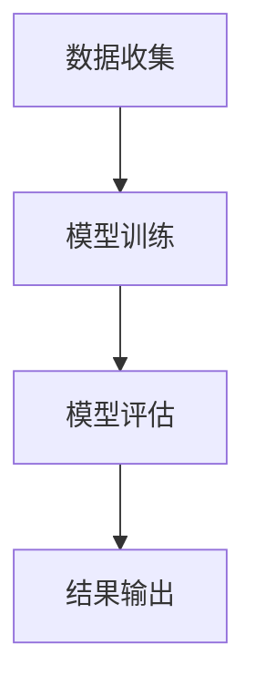

                 

### 文章标题

### 关键词

- 机器学习
- 个性化推荐系统
- 协同过滤
- 内容推荐
- 优化策略

### 摘要

本文深入探讨了机器学习在个性化推荐系统中的应用与优化。首先介绍了机器学习的基本概念及其在推荐系统中的重要性，接着详细阐述了推荐系统的原理和类型。重点讨论了用户行为分析、用户兴趣建模及个性化推荐算法，并探讨了优化策略在推荐系统中的应用。最后，本文以电商推荐系统为例，展示了机器学习在实际项目中的应用效果和优化方法。

### 目录大纲

----------------------------------------------------------------

# 第一部分：机器学习基础

## 第1章：机器学习概述

### 1.1 机器学习的基本概念

#### 1.1.1 问题背景

##### 1.1.1.1 机器学习的发展历程

##### 1.1.1.2 机器学习的基本原理

##### 1.1.1.3 机器学习的重要性和应用领域

### 1.2 监督学习

#### 1.2.1 监督学习的定义和分类

##### 1.2.1.1 线性回归

##### 1.2.1.2 决策树

##### 1.2.1.3 支持向量机

### 1.3 无监督学习

#### 1.3.1 无监督学习的定义和分类

##### 1.3.1.1 聚类分析

##### 1.3.1.2 维度约减

## 第2章：推荐系统原理

### 2.1 推荐系统概述

#### 2.1.1 推荐系统的定义

##### 2.1.1.1 问题背景

##### 2.1.1.2 推荐系统的基本组成

##### 2.1.1.3 推荐系统的分类

### 2.2 协同过滤

#### 2.2.1 协同过滤的基本原理

##### 2.2.1.1 用户基于模型的协同过滤

##### 2.2.1.2 项目基于模型的协同过滤

##### 2.2.1.3 混合协同过滤

### 2.3 内容推荐

#### 2.3.1 内容推荐的基本原理

##### 2.3.1.1 文本特征提取

##### 2.3.1.2 文本相似度计算

##### 2.3.1.3 基于内容的推荐策略

## 第3章：机器学习在个性化推荐中的应用

### 3.1 个性化推荐系统概述

#### 3.1.1 个性化推荐系统的定义

##### 3.1.1.1 问题背景

##### 3.1.1.2 个性化推荐系统的优势

##### 3.1.1.3 个性化推荐系统的挑战

### 3.2 用户行为分析

#### 3.2.1 用户行为数据收集

##### 3.2.1.1 用户点击行为数据

##### 3.2.1.2 用户购买行为数据

##### 3.2.1.3 用户浏览行为数据

### 3.3 用户兴趣建模

#### 3.3.1 用户兴趣特征提取

##### 3.3.1.1 用户兴趣建模的方法

##### 3.3.1.2 用户兴趣特征提取的技巧

### 3.4 个性化推荐算法

#### 3.4.1 协同过滤算法

##### 3.4.1.1 MF算法

##### 3.4.1.2 SVD算法

##### 3.4.1.3 ItemCF算法

#### 3.4.2 内容推荐算法

##### 3.4.2.1 文本分类算法

##### 3.4.2.2 文本匹配算法

##### 3.4.2.3 内容推荐算法组合

## 第4章：优化策略在个性化推荐系统中的应用

### 4.1 优化策略概述

#### 4.1.1 优化策略的定义

##### 4.1.1.1 问题背景

##### 4.1.1.2 优化策略的目标

##### 4.1.1.3 优化策略的分类

### 4.2 模型优化策略

#### 4.2.1 模型调参

##### 4.2.1.1 模型超参数调整

##### 4.2.1.2 模型训练策略优化

### 4.3 数据优化策略

#### 4.3.1 数据清洗

##### 4.3.1.1 数据缺失处理

##### 4.3.1.2 数据异常值处理

##### 4.3.1.3 数据标准化

### 4.4 系统优化策略

#### 4.4.1 推荐结果排序优化

##### 4.4.1.1 排序算法优化

##### 4.4.1.2 排序策略调整

## 第5章：机器学习在电商推荐系统中的应用

### 5.1 电商推荐系统概述

#### 5.1.1 电商推荐系统的定义

##### 5.1.1.1 问题背景

##### 5.1.1.2 电商推荐系统的优势

##### 5.1.1.3 电商推荐系统的挑战

### 5.2 用户行为分析

#### 5.2.1 用户点击行为分析

##### 5.2.1.1 用户点击行为数据收集

##### 5.2.1.2 用户点击行为特征提取

### 5.3 用户兴趣建模

#### 5.3.1 用户兴趣建模方法

##### 5.3.1.1 基于内容的用户兴趣建模

##### 5.3.1.2 基于协同过滤的用户兴趣建模

### 5.4 个性化推荐算法

#### 5.4.1 协同过滤算法

##### 5.4.1.1 MF算法

##### 5.4.1.2 SVD算法

##### 5.4.1.3 ItemCF算法

#### 5.4.2 内容推荐算法

##### 5.4.2.1 文本分类算法

##### 5.4.2.2 文本匹配算法

##### 5.4.2.3 内容推荐算法组合

## 结束语

### 参考文献

----------------------------------------------------------------
## 第1章：机器学习概述

### 1.1 机器学习的基本概念

#### 1.1.1 问题背景

机器学习（Machine Learning）是人工智能（Artificial Intelligence, AI）的一个重要分支，其核心思想是通过算法从数据中自动学习规律和模式，以实现计算机对数据的自动处理和决策。随着互联网的普及和数据量的爆炸性增长，机器学习在各个领域得到了广泛应用，尤其在推荐系统、自然语言处理、计算机视觉等领域取得了显著的成果。

#### 1.1.2 机器学习的基本原理

机器学习的基本原理可以分为三个层次：数据收集、模型训练和模型评估。

1. **数据收集**：收集大量的数据作为训练集，这些数据可以是结构化的，如数据库中的表格；也可以是非结构化的，如图像、文本等。
2. **模型训练**：使用训练集数据对机器学习模型进行训练，模型通过学习数据中的规律和模式，生成对未知数据的预测结果。
3. **模型评估**：通过测试集数据对训练好的模型进行评估，以判断模型是否达到了预期的性能。

#### 1.1.3 机器学习的重要性和应用领域

机器学习的重要性体现在其能够自动地从大量数据中提取有用信息，从而实现数据驱动决策。应用领域广泛，包括但不限于：

- **推荐系统**：通过用户的历史行为数据，为用户推荐感兴趣的商品或内容。
- **自然语言处理**：用于文本分类、情感分析、机器翻译等。
- **计算机视觉**：用于图像识别、目标检测、人脸识别等。
- **金融领域**：用于风险评估、股票预测、信用评分等。
- **医疗领域**：用于疾病预测、诊断、治疗方案推荐等。

### 1.2 监督学习

监督学习（Supervised Learning）是一种常见的机器学习方法，其特点是有明确的输入和输出数据。监督学习的目标是学习一个函数，将输入映射到输出，使得对于新的输入数据，可以预测其对应的输出。

#### 1.2.1 监督学习的定义和分类

监督学习可以分为以下几类：

- **线性回归**（Linear Regression）：通过学习输入和输出之间的线性关系，预测输出值。
  
  $$ y = \beta_0 + \beta_1 \cdot x $$

- **决策树**（Decision Tree）：通过一系列的判断条件，将数据划分为不同的区域，每个区域的输出值不同。

  

- **支持向量机**（Support Vector Machine, SVM）：通过找到最佳的超平面，将不同类别的数据分开。

  

### 1.3 无监督学习

无监督学习（Unsupervised Learning）与监督学习不同，其输入数据没有明确的输出标签。无监督学习的目标是从数据中发现潜在的结构和模式。

#### 1.3.1 无监督学习的定义和分类

无监督学习可以分为以下几类：

- **聚类分析**（Clustering Analysis）：将数据分为若干个类别，使同类别内的数据相似度较高，不同类别间的数据相似度较低。

  

- **维度约减**（Dimensionality Reduction）：通过降维技术，减少数据的空间维度，提高模型的训练效率和预测准确性。

  

### 1.4 小结

本章介绍了机器学习的基本概念、监督学习和无监督学习的原理。机器学习在个性化推荐系统中的应用至关重要，其通过学习用户的历史行为数据，实现用户兴趣的挖掘和推荐内容的生成。接下来，我们将进一步探讨推荐系统的原理和类型，以便更深入地了解机器学习在推荐系统中的应用。

---

**Mermaid流程图：**



**Python源代码：**

```python
# 机器学习流程示例

# 导入必要的库
import numpy as np
import pandas as pd

# 数据收集
data = pd.DataFrame({
    'feature1': [1, 2, 3, 4],
    'feature2': [2, 3, 4, 5],
    'label': [0, 1, 0, 1]
})

# 模型训练
# 这里使用简单的线性回归模型
from sklearn.linear_model import LinearRegression

model = LinearRegression()
model.fit(data[['feature1', 'feature2']], data['label'])

# 模型评估
predictions = model.predict(data[['feature1', 'feature2']])
print(predictions)

# 结果输出
print("预测结果：", predictions)
```

### 参考文献

- Mitchell, T. M. (1997). **Machine Learning**. McGraw-Hill.
- Hastie, T., Tibshirani, R., & Friedman, J. (2009). **The Elements of Statistical Learning**. Springer.
- Kotsiantis, S. B. (2007). **Supervised Machine Learning: A Review of Classification Techniques**. Informatica, 31(3), 249-268.

