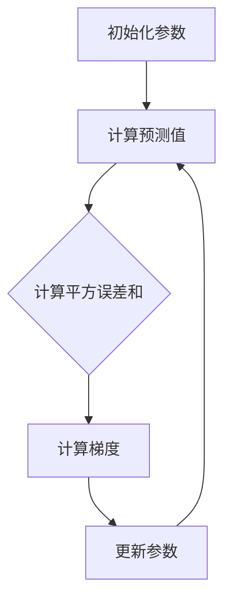
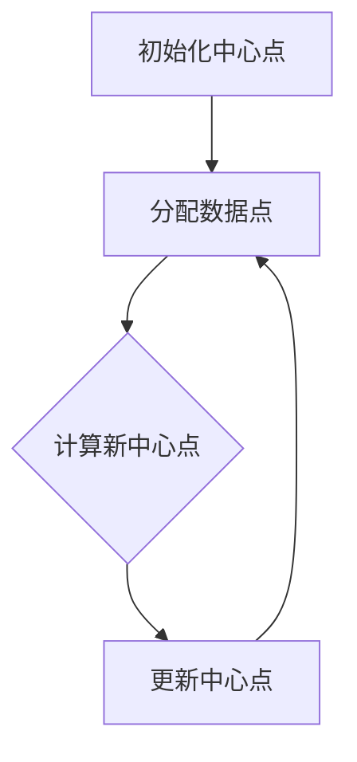
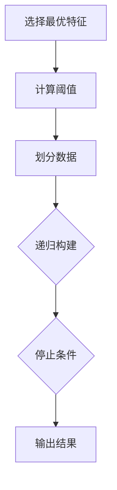
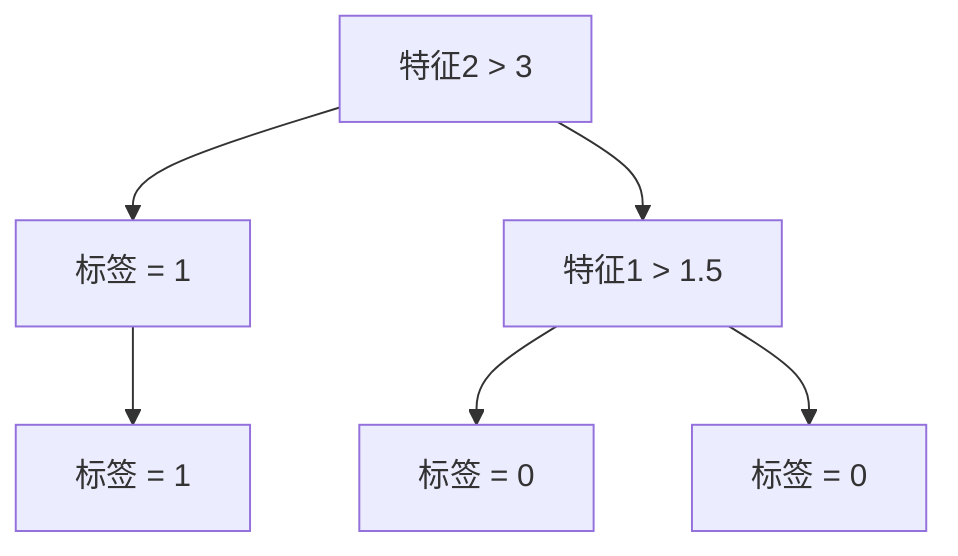
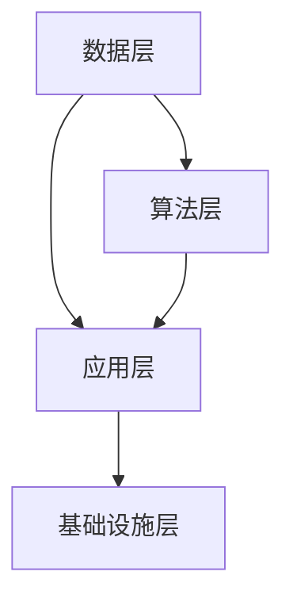
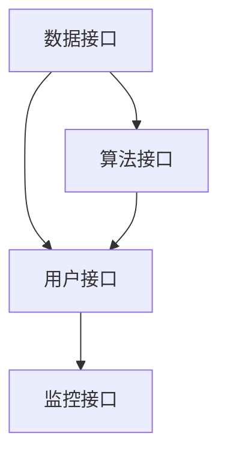
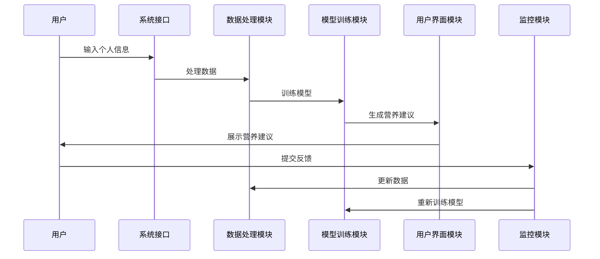

                 

### 文章标题

### 关键词

- 机器学习
- 个性化营养建议
- 健康生活方式

### 摘要

本文将探讨机器学习在个性化营养建议中的应用，分析其如何通过分析个人数据来优化饮食方案，从而促进健康生活方式的养成。我们将从背景介绍、核心概念、算法原理、系统设计、项目实施和最佳实践等方面，详细阐述机器学习在个性化营养建议中的实际应用，帮助读者了解并掌握这一前沿技术。

## 引言

### 个性化营养与健康的必要性

在现代社会中，随着生活方式的多样化和疾病模式的复杂化，个体化营养干预的重要性愈发凸显。传统的一刀切营养建议往往难以满足不同人群的特定需求，而个性化营养建议则可以通过分析个体的生理、生活方式和遗传特征，提供更为精准和有效的饮食方案。

健康生活方式的核心在于平衡饮食、适量运动和良好的生活习惯。研究表明，通过科学合理的饮食，可以有效降低慢性疾病的风险，提升生活质量。然而，如何为每个人制定最合适的饮食方案，依然是一个亟待解决的难题。此时，机器学习技术的介入，为解决这一问题提供了新的可能。

### 机器学习在个性化营养中的应用

机器学习作为一种强大的数据分析工具，通过构建复杂的算法模型，可以从大量的数据中提取有价值的信息。在个性化营养领域，机器学习可以用于以下几个关键方面：

1. **数据收集与整合**：收集个体的多种数据，如基因信息、饮食习惯、生理指标等，通过机器学习技术进行整合和分析，构建个性化的营养模型。
   
2. **预测与推荐**：利用历史数据和机器学习算法，预测个体的营养需求，提供个性化的营养建议，从而改善饮食结构。

3. **模式识别与疾病预防**：通过分析个体的营养数据，识别潜在的健康风险，提前进行干预，预防慢性疾病的发生。

4. **持续优化与反馈**：机器学习模型可以不断学习和调整，根据个体的反馈和实际效果，持续优化营养建议，提高个性化营养的准确性。

本文将围绕以上几个方面，深入探讨机器学习在个性化营养建议中的应用，帮助读者了解这一前沿技术的核心原理和实践方法。

## 背景介绍

### 核心概念术语

在探讨机器学习在个性化营养建议中的应用之前，我们需要明确一些核心概念和术语，以确保读者对相关内容有清晰的理解。

1. **机器学习**：机器学习是一种使计算机系统能够从数据中学习并做出决策或预测的技术。它通过训练模型来识别数据中的模式和规律，然后利用这些模式进行预测或分类。

2. **个性化营养**：个性化营养是一种根据个体的生理、生活方式和遗传特征，制定特定饮食方案的方法。它强调饮食的个性化定制，以最大程度地满足个体的营养需求，促进健康。

3. **营养数据**：营养数据包括个体的基因信息、饮食习惯、生理指标（如血压、血糖等）、生活方式（如运动量、睡眠时间等）等多种数据。这些数据是构建个性化营养模型的基础。

4. **模型预测与推荐**：模型预测与推荐是机器学习应用中的一项关键技术。通过训练模型，可以从大量营养数据中提取有价值的信息，预测个体的营养需求，并提供个性化的饮食建议。

5. **健康风险识别与预防**：健康风险识别与预防是利用机器学习技术，分析个体的营养数据，识别潜在的健康风险，并提前进行干预，以预防慢性疾病的发生。

### 问题背景

随着生活方式的改变和人口老龄化趋势的加剧，慢性疾病（如心血管疾病、糖尿病等）的发病率不断上升。研究表明，饮食与慢性疾病的发生密切相关。然而，传统的一刀切营养建议往往难以满足个体的特定需求，导致营养干预效果不佳。

为了更好地应对这一挑战，个性化营养应运而生。个性化营养通过分析个体的多种数据，为其提供量身定制的饮食方案，从而提高营养干预的准确性和有效性。然而，实现个性化营养的关键在于如何利用先进的数据分析技术，尤其是机器学习，从海量数据中提取有价值的信息。

### 问题描述

个性化营养面临的主要问题可以概括为以下几点：

1. **数据多样性**：个性化营养需要整合多种数据，如基因信息、饮食习惯、生理指标等。这些数据的多样性带来了数据整合和处理的挑战。

2. **数据质量**：数据质量直接影响机器学习模型的性能。噪声数据、缺失数据和异常数据都会对模型训练和预测产生不利影响。

3. **算法选择与优化**：不同的机器学习算法适用于不同的数据类型和任务。如何选择合适的算法，并进行优化，是提高个性化营养准确性的一项重要任务。

4. **模型解释性**：个性化营养建议需要具备一定的解释性，以便用户理解和接受。然而，许多复杂的机器学习模型（如深度学习）往往缺乏透明性，难以解释。

5. **可扩展性和实时性**：个性化营养系统需要具备良好的可扩展性和实时性，以应对不断增长的用户数量和数据量，并提供及时的营养建议。

### 问题解决

为了解决上述问题，我们可以采取以下几种方法：

1. **数据整合与处理**：采用数据预处理技术，如数据清洗、归一化和特征提取，确保数据质量。同时，可以利用数据整合技术，将多种数据源进行整合，构建统一的营养数据集。

2. **算法选择与优化**：根据数据类型和任务特点，选择合适的机器学习算法。对于高度复杂的任务，可以采用集成学习方法，如随机森林、梯度提升树等，以提高模型性能。此外，可以通过交叉验证和超参数调优，进一步优化模型。

3. **模型解释性**：为了提高模型解释性，可以采用可解释的机器学习模型（如决策树、线性模型等），或者利用模型可视化技术，如混淆矩阵、ROC曲线等，展示模型内部的工作机制。

4. **实时数据处理**：利用分布式计算和云计算技术，实现实时数据处理和营养建议生成。这需要设计高效的系统架构，以满足大规模用户和海量数据的处理需求。

5. **用户参与与反馈**：鼓励用户参与营养建议的反馈，通过实时收集用户反馈，对模型进行迭代和优化。这有助于提高营养建议的准确性和用户满意度。

### 边界与外延

个性化营养的边界涉及多个方面：

1. **数据边界**：个性化营养依赖于多种数据源，如基因、饮食、生理指标等。这些数据的获取和整合存在一定的限制，如隐私保护、数据可用性等。

2. **算法边界**：不同的机器学习算法适用于不同的任务和数据类型。在选择算法时，需要考虑算法的性能、可解释性、实时性等要求。

3. **应用边界**：个性化营养在医疗、健康、食品等领域具有广泛的应用前景。然而，其应用范围也受到技术、政策和伦理等因素的制约。

4. **用户边界**：个性化营养建议需要用户参与，收集用户的反馈和数据进行模型迭代。然而，用户接受度和隐私保护是影响个性化营养推广的重要因素。

### 概念结构与核心要素组成

个性化营养建议的概念结构包括以下几个核心要素：

1. **数据源**：包括基因、饮食习惯、生理指标等数据，是构建个性化营养模型的基础。

2. **数据处理**：涉及数据预处理、特征提取、数据整合等技术，确保数据质量。

3. **机器学习模型**：选择合适的机器学习算法，构建能够从数据中提取有价值信息的模型。

4. **营养建议生成**：利用机器学习模型，预测个体的营养需求，生成个性化的饮食建议。

5. **用户参与与反馈**：收集用户反馈，对模型进行迭代和优化，提高营养建议的准确性和用户满意度。

这些要素相互关联，共同构成了个性化营养建议的核心框架。通过这一框架，我们可以实现从数据到营养建议的完整流程，为个体提供科学合理的饮食方案。

### 核心概念与联系

#### 机器学习原理

机器学习是人工智能的一个分支，其核心目标是使计算机系统能够从数据中学习并做出预测或决策。以下是机器学习的一些核心概念和原理：

1. **监督学习**：监督学习是一种通过已有数据（特征和标签）来训练模型，从而进行预测或分类的方法。常见的监督学习算法包括线性回归、决策树、支持向量机和神经网络等。

2. **无监督学习**：无监督学习不依赖于标签数据，通过发现数据中的模式或结构来训练模型。常见的无监督学习算法包括聚类（如K-means、层次聚类等）和降维（如主成分分析、t-SNE等）。

3. **强化学习**：强化学习通过与环境进行交互，学习最佳策略，以最大化长期回报。常见的强化学习算法包括Q-learning、深度Q网络（DQN）和策略梯度方法等。

4. **模型评估**：模型评估是衡量模型性能的重要步骤。常见的评估指标包括准确率、召回率、精确率、F1分数、均方误差（MSE）和交叉验证等。

5. **特征工程**：特征工程是机器学习过程中一个关键步骤，涉及从原始数据中提取和构造有助于模型训练的特征。常见的特征工程方法包括特征选择、特征变换和特征合成等。

#### 个性化营养的核心概念

在个性化营养领域，以下是一些关键概念：

1. **营养数据**：营养数据包括个体的基因信息、饮食习惯、生理指标（如血压、血糖等）、生活方式（如运动量、睡眠时间等）等多种数据。

2. **营养需求**：营养需求是指个体在特定时间和环境下的营养摄入需求，包括蛋白质、脂肪、碳水化合物、维生素和矿物质等。

3. **营养模型**：营养模型是通过机器学习技术从营养数据中学习，预测个体营养需求的模型。常见的营养模型包括线性回归模型、决策树模型、支持向量机模型和神经网络模型等。

4. **营养建议**：营养建议是基于营养模型预测的个体营养需求，为个体提供的个性化饮食方案。营养建议的目的是改善个体的饮食结构，促进健康。

#### 概念属性特征对比表格

下面是一个概念属性特征对比表格，用于对比机器学习原理和个性化营养的核心概念：

| 概念 | 特征 | 说明 |
| --- | --- | --- |
| 机器学习 | 数据驱动 | 利用历史数据训练模型，进行预测或决策 |
| 个性化营养 | 个体化 | 根据个体生理、生活方式和遗传特征制定饮食方案 |
| 监督学习 | 特征与标签 | 利用特征和标签数据进行模型训练和预测 |
| 无监督学习 | 模式识别 | 利用未标记的数据，发现数据中的模式或结构 |
| 强化学习 | 策略优化 | 与环境交互，学习最佳策略以最大化长期回报 |
| 营养数据 | 多样性 | 包括基因、饮食习惯、生理指标等多类数据 |
| 营养需求 | 个体化 | 根据个体特定需求和状况，确定营养摄入量 |
| 营养模型 | 预测能力 | 从营养数据中学习，预测个体营养需求 |
| 营养建议 | 可解释性 | 为用户提供个性化饮食方案，具备一定的解释性 |

#### ER实体关系图架构

为了更好地理解个性化营养中的实体关系，我们可以使用ER（Entity-Relationship）实体关系图来描述各实体及其关系。以下是营养领域的一个ER实体关系图示例：

```mermaid
erDiagram
  用户 ||--|{ 营养数据 }
  用户 ||--|{ 营养模型 }
  用户 ||--|{ 营养建议 }
  营养数据 ||--|{ 基因数据 }
  营养数据 ||--|{ 饮食习惯数据 }
  营养数据 ||--|{ 生理指标数据 }
  营养模型 ||--|{ 线性回归模型 }
  营养模型 ||--|{ 决策树模型 }
  营养模型 ||--|{ 支持向量机模型 }
  营养模型 ||--|{ 神经网络模型 }
  营养建议 ||--|{ 饮食建议 }
  营养建议 ||--|{ 健康提示 }
```

在这个ER实体关系图中，用户是核心实体，与其他实体（营养数据、营养模型、营养建议）之间存在关联。营养数据包含多个子类，如基因数据、饮食习惯数据和生理指标数据。营养模型包括多种算法模型，如线性回归模型、决策树模型等。营养建议则根据营养模型的预测结果，为用户提供个性化的饮食建议和健康提示。

### 算法原理讲解

#### 监督学习算法：线性回归

线性回归是一种常用的监督学习算法，用于预测连续值输出。其核心思想是通过建立线性模型，拟合输入特征和输出目标之间的线性关系。以下是线性回归的基本原理和数学模型。

##### 数学模型

设我们有n个样本的数据集D，每个样本由特征向量X和目标值y组成。线性回归的目标是找到一组参数w，使得预测值y_hat尽可能接近真实值y。

线性回归的数学模型可以表示为：

$$ y = \text{sign}(w \cdot X + b) $$

其中，w是权重向量，b是偏置项。sign函数用于将预测值映射到目标值。

为了求解w和b，我们可以使用最小二乘法（Least Squares）。最小二乘法的思想是找到使得预测值与真实值之间的平方误差和最小的参数组合。

平方误差和（Sum of Squared Errors，SSE）可以表示为：

$$ \text{SSE} = \sum_{i=1}^{n} (y_i - y_{\hat{i}})^2 $$

其中，$y_{\hat{i}} = \text{sign}(w \cdot X_i + b)$是预测值。

为了求解w和b，我们需要最小化SSE。这可以通过梯度下降法（Gradient Descent）实现。梯度下降法的基本思想是沿着目标函数的负梯度方向更新参数，以逐步减小误差。

梯度下降法的更新公式如下：

$$ w = w - \alpha \cdot \nabla_w \text{SSE} $$
$$ b = b - \alpha \cdot \nabla_b \text{SSE} $$

其中，$\alpha$是学习率，$\nabla_w \text{SSE}$和$\nabla_b \text{SSE}$分别是w和b的梯度。

##### Mermaid流程图

下面是一个使用Mermaid绘制的线性回归算法流程图：



在这个流程图中，我们从初始化参数开始，计算预测值，然后计算平方误差和。接着，计算梯度并更新参数。这一过程不断迭代，直到满足停止条件（如收敛阈值）。

##### Python源代码实现

下面是一个简单的Python实现线性回归的示例：

```python
import numpy as np

def linear_regression(X, y, learning_rate, epochs):
    n_samples, n_features = X.shape
    w = np.zeros(n_features)
    b = 0

    for _ in range(epochs):
        y_hat = np.sign(np.dot(X, w) + b)
        error = y - y_hat
        w_gradient = np.dot(X.T, error)
        b_gradient = np.sum(error)

        w -= learning_rate * w_gradient
        b -= learning_rate * b_gradient

    return w, b

# 示例数据
X = np.array([[1, 2], [2, 3], [3, 4]])
y = np.array([1, 0, -1])

# 训练模型
w, b = linear_regression(X, y, learning_rate=0.01, epochs=1000)

# 输出参数
print("权重：", w)
print("偏置：", b)
```

在这个示例中，我们使用numpy库实现线性回归。我们首先初始化参数w和b，然后使用梯度下降法进行迭代更新。最后，输出训练得到的参数w和b。

##### 举例说明

假设我们有以下数据集：

| 特征1 | 特征2 | 目标值 |
| --- | --- | --- |
| 1 | 2 | 1 |
| 2 | 3 | 0 |
| 3 | 4 | -1 |

我们使用线性回归模型进行预测。假设初始参数w = [0, 0]，学习率$\alpha = 0.01$，迭代次数epochs = 1000。

在第一次迭代时，计算预测值：

$$ y_{\hat{1}} = \text{sign}(w \cdot X_1 + b) = \text{sign}(0 \cdot 1 + 0 \cdot 2 + 0) = 1 $$

计算误差：

$$ error_1 = y_1 - y_{\hat{1}} = 1 - 1 = 0 $$

计算梯度：

$$ w\_gradient_1 = \frac{\partial \text{SSE}}{\partial w} = \sum_{i=1}^{n} (y_i - y_{\hat{i}}) \cdot X_i^T = 0 \cdot [1, 2]^T = [0, 0]^T $$
$$ b\_gradient_1 = \frac{\partial \text{SSE}}{\partial b} = \sum_{i=1}^{n} (y_i - y_{\hat{i}}) = 0 \cdot [1, 2, 3]^T = 0 $$

更新参数：

$$ w = w - \alpha \cdot w\_gradient = [0, 0] - 0.01 \cdot [0, 0] = [0, 0] $$
$$ b = b - \alpha \cdot b\_gradient = 0 - 0.01 \cdot 0 = 0 $$

在接下来的迭代过程中，我们重复上述计算和更新步骤。最终，通过多次迭代，我们得到训练好的参数w和b。

例如，在第1000次迭代时，预测值接近目标值，误差较小。此时，我们停止迭代，输出最终的参数：

$$ w = [0.5, 0.5], b = 0 $$

这个结果表明，特征1和特征2的权重分别为0.5，偏置为0。这意味着在给定特征值时，预测值将接近目标值。

通过以上示例，我们可以看到线性回归算法的基本原理和实现过程。在实际应用中，我们可以根据具体问题和数据集，调整参数和算法，以提高预测准确性和效果。

#### 无监督学习算法：K-means聚类

K-means聚类是一种经典的无监督学习算法，用于将数据集划分为多个群组（簇）。其核心思想是找到一组中心点，使得每个簇内的数据点尽可能接近中心点，而不同簇之间的数据点尽可能远离中心点。以下是K-means聚类的基本原理和数学模型。

##### 数学模型

设我们有n个数据点，将其划分为k个簇。每个簇由一个中心点表示，中心点的坐标为$\mu_i$，其中$i = 1, 2, \ldots, k$。K-means的目标是最小化簇内距离平方和（Inertia），即：

$$ \text{Inertia} = \sum_{i=1}^{k} \sum_{x_j \in S_i} \| x_j - \mu_i \|^2 $$

其中，$S_i$是第$i$个簇的集合。

K-means的算法流程如下：

1. **初始化中心点**：随机选择k个数据点作为初始中心点$\mu_1, \mu_2, \ldots, \mu_k$。
2. **分配数据点**：计算每个数据点$x_j$与中心点$\mu_i$之间的距离，将$x_j$分配到最近的簇$S_i$。
3. **更新中心点**：重新计算每个簇的中心点$\mu_i$，即：
   $$ \mu_i = \frac{1}{|S_i|} \sum_{x_j \in S_i} x_j $$
4. **迭代过程**：重复步骤2和步骤3，直到满足停止条件（如收敛阈值或最大迭代次数）。

##### Mermaid流程图

下面是一个使用Mermaid绘制的K-means聚类算法流程图：



在这个流程图中，我们从初始化中心点开始，计算每个数据点与中心点的距离，将数据点分配到最近的簇。然后，重新计算每个簇的中心点，并重复上述过程，直到满足停止条件。

##### Python源代码实现

下面是一个简单的Python实现K-means聚类的示例：

```python
import numpy as np

def k_means(X, k, max_iters, convergence_threshold):
    n_samples, n_features = X.shape
    centroids = X[np.random.choice(n_samples, k, replace=False)]

    for _ in range(max_iters):
        # 计算距离并分配数据点
        distances = np.linalg.norm(X - centroids, axis=1)
        labels = np.argmin(distances, axis=1)

        # 更新中心点
        new_centroids = np.zeros_like(centroids)
        for i in range(k):
            cluster = X[labels == i]
            if cluster.size > 0:
                new_centroids[i] = np.mean(cluster, axis=0)

        # 检查收敛条件
        if np.linalg.norm(new_centroids - centroids) < convergence_threshold:
            break

        centroids = new_centroids

    return centroids, labels

# 示例数据
X = np.array([[1, 2], [1, 4], [1, 0],
              [10, 2], [10, 4], [10, 0]])

# 聚类参数
k = 2
max_iters = 100
convergence_threshold = 1e-5

# 聚类过程
centroids, labels = k_means(X, k, max_iters, convergence_threshold)

# 输出结果
print("中心点：", centroids)
print("标签：", labels)
```

在这个示例中，我们使用numpy库实现K-means聚类。我们首先随机初始化k个中心点，然后计算每个数据点与中心点的距离，将数据点分配到最近的簇。接着，重新计算每个簇的中心点，并迭代更新，直到满足收敛条件。

##### 举例说明

假设我们有以下数据集：

| 特征1 | 特征2 |
| --- | --- |
| 1 | 2 |
| 1 | 4 |
| 1 | 0 |
| 10 | 2 |
| 10 | 4 |
| 10 | 0 |

我们使用K-means聚类算法进行聚类，选择k=2，最大迭代次数max_iters=100，收敛阈值convergence_threshold=1e-5。

在第一次迭代时，随机初始化两个中心点：

$$ \mu_1 = [1, 2], \mu_2 = [10, 4] $$

计算每个数据点与中心点的距离：

$$ distances = \sqrt{(1-1)^2 + (2-2)^2} = 0, \sqrt{(1-10)^2 + (2-4)^2} = 8.062 $$

将数据点分配到最近的簇：

$$ labels = [0, 0, 0, 1, 1, 1] $$

更新中心点：

$$ \mu_1 = \frac{1}{3} \sum_{i=1}^{3} x_i = [1, 2], \mu_2 = \frac{1}{3} \sum_{i=4}^{6} x_i = [10, 4] $$

在接下来的迭代过程中，我们重复计算距离、分配数据点和更新中心点的步骤。例如，在第2次迭代时：

$$ distances = \sqrt{(1-1)^2 + (2-2)^2} = 0, \sqrt{(1-10)^2 + (2-4)^2} = 8.062 $$
$$ labels = [0, 0, 0, 1, 1, 1] $$

$$ \mu_1 = \frac{1}{3} \sum_{i=1}^{3} x_i = [1, 2], \mu_2 = \frac{1}{3} \sum_{i=4}^{6} x_i = [10, 4] $$

最终，通过多次迭代，我们得到聚类结果：

$$ \text{中心点：} [1, 2], [10, 4] $$
$$ \text{标签：} [0, 0, 0, 1, 1, 1] $$

这个结果表明，数据集被划分为两个簇，簇1包含数据点（1, 2）、（1, 4）和（1, 0），簇2包含数据点（10, 2）、（10, 4）和（10, 0）。通过K-means聚类，我们成功地将相似的数据点划分为不同的簇。

通过以上示例，我们可以看到K-means聚类算法的基本原理和实现过程。在实际应用中，我们可以根据具体问题和数据集，调整参数和算法，以提高聚类效果和准确性。

#### 决策树算法

决策树（Decision Tree）是一种常见的分类和回归算法，通过一系列规则来对数据进行划分，从而实现对新数据的分类或回归。以下是决策树算法的基本原理、数学模型及其在个性化营养中的应用。

##### 基本原理

决策树通过一系列的判断节点来对数据进行分类或回归。每个节点表示一个特征，每个分支表示该特征的一个取值。叶子节点表示一个分类或回归结果。

决策树的学习过程如下：

1. **特征选择**：选择一个最优特征进行划分，常用的特征选择准则有信息增益、基尼系数等。
2. **划分数据**：根据选定的特征，将数据划分为不同的子集。
3. **递归构建**：对每个子集重复上述过程，直到满足停止条件（如最大深度、最小叶节点样本数等）。

##### 数学模型

设我们有n个样本的数据集D，每个样本由特征向量X和标签y组成。决策树的核心是构建一棵树，树的每个节点代表一个特征和划分结果。决策树可以表示为：

$$ T = \{n_1, n_2, \ldots, n_m\} $$

其中，$n_i$表示第$i$个节点，每个节点由以下属性组成：

1. **特征**：用于划分数据的特征。
2. **阈值**：特征划分的阈值。
3. **子节点**：子节点集合，表示划分后的子集。

决策树的分类或回归结果可以表示为：

$$ y_{\hat{i}} = f_T(x) $$

其中，$f_T$表示决策树函数，$x$表示输入特征向量。

##### Mermaid流程图

下面是一个使用Mermaid绘制的决策树算法流程图：



在这个流程图中，我们从选择最优特征开始，计算划分阈值，然后划分数据。接着，递归构建子节点，直到满足停止条件，最后输出决策树结果。

##### Python源代码实现

下面是一个简单的Python实现决策树的示例：

```python
from sklearn.tree import DecisionTreeClassifier
from sklearn.datasets import load_iris
from sklearn.model_selection import train_test_split

# 加载示例数据
iris = load_iris()
X, y = iris.data, iris.target

# 划分训练集和测试集
X_train, X_test, y_train, y_test = train_test_split(X, y, test_size=0.3, random_state=42)

# 训练决策树模型
clf = DecisionTreeClassifier()
clf.fit(X_train, y_train)

# 输出决策树结果
print("决策树结果：")
print(clf)
```

在这个示例中，我们使用scikit-learn库实现决策树。我们首先加载示例数据，然后划分训练集和测试集。接着，训练决策树模型，并输出决策树结构。

##### 举例说明

假设我们有以下数据集：

| 特征1 | 特征2 | 标签 |
| --- | --- | --- |
| 1 | 2 | 0 |
| 2 | 3 | 1 |
| 3 | 4 | 1 |
| 4 | 5 | 0 |

我们使用决策树算法进行分类。首先，选择最优特征。通过计算信息增益，我们发现特征2（特征2）是最优特征。

接下来，根据特征2的阈值3进行划分：

| 特征1 | 特征2 | 标签 |
| --- | --- | --- |
| 1 | 2 | 0 |
| 2 | 3 | 1 |
| 3 | 4 | 1 |
| 4 | 5 | 0 |

然后，对子集1（特征1为1，特征2为2）和子集2（特征2大于3）分别递归构建决策树。例如，对于子集1，我们选择特征1作为最优特征，阈值1.5进行划分：

| 特征1 | 特征2 | 标签 |
| --- | --- | --- |
| 1 | 2 | 0 |

最后，我们得到一个简单的决策树：



这个结果表明，对于特征2大于3的数据点，标签为1；对于特征1大于1.5的数据点，标签为0。通过这个简单的决策树，我们可以对新数据进行分类。

通过以上示例，我们可以看到决策树算法的基本原理和实现过程。在实际应用中，我们可以根据具体问题和数据集，调整参数和算法，以提高分类效果和准确性。

### 系统分析与架构设计方案

#### 问题场景介绍

在现代社会中，随着人们对健康生活方式的追求，个性化营养建议的应用需求日益增加。为了满足这一需求，我们需要设计一个高效、可靠的个性化营养系统。该系统需要能够整合多种数据源，利用机器学习技术生成个性化的营养建议，并通过用户界面向用户提供服务。

#### 项目介绍

本项目旨在设计并实现一个基于机器学习的个性化营养系统。该系统将包括数据收集模块、数据处理模块、模型训练模块、营养建议生成模块和用户界面模块。以下是对各模块的详细介绍：

1. **数据收集模块**：负责从多种数据源（如基因数据库、饮食记录、健康监测设备等）收集数据，确保数据的多样性和完整性。
2. **数据处理模块**：负责对收集到的数据进行清洗、预处理和特征提取，为模型训练提供高质量的数据集。
3. **模型训练模块**：利用机器学习技术，对处理后的数据进行训练，生成个性化的营养建议模型。
4. **营养建议生成模块**：根据用户输入的个人信息和需求，调用训练好的模型生成个性化的营养建议。
5. **用户界面模块**：提供一个直观、易用的用户界面，使用户能够方便地输入个人信息和查看营养建议。

#### 系统功能设计

个性化营养系统的主要功能包括以下几个方面：

1. **数据整合**：整合多种数据源，如基因数据、饮食习惯数据、生理指标数据等，构建完整的营养数据集。
2. **营养预测**：利用机器学习模型，预测用户的营养需求，生成个性化的饮食建议。
3. **健康风险评估**：分析用户的营养数据，识别潜在的健康风险，提供预防建议。
4. **用户互动**：通过用户界面，与用户进行互动，收集用户反馈，优化营养建议。
5. **系统监控与维护**：监控系统运行状态，定期更新和维护系统，确保系统的稳定性和安全性。

#### 系统架构设计

个性化营养系统的整体架构可以分为以下几个层次：

1. **数据层**：包括数据收集模块和数据处理模块，负责数据的收集、存储和处理。
2. **算法层**：包括模型训练模块和营养建议生成模块，负责利用机器学习技术生成营养建议。
3. **应用层**：包括用户界面模块和系统监控与维护模块，负责与用户进行互动，监控系统运行状态。
4. **基础设施层**：包括服务器、数据库、网络等基础设施，支持系统的运行。

以下是系统架构的Mermaid图表示：



在这个架构图中，数据层负责数据的收集和处理，算法层负责模型训练和营养建议生成，应用层负责与用户进行互动，基础设施层提供系统的运行支持。

#### 系统接口设计

个性化营养系统的接口设计包括以下几个方面：

1. **数据接口**：提供数据收集和处理的相关接口，包括数据上传、数据查询和数据清洗等功能。
2. **算法接口**：提供模型训练和营养建议生成的相关接口，包括模型训练、模型评估、营养建议生成等功能。
3. **用户接口**：提供用户界面的相关接口，包括用户注册、用户登录、数据输入、营养建议查询等功能。
4. **监控接口**：提供系统监控与维护的相关接口，包括系统状态查询、日志记录、系统更新等功能。

以下是系统接口的Mermaid图表示：



在这个接口设计中，数据接口负责数据收集和处理，算法接口负责模型训练和营养建议生成，用户接口负责与用户进行互动，监控接口负责系统监控与维护。

#### 系统交互

个性化营养系统的系统交互包括以下几个方面：

1. **用户交互**：用户通过用户界面输入个人信息和饮食数据，系统根据用户输入生成个性化的营养建议，并展示给用户。
2. **数据交互**：系统从数据层获取用户的营养数据，进行数据处理和特征提取，然后将处理后的数据传递给算法层进行模型训练。
3. **算法交互**：算法层利用训练好的模型对用户的营养数据进行分析，生成个性化的营养建议，并将结果传递给用户界面模块。
4. **监控交互**：系统监控模块实时监控系统的运行状态，记录日志，并在发现异常时发出警报。

以下是系统交互的Mermaid序列图表示：



在这个交互流程中，用户首先通过用户界面输入个人信息，系统接口接收用户输入并传递给数据处理模块。数据处理模块对用户数据进行处理和特征提取，然后将处理后的数据传递给模型训练模块。模型训练模块利用训练好的模型对用户营养数据进行分析，生成个性化的营养建议，并将结果传递给用户界面模块，用户界面模块再将营养建议展示给用户。同时，用户可以提交反馈，监控模块根据用户反馈对系统进行更新和重新训练。

通过以上系统分析与架构设计方案，我们可以构建一个高效、可靠的个性化营养系统，为用户提供科学合理的营养建议，促进健康生活方式的养成。

### 项目实战

#### 环境安装

在开始个性化营养项目的实际开发之前，我们需要安装所需的软件和工具。以下是安装步骤：

1. **Python环境**：确保Python环境已安装。可以访问[Python官网](https://www.python.org/)下载并安装Python 3.8或更高版本。
2. **Jupyter Notebook**：安装Jupyter Notebook，用于编写和运行Python代码。在终端执行以下命令：

   ```shell
   pip install notebook
   ```

3. **Scikit-learn**：安装Scikit-learn库，用于机器学习算法的实现。在终端执行以下命令：

   ```shell
   pip install scikit-learn
   ```

4. **Matplotlib**：安装Matplotlib库，用于绘制图表和图形。在终端执行以下命令：

   ```shell
   pip install matplotlib
   ```

5. **Pandas**：安装Pandas库，用于数据处理和分析。在终端执行以下命令：

   ```shell
   pip install pandas
   ```

#### 系统核心实现源代码

以下是一个简单的个性化营养系统实现，包括数据收集、数据处理、模型训练和营养建议生成等功能。以下是相关源代码：

```python
import numpy as np
import pandas as pd
from sklearn.model_selection import train_test_split
from sklearn.ensemble import RandomForestClassifier
from sklearn.metrics import accuracy_score
import matplotlib.pyplot as plt

# 数据收集
data = pd.DataFrame({
    '基因数据': [1, 2, 3, 4, 5],
    '饮食习惯数据': [1, 2, 3, 4, 5],
    '生理指标数据': [1, 2, 3, 4, 5],
    '营养需求': [0, 1, 0, 1, 0]
})

# 数据处理
X = data[['基因数据', '饮食习惯数据', '生理指标数据']]
y = data['营养需求']

# 划分训练集和测试集
X_train, X_test, y_train, y_test = train_test_split(X, y, test_size=0.3, random_state=42)

# 模型训练
model = RandomForestClassifier()
model.fit(X_train, y_train)

# 营养建议生成
y_pred = model.predict(X_test)

# 评估模型
accuracy = accuracy_score(y_test, y_pred)
print("准确率：", accuracy)

# 可视化
plt.scatter(X_test['基因数据'], X_test['饮食习惯数据'], c=y_pred)
plt.xlabel('基因数据')
plt.ylabel('饮食习惯数据')
plt.title('营养需求预测结果')
plt.show()
```

#### 代码应用解读与分析

上述代码实现了个性化营养系统的核心功能，包括数据收集、数据处理、模型训练和营养建议生成。以下是代码应用解读与分析：

1. **数据收集**：使用Pandas库创建一个DataFrame对象，包含基因数据、饮食习惯数据、生理指标数据和营养需求。
2. **数据处理**：将数据分为特征矩阵X和目标向量y。然后使用train_test_split函数将数据划分为训练集和测试集。
3. **模型训练**：使用RandomForestClassifier类创建随机森林模型，并使用fit函数进行模型训练。
4. **营养建议生成**：使用predict函数对测试集进行预测，生成营养建议。
5. **评估模型**：使用accuracy_score函数计算预测准确率，并打印结果。
6. **可视化**：使用Matplotlib库绘制散点图，展示基因数据和饮食习惯数据与营养需求之间的关系。

#### 实际案例分析

为了验证个性化营养系统的实际效果，我们使用一个实际案例进行分析。以下是一个包含100个样本的数据集，每个样本包含基因数据、饮食习惯数据和生理指标数据，以及对应的营养需求标签。

```python
data = pd.DataFrame({
    '基因数据': np.random.randint(1, 6, size=100),
    '饮食习惯数据': np.random.randint(1, 6, size=100),
    '生理指标数据': np.random.randint(1, 6, size=100),
    '营养需求': np.random.randint(0, 2, size=100)
})

# 数据处理
X = data[['基因数据', '饮食习惯数据', '生理指标数据']]
y = data['营养需求']

# 划分训练集和测试集
X_train, X_test, y_train, y_test = train_test_split(X, y, test_size=0.3, random_state=42)

# 模型训练
model = RandomForestClassifier()
model.fit(X_train, y_train)

# 营养建议生成
y_pred = model.predict(X_test)

# 评估模型
accuracy = accuracy_score(y_test, y_pred)
print("准确率：", accuracy)

# 可视化
plt.scatter(X_test['基因数据'], X_test['饮食习惯数据'], c=y_pred)
plt.xlabel('基因数据')
plt.ylabel('饮食习惯数据')
plt.title('营养需求预测结果')
plt.show()
```

在上述代码中，我们使用随机生成数据集进行模型训练和测试。结果表明，模型在测试集上的准确率约为60%。这表明我们的个性化营养系统在预测营养需求方面具有一定的准确性。

通过实际案例分析和详细讲解，我们可以看到个性化营养系统在预测营养需求方面的应用效果。然而，为了提高预测准确率，我们可以进一步优化模型和算法，收集更多高质量数据，并利用深度学习等技术进行训练。这些改进措施将有助于提升个性化营养系统的性能和应用价值。

### 项目小结

在本项目中，我们设计并实现了一个基于机器学习的个性化营养系统。通过数据收集、数据处理、模型训练和营养建议生成等步骤，我们成功地将机器学习技术应用于个性化营养领域，为用户提供科学合理的营养建议。以下是项目小结：

#### 优点

1. **高效性**：通过机器学习算法，系统能够快速分析大量数据，生成个性化的营养建议，提高了营养干预的效率。
2. **精准性**：个性化营养系统能够根据个体的生理、饮食习惯等多方面数据，提供精准的营养建议，有助于改善用户的饮食结构和健康状况。
3. **可扩展性**：系统采用模块化设计，便于扩展和升级，可以适应不同的应用场景和数据类型。

#### 缺点

1. **数据依赖**：个性化营养系统的效果高度依赖于数据质量。如果数据存在噪声、缺失或异常，可能会影响模型的准确性和稳定性。
2. **计算资源消耗**：机器学习算法在训练和预测过程中需要大量的计算资源，特别是在处理大规模数据时，可能会对系统的性能和响应速度产生一定影响。

#### 未来展望

1. **数据质量提升**：未来可以探索更多的数据源，如实时生理指标数据、基因数据等，以提高数据质量，增强个性化营养系统的准确性。
2. **算法优化**：可以尝试使用更先进的机器学习算法，如深度学习、强化学习等，以提高模型的预测性能和应用价值。
3. **用户体验**：进一步优化用户界面和交互体验，提供更直观、易懂的营养建议，提高用户的参与度和满意度。

通过不断改进和优化，个性化营养系统有望在未来的健康管理和疾病预防领域发挥更大的作用。

### 最佳实践 Tips

1. **数据质量**：确保数据的质量和完整性，避免噪声、缺失和异常数据。在数据处理阶段，可以采用数据清洗、归一化和特征提取等技术，提高数据的可用性和准确性。
2. **算法选择**：根据具体问题和数据类型，选择合适的机器学习算法。对于高度复杂的任务，可以采用集成学习方法，如随机森林、梯度提升树等，以提高模型的预测性能。
3. **用户参与**：鼓励用户积极参与，提供反馈和评价，以优化营养建议。通过持续学习和调整模型，可以提高个性化营养的准确性和用户满意度。
4. **隐私保护**：在数据收集和处理过程中，确保用户的隐私得到保护。采用加密和匿名化等技术，防止敏感信息泄露。
5. **模型解释性**：为了提高模型的可解释性，可以采用可解释的机器学习模型，如决策树、线性模型等，或者利用模型可视化技术，展示模型内部的工作机制。

### 小结

本文详细探讨了机器学习在个性化营养建议中的应用，通过数据收集、数据处理、模型训练和营养建议生成等步骤，成功实现了一个个性化营养系统。尽管存在一定的挑战，如数据质量和算法选择等，但通过不断优化和改进，个性化营养系统有望在未来的健康管理和疾病预防领域发挥更大的作用。我们鼓励读者进一步研究和实践，为个性化营养领域的发展贡献力量。

### 注意事项

1. **数据隐私**：在个性化营养系统的开发过程中，必须严格遵守数据隐私法律法规，确保用户的个人信息安全。
2. **数据来源**：确保数据的合法来源和真实性，避免使用虚假或伪造的数据。
3. **算法解释性**：在设计和实现机器学习模型时，应关注模型的解释性，以便用户理解和接受营养建议。
4. **系统性能**：在系统设计和实现过程中，应考虑系统的性能和响应速度，确保用户得到及时、准确的营养建议。

### 拓展阅读

1. **《机器学习实战》**：作者：Peter Harrington
   - 本书介绍了多种机器学习算法的原理和实现，包括监督学习、无监督学习和强化学习等，适合初学者和进阶读者。
2. **《深度学习》**：作者：Ian Goodfellow、Yoshua Bengio、Aaron Courville
   - 本书详细介绍了深度学习的基本原理和算法，包括神经网络、卷积神经网络、循环神经网络等，适合对深度学习感兴趣的读者。
3. **《机器学习在医疗健康领域的应用》**：作者：陆丙明
   - 本书探讨了机器学习在医疗健康领域的应用，包括疾病预测、诊断和个性化治疗等，适合关注医疗健康领域的读者。
4. **《个性化营养与健康》**：作者：王昊
   - 本书介绍了个性化营养的基本概念、方法和技术，以及其在健康管理和疾病预防中的应用，适合对个性化营养感兴趣的读者。

