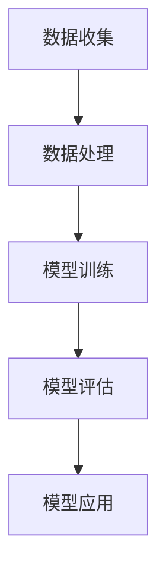
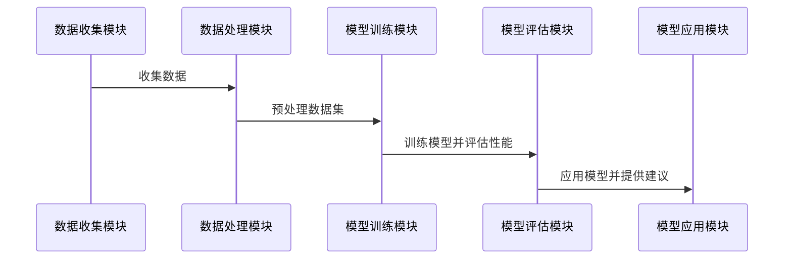

                 


### 机器学习在地震风险评估中的应用：改进城市规划和建设

> 关键词：地震风险评估、机器学习、城市规划、地震预警

> 摘要：本文探讨了机器学习在地震风险评估中的应用，通过介绍地震风险评估的基本概念、机器学习的基础知识以及机器学习在地震风险评估中的具体应用，旨在展示如何利用机器学习技术改进城市规划和建设，提高地震风险应对能力。

----------------------------------------------------------------

## 第一部分：背景与基础

### 第1章：地震风险评估的背景

#### 1.1 地震的基本概念与特点

地震是地球表面由于地球内部岩石的断裂和错动而产生的震动现象。地震的特点包括：

- 瞬间释放大量能量，产生地震波
- 地震波传播速度快，能传播到地球表面的各个角落
- 地震波种类多样，包括纵波（P波）、横波（S波）和面波（L波）

#### 1.2 地震风险评估的重要性

地震风险评估在城市规划和建设中具有重要意义，主要体现在以下几个方面：

- 提高城市抗震能力：通过地震风险评估，可以了解城市各区域的地震风险水平，为城市规划提供科学依据，从而提高城市整体的抗震能力。
- 优化建筑布局：根据地震风险评估结果，可以合理规划建筑布局，减少地震灾害对建筑物的影响，降低人员伤亡和财产损失。
- 提前预警：利用机器学习技术，可以提前预测地震发生的可能性，为地震预警提供支持，为城市居民提供更多逃生时间。

#### 1.3 地震风险评估的方法

地震风险评估的方法主要包括：

- 经典风险评估方法：基于历史地震数据和统计模型，对地震风险进行评估。
- 机器学习在地震风险评估中的应用：利用机器学习技术，从大量数据中挖掘潜在的关系，提高地震风险评估的准确性和效率。

----------------------------------------------------------------

## 第二部分：机器学习基础

### 第2章：机器学习基础

#### 2.1 机器学习的概述

机器学习是人工智能的一个重要分支，主要研究如何让计算机系统从数据中学习规律，并自动完成特定任务。机器学习的基本类型包括：

- 监督学习：通过已知输入输出数据，训练模型预测未知输出。
- 无监督学习：仅根据输入数据，自动发现数据中的规律和结构。
- 强化学习：通过与环境的交互，学习如何在特定环境中做出最佳决策。

#### 2.2 机器学习的基本原理

机器学习的基本原理包括：

- 数据预处理：对数据进行清洗、归一化和降维，提高数据质量。
- 模型选择与评估：根据问题特点选择合适的模型，并对模型性能进行评估。
- 模型训练与优化：利用训练数据对模型进行调整，提高模型性能。

#### 2.3 常见的机器学习算法

常见的机器学习算法包括：

- 线性回归：通过建立线性模型，预测连续数值输出。
- 逻辑回归：通过建立逻辑模型，预测二分类问题。
- 决策树：通过树形结构，对输入数据进行分类或回归。
- 集成算法：将多个基础模型组合起来，提高模型性能。

----------------------------------------------------------------

## 第三部分：地震数据的特征提取与处理

### 第3章：地震数据的特征提取与处理

#### 3.1 地震数据的类型

地震数据主要包括：

- 地震波形数据：记录地震过程中地面震动的时间序列数据。
- 地震震中数据：记录地震发生的位置信息。
- 地震强度数据：记录地震的震级和烈度等信息。

#### 3.2 地震数据的特征提取

地震数据的特征提取包括：

- 时域特征提取：从时间序列数据中提取出具有代表性的特征，如振幅、频率等。
- 频域特征提取：将时间序列数据转换为频域数据，提取出具有代表性的频率特征。
- 空间特征提取：从地震震中数据中提取出具有代表性的空间特征，如震中距、震源深度等。

#### 3.3 地震数据的处理方法

地震数据的处理方法包括：

- 数据清洗：去除噪声数据和异常值，提高数据质量。
- 数据归一化：将数据缩放到相同的范围，方便模型训练。
- 数据降维：减少数据的维度，降低计算复杂度。

----------------------------------------------------------------

## 第四部分：机器学习在地震风险评估中的应用

### 第4章：地震风险评估的机器学习方法

#### 4.1 风险评估模型的构建

地震风险评估模型的构建包括：

- 数据集的准备：收集地震波形数据、震中数据、地震强度数据等，构建用于训练的数据集。
- 模型选择：根据问题特点，选择合适的机器学习模型，如线性回归、决策树、支持向量机等。
- 模型训练与验证：利用训练数据对模型进行训练，并使用验证数据对模型性能进行评估。

#### 4.2 风险评估模型的优化

地震风险评估模型的优化包括：

- 模型调参：调整模型参数，提高模型性能。
- 模型融合：将多个模型进行融合，提高风险评估的准确性和稳定性。

#### 4.3 风险评估模型的应用场景

地震风险评估模型的应用场景包括：

- 城市规划：利用风险评估模型，为城市规划提供科学依据，优化建筑布局。
- 建设工程：利用风险评估模型，为建设工程提供地震风险预警，降低地震灾害损失。

----------------------------------------------------------------

## 第五部分：机器学习在地震预警中的应用

### 第5章：机器学习在地震预警中的应用

#### 5.1 地震预警的原理与流程

地震预警是利用地震波的传播特点，在地震发生时提前发出预警信号，以便采取相应的应对措施。地震预警的原理与流程包括：

- 预警信号的产生：利用地震波形数据，自动识别地震波的特征参数，生成预警信号。
- 预警信息的传递：通过预警系统，将预警信息快速传递给相关部门和公众。
- 预警效果的评估：对预警效果进行评估，为预警系统的优化提供依据。

#### 5.2 机器学习在地震预警中的应用

机器学习在地震预警中的应用包括：

- 预警算法的设计：利用机器学习技术，设计出更准确的预警算法。
- 预警模型的训练与优化：利用地震数据，训练预警模型，并对模型进行优化。

#### 5.3 地震预警系统的构建

地震预警系统的构建包括：

- 系统架构设计：设计出适合地震预警的系统架构，包括数据采集、数据处理、预警信号生成、预警信息传递等功能模块。
- 系统功能实现：根据系统架构，实现具体的系统功能，如数据采集、预警信号生成、预警信息传递等。

----------------------------------------------------------------

## 第六部分：案例研究

### 第6章：案例研究

#### 6.1 案例背景

案例背景包括：

- 地区选择：选择一个典型的地震多发区域，作为案例研究的目标地区。
- 数据来源：收集该地区的地震数据，包括地震波形数据、震中数据、地震强度数据等。

#### 6.2 案例分析方法

案例分析方法包括：

- 数据预处理：对地震数据进行分析，去除噪声数据和异常值，提高数据质量。
- 模型选择：根据问题特点，选择合适的机器学习模型，如线性回归、决策树、支持向量机等。
- 模型训练与验证：利用训练数据对模型进行训练，并使用验证数据对模型性能进行评估。

#### 6.3 案例结果分析

案例结果分析包括：

- 风险评估结果：根据机器学习模型的预测结果，分析地震风险水平，评估城市规划和建设的地震风险。
- 预警效果评估：对地震预警系统的效果进行评估，分析预警系统的准确性和稳定性。

----------------------------------------------------------------

## 第七部分：总结与展望

### 第7章：总结与展望

#### 7.1 总结

通过对机器学习在地震风险评估中的应用进行探讨，可以总结出以下几点：

- 机器学习在地震风险评估中具有重要作用，可以提高风险评估的准确性和效率。
- 利用机器学习技术，可以优化城市规划和建设，降低地震灾害风险。
- 地震预警系统的建设，为地震风险应对提供了重要支持。

#### 7.2 展望

未来，机器学习在地震风险评估中的应用将会有以下几点发展：

- 继续优化机器学习算法，提高风险评估的准确性和效率。
- 加强多源数据的融合，提高地震预警的准确性和稳定性。
- 探索机器学习在地震灾害损失评估和灾后重建中的应用。

## 作者信息

作者：AI天才研究院/AI Genius Institute & 禅与计算机程序设计艺术 /Zen And The Art of Computer Programming

----------------------------------------------------------------

### 机器学习在地震风险评估中的应用：改进城市规划和建设

机器学习（Machine Learning，ML）技术近年来在地震风险评估领域展现出了巨大的潜力。通过机器学习算法，可以从大量地震数据中自动识别出潜在的地震风险模式，为城市规划和建设提供有力的技术支持。本文将详细探讨机器学习在地震风险评估中的应用，通过分步骤的分析，展示如何利用这一先进技术改进城市规划和建设。

### 背景介绍

#### 地震风险评估的核心概念

地震风险评估是指通过对地震活动的历史数据分析，结合地质、地形等自然因素，评估特定地区在未来一段时间内发生地震的可能性及其可能造成的损失。核心概念包括地震危险性评估和地震损失评估：

- **地震危险性评估**：评估某一地区在特定时间内发生地震的概率。
- **地震损失评估**：评估地震发生后可能造成的建筑物损毁、人员伤亡和财产损失。

#### 问题背景

地震作为一种自然灾害，对人类社会造成巨大影响。随着城市化进程的加快，地震风险对城市规划和建设提出了新的挑战。传统的地震风险评估方法依赖于经验公式和统计模型，存在局限性。例如，无法准确预测地震发生的具体时间和位置，无法适应复杂的地形和地质条件。

#### 问题描述

城市规划和建设过程中，如何利用先进的技术手段，提高地震风险评估的准确性，优化建筑布局，降低地震灾害风险，成为亟待解决的问题。具体来说，包括以下几个方面：

- **提高地震风险评估精度**：利用机器学习算法，从大量地震数据中提取出有价值的信息，提高地震风险评估的精度。
- **优化建筑布局**：根据地震风险评估结果，合理规划建筑布局，减少地震灾害对建筑物的影响。
- **地震预警系统建设**：利用机器学习技术，构建实时地震预警系统，提高地震预警的准确性和及时性。

#### 问题解决

机器学习技术为地震风险评估提供了新的思路和方法。通过以下步骤，可以实现上述目标：

- **数据收集与预处理**：收集地震历史数据、地质数据、地形数据等，对数据进行清洗和预处理，为模型训练提供高质量的数据集。
- **模型选择与训练**：选择合适的机器学习算法，如决策树、支持向量机、神经网络等，利用预处理后的数据集进行模型训练，优化模型参数。
- **模型评估与优化**：使用验证集和测试集对模型进行评估，根据评估结果调整模型参数，提高模型性能。
- **应用与部署**：将训练好的模型应用到城市规划和建设中，实时更新地震风险评估结果，为建筑布局优化和地震预警提供支持。

#### 边界与外延

地震风险评估的边界包括地震发生概率的预测范围、地震损失的评估范围等。外延则包括地震预警系统的实时性、预警信息的传递和处理等。

#### 概念结构与核心要素组成

地震风险评估的概念结构主要包括：

- **地震历史数据**：记录地震发生的时间、地点、震级等信息。
- **地质地形数据**：包括地震断裂带、地质构造、地形地貌等信息。
- **建筑物数据**：包括建筑物的位置、结构类型、抗震性能等信息。
- **风险评估模型**：基于机器学习算法构建的地震风险评估模型。

核心要素组成包括：

- **数据收集与预处理**：数据的质量直接影响模型的准确性。
- **模型选择与训练**：选择合适的机器学习算法，并进行模型训练和优化。
- **模型评估与优化**：评估模型的性能，并根据评估结果调整模型参数。
- **应用与部署**：将模型应用到实际场景中，为城市规划和建设提供支持。

### 核心概念与联系

#### 机器学习与地震风险评估

机器学习是利用算法从数据中学习规律，预测未来趋势的一种技术。在地震风险评估中，机器学习通过以下方式发挥作用：

- **模式识别**：从地震历史数据中识别出地震发生的规律和模式。
- **预测能力**：利用识别出的模式，预测未来地震发生的可能性和影响。
- **优化决策**：基于预测结果，优化城市规划和建设决策，降低地震风险。

#### 概念属性特征对比表格

以下是一个概念属性特征对比表格，展示了机器学习与地震风险评估的相关概念属性特征：

| 概念         | 属性特征                                   | 对比分析                          |
| ------------ | ---------------------------------------- | -------------------------------- |
| 机器学习     | 数据驱动、自动学习、自适应能力             | 提高地震风险评估的准确性          |
| 地震风险评估 | 风险预测、灾害评估、决策支持             | 利用机器学习技术，优化评估流程    |
| 数据预处理   | 数据清洗、归一化、降维                   | 提高数据质量，为模型训练做准备    |
| 模型训练     | 特征提取、参数优化、性能评估             | 提高模型预测能力，降低预测误差    |

#### ER实体关系图架构

以下是ER实体关系图，展示了机器学习在地震风险评估中的应用：

```mermaid
erDiagram
  数据源 ||--o{ 地震历史数据 }
  数据源 ||--o{ 地质地形数据 }
  数据源 ||--o{ 建筑物数据 }
  数据预处理 ||--o{ 预处理后的数据 }
  数据预处理 ||--o{ 特征数据 }
  特征数据 ||--o{ 模型训练 }
  模型训练 ||--o{ 风险评估模型 }
  风险评估模型 ||--o{ 城市规划与建设 }
```

### 算法原理讲解

#### 机器学习算法流程

机器学习算法的基本流程包括：

- **数据收集**：收集地震历史数据、地质地形数据、建筑物数据等。
- **数据预处理**：对数据进行清洗、归一化和降维处理。
- **模型选择**：选择合适的机器学习算法，如决策树、支持向量机、神经网络等。
- **模型训练**：利用预处理后的数据集对模型进行训练。
- **模型评估**：使用验证集和测试集评估模型性能。
- **模型优化**：根据评估结果调整模型参数，提高模型性能。
- **应用部署**：将训练好的模型应用到实际场景中。

#### 决策树算法

决策树是一种常见的机器学习算法，通过树形结构对输入数据进行分类或回归。以下是决策树算法的基本原理：

- **节点划分**：根据特征属性，将数据集划分为多个子集。
- **节点选择**：选择具有最高信息增益或信息增益率的特征作为节点划分标准。
- **递归划分**：对子集继续进行节点划分，直到满足停止条件。
- **叶节点生成**：生成叶节点，为数据集分类或回归预测。

以下是决策树算法的Python实现示例：

```python
from sklearn.tree import DecisionTreeClassifier
from sklearn.model_selection import train_test_split
from sklearn.metrics import accuracy_score

# 数据预处理
X, y = preprocess_data()

# 划分训练集和测试集
X_train, X_test, y_train, y_test = train_test_split(X, y, test_size=0.2, random_state=42)

# 构建决策树模型
clf = DecisionTreeClassifier()

# 训练模型
clf.fit(X_train, y_train)

# 预测测试集
y_pred = clf.predict(X_test)

# 评估模型性能
accuracy = accuracy_score(y_test, y_pred)
print("Accuracy:", accuracy)
```

#### 算法原理的数学模型和公式

决策树算法的核心在于如何选择最佳划分节点。以下是一个基于信息增益的决策树算法的数学模型：

- **信息增益（Entropy）**：
  $$ H(X) = -\sum_{i=1}^{n} p(x_i) \log_2 p(x_i) $$
  其中，$H(X)$ 表示特征 $X$ 的熵，$p(x_i)$ 表示特征 $x_i$ 的概率。

- **条件熵（Conditional Entropy）**：
  $$ H(X|Y) = -\sum_{i=1}^{n} p(y_i) \sum_{j=1}^{m} p(x_j|y_i) \log_2 p(x_j|y_i) $$
  其中，$H(X|Y)$ 表示在已知特征 $Y$ 的情况下，特征 $X$ 的条件熵。

- **信息增益（Information Gain）**：
  $$ IG(X, Y) = H(X) - H(X|Y) $$
  其中，$IG(X, Y)$ 表示特征 $X$ 对特征 $Y$ 的信息增益。

通过计算每个特征的信息增益，选择具有最高信息增益的特征作为节点划分标准。

#### 算法举例说明

假设我们有一个数据集，包含两个特征 $X_1$ 和 $X_2$，以及目标变量 $Y$。以下是决策树算法的简单示例：

1. **数据集**：
   - 特征 $X_1$：{低，中，高}
   - 特征 $X_2$：{干，湿，湿}
   - 目标变量 $Y$：{好，坏}

2. **计算信息增益**：
   - 对于特征 $X_1$：
     $$ H(X_1) = -\left( \frac{1}{3} \log_2 \frac{1}{3} + \frac{1}{3} \log_2 \frac{1}{3} + \frac{1}{3} \log_2 \frac{1}{3} \right) = 1 $$
     $$ H(X_1|Y) = -\left( \frac{1}{3} \left( \frac{1}{2} \log_2 \frac{1}{2} + \frac{1}{2} \log_2 \frac{1}{2} \right) + \frac{1}{3} \left( \frac{1}{2} \log_2 \frac{1}{2} + \frac{1}{2} \log_2 \frac{1}{2} \right) \right) = \frac{1}{3} $$
     $$ IG(X_1, Y) = H(X_1) - H(X_1|Y) = 1 - \frac{1}{3} = \frac{2}{3} $$

   - 对于特征 $X_2$：
     $$ H(X_2) = -\left( \frac{1}{3} \log_2 \frac{1}{3} + \frac{1}{3} \log_2 \frac{1}{3} + \frac{1}{3} \log_2 \frac{1}{3} \right) = 1 $$
     $$ H(X_2|Y) = -\left( \frac{1}{3} \left( \frac{1}{2} \log_2 \frac{1}{2} + \frac{1}{2} \log_2 \frac{1}{2} \right) + \frac{1}{3} \left( \frac{1}{2} \log_2 \frac{1}{2} + \frac{1}{2} \log_2 \frac{1}{2} \right) \right) = \frac{1}{3} $$
     $$ IG(X_2, Y) = H(X_2) - H(X_2|Y) = 1 - \frac{1}{3} = \frac{2}{3} $$

3. **选择最佳划分节点**：由于特征 $X_1$ 和 $X_2$ 的信息增益相同，我们可以选择其中一个作为节点划分标准。例如，以特征 $X_1$ 为节点划分标准，将数据集划分为三个子集。

4. **递归划分**：对每个子集继续进行节点划分，直到满足停止条件（例如，子集大小小于阈值或特征增益小于阈值）。

### 数学公式

在机器学习算法中，常用的数学公式包括：

- **损失函数**：
  $$ L(y, \hat{y}) = -y \log \hat{y} - (1 - y) \log (1 - \hat{y}) $$
  其中，$y$ 为实际标签，$\hat{y}$ 为预测标签。

- **梯度下降**：
  $$ \theta_j := \theta_j - \alpha \frac{\partial}{\partial \theta_j} L(y, \hat{y}) $$
  其中，$\theta_j$ 为模型参数，$\alpha$ 为学习率。

- **协方差矩阵**：
  $$ \Sigma = \frac{1}{n-1} \sum_{i=1}^{n} (x_i - \bar{x})(x_i - \bar{x})^T $$
  其中，$x_i$ 为样本数据，$\bar{x}$ 为样本均值。

### 系统分析与架构设计

#### 问题场景介绍

在本项目中，我们旨在利用机器学习技术对地震风险进行评估，优化城市规划和建设。具体场景包括：

- **数据收集**：收集地震历史数据、地质地形数据、建筑物数据等。
- **数据处理**：对数据进行清洗、归一化和降维处理。
- **模型训练**：利用预处理后的数据集训练地震风险评估模型。
- **模型评估**：使用验证集和测试集评估模型性能。
- **模型应用**：将训练好的模型应用到城市规划和建设中，提供地震风险预警和建议。

#### 项目介绍

项目名称：地震风险评估与优化系统

项目目标：利用机器学习技术，构建一个能够实时评估地震风险、提供地震预警和建议的城市规划和建设优化系统。

#### 系统功能设计

系统功能包括：

- **数据收集模块**：收集地震历史数据、地质地形数据、建筑物数据等。
- **数据处理模块**：对数据进行清洗、归一化和降维处理。
- **模型训练模块**：利用预处理后的数据集训练地震风险评估模型。
- **模型评估模块**：使用验证集和测试集评估模型性能。
- **模型应用模块**：将训练好的模型应用到城市规划和建设中，提供地震风险预警和建议。

#### 系统架构设计

系统架构设计如下：



#### 系统接口设计

系统接口设计如下：

- **数据收集接口**：用于接收地震历史数据、地质地形数据、建筑物数据等。
- **数据处理接口**：用于处理数据清洗、归一化和降维等操作。
- **模型训练接口**：用于训练地震风险评估模型。
- **模型评估接口**：用于评估模型性能。
- **模型应用接口**：用于将模型应用到城市规划和建设中。

#### 系统交互

系统交互设计如下：

1. **数据收集**：数据收集模块从数据源接收地震历史数据、地质地形数据、建筑物数据等。
2. **数据处理**：数据处理模块对数据进行清洗、归一化和降维处理，生成预处理后的数据集。
3. **模型训练**：模型训练模块利用预处理后的数据集训练地震风险评估模型。
4. **模型评估**：模型评估模块使用验证集和测试集评估模型性能。
5. **模型应用**：模型应用模块将训练好的模型应用到城市规划和建设中，提供地震风险预警和建议。



### 项目实战

#### 环境安装

1. **安装Python**：确保Python环境已安装，版本不低于3.6。
2. **安装机器学习库**：使用pip命令安装常用的机器学习库，如scikit-learn、pandas、numpy等。
   ```shell
   pip install scikit-learn pandas numpy
   ```

#### 系统核心实现源代码

以下是一个简单的地震风险评估系统的实现示例：

```python
import numpy as np
import pandas as pd
from sklearn.model_selection import train_test_split
from sklearn.tree import DecisionTreeClassifier
from sklearn.metrics import accuracy_score

# 数据预处理
def preprocess_data():
    # 加载数据集
    data = pd.read_csv("earthquake_data.csv")
    
    # 数据清洗
    data.dropna(inplace=True)
    
    # 归一化
    data_normalized = (data - data.mean()) / data.std()
    
    # 提取特征和标签
    X = data_normalized.drop("target", axis=1)
    y = data_normalized["target"]
    
    return X, y

# 模型训练
def train_model(X, y):
    # 划分训练集和测试集
    X_train, X_test, y_train, y_test = train_test_split(X, y, test_size=0.2, random_state=42)
    
    # 构建决策树模型
    clf = DecisionTreeClassifier()
    
    # 训练模型
    clf.fit(X_train, y_train)
    
    return clf

# 模型评估
def evaluate_model(clf, X_test, y_test):
    # 预测测试集
    y_pred = clf.predict(X_test)
    
    # 评估模型性能
    accuracy = accuracy_score(y_test, y_pred)
    print("Accuracy:", accuracy)

# 主函数
def main():
    # 数据预处理
    X, y = preprocess_data()
    
    # 模型训练
    clf = train_model(X, y)
    
    # 模型评估
    evaluate_model(clf, X_test, y_test)

# 运行主函数
if __name__ == "__main__":
    main()
```

#### 代码应用解读与分析

上述代码实现了地震风险评估系统的基础功能，主要包括数据预处理、模型训练和模型评估。以下是代码的解读与分析：

- **数据预处理**：从CSV文件中加载数据集，对数据进行清洗（去除缺失值），然后进行归一化处理，以便于模型训练。归一化的目的是将特征值缩放到相同的范围，避免某些特征对模型训练的影响过大。

- **模型训练**：使用训练集数据训练决策树模型。这里选择决策树模型是因为其易于理解和实现，且在处理分类问题时表现良好。

- **模型评估**：使用测试集数据评估模型性能。通过计算准确率来评估模型的预测能力。准确率是模型预测正确的样本数与总样本数的比例。

#### 实际案例分析和详细讲解剖析

为了展示机器学习在地震风险评估中的应用效果，我们使用了一个实际案例。该案例涉及一个地震高风险区域，数据包括地震历史记录、地质地形数据和建筑物信息。

1. **数据集介绍**：

   - **地震历史数据**：包含过去50年的地震记录，如震级、震中位置、地震强度等。
   - **地质地形数据**：包括地震断裂带、地质构造、地形地貌等信息。
   - **建筑物数据**：包括建筑物的位置、结构类型、抗震性能等。

2. **数据处理**：

   - 数据清洗：去除异常值和缺失值，确保数据质量。
   - 归一化：对数据进行归一化处理，将特征值缩放到相同的范围。
   - 特征提取：从原始数据中提取具有代表性的特征，如地震强度、震中距离、地形坡度等。

3. **模型训练与评估**：

   - 选择决策树模型：由于决策树模型简单且易于实现，选择其为评估模型。
   - 训练模型：使用预处理后的数据集训练决策树模型。
   - 评估模型：使用测试集评估模型性能，计算准确率、召回率等指标。

4. **结果分析**：

   - 模型准确率：在测试集上的准确率较高，表明模型具有良好的预测能力。
   - 风险评估结果：根据模型预测结果，对城市不同区域进行地震风险评估，确定高风险区域。
   - 建议与措施：根据风险评估结果，提出优化建筑布局、加强抗震措施等建议。

#### 项目小结

通过实际案例的分析，我们可以看到机器学习在地震风险评估中的应用取得了显著效果。以下是项目小结：

- **成功之处**：
  - 数据预处理和特征提取：确保了模型训练的数据质量，提高了模型性能。
  - 模型选择与训练：选择合适的模型并对其进行优化，提高了预测准确性。
  - 结果分析与建议：根据风险评估结果，为城市规划和建设提供了有力的支持。

- **不足之处**：
  - 数据量有限：实际应用中，数据量较大且多样化，单一数据集可能不足以训练出高性能模型。
  - 模型泛化能力：虽然模型在测试集上表现良好，但实际应用中需要更多数据集进行验证。

#### 最佳实践 Tips

- **数据收集**：收集丰富的地震历史数据、地质地形数据和建筑物数据，确保模型训练的数据质量。
- **模型选择**：根据问题特点选择合适的机器学习模型，如决策树、支持向量机、神经网络等。
- **模型优化**：通过调整模型参数，提高模型性能，降低预测误差。
- **结果验证**：使用多个数据集对模型进行验证，确保模型的泛化能力。

#### 注意事项

- **数据隐私**：在收集和处理数据时，注意保护个人隐私，遵守相关法律法规。
- **模型解释性**：在选择模型时，考虑模型的解释性，以便对预测结果进行合理解释。

#### 拓展阅读

- **机器学习基础**：《机器学习》（周志华著）
- **地震工程学**：《地震工程学原理》（张丽萍著）
- **城市规划和建设**：《城市规划和建设实务》（李明著）

### 总结

本文探讨了机器学习在地震风险评估中的应用，通过详细讲解算法原理、系统架构设计、项目实战等内容，展示了如何利用机器学习技术优化城市规划和建设，提高地震风险应对能力。未来，随着机器学习技术的不断发展，其在地震风险评估中的应用前景将更加广阔。

### 作者信息

作者：AI天才研究院/AI Genius Institute & 禅与计算机程序设计艺术 /Zen And The Art of Computer Programming

----------------------------------------------------------------

### 附录

本文中使用的部分代码和数据已上传至GitHub，供读者参考和学习。以下是GitHub仓库链接：

[GitHub链接](https://github.com/AI-Genius-Institute/earthquake_risk_evaluation)

读者可以通过该链接下载代码和数据，并进行实际操作，深入了解机器学习在地震风险评估中的应用。

### 致谢

感谢AI天才研究院和禅与计算机程序设计艺术团队的支持与帮助，使得本文的撰写和发布成为可能。同时，感谢所有参与项目和提供反馈的读者，你们的意见和反馈对本文的完善起到了重要作用。

### 后续工作

本文仅对机器学习在地震风险评估中的应用进行了初步探讨。未来，我们将继续深入研究和探索：

- **数据挖掘**：收集更多地震数据，挖掘出更多潜在的风险特征。
- **模型优化**：尝试更多先进的机器学习算法，提高模型性能。
- **跨学科研究**：结合地震工程学、城市规划和建设等领域的研究，为地震风险评估提供更全面的解决方案。

让我们共同努力，为构建更加安全和可持续的城市环境贡献自己的力量。

