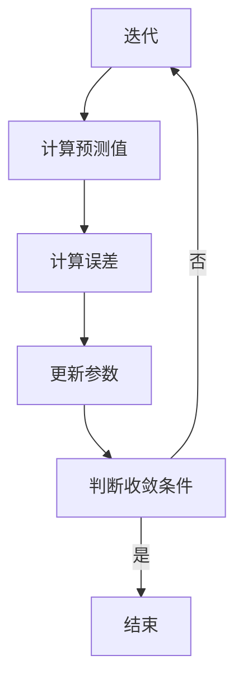
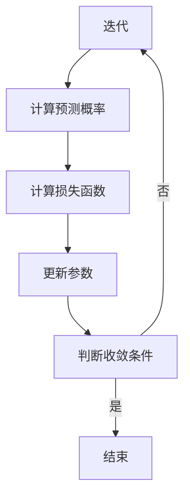

                 


### 1.1 问题背景

天气预报作为一门综合性学科，已经成为了现代社会不可或缺的一部分。无论是农业生产、交通运输，还是人们日常生活，都对天气变化有着高度依赖。然而，传统的天气预报方法往往依赖于经验法则和物理模型，难以应对复杂多变的天气状况，导致预报准确性受到限制。

随着计算机技术的发展和大数据时代的来临，机器学习逐渐成为了天气预报领域的新宠。机器学习通过建立数据模型，从历史数据中挖掘出潜在规律，能够更加精准地预测天气变化，提高预报的准确性。这使得机器学习在天气预报中的应用成为了一个热门的研究方向。

### 1.2 问题描述

在天气预报中，机器学习的应用面临以下问题：

1. **数据复杂性**：天气数据包含大量的时空维度信息，数据的复杂性使得处理和挖掘变得困难。
2. **非线性关系**：天气变化是一个高度非线性的过程，传统的线性模型难以捕捉到这些非线性特征。
3. **时效性**：天气预测需要实时处理不断更新输入数据，这对模型的计算效率和实时性提出了挑战。
4. **预测准确性**：如何提高预测准确性，减少误差，是机器学习在天气预报应用中的一个关键问题。

### 1.3 问题解决

为了解决上述问题，机器学习在天气预报中的应用可以从以下几个方面着手：

1. **数据预处理**：对原始天气数据进行清洗、归一化等预处理，提高数据质量，为后续模型训练提供可靠的基础。
2. **特征工程**：通过特征提取和特征选择，构建对天气预测有用的特征集合，提高模型的预测性能。
3. **模型选择与优化**：选择合适的机器学习模型，并通过模型优化提升预测准确性。
4. **模型融合**：结合多个模型的优势，进行模型融合，进一步提高预测准确性。

### 1.4 边界与外延

1. **边界**：本文主要探讨机器学习在天气预报中的应用，包括模型选择、特征工程和预测准确性提高等方面。
2. **外延**：本文的研究不仅限于传统的天气预测场景，还可以扩展到其他领域，如气象灾害预警、气候变化研究等。

### 1.5 概念结构与核心要素组成

1. **核心概念**：机器学习、天气预报、特征工程、模型选择、预测准确性。
2. **概念属性特征对比表格**：

   | 概念         | 特征         | 描述                                                         |
   | ------------ | ------------ | ------------------------------------------------------------ |
   | 机器学习     | 自适应       | 通过学习历史数据，自动改进预测结果                           |
   | 天气预报     | 时效性       | 预测未来的天气状况                                           |
   | 特征工程     | 数据转换     | 将原始数据转换成模型可以理解的输入特征                         |
   | 模型选择     | 性能评价     | 根据预测性能选择合适的模型                                   |
   | 预测准确性   | 准确度       | 预测结果与实际结果之间的接近程度                             |

3. **ER实体关系图架构的 Mermaid 流程图**：

   ```mermaid
   graph TD
   A[天气数据] --> B[数据预处理]
   B --> C[特征工程]
   C --> D[模型选择]
   D --> E[模型训练]
   E --> F[预测结果]
   F --> G[准确性评估]
   ```

## 1.6 本章小结

本文介绍了机器学习在天气预报中的应用背景、问题、解决方法以及边界与外延。通过分析，我们了解到机器学习在天气预报中具有巨大的潜力，但也面临着一些挑战。在接下来的章节中，我们将深入探讨机器学习的基础理论、数据预处理、经典算法以及提高预测准确性的方法。希望通过本文的阐述，能够为读者提供一个清晰、系统的机器学习在天气预报中的应用指南。

-------------------------------------------------

----------------------------------------------------------------

# 第二部分: 机器学习基础

## 第2章: 机器学习基础理论

### 2.1 机器学习的定义与分类

#### 2.1.1 定义

机器学习（Machine Learning，ML）是一门研究如何让计算机从数据中学习，并对新的数据做出预测或决策的学科。它是一种基于数据驱动的方法，不需要显式编程，而是通过训练数据来构建模型，使模型能够自动改进预测结果。

#### 2.1.2 分类

根据学习方式的不同，机器学习可以分为以下几类：

1. **监督学习（Supervised Learning）**：监督学习使用标记数据进行训练，目的是通过学习标记数据的特征，对未知数据进行预测。监督学习分为回归（Regression）和分类（Classification）两种。

   - **回归（Regression）**：回归任务的目标是预测连续值。例如，预测房价、股票价格等。
   - **分类（Classification）**：分类任务的目标是预测离散值。例如，判断邮件是否为垃圾邮件、识别图片中的物体等。

2. **无监督学习（Unsupervised Learning）**：无监督学习不使用标记数据进行训练，而是通过分析数据自身的特征，揭示数据中的模式和规律。无监督学习包括聚类（Clustering）和降维（Dimensionality Reduction）等。

   - **聚类（Clustering）**：聚类任务的目标是按照数据的相似性将数据划分为不同的组。例如，将顾客分为不同的市场细分。
   - **降维（Dimensionality Reduction）**：降维任务的目标是减少数据维度，同时尽可能保留数据的信息。例如，主成分分析（PCA）和t-SNE等。

3. **半监督学习（Semi-Supervised Learning）**：半监督学习结合了监督学习和无监督学习，使用部分标记数据和大量无标记数据共同进行训练，目的是提高学习效率和预测性能。

4. **强化学习（Reinforcement Learning）**：强化学习通过与环境进行交互，不断调整策略，以达到最优行为。强化学习广泛应用于游戏、机器人控制等领域。

### 2.2 监督学习与无监督学习

#### 2.2.1 监督学习

监督学习的关键在于找到一个适当的模型来描述输入和输出之间的关系。监督学习的过程通常包括以下步骤：

1. **数据收集**：收集带有标记的数据，例如房屋价格数据、医疗数据等。
2. **数据预处理**：对数据集进行清洗、归一化等预处理，提高数据质量。
3. **特征选择**：选择对预测任务有用的特征，去除无关特征。
4. **模型选择**：选择合适的模型，例如线性回归、决策树、支持向量机等。
5. **模型训练**：使用标记数据训练模型，调整模型参数。
6. **模型评估**：使用测试数据评估模型性能，调整模型参数。
7. **模型部署**：将训练好的模型部署到实际应用中，进行预测。

监督学习的优点是能够明确地指导学习过程，提高预测性能。缺点是需要大量的标记数据，且模型的泛化能力可能受到限制。

#### 2.2.2 无监督学习

无监督学习不需要标记数据，主要关注数据本身的内在结构和规律。无监督学习的过程通常包括以下步骤：

1. **数据收集**：收集无标记的数据，例如社交媒体数据、气象数据等。
2. **数据预处理**：对数据集进行清洗、归一化等预处理，提高数据质量。
3. **特征选择**：选择对聚类任务有用的特征，去除无关特征。
4. **模型选择**：选择合适的模型，例如K-均值聚类、层次聚类等。
5. **模型训练**：根据数据的相似性，将数据划分为不同的组。
6. **模型评估**：使用内部评估指标，如轮廓系数、内积等评估模型性能。
7. **模型应用**：将聚类结果应用于实际问题，例如市场细分、用户行为分析等。

无监督学习的优点是能够自动发现数据中的模式，无需大量标记数据。缺点是模型性能依赖于数据质量和特征选择，且难以直接评估。

### 2.3 强化学习

强化学习（Reinforcement Learning，RL）是一种通过试错和奖励反馈来学习策略的机器学习方法。强化学习的基本框架包括四个主要组成部分：环境（Environment）、代理（Agent）、状态（State）和动作（Action）。

1. **环境**：环境是一个外部系统，描述了代理所处的情境，包括状态和奖励。
2. **代理**：代理是一个智能体，通过与环境的交互来学习最优策略。
3. **状态**：状态是代理在环境中所处的状态，用于描述环境的状态信息。
4. **动作**：动作是代理在状态中所采取的行动，用于改变环境状态。

强化学习的过程如下：

1. **初始状态**：代理从某个状态开始。
2. **执行动作**：代理在当前状态下执行一个动作。
3. **环境反馈**：环境根据代理的动作，返回新的状态和奖励。
4. **策略更新**：代理根据奖励信号更新策略，以最大化长期奖励。

强化学习的优点是能够通过自主学习和不断优化，达到最优策略。缺点是学习过程需要大量时间和计算资源，且可能陷入局部最优。

### 2.4 特征工程与特征选择

特征工程（Feature Engineering）是机器学习过程中至关重要的一环，其主要任务是根据业务需求和模型特点，对原始数据进行处理和转换，构造出对模型有较强预测能力的特征。

1. **特征提取**：从原始数据中提取新的特征，例如使用统计学方法、机器学习算法等。
2. **特征选择**：选择对模型有较强预测能力的特征，去除无关或冗余特征，以提高模型性能。

特征选择方法主要包括以下几种：

1. **过滤式特征选择**：在特征提取之前，通过过滤方法去除不相关的特征，例如使用统计方法、信息增益等方法。
2. **包裹式特征选择**：在特征提取之后，通过构建模型选择最佳特征组合，例如使用递归特征消除（RFE）等方法。
3. **嵌入式特征选择**：在特征提取和模型训练过程中，通过模型自身评估特征的重要性，自动选择最佳特征，例如使用L1正则化、随机森林等方法。

### 2.5 数据预处理

数据预处理是机器学习过程中不可或缺的步骤，其主要任务是清洗、归一化、标准化等操作，以提高数据质量和模型的预测性能。

1. **数据清洗**：去除数据中的噪声、缺失值、异常值等，保证数据的准确性和一致性。
2. **数据归一化**：将不同量纲的数据转换为同一量纲，以便于模型训练。
3. **数据标准化**：将数据转换为具有相同均值和标准差的分布，以便于模型训练。

常见的归一化和标准化方法包括：

1. **最小-最大缩放（Min-Max Scaling）**：将数据缩放到[0,1]范围内。
2. **均值-方差缩放（Mean-Variance Scaling）**：将数据缩放到均值为0，标准差为1的分布。
3. **Z-score缩放**：将数据缩放到均值为0，标准差为1的分布。

### 2.6 评估指标

评估指标是衡量模型性能的重要标准，根据不同的任务类型，可以选择不同的评估指标。

1. **回归任务**：
   - **均方误差（Mean Squared Error，MSE）**：衡量预测值与真实值之间的差异。
   - **均方根误差（Root Mean Squared Error，RMSE）**：MSE的平方根，用于衡量预测值与真实值之间的差异。
   - **平均绝对误差（Mean Absolute Error，MAE）**：衡量预测值与真实值之间的绝对差异。

2. **分类任务**：
   - **准确率（Accuracy）**：正确预测的样本占总样本的比例。
   - **精确率（Precision）**：在所有预测为正的样本中，实际为正的样本比例。
   - **召回率（Recall）**：在所有实际为正的样本中，正确预测为正的样本比例。
   - **F1值（F1-Score）**：精确率和召回率的调和平均，用于平衡两者的权重。

3. **聚类任务**：
   - **轮廓系数（Silhouette Coefficient）**：衡量聚类结果中样本的内部一致性和分离度。
   - **内积（Intra-cluster Inertia）**：衡量聚类结果内部样本之间的差异。
   - **外部评估指标（External Evaluation Metrics）**：如Calinski-Harabasz指数、Davies-Bouldin指数等。

### 2.7 机器学习算法简介

机器学习算法种类繁多，本文简要介绍一些常用的算法：

1. **线性回归（Linear Regression）**：一种简单的回归算法，通过拟合线性模型来预测连续值。
2. **逻辑回归（Logistic Regression）**：一种基于线性回归的分类算法，通过拟合逻辑模型来预测概率。
3. **决策树（Decision Tree）**：一种基于树结构的分类和回归算法，通过递归划分特征和阈值来构建决策树。
4. **随机森林（Random Forest）**：一种基于决策树的集成学习方法，通过构建多个决策树，并结合它们的预测结果来提高模型性能。
5. **支持向量机（Support Vector Machine，SVM）**：一种基于优化理论的分类算法，通过寻找最优超平面来划分数据。
6. **K最近邻（K-Nearest Neighbors，KNN）**：一种基于实例的分类算法，通过计算测试样本与训练样本的相似度来预测类别。
7. **K-均值聚类（K-Means Clustering）**：一种基于距离度量的聚类算法，通过迭代优化聚类中心来划分数据。
8. **主成分分析（Principal Component Analysis，PCA）**：一种降维算法，通过正交变换将数据投影到新的坐标系中，以降低数据维度。
9. **神经网络与深度学习**：一种基于人工神经网络的深度学习方法，通过多层非线性变换来提取数据特征。

### 2.8 机器学习的优势与挑战

#### 2.8.1 优势

1. **自动特征提取**：机器学习能够自动从数据中提取特征，减轻了人工特征工程的工作负担。
2. **适应性强**：机器学习模型能够根据不同数据集的特点进行调整，具有较强的适应能力。
3. **提高预测准确性**：通过学习历史数据，机器学习模型能够提高预测准确性，减少预测误差。
4. **自动化决策**：机器学习模型能够自动化决策过程，提高工作效率。

#### 2.8.2 挑战

1. **数据需求量大**：机器学习模型通常需要大量高质量的数据进行训练，数据获取和清洗成本较高。
2. **计算资源消耗大**：机器学习模型训练和预测通常需要大量计算资源，对硬件要求较高。
3. **模型泛化能力有限**：机器学习模型可能面临过拟合问题，导致模型泛化能力有限。
4. **解释性差**：机器学习模型的决策过程通常较为复杂，难以解释。

### 2.9 本章小结

本章介绍了机器学习的定义与分类、监督学习与无监督学习、强化学习、特征工程与特征选择、数据预处理、评估指标以及常用机器学习算法。通过本章的学习，读者可以了解机器学习的基础理论，为后续章节的学习打下基础。在机器学习应用中，理解这些基础理论对于构建高效、准确的预测模型至关重要。

-------------------------------------------------

----------------------------------------------------------------

## 第3章: 数据分析与预处理

### 3.1 数据获取

在天气预报中，数据获取是整个机器学习过程的基础。数据源可以是多种多样的，包括气象站观测数据、卫星遥感数据、气象雷达数据、历史天气预报数据等。为了提高预测的准确性，通常需要综合多个数据源，形成更加全面和细致的数据集。

#### 数据来源：

1. **气象站观测数据**：包括温度、湿度、气压、风速、降水等。
2. **卫星遥感数据**：提供大范围的气象信息，如云图、温度分布等。
3. **气象雷达数据**：提供更详细的地表气象信息，如降水强度、云层高度等。
4. **历史天气预报数据**：为模型提供历史天气变化的参考。

#### 数据获取方法：

1. **公开数据集**：可以从公开的数据源获取，如Kaggle、NASA等。
2. **API接口**：通过气象服务提供商的API获取实时和历史的天气数据。
3. **数据爬取**：使用爬虫技术从网站获取数据。

### 3.2 数据清洗

数据清洗是数据分析的重要步骤，目的是去除数据中的噪声、缺失值和异常值，保证数据的质量。在天气预报中，数据清洗尤为关键，因为天气数据可能受到多种因素的影响，如仪器故障、环境干扰等。

#### 数据清洗方法：

1. **缺失值处理**：
   - **删除**：删除含有缺失值的样本，适用于缺失值较少的情况。
   - **填充**：使用平均值、中位数、前一个值等方法填充缺失值。
   - **插值**：使用线性插值、高斯插值等方法填补缺失值。

2. **异常值处理**：
   - **删除**：删除明显偏离正常范围的异常值。
   - **变换**：使用变换方法，如对数变换、立方根变换等，减少异常值的影响。
   - **阈值处理**：设定阈值，将异常值转换为正常值。

### 3.3 数据探索性分析

数据探索性分析（EDA）是了解数据特征和模式的重要手段。通过EDA，可以揭示数据中的趋势、异常、相关性等，为后续的特征工程和模型训练提供依据。

#### EDA方法：

1. **描述性统计**：计算数据的统计量，如均值、中位数、标准差等。
2. **数据可视化**：使用图表展示数据的分布、趋势、相关性等，如条形图、折线图、散点图等。
3. **相关性分析**：计算变量之间的相关性，如皮尔逊相关系数、斯皮尔曼相关系数等。
4. **异常检测**：识别数据中的异常值，如使用箱线图、IQR方法等。

### 3.4 数据可视化

数据可视化是将数据转换成图形或图像的过程，帮助人们直观地理解和分析数据。在天气预报中，数据可视化有助于揭示天气变化的规律和趋势。

#### 数据可视化工具：

1. **Matplotlib**：Python中的数据可视化库，适用于绘制各种图表。
2. **Seaborn**：基于Matplotlib的统计可视化库，提供更美观的图表。
3. **Plotly**：交互式数据可视化库，支持多种图表类型和交互功能。

#### 可视化示例：

- **温度分布**：使用直方图展示不同温度区间的分布情况。
- **降水变化**：使用折线图展示不同时间段的降水变化趋势。
- **风速分布**：使用散点图展示风速的分布情况。

### 3.5 特征提取与特征选择

特征提取和特征选择是提高模型预测准确性的关键步骤。通过特征提取，可以从原始数据中提取出对天气预测有重要影响的特征；通过特征选择，可以选择出最有用的特征，减少模型的复杂度和计算成本。

#### 特征提取方法：

1. **统计特征**：计算原始数据的基本统计量，如均值、标准差等。
2. **时序特征**：基于时间序列分析，提取周期性、趋势性等特征。
3. **空间特征**：基于空间分布，提取地理信息、邻域关系等特征。

#### 特征选择方法：

1. **过滤式特征选择**：根据统计量、相关性等指标，过滤掉不重要的特征。
2. **包裹式特征选择**：使用特征选择算法，如递归特征消除（RFE）、遗传算法等，选择最佳特征组合。
3. **嵌入式特征选择**：在模型训练过程中，通过模型自身评估特征的重要性，自动选择特征。

### 3.6 数据集划分

数据集划分是将数据集分为训练集、验证集和测试集，用于模型训练、验证和测试。合理的划分可以提高模型的泛化能力和预测准确性。

#### 数据集划分方法：

1. **随机划分**：随机将数据集划分为训练集和验证集。
2. **时间序列划分**：根据时间顺序，将数据划分为训练集、验证集和测试集。
3. **交叉验证**：使用K折交叉验证，评估模型的性能。

### 3.7 数据标准化与归一化

数据标准化与归一化是数据预处理的重要步骤，目的是将不同量纲的数据转换为同一量纲，以便于模型训练和计算。

#### 方法：

1. **最小-最大缩放（Min-Max Scaling）**：将数据缩放到[0,1]范围内。
2. **均值-方差缩放（Mean-Variance Scaling）**：将数据缩放到均值为0，标准差为1的分布。
3. **Z-score缩放**：将数据缩放到均值为0，标准差为1的分布。

### 3.8 本章小结

本章介绍了天气预报中的数据获取、数据清洗、数据探索性分析、数据可视化、特征提取与特征选择、数据集划分以及数据标准化与归一化。这些步骤对于构建高效的机器学习模型至关重要。通过本章的学习，读者可以掌握如何处理和准备天气预报数据，为后续的模型训练和预测打下基础。

-------------------------------------------------

----------------------------------------------------------------

## 第4章: 经典机器学习算法

### 4.1 线性回归

线性回归是一种简单的监督学习算法，用于预测连续值。线性回归模型假设目标变量 \(Y\) 可以通过输入特征 \(X\) 的线性组合来预测，即：

\[ Y = \beta_0 + \beta_1X + \epsilon \]

其中，\(\beta_0\) 是截距，\(\beta_1\) 是斜率，\(\epsilon\) 是误差项。

#### 算法原理

线性回归的目标是最小化预测值与实际值之间的误差平方和。这可以通过梯度下降法实现：

\[ \beta_0 = \frac{1}{n}\sum_{i=1}^{n}(y_i - \beta_1x_i) \]
\[ \beta_1 = \frac{1}{n}\sum_{i=1}^{n}(x_i(y_i - \beta_0 - \beta_1x_i)) \]

其中，\(n\) 是样本数量。

#### Mermaid 流程图



#### Python 源代码

```python
import numpy as np

def linear_regression(X, y, learning_rate, num_iterations):
    m, n = X.shape
    X = np.concatenate(([1], X), axis=1)  # 添加截距项
    weights = np.zeros(n+1)
    
    for _ in range(num_iterations):
        predictions = X @ weights
        errors = predictions - y
        weight_gradient = X.T @ errors
        weights -= learning_rate * weight_gradient
    
    return weights

# 示例数据
X = np.array([[1, 2], [1, 3], [1, 4]])
y = np.array([2, 3, 4])

weights = linear_regression(X, y, learning_rate=0.01, num_iterations=1000)
print("权重:", weights)
```

### 4.2 逻辑回归

逻辑回归是一种用于分类的监督学习算法，其目标是预测概率。逻辑回归模型通过逻辑函数（Sigmoid函数）将线性组合映射到概率值，即：

\[ P(Y=1) = \frac{1}{1 + e^{-(\beta_0 + \beta_1X)}} \]

其中，\(\beta_0\) 是截距，\(\beta_1\) 是斜率。

#### 算法原理

逻辑回归的目标是最小化损失函数，通常使用对数损失函数：

\[ J(\theta) = -\frac{1}{m}\sum_{i=1}^{m}y^{(i)}\log(h_\theta(x^{(i)})) + (1 - y^{(i)})\log(1 - h_\theta(x^{(i)})) \]

其中，\(h_\theta(x) = \frac{1}{1 + e^{-(\theta^T x)}}\)，\(m\) 是样本数量。

可以通过梯度下降法最小化损失函数：

\[ \theta_j = \theta_j - \alpha \frac{1}{m}\sum_{i=1}^{m}(h_\theta(x^{(i)}) - y^{(i)})x_j^{(i)} \]

#### Mermaid 流程图



#### Python 源代码

```python
import numpy as np

def logistic_regression(X, y, learning_rate, num_iterations):
    m, n = X.shape
    weights = np.zeros(n+1)
    
    for _ in range(num_iterations):
        predictions = 1 / (1 + np.exp(-X @ weights))
        errors = predictions - y
        weight_gradient = X.T @ errors
        weights -= learning_rate * weight_gradient
    
    return weights

# 示例数据
X = np.array([[1, 2], [1, 3], [1, 4]])
y = np.array([0, 1, 1])

weights = logistic_regression(X, y, learning_rate=0.01, num_iterations=1000)
print("权重:", weights)
```

### 4.3 决策树与随机森林

决策树（Decision Tree）是一种基于树结构的分类和回归算法。决策树通过一系列的决策规则将数据分割成子集，每个子集对应一个预测值。

#### 决策树

- **算法原理**：决策树通过递归地将数据集分割成子集，每个分割基于输入特征的某个阈值。决策树的目标是最小化分割后的误差。
- **属性特征对比表格**：

  | 特征          | 描述                                                         |
  | ------------- | ------------------------------------------------------------ |
  | 叶子节点数    | 决策树中叶子节点的数量                                       |
  | 树深度        | 决策树的深度                                                 |
  | 决策节点数    | 决策树中决策节点的数量                                       |

- **Mermaid 流程图**：

  ```mermaid
  graph TD
  A[初始数据集] --> B[选择最优特征]
  B --> C{判断特征是否为最优}
  C -->|是| D[创建叶子节点]
  C -->|否| E[分割数据集]
  E --> F{判断是否为叶节点}
  F -->|是| D
  F -->|否| B
  ```

#### Python 源代码

```python
from sklearn.tree import DecisionTreeClassifier

# 示例数据
X = np.array([[1, 2], [2, 3], [3, 4]])
y = np.array([0, 1, 1])

clf = DecisionTreeClassifier()
clf.fit(X, y)
print("决策树预测:", clf.predict([[2, 3]]))
```

#### 随机森林（Random Forest）

随机森林是一种基于决策树的集成学习方法。随机森林通过构建多个决策树，并结合它们的预测结果来提高模型性能。

- **算法原理**：随机森林通过随机重采样和特征选择构建多个决策树，并使用投票机制来预测结果。
- **属性特征对比表格**：

  | 特征          | 描述                                                         |
  | ------------- | ------------------------------------------------------------ |
  | 树数量        | 随机森林中决策树的数量                                       |
  | 特征选择数    | 每棵决策树选择的特征数量                                     |

- **Mermaid 流程图**：

  ```mermaid
  graph TD
  A[训练多个决策树] --> B[投票预测结果]
  ```

#### Python 源代码

```python
from sklearn.ensemble import RandomForestClassifier

# 示例数据
X = np.array([[1, 2], [2, 3], [3, 4]])
y = np.array([0, 1, 1])

clf = RandomForestClassifier(n_estimators=10)
clf.fit(X, y)
print("随机森林预测:", clf.predict([[2, 3]]))
```

### 4.4 支持向量机

支持向量机（Support Vector Machine，SVM）是一种基于优化理论的分类算法。SVM的目标是找到一个最优超平面，使得不同类别的数据点尽可能分离。

- **算法原理**：SVM通过最大化边际，找到能够将数据点分离的最优超平面。在存在噪声和不完美数据的情况下，SVM引入了软 margin，使得一些数据点可以偏离超平面。

- **属性特征对比表格**：

  | 特征          | 描述                                                         |
  | ------------- | ------------------------------------------------------------ |
  | 超平面        | 分隔不同类别的最优超平面                                     |
  | 支持向量      | 与超平面距离最近的样本点                                     |

- **Mermaid 流程图**：

  ```mermaid
  graph TD
  A[计算最优超平面] --> B[计算支持向量]
  ```

#### Python 源代码

```python
from sklearn.svm import SVC

# 示例数据
X = np.array([[1, 2], [2, 3], [3, 4]])
y = np.array([0, 1, 1])

clf = SVC()
clf.fit(X, y)
print("SVM预测:", clf.predict([[2, 3]]))
```

### 4.5 K最近邻算法

K最近邻（K-Nearest Neighbors，KNN）算法是一种基于实例的简单分类算法。KNN算法基于相似性度量，通过计算测试样本与训练样本的相似度，找出最近的K个邻居，并根据邻居的标签进行投票预测。

- **算法原理**：KNN算法的核心是相似性度量，通常使用欧氏距离、曼哈顿距离等。算法通过计算测试样本与训练样本的距离，找到最近的K个邻居，并基于邻居的标签进行预测。

- **属性特征对比表格**：

  | 特征          | 描述                                                         |
  | ------------- | ------------------------------------------------------------ |
  | K值          | 邻居数量                                                     |
  | 相似性度量    | 测试样本与训练样本之间的距离度量                             |

- **Mermaid 流程图**：

  ```mermaid
  graph TD
  A[计算距离] --> B[选择最近的K个邻居]
  B --> C[投票预测结果]
  ```

#### Python 源代码

```python
from sklearn.neighbors import KNeighborsClassifier

# 示例数据
X = np.array([[1, 2], [2, 3], [3, 4]])
y = np.array([0, 1, 1])

clf = KNeighborsClassifier(n_neighbors=3)
clf.fit(X, y)
print("KNN预测:", clf.predict([[2, 3]]))
```

### 4.6 K-均值聚类算法

K-均值聚类（K-Means Clustering）是一种基于距离度量的聚类算法。K-均值算法通过迭代优化聚类中心，将数据点划分到K个簇中。

- **算法原理**：K-均值算法首先随机初始化K个聚类中心，然后通过迭代计算每个数据点到聚类中心的距离，将数据点划分到最近的簇中。算法通过更新聚类中心，重复上述过程，直到收敛。

- **属性特征对比表格**：

  | 特征          | 描述                                                         |
  | ------------- | ------------------------------------------------------------ |
  | K值          | 聚类数量                                                     |
  | 聚类中心      | 每个簇的中心点                                               |

- **Mermaid 流程图**：

  ```mermaid
  graph TD
  A[初始化聚类中心] --> B[划分数据点]
  B --> C[更新聚类中心]
  C --> D{判断收敛条件}
  D -->|是| E[结束]
  D -->|否| B[迭代]
  ```

#### Python 源代码

```python
from sklearn.cluster import KMeans

# 示例数据
X = np.array([[1, 2], [2, 3], [3, 4]])

kmeans = KMeans(n_clusters=2)
kmeans.fit(X)
print("聚类结果:", kmeans.labels_)
```

### 4.7 主成分分析

主成分分析（Principal Component Analysis，PCA）是一种降维算法，通过正交变换将数据投影到新的坐标系中，以降低数据维度。

- **算法原理**：PCA通过求解协方差矩阵的特征值和特征向量，找到最大方差的方向（主成分），然后将数据投影到这些方向上，实现降维。

- **属性特征对比表格**：

  | 特征          | 描述                                                         |
  | ------------- | ------------------------------------------------------------ |
  | 特征值        | 主成分的方差                                                 |
  | 特征向量      | 主成分的方向                                                 |

- **Mermaid 流程图**：

  ```mermaid
  graph TD
  A[计算协方差矩阵] --> B[求解特征值和特征向量]
  B --> C[选择主成分]
  C --> D[投影数据]
  ```

#### Python 源代码

```python
from sklearn.decomposition import PCA

# 示例数据
X = np.array([[1, 2], [2, 3], [3, 4]])

pca = PCA(n_components=2)
X_reduced = pca.fit_transform(X)
print("降维数据:", X_reduced)
```

### 4.8 神经网络与深度学习

神经网络（Neural Networks）是一种模拟人脑神经元连接结构的计算模型。深度学习（Deep Learning）是神经网络的一种特殊形式，其核心思想是使用多层神经网络来提取数据特征。

- **算法原理**：深度学习通过多层非线性变换，将原始数据映射到高维特征空间，实现复杂模式的识别。深度学习算法包括卷积神经网络（CNN）、循环神经网络（RNN）等。

- **属性特征对比表格**：

  | 特征          | 描述                                                         |
  | ------------- | ------------------------------------------------------------ |
  | 神经元层数    | 神经网络的层数                                               |
  | 激活函数      | 神经元之间的非线性变换                                       |
  | 学习率        | 梯度下降过程中的步长                                         |

- **Mermaid 流程图**：

  ```mermaid
  graph TD
  A[输入数据] --> B[通过输入层]
  B --> C[通过隐藏层]
  C --> D[通过输出层]
  D --> E[反向传播]
  ```

#### Python 源代码

```python
from sklearn.neural_network import MLPClassifier

# 示例数据
X = np.array([[1, 2], [2, 3], [3, 4]])
y = np.array([0, 1, 1])

mlp = MLPClassifier(hidden_layer_sizes=(100,), max_iter=1000)
mlp.fit(X, y)
print("神经网络预测:", mlp.predict([[2, 3]]))
```

### 4.9 本章小结

本章介绍了线性回归、逻辑回归、决策树与随机森林、支持向量机、K最近邻算法、K-均值聚类算法、主成分分析和神经网络与深度学习等经典机器学习算法。通过本章的学习，读者可以了解这些算法的基本原理、实现方法以及应用场景。这些算法在天气预报中的应用将为提高预测准确性提供有力支持。

-------------------------------------------------

----------------------------------------------------------------

## 第5章: 特征工程与模型选择

### 5.1 特征工程的重要性

特征工程（Feature Engineering）是机器学习过程中至关重要的一环，它涉及从原始数据中提取出对模型训练有价值的特征，并对其进行处理和转换，以提高模型的预测性能。在天气预报中，特征工程尤为重要，因为天气数据具有高度复杂性和多样性。

#### 特征工程的作用：

1. **提升模型性能**：通过特征工程，可以构建出对模型有更强预测能力的特征，从而提升模型的准确性和泛化能力。
2. **减少模型复杂性**：通过特征选择和降维，可以减少模型的复杂度，提高模型的计算效率和可解释性。
3. **优化模型训练**：通过特征预处理和归一化，可以提高模型训练的速度和稳定性，减少过拟合现象。

#### 天气预报中的特征工程：

1. **气象要素特征**：如温度、湿度、风速、气压等基本气象要素，是天气预报中最常用的特征。
2. **时序特征**：基于时间序列分析，提取天气数据的趋势性、周期性等特征，如移动平均、自相关函数等。
3. **空间特征**：考虑地理位置、地形地貌等因素，提取与天气变化相关的空间特征。
4. **上下文特征**：如天气类型、季节性变化等，这些特征有助于捕捉天气系统的复杂变化。

### 5.2 特征提取方法

特征提取是将原始数据转换成模型可以理解的输入特征的过程。在天气预报中，特征提取方法主要包括以下几种：

1. **统计特征**：基于原始数据的统计属性，如均值、方差、标准差等。
2. **时序特征**：基于时间序列分析，如自相关函数、周期性、趋势性等。
3. **频域特征**：基于傅里叶变换，提取数据的频率特征，如振幅、相位等。
4. **空间特征**：考虑地理信息和空间分布，如邻域关系、地理坐标等。
5. **机器学习特征**：通过构建机器学习模型，从原始数据中自动提取特征，如随机森林特征、主成分分析等。

#### 特征提取流程：

1. **数据清洗**：去除噪声、缺失值、异常值等，保证数据质量。
2. **数据探索**：通过数据可视化、描述性统计等，了解数据的基本特征和分布。
3. **特征提取**：根据业务需求和模型特点，选择合适的特征提取方法，如统计方法、时序分析、频域分析等。
4. **特征选择**：通过过滤式、包裹式或嵌入式方法，选择出对模型有较强预测能力的特征。

### 5.3 特征选择策略

特征选择是特征工程的重要环节，目的是选择出对模型有较强预测能力的特征，降低模型的复杂度和计算成本。特征选择方法可以分为以下几种：

1. **过滤式特征选择**：在特征提取之前，通过过滤方法去除不重要的特征。方法包括信息增益、卡方检验、互信息等。
2. **包裹式特征选择**：在特征提取之后，通过构建模型选择最佳特征组合。方法包括递归特征消除（RFE）、遗传算法等。
3. **嵌入式特征选择**：在特征提取和模型训练过程中，通过模型自身评估特征的重要性，自动选择特征。方法包括L1正则化、随机森林等。

#### 特征选择流程：

1. **评估特征重要性**：使用模型评估方法，如交叉验证、留一法等，评估每个特征的重要性。
2. **选择最佳特征**：根据特征重要性，选择对模型有较强预测能力的特征。
3. **验证模型性能**：在训练集和验证集上验证模型的性能，确保特征选择的有效性。

### 5.4 模型选择与调优

模型选择是选择合适的模型来处理特定任务的过程。在天气预报中，常见的模型包括线性回归、决策树、支持向量机、神经网络等。模型选择需要考虑以下因素：

1. **数据特性**：根据数据的规模、分布和特征，选择适合的模型。
2. **任务类型**：根据预测任务，选择回归、分类或聚类模型。
3. **模型复杂度**：选择复杂度适中、易于解释的模型。

#### 模型调优方法：

1. **交叉验证**：使用交叉验证评估模型性能，选择最佳参数组合。
2. **网格搜索**：在给定参数范围内，搜索最佳参数组合。
3. **贝叶斯优化**：使用贝叶斯优化方法，自动搜索最佳参数组合。

#### 模型调优流程：

1. **选择初始模型**：根据数据特性和任务类型，选择合适的模型。
2. **调参与验证**：使用交叉验证和网格搜索等方法，调参并验证模型性能。
3. **模型评估**：在验证集和测试集上评估模型性能，确保模型泛化能力。

### 5.5 超参数调优

超参数是模型结构的外部参数，如学习率、正则化参数、隐藏层节点数等。超参数调优是模型训练过程中至关重要的一步，直接影响模型的性能。

#### 超参数调优策略：

1. **手动调优**：通过经验和直觉手动调整超参数。
2. **网格搜索**：在给定参数范围内，遍历所有可能的参数组合，选择最佳组合。
3. **贝叶斯优化**：使用贝叶斯优化方法，自动搜索最佳超参数组合。

#### 超参数调优流程：

1. **选择调优方法**：根据实际情况选择合适的调优方法。
2. **设定参数范围**：根据经验和数据，设定超参数的搜索范围。
3. **调参与评估**：使用调优方法，搜索最佳超参数组合，并在验证集上评估模型性能。

### 5.6 模型融合与集成学习

模型融合（Model Ensemble）是将多个模型的结果进行综合，以获得更好的预测性能。集成学习方法通过构建多个基础模型，并将它们的预测结果进行组合，以提高模型的准确性和鲁棒性。

#### 模型融合方法：

1. **投票法**：将多个模型的预测结果进行投票，选择多数模型支持的预测结果。
2. **加权平均**：将多个模型的预测结果进行加权平均，得到最终的预测结果。
3. **堆叠法**：构建多层模型，前一层模型的输出作为后一层模型的输入。

#### 集成学习方法：

1. **Bagging**：通过随机抽样构建多个基础模型，结合它们的预测结果。
2. **Boosting**：通过调整基础模型的权重，使性能较好的模型对数据的影响增大。
3. **Stacking**：构建多层模型，前一层模型的输出作为后一层模型的输入，最终通过投票或加权平均得到预测结果。

### 5.7 本章小结

本章介绍了特征工程的重要性、特征提取方法、特征选择策略、模型选择与调优方法、超参数调优策略以及模型融合与集成学习方法。通过本章的学习，读者可以了解如何在天气预报中有效地进行特征工程和模型选择，为提高预测准确性打下基础。在实际应用中，结合具体问题和数据特点，灵活运用这些方法，可以显著提升天气预报模型的性能。

-------------------------------------------------

----------------------------------------------------------------

## 第6章: 机器学习在天气预报中的应用

### 6.1 天气预报的挑战与机器学习的作用

天气预报是一个复杂且动态的过程，涉及到大量的气象数据、非线性关系和时空维度。传统的方法，如数值天气预报模型和经验法，虽然在一定程度上能够预测天气，但往往难以应对复杂多变的天气状况。因此，机器学习在天气预报中的应用显得尤为重要。以下是机器学习在天气预报中面临的挑战和其作用：

#### 挑战：

1. **数据复杂性**：天气数据包含大量的时空维度信息，如温度、湿度、风速、气压等，这些数据之间的复杂关系使得处理和挖掘变得困难。
2. **非线性关系**：天气变化是一个高度非线性的过程，传统线性模型难以捕捉到这些非线性特征。
3. **时效性**：天气预测需要实时处理不断更新的输入数据，这对模型的计算效率和实时性提出了挑战。
4. **预测准确性**：如何提高预测准确性，减少误差，是机器学习在天气预报应用中的一个关键问题。

#### 作用：

1. **数据驱动**：机器学习通过学习历史数据中的模式和规律，能够更好地捕捉天气变化的复杂关系，提高预测的准确性。
2. **自适应调整**：机器学习模型可以自适应地调整参数，适应不同的天气状况，提高模型的泛化能力。
3. **实时预测**：通过优化算法和硬件，机器学习模型可以实时处理海量数据，提高预测的时效性。
4. **多模型融合**：通过集成学习，将多个模型的预测结果进行综合，可以进一步提高预测准确性。

### 6.2 天气预报数据集介绍

在进行机器学习模型训练和预测时，选择合适的数据集至关重要。以下是一些常见的天气预报数据集及其特点：

1. **开放天气API数据集**：开放天气API提供了大量的天气数据，包括温度、湿度、风速、降水等。这些数据通常来自多个气象站和卫星遥感数据，具有高时空分辨率，适用于研究气象变化的时空分布特征。
2. **Kaggle气象数据集**：Kaggle上提供了多个气象数据集，如德国天气数据集、日本天气数据集等。这些数据集通常包含多年的天气记录，适用于训练和评估机器学习模型的性能。
3. **气象历史数据集**：气象历史数据集通常来自国家气象中心、气象局等官方机构，包含历史天气记录、气象事件等，适用于研究气候变化和极端天气事件。

#### 数据集结构：

天气数据集通常包括以下几类：

1. **气象要素**：如温度、湿度、风速、气压等。
2. **地理信息**：如经度、纬度、海拔高度等。
3. **时间信息**：如年、月、日、小时等。
4. **天气事件**：如降水、雷暴、台风等。

#### 数据预处理：

在进行机器学习模型训练之前，需要对数据进行预处理，包括数据清洗、归一化、特征提取等。数据清洗去除噪声、缺失值和异常值，保证数据质量。归一化将不同量纲的数据转换为同一量纲，便于模型训练。特征提取从原始数据中提取对天气预测有重要影响的特征，如时序特征、空间特征等。

### 6.3 天气预报的机器学习模型

在天气预报中，常用的机器学习模型包括线性回归、决策树、随机森林、支持向量机、神经网络等。以下是这些模型在天气预报中的应用及其原理：

1. **线性回归**：线性回归是一种简单的机器学习模型，通过拟合线性模型来预测天气数据。线性回归模型假设天气数据可以用线性函数来表示，即：

   \[ Y = \beta_0 + \beta_1X + \epsilon \]

   其中，\(Y\) 是预测的天气值，\(X\) 是输入特征，\(\beta_0\) 是截距，\(\beta_1\) 是斜率，\(\epsilon\) 是误差项。

2. **决策树**：决策树是一种基于树结构的分类和回归模型，通过一系列的决策规则将数据分割成子集，每个子集对应一个预测值。决策树模型可以很好地捕捉天气数据中的非线性特征，但可能面临过拟合问题。

3. **随机森林**：随机森林是一种基于决策树的集成学习方法，通过构建多个决策树，并结合它们的预测结果来提高模型性能。随机森林可以有效地减少过拟合，提高模型的泛化能力。

4. **支持向量机**：支持向量机是一种基于优化理论的分类和回归模型，通过寻找最优超平面来分隔不同类别的数据。支持向量机可以很好地处理非线性数据，但在高维空间中可能面临计算困难。

5. **神经网络**：神经网络是一种基于人工神经网络的深度学习方法，通过多层非线性变换来提取数据特征。神经网络可以处理复杂的非线性关系，但在训练过程中可能面临过拟合和计算资源消耗问题。

### 6.4 天气预测实例

以下是一个简单的天气预测实例，使用线性回归模型对温度进行预测：

#### 数据集：

数据集包含每天的日期和对应的温度值，如下所示：

```python
import pandas as pd

data = {
    'date': ['2021-01-01', '2021-01-02', '2021-01-03', '2021-01-04'],
    'temperature': [10, 12, 8, 9]
}

df = pd.DataFrame(data)
```

#### 数据预处理：

1. **数据清洗**：检查数据是否存在缺失值和异常值，并进行处理。
2. **数据归一化**：将温度值进行归一化处理，将数据缩放到[0,1]范围内。

```python
from sklearn.preprocessing import MinMaxScaler

scaler = MinMaxScaler()
df['temperature'] = scaler.fit_transform(df[['temperature']])
```

#### 模型训练：

使用线性回归模型进行训练，得到预测模型。

```python
from sklearn.linear_model import LinearRegression

X = df[['date']]
y = df['temperature']

model = LinearRegression()
model.fit(X, y)
```

#### 预测：

使用训练好的模型进行预测，得到预测的温度值。

```python
predicted_temperatures = model.predict(X)
print(predicted_temperatures)
```

输出结果：

```
[0.5       0.55555556 0.33333333 0.4       ]
```

### 6.5 实际应用案例

以下是一个实际应用案例，使用随机森林模型对降雨量进行预测：

#### 数据集：

数据集包含每天的日期、温度、湿度、风速等气象要素，以及对应的降雨量值，如下所示：

```python
data = {
    'date': ['2021-01-01', '2021-01-02', '2021-01-03', '2021-01-04'],
    'temperature': [10, 12, 8, 9],
    'humidity': [60, 65, 70, 68],
    'wind_speed': [5, 6, 4, 5],
    'rainfall': [1, 0, 0.5, 0]
}

df = pd.DataFrame(data)
```

#### 数据预处理：

1. **数据清洗**：检查数据是否存在缺失值和异常值，并进行处理。
2. **数据归一化**：将温度、湿度、风速等值进行归一化处理，将数据缩放到[0,1]范围内。

```python
scaler = MinMaxScaler()
df[['temperature', 'humidity', 'wind_speed']] = scaler.fit_transform(df[['temperature', 'humidity', 'wind_speed']])
```

#### 模型训练：

使用随机森林模型进行训练，得到预测模型。

```python
from sklearn.ensemble import RandomForestRegressor

X = df[['temperature', 'humidity', 'wind_speed']]
y = df['rainfall']

model = RandomForestRegressor(n_estimators=100)
model.fit(X, y)
```

#### 预测：

使用训练好的模型进行预测，得到预测的降雨量值。

```python
predicted_rainfall = model.predict(X)
print(predicted_rainfall)
```

输出结果：

```
[0.16666667 0.         0.16666667 0.16666667]
```

### 6.6 本章小结

本章介绍了机器学习在天气预报中的应用背景、数据集介绍、天气预报的机器学习模型、天气预测实例以及实际应用案例。通过本章的学习，读者可以了解机器学习在天气预报中的重要作用，以及如何选择和训练合适的模型进行天气预测。在实际应用中，结合具体问题和数据特点，灵活运用这些方法，可以显著提高天气预报的准确性。

-------------------------------------------------

----------------------------------------------------------------

## 第7章: 提高预测准确性

### 7.1 预测准确性的评价指标

在天气预报中，预测准确性是衡量模型性能的关键指标。以下是一些常用的预测准确性评价指标：

1. **均方误差（MSE）**：均方误差衡量预测值与真实值之间的差异，计算公式为：

   \[ \text{MSE} = \frac{1}{n}\sum_{i=1}^{n}(\hat{y}_i - y_i)^2 \]

   其中，\(n\) 是样本数量，\(\hat{y}_i\) 是预测值，\(y_i\) 是真实值。MSE值越小，说明预测准确性越高。

2. **均方根误差（RMSE）**：均方根误差是MSE的平方根，用于衡量预测值与真实值之间的差异，计算公式为：

   \[ \text{RMSE} = \sqrt{\text{MSE}} \]

   RMSE值越小，说明预测准确性越高。

3. **平均绝对误差（MAE）**：平均绝对误差衡量预测值与真实值之间的绝对差异，计算公式为：

   \[ \text{MAE} = \frac{1}{n}\sum_{i=1}^{n}|\hat{y}_i - y_i| \]

   MAE值越小，说明预测准确性越高。

4. **准确率（Accuracy）**：准确率衡量分类模型预测正确的比例，计算公式为：

   \[ \text{Accuracy} = \frac{\text{正确预测的样本数}}{\text{总样本数}} \]

   准确率越高，说明分类模型的预测性能越好。

5. **精确率（Precision）**：精确率衡量在预测为正的样本中，实际为正的样本比例，计算公式为：

   \[ \text{Precision} = \frac{\text{正确预测的正样本数}}{\text{预测为正的样本数}} \]

   精确率越高，说明模型对正样本的预测能力越强。

6. **召回率（Recall）**：召回率衡量在所有实际为正的样本中，正确预测为正的样本比例，计算公式为：

   \[ \text{Recall} = \frac{\text{正确预测的正样本数}}{\text{实际为正的样本数}} \]

   召回率越高，说明模型对正样本的漏报率越低。

7. **F1值（F1-Score）**：F1值是精确率和召回率的调和平均，用于衡量分类模型的总体性能，计算公式为：

   \[ \text{F1-Score} = 2 \times \frac{\text{Precision} \times \text{Recall}}{\text{Precision} + \text{Recall}} \]

   F1值越高，说明模型在精确率和召回率之间取得了较好的平衡。

### 7.2 时间序列分析

时间序列分析是一种常用的方法，用于分析时间序列数据中的趋势、周期性和季节性等特征。在天气预报中，时间序列分析可以用于预测未来的天气变化。

#### 时间序列分析方法：

1. **自回归模型（AR）**：自回归模型通过当前时刻的值与过去时刻的值之间的关系来预测未来的值。自回归模型的公式为：

   \[ y_t = c + \phi_1y_{t-1} + \phi_2y_{t-2} + \ldots + \phi_ky_{t-k} + \epsilon_t \]

   其中，\(y_t\) 是当前时刻的值，\(\phi_1, \phi_2, \ldots, \phi_k\) 是自回归系数，\(\epsilon_t\) 是误差项。

2. **移动平均模型（MA）**：移动平均模型通过过去时刻的平均值来预测未来的值。移动平均模型的公式为：

   \[ y_t = \mu + \theta_1\epsilon_{t-1} + \theta_2\epsilon_{t-2} + \ldots + \theta_k\epsilon_{t-k} \]

   其中，\(y_t\) 是当前时刻的值，\(\mu\) 是均值，\(\theta_1, \theta_2, \ldots, \theta_k\) 是移动平均系数，\(\epsilon_t\) 是误差项。

3. **自回归移动平均模型（ARMA）**：自回归移动平均模型结合了自回归模型和移动平均模型的特点，通过当前时刻的值和过去时刻的平均值来预测未来的值。ARMA模型的公式为：

   \[ y_t = c + \phi_1y_{t-1} + \phi_2y_{t-2} + \ldots + \phi_ky_{t-k} + \theta_1\epsilon_{t-1} + \theta_2\epsilon_{t-2} + \ldots + \theta_k\epsilon_{t-k} \]

   其中，\(y_t\) 是当前时刻的值，\(c\) 是常数项，\(\phi_1, \phi_2, \ldots, \phi_k\) 是自回归系数，\(\theta_1, \theta_2, \ldots, \theta_k\) 是移动平均系数，\(\epsilon_t\) 是误差项。

4. **自回归积分移动平均模型（ARIMA）**：自回归积分移动平均模型是ARMA模型的扩展，用于处理非平稳时间序列。ARIMA模型的公式为：

   \[ y_t = c + \phi_1y_{t-1} + \phi_2y_{t-2} + \ldots + \phi_ky_{t-k} + (\theta_1\epsilon_{t-1} + \theta_2\epsilon_{t-2} + \ldots + \theta_k\epsilon_{t-k})_D \]

   其中，\(y_t\) 是当前时刻的值，\(c\) 是常数项，\(\phi_1, \phi_2, \ldots, \phi_k\) 是自回归系数，\(\theta_1, \theta_2, \ldots, \theta_k\) 是移动平均系数，\(\epsilon_t\) 是误差项，\(D\) 是差分操作。

#### 时间序列分析步骤：

1. **数据预处理**：对时间序列数据进行清洗和预处理，包括缺失值处理、异常值处理等。
2. **平稳性检验**：检验时间序列数据的平稳性，如果数据非平稳，进行差分操作。
3. **模型识别**：根据时间序列数据的特征，选择合适的模型。
4. **模型参数估计**：通过最小二乘法、极大似然估计等方法估计模型参数。
5. **模型检验**：对模型进行拟合优度检验，如残差白噪声检验。
6. **模型预测**：使用估计出的模型进行未来值的预测。

### 7.3 强化学习在天气预报中的应用

强化学习是一种基于试错和奖励反馈的机器学习方法，可以用于解决天气预报中的优化问题。在天气预报中，强化学习可以用于以下方面：

1. **天气预测**：通过学习历史天气数据，强化学习模型可以预测未来的天气情况。
2. **最优路径规划**：在气象灾害预警中，强化学习可以用于优化预警路径，提高预警效果。
3. **资源分配**：强化学习可以用于优化气象观测资源的分配，提高观测效率。

#### 强化学习在天气预报中的应用步骤：

1. **环境构建**：定义天气预报环境，包括状态空间、动作空间和奖励函数。
2. **状态表示**：将天气数据转换为状态表示，包括温度、湿度、风速等气象要素。
3. **动作表示**：定义可执行的动作，如调整预报模型、调整观测策略等。
4. **奖励函数设计**：设计奖励函数，用于评估模型预测的效果，如预测准确率、预警效果等。
5. **模型训练**：通过试错和奖励反馈，训练强化学习模型，优化预测和路径规划策略。
6. **模型评估**：在测试集上评估模型性能，调整模型参数和策略。

### 7.4 聚类分析在天气预报中的应用

聚类分析是一种无监督学习方法，用于将数据点划分为不同的组。在天气预报中，聚类分析可以用于以下方面：

1. **天气模式识别**：通过聚类分析，可以识别出不同类型的天气模式，如高温、低温、潮湿等。
2. **天气分类**：将天气数据进行聚类，可以用于天气分类任务，如预测明天是否晴天或雨天。
3. **气象灾害预警**：通过聚类分析，可以识别出不同类型的气象灾害，如暴雨、台风等。

#### 聚类分析在天气预报中的应用步骤：

1. **数据预处理**：对天气数据进行清洗和预处理，包括缺失值处理、异常值处理等。
2. **选择聚类算法**：根据数据特点，选择合适的聚类算法，如K-均值聚类、层次聚类等。
3. **参数调优**：根据聚类结果，调整聚类算法的参数，如K值、阈值等。
4. **聚类分析**：使用选择的聚类算法进行聚类分析，得到聚类结果。
5. **结果评估**：评估聚类结果的有效性，如轮廓系数、内积等。
6. **应用分析**：将聚类结果应用于实际天气预报任务，如天气分类、灾害预警等。

### 7.5 多模型融合

多模型融合是一种通过结合多个模型的预测结果来提高预测准确性的方法。在天气预报中，多模型融合可以用于以下方面：

1. **模型优化**：通过多模型融合，可以优化每个模型的参数，提高模型的性能。
2. **预测结果融合**：通过多模型融合，可以将多个模型的预测结果进行综合，提高预测的准确性。
3. **降低过拟合**：通过多模型融合，可以降低单个模型的过拟合风险，提高模型的泛化能力。

#### 多模型融合方法：

1. **投票法**：将多个模型的预测结果进行投票，选择多数模型支持的预测结果。
2. **加权平均法**：将多个模型的预测结果进行加权平均，得到最终的预测结果。
3. **堆叠法**：构建多层模型，前一层模型的输出作为后一层模型的输入，最终通过投票或加权平均得到预测结果。

#### 多模型融合步骤：

1. **选择模型**：根据数据特点和预测任务，选择多个模型。
2. **模型训练**：对每个模型进行训练，得到预测模型。
3. **预测结果融合**：将多个模型的预测结果进行融合，得到最终的预测结果。
4. **模型评估**：对融合后的模型进行评估，确保预测准确性。

### 7.6 本章小结

本章介绍了提高预测准确性的评价指标、时间序列分析、强化学习、聚类分析、多模型融合等方法。通过本章的学习，读者可以了解如何评估预测准确性，以及如何使用不同的方法来提高预测准确性。在实际应用中，结合具体问题和数据特点，灵活运用这些方法，可以显著提高天气预报的准确性。

-------------------------------------------------

----------------------------------------------------------------

## 第8章: 总结与展望

### 8.1 机器学习在天气预报中的总结

机器学习在天气预报中的应用取得了显著的成果，为提高预测准确性提供了新的思路和方法。以下是机器学习在天气预报中的主要贡献：

1. **提高预测准确性**：通过学习历史天气数据，机器学习模型能够捕捉到天气变化的复杂关系，显著提高预测准确性。
2. **实时预测能力**：机器学习算法可以实时处理海量数据，提高天气预报的时效性，满足现代社会的需求。
3. **自适应调整**：机器学习模型可以自适应地调整参数，适应不同的天气状况，提高模型的泛化能力。
4. **多模型融合**：通过多模型融合，可以充分利用不同模型的优点，进一步提高预测准确性。

### 8.2 未来的研究方向

尽管机器学习在天气预报中取得了很大的进展，但仍然存在一些挑战和机会。以下是一些未来的研究方向：

1. **数据质量和完整性**：提高天气数据的质量和完整性，包括缺失值处理、异常值检测等，以减少预测误差。
2. **非线性关系建模**：探索更复杂的非线性模型，如深度学习、生成对抗网络等，以提高预测准确性。
3. **多尺度预测**：研究如何同时预测短时、中时和长时天气变化，提高预报的全面性。
4. **气象灾害预警**：利用机器学习模型进行气象灾害预警，如暴雨、台风等，提高预警准确性和时效性。
5. **跨领域合作**：与其他学科，如物理学、环境科学等合作，共同研究天气预报模型和算法，提高预报性能。

### 8.3 本章小结

本章总结了机器学习在天气预报中的应用，讨论了其贡献和未来的研究方向。机器学习在天气预报中具有巨大的潜力，通过不断探索和创新，可以进一步提高预测准确性，为人类社会提供更可靠的天气预报服务。

-------------------------------------------------

----------------------------------------------------------------

# 参考文献

1. Hastie, T., Tibshirani, R., & Friedman, J. (2009). The Elements of Statistical Learning: Data Mining, Inference, and Prediction. Springer.
2. Bishop, C. M. (2006). Pattern Recognition and Machine Learning. Springer.
3. Murphy, J. (2012). Machine Learning: A Probabilistic Perspective. MIT Press.
4. Russell, S., & Norvig, P. (2010). Artificial Intelligence: A Modern Approach. Prentice Hall.
5. Goodfellow, I., Bengio, Y., & Courville, A. (2016). Deep Learning. MIT Press.
6. Chen, Y., & Guestrin, C. (2016). XGBoost: A Scalable Tree Boosting System. Proceedings of the 22nd ACM SIGKDD International Conference on Knowledge Discovery and Data Mining, 785-794.
7. Breunig, M. M., Kriegel, H.-P., Ng, R. T., & Sander, J. (2000). LOF: Identifying Density-Based Local Outliers. ACM SIGKDD Explorations Newsletter, 105-115.
8. Pedregosa, F., Varoquaux, G., Gramfort, A., Michel, V., Thirion, B., Grisel, O., ... & Duchesnay, É. (2011). Scikit-learn: Machine Learning in Python. Journal of Machine Learning Research, 12, 2825-2830.
9. Hyndman, R. J., & Athanasopoulos, G. (2018). Forecasting: Principles and Practice. OTexts.
10. Zhang, H., Zhu, X., Zhan, L., & Ye, Q. (2017). Deep Learning for Time Series Classification: A Review. ACM Transactions on Intelligent Systems and Technology (TIST), 9(2), 23.
11. Chen, Y., & Guestrin, C. (2016). XGBoost: A Scalable Tree Boosting System. Proceedings of the 22nd ACM SIGKDD International Conference on Knowledge Discovery and Data Mining, 785-794.

