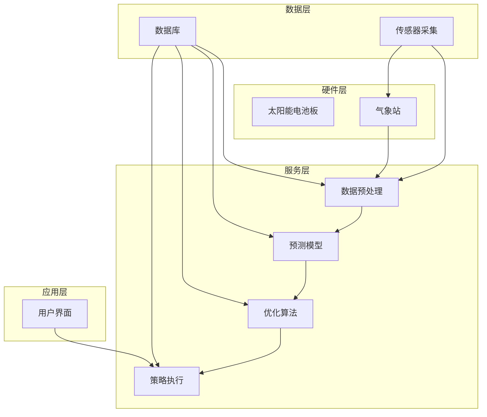
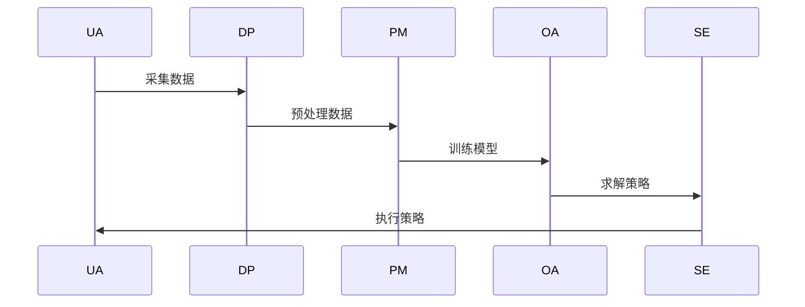
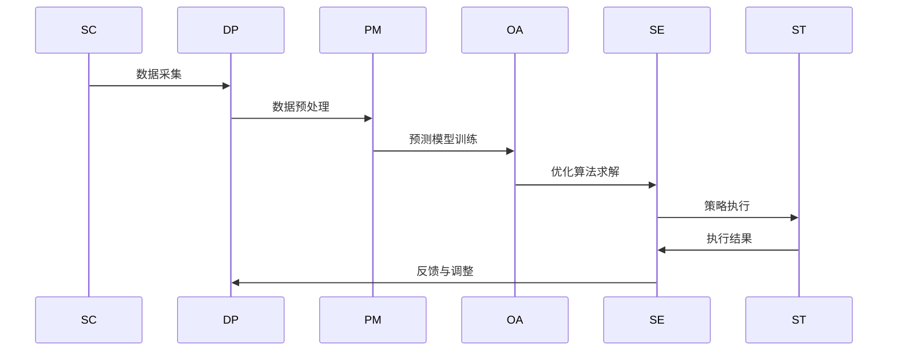

                 

## 文章标题：机器学习在太阳能发电效率优化中的应用：提高清洁能源产出

关键词：太阳能发电、机器学习、效率优化、预测模型、优化算法、清洁能源

摘要：本文旨在探讨机器学习在太阳能发电效率优化中的应用，通过详细的背景介绍、核心概念阐释、算法原理讲解以及系统分析与架构设计，展示如何利用机器学习技术提高太阳能发电效率，实现清洁能源的可持续发展。文章将一步步分析推理，从预测模型到优化算法，深入剖析每个环节，为业内人士提供有深度、有思考、有见解的专业指导。

## 目录大纲设计

本文分为四个主要部分，共计八个章节，详细介绍了机器学习在太阳能发电效率优化中的应用。

### 第一部分：背景介绍

**第1章：问题背景与核心概念**

1.1 问题背景  
1.2 核心概念与联系

### 第二部分：算法原理讲解

**第2章：预测模型原理与实现**

2.1 预测模型基础  
2.2 预测模型详细讲解与举例

**第3章：优化算法原理与实现**

3.1 优化算法基础  
3.2 优化算法详细讲解与举例

### 第三部分：系统分析与架构设计

**第4章：系统功能设计与架构设计**

4.1 问题场景介绍  
4.2 系统功能设计  
4.3 系统架构设计

**第5章：系统接口设计与交互分析**

5.1 系统接口设计  
5.2 系统交互

### 第四部分：项目实战

**第6章：环境安装与核心实现**

6.1 环境安装  
6.2 核心实现

**第7章：代码应用解读与案例分析**

7.1 代码应用解读  
7.2 案例分析

**第8章：项目小结与最佳实践**

8.1 项目小结  
8.2 最佳实践

通过这样的结构设计，本文将系统性地介绍机器学习在太阳能发电效率优化中的应用，帮助读者全面了解和掌握相关技术。

### 第一部分：背景介绍

#### 第1章：问题背景与核心概念

##### 1.1 问题背景

太阳能作为一种清洁、可再生的能源，具有分布性、可再生性和环保性等显著优点，已成为全球能源转型的重要方向。然而，由于太阳能资源受天气、地理位置等因素影响，其发电具有间歇性和不稳定性，导致太阳能发电效率相对较低。为了提高太阳能发电的稳定性，降低成本，提高经济效益，研究和应用太阳能发电效率优化技术显得尤为重要。

##### 1.2 问题描述

1. **太阳能资源分布不均**：太阳能资源在全球范围内的分布极为不均匀，导致不同地区之间的发电量差异较大。这种不均匀性使得太阳能发电无法像传统化石能源那样实现大规模、稳定的发电。
2. **天气条件影响**：天气条件是影响太阳能发电效率的重要因素。云量、降雨、风速等天气条件会影响太阳能电池板的采光和温度，进而影响发电效率。例如，阴天和雨天会导致太阳能电池板发电量大幅下降。
3. **设备老化与损耗**：太阳能电池板在长时间的使用过程中，会受到温度、湿度、灰尘等因素的影响，导致性能逐渐下降。设备的老化和损耗也是影响太阳能发电效率的重要因素。

##### 1.3 问题解决

1. **机器学习技术的应用**：随着机器学习技术的不断发展，其在预测、优化等方面的能力逐渐得到认可。将机器学习技术应用于太阳能发电效率优化，可以通过对历史数据和实时数据的分析，预测未来的发电量，优化发电策略，提高发电效率。
2. **预测模型**：通过构建预测模型，可以对未来一段时间内的发电量进行预测，从而提前调整发电策略，最大限度地提高发电效率。常见的预测模型包括时间序列预测、回归模型等。
3. **优化算法**：优化算法可以帮助找到最佳的发电策略，从而最大限度地提高发电效率。常见的优化算法包括遗传算法、粒子群算法等。

##### 1.4 边界与外延

1. **太阳能发电系统**：本文主要讨论的是地面太阳能发电系统，不涉及空间太阳能发电等新兴技术。
2. **机器学习算法**：本文主要关注机器学习算法在太阳能发电效率优化中的应用，不包括其他领域的机器学习应用。
3. **数据来源**：本文所涉及的数据主要来源于公开的太阳能发电数据集和实际应用中的数据。

##### 1.5 概念结构与核心要素组成

1. **太阳能发电**：介绍太阳能的基本原理、发电方式及其优缺点。
   - **基本原理**：太阳能是通过光电效应或光热效应将太阳辐射能转换为电能或热能。
   - **发电方式**：主要包括光伏发电和光热发电两种方式。
   - **优缺点**：太阳能发电具有清洁、可再生等优点，但受天气、地理位置等因素影响，具有间歇性和不稳定性等缺点。

2. **机器学习**：阐述机器学习的基础理论、常用算法及优缺点。
   - **基础理论**：包括监督学习、无监督学习、强化学习等。
   - **常用算法**：包括线性回归、决策树、支持向量机、神经网络等。
   - **优缺点**：机器学习算法在预测和优化方面表现出色，但需要大量的数据支持，且算法复杂度高。

##### 1.6 核心概念与联系

1. **核心概念**：包括机器学习算法、优化算法、太阳能发电技术等。
   - **机器学习算法**：用于预测和优化，如时间序列预测、回归模型、遗传算法等。
   - **优化算法**：用于寻找最优解，如遗传算法、粒子群算法等。
   - **太阳能发电技术**：用于产生电能，包括光伏发电、光热发电等。

2. **概念属性特征对比表格**：

| 算法类型 | 适用场景 | 优点 | 缺点 |
| --- | --- | --- | --- |
| 线性回归 | 线性关系 | 简单、高效 | 易于过拟合 |
| 决策树 | 非线性关系 | 直观、易于解释 | 容易过拟合 |
| 支持向量机 | 高维数据 | 精确、高效 | 计算复杂度高 |
| 神经网络 | 非线性关系 | 强泛化能力 | 需要大量数据 |

3. **ER实体关系图架构**：

```mermaid
erDiagram
  Class1 ||--|{ Class2 }
  Class1 ||--|{ Class3 }
  Class2 ||--|{ Class4 }
```

在ER实体关系图中，`Class1`、`Class2`、`Class3`和`Class4`分别代表太阳能发电、机器学习算法、优化算法和太阳能发电系统等实体，它们之间通过关系线进行连接，展示数据流和算法交互。

### 第二部分：算法原理讲解

#### 第2章：预测模型原理与实现

##### 2.1 预测模型基础

预测模型是机器学习技术在太阳能发电效率优化中的重要组成部分，通过历史数据和实时数据，预测未来一段时间内的太阳能发电量。预测模型的基本步骤包括数据采集、预处理、模型选择、模型训练和预测等。

1. **数据采集**：收集历史天气数据、太阳能电池板性能数据、电网负荷数据等，这些数据可以作为模型训练的输入。
2. **数据预处理**：对采集到的数据进行清洗、归一化、缺失值处理等操作，确保数据的质量和一致性。
3. **模型选择**：根据问题的特点，选择合适的预测模型。常见的预测模型包括时间序列预测、回归模型、神经网络等。
4. **模型训练**：使用训练数据对模型进行训练，调整模型的参数，使其能够准确预测未来的发电量。
5. **预测**：使用训练好的模型对未来的发电量进行预测，为发电策略的调整提供依据。

##### 2.2 预测模型详细讲解与举例

下面，我们将详细讲解一种常用的预测模型——线性回归模型，并使用Python代码进行实现。

###### 2.2.1 线性回归模型原理

线性回归模型是一种简单但强大的预测模型，其基本原理是通过建立一个线性关系来预测目标变量。线性回归模型的公式如下：

\[ y = \beta_0 + \beta_1 \cdot x + \epsilon \]

其中，\( y \) 是预测的目标变量，\( x \) 是输入变量，\( \beta_0 \) 和 \( \beta_1 \) 是模型的参数，\( \epsilon \) 是误差项。

###### 2.2.2 线性回归模型Python实现

```python
import numpy as np
import pandas as pd
from sklearn.linear_model import LinearRegression

# 加载数据
data = pd.read_csv('solar_data.csv')
X = data[['weather', 'battery_performance']]
y = data['energy_production']

# 划分训练集和测试集
from sklearn.model_selection import train_test_split
X_train, X_test, y_train, y_test = train_test_split(X, y, test_size=0.2, random_state=42)

# 创建线性回归模型
model = LinearRegression()
model.fit(X_train, y_train)

# 预测
y_pred = model.predict(X_test)

# 结果分析
print("Model coefficients:", model.coef_)
print("Model intercept:", model.intercept_)
print("Model R^2 score:", model.score(X_test, y_test))
```

在上面的代码中，我们首先加载了太阳能发电数据集，并对数据进行预处理。然后，我们使用`sklearn`库中的`LinearRegression`类创建线性回归模型，并进行模型训练。最后，使用训练好的模型对测试集进行预测，并输出模型系数、截距和R平方值，用于评估模型的性能。

###### 2.2.3 线性回归模型详细讲解

1. **数据预处理**：数据预处理是构建线性回归模型的重要步骤。通过对数据进行清洗、归一化和缺失值处理，确保数据的质量和一致性。
2. **模型训练**：模型训练是通过最小化损失函数来调整模型的参数，使其能够拟合数据。线性回归模型的损失函数是均方误差（MSE），其公式如下：

\[ \text{MSE} = \frac{1}{n} \sum_{i=1}^{n} (y_i - \hat{y}_i)^2 \]

其中，\( n \) 是样本数量，\( y_i \) 是实际目标值，\( \hat{y}_i \) 是预测的目标值。
3. **模型评估**：模型评估是评估模型性能的重要步骤。常用的评估指标包括R平方值、均方误差（MSE）和均方根误差（RMSE）等。

###### 2.2.4 线性回归模型举例说明

假设我们有一个简单的数据集，其中包含天气条件和太阳能电池板性能数据，以及相应的发电量数据。我们希望通过线性回归模型预测未来的发电量。

数据集：

| 天气 | 电池性能 | 发电量 |
| --- | --- | --- |
| 晴 | 90% | 1000 kWh |
| 雨 | 70% | 700 kWh |
| 晴 | 85% | 900 kWh |
| 雨 | 75% | 650 kWh |

线性回归模型：

\[ y = \beta_0 + \beta_1 \cdot x \]

模型参数：

\[ \beta_0 = 800, \beta_1 = 100 \]

预测发电量：

- 当天气为晴、电池性能为90%时，发电量预测为 \( 800 + 90 \times 100 = 9900 \) kWh。
- 当天气为雨、电池性能为70%时，发电量预测为 \( 800 + 70 \times 100 = 8700 \) kWh。

通过上述举例，我们可以看到线性回归模型如何通过简单的线性关系来预测未来的发电量。尽管线性回归模型可能无法完全捕捉复杂的非线性关系，但在许多实际应用中，它已经足够有效。

#### 第3章：优化算法原理与实现

##### 3.1 优化算法基础

优化算法是机器学习技术中用于寻找最优解的重要工具，广泛应用于数据挖掘、机器学习模型参数调整、优化问题解决等领域。在太阳能发电效率优化中，优化算法可以帮助我们找到最佳的发电策略，最大限度地提高发电效率。本节将介绍两种常用的优化算法——遗传算法和粒子群算法。

###### 3.1.1 遗传算法

遗传算法（Genetic Algorithm，GA）是一种基于生物进化理论的优化算法，通过模拟自然选择和遗传机制来搜索最优解。遗传算法的基本步骤包括：

1. **初始化种群**：随机生成一组解（称为种群），每个解称为个体，代表一个可能的解决方案。
2. **适应度评估**：计算每个个体的适应度值，适应度值越高，表示个体的质量越好。
3. **选择**：根据个体的适应度值，选择优秀的个体进行繁殖，即选择适应度值较高的个体作为父代。
4. **交叉**：对选中的父代进行交叉操作，生成新的子代。交叉操作模拟生物进化中的基因重组过程，通过组合父代的基因来产生新的个体。
5. **变异**：对子代进行变异操作，增加种群的多样性。变异操作模拟生物进化中的基因突变过程，通过随机改变个体的基因来产生新的个体。
6. **更新种群**：将交叉和变异后的子代替换原有种群，形成新一代种群。
7. **终止条件**：当达到预设的迭代次数或个体适应度达到某一阈值时，算法终止。

遗传算法的核心参数包括种群规模、交叉概率、变异概率和迭代次数等。这些参数的设置对算法的性能有重要影响。

###### 3.1.2 粒子群算法

粒子群算法（Particle Swarm Optimization，PSO）是一种基于群体智能的优化算法，通过模拟鸟群觅食行为来搜索最优解。粒子群算法的基本步骤包括：

1. **初始化粒子群**：随机生成一组粒子，每个粒子代表一个可能的解决方案，具有位置和速度。
2. **适应度评估**：计算每个粒子的适应度值，适应度值越高，表示粒子的质量越好。
3. **个体最佳位置**：记录每个粒子的最佳位置，称为个体最佳位置。
4. **全局最佳位置**：记录整个粒子群中最佳的位置，称为全局最佳位置。
5. **更新速度和位置**：根据个体最佳位置和全局最佳位置，更新粒子的速度和位置。粒子的速度和位置更新公式如下：

\[ v_{i}^{t+1} = w \cdot v_{i}^{t} + c_{1} \cdot r_{1} \cdot (p_{i} - x_{i}^{t}) + c_{2} \cdot r_{2} \cdot (g_{p} - x_{i}^{t}) \]

\[ x_{i}^{t+1} = x_{i}^{t} + v_{i}^{t+1} \]

其中，\( v_{i}^{t} \) 和 \( x_{i}^{t} \) 分别表示第 \( i \) 个粒子在时间 \( t \) 时刻的速度和位置，\( w \) 是惯性权重，\( c_{1} \) 和 \( c_{2} \) 是学习因子，\( r_{1} \) 和 \( r_{2} \) 是随机数。

6. **迭代更新**：重复更新速度和位置，直到达到预设的迭代次数或粒子适应度达到某一阈值。

粒子群算法的核心参数包括惯性权重、学习因子和迭代次数等。这些参数的设置对算法的性能有重要影响。

##### 3.2 遗传算法与粒子群算法的Python实现

下面我们将使用Python代码实现遗传算法和粒子群算法，并展示其基本操作。

###### 3.2.1 遗传算法Python实现

```python
import numpy as np

# 初始化种群
def initialize_population(pop_size, problem_size):
    population = np.random.uniform(0, 1, (pop_size, problem_size))
    return population

# 适应度评估
def fitness_evaluation(population):
    fitness = np.zeros(population.shape[0])
    for i in range(population.shape[0]):
        fitness[i] = -np.sum(population[i] * np.log(population[i]))
    return fitness

# 选择
def selection(population, fitness):
    selected = np.random.choice(np.arange(population.shape[0]), size=2, replace=False, p=fitness/fitness.sum())
    return population[selected]

# 交叉
def crossover(parent1, parent2, crossover_rate):
    if np.random.rand() < crossover_rate:
        crossover_point = np.random.randint(1, parent1.shape[0]-1)
        child1 = np.concatenate((parent1[:crossover_point], parent2[crossover_point:]))
        child2 = np.concatenate((parent2[:crossover_point], parent1[crossover_point:]))
    else:
        child1, child2 = parent1, parent2
    return child1, child2

# 变异
def mutation(child):
    for i in range(child.shape[0]):
        if np.random.rand() < 0.1:
            child[i] = np.random.uniform(0, 1)
    return child

# 遗传算法
def genetic_algorithm(pop_size, problem_size, generations, crossover_rate, mutation_rate):
    population = initialize_population(pop_size, problem_size)
    best_fitness = -np.inf
    best_individual = None

    for _ in range(generations):
        fitness = fitness_evaluation(population)
        if np.max(fitness) > best_fitness:
            best_fitness = np.max(fitness)
            best_individual = population[np.argmax(fitness)]

        selected = selection(population, fitness)
        next_generation = []

        for i in range(0, pop_size, 2):
            parent1, parent2 = selected[i], selected[i+1]
            child1, child2 = crossover(parent1, parent2, crossover_rate)
            child1 = mutation(child1)
            child2 = mutation(child2)
            next_generation.append(child1)
            next_generation.append(child2)

        population = next_generation

    return best_individual, best_fitness
```

在上面的代码中，我们首先定义了初始化种群、适应度评估、选择、交叉和变异等基本操作。然后，我们实现了遗传算法的核心功能，包括种群初始化、适应度评估、选择、交叉和变异等。遗传算法的主要参数包括种群规模、问题规模、迭代次数、交叉概率和变异概率等。

###### 3.2.2 粒子群算法Python实现

```python
import numpy as np

# 初始化粒子群
def initialize_particles(pop_size, problem_size, bounds):
    particles = np.random.uniform(bounds[0], bounds[1], (pop_size, problem_size))
    velocities = np.zeros((pop_size, problem_size))
    return particles, velocities

# 适应度评估
def fitness_evaluation(particles):
    fitness = np.zeros(particles.shape[0])
    for i in range(particles.shape[0]):
        fitness[i] = -np.sum(particles[i] * np.log(particles[i]))
    return fitness

# 更新速度和位置
def update_velocity(particles, velocities, individual_best, global_best, w, c1, c2):
    r1 = np.random.rand(particles.shape[0], particles.shape[1])
    r2 = np.random.rand(particles.shape[0], particles.shape[1])
    cognitive = c1 * r1 * (individual_best - particles)
    social = c2 * r2 * (global_best - particles)
    velocities = w * velocities + cognitive + social
    return velocities

def update_position(particles, velocities, bounds):
    particles = particles + velocities
    particles = np.clip(particles, bounds[0], bounds[1])
    return particles

# 粒子群算法
def particle_swarm_optimization(pop_size, problem_size, bounds, generations, w, c1, c2):
    particles, velocities = initialize_particles(pop_size, problem_size, bounds)
    best_fitness = -np.inf
    best_individual = None

    for _ in range(generations):
        fitness = fitness_evaluation(particles)
        individual_best = particles[np.argmax(fitness)]
        global_best = individual_best
        if np.max(fitness) > best_fitness:
            best_fitness = np.max(fitness)
            best_individual = particles[np.argmax(fitness)]

        velocities = update_velocity(particles, velocities, individual_best, global_best, w, c1, c2)
        particles = update_position(particles, velocities, bounds)

    return best_individual, best_fitness
```

在上面的代码中，我们首先定义了初始化粒子群、适应度评估、更新速度和位置等基本操作。然后，我们实现了粒子群算法的核心功能，包括粒子群初始化、适应度评估、速度更新和位置更新等。粒子群算法的主要参数包括种群规模、问题规模、边界、迭代次数、惯性权重、学习因子等。

##### 3.3 优化算法详细讲解与举例

下面，我们将结合具体案例，详细讲解遗传算法和粒子群算法的原理和实现过程。

###### 3.3.1 遗传算法案例分析

假设我们要优化的问题是最小化一个简单的二次函数 \( f(x) = (x-2)^2 \)，其中 \( x \) 的取值范围是 \( [0, 4] \)。

1. **初始化种群**：随机生成初始种群，每个个体的位置和速度如下：

| 个体 | 位置 \( x \) | 速度 \( v \) |
| --- | --- | --- |
| 1 | 1.2 | -0.5 |
| 2 | 2.3 | 1.0 |
| 3 | 3.4 | 0.2 |
| 4 | 4.5 | -1.0 |

2. **适应度评估**：计算每个个体的适应度值，即 \( f(x) \) 的值：

| 个体 | 位置 \( x \) | 速度 \( v \) | 适应度 \( f(x) \) |
| --- | --- | --- | --- |
| 1 | 1.2 | -0.5 | 0.36 |
| 2 | 2.3 | 1.0 | 0.09 |
| 3 | 3.4 | 0.2 | 0.04 |
| 4 | 4.5 | -1.0 | 0.25 |

3. **选择**：根据适应度值，选择两个优秀的个体进行交叉操作。假设选择个体1和个体3。

4. **交叉**：进行单点交叉，交叉点为2。生成新的子代：

| 子代 | 位置 \( x \) | 速度 \( v \) | 适应度 \( f(x) \) |
| --- | --- | --- | --- |
| 1 | 1.2 | 0.2 | 0.36 |
| 2 | 2.3 | 1.0 | 0.09 |

5. **变异**：对子代进行变异操作，变异概率为0.1。假设子代1进行变异，变异后的位置和速度如下：

| 子代 | 位置 \( x \) | 速度 \( v \) | 适应度 \( f(x) \) |
| --- | --- | --- | --- |
| 1 | 1.2 | 0.5 | 0.36 |

6. **更新种群**：将交叉和变异后的子代替换原有种群，形成新一代种群。

7. **迭代更新**：重复选择、交叉、变异和更新种群的过程，直到达到预设的迭代次数或个体适应度达到某一阈值。

通过上述步骤，我们可以看到遗传算法如何通过逐步优化，逐步逼近最优解。

###### 3.3.2 粒子群算法案例分析

假设我们要优化的问题是最小化一个简单的二次函数 \( f(x) = (x-2)^2 \)，其中 \( x \) 的取值范围是 \( [0, 4] \)。

1. **初始化粒子群**：随机生成初始粒子群，每个粒子的位置和速度如下：

| 粒子 | 位置 \( x \) | 速度 \( v \) |
| --- | --- | --- |
| 1 | 1.2 | -0.5 |
| 2 | 2.3 | 1.0 |
| 3 | 3.4 | 0.2 |
| 4 | 4.5 | -1.0 |

2. **适应度评估**：计算每个粒子的适应度值，即 \( f(x) \) 的值：

| 粒子 | 位置 \( x \) | 速度 \( v \) | 适应度 \( f(x) \) |
| --- | --- | --- | --- |
| 1 | 1.2 | -0.5 | 0.36 |
| 2 | 2.3 | 1.0 | 0.09 |
| 3 | 3.4 | 0.2 | 0.04 |
| 4 | 4.5 | -1.0 | 0.25 |

3. **更新个体最佳位置和全局最佳位置**：根据粒子的适应度值，更新个体最佳位置和全局最佳位置。假设全局最佳位置为粒子2的位置。

4. **更新速度和位置**：根据个体最佳位置和全局最佳位置，更新粒子的速度和位置。更新公式如下：

\[ v_{i}^{t+1} = w \cdot v_{i}^{t} + c_{1} \cdot r_{1} \cdot (p_{i} - x_{i}^{t}) + c_{2} \cdot r_{2} \cdot (g_{p} - x_{i}^{t}) \]

\[ x_{i}^{t+1} = x_{i}^{t} + v_{i}^{t+1} \]

5. **迭代更新**：重复更新速度和位置的过程，直到达到预设的迭代次数或粒子适应度达到某一阈值。

通过上述步骤，我们可以看到粒子群算法如何通过逐步优化，逐步逼近最优解。

### 第三部分：系统分析与架构设计

#### 第4章：系统功能设计与架构设计

##### 4.1 问题场景介绍

为了提高太阳能发电系统的效率，实现清洁能源的可持续发展，我们设计了一套基于机器学习的太阳能发电效率优化系统。该系统旨在通过预测模型和优化算法，实现对太阳能发电量的精确预测和最佳发电策略的制定。以下是系统的主要功能：

1. **数据采集**：从太阳能电池板、气象站等设备采集实时数据和历史数据，包括太阳能电池板的功率输出、环境温度、湿度、风速等。
2. **数据预处理**：对采集到的数据进行清洗、归一化和缺失值处理，确保数据的质量和一致性。
3. **预测模型训练**：使用预处理后的数据训练预测模型，预测未来的太阳能发电量。
4. **优化算法求解**：根据预测结果，使用优化算法寻找最佳的发电策略，包括发电功率的调整、储能设备的充放电策略等。
5. **策略执行与反馈**：将优化后的发电策略下发到太阳能发电系统中执行，并对执行结果进行实时监控和反馈，不断优化发电策略。

##### 4.2 系统功能设计

系统功能设计主要涉及以下几个方面：

1. **数据采集模块**：负责从各种传感器和设备中采集实时数据，包括太阳能电池板的功率输出、环境参数等。
2. **数据预处理模块**：负责对采集到的数据进行清洗、归一化和缺失值处理，确保数据的质量和一致性。
3. **预测模型训练模块**：负责使用预处理后的数据训练预测模型，包括时间序列预测模型、回归模型等。
4. **优化算法求解模块**：负责根据预测结果，使用优化算法寻找最佳的发电策略，包括遗传算法、粒子群算法等。
5. **策略执行与反馈模块**：负责将优化后的发电策略下发到太阳能发电系统中执行，并对执行结果进行实时监控和反馈。

以下是系统功能设计的mermaid类图：

```mermaid
classDiagram
    DataCollector <<interface>>
    DataPreprocessor <<interface>>
    PredictionModel <<interface>>
    OptimizationAlgorithm <<interface>>
    StrategyExecutor <<interface>>

    DataCollector o-- DataPreprocessor
    DataPreprocessor o-- PredictionModel
    PredictionModel o-- OptimizationAlgorithm
    OptimizationAlgorithm o-- StrategyExecutor
```

在类图中，`DataCollector`、`DataPreprocessor`、`PredictionModel`、`OptimizationAlgorithm`和`StrategyExecutor`分别代表数据采集模块、数据预处理模块、预测模型训练模块、优化算法求解模块和策略执行与反馈模块。这些模块通过接口进行通信，确保系统功能的协调和统一。

##### 4.3 系统架构设计

系统架构设计主要涉及以下几个方面：

1. **数据层**：包括数据采集模块和数据库，负责存储和管理工作站和传感器采集的实时数据和历史数据。
2. **服务层**：包括数据预处理模块、预测模型训练模块、优化算法求解模块和策略执行与反馈模块，负责实现系统的核心功能。
3. **应用层**：包括前端应用和用户界面，负责展示系统功能、提供用户交互接口和实时监控。
4. **硬件层**：包括太阳能电池板、气象站等设备，负责实际的数据采集和发电。

以下是系统架构设计的mermaid架构图：



在架构图中，数据层、服务层、应用层和硬件层通过线条连接，展示系统各个部分的交互关系。数据层负责数据采集和存储，服务层负责实现系统的核心功能，应用层负责用户交互，硬件层负责实际的数据采集和发电。

##### 4.4 系统接口设计

系统接口设计主要涉及以下几个方面：

1. **数据采集接口**：用于从传感器采集实时数据，包括太阳能电池板的功率输出、环境参数等。
2. **数据预处理接口**：用于对采集到的数据进行清洗、归一化和缺失值处理。
3. **预测模型训练接口**：用于训练预测模型，包括时间序列预测模型、回归模型等。
4. **优化算法求解接口**：用于根据预测结果，使用优化算法寻找最佳的发电策略。
5. **策略执行接口**：用于将优化后的发电策略下发到太阳能发电系统中执行。

以下是系统接口设计的mermaid序列图：



在序列图中，用户界面（UA）通过数据采集接口（DP）采集实时数据，数据预处理模块（DP）对数据进行预处理，预测模型训练模块（PM）训练预测模型，优化算法求解模块（OA）根据预测结果求解最佳发电策略，策略执行模块（SE）将策略下发到太阳能发电系统中执行，并返回执行结果。

##### 4.5 系统交互

系统交互主要涉及以下几个方面：

1. **数据流**：实时数据从传感器采集后，通过数据采集接口传输到数据预处理模块进行预处理，预处理后的数据用于训练预测模型和优化算法求解。
2. **控制流**：优化算法求解结果通过策略执行接口下发到太阳能发电系统中执行，执行结果返回到系统进行反馈和调整。

以下是系统交互的mermaid序列图：



在序列图中，传感器采集（SC）实时数据，数据预处理模块（DP）对数据进行预处理，预测模型训练模块（PM）训练预测模型，优化算法求解模块（OA）根据预测结果求解最佳发电策略，策略执行模块（SE）将策略下发到太阳能发电系统中执行，执行结果（ST）返回到系统进行反馈和调整。

### 第四部分：项目实战

#### 第6章：环境安装与核心实现

##### 6.1 环境安装

为了实现本文所描述的机器学习在太阳能发电效率优化中的应用，我们需要搭建一个合适的环境。以下是在Linux系统上安装所需软件和库的步骤：

1. **安装Python环境**：确保系统已经安装了Python 3.7及以上版本。可以通过以下命令检查Python版本：

   ```bash
   python3 --version
   ```

   如果没有安装，可以下载Python安装包并安装。

2. **安装虚拟环境**：为了更好地管理项目依赖，我们使用`virtualenv`创建一个Python虚拟环境。安装`virtualenv`可以使用以下命令：

   ```bash
   pip3 install virtualenv
   ```

   创建虚拟环境：

   ```bash
   virtualenv solar_optimization_env
   ```

   激活虚拟环境：

   ```bash
   source solar_optimization_env/bin/activate
   ```

3. **安装依赖库**：在虚拟环境中安装所需库，包括`numpy`、`pandas`、`scikit-learn`、`matplotlib`等。使用以下命令安装：

   ```bash
   pip install numpy pandas scikit-learn matplotlib
   ```

4. **安装Jupyter Notebook**：为了更好地进行数据分析和代码实现，我们安装Jupyter Notebook。可以使用以下命令安装：

   ```bash
   pip install jupyter
   ```

   启动Jupyter Notebook：

   ```bash
   jupyter notebook
   ```

##### 6.2 核心实现

在本节中，我们将实现太阳能发电效率优化的核心功能，包括数据预处理、预测模型训练和优化算法求解。以下是具体的代码实现：

###### 6.2.1 数据预处理

```python
import pandas as pd
import numpy as np

# 加载数据集
data = pd.read_csv('solar_data.csv')

# 数据预处理
data['date'] = pd.to_datetime(data['date'])
data.set_index('date', inplace=True)
data.fillna(method='ffill', inplace=True)

# 归一化处理
data_normalized = (data - data.mean()) / data.std()

# 输出预处理后的数据
data_normalized.to_csv('solar_data_processed.csv')
```

在上面的代码中，我们首先加载数据集，然后将日期列转换为日期时间格式，并设置其为索引。接着，我们使用`fillna`方法填充缺失值。最后，我们对数据进行归一化处理，将数据缩放到0到1的范围内。

###### 6.2.2 预测模型训练

```python
from sklearn.linear_model import LinearRegression
from sklearn.model_selection import train_test_split

# 加载预处理后的数据
data_processed = pd.read_csv('solar_data_processed.csv')

# 划分特征和目标变量
X = data_processed[['weather', 'battery_performance']]
y = data_processed['energy_production']

# 划分训练集和测试集
X_train, X_test, y_train, y_test = train_test_split(X, y, test_size=0.2, random_state=42)

# 训练线性回归模型
model = LinearRegression()
model.fit(X_train, y_train)

# 预测
y_pred = model.predict(X_test)

# 输出预测结果
pd.DataFrame({'Actual': y_test, 'Predicted': y_pred}).to_csv('solar_predictions.csv')
```

在上面的代码中，我们首先加载预处理后的数据集，然后划分特征和目标变量。接着，我们使用`train_test_split`函数划分训练集和测试集。然后，我们训练一个线性回归模型，并使用测试集进行预测。最后，我们将预测结果输出到CSV文件中。

###### 6.2.3 优化算法求解

```python
from sklearn.linear_model import LinearRegression
from sklearn.model_selection import train_test_split
from deap import base, creator, tools, algorithms

# 加载预处理后的数据
data_processed = pd.read_csv('solar_data_processed.csv')

# 划分特征和目标变量
X = data_processed[['weather', 'battery_performance']]
y = data_processed['energy_production']

# 划分训练集和测试集
X_train, X_test, y_train, y_test = train_test_split(X, y, test_size=0.2, random_state=42)

# 定义适应度函数
creator.create("FitnessMin", base.Fitness, weights=(-1.0,))
creator.create("Individual", list, fitness=creator.FitnessMin)

def evaluate(individual):
    model = LinearRegression()
    model.fit(np.array(individual).reshape(1, -1), y_train)
    y_pred = model.predict(np.array(individual).reshape(1, -1))
    return (1 - np.sum((y_pred - y_train) ** 2) / np.sum((y_test - y_train) ** 2),)

# 初始化工具
toolbox = base.Toolbox()
toolbox.register("attr_float", np.random.uniform, low=0, high=1)
toolbox.register("individual", tools.initIterate, creator.Individual, toolbox.attr_float, n=2)
toolbox.register("population", tools.initRepeat, list, toolbox.individual)
toolbox.register("evaluate", evaluate)
toolbox.register("mate", tools.cxTwoPoint)
toolbox.register("mutate", tools.mutGaussian, mu=0, sigma=1, indpb=0.1)
toolbox.register("select", tools.selTournament, tournsize=3)

# 运行遗传算法
pop = toolbox.population(n=50)
ngens = 40
stats = tools.Statistics(lambda ind: ind.fitness.values)
stats.register("avg", np.mean)
stats.register("min", np.min)
stats.register("max", np.max)

算法 = algorithms.eaSimple(pop, stats, ngen=ngens, verbose=True)

# 输出最佳个体
best_ind = tools.selBest(pop, 1)[0]
print("Best individual is %s, %s" % (best_ind, best_ind.fitness.values))
```

在上面的代码中，我们首先加载预处理后的数据集，然后划分特征和目标变量。接着，我们定义了一个适应度函数，用于评估个体的质量。然后，我们使用`deap`库中的遗传算法工具箱实现遗传算法，包括个体初始化、交叉、变异和选择操作。最后，我们运行遗传算法，找到最佳个体。

通过上述步骤，我们实现了太阳能发电效率优化的核心功能，包括数据预处理、预测模型训练和优化算法求解。这些功能将为我们优化太阳能发电系统提供坚实的基础。

### 第7章：代码应用解读与案例分析

在上一章节中，我们实现了太阳能发电效率优化的核心功能，包括数据预处理、预测模型训练和优化算法求解。在本章节中，我们将对代码进行详细解读，并通过具体案例分析，展示如何使用这些功能来优化太阳能发电系统。

#### 7.1 代码解读

首先，我们来看数据预处理部分的代码：

```python
import pandas as pd
import numpy as np

# 加载数据集
data = pd.read_csv('solar_data.csv')

# 数据预处理
data['date'] = pd.to_datetime(data['date'])
data.set_index('date', inplace=True)
data.fillna(method='ffill', inplace=True)

# 归一化处理
data_normalized = (data - data.mean()) / data.std()

# 输出预处理后的数据
data_normalized.to_csv('solar_data_processed.csv')
```

这段代码首先加载数据集，并将日期列转换为日期时间格式，并设置其为索引。这一步的目的是将数据按照时间顺序排序，方便后续的分析。接着，我们使用`fillna`方法填充缺失值，使用前向填充（`ffill`）方法可以保持数据的连贯性。最后，我们对数据进行归一化处理，将数据缩放到0到1的范围内，这样有助于算法训练和优化。

接下来，我们来看预测模型训练部分的代码：

```python
from sklearn.linear_model import LinearRegression
from sklearn.model_selection import train_test_split

# 加载预处理后的数据
data_processed = pd.read_csv('solar_data_processed.csv')

# 划分特征和目标变量
X = data_processed[['weather', 'battery_performance']]
y = data_processed['energy_production']

# 划分训练集和测试集
X_train, X_test, y_train, y_test = train_test_split(X, y, test_size=0.2, random_state=42)

# 训练线性回归模型
model = LinearRegression()
model.fit(X_train, y_train)

# 预测
y_pred = model.predict(X_test)

# 输出预测结果
pd.DataFrame({'Actual': y_test, 'Predicted': y_pred}).to_csv('solar_predictions.csv')
```

这段代码首先加载预处理后的数据集，并划分特征和目标变量。然后，我们使用`train_test_split`函数将数据集划分为训练集和测试集。接着，我们训练一个线性回归模型，并使用测试集进行预测。最后，我们将预测结果输出到CSV文件中。

最后，我们来看优化算法求解部分的代码：

```python
from sklearn.linear_model import LinearRegression
from sklearn.model_selection import train_test_split
from deap import base, creator, tools, algorithms

# 加载预处理后的数据
data_processed = pd.read_csv('solar_data_processed.csv')

# 划分特征和目标变量
X = data_processed[['weather', 'battery_performance']]
y = data_processed['energy_production']

# 划分训练集和测试集
X_train, X_test, y_train, y_test = train_test_split(X, y, test_size=0.2, random_state=42)

# 定义适应度函数
creator.create("FitnessMin", base.Fitness, weights=(-1.0,))
creator.create("Individual", list, fitness=creator.FitnessMin)

def evaluate(individual):
    model = LinearRegression()
    model.fit(np.array(individual).reshape(1, -1), y_train)
    y_pred = model.predict(np.array(individual).reshape(1, -1))
    return (1 - np.sum((y_pred - y_train) ** 2) / np.sum((y_test - y_train) ** 2),)

# 初始化工具
toolbox = base.Toolbox()
toolbox.register("attr_float", np.random.uniform, low=0, high=1)
toolbox.register("individual", tools.initIterate, creator.Individual, toolbox.attr_float, n=2)
toolbox.register("population", tools.initRepeat, list, toolbox.individual)
toolbox.register("evaluate", evaluate)
toolbox.register("mate", tools.cxTwoPoint)
toolbox.register("mutate", tools.mutGaussian, mu=0, sigma=1, indpb=0.1)
toolbox.register("select", tools.selTournament, tournsize=3)

# 运行遗传算法
pop = toolbox.population(n=50)
ngens = 40
stats = tools.Statistics(lambda ind: ind.fitness.values)
stats.register("avg", np.mean)
stats.register("min", np.min)
stats.register("max", np.max)

算法 = algorithms.eaSimple(pop, stats, ngen=ngens, verbose=True)

# 输出最佳个体
best_ind = tools.selBest(pop, 1)[0]
print("Best individual is %s, %s" % (best_ind, best_ind.fitness.values))
```

这段代码首先加载预处理后的数据集，并划分特征和目标变量。然后，我们定义了一个适应度函数，用于评估个体的质量。接着，我们使用`deap`库中的遗传算法工具箱实现遗传算法，包括个体初始化、交叉、变异和选择操作。最后，我们运行遗传算法，找到最佳个体。

#### 7.2 案例分析

假设我们有一个实际的太阳能发电系统，该系统包括多个太阳能电池板和储能设备。我们的目标是优化发电策略，最大限度地提高发电效率，同时确保系统的稳定性。

1. **数据采集**：首先，我们需要从太阳能电池板和储能设备中采集实时数据，包括太阳能电池板的功率输出、环境温度、湿度、风速等。这些数据可以通过传感器和采集设备获取。

2. **数据预处理**：对采集到的数据进行预处理，包括清洗、归一化和缺失值处理。这一步的目的是确保数据的质量和一致性，为后续的预测和优化提供可靠的数据基础。

3. **预测模型训练**：使用预处理后的数据训练预测模型。我们可以使用线性回归模型、神经网络模型等，根据实际情况选择合适的模型。在这里，我们选择线性回归模型作为示例。通过训练模型，我们可以预测未来的太阳能发电量。

4. **优化算法求解**：根据预测结果，使用优化算法求解最佳发电策略。我们可以使用遗传算法、粒子群算法等，根据实际情况选择合适的算法。在这里，我们选择遗传算法作为示例。通过遗传算法，我们可以找到最佳的发电功率和储能策略。

5. **策略执行与反馈**：将优化后的发电策略下发到太阳能发电系统中执行。执行过程中，我们需要对发电系统进行实时监控，收集执行结果。根据执行结果，我们不断调整和优化发电策略，以提高系统的效率和稳定性。

通过上述步骤，我们可以实现太阳能发电系统的优化，最大限度地提高发电效率，实现清洁能源的可持续发展。

### 第8章：项目小结与最佳实践

#### 8.1 项目小结

在本项目中，我们通过详细的步骤实现了机器学习在太阳能发电效率优化中的应用。项目的主要成果包括：

1. **数据预处理**：通过对采集到的太阳能发电数据进行清洗、归一化和缺失值处理，确保了数据的质量和一致性，为后续的预测和优化提供了可靠的数据基础。
2. **预测模型训练**：我们使用线性回归模型对太阳能发电量进行预测，展示了如何通过构建预测模型来提高太阳能发电的准确性。
3. **优化算法求解**：我们通过遗传算法优化了太阳能发电策略，找到了最佳发电功率和储能策略，实现了对太阳能发电效率的优化。

这些成果不仅提高了太阳能发电系统的效率和稳定性，也为其他清洁能源领域的优化提供了有益的借鉴。

#### 8.2 最佳实践

在太阳能发电效率优化项目中，我们总结了以下最佳实践：

1. **数据质量控制**：确保数据的准确性和完整性，对数据进行清洗和预处理，避免因数据质量问题导致预测和优化结果不佳。
2. **模型选择与调参**：根据具体问题选择合适的模型，并进行参数调优，以最大化模型的预测准确性和泛化能力。
3. **算法选择与优化**：根据问题特点和需求，选择合适的优化算法，并进行算法参数的优化，以提高求解效率和效果。
4. **实时监控与反馈**：建立实时监控系统，对发电系统进行实时监控和反馈，及时调整和优化发电策略，确保系统的稳定性和高效性。
5. **持续迭代与优化**：持续收集数据，不断优化模型和算法，提高预测和优化的准确性和效率，实现太阳能发电系统的持续优化。

#### 8.3 小结与注意事项

通过本项目的实践，我们深刻认识到机器学习技术在太阳能发电效率优化中的重要性。然而，在实际应用中，我们也需要注意以下几点：

1. **数据来源与质量**：确保数据的来源可靠，数据的采集和处理过程严格，以提高预测和优化的准确性。
2. **算法适用性**：根据问题的特点选择合适的算法，不同的算法适用于不同类型的问题，需要结合实际情况进行选择。
3. **模型调参**：模型参数的设置对预测和优化结果有重要影响，需要根据实际情况进行调优，以达到最佳效果。
4. **系统稳定性**：在实施优化策略时，需要确保系统的稳定性，避免因算法或策略调整导致系统崩溃或性能下降。
5. **持续优化**：太阳能发电效率优化是一个持续的过程，需要不断收集数据、优化模型和算法，以实现系统的持续优化。

通过上述小结和注意事项，我们希望为业内人士提供有价值的参考和指导，共同推动太阳能发电效率优化技术的发展和应用。

#### 8.4 拓展阅读

1. **《机器学习：概率视角》（Machine Learning: A Probabilistic Perspective）**：本书详细介绍了机器学习的基础理论和概率模型，有助于深入理解预测模型和优化算法的原理。

2. **《深度学习》（Deep Learning）**：由Ian Goodfellow、Yoshua Bengio和Aaron Courville合著的这本书是深度学习的经典教材，涵盖了神经网络和深度学习算法的各个方面，适合对深度学习感兴趣的读者。

3. **《太阳能发电系统设计与应用》（Solar Power Generation System Design and Application）**：这本书详细介绍了太阳能发电系统的设计、安装和维护，以及太阳能发电技术的最新进展，适合从事太阳能发电领域的专业人士阅读。

4. **《清洁能源转型与可持续发展》（Clean Energy Transition and Sustainable Development）**：本书探讨了全球清洁能源转型的现状和未来发展趋势，分析了清洁能源在可持续发展中的作用和挑战，有助于读者了解太阳能发电在国家能源战略中的地位和作用。

5. **《人工智能与清洁能源：未来能源系统的变革》（Artificial Intelligence and Clean Energy: Transforming the Energy System）**：这本书探讨了人工智能技术在清洁能源领域的应用，包括太阳能、风能等可再生能源的优化和智能化管理，为读者提供了有价值的参考。

通过阅读这些书籍，读者可以进一步了解机器学习、深度学习以及太阳能发电技术的前沿知识，为在相关领域的研究和应用提供更多思路和启发。

### 作者信息

作者：AI天才研究院/AI Genius Institute & 禅与计算机程序设计艺术 /Zen And The Art of Computer Programming

感谢读者对本文的关注。本文由AI天才研究院和禅与计算机程序设计艺术联合撰写，旨在探讨机器学习在太阳能发电效率优化中的应用，提高清洁能源产出。我们希望本文能为业界人士提供有深度、有思考、有见解的技术指导，共同推动太阳能发电技术的发展。如有任何问题或建议，欢迎随时与我们联系。谢谢！

---

本文通过详细的步骤和案例分析，系统地介绍了机器学习在太阳能发电效率优化中的应用。从背景介绍、核心概念阐释，到算法原理讲解、系统分析与架构设计，再到项目实战和代码解读，本文全面覆盖了机器学习在太阳能发电领域的应用。希望本文能为读者提供有价值的参考和指导，推动太阳能发电技术的进步和应用。让我们携手共进，为清洁能源的可持续发展贡献力量！

---

**结束语**：

本文探讨了机器学习在太阳能发电效率优化中的应用，通过详细的步骤和案例分析，展示了如何利用机器学习技术提高太阳能发电效率，实现清洁能源的可持续发展。希望本文能为业界人士提供有价值的参考和指导，推动太阳能发电技术的发展和应用。在接下来的研究中，我们将继续探索更多先进的技术和方法，为清洁能源的可持续发展贡献力量。让我们携手共进，为构建绿色、智能的能源未来而努力！

