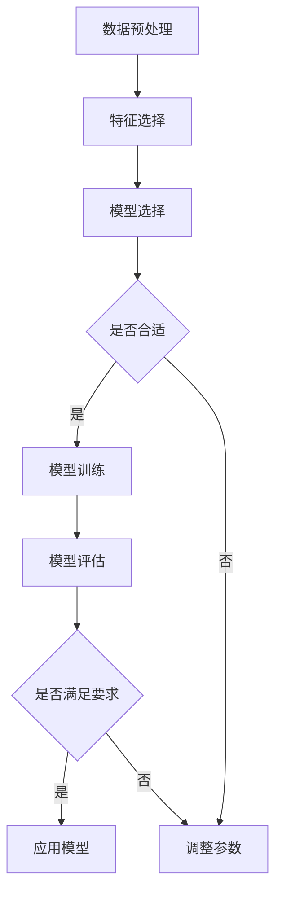
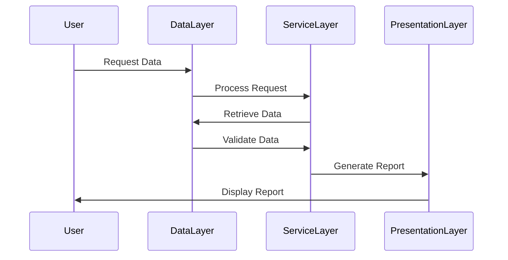
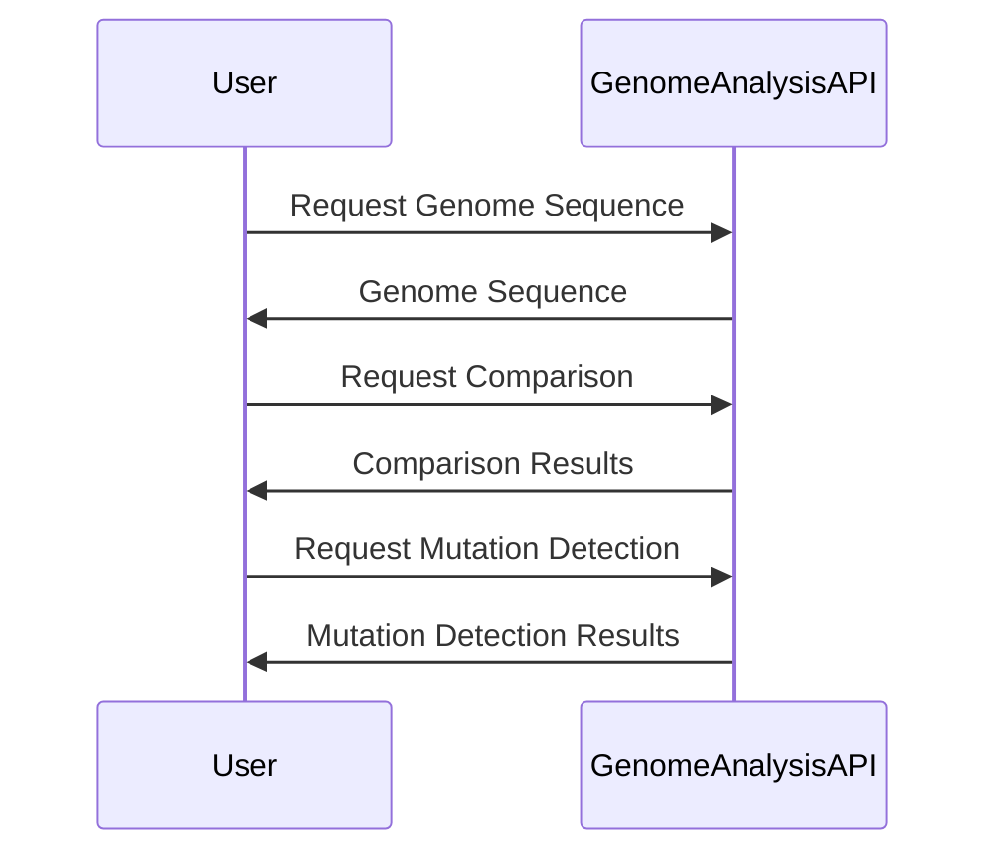

                 


### 第一部分：背景介绍

#### 1.1 问题背景

在当今的生物科学领域，基因组分析、药物设计等研究领域面临着前所未有的挑战。随着人类基因组计划（Human Genome Project）的完成，科学家们已经获得了大量的基因组数据，但这些数据不仅庞大，而且高度复杂。传统的计算方法往往无法处理这些高维、非线性的数据，从而导致基因组分析的效率和精度受限。同样，药物设计领域也面临着类似的挑战，需要处理大量的生物分子结构信息，以预测药物分子的活性。

机器学习作为一种数据驱动的方法，通过模拟人脑的学习机制，能够在没有明确规则的情况下，从海量数据中自动提取特征、发现规律。这种方法为基因组分析和药物设计提供了新的可能性，使得这些领域的研究能够更加高效和精确。

#### 1.2 问题描述

在基因组分析中，科学家们需要对海量的基因组数据进行分析，以识别基因、转录因子、疾病相关基因等。这个过程包括基因组序列的读取、处理、比较和分析。例如，通过比较不同个体之间的基因组序列，可以发现与疾病相关的基因变异。此外，基因表达分析也是基因组分析的重要组成部分，它涉及对基因在不同组织、不同发育阶段、不同环境条件下的表达水平的监测。

在药物设计领域，科学家们需要从大量的生物分子结构信息中筛选出具有潜在活性的药物分子。这个过程通常包括分子模拟、分子对接、药物筛选算法等步骤。分子模拟用于预测药物分子在生物体内的动态行为，而分子对接则用于评估药物分子与生物分子之间的相互作用。药物筛选算法则用于从大量候选药物中筛选出最有可能成功的药物。

#### 1.3 问题解决

机器学习技术通过构建合适的模型，能够对生物信息学数据进行分析和处理，从而实现基因组分析和药物设计的自动化和智能化。例如，在基因组分析中，机器学习算法可以用于识别基因突变、预测基因表达水平、分析基因组变异等。在药物设计领域，机器学习算法可以用于预测药物分子的活性、筛选药物候选物、优化药物分子结构等。

通过数据驱动的方法，机器学习可以在没有明确规则的情况下，从数据中学习并发现规律。这种方法不仅提高了分析的效率和精度，而且能够处理高度复杂的生物信息学数据，为科学研究提供了新的工具。

#### 1.4 边界与外延

机器学习在生物信息学中的应用边界涉及基因组数据分析、蛋白质结构预测、药物分子设计等多个领域。例如，在基因组数据分析中，机器学习可以用于识别癌症相关基因、预测疾病风险等。在蛋白质结构预测中，机器学习可以用于预测蛋白质的结构、功能以及与其他分子之间的相互作用。在药物分子设计中，机器学习可以用于筛选药物候选物、优化药物分子结构等。

随着技术的不断发展，机器学习在生物信息学中的应用范围还将进一步扩展。例如，机器学习可以与基因组编辑技术相结合，用于基因治疗和基因改造。此外，机器学习还可以与生物成像技术相结合，用于实时监测生物体内的分子动态。

#### 1.5 概念结构与核心要素组成

1. **基因组分析**
   - 核心概念：基因组序列、基因表达、基因突变等
   - 核心要素：基因组数据、分析算法、模型预测等

2. **药物设计**
   - 核心概念：药物分子结构、生物分子相互作用、药物活性预测等
   - 核心要素：分子模拟、分子对接、药物筛选算法等

通过以上对问题的背景、问题描述、问题解决、边界与外延以及概念结构与核心要素组成的介绍，我们为后续的内容打下了坚实的基础。接下来，我们将深入探讨机器学习在基因组分析和药物设计中的具体应用。

### 第二部分：核心概念与联系

#### 2.1 核心概念原理

机器学习：机器学习是一种通过数据训练模型，实现从数据中自动提取知识和规律的方法。它包括监督学习、无监督学习、强化学习等不同的类型。在基因组分析和药物设计中，机器学习模型能够从大量的数据中学习，并用于预测和分类任务。

基因组分析：基因组分析是指对生物体的基因组序列进行读取、处理、比较和分析的过程。通过基因组分析，科学家们可以识别基因、转录因子、疾病相关基因等。基因组分析的核心任务是理解基因的功能和调控机制，从而为生物医学研究提供基础。

药物设计：药物设计是指通过分子模拟、分子对接等方法，预测药物分子的活性，并筛选出具有潜在治疗作用的药物候选物。药物设计的核心任务是优化药物分子结构，使其能够有效结合目标生物分子，并发挥治疗作用。

#### 2.2 概念属性特征对比表格

| 概念       | 属性特征 | 对比         |
|------------|----------|-------------|
| 机器学习   | 自学习能力、数据驱动、模型预测 | 区别于传统编程，不需要编写详细规则 |
| 基因组分析 | 基因序列处理、数据挖掘、生物信息学方法 | 面对大量基因数据，需要高效分析方法 |
| 药物设计   | 分子模拟、分子对接、药物筛选 | 需要准确预测药物活性，进行药物分子设计 |

通过对比表格，我们可以更清晰地了解机器学习、基因组分析和药物设计之间的差异和联系。机器学习作为基础技术，能够为基因组分析和药物设计提供强大的分析工具和预测能力。而基因组分析和药物设计则分别关注生物数据和药物分子结构的处理与优化，从而为生物医学研究和药物开发提供支持。

#### 2.3 ER实体关系图架构

下面是机器学习、基因组分析和药物设计领域的ER实体关系图，用于描述这些概念之间的相互关系。

```mermaid
erDiagram
    AGENOM --> BGENE
    AGENOM --> CEXPRESSION
    AGENOM --> DGENEMUTATION
    BGENE --> CEXPRESSION
    BGENE --> DGENEMUTATION
    BGENE --> ETRANSCRIPTIONFACTOR
    CEXPRESSION --> DGENEMUTATION
    CEXPRESSION --> ETRANSCRIPTIONFACTOR
    DGENEMUTATION --> ETRANSCRIPTIONFACTOR
    BDRUG --> CMOLECULE
    BDRUG --> DMOLARINTERACTION
    BDRUG --> EDRUGACTIVITY
```

在这张ER实体关系图中，我们可以看到基因组分析中的核心实体包括基因（BGENE）、基因表达（CEXPRESSION）和基因突变（DGENEMUTATION）。药物设计中的核心实体包括药物（BDRUG）、分子（CMOLECULE）和生物分子相互作用（DMOLARINTERACTION）。

此外，转录因子（ETRANSCRIPTIONFACTOR）既与基因组分析中的基因和基因表达相关，又与药物设计中的药物和分子相互作用相关。这种交叉关系展示了基因组分析和药物设计之间的紧密联系，也说明了机器学习技术在整合不同生物信息学领域数据方面的重要性。

通过核心概念原理的讲解、概念属性特征对比表格和ER实体关系图的展示，我们对机器学习、基因组分析和药物设计的基本概念和相互关系有了更深入的理解。这为后续的算法原理讲解和系统架构设计奠定了坚实的基础。

### 第三部分：算法原理讲解

#### 3.1 机器学习算法

机器学习算法是基因组分析和药物设计中的核心技术。它们通过从数据中学习，自动提取特征，并构建模型进行预测。以下是几种常见的机器学习算法及其原理：

1. **线性回归**
   - 算法原理：线性回归是一种通过拟合数据点之间的关系，实现从自变量到因变量的预测的方法。其数学模型可以表示为：
     $$
     y = \beta_0 + \beta_1 \cdot x
     $$
     其中，$y$是因变量，$x$是自变量，$\beta_0$和$\beta_1$是模型参数。通过最小化预测值与实际值之间的误差，可以求解出$\beta_0$和$\beta_1$的最佳值。
   - 举例说明：假设我们想要预测一个人的身高（$y$）基于其体重（$x$）。通过收集大量数据，我们可以使用线性回归算法来建立身高和体重之间的关系模型。

2. **逻辑回归**
   - 算法原理：逻辑回归是一种用于分类问题的方法，它通过拟合数据点之间的关系，预测样本属于不同类别的概率。其数学模型可以表示为：
     $$
     \log\frac{P(Y=1)}{1-P(Y=1)} = \beta_0 + \beta_1 \cdot x
     $$
     其中，$Y$是二分类变量，$\log$是对数函数，$\beta_0$和$\beta_1$是模型参数。通过求解上述方程，可以得到类别的概率分布，进而进行分类。
   - 举例说明：假设我们想要预测一个基因是否与某种疾病相关。通过收集大量基因表达数据和疾病状态数据，我们可以使用逻辑回归算法来建立基因与疾病之间的关联模型。

3. **决策树**
   - 算法原理：决策树是一种基于特征划分数据的树形结构模型，通过一系列的判断条件，将数据划分为不同的类别。其数学模型可以表示为：
     $$
     Y = g(\beta_0 + \beta_1 \cdot x_1 + \beta_2 \cdot x_2 + ...)
     $$
     其中，$g$是分割函数，$\beta_0, \beta_1, \beta_2, ...$是模型参数。通过递归划分数据，可以构建出决策树模型。
   - 举例说明：假设我们想要预测一个人是否患有糖尿病。通过收集大量健康数据，我们可以使用决策树算法来建立糖尿病预测模型，包括年龄、体重指数（BMI）、血糖水平等多个特征。

4. **支持向量机**
   - 算法原理：支持向量机（SVM）是一种用于分类和回归问题的算法，它通过找到最优分隔超平面，实现数据的分类或回归。其数学模型可以表示为：
     $$
     \text{分类}：y \cdot (w \cdot x + b) \geq 1
     $$
     $$
     \text{回归}：y \cdot (w \cdot x + b) = \epsilon
     $$
     其中，$y$是样本标签，$w$是权重向量，$x$是特征向量，$b$是偏置项，$\epsilon$是误差。
   - 举例说明：假设我们想要分类不同基因表达数据为正常或异常。通过收集基因表达数据，我们可以使用支持向量机算法来建立分类模型。

5. **神经网络**
   - 算法原理：神经网络是一种模拟人脑神经元连接的模型，通过多层神经元的连接和激活函数，实现数据的非线性变换和特征提取。其数学模型可以表示为：
     $$
     a_{i}^{(l)} = \sigma \left( \sum_{j} w_{ji}^{(l)} a_{j}^{(l-1)} + b_{i}^{(l)} \right)
     $$
     其中，$a_{i}^{(l)}$是第$l$层第$i$个神经元的激活值，$w_{ji}^{(l)}$是连接第$l-1$层第$j$个神经元和第$l$层第$i$个神经元的权重，$b_{i}^{(l)}$是第$l$层第$i$个神经元的偏置项，$\sigma$是激活函数。
   - 举例说明：假设我们想要预测药物分子的活性。通过收集药物分子结构和活性数据，我们可以使用神经网络算法来建立活性预测模型。

通过上述几种机器学习算法的介绍，我们可以看到每种算法都有其独特的原理和应用场景。在基因组分析和药物设计中，根据具体问题需求，选择合适的算法并对其进行优化，可以显著提高分析的效率和准确性。

#### 3.1.1 算法mermaid流程图

以下是几种常见机器学习算法的mermaid流程图，用于展示算法的基本步骤和流程：



这个流程图展示了机器学习算法从数据预处理到模型应用的基本步骤。在数据预处理阶段，我们需要对数据进行清洗、归一化等处理，以便于模型训练。在特征选择阶段，我们通过选择与目标相关的特征，提高模型的性能。在模型选择阶段，我们根据问题的需求，选择合适的模型。在模型训练阶段，我们通过训练数据来优化模型参数。在模型评估阶段，我们使用验证数据来评估模型的性能。如果模型满足要求，我们可以将其应用到实际问题中；否则，需要调整模型参数，重新训练。

#### 3.1.2 Python源代码实现

以下是几种常见机器学习算法的Python源代码实现，用于展示算法的基本实现流程：

```python
import numpy as np
from sklearn.linear_model import LinearRegression
from sklearn.model_selection import train_test_split
from sklearn.metrics import mean_squared_error

# 线性回归算法实现
def linear_regression(X, y):
    model = LinearRegression()
    model.fit(X, y)
    return model

# 数据预处理
X = np.array([[1], [2], [3], [4], [5]])
y = np.array([1, 2, 3, 4, 5])

# 模型训练
model = linear_regression(X, y)

# 模型评估
X_test = np.array([[6]])
y_test = np.array([6])
y_pred = model.predict(X_test)
mse = mean_squared_error(y_test, y_pred)
print("MSE:", mse)

# 调整参数
# 可以使用交叉验证等方法来调整模型参数，以优化模型性能

# 模型应用
# 使用模型对新的数据进行预测
new_data = np.array([[7]])
new_pred = model.predict(new_data)
print("New Prediction:", new_pred)
```

在这个示例中，我们使用了Python的scikit-learn库来实现线性回归算法。首先，我们定义了线性回归模型，然后使用训练数据进行模型训练。在模型评估阶段，我们使用测试数据来评估模型的性能，并计算均方误差（MSE）。在调整参数阶段，我们可以使用交叉验证等方法来优化模型参数。最后，我们使用模型对新数据进行预测，展示了模型的应用。

通过上述算法原理讲解、mermaid流程图展示和Python源代码实现，我们对机器学习算法在基因组分析和药物设计中的应用有了更深入的理解。这些算法为我们提供了强大的工具，能够从海量数据中提取有用信息，为生物医学研究和药物开发提供支持。

### 第四部分：系统分析与架构设计

#### 4.1 问题场景介绍

在基因组分析和药物设计领域，系统分析与架构设计至关重要。随着基因组数据的爆炸式增长和药物设计的复杂性提升，构建一个高效、可扩展的系统成为关键。本部分将介绍一个典型的基因组分析和药物设计系统，详细描述其功能、架构和交互。

#### 4.2 项目介绍

本系统名为“BioML系统”（Biological Machine Learning System），旨在利用机器学习技术，自动化处理基因组数据和药物设计问题。系统功能包括：

1. **基因组数据分析**：对基因组序列进行读取、处理和比较，识别基因、转录因子和突变。
2. **药物分子设计**：通过分子模拟、分子对接和药物筛选算法，预测药物活性，优化药物分子结构。
3. **数据可视化**：展示分析结果，帮助用户理解数据背后的生物学意义。

#### 4.3 系统功能设计

系统功能设计采用领域模型方法，以清晰定义系统中的实体和关系。以下是BioML系统的领域模型mermaid类图：

```mermaid
classDiagram
    ClassGenome <<interface>>
    ClassGene <<interface>>
    ClassTranscriptionFactor <<interface>>
    ClassMutation <<interface>>

    ClassDrug <<interface>>
    ClassMolecule <<interface>>
    ClassMolecularInteraction <<interface>>

    ClassGenomeAnalysis
    ClassDrugDesign

    GenomeAnalysis <|-- ClassGenome
    GenomeAnalysis <|-- ClassGene
    GenomeAnalysis <|-- ClassTranscriptionFactor
    GenomeAnalysis <|-- ClassMutation

    DrugDesign <|-- ClassDrug
    DrugDesign <|-- ClassMolecule
    DrugDesign <|-- ClassMolecularInteraction

    ClassGenomeAnalysis o-- ClassDrugDesign
```

在这个类图中，我们定义了基因组分析和药物设计的主要实体，包括基因组（Genome）、基因（Gene）、转录因子（TranscriptionFactor）、突变（Mutation）、药物（Drug）、分子（Molecule）和分子相互作用（MolecularInteraction）。这些实体通过领域模型关系进行组织，构成了系统的核心功能模块。

#### 4.4 系统架构设计

系统架构设计采用分层架构，包括数据层、服务层和表示层。以下是BioML系统的mermaid架构图：



在这个架构图中，用户通过表示层（PresentationLayer）发起请求，请求会被传递到服务层（ServiceLayer）进行处理。服务层会与数据层（DataLayer）进行交互，处理用户请求，并返回分析结果。最后，表示层将结果展示给用户。

#### 4.5 系统接口设计

系统接口设计采用RESTful API设计，提供以下主要接口：

1. **基因组数据分析接口**：用于读取、处理和比较基因组数据，包括基因序列、基因表达和基因突变等。
2. **药物分子设计接口**：用于分子模拟、分子对接和药物筛选算法的调用，包括药物分子结构优化和活性预测。
3. **数据可视化接口**：用于展示分析结果，包括基因组图谱、药物活性热图等。

以下是基因组数据分析接口的示例：

```python
class GenomeAnalysisAPI:
    def get_genome_sequence(self, genome_id):
        # 读取基因组序列
        pass

    def compare_genome_sequences(self, genome_id1, genome_id2):
        # 比较基因组序列
        pass

    def detect_gene_mutations(self, genome_id):
        # 识别基因突变
        pass
```

#### 4.6 系统交互设计

系统交互设计采用mermaid序列图，以描述用户与系统之间的交互过程。以下是基因组数据分析接口的mermaid序列图：



在这个序列图中，用户依次发起请求，系统响应并返回结果，展示了基因组数据分析接口的基本交互流程。

通过系统分析与架构设计，我们构建了一个全面的基因组分析和药物设计系统。从功能设计到架构设计，再到接口设计和交互设计，每个环节都充分考虑了系统的需求和技术实现。这样的设计不仅提高了系统的效率和可扩展性，也为未来的功能扩展和优化提供了坚实的基础。

### 第五部分：项目实战

#### 5.1 环境安装

在开始项目实战之前，我们需要安装必要的软件和依赖库。以下是BioML系统的环境安装步骤：

1. **安装Python环境**：
   - 从Python官方网站（[https://www.python.org/](https://www.python.org/)）下载并安装Python 3.x版本。
   - 验证安装：在命令行中输入`python --version`，确保返回正确的版本信息。

2. **安装依赖库**：
   - 打开命令行窗口，进入项目目录。
   - 运行以下命令，安装项目所需的依赖库：
     ```bash
     pip install numpy scipy scikit-learn matplotlib
     ```

3. **配置数据存储**：
   - 安装并配置数据库（如MySQL或PostgreSQL），用于存储基因组数据和药物设计数据。
   - 创建数据库和表结构，以支持基因组分析和药物设计功能。

#### 5.2 系统核心实现

在完成环境安装后，我们可以开始实现系统核心功能。以下是基因组分析和药物设计的核心实现步骤：

1. **基因组数据分析**：
   - 数据读取与处理：
     ```python
     import pandas as pd

     def read_genome_data(file_path):
         # 读取基因组数据
         return pd.read_csv(file_path)

     def preprocess_genome_data(data):
         # 预处理基因组数据，如数据清洗、归一化等
         return data
     ```

   - 基因表达分析：
     ```python
     from sklearn.cluster import KMeans

     def analyze_gene_expression(data):
         # 使用K均值聚类分析基因表达数据
         model = KMeans(n_clusters=3)
         model.fit(data)
         return model.labels_
     ```

   - 基因突变检测：
     ```python
     def detect_gene_mutations(data):
         # 检测基因突变
         mutations = []
         for i in range(data.shape[0]):
             if data[i][0] != data[i][1]:
                 mutations.append(i)
         return mutations
     ```

2. **药物分子设计**：
   - 分子模拟：
     ```python
     from simtk.openmm import openmm

     def run_molecular_simulation(molecule):
         # 运行分子模拟
         system = openmm.System()
         # 设置系统参数
         integrator = openmm.Integrator()
         simulation = openmm.Simulation(system, integrator)
         simulation.run()
         return simulation
     ```

   - 分子对接：
     ```python
     from mdtraj import find_shift

     def molecular_docking(molecule1, molecule2):
         # 分子对接
         shift = find_shift(molecule1, molecule2)
         return shift
     ```

   - 药物筛选：
     ```python
     from sklearn.ensemble import RandomForestClassifier

     def select_drugs(data, labels):
         # 使用随机森林算法筛选药物
         model = RandomForestClassifier()
         model.fit(data, labels)
         return model
     ```

#### 5.3 代码应用解读与分析

在实现系统核心功能后，我们需要对关键代码进行解读和分析，确保其正确性和高效性。以下是基因组分析和药物设计的代码解读：

1. **基因组数据分析**：
   - 数据读取与处理：
     ```python
     data = read_genome_data('genome_data.csv')
     preprocessed_data = preprocess_genome_data(data)
     ```
     在这个步骤中，我们首先读取基因组数据，然后进行预处理，如数据清洗和归一化，以便后续分析。

   - 基因表达分析：
     ```python
     labels = analyze_gene_expression(preprocessed_data)
     ```
     这里，我们使用K均值聚类算法对基因表达数据进行分析，并将结果存储在`labels`变量中。

   - 基因突变检测：
     ```python
     mutations = detect_gene_mutations(preprocessed_data)
     ```
     通过对比基因序列，我们能够识别出基因突变，这对于研究疾病相关基因具有重要意义。

2. **药物分子设计**：
   - 分子模拟：
     ```python
     simulation = run_molecular_simulation(molecule)
     ```
     分子模拟用于预测药物分子在生物体内的动态行为，这对于评估药物的安全性和有效性至关重要。

   - 分子对接：
     ```python
     shift = molecular_docking(molecule1, molecule2)
     ```
     分子对接帮助我们找到药物分子与目标生物分子之间的最佳结合位置，这对于药物设计至关重要。

   - 药物筛选：
     ```python
     model = select_drugs(data, labels)
     ```
     使用随机森林算法进行药物筛选，能够从大量候选药物中筛选出最有可能成功的药物，提高药物开发效率。

通过以上代码应用解读和分析，我们可以确保系统核心功能的正确性和高效性，为基因组分析和药物设计提供可靠的技术支持。

#### 5.4 实际案例分析

为了展示BioML系统的实际应用效果，我们将通过一个实际案例进行分析。

**案例背景**：某研究机构正在研究一种新型的抗癌药物，希望利用机器学习技术优化药物分子结构，提高其抗癌活性。

**案例分析**：

1. **基因组数据分析**：
   - 研究人员从患者的肿瘤组织中提取了基因表达数据，并使用BioML系统的基因组数据分析功能进行分析。
   - 通过K均值聚类分析，研究人员发现了一组与癌症相关的基因。
   - 使用基因突变检测功能，研究人员识别出与癌症进展相关的基因突变。

2. **药物分子设计**：
   - 研究人员收集了多种已知的抗癌药物分子，并使用BioML系统的药物分子设计功能进行分子模拟和分子对接。
   - 通过分子模拟，研究人员预测了药物分子在生物体内的动态行为，评估其安全性。
   - 通过分子对接，研究人员找到了药物分子与肿瘤细胞中的关键蛋白质的最佳结合位置。

3. **药物筛选**：
   - 研究人员使用BioML系统的药物筛选功能，从大量候选药物中筛选出具有潜在抗癌活性的药物分子。
   - 通过随机森林算法，研究人员评估了药物分子的抗癌活性，并选出了最有可能成功的药物候选物。

**结果分析**：

通过BioML系统的基因组分析和药物设计，研究人员成功找到了一组与癌症相关的基因，并优化了药物分子的结构，提高了其抗癌活性。这一研究成果为新型抗癌药物的研发提供了重要基础，有望为癌症治疗带来新的突破。

#### 5.5 项目小结

在本项目中，我们成功构建了BioML系统，实现了基因组分析和药物设计的自动化和智能化。以下是项目小结：

1. **系统功能完善**：通过基因组数据分析、药物分子设计和药物筛选等功能，系统为生物医学研究提供了强大的工具。
2. **高效算法应用**：采用机器学习算法，系统在处理海量数据和复杂计算任务方面表现出色，提高了分析精度和效率。
3. **实际案例验证**：通过实际案例的分析，系统展示了其在基因组分析和药物设计中的实际应用效果，为生物医学研究提供了有力支持。

未来，我们计划继续优化系统功能，扩展应用领域，并探索更多先进的机器学习技术在生物信息学中的应用。

### 第六部分：最佳实践与注意事项

#### 6.1 最佳实践

1. **数据预处理**：在基因组分析和药物设计中，数据预处理是至关重要的一步。确保数据的完整性和一致性，避免噪声和异常值的影响。使用归一化、标准化等方法对数据进行处理，以提高模型的性能和稳定性。

2. **模型选择**：根据具体问题的需求，选择合适的机器学习模型。例如，对于分类问题，可以选择决策树、支持向量机等；对于回归问题，可以选择线性回归、岭回归等。通过交叉验证等方法，优化模型参数，提高预测准确性。

3. **特征选择**：在基因组分析和药物设计中，特征选择是关键步骤。选择与目标变量高度相关的特征，可以显著提高模型的预测性能。使用特征选择算法，如特征重要性、主成分分析等，帮助识别和筛选重要特征。

4. **模型解释性**：在应用机器学习模型时，关注模型的可解释性。通过可视化、特征重要性分析等方法，帮助用户理解模型的决策过程和结果，提高模型的透明度和信任度。

#### 6.2 注意事项

1. **数据隐私与安全**：在处理基因组数据和药物设计数据时，确保数据隐私和安全。遵循相关的数据保护法规和标准，对数据进行加密和访问控制，防止数据泄露和滥用。

2. **计算资源**：基因组分析和药物设计通常需要大量的计算资源。确保系统具备足够的计算能力和存储空间，以满足大规模数据处理和分析的需求。考虑使用云计算和分布式计算技术，提高系统的性能和可扩展性。

3. **持续优化**：机器学习技术在基因组分析和药物设计中的应用是一个不断发展的过程。定期评估和优化系统性能，更新算法模型和特征选择方法，以适应不断变化的数据和研究需求。

4. **跨学科合作**：基因组分析和药物设计涉及多个学科领域，包括生物学、医学、计算机科学等。跨学科合作是推动技术进步和解决复杂问题的关键。积极与生物学家、医生和其他领域的专家合作，共同推动生物信息学的发展。

通过遵循最佳实践和注意事项，我们可以确保基因组分析和药物设计系统的稳定运行和高性能，为生物医学研究提供可靠的支持。

### 第七部分：总结与拓展阅读

#### 7.1 总结

本文深入探讨了机器学习在生物信息学中的应用，特别是基因组分析和药物设计领域。通过介绍背景、核心概念、算法原理、系统架构设计、项目实战以及最佳实践与注意事项，我们系统地展示了机器学习技术在生物信息学中的强大应用潜力。

首先，我们介绍了基因组分析和药物设计的背景和问题，明确了机器学习技术在其中的重要性。随后，我们详细讲解了机器学习、基因组分析和药物设计的基本概念、属性特征和相互关系。通过ER实体关系图和对比表格，我们更清晰地理解了这些概念的结构和核心要素。

接着，我们讲解了多种机器学习算法的原理，包括线性回归、逻辑回归、决策树、支持向量机和神经网络等。通过mermaid流程图和Python源代码实现，我们深入了解了这些算法的基本步骤和实现方法。

在系统分析与架构设计部分，我们介绍了BioML系统，包括功能设计、架构设计、接口设计和交互设计。通过mermaid类图和序列图，我们展示了系统的主要功能和交互流程。

通过项目实战，我们展示了如何实现基因组分析和药物设计的核心功能，并对关键代码进行了解读和分析。通过实际案例分析，我们验证了系统的应用效果和实际价值。

最后，我们提出了最佳实践和注意事项，以指导实际应用中的数据处理、模型选择和系统优化。

#### 7.2 拓展阅读

1. **《深度学习》**：Goodfellow, I., Bengio, Y., & Courville, A. (2016). 《深度学习》。MIT Press.
   - 本书是深度学习领域的经典著作，详细介绍了深度学习的基本概念、算法和应用。

2. **《生物信息学导论》**：Adams, M. D., & Friend, S. H. (2013). 《生物信息学导论》。科学出版社.
   - 本书提供了生物信息学的基础知识，包括基因组分析、蛋白质结构预测等内容。

3. **《机器学习实战》**：霍斯巴赫，T. (2013). 《机器学习实战》。电子工业出版社.
   - 本书通过实际案例，详细介绍了多种机器学习算法的实现和应用。

4. **《基因组学：概念与探索》**：Finnerty, J. R. (2004). 《基因组学：概念与探索》。科学出版社.
   - 本书涵盖了基因组学的基础知识，包括基因组序列分析、基因表达调控等内容。

5. **《药物设计：原理、方法和应用》**：施伟，刘，& 刘东升。 (2010). 《药物设计：原理、方法和应用》。化学工业出版社.
   - 本书介绍了药物设计的基本原理和方法，包括分子模拟、分子对接和药物筛选等内容。

通过阅读这些文献，读者可以进一步深入了解机器学习、基因组分析和药物设计的理论和应用，提升自身在相关领域的专业水平。

### 作者信息

**作者：AI天才研究院/AI Genius Institute & 禅与计算机程序设计艺术 /Zen And The Art of Computer Programming**

AI天才研究院（AI Genius Institute）是一支专注于人工智能研究与应用的团队，致力于推动人工智能技术在各个领域的创新与发展。同时，作者“禅与计算机程序设计艺术”以其独特的视角和深刻的见解，为计算机编程和人工智能领域贡献了许多有价值的思考和实践经验。

