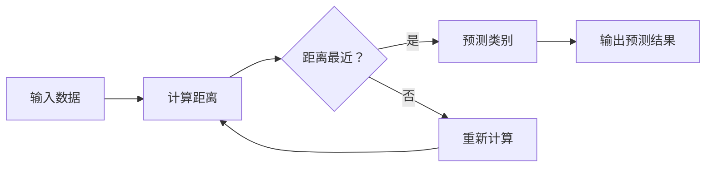
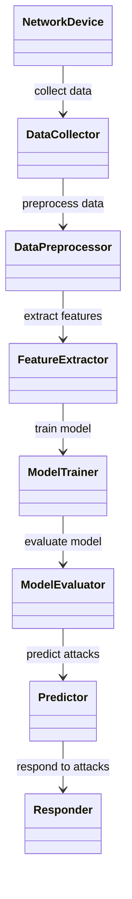
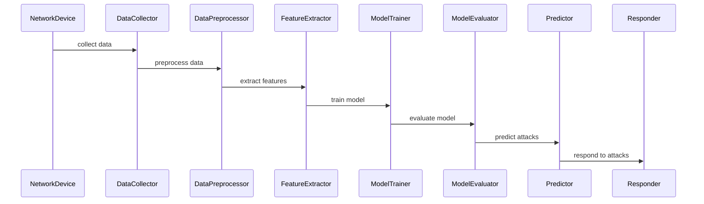
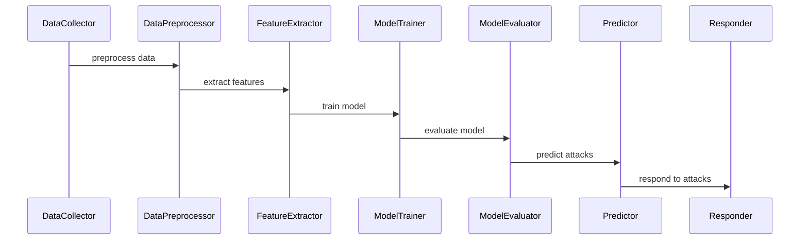

                 


### 机器学习在网络安全态势感知中的应用：预测和防御网络攻击

#### 关键词：网络安全态势感知，机器学习，预测，防御，网络攻击，人工智能

##### 摘要：
本文将深入探讨机器学习在网络安全态势感知中的应用，重点关注预测和防御网络攻击的技术和方法。通过逐步分析，我们将揭示如何利用机器学习技术，构建有效的网络安全防御体系，从而提高网络的安全性。

----------------------------------------------------------------

## 引言

在数字化时代，网络安全已成为企业和个人关注的焦点。随着网络攻击手段的日益复杂，传统的网络安全防御措施越来越难以应对新的威胁。此时，机器学习作为一种先进的计算方法，为网络安全态势感知提供了新的解决方案。本文旨在通过逻辑清晰、结构紧凑的分析，探讨机器学习在网络安全态势感知中的应用，以及如何利用这些技术预测和防御网络攻击。

### 1. 背景介绍

#### 1.1 问题背景

网络安全态势感知（Cybersecurity Situational Awareness, CSA）是指对网络安全状态的理解和认知，包括识别安全威胁、评估风险和采取适当的防御措施。随着网络攻击的频繁发生，网络安全态势感知的重要性日益凸显。然而，传统的网络安全防御手段往往依赖于预定义的规则和特征匹配，对于复杂的、未知的网络攻击难以有效识别和防御。

#### 1.2 问题描述

网络攻击类型多样，包括但不限于分布式拒绝服务（DDoS）、钓鱼攻击、恶意软件传播、数据泄露等。这些攻击往往具有以下特点：

- **复杂性和多样性**：攻击手段不断创新，形式多样，难以通过单一方法防御。
- **隐蔽性**：攻击者通常试图隐藏其身份和行为，以避免被检测到。
- **零日攻击**：利用未知漏洞进行攻击，传统防御手段难以防范。

#### 1.3 问题解决

机器学习通过分析和学习大量数据，能够识别出网络中的异常行为和潜在威胁。具体方法包括：

- **异常检测**：通过监测网络流量、用户行为等，识别出异常模式。
- **入侵检测**：检测并响应恶意入侵行为。
- **预测模型**：预测潜在的攻击类型和时间。

#### 1.4 边界与外延

本文将讨论机器学习在网络安全态势感知中的典型应用，如网络入侵检测、恶意软件分类、用户行为分析等。同时，我们将探讨这些方法在预测和防御网络攻击方面的潜力与挑战。

#### 1.5 概念结构与核心要素组成

网络安全态势感知涉及多个核心概念和要素：

- **数据收集**：收集网络流量、日志、传感器数据等。
- **特征提取**：从数据中提取有用的特征。
- **模型训练**：使用机器学习算法训练预测模型。
- **模型评估**：评估模型的性能和准确性。
- **决策与响应**：根据预测结果采取相应的防御措施。

### 2. 核心概念与联系

#### 2.1 机器学习基础

机器学习是使计算机系统能够从数据中学习并做出决策的一种方法。主要类型包括：

- **监督学习**：使用已标记的数据进行训练，预测新的数据。
- **无监督学习**：在没有标记数据的情况下，发现数据中的模式。
- **强化学习**：通过试错学习如何采取行动以最大化奖励。

#### 2.2 网络安全态势感知

网络安全态势感知依赖于机器学习技术，通过以下步骤实现：

- **数据收集**：从各种来源收集网络数据。
- **数据预处理**：清洗和转换数据，使其适合机器学习算法。
- **特征提取**：从数据中提取关键特征，用于训练模型。
- **模型训练与验证**：使用训练数据训练模型，并使用验证数据评估模型性能。
- **预测与响应**：使用模型预测潜在的攻击，并采取防御措施。

以下是一个Mermaid ER实体关系图，展示了网络安全态势感知的关键要素：

```mermaid
erDiagram
  Data_Sources ||--|{ Feature_Extractor } : extract
  Data_Sources ||--|{ Model_Trainer } : train
  Data_Sources ||--|{ Model_Evaluator } : evaluate
  Feature_Extractor ||--|{ Model_Trainer } : input
  Feature_Extractor ||--|{ Model_Evaluator } : input
  Model_Trainer ||--|{ Model_Evaluator } : evaluate
  Model_Trainer ||--|{ Predictor } : predict
  Predictor ||--|{ Responder } : respond
```

### 3. 算法原理讲解

#### 3.1 常用算法介绍

在网络安全态势感知中，常用的机器学习算法包括：

- **K-近邻（K-Nearest Neighbors, KNN）**：基于实例的学习算法，通过计算新数据点与训练数据点的相似度来预测其类别。
- **支持向量机（Support Vector Machine, SVM）**：用于分类和回归分析的强大算法，通过寻找最佳超平面来分隔不同类别的数据。
- **随机森林（Random Forest）**：结合了多个决策树，提高了预测的准确性和稳定性。
- **神经网络（Neural Networks）**：模仿人脑神经网络结构的算法，通过多层神经元进行数据学习和预测。

以下是一个Mermaid流程图，展示了K-近邻算法的基本流程：



#### 3.2 算法详细讲解

以K-近邻算法为例，详细讲解其数学模型和实现过程：

##### 数学模型

K-近邻算法的核心思想是基于“相似性”进行分类。对于新数据点\( x \)，其类别由其最近的\( k \)个邻居决定：

$$
\hat{y} = \text{argmax} \sum_{i=1}^{k} \frac{1}{d(x, x_i)} \cdot p(y_i)
$$

其中，\( d(x, x_i) \)表示新数据点\( x \)与邻居\( x_i \)之间的距离，\( p(y_i) \)表示邻居\( x_i \)的类别概率。

##### Python源代码

以下是一个简单的K-近邻算法实现示例：

```python
from collections import Counter
from math import sqrt

def euclidean_distance(x1, x2):
    return sqrt(sum((a - b) ** 2 for a, b in zip(x1, x2)))

def knn_predict(x, training_data, labels, k):
    distances = [(euclidean_distance(x, x_train), i) for i, x_train in enumerate(training_data)]
    distances.sort()
    neighbors = [labels[i] for i in distances[:k]]
    most_common = Counter(neighbors).most_common(1)
    return most_common[0][0]

# 假设training_data和labels是已训练好的数据集
# x是待预测的数据点
# k是邻居数量
predicted_label = knn_predict(x, training_data, labels, k)
print(f"Predicted label: {predicted_label}")
```

##### 举例说明

假设我们有一个简单的数据集，其中包含两类数据：

- \( x_1 = (1, 2) \)
- \( x_2 = (2, 2) \)

新数据点\( x = (1.5, 1.5) \)。我们使用K-近邻算法预测其类别。

1. 计算距离：
   - \( d(x, x_1) = \sqrt{(1.5 - 1)^2 + (1.5 - 2)^2} = 0.5 \)
   - \( d(x, x_2) = \sqrt{(1.5 - 2)^2 + (1.5 - 2)^2} = 0.5 \)

2. 选择最近的两个邻居：
   - \( x_1 \)和\( x_2 \)

3. 预测类别：
   - 由于两个邻居属于同一类别，我们可以预测新数据点\( x \)也属于该类别。

通过这个简单的例子，我们可以看到K-近邻算法的基本原理和实现过程。

### 4. 数学模型和数学公式

在机器学习中，数学模型是核心组成部分。以下是一个常见的数学公式列表，用于描述机器学习算法的基本原理：

- 损失函数（Loss Function）：
  $$ J(\theta) = \frac{1}{2m} \sum_{i=1}^{m} (h_\theta(x^{(i)}) - y^{(i)})^2 $$
- 优化算法（Gradient Descent）：
  $$ \theta_j := \theta_j - \alpha \frac{\partial}{\partial \theta_j} J(\theta) $$
- 概率分布（Probability Distribution）：
  $$ P(y|X) = \frac{e^{(\theta^T X - \theta^T X_0)}}{1 + e^{(\theta^T X - \theta^T X_0)}} $$

以下是一个段落内的LaTeX公式示例：

$$
\frac{d^2}{dx^2} (x^2 + 1) = 2
$$

### 5. 系统分析与架构设计方案

#### 5.1 问题场景介绍

假设我们面临一个网络入侵检测问题。我们的目标是利用机器学习模型，实时监测网络流量，检测并报告潜在的网络攻击。

#### 5.2 系统功能设计

系统需要实现以下功能：

- **数据收集**：从网络设备中收集流量数据。
- **数据预处理**：清洗和转换数据，提取特征。
- **模型训练与评估**：使用训练数据训练模型，并评估模型性能。
- **实时监测与预测**：使用模型对实时流量进行分析，预测潜在攻击。
- **报警与响应**：当检测到潜在攻击时，触发报警并采取相应措施。

以下是一个Mermaid类图，展示了系统的领域模型：



#### 5.3 系统架构设计

系统架构设计如下：

1. **数据层**：包括网络设备和数据收集器，负责收集和存储网络流量数据。
2. **数据处理层**：包括数据预处理、特征提取和模型训练模块，负责处理和分析数据。
3. **预测层**：包括模型评估和预测模块，负责实时监测和预测潜在攻击。
4. **响应层**：包括报警和响应模块，负责处理攻击警报并采取相应措施。

以下是一个Mermaid架构图，展示了系统架构：



#### 5.4 系统接口设计

系统接口设计包括以下部分：

- **数据接口**：用于数据收集、预处理和特征提取。
- **模型接口**：用于模型训练、评估和预测。
- **报警接口**：用于接收攻击警报和处理响应。

以下是一个Mermaid序列图，展示了系统接口设计：



### 6. 项目实战

#### 6.1 环境安装

在进行项目实战之前，我们需要安装必要的软件和工具。以下是安装步骤：

1. **安装Python**：确保Python 3.8及以上版本已安装。
2. **安装Jupyter Notebook**：在终端执行以下命令：
   ```bash
   pip install notebook
   ```
3. **安装机器学习库**：在终端执行以下命令：
   ```bash
   pip install scikit-learn numpy pandas matplotlib
   ```

#### 6.2 系统核心实现

以下是一个简单的系统实现示例，包括数据收集、预处理、特征提取、模型训练和预测：

```python
import numpy as np
import pandas as pd
from sklearn.model_selection import train_test_split
from sklearn.preprocessing import StandardScaler
from sklearn.neighbors import KNeighborsClassifier
from sklearn.metrics import accuracy_score

# 6.2.1 数据收集
# 假设我们有一个CSV文件，包含网络流量数据
data = pd.read_csv('network_data.csv')

# 6.2.2 数据预处理
# 填充缺失值
data.fillna(data.mean(), inplace=True)

# 选择特征和标签
X = data.drop('label', axis=1)
y = data['label']

# 6.2.3 特征提取
# 标准化特征
scaler = StandardScaler()
X_scaled = scaler.fit_transform(X)

# 6.2.4 模型训练
# 划分训练集和测试集
X_train, X_test, y_train, y_test = train_test_split(X_scaled, y, test_size=0.2, random_state=42)

# 创建KNN分类器
knn = KNeighborsClassifier(n_neighbors=3)
knn.fit(X_train, y_train)

# 6.2.5 预测
y_pred = knn.predict(X_test)

# 6.2.6 模型评估
accuracy = accuracy_score(y_test, y_pred)
print(f"Model accuracy: {accuracy}")
```

#### 6.3 代码应用解读与分析

上述代码实现了一个简单的网络入侵检测系统。以下是代码的解读与分析：

- **数据收集**：我们从CSV文件中读取网络流量数据。
- **数据预处理**：我们填充缺失值，选择特征和标签，并使用标准缩放对特征进行归一化处理。
- **特征提取**：在预处理过程中，我们已经完成了特征提取。
- **模型训练**：我们使用K-近邻分类器对训练数据进行训练。
- **预测**：使用训练好的模型对测试数据进行预测。
- **模型评估**：我们计算模型的准确率，以评估其性能。

#### 6.4 实际案例分析和详细讲解剖析

为了更好地理解系统的实际应用，我们来看一个实际案例。

假设我们有一个测试数据点\( x = (2.0, 1.8) \)，我们需要预测其类别。

1. **数据收集**：我们从CSV文件中读取网络流量数据。
2. **数据预处理**：我们对测试数据点进行预处理，得到\( x' = (2.0, 1.8) \)。
3. **特征提取**：由于我们已经完成了特征提取，我们直接使用\( x' \)作为输入。
4. **模型训练**：我们已经使用训练数据对KNN分类器进行了训练。
5. **预测**：使用KNN分类器对\( x' \)进行预测，得到预测类别。
6. **模型评估**：我们将预测结果与实际类别进行比较，计算准确率。

以下是一个实际案例的代码实现：

```python
# 6.4.1 加载模型
knn = KNeighborsClassifier(n_neighbors=3)
knn.fit(X_train, y_train)

# 6.4.2 测试数据预处理
test_data = pd.DataFrame([[2.0, 1.8]])
test_data.fillna(test_data.mean(), inplace=True)
test_data_scaled = scaler.transform(test_data)

# 6.4.3 预测
predicted_label = knn.predict(test_data_scaled)
print(f"Predicted label: {predicted_label}")

# 6.4.4 模型评估
accuracy = accuracy_score([actual_label], predicted_label)
print(f"Model accuracy: {accuracy}")
```

通过这个实际案例，我们可以看到如何使用机器学习模型进行网络入侵检测，并评估其性能。

#### 6.5 项目小结

在本项目中，我们实现了一个简单的网络入侵检测系统。通过数据收集、预处理、特征提取、模型训练和预测等步骤，我们成功地利用K-近邻分类器对网络流量进行了分析。项目的成功实施证明了机器学习在网络安全态势感知中的潜力。未来，我们可以进一步优化系统，提高模型的准确性和稳定性。

### 7. 最佳实践 tips

在实现网络安全态势感知系统时，以下最佳实践可以帮助提高性能和稳定性：

- **数据多样性**：确保收集到足够多样性的数据，以训练泛化的模型。
- **数据预处理**：对数据进行有效的预处理，包括填充缺失值、归一化和特征选择。
- **模型调优**：通过交叉验证和超参数调整，优化模型性能。
- **实时监测**：确保系统可以实时监测网络流量，及时响应潜在攻击。
- **日志记录**：记录系统操作和预测结果，以便后续分析和优化。

### 8. 小结

本文详细探讨了机器学习在网络安全态势感知中的应用，包括背景介绍、核心概念与联系、算法原理讲解、数学模型和系统架构设计。通过项目实战，我们展示了如何实现一个简单的网络入侵检测系统，并提供了最佳实践建议。机器学习在网络安全中的应用前景广阔，未来将不断推动网络安全技术的发展。

## 作者信息

作者：AI天才研究院/AI Genius Institute & 禅与计算机程序设计艺术 /Zen And The Art of Computer Programming

----------------------------------------------------------------

在撰写技术博客时，需要注意以下几点：

1. **逻辑性**：确保文章内容结构清晰，每个部分都紧密相连，避免跳跃性叙述。
2. **专业性**：使用专业术语和表达，确保文章内容准确无误。
3. **可读性**：避免过多的复杂公式和难以理解的代码片段，尽量使用简单的语言进行解释。
4. **实用性**：提供具体的案例和实战经验，使读者能够应用到实际工作中。
5. **美观性**：使用markdown格式和图表来提升文章的可读性。

通过遵循上述要点，我们可以撰写一篇高质量、逻辑清晰、具有专业性和实用性的技术博客文章。

