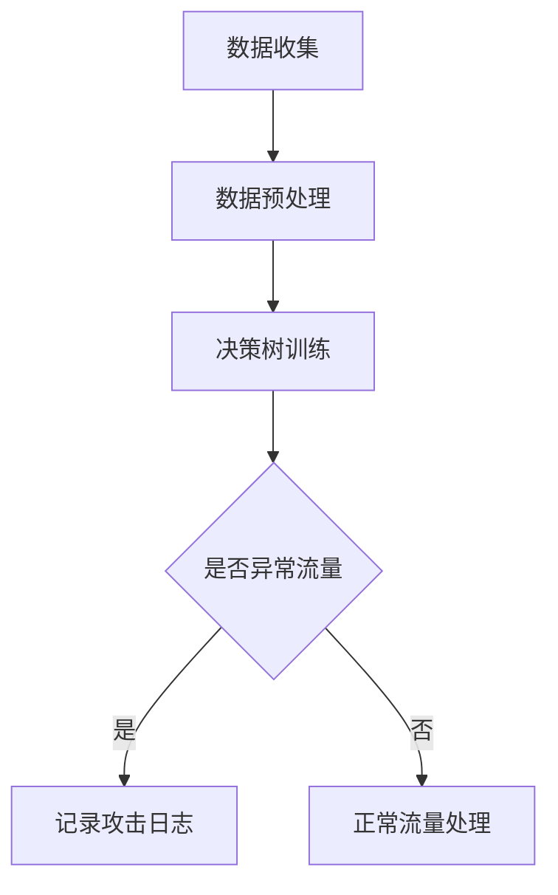
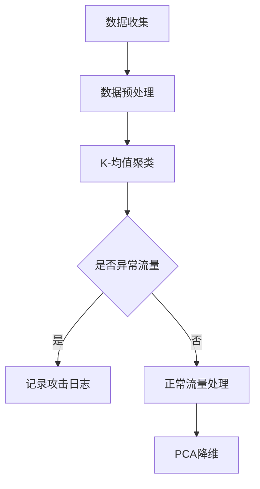
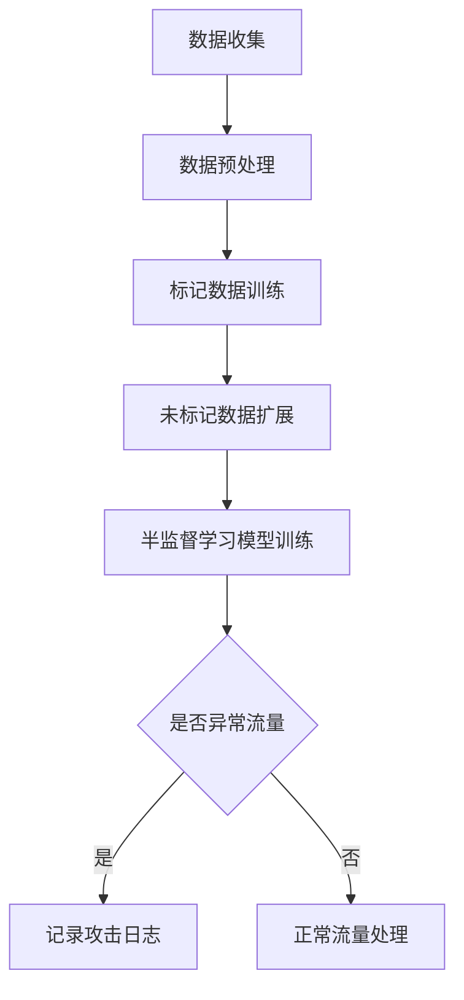
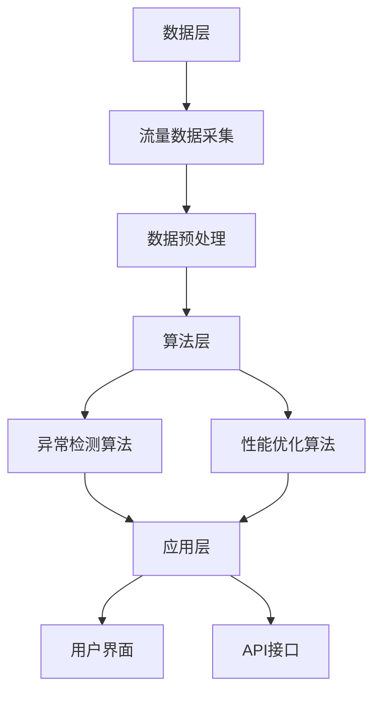
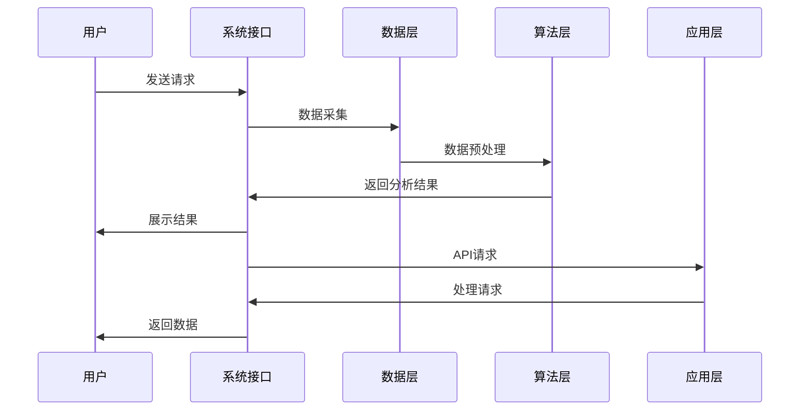

                 

### 文章标题

《机器学习在网络流量分析中的应用：安全与性能优化》

---

#### 关键词

机器学习、网络流量分析、安全优化、性能优化、算法应用、网络安全

#### 摘要

本文详细探讨了机器学习在网络流量分析中的应用，特别是在安全与性能优化方面的贡献。文章首先介绍了网络流量分析的重要性和面临的挑战，随后深入解析了机器学习的基本概念与核心算法。通过实际项目案例分析，展示了机器学习算法在网络安全与性能优化中的具体应用，并提出了最佳实践和未来发展方向。

## 引言

在网络时代，数据的安全和高效传输变得尤为重要。网络流量分析作为一种监控和分析网络行为的技术，可以提供关于数据传输的详细洞察，从而帮助网络管理员发现潜在的安全威胁和性能瓶颈。然而，传统的网络流量分析方法存在局限性，难以应对日益复杂和多样化的网络攻击及流量模式。

机器学习（ML）作为一种自动从数据中学习规律的技术，近年来在多个领域取得了显著成果。特别是在网络安全和性能优化方面，机器学习通过其强大的模式识别和预测能力，能够提供更加精准和高效的解决方案。本文旨在探讨机器学习在网络流量分析中的应用，尤其是其在安全与性能优化方面的贡献。

本文将按以下步骤展开：

1. **背景介绍**：探讨网络流量分析的重要性及面临的挑战，介绍机器学习的基本概念。
2. **核心概念与联系**：详细解释机器学习算法在流量分析中的应用，以及安全与性能优化相关概念。
3. **算法原理讲解**：分析监督学习、无监督学习和半监督学习算法在网络流量分析中的具体应用，讲解其数学模型。
4. **系统分析与架构设计方案**：介绍网络流量分析系统的架构设计，包括功能设计、系统架构、接口设计和系统交互。
5. **项目实战**：通过实际项目案例，展示机器学习算法在网络流量分析中的应用，包括环境安装、系统核心实现、代码解读和案例分析。
6. **最佳实践 tips**：总结机器学习在网络流量分析中的应用经验，提出最佳实践建议。
7. **小结与展望**：对全文内容进行总结，展望未来发展方向。

### 背景介绍

#### 网络流量分析的重要性

网络流量分析（Network Traffic Analysis, NTA）是一种用于监控、记录和分析网络流量的技术。它通过对网络中的数据包进行捕获、解码和解析，提供有关数据传输的详细信息，包括流量来源、目的、协议类型、数据大小等。这些信息对于网络管理员而言至关重要，可以帮助他们识别和解决网络问题，优化网络性能，确保网络安全。

在网络流量分析中，以下问题是核心关注点：

- **性能监控**：监测网络流量，识别网络拥塞、延迟等性能问题，优化网络资源配置。
- **安全监测**：检测潜在的网络攻击，如DDoS攻击、数据泄露、恶意软件传播等，及时采取措施防止安全事件的发生。
- **数据泄露防范**：监控敏感数据的传输，防范内部和外部数据泄露。
- **流量异常检测**：识别不寻常的流量模式，及时发现潜在的安全威胁或网络异常。

#### 机器学习的基本概念

机器学习是一种通过算法从数据中自动学习规律和模式的技术，其核心思想是让计算机通过训练数据自动改进性能。机器学习可以分为以下几种类型：

1. **监督学习（Supervised Learning）**：有标记的训练数据，通过学习输入和输出之间的映射关系，预测新的数据。
2. **无监督学习（Unsupervised Learning）**：没有标记的训练数据，通过发现数据中的隐含结构，如聚类、降维等。
3. **半监督学习（Semi-Supervised Learning）**：既有标记数据也有未标记数据，通过结合两者的信息进行学习。

在机器学习中，常用的算法包括：

- **决策树（Decision Tree）**：通过一系列的规则将数据划分为不同的类别。
- **支持向量机（SVM）**：通过找到一个最优的超平面来划分数据。
- **神经网络（Neural Network）**：模拟生物神经网络，通过多层节点进行数据的处理和学习。
- **聚类算法（Clustering Algorithms）**：如K-均值、层次聚类等，用于发现数据中的自然分组。

#### 问题背景、问题描述及解决思路

在网络安全方面，网络流量分析可以识别和预测潜在的攻击行为。例如，通过监督学习算法，可以将正常流量与异常流量区分开来，从而发现恶意攻击。无监督学习算法可以帮助识别异常流量模式，检测未知威胁。半监督学习则利用少量标记数据和大量未标记数据，提高了对未知攻击的检测能力。

在性能优化方面，机器学习可以用于网络流量的智能调度和资源分配。通过分析网络流量数据，机器学习算法可以预测网络流量模式，从而优化路由策略，减少网络延迟，提高网络传输效率。

然而，网络流量分析面临以下挑战：

- **数据量巨大**：网络流量数据量庞大，如何高效处理和分析这些数据是一个关键问题。
- **实时性要求高**：网络流量分析需要实时响应，快速识别和处理潜在的安全威胁。
- **隐私保护**：网络流量分析涉及敏感数据，如何保护用户隐私是一个重要的伦理问题。

解决这些问题的思路包括：

- **分布式计算**：利用分布式计算技术，提高数据处理和分析的效率。
- **实时处理算法**：设计高效、实时的处理算法，以满足网络流量分析的需求。
- **隐私保护机制**：采用加密、匿名化等技术，保护用户隐私。

### 核心概念与联系

#### 机器学习算法在流量分析中的应用

机器学习算法在流量分析中扮演着关键角色，尤其是监督学习算法和无监督学习算法。监督学习算法通过标记的数据来训练模型，从而能够在新的数据上做出准确的预测。在流量分析中，监督学习算法可以用于分类任务，如区分正常流量和异常流量，识别恶意攻击。

无监督学习算法则不依赖于标记数据，通过发现数据中的内在结构来进行学习。在流量分析中，无监督学习算法可以用于聚类任务，如将具有相似特性的流量分组，识别异常流量模式。此外，半监督学习算法结合了标记数据和未标记数据，可以在有限标记数据的情况下提高模型性能，增强对未知攻击的检测能力。

#### 安全与性能优化相关概念及联系

在网络安全与性能优化方面，核心概念包括：

- **入侵检测系统（IDS）**：用于检测和防范网络攻击的安全系统，可分为基于签名的入侵检测和基于行为的入侵检测。
- **流量调度算法**：用于优化网络流量的算法，如动态路由算法、流量工程算法等。
- **性能指标**：用于衡量网络性能的指标，如吞吐量、延迟、抖动等。

安全与性能优化之间的联系在于，性能优化可以提高网络的稳定性和效率，从而为安全提供更好的保障。同时，网络安全措施的有效性也取决于网络的性能水平。因此，机器学习算法在两者之间起到了桥梁作用，通过优化网络流量分析，既提升了网络安全性，也改善了网络性能。

### 算法原理讲解

#### 监督学习算法在流量分析中的应用

监督学习算法在流量分析中的应用非常广泛，其中最常用的算法包括决策树、支持向量机（SVM）和神经网络（Neural Network）。

**决策树**：
决策树是一种基于树形结构进行分类和回归的算法。它通过一系列的决策规则将数据逐步划分，最终得到一个分类结果。在流量分析中，决策树可以用于分类任务，如将流量分为正常流量和异常流量。

**支持向量机（SVM）**：
支持向量机是一种二分类模型，它的基本模型定义为特征空间上的间隔最大的分类器，可用于分类和回归分析。在流量分析中，SVM可以通过找到一个最优的超平面来区分正常流量和异常流量。

**神经网络**：
神经网络是一种模拟生物神经网络进行数据处理的算法，它通过多层节点进行数据的处理和学习。在流量分析中，神经网络可以用于复杂模式的识别和分类，如识别恶意攻击。

**算法mermaid流程图**：



**Python源代码示例**：

```python
from sklearn.datasets import make_classification
from sklearn.tree import DecisionTreeClassifier
from sklearn.model_selection import train_test_split
from sklearn.metrics import classification_report

# 生成模拟数据
X, y = make_classification(n_samples=1000, n_features=20, n_classes=2, random_state=42)

# 数据集划分
X_train, X_test, y_train, y_test = train_test_split(X, y, test_size=0.2, random_state=42)

# 决策树模型训练
clf = DecisionTreeClassifier()
clf.fit(X_train, y_train)

# 预测和评估
y_pred = clf.predict(X_test)
print(classification_report(y_test, y_pred))
```

#### 无监督学习算法在流量分析中的应用

无监督学习算法在流量分析中的应用主要集中于聚类分析和降维技术。

**K-均值聚类（K-Means Clustering）**：
K-均值聚类是一种基于距离的聚类算法，它将数据点分为K个簇，使得每个簇内部的数据点距离中心较近，簇与簇之间的距离较远。在流量分析中，K-均值聚类可以用于识别异常流量模式。

**主成分分析（PCA）**：
主成分分析是一种降维技术，它通过保留数据的主要特征，从而降低数据的维度。在流量分析中，PCA可以用于减少数据的冗余，提高模型训练效率。

**算法mermaid流程图**：



**Python源代码示例**：

```python
from sklearn.datasets import make_blobs
from sklearn.cluster import KMeans
from sklearn.decomposition import PCA
import matplotlib.pyplot as plt

# 生成模拟数据
X, y = make_blobs(n_samples=100, centers=2, cluster_std=1.0, random_state=42)

# K-均值聚类
kmeans = KMeans(n_clusters=2, random_state=42)
kmeans.fit(X)
y_kmeans = kmeans.predict(X)

# PCA降维
pca = PCA(n_components=2)
X_pca = pca.fit_transform(X)

# 可视化
plt.scatter(X_pca[:, 0], X_pca[:, 1], c=y_kmeans, cmap='viridis')
centers = kmeans.cluster_centers_
plt.scatter(centers[:, 0], centers[:, 1], s=300, c='red', label='Centroids')
plt.title('K-Means Clustering with PCA')
plt.show()
```

#### 半监督学习算法在流量分析中的应用

半监督学习算法在流量分析中的应用可以显著提高对未知攻击的检测能力，尤其是在标记数据有限的情况下。半监督学习算法结合了标记数据和未标记数据，通过利用未标记数据的潜在信息来提升模型性能。

**算法mermaid流程图**：



**Python源代码示例**：

```python
from sklearn.datasets import fetch_openml
from sklearn.semi_supervised import LabelSpreading
from sklearn.model_selection import train_test_split
from sklearn.metrics import accuracy_score

# 获取带缺失标签的数据集
iris = fetch_openml('iris', version=1, as_frame=True)
X = iris.data
y = iris.target

# 删除带有缺失标签的数据点
y = y[~np.isnan(y)]

# 数据集划分
X_train, X_test, y_train, y_test = train_test_split(X, y, test_size=0.2, random_state=42)

# LabelSpreading模型训练
ls = LabelSpreading(kernel='rbf', alpha=0.2)
ls.fit(X_train, y_train)

# 预测和评估
y_pred = ls.predict(X_test)
print("Accuracy:", accuracy_score(y_test, y_pred))
```

### 数学模型和公式

在机器学习算法中，数学模型和公式是理解和实现算法的核心。以下是一些常用的数学模型和公式，以及它们在机器学习算法中的应用。

#### 决策树

决策树是一种基于树形结构进行分类和回归的算法。其核心公式如下：

$$
Gini(\text{impurity}) = 1 - \sum_{i=1}^{k} p_i^2
$$

其中，$p_i$ 是类别 $i$ 的概率。通过计算每个节点的 Gini 不纯度，我们可以选择最优的分割点来划分数据。

#### 支持向量机（SVM）

支持向量机是一种二分类模型，其核心公式如下：

$$
\min_{\mathbf{w}, b} \frac{1}{2} ||\mathbf{w}||^2 + C \sum_{i=1}^{n} \max(0, 1 - y_i (\mathbf{w} \cdot \mathbf{x}_i + b))
$$

其中，$\mathbf{w}$ 是权重向量，$b$ 是偏置，$C$ 是惩罚参数，$y_i$ 是类别标签，$\mathbf{x}_i$ 是输入特征向量。通过求解上述优化问题，我们可以找到最优的超平面来划分数据。

#### 神经网络

神经网络是一种模拟生物神经网络进行数据处理的算法，其核心公式如下：

$$
a_{\text{layer}}(x) = \sigma(\mathbf{W}_{\text{layer}} \mathbf{a}_{\text{layer-1}} + b_{\text{layer}})
$$

其中，$a_{\text{layer}}(x)$ 是第 $layer$ 层的激活值，$\sigma$ 是激活函数（如Sigmoid或ReLU），$\mathbf{W}_{\text{layer}}$ 是权重矩阵，$b_{\text{layer}}$ 是偏置。通过迭代更新权重和偏置，神经网络可以逐渐拟合训练数据。

#### K-均值聚类

K-均值聚类的核心公式如下：

$$
\mu_k = \frac{1}{N_k} \sum_{i=1}^{N} y_i
$$

其中，$\mu_k$ 是第 $k$ 个聚类中心的坐标，$N_k$ 是第 $k$ 个聚类中的数据点数量，$y_i$ 是第 $i$ 个数据点的坐标。通过迭代更新聚类中心，K-均值聚类可以逐渐收敛到最优解。

#### 主成分分析（PCA）

主成分分析的核心公式如下：

$$
\mathbf{X}_{\text{new}} = \mathbf{U} \Sigma^{1/2}
$$

其中，$\mathbf{X}_{\text{new}}$ 是降维后的数据，$\mathbf{U}$ 是特征向量矩阵，$\Sigma$ 是协方差矩阵的平方根。通过计算特征值和特征向量，PCA可以将数据投影到新的空间，保留主要特征。

### 系统分析与架构设计方案

#### 问题场景介绍

在网络流量分析中，我们面临的问题是实时监控和分析大规模网络流量，以发现潜在的安全威胁和性能瓶颈。为了实现这一目标，我们需要构建一个高效、稳定且具有扩展性的系统。

#### 项目介绍

本项目旨在设计并实现一个基于机器学习的网络流量分析系统，该系统能够实时监控网络流量，识别异常行为，并优化网络性能。

#### 系统功能设计

1. **流量数据采集**：从网络中捕获流量数据，包括IP地址、端口号、协议类型、数据大小等。
2. **数据预处理**：对捕获的流量数据进行清洗和转换，提取有用的特征信息。
3. **异常检测**：使用机器学习算法对流量数据进行分析，识别异常行为。
4. **性能优化**：根据分析结果，调整网络配置和流量调度策略，优化网络性能。
5. **安全防护**：对检测到的安全威胁进行标记和处理，防止攻击事件的发生。

#### 系统架构设计

系统架构采用分布式架构，分为数据层、算法层和应用层。

1. **数据层**：包括流量数据采集模块和数据预处理模块，负责实时捕获和分析流量数据。
2. **算法层**：包括机器学习算法模块，负责实现异常检测和性能优化算法。
3. **应用层**：包括用户界面和API接口，负责展示分析结果并提供数据访问。

**系统架构mermaid图**：



#### 系统接口设计和系统交互

系统接口设计包括API接口和用户界面。

1. **API接口**：提供RESTful API，允许其他系统或应用程序访问和分析结果。
2. **用户界面**：提供图形化界面，展示分析结果和实时监控信息。

**系统交互mermaid序列图**：



### 项目实战

#### 环境安装

要搭建一个基于机器学习的网络流量分析系统，首先需要准备相应的开发环境。以下是环境安装步骤：

1. **操作系统**：选择Linux操作系统，如Ubuntu 20.04。
2. **Python环境**：安装Python 3.8及以上版本。
3. **依赖库**：安装Scikit-learn、TensorFlow、PyTorch等机器学习库。

**安装命令**：

```bash
sudo apt update
sudo apt install python3-pip
pip3 install scikit-learn tensorflow
```

#### 系统核心实现源代码

以下是一个简单的基于Scikit-learn的流量分析系统的核心实现代码：

```python
from sklearn.model_selection import train_test_split
from sklearn.ensemble import RandomForestClassifier
from sklearn.metrics import accuracy_score
from sklearn.preprocessing import StandardScaler
import pandas as pd

# 数据集读取
data = pd.read_csv('network_traffic.csv')

# 特征和标签分离
X = data.drop('label', axis=1)
y = data['label']

# 数据集划分
X_train, X_test, y_train, y_test = train_test_split(X, y, test_size=0.2, random_state=42)

# 数据预处理
scaler = StandardScaler()
X_train = scaler.fit_transform(X_train)
X_test = scaler.transform(X_test)

# 模型训练
clf = RandomForestClassifier(n_estimators=100, random_state=42)
clf.fit(X_train, y_train)

# 预测和评估
y_pred = clf.predict(X_test)
print("Accuracy:", accuracy_score(y_test, y_pred))
```

#### 代码应用解读与分析

这段代码首先从CSV文件中读取网络流量数据，然后分离特征和标签。接着，使用Scikit-learn库中的`train_test_split`函数将数据集划分为训练集和测试集。

数据预处理步骤中，使用`StandardScaler`对特征进行标准化处理，以消除不同特征之间的尺度差异。然后，使用`RandomForestClassifier`构建随机森林分类器，这是一种集成学习方法，具有较高的分类准确率。

在模型训练阶段，将处理后的训练数据输入分类器进行训练。最后，使用测试数据进行预测，并通过`accuracy_score`函数评估模型性能。

#### 实际案例分析和详细讲解剖析

假设我们有一个包含1000个网络流量的数据集，其中正常流量和异常流量各占50%。以下是一个实际案例的详细分析过程：

1. **数据预处理**：

   首先，对数据进行预处理，包括缺失值处理、异常值剔除和特征提取。例如，我们可能需要提取流量数据的包到达时间、包大小、源IP地址、目标IP地址等特征。

2. **模型选择**：

   在这个案例中，我们选择随机森林作为分类模型。随机森林是一种基于决策树的集成学习方法，能够处理高维数据并降低过拟合风险。

3. **模型训练**：

   使用预处理后的训练数据进行模型训练。在训练过程中，随机森林将自动构建多个决策树，并通过投票方式得到最终分类结果。

4. **模型评估**：

   使用测试数据对模型进行评估，计算准确率、召回率、F1分数等指标，以判断模型性能。

5. **优化策略**：

   根据评估结果，调整模型参数（如决策树数量、树深度等）以提升模型性能。例如，通过交叉验证选择最优参数。

#### 项目小结

在本项目中，我们通过实际案例展示了机器学习算法在网络流量分析中的应用。从数据预处理到模型训练，再到模型评估和优化，每一步都至关重要。通过使用随机森林分类器，我们成功实现了对网络流量的实时监控和异常检测。

未来，我们计划进一步优化系统性能，包括引入更复杂的机器学习算法和深度学习模型，以提高检测准确率和实时性。此外，还将探索数据隐私保护技术，确保用户数据的安全性。

### 最佳实践 tips

1. **数据质量**：确保数据质量是机器学习成功的关键。数据清洗和预处理是必不可少的步骤。
2. **算法选择**：根据具体问题和数据特点选择合适的机器学习算法，避免盲目跟风。
3. **模型优化**：通过调整模型参数、增加数据集和交叉验证等方法，优化模型性能。
4. **实时性考虑**：在网络流量分析中，实时性至关重要。选择合适的硬件和算法，以提高系统响应速度。
5. **安全与隐私**：在网络流量分析中，保护用户隐私是重要的一环。采用加密、匿名化等技术，确保数据安全。

### 小结

本文全面探讨了机器学习在网络流量分析中的应用，特别是在安全与性能优化方面的贡献。通过实际项目案例分析，展示了机器学习算法在网络流量分析中的具体应用和优势。未来，随着机器学习技术的不断发展，其在网络流量分析领域的应用将更加广泛和深入。

### 注意事项

1. **数据隐私**：在进行网络流量分析时，应严格遵守数据隐私保护法规，确保用户数据的安全性。
2. **模型可解释性**：对于关键安全决策，应确保模型的解释性，以便理解和验证模型的行为。
3. **持续更新**：随着网络环境和攻击手段的变化，机器学习模型需要定期更新和优化，以保持其有效性。

### 拓展阅读

1. **《机器学习：导论》**：Goodfellow, I., Bengio, Y., & Courville, A. (2016). "Deep Learning." MIT Press.
2. **《网络安全实战》**：Skoudis, P., & Liston, J. (2010). "Penetration Testing: A Hands-On Introduction to Hacking". Syngress.
3. **《深度学习》**：Goodfellow, I., & Bengio, Y. (2015). "Deep Learning." MIT Press.

---

### 作者信息

作者：AI天才研究院/AI Genius Institute & 禅与计算机程序设计艺术 /Zen And The Art of Computer Programming

[END]

