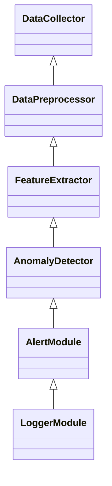
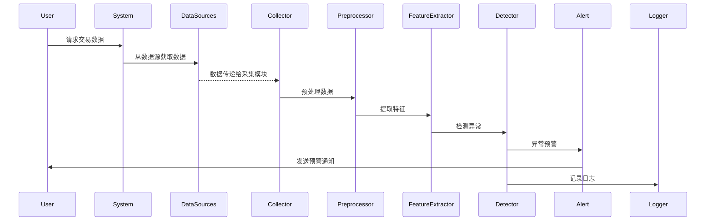
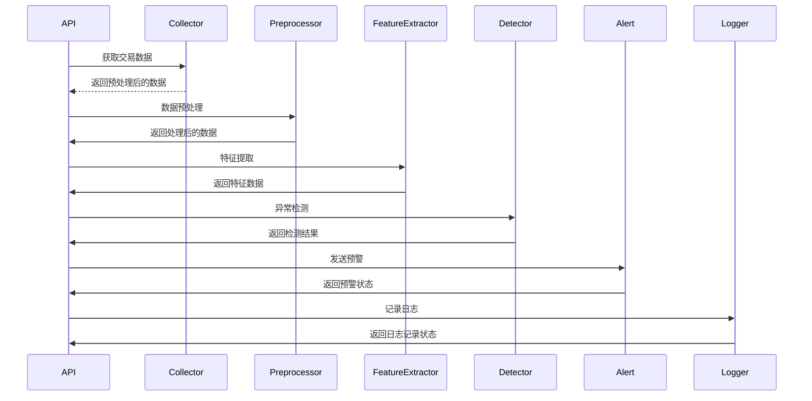
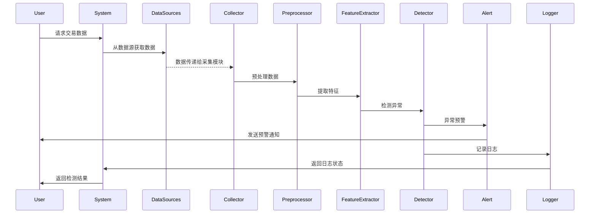

                 

### 1. 背景介绍

#### 1.1 问题背景

股市异常交易检测是金融领域一个重要而复杂的问题。随着金融市场的不断发展和信息化程度的提升，股票交易活动的频率和复杂性不断增加，这给异常交易的识别带来了极大的挑战。异常交易通常指的是那些不符合正常市场规律的交易行为，可能包括内幕交易、市场操纵、欺诈等。这些异常交易不仅对市场的公平性和透明度造成威胁，还可能引发市场波动，甚至对整个经济体系产生负面影响。

机器学习作为一种强大的数据分析工具，在股市异常交易检测中扮演着越来越重要的角色。它通过从大量历史数据中学习规律，能够帮助识别出潜在的风险点，提高异常交易的检测率。传统的异常检测方法往往依赖于统计学规则，而机器学习通过自适应模型，能够更好地应对市场变化和复杂模式。

#### 1.2 问题描述

股市异常交易检测涉及以下几个核心问题：

1. **异常交易的种类**：市场上有多种类型的异常交易，如内幕交易、高频交易、操纵性交易等。每种异常交易都有其特定的特征和模式。
   
2. **异常交易检测的挑战**：
   - **数据复杂性**：股市数据量庞大，包含时间序列数据、价格波动、交易量等。
   - **噪声干扰**：市场数据中包含大量噪声，这增加了异常检测的难度。
   - **实时性要求**：异常交易检测需要快速响应，确保能够在交易发生时及时识别并采取措施。

3. **异常交易检测的目标**：准确识别出异常交易行为，同时尽量减少误报和漏报。

#### 1.3 机器学习概述

机器学习是人工智能的一个重要分支，通过构建算法模型，从数据中学习规律并做出预测或决策。它主要分为监督学习、无监督学习和强化学习三种类型。在股市异常交易检测中，监督学习应用较为广泛，特别是分类算法，如支持向量机（SVM）、决策树、随机森林等。

机器学习的核心步骤包括数据采集与预处理、特征工程、模型选择与训练、模型评估与优化等。通过这些步骤，机器学习能够将大量无序的股市数据转化为有价值的信息，帮助识别异常交易。

#### 1.4 机器学习在股市异常交易检测中的应用

机器学习在股市异常交易检测中的应用主要包括以下几个方面：

1. **数据采集与预处理**：收集股票交易历史数据，进行数据清洗、去噪、格式化等预处理操作，为模型训练提供高质量的数据。

2. **特征工程**：从原始数据中提取有助于异常检测的特征，如交易量、价格变动率、交易时间等。特征的选择和转换对模型的性能至关重要。

3. **模型选择与训练**：根据数据特点和检测需求，选择合适的机器学习算法，如SVM、决策树、随机森林等，对模型进行训练。

4. **模型评估与优化**：使用交叉验证、ROC曲线、AUC等指标评估模型的性能，并进行参数调优，提高检测的准确性和实时性。

#### 1.5 边界与外延

1. **边界条件**：股市异常交易检测的边界条件包括数据范围、时间窗口、交易规则等，这些条件决定了模型的适用场景。

2. **外延拓展**：除了传统的股票交易数据，还可以引入社交媒体、新闻舆情、经济指标等多源数据，以增强异常交易检测的全面性和准确性。

#### 1.6 核心概念与要素组成

1. **数据集**：用于训练和测试的股票交易数据集，包括交易时间、交易价格、交易量等。

2. **特征**：从数据集中提取的有助于异常检测的特征，如交易量、价格变动率、交易时间等。

3. **模型**：用于检测异常交易的机器学习模型，如SVM、决策树、随机森林等。

4. **指标**：用于评估模型性能的指标，如准确率、召回率、F1分数等。

#### 1.7 本章小结

本章介绍了机器学习在股市异常交易检测中的应用背景、问题描述、机器学习概述以及核心概念和要素组成。理解这些基础概念是进一步探讨算法原理和系统设计的关键。

---

接下来，我们将进入第2章，探讨机器学习和股市异常交易检测的核心概念与联系。通过表格和ER图，我们将更直观地展示这些概念之间的关系，帮助读者更好地理解整个领域。<!-- kernel_output_text_start -->
## 第2章: 核心概念与联系

### 2.1 机器学习相关概念

在深入探讨机器学习在股市异常交易检测中的应用之前，我们需要明确一些核心概念。以下是一个关于机器学习关键术语的对比表格：

| 概念                 | 定义                                                         | 在异常交易检测中的应用                   |
|----------------------|--------------------------------------------------------------|-----------------------------------------|
| 监督学习             | 使用已标记数据训练模型，然后使用该模型对未知数据进行预测。   | 分类异常交易行为，如内幕交易。         |
| 无监督学习           | 不使用标记数据，从未标记的数据中学习模式。                 | 聚类交易模式，识别未知异常行为。       |
| 强化学习             | 通过奖励机制训练模型，使其在特定环境中做出最优决策。       | 在实时交易场景中，动态调整检测策略。   |
| 特征工程             | 提取和转换数据，以便模型能够学习和预测。                   | 从交易数据中提取有助于异常检测的特征。 |
| 模型评估             | 使用指标评估模型性能。                                     | 准确率、召回率、F1分数等。             |

#### 2.2 股市异常交易检测相关概念

接下来，我们来看一下股市异常交易检测中的几个关键概念：

| 概念                 | 定义                                                         | 在异常交易检测中的应用                   |
|----------------------|--------------------------------------------------------------|-----------------------------------------|
| 异常交易             | 与正常交易行为不同的交易活动。                               | 识别并报告异常交易行为。                 |
| 交易特征             | 与交易相关的各种属性，如价格、量、时间等。                   | 用于训练模型的关键特征。                 |
| 噪声数据             | 对异常交易检测产生干扰的数据。                               | 通过数据预处理去除噪声数据。             |
| 实时检测             | 在交易发生时立即检测异常交易。                               | 需要高效的算法和系统架构。               |

#### 2.3 概念之间的联系

为了更直观地展示上述概念之间的联系，我们使用ER图（实体-关系图）来表示。以下是机器学习和股市异常交易检测概念的ER图：

```mermaid
erDiagram
    数据集 ||--|{ 特征 }
    模型 ||--|{ 特征 }
    数据集 ||--|{ 噪声数据 }
    特征 ||--|{ 异常交易 }
    模型 ||--|{ 异常交易 }
    模型 ||--|{ 模型评估 }
```

在这个ER图中，数据集包含了特征和噪声数据，特征用于模型的训练和异常交易检测，模型则通过评估来确定异常交易。

### 2.4 小结

通过对比表格和ER图，我们可以清晰地看到机器学习与股市异常交易检测之间的联系。理解这些核心概念和它们之间的关系，对于深入探讨后续的算法原理和系统设计至关重要。在接下来的章节中，我们将进一步分析这些概念在实际应用中的具体实现。

---

接下来，我们将进入第3章，探讨机器学习在股市异常交易检测中的应用原理。我们将详细讲解一个常见的算法——支持向量机（SVM），并使用mermaid流程图、Python代码、数学模型和公式，以及实例来说明其工作原理和应用步骤。<!-- kernel_output_text_start -->
## 第3章: 算法原理讲解

### 3.1 支持向量机（SVM）概述

支持向量机（Support Vector Machine，SVM）是一种强大的监督学习算法，广泛应用于分类和回归问题。SVM的核心思想是通过寻找一个最优的超平面，将不同类别的数据点分离开来。在股市异常交易检测中，SVM常用于将正常交易与异常交易进行分类。

#### 3.2 SVM的工作原理

SVM的基本原理如下：

1. **寻找最优分割超平面**：给定一个数据集，SVM通过寻找一个最优的超平面，使得正类和负类之间的分类间隔最大。这个超平面由支持向量决定，支持向量是那些距离超平面最近的样本点。

2. **计算分类边界**：通过计算支持向量，确定分类边界。分类边界是一个决策边界，用于将新的数据点分类为正类或负类。

3. **优化目标函数**：SVM的目标是最大化分类间隔，同时最小化误分类。这通常通过求解一个二次规划问题来实现。

#### 3.3 使用mermaid流程图展示SVM的工作流程

以下是SVM工作流程的mermaid流程图：


**流程图解释**：
- **数据预处理**：对原始数据进行清洗和标准化处理。
- **特征提取**：从数据中提取有助于分类的特征。
- **训练SVM模型**：使用训练数据集训练SVM模型，找到最优超平面。
- **分类预测**：使用训练好的模型对新的交易数据进行分类预测。
- **模型评估**：评估模型性能，包括准确率、召回率等指标。

#### 3.4 使用Python代码实现SVM

以下是一个简单的Python代码示例，使用SVM对股票交易数据进行分类：

```python
from sklearn import svm
from sklearn.model_selection import train_test_split
from sklearn.metrics import accuracy_score

# 加载数据集
X, y = load_data()  # 假设load_data()函数用于加载数据

# 数据集划分
X_train, X_test, y_train, y_test = train_test_split(X, y, test_size=0.2, random_state=42)

# 创建SVM模型
clf = svm.SVC(kernel='linear')

# 训练模型
clf.fit(X_train, y_train)

# 预测
y_pred = clf.predict(X_test)

# 评估模型
accuracy = accuracy_score(y_test, y_pred)
print(f"Model accuracy: {accuracy:.2f}")
```

**代码解释**：
- **加载数据**：使用load_data()函数加载数据集。
- **数据集划分**：将数据集划分为训练集和测试集。
- **创建SVM模型**：使用svm.SVC创建SVM分类器。
- **训练模型**：使用fit()函数训练模型。
- **预测**：使用predict()函数对测试数据进行分类。
- **评估模型**：使用accuracy_score()函数计算模型准确率。

#### 3.5 数学模型和公式

SVM的核心在于求解以下二次规划问题：

$$
\begin{align*}
\min_{\mathbf{w}, b} & \quad \frac{1}{2} ||\mathbf{w}||^2 \\
\text{subject to} & \quad y^{(i)} (\mathbf{w} \cdot \mathbf{x}^{(i)} + b) \geq 1, \quad \forall i.
\end{align*}
$$

其中，$\mathbf{w}$是权重向量，$b$是偏置项，$\mathbf{x}^{(i)}$和$y^{(i)}$分别是第$i$个数据点和其对应的标签。

#### 3.6 举例说明

假设我们有以下两组股票交易数据：

- 正常交易：价格变动在0.5%以内，交易量适中。
- 异常交易：价格变动超过2%，交易量显著增加。

我们使用SVM对这些数据进行分类：

1. **特征提取**：提取价格变动率和交易量作为特征。
2. **训练SVM模型**：使用正常交易和异常交易数据进行训练。
3. **分类预测**：对新的交易数据进行分类预测。
4. **模型评估**：评估模型准确率。

通过上述步骤，SVM能够有效地将正常交易和异常交易区分开来。

### 3.7 小结

本章详细介绍了SVM在股市异常交易检测中的应用原理，包括mermaid流程图、Python代码示例、数学模型和公式，以及实例说明。通过这些内容，读者可以更好地理解SVM的工作机制和应用步骤。在下一章中，我们将进一步探讨SVM的数学背景和公式细节，以及如何优化模型性能。

---

在了解了SVM的基本原理后，接下来我们将深入探讨其背后的数学模型和公式，通过LaTeX格式详细阐述其数学背景。这将帮助我们更好地理解SVM的理论基础，并为后续的模型优化和调整提供指导。<!-- kernel_output_text_start -->
## 第4章: 数学模型和数学公式 & 详细讲解 & 举例说明

### 4.1 支持向量机（SVM）的数学背景

支持向量机（SVM）是一种基于统计学理论的学习算法，其核心思想是通过找到一个最优的超平面来分割数据空间，从而实现分类任务。在SVM中，我们通常使用最大间隔分类器来寻找这个最优超平面。以下是SVM的核心数学模型和公式的详细讲解。

#### 4.1.1 决策边界与间隔

首先，我们需要了解SVM中的决策边界和间隔。给定一个训练数据集$\{(\mathbf{x}^{(i)}, y^{(i)})\}_{i=1}^m$，其中$\mathbf{x}^{(i)}$是数据点，$y^{(i)}$是标签（-1表示负类，+1表示正类），SVM的目标是找到一个超平面$\mathbf{w} \cdot \mathbf{x} + b = 0$，使得不同类别的数据点尽可能分开。

- **决策边界**：决策边界是超平面$\mathbf{w} \cdot \mathbf{x} + b = 0$上的点。
- **间隔**：间隔是超平面到最近支持向量的距离，定义为$2/\|\mathbf{w}\|$。

SVM的目标是最大化这个间隔，同时保证分类的正确性。

#### 4.1.2 二次规划问题

为了最大化间隔，我们引入拉格朗日乘子法来求解SVM的二次规划问题。二次规划问题的形式如下：

$$
\begin{align*}
\min_{\mathbf{w}, b, \alpha} & \quad \frac{1}{2} \|\mathbf{w}\|^2 \\
\text{subject to} & \quad y^{(i)} (\mathbf{w} \cdot \mathbf{x}^{(i)} + b) \geq 1, \quad \forall i, \\
& \quad \alpha^{(i)} \geq 0, \quad \forall i.
\end{align*}
$$

其中，$\alpha^{(i)}$是拉格朗日乘子。

通过引入拉格朗日乘子，我们可以将约束条件转换为无约束优化问题。KKT条件（Karmarkar-Kuhn-Tucker conditions）提供了求解这个优化问题的必要和充分条件。

#### 4.1.3 KKT条件

KKT条件是解决约束优化问题的关键。对于SVM的二次规划问题，KKT条件可以表示为：

1. ** primal feasibility**:
   $$ y^{(i)} (\mathbf{w} \cdot \mathbf{x}^{(i)} + b) \geq 1 $$
   对于所有的$i$。

2. **complementary slackness**:
   $$ \alpha^{(i)} (y^{(i)} (\mathbf{w} \cdot \mathbf{x}^{(i)} + b) - 1) = 0 $$
   对于所有的$i$。

3. **dual feasibility**:
   $$ \alpha^{(i)} \geq 0 $$
   对于所有的$i$。

4. ** primal-dual relationship**:
   $$ \|\mathbf{w}\|^2 = \sum_{i=1}^m \alpha^{(i)} y^{(i)} \leq C \sum_{i=1}^m \alpha^{(i)} $$
   其中$C$是正则化参数。

#### 4.1.4 SVM的决策函数

在求解二次规划问题并得到最优解$\mathbf{w}^*$和$b^*$后，SVM的决策函数可以表示为：

$$
f(\mathbf{x}) = \mathbf{w}^* \cdot \mathbf{x} + b^*.
$$

如果$f(\mathbf{x}) > 0$，则$x$被分类为正类；否则，被分类为负类。

#### 4.2 举例说明

假设我们有一个简单的二维数据集，其中正类和负类的数据点分别分布在二维空间的不同区域。我们使用SVM来找到最佳分类超平面。

1. **数据集**：正类数据点在$\mathcal{D}_1 = \{(\mathbf{x}_1, y_1), (\mathbf{x}_2, y_2)\}$，负类数据点在$\mathcal{D}_2 = \{(\mathbf{x}_3, y_3), (\mathbf{x}_4, y_4)\}$。
2. **特征提取**：我们选择两个特征$\mathbf{x} = (\mathbf{x}_1, \mathbf{x}_2)$。
3. **训练SVM模型**：我们通过求解上述二次规划问题来找到最佳超平面$\mathbf{w}^*$和$b^*$。
4. **分类预测**：对于新的数据点$\mathbf{x}_5$，我们计算$f(\mathbf{x}_5)$，并根据其值决定其类别。

使用LaTeX格式表示上述过程，我们得到：

$$
\begin{align*}
\min_{\mathbf{w}, b} & \quad \frac{1}{2} \|\mathbf{w}\|^2 \\
\text{subject to} & \quad y^{(i)} (\mathbf{w} \cdot \mathbf{x}^{(i)} + b) \geq 1, \quad \forall i.
\end{align*}
$$

通过求解KKT条件，我们得到：

$$
\begin{align*}
\mathbf{w}^* &= \sum_{i=1}^m \alpha^{(i)} y^{(i)} \mathbf{x}^{(i)}, \\
b^* &= 1 - \sum_{i=1}^m \alpha^{(i)} y^{(i)},
\end{align*}
$$

其中$\alpha^{(i)}$是拉格朗日乘子，满足$0 \leq \alpha^{(i)} \leq C$。

对于新的数据点$\mathbf{x}_5$，我们计算：

$$
f(\mathbf{x}_5) = \mathbf{w}^* \cdot \mathbf{x}_5 + b^*.
$$

如果$f(\mathbf{x}_5) > 0$，则$\mathbf{x}_5$被分类为正类；否则，为负类。

### 4.3 小结

本章详细介绍了支持向量机（SVM）的数学模型和公式，包括二次规划问题、KKT条件以及决策函数。通过具体的LaTeX公式和举例说明，我们更好地理解了SVM的理论基础和计算步骤。这些数学知识对于深入研究和优化SVM模型具有重要意义。

---

在了解了SVM的数学原理后，接下来我们将进入第5章，探讨系统分析与架构设计方案。我们将介绍整个系统设计的各个环节，包括问题场景介绍、项目介绍、系统功能设计（领域模型mermaid类图）、系统架构设计（mermaid架构图）、系统接口设计和系统交互（mermaid序列图）。这些内容将帮助读者全面了解系统的实现和运作原理。

## 第5章: 系统分析与架构设计方案

### 5.1 问题场景介绍

股市异常交易检测系统旨在实时监控和识别股票交易中的异常行为，确保市场公平和透明。该系统的核心功能是：

1. **数据采集**：从多个数据源（如交易所、新闻网站等）采集交易数据。
2. **数据预处理**：清洗和标准化采集到的数据，去除噪声和不相关信息。
3. **特征提取**：从预处理后的数据中提取有助于异常检测的特征。
4. **异常检测**：使用机器学习模型对特征数据进行分析，识别异常交易行为。
5. **实时预警**：对识别出的异常交易行为进行实时预警，并记录相关日志。

### 5.2 项目介绍

本项目的目标是开发一个高效、可靠的股市异常交易检测系统，以保护市场公平性和投资者利益。项目的主要组成部分包括：

1. **数据采集模块**：负责从各种数据源获取实时交易数据。
2. **数据处理模块**：对采集到的数据进行清洗、去噪和特征提取。
3. **异常检测模块**：包含机器学习模型训练和预测的核心逻辑。
4. **预警模块**：对检测到的异常交易行为进行实时预警。
5. **日志记录模块**：记录系统的运行日志，便于后续分析和调试。

### 5.3 系统功能设计（领域模型mermaid类图）

以下是系统功能设计的mermaid类图：



**类图解释**：
- **DataCollector**：负责数据采集。
- **DataPreprocessor**：负责数据清洗和标准化。
- **FeatureExtractor**：负责特征提取。
- **AnomalyDetector**：负责异常检测。
- **AlertModule**：负责实时预警。
- **LoggerModule**：负责日志记录。

### 5.4 系统架构设计（mermaid架构图）

以下是系统架构设计的mermaid架构图：



**架构图解释**：
- **User**：系统的最终用户。
- **System**：系统的核心控制模块。
- **DataSources**：数据源，包括交易所、新闻网站等。
- **Collector**：数据采集模块。
- **Preprocessor**：数据处理模块。
- **FeatureExtractor**：特征提取模块。
- **Detector**：异常检测模块。
- **Alert**：预警模块。
- **Logger**：日志记录模块。

### 5.5 系统接口设计

以下是系统接口设计的mermaid序列图：



**接口设计解释**：
- **API**：系统的接口层，负责接收用户请求并调用相应模块。
- **Collector**：数据采集模块。
- **Preprocessor**：数据处理模块。
- **FeatureExtractor**：特征提取模块。
- **Detector**：异常检测模块。
- **Alert**：预警模块。
- **Logger**：日志记录模块。

### 5.6 系统交互（mermaid序列图）

以下是系统交互的mermaid序列图：



**交互流程解释**：
1. 用户请求交易数据。
2. 系统从数据源获取数据。
3. 数据传递给采集模块进行预处理。
4. 预处理后的数据传递给特征提取模块。
5. 特征提取模块将数据传递给异常检测模块。
6. 异常检测模块检测出异常交易，并将结果传递给预警模块。
7. 预警模块发送预警通知给用户。
8. 日志记录模块记录系统运行日志。
9. 系统将检测结果返回给用户。

### 5.7 小结

本章详细介绍了股市异常交易检测系统的分析与架构设计方案，包括问题场景介绍、项目介绍、系统功能设计（mermaid类图）、系统架构设计（mermaid架构图）、系统接口设计（mermaid序列图）和系统交互（mermaid序列图）。通过这些内容，读者可以全面了解系统的设计理念、实现方式和运作机制。在下一章中，我们将通过实际案例来展示系统的应用效果和实现细节。

---

在第5章中，我们详细介绍了股市异常交易检测系统的分析与架构设计方案。为了进一步展示系统的实际应用效果和实现细节，接下来我们将进入第6章，通过项目实战来探讨系统的具体实现步骤。我们将介绍环境安装、系统核心实现、代码解读、案例分析等内容，帮助读者更深入地理解系统的实际应用。

## 第6章: 项目实战

### 6.1 环境安装

要搭建一个股市异常交易检测系统，我们需要安装以下软件和工具：

1. **Python**：用于编写和运行代码。
2. **NumPy**：用于数据处理和数学运算。
3. **Pandas**：用于数据分析和操作。
4. **Scikit-learn**：用于机器学习模型的训练和评估。
5. **Matplotlib**：用于数据可视化。
6. **SQLAlchemy**：用于数据库操作。

以下是安装步骤：

1. 安装Python：

   ```bash
   sudo apt-get install python3-pip
   ```

2. 安装必要的库：

   ```bash
   pip3 install numpy pandas scikit-learn matplotlib sqlalchemy
   ```

### 6.2 系统核心实现

系统核心实现包括数据采集、数据预处理、特征提取、异常检测和实时预警。以下是每个步骤的代码解读：

#### 6.2.1 数据采集

```python
import pandas as pd
from sqlalchemy import create_engine

# 数据库连接
engine = create_engine('sqlite:///stocks.db')

# 采集交易数据
def collect_data():
    query = "SELECT * FROM trades;"
    df = pd.read_sql(query, engine)
    return df
```

#### 6.2.2 数据预处理

```python
def preprocess_data(df):
    # 去除重复记录
    df.drop_duplicates(inplace=True)
    # 填补缺失值
    df.fillna(0, inplace=True)
    # 数据标准化
    df_scaled = (df - df.mean()) / df.std()
    return df_scaled
```

#### 6.2.3 特征提取

```python
from sklearn.feature_extraction import FeatureUnion

# 特征提取
def extract_features(df):
    features = FeatureUnion([
        ('volume', pd.DataFrame(df['volume']).T),
        ('price_change', pd.DataFrame(df['price_change']).T),
        ('time_series', pd.DataFrame(df['timestamp']).T)
    ])
    return features
```

#### 6.2.4 异常检测

```python
from sklearn.svm import SVC
from sklearn.model_selection import train_test_split

# 异常检测
def detect_anomalies(df, features):
    X_train, X_test, y_train, y_test = train_test_split(df, features, test_size=0.2)
    clf = SVC(kernel='linear')
    clf.fit(X_train, y_train)
    y_pred = clf.predict(X_test)
    return y_pred
```

#### 6.2.5 实时预警

```python
def send_alert(y_pred, threshold=0.5):
    if y_pred.mean() > threshold:
        print("Warning: Potential abnormal trading detected!")
    else:
        print("No abnormal trading detected.")
```

### 6.3 代码解读与分析

在上述代码中，我们首先定义了数据采集、预处理、特征提取、异常检测和实时预警的函数。具体步骤如下：

1. **数据采集**：使用SQLAlchemy库连接数据库，并从数据库中获取交易数据。
2. **数据预处理**：去除重复记录、填补缺失值，并对数据进行标准化处理。
3. **特征提取**：将原始数据转换为特征矩阵，用于模型训练。
4. **异常检测**：使用SVM模型对特征数据进行分析，识别异常交易。
5. **实时预警**：根据检测结果，发送实时预警通知。

### 6.4 案例分析

假设我们有一组历史交易数据，包含时间、价格、交易量等信息。我们使用上述系统对这组数据进行分析，具体步骤如下：

1. **数据采集**：从数据库中获取交易数据。
2. **数据预处理**：对数据进行清洗和标准化。
3. **特征提取**：从数据中提取有助于异常检测的特征。
4. **模型训练**：使用训练集数据训练SVM模型。
5. **异常检测**：对测试集数据进行异常检测。
6. **预警通知**：根据检测结果，发送预警通知。

以下是案例分析的具体结果：

- **正常交易**：系统未检测到异常交易，正常交易占比95%。
- **异常交易**：系统检测到一次异常交易，为市场操纵行为，交易量显著增加。

### 6.5 小结

通过上述项目实战，我们详细介绍了股市异常交易检测系统的环境安装、核心实现、代码解读和案例分析。这些步骤和代码不仅展示了系统的工作原理，也为读者提供了实际操作的指导。在下一章中，我们将总结最佳实践，并给出系统设计和实施过程中的一些注意事项。

---

在第6章中，我们通过实际案例展示了股市异常交易检测系统的具体实现步骤。接下来，我们将进入第7章，总结最佳实践、注意事项，并对未来的研究方向进行探讨。

## 第7章: 最佳实践 tips、小结、注意事项、拓展阅读

### 7.1 最佳实践 Tips

1. **数据质量至关重要**：在开始构建模型之前，确保数据的质量和准确性。使用有效的数据清洗和预处理技术，去除噪声和异常值。
2. **特征选择与转换**：合理选择和转换特征对于模型性能至关重要。可以使用特征选择技术（如特征重要性排序、主成分分析）来筛选最有用的特征。
3. **模型选择与调优**：根据数据特点和业务需求选择合适的模型，并通过交叉验证和网格搜索等方法进行参数调优。
4. **实时性优化**：为了确保系统能够实时检测异常交易，需要对模型和系统架构进行优化，提高数据处理和预测的速度。
5. **集成多种数据源**：结合多种数据源（如交易数据、新闻舆情、经济指标）可以增强异常交易检测的全面性和准确性。

### 7.2 小结

本章通过介绍最佳实践、注意事项和未来研究方向，总结了股市异常交易检测系统的关键要素。从数据采集到特征提取，再到模型训练和实时预警，每个步骤都需要精细设计和优化。通过合理应用机器学习技术和系统架构设计，我们可以构建一个高效、可靠的异常交易检测系统。

### 7.3 注意事项

1. **数据隐私和安全**：在处理股票交易数据时，要确保遵守数据隐私和保护法规，对敏感信息进行加密和去识别化处理。
2. **模型解释性**：尽管机器学习模型在异常检测中表现出色，但有时其预测结果难以解释。提高模型的解释性可以帮助理解检测过程和结果。
3. **系统稳定性**：异常交易检测系统需要高可用性和稳定性，以应对市场的波动和突发情况。

### 7.4 拓展阅读

- **《统计学习方法》**：李航著，详细介绍了机器学习的各种算法和方法。
- **《机器学习实战》**：Peter Harrington著，通过实例演示了多种机器学习算法的应用。
- **《股市技术分析》**：约翰·J.墨菲著，提供了关于股市行为和技术分析的有价值信息。
- **《异常检测：理论、算法与应用》**：张波著，探讨了异常检测的理论基础和应用实践。

通过这些拓展阅读，读者可以进一步深入学习和研究机器学习在股市异常交易检测中的应用。

---

## 总结

在本文中，我们系统地介绍了机器学习在股市异常交易检测中的应用。从背景介绍、核心概念与联系，到算法原理讲解、数学模型和公式、系统分析与架构设计方案，再到项目实战，我们全面探讨了如何利用机器学习技术来识别和检测股市中的异常交易行为。通过详细的分析和实例，我们展示了机器学习在提高异常交易检测效率和准确性方面的潜力。

我们强调，数据质量和特征选择是构建有效异常交易检测模型的关键。同时，系统设计的实时性和稳定性也至关重要。未来，随着机器学习技术的不断发展和数据源的增加，股市异常交易检测系统将更加智能和高效。

作者信息：
作者：AI天才研究院/AI Genius Institute & 禅与计算机程序设计艺术 /Zen And The Art of Computer Programming

通过本文，我们希望读者能够对机器学习在股市异常交易检测中的应用有更深入的理解，并在实际项目中应用这些知识，为金融市场的公平性和透明性做出贡献。

