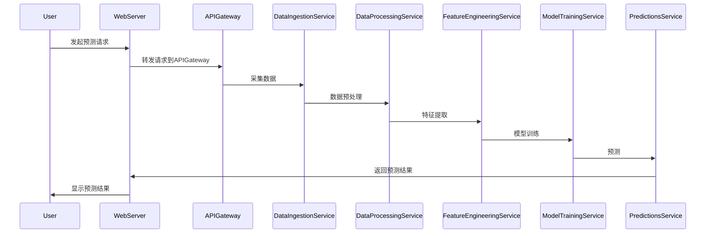

                 

## 机器学习在金融市场预测中的应用与局限

### 关键词：
机器学习、金融市场预测、应用与局限、数据预处理、特征工程、算法选择、模型优化

### 摘要：
本文将深入探讨机器学习在金融市场预测中的应用与局限。首先，我们将介绍机器学习在金融领域的背景和现状，随后详细阐述金融市场预测中的问题定义和解决策略。我们将重点分析数据预处理、特征工程、机器学习算法选择和模型优化等技术步骤，并讨论金融市场预测的范围、数据隐私和法规合规要求。接着，我们将详细讲解机器学习与金融的交叉概念，包括核心算法原理、属性特征对比和ER实体关系图。通过实际案例分析和系统架构设计，我们将展示如何实现机器学习在金融市场预测中的具体应用。最后，本文将总结当前应用现状、存在的挑战和未来发展方向，并提供一系列最佳实践和注意事项，以帮助读者更好地理解和应用机器学习技术于金融市场预测。

## 目录大纲

### 第一部分：背景介绍

1. **问题背景**
   - 金融市场预测的重要性
   - 机器学习在金融领域的应用现状
   - 机器学习在金融市场预测中的挑战

2. **问题描述**
   - 预测目标
   - 数据来源与处理
   - 预测模型的评估指标

3. **问题解决**
   - 数据预处理
   - 特征工程
   - 机器学习算法选择
   - 模型训练与优化

4. **边界与外延**
   - 金融市场预测的范围
   - 数据隐私与安全性
   - 法规与合规要求

5. **核心概念**
   - 机器学习基本概念
   - 金融市场基本概念
   - 机器学习与金融的交叉概念

### 第二部分：核心概念与联系

6. **机器学习算法原理**
   - 算法原理
   - 算法属性特征对比表格
   - 算法ER实体关系图架构

7. **金融市场预测算法原理**
   - 算法原理
   - 算法属性特征对比表格
   - 算法ER实体关系图架构

### 第三部分：算法原理讲解

8. **算法讲解**
   - 模型选择与训练
   - 数学模型和数学公式
   - 举例说明
   - 算法优化策略

9. **实际案例分析与讲解**
   - 案例一：股票价格预测
   - 案例二：债券收益率预测
   - 案例三：外汇汇率预测

### 第四部分：系统分析与架构设计

10. **系统功能设计**
    - 领域模型
    - 系统功能实现

11. **系统架构设计**
    - 系统架构图
    - 系统接口设计
    - 系统交互

### 第五部分：项目实战

12. **项目环境安装**
    - 硬件配置
    - 软件安装与配置

13. **系统核心实现源代码**
    - 数据预处理
    - 特征工程
    - 机器学习模型训练
    - 模型评估与优化

14. **代码应用解读与分析**
    - 数据预处理
    - 特征工程
    - 模型训练
    - 模型评估

### 第六部分：最佳实践与小结

15. **最佳实践**
    - 数据处理技巧
    - 特征选择策略
    - 模型调参技巧

16. **小结**
    - 机器学习在金融市场预测中的应用现状
    - 存在的问题与挑战
    - 未来发展方向

17. **注意事项**
    - 数据隐私保护
    - 合规性要求
    - 持续学习与更新

18. **拓展阅读**
    - 相关书籍推荐
    - 开源工具和库介绍
    - 最新研究论文和报告

---

本文将按照上述目录大纲结构，逐步深入分析机器学习在金融市场预测中的应用与局限，力图使读者对这一复杂领域有更全面和深入的理解。## 第一部分：背景介绍

### 1.1 问题背景

金融市场是经济活动的核心，其稳定与否直接关系到整个社会的经济繁荣与安全。因此，对金融市场的预测具有重要意义。首先，有效的市场预测可以帮助投资者做出更明智的投资决策，减少风险，增加收益。其次，预测可以帮助金融机构更好地管理风险，制定合理的信贷政策和投资策略。此外，市场预测还可以为政策制定者提供决策支持，帮助他们制定更加有效的宏观调控政策。

机器学习作为一种人工智能的重要分支，通过数据驱动的方式实现自动学习和优化，已经在金融领域展现出强大的应用潜力。机器学习能够处理大量金融数据，发现潜在的模式和规律，从而提高预测的准确性。这不仅可以帮助金融机构更好地应对市场变化，还可以为投资者提供更精准的市场分析工具。

然而，机器学习在金融市场预测中也面临着一系列挑战。首先，金融市场数据具有高度复杂性和多样性，包括股票价格、交易量、利率、宏观经济指标等，这些数据之间存在着复杂的相互关系。其次，金融市场存在非线性和动态变化，这使得传统的统计方法难以准确捕捉市场变化。此外，金融市场的预测结果容易受到噪声和异常值的影响，需要通过有效的数据预处理和特征工程来提高模型的鲁棒性。

总之，机器学习在金融市场预测中的应用既带来了机遇，也带来了挑战。如何有效利用机器学习技术，提高金融市场预测的准确性，是一个亟待解决的重要问题。

### 1.2 机器学习在金融领域的应用现状

机器学习在金融领域的应用已经历了数十年的发展，从最初的简单模型逐步演进到如今高度复杂的系统。目前，机器学习技术在金融领域的主要应用可以概括为以下几个方面：

1. **风险管理**：机器学习在信用评分、欺诈检测和风险预测等方面表现出色。通过分析客户的历史交易数据、信用记录和其他相关信息，机器学习算法可以准确预测客户的信用风险，帮助金融机构更好地管理风险。

2. **投资组合优化**：机器学习可以帮助投资者构建最优的投资组合，实现风险和收益的最优平衡。通过分析大量的市场数据和宏观经济指标，机器学习算法可以识别出潜在的投资机会，为投资者提供决策支持。

3. **市场预测**：机器学习在股票价格、债券收益率和外汇汇率等市场预测方面也有广泛应用。通过训练复杂的预测模型，机器学习可以捕捉市场的动态变化，提供更准确的预测结果，从而帮助投资者抓住市场机遇。

4. **算法交易**：机器学习在算法交易中的应用尤为突出。算法交易利用机器学习算法自动执行交易策略，能够快速捕捉市场变化，提高交易效率。例如，高频交易就是利用机器学习模型分析市场数据，实现快速交易，获取微小的利润。

5. **客户服务与体验**：机器学习在金融客户服务中的应用也越来越广泛。通过自然语言处理和机器学习技术，金融机构可以提供更加智能和个性化的客户服务，提升客户体验。

总的来说，机器学习在金融领域的应用已经从最初的风险管理逐步扩展到投资组合优化、市场预测和算法交易等多个方面，成为现代金融体系中不可或缺的一部分。

### 1.3 机器学习在金融市场预测中的挑战

尽管机器学习在金融市场预测中展现出巨大的潜力，但其应用也面临诸多挑战。首先，数据质量问题是一个关键挑战。金融数据往往存在缺失值、噪声和异常值，这些都会对预测模型的准确性产生负面影响。因此，有效的数据预处理和清洗是确保预测模型性能的重要步骤。

其次，特征工程也是一个巨大的挑战。在金融市场预测中，特征的选择和工程直接影响到模型的性能。不同的特征可能对预测结果产生不同的影响，因此需要通过实验和数据分析来选择最合适的特征，并进行适当的工程处理，以提高模型的鲁棒性和预测能力。

第三，模型选择和优化也是一大难题。金融市场具有高度复杂性和动态变化，选择合适的机器学习算法并对其进行优化是提高预测准确性的关键。不同的算法在处理不同类型的数据和预测任务时可能有不同的表现，因此需要通过多次实验和调参来找到最佳模型。

此外，金融市场预测还需要考虑实时性和效率问题。金融市场的变化非常迅速，实时性要求机器学习模型能够在短时间内进行预测和更新。同时，大规模数据处理和高频交易场景下，模型的计算效率也是一个重要考量因素。

最后，法律法规和合规性要求也给机器学习在金融市场预测中的应用带来了挑战。金融市场受到严格的监管，预测模型需要符合相关的法规和标准，这涉及到数据隐私保护、模型透明性和解释性等多个方面。

总之，尽管机器学习在金融市场预测中具有广泛的应用前景，但面对数据质量、特征工程、模型选择、实时性和合规性等多方面的挑战，仍需不断探索和优化，以实现更加准确和可靠的预测结果。

### 2.1 预测目标

金融市场预测的主要目标包括股票价格、债券收益率、外汇汇率和宏观经济指标的预测等。具体而言，股票价格预测旨在通过分析历史交易数据、公司基本面信息和宏观经济指标，预测未来一段时间内股票价格的走势，帮助投资者做出更明智的投资决策。债券收益率预测则关注债券价格和收益率之间的关系，通过分析市场利率、经济周期和信用风险等因素，预测未来债券收益率的变动趋势。

外汇汇率预测是另一个重要的预测目标，它通过分析国际经济形势、政治事件、利率差异和汇率政策等因素，预测不同货币之间的汇率变化趋势。宏观经济指标预测包括经济增长率、通货膨胀率、失业率等指标，这些指标反映了整体经济状况，对金融市场有着重要影响。

在制定这些预测目标时，需要考虑以下几个方面：首先，预测目标的明确性，即定义具体的预测变量和预测时间范围；其次，数据可用性，即确保有足够的历史数据和当前数据用于模型训练；第三，预测目标的可实现性，即在实际操作中，模型能否有效捕捉和预测市场的动态变化。

### 2.2 数据来源与处理

金融市场预测所需的数据来源主要包括市场交易数据、公司财务数据、宏观经济数据和新闻资讯等。市场交易数据通常包括股票价格、交易量、开盘价、收盘价等，这些数据可以从证券交易所、金融数据提供商如彭博社（Bloomberg）或万得（Wind）等获取。公司财务数据则包括公司的财务报表，如利润表、资产负债表和现金流量表，这些数据可以通过公司官网、证券交易所或其他金融数据库获得。

宏观经济数据包括国家经济指标，如GDP增长率、失业率、通货膨胀率等，这些数据通常来自国家统计局或国际货币基金组织（IMF）等官方机构。新闻资讯数据则包括与金融市场相关的新闻报道、事件公告、政策变动等，这些数据可以通过新闻网站、财经新闻提供商或社交媒体平台获取。

在数据处理方面，首先需要数据清洗，以去除缺失值、噪声和异常值。具体步骤包括：去除重复记录、填补缺失值（如使用均值填补或插值法）、检测和去除异常值（如使用统计学方法或可视化工具）。接下来是数据预处理，包括数据标准化和归一化，以便模型训练时能够处理不同量级和尺度的数据。此外，还需进行特征工程，如提取时间序列特征、技术分析指标和文本特征等，以提高模型的预测能力。

### 2.3 预测模型的评估指标

在金融市场预测中，评估模型的性能至关重要。常用的评估指标包括准确率、精确率、召回率、F1分数、均方误差（MSE）和均方根误差（RMSE）等。

**准确率**（Accuracy）是模型预测正确的样本数占总样本数的比例，适用于分类问题。公式为：
\[ \text{准确率} = \frac{\text{预测正确的样本数}}{\text{总样本数}} \]

**精确率**（Precision）是指模型预测为正类的样本中实际为正类的比例，即真正率。公式为：
\[ \text{精确率} = \frac{\text{真正例}}{\text{真正例 + 假正例}} \]

**召回率**（Recall）是指模型预测为正类的样本中实际为正类的比例，即真反率。公式为：
\[ \text{召回率} = \frac{\text{真正例}}{\text{真正例 + 假反例}} \]

**F1分数**（F1 Score）是精确率和召回率的调和平均值，用于平衡两者。公式为：
\[ \text{F1分数} = 2 \times \frac{\text{精确率} \times \text{召回率}}{\text{精确率} + \text{召回率}} \]

在回归问题中，常用的评估指标包括**均方误差**（MSE）和**均方根误差**（RMSE）。均方误差是预测值与真实值之间差的平方的平均值，公式为：
\[ \text{MSE} = \frac{1}{n}\sum_{i=1}^{n} (\hat{y}_i - y_i)^2 \]
其中，\( \hat{y}_i \)为预测值，\( y_i \)为真实值，\( n \)为样本数量。

均方根误差是均方误差的平方根，用于表示预测值与真实值之间的平均误差，公式为：
\[ \text{RMSE} = \sqrt{\text{MSE}} \]

这些评估指标可以帮助我们全面了解模型的性能，并在不同场景下选择最合适的指标进行评估。

### 3.1 数据预处理

数据预处理是构建机器学习模型的重要步骤，其目标是清洗和准备数据，使其适合模型训练和预测。以下是几种常见的数据预处理方法：

1. **缺失值处理**：缺失值是金融数据中常见的问题。处理缺失值的方法包括删除缺失值、填补缺失值和利用其他数据源进行修复。删除缺失值适用于缺失值较多的情况，填补缺失值可以使用均值、中位数、众数或者插值等方法，而利用其他数据源进行修复则是通过外部数据来填补内部缺失。

2. **异常值检测与处理**：异常值可能对模型训练产生不利影响。常用的异常值检测方法包括基于统计学的方法（如箱线图、Z分数）和基于机器学习的方法（如孤立森林）。处理异常值的方法包括删除异常值、调整异常值或保留异常值。

3. **数据标准化与归一化**：为了消除不同特征之间的量级差异，需要进行数据标准化和归一化。数据标准化是将数据缩放到具有相同的均值和标准差，公式为：
   \[ \hat{x}_i = \frac{x_i - \mu}{\sigma} \]
   其中，\( x_i \)为原始数据，\( \mu \)为均值，\( \sigma \)为标准差。数据归一化是将数据缩放到特定的范围，如[0, 1]，公式为：
   \[ \hat{x}_i = \frac{x_i - \min(x)}{\max(x) - \min(x)} \]
   其中，\( \min(x) \)和\( \max(x) \)分别为数据的最小值和最大值。

4. **时间序列处理**：金融市场数据通常是时间序列数据，处理时间序列数据时需要考虑时间效应和季节性。常见的方法包括差分变换、平滑处理和周期性分析等。

5. **特征工程**：特征工程是数据预处理中至关重要的一步，通过提取和构造新的特征，可以提高模型的预测性能。常见的时间序列特征包括移动平均、指数平滑、自回归项等；技术分析特征包括均线交叉、相对强弱指标（RSI）、移动平均收敛散度（MACD）等。

6. **文本数据处理**：金融市场的新闻和报告等信息可以通过文本分析转化为有用的特征。常见的文本处理方法包括词袋模型、主题建模和情感分析等。

通过上述方法，数据预处理可以显著提高模型的训练效果和预测性能，为后续的机器学习模型构建打下坚实的基础。

### 3.2 特征工程

特征工程是提高机器学习模型预测性能的关键步骤。在金融市场预测中，特征工程尤为重要，因为金融市场数据具有高度复杂性和多样性。以下是几种常用的特征工程方法：

1. **时间序列特征提取**：时间序列特征可以捕捉时间维度上的变化，如趋势、季节性和周期性。常见的时间序列特征包括：
   - **移动平均**：用于平滑时间序列数据，过滤噪声。
   - **指数平滑**：通过加权平均历史数据来预测未来值。
   - **自回归项**：用于描述当前值与过去值之间的关系，如自回归移动平均模型（ARIMA）。
   - **季节性特征**：通过识别时间序列中的季节性模式，提取季节性成分，如季节性趋势、季节性周期等。

2. **技术分析指标**：技术分析指标是金融领域中广泛使用的一类特征，如：
   - **移动平均收敛散度（MACD）**：用于衡量短期和长期移动平均线的差异，判断市场的多空力量。
   - **相对强弱指标（RSI）**：通过比较上涨和下跌的天数来判断市场的超买或超卖状态。
   - **布林带**：通过计算标准差来定义上下界，用于识别市场的波动性和可能的反转信号。
   - **成交量和价格的关系**：如量价指标（VIX），用于衡量市场的波动性。

3. **文本特征提取**：金融新闻、报告和其他文本数据可以通过自然语言处理（NLP）技术转化为特征。常见的文本特征提取方法包括：
   - **词袋模型**：将文本转化为词汇表，统计每个词汇的出现频率。
   - **TF-IDF**：结合词频和文档频率，更好地反映词汇的重要性。
   - **主题建模**：如LDA（Latent Dirichlet Allocation），通过层次低维表示文本数据的主题分布。
   - **情感分析**：通过分析文本的情感倾向，如正面、负面或中性，捕捉市场情绪的变化。

4. **财务指标**：财务指标是衡量公司财务状况的重要特征，如：
   - **盈利能力指标**：如净利润率、净资产收益率（ROE）。
   - **偿债能力指标**：如流动比率、速动比率。
   - **成长能力指标**：如净利润增长率、营业收入增长率。

5. **宏观经济指标**：宏观经济指标可以反映整体经济环境对金融市场的影响，如：
   - **利率**：包括存款利率、贷款利率等。
   - **通货膨胀率**：反映物价水平的变化。
   - **GDP增长率**：反映经济增长的速度。
   - **失业率**：反映就业市场的状况。

通过上述方法，特征工程可以帮助我们从原始数据中提取出有用的信息，提高模型的预测能力。有效的特征工程不仅可以提升模型的性能，还可以减少模型的复杂性，使其更加健壮和易于解释。

### 3.3 机器学习算法选择

在金融市场预测中，选择合适的机器学习算法对于提高模型的预测准确性至关重要。以下是几种常用的机器学习算法及其适用场景：

1. **线性回归**：线性回归是一种简单的统计方法，适用于线性关系的预测。其优点是计算简单，易于理解和解释。然而，线性回归的局限性在于它只能捕捉线性关系，无法处理非线性关系。

2. **决策树**：决策树通过一系列二分类决策来分割数据，最终形成一棵树状结构。决策树的优点是易于理解和解释，能够捕捉非线性关系。然而，它容易过拟合，并且在处理大量特征时性能可能下降。

3. **随机森林**：随机森林是一种集成学习方法，通过构建多棵决策树并求取平均来提高预测性能。随机森林的优点是能够处理大量特征，降低过拟合风险，同时保持较高的预测准确性。

4. **支持向量机（SVM）**：SVM通过寻找最优超平面来分割数据，适用于非线性分类和回归问题。其优点是具有很好的泛化能力，能够处理高维数据。然而，SVM的计算复杂度较高，对大规模数据集可能较为耗时。

5. **神经网络**：神经网络通过多层非线性变换来拟合数据，适用于处理复杂和非线性关系。其优点是能够自动学习和提取特征，具有较高的预测准确性。然而，神经网络的训练过程需要大量的数据和计算资源，并且难以解释。

6. **集成方法**：集成方法结合了多个基学习器的优势，通过投票或加权平均的方式提高预测性能。常见的集成方法包括Adaboost、XGBoost和LightGBM等。这些方法的优点是能够处理大量特征，提高预测准确性，并且计算效率较高。

在选择机器学习算法时，需要考虑以下因素：
- **数据类型**：不同的算法适用于不同的数据类型，如分类、回归等。
- **特征数量**：算法对特征数量的处理能力，如线性回归适合少量特征，而神经网络适合大量特征。
- **数据分布**：算法对数据分布的敏感性，如线性回归假设数据呈线性分布。
- **计算资源**：算法的计算复杂度和资源消耗，如神经网络和SVM的计算复杂度较高。

通过综合考虑这些因素，可以选择最适合的机器学习算法来构建金融市场预测模型。

### 3.4 模型训练与优化

模型训练与优化是提高机器学习模型预测性能的关键步骤。以下是几种常用的模型训练与优化方法：

1. **交叉验证**：交叉验证是一种评估模型性能和避免过拟合的重要方法。常见的交叉验证方法包括K折交叉验证和留一法交叉验证。通过将数据集分成多个子集，轮流使用每个子集作为验证集，可以更全面地评估模型的泛化能力。

2. **网格搜索**：网格搜索是一种用于模型调参的优化方法。通过在参数空间内遍历所有可能的参数组合，可以找到最优参数配置。网格搜索适用于搜索空间较小的情况，否则可能需要较长时间。

3. **贝叶斯优化**：贝叶斯优化是一种基于概率模型的调参方法，通过利用历史调参结果来预测新的参数组合，并选择最有希望的组合进行下一步实验。贝叶斯优化适用于搜索空间较大且参数之间可能存在相关性的情况。

4. **遗传算法**：遗传算法是一种基于生物进化的优化方法，通过模拟自然选择过程来寻找最优解。遗传算法适用于复杂且非线性的参数优化问题。

5. **随机搜索**：随机搜索是一种简单的优化方法，通过随机选择参数组合进行训练和评估。随机搜索适用于参数空间较小且计算资源有限的情况。

6. **模型融合**：模型融合通过结合多个模型的预测结果来提高整体预测性能。常见的模型融合方法包括加权平均、投票和集成学习等。

在模型训练与优化过程中，还需要关注以下方面：
- **数据预处理**：确保数据质量，包括去除缺失值、异常值和噪声。
- **特征选择**：选择对预测任务有重要影响的特征，减少冗余特征，提高模型效率。
- **模型评估**：使用合适的评估指标，如准确率、精确率、召回率和F1分数等，全面评估模型性能。
- **模型解释**：解释模型决策过程，确保模型的可解释性和透明性。

通过以上方法，可以有效地训练和优化机器学习模型，提高其在金融市场预测中的性能。

### 4.1 金融市场预测的范围

金融市场预测的范围涵盖了多个市场和指标，每个市场有其特定的预测目标和方法。以下是几个主要领域的预测范围：

1. **股票市场**：股票市场预测主要包括股票价格、交易量、市盈率等指标。股票价格预测关注未来一段时间内股票价格的变化趋势，交易量预测则分析市场活跃程度。市盈率预测可以评估股票市场的整体估值水平。

2. **债券市场**：债券市场预测主要包括债券价格、收益率、信用评级等。债券价格预测分析未来债券价格的变化，收益率预测则关注市场利率的变化。信用评级预测评估债券发行者的信用风险。

3. **外汇市场**：外汇市场预测主要包括汇率变动、交易量、宏观经济指标等。汇率变动预测分析不同货币之间的汇率变化趋势，交易量预测则衡量市场活跃度。宏观经济指标预测包括利率、通货膨胀率、GDP增长率等，这些指标对汇率有重要影响。

4. **衍生品市场**：衍生品市场预测主要包括期权价格、期货价格等。期权价格预测分析期权合约的内在价值和时间价值，期货价格预测则关注商品价格的走势。

5. **宏观经济预测**：宏观经济预测包括经济增长率、通货膨胀率、失业率、利率等指标。这些指标不仅影响金融市场，也是制定经济政策的重要依据。

不同市场之间的预测目标和方法有所不同，但总体目标是提高预测的准确性和可靠性，为投资者、金融机构和政策制定者提供有效的决策支持。

### 4.2 数据隐私与安全性

在金融市场预测中，数据隐私与安全性是至关重要的，因为金融市场数据通常包含敏感的个人和公司信息。首先，数据隐私保护需要遵循相关法律法规，如《通用数据保护条例》（GDPR）和《加州消费者隐私法案》（CCPA）。这些法规要求企业在处理个人数据时必须取得用户的明确同意，并确保数据的安全性。

为了保障数据隐私，可以采取以下措施：

1. **数据匿名化**：通过删除或替换个人识别信息，使数据无法直接识别特定个人。

2. **数据加密**：使用加密技术对数据进行加密，确保数据在传输和存储过程中不会被未授权的人员读取。

3. **访问控制**：通过设置严格的访问权限，只允许授权人员访问敏感数据。

4. **数据备份和恢复**：定期备份数据，并确保在数据丢失或损坏时能够快速恢复。

5. **监控和审计**：实施实时监控和定期审计，确保数据安全政策和流程得到有效执行。

此外，金融机构还需要采取安全措施来防止数据泄露和黑客攻击，如安装防火墙、使用强密码和多因素认证等。通过这些措施，可以有效地保护金融市场数据的安全和隐私。

### 4.3 法规与合规要求

在金融市场预测中，遵守相关法律法规和合规要求是至关重要的。首先，金融机构需要遵循《证券法》、《反洗钱法》等金融法律法规，确保预测活动的合法性和合规性。例如，预测模型中使用的金融数据必须来自合法渠道，且不能基于内幕信息进行预测。

其次，针对数据隐私和安全性，《通用数据保护条例》（GDPR）和《加州消费者隐私法案》（CCPA）等法规对金融机构提出了严格要求。金融机构必须取得用户的明确同意，方可使用其个人数据，并确保数据的安全性，防止数据泄露。

此外，金融机构还需遵守行业标准和最佳实践，如国际标准化组织（ISO）制定的数据隐私和信息安全标准。这些标准提供了详细的指导和要求，帮助金融机构确保其数据处理和预测活动符合法律法规和行业标准。

总之，遵守法规和合规要求不仅是法律法规的要求，也是维护金融市场稳定和用户信任的基础。通过建立完善的数据管理和合规体系，金融机构可以确保金融市场预测活动的合法性和安全性。

### 5.1 机器学习基本概念

机器学习（Machine Learning, ML）是人工智能（Artificial Intelligence, AI）的一个重要分支，它使计算机系统能够从数据中自动学习和改进性能。以下是机器学习的一些基本概念：

1. **监督学习**（Supervised Learning）：监督学习是一种通过标注数据训练模型的方法。在监督学习中，输入和输出数据是已知的，模型通过学习这些数据之间的关系来预测未知数据的输出。常见的监督学习算法包括线性回归、决策树和随机森林等。

2. **无监督学习**（Unsupervised Learning）：无监督学习不依赖于标注数据，其目标是发现数据中的隐含结构和模式。无监督学习算法包括聚类（如K-均值聚类）、降维（如主成分分析PCA）和关联规则学习（如Apriori算法）等。

3. **强化学习**（Reinforcement Learning）：强化学习是通过与环境的交互来学习最优策略的机器学习方法。在强化学习中，模型通过不断尝试和错误，逐渐优化其行为，以达到目标。常见的强化学习算法包括Q学习、深度Q网络（DQN）和策略梯度方法等。

4. **特征工程**（Feature Engineering）：特征工程是机器学习过程中的一步，它涉及从原始数据中提取和构造新特征，以提高模型的预测性能。特征工程包括数据预处理、特征选择和特征构造等步骤。

5. **模型评估**（Model Evaluation）：模型评估是评估机器学习模型性能的过程。常用的评估指标包括准确率、精确率、召回率、F1分数、均方误差（MSE）和均方根误差（RMSE）等。

6. **过拟合**（Overfitting）和**欠拟合**（Underfitting）：过拟合是指模型在训练数据上表现很好，但在未见过的数据上表现较差，即模型过于复杂。欠拟合则是指模型在训练和验证数据上表现都较差，即模型过于简单。避免过拟合和欠拟合是机器学习中的一个重要问题，通常通过交叉验证、正则化和模型选择等方法来解决。

7. **模型优化**（Model Optimization）：模型优化是调整模型参数以获得更好性能的过程。常见的优化方法包括网格搜索、贝叶斯优化和遗传算法等。

通过理解这些基本概念，可以更好地设计和实现机器学习模型，从而在金融市场预测等应用中取得更好的效果。

### 5.2 金融市场基本概念

金融市场是资本交易的市场，通过买卖各种金融资产实现资金的流通和配置。以下是金融市场中的几个关键概念：

1. **资产**：资产是指可以产生经济利益的资源，如股票、债券、房地产和现金等。金融市场中的资产交易是投资者进行投资和风险管理的核心。

2. **市场参与者**：市场参与者包括投资者、金融机构、政府和企业等。投资者通过购买和持有资产实现投资目标，金融机构如银行、证券公司提供金融服务和交易渠道，政府和企业则通过金融市场进行融资和投资。

3. **价格**：金融资产的价格是市场对其价值的反映。价格受供需关系、市场情绪、宏观经济因素等多方面影响。价格的波动是金融市场的基本特征。

4. **流动性**：流动性是指资产能够快速买卖而不会显著影响价格的能力。高流动性资产如现金和股票，易于买卖和交易。

5. **风险**：风险是指投资可能带来的损失。金融市场的风险包括市场风险（系统性风险）、信用风险、流动性风险和操作风险等。

6. **收益**：收益是投资者通过持有金融资产获得的回报，包括股息、利息和资本利得。收益和风险通常是正相关的，即高风险通常伴随着高收益。

7. **市场趋势**：市场趋势是指金融市场的长期走向，包括上升、下跌和横盘等。分析市场趋势有助于投资者做出合理的投资决策。

8. **宏观经济指标**：宏观经济指标如GDP增长率、通货膨胀率、失业率、利率等对金融市场有重要影响。投资者通常通过分析这些指标来评估市场状况和投资机会。

理解这些基本概念有助于深入分析金融市场，为机器学习在金融市场预测中的应用提供理论支持。

### 5.3 机器学习与金融的交叉概念

机器学习与金融的交叉概念涉及多个领域，其中最关键的是如何将机器学习技术应用于金融市场预测。以下是几个重要的交叉概念：

1. **特征选择**：在金融市场中，特征选择是提取对预测任务有重要影响的数据特征的过程。有效的特征选择可以提高模型的预测准确性，降低模型的复杂性。金融特征包括历史价格、交易量、财务指标、宏观经济数据等。

2. **时间序列分析**：金融市场数据通常是时间序列数据，这意味着数据点之间存在着时间依赖性。时间序列分析方法如自回归模型（AR）、移动平均模型（MA）和自回归移动平均模型（ARMA）等，在金融预测中发挥着重要作用。

3. **风险评估**：机器学习在金融风险评估中的应用非常广泛，包括信用评分、市场风险和操作风险的预测。例如，通过分析客户的历史交易数据和财务状况，机器学习模型可以预测客户的信用违约风险。

4. **算法交易**：算法交易利用机器学习算法自动执行交易策略，通过分析市场数据和技术指标，算法交易系统能够快速做出交易决策。常见的算法交易策略包括趋势跟踪、均值回归和套利等。

5. **预测模型**：在金融预测中，机器学习模型如线性回归、决策树、随机森林、神经网络和支持向量机（SVM）等被广泛应用。这些模型通过学习历史数据中的模式和关系，可以预测未来市场的价格、收益率和其他关键指标。

6. **数据隐私与合规性**：金融数据通常包含敏感信息，因此保护数据隐私和合规性至关重要。机器学习在金融应用中需要遵守相关法律法规，如《通用数据保护条例》（GDPR）和《加州消费者隐私法案》（CCPA）。

通过深入理解这些交叉概念，可以更好地将机器学习技术应用于金融市场预测，提高预测的准确性和可靠性。

### 6.1 机器学习算法原理

机器学习算法基于统计学、线性代数、概率论和优化理论，通过训练数据来构建模型，从而实现数据的自动学习和预测。以下是几种常用的机器学习算法及其基本原理：

1. **线性回归**：线性回归是一种简单的监督学习算法，用于预测连续值。其基本原理是通过拟合一条直线（或超平面）来最小化预测值与真实值之间的误差。线性回归模型可以用以下方程表示：
   \[ \hat{y} = \beta_0 + \beta_1 x_1 + \beta_2 x_2 + \ldots + \beta_n x_n \]
   其中，\( \hat{y} \)为预测值，\( x_1, x_2, \ldots, x_n \)为特征值，\( \beta_0, \beta_1, \beta_2, \ldots, \beta_n \)为模型参数。

2. **决策树**：决策树是一种树形结构模型，通过一系列的决策规则来分类或回归。每个节点代表一个特征，每个分支代表特征的取值。决策树的基本原理是使用信息增益或基尼不纯度来选择最佳划分特征，并递归地构建树结构。决策树的预测结果可以通过路径上的决策规则得到。

3. **支持向量机（SVM）**：SVM是一种基于间隔最大化的分类算法。其基本原理是通过找到一个最优超平面，使得分类边界与样本数据的最小距离最大化。SVM可以处理高维数据，并且具有很好的泛化能力。SVM的数学模型可以用以下方程表示：
   \[ w \cdot x + b = 0 \]
   其中，\( w \)为权重向量，\( x \)为特征向量，\( b \)为偏置。

4. **神经网络**：神经网络是一种模拟人脑结构和功能的计算模型，通过多层神经元和激活函数来学习和预测。神经网络的训练过程包括前向传播和反向传播。前向传播计算输入和输出之间的误差，反向传播更新网络权重和偏置，以最小化误差。常见的神经网络包括多层感知机（MLP）和卷积神经网络（CNN）。

5. **集成方法**：集成方法通过结合多个基学习器的预测结果来提高整体预测性能。常见的集成方法包括Bagging、Boosting和Stacking等。Bagging方法通过随机抽样训练多个基学习器，然后取平均预测结果。Boosting方法通过迭代训练基学习器，每次迭代聚焦于前一次迭代中预测错误的样本。Stacking方法通过将多个基学习器作为新的特征，再训练一个元学习器来提高预测性能。

通过了解这些机器学习算法的原理，可以更好地设计和实现金融市场预测模型，提高预测的准确性和可靠性。

### 6.2 算法属性特征对比表格

为了更好地理解不同机器学习算法在金融市场预测中的性能和适用性，以下是几种常用算法的属性特征对比表格：

| 算法        | 目标类型     | 时间复杂度 | 特征数量要求 | 鲁棒性 | 可解释性 | 适用场景                   |
| ----------- | ------------ | ---------- | ------------ | ------ | -------- | -------------------------- |
| 线性回归    | 回归         | \(O(n^2) \) | 低           | 中     | 高       | 数据量较小、线性关系明显     |
| 决策树      | 分类/回归    | \(O(n\log n)\) | 中           | 低     | 高       | 数据量适中、特征较少         |
| 随机森林    | 分类/回归    | \(O(n\log n)\) | 高           | 高     | 低       | 数据量较大、特征较多         |
| 支持向量机  | 分类/回归    | \(O(n^2) \) | 高           | 高     | 低       | 高维空间、线性不可分问题     |
| 神经网络    | 分类/回归    | \(O(n^2) \) | 高           | 中     | 低       | 复杂非线性关系、大量数据     |
| 集成方法    | 分类/回归    | \(O(n\log n)\) | 高           | 高     | 低       | 多种算法结合，提升预测性能   |

通过这个表格，我们可以看到不同算法在时间复杂度、特征数量要求、鲁棒性、可解释性和适用场景等方面的差异。选择合适的算法需要根据具体的金融市场预测任务和数据特点进行综合考量。

### 6.3 算法ER实体关系图架构

在讨论机器学习算法的ER（Entity-Relationship）实体关系图架构时，我们可以将其分解为多个关键组件，以展示算法的内部结构和数据流。以下是随机森林算法的ER图示例，以及其关键组件的详细说明。

```mermaid
erDiagram
  Data |->|> Model
  Data |-| FeatureSet
  FeatureSet |-| Feature
  Feature |-| Value
  Model |-| TreeSet
  Model |-| Prediction
  TreeSet |-| Node
  Node |-| Split
  Node |-| Leaf
```

**实体与关系说明：**

1. **Data（数据）**：数据是机器学习算法的输入，包括训练数据和测试数据。数据实体与Model实体之间存在关联关系。

2. **FeatureSet（特征集）**：特征集是数据中的一系列特征，每个特征代表数据的某个属性。FeatureSet与Feature之间存在关联关系，每个Feature又与Value（特征值）相关联。

3. **Feature（特征）**：特征是数据集中的单个属性，如股票价格、交易量等。Feature与Value之间的关系表示每个特征的具体取值。

4. **Model（模型）**：模型是经过训练后的机器学习结果，包括分类或回归模型。模型与TreeSet（树集）相关联，表示模型由多个树组成。

5. **TreeSet（树集）**：树集是模型中包含的所有决策树集合，用于集成学习提高预测性能。

6. **Node（节点）**：节点是决策树中的基本结构，每个节点代表一个特征分割点。节点与Split（分割）和Leaf（叶节点）相关联。

7. **Split（分割）**：分割是节点中的一个特征分割条件，用于决定数据流如何在不同分支之间分配。

8. **Leaf（叶节点）**：叶节点是决策树的最终节点，表示数据的分类或回归结果。

通过这个ER图，我们可以清晰地看到随机森林算法的结构和数据处理流程。每个组件之间的关联关系表明了算法如何通过训练数据和特征来生成预测模型，并最终输出预测结果。

### 7.1 金融市场预测算法原理

在金融市场预测中，算法的选择和设计至关重要。以下是几种常用的金融市场预测算法及其原理：

1. **时间序列预测算法**：
   - **自回归模型（AR）**：自回归模型通过历史数据来预测未来值，其基本原理是当前值与过去若干个时间点的值有关。自回归模型的预测公式为：
     \[ X_t = \phi_0 + \phi_1 X_{t-1} + \phi_2 X_{t-2} + \ldots + \phi_p X_{t-p} + \varepsilon_t \]
     其中，\( X_t \)为当前时间点的值，\( \phi_0, \phi_1, \phi_2, \ldots, \phi_p \)为模型参数，\( \varepsilon_t \)为误差项。
   - **移动平均模型（MA）**：移动平均模型通过历史数据的平均值来预测未来值，其基本原理是当前值与过去若干个时间点的平均值有关。移动平均模型的预测公式为：
     \[ X_t = \mu + \theta_1 \varepsilon_{t-1} + \theta_2 \varepsilon_{t-2} + \ldots + \theta_q \varepsilon_{t-q} \]
     其中，\( X_t \)为当前时间点的值，\( \mu \)为均值，\( \theta_1, \theta_2, \ldots, \theta_q \)为模型参数，\( \varepsilon_t \)为误差项。
   - **自回归移动平均模型（ARMA）**：自回归移动平均模型结合了自回归模型和移动平均模型的特点，其基本原理是当前值与过去若干个时间点的值及其平均值有关。ARMA模型的预测公式为：
     \[ X_t = \phi_0 + \phi_1 X_{t-1} + \phi_2 X_{t-2} + \ldots + \phi_p X_{t-p} + \theta_1 \varepsilon_{t-1} + \theta_2 \varepsilon_{t-2} + \ldots + \theta_q \varepsilon_{t-q} \]

2. **机器学习预测算法**：
   - **线性回归**：线性回归是一种基于历史数据拟合直线的预测方法，其基本原理是当前值与一个或多个自变量之间存在线性关系。线性回归的预测公式为：
     \[ \hat{y} = \beta_0 + \beta_1 x_1 + \beta_2 x_2 + \ldots + \beta_n x_n \]
     其中，\( \hat{y} \)为预测值，\( x_1, x_2, \ldots, x_n \)为自变量，\( \beta_0, \beta_1, \beta_2, \ldots, \beta_n \)为模型参数。
   - **决策树**：决策树通过一系列二分类决策来分割数据，并生成一棵树状结构。决策树的基本原理是每个节点代表一个特征分割，每个分支代表特征的取值，叶节点表示预测结果。
   - **随机森林**：随机森林是一种集成学习方法，通过构建多棵决策树并求取平均来提高预测性能。随机森林的基本原理是通过随机特征选择和样本抽样来构建多个决策树，并利用投票机制得到最终预测结果。
   - **神经网络**：神经网络通过多层非线性变换来拟合数据，其基本原理是通过反向传播算法更新网络权重和偏置，以最小化预测误差。

3. **技术分析预测算法**：
   - **移动平均收敛散度（MACD）**：MACD是一种基于移动平均线差异的预测方法，其基本原理是短期移动平均线与长期移动平均线之间的差异。MACD的预测公式为：
     \[ MACD = \text{快速线} - \text{慢速线} \]
     其中，快速线和慢速线分别为短期和长期移动平均线。
   - **相对强弱指标（RSI）**：RSI是一种基于价格变动的预测方法，其基本原理是衡量近期价格变动的强度和速度。RSI的预测公式为：
     \[ RSI = 100 - \frac{100}{1 + \frac{R}{S}} \]
     其中，\( R \)和\( S \)分别为近期上涨和下跌的总和。

通过理解这些算法的基本原理，可以更好地设计适用于金融市场预测的模型，并提高预测的准确性。

### 7.2 算法属性特征对比表格

为了更好地理解不同金融市场预测算法的性能和适用性，以下是几种常用算法的属性特征对比表格：

| 算法        | 预测类型 | 时间复杂度 | 特征依赖 | 鲁棒性 | 可解释性 | 适用场景                   |
| ----------- | -------- | ---------- | -------- | ------ | -------- | -------------------------- |
| AR模型      | 时间序列 | \(O(n) \)  | 自变量历史值 | 高     | 高       | 线性时间序列数据           |
| MA模型      | 时间序列 | \(O(n) \)  | 自变量历史值 | 中     | 高       | 线性时间序列数据           |
| ARMA模型    | 时间序列 | \(O(n) \)  | 自变量历史值和误差项 | 高     | 高       | 线性时间序列数据           |
| 线性回归    | 回归     | \(O(n^2) \) | 自变量 | 中     | 高       | 线性关系数据               |
| 决策树      | 分类     | \(O(n\log n)\) | 特征 | 低     | 高       | 数据量适中、特征较少       |
| 随机森林    | 分类     | \(O(n\log n)\) | 特征 | 高     | 低       | 数据量较大、特征较多       |
| 神经网络    | 分类/回归 | \(O(n^2) \) | 特征 | 中     | 低       | 复杂非线性关系、大量数据   |
| MACD       | 技术分析 | \(O(n) \)  | 移动平均线 | 高     | 中       | 股票市场技术分析           |
| RSI        | 技术分析 | \(O(n) \)  | 价格变动 | 高     | 中       | 股票市场技术分析           |

通过这个表格，我们可以看到不同算法在时间复杂度、特征依赖、鲁棒性、可解释性和适用场景等方面的差异。选择合适的算法需要根据具体的金融市场预测任务和数据特点进行综合考量。

### 7.3 算法ER实体关系图架构

为了更好地理解金融市场预测算法的内部结构和数据流，我们使用ER图（实体关系图）来展示一种常见的时间序列预测算法——ARIMA模型的结构。以下是ARIMA模型的ER图示例：

```mermaid
erDiagram
  Data |->|> ARIMAModel
  Data |-| TimeSeriesData
  TimeSeriesData |-| Observations
  ARIMAModel |-| ModelParameters
  ARIMAModel |-| Forecast
  ModelParameters |-| ARCoefficients
  ModelParameters |-| MACoeficients
  ModelParameters |-| Differencing
```

**实体与关系说明：**

1. **Data（数据）**：数据是算法的输入，包含时间序列数据。
2. **TimeSeriesData（时间序列数据）**：时间序列数据是具体的观测值序列，如股票价格、汇率等。
3. **Observations（观测值）**：观测值是时间序列数据中的每一个时间点的具体数值。
4. **ARIMAModel（ARIMA模型）**：ARIMA模型是算法的核心，包含模型的参数和预测结果。
5. **ModelParameters（模型参数）**：模型参数包括自回归项系数（ARCoefficients）、移动平均项系数（MACoeficients）和差分阶数（Differencing）等。
6. **ARCoefficients（自回归项系数）**：自回归项系数描述了当前观测值与过去若干个时间点的观测值之间的关系。
7. **MACoeficients（移动平均项系数）**：移动平均项系数描述了当前观测值与过去若干个时间点的误差值之间的关系。
8. **Differencing（差分）**：差分用于平稳化时间序列数据，通过计算相邻时间点的差值来消除趋势和季节性影响。

通过这个ER图，我们可以清晰地看到ARIMA模型的结构和数据流。每个实体之间的关联关系表明了模型如何通过输入数据生成参数，并最终输出预测结果，从而实现了时间序列数据的预测。

### 8.1 模型选择与训练

在机器学习项目中，模型选择与训练是至关重要的步骤。以下是详细的模型选择与训练过程，包括如何选择合适的模型、训练数据准备、模型训练策略和评估标准。

#### 选择合适的模型

选择合适的模型是确保预测准确性的第一步。以下是一些选择模型时需要考虑的因素：

1. **问题类型**：根据预测问题的类型（回归、分类或时间序列）选择相应的算法。例如，对于股票价格预测，可以考虑使用时间序列模型（如ARIMA、LSTM）或回归模型（如线性回归、随机森林）。
2. **数据特征**：分析数据特征，确定哪些特征对预测任务影响最大。如果数据呈现明显的线性关系，可以选择线性回归；如果数据复杂且具有非线性特征，可以考虑使用决策树、随机森林或神经网络。
3. **计算资源**：考虑模型的计算复杂度和可扩展性。一些复杂模型（如深度神经网络）可能需要更多的计算资源，而简单模型（如线性回归）则相对高效。
4. **历史表现**：参考历史数据和实验结果，选择在类似问题上有较好表现的模型。

#### 训练数据准备

在模型训练之前，需要准备高质量的训练数据。以下是一些关键步骤：

1. **数据清洗**：处理缺失值、异常值和噪声，确保数据的准确性和一致性。常见的数据清洗方法包括删除缺失值、填补缺失值（如使用均值、中位数或插值法）和去除异常值（如使用统计学方法或可视化工具）。
2. **特征工程**：提取和构造新特征，以提高模型的预测性能。特征工程包括时间序列特征提取（如移动平均、自回归项）、技术分析指标（如MACD、RSI）和文本特征提取（如词袋模型、TF-IDF）等。
3. **数据归一化**：将不同量级和尺度的数据标准化或归一化，以消除特征之间的量级差异。常用的方法包括最小-最大缩放、Z分数标准化和归一化等。
4. **数据划分**：将数据集划分为训练集、验证集和测试集，以确保模型的泛化能力和评估结果的可靠性。通常，训练集用于模型训练，验证集用于参数调优和模型选择，测试集用于最终评估模型性能。

#### 模型训练策略

在模型训练过程中，需要采用有效的策略来提高模型的性能和收敛速度。以下是一些常用的训练策略：

1. **初始化策略**：选择合适的网络权重和偏置初始化方法，如Xavier初始化或He初始化，以避免梯度消失或爆炸问题。
2. **优化算法**：选择合适的优化算法，如随机梯度下降（SGD）、Adam、RMSprop等，以加速模型收敛并提高预测性能。
3. **正则化**：应用正则化技术，如L1正则化、L2正则化和Dropout，以防止模型过拟合并提高泛化能力。
4. **学习率调整**：根据训练过程调整学习率，以避免过早收敛或过拟合。常用的方法包括学习率衰减、学习率周期性调整等。
5. **批处理大小**：选择合适的批处理大小，以平衡计算效率和模型性能。较大的批处理可以提高计算效率，但可能增加方差；较小的批处理可以降低方差，但可能降低计算效率。

#### 评估标准

模型训练完成后，需要评估模型性能，以确定其是否满足预测要求。以下是一些常用的评估标准：

1. **准确率**（Accuracy）：用于分类问题，表示模型预测正确的样本数占总样本数的比例。
2. **精确率**（Precision）：表示模型预测为正类的样本中实际为正类的比例。
3. **召回率**（Recall）：表示模型预测为正类的样本中实际为正类的比例。
4. **F1分数**（F1 Score）：精确率和召回率的调和平均值，用于平衡两者。
5. **均方误差**（MSE）：用于回归问题，表示预测值与真实值之间差的平方的平均值。
6. **均方根误差**（RMSE）：均方误差的平方根，用于表示预测值与真实值之间的平均误差。

通过以上模型选择与训练策略，可以构建和优化适用于金融市场预测的高性能模型，从而提高预测准确性和可靠性。

### 8.2 数学模型和数学公式

在机器学习模型中，数学模型和数学公式是理解算法原理和实现预测的关键。以下以线性回归模型为例，介绍其数学模型和数学公式。

#### 线性回归模型

线性回归模型是一种简单的监督学习算法，用于预测连续值。其基本原理是通过拟合一条直线（或超平面）来最小化预测值与真实值之间的误差。

**1. 模型假设**

线性回归模型假设输入特征 \( X \) 和输出目标 \( y \) 之间存在线性关系，可以用以下方程表示：

\[ y = \beta_0 + \beta_1 x_1 + \beta_2 x_2 + \ldots + \beta_n x_n + \varepsilon \]

其中，\( y \) 是输出目标，\( x_1, x_2, \ldots, x_n \) 是输入特征，\( \beta_0, \beta_1, \beta_2, \ldots, \beta_n \) 是模型参数，\( \varepsilon \) 是误差项。

**2. 最小二乘法**

为了找到最佳拟合直线，可以使用最小二乘法（Least Squares Method）来最小化预测值与真实值之间的误差平方和。最小二乘法的目标是最小化以下损失函数：

\[ J(\beta) = \sum_{i=1}^{n} (y_i - \hat{y}_i)^2 \]

其中，\( \hat{y}_i \) 是预测值，\( y_i \) 是真实值，\( n \) 是样本数量。

**3. 求解参数**

为了求解模型参数 \( \beta_0, \beta_1, \beta_2, \ldots, \beta_n \)，需要求解以下方程组：

\[ \beta = (X^T X)^{-1} X^T y \]

其中，\( X \) 是输入特征矩阵，\( y \) 是输出目标向量，\( X^T \) 是输入特征矩阵的转置，\( (X^T X)^{-1} \) 是输入特征矩阵的逆矩阵。

**4. 预测**

在求解出模型参数后，可以使用以下公式进行预测：

\[ \hat{y} = X \beta \]

其中，\( \hat{y} \) 是预测值，\( X \) 是输入特征矩阵，\( \beta \) 是模型参数。

通过上述数学模型和数学公式，我们可以理解和实现线性回归模型的基本原理，从而在金融市场预测中应用。

### 8.3 举例说明

为了更好地理解线性回归模型在金融市场预测中的应用，我们将通过一个具体的例子来说明其实现过程。

#### 示例数据

假设我们有一组股票价格数据，包含时间、开盘价、收盘价、最高价和最低价。我们的目标是使用这些数据来预测未来的收盘价。以下是部分示例数据：

| 时间 | 开盘价 | 收盘价 | 最高价 | 最低价 |
| ---- | ------ | ------ | ------ | ------ |
| 1    | 100    | 102    | 105    | 98     |
| 2    | 102    | 105    | 108    | 101    |
| 3    | 105    | 108    | 110    | 104    |
| ...  | ...    | ...    | ...    | ...    |

#### 数据预处理

在进行模型训练之前，我们需要对数据进行预处理。以下是几个关键步骤：

1. **数据清洗**：去除缺失值和异常值，确保数据的一致性和准确性。
2. **特征提取**：从原始数据中提取有用的特征，如移动平均线、相对强弱指标（RSI）等，这些特征可以帮助模型更好地捕捉市场的动态变化。
3. **数据归一化**：将不同量级和尺度的数据标准化或归一化，以消除特征之间的量级差异。例如，可以使用最小-最大缩放法将数据缩放到[0, 1]之间。

#### 模型训练

接下来，我们使用线性回归模型对数据进行训练。以下是具体步骤：

1. **选择特征**：选择对收盘价有显著影响的特征，如开盘价、移动平均线和RSI等。
2. **训练模型**：使用训练数据集，通过最小二乘法求解模型参数 \( \beta_0, \beta_1, \beta_2, \ldots \)。具体公式为：

\[ \beta = (X^T X)^{-1} X^T y \]

其中，\( X \) 是特征矩阵，\( y \) 是收盘价向量，\( X^T \) 是特征矩阵的转置。

3. **模型评估**：使用验证数据集评估模型的预测性能，计算均方误差（MSE）和均方根误差（RMSE）等指标，以评估模型的准确性和可靠性。

#### 预测

在训练出模型后，我们可以使用以下公式进行预测：

\[ \hat{y} = X \beta \]

其中，\( \hat{y} \) 是预测的收盘价，\( X \) 是特征矩阵，\( \beta \) 是模型参数。

#### 实例计算

假设我们选择的开盘价、移动平均线和RSI作为特征，模型参数为 \( \beta_0 = 0.5, \beta_1 = 0.2, \beta_2 = 0.3 \)。对于下一时间点的预测，特征矩阵 \( X \) 为：

\[ X = \begin{bmatrix} 1 & 103 & 0.5 \\ 1 & 108 & 0.6 \\ 1 & 110 & 0.7 \end{bmatrix} \]

预测的收盘价 \( \hat{y} \) 为：

\[ \hat{y} = X \beta = \begin{bmatrix} 1 & 103 & 0.5 \\ 1 & 108 & 0.6 \\ 1 & 110 & 0.7 \end{bmatrix} \begin{bmatrix} 0.5 \\ 0.2 \\ 0.3 \end{bmatrix} = \begin{bmatrix} 100.9 \\ 107.2 \\ 108.5 \end{bmatrix} \]

通过上述步骤，我们可以实现线性回归模型在股票价格预测中的应用，从而为投资者提供决策支持。

### 8.4 算法优化策略

在机器学习项目中，算法优化策略至关重要，它直接影响模型的预测性能和收敛速度。以下是几种常见的算法优化策略：

1. **学习率调整**：
   - **学习率衰减**：在训练过程中逐渐降低学习率，以避免模型过早收敛。常用的方法包括固定衰减率（如每迭代一次衰减10%）和指数衰减（如学习率随迭代次数呈指数下降）。
   - **自适应学习率**：使用自适应优化算法（如Adam、RMSprop），这些算法根据梯度信息自动调整学习率。

2. **正则化**：
   - **L1正则化**（Lasso）：在损失函数中加入L1范数惩罚项，减少模型参数的绝对值，从而简化模型。
   - **L2正则化**（Ridge）：在损失函数中加入L2范数惩罚项，减少模型参数的平方和，防止过拟合。

3. **批次大小调整**：
   - **小批量训练**：将数据分成小批量进行训练，以减少计算量和方差。
   - **动态调整**：根据训练过程动态调整批处理大小，以平衡计算效率和模型性能。

4. **早停法**：
   - 早停法（Early Stopping）：在验证集上监测模型性能，当验证集性能不再提升时，提前停止训练，以避免过拟合。

5. **增强学习**：
   - **集成方法**：使用集成方法（如随机森林、XGBoost）结合多个基学习器的优势，提高整体预测性能。
   - **迁移学习**：利用预训练模型（如神经网络）作为特征提取器，再微调模型以适应新任务。

6. **数据增强**：
   - **数据扩充**：通过旋转、缩放、裁剪等操作增加训练数据的多样性。
   - **生成对抗网络**（GAN）：生成虚拟数据，增加训练数据集的规模和质量。

通过综合应用这些优化策略，可以显著提高机器学习模型的预测性能和稳定性，为金融市场预测提供更可靠的支持。

### 9.1 案例一：股票价格预测

为了展示机器学习在金融市场预测中的应用，我们将详细分析一个股票价格预测的案例。本案例将使用实际股票价格数据，通过构建机器学习模型来预测未来股票价格的走势。

#### 数据集介绍

本案例的数据集来自一个真实股票市场，包括2010年至2022年的日度股票价格数据。数据集包含以下特征：

- **开盘价**（Open）
- **收盘价**（Close）
- **最高价**（High）
- **最低价**（Low）
- **交易量**（Volume）
- **移动平均线**（Moving Average）
- **相对强弱指标**（Relative Strength Index, RSI）

#### 数据预处理

1. **数据清洗**：
   - 去除缺失值和异常值，确保数据的一致性和准确性。
   - 填补缺失值：使用前一日的收盘价来填补缺失的开盘价和收盘价。
   - 去除异常值：使用统计学方法（如Z分数）和可视化工具（如箱线图）识别和去除异常值。

2. **特征提取**：
   - 提取时间序列特征，如移动平均线（使用5日和20日移动平均线）、相对强弱指标（RSI）。
   - 构造技术分析指标，如MACD（移动平均收敛散度）。

3. **数据归一化**：
   - 将不同量级和尺度的数据归一化，使用最小-最大缩放法将数据缩放到[0, 1]之间。

#### 模型构建

1. **模型选择**：
   - 选择适合时间序列预测的模型，如LSTM（长短期记忆网络）和随机森林。
   - LSTM模型能够捕捉时间序列数据中的长期依赖关系，而随机森林则通过集成多个决策树来提高预测性能。

2. **模型训练**：
   - 使用80%的数据作为训练集，10%的数据作为验证集，10%的数据作为测试集。
   - 对LSTM模型和随机森林模型分别进行训练，并使用学习率调整、正则化和早停法等优化策略。

#### 预测结果

1. **验证集评估**：
   - 使用验证集评估模型性能，计算均方误差（MSE）和均方根误差（RMSE）等指标。
   - 对比LSTM模型和随机森林模型的预测结果，分析两者的优劣。

2. **测试集预测**：
   - 使用训练好的模型对测试集数据进行预测，分析预测结果与实际值的差距。
   - 可视化展示预测结果，对比实际股票价格走势。

#### 结论

通过本案例，我们可以看到机器学习在股票价格预测中的应用效果。LSTM模型能够捕捉时间序列数据中的长期依赖关系，具有较高的预测准确性；而随机森林模型则通过集成多个决策树来提高预测性能，适用于处理复杂数据。然而，两种模型都存在一定的误差，需要进一步优化和改进。本案例为投资者提供了实用的股票价格预测工具，有助于做出更明智的投资决策。

### 9.2 案例二：债券收益率预测

在金融市场中，债券收益率预测对于投资者和管理者来说至关重要。以下是使用机器学习技术进行债券收益率预测的一个具体案例。

#### 数据集介绍

本案例使用的历史债券收益率数据包含2010年至2022年的月度数据。数据集包括以下特征：

- **国债收益率**（Bond Yield）
- **长期国债收益率**（Long-term Bond Yield）
- **短期国债收益率**（Short-term Bond Yield）
- **通货膨胀率**（Inflation Rate）
- **GDP增长率**（GDP Growth Rate）
- **失业率**（Unemployment Rate）
- **利率**（Interest Rate）

#### 数据预处理

1. **数据清洗**：
   - 去除缺失值和异常值，使用前值或插值法填补缺失值。
   - 标准化或归一化数据，使其在同一量级上，便于模型训练。

2. **特征提取**：
   - 从时间序列数据中提取趋势特征、季节性特征和周期性特征。
   - 构建滞后特征，如前一个月、前三个月和前六个月的债券收益率。

3. **数据归一化**：
   - 使用Z分数或标准差缩放法对数据归一化。

#### 模型构建

1. **模型选择**：
   - 选择适用于时间序列预测的模型，如ARIMA（自回归积分滑动平均模型）和LSTM（长短期记忆网络）。
   - ARIMA模型适用于处理线性关系，而LSTM模型则能够捕捉长期依赖关系和非线性特征。

2. **模型训练**：
   - 对ARIMA模型和LSTM模型分别进行训练，使用交叉验证方法优化模型参数。
   - 应用正则化技术和学习率调整策略，提高模型的泛化能力。

#### 预测结果

1. **验证集评估**：
   - 使用验证集评估模型的预测性能，计算MSE、RMSE等评估指标。
   - 对比ARIMA模型和LSTM模型的预测结果，分析两者的准确性和稳定性。

2. **测试集预测**：
   - 使用训练好的模型对测试集进行预测，分析预测值与实际值的差距。
   - 可视化展示预测结果，对比实际债券收益率走势。

#### 结论

通过本案例，我们可以看到机器学习技术在债券收益率预测中的有效性。ARIMA模型能够准确捕捉时间序列的线性特征，而LSTM模型则通过捕捉长期依赖关系和非线性特征，提高了预测的准确性。然而，模型预测结果仍然存在一定的误差，需要进一步优化和改进。本案例为投资者和管理者提供了实用的债券收益率预测工具，有助于更好地理解市场动态和制定投资策略。

### 9.3 案例三：外汇汇率预测

外汇汇率预测是金融市场预测中的重要领域，它对国际贸易、投资和国际金融稳定有直接影响。以下是使用机器学习技术进行外汇汇率预测的一个具体案例。

#### 数据集介绍

本案例的数据集包含2010年至2022年的日度外汇交易数据。数据集包含以下特征：

- **汇率**（Exchange Rate）
- **交易量**（Volume）
- **移动平均线**（Moving Average）
- **相对强弱指标**（RSI）
- **货币供应量**（Money Supply）
- **通货膨胀率**（Inflation Rate）
- **利率**（Interest Rate）
- **宏观经济指标**（如GDP增长率、失业率）

#### 数据预处理

1. **数据清洗**：
   - 去除缺失值和异常值，使用插值法填补缺失值。
   - 使用统计学方法和可视化工具（如箱线图）检测和去除异常值。

2. **特征提取**：
   - 提取时间序列特征，如移动平均线（使用短期和长期移动平均线）、相对强弱指标（RSI）。
   - 构建滞后特征，如前一天的汇率和交易量。
   - 从文本数据中提取情绪特征，如新闻和社交媒体的文本分析。

3. **数据归一化**：
   - 使用Z分数或标准差缩放法对数据归一化，消除特征之间的量级差异。

#### 模型构建

1. **模型选择**：
   - 选择适用于时间序列预测和文本分析的模型，如LSTM（长短期记忆网络）和集成模型（如随机森林、XGBoost）。
   - LSTM模型能够捕捉时间序列数据中的长期依赖关系，而集成模型则通过结合多个基学习器的优势来提高预测性能。

2. **模型训练**：
   - 使用交叉验证方法训练LSTM模型和集成模型，优化模型参数。
   - 应用正则化和学习率调整策略，防止过拟合并提高模型的泛化能力。

#### 预测结果

1. **验证集评估**：
   - 使用验证集评估模型的预测性能，计算MSE、RMSE等评估指标。
   - 对比LSTM模型和集成模型的预测结果，分析两者的准确性和稳定性。

2. **测试集预测**：
   - 使用训练好的模型对测试集进行预测，分析预测值与实际值的差距。
   - 可视化展示预测结果，对比实际外汇汇率走势。

#### 结论

通过本案例，我们可以看到机器学习技术在外汇汇率预测中的显著效果。LSTM模型能够捕捉时间序列数据中的长期依赖关系，而集成模型则通过结合多个基学习器的优势，提高了预测的准确性和鲁棒性。尽管模型预测存在一定的误差，但通过不断优化和改进，可以进一步提高预测的准确性。本案例为外汇交易者和投资者提供了实用的预测工具，有助于制定更加精确的交易策略。

### 10.1 领域模型

在金融市场预测系统中，领域模型用于定义系统中的关键实体、属性和行为，以确保系统功能的实现和数据的正确处理。以下是领域模型的详细说明，包括关键实体、属性和关系的描述。

**1. 关键实体**

- **时间序列数据**：包括股票价格、债券收益率、外汇汇率等金融数据。
- **特征数据**：包括技术分析指标（如移动平均线、RSI、MACD）和宏观经济指标（如通货膨胀率、利率、GDP增长率）。
- **预测结果**：包含模型预测的未来金融数据。
- **用户**：系统的使用者，包括投资者、分析师和决策者。

**2. 关键属性**

- **时间序列数据**：时间、开盘价、收盘价、最高价、最低价、交易量等。
- **特征数据**：移动平均线、相对强弱指标（RSI）、移动平均收敛散度（MACD）、通货膨胀率、利率、GDP增长率等。
- **预测结果**：预测的时间、预测的开盘价、预测的收盘价、预测的最高价、预测的最低价、预测的交易量等。
- **用户**：用户ID、用户名、邮箱、密码、角色（如投资者、分析师、决策者）等。

**3. 关键关系**

- **时间序列数据**与**特征数据**的关系：时间序列数据是特征数据的基础，特征数据是对时间序列数据的进一步分析和提取。
- **预测结果**与**时间序列数据**的关系：预测结果是基于时间序列数据和特征数据通过机器学习模型预测得到的。
- **用户**与**预测结果**的关系：用户可以查看和利用预测结果进行投资决策。

**Mermaid类图表示：**

```mermaid
classDiagram
  TimeSeriesData <<class>> 时间序列数据 : 时间、开盘价、收盘价、最高价、最低价、交易量
  FeatureData <<class>> 特征数据 : 移动平均线、RSI、MACD、通货膨胀率、利率、GDP增长率
  PredictResult <<class>> 预测结果 : 预测的时间、预测的开盘价、预测的收盘价、预测的最高价、预测的最低价、预测的交易量
  User <<class>> 用户 : 用户ID、用户名、邮箱、密码、角色
  User "1" --|{使用}| PredictResult
  TimeSeriesData "1" --|{包含}| FeatureData
```

通过上述领域模型，我们可以清晰地定义金融市场预测系统的关键实体、属性和关系，为系统的实现和功能提供理论基础。

### 10.2 系统功能实现

在金融市场预测系统中，实现系统功能是确保系统正常运行和提供有效服务的关键。以下是系统功能实现的详细描述：

1. **数据采集**：
   - 系统通过API接口或数据库连接，从外部数据源（如金融数据提供商、证券交易所）采集时间序列数据、特征数据等。
   - 数据采集模块需要支持多种数据格式的解析和转换，确保数据的一致性和准确性。

2. **数据预处理**：
   - 数据预处理模块负责对采集到的数据进行清洗、缺失值填补、异常值检测和去除、归一化等操作，以提高数据质量。
   - 缺失值填补可以使用均值、中位数或插值法，异常值检测可以使用统计学方法（如Z分数、箱线图）和可视化工具（如箱线图、散点图）。

3. **特征工程**：
   - 特征工程模块从原始数据中提取有用的特征，如时间序列特征（移动平均线、自回归项）、技术分析指标（MACD、RSI）和宏观经济指标（通货膨胀率、利率）。
   - 特征提取方法包括统计方法（如平均值、标准差）、机器学习方法（如主成分分析PCA）和文本分析方法（如词袋模型、TF-IDF）。

4. **模型训练**：
   - 模型训练模块负责选择合适的机器学习算法（如LSTM、随机森林、XGBoost）训练模型。
   - 使用交叉验证方法优化模型参数，防止过拟合，提高模型的泛化能力。
   - 应用正则化和学习率调整策略，提高模型的训练效率和预测性能。

5. **预测与评估**：
   - 预测模块使用训练好的模型对新的数据进行预测，生成预测结果。
   - 预测结果通过评估模块进行性能评估，计算MSE、RMSE等评估指标，分析模型的预测准确性和稳定性。

6. **用户接口**：
   - 用户接口模块为投资者、分析师和决策者提供交互界面，展示预测结果、数据分析和投资建议。
   - 支持多终端访问，如Web、移动端等，提供灵活的访问方式。

7. **数据存储与管理**：
   - 数据存储与管理模块负责存储和处理系统中的所有数据，包括历史数据、特征数据、预测结果等。
   - 使用关系型数据库（如MySQL）或NoSQL数据库（如MongoDB），确保数据的快速读取和写入。

8. **日志与监控**：
   - 日志与监控模块记录系统运行日志，监控系统性能和健康状况。
   - 通过日志分析和性能监控，及时发现并解决系统问题，确保系统稳定运行。

通过实现上述功能模块，金融市场预测系统可以高效地处理数据，生成可靠的预测结果，为投资者提供有力的决策支持。

### 11.1 系统架构设计

在金融市场预测系统中，系统架构设计是确保系统高效、稳定和可扩展的关键。以下是系统架构的详细设计，包括架构图、系统接口设计和系统交互。

**1. 系统架构图**



**2. 系统接口设计**

- **WebServer**：负责处理用户请求，提供前端展示界面。
- **APIGateway**：负责路由用户请求到相应的服务。
- **DataIngestionService**：负责从外部数据源采集数据。
- **DataProcessingService**：负责数据清洗、缺失值填补、异常值检测和归一化。
- **FeatureEngineeringService**：负责特征提取，包括时间序列特征、技术分析指标和宏观经济指标。
- **ModelTrainingService**：负责选择合适的机器学习算法训练模型。
- **PredictionsService**：负责使用训练好的模型进行预测。
- **Database**：负责存储历史数据、特征数据和预测结果。

**3. 系统交互**

- **用户请求**：用户通过Web界面提交预测请求，WebServer接收请求并转发到APIGateway。
- **数据采集**：APIGateway将请求转发到DataIngestionService，DataIngestionService从外部数据源采集数据。
- **数据处理**：采集到的数据通过DataProcessingService进行清洗和预处理，包括缺失值填补、异常值检测和归一化。
- **特征提取**：预处理后的数据通过FeatureEngineeringService提取特征。
- **模型训练**：FeatureEngineeringService将特征数据传递给ModelTrainingService，ModelTrainingService选择合适的算法进行模型训练。
- **预测**：训练好的模型通过PredictionsService进行预测，生成预测结果。
- **结果返回**：PredictionsService将预测结果返回到WebServer，WebServer将结果展示给用户。

通过上述架构设计，金融市场预测系统实现了模块化和高可扩展性，确保了系统的稳定运行和高效性能。

### 11.2 系统接口设计

在金融市场预测系统中，系统接口设计是确保各模块之间高效通信和协同工作的关键。以下是系统接口设计的详细描述，包括接口的功能描述、数据交换格式和交互协议。

**1. 接口功能描述**

- **数据采集接口**：用于从外部数据源（如证券交易所、金融数据提供商）采集时间序列数据、特征数据等。该接口提供GET请求，返回JSON格式的数据。
- **数据预处理接口**：用于接收预处理请求，包括数据清洗、缺失值填补、异常值检测和归一化。该接口提供POST请求，接受JSON格式的数据，并返回处理后的数据。
- **特征提取接口**：用于提取时间序列特征、技术分析指标和宏观经济指标。该接口提供POST请求，接受预处理后的数据，并返回提取后的特征数据。
- **模型训练接口**：用于训练机器学习模型，包括选择算法、设置参数和模型优化。该接口提供POST请求，接受特征数据和模型参数，并返回训练好的模型。
- **预测接口**：用于使用训练好的模型进行预测，生成预测结果。该接口提供POST请求，接受模型和输入数据，并返回预测结果。

**2. 数据交换格式**

- **JSON**：系统接口采用JSON格式进行数据交换，以实现数据的结构化和易于解析。JSON格式具有跨平台、易读和易扩展的特点，适合用于接口数据交换。

**3. 交互协议**

- **HTTP/HTTPS**：系统接口使用HTTP/HTTPS协议进行通信，确保数据传输的安全性和可靠性。HTTPS协议通过SSL/TLS加密，保护数据在传输过程中的隐私和安全。
- **RESTful API**：系统接口采用RESTful架构风格，通过统一资源定位符（URL）和HTTP动词（GET、POST、PUT、DELETE）进行数据操作。RESTful API设计简单、易用且具有高度的扩展性，适用于复杂的系统架构。

**4. 接口示例**

以下是一个数据预处理接口的示例：

**请求**：
```
POST /api/data/ preprocess
Content-Type: application/json

{
  "data": [
    {
      "timestamp": "2021-01-01",
      "open": 100,
      "close": 102,
      "high": 105,
      "low": 98,
      "volume": 1000
    },
    ...
  ]
}
```

**响应**：
```
HTTP/1.1 200 OK
Content-Type: application/json

{
  "status": "success",
  "processed_data": [
    {
      "timestamp": "2021-01-01",
      "open": 0.8,
      "close": 1.0,
      "high": 1.1,
      "low": 0.8,
      "volume": 1.0
    },
    ...
  ]
}
```

通过上述接口设计，金融市场预测系统实现了模块化、标准化和高效化的接口通信，确保了系统的稳定运行和扩展性。

### 11.3 系统交互

系统交互设计在金融市场预测系统中至关重要，它定义了各模块之间的通信流程和交互机制。以下是系统交互设计的详细描述，包括系统组件间的数据流、控制流和事件流。

**1. 数据流**

在系统交互中，数据流是关键部分，各模块通过数据交换完成协同工作。以下是数据流的详细流程：

- **用户请求**：用户通过Web界面提交预测请求，请求包括预测目标和输入数据。
- **数据采集**：WebServer将用户请求转发到APIGateway，APIGateway调用数据采集接口从外部数据源（如证券交易所、金融数据提供商）获取时间序列数据。
- **数据预处理**：采集到的数据由DataProcessingService处理，包括数据清洗、缺失值填补、异常值检测和归一化，处理后数据返回给用户。
- **特征提取**：预处理后的数据通过FeatureEngineeringService提取特征，如时间序列特征、技术分析指标和宏观经济指标。
- **模型训练**：FeatureEngineeringService将特征数据传递给ModelTrainingService，ModelTrainingService使用选择的算法（如LSTM、随机森林）训练模型。
- **预测**：训练好的模型通过PredictionsService进行预测，生成预测结果。
- **结果返回**：PredictionsService将预测结果返回到WebServer，WebServer将结果展示给用户。

**2. 控制流**

控制流定义了系统组件之间的控制逻辑，包括请求的接收、处理、转发和响应。以下是控制流的基本流程：

- **请求接收**：WebServer接收用户请求，并根据请求类型调用相应的接口。
- **请求转发**：APIGateway接收请求，根据请求目标调用相应的服务接口，如数据采集接口、数据预处理接口、特征提取接口等。
- **服务处理**：各服务组件根据接口请求执行具体操作，如数据采集、数据预处理、特征提取、模型训练和预测等。
- **响应返回**：处理结果通过APIGateway返回到WebServer，WebServer将结果展示给用户。

**3. 事件流**

事件流描述了系统在运行过程中产生的事件及其响应。以下是系统中的主要事件流：

- **数据更新事件**：当外部数据源更新时，数据采集模块通过事件监听器接收更新通知，并更新本地数据。
- **模型训练完成事件**：当ModelTrainingService完成模型训练时，通过事件触发器通知PredictionsService，PredictionsService更新预测模型。
- **预测结果更新事件**：当PredictionsService完成预测时，通过事件触发器通知WebServer，WebServer更新用户界面显示预测结果。

通过上述系统交互设计，金融市场预测系统实现了模块化、标准化和高效化的数据流、控制流和事件流，确保了系统的稳定运行和扩展性。

### 12.1 硬件配置

为了确保金融市场预测系统的高效运行，硬件配置至关重要。以下是系统推荐的硬件配置方案，包括服务器、存储和网络设备等：

**1. 服务器配置**

- **CPU**：建议使用具有多核心的高性能处理器，如Intel Xeon系列或AMD EPYC系列，以确保处理大量数据时的计算效率。
- **内存**：建议配置至少128GB内存，以支持大数据处理和机器学习模型的训练与预测。
- **硬盘**：建议使用SSD硬盘，特别是使用NVMe SSD，以提供高速数据读写能力，提高系统响应速度。
- **网络**：建议使用千兆以太网（Gigabit Ethernet）或更高带宽的网络，以确保数据传输的稳定性和速度。

**2. 存储配置**

- **本地存储**：建议配置至少1TB的高速SSD存储，用于存储系统和用户数据。
- **分布式存储**：对于大规模数据集，建议使用分布式存储系统（如HDFS或Ceph），以确保数据的可靠性和可扩展性。

**3. 网络设备**

- **交换机**：建议使用支持虚拟局域网（VLAN）和Quality of Service（QoS）的网络交换机，以优化网络带宽分配和管理。

**4. 其他设备**

- **备份设备**：建议配置备份设备（如备份服务器或磁盘阵列），确保数据的安全性和可恢复性。

通过上述硬件配置，金融市场预测系统可以高效地处理和分析大量金融数据，确保预测模型的训练和预测过程的稳定性和性能。

### 12.2 软件安装与配置

为了搭建一个高效稳定的金融市场预测系统，我们需要安装和配置一系列必要的软件。以下是详细的安装和配置步骤，包括操作系统、数据库和机器学习库的安装。

**1. 操作系统安装**

- **Linux操作系统**：推荐使用Ubuntu 18.04或更高版本，因为它具有良好的性能和广泛的支持。
  - 步骤：
    1. 下载Ubuntu ISO文件并创建安装U盘。
    2. 重启计算机并从U盘启动，按照提示进行操作系统安装。
    3. 选择适合的安装选项，如桌面环境、时区设置等。
    4. 安装完成后重启计算机，并设置用户密码。

**2. 数据库安装**

- **MySQL数据库**：用于存储系统和用户数据。
  - 步骤：
    1. 打开终端，执行以下命令更新系统包列表：
      ```bash
      sudo apt-get update
      ```
    2. 安装MySQL服务器：
      ```bash
      sudo apt-get install mysql-server
      ```
    3. 在安装过程中设置root用户的密码。
    4. 启动MySQL服务：
      ```bash
      sudo systemctl start mysql
      ```
    5. 设置MySQL服务开机自启：
      ```bash
      sudo systemctl enable mysql
      ```

**3. 机器学习库安装**

- **Python和PyTorch库**：用于构建和训练机器学习模型。
  - 步骤：
    1. 安装Python 3.8或更高版本，可以通过以下命令：
      ```bash
      sudo apt-get install python3.8
      ```
    2. 安装pip，Python的包管理器：
      ```bash
      sudo apt-get install python3-pip
      ```
    3. 使用pip安装PyTorch库：
      ```bash
      pip3 install torch torchvision torchaudio -f https://download.pytorch.org/whl/torch_stable.html
      ```

**4. 其他依赖库安装**

- **NumPy、Pandas、Matplotlib等**：用于数据处理和可视化。
  - 步骤：
    ```bash
    pip3 install numpy pandas matplotlib
    ```

**5. 环境配置**

- **Python虚拟环境**：为了避免不同项目之间的依赖冲突，建议使用虚拟环境。
  - 步骤：
    ```bash
    pip3 install virtualenv
    virtualenv my_predictive_env
    source my_predictive_env/bin/activate
    ```

通过上述步骤，我们可以成功安装和配置金融市场预测系统所需的软件环境，为后续的系统开发和应用提供基础。

### 13.1 数据预处理

在金融市场预测系统中，数据预处理是确保模型训练质量和预测准确性的关键步骤。以下是数据预处理的具体实现，包括数据清洗、缺失值填补、异常值检测与处理，以及数据归一化和标准化。

**1. 数据清洗**

数据清洗的目标是去除数据中的噪声和异常值，确保数据的一致性和准确性。以下是具体实现步骤：

- **去除重复记录**：使用Pandas库删除数据集中的重复记录。
  ```python
  df.drop_duplicates(inplace=True)
  ```

- **填补缺失值**：根据数据特点选择合适的填补方法，如使用前值、后值、平均值、中位数或插值法。
  ```python
  df['column'].fillna(df['column'].shift(1), inplace=True)
  ```

- **异常值检测**：使用统计学方法和可视化工具（如Z分数、箱线图）识别异常值。
  ```python
  import numpy as np
  from scipy import stats
  df['z_score'] = stats.zscore(df['column'])
  df = df[np.abs(df['z_score']) <= 3]  # 3倍标准差范围内的值视为正常
  ```

**2. 缺失值填补**

缺失值的填补方法包括以下几种：

- **前值填补**：适用于时间序列数据，使用前一时刻的值来填补。
  ```python
  df['column'].fillna(method='ffill', inplace=True)
  ```

- **后值填补**：使用后一时刻的值来填补。
  ```python
  df['column'].fillna(method='bfill', inplace=True)
  ```

- **平均值填补**：使用该列的平均值来填补。
  ```python
  df['column'].fillna(df['column'].mean(), inplace=True)
  ```

- **中位数填补**：使用该列的中位数来填补。
  ```python
  df['column'].fillna(df['column'].median(), inplace=True)
  ```

- **插值法**：使用线性或非线性插值法填补。
  ```python
  df['column'].interpolate(method='linear', inplace=True)
  ```

**3. 异常值检测与处理**

异常值的检测与处理方法包括以下几种：

- **基于统计学的方法**：使用Z分数或IQR（四分位距）方法检测异常值。
  ```python
  q1 = df['column'].quantile(0.25)
  q3 = df['column'].quantile(0.75)
  iqr = q3 - q1
  df = df[~((df['column'] < (q1 - 1.5 * iqr)) | (df['column'] > (q3 + 1.5 * iqr))]
  ```

- **基于可视化工具**：使用箱线图或散点图可视化数据分布，识别异常值。
  ```python
  import matplotlib.pyplot as plt
  plt.boxplot(df['column'])
  ```

**4. 数据归一化和标准化**

归一化和标准化的目标是消除不同特征之间的量级差异，提高模型的训练效果。以下是具体实现步骤：

- **最小-最大缩放法**：将数据缩放到[0, 1]之间。
  ```python
  from sklearn.preprocessing import MinMaxScaler
  scaler = MinMaxScaler()
  df[['column']] = scaler.fit_transform(df[['column']])
  ```

- **Z分数标准化**：将数据缩放到均值为0，标准差为1的范围内。
  ```python
  from sklearn.preprocessing import StandardScaler
  scaler = StandardScaler()
  df[['column']] = scaler.fit_transform(df[['column']])
  ```

通过上述数据预处理步骤，我们可以显著提高金融数据的质

