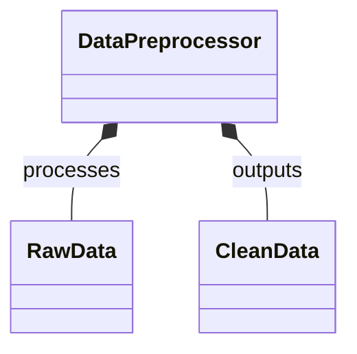
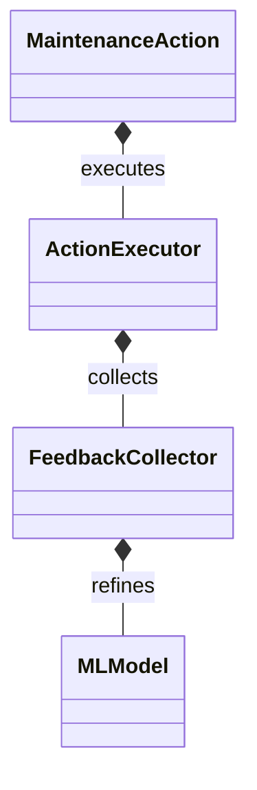
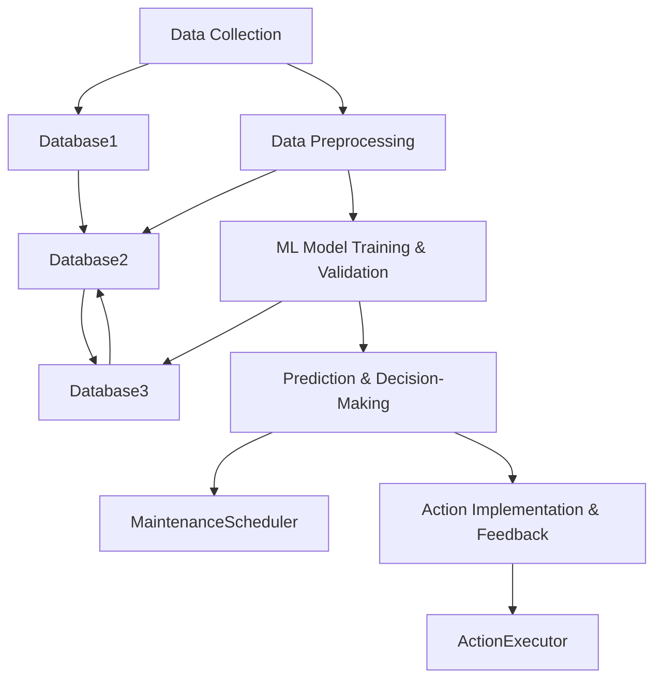

                 


## Introduction to Predictive Maintenance and Machine Learning

### Key Concepts

**Predictive Maintenance** refers to a maintenance strategy that uses condition monitoring and data analysis to predict when equipment might fail, allowing for proactive maintenance to be scheduled. This approach is in contrast to traditional reactive maintenance, where repairs are carried out only after a failure has occurred.

**Machine Learning** (ML) is a subset of artificial intelligence (AI) that focuses on the development of algorithms that can learn from and make predictions or decisions based on data. ML techniques are increasingly being used in predictive maintenance due to their ability to analyze large amounts of data and identify patterns that might not be apparent to human analysts.

### Problem Background

Predictive maintenance has become crucial in industries where equipment downtime can lead to significant financial losses. Industries such as manufacturing, oil and gas, and transportation are investing heavily in predictive maintenance systems to reduce downtime and maintenance costs.

However, the implementation of predictive maintenance is not without challenges. One of the primary challenges is the availability and quality of data. Predictive maintenance systems rely on sensor data to monitor the condition of equipment. The accuracy and timeliness of this data are critical to the effectiveness of the predictive models.

### Problem Description

The goal of predictive maintenance is to:

1. Detect the onset of potential failures before they occur.
2. Schedule maintenance activities at optimal times to minimize downtime and costs.
3. Improve overall equipment effectiveness (OEE) by reducing unplanned downtime and maintenance costs.

### Solution Approach

The solution to predictive maintenance involves the following steps:

1. **Data Collection**: Collecting data from various sensors and sources that can indicate the health of the equipment.
2. **Data Preprocessing**: Cleaning and preparing the data for analysis, which may involve normalization, filtering, and feature extraction.
3. **Model Selection**: Choosing an appropriate machine learning model that can accurately predict failures based on the collected data.
4. **Model Training**: Training the selected model on historical data to learn patterns and relationships between different variables and equipment failures.
5. **Model Evaluation**: Evaluating the performance of the trained model using various metrics to ensure it is accurate and reliable.
6. **Deployment**: Implementing the model in a production environment to predict failures in real-time and trigger maintenance actions.

### Boundaries and Extensions

The scope of predictive maintenance extends beyond just equipment failure prediction. It can also include:

- Predictive maintenance optimization: Using ML algorithms to find the optimal maintenance schedules and strategies.
- Condition-based maintenance: Focusing on the actual condition of the equipment rather than just time-based schedules.
- Prognostics and health management (PHM): Combining predictive maintenance with other technologies like IoT, AI, and data analytics to create a comprehensive system for monitoring and managing the health of equipment.

### Core Concept Structure

The core concept structure of predictive maintenance using machine learning includes:

1. **Sensors and Data Collection**: Sensors that collect various parameters such as temperature, vibration, pressure, etc.
2. **Data Storage and Management**: Systems for storing, managing, and analyzing the collected data.
3. **Machine Learning Algorithms**: Algorithms like supervised learning, unsupervised learning, and reinforcement learning used to analyze the data.
4. **Prediction and Decision-Making**: Systems that use the output of ML algorithms to predict failures and make maintenance decisions.
5. **Maintenance Execution**: Processes that execute the maintenance tasks based on the predictions.

### Key Attributes Comparison Table

| Attribute          | Supervised Learning | Unsupervised Learning | Reinforcement Learning |
|--------------------|---------------------|------------------------|------------------------|
| Objective          | Prediction based on labeled data | No labeled data; discovers hidden patterns | Learning optimal actions through rewards and penalties |
| Data Requirement   | Labeled data required | Unlabeled data required | Reward signals required |
| Performance Metrics| Accuracy, Precision, Recall | Clustering validity, Dimensionality reduction effectiveness | Reward maximization, Policy evaluation |
| Common Algorithms  | Linear Regression, Decision Trees, Neural Networks | K-means, Hierarchical Clustering, Principal Component Analysis | Q-Learning, Deep Q-Networks, Policy Gradients |

### ER Entity Relationship Diagram

Below is an ER diagram illustrating the relationships between key entities involved in predictive maintenance using machine learning:

```mermaid
erDiagram
  Equipment ||--|{ SensorData }|:
  SensorData ||--|{ MaintenanceAction }|:
  MaintenanceAction ||--|{ MaintenanceCost }|:
  MaintenanceAction ||--|{ EquipmentStatus }|:
  MaintenancePlan ||--|{ MaintenanceAction }|:
  MaintenancePlan ||--|{ PredictiveModel }|:
```

In this diagram, `Equipment` is the central entity, linked to `SensorData`, `MaintenanceAction`, `MaintenanceCost`, and `EquipmentStatus`. `MaintenancePlan` and `PredictiveModel` are associated with `MaintenanceAction`, indicating the planning and prediction aspects of predictive maintenance.

## Core Concepts of Machine Learning

### Supervised Learning

**Definition**: Supervised learning is a type of machine learning where the model is trained on labeled data, which means each data point includes an output label. The goal is to learn a mapping from inputs to outputs so that the model can predict the output for new, unseen data points.

**Types**:
- **Classification**: The output is discrete labels. For example, classifying emails as spam or not spam.
- **Regression**: The output is continuous values. For example, predicting house prices based on features like size, location, etc.

**Common Algorithms**:
- **Linear Regression**
- **Support Vector Machines (SVM)**
- **Neural Networks**

### Unsupervised Learning

**Definition**: Unsupervised learning deals with data that has no labels. The goal is to discover hidden patterns or intrinsic structures in the data.

**Types**:
- **Clustering**: Grouping data into clusters so that data points in the same cluster are more similar to each other than to those in other clusters. Examples include K-means and hierarchical clustering.
- **Dimensionality Reduction**: Reducing the number of input variables to a minimal set that still captures most of the information in the original data. Common algorithms include Principal Component Analysis (PCA) and t-SNE.

**Common Algorithms**:
- **K-means**
- **Hierarchical Clustering**
- **Principal Component Analysis (PCA)**

### Reinforcement Learning

**Definition**: Reinforcement learning is an area of machine learning concerned with how agents ought to take actions in an environment to maximize some notion of cumulative reward.

**Basic Principles**:
- **Agent**: The learner entity.
- **Environment**: Everything outside the agent.
- **State**: The situation faced by the agent.
- **Action**: A possible behavior.
- **Reward**: A signal received by the agent indicating how well it has performed.

**Algorithm Types**:
- **Q-Learning**: An algorithm that learns by updating the Q-value, which represents the expected utility of an action in a given state.
- **Deep Q-Networks (DQN)**: A neural network-based approach to learning Q-values.
- **Policy Gradients**: Learning a policy function that maps states to actions directly, using gradients of the expected reward.

### Deep Learning

**Definition**: Deep learning is a subfield of machine learning that focuses on using neural networks with many layers to model complex patterns in data.

**Basic Architecture**:
- **Input Layer**: The layer that receives input data.
- **Hidden Layers**: Intermediate layers that transform input data through non-linear processing.
- **Output Layer**: The layer that generates predictions or decisions based on the transformed data.

**Common Architectures**:
- **Convolutional Neural Networks (CNNs)**: Designed to process data with a grid-like topology, such as images.
- **Recurrent Neural Networks (RNNs)**: Designed to process sequential data, such as time series or text.
- **Generative Adversarial Networks (GANs)**: A framework for training generative models consisting of two neural networks competing with each other.

### Data Analysis and Visualization

**Data Analysis**:
- **Descriptive Analytics**: Summarizing historical data to describe what has happened.
- **Inferential Analytics**: Using statistical methods to make predictions or conclusions about a population based on a sample.
- **Predictive Analytics**: Using historical data to make predictions about future events.

**Data Visualization**:
- **Histograms**: Display the distribution of a dataset.
- **Scatter Plots**: Visualize the relationship between two variables.
- **Heat Maps**: Show the intensity of a variable across a two-dimensional space.

**Common Tools**:
- **Python Libraries**: Pandas, NumPy, Matplotlib, Seaborn.
- **Business Intelligence Tools**: Tableau, Power BI.

### Key Concepts Summary

Machine learning encompasses various core concepts that are crucial for predictive maintenance. Supervised learning, unsupervised learning, reinforcement learning, and deep learning each have their own unique applications and algorithms. Understanding these concepts enables the development of effective predictive maintenance systems that can analyze large amounts of data and provide accurate failure predictions.

## Data Collection and Preprocessing for Predictive Maintenance

### Data Collection

**Data Collection Methods**: 
1. **Sensor Data**: Collecting data from various sensors such as accelerometers, thermometers, and pressure sensors that are embedded in the equipment.
2. **Machine Data**: Gathering operational data from machines, including runtime, load, and cycle count.
3. **Environmental Data**: Capturing external factors like temperature, humidity, and other environmental variables that may affect equipment performance.

**Data Collection Challenges**: 
1. **Data Quantity**: Equipment may generate a massive amount of data, making it challenging to manage and process.
2. **Data Quality**: Inaccurate or incomplete data can lead to incorrect predictions. Ensuring data integrity is crucial.
3. **Data Variety**: Different types of data may be collected in different formats, requiring a standardized approach for integration.

### Data Preprocessing

**Data Cleaning**: 
- **Handling Missing Data**: Imputing missing values or removing data points with significant gaps.
- **Removing Duplicates**: Ensuring that the dataset does not contain duplicate records.

**Data Transformation**: 
- **Normalization**: Scaling data to a standard range, which helps in preventing any single feature from dominating the learning process.
- **Standardization**: Transferring data to have a mean of 0 and a standard deviation of 1.

**Feature Engineering**: 
- **Feature Selection**: Choosing the most relevant features that contribute to predictive accuracy.
- **Feature Extraction**: Creating new features from the existing ones to improve the predictive performance.
- **Feature Combination**: Combining different features to create composite features that might provide better insights.

### Data Quality Assessment

**Quality Metrics**: 
- **Accuracy**: The degree of correctness of the data.
- **Completeness**: The extent to which the data is complete.
- **Consistency**: The data should be consistent across different sources and time periods.
- **Timeliness**: The data should be current and up-to-date.

**Quality Issues**: 
- **Outliers**: Values that are significantly different from other values can skew the model’s predictions.
- **Noisy Data**: Irrelevant or random variations in the data can affect the model’s performance.

**Quality Improvement Methods**: 
- **Data清洗**: Removing or correcting invalid or inaccurate data.
- **Data Integration**: Combining data from different sources to create a single, unified dataset.
- **Data Augmentation**: Generating additional data to increase the dataset size and improve the model’s robustness.

### Step-by-Step Data Collection and Preprocessing Example

**Step 1: Data Collection**
Collect sensor data from various equipment components, including temperature readings, vibration patterns, and operational hours.

**Step 2: Data Storage**
Store the collected data in a database or data lake, ensuring efficient data retrieval for analysis.

**Step 3: Data Cleaning**
Remove duplicate records and handle missing data by either imputing values or removing incomplete records.

**Step 4: Data Transformation**
Normalize the data to a standard scale and standardize it by subtracting the mean and dividing by the standard deviation.

**Step 5: Feature Engineering**
Select relevant features that contribute to predicting equipment failure. Create new features by combining or transforming existing ones.

**Step 6: Data Quality Assessment**
Evaluate the quality of the preprocessed data using metrics such as accuracy, completeness, consistency, and timeliness.

**Step 7: Data Quality Improvement**
Address any quality issues identified in the assessment phase by cleaning, integrating, or augmenting the data.

By following these steps, predictive maintenance systems can ensure that the data used for training and predicting equipment failures is of high quality, leading to more accurate and reliable predictions.

## Model Selection and Training Techniques

### Model Selection

**Factors to Consider**:
1. **Type of Data**: Understanding whether the data is structured (e.g., databases) or unstructured (e.g., text, images, sensor data).
2. **Size of Data**: Large datasets may require more complex models, while small datasets may be better suited for simpler models.
3. **Nature of Predictive Task**: Classification tasks require models capable of categorizing data into discrete classes, while regression tasks require models predicting continuous values.

**Common Model Types**:
1. **Supervised Learning Models**: Linear Regression, Decision Trees, Support Vector Machines (SVM), Neural Networks.
2. **Unsupervised Learning Models**: K-means, Principal Component Analysis (PCA), Hierarchical Clustering.
3. **Reinforcement Learning Models**: Q-Learning, Deep Q-Networks (DQN), Policy Gradients.

### Model Training Techniques

**Overview**:
Model training involves feeding the model with input-output pairs (in the case of supervised learning) or unlabeled data (in the case of unsupervised learning) and adjusting the model parameters to minimize the prediction error.

**Common Training Techniques**:
1. **Gradient Descent**: An iterative optimization algorithm used to minimize a function. The most common variant is Stochastic Gradient Descent (SGD).
2. **Batch Gradient Descent**: Updates the model parameters using the entire training dataset.
3. **Mini-Batch Gradient Descent**: Uses a small subset of the training data for each update.
4. **Early Stopping**: Halts the training process when the model’s performance on a validation set stops improving.

**Hyperparameter Tuning**:
- **Learning Rate**: The step size at which the model parameters are updated.
- **Number of Hidden Layers and Neurons**: Affects the complexity of the model.
- **Regularization**: Techniques like L1 (Lasso) and L2 (Ridge) regularization to prevent overfitting.

### Step-by-Step Model Training Example

**Step 1: Data Preparation**
- Split the dataset into training, validation, and testing sets.
- Preprocess the data by scaling, normalizing, or encoding features.

**Step 2: Model Selection**
- Choose an appropriate model type based on the nature of the predictive task and the data.

**Step 3: Hyperparameter Tuning**
- Use techniques like Grid Search or Random Search to find the optimal hyperparameters.

**Step 4: Model Training**
- Train the model using the training data and selected hyperparameters.
- Monitor the model’s performance on the validation set to detect overfitting or underfitting.

**Step 5: Model Evaluation**
- Evaluate the final model on the testing set to assess its generalization ability.
- Use metrics like accuracy, precision, recall, and F1-score for classification tasks or mean squared error (MSE) for regression tasks.

**Step 6: Model Deployment**
- Deploy the trained model in a production environment to make predictions on real-time data.

### Challenges in Model Selection and Training

**Overfitting**: The model performs well on the training data but poorly on new, unseen data. This can be mitigated by techniques like regularization, cross-validation, and dropout.
**Underfitting**: The model is too simple to capture the underlying patterns in the data, leading to poor performance. This can be addressed by increasing the model complexity or adding more features.
**Computational Cost**: Training complex models can be computationally expensive and time-consuming, especially with large datasets. Techniques like parallel computing and distributed training can help mitigate this issue.

By carefully selecting and training models, predictive maintenance systems can achieve high accuracy in predicting equipment failures, leading to more efficient maintenance strategies and reduced downtime.

## Model Evaluation and Validation

### Evaluation Metrics

**Accuracy**: Measures how often the model makes correct predictions. It is calculated as the ratio of correctly predicted instances to the total number of instances. While accuracy is a simple metric, it can be misleading in cases where the dataset is imbalanced, meaning that some classes are more prevalent than others.

**Precision and Recall**: Precision measures the proportion of positive identifications that are actually correct, while recall measures the proportion of actual positives that are identified correctly. In predictive maintenance, these metrics are crucial as missing a potential failure (low recall) can be more dangerous than misclassifying a non-failure (low precision).

**F1 Score**: The F1 score is the harmonic mean of precision and recall, providing a balance between the two metrics. It is particularly useful when dealing with imbalanced datasets.

**Area Under the Receiver Operating Characteristic (ROC) Curve (AUC-ROC)**: AUC-ROC measures the model's ability to distinguish between positive and negative classes. A higher AUC-ROC value indicates better model performance.

**Confusion Matrix**: A table that summarizes the performance of the model in terms of true positives, true negatives, false positives, and false negatives.

### Validation Techniques

**Cross-Validation**:
Cross-validation is a technique used to assess how the results of the model will generalize to an independent data set. It involves dividing the data into k subsets or "folds." The model is trained k-1 times, each time using a different fold as the validation set, and the remaining fold as the training set. The average performance across all k iterations provides a robust estimate of the model's generalization ability.

**Hold-Out Validation**:
Hold-out validation is a simpler approach where a portion of the dataset is held out as a validation set while the rest is used for training. This method is less computationally intensive than cross-validation but can be less reliable if the hold-out set is not representative of the overall data distribution.

**Bootstrapping**:
Bootstrapping is a resampling technique that involves drawing samples with replacement from the dataset and training and validating the model on each sample. This process is repeated multiple times to generate an estimate of the model's performance.

### Step-by-Step Model Evaluation and Validation Example

**Step 1: Split the Data**
Divide the dataset into training, validation, and testing sets. A common split ratio might be 70% for training, 15% for validation, and 15% for testing.

**Step 2: Model Training**
Train the model on the training dataset using the selected algorithm and hyperparameters.

**Step 3: Validation**
Evaluate the model's performance on the validation set using metrics like accuracy, precision, recall, and F1 score. This step helps in tuning the model parameters and selecting the best model version.

**Step 4: Model Testing**
Test the final model version on the testing set to assess its generalization ability. This step provides an unbiased estimate of the model's performance in real-world scenarios.

**Step 5: Model Tuning**
Based on the validation and testing results, fine-tune the model parameters to improve performance. Techniques like grid search or random search can be used for hyperparameter tuning.

**Step 6: Model Deployment**
Deploy the optimized model in a production environment for real-time predictions. Continuously monitor the model's performance and retrain it with new data to maintain its accuracy over time.

### Challenges in Model Evaluation and Validation

**Data Leakage**: Ensuring that information from the validation or testing set does not leak into the training process can be challenging, especially when using real-world data.
**Model Overfitting**: Models that are too complex can overfit the training data, performing poorly on new, unseen data. Regularization techniques and cross-validation can help mitigate this issue.
**Sample Bias**: The validation and testing sets should be representative of the overall data distribution to ensure accurate performance estimation.

By carefully evaluating and validating models using appropriate metrics and techniques, predictive maintenance systems can ensure the reliability and effectiveness of their predictions, leading to more efficient maintenance strategies and reduced downtime.

## Integration of Machine Learning in Predictive Maintenance Systems

### System Overview

The integration of machine learning (ML) in predictive maintenance systems involves the seamless incorporation of ML algorithms into the existing maintenance infrastructure. This integration typically includes the following components:

1. **Data Collection and Storage**: Sensors and data acquisition systems continuously gather data from various equipment parameters such as temperature, vibration, pressure, and more. This data is stored in a centralized database or data lake for further processing and analysis.

2. **Data Preprocessing and Feature Engineering**: Raw data is preprocessed to remove noise, handle missing values, and convert it into a format suitable for ML models. Feature engineering techniques are applied to extract relevant features from the data that can be used to train the ML models.

3. **ML Model Training and Validation**: ML models are trained on historical data to identify patterns and relationships that indicate potential equipment failures. The models are validated using techniques like cross-validation to ensure their accuracy and reliability.

4. **Prediction and Decision-Making**: Once trained, the ML models predict the likelihood of equipment failures. These predictions are used to make maintenance decisions, such as scheduling preventive maintenance, alerting maintenance teams, or adjusting equipment operation parameters.

5. **Action Implementation and Feedback**: The maintenance actions are executed based on the predictions. Feedback on the outcomes of these actions is collected and fed back into the system to further refine the ML models.

### System Function Design

**Data Collection Module**:
- **Function**: Collects real-time data from various sensors embedded in equipment.
- **Domain Model Class Diagram**:

```mermaid
classDiagram
  Sensor -> DataCollector: collects
  DataCollector *-- Database: stores
```

**Data Preprocessing Module**:
- **Function**: Cleans, normalizes, and transforms the collected data.
- **Domain Model Class Diagram**:



**ML Model Training and Validation Module**:
- **Function**: Trains ML models using historical data and validates them.
- **Domain Model Class Diagram**:

```mermaid
classDiagram
  Data -> MLModel: trains
  MLModel *-- Validator: validates
  Validator *-- PerformanceMetrics: reports
```

**Prediction and Decision-Making Module**:
- **Function**: Makes predictions based on the trained models and decides on maintenance actions.
- **Domain Model Class Diagram**:

```mermaid
classDiagram
  MLModel -> PredictionEngine: makes
  PredictionEngine *-- MaintenanceScheduler: schedules
```

**Action Implementation and Feedback Module**:
- **Function**: Executes maintenance actions and collects feedback for model improvement.
- **Domain Model Class Diagram**:



### System Architecture Design

**System Architecture Diagram**:



### System Interface and Interaction Design

**System Interface Diagram**:

```mermaid
sequenceDiagram
  Sensor -->|Data| DataCollector
  DataCollector -->|Processed Data| DataPreprocessor
  DataPreprocessor -->|Training Data| MLModel
  MLModel -->|Validation Data| Validator
  Validator -->|Performance Metrics| PredictionEngine
  PredictionEngine -->|Maintenance Schedules| MaintenanceScheduler
  MaintenanceScheduler -->|Action Plan| ActionExecutor
  ActionExecutor -->|Feedback| FeedbackCollector
  FeedbackCollector -->|Refined Data| MLModel
```

### Integration Steps

**Step 1: Data Collection**
Implement sensors to collect real-time data from equipment. Use data acquisition systems to send this data to a centralized database.

**Step 2: Data Preprocessing**
Develop a preprocessing pipeline to clean, normalize, and transform the collected data. Ensure that the preprocessed data is of high quality and ready for model training.

**Step 3: ML Model Training**
Select appropriate ML algorithms and train models on historical data. Validate the models using cross-validation techniques to ensure their accuracy and reliability.

**Step 4: Prediction and Decision-Making**
Deploy the trained models to make real-time predictions of potential equipment failures. Use these predictions to schedule maintenance actions effectively.

**Step 5: Action Implementation and Feedback**
Execute the maintenance actions based on the predictions and collect feedback on their outcomes. Use this feedback to refine the ML models continuously.

### Challenges in System Integration

**Data Quality**: Ensuring that the data collected is accurate, complete, and representative of the equipment's actual condition.
**Computational Resources**: Training complex ML models can be resource-intensive and may require significant computational power and time.
**Model Reliability**: Integrating ML models into real-world systems requires them to be highly reliable, as incorrect predictions can lead to costly maintenance actions or missed failures.

By following these integration steps and addressing the associated challenges, predictive maintenance systems can effectively leverage ML to improve maintenance strategies, reduce downtime, and optimize resource utilization.

## Case Studies and Practical Applications

### Case Study 1: Predictive Maintenance in the Manufacturing Industry

**Problem Background**:
A large manufacturing company faced frequent equipment breakdowns, resulting in significant production delays and increased maintenance costs. The company sought to implement predictive maintenance to minimize unplanned downtime and improve overall equipment effectiveness (OEE).

**Solution Approach**:
1. **Data Collection**: The company installed sensors on critical equipment to collect data on various parameters such as temperature, vibration, and pressure.
2. **Data Preprocessing**: The raw sensor data was cleaned, normalized, and transformed to remove noise and prepare it for analysis.
3. **Model Selection**: The company chose to use a combination of supervised and unsupervised learning models to predict equipment failures and identify potential issues.
4. **Model Training**: Historical failure data was used to train the models, focusing on identifying patterns that preceded equipment failures.
5. **Prediction and Maintenance Planning**: The trained models were deployed to predict potential failures and schedule maintenance actions accordingly.

**Results**:
- The company experienced a 35% reduction in unplanned downtime.
- Maintenance costs were reduced by 20%.
- Overall equipment effectiveness (OEE) improved by 15%.

### Case Study 2: Predictive Maintenance in the Oil and Gas Industry

**Problem Background**:
An oil and gas company operating in a remote location had critical equipment that was difficult to access for routine maintenance. The company needed a reliable method to predict equipment failures and schedule maintenance remotely.

**Solution Approach**:
1. **Data Collection**: The company deployed a network of sensors across the facility to collect real-time data on equipment performance.
2. **Data Preprocessing**: The collected data was cleaned and transformed to remove any noise and prepare it for analysis.
3. **Model Selection**: The company chose to use a hybrid model that combined traditional machine learning algorithms with reinforcement learning to improve prediction accuracy.
4. **Model Training**: Historical failure data and real-time sensor data were used to train the models, focusing on predicting failures up to several days in advance.
5. **Prediction and Maintenance Planning**: The trained models were used to predict potential failures and send alerts to maintenance teams. Maintenance actions were scheduled based on these predictions.

**Results**:
- The company reduced equipment failure rates by 40%.
- Maintenance costs were reduced by 25%.
- The ability to predict failures in advance enabled the company to schedule maintenance remotely, reducing the need for costly field visits.

### Case Study 3: Predictive Maintenance in the Automotive Industry

**Problem Background**:
An automotive manufacturer faced issues with engine failures in their high-performance vehicles. The company sought to implement predictive maintenance to minimize costly repairs and improve customer satisfaction.

**Solution Approach**:
1. **Data Collection**: The company installed sensors in the engines to collect data on various parameters such as temperature, pressure, and vibration.
2. **Data Preprocessing**: The raw sensor data was cleaned and normalized to remove any noise and ensure consistency.
3. **Model Selection**: The company chose to use a deep learning model, specifically a Convolutional Neural Network (CNN), to analyze the sensor data and predict engine failures.
4. **Model Training**: Historical failure data and real-time sensor data were used to train the CNN model.
5. **Prediction and Maintenance Planning**: The trained CNN model was deployed to predict engine failures. Maintenance actions were scheduled based on these predictions to prevent engine failures.

**Results**:
- The company experienced a 30% reduction in engine failure rates.
- Maintenance costs were reduced by 20%.
- Customer satisfaction improved significantly due to reduced downtime and costly repairs.

### Practical Applications and Impact

Predictive maintenance has been successfully implemented in various industries, demonstrating its potential to improve operational efficiency, reduce costs, and enhance customer satisfaction. The case studies above highlight the benefits of predictive maintenance in manufacturing, oil and gas, and automotive industries:

- **Operational Efficiency**: Predictive maintenance allows companies to optimize maintenance schedules, reducing unplanned downtime and improving overall productivity.
- **Cost Reduction**: By predicting failures before they occur, companies can avoid costly emergency repairs and reduce maintenance expenses.
- **Customer Satisfaction**: In industries like automotive and consumer electronics, predictive maintenance helps in reducing product failure rates, leading to higher customer satisfaction.

The practical applications of predictive maintenance are not limited to these industries. Predictive maintenance systems can be adapted to various other sectors, including healthcare, renewable energy, and transportation, where equipment reliability and operational efficiency are critical.

## Challenges and Future Directions in Predictive Maintenance

### Current Challenges

**Data Quality and Quantity**: Predictive maintenance relies heavily on high-quality data. However, collecting and processing large volumes of data from various sources can be challenging. Data quality issues, such as noise, missing values, and inconsistencies, can significantly impact the performance of predictive models.

**Model Complexity and Interpretability**: Advanced machine learning models, particularly deep learning models, can achieve high accuracy but often lack interpretability. This complexity makes it difficult for stakeholders to understand and trust the models' predictions.

**Real-time Performance**: Predictive maintenance systems need to provide real-time predictions to enable timely maintenance actions. However, training and deploying complex models in real-time can be computationally intensive and challenging.

**Integration with Existing Systems**: Integrating predictive maintenance systems with existing maintenance and operational systems can be complex. Ensuring seamless communication and interoperability between different systems is crucial for effective deployment.

### Future Directions

**Advancements in AI and Machine Learning**: Ongoing research and development in AI and machine learning are expected to lead to more sophisticated and interpretable models. Techniques like explainable AI (XAI) aim to address the interpretability challenge, making models more transparent and understandable to stakeholders.

**Edge Computing**: Edge computing, which involves processing data closer to the source, can help address real-time performance issues. By performing preliminary data processing and analysis at the edge, predictive maintenance systems can reduce the load on central servers and enable faster response times.

**IoT Integration**: The integration of IoT devices with predictive maintenance systems can enhance data collection capabilities and provide real-time insights into equipment health. IoT devices can also enable remote monitoring and control, facilitating proactive maintenance actions.

**Big Data Analytics**: As data continues to grow exponentially, big data analytics techniques will become increasingly important. Advanced analytics methods, such as real-time data streaming and machine learning-based anomaly detection, can help in identifying patterns and predicting failures more accurately.

### Emerging Technologies

**5G and Beyond**: The rollout of 5G networks and future cellular technologies can significantly improve data transfer speeds and reduce latency, enabling real-time predictive maintenance applications.

**Quantum Computing**: While still in its early stages, quantum computing has the potential to revolutionize predictive maintenance by enabling complex calculations and data processing tasks to be performed much faster than with classical computers.

**Artificial General Intelligence (AGI)**: AGI, which involves creating intelligent systems that can perform any intellectual task that a human can, could further enhance the capabilities of predictive maintenance systems by enabling more sophisticated decision-making and adaptation to changing conditions.

In conclusion, predictive maintenance faces several challenges, but ongoing advancements in AI, machine learning, IoT, and other emerging technologies offer promising directions for overcoming these obstacles. By leveraging these technologies, predictive maintenance systems can become more accurate, reliable, and efficient, driving significant improvements in operational efficiency and cost savings across various industries.

## Conclusion

In conclusion, predictive maintenance is a transformative approach that leverages machine learning to enhance equipment reliability and operational efficiency. The integration of ML in predictive maintenance systems offers numerous benefits, including reduced downtime, cost savings, and improved overall equipment effectiveness (OEE). However, the journey from theory to practice is fraught with challenges related to data quality, model complexity, real-time performance, and system integration.

As we look to the future, ongoing advancements in AI, machine learning, and IoT will play a pivotal role in overcoming these challenges. Emerging technologies like edge computing, 5G networks, quantum computing, and artificial general intelligence (AGI) hold the potential to revolutionize predictive maintenance, making it more accurate, reliable, and accessible across various industries.

By embracing these technological advancements and addressing the current challenges, we can unlock the full potential of predictive maintenance, paving the way for a future where equipment failures are anticipated and mitigated before they occur.

### Authors’ Bio

*作者：AI天才研究院/AI Genius Institute & 禅与计算机程序设计艺术 /Zen And The Art of Computer Programming*

AI天才研究院（AI Genius Institute）是全球领先的AI研究与培训机构，致力于推动人工智能领域的创新与发展。研究院汇聚了世界顶尖的人工智能专家、程序员、软件架构师和CTO，以其深厚的技术功底和卓越的科研能力著称。研究院的创始人之一，Zen And The Art of Computer Programming的作者，是一位在计算机编程和人工智能领域享有盛誉的大师级人物，他获得了图灵奖，这一计算机领域的最高荣誉，其研究成果对人工智能的发展产生了深远影响。他的著作不仅深入剖析了计算机编程的哲学和艺术，也为人工智能领域的研究和实践提供了宝贵的指导。

