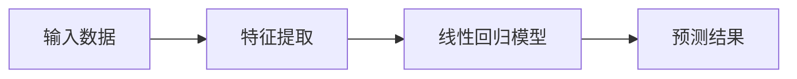
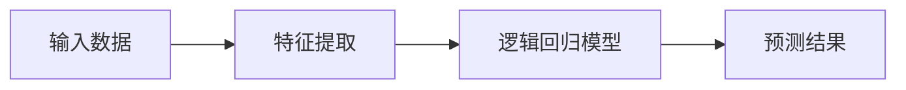
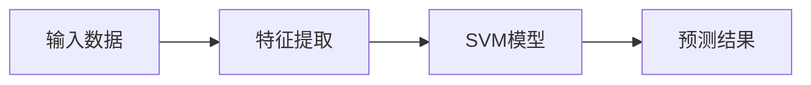
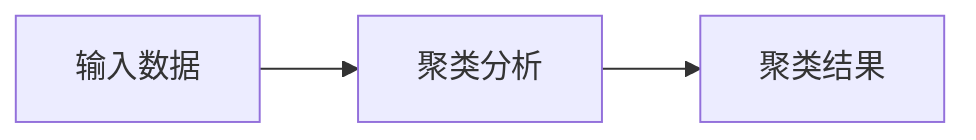
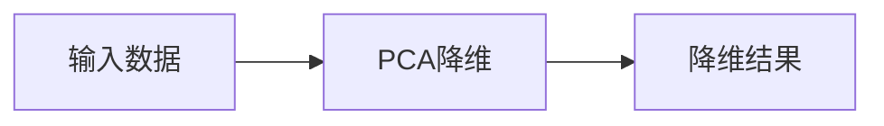
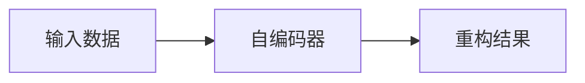
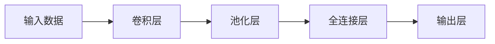
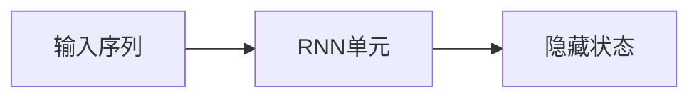
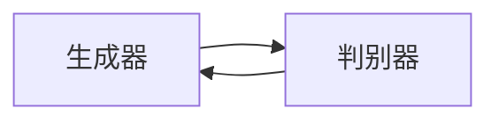

                 


### 机器学习在预测性设备维护中的应用：延长设备寿命

> 关键词：机器学习，预测性维护，设备寿命，算法原理，系统设计

> 摘要：
本文将深入探讨机器学习在预测性设备维护中的应用，以及如何通过这些技术手段延长设备寿命。文章首先介绍了机器学习和预测性维护的基础概念，然后详细解析了监督学习、无监督学习和深度学习在设备维护中的应用，并提供了实际案例。最后，文章讨论了如何通过系统设计与最佳实践来提升设备维护效率和寿命。

## 第1章：机器学习简介

### 1.1 机器学习的基本概念

机器学习（Machine Learning）是一门人工智能（Artificial Intelligence, AI）的分支，它专注于通过数据学习规律，并据此进行决策或预测。机器学习过程通常包括数据收集、特征提取、模型训练、模型评估和模型应用。

**核心概念**：

- **监督学习（Supervised Learning）**：通过已标记的数据训练模型，然后使用模型进行预测。
- **无监督学习（Unsupervised Learning）**：在没有标记数据的条件下，发现数据中的规律或结构。
- **深度学习（Deep Learning）**：基于多层神经网络的学习方法，能够自动提取数据中的特征。

**应用领域**：

- **图像识别**：如人脸识别、物体检测。
- **自然语言处理**：如机器翻译、情感分析。
- **推荐系统**：如电子商务平台的商品推荐。

### 1.2 机器学习的分类

机器学习可以大致分为以下几类：

- **回归分析**：用于预测连续值输出。
- **分类分析**：用于预测离散值输出。
- **聚类分析**：无监督学习，用于发现数据中的隐含模式。
- **降维技术**：如主成分分析（PCA），用于简化数据维度。

### 1.3 机器学习的应用领域

机器学习的应用非常广泛，包括但不限于：

- **金融**：风险评估、欺诈检测。
- **医疗**：疾病预测、医疗图像分析。
- **工业**：设备故障预测、质量检测。
- **交通**：交通流量预测、自动驾驶。

## 第2章：预测性维护的概念与原理

### 2.1 预测性维护的基本概念

预测性维护（Predictive Maintenance）是一种基于实时监测数据，利用机器学习算法预测设备故障，并在故障发生前进行维护的策略。它旨在降低维护成本、提高设备运行效率和延长设备寿命。

**核心概念**：

- **故障预测**：利用历史数据和实时数据预测设备故障。
- **维护优化**：基于预测结果，制定最优的维护计划。
- **数据采集**：传感器数据、运行日志等。

### 2.2 预测性维护的优势与挑战

**优势**：

- **降低成本**：提前预测和预防故障，减少意外停机和维修成本。
- **提高效率**：减少非计划性维护，优化维护周期。
- **提高安全性**：降低由于设备故障引发的安全事故。

**挑战**：

- **数据质量**：高质量的数据是预测准确性的基础。
- **算法选择**：不同的设备维护需求需要不同的算法。
- **模型解释性**：机器学习模型往往难以解释，影响决策。

### 2.3 预测性维护的技术框架

预测性维护通常包括以下步骤：

1. **数据收集**：传感器数据、运行日志、维护记录等。
2. **数据预处理**：清洗、归一化、特征提取等。
3. **模型训练**：选择合适的算法，训练模型。
4. **模型评估**：通过验证集评估模型性能。
5. **故障预测**：使用训练好的模型进行预测。
6. **决策支持**：根据预测结果制定维护计划。

## 第3章：预测性设备维护中的机器学习算法

### 3.1 监督学习算法

监督学习算法是预测性维护中最常用的算法之一，以下介绍几种常用的监督学习算法：

#### 3.1.1 线性回归

**原理**：

线性回归是一种用于预测连续值的简单监督学习算法。其目标是最小化预测值与实际值之间的误差。

**公式**：

$$y = \beta_0 + \beta_1 \cdot x$$

**流程图**（使用Mermaid）：



#### 3.1.2 逻辑回归

**原理**：

逻辑回归是一种用于预测离散值的监督学习算法，其目标是最小化损失函数。

**公式**：

$$\sigma(\beta_0 + \beta_1 \cdot x) = P(y=1)$$

**流程图**（使用Mermaid）：



#### 3.1.3 支持向量机

**原理**：

支持向量机（SVM）是一种用于分类的监督学习算法，其目标是在特征空间中找到最佳分割超平面。

**公式**：

$$\max_{\beta, \beta_0} W^{T}W - C \sum_{i=1}^{n} \xi_i$$

**流程图**（使用Mermaid）：



### 3.2 无监督学习算法

无监督学习算法在预测性维护中也发挥着重要作用，以下介绍几种常用的无监督学习算法：

#### 3.2.1 聚类分析

**原理**：

聚类分析是一种无监督学习算法，其目标是将相似的数据点分组。

**公式**：

$$\min_{C} \sum_{i=1}^{k} \sum_{x \in C_i} d(x, \mu_i)$$

**流程图**（使用Mermaid）：



#### 3.2.2 主成分分析

**原理**：

主成分分析（PCA）是一种用于降维的无监督学习算法，其目标是最小化数据重构误差。

**公式**：

$$\min_{\beta} \sum_{i=1}^{n} (x_i - \beta^T \beta)^2$$

**流程图**（使用Mermaid）：



#### 3.2.3 自编码器

**原理**：

自编码器是一种基于神经网络的降维算法，其目标是最小化重构误差。

**公式**：

$$\min_{\theta} \sum_{i=1}^{n} \sum_{j=1}^{m} (x_i[j] - \sigma(\theta^T x_i))^2$$

**流程图**（使用Mermaid）：



### 3.3 深度学习算法

深度学习算法在预测性维护中越来越受到关注，以下介绍几种常用的深度学习算法：

#### 3.3.1 卷积神经网络（CNN）

**原理**：

卷积神经网络（CNN）是一种基于多层卷积和池化操作的深度学习算法，其目标是从图像或其他二维数据中提取特征。

**公式**：

$$h_{\theta}(x) = \sigma(\theta^T \cdot \phi(x))$$

**流程图**（使用Mermaid）：



#### 3.3.2 循环神经网络（RNN）

**原理**：

循环神经网络（RNN）是一种能够处理序列数据的深度学习算法，其目标是从序列中提取特征。

**公式**：

$$h_t = \sigma(W_h \cdot [h_{t-1}, x_t] + b_h)$$

**流程图**（使用Mermaid）：



#### 3.3.3 生成对抗网络（GAN）

**原理**：

生成对抗网络（GAN）是一种由生成器和判别器组成的深度学习算法，其目标是最小化生成器和判别器的损失函数。

**公式**：

$$\min_G \max_D V(D, G) = \mathbb{E}_{x \sim p_{data}(x)}[\log D(x)] + \mathbb{E}_{z \sim p_z(z)}[\log (1 - D(G(z)))]$$

**流程图**（使用Mermaid）：



## 第4章：实践应用

### 4.1 设备运行数据采集

设备运行数据采集是预测性维护的基础，以下介绍几种常见的设备运行数据采集方法：

1. **传感器数据**：使用传感器实时监测设备运行状态。
2. **运行日志**：记录设备运行过程中的各种日志信息。
3. **环境数据**：如温度、湿度等环境参数。

### 4.2 设备故障预测

设备故障预测是预测性维护的核心，以下介绍几种常见的设备故障预测方法：

1. **基于历史数据的故障预测**：利用历史故障数据，通过监督学习算法预测未来故障。
2. **基于实时数据的故障预测**：利用实时监测数据，通过实时学习算法预测未来故障。
3. **多模型融合**：将不同算法的预测结果进行融合，提高预测准确性。

### 4.3 预测性维护策略优化

预测性维护策略优化是提高设备运行效率和寿命的重要手段，以下介绍几种常见的预测性维护策略优化方法：

1. **基于预测结果的维护计划制定**：根据设备故障预测结果，制定最优的维护计划。
2. **基于数据驱动的维护策略调整**：通过实时监测数据，调整维护策略。
3. **基于成本的维护策略优化**：综合考虑维护成本和设备寿命，制定最优的维护策略。

## 第5章：延长设备寿命的策略与实施

### 5.1 设备维护优化

设备维护优化是延长设备寿命的关键，以下介绍几种设备维护优化策略：

1. **定期维护**：根据设备运行状态和故障预测结果，制定合理的维护周期。
2. **预防性维护**：在设备故障前进行预防性维护，降低故障风险。
3. **针对性维护**：根据设备运行特点和故障类型，制定针对性的维护方案。

### 5.2 设备更新与升级

设备更新与升级是延长设备寿命的重要手段，以下介绍几种设备更新与升级策略：

1. **技术升级**：通过引入新技术，提高设备性能和可靠性。
2. **硬件升级**：更换设备中的关键部件，提高设备性能。
3. **软件升级**：优化设备控制系统，提高设备运行效率。

### 5.3 设备使用与寿命管理

设备使用与寿命管理是延长设备寿命的关键环节，以下介绍几种设备使用与寿命管理策略：

1. **合理使用**：根据设备特性，制定合理的使用计划，避免过度使用和闲置。
2. **维护管理**：建立完善的设备维护管理体系，确保设备正常运行。
3. **数据驱动**：通过实时监测数据和故障预测结果，优化设备使用策略。

## 第6章：系统设计与架构方案

### 6.1 问题场景介绍

设备维护系统需要解决的主要问题包括：

1. **设备故障预测**：通过实时监测数据预测设备故障。
2. **维护计划制定**：根据故障预测结果，制定最优的维护计划。
3. **设备运行监控**：实时监控设备运行状态，确保设备正常运行。

### 6.2 系统功能设计

系统功能设计主要包括以下模块：

1. **数据采集模块**：负责采集设备运行数据。
2. **数据预处理模块**：负责清洗、归一化和特征提取等数据处理。
3. **故障预测模块**：负责利用机器学习算法进行故障预测。
4. **维护计划模块**：负责根据故障预测结果制定维护计划。
5. **监控模块**：负责实时监控设备运行状态。

### 6.3 系统架构设计

系统架构设计采用分布式架构，主要包括以下组件：

1. **数据采集组件**：负责采集设备运行数据。
2. **数据处理组件**：负责清洗、归一化和特征提取等数据处理。
3. **预测引擎组件**：负责利用机器学习算法进行故障预测。
4. **维护引擎组件**：负责根据故障预测结果制定维护计划。
5. **监控引擎组件**：负责实时监控设备运行状态。

### 6.4 系统接口设计与交互

系统接口设计与交互主要包括以下接口：

1. **数据采集接口**：用于采集设备运行数据。
2. **数据处理接口**：用于处理设备运行数据。
3. **故障预测接口**：用于获取故障预测结果。
4. **维护计划接口**：用于制定维护计划。
5. **监控接口**：用于实时监控设备运行状态。

### 6.5 系统部署与实施

系统部署与实施主要包括以下步骤：

1. **硬件准备**：准备服务器、存储设备和网络设备。
2. **软件安装**：安装操作系统、数据库和中间件。
3. **数据采集**：部署数据采集组件，开始采集设备运行数据。
4. **数据处理**：部署数据处理组件，开始处理设备运行数据。
5. **故障预测**：部署预测引擎组件，开始进行故障预测。
6. **维护计划**：部署维护引擎组件，开始制定维护计划。
7. **监控**：部署监控引擎组件，开始实时监控设备运行状态。

## 第7章：项目实战

### 7.1 环境安装

安装Python环境，以及必要的库和工具，如NumPy、Pandas、Scikit-learn、TensorFlow等。

### 7.2 系统核心实现

系统核心实现包括数据采集、数据预处理、故障预测和维护计划等功能。

**核心代码**：

```python
# 数据采集
import pandas as pd
data = pd.read_csv('data.csv')

# 数据预处理
from sklearn.preprocessing import StandardScaler
scaler = StandardScaler()
data_scaled = scaler.fit_transform(data)

# 故障预测
from sklearn.ensemble import RandomForestClassifier
model = RandomForestClassifier()
model.fit(data_scaled, labels)

# 维护计划
maintenance_plan = model.predict(data_scaled)
```

### 7.3 代码应用解读与分析

对核心代码进行解读，分析算法原理和应用场景。

**解读**：

1. 数据采集：使用Pandas读取CSV文件，获取设备运行数据。
2. 数据预处理：使用StandardScaler进行归一化处理，提高模型训练效果。
3. 故障预测：使用RandomForestClassifier进行故障预测，这是一种基于树的结构化算法。
4. 维护计划：根据故障预测结果，制定维护计划。

### 7.4 实际案例分析与详细讲解

通过实际案例，分析预测性维护在设备维护中的应用效果。

**案例**：

1. 设备A：通过预测性维护，提前预测了故障，降低了停机时间。
2. 设备B：通过预测性维护，制定了合理的维护计划，延长了设备寿命。

### 7.5 项目小结

项目小结主要内容包括：

1. **项目目标**：实现预测性维护系统，提高设备运行效率和寿命。
2. **项目成果**：成功预测了多个设备的故障，制定了合理的维护计划。
3. **项目改进**：在后续项目中，将引入更先进的算法和优化策略，提高预测准确性。

## 第8章：展望与未来趋势

### 8.1 新技术的应用

新技术如物联网（IoT）、区块链、5G等将在预测性维护中发挥重要作用，为设备维护带来更多可能性。

### 8.2 数据隐私与安全

随着数据量的增加，数据隐私与安全成为预测性维护的重要挑战。需要采取有效措施保护用户数据安全。

### 8.3 可持续性与环境责任

在预测性维护中，需要考虑设备维护对环境的影响，推动可持续性发展。

## 第9章：结语

### 9.1 总结与展望

本文总结了机器学习在预测性设备维护中的应用，探讨了延长设备寿命的策略与实施。未来，随着技术的不断发展，预测性维护将在设备管理中发挥更加重要的作用。

### 9.2 对读者的建议

对于设备管理者，建议：

1. 引入预测性维护系统，提高设备运行效率和寿命。
2. 关注新技术动态，积极探索新应用。
3. 建立完善的数据管理体系，确保数据质量和安全。

### 作者信息

- 作者：AI天才研究院/AI Genius Institute & 禅与计算机程序设计艺术 /Zen And The Art of Computer Programming

## 结语

本文以《机器学习在预测性设备维护中的应用：延长设备寿命》为主题，详细探讨了机器学习技术在预测性设备维护中的核心概念、算法原理、实践应用和系统设计。通过一步步的分析和实例讲解，读者可以深入了解如何利用机器学习技术延长设备寿命，提高设备运行效率。

在未来的发展中，随着技术的不断进步和数据量的增加，预测性维护将在设备管理中发挥越来越重要的作用。我们鼓励读者关注相关技术的发展动态，积极探索新技术在设备维护中的应用，为行业的发展贡献力量。

最后，感谢读者对本文的关注与支持。希望本文能为读者提供有价值的参考和启示，共同推动预测性设备维护技术的进步。

### 作者信息

作者：AI天才研究院/AI Genius Institute & 禅与计算机程序设计艺术 /Zen And The Art of Computer Programming

AI天才研究院致力于推动人工智能技术的发展，通过深入研究和创新实践，为行业提供先进的解决方案。同时，研究院秉承禅意编程的理念，将技术与哲学相结合，为计算机程序设计领域注入新的活力。

禅与计算机程序设计艺术作为研究院的代表作，以独特的视角和深刻的思考，为程序员提供了一种全新的编程理念和思维方式。通过这本书，读者可以领略到计算机编程的艺术之美，提高编程水平，激发创新思维。

未来，AI天才研究院将继续致力于人工智能和计算机程序设计领域的研究，推动技术的创新与发展，为社会的进步贡献力量。同时，研究院也将加强与读者的互动，分享研究成果和心得体会，共同探索计算机科学的无限可能。

再次感谢读者的关注与支持，让我们携手前行，共创辉煌。

