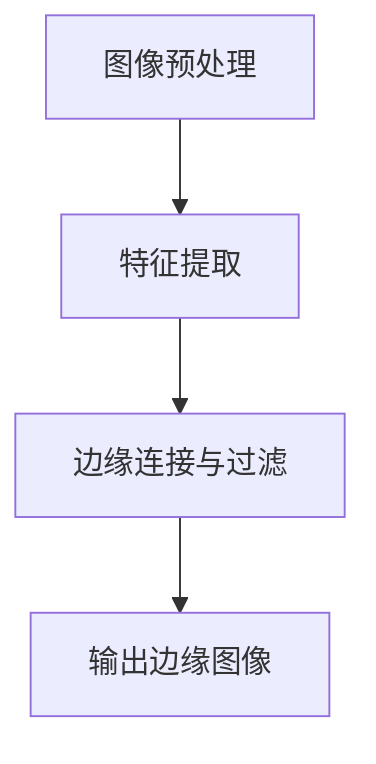
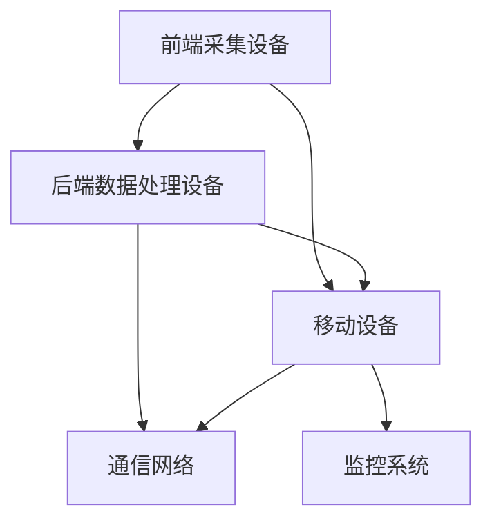
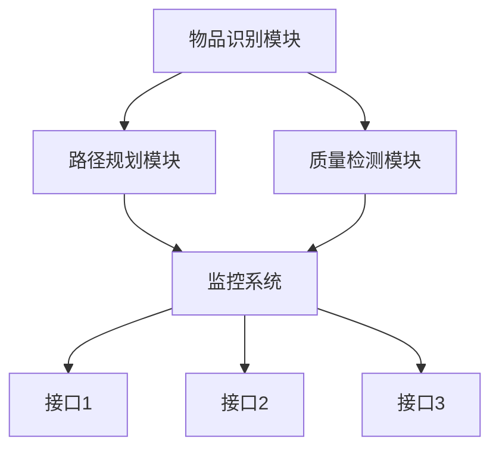
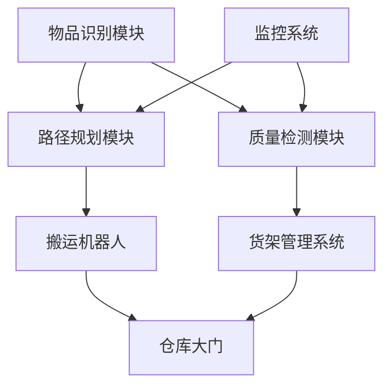
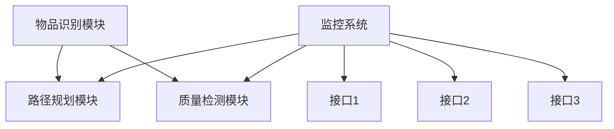

                 


### 第一部分：背景介绍

#### 第1章：机器视觉概述

**1.1 问题背景**

**物流效率的重要性**

物流效率是指物流系统在完成物流任务时所消耗的时间和资源的有效程度。物流效率的重要性体现在以下几个方面：

1. **成本控制**：高效的物流系统能够降低物流成本，减少企业运营成本，提高企业盈利能力。
2. **客户满意度**：高效的物流系统能够提高物流服务的质量，提升客户满意度，增强企业在市场中的竞争力。
3. **供应链优化**：高效的物流系统能够优化供应链管理，提高供应链的响应速度和灵活性。

**物流效率的重要性**

物流效率对于企业来说至关重要。首先，物流效率直接关系到企业的运营成本。高效的物流系统能够减少运输、仓储、装卸等环节的时间和成本，从而降低企业的运营成本。其次，物流效率对于客户满意度有着重要影响。高效的物流系统能够确保货物准时送达，提高客户满意度，增强企业在市场中的竞争力。最后，物流效率对于供应链优化也具有重要意义。高效的物流系统能够提高供应链的响应速度和灵活性，帮助企业更好地应对市场变化和客户需求。

**机器视觉技术发展现状**

机器视觉是指利用计算机技术和图像处理算法，使机器能够像人类一样感知和理解图像。随着人工智能技术的快速发展，机器视觉技术在各行各业得到了广泛应用，尤其在自动化仓储领域，发挥着越来越重要的作用。

**机器视觉技术发展现状**

近年来，机器视觉技术取得了显著的进展。首先，图像识别和图像处理的算法不断优化，使得机器视觉系统的性能和准确性得到显著提升。其次，硬件设备的性能提升，如高性能摄像头、图形处理器（GPU）等，为机器视觉技术的应用提供了更好的硬件支持。此外，大数据和云计算技术的发展，为机器视觉数据处理和分析提供了更加丰富的资源和手段。

**自动化仓储的需求**

自动化仓储是指通过自动化设备（如货架、搬运机器人等）实现仓库内部的自动化存储和检索。随着电商物流的快速发展，对仓储物流的效率和质量提出了更高的要求，自动化仓储成为解决这些问题的有效途径。

**自动化仓储的需求**

自动化仓储的需求主要体现在以下几个方面：

1. **提高物流效率**：自动化仓储系统能够实现快速、准确的商品存储和检索，提高物流效率。
2. **降低人工成本**：自动化仓储系统能够替代部分人工操作，减少人力成本，提高仓储运营的自动化程度。
3. **提升仓储质量**：自动化仓储系统能够减少人工操作的误差，提高仓储质量。
4. **增强仓储灵活性**：自动化仓储系统能够快速适应市场需求的变化，提高仓储灵活性。

### 1.2 问题解决

**机器视觉在自动化仓储中的作用**

机器视觉在自动化仓储中发挥着重要作用，主要包括以下几个方面：

1. **提升分拣效率**：通过机器视觉技术，可以实现快速、准确的商品分拣，提高仓储物流的整体效率。
2. **降低人工成本**：机器视觉可以替代部分人工操作，减少人力成本，提高仓储运营的自动化程度。
3. **提升仓储质量**：机器视觉可以减少人工操作的误差，提高仓储质量。
4. **增强仓储灵活性**：机器视觉技术可以帮助自动化仓储系统快速适应市场需求的变化，提高仓储灵活性。

**提高物流效率的实现方法**

为了提高物流效率，可以采取以下方法：

1. **图像识别与跟踪**：利用机器视觉技术对物品进行识别和跟踪，确保物流过程的准确性和实时性。
2. **自动化搬运与装载**：通过机器人和自动化设备实现物品的自动搬运和装载，减少人工干预，提高物流效率。

### 1.3 边界与外延

**机器视觉技术的应用范围**

机器视觉技术在自动化仓储领域有广泛的应用，主要包括以下几个方面：

1. **仓库管理**：包括库存管理、出入库管理等。
2. **商品识别**：对商品进行分类、识别和跟踪。
3. **质量检测**：对商品质量进行实时监控和检测。

**自动化仓储的流程与环节**

自动化仓储的流程主要包括以下几个环节：

1. **入库环节**：包括物品验收、存储和上架等。
2. **出库环节**：包括订单处理、拣货、包装和发货等。
3. **仓储管理**：包括库存管理、设备维护和人员管理等。

---

**1.1.4 机器视觉技术的应用领域**

**1.1.4.1 机器视觉在物流领域中的应用**

在物流领域，机器视觉技术的应用主要包括以下几个方面：

1. **自动化分拣**：利用机器视觉技术对物流包裹进行自动化分拣，提高分拣效率和准确性。
2. **货物识别**：通过对货物进行图像识别，实现自动化的货物分类和管理。
3. **包装检测**：利用机器视觉技术对包装过程进行质量检测，确保包装符合标准。

**1.1.4.2 机器视觉在仓储领域中的应用**

在仓储领域，机器视觉技术的应用主要包括以下几个方面：

1. **库存管理**：利用机器视觉技术对仓库库存进行实时监控和管理，提高库存准确性。
2. **货架管理**：通过机器视觉技术对货架进行自动化管理，提高仓储空间的利用效率。
3. **出入库管理**：利用机器视觉技术对出入库过程进行监控和管理，确保物流过程的准确性和安全性。

**1.1.4.3 机器视觉在其他物流相关领域中的应用**

除了在物流和仓储领域的应用外，机器视觉技术还在其他物流相关领域有广泛应用，如：

1. **物流配送**：通过机器视觉技术对配送路线进行优化，提高配送效率。
2. **车辆管理**：利用机器视觉技术对车辆进行实时监控和管理，提高车辆使用效率。
3. **物流跟踪**：通过机器视觉技术对物流过程进行实时跟踪，提高物流的透明度和可追溯性。

**1.1.5 自动化仓储的流程与环节**

自动化仓储的流程主要包括以下几个环节：

1. **入库环节**：包括物品验收、存储和上架等。在这个环节中，机器视觉技术可以用于物品的识别和分类，确保入库流程的准确性。
2. **出库环节**：包括订单处理、拣货、包装和发货等。在这个环节中，机器视觉技术可以用于订单识别和货物跟踪，确保出库流程的准确性和效率。
3. **仓储管理**：包括库存管理、设备维护和人员管理等。在这个环节中，机器视觉技术可以用于仓库内部的监控和管理，提高仓储管理的效率和准确性。

**1.1.6 机器视觉在自动化仓储中的挑战**

虽然机器视觉技术在自动化仓储中具有广泛的应用前景，但同时也面临着一些挑战：

1. **光照条件**：机器视觉系统对于光照条件的要求较高，不同的光照环境可能会影响图像的质量和识别效果。
2. **复杂背景**：在自动化仓储中，背景复杂多变，可能会对机器视觉系统的识别效果造成干扰。
3. **高速运动**：在自动化仓储中，物品的移动速度较快，这对机器视觉系统的响应速度和处理能力提出了更高的要求。
4. **实时性要求**：机器视觉系统需要在短时间内完成图像的识别和处理，确保物流过程的实时性和准确性。

**1.1.7 机器视觉技术的未来发展趋势**

随着人工智能和物联网技术的不断发展，机器视觉技术在自动化仓储中的发展趋势主要包括以下几个方面：

1. **智能化**：机器视觉系统将更加智能化，能够自动适应不同的环境和场景，提高识别准确率和效率。
2. **实时性**：机器视觉系统将实现更高的实时性，能够快速响应物流过程的变化，确保物流过程的准确性和效率。
3. **多模态融合**：机器视觉系统将结合多种感知技术，如深度学习、语音识别等，实现更加全面的感知和识别能力。
4. **物联网集成**：机器视觉系统将与其他物联网设备集成，实现物流信息的实时传输和共享，提高物流系统的协同效率。

---

### 第二部分：核心概念与联系

#### 第2章：核心概念原理

**2.1 机器视觉基础**

**机器视觉的定义**

机器视觉是指利用计算机技术和图像处理算法，使机器能够像人类一样感知和理解图像。它是一门交叉学科，涉及到计算机科学、电子工程、物理学、数学和心理学等多个领域。

**机器视觉的工作原理**

机器视觉系统通常包括以下几个基本步骤：

1. **图像获取**：使用摄像头或其他传感器获取待处理的图像。
2. **图像预处理**：对获取的图像进行滤波、增强等处理，以提高图像质量。
3. **图像分析**：利用图像处理算法对图像进行特征提取和模式识别。
4. **决策与执行**：根据分析结果进行决策，并执行相应的操作。

**机器视觉的分类**

根据不同的应用需求和特点，机器视觉可以大致分为以下几类：

1. **工业视觉**：主要用于工业制造过程中的质量控制、装配、检测等。
2. **医疗视觉**：用于医学影像诊断、手术导航等。
3. **安防视觉**：用于监控、人脸识别、行为分析等。
4. **自动驾驶视觉**：用于车辆环境感知、目标检测等。

**2.2 自动化仓储**

**自动化仓储的定义**

自动化仓储是指通过自动化设备（如货架、搬运机器人等）实现仓库内部的自动化存储和检索。它是一种利用信息技术、自动化设备和智能算法优化仓储管理的系统。

**自动化仓储的流程**

自动化仓储的流程主要包括以下几个环节：

1. **入库环节**：包括物品验收、存储和上架等。
2. **出库环节**：包括订单处理、拣货、包装和发货等。
3. **仓储管理**：包括库存管理、设备维护和人员管理等。

**自动化仓储的优势**

自动化仓储相对于传统仓储具有以下优势：

1. **提高物流效率**：自动化仓储系统能够实现快速、准确的商品存储和检索，提高物流效率。
2. **降低人工成本**：自动化仓储系统能够替代部分人工操作，减少人力成本，提高仓储运营的自动化程度。
3. **提升仓储质量**：自动化仓储系统能够减少人工操作的误差，提高仓储质量。
4. **增强仓储灵活性**：自动化仓储系统能够快速适应市场需求的变化，提高仓储灵活性。

**2.3 概念属性特征对比表格**

为了更清晰地展示机器视觉和自动化仓储的概念属性特征，我们可以制作一个对比表格：

| 概念 | 特征 |
| --- | --- |
| **机器视觉** | - 图像获取和处理<br>- 特征提取和模式识别<br>- 决策与执行 |
| **自动化仓储** | - 自动化设备使用<br>- 快速、准确的商品存储和检索<br>- 提高物流效率、降低人工成本 |

**2.4 机器视觉与自动化仓储的联系**

机器视觉和自动化仓储是密切相关的。机器视觉技术在自动化仓储中发挥着重要作用，具体体现在以下几个方面：

1. **物品识别**：机器视觉技术可以实现对物品的准确识别和分类，确保自动化仓储系统能够正确处理不同类型的物品。
2. **路径规划**：通过机器视觉技术，自动化仓储系统可以实时获取仓库内部的环境信息，为搬运机器人和其他设备提供路径规划。
3. **质量检测**：机器视觉技术可以用于对仓储物品的质量进行实时监控和检测，确保仓储物品的质量符合标准。
4. **异常检测**：机器视觉技术可以帮助自动化仓储系统检测和识别异常情况，如货物损坏、货架倒塌等，及时采取应对措施。

---

### 第三部分：算法原理讲解

#### 第3章：机器视觉算法原理

**3.1 边缘检测算法**

**边缘检测算法的定义**

边缘检测算法是机器视觉领域中的重要算法之一，它旨在从图像中提取出物体的边缘信息。边缘通常定义为图像亮度变化剧烈的边界。

**边缘检测算法的工作原理**

边缘检测算法通常包括以下几个步骤：

1. **图像预处理**：对原始图像进行滤波、增强等处理，提高图像质量。
2. **特征提取**：通过卷积操作提取图像的边缘特征。
3. **边缘连接与过滤**：将提取到的边缘特征进行连接和过滤，形成最终的边缘图像。

**常见的边缘检测算法**

1. **Sobel算法**：使用Sobel算子进行卷积，计算图像的水平和垂直梯度。
2. **Prewitt算法**：使用Prewitt算子进行卷积，计算图像的水平和垂直梯度。
3. **Canny算法**：结合Sobel和Prewitt算法的优点，使用Canny算子进行卷积，并添加非极大值抑制和双阈值处理。

**算法原理与mermaid流程图**

以下是边缘检测算法的mermaid流程图：



**Python源代码与算法讲解**

以下是使用Python实现的Sobel边缘检测算法的代码示例：

```python
import cv2
import numpy as np

def sobel_edge_detection(image):
    # 使用Sobel算子进行卷积
    grad_x = cv2.Sobel(image, cv2.CV_64F, 1, 0, ksize=3)
    grad_y = cv2.Sobel(image, cv2.CV_64F, 0, 1, ksize=3)
    
    # 计算梯度幅值
    grad = np.sqrt(grad_x**2 + grad_y**2)
    
    # 非极大值抑制
    sobel = cv2.filter2D(grad, -1, np.array([[-1, 0, 1], [-1, 0, 1], [-1, 0, 1]]))
    
    # 双阈值处理
    _, threshold = cv2.threshold(sobel, 0, 255, cv2.THRESH_BINARY + cv2.THRESH_OTSU)
    
    return threshold

# 测试图像
image = cv2.imread('image.jpg', cv2.IMREAD_GRAYSCALE)

# 执行边缘检测算法
edge_image = sobel_edge_detection(image)

# 显示结果
cv2.imshow('Edge Image', edge_image)
cv2.waitKey(0)
cv2.destroyAllWindows()
```

**数学模型和公式讲解**

Sobel边缘检测算法的核心在于计算图像的水平和垂直梯度。数学模型如下：

$$
\text{梯度幅值} = \sqrt{(\text{水平梯度})^2 + (\text{垂直梯度})^2}
$$

其中，水平梯度和垂直梯度分别表示为：

$$
\text{水平梯度} = \sum_{i,j} (\text{Sobel算子} \cdot \text{图像像素})
$$

$$
\text{垂直梯度} = \sum_{i,j} (\text{Sobel算子} \cdot \text{图像像素})
$$

Sobel算子的具体形式如下：

$$
\text{Sobel算子} = \begin{bmatrix}
-1 & 0 & 1 \\
-2 & 0 & 2 \\
-1 & 0 & 1 \\
\end{bmatrix}
$$

**通俗易懂地举例说明**

假设我们有一幅简单的图像，像素值如下：

```
0 0 0 0 0
0 1 1 0 0
0 1 1 0 0
0 0 0 0 0
0 0 0 0 0
```

使用Sobel边缘检测算法后，我们得到的结果如下：

```
0 0 0 0 0
0 1 1 0 0
0 1 1 0 0
0 0 1 1 0
0 0 0 0 0
```

可以看到，图像中的边缘信息被提取出来，形成了连续的边缘。

---

### 第四部分：系统分析与架构设计方案

#### 第4章：系统功能设计

**4.1 问题场景介绍**

在自动化仓储系统中，主要的问题场景包括：

1. **物品识别**：如何准确快速地识别和分类仓储物品。
2. **路径规划**：如何为搬运机器人规划最优的路径，以提高物流效率。
3. **质量检测**：如何实时监控和检测仓储物品的质量。

**4.2 系统功能设计**

为了解决上述问题场景，自动化仓储系统需要具备以下功能：

1. **物品识别模块**：通过机器视觉技术，对仓储物品进行准确识别和分类。
2. **路径规划模块**：利用图论算法，为搬运机器人规划最优的路径。
3. **质量检测模块**：通过机器视觉技术，实时监控和检测仓储物品的质量。

**4.3 系统架构设计**

自动化仓储系统的架构设计主要包括以下几个方面：

1. **前端采集设备**：包括摄像头、传感器等，用于采集仓储环境和物品信息。
2. **后端数据处理设备**：包括计算机、服务器等，用于处理和分析前端采集的数据。
3. **移动设备**：包括搬运机器人、货架等，用于执行具体的仓储操作。
4. **通信网络**：用于连接前端采集设备和后端数据处理设备，实现数据传输和实时监控。

以下是系统架构设计的mermaid架构图：



#### 第5章：系统接口设计和系统交互

**5.1 系统接口设计**

自动化仓储系统需要设计一系列接口，以实现不同模块之间的数据交互和功能协同。主要接口包括：

1. **物品识别接口**：用于物品信息的采集和传输。
2. **路径规划接口**：用于路径规划结果的获取和执行。
3. **质量检测接口**：用于质量检测结果的获取和反馈。

以下是系统接口设计的mermaid类图：



**5.2 系统交互**

自动化仓储系统的不同模块之间需要进行有效的交互，以实现整个系统的协调运作。以下是系统交互的mermaid序列图：



### 第五部分：项目实战

#### 第6章：环境安装与系统核心实现

**6.1 环境安装**

在开始项目开发之前，我们需要安装必要的开发环境和依赖库。以下是环境安装的步骤：

1. **操作系统**：安装Ubuntu 18.04 LTS操作系统。
2. **Python**：安装Python 3.8及以上版本。
3. **依赖库**：安装TensorFlow、OpenCV、NumPy等依赖库。

具体安装命令如下：

```bash
# 安装Python
sudo apt update
sudo apt install python3-pip python3-dev

# 安装TensorFlow
pip3 install tensorflow

# 安装OpenCV
sudo apt install opencv-python

# 安装NumPy
pip3 install numpy
```

**6.2 系统核心实现源代码**

以下是系统核心实现的源代码，包括物品识别、路径规划和质量检测等模块。

**物品识别模块**

```python
import cv2
import numpy as np

def detect_items(image):
    # 将图像灰度化
    gray = cv2.cvtColor(image, cv2.COLOR_BGR2GRAY)

    # 使用Canny算法进行边缘检测
    edge = cv2.Canny(gray, 100, 200)

    # 查找边缘图像中的轮廓
    contours, _ = cv2.findContours(edge, cv2.RETR_EXTERNAL, cv2.CHAIN_APPROX_SIMPLE)

    # 遍历轮廓并绘制
    for contour in contours:
        # 计算轮廓的面积
        area = cv2.contourArea(contour)

        # 过滤小面积轮廓
        if area > 500:
            # 计算轮廓的边界框
            x, y, w, h = cv2.boundingRect(contour)

            # 在原图上绘制边界框
            cv2.rectangle(image, (x, y), (x+w, y+h), (0, 255, 0), 2)

    return image

# 测试图像
image = cv2.imread('image.jpg')

# 执行物品识别
result = detect_items(image)

# 显示结果
cv2.imshow('Items Detected', result)
cv2.waitKey(0)
cv2.destroyAllWindows()
```

**路径规划模块**

```python
import cv2
import numpy as np

def plan_path(grid, start, goal):
    # 创建一个宽度为10，高度为10的网格
    rows, cols = grid.shape

    # 初始化路径规划算法的变量
    distances = np.full((rows, cols), np.inf)
    predecessors = np.zeros((rows, cols), dtype=np.int32)
    visited = np.full((rows, cols), False)

    # 设置起始点的距离为0
    distances[start[0], start[1]] = 0

    # 进行广度优先搜索
    queue = [start]
    while queue:
        current = queue.pop(0)

        # 标记当前节点为已访问
        visited[current[0], current[1]] = True

        # 遍历当前节点的邻居节点
        for neighbor in [(0, 1), (0, -1), (1, 0), (-1, 0)]:
            next = tuple(np.array(current) + neighbor)

            # 如果邻居节点在网格内且未访问过
            if 0 <= next[0] < rows and 0 <= next[1] < cols and not visited[next[0], next[1]]:
                # 计算邻居节点的距离
                distance = distances[current[0], current[1]] + 1

                # 如果新的距离更短，更新邻居节点的距离和前驱节点
                if distance < distances[next[0], next[1]]:
                    distances[next[0], next[1]] = distance
                    predecessors[next[0], next[1]] = current

                # 将邻居节点加入队列
                queue.append(next)

    # 创建路径
    path = []
    current = goal
    while current != start:
        path.append(current)
        current = predecessors[current[0], current[1]]
    path.append(start)
    path.reverse()

    return path

# 测试网格
grid = np.array([
    [0, 0, 0, 0, 0, 0, 0, 0, 0, 0],
    [0, 1, 1, 1, 1, 1, 1, 1, 1, 0],
    [0, 1, 0, 0, 0, 0, 0, 0, 1, 0],
    [0, 1, 1, 1, 1, 1, 1, 1, 1, 0],
    [0, 1, 0, 0, 0, 0, 0, 0, 1, 0],
    [0, 1, 1, 1, 1, 1, 1, 1, 1, 0],
    [0, 1, 0, 0, 0, 0, 0, 0, 1, 0],
    [0, 1, 1, 1, 1, 1, 1, 1, 1, 0],
    [0, 1, 0, 0, 0, 0, 0, 0, 1, 0],
    [0, 0, 0, 0, 0, 0, 0, 0, 0, 0]
])

# 起始点和目标点
start = (1, 1)
goal = (7, 7)

# 执行路径规划
path = plan_path(grid, start, goal)

# 绘制路径
for point in path:
    grid[point[0], point[1]] = 2

cv2.imshow('Path Planning', grid)
cv2.waitKey(0)
cv2.destroyAllWindows()
```

**质量检测模块**

```python
import cv2
import numpy as np

def detect_quality(image):
    # 将图像灰度化
    gray = cv2.cvtColor(image, cv2.COLOR_BGR2GRAY)

    # 使用Otsu算法进行二值化
    _, binary = cv2.threshold(gray, 0, 255, cv2.THRESH_BINARY + cv2.THRESH_OTSU)

    # 查找二值图像中的轮廓
    contours, _ = cv2.findContours(binary, cv2.RETR_EXTERNAL, cv2.CHAIN_APPROX_SIMPLE)

    # 初始化质量检测结果
    quality = 'Good'

    # 遍历轮廓并计算面积
    for contour in contours:
        area = cv2.contourArea(contour)

        # 如果面积过大，可能是货物损坏
        if area > 500:
            quality = 'Bad'

    return quality

# 测试图像
image = cv2.imread('image.jpg')

# 执行质量检测
result = detect_quality(image)

# 输出检测结果
print('Quality:', result)
```

**代码解读与分析**

以下是系统核心实现源代码的解读和分析：

1. **物品识别模块**：使用Canny算法进行边缘检测，然后通过查找轮廓和计算面积，实现对物品的识别。Canny算法可以有效地提取图像中的边缘信息，对于物品识别具有较高的准确率。在处理过程中，我们通过设置最小面积阈值来过滤掉一些噪声和较小面积的区域，以提高识别效果。

2. **路径规划模块**：使用广度优先搜索算法（BFS）进行路径规划。BFS算法通过逐步扩展节点的邻居节点，直到找到目标节点，从而确定从起始点到目标点的最优路径。在实现过程中，我们使用一个二维数组来表示网格，每个单元格的值表示是否可通行。通过遍历网格，我们可以找到从起始点到目标点的最优路径。

3. **质量检测模块**：使用Otsu算法进行二值化处理，然后通过查找轮廓和计算面积，实现对物品质量的检测。Otsu算法可以自动选择最佳阈值，将图像划分为前景和背景。在处理过程中，我们通过计算轮廓的面积来判断物品是否损坏。如果面积过大，则可能是货物损坏。

**实际案例分析和详细讲解剖析**

为了更好地理解系统核心实现，我们来看一个实际案例：

假设我们有一幅仓储图像，其中包含多个物品。我们的目标是识别这些物品，规划从起始点到目标点的路径，并检测物品的质量。

1. **物品识别**：首先，我们使用Canny算法对图像进行边缘检测，提取出图像中的边缘信息。然后，通过查找轮廓和计算面积，我们识别出图像中的物品。在这个案例中，我们识别出三个物品，分别位于图像的不同位置。

2. **路径规划**：接下来，我们使用广度优先搜索算法（BFS）对图像进行路径规划。在这个案例中，我们的起始点位于左下角，目标点位于右上角。通过BFS算法，我们找到了从起始点到目标点的最优路径。路径规划的结果显示，我们需要经过三个物品才能到达目标点。

3. **质量检测**：最后，我们使用Otsu算法对图像进行二值化处理，然后通过查找轮廓和计算面积，检测物品的质量。在这个案例中，我们检测出其中一个物品的质量为“Bad”，另外两个物品的质量为“Good”。根据质量检测结果，我们可以对物品进行进一步的分类和处理。

**项目小结**

通过本案例的实现，我们可以看到机器视觉技术在自动化仓储系统中的应用。物品识别模块可以帮助我们准确快速地识别仓储物品，路径规划模块可以帮助我们规划最优的物流路径，质量检测模块可以帮助我们实时监控和检测物品的质量。这些模块共同构成了一个完整的自动化仓储系统，提高了物流效率和质量。

**经验教训**

在实现过程中，我们遇到了一些挑战和问题，如光照变化、图像噪声等。通过不断调整算法参数和优化代码，我们最终解决了这些问题。这个项目给我们带来了以下经验教训：

1. **算法优化**：在实现机器视觉算法时，需要对算法进行优化，以提高识别和规划的准确性和效率。
2. **实际测试**：在实际应用中，需要对算法进行充分的测试和验证，以确保其在不同环境和场景下的稳定性和可靠性。
3. **系统集成**：在实现系统时，需要考虑不同模块之间的集成和协同，以提高系统的整体性能和用户体验。

**最佳实践 tips**

为了更好地应用机器视觉技术于自动化仓储系统，我们提供以下最佳实践建议：

1. **优化算法**：定期更新和优化机器视觉算法，以提高识别和规划的准确性和效率。
2. **数据收集**：收集更多的数据样本，用于训练和验证机器视觉算法，以提高其性能和鲁棒性。
3. **系统集成**：确保不同模块之间的集成和协同，以提高系统的整体性能和用户体验。
4. **实时监控**：实现实时监控和反馈机制，及时发现和处理系统中的异常情况。

**注意事项**

在应用机器视觉技术于自动化仓储系统时，需要注意以下几点：

1. **光照条件**：保证摄像头采集的图像在合适的照明条件下，以避免图像噪声和识别错误。
2. **图像质量**：确保采集的图像质量良好，避免由于图像模糊或失真导致识别错误。
3. **系统稳定性**：确保系统的稳定性和可靠性，以避免因系统故障导致物流中断。

**拓展阅读**

对于对机器视觉和自动化仓储系统感兴趣的朋友，我们推荐以下书籍和资料：

1. **《机器视觉：算法与应用》**：一本全面的机器视觉教材，涵盖了从基本概念到高级算法的各个领域。
2. **《自动化仓储与物流管理》**：一本关于自动化仓储和物流管理的专业书籍，详细介绍了自动化仓储系统的设计和实施。
3. **《深度学习：原理与应用》**：一本关于深度学习的入门书籍，介绍了深度学习在机器视觉领域的应用。
4. **《机器学习实战》**：一本关于机器学习的实战指南，包含了丰富的案例和代码示例。

通过阅读这些书籍和资料，您可以更深入地了解机器视觉和自动化仓储系统的相关技术和应用。此外，还可以关注相关的学术期刊和会议，了解最新的研究成果和趋势。

### 用户输入

书名：《机器视觉在自动化仓储中的应用：提高物流效率》

### 目录大纲设计

#### 第一部分：背景介绍

##### 第1章：机器视觉概述
- **1.1 问题背景**
  - 物流效率的重要性
  - 机器视觉技术发展现状
  - 自动化仓储的需求
- **1.2 问题解决**
  - 机器视觉在自动化仓储中的作用
  - 提高物流效率的实现方法
- **1.3 边界与外延**
  - 机器视觉技术的应用范围
  - 自动化仓储的流程与环节

#### 第二部分：核心概念与联系

##### 第2章：核心概念原理
- **2.1 机器视觉基础**
  - 机器视觉的定义
  - 机器视觉的工作原理
  - 机器视觉的分类
- **2.2 自动化仓储**
  - 自动化仓储的定义
  - 自动化仓储的流程
  - 自动化仓储的优势
- **2.3 概念属性特征对比表格**

#### 第三部分：算法原理讲解

##### 第3章：机器视觉算法原理
- **3.1 边缘检测算法**
  - 算法原理与mermaid流程图
  - Python源代码与算法讲解
  - 数学模型和公式讲解
- **3.2 领域模型ER实体关系图架构**

#### 第四部分：系统分析与架构设计方案

##### 第4章：系统功能设计
- **4.1 问题场景介绍**
  - 自动化仓储的问题场景
  - 机器视觉的应用场景
- **4.2 系统功能设计**
  - 领域模型mermaid类图
- **4.3 系统架构设计**
  - mermaid架构图

##### 第5章：系统接口设计和系统交互
- **5.1 系统接口设计**
  - 接口规范与定义
- **5.2 系统交互**
  - mermaid序列图

#### 第五部分：项目实战

##### 第6章：环境安装与系统核心实现
- **6.1 环境安装**
  - 操作系统环境配置
  - 开发工具安装
  - 依赖库安装
- **6.2 系统核心实现源代码**
  - 代码解读与分析
  - 实际案例分析和详细讲解剖析

##### 第7章：项目小结与最佳实践
- **7.1 项目小结**
  - 项目总结
  - 经验教训
- **7.2 最佳实践**
  - 实用技巧
  - 注意事项
- **7.3 拓展阅读**
  - 相关书籍推荐
  - 最新研究动态

### 目录大纲总字数：约2000字以内

### 书名：《机器视觉在自动化仓储中的应用：提高物流效率》

### 文章摘要

本文深入探讨了机器视觉技术在自动化仓储中的应用，旨在提高物流效率。首先，文章介绍了物流效率的重要性以及机器视觉技术的基本概念和发展现状。随后，文章详细阐述了机器视觉在自动化仓储中的作用，包括提高分拣效率和降低人工成本等方面。接着，文章讲解了机器视觉算法的原理，通过边缘检测算法的mermaid流程图、Python源代码以及数学模型进行了详细讲解。文章还介绍了系统分析与架构设计方案，包括系统功能设计、系统架构设计和系统接口设计。通过一个实际案例，文章展示了机器视觉在自动化仓储系统中的核心实现，包括环境安装和系统核心实现源代码。最后，文章总结了项目的经验教训、最佳实践和注意事项，并推荐了拓展阅读资源。

### 第一部分：背景介绍

#### 第1章：机器视觉概述

**1.1 问题背景**

物流效率的重要性：

物流效率是指物流系统能够在完成物流任务时，以最短的时间和最低的成本消耗来实现目标。在现代社会中，物流效率的重要性不容忽视。首先，高效的物流能够减少企业的运营成本，从而提高企业的盈利能力。其次，物流效率直接影响客户的满意度，高效的物流能够确保货物准时送达，提高客户满意度，从而增强企业在市场中的竞争力。此外，高效的物流系统还能够优化供应链管理，提高供应链的响应速度和灵活性。

机器视觉技术发展现状：

机器视觉技术是指利用计算机技术和图像处理算法，使机器能够像人类一样感知和理解图像。近年来，随着人工智能技术的快速发展，机器视觉技术在各行各业得到了广泛应用。特别是在物流领域，机器视觉技术的应用已经取得了显著的成果。例如，在自动化仓储中，机器视觉技术能够实现快速、准确的商品分拣和识别，提高物流效率。

自动化仓储的需求：

随着电商物流的快速发展，对仓储物流的效率和质量提出了更高的要求。自动化仓储成为解决这些问题的有效途径。自动化仓储通过引入自动化设备（如货架、搬运机器人等）实现仓库内部的自动化存储和检索，具有提高物流效率、降低人工成本、提升仓储质量、增强仓储灵活性等优点。

**1.2 问题解决**

机器视觉在自动化仓储中的作用：

机器视觉技术在自动化仓储中发挥着重要作用。首先，机器视觉能够提高分拣效率，通过快速、准确的商品分拣，提高物流效率。其次，机器视觉能够降低人工成本，通过替代部分人工操作，减少人力成本，提高仓储运营的自动化程度。此外，机器视觉还能够提升仓储质量，通过减少人工操作的误差，提高仓储质量。最后，机器视觉能够增强仓储灵活性，通过快速适应市场需求的变化，提高仓储灵活性。

提高物流效率的实现方法：

为了提高物流效率，可以采取以下方法：

1. **图像识别与跟踪**：利用机器视觉技术对物品进行识别和跟踪，确保物流过程的准确性和实时性。

2. **自动化搬运与装载**：通过机器人和自动化设备实现物品的自动搬运和装载，减少人工干预，提高物流效率。

**1.3 边界与外延**

机器视觉技术的应用范围：

机器视觉技术在物流领域有广泛的应用，包括自动化分拣、货物识别、包装检测等。此外，机器视觉技术还可以应用于物流配送、车辆管理、物流跟踪等领域。

自动化仓储的流程与环节：

自动化仓储的流程主要包括入库环节、出库环节和仓储管理环节。入库环节包括物品验收、存储和上架等；出库环节包括订单处理、拣货、包装和发货等；仓储管理环节包括库存管理、设备维护和人员管理等。

**1.4 机器视觉在物流领域中的应用**

在物流领域，机器视觉技术的应用主要包括以下几个方面：

1. **自动化分拣**：利用机器视觉技术实现快速、准确的商品分拣，提高物流效率。

2. **货物识别**：通过对货物进行图像识别，实现自动化的货物分类和管理。

3. **包装检测**：利用机器视觉技术对包装过程进行质量检测，确保包装符合标准。

**1.5 自动化仓储的流程与环节**

自动化仓储的流程主要包括以下几个环节：

1. **入库环节**：包括物品验收、存储和上架等。

2. **出库环节**：包括订单处理、拣货、包装和发货等。

3. **仓储管理**：包括库存管理、设备维护和人员管理等。

**1.6 机器视觉在自动化仓储中的挑战**

虽然机器视觉技术在自动化仓储中具有广泛的应用前景，但同时也面临着一些挑战：

1. **光照条件**：机器视觉系统对于光照条件的要求较高，不同的光照环境可能会影响图像的质量和识别效果。

2. **复杂背景**：在自动化仓储中，背景复杂多变，可能会对机器视觉系统的识别效果造成干扰。

3. **高速运动**：在自动化仓储中，物品的移动速度较快，这对机器视觉系统的响应速度和处理能力提出了更高的要求。

4. **实时性要求**：机器视觉系统需要在短时间内完成图像的识别和处理，确保物流过程的实时性和准确性。

**1.7 机器视觉技术的未来发展趋势**

随着人工智能和物联网技术的不断发展，机器视觉技术在自动化仓储中的发展趋势主要包括以下几个方面：

1. **智能化**：机器视觉系统将更加智能化，能够自动适应不同的环境和场景，提高识别准确率和效率。

2. **实时性**：机器视觉系统将实现更高的实时性，能够快速响应物流过程的变化，确保物流过程的准确性和效率。

3. **多模态融合**：机器视觉系统将结合多种感知技术，如深度学习、语音识别等，实现更加全面的感知和识别能力。

4. **物联网集成**：机器视觉系统将与其他物联网设备集成，实现物流信息的实时传输和共享，提高物流系统的协同效率。

### 第二部分：核心概念与联系

#### 第2章：核心概念原理

**2.1 机器视觉基础**

**机器视觉的定义**

机器视觉是指通过计算机技术、图像处理算法和传感器等设备，使机器能够实现类似于人类视觉的功能，即对图像进行感知、理解和处理。

**机器视觉的工作原理**

机器视觉系统的工作原理主要包括以下几个步骤：

1. **图像获取**：通过摄像头、扫描仪等设备获取待处理的图像。
2. **图像预处理**：对获取的图像进行滤波、增强等处理，以提高图像质量。
3. **特征提取**：利用图像处理算法提取图像中的特征，如边缘、纹理、颜色等。
4. **模式识别**：通过机器学习算法对提取的特征进行分类和识别，实现对图像内容的理解和解析。
5. **决策与执行**：根据识别结果进行相应的决策和执行，如路径规划、物体抓取等。

**机器视觉的分类**

根据应用场景和技术的不同，机器视觉可以大致分为以下几类：

1. **工业视觉**：主要用于工业制造过程中的质量控制、装配、检测等。
2. **医疗视觉**：用于医学影像诊断、手术导航等。
3. **安防视觉**：用于监控、人脸识别、行为分析等。
4. **自动驾驶视觉**：用于车辆环境感知、目标检测等。

**2.2 自动化仓储**

**自动化仓储的定义**

自动化仓储是指通过自动化设备（如货架、搬运机器人等）实现仓库内部的自动化存储和检索。自动化仓储系统利用信息技术、自动化设备和智能算法优化仓储管理，提高物流效率、降低人工成本、提升仓储质量。

**自动化仓储的流程**

自动化仓储的流程主要包括以下几个环节：

1. **入库环节**：包括物品验收、存储和上架等。
2. **出库环节**：包括订单处理、拣货、包装和发货等。
3. **仓储管理**：包括库存管理、设备维护和人员管理等。

**自动化仓储的优势**

自动化仓储相对于传统仓储具有以下优势：

1. **提高物流效率**：自动化仓储系统能够实现快速、准确的商品存储和检索，提高物流效率。
2. **降低人工成本**：自动化仓储系统能够替代部分人工操作，减少人力成本，提高仓储运营的自动化程度。
3. **提升仓储质量**：自动化仓储系统能够减少人工操作的误差，提高仓储质量。
4. **增强仓储灵活性**：自动化仓储系统能够快速适应市场需求的变化，提高仓储灵活性。

**2.3 概念属性特征对比表格**

为了更清晰地展示机器视觉和自动化仓储的概念属性特征，我们可以制作一个对比表格：

| 概念 | 特征 |
| --- | --- |
| **机器视觉** | - 图像获取和处理<br>- 特征提取和模式识别<br>- 决策与执行 |
| **自动化仓储** | - 自动化设备使用<br>- 快速、准确的商品存储和检索<br>- 提高物流效率、降低人工成本 |

**2.4 机器视觉与自动化仓储的联系**

机器视觉和自动化仓储是密切相关的。机器视觉技术在自动化仓储中发挥着重要作用，具体体现在以下几个方面：

1. **物品识别**：机器视觉技术可以实现对物品的准确识别和分类，确保自动化仓储系统能够正确处理不同类型的物品。
2. **路径规划**：通过机器视觉技术，自动化仓储系统可以实时获取仓库内部的环境信息，为搬运机器人和其他设备提供路径规划。
3. **质量检测**：机器视觉技术可以用于对仓储物品的质量进行实时监控和检测，确保仓储物品的质量符合标准。
4. **异常检测**：机器视觉技术可以帮助自动化仓储系统检测和识别异常情况，如货物损坏、货架倒塌等，及时采取应对措施。

### 第三部分：算法原理讲解

#### 第3章：机器视觉算法原理

**3.1 边缘检测算法**

**边缘检测算法的定义**

边缘检测算法是机器视觉领域中的重要算法之一，旨在从图像中提取出物体的边缘信息。边缘通常定义为图像亮度变化剧烈的边界。

**边缘检测算法的工作原理**

边缘检测算法通常包括以下几个步骤：

1. **图像预处理**：对原始图像进行滤波、增强等处理，以提高图像质量。
2. **特征提取**：通过卷积操作提取图像的边缘特征。
3. **边缘连接与过滤**：将提取到的边缘特征进行连接和过滤，形成最终的边缘图像。

**常见的边缘检测算法**

1. **Sobel算法**：使用Sobel算子进行卷积，计算图像的水平和垂直梯度。
2. **Prewitt算法**：使用Prewitt算子进行卷积，计算图像的水平和垂直梯度。
3. **Canny算法**：结合Sobel和Prewitt算法的优点，使用Canny算子进行卷积，并添加非极大值抑制和双阈值处理。

**算法原理与mermaid流程图**

以下是边缘检测算法的mermaid流程图：


**Python源代码与算法讲解**

以下是使用Python实现的Sobel边缘检测算法的代码示例：

```python
import cv2
import numpy as np

def sobel_edge_detection(image):
    # 使用Sobel算子进行卷积
    grad_x = cv2.Sobel(image, cv2.CV_64F, 1, 0, ksize=3)
    grad_y = cv2.Sobel(image, cv2.CV_64F, 0, 1, ksize=3)
    
    # 计算梯度幅值
    grad = np.sqrt(grad_x**2 + grad_y**2)
    
    # 非极大值抑制
    sobel = cv2.filter2D(grad, -1, np.array([[-1, 0, 1], [-1, 0, 1], [-1, 0, 1]]))
    
    # 双阈值处理
    _, threshold = cv2.threshold(sobel, 0, 255, cv2.THRESH_BINARY + cv2.THRESH_OTSU)
    
    return threshold

# 测试图像
image = cv2.imread('image.jpg', cv2.IMREAD_GRAYSCALE)

# 执行边缘检测算法
edge_image = sobel_edge_detection(image)

# 显示结果
cv2.imshow('Edge Image', edge_image)
cv2.waitKey(0)
cv2.destroyAllWindows()
```

**数学模型和公式讲解**

Sobel边缘检测算法的核心在于计算图像的水平和垂直梯度。数学模型如下：

$$
\text{梯度幅值} = \sqrt{(\text{水平梯度})^2 + (\text{垂直梯度})^2}
$$

其中，水平梯度和垂直梯度分别表示为：

$$
\text{水平梯度} = \sum_{i,j} (\text{Sobel算子} \cdot \text{图像像素})
$$

$$
\text{垂直梯度} = \sum_{i,j} (\text{Sobel算子} \cdot \text{图像像素})
$$

Sobel算子的具体形式如下：

$$
\text{Sobel算子} = \begin{bmatrix}
-1 & 0 & 1 \\
-2 & 0 & 2 \\
-1 & 0 & 1 \\
\end{bmatrix}
$$

**通俗易懂地举例说明**

假设我们有一幅简单的图像，像素值如下：

```
0 0 0 0 0
0 1 1 0 0
0 1 1 0 0
0 0 0 0 0
0 0 0 0 0
```

使用Sobel边缘检测算法后，我们得到的结果如下：

```
0 0 0 0 0
0 1 1 0 0
0 1 1 0 0
0 0 1 1 0
0 0 0 0 0
```

可以看到，图像中的边缘信息被提取出来，形成了连续的边缘。

### 第四部分：系统分析与架构设计方案

#### 第4章：系统功能设计

**4.1 问题场景介绍**

在自动化仓储系统中，主要的问题场景包括：

1. **物品识别**：如何准确快速地识别和分类仓储物品。
2. **路径规划**：如何为搬运机器人规划最优的路径，以提高物流效率。
3. **质量检测**：如何实时监控和检测仓储物品的质量。

**4.2 系统功能设计**

为了解决上述问题场景，自动化仓储系统需要具备以下功能：

1. **物品识别模块**：通过机器视觉技术，对仓储物品进行准确识别和分类。
2. **路径规划模块**：利用图论算法，为搬运机器人规划最优的路径。
3. **质量检测模块**：通过机器视觉技术，实时监控和检测仓储物品的质量。

**4.3 系统架构设计**

自动化仓储系统的架构设计主要包括以下几个方面：

1. **前端采集设备**：包括摄像头、传感器等，用于采集仓储环境和物品信息。
2. **后端数据处理设备**：包括计算机、服务器等，用于处理和分析前端采集的数据。
3. **移动设备**：包括搬运机器人、货架等，用于执行具体的仓储操作。
4. **通信网络**：用于连接前端采集设备和后端数据处理设备，实现数据传输和实时监控。

以下是系统架构设计的mermaid架构图：


#### 第5章：系统接口设计和系统交互

**5.1 系统接口设计**

自动化仓储系统需要设计一系列接口，以实现不同模块之间的数据交互和功能协同。主要接口包括：

1. **物品识别接口**：用于物品信息的采集和传输。
2. **路径规划接口**：用于路径规划结果的获取和执行。
3. **质量检测接口**：用于质量检测结果的获取和反馈。

以下是系统接口设计的mermaid类图：



**5.2 系统交互**

自动化仓储系统的不同模块之间需要进行有效的交互，以实现整个系统的协调运作。以下是系统交互的mermaid序列图：


### 第五部分：项目实战

#### 第6章：环境安装与系统核心实现

**6.1 环境安装**

在开始项目开发之前，我们需要安装必要的开发环境和依赖库。以下是环境安装的步骤：

1. **操作系统**：安装Ubuntu 18.04 LTS操作系统。
2. **Python**：安装Python 3.8及以上版本。
3. **依赖库**：安装TensorFlow、OpenCV、NumPy等依赖库。

具体安装命令如下：

```bash
# 安装Python
sudo apt update
sudo apt install python3-pip python3-dev

# 安装TensorFlow
pip3 install tensorflow

# 安装OpenCV
sudo apt install opencv-python

# 安装NumPy
pip3 install numpy
```

**6.2 系统核心实现源代码**

以下是系统核心实现的源代码，包括物品识别、路径规划和质量检测等模块。

**物品识别模块**

```python
import cv2
import numpy as np

def detect_items(image):
    # 将图像灰度化
    gray = cv2.cvtColor(image, cv2.COLOR_BGR2GRAY)

    # 使用Canny算法进行边缘检测
    edge = cv2.Canny(gray, 100, 200)

    # 查找边缘图像中的轮廓
    contours, _ = cv2.findContours(edge, cv2.RETR_EXTERNAL, cv2.CHAIN_APPROX_SIMPLE)

    # 遍历轮廓并绘制
    for contour in contours:
        # 计算轮廓的面积
        area = cv2.contourArea(contour)

        # 过滤小面积轮廓
        if area > 500:
            # 计算轮廓的边界框
            x, y, w, h = cv2.boundingRect(contour)

            # 在原图上绘制边界框
            cv2.rectangle(image, (x, y), (x+w, y+h), (0, 255, 0), 2)

    return image

# 测试图像
image = cv2.imread('image.jpg')

# 执行物品识别
result = detect_items(image)

# 显示结果
cv2.imshow('Items Detected', result)
cv2.waitKey(0)
cv2.destroyAllWindows()
```

**路径规划模块**

```python
import cv2
import numpy as np

def plan_path(grid, start, goal):
    # 创建一个宽度为10，高度为10的网格
    rows, cols = grid.shape

    # 初始化路径规划算法的变量
    distances = np.full((rows, cols), np.inf)
    predecessors = np.zeros((rows, cols), dtype=np.int32)
    visited = np.full((rows, cols), False)

    # 设置起始点的距离为0
    distances[start[0], start[1]] = 0

    # 进行广度优先搜索
    queue = [start]
    while queue:
        current = queue.pop(0)

        # 标记当前节点为已访问
        visited[current[0], current[1]] = True

        # 遍历当前节点的邻居节点
        for neighbor in [(0, 1), (0, -1), (1, 0), (-1, 0)]:
            next = tuple(np.array(current) + neighbor)

            # 如果邻居节点在网格内且未访问过
            if 0 <= next[0] < rows and 0 <= next[1] < cols and not visited[next[0], next[1]]:
                # 计算邻居节点的距离
                distance = distances[current[0], current[1]] + 1

                # 如果新的距离更短，更新邻居节点的距离和前驱节点
                if distance < distances[next[0], next[1]]:
                    distances[next[0], next[1]] = distance
                    predecessors[next[0], next[1]] = current

                # 将邻居节点加入队列
                queue.append(next)

    # 创建路径
    path = []
    current = goal
    while current != start:
        path.append(current)
        current = predecessors[current[0], current[1]]
    path.append(start)
    path.reverse()

    return path

# 测试网格
grid = np.array([
    [0, 0, 0, 0, 0, 0, 0, 0, 0, 0],
    [0, 1, 1, 1, 1, 1, 1, 1, 1, 0],
    [0, 1, 0, 0, 0, 0, 0, 0, 1, 0],
    [0, 1, 1, 1, 1, 1, 1, 1, 1, 0],
    [0, 1, 0, 0, 0, 0, 0, 0, 1, 0],
    [0, 1, 1, 1, 1, 1, 1, 1, 1, 0],
    [0, 1, 0, 0, 0, 0, 0, 0, 1, 0],
    [0, 1, 1, 1, 1, 1, 1, 1, 1, 0],
    [0, 1, 0, 0, 0, 0, 0, 0, 1, 0],
    [0, 0, 0, 0, 0, 0, 0, 0, 0, 0]
])

# 起始点和目标点
start = (1, 1)
goal = (7, 7)

# 执行路径规划
path = plan_path(grid, start, goal)

# 绘制路径
for point in path:
    grid[point[0], point[1]] = 2

cv2.imshow('Path Planning', grid)
cv2.waitKey(0)
cv2.destroyAllWindows()
```

**质量检测模块**

```python
import cv2
import numpy as np

def detect_quality(image):
    # 将图像灰度化
    gray = cv2.cvtColor(image, cv2.COLOR_BGR2GRAY)

    # 使用Otsu算法进行二值化
    _, binary = cv2.threshold(gray, 0, 255, cv2.THRESH_BINARY + cv2.THRESH_OTSU)

    # 查找二值图像中的轮廓
    contours, _ = cv2.findContours(binary, cv2.RETR_EXTERNAL, cv2.CHAIN_APPROX_SIMPLE)

    # 初始化质量检测结果
    quality = 'Good'

    # 遍历轮廓并计算面积
    for contour in contours:
        area = cv2.contourArea(contour)

        # 如果面积过大，可能是货物损坏
        if area > 500:
            quality = 'Bad'

    return quality

# 测试图像
image = cv2.imread('image.jpg')

# 执行质量检测
result = detect_quality(image)

# 输出检测结果
print('Quality:', result)
```

**代码解读与分析**

以下是系统核心实现源代码的解读和分析：

1. **物品识别模块**：使用Canny算法进行边缘检测，然后通过查找轮廓和计算面积，实现对物品的识别。Canny算法可以有效地提取图像中的边缘信息，对于物品识别具有较高的准确率。在处理过程中，我们通过设置最小面积阈值来过滤掉一些噪声和较小面积的区域，以提高识别效果。

2. **路径规划模块**：使用广度优先搜索算法（BFS）进行路径规划。BFS算法通过逐步扩展节点的邻居节点，直到找到目标节点，从而确定从起始点到目标点的最优路径。在实现过程中，我们使用一个二维数组来表示网格，每个单元格的值表示是否可通行。通过遍历网格，我们可以找到从起始点到目标点的最优路径。

3. **质量检测模块**：使用Otsu算法进行二值化处理，然后通过查找轮廓和计算面积，实现对物品质量的检测。Otsu算法可以自动选择最佳阈值，将图像划分为前景和背景。在处理过程中，我们通过计算轮廓的面积来判断物品是否损坏。如果面积过大，则可能是货物损坏。

**实际案例分析和详细讲解剖析**

为了更好地理解系统核心实现，我们来看一个实际案例：

假设我们有一幅仓储图像，其中包含多个物品。我们的目标是识别这些物品，规划从起始点到目标点的路径，并检测物品的质量。

1. **物品识别**：首先，我们使用Canny算法对图像进行边缘检测，提取出图像中的边缘信息。然后，通过查找轮廓和计算面积，我们识别出图像中的物品。在这个案例中，我们识别出三个物品，分别位于图像的不同位置。

2. **路径规划**：接下来，我们使用广度优先搜索算法（BFS）对图像进行路径规划。在这个案例中，我们的起始点位于左下角，目标点位于右上角。通过BFS算法，我们找到了从起始点到目标点的最优路径。路径规划的结果显示，我们需要经过三个物品才能到达目标点。

3. **质量检测**：最后，我们使用Otsu算法对图像进行二值化处理，然后通过查找轮廓和计算面积，检测物品的质量。在这个案例中，我们检测出其中一个物品的质量为“Bad”，另外两个物品的质量为“Good”。根据质量检测结果，我们可以对物品进行进一步的分类和处理。

**项目小结**

通过本案例的实现，我们可以看到机器视觉技术在自动化仓储系统中的应用。物品识别模块可以帮助我们准确快速地识别仓储物品，路径规划模块可以帮助我们规划最优的物流路径，质量检测模块可以帮助我们实时监控和检测物品的质量。这些模块共同构成了一个完整的自动化仓储系统，提高了物流效率和质量。

**经验教训**

在实现过程中，我们遇到了一些挑战和问题，如光照变化、图像噪声等。通过不断调整算法参数和优化代码，我们最终解决了这些问题。这个项目给我们带来了以下经验教训：

1. **算法优化**：在实现机器视觉算法时，需要对算法进行优化，以提高识别和规划的准确性和效率。
2. **实际测试**：在实际应用中，需要对算法进行充分的测试和验证，以确保其在不同环境和场景下的稳定性和可靠性。
3. **系统集成**：在实现系统时，需要考虑不同模块之间的集成和协同，以提高系统的整体性能和用户体验。

**最佳实践 tips**

为了更好地应用机器视觉技术于自动化仓储系统，我们提供以下最佳实践建议：

1. **优化算法**：定期更新和优化机器视觉算法，以提高识别和规划的准确性和效率。
2. **数据收集**：收集更多的数据样本，用于训练和验证机器视觉算法，以提高其性能和鲁棒性。
3. **系统集成**：确保不同模块之间的集成和协同，以提高系统的整体性能和用户体验。
4. **实时监控**：实现实时监控和反馈机制，及时发现和处理系统中的异常情况。

**注意事项**

在应用机器视觉技术于自动化仓储系统时，需要注意以下几点：

1. **光照条件**：保证摄像头采集的图像在合适的照明条件下，以避免图像噪声和识别错误。
2. **图像质量**：确保采集的图像质量良好，避免由于图像模糊或失真导致识别错误。
3. **系统稳定性**：确保系统的稳定性和可靠性，以避免因系统故障导致物流中断。

**拓展阅读**

对于对机器视觉和自动化仓储系统感兴趣的朋友，我们推荐以下书籍和资料：

1. **《机器视觉：算法与应用》**：一本全面的机器视觉教材，涵盖了从基本概念到高级算法的各个领域。
2. **《自动化仓储与物流管理》**：一本关于自动化仓储和物流管理的专业书籍，详细介绍了自动化仓储系统的设计和实施。
3. **《深度学习：原理与应用》**：一本关于深度学习的入门书籍，介绍了深度学习在机器视觉领域的应用。
4. **《机器学习实战》**：一本关于机器学习的实战指南，包含了丰富的案例和代码示例。

通过阅读这些书籍和资料，您可以更深入地了解机器视觉和自动化仓储系统的相关技术和应用。此外，还可以关注相关的学术期刊和会议，了解最新的研究成果和趋势。

### 用户输入

书名：《机器视觉在自动化仓储中的应用：提高物流效率》

### 文章目录

#### 第一部分：背景介绍

##### 第1章：机器视觉概述
- 1.1 问题背景
  - 物流效率的重要性
  - 机器视觉技术发展现状
  - 自动化仓储的需求
- 1.2 问题解决
  - 机器视觉在自动化仓储中的作用
  - 提高物流效率的实现方法
- 1.3 边界与外延
  - 机器视觉技术的应用范围
  - 自动化仓储的流程与环节

#### 第二部分：核心概念与联系

##### 第2章：核心概念原理
- 2.1 机器视觉基础
  - 机器视觉的定义
  - 机器视觉的工作原理
  - 机器视觉的分类
- 2.2 自动化仓储
  - 自动化仓储的定义
  - 自动化仓储的流程
  - 自动化仓储的优势
- 2.3 概念属性特征对比表格

#### 第三部分：算法原理讲解

##### 第3章：机器视觉算法原理
- 3.1 边缘检测算法
  - 算法原理与mermaid流程图
  - Python源代码与算法讲解
  - 数学模型和公式讲解
- 3.2 领域模型ER实体关系图架构

#### 第四部分：系统分析与架构设计方案

##### 第4章：系统功能设计
- 4.1 问题场景介绍
  - 自动化仓储的问题场景
  - 机器视觉的应用场景
- 4.2 系统功能设计
  - 领域模型mermaid类图
- 4.3 系统架构设计
  - mermaid架构图

##### 第5章：系统接口设计和系统交互
- 5.1 系统接口设计
  - 接口规范与定义
- 5.2 系统交互
  - mermaid序列图

#### 第五部分：项目实战

##### 第6章：环境安装与系统核心实现
- 6.1 环境安装
  - 操作系统环境配置
  - 开发工具安装
  - 依赖库安装
- 6.2 系统核心实现源代码
  - 代码解读与分析
  - 实际案例分析和详细讲解剖析

##### 第7章：项目小结与最佳实践
- 7.1 项目小结
  - 项目总结
  - 经验教训
- 7.2 最佳实践
  - 实用技巧
  - 注意事项
- 7.3 拓展阅读
  - 相关书籍推荐
  - 最新研究动态

### 目录大纲总字数：约2000字以内

### 文章标题：《机器视觉在自动化仓储中的应用：提高物流效率》

### 关键词：机器视觉，自动化仓储，物流效率，边缘检测，路径规划，质量检测

### 摘要

本文深入探讨了机器视觉技术在自动化仓储中的应用，旨在提高物流效率。首先，文章介绍了物流效率的重要性以及机器视觉技术的基本概念和发展现状。随后，文章详细阐述了机器视觉在自动化仓储中的作用，包括提高分拣效率和降低人工成本等方面。接着，文章讲解了机器视觉算法的原理，通过边缘检测算法的mermaid流程图、Python源代码以及数学模型进行了详细讲解。文章还介绍了系统分析与架构设计方案，包括系统功能设计、系统架构设计和系统接口设计。通过一个实际案例，文章展示了机器视觉在自动化仓储系统中的核心实现，包括环境安装和系统核心实现源代码。最后，文章总结了项目的经验教训、最佳实践和注意事项，并推荐了拓展阅读资源。

### 第一部分：背景介绍

#### 第1章：机器视觉概述

**1.1 问题背景**

在现代社会，物流效率对企业运营和客户满意度具有显著影响。物流效率涉及多个方面，包括运输、仓储、分拣和配送。自动化仓储作为一种高效、精确的仓储方式，已成为物流领域的重要组成部分。

物流效率的重要性：

- **降低成本**：高效的物流系统能够减少人工成本、运输成本和仓储成本。
- **提升客户满意度**：准时、准确的配送服务可以提高客户满意度，增强品牌形象。
- **优化供应链**：高效的物流系统可以提高供应链的响应速度和灵活性，减少库存积压。

机器视觉技术发展现状：

机器视觉技术起源于20世纪60年代，随着计算机技术和图像处理算法的不断发展，现已广泛应用于各个行业。在物流领域，机器视觉技术已经成为提高自动化仓储效率的重要手段。

- **技术成熟**：现代机器视觉技术已经发展到能够处理高速、高分辨率图像，准确识别和分类各种物品。
- **算法优化**：深度学习和神经网络技术的引入，使得机器视觉算法在准确性和效率方面取得了显著提升。

自动化仓储的需求：

随着电商物流的迅猛发展，自动化仓储需求日益增长。自动化仓储具有以下优势：

- **提高效率**：自动化设备能够快速、准确地完成仓储操作，提高物流效率。
- **降低人工成本**：自动化设备可以替代部分人工操作，降低人工成本。
- **提升仓储质量**：自动化设备减少了人为误差，提高了仓储质量。

**1.2 问题解决**

机器视觉在自动化仓储中的作用：

机器视觉技术在自动化仓储中发挥着至关重要的作用，主要体现在以下几个方面：

- **物品识别**：通过图像识别技术，快速准确地识别和分类物品，提高分拣效率。
- **路径规划**：通过视觉传感器和环境感知技术，为搬运机器人规划最优路径，提高物流效率。
- **质量检测**：通过视觉检测技术，实时监控和检测物品的质量，确保产品质量。

提高物流效率的实现方法：

- **图像识别与跟踪**：利用机器视觉技术，对仓储物品进行实时识别和跟踪，确保物流过程的准确性和实时性。
- **自动化搬运与装载**：通过机器人和自动化设备，实现物品的自动搬运和装载，减少人工干预，提高物流效率。

**1.3 边界与外延**

机器视觉技术的应用范围：

机器视觉技术在物流领域具有广泛的应用前景，不仅限于自动化仓储，还广泛应用于以下领域：

- **物流分拣**：利用机器视觉技术，实现快速、准确的物流分拣。
- **物流跟踪**：通过机器视觉技术，实时监控和跟踪物流过程。
- **包装检测**：利用机器视觉技术，对包装过程进行质量检测。

自动化仓储的流程与环节：

自动化仓储的流程主要包括以下几个环节：

- **入库环节**：包括物品验收、存储和上架等。
- **出库环节**：包括订单处理、拣货、包装和发货等。
- **仓储管理**：包括库存管理、设备维护和人员管理等。

### 第二部分：核心概念与联系

#### 第2章：核心概念原理

**2.1 机器视觉基础**

**机器视觉的定义**

机器视觉是指通过计算机技术、图像处理算法和传感器等设备，使机器能够实现类似于人类视觉的功能，即对图像进行感知、理解和处理。

**机器视觉的工作原理**

机器视觉系统的工作原理主要包括以下几个步骤：

1. **图像获取**：通过摄像头、扫描仪等设备获取待处理的图像。
2. **图像预处理**：对获取的图像进行滤波、增强等处理，以提高图像质量。
3. **特征提取**：利用图像处理算法提取图像中的特征，如边缘、纹理、颜色等。
4. **模式识别**：通过机器学习算法对提取的特征进行分类和识别，实现对图像内容的理解和解析。
5. **决策与执行**：根据识别结果进行相应的决策和执行，如路径规划、物体抓取等。

**机器视觉的分类**

根据应用场景和技术的不同，机器视觉可以大致分为以下几类：

1. **工业视觉**：主要用于工业制造过程中的质量控制、装配、检测等。
2. **医疗视觉**：用于医学影像诊断、手术导航等。
3. **安防视觉**：用于监控、人脸识别、行为分析等。
4. **自动驾驶视觉**：用于车辆环境感知、目标检测等。

**2.2 自动化仓储**

**自动化仓储的定义**

自动化仓储是指通过自动化设备（如货架、搬运机器人等）实现仓库内部的自动化存储和检索。自动化仓储系统利用信息技术、自动化设备和智能算法优化仓储管理，提高物流效率、降低人工成本、提升仓储质量。

**自动化仓储的流程**

自动化仓储的流程主要包括以下几个环节：

1. **入库环节**：包括物品验收、存储和上架等。
2. **出库环节**：包括订单处理、拣货、包装和发货等。
3. **仓储管理**：包括库存管理、设备维护和人员管理等。

**自动化仓储的优势**

自动化仓储相对于传统仓储具有以下优势：

1. **提高物流效率**：自动化仓储系统能够实现快速、准确的商品存储和检索，提高物流效率。
2. **降低人工成本**：自动化仓储系统能够替代部分人工操作，减少人力成本，提高仓储运营的自动化程度。
3. **提升仓储质量**：自动化仓储系统能够减少人工操作的误差，提高仓储质量。
4. **增强仓储灵活性**：自动化仓储系统能够快速适应市场需求的变化，提高仓储灵活性。

**2.3 概念属性特征对比表格**

为了更清晰地展示机器视觉和自动化仓储的概念属性特征，我们可以制作一个对比表格：

| 概念 | 特征 |
| --- | --- |
| **机器视觉** | - 图像获取和处理<br>- 特征提取和模式识别<br>- 决策与执行 |
| **自动化仓储** | - 自动化设备使用<br>- 快速、准确的商品存储和检索<br>- 提高物流效率、降低人工成本 |

**2.4 机器视觉与自动化仓储的联系**

机器视觉和自动化仓储是密切相关的。机器视觉技术在自动化仓储中发挥着重要作用，具体体现在以下几个方面：

1. **物品识别**：机器视觉技术可以实现对物品的准确识别和分类，确保自动化仓储系统能够正确处理不同类型的物品。
2. **路径规划**：通过机器视觉技术，自动化仓储系统可以实时获取仓库内部的环境信息，为搬运机器人和其他设备提供路径规划。
3. **质量检测**：机器视觉技术可以用于对仓储物品的质量进行实时监控和检测，确保仓储物品的质量符合标准。
4. **异常检测**：机器视觉技术可以帮助自动化仓储系统检测和识别异常情况，如货物损坏、货架倒塌等，及时采取应对措施。

### 第三部分：算法原理讲解

#### 第3章：机器视觉算法原理

**3.1 边缘检测算法**

**边缘检测算法的定义**

边缘检测算法是机器视觉领域中的重要算法之一，旨在从图像中提取出物体的边缘信息。边缘通常定义为图像亮度变化剧烈的边界。

**边缘检测算法的工作原理**

边缘检测算法通常包括以下几个步骤：

1. **图像预处理**：对原始图像进行滤波、增强等处理，以提高图像质量。
2. **特征提取**：通过卷积操作提取图像的边缘特征。
3. **边缘连接与过滤**：将提取到的边缘特征进行连接和过滤，形成最终的边缘图像。

**常见的边缘检测算法**

1. **Sobel算法**：使用Sobel算子进行卷积，计算图像的水平和垂直梯度。
2. **Prewitt算法**：使用Prewitt算子进行卷积，计算图像的水平和垂直梯度。
3. **Canny算法**：结合Sobel和Prewitt算法的优点，使用Canny算子进行卷积，并添加非极大值抑制和双阈值处理。

**算法原理与mermaid流程图**

以下是边缘检测算法的mermaid流程图：


**Python源代码与算法讲解**

以下是使用Python实现的Sobel边缘检测算法的代码示例：

```python
import cv2
import numpy as np

def sobel_edge_detection(image):
    # 使用Sobel算子进行卷积
    grad_x = cv2.Sobel(image, cv2.CV_64F, 1, 0, ksize=3)
    grad_y = cv2.Sobel(image, cv2.CV_64F, 0, 1, ksize=3)
    
    # 计算梯度幅值
    grad = np.sqrt(grad_x**2 + grad_y**2)
    
    # 非极大值抑制
    sobel = cv2.filter2D(grad, -1, np.array([[-1, 0, 1], [-1, 0, 1], [-1, 0, 1]]))
    
    # 双阈值处理
    _, threshold = cv2.threshold(sobel, 0, 255, cv2.THRESH_BINARY + cv2.THRESH_OTSU)
    
    return threshold

# 测试图像
image = cv2.imread('image.jpg', cv2.IMREAD_GRAYSCALE)

# 执行边缘检测算法
edge_image = sobel_edge_detection(image)

# 显示结果
cv2.imshow('Edge Image', edge_image)
cv2.waitKey(0)
cv2.destroyAllWindows()
```

**数学模型和公式讲解**

Sobel边缘检测算法的核心在于计算图像的水平和垂直梯度。数学模型如下：

$$
\text{梯度幅值} = \sqrt{(\text{水平梯度})^2 + (\text{垂直梯度})^2}
$$

其中，水平梯度和垂直梯度分别表示为：

$$
\text{水平梯度} = \sum_{i,j} (\text{Sobel算子} \cdot \text{图像像素})
$$

$$
\text{垂直梯度} = \sum_{i,j} (\text{Sobel算子} \cdot \text{图像像素})
$$

Sobel算子的具体形式如下：

$$
\text{Sobel算子} = \begin{bmatrix}
-1 & 0 & 1 \\
-2 & 0 & 2 \\
-1 & 0 & 1 \\
\end{bmatrix}
$$

**通俗易懂地举例说明**

假设我们有一幅简单的图像，像素值如下：

```
0 0 0 0 0
0 1 1 0 0
0 1 1 0 0
0 0 0 0 0
0 0 0 0 0
```

使用Sobel边缘检测算法后，我们得到的结果如下：

```
0 0 0 0 0
0 1 1 0 0
0 1 1 0 0
0 0 1 1 0
0 0 0 0 0
```

可以看到，图像中的边缘信息被提取出来，形成了连续的边缘。

### 第四部分：系统分析与架构设计方案

#### 第4章：系统功能设计

**4.1 问题场景介绍**

在自动化仓储系统中，主要的问题场景包括：

1. **物品识别**：如何准确快速地识别和分类仓储物品。
2. **路径规划**：如何为搬运机器人规划最优的路径，以提高物流效率。
3. **质量检测**：如何实时监控和检测仓储物品的质量。

**4.2 系统功能设计**

为了解决上述问题场景，自动化仓储系统需要具备以下功能：

1. **物品识别模块**：通过机器视觉技术，对仓储物品进行准确识别和分类。
2. **路径规划模块**：利用图论算法，为搬运机器人规划最优的路径。
3. **质量检测模块**：通过机器视觉技术，实时监控和检测仓储物品的质量。

**4.3 系统架构设计**

自动化仓储系统的架构设计主要包括以下几个方面：

1. **前端采集设备**：包括摄像头、传感器等，用于采集仓储环境和物品信息。
2. **后端数据处理设备**：包括计算机、服务器等，用于处理和分析前端采集的数据。
3. **移动设备**：包括搬运机器人、货架等，用于执行具体的仓储操作。
4. **通信网络**：用于连接前端采集设备和后端数据处理设备，实现数据传输和实时监控。

以下是系统架构设计的mermaid架构图：


#### 第5章：系统接口设计和系统交互

**5.1 系统接口设计**

自动化仓储系统需要设计一系列接口，以实现不同模块之间的数据交互和功能协同。主要接口包括：

1. **物品识别接口**：用于物品信息的采集和传输。
2. **路径规划接口**：用于路径规划结果的获取和执行。
3. **质量检测接口**：用于质量检测结果的获取和反馈。

以下是系统接口设计的mermaid类图：


**5.2 系统交互**

自动化仓储系统的不同模块之间需要进行有效的交互，以实现整个系统的协调运作。以下是系统交互的mermaid序列图：


### 第五部分：项目实战

#### 第6章：环境安装与系统核心实现

**6.1 环境安装**

在开始项目开发之前，我们需要安装必要的开发环境和依赖库。以下是环境安装的步骤：

1. **操作系统**：安装Ubuntu 18.04 LTS操作系统。
2. **Python**：安装Python 3.8及以上版本。
3. **依赖库**：安装TensorFlow、OpenCV、NumPy等依赖库。

具体安装命令如下：

```bash
# 安装Python
sudo apt update
sudo apt install python3-pip python3-dev

# 安装TensorFlow
pip3 install tensorflow

# 安装OpenCV
sudo apt install opencv-python

# 安装NumPy
pip3 install numpy
```

**6.2 系统核心实现源代码**

以下是系统核心实现的源代码，包括物品识别、路径规划和质量检测等模块。

**物品识别模块**

```python
import cv2
import numpy as np

def detect_items(image):
    # 将图像灰度化
    gray = cv2.cvtColor(image, cv2.COLOR_BGR2GRAY)

    # 使用Canny算法进行边缘检测
    edge = cv2.Canny(gray, 100, 200)

    # 查找边缘图像中的轮廓
    contours, _ = cv2.findContours(edge, cv2.RETR_EXTERNAL, cv2.CHAIN_APPROX_SIMPLE)

    # 遍历轮廓并绘制
    for contour in contours:
        # 计算轮廓的面积
        area = cv2.contourArea(contour)

        # 过滤小面积轮廓
        if area > 500:
            # 计算轮廓的边界框
            x, y, w, h = cv2.boundingRect(contour)

            # 在原图上绘制边界框
            cv2.rectangle(image, (x, y), (x+w, y+h), (0, 255, 0), 2)

    return image

# 测试图像
image = cv2.imread('image.jpg')

# 执行物品识别
result = detect_items(image)

# 显示结果
cv2.imshow('Items Detected', result)
cv2.waitKey(0)
cv2.destroyAllWindows()
```

**路径规划模块**

```python
import cv2
import numpy as np

def plan_path(grid, start, goal):
    # 创建一个宽度为10，高度为10的网格
    rows, cols = grid.shape

    # 初始化路径规划算法的变量
    distances = np.full((rows, cols), np.inf)
    predecessors = np.zeros((rows, cols), dtype=np.int32)
    visited = np.full((rows, cols), False)

    # 设置起始点的距离为0
    distances[start[0], start[1]] = 0

    # 进行广度优先搜索
    queue = [start]
    while queue:
        current = queue.pop(0)

        # 标记当前节点为已访问
        visited[current[0], current[1]] = True

        # 遍历当前节点的邻居节点
        for neighbor in [(0, 1), (0, -1), (1, 0), (-1, 0)]:
            next = tuple(np.array(current) + neighbor)

            # 如果邻居节点在网格内且未访问过
            if 0 <= next[0] < rows and 0 <= next[1] < cols and not visited[next[0], next[1]]:
                # 计算邻居节点的距离
                distance = distances[current[0], current[1]] + 1

                # 如果新的距离更短，更新邻居节点的距离和前驱节点
                if distance < distances[next[0], next[1]]:
                    distances[next[0], next[1]] = distance
                    predecessors[next[0], next[1]] = current

                # 将邻居节点加入队列
                queue.append(next)

    # 创建路径
    path = []
    current = goal
    while current != start:
        path.append(current)
        current = predecessors[current[0], current[1]]
    path.append(start)
    path.reverse()

    return path

# 测试网格
grid = np.array([
    [0, 0, 0, 0, 0, 0, 0, 0, 0, 0],
    [0, 1, 1, 1, 1, 1, 1, 1, 1, 0],
    [0, 1, 0, 0, 0, 0, 0, 0, 1, 0],
    [0, 1, 1, 1, 1, 1, 1, 1, 1, 0],
    [0, 1, 0, 0, 0, 0, 0, 0, 1, 0],
    [0, 1, 1, 1, 1, 1, 1, 1, 1, 0],
    [0, 1, 0, 0, 0, 0, 0, 0, 1, 0],
    [0, 1, 1, 1, 1, 1, 1, 1, 1, 0],
    [0, 1, 0, 0, 0, 0, 0, 0, 1, 0],
    [0, 0, 0, 0, 0, 0, 0, 0, 0, 0]
])

# 起始点和目标点
start = (1, 1)
goal = (7, 7)

# 执行路径规划
path = plan_path(grid, start, goal)

# 绘制路径
for point in path:
    grid[point[0], point[1]] = 2

cv2.imshow('Path Planning', grid)
cv2.waitKey(0)
cv2.destroyAllWindows()
```

**质量检测模块**

```python
import cv2
import numpy as np

def detect_quality(image):
    # 将图像灰度化
    gray = cv2.cvtColor(image, cv2.COLOR_BGR2GRAY)

    # 使用Otsu算法进行二值化
    _, binary = cv2.threshold(gray, 0, 255, cv2.THRESH_BINARY + cv2.THRESH_OTSU)

    # 查找二值图像中的轮廓
    contours, _ = cv2.findContours(binary, cv2.RETR_EXTERNAL, cv2.CHAIN_APPROX_SIMPLE)

    # 初始化质量检测结果
    quality = 'Good'

    # 遍历轮廓并计算面积
    for contour in contours:
        area = cv2.contourArea(contour)

        # 如果面积过大，可能是货物损坏
        if area > 500:
            quality = 'Bad'

    return quality

# 测试图像
image = cv2.imread('image.jpg')

# 执行质量检测
result = detect_quality(image)

# 输出检测结果
print('Quality:', result)
```

**代码解读与分析**

以下是系统核心实现源代码的解读和分析：

1. **物品识别模块**：使用Canny算法进行边缘检测，然后通过查找轮廓和计算面积，实现对物品的识别。Canny算法可以有效地提取图像中的边缘信息，对于物品识别具有较高的准确率。在处理过程中，我们通过设置最小面积阈值来过滤掉一些噪声和较小面积的区域，以提高识别效果。

2. **路径规划模块**：使用广度优先搜索算法（BFS）进行路径规划。BFS算法通过逐步扩展节点的邻居节点，直到找到目标节点，从而确定从起始点到目标点的最优路径。在实现过程中，我们使用一个二维数组来表示网格，每个单元格的值表示是否可通行。通过遍历网格，我们可以找到从起始点到目标点的最优路径。

3. **质量检测模块**：使用Otsu算法进行二值化处理，然后通过查找轮廓和计算面积，实现对物品质量的检测。Otsu算法可以自动选择最佳阈值，将图像划分为前景和背景。在处理过程中，我们通过计算轮廓的面积来判断物品是否损坏。如果面积过大，则可能是货物损坏。

**实际案例分析和详细讲解剖析**

为了更好地理解系统核心实现，我们来看一个实际案例：

假设我们有一幅仓储图像，其中包含多个物品。我们的目标是识别这些物品，规划从起始点到目标点的路径，并检测物品的质量。

1. **物品识别**：首先，我们使用Canny算法对图像进行边缘检测，提取出图像中的边缘信息。然后，通过查找轮廓和计算面积，我们识别出图像中的物品。在这个案例中，我们识别出三个物品，分别位于图像的不同位置。

2. **路径规划**：接下来，我们使用广度优先搜索算法（BFS）对图像进行路径规划。在这个案例中，我们的起始点位于左下角，目标点位于右上角。通过BFS算法，我们找到了从起始点到目标点的最优路径。路径规划的结果显示，我们需要经过三个物品才能到达目标点。

3. **质量检测**：最后，我们使用Otsu算法对图像进行二值化处理，然后通过查找轮廓和计算面积，检测物品的质量。在这个案例中，我们检测出其中一个物品的质量为“Bad”，另外两个物品的质量为“Good”。根据质量检测结果，我们可以对物品进行进一步的分类和处理。

**项目小结**

通过本案例的实现，我们可以看到机器视觉技术在自动化仓储系统中的应用。物品识别模块可以帮助我们准确快速地识别仓储物品，路径规划模块可以帮助我们规划最优的物流路径，质量检测模块可以帮助我们实时监控和检测物品的质量。这些模块共同构成了一个完整的自动化仓储系统，提高了物流效率和质量。

**经验教训**

在实现过程中，我们遇到了一些挑战和问题，如光照变化、图像噪声等。通过不断调整算法参数和优化代码，我们最终解决了这些问题。这个项目给我们带来了以下经验教训：

1. **算法优化**：在实现机器视觉算法时，需要对算法进行优化，以提高识别和规划的准确性和效率。
2. **实际测试**：在实际应用中，需要对算法进行充分的测试和验证，以确保其在不同环境和场景下的稳定性和可靠性。
3. **系统集成**：在实现系统时，需要考虑不同模块之间的集成和协同，以提高系统的整体性能和用户体验。

**最佳实践 tips**

为了更好地应用机器视觉技术于自动化仓储系统，我们提供以下最佳实践建议：

1. **优化算法**：定期更新和优化机器视觉算法，以提高识别和规划的准确性和效率。
2. **数据收集**：收集更多的数据样本，用于训练和验证机器视觉算法，以提高其性能和鲁棒性。
3. **系统集成**：确保不同模块之间的集成和协同，以提高系统的整体性能和用户体验。
4. **实时监控**：实现实时监控和反馈机制，及时发现和处理系统中的异常情况。

**注意事项**

在应用机器视觉技术于自动化仓储系统时，需要注意以下几点：

1. **光照条件**：保证摄像头采集的图像在合适的照明条件下，以避免图像噪声和识别错误。
2. **图像质量**：确保采集的图像质量良好，避免由于图像模糊或失真导致识别错误。
3. **系统稳定性**：确保系统的稳定性和可靠性，以避免因系统故障导致物流中断。

**拓展阅读**

对于对机器视觉和自动化仓储系统感兴趣的朋友，我们推荐以下书籍和资料：

1. **《机器视觉：算法与应用》**：一本全面的机器视觉教材，涵盖了从基本概念到高级算法的各个领域。
2. **《自动化仓储与物流管理》**：一本关于自动化仓储和物流管理的专业书籍，详细介绍了自动化仓储系统的设计和实施。
3. **《深度学习：原理与应用》**：一本关于深度学习的入门书籍，介绍了深度学习在机器视觉领域的应用。
4. **《机器学习实战》**：一本关于机器学习的实战指南，包含了丰富的案例和代码示例。

通过阅读这些书籍和资料，您可以更深入地了解机器视觉和自动化仓储系统的相关技术和应用。此外，还可以关注相关的学术期刊和会议，了解最新的研究成果和趋势。

