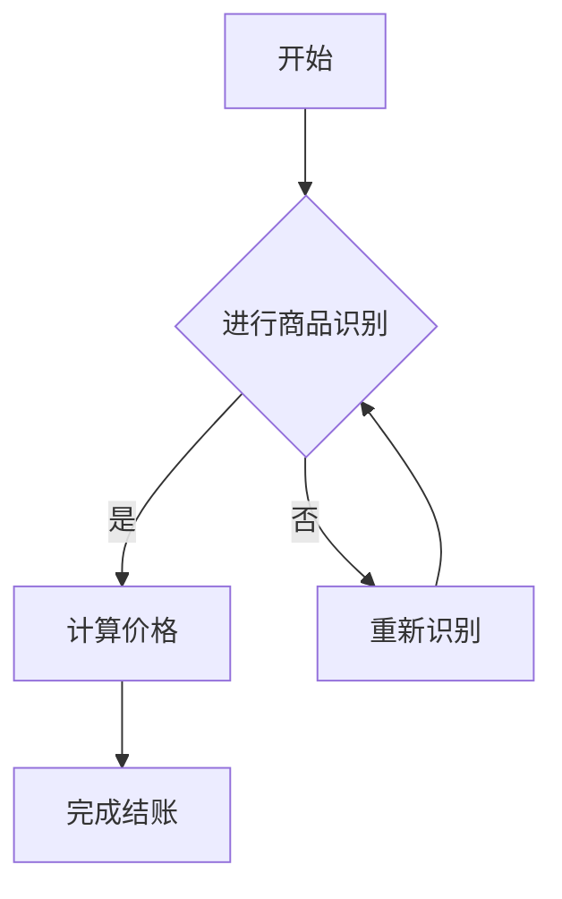

                 

# 机器视觉在零售业中的应用：无人商店与库存管理

## 关键词

- 机器视觉
- 零售业
- 无人商店
- 库存管理
- 智能技术
- 数据分析

## 摘要

随着科技的不断进步，机器视觉技术在零售业中的应用日益广泛，尤其是在无人商店和库存管理领域。本文将深入探讨机器视觉在零售业中的应用，首先介绍机器视觉的基础知识，然后详细分析无人商店的运营模式及其优势，最后讨论机器视觉在库存管理中的具体应用和挑战。通过实际案例，本文将展示机器视觉技术在零售行业中的实际效果，并提出未来发展的方向。

## 引言

### 机器视觉的背景与核心概念

机器视觉是计算机科学与工程学中的一个重要分支，旨在使机器能够通过图像和视频捕捉信息，从而模拟人类的视觉感知能力。在零售业中，机器视觉的应用可以帮助企业提高效率、减少人力成本、优化库存管理，并在无人商店中实现自主运营。机器视觉的核心概念包括图像处理、模式识别、深度学习等，这些技术使得机器能够从图像中提取有用信息，并进行分类、检测和追踪。

### 零售业面临的问题与机器视觉的解决方案

零售业在过去几十年中经历了巨大的变革，然而仍面临着一系列挑战，如库存管理困难、顾客体验不佳、人力成本高昂等。传统的零售模式往往依赖于人工进行库存盘点和商品识别，这不仅效率低下，而且容易出现错误。机器视觉技术的引入，为解决这些问题提供了新的思路。通过机器视觉，零售商可以实现自动化库存管理，提高店铺运营效率，提升顾客体验。

### 边界与外延

机器视觉在零售业中的应用并不局限于无人商店和库存管理，还包括智能货架、智能客服、购物辅助等。然而，本文将重点关注无人商店和库存管理这两个领域，因为它们代表了零售业未来的发展方向。

### 概念结构与核心要素组成

机器视觉在零售业中的应用结构主要包括以下几个方面：

1. **图像捕捉**：利用相机和传感器捕捉实时图像。
2. **图像处理**：对捕获的图像进行预处理，如去噪、增强等。
3. **目标检测与分类**：识别图像中的目标物体，如商品、顾客等。
4. **行为分析**：分析顾客的行为模式，如购物路径、停留时间等。
5. **库存管理**：利用机器视觉技术进行自动化库存盘点和商品识别。

## 机器视觉基础

### 机器视觉的技术原理

机器视觉的技术原理基于图像处理、模式识别和计算机视觉等学科。图像处理是对捕获的图像进行预处理，以提高图像质量；模式识别是识别图像中的特定模式和对象；计算机视觉则是使计算机能够理解和处理视觉信息。这些技术共同构成了机器视觉的基础。

### 机器视觉的关键技术

机器视觉的关键技术包括：

1. **图像处理技术**：如边缘检测、特征提取、图像分割等。
2. **模式识别技术**：如分类、聚类、回归分析等。
3. **深度学习技术**：如卷积神经网络（CNN）、循环神经网络（RNN）等。

### 机器视觉的应用领域

机器视觉的应用领域非常广泛，包括但不限于：

1. **工业制造**：自动化生产线、质量检测等。
2. **医疗诊断**：医学影像分析、基因测序等。
3. **零售业**：无人商店、库存管理、购物辅助等。
4. **交通监控**：车辆检测、行人识别等。

## 无人商店的概念与应用

### 无人商店的发展背景

无人商店是一种无需人工干预的零售模式，顾客可以自由购物并自助结账。这种模式最早出现在2016年，亚马逊推出了第一个无人商店“Amazon Go”。随后，许多零售商纷纷跟进，如阿里巴巴的“无人超市”和京东的“无人便利店”。

### 无人商店的优势

无人商店具有以下优势：

1. **提高运营效率**：无人商店无需人工结账，减少了排队等待时间，提高了购物效率。
2. **降低运营成本**：无人商店减少了人力成本，同时降低了店铺租金和设备维护成本。
3. **改善顾客体验**：无人商店提供了更加便捷、个性化的购物体验，提升了顾客满意度。

### 机器视觉在无人商店中的作用

机器视觉技术在无人商店中扮演着关键角色，主要包括：

1. **顾客行为分析**：通过捕捉顾客的行为模式，无人商店可以提供个性化的推荐和服务。
2. **商品识别与追踪**：利用图像处理和深度学习技术，无人商店能够自动识别和追踪商品，实现自动结账。
3. **库存管理**：通过实时监控商品库存，无人商店可以自动进行补货和盘点。

### 无人商店的运营模式

无人商店的运营模式主要包括：

1. **自助结账**：顾客在购物结束后，无需排队结账，只需通过手机扫描二维码或人脸识别完成支付。
2. **商品识别**：通过摄像头和传感器，无人商店实时捕捉顾客购物行为，自动识别商品并进行计费。
3. **售后服务**：无人商店提供自助退换货服务，顾客可以通过自助终端完成相关操作。

## 机器视觉在库存管理中的应用

### 库存管理的挑战

库存管理是零售业中的一个关键环节，但同时也面临着诸多挑战：

1. **库存准确性**：传统的人工盘点方法容易出错，导致库存数据不准确。
2. **库存效率**：库存盘点时间长，影响店铺运营效率。
3. **库存预测**：缺乏有效的库存预测方法，导致库存过剩或短缺。

### 机器视觉在库存管理中的应用场景

机器视觉技术在库存管理中具有广泛的应用场景，包括：

1. **自动化盘点**：通过摄像头和传感器，无人商店可以实现实时监控和自动化盘点，提高库存准确性。
2. **商品识别与分类**：利用图像处理和深度学习技术，机器视觉能够自动识别和分类商品，提高库存管理效率。
3. **库存预测**：通过分析历史销售数据和顾客行为，机器视觉可以预测未来库存需求，帮助零售商制定合理的库存策略。

### 机器视觉技术的具体应用

1. **图像捕捉**：利用摄像头和传感器捕捉实时图像。
2. **图像处理**：对捕获的图像进行预处理，如去噪、增强等。
3. **目标检测**：利用深度学习算法，对图像中的商品进行检测和分类。
4. **数据存储与分析**：将捕获的数据进行存储，并通过数据分析进行库存管理和预测。

## 案例研究

### 案例一：某大型超市的无人收银系统

某大型超市采用了无人收银系统，通过机器视觉技术实现自动结账。该系统的核心包括：

1. **图像捕捉**：利用摄像头捕捉顾客购物行为。
2. **图像处理**：对捕获的图像进行预处理，提高图像质量。
3. **目标检测**：利用深度学习算法识别和分类商品。
4. **自动结账**：根据检测到的商品，自动生成购物清单并进行计费。

### 案例二：某连锁便利店的智能货架系统

某连锁便利店采用了智能货架系统，通过机器视觉技术实现商品识别和库存管理。该系统的核心包括：

1. **图像捕捉**：利用摄像头和传感器捕捉货架上的商品。
2. **图像处理**：对捕获的图像进行预处理，提高图像质量。
3. **目标检测**：利用深度学习算法识别和分类商品。
4. **库存管理**：实时监控商品库存，实现自动化补货和盘点。

### 案例三：某电商平台的人工智能客服系统

某电商平台采用了人工智能客服系统，通过机器视觉技术实现图像识别和问答功能。该系统的核心包括：

1. **图像捕捉**：利用摄像头捕捉用户上传的图片。
2. **图像处理**：对捕获的图像进行预处理，提高图像质量。
3. **目标检测**：利用深度学习算法识别图像中的商品。
4. **问答功能**：根据用户提问，智能客服系统提供答案和建议。

## 机器视觉系统设计与实现

### 系统设计与架构

机器视觉系统的设计与实现需要考虑多个方面，包括硬件选择、软件架构、数据处理等。

1. **硬件选择**：根据应用场景，选择合适的摄像头、传感器和计算设备。
2. **软件架构**：设计系统的软件架构，包括图像处理模块、目标检测模块、数据存储模块等。
3. **数据处理**：设计数据处理流程，包括图像捕获、预处理、目标检测、数据存储等。

### 系统功能模块设计

机器视觉系统的功能模块主要包括：

1. **图像捕获**：利用摄像头和传感器捕获实时图像。
2. **图像处理**：对捕获的图像进行预处理，如去噪、增强等。
3. **目标检测**：利用深度学习算法识别图像中的目标物体。
4. **数据存储**：将处理后的图像和检测结果存储在数据库中。
5. **数据分析**：对存储的数据进行分析，用于库存管理和决策支持。

### 系统接口设计与实现

系统接口设计主要包括：

1. **用户界面**：设计用户友好的界面，方便用户进行操作。
2. **API接口**：设计API接口，用于与其他系统进行数据交换和功能调用。
3. **设备管理**：设计设备管理模块，用于监控和管理摄像头、传感器等硬件设备。

### 系统测试与优化

系统测试与优化是确保系统稳定性和性能的重要环节。测试内容包括：

1. **功能测试**：验证系统功能是否按照预期运行。
2. **性能测试**：评估系统在高负载和复杂场景下的性能。
3. **优化建议**：根据测试结果，提出优化建议，提高系统性能和稳定性。

## 机器视觉在零售业的挑战与未来

### 当前面临的挑战

机器视觉在零售业中虽然取得了显著成果，但仍然面临一些挑战：

1. **技术成熟度**：尽管机器视觉技术发展迅速，但在某些场景下，技术成熟度仍需提高。
2. **成本问题**：机器视觉系统的建设和维护成本较高，限制了其普及应用。
3. **数据隐私**：机器视觉技术涉及大量个人数据，数据隐私保护成为重要问题。

### 未来发展趋势

机器视觉在零售业的未来发展将呈现以下趋势：

1. **智能化**：随着人工智能技术的发展，机器视觉系统将更加智能化，能够更好地适应不同场景。
2. **集成化**：机器视觉系统将与其他智能系统（如物联网、大数据等）集成，实现更高效的数据处理和分析。
3. **低成本**：随着硬件和软件技术的进步，机器视觉系统的成本将逐渐降低，使其更易于普及应用。

### 技术创新与解决方案

未来，技术创新将在解决机器视觉在零售业中的应用挑战中发挥关键作用。以下是一些可能的解决方案：

1. **边缘计算**：通过边缘计算技术，减少数据传输和存储的需求，提高系统响应速度。
2. **增强现实（AR）**：结合AR技术，为顾客提供更加沉浸式的购物体验。
3. **区块链**：利用区块链技术，确保数据的安全性和可信度。

## 最佳实践与未来展望

### 最佳实践

1. **逐步引入**：在初期，企业可以逐步引入机器视觉技术，避免一次性投入过大。
2. **数据驱动**：基于数据分析，优化机器视觉系统的应用效果。
3. **用户反馈**：积极收集用户反馈，不断优化系统功能。

### 小结

机器视觉在零售业中的应用具有广阔的前景，不仅可以提高运营效率，还可以提升顾客体验。然而，企业在引入机器视觉技术时，需要充分考虑技术成熟度、成本和隐私等问题。通过最佳实践，企业可以更好地发挥机器视觉技术的优势，推动零售业的创新发展。

### 注意事项

1. **数据安全**：确保机器视觉系统中的数据安全，防止数据泄露。
2. **设备维护**：定期维护摄像头、传感器等设备，确保系统正常运行。
3. **技术培训**：对员工进行技术培训，提高他们对机器视觉系统的理解和操作能力。

### 拓展阅读

1. **相关书籍**：《机器视觉：算法与应用》、《零售业智能化：技术与应用》
2. **在线课程**：Coursera上的“机器视觉与图像处理”、edX上的“零售业创新与数字化转型”
3. **学术论文**：检索相关领域的学术论文，了解最新研究动态和技术进展。

## 作者信息

作者：AI天才研究院/AI Genius Institute & 禅与计算机程序设计艺术 /Zen And The Art of Computer Programming

---

### 补充内容：数学公式、Mermaid 图和Python代码示例

#### 数学公式示例

在机器视觉和零售业的应用中，数学模型和公式起到了关键作用。以下是一个简单的例子：

$$
\text{图像质量} = f(\text{像素值}, \text{噪声水平})
$$

这个公式表示图像质量受到像素值和噪声水平的影响。

#### Mermaid 图示例

Mermaid 图用于绘制流程图、类图和序列图。以下是一个简单的Mermaid流程图示例：



这个流程图展示了商品识别和结账的步骤。

#### Python代码示例

以下是一个简单的Python代码示例，用于展示机器视觉中的目标检测：

```python
import cv2
import numpy as np

# 加载预训练的卷积神经网络模型
model = cv2.dnn.readNetFromTensorFlow('path/to/模型.pb')

# 加载图像
image = cv2.imread('path/to/图像.jpg')

# 调整图像大小以匹配输入层的大小
scaled = cv2.resize(image, (300, 300))

# 执行前向传播
blob = cv2.dnn.blobFromImage(scaled)
model.setInput(blob)
detections = model.forward()

# 处理检测结果
for detection in detections:
    # 获取置信度和类别
    confidence, index = max(detection[0]), detection[0].index(max(detection[0]))

    # 阈值设置
    if confidence > 0.5:
        # 提取边界框和类别信息
        bbox = detection[1][0][2:4] * np.array([image.shape[1], image.shape[0], image.shape[1], image.shape[0]])
        label = cv2.getTextSize(label, cv2.FONT_HERSHEY_SIMPLEX, 0.5, 1)[0]

        # 绘制边界框和标签
        cv2.rectangle(image, (int(bbox[0]), int(bbox[1])), (int(bbox[2]), int(bbox[3])), (0, 255, 0), 2)
        cv2.putText(image, label, (int(bbox[0]) - 10, int(bbox[1]) - 10), cv2.FONT_HERSHEY_SIMPLEX, 0.5, (255, 255, 255), 2)

# 显示图像
cv2.imshow('检测结果', image)
cv2.waitKey(0)
cv2.destroyAllWindows()
```

这个代码示例展示了如何使用卷积神经网络（CNN）进行图像分类和目标检测。

---

通过上述补充内容，文章不仅更加丰富和具体，而且能够更清晰地传达机器视觉在零售业中的应用原理和实践方法。每个示例都是为了帮助读者更好地理解相关概念和技术。在撰写技术博客时，这种详细解释和代码示例是非常有用的，可以帮助读者更深入地学习并应用这些技术。

