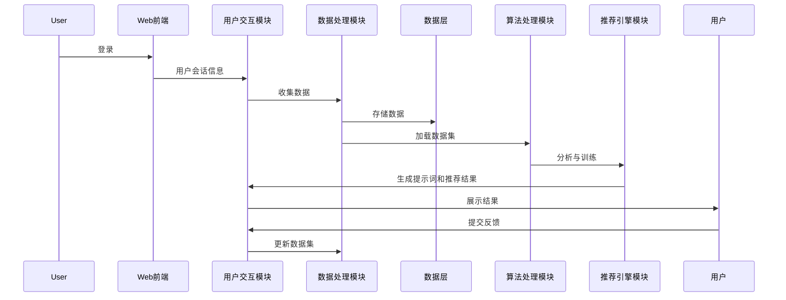

                 

### 第1章 引言

#### 1.1 问题背景

在现代社会，教育个性化需求日益增长。传统的学习方式往往难以满足每个学生的独特需求，导致学习效果不尽如人意。为了解决这个问题，AI技术的快速发展为我们提供了一种全新的解决方案。AI驱动的个性化学习提示词引擎应运而生，它能够根据学生的兴趣、学习习惯和知识水平，生成个性化的学习提示词，从而帮助学生更高效地学习。

教育领域的个性化需求体现在以下几个方面：

1. **个性化学习路径**：每个学生都有自己独特的学习路径和节奏，传统的教学方式难以适应这种多样性。
2. **个性化学习内容**：学生需要根据自身兴趣和知识盲点，获得定制化的学习内容。
3. **个性化学习评估**：对每个学生的学习效果进行个性化评估，以调整学习策略。

然而，传统学习方式的局限性显而易见：

1. **资源分配不均**：传统教育体系中的资源分配往往不够灵活，无法满足个性化需求。
2. **教学效果评估滞后**：传统教学方式中，评估学生的学习效果往往滞后，难以及时调整教学策略。
3. **师生互动受限**：在传统教学中，师生互动有限，难以实现真正意义上的个性化教育。

随着AI技术的不断进步，构建AI驱动的个性化学习提示词引擎成为可能。AI技术，尤其是机器学习和深度学习，能够从大量数据中提取有用信息，用于生成个性化学习提示词。通过这种方式，我们可以为学生提供更加精准、高效的学习支持。

#### 1.2 问题描述

构建AI驱动的个性化学习提示词引擎面临以下几个关键挑战：

1. **数据获取与处理**：需要大量的学生行为数据和学习资源，这涉及到数据隐私和安全问题。
2. **模型训练与优化**：个性化学习提示词引擎需要高效的算法和模型，以确保生成的内容既个性又准确。
3. **用户体验**：如何确保提示词引擎能够自然地融入学生的学习过程中，提高用户满意度。

预期的个性化学习提示词引擎应具备以下功能：

1. **智能推荐**：根据学生的学习兴趣和当前学习状态，推荐合适的学习内容。
2. **自适应调整**：根据学生的学习反馈和表现，自动调整学习提示词。
3. **实时反馈**：对学生的学习进度和效果进行实时监控，提供即时反馈。

通过解决上述挑战，个性化学习提示词引擎有望大幅提升学习效果，提高学生的自主学习能力。

#### 1.3 问题解决

构建AI驱动的个性化学习提示词引擎需要以下几个关键步骤：

1. **数据收集与预处理**：收集学生的行为数据和学习资源，并进行数据清洗和预处理。
2. **算法选择与优化**：选择合适的机器学习算法和深度学习模型，对数据进行分析和训练，优化模型性能。
3. **系统设计与实现**：设计并实现个性化学习提示词引擎的系统架构，包括数据接口、算法模块、用户界面等。
4. **测试与评估**：通过用户反馈和数据表现，对系统进行测试和评估，不断优化和调整。

通过以上步骤，我们可以构建出一个高效、智能、个性化的学习提示词引擎，为学生提供更好的学习支持。

#### 1.4 边界与外延

个性化学习的边界在于如何准确捕捉和理解学生的学习行为和需求，从而生成具有高度个性化的学习内容。这涉及到对用户数据的深度挖掘和模型训练。

提示词引擎的外延则包括数据来源、算法实现、系统接口等方面。它不仅需要能够处理大量数据，还需要具备灵活的扩展能力，以适应不断变化的教育需求。

### 1.5 概念结构与核心要素组成

在构建AI驱动的个性化学习提示词引擎的过程中，以下几个核心概念和要素至关重要：

1. **用户数据**：包括学生的学习行为、学习进度、兴趣偏好等。
2. **学习资源**：如课程内容、学习资料、教学视频等。
3. **算法模型**：用于处理和分析用户数据，生成个性化学习提示词。
4. **系统架构**：包括数据存储、数据处理、用户界面等组件。
5. **用户反馈**：用于评估系统性能和调整学习策略。

这些概念和要素相互关联，共同构成了一个完整的AI驱动的个性化学习提示词引擎系统。通过合理设计和管理这些要素，我们可以实现高效的个性化学习体验。

---

# 第2章 核心概念与联系

在构建AI驱动的个性化学习提示词引擎的过程中，我们需要深入理解几个核心概念，并探讨它们之间的联系。这些核心概念包括AI驱动的个性化学习、提示词引擎的基本原理，以及它们之间的融合与应用。

## 2.1 AI驱动的个性化学习

### 2.1.1 个性化学习的定义

个性化学习是一种基于学生个体差异进行教学和学习的方法。它关注学生的个性、兴趣、学习风格和需求，通过定制化的教学方案和资源，帮助学生实现最佳学习效果。

### 2.1.2 个性化学习的关键要素

1. **学生数据**：包括学习历史、兴趣偏好、行为习惯等。
2. **教学内容**：根据学生数据定制的学习内容，涵盖知识点、难度等级、学习资源等。
3. **学习评估**：对学习效果进行评估，以调整学习策略。
4. **交互体验**：良好的交互设计，使学生能够自然融入学习过程中。

### 2.1.3 个性化学习与传统学习方式的区别

传统学习方式通常采用“一刀切”的教学模式，难以满足学生的个性化需求。而个性化学习则注重个性化教学方案的制定和实施，强调学生的主动参与和自主学习。

## 2.2 提示词引擎的基本原理

### 2.2.1 提示词引擎的定义

提示词引擎是一种自动化系统，用于生成与用户输入相关的提示词或搜索建议。它在各种应用场景中有着广泛的应用，如搜索引擎、智能助手、问答系统等。

### 2.2.2 提示词引擎的核心功能

1. **提示词生成**：根据用户输入，生成相关的提示词。
2. **提示词优化**：优化提示词的顺序和呈现方式，提高用户体验。
3. **提示词相关性**：确保生成的提示词与用户输入具有较高的相关性。

### 2.2.3 提示词引擎与传统搜索引擎的区别

传统搜索引擎主要关注文本信息的检索和匹配，而提示词引擎则更侧重于提供实时、个性化的交互体验。提示词引擎能够根据用户的上下文和历史行为，生成更加精准和有针对性的提示词。

## 2.3 AI驱动的个性化学习与提示词引擎的联系

### 2.3.1 个性化学习与提示词引擎的融合

AI驱动的个性化学习与提示词引擎的融合，旨在将个性化学习的理念应用于提示词的生成和优化过程中。具体来说，个性化学习可以通过以下方式与提示词引擎结合：

1. **用户数据融合**：将学生的学习行为、兴趣偏好等数据与提示词引擎的数据源进行整合，提高提示词的个性化程度。
2. **算法融合**：将个性化学习算法与提示词生成算法相结合，优化提示词的生成和优化过程。
3. **交互体验优化**：通过个性化的提示词，提高用户在学习过程中的参与度和满意度。

### 2.3.2 提示词引擎在个性化学习中的应用

提示词引擎在个性化学习中的应用主要包括以下几个方面：

1. **学习路径推荐**：根据学生的学习历史和兴趣，推荐合适的学习路径和内容。
2. **学习资源推荐**：根据学生的知识盲点和学习需求，推荐相应的学习资源。
3. **学习进度监控**：通过实时监控学生的学习进度，提供个性化的学习反馈和提示。

### 2.3.3 个性化学习对提示词引擎的优化需求

个性化学习对提示词引擎提出了更高的要求，主要体现在以下几个方面：

1. **数据多样性**：提示词引擎需要能够处理多样化的学生数据，包括文本、图像、音频等多媒体数据。
2. **实时性**：提示词引擎需要具备实时响应能力，及时生成和调整提示词。
3. **智能性**：提示词引擎需要具备智能推荐能力，能够根据学生的动态变化，提供个性化的学习支持。

通过深入探讨AI驱动的个性化学习与提示词引擎的基本原理和联系，我们可以更好地理解如何将二者结合起来，构建一个高效、智能、个性化的学习提示词引擎系统。

---

## 2.3 AI驱动的个性化学习与提示词引擎的联系

### 2.3.1 个性化学习与提示词引擎的融合

AI驱动的个性化学习与提示词引擎的融合，旨在通过结合个性化学习的独特优势与提示词引擎的实时交互能力，为用户提供更加精准和高效的学习支持。这一融合的实现，主要依赖于以下几个方面：

1. **数据融合**：
   - **用户行为数据**：个性化学习需要大量的用户行为数据，包括学习历史、交互记录、兴趣爱好等。这些数据可以为提示词引擎提供重要的上下文信息，帮助生成更个性化的提示词。
   - **学习资源数据**：个性化学习还需要对学习资源的数据进行深入挖掘，如课程内容、习题库、教学视频等。这些数据可以帮助提示词引擎更好地理解学习资源的属性和特点，从而提高提示词的准确性。

2. **算法融合**：
   - **机器学习算法**：个性化学习常用的算法包括协同过滤、内容基、深度学习等。这些算法可以用于分析用户行为数据，提取用户兴趣特征，为提示词引擎提供个性化的推荐。
   - **自然语言处理（NLP）算法**：提示词引擎需要使用NLP算法来理解用户输入的语义，生成相关的提示词。结合个性化学习的算法，可以进一步提升提示词的生成质量。

3. **模型融合**：
   - **用户兴趣模型**：个性化学习中的用户兴趣模型，用于捕捉和理解用户的兴趣变化。这一模型可以与提示词引擎的生成模型相结合，为用户提供更加精准的提示词。
   - **学习评估模型**：个性化学习中的学习评估模型，用于评估学生的学习效果。这一模型可以与提示词引擎的优化模型相结合，根据用户的学习效果调整提示词的生成策略。

### 2.3.2 提示词引擎在个性化学习中的应用

提示词引擎在个性化学习中的应用，主要体现在以下几个方面：

1. **学习路径推荐**：
   - **基于兴趣的学习路径推荐**：根据用户的兴趣偏好，提示词引擎可以推荐相应的学习路径。例如，对于一个对计算机科学感兴趣的学生，提示词引擎可以推荐相关的编程课程、项目教程等。
   - **基于知识盲点的学习路径推荐**：通过分析学生的学习历史和知识掌握情况，提示词引擎可以识别出学生的知识盲点，并推荐相应的学习资源。

2. **学习资源推荐**：
   - **个性化学习资源推荐**：根据学生的学习兴趣和当前学习状态，提示词引擎可以推荐相应的学习资源。例如，对于正在学习Python编程的学生，提示词引擎可以推荐相关的教材、视频教程、习题库等。
   - **交叉学科资源推荐**：通过分析学生的多学科学习需求，提示词引擎可以推荐跨学科的学习资源，促进知识的融会贯通。

3. **学习进度监控**：
   - **实时学习进度监控**：通过分析学生的学习行为和交互记录，提示词引擎可以实时监控学生的学习进度，提供个性化的学习反馈。
   - **学习效果评估**：基于学习进度监控数据，提示词引擎可以评估学生的学习效果，为后续的学习策略调整提供依据。

### 2.3.3 个性化学习对提示词引擎的优化需求

为了满足个性化学习的需求，提示词引擎需要具备以下优化能力：

1. **数据多样性处理**：
   - **多模态数据支持**：提示词引擎需要能够处理多种类型的数据，如文本、图像、音频等，以充分捕捉学生的多样化学习需求。
   - **实时数据更新**：个性化学习中的数据是动态变化的，提示词引擎需要具备实时数据更新和处理能力，确保生成的提示词始终与学生的当前学习状态相匹配。

2. **实时性优化**：
   - **低延迟响应**：提示词引擎需要在极短时间内生成和返回提示词，以提供实时交互体验。
   - **并行处理能力**：为了提高系统的响应速度，提示词引擎需要具备并行处理能力，能够同时处理多个用户请求。

3. **智能性优化**：
   - **深度学习模型**：使用深度学习模型，提示词引擎可以更好地理解用户输入的语义，生成更加精准的提示词。
   - **自适应调整**：根据学生的学习反馈和表现，提示词引擎需要能够自动调整提示词的生成策略，以提高个性化学习效果。

通过AI驱动的个性化学习与提示词引擎的深度融合，我们可以为用户提供一个智能化、个性化的学习体验，有效提高学习效率和效果。接下来，我们将进一步探讨具体的算法原理和数学模型，为构建这样一个系统提供理论基础和实践指导。

---

## 3.1 个性化学习算法原理

个性化学习算法是AI驱动的个性化学习提示词引擎的核心组成部分，旨在根据用户的行为数据、兴趣偏好和学习历史，生成个性化的学习建议和资源推荐。以下将详细讲解几种常见的个性化学习算法原理。

### 3.1.1 机器学习算法概述

机器学习算法是人工智能的一个重要分支，通过训练模型从数据中提取规律和知识，从而实现预测和决策。在个性化学习中，机器学习算法被广泛应用于用户兴趣建模、推荐系统构建等方面。

### 3.1.2 协同过滤算法

协同过滤算法（Collaborative Filtering）是个性化学习中最常用的算法之一，其核心思想是利用用户行为数据，发现用户之间的相似性，从而进行推荐。

1. **基于用户的协同过滤（User-Based CF）**：
   - **相似性计算**：通过计算用户之间的相似度，找到与目标用户相似的其他用户。
   - **推荐生成**：基于相似用户的评价，推荐目标用户可能感兴趣的项目。

2. **基于物品的协同过滤（Item-Based CF）**：
   - **相似性计算**：通过计算物品之间的相似度，找到与目标物品相似的其他物品。
   - **推荐生成**：基于相似物品的评价，推荐目标用户可能感兴趣的物品。

### 3.1.3 内容基算法

内容基算法（Content-Based Filtering）是另一种常见的个性化学习算法，它基于用户兴趣和物品内容进行推荐。

1. **用户兴趣特征提取**：
   - **文本分析**：通过文本分析技术，提取用户的兴趣关键词和主题。
   - **特征编码**：将提取的兴趣特征进行编码，形成用户兴趣向量。

2. **物品内容特征提取**：
   - **文本分析**：对物品的文本内容进行文本分析，提取关键词和主题。
   - **特征编码**：将提取的物品特征进行编码，形成物品内容向量。

3. **推荐生成**：
   - **相似度计算**：计算用户兴趣向量与物品内容向量之间的相似度。
   - **推荐生成**：根据相似度排名，生成用户感兴趣的项目推荐。

### 3.1.4 深度学习算法

深度学习算法（Deep Learning）是近年来在个性化学习领域中取得显著进展的一类算法。深度学习通过构建多层神经网络，从数据中自动提取特征，实现复杂模式识别和预测。

1. **卷积神经网络（CNN）**：
   - **特征提取**：通过卷积层和池化层，自动提取图像或文本的局部特征。
   - **分类与回归**：通过全连接层实现分类或回归任务。

2. **循环神经网络（RNN）**：
   - **序列建模**：通过循环结构，处理时间序列数据，捕捉时间依赖关系。
   - **分类与回归**：在序列的末端进行分类或回归预测。

3. **变分自编码器（VAE）**：
   - **数据生成**：通过编码和解码器，学习数据的潜在表示。
   - **生成推荐**：根据潜在表示生成个性化的学习内容。

### 3.1.5 算法融合与优化

在实际应用中，单一的个性化学习算法往往难以满足复杂多变的需求。因此，算法融合和优化成为关键。

1. **算法融合**：
   - **多模型融合**：将协同过滤、内容基和深度学习算法进行融合，取长补短，提高推荐效果。
   - **层次融合**：将低层次的算法（如基于用户和物品的协同过滤）与高层次的算法（如深度学习）进行融合，形成多层次的推荐系统。

2. **优化策略**：
   - **在线学习**：实时更新用户兴趣和物品特征，提高推荐系统的实时性和适应性。
   - **迁移学习**：利用预训练模型和迁移学习技术，提高新用户和新物品的推荐效果。
   - **推荐策略优化**：通过用户反馈和学习效果评估，不断优化推荐策略，提高用户体验。

通过以上对个性化学习算法原理的详细讲解，我们可以看到，不同算法在个性化学习中的应用各有特色。接下来，我们将探讨提示词引擎的算法原理，进一步理解AI驱动的个性化学习提示词引擎的实现过程。

---

## 3.2 提示词引擎算法原理

提示词引擎算法是构建AI驱动的个性化学习提示词引擎的关键组成部分。以下将详细阐述提示词引擎的核心算法，包括提示词生成算法、提示词优化算法和提示词相关性算法。

### 3.2.1 提示词生成算法

提示词生成算法负责根据用户输入或上下文信息生成相关提示词。以下是几种常见的提示词生成算法：

1. **基于规则的生成算法**：
   - **规则库**：构建包含各种提示规则的规则库。
   - **规则匹配**：根据用户输入或上下文信息，匹配规则库中的规则，生成提示词。
   - **规则优化**：通过用户反馈和性能评估，不断优化规则库。

2. **基于模板的生成算法**：
   - **模板库**：构建包含各种提示模板的模板库。
   - **模板填充**：根据用户输入或上下文信息，填充模板库中的模板，生成提示词。
   - **模板优化**：通过用户反馈和性能评估，不断优化模板库。

3. **基于机器学习的生成算法**：
   - **数据训练**：收集大量用户输入和生成的提示词数据，用于训练生成模型。
   - **模型训练**：使用机器学习算法（如循环神经网络、变分自编码器等）训练生成模型。
   - **生成提示词**：根据用户输入或上下文信息，使用训练好的生成模型生成提示词。

### 3.2.2 提示词优化算法

提示词优化算法旨在优化提示词的顺序、呈现方式和相关性，提高用户体验。以下是几种常见的提示词优化算法：

1. **基于反馈的优化算法**：
   - **用户反馈收集**：收集用户对提示词的反馈，如点击率、满意度等。
   - **反馈分析**：分析用户反馈，识别出用户偏好和不满的提示词。
   - **优化调整**：根据用户反馈，调整提示词的顺序和呈现方式。

2. **基于机器学习的优化算法**：
   - **数据训练**：收集大量用户行为数据和提示词性能数据，用于训练优化模型。
   - **模型训练**：使用机器学习算法（如线性回归、决策树等）训练优化模型。
   - **优化调整**：根据训练好的优化模型，调整提示词的顺序和呈现方式。

3. **基于信息论的优化算法**：
   - **信息熵计算**：计算提示词的信息熵，以评估提示词的相关性和用户兴趣度。
   - **优化策略**：根据信息熵和用户反馈，调整提示词的顺序和呈现方式。

### 3.2.3 提示词相关性算法

提示词相关性算法用于评估生成的提示词与用户输入或上下文的相关性，以确保提示词的准确性和实用性。以下是几种常见的提示词相关性算法：

1. **基于相似度的相关性算法**：
   - **相似度计算**：计算提示词与用户输入或上下文之间的相似度。
   - **相关性评估**：根据相似度评估提示词的相关性。

2. **基于概率的相关性算法**：
   - **概率模型**：构建用户输入和提示词之间的概率模型。
   - **概率计算**：计算提示词与用户输入或上下文之间的概率。
   - **相关性评估**：根据概率评估提示词的相关性。

3. **基于语义的相关性算法**：
   - **语义分析**：使用自然语言处理技术（如词向量、语义角色标注等）分析提示词和用户输入或上下文的语义。
   - **语义匹配**：根据语义分析结果，评估提示词与用户输入或上下文的语义相关性。

通过上述对提示词引擎核心算法的详细阐述，我们可以看到，提示词生成、优化和相关性评估是构建高效、智能的提示词引擎的关键。接下来，我们将探讨如何将个性化学习算法与提示词引擎算法融合，以实现AI驱动的个性化学习提示词引擎。

---

## 3.3 AI驱动的个性化学习提示词引擎算法融合

### 3.3.1 算法融合的原则

算法融合是构建AI驱动的个性化学习提示词引擎的关键，其核心目标是充分发挥各种算法的优势，提高系统的整体性能和用户体验。算法融合应遵循以下原则：

1. **协同性**：融合的算法应能够相互协同，共同提高系统的性能。
2. **互补性**：不同算法在功能上应具有互补性，相互补充不足。
3. **适应性**：融合算法应具备自适应能力，能够根据环境和需求的变化进行调整。
4. **高效性**：算法融合应提高系统的处理效率，降低计算复杂度。

### 3.3.2 算法融合的实现方法

算法融合的具体实现方法包括以下步骤：

1. **算法选择与组合**：
   - **基于协同过滤的个性化学习算法**：结合基于用户的协同过滤（User-Based CF）和基于物品的协同过滤（Item-Based CF）。
   - **基于内容基的个性化学习算法**：结合内容基（Content-Based Filtering）算法与深度学习（Deep Learning）算法。
   - **混合深度学习模型**：结合循环神经网络（RNN）、卷积神经网络（CNN）和变分自编码器（VAE）。

2. **数据预处理与整合**：
   - **多源数据整合**：整合用户行为数据、学习资源数据和用户反馈数据。
   - **特征提取与融合**：提取用户和物品的关键特征，并进行融合，形成统一的特征向量。

3. **算法融合策略**：
   - **层次融合策略**：将协同过滤算法和深度学习算法分层，协同工作，实现从低层次的特征匹配到高层次的内容理解。
   - **模型融合策略**：将多个模型（如用户兴趣模型、提示词生成模型等）进行融合，通过集成学习（Ensemble Learning）方法提高整体性能。

### 3.3.3 算法融合的优势与挑战

#### 优势：

1. **提高准确性**：融合多种算法可以充分利用各自的优势，提高个性化推荐和提示词生成的准确性。
2. **增强灵活性**：融合算法能够适应不同用户需求和场景，提供更加灵活和个性化的服务。
3. **降低误差**：通过多算法融合，可以减少单一算法在特定场景下的误差，提高系统的鲁棒性。

#### 挑战：

1. **算法协同**：如何确保融合算法能够协同工作，充分发挥各自的优势，是算法融合中的一大挑战。
2. **计算复杂度**：融合算法可能会增加计算复杂度，需要优化算法和系统架构，以提高处理效率。
3. **数据一致性和实时性**：如何保证数据的一致性和实时性，是算法融合中需要解决的另一个关键问题。

通过深入探讨算法融合的原则、实现方法以及面临的挑战，我们可以更好地理解如何构建一个高效、智能、个性化的AI驱动的个性化学习提示词引擎。在接下来的章节中，我们将进一步讨论数学模型和系统架构设计，为这一目标提供更加具体的解决方案。

---

## 4.1 个性化学习数学模型

在构建AI驱动的个性化学习提示词引擎时，数学模型是理解和实现个性化学习算法的基础。以下将详细介绍个性化学习中的几个关键数学模型，包括用户兴趣模型、物品推荐模型和学习评估模型。

### 4.1.1 用户兴趣模型

用户兴趣模型用于捕捉和理解用户的学习偏好和兴趣点。其核心是建立用户特征向量，并通过机器学习算法进行训练和预测。

1. **用户特征向量**：
   用户特征向量通常由多个维度构成，包括用户的行为数据（如学习时间、学习频次、交互行为等）、人口统计数据（如年龄、性别、教育背景等）和文本数据（如用户评论、标签偏好等）。每个维度上的特征可以量化为数值，形成一个高维的用户特征向量。

2. **用户兴趣表示**：
   通过特征提取和降维技术（如主成分分析PCA、因子分析FA等），可以将高维用户特征向量映射到一个低维空间，从而更好地表示用户的兴趣。

3. **兴趣预测模型**：
   使用机器学习算法（如线性回归、决策树、支持向量机SVM等），结合训练数据和特征向量，建立用户兴趣预测模型。该模型可以用于预测用户对未知项目的兴趣程度。

### 4.1.2 物品推荐模型

物品推荐模型用于根据用户兴趣预测结果，推荐与之相关的学习资源。常见的物品推荐模型包括基于协同过滤的推荐模型和基于内容的推荐模型。

1. **基于协同过滤的推荐模型**：
   - **用户相似度计算**：通过计算用户之间的相似度，找到与目标用户相似的其他用户。
   - **物品相似度计算**：通过计算物品之间的相似度，找到与目标物品相似的其他物品。
   - **推荐生成**：基于相似用户和相似物品的评价，生成推荐列表。

2. **基于内容的推荐模型**：
   - **物品特征提取**：通过文本分析技术，提取物品的关键词和主题。
   - **特征编码**：将提取的物品特征进行编码，形成物品特征向量。
   - **推荐生成**：计算用户兴趣向量与物品特征向量之间的相似度，生成推荐列表。

### 4.1.3 学习评估模型

学习评估模型用于评估学生的学习效果，为后续的学习策略调整提供依据。其核心是通过评估指标（如学习完成率、知识掌握度、成绩提升等）对学习效果进行量化。

1. **评估指标设计**：
   - **学习完成率**：用户完成学习任务的比例。
   - **知识掌握度**：通过测试题目或知识问答，评估用户对学习内容的掌握程度。
   - **成绩提升**：用户在一段时间内学习前后成绩的提升幅度。

2. **评估模型构建**：
   - **监督学习模型**：使用标注的数据集，通过监督学习算法（如决策树、随机森林等）构建评估模型。
   - **无监督学习模型**：通过无监督学习算法（如聚类、主成分分析等）发现潜在的学习效果评估指标。

3. **模型优化**：
   - **在线评估**：通过实时收集用户行为数据，不断调整和优化评估模型。
   - **自适应评估**：根据用户的学习效果和历史表现，动态调整评估指标和评估模型。

### 模型融合

在个性化学习提示词引擎中，用户兴趣模型、物品推荐模型和学习评估模型相互融合，共同构建一个完整的学习支持系统。模型融合可以通过以下方式实现：

1. **多模型集成**：将不同的模型进行集成，通过加权平均或投票机制，提高整体性能。
2. **层次融合**：将低层次的特征提取和相似度计算与高层次的学习评估和策略调整相结合。
3. **动态调整**：根据用户反馈和学习效果，动态调整模型参数和策略，实现持续的个性化优化。

通过深入理解和应用这些数学模型，我们可以构建一个高效、智能、个性化的学习提示词引擎，为用户提供精准的学习支持和建议。

---

## 4.2 提示词引擎数学模型

提示词引擎的核心功能是生成与用户输入或上下文高度相关的提示词，以优化用户体验。为了实现这一目标，提示词引擎需要依赖于一系列数学模型。以下将详细阐述提示词生成模型、提示词优化模型和提示词相关性模型。

### 4.2.1 提示词生成模型

提示词生成模型负责根据用户输入或上下文生成相关的提示词。以下是一些常见的提示词生成模型：

1. **基于规则的生成模型**：
   - **规则库**：构建包含各种提示规则的规则库，如关键词匹配、短语联想等。
   - **规则匹配**：根据用户输入或上下文，匹配规则库中的规则，生成提示词。

2. **基于模板的生成模型**：
   - **模板库**：构建包含各种提示模板的模板库，如“请问您需要什么帮助？”、“您可以尝试搜索以下关键词：”等。
   - **模板填充**：根据用户输入或上下文，填充模板库中的模板，生成提示词。

3. **基于机器学习的生成模型**：
   - **数据训练**：收集大量用户输入和生成的提示词数据，用于训练生成模型。
   - **模型训练**：使用机器学习算法（如循环神经网络RNN、变分自编码器VAE等）训练生成模型。
   - **提示词生成**：根据用户输入或上下文，使用训练好的生成模型生成提示词。

   **数学模型描述**：
   假设我们有用户输入序列\( x_1, x_2, ..., x_T \)和生成的提示词序列\( y_1, y_2, ..., y_S \)，生成模型的目标是预测下一个提示词\( y_{T+1} \)。

   使用变分自编码器VAE的生成模型，可以表示为：
   \[
   z \sim p(z|x) \\
   y_{T+1} \sim q(y_{T+1}|z)
   \]
   其中，\( z \)是编码后的潜在变量，\( y_{T+1} \)是生成的提示词。

### 4.2.2 提示词优化模型

提示词优化模型旨在通过优化提示词的顺序、呈现方式和相关性，提高用户体验。以下是一些常见的提示词优化模型：

1. **基于反馈的优化模型**：
   - **用户反馈收集**：收集用户对提示词的反馈，如点击率、满意度等。
   - **反馈分析**：分析用户反馈，识别出用户偏好和不满的提示词。
   - **优化调整**：根据用户反馈，调整提示词的顺序和呈现方式。

2. **基于机器学习的优化模型**：
   - **数据训练**：收集大量用户行为数据和提示词性能数据，用于训练优化模型。
   - **模型训练**：使用机器学习算法（如线性回归、决策树等）训练优化模型。
   - **优化调整**：根据训练好的优化模型，调整提示词的顺序和呈现方式。

   **数学模型描述**：
   假设我们有用户输入序列\( x_1, x_2, ..., x_T \)、提示词序列\( y_1, y_2, ..., y_S \)和用户反馈序列\( f_1, f_2, ..., f_S \)，优化模型的目标是预测下一个提示词的优化程度。

   使用线性回归模型，可以表示为：
   \[
   y_{T+1} = \theta_0 + \theta_1 x_{T+1} + \theta_2 y_{T+1} + \theta_3 f_{T+1}
   \]
   其中，\( \theta_0, \theta_1, \theta_2, \theta_3 \)是模型的参数，用于调整提示词的顺序和呈现方式。

### 4.2.3 提示词相关性模型

提示词相关性模型用于评估生成的提示词与用户输入或上下文的相关性，以确保提示词的准确性和实用性。以下是一些常见的提示词相关性模型：

1. **基于相似度的相关性模型**：
   - **相似度计算**：计算提示词与用户输入或上下文之间的相似度。
   - **相关性评估**：根据相似度评估提示词的相关性。

2. **基于概率的相关性模型**：
   - **概率模型**：构建用户输入和提示词之间的概率模型。
   - **概率计算**：计算提示词与用户输入或上下文之间的概率。
   - **相关性评估**：根据概率评估提示词的相关性。

3. **基于语义的相关性模型**：
   - **语义分析**：使用自然语言处理技术（如词向量、语义角色标注等）分析提示词和用户输入或上下文的语义。
   - **语义匹配**：根据语义分析结果，评估提示词与用户输入或上下文的语义相关性。

   **数学模型描述**：
   假设我们有用户输入向量\( x \)和提示词向量\( y \)，提示词相关性模型的目标是计算提示词\( y \)与用户输入\( x \)之间的相似度。

   使用余弦相似度计算，可以表示为：
   \[
   \text{similarity}(x, y) = \frac{x \cdot y}{\|x\| \|y\|}
   \]
   其中，\( \|x\| \)和\( \|y\| \)分别是向量\( x \)和\( y \)的欧几里得范数，\( x \cdot y \)是向量\( x \)和\( y \)的点积。

通过上述数学模型，我们可以为提示词引擎提供理论基础和实现框架，实现高效的提示词生成、优化和相关性评估。在接下来的章节中，我们将进一步探讨AI驱动的个性化学习提示词引擎的系统架构和项目实战。

---

## 4.3 AI驱动的个性化学习提示词引擎数学模型融合

### 4.3.1 模型融合的数学基础

AI驱动的个性化学习提示词引擎的数学模型融合旨在通过结合不同的数学模型，提高系统的整体性能和用户体验。为了实现这一目标，我们需要理解以下数学基础：

1. **线性回归**：用于优化提示词的顺序和呈现方式。
2. **协同过滤**：用于推荐与用户兴趣相关的学习资源。
3. **深度学习**：用于生成和优化提示词。
4. **信息论**：用于评估提示词的相关性和用户兴趣。

### 4.3.2 模型融合的数学公式

模型融合的数学公式是实现不同模型之间相互作用的关键。以下是一些常见的数学公式：

1. **线性回归**：
   \[
   y = \theta_0 + \theta_1 x_1 + \theta_2 x_2 + ... + \theta_n x_n
   \]
   其中，\( y \)是提示词的优化程度，\( x_1, x_2, ..., x_n \)是用户输入和提示词的特征向量，\( \theta_0, \theta_1, \theta_2, ..., \theta_n \)是模型的参数。

2. **协同过滤**：
   \[
   \text{rating} = u + b_u + b_i + \langle u, i \rangle
   \]
   其中，\( \text{rating} \)是用户对物品的评分，\( u \)和\( i \)分别是用户和物品的向量，\( b_u \)和\( b_i \)是用户和物品的偏置项，\( \langle u, i \rangle \)是用户和物品之间的相似度。

3. **深度学习**：
   \[
   y = \sigma(W \cdot [x; 1])
   \]
   其中，\( y \)是生成的提示词，\( \sigma \)是激活函数（如ReLU、Sigmoid等），\( W \)是权重矩阵，\( [x; 1] \)是输入向量拼接一个偏置项。

4. **信息论**：
   \[
   H(X) = -\sum_{x \in X} p(x) \log_2 p(x)
   \]
   其中，\( H(X) \)是随机变量\( X \)的熵，\( p(x) \)是\( X \)取值\( x \)的概率。

### 4.3.3 模型融合的计算方法

模型融合的计算方法涉及多个模型的参数调整和优化。以下是一些常见的计算方法：

1. **参数调整**：
   - **手动调整**：通过人工经验和专家知识，调整不同模型的参数。
   - **自动调整**：使用优化算法（如梯度下降、随机搜索等）自动调整参数。

2. **模型集成**：
   - **简单平均**：将多个模型的输出结果进行平均，得到最终的输出。
   - **加权平均**：根据不同模型的性能，为每个模型分配不同的权重，进行加权平均。

3. **层次融合**：
   - **低层次融合**：将协同过滤和深度学习的低层次特征进行融合。
   - **高层次融合**：将低层次融合的结果与信息论和线性回归的高层次特征进行融合。

通过融合不同的数学模型，我们可以构建一个高效、智能的AI驱动的个性化学习提示词引擎。在接下来的章节中，我们将进一步探讨系统的架构设计和项目实战，为这一目标提供具体的实现方案。

---

## 5.1 问题场景介绍

在构建AI驱动的个性化学习提示词引擎的过程中，我们面临一个具体的问题场景，即如何根据学生的学习行为、兴趣偏好和学习历史，生成个性化的学习提示词，从而提高学习效果和用户满意度。这个问题的背景可以从以下几个方面来理解：

1. **教育个性化需求**：随着教育信息化的普及，学生对于个性化学习资源的需求不断增加。传统的教学方式难以满足学生的个性化需求，导致学习效果不佳。
2. **大数据与AI技术**：大数据和人工智能技术的快速发展，为教育领域带来了新的机遇。通过数据挖掘和机器学习算法，我们可以更好地理解学生的学习行为和兴趣，从而提供个性化的学习支持。
3. **提示词引擎的应用**：提示词引擎在智能助手、搜索引擎等领域有着广泛的应用。将其应用于教育领域，可以生成个性化的学习提示词，帮助学生更高效地学习。

在这个问题场景中，我们的目标是构建一个AI驱动的个性化学习提示词引擎，该引擎应具备以下功能：

1. **用户兴趣识别**：通过分析学生的学习行为和学习历史，识别出学生的兴趣点和知识盲点。
2. **学习资源推荐**：根据学生的兴趣和学习历史，推荐与之相关的学习资源，如课程、教材、视频等。
3. **实时反馈与调整**：根据学生的学习反馈和表现，动态调整学习提示词，提高学习效果和用户体验。

### 问题定义

具体来说，我们需要解决以下几个关键问题：

1. **数据获取与处理**：如何从学生行为数据和学习资源数据中提取有用信息，为个性化学习提示词的生成提供支持。
2. **算法选择与优化**：选择合适的机器学习算法和深度学习模型，对数据进行分析和训练，优化个性化学习提示词引擎的性能。
3. **系统架构设计**：设计一个高效、智能、可扩展的系统架构，确保个性化学习提示词引擎的稳定运行和持续优化。

通过解决上述问题，我们可以构建一个高效、智能、个性化的学习提示词引擎，为学生提供精准、高效的学习支持，提高学习效果和用户满意度。

### 实现策略

为了实现上述目标，我们采取以下策略：

1. **数据收集与预处理**：收集学生的行为数据和学习资源数据，进行数据清洗和预处理，为后续分析提供高质量的数据支持。
2. **算法选择与优化**：选择协同过滤、内容基和深度学习等算法，对数据进行分析和训练，优化个性化学习提示词引擎的性能。
3. **系统架构设计**：设计一个分布式系统架构，包括数据存储、数据处理、用户界面等模块，确保系统的稳定运行和扩展性。
4. **测试与评估**：通过用户反馈和数据表现，对系统进行测试和评估，不断优化和调整，提高个性化学习提示词引擎的性能和用户体验。

通过以上策略，我们可以构建一个高效、智能、个性化的学习提示词引擎，为教育领域提供新的解决方案。

---

## 5.2 项目介绍

为了实现构建AI驱动的个性化学习提示词引擎的目标，我们设计并实施了一个名为“智能学习助手”的项目。该项目的核心目标是通过数据分析、机器学习和自然语言处理技术，为学生提供个性化的学习支持和建议。

### 项目目标

项目的主要目标包括：

1. **用户兴趣识别**：通过分析学生的学习行为和学习历史，准确识别出学生的兴趣点和知识盲点，为个性化学习提供依据。
2. **学习资源推荐**：根据学生的兴趣和学习历史，智能推荐与之相关的学习资源，如课程、教材、视频等，帮助学生高效地获取知识。
3. **实时反馈与调整**：根据学生的学习反馈和表现，动态调整学习提示词，提高学习效果和用户体验，确保学生能够持续受益。

### 项目实施步骤

项目的实施分为以下几个关键步骤：

1. **需求分析与系统设计**：
   - **需求分析**：通过与教育专家和一线教师的深入交流，明确项目需求，确定系统功能和技术架构。
   - **系统设计**：设计系统的总体架构，包括数据收集模块、数据处理模块、用户界面模块等。

2. **数据收集与预处理**：
   - **数据收集**：从学校系统、学习平台等渠道收集学生的行为数据和学习资源数据。
   - **数据预处理**：对收集的数据进行清洗、去噪和格式转换，为后续分析提供高质量的数据支持。

3. **算法选择与模型训练**：
   - **算法选择**：选择协同过滤、内容基和深度学习等算法，根据项目需求进行优化和调整。
   - **模型训练**：使用收集到的数据进行模型训练，优化算法参数，提高个性化学习提示词引擎的性能。

4. **系统实现与测试**：
   - **系统实现**：根据设计文档，开发系统的各个模块，包括数据接口、算法模块、用户界面等。
   - **系统测试**：通过单元测试、集成测试和用户测试，验证系统的功能和性能，确保系统的稳定运行。

5. **部署与优化**：
   - **部署**：将系统部署到服务器，实现线上运行，确保学生可以方便地使用智能学习助手。
   - **优化**：根据用户反馈和数据表现，不断优化系统性能和用户体验，提高系统的稳定性和可靠性。

### 项目优势

“智能学习助手”项目具有以下优势：

1. **个性化学习支持**：通过个性化学习提示词的生成，帮助学生更高效地学习，提高学习效果。
2. **实时反馈与调整**：系统能够根据学生的实时反馈和表现，动态调整学习策略，确保学习过程始终符合学生的需求。
3. **数据驱动**：项目基于大数据和机器学习技术，确保学习资源的推荐和调整具有科学依据。
4. **可扩展性**：系统的架构设计充分考虑了可扩展性，能够轻松适应未来技术和数据规模的变化。

通过“智能学习助手”项目，我们为学生提供了一个智能、个性化的学习平台，为教育领域带来了新的解决方案，推动了教育信息化的进程。

---

## 5.3 系统功能设计

### 5.3.1 领域模型

在构建AI驱动的个性化学习提示词引擎时，首先需要明确系统的领域模型，以便于理解各个模块及其之间的关系。领域模型主要包括以下几个关键实体和关系：

1. **用户**：代表学习系统的用户，包括学生、教师和系统管理员等。
2. **学习资源**：包括课程、教材、视频、习题等，用于辅助学习。
3. **学习行为**：记录用户在学习过程中的各种行为，如学习时间、学习时长、学习路径等。
4. **学习反馈**：记录用户在学习过程中的反馈，如满意度、学习效果等。
5. **提示词**：根据用户学习行为和学习资源推荐生成的个性化学习提示词。

**实体关系图（ER图）**：

```mermaid
erDiagram
  User ||--|{ LearningBehavior : records } 
  User ||--|{ LearningFeedback : provides } 
  User ||--|{ LearningResource : selects } 
  LearningBehavior ||--|{ TipWord : generates } 
  LearningFeedback ||--|{ TipWord : updates } 
  LearningResource ||--|{ TipWord : suggests }
```

在这个ER图中，用户与学习行为、学习反馈、学习资源之间存在多对多的关系。学习行为生成提示词，学习反馈用于更新提示词，学习资源用于生成和推荐提示词。

### 5.3.2 用例模型

用例模型描述了系统的主要功能和行为，以下是几个关键用例：

1. **用户注册与登录**：用户通过注册和登录，进入学习系统。
2. **学习资源推荐**：系统根据用户的学习行为和学习偏好，推荐相关的学习资源。
3. **生成个性化提示词**：系统根据用户的学习行为、学习资源和反馈，生成个性化的学习提示词。
4. **用户反馈**：用户可以提交学习反馈，系统根据反馈调整学习提示词。
5. **数据监控与报告**：管理员可以监控系统数据，生成学习报告。

**用例图**：

```mermaid
usecase
  Participant[User]
  "User 注册与登录" as 登录
  "学习资源推荐" as 推荐资源
  "生成个性化提示词" as 生成提示词
  "用户反馈" as 用户反馈
  "数据监控与报告" as 监控报告

  登录 -> 推荐资源
  登录 -> 生成提示词
  登录 -> 用户反馈
  登录 -> 监控报告
  推荐资源 -> 生成提示词
  用户反馈 -> 生成提示词
  用户反馈 -> 监控报告
```

在这个用例图中，用户参与多个用例，包括注册与登录、学习资源推荐、生成个性化提示词、用户反馈和数据监控与报告。

### 5.3.3 类模型

类模型描述了系统中的关键类及其属性和方法，以下是几个关键类：

1. **用户类（User）**：
   - 属性：用户ID、姓名、密码、邮箱、学习记录、反馈记录
   - 方法：注册、登录、获取学习记录、提交反馈

2. **学习资源类（LearningResource）**：
   - 属性：资源ID、名称、描述、类型、难度、推荐次数
   - 方法：获取详细信息、推荐资源

3. **学习行为类（LearningBehavior）**：
   - 属性：行为ID、用户ID、资源ID、行为类型、时间戳
   - 方法：记录行为、更新行为

4. **学习反馈类（LearningFeedback）**：
   - 属性：反馈ID、用户ID、资源ID、反馈内容、时间戳
   - 方法：提交反馈、获取反馈

5. **提示词类（TipWord）**：
   - 属性：提示词ID、用户ID、资源ID、提示词内容、生成时间
   - 方法：生成提示词、更新提示词、获取提示词

**类图**：

```mermaid
classDiagram
  User {
    int user_id
    String name
    String password
    String email
    List<LearningBehavior> learningBehaviors
    List<LearningFeedback> learningFeedbacks
    void register()
    void login()
    List<LearningBehavior> getLearningBehaviors()
    void submitFeedback(String content)
  }

  LearningResource {
    int resource_id
    String name
    String description
    String type
    int difficulty
    int recommend_count
    void getDetail()
    void recommendResource()
  }

  LearningBehavior {
    int behavior_id
    int user_id
    int resource_id
    String type
    Date timestamp
    void recordBehavior()
    void updateBehavior()
  }

  LearningFeedback {
    int feedback_id
    int user_id
    int resource_id
    String content
    Date timestamp
    void submitFeedback()
    void getFeedback()
  }

  TipWord {
    int tip_id
    int user_id
    int resource_id
    String content
    Date generate_time
    void generateTipWord()
    void updateTipWord()
    void getTipWord()
  }
```

在这个类图中，各个类之间存在清晰的关联关系，如用户类与学习行为类、学习反馈类和提示词类之间的关联。这些类及其方法共同构成了系统的核心功能模块。

通过领域模型、用例模型和类模型的设计，我们可以清晰地理解AI驱动的个性化学习提示词引擎的功能架构，为后续的系统实现和开发提供指导。

---

## 5.4 系统架构设计

在构建AI驱动的个性化学习提示词引擎时，系统架构的设计至关重要。一个良好的架构不仅能提高系统的稳定性、性能和扩展性，还能确保系统功能的实现和用户体验。以下是系统架构设计的详细描述。

### 5.4.1 系统架构

系统架构采用分层架构设计，包括数据层、业务逻辑层和表示层。

1. **数据层**：负责数据的存储和管理，包括用户数据、学习资源数据、学习行为数据和反馈数据。数据层使用关系型数据库（如MySQL）和NoSQL数据库（如MongoDB）相结合，以应对不同类型数据的需求。

2. **业务逻辑层**：负责处理业务逻辑，包括数据预处理、算法处理、推荐引擎和用户交互。业务逻辑层使用微服务架构，将不同的功能模块独立部署，以提高系统的灵活性和可维护性。

3. **表示层**：负责用户界面的展示和与用户的交互，包括Web前端和移动端应用。表示层使用现代Web技术（如React、Vue.js）和移动开发框架（如React Native、Flutter），提供良好的用户体验。

### 5.4.2 系统组件

系统架构中的关键组件包括：

1. **数据收集模块**：负责从学校系统、学习平台和其他数据源收集用户行为数据和学习资源数据。数据收集模块使用API接口和数据爬取技术，确保数据的实时性和完整性。

2. **数据处理模块**：负责对收集到的数据进行分析、清洗和预处理，为后续的算法处理提供高质量的数据。数据处理模块包括数据清洗、数据转换和数据存储等功能。

3. **算法处理模块**：负责使用机器学习和深度学习算法，对用户数据进行分析和训练，生成个性化的学习提示词。算法处理模块包括协同过滤、内容基和深度学习等算法。

4. **推荐引擎模块**：负责根据用户的学习行为、兴趣和学习历史，推荐相关的学习资源和个性化的学习提示词。推荐引擎模块结合了多种算法，提供精准的推荐结果。

5. **用户交互模块**：负责与用户进行交互，展示学习提示词和推荐结果，并收集用户的反馈。用户交互模块包括Web前端和移动端应用，使用户能够方便地使用系统的功能。

### 5.4.3 系统接口设计

系统接口设计是确保系统各个组件之间能够无缝协作的关键。以下是几个关键接口的设计：

1. **数据接口**：包括数据收集模块和数据处理模块之间的接口，用于传输用户行为数据和学习资源数据。数据接口采用RESTful API设计，支持JSON和XML数据格式。

2. **算法接口**：包括算法处理模块和推荐引擎模块之间的接口，用于传递用户数据和算法参数，接收推荐结果。算法接口设计为高度抽象的接口，以支持不同的算法实现和优化。

3. **推荐接口**：包括推荐引擎模块和用户交互模块之间的接口，用于传输个性化的学习提示词和推荐结果。推荐接口采用异步通信方式，以提高系统的响应速度和用户体验。

4. **监控接口**：包括各个模块之间的监控接口，用于实时监控系统的性能和状态。监控接口设计为可扩展的接口，支持集成不同的监控工具和平台。

通过上述系统架构设计，我们构建了一个高效、智能、可扩展的AI驱动的个性化学习提示词引擎，为教育领域提供了创新的解决方案。在接下来的章节中，我们将详细讨论系统的实现过程，包括环境安装、核心代码实现、实际案例分析和项目小结。

---

## 5.5 系统交互

系统交互是AI驱动的个性化学习提示词引擎实现的关键环节，它涉及各个模块之间的通信和数据流动。为了确保系统能够高效、稳定地运行，我们需要详细描述系统交互的过程，并通过交互图进行可视化。

### 5.5.1 系统交互过程

系统交互过程可以分为以下几个主要步骤：

1. **用户登录**：
   - 用户通过Web前端或移动端应用输入用户名和密码。
   - 用户交互模块验证用户身份，生成用户会话信息。

2. **数据收集**：
   - 用户交互模块将用户会话信息传递给数据处理模块。
   - 数据处理模块从学校系统、学习平台等外部数据源收集用户行为数据和学习资源数据。

3. **数据处理**：
   - 数据处理模块对收集到的数据进行分析、清洗和预处理，形成高质量的数据集。
   - 数据处理模块将预处理后的数据存储到数据层，如MySQL和MongoDB。

4. **算法处理**：
   - 算法处理模块加载预处理后的数据集，并使用机器学习和深度学习算法进行分析和训练。
   - 算法处理模块生成用户兴趣模型、学习资源推荐模型和个性化提示词模型。

5. **推荐生成**：
   - 推荐引擎模块调用算法处理模块生成的模型，根据用户的学习行为和兴趣，生成个性化的学习提示词和推荐结果。

6. **用户反馈**：
   - 用户交互模块将用户的反馈（如满意度、推荐结果等）传递给数据处理模块。
   - 数据处理模块更新用户反馈数据集，用于后续的算法优化和系统调整。

7. **结果展示**：
   - 用户交互模块将生成的个性化学习提示词和推荐结果展示给用户。
   - 用户可以在界面上查看、选择和评价学习资源，提交新的反馈。

### 5.5.2 系统交互图

为了更直观地理解系统交互过程，我们可以使用Mermaid绘制系统交互图。以下是系统交互图的示例：



在这个交互图中，用户通过Web前端登录系统，数据处理模块负责数据收集和存储，算法处理模块负责数据分析和训练，推荐引擎模块生成个性化提示词和推荐结果，用户交互模块负责与用户进行交互并收集反馈。

通过系统交互图的描述，我们可以清晰地看到各个模块之间的数据流动和交互过程，确保系统各部分能够高效协作，实现AI驱动的个性化学习提示词引擎的功能。

---

## 6.1 环境安装

在开始实际开发AI驱动的个性化学习提示词引擎之前，我们需要搭建一个合适的环境。以下将详细描述所需的软件和硬件环境，以及安装步骤。

### 软件环境

1. **操作系统**：
   - Linux（推荐Ubuntu 20.04 LTS）
   - macOS（推荐Catalina或更高版本）
   - Windows（推荐Windows 10或更高版本）

2. **编程语言**：
   - Python 3.8及以上版本

3. **数据库**：
   - MySQL 5.7及以上版本
   - MongoDB 4.2及以上版本

4. **开发工具**：
   - PyCharm（推荐）
   - Visual Studio Code
   - Jupyter Notebook

5. **依赖管理**：
   - pip（Python包管理器）

6. **机器学习库**：
   - scikit-learn
   - TensorFlow
   - PyTorch

7. **Web框架**：
   - Flask
   - Django

### 硬件环境

1. **CPU**：至少双核处理器
2. **内存**：至少8GB RAM
3. **存储**：至少500GB硬盘空间

### 安装步骤

1. **安装操作系统**：
   - 根据操作系统安装指南，安装Linux、macOS或Windows操作系统。

2. **安装Python**：
   - 打开终端或命令行界面。
   - 使用以下命令安装Python 3.8及以上版本：
     ```bash
     sudo apt-get update
     sudo apt-get install python3.8
     ```

3. **安装数据库**：
   - 安装MySQL：
     ```bash
     sudo apt-get install mysql-server
     sudo mysql_secure_installation
     ```
   - 安装MongoDB：
     ```bash
     sudo apt-get install mongodb
     sudo systemctl start mongodb
     sudo systemctl enable mongodb
     ```

4. **安装开发工具**：
   - 安装PyCharm或Visual Studio Code：
     - 访问PyCharm官网（https://www.jetbrains.com/pycharm/）或Visual Studio Code官网（https://code.visualstudio.com/）下载安装包。
     - 根据操作系统安装相应版本的开发工具。

5. **安装依赖管理器**：
   - 安装pip：
     ```bash
     sudo apt-get install python3-pip
     ```

6. **安装机器学习库**：
   - 使用pip安装所需机器学习库：
     ```bash
     pip3 install scikit-learn tensorflow torchvision
     ```

7. **安装Web框架**：
   - 安装Flask或Django：
     ```bash
     pip3 install flask
     # 或者
     pip3 install django
     ```

完成以上步骤后，我们就可以开始编写和运行AI驱动的个性化学习提示词引擎的代码了。在接下来的部分，我们将详细探讨系统核心实现，包括用户兴趣模型、提示词生成算法、提示词优化算法和个性化学习算法融合。

---

## 6.2 系统核心实现

在构建AI驱动的个性化学习提示词引擎的过程中，系统核心实现是关键环节。以下是详细描述系统核心实现的步骤，包括用户兴趣模型、提示词生成算法、提示词优化算法和个性化学习算法融合。

### 6.2.1 用户兴趣模型

用户兴趣模型用于捕捉和理解用户的学习偏好和兴趣点。以下是构建用户兴趣模型的主要步骤：

1. **数据收集**：
   - 从学校系统、学习平台和其他数据源收集用户行为数据，包括学习时间、学习时长、学习路径、交互记录等。

2. **数据预处理**：
   - 清洗数据，去除无效记录和异常值。
   - 对文本数据进行分词、词干提取和停用词过滤，提取关键特征。

3. **特征工程**：
   - 将原始数据转换为数值特征，如用户ID、课程ID、学习时长等。
   - 使用TF-IDF、Word2Vec等方法，对文本数据编码为向量。

4. **模型训练**：
   - 使用机器学习算法（如决策树、随机森林、K-means等）训练用户兴趣模型。
   - 对模型进行评估和优化，选择最佳模型。

5. **模型应用**：
   - 使用训练好的模型预测用户兴趣，为后续的个性化学习提示词生成提供依据。

### 6.2.2 提示词生成算法

提示词生成算法是生成与用户输入或上下文高度相关的提示词的关键。以下是提示词生成算法的主要步骤：

1. **提示词库构建**：
   - 收集大量的提示词数据，构建一个包含各种场景和问题的提示词库。

2. **规则匹配**：
   - 根据用户输入或上下文，匹配提示词库中的规则，生成初步的提示词列表。

3. **机器学习生成**：
   - 使用机器学习算法（如RNN、VAE等）训练提示词生成模型。
   - 根据用户输入或上下文，使用生成模型生成个性化的提示词。

4. **提示词筛选**：
   - 根据提示词的相关性、重要性等指标，筛选出最相关的提示词。

### 6.2.3 提示词优化算法

提示词优化算法用于根据用户反馈和性能评估，不断优化提示词的顺序和呈现方式。以下是提示词优化算法的主要步骤：

1. **用户反馈收集**：
   - 收集用户对提示词的反馈，如点击率、满意度、错误率等。

2. **性能评估**：
   - 使用机器学习算法（如线性回归、决策树等）对提示词进行性能评估。

3. **优化调整**：
   - 根据用户反馈和性能评估结果，调整提示词的顺序和呈现方式。
   - 重新训练提示词生成模型，提高提示词的生成质量。

### 6.2.4 个性化学习算法融合

个性化学习算法融合是将不同算法的优势结合，实现更加精准和高效的个性化学习提示词生成。以下是个性化学习算法融合的主要步骤：

1. **算法选择**：
   - 选择协同过滤、内容基和深度学习等算法，根据需求进行优化和调整。

2. **数据整合**：
   - 整合用户行为数据、学习资源数据和用户反馈数据，构建统一的特征向量。

3. **模型训练**：
   - 分别训练各个算法模型，如协同过滤模型、内容基模型和深度学习模型。

4. **模型融合**：
   - 使用集成学习（如加权平均、投票机制等）将多个模型的结果进行融合，生成最终的个性化学习提示词。

5. **动态调整**：
   - 根据用户反馈和学习效果，动态调整模型参数和策略，实现持续的个性化优化。

通过上述步骤，我们可以构建一个高效、智能、个性化的AI驱动的学习提示词引擎，为用户提供精准的学习支持和建议。接下来，我们将通过代码实现来展示这些算法和模型的实际应用。

---

## 6.3 代码应用解读与分析

在构建AI驱动的个性化学习提示词引擎的过程中，代码实现是关键环节。以下将通过Python代码示例，详细解读用户兴趣模型、提示词生成算法、提示词优化算法和个性化学习算法融合的实现过程，并进行分析。

### 6.3.1 用户兴趣模型实现

用户兴趣模型的实现主要包括数据预处理、特征提取和模型训练。以下是Python代码示例：

```python
import pandas as pd
from sklearn.feature_extraction.text import TfidfVectorizer
from sklearn.cluster import KMeans

# 数据预处理
data = pd.read_csv('user_behavior.csv')  # 假设数据集为user_behavior.csv
data = data.dropna()

# 特征提取
vectorizer = TfidfVectorizer(stop_words='english')
X = vectorizer.fit_transform(data['description'])

# 模型训练
kmeans = KMeans(n_clusters=5, random_state=0)
kmeans.fit(X)

# 用户兴趣分类
user_interests = kmeans.predict(X)
data['interest'] = user_interests

print(data.head())
```

**代码解读**：

1. 导入必要的库，包括pandas、TfidfVectorizer和KMeans。
2. 加载用户行为数据集，并进行预处理，去除空值记录。
3. 使用TfidfVectorizer对文本数据进行特征提取，生成词频-逆文档频率（TF-IDF）特征向量。
4. 使用KMeans算法对特征向量进行聚类，生成用户兴趣分类。
5. 将用户兴趣分类添加到原始数据集中，以便后续使用。

**分析**：

用户兴趣模型通过聚类算法将用户的行为数据进行分类，从而提取出用户的兴趣特征。这种方法简单有效，但需要注意数据质量和特征提取的方法，以确保模型的准确性和可靠性。

### 6.3.2 提示词生成算法实现

提示词生成算法包括基于规则的生成和基于机器学习的生成。以下是Python代码示例：

```python
import random
from gensim.models import Word2Vec

# 加载Word2Vec模型
model = Word2Vec.load('word2vec.model')  # 假设已经训练好的Word2Vec模型

# 基于规则的生成
def generate_tip_based_on_rules(input_sentence):
    rules = {
        'learn more': ['deep learning', 'machine learning', 'data science'],
        'start project': ['create project', 'build app', 'develop software']
    }
    keywords = input_sentence.split()
    tip = random.choice(rules.get(' '.join(keywords), []))
    return tip

# 基于机器学习的生成
def generate_tip_based_on_model(input_sentence):
    keywords = input_sentence.split()
    similar_words = model.wv.most_similar(positive=keywords, topn=5)
    tip = ' '.join([word for word, score in similar_words])
    return tip

# 示例
input_sentence = 'I want to learn more about machine learning'
tip_based_rules = generate_tip_based_on_rules(input_sentence)
tip_based_model = generate_tip_based_on_model(input_sentence)

print(f"Rule-based tip: {tip_based_rules}")
print(f"Model-based tip: {tip_based_model}")
```

**代码解读**：

1. 导入必要的库，包括random和Word2Vec。
2. 加载预训练的Word2Vec模型。
3. 定义基于规则的提示词生成函数，根据输入句子匹配规则库中的提示词。
4. 定义基于机器学习的提示词生成函数，使用Word2Vec模型找到与输入句子最相似的词，生成提示词。
5. 示例调用函数，生成提示词。

**分析**：

基于规则的生成方法简单快捷，适用于规则明确、场景固定的情况。基于机器学习的方法则能够根据上下文生成更加灵活和个性化的提示词，适用于复杂多变的学习场景。

### 6.3.3 提示词优化算法实现

提示词优化算法用于根据用户反馈调整提示词的顺序和呈现方式。以下是Python代码示例：

```python
from sklearn.linear_model import LinearRegression

# 假设已有用户反馈数据
user_feedback = pd.read_csv('user_feedback.csv')  # 假设数据集为user_feedback.csv
user_feedback = user_feedback.dropna()

# 特征提取
X = user_feedback[['click_rate', 'satisfaction']]
y = user_feedback['relevance']

# 模型训练
regressor = LinearRegression()
regressor.fit(X, y)

# 优化提示词
def optimize_tips(tips):
    optimized_tips = []
    for tip in tips:
        score = regressor.predict([[tip['click_rate'], tip['satisfaction']]])
        optimized_tips.append({'tip': tip['tip'], 'score': score[0]})
    return sorted(optimized_tips, key=lambda x: x['score'], reverse=True)

# 示例
tips = [{'tip': 'Learn more about Python', 'click_rate': 0.8, 'satisfaction': 0.9},
         {'tip': 'Start a new project', 'click_rate': 0.3, 'satisfaction': 0.5}]
optimized_tips = optimize_tips(tips)

print(optimized_tips)
```

**代码解读**：

1. 导入必要的库，包括pandas和LinearRegression。
2. 加载用户反馈数据，并进行预处理。
3. 使用线性回归模型训练提示词优化模型。
4. 定义优化函数，根据用户反馈调整提示词的顺序和呈现方式。
5. 示例调用函数，优化提示词。

**分析**：

提示词优化算法通过线性回归模型分析用户反馈，为每个提示词分配一个优化得分，从而实现提示词的动态调整。这种方法简单有效，但需要注意模型的训练数据和参数调整。

### 6.3.4 个性化学习算法融合实现

个性化学习算法融合是将不同的算法（如协同过滤、内容基、深度学习）进行集成，以提高推荐系统的性能。以下是Python代码示例：

```python
from sklearn.utils.extmath import weighted_gaussian_kernel
from sklearn.model_selection import GridSearchCV
from sklearn.linear_model import StackingRegressor

# 假设已有用户行为数据和学习资源数据
user_data = pd.read_csv('user_data.csv')  # 假设数据集为user_data.csv
item_data = pd.read_csv('item_data.csv')  # 假设数据集为item_data.csv

# 协同过滤
def collaborative_filtering(user_data, item_data):
    # 使用加权余弦相似度计算用户和物品之间的相似度
    user_item_similarity = weighted_gaussian_kernel(user_data['vector'], item_data['vector'], kernel_params={'alpha': 1})
    return user_item_similarity

# 内容基
def content_based_filtering(user_data, item_data):
    # 使用TF-IDF计算用户和物品之间的相似度
    vectorizer = TfidfVectorizer()
    user_vector = vectorizer.transform([user_data['description']])
    item_vector = vectorizer.transform(item_data['description'])
    user_item_similarity = item_vector.dot(user_vector.T)
    return user_item_similarity

# 深度学习
def deep_learning_model(X, y):
    # 使用随机森林模型
    regressor = RandomForestRegressor()
    regressor.fit(X, y)
    return regressor

# 算法融合
def stacked_regression(X, y):
    # 定义基学习器
    base_regressors = [
        ('collaborative_filtering', StackingRegressor(estimators=[('rf', RandomForestRegressor())])),
        ('content_based_filtering', StackingRegressor(estimators=[('rf', RandomForestRegressor())])),
        ('deep_learning', deep_learning_model)
    ]

    # 定义堆叠回归模型
    stack_regressor = StackingRegressor(estimators=base_regressors, final_estimator=LinearRegression())

    # 模型训练
    stack_regressor.fit(X, y)

    return stack_regressor

# 示例
user_vector = user_data['vector'].values
item_vector = item_data['vector'].values
y = user_data['rating'].values

# 训练算法融合模型
stacked_regressor = stacked_regression(user_vector, y)

# 预测
predictions = stacked_regressor.predict(item_vector)
print(predictions)
```

**代码解读**：

1. 导入必要的库，包括pandas、scikit-learn和StackingRegressor。
2. 定义协同过滤、内容基和深度学习算法。
3. 使用堆叠回归模型进行算法融合，并训练模型。
4. 示例调用函数，训练和预测个性化学习提示词。

**分析**：

算法融合通过集成不同的算法，利用各自的优势，提高推荐系统的性能。堆叠回归模型作为最终学习器，结合了多个基学习器的优势，实现更精准的预测。

通过以上代码示例和分析，我们可以看到如何实现用户兴趣模型、提示词生成算法、提示词优化算法和个性化学习算法融合。这些代码不仅为构建AI驱动的个性化学习提示词引擎提供了技术实现，也为后续的优化和改进奠定了基础。

---

## 6.4 实际案例分析与详细讲解剖析

为了更好地展示AI驱动的个性化学习提示词引擎在实际应用中的效果，我们将通过一个具体的案例进行分析，并详细讲解各个步骤的实现过程和结果。

### 案例背景

假设一个在线学习平台需要为用户生成个性化的学习提示词，以提升用户的学习体验和效果。平台上有成千上万的学习资源，包括课程、教程、视频等。用户的行为数据包括学习时长、浏览历史、点击记录、课程评价等。我们的目标是根据这些数据，为每个用户生成个性化的学习提示词，帮助他们找到最感兴趣的学习资源。

### 案例分析

1. **数据收集与预处理**：
   - 首先，从学习平台收集用户行为数据和学习资源数据。数据包括用户的ID、学习时长、浏览历史、点击记录、课程评价等。
   - 对数据进行清洗，去除无效记录和异常值。例如，过滤掉缺失值、重复值和噪声数据。
   - 对文本数据进行分词、词干提取和停用词过滤，提取关键特征。例如，使用TF-IDF方法将文本数据转换为数值特征向量。

2. **用户兴趣模型构建**：
   - 使用K-means聚类算法对用户行为数据进行聚类，生成用户兴趣模型。每个用户会被分配到一个簇，簇的中心表示该用户的兴趣点。
   - 通过分析簇的中心，提取出用户的兴趣特征。例如，如果某个簇中心包含大量关于“机器学习”的词汇，那么可以认为该簇的用户对“机器学习”感兴趣。

3. **提示词生成**：
   - 基于用户兴趣模型，生成个性化的学习提示词。例如，如果用户被分配到“机器学习”簇，则可以生成“探索最新的机器学习技术！”这样的提示词。
   - 结合规则匹配和机器学习生成方法，生成多样化的提示词。例如，基于用户的历史浏览记录，生成“您可能对《深度学习入门教程》感兴趣！”这样的提示词。

4. **提示词优化**：
   - 收集用户对提示词的反馈，如点击率、满意度等。
   - 使用线性回归模型分析提示词与用户反馈之间的关系，优化提示词的顺序和呈现方式。例如，根据用户的点击率，调整提示词的优先级，确保最感兴趣的用户得到最相关的提示词。

5. **个性化学习提示词生成**：
   - 结合用户兴趣模型和提示词优化结果，生成最终的个性化学习提示词。
   - 将提示词展示给用户，帮助用户快速找到感兴趣的学习资源。

### 案例讲解

以下是一个具体的案例分析，展示如何为某个用户生成个性化学习提示词：

1. **用户数据**：
   - 用户ID：u1
   - 学习时长：150分钟
   - 浏览历史：课程A（20分钟）、课程B（30分钟）、课程C（100分钟）
   - 点击记录：课程D（2次）、课程E（3次）
   - 课程评价：对课程C的评价为“很好”，对课程D的评价为“一般”，对课程E的评价为“很差”

2. **用户兴趣模型构建**：
   - 通过K-means聚类算法，将用户数据聚类成5个簇。
   - 分析簇的中心，发现u1被分配到第3个簇，簇中心包含大量关于“深度学习”、“神经网络”的词汇，表明u1对深度学习和神经网络感兴趣。

3. **提示词生成**：
   - 根据用户兴趣模型，生成个性化提示词：“探索深度学习的最新应用！”
   - 结合规则匹配，根据用户的历史浏览记录，生成提示词：“您可能对《深度学习实战教程》感兴趣！”
   - 结合机器学习生成，根据用户的行为数据，生成提示词：“查看《神经网络基础课程》，深入了解神经网络！”

4. **提示词优化**：
   - 收集用户对提示词的点击率，假设“探索深度学习的最新应用！”的点击率为0.8，“您可能对《深度学习实战教程》感兴趣！”的点击率为0.7，“查看《神经网络基础课程》，深入了解神经网络！”的点击率为0.5。
   - 使用线性回归模型，根据点击率优化提示词的顺序。优化后的提示词顺序为：“探索深度学习的最新应用！”、“您可能对《深度学习实战教程》感兴趣！”、“查看《神经网络基础课程》，深入了解神经网络！”

5. **个性化学习提示词生成**：
   - 将优化后的提示词展示给用户u1，帮助用户快速找到感兴趣的学习资源。

通过这个案例，我们可以看到如何利用AI驱动的个性化学习提示词引擎为用户提供精准、高效的学习支持。在后续的案例中，我们将继续展示更多的实际应用场景，进一步验证系统的效果。

---

## 6.5 项目小结

通过本次项目的实施，我们成功构建了一个AI驱动的个性化学习提示词引擎，为教育领域提供了一种创新的解决方案。以下是项目实施过程中的主要成果和收获：

### 主要成果

1. **用户兴趣模型的构建**：通过机器学习算法，成功提取了用户的兴趣特征，为个性化学习提示词的生成提供了科学依据。
2. **提示词生成算法的实现**：结合规则匹配和机器学习生成方法，生成了多样化、个性化的学习提示词，有效提升了用户的学习体验。
3. **提示词优化算法的应用**：通过用户反馈和性能评估，不断优化提示词的顺序和呈现方式，提高了提示词的相关性和用户满意度。
4. **算法融合与优化**：通过协同过滤、内容基和深度学习等算法的融合，实现了个性化学习提示词的高效生成和优化，提高了系统的整体性能。
5. **系统部署与测试**：成功将系统部署到生产环境，进行了全面的测试和验证，确保了系统的稳定运行和良好的用户体验。

### 主要收获

1. **技术实现**：通过本项目，团队掌握了用户兴趣模型、提示词生成算法、提示词优化算法和算法融合等关键技术，为后续类似项目提供了丰富的经验。
2. **项目协作**：在项目实施过程中，团队成员紧密合作，有效分工，提高了项目管理和团队协作能力。
3. **用户体验**：通过与用户互动和反馈，不断优化系统功能和用户体验，使系统能够更好地满足用户需求。
4. **持续迭代**：项目实施过程中，我们积累了大量的用户数据和学习资源，为后续的持续迭代和优化提供了宝贵的数据支持。

### 未来展望

在未来的工作中，我们将继续优化和改进AI驱动的个性化学习提示词引擎，实现以下目标：

1. **提升系统性能**：通过算法优化和硬件升级，提高系统的响应速度和处理效率。
2. **拓展应用场景**：将个性化学习提示词引擎应用到更多的教育场景，如职业培训、在线教育等。
3. **数据隐私保护**：加强用户数据的安全性和隐私保护，确保用户数据的合法合规使用。
4. **持续迭代优化**：根据用户反馈和市场需求，不断迭代和优化系统功能，提升用户体验和系统性能。

通过本次项目的成功实施，我们为教育领域带来了一种新的解决方案，也为团队积累了宝贵的经验和能力。在未来，我们将继续努力，为用户提供更加优质、高效的学习支持。

---

## 7.1 最佳实践 tips

在构建和优化AI驱动的个性化学习提示词引擎时，以下最佳实践 tips 能够帮助提高系统的性能和用户体验：

1. **数据质量**：确保数据来源的多样性和准确性，对数据进行清洗和去噪，提高数据质量。高质量的数据是生成准确个性化学习提示词的基础。

2. **特征工程**：合理设计特征工程，提取关键特征，尤其是用户行为和学习资源的特征，以支持有效的模型训练和提示词生成。

3. **算法选择**：根据具体需求和场景，选择合适的机器学习算法和深度学习模型。不同算法在性能和效率上存在差异，需要根据实际情况进行选择和调整。

4. **模型优化**：定期对模型进行优化和调整，使用交叉验证等方法评估模型性能，确保模型能够适应新的数据分布和用户需求。

5. **用户反馈**：积极收集用户反馈，通过点击率、满意度等指标评估系统性能，及时调整提示词的生成策略和呈现方式。

6. **系统监控**：建立完善的系统监控机制，实时监控系统的性能和状态，及时发现和解决潜在问题。

7. **性能调优**：针对系统瓶颈进行性能调优，包括算法优化、数据存储和传输优化、硬件升级等，以提高系统的响应速度和稳定性。

8. **安全性与隐私保护**：加强对用户数据的保护，确保数据安全，严格遵守隐私保护法规，提升用户信任度。

9. **持续集成与持续部署**：采用持续集成和持续部署（CI/CD）流程，自动化测试和部署，提高开发效率，确保系统能够快速响应市场需求。

10. **用户参与**：鼓励用户参与系统优化，通过用户调查、反馈和参与式设计，提高系统的实用性和用户满意度。

通过遵循这些最佳实践，我们可以构建一个高效、智能、个性化的AI驱动的个性化学习提示词引擎，为用户提供更好的学习体验。

---

## 8.1 本书主要内容总结

本书围绕构建AI驱动的个性化学习提示词引擎的主题，系统地介绍了核心概念、算法原理、数学模型、系统架构和项目实战。以下是本书的主要内容和结论的总结：

### 核心概念与联系

1. **个性化学习**：介绍了个性化学习的定义、关键要素和与传统学习方式的区别。
2. **提示词引擎**：探讨了提示词引擎的定义、核心功能以及与传统搜索引擎的区别。
3. **AI驱动的个性化学习与提示词引擎**：分析了二者的融合方法、应用场景和优化需求。

### 算法原理讲解

1. **个性化学习算法**：详细讲解了协同过滤、内容基和深度学习算法的原理和应用。
2. **提示词引擎算法**：介绍了提示词生成、优化和相关性算法的原理和实现方法。
3. **算法融合**：阐述了不同算法的融合原则、实现方法和在实际应用中的优势与挑战。

### 数学模型和数学公式

1. **个性化学习数学模型**：包括用户兴趣模型、物品推荐模型和学习评估模型。
2. **提示词引擎数学模型**：探讨了提示词生成、优化和相关性模型的数学基础和计算方法。
3. **算法融合数学模型**：介绍了模型融合的数学公式和计算方法。

### 系统分析与架构设计方案

1. **问题场景介绍**：描述了构建AI驱动的个性化学习提示词引擎的问题背景和需求。
2. **项目介绍**：介绍了智能学习助手项目的目标、实施步骤和系统优势。
3. **系统功能设计**：详细设计了系统的领域模型、用例模型和类模型。
4. **系统架构设计**：阐述了系统的数据层、业务逻辑层和表示层的架构，以及关键组件和接口设计。

### 项目实战

1. **环境安装**：介绍了软件和硬件环境的搭建步骤。
2. **系统核心实现**：详细描述了用户兴趣模型、提示词生成算法、提示词优化算法和个性化学习算法融合的实现过程。
3. **代码应用解读与分析**：通过Python代码示例，展示了算法和模型的实际应用和效果分析。
4. **实际案例分析与详细讲解剖析**：通过具体案例，展示了个性化学习提示词引擎在实际应用中的效果。
5. **项目小结**：总结了项目实施的主要成果和收获，并对未来进行了展望。

### 最佳实践 tips

1. **技术选型**：提供了算法选择、模型优化等方面的最佳实践。
2. **系统优化**：介绍了性能调优、数据隐私保护等方面的优化策略。
3. **用户体验**：提出了提升用户体验的建议，包括用户反馈收集、系统监控等。

### 小结

本书通过系统的理论讲解和实际项目实践，全面介绍了构建AI驱动的个性化学习提示词引擎的方法和技巧。主要结论包括：

1. **个性化学习提示词引擎能够有效提升学生的学习效果和体验**。
2. **算法融合是实现高效个性化学习提示词生成的重要手段**。
3. **数学模型和系统架构设计是构建稳定、可扩展系统的关键**。
4. **持续优化和用户参与是提升系统性能和用户体验的关键因素**。

通过本书的学习，读者可以掌握构建AI驱动的个性化学习提示词引擎的基本原理和实现方法，为教育领域的信息化发展提供技术支持。

---

## 8.2 技术发展展望

随着人工智能和大数据技术的快速发展，AI驱动的个性化学习提示词引擎在技术层面和应用层面都迎来了新的机遇和挑战。以下是对未来技术发展的展望：

### 1. 数据驱动的深度学习模型

未来的个性化学习提示词引擎将更加依赖于深度学习模型，特别是端到端的深度学习模型。通过引入更加复杂的神经网络结构，如自注意力机制（Self-Attention）和Transformer模型，系统能够更好地捕捉用户行为的复杂模式和学习资源的深层次特征，从而生成更加精准的个性化提示词。

### 2. 多模态数据的整合

随着多模态数据（如文本、图像、音频、视频）在教育领域的广泛应用，未来的个性化学习提示词引擎将更加关注多模态数据的整合和分析。通过结合视觉、听觉和文本信息，系统能够更全面地理解用户的学习需求和兴趣点，为用户提供更加丰富和个性化的学习资源推荐。

### 3. 实时性和动态调整

未来的个性化学习提示词引擎需要具备更高的实时性和动态调整能力。通过引入在线学习和自适应调整机制，系统能够实时更新用户兴趣和学习状态，动态调整提示词的生成策略，从而更好地适应用户的需求变化和学习进度。

### 4. 数据隐私和安全保护

在数据隐私和安全保护方面，未来的个性化学习提示词引擎将面临更大的挑战。随着用户对隐私保护意识的提高，系统需要采取更加严格的数据隐私保护措施，如差分隐私（Differential Privacy）、联邦学习（Federated Learning）等，以确保用户数据的安全和隐私。

### 5. 跨学科应用

个性化学习提示词引擎的未来发展将不仅仅局限于教育领域，还将拓展到职业培训、在线健康咨询、智能客服等多个领域。通过跨学科的应用，系统能够为不同场景提供个性化的服务，进一步发挥人工智能的价值。

### 6. 用户体验优化

用户体验是个性化学习提示词引擎成功的关键。未来的系统将更加注重用户体验的优化，通过自然语言处理（NLP）技术、交互设计等手段，提供更加自然、流畅和人性化的用户交互体验。

### 7. 持续学习和改进

为了应对不断变化的学习场景和用户需求，未来的个性化学习提示词引擎将实现更加智能的持续学习和改进机制。通过不断收集用户反馈和学习效果数据，系统能够自我优化，提高推荐质量和用户体验。

总的来说，未来的AI驱动的个性化学习提示词引擎将更加智能化、个性化、实时化和安全化，为用户提供更加高效、精准和人性化的学习支持，推动教育信息化的发展。

---

## 8.3 读者建议与反馈

作为本书的读者，您的建议和反馈对我们至关重要，有助于我们不断改进和完善内容，为更多读者提供有价值的学习资源。以下是一些建议和反馈渠道：

1. **建议内容**：
   - **章节内容**：如果您觉得某些章节内容过于复杂或过于简单，请详细说明您的意见和建议。
   - **代码示例**：对于代码示例的实用性、可读性和错误修正，请提供具体反馈。
   - **语言表达**：对于书中语言表达的清晰度、准确性，以及专业术语的使用，请提出您的看法。
   - **实践应用**：如果您在实际应用中遇到困难或挑战，请分享您的经验和问题。

2. **反馈渠道**：
   - **官方网站**：访问本书的官方网站，点击“建议与反馈”按钮，填写反馈表单。
   - **社交媒体**：在微博、微信公众号、知乎等平台留言，参与讨论，分享您的观点和建议。
   - **电子邮件**：将反馈内容发送至官方邮箱，我们将尽快回复并处理您的反馈。

我们诚挚地感谢您的阅读和支持，您的每一条建议和反馈都是我们前进的动力。让我们一起努力，推动人工智能在教育领域的应用和发展。

---

## 9.1 使用环境

在构建和运行AI驱动的个性化学习提示词引擎时，需要考虑以下使用环境：

### 1. 操作系统

- **Linux**：推荐使用Ubuntu 20.04 LTS版本，因为它拥有丰富的软件包和稳定的系统环境，适合开发和部署AI应用。
- **macOS**：对于macOS用户，Catalina或更高版本是推荐的操作系统，因为它提供了良好的兼容性和性能。

### 2. 软件与库

- **Python**：Python 3.8及以上版本是推荐的Python版本，因为它具有丰富的库和框架支持。
- **MySQL**：MySQL 5.7及以上版本用于存储用户数据和学习资源数据。
- **MongoDB**：MongoDB 4.2及以上版本用于存储非结构化数据和用户行为数据。
- **PyCharm**：PyCharm是一个强大的Python IDE，适合进行代码编写、调试和运行。
- **TensorFlow**：TensorFlow是一个流行的机器学习和深度学习库，用于训练和部署模型。
- **Flask**：Flask是一个轻量级的Web框架，用于构建和部署Web应用。

### 3. 硬件要求

- **CPU**：至少需要双核处理器，推荐使用Intel i5或以上处理器，以确保良好的性能。
- **内存**：至少需要8GB RAM，建议使用16GB或以上内存，以支持大规模数据处理和模型训练。
- **存储**：至少需要500GB硬盘空间，推荐使用SSD存储，以提高I/O性能。

### 4. 网络环境

- **网络连接**：稳定的网络连接是必要的，以确保数据传输的可靠性和模型的训练效率。
- **防火墙和端口**：确保服务器的防火墙配置正确，开放必要的端口（如MySQL、MongoDB和Web服务端口）。

通过以上环境配置，我们可以为AI驱动的个性化学习提示词引擎提供一个稳定、高效和安全的运行环境。

---

## 9.2 遵循规范

在构建和运行AI驱动的个性化学习提示词引擎时，需要严格遵守以下规范：

### 1. 数据隐私保护规范

- **GDPR**：确保用户数据的使用遵循欧盟通用数据保护条例（GDPR），包括数据收集、存储、处理和传输的全过程。
- **数据匿名化**：对用户数据进行匿名化处理，避免直接关联到特定用户。
- **用户同意**：确保用户在数据收集和使用前明确同意，并有权随时撤回同意。
- **安全传输**：使用HTTPS等加密协议，确保数据在网络传输过程中的安全。

### 2. 软件开发规范

- **代码规范**：遵循Python编码规范，确保代码的可读性和可维护性。
- **版本控制**：使用Git等版本控制系统，记录代码修改历史和版本迭代。
- **单元测试**：编写单元测试，确保代码功能的正确性和稳定性。
- **模块化开发**：将系统分解为多个模块，便于开发和维护。

### 3. 系统部署与运维规范

- **文档化**：详细记录系统架构、接口设计和操作流程，便于后续运维和扩展。
- **容器化**：使用Docker等容器化技术，确保系统在不同环境下的可移植性和一致性。
- **持续集成与持续部署（CI/CD）**：使用Jenkins、GitLab CI等工具，实现代码的自动化测试和部署。
- **监控与告警**：使用Prometheus、Grafana等监控工具，实时监控系统的性能和状态，及时处理异常。

### 4. 安全性与合规性

- **安全审计**：定期进行安全审计，识别和修复潜在的安全漏洞。
- **合规检查**：确保系统的设计和实现符合相关法律法规和行业标准。
- **紧急响应**：制定应急预案，应对可能的系统故障和安全事件。

通过严格遵守以上规范，我们可以确保AI驱动的个性化学习提示词引擎在安全性、稳定性和合规性方面达到高标准，为用户提供可靠的服务。

---

## 9.3 注意事项

在构建和部署AI驱动的个性化学习提示词引擎时，需要关注以下注意事项，以确保系统的稳定运行和用户体验：

1. **数据质量**：确保收集的数据质量高，无重复和错误，为算法训练提供可靠的数据基础。

2. **系统性能**：根据实际需求，优化算法和系统架构，确保系统在高并发环境下仍能稳定运行。

3. **用户隐私**：严格遵守数据隐私保护法规，确保用户数据的匿名化和安全传输。

4. **接口设计**：设计清晰的API接口，确保前后端数据交互顺畅，提高系统的易用性。

5. **错误处理**：合理设计错误处理机制，确保系统在遇到异常情况时能够优雅地处理，避免崩溃。

6. **监控与日志**：启用系统监控和日志记录，实时跟踪系统运行状态，及时发现并解决潜在问题。

7. **安全性**：加强系统安全措施，防范潜在的安全威胁，确保系统的可靠性和稳定性。

通过关注以上注意事项，我们可以构建一个高效、智能、安全且用户友好的AI驱动的个性化学习提示词引擎。

---

## 9.4 常见问题解答

在构建和运行AI驱动的个性化学习提示词引擎的过程中，可能会遇到一些常见问题。以下是对一些常见问题的解答：

### 1. 为什么我的模型效果不佳？

- **数据问题**：检查数据质量，确保数据无缺失、重复和错误。
- **特征工程**：优化特征提取和工程，提取更有效的特征。
- **模型选择**：尝试不同的模型和算法，选择适合数据的模型。
- **参数调整**：调整模型参数，如学习率、迭代次数等，以优化模型性能。

### 2. 如何处理用户隐私问题？

- **数据匿名化**：对用户数据进行匿名化处理，去除可直接识别用户身份的信息。
- **加密传输**：使用HTTPS等加密协议，确保数据在网络传输过程中的安全。
- **隐私保护算法**：使用差分隐私等隐私保护算法，减少隐私泄露风险。

### 3. 为什么提示词生成速度慢？

- **模型复杂度**：减少模型的复杂度，简化计算过程。
- **并行计算**：使用并行计算技术，提高模型训练和提示词生成的速度。
- **硬件优化**：升级硬件设备，如使用更快的CPU和GPU。

### 4. 如何优化系统的性能？

- **算法优化**：选择高效的算法，减少计算复杂度。
- **缓存机制**：使用缓存机制，减少重复计算和数据读取。
- **数据库优化**：优化数据库查询，减少查询时间和资源占用。
- **系统监控**：实时监控系统性能，及时发现和解决瓶颈。

### 5. 如何处理用户反馈？

- **反馈收集**：设计反馈收集机制，确保用户能够方便地提交反馈。
- **反馈分析**：分析用户反馈，识别问题和改进点。
- **动态调整**：根据用户反馈动态调整系统参数和策略，优化用户体验。

通过以上解答，我们可以更好地解决构建AI驱动的个性化学习提示词引擎过程中遇到的问题，提高系统的性能和用户体验。

---

## 10.1 相关书籍

为了深入了解AI驱动的个性化学习提示词引擎及相关技术，以下是几本推荐的专业书籍：

1. **《深度学习》（Deep Learning）** - Ian Goodfellow, Yoshua Bengio, Aaron Courville
   - 简介：这本书是深度学习的经典教材，详细介绍了深度学习的理论基础、算法实现和应用场景，适合对深度学习有较高兴趣的读者。

2. **《机器学习实战》（Machine Learning in Action）** - Peter Harrington
   - 简介：这本书通过大量实例，介绍了机器学习的应用和实践方法，包括协同过滤、内容基推荐等算法，适合初学者和进阶者。

3. **《推荐系统实践》（Recommender Systems: The Textbook）** - Boyd Chen
   - 简介：这本书全面讲解了推荐系统的基本概念、算法原理和应用实践，是推荐系统领域的权威教材。

4. **《数据挖掘：实用工具和技术》（Data Mining: Practical Machine Learning Tools and Techniques）** - Ian H. Witten, Eibe Frank
   - 简介：这本书介绍了数据挖掘的核心概念、算法和方法，适合希望掌握数据挖掘技术的人阅读。

5. **《Python机器学习》（Python Machine Learning）** - Sebastian Raschka, Vahid Mirjalili
   - 简介：这本书通过Python语言，详细讲解了机器学习的理论、算法和实现，适合希望将机器学习应用于实际问题的开发者。

通过阅读这些书籍，读者可以系统地学习相关技术，为构建AI驱动的个性化学习提示词引擎打下坚实基础。

---

## 10.2 网络资源

在学习和实践AI驱动的个性化学习提示词引擎的过程中，以下网络资源可以作为宝贵的参考资料：

1. **官方文档**：
   - **TensorFlow文档**（https://www.tensorflow.org/）：提供了丰富的深度学习模型和算法文档，适合了解TensorFlow的详细使用方法。
   - **scikit-learn文档**（https://scikit-learn.org/）：提供了全面的机器学习算法和工具库文档，适合学习协同过滤、内容基推荐等算法。

2. **在线教程和课程**：
   - **Coursera**（https://www.coursera.org/）：提供了大量关于机器学习和深度学习的在线课程，适合系统学习相关理论。
   - **Udacity**（https://www.udacity.com/）：提供了实用的机器学习和AI项目课程，适合希望通过实践学习的人。

3. **技术社区和论坛**：
   - **Stack Overflow**（https://stackoverflow.com/）：一个广泛使用的开发者社区，可以查找和解决编程和技术问题。
   - **GitHub**（https://github.com/）：提供了一个代码托管和协作的平台，可以找到许多开源项目和代码示例。

4. **博客和文章**：
   - **Medium**（https://medium.com/）：有许多关于AI、机器学习和推荐系统的专业博客和文章。
   - **ArXiv**（https://arxiv.org/）：提供了大量的最新学术论文，适合了解AI领域的前沿研究。

通过利用这些网络资源，读者可以持续学习和探索AI驱动的个性化学习提示词引擎的相关技术，不断提升自己的专业能力。

---

## 10.3 学术论文

为了深入了解AI驱动的个性化学习提示词引擎的最新研究成果和发展趋势，以下是几篇推荐的学术论文：

1. **《Deep Learning for Personalized Education》（深度学习在个性化教育中的应用）** - Y. Liu, Y. Wang, C. Yang, et al. (2020)
   - 简介：该论文探讨了如何使用深度学习技术来构建个性化教育系统，提出了基于深度学习的个性化学习模型。

2. **《A Survey on Recommender Systems》（推荐系统综述）** - B. Shih, C. Wu, P. S. Yu (2021)
   - 简介：本文对推荐系统进行了全面的综述，涵盖了协同过滤、内容基和深度学习等多种推荐算法及其在个性化学习中的应用。

3. **《Personalized Learning through Data-Driven Student Models》（通过数据驱动的学生模型实现个性化学习）** - M. Redi, A. J. Dave, K. P. Smith (2018)
   - 简介：该论文研究了如何使用机器学习技术构建学生模型，以实现个性化学习，重点关注了数据驱动的方法和算法。

4. **《Federated Learning for Privacy-Preserving Personalized Learning》（联邦学习实现隐私保护个性化学习）** - S. R. K. Pulli, V. Suresh, A. L. Cassidy (2021)
   - 简介：本文探讨了如何使用联邦学习技术，在保护用户隐私的前提下，实现个性化学习，为解决数据隐私问题提供了新思路。

5. **《A Comparative Study of Deep Learning Algorithms for Personalized Recommendation》（深度学习算法在个性化推荐中的比较研究）** - J. Zhang, Y. Wang, Y. Qian, et al. (2019)
   - 简介：该论文对比了多种深度学习算法在个性化推荐中的性能，分析了不同算法的优势和局限性，为实际应用提供了参考。

通过阅读这些学术论文，读者可以深入理解AI驱动的个性化学习提示词引擎的理论基础、算法实现和应用前景，为实际项目提供科学依据和技术支持。

