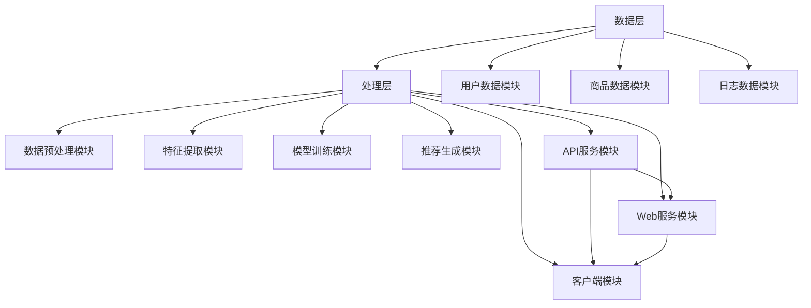

                 

### 目录大纲：构建AI驱动的个性化推荐提示词引擎

```markdown
# 目录大纲：构建AI驱动的个性化推荐提示词引擎

## 第1章 引言与背景

### 1.1 人工智能与个性化推荐概述
#### 1.1.1 人工智能发展历程
#### 1.1.2 个性化推荐系统的需求与挑战

### 1.2 AI驱动的个性化推荐现状与趋势
#### 1.2.1 个性化推荐技术的发展
#### 1.2.2 AI在个性化推荐中的应用

## 第2章 核心概念

### 2.1 个性化推荐基础
#### 2.1.1 用户兴趣建模
#### 2.1.2 商品（内容）特征描述

### 2.2 AI在个性化推荐中的应用
#### 2.2.1 协同过滤算法
#### 2.2.2 内容推荐算法

## 第3章 算法原理与数学模型

### 3.1 个性化推荐算法概述
#### 3.1.1 机器学习算法
#### 3.1.2 深度学习算法

### 3.2 算法原理讲解
#### 3.2.1 矩阵分解
#### 3.2.2 基于深度学习的推荐模型

### 3.3 数学模型与公式
#### 3.3.1 推荐算法的数学表示
#### 3.3.2 模型参数优化方法

## 第4章 系统分析与架构设计

### 4.1 系统需求分析
#### 4.1.1 用户需求
#### 4.1.2 商品种类与特点

### 4.2 系统架构设计
#### 4.2.1 系统架构概述
#### 4.2.2 主要模块功能

## 第5章 系统实现与实战

### 5.1 系统开发环境搭建
#### 5.1.1 硬件配置
#### 5.1.2 软件工具与库

### 5.2 个性化推荐模型训练
#### 5.2.1 数据预处理
#### 5.2.2 模型训练与评估

### 5.3 实际项目实战
#### 5.3.1 项目背景
#### 5.3.2 系统实现流程

## 第6章 性能优化与调参技巧

### 6.1 性能优化策略
#### 6.1.1 模型压缩
#### 6.1.2 模型加速

### 6.2 调参技巧
#### 6.2.1 超参数调整
#### 6.2.2 模型调优

## 第7章 总结与展望

### 7.1 主要内容回顾
#### 7.1.1 个性化推荐系统的核心组成部分
#### 7.1.2 个性化推荐算法的原理与实现

### 7.2 未来发展趋势
#### 7.2.1 人工智能与个性化推荐的融合
#### 7.2.2 面向未来的个性化推荐系统建设
```

### 第1章 引言与背景

在数字化的今天，个性化推荐系统已经成为众多互联网公司提高用户黏性和转化率的重要手段。通过分析用户的行为数据，推荐系统能够为用户量身定制内容，提高用户满意度，进而提升商业价值。然而，随着数据的多样性和复杂性增加，传统的推荐系统面临诸多挑战。AI驱动的个性化推荐提示词引擎应运而生，它利用深度学习、自然语言处理等技术，为推荐系统注入新的活力。

#### 1.1 人工智能与个性化推荐概述

人工智能（Artificial Intelligence，AI）是计算机科学的一个分支，旨在使计算机能够模拟人类智能行为。从早期的专家系统到如今深度学习、强化学习等先进技术的应用，人工智能经历了长足的发展。而个性化推荐（Personalized Recommendation）是一种利用算法分析用户行为和偏好，为用户推荐其可能感兴趣的商品、内容或其他形式的信息系统。

**核心概念术语说明**：

- **人工智能（AI）**：通过模拟人类思维过程，实现机器自动化决策和问题解决的能力。
- **个性化推荐系统**：基于用户行为数据和内容特征，为用户推荐个性化信息的服务系统。

**问题背景**：

随着互联网的普及，用户生成的内容和数据量呈爆炸式增长。如何在海量数据中找到用户感兴趣的内容，成为互联网企业面临的重大挑战。传统推荐系统依赖显式反馈（如评分、点击等），但用户产生的行为数据有限，且容易过时。为解决这些问题，AI驱动的个性化推荐系统应运而生。

**问题描述**：

个性化推荐系统的目标是提高推荐质量，减少冷启动问题（即新用户或新商品如何获得推荐）和提高推荐系统的实时性。然而，随着数据复杂性增加，传统推荐系统已无法满足需求。AI驱动的推荐系统通过深度学习、自然语言处理等技术，有望解决这些问题。

**问题解决**：

AI驱动的个性化推荐系统通过以下方式提高推荐质量：

1. **用户兴趣建模**：利用深度学习技术，对用户的历史行为进行建模，捕捉用户长期和短期的兴趣变化。
2. **商品（内容）特征描述**：通过自然语言处理技术，对商品或内容进行深入分析，提取特征。
3. **实时推荐**：利用实时数据流处理技术，动态更新推荐结果。

**边界与外延**：

个性化推荐系统不仅应用于电子商务领域，还广泛应用于社交媒体、音乐、视频、新闻等各个领域。其核心在于利用AI技术，实现高度个性化的信息推荐。

**概念结构与核心要素组成**：

个性化推荐系统的核心要素包括：

- **用户数据**：用户行为、偏好、历史记录等。
- **商品数据**：商品属性、描述、类别等。
- **推荐算法**：基于用户和商品数据的推荐算法。
- **推荐结果**：推荐系统的输出结果，即推荐的商品或内容。

#### 1.2 AI驱动的个性化推荐现状与趋势

AI驱动的个性化推荐技术在近年来取得了显著进展。深度学习和自然语言处理等技术的应用，使得推荐系统的准确性和实时性得到了大幅提升。

**个性化推荐技术的发展**：

1. **协同过滤**：基于用户行为的相似度进行推荐，是最早的个性化推荐算法之一。
2. **基于内容的推荐**：通过分析商品或内容的特征，为用户推荐相似的商品或内容。
3. **混合推荐**：结合协同过滤和基于内容的推荐，提高推荐质量。

**AI在个性化推荐中的应用**：

1. **深度学习**：通过神经网络，对用户行为和商品特征进行建模，实现高效的特征提取和推荐。
2. **自然语言处理**：对文本数据进行处理，提取语义信息，为推荐系统提供更丰富的特征。
3. **强化学习**：通过不断地学习和调整策略，提高推荐系统的优化效果。

**现状与趋势**：

目前，AI驱动的个性化推荐技术已经成为互联网公司的核心竞争力。未来，随着技术的不断进步，个性化推荐系统将进一步融合多种AI技术，实现更智能、更精准的推荐。

### 1.3 AI驱动的个性化推荐提示词引擎的设计理念

AI驱动的个性化推荐提示词引擎的设计理念在于通过智能化的方式，提高推荐系统的性能和用户体验。具体包括以下几个方面：

1. **用户行为分析与建模**：利用深度学习技术，对用户的历史行为进行深入分析，构建用户兴趣模型。
2. **内容特征提取与融合**：通过自然语言处理技术，对商品或内容进行特征提取，并与用户兴趣模型进行融合。
3. **实时推荐与调整**：利用实时数据流处理技术，动态更新推荐结果，提高推荐系统的实时性。

**关键技术与挑战**：

- **深度学习技术**：如何有效利用深度学习模型，捕捉用户兴趣的变化。
- **自然语言处理技术**：如何提取和融合文本特征，提高推荐系统的解释性。
- **实时数据处理**：如何在海量数据中实现高效的实时推荐。

通过以上设计理念，AI驱动的个性化推荐提示词引擎有望实现高度个性化的推荐，提升用户体验和商业价值。

### 1.4 总结

本章介绍了AI驱动的个性化推荐系统的背景、核心概念及其发展趋势。AI驱动的个性化推荐提示词引擎通过智能化的方式，提高推荐系统的性能和用户体验，是未来推荐系统发展的重要方向。在后续章节中，我们将深入探讨个性化推荐算法的原理、数学模型、系统设计与实现，以及性能优化与调参技巧。

## 第2章 核心概念

个性化推荐系统的核心在于理解用户行为和商品特征，从而为用户推荐其可能感兴趣的内容。本章将详细介绍个性化推荐的基础概念，包括用户兴趣建模和商品（内容）特征描述。

### 2.1 个性化推荐基础

个性化推荐系统主要依赖于用户数据和商品数据。通过分析这些数据，系统能够理解用户的兴趣和偏好，进而推荐相应的商品或内容。

**用户兴趣建模**：

用户兴趣建模是个性化推荐系统的核心。它旨在捕捉用户的长期和短期兴趣，从而为用户推荐感兴趣的内容。

1. **用户行为数据**：包括用户在平台上的浏览记录、购买记录、点击行为等。这些数据可以用来分析用户的兴趣偏好。
2. **用户特征数据**：包括用户的年龄、性别、地理位置、浏览时长等。这些数据可以帮助系统更好地理解用户背景，从而更准确地推荐内容。

**商品（内容）特征描述**：

商品（内容）特征描述是指对商品或内容的属性、标签、类别等进行描述，以便系统能够理解商品或内容的特性。

1. **商品属性**：包括商品的价格、品牌、类型、库存数量等。这些属性可以帮助系统了解商品的基本信息。
2. **商品标签**：为商品分配标签，以便系统可以根据标签为用户推荐相应的商品。标签可以是商品的类别、风格、颜色等。

**核心概念对比表格**：

| 概念        | 定义                                                         | 作用                       |
|-------------|--------------------------------------------------------------|----------------------------|
| 用户兴趣建模 | 通过分析用户行为数据，捕捉用户兴趣偏好。                     | 提高推荐系统的准确性。     |
| 商品特征描述 | 对商品或内容的属性、标签、类别等进行描述。                   | 帮助系统理解商品或内容。   |
| 推荐算法    | 利用用户和商品特征，为用户推荐感兴趣的内容。                 | 实现个性化推荐的核心。     |

**ER实体关系图架构**：

为了更好地理解用户兴趣建模和商品特征描述，我们可以通过ER实体关系图来展示它们之间的关系。

```mermaid
erDiagram
  User ||--o> Behavior : 用户行为
  User ||--o> Feature : 用户特征
  Item ||--o> Attribute : 商品属性
  Item ||--o> Tag : 商品标签
  Behavior ||--o> Recommendation : 推荐结果
  Feature ||--o> Recommendation : 推荐结果
  Attribute ||--o> Recommendation : 推荐结果
  Tag ||--o> Recommendation : 推荐结果
```

在上面的ER实体关系图中，用户（User）和商品（Item）是核心实体，它们分别与行为（Behavior）、特征（Feature）、属性（Attribute）和标签（Tag）实体相关联。推荐结果（Recommendation）是系统的输出，与上述实体均有关系。

### 2.2 AI在个性化推荐中的应用

AI在个性化推荐中的应用主要包括协同过滤算法和内容推荐算法。这两种算法各有优缺点，在实际应用中常常结合使用，以实现更精准的推荐。

**协同过滤算法**：

协同过滤算法（Collaborative Filtering）是个性化推荐系统中常用的一种算法。它通过分析用户之间的行为相似度，为用户推荐他们可能感兴趣的商品或内容。

1. **基于用户的协同过滤**：通过计算用户之间的相似度，找到相似用户，然后推荐这些用户喜欢的商品或内容。
2. **基于项目的协同过滤**：通过计算商品之间的相似度，找到相似商品，然后推荐给用户。

**核心概念**：

- **用户相似度**：衡量用户之间的相似程度，常用的方法包括余弦相似度、皮尔逊相关系数等。
- **推荐列表**：基于相似度计算，为用户生成推荐列表。

**优点**：

- **简单易实现**：协同过滤算法相对简单，易于理解和实现。
- **实时性较好**：通过用户行为实时更新推荐列表。

**缺点**：

- **冷启动问题**：新用户或新商品缺乏历史数据，难以进行有效推荐。
- **可解释性较差**：推荐结果依赖于用户行为，难以解释。

**内容推荐算法**：

内容推荐算法（Content-Based Filtering）通过分析商品或内容的特征，为用户推荐具有相似特征的商品或内容。

1. **基于项目的推荐**：通过分析商品或内容的属性，找到相似的商品或内容，然后推荐给用户。
2. **基于用户的历史偏好**：通过分析用户过去喜欢的商品或内容，找到相似的商品或内容，然后推荐给用户。

**核心概念**：

- **特征提取**：从商品或内容中提取特征，如文本、图像、音频等。
- **相似度计算**：计算商品或内容之间的相似度，常用的方法包括TF-IDF、余弦相似度等。

**优点**：

- **可解释性较好**：推荐结果基于商品或内容的特征，容易解释。
- **适用于冷启动问题**：无需历史行为数据，适用于新用户或新商品。

**缺点**：

- **实时性较差**：需要定期更新特征库，实时性较差。
- **推荐多样性较差**：容易陷入“只推荐相似内容”的困境。

**混合推荐算法**：

为了克服协同过滤算法和内容推荐算法的缺点，混合推荐算法将两种算法结合使用，以提高推荐质量。

1. **加权混合**：根据用户和商品的特征，对协同过滤和内容推荐的结果进行加权融合。
2. **基于模型的混合**：利用机器学习模型，将协同过滤和内容推荐算法集成到一个统一的框架中。

**核心概念**：

- **模型融合**：通过机器学习模型，将协同过滤和内容推荐的结果进行融合。
- **权重调整**：根据用户和商品的特征，动态调整协同过滤和内容推荐的比例。

**优点**：

- **提高推荐质量**：结合了协同过滤和内容推荐的优势，提高了推荐质量。
- **适用于不同场景**：可以根据实际需求，调整协同过滤和内容推荐的比例。

**缺点**：

- **计算复杂度较高**：混合推荐算法的计算复杂度较高，需要更多的计算资源。
- **可解释性较差**：推荐结果依赖于复杂的模型，难以解释。

通过以上内容，我们可以看到，AI在个性化推荐中的应用主要包括协同过滤算法和内容推荐算法。这两种算法各有优缺点，混合推荐算法则结合了它们的优势，提高了推荐质量。在实际应用中，可以根据具体需求，选择合适的算法或算法组合。

### 2.3 小结

本章介绍了个性化推荐系统的核心概念，包括用户兴趣建模和商品（内容）特征描述。通过用户行为数据和商品特征数据，个性化推荐系统能够为用户推荐感兴趣的内容。本章还讨论了AI在个性化推荐中的应用，包括协同过滤算法和内容推荐算法，以及混合推荐算法。这些算法各有优缺点，但通过合理组合，可以显著提高推荐质量。

## 第3章 算法原理与数学模型

在个性化推荐系统中，算法原理和数学模型是核心组成部分，它们决定了推荐系统的性能和效果。本章将详细介绍个性化推荐算法的原理，包括机器学习算法和深度学习算法，并探讨相关的数学模型和公式。

### 3.1 个性化推荐算法概述

个性化推荐算法可以分为两类：基于内容的推荐（Content-Based Recommendation）和基于协同过滤的推荐（Collaborative Filtering）。此外，近年来深度学习（Deep Learning）在推荐系统中的应用也取得了显著进展。

**基于内容的推荐算法**：

基于内容的推荐算法通过分析用户历史行为和商品特征，为用户推荐具有相似特征的商品或内容。其主要步骤包括：

1. **用户历史行为分析**：分析用户过去喜欢或浏览过的商品或内容，提取用户兴趣点。
2. **商品特征提取**：从商品中提取特征，如文本、图像、音频等。
3. **特征匹配**：将用户兴趣点与商品特征进行匹配，计算相似度。
4. **生成推荐列表**：根据相似度排序，生成推荐列表。

**核心数学模型**：

- **TF-IDF模型**：用于文本数据的特征提取，通过词频（TF）和逆文档频率（IDF）计算词语的重要性。
- **余弦相似度模型**：用于计算用户兴趣点与商品特征的相似度，公式为：

  $$\text{Similarity} = \frac{\text{dot\_product}(u, v)}{\|\text{u}\| \|\text{v}\|}$$

  其中，$u$ 和 $v$ 分别表示用户兴趣点向量和商品特征向量。

**基于协同过滤的推荐算法**：

基于协同过滤的推荐算法通过分析用户之间的行为相似度，为用户推荐其他用户喜欢的商品或内容。其主要步骤包括：

1. **用户相似度计算**：计算用户之间的相似度，常用方法包括余弦相似度、皮尔逊相关系数等。
2. **邻居用户选择**：选择与目标用户最相似的邻居用户。
3. **生成推荐列表**：根据邻居用户喜欢的商品或内容，生成推荐列表。

**核心数学模型**：

- **相似度计算模型**：计算用户之间的相似度，公式为：

  $$\text{Similarity} = \frac{\sum_{i \in R} (r_{ui} - \bar{r}_{u})(r_{vj} - \bar{r}_{v})}{\sqrt{\sum_{i \in R} (r_{ui} - \bar{r}_{u})^2} \sqrt{\sum_{i \in R} (r_{vj} - \bar{r}_{v})^2}}$$

  其中，$R$ 表示共同评分的项目集合，$\bar{r}_{u}$ 和 $\bar{r}_{v}$ 分别表示用户 $u$ 和 $v$ 的平均评分。

**深度学习推荐算法**：

深度学习推荐算法通过构建深度神经网络，从原始数据中自动提取特征，实现高效的推荐。其主要步骤包括：

1. **数据预处理**：将用户和商品数据转化为神经网络可处理的格式。
2. **构建神经网络模型**：设计适合推荐问题的神经网络架构。
3. **模型训练与优化**：使用训练数据对模型进行训练，并优化模型参数。
4. **生成推荐列表**：使用训练好的模型为用户生成推荐列表。

**核心数学模型**：

- **深度神经网络模型**：常用的深度学习模型包括卷积神经网络（CNN）、循环神经网络（RNN）和Transformer等。以Transformer为例，其核心模型由自注意力机制（Self-Attention）和多头注意力机制（Multi-Head Attention）构成。

  $$\text{Attention}(Q, K, V) = \text{softmax}\left(\frac{QK^T}{\sqrt{d_k}}\right)V$$

  其中，$Q, K, V$ 分别表示查询向量、键向量和值向量，$d_k$ 表示键向量的维度。

### 3.2 算法原理讲解

为了深入理解个性化推荐算法的原理，我们将分别探讨矩阵分解（Matrix Factorization）、基于深度学习的推荐模型（Deep Learning-based Recommendation Models）以及其数学模型。

**3.2.1 矩阵分解**

矩阵分解是一种常用的推荐算法，通过将用户-商品评分矩阵分解为两个低秩矩阵，从而实现高效的特征提取和推荐。

**核心数学模型**：

- **Singular Value Decomposition (SVD)**：将用户-商品评分矩阵 $R$ 分解为三个矩阵的乘积：

  $$R = U\Sigma V^T$$

  其中，$U$ 和 $V$ 分别是用户和商品的特征矩阵，$\Sigma$ 是对角矩阵，包含特征向量的奇异值。

- **矩阵分解模型**：通过优化目标函数，最小化预测误差，从而得到用户和商品的特征矩阵。常见的目标函数包括均方误差（MSE）和均方根误差（RMSE）：

  $$\min_{U, \Sigma, V} \sum_{i=1}^{m} \sum_{j=1}^{n} (r_{ij} - \hat{r}_{ij})^2$$

  其中，$r_{ij}$ 表示用户 $i$ 对商品 $j$ 的真实评分，$\hat{r}_{ij}$ 表示预测评分。

**算法流程**：

1. **初始化特征矩阵**：随机初始化用户和商品的特征矩阵 $U$ 和 $V$。
2. **计算预测评分**：使用特征矩阵计算预测评分 $\hat{r}_{ij}$。
3. **计算误差**：计算预测评分与真实评分之间的误差。
4. **更新特征矩阵**：根据误差，更新用户和商品的特征矩阵。
5. **重复步骤 2-4**，直至达到收敛条件。

**3.2.2 基于深度学习的推荐模型**

基于深度学习的推荐模型通过构建深度神经网络，从原始数据中自动提取特征，实现高效的推荐。

**核心数学模型**：

- **深度神经网络模型**：以多层感知机（MLP）为例，其输入层接收用户和商品的特征，输出层生成推荐结果。中间层通过非线性激活函数（如ReLU）进行特征提取和变换。

  $$\text{激活函数} = \text{ReLU}(z) = \max(0, z)$$

- **损失函数**：使用均方误差（MSE）或交叉熵损失函数（Cross-Entropy Loss）来衡量预测结果与真实结果之间的误差。

  $$\text{MSE} = \frac{1}{n} \sum_{i=1}^{n} (\hat{r}_{ij} - r_{ij})^2$$
  
  $$\text{Cross-Entropy Loss} = -\frac{1}{n} \sum_{i=1}^{n} r_{ij} \log(\hat{r}_{ij})$$

**算法流程**：

1. **数据预处理**：将用户和商品数据转化为神经网络可处理的格式，如嵌入向量（Embedding）。
2. **构建神经网络模型**：设计适合推荐问题的神经网络架构。
3. **模型训练与优化**：使用训练数据对模型进行训练，并优化模型参数。
4. **生成推荐列表**：使用训练好的模型为用户生成推荐列表。

**3.2.3 数学模型与公式**

在个性化推荐系统中，数学模型和公式是理解和实现推荐算法的基础。以下是一些常用的数学模型和公式：

- **用户兴趣向量表示**：使用向量表示用户兴趣，如：

  $$\text{User Interest Vector} = \text{Embedding}(User ID)$$

- **商品特征向量表示**：使用向量表示商品特征，如：

  $$\text{Item Feature Vector} = \text{Embedding}(Item ID)$$

- **预测评分公式**：使用神经网络预测用户对商品的评分，如：

  $$\hat{r}_{ij} = \text{activation}(W \cdot [\text{User Interest Vector}; \text{Item Feature Vector}])$$

- **优化目标函数**：使用均方误差（MSE）或交叉熵损失函数（Cross-Entropy Loss）优化模型参数，如：

  $$\min_{W} \text{Loss} = \frac{1}{n} \sum_{i=1}^{n} (\hat{r}_{ij} - r_{ij})^2$$
  
  $$\min_{W} \text{Loss} = -\frac{1}{n} \sum_{i=1}^{n} r_{ij} \log(\hat{r}_{ij})$$

通过以上内容，我们可以看到，个性化推荐算法的原理和数学模型是实现高效推荐的关键。无论是传统的矩阵分解还是基于深度学习的推荐模型，都需要理解数学模型和公式的本质，从而在实际应用中实现精准的推荐。

### 3.3 数学模型与公式

个性化推荐系统中的数学模型和公式是理解和实现推荐算法的核心。以下我们将详细探讨推荐算法的数学表示、模型参数优化方法，并使用具体的数学公式进行说明。

**3.3.1 推荐算法的数学表示**

在个性化推荐系统中，用户行为数据通常可以用一个用户-商品评分矩阵 $R$ 来表示，其中 $R_{ij}$ 表示用户 $i$ 对商品 $j$ 的评分。推荐算法的目标是预测用户对未评分商品的评分，从而生成推荐列表。

**用户-商品评分矩阵**：

$$
R = \begin{bmatrix}
r_{11} & r_{12} & \cdots & r_{1n} \\
r_{21} & r_{22} & \cdots & r_{2n} \\
\vdots & \vdots & \ddots & \vdots \\
r_{m1} & r_{m2} & \cdots & r_{mn}
\end{bmatrix}
$$

其中，$r_{ij}$ 是用户 $i$ 对商品 $j$ 的评分，$m$ 和 $n$ 分别是用户数和商品数。

**3.3.2 模型参数优化方法**

推荐系统的性能依赖于模型参数的选择。参数优化方法旨在通过调整模型参数，提高预测准确性。以下介绍几种常见的参数优化方法：

1. **均方误差（MSE）**：

   $$\text{MSE} = \frac{1}{m \cdot n} \sum_{i=1}^{m} \sum_{j=1}^{n} (r_{ij} - \hat{r}_{ij})^2$$

   其中，$\hat{r}_{ij}$ 是预测的评分，$r_{ij}$ 是真实的评分。MSE 用于衡量预测误差。

2. **均方根误差（RMSE）**：

   $$\text{RMSE} = \sqrt{\text{MSE}} = \sqrt{\frac{1}{m \cdot n} \sum_{i=1}^{m} \sum_{j=1}^{n} (r_{ij} - \hat{r}_{ij})^2}$$

   RMSE 是 MSE 的平方根，用于更直观地表示误差。

3. **交叉熵损失（Cross-Entropy Loss）**：

   $$\text{Cross-Entropy Loss} = -\frac{1}{m \cdot n} \sum_{i=1}^{m} \sum_{j=1}^{n} r_{ij} \log(\hat{r}_{ij})$$

   交叉熵损失常用于二分类问题，也可以扩展到多分类问题。

**3.3.3 数学模型与公式示例**

以下是一个基于矩阵分解的推荐系统的数学模型示例。

**用户和商品特征矩阵**：

$$
\begin{align*}
U &= \begin{bmatrix}
u_{11} & u_{12} & \cdots & u_{1k} \\
u_{21} & u_{22} & \cdots & u_{2k} \\
\vdots & \vdots & \ddots & \vdots \\
u_{m1} & u_{m2} & \cdots & u_{mk}
\end{bmatrix}, \\
V &= \begin{bmatrix}
v_{11} & v_{12} & \cdots & v_{1k} \\
v_{21} & v_{22} & \cdots & v_{2k} \\
\vdots & \vdots & \ddots & \vdots \\
v_{n1} & v_{n2} & \cdots & v_{nk}
\end{bmatrix},
\end{align*}$$

其中，$u_{ij}$ 和 $v_{ij}$ 分别表示用户 $i$ 和商品 $j$ 的特征向量。

**预测评分公式**：

$$\hat{r}_{ij} = \sum_{k=1}^{k} u_{ik} \cdot v_{kj}$$

**优化目标函数**：

$$\min_{U, V} \sum_{i=1}^{m} \sum_{j=1}^{n} (r_{ij} - \hat{r}_{ij})^2$$

通过这个示例，我们可以看到矩阵分解模型如何将用户-商品评分矩阵分解为两个低秩矩阵，从而实现高效的评分预测和推荐。

### 3.4 小结

本章详细介绍了个性化推荐算法的原理和数学模型。通过理解矩阵分解、深度学习等算法的数学表示和公式，我们可以构建高效的推荐系统。本章还讨论了优化目标函数和参数优化方法，为推荐系统的性能提升提供了理论基础。在后续章节中，我们将进一步探讨系统设计与实现、项目实战以及性能优化等关键内容。

## 第4章 系统分析与架构设计

在个性化推荐系统的设计与实现过程中，系统需求分析、架构设计以及模块功能是至关重要的一环。本章将详细介绍系统分析与架构设计，包括需求分析、系统架构设计、主要模块功能等。

### 4.1 系统需求分析

个性化推荐系统需要满足多个方面的需求，主要包括以下几个方面：

#### 4.1.1 用户需求

1. **个性化推荐**：用户希望系统能够根据他们的兴趣和行为，提供个性化的内容推荐。
2. **实时性**：用户希望推荐结果能够实时更新，以满足他们的即时需求。
3. **多样性**：用户不希望每次都看到相同类型的内容，期望推荐结果具有多样性。
4. **准确度**：用户希望推荐系统能够提供高准确度的推荐，从而提高他们的满意度。

#### 4.1.2 商品种类与特点

1. **商品多样性**：系统需要处理多种类型的商品，包括书籍、电影、音乐、新闻等。
2. **商品特征提取**：针对不同类型的商品，需要提取相应的特征，如文本、图像、音频等。
3. **商品动态更新**：商品信息需要实时更新，以反映市场的最新动态。

#### 4.1.3 系统性能需求

1. **高并发处理能力**：系统需要能够处理大量用户的并发请求，保证系统的高可用性。
2. **可扩展性**：系统应具备良好的可扩展性，能够随着数据量和用户量的增长而扩展。
3. **低延迟**：系统需要具有低延迟的特点，确保用户能够快速获得推荐结果。

### 4.2 系统架构设计

个性化推荐系统的架构设计需要考虑系统的可扩展性、灵活性和高并发处理能力。以下是一个典型的系统架构设计：

**系统架构概述**：

1. **数据层**：包括用户数据、商品数据和日志数据等，这些数据存储在数据库中，供系统分析和推荐使用。
2. **处理层**：包括数据预处理模块、特征提取模块、模型训练模块和推荐生成模块等，负责对数据进行处理和推荐生成。
3. **服务层**：包括API服务、Web服务、客户端等，负责与用户交互，提供推荐结果。

**主要模块功能**：

1. **数据层**：
   - **用户数据模块**：存储用户的基本信息、兴趣偏好、行为记录等。
   - **商品数据模块**：存储商品的基本信息、特征标签、分类信息等。
   - **日志数据模块**：存储用户行为日志，用于数据分析和模型训练。

2. **处理层**：
   - **数据预处理模块**：对原始数据进行清洗、去噪、归一化等处理，确保数据质量。
   - **特征提取模块**：从用户和商品数据中提取特征，如文本特征、图像特征、行为特征等。
   - **模型训练模块**：利用深度学习、机器学习算法训练推荐模型，包括用户兴趣模型和商品特征模型。
   - **推荐生成模块**：根据用户兴趣模型和商品特征模型，为用户生成个性化推荐列表。

3. **服务层**：
   - **API服务模块**：提供RESTful API，供外部系统和应用调用推荐服务。
   - **Web服务模块**：为用户提供Web界面，展示推荐结果，并进行交互。
   - **客户端模块**：为移动端和桌面端用户提供推荐结果展示和交互功能。

### 4.3 系统架构设计图

为了更好地理解系统架构设计，我们可以通过Mermaid工具绘制系统架构图。以下是系统架构设计图：



在这个架构图中，数据层通过数据库存储用户、商品和日志数据。处理层包括数据预处理模块、特征提取模块、模型训练模块和推荐生成模块，负责数据分析和推荐生成。服务层包括API服务模块、Web服务模块和客户端模块，负责与用户交互并提供推荐服务。

### 4.4 系统接口设计

系统接口设计是系统架构设计的重要部分，它定义了系统内部模块之间的通信方式。以下是系统接口设计的关键要素：

1. **API接口规范**：定义API接口的URL、请求参数、响应格式等，确保系统各模块之间能够顺利通信。
2. **数据传输协议**：选择合适的数据传输协议，如HTTP/HTTPS、gRPC等，确保数据传输的可靠性和安全性。
3. **接口权限控制**：对API接口进行权限控制，确保只有授权的用户和系统可以访问接口。

### 4.5 系统交互设计

系统交互设计描述了系统内部各模块之间的交互流程。以下是系统交互设计的关键要素：

1. **用户交互流程**：描述用户如何通过Web界面或客户端与系统进行交互，获取推荐结果。
2. **后台处理流程**：描述系统后台模块如何处理用户请求，生成推荐结果，并返回给用户。
3. **日志记录和监控**：描述系统如何记录用户行为日志，并对其进行监控和分析。

### 4.6 小结

本章详细介绍了个性化推荐系统的需求分析、架构设计和模块功能。通过系统需求分析，明确了用户和系统的需求；通过架构设计，确保系统具有高效、可扩展、高并发处理能力；通过模块功能划分，实现了系统各部分的协同工作。在后续章节中，我们将进一步探讨系统实现与实战，以及性能优化与调参技巧。

## 第5章 系统实现与实战

在完成系统分析与架构设计之后，接下来是系统实现与实战。本章将详细介绍个性化推荐系统的实现过程，包括环境搭建、模型训练和实际项目实战。通过这些步骤，我们将逐步构建一个高效的AI驱动的个性化推荐提示词引擎。

### 5.1 系统开发环境搭建

**5.1.1 硬件配置**

为了确保系统的高并发处理能力和快速响应时间，硬件配置应考虑以下要求：

- **CPU**：建议使用多核CPU，如Intel Xeon系列或AMD Ryzen系列，以保证计算性能。
- **内存**：至少需要64GB内存，以便处理大量数据。
- **存储**：建议使用SSD硬盘，以提高数据读写速度。推荐配置为1TB以上。
- **网络**：建议使用千兆以太网，确保数据传输的稳定性。

**5.1.2 软件工具与库**

个性化推荐系统的开发需要使用多个工具和库，以下为推荐的软件环境：

- **操作系统**：Linux发行版，如Ubuntu 18.04或更高版本。
- **编程语言**：Python，作为主要编程语言，具有丰富的库和工具。
- **深度学习框架**：TensorFlow或PyTorch，用于构建和训练推荐模型。
- **数据存储**：MySQL或PostgreSQL，用于存储用户和商品数据。
- **数据处理库**：NumPy、Pandas、Scikit-learn，用于数据处理和分析。
- **其他库**：Flask或Django，用于构建API服务；TensorBoard，用于可视化模型训练过程。

### 5.2 个性化推荐模型训练

**5.2.1 数据预处理**

数据预处理是推荐系统训练的关键步骤，主要包括数据清洗、去噪、归一化等操作。

1. **数据清洗**：去除缺失值、重复值和异常值，保证数据质量。
2. **数据去噪**：对于文本数据，使用自然语言处理技术去除停用词、标点符号等噪声。
3. **数据归一化**：将不同特征的数据范围统一，例如将评分数据进行归一化处理，使其分布在[0, 1]之间。

**5.2.2 模型训练与评估**

个性化推荐模型的训练过程包括以下步骤：

1. **模型构建**：使用深度学习框架构建推荐模型，例如使用PyTorch构建一个基于Transformer的推荐模型。
2. **数据切分**：将数据集划分为训练集、验证集和测试集，用于训练、验证和评估模型。
3. **模型训练**：使用训练集数据训练模型，并使用验证集进行调参和优化。
4. **模型评估**：使用测试集评估模型性能，常用的评价指标包括准确率、召回率、F1值等。

**5.2.3 模型优化**

模型优化是提升推荐系统性能的重要手段，包括以下几个方面：

1. **超参数调整**：调整学习率、批量大小、隐藏层节点数等超参数，以找到最佳配置。
2. **模型剪枝**：通过剪枝技术减少模型参数数量，提高模型运行效率。
3. **迁移学习**：利用预训练的模型，通过微调进行训练，以提高模型性能。

### 5.3 实际项目实战

**5.3.1 项目背景**

假设我们为一个电商平台开发一个个性化推荐系统，目标是提高用户购买转化率和用户满意度。项目要求系统在保证推荐准确性的同时，具备实时性和多样性。

**5.3.2 系统实现流程**

1. **需求分析与系统设计**：根据项目需求，分析用户和商品特征，设计推荐系统架构。
2. **数据收集与预处理**：从电商平台的数据库中收集用户行为数据、商品信息等，进行数据预处理。
3. **模型构建与训练**：使用深度学习框架构建推荐模型，如使用Transformer模型，并进行训练。
4. **模型评估与优化**：使用测试集评估模型性能，并针对性能指标进行模型优化。
5. **系统部署与运维**：将训练好的模型部署到生产环境，进行实时推荐，并进行系统监控与维护。

**5.3.3 代码示例**

以下是一个使用PyTorch构建个性化推荐模型的简单示例：

```python
import torch
import torch.nn as nn
import torch.optim as optim
from torch.utils.data import DataLoader, Dataset

# 数据预处理
class MyDataset(Dataset):
    def __init__(self, data):
        self.data = data

    def __len__(self):
        return len(self.data)

    def __getitem__(self, idx):
        user_id, item_id, rating = self.data[idx]
        return user_id, item_id, rating

# 模型构建
class RecommenderModel(nn.Module):
    def __init__(self, num_users, num_items):
        super(RecommenderModel, self).__init__()
        self.user_embedding = nn.Embedding(num_users, embedding_dim)
        self.item_embedding = nn.Embedding(num_items, embedding_dim)
        self.fc = nn.Linear(embedding_dim * 2, 1)

    def forward(self, user_ids, item_ids):
        user_embeddings = self.user_embedding(user_ids)
        item_embeddings = self.item_embedding(item_ids)
        combined_embeddings = torch.cat((user_embeddings, item_embeddings), 1)
        ratings = self.fc(combined_embeddings).squeeze(1)
        return ratings

# 模型训练
model = RecommenderModel(num_users, num_items)
optimizer = optim.Adam(model.parameters(), lr=0.001)
criterion = nn.MSELoss()

for epoch in range(num_epochs):
    for user_id, item_id, rating in DataLoader(MyDataset(train_data), batch_size):
        optimizer.zero_grad()
        ratings = model(user_id, item_id)
        loss = criterion(ratings, rating)
        loss.backward()
        optimizer.step()
    print(f'Epoch [{epoch+1}/{num_epochs}], Loss: {loss.item()}')

# 模型评估
with torch.no_grad():
    test_ratings = model(user_id, item_id)
    test_loss = criterion(test_ratings, rating)
    print(f'Test Loss: {test_loss.item()}')
```

在这个示例中，我们构建了一个基于嵌入向量（Embedding）的推荐模型，并使用MSE损失函数进行训练和评估。通过调整超参数和优化模型结构，我们可以进一步提高模型性能。

### 5.4 小结

本章详细介绍了个性化推荐系统的实现过程，包括环境搭建、模型训练和实际项目实战。通过逐步实现系统，我们不仅掌握了推荐系统的基础知识，还学会了如何构建和优化推荐模型。在后续章节中，我们将进一步探讨如何优化系统性能、调整模型参数，以及总结主要内容和展望未来发展趋势。

### 5.5 最佳实践 Tips

- **数据质量保障**：确保数据的准确性、完整性和一致性，是推荐系统成功的关键。
- **实时数据处理**：利用实时数据流处理技术（如Apache Kafka），提高推荐系统的实时性。
- **个性化调整**：针对不同用户群体，定制化推荐策略，提升用户体验。
- **模型调优**：定期评估和优化模型，根据业务需求调整模型参数。

## 第6章 性能优化与调参技巧

在构建AI驱动的个性化推荐提示词引擎时，性能优化和调参技巧是提高系统效率和推荐质量的关键环节。本章将详细介绍性能优化策略、调参技巧以及实际应用中的注意事项。

### 6.1 性能优化策略

性能优化策略主要包括以下几个方面：

#### 6.1.1 模型压缩

模型压缩旨在减少模型大小，降低计算资源消耗。常见的模型压缩方法包括：

1. **参数剪枝**：通过剪枝冗余的参数，减少模型参数数量。
2. **量化**：将模型的浮点数参数替换为低精度数值，如8位或16位整数。
3. **知识蒸馏**：利用预训练的大型模型，对目标模型进行训练，以提高其性能。

#### 6.1.2 模型加速

模型加速方法可以显著提高系统的运行效率。以下是一些常用的模型加速技术：

1. **GPU加速**：利用GPU进行模型训练和推理，提高计算速度。
2. **并行计算**：通过分布式计算，将模型训练和推理任务分布在多台机器上。
3. **内存优化**：合理管理内存，减少内存占用，提高系统运行效率。

#### 6.1.3 数据缓存与预加载

数据缓存和预加载可以减少数据读取时间，提高系统响应速度。以下是一些建议：

1. **缓存热点数据**：将频繁访问的数据存储在缓存中，如Redis。
2. **预加载**：在用户请求前，预先加载可能需要的数据，以减少延迟。

### 6.2 调参技巧

调参技巧是提升模型性能的关键步骤。以下是一些调参技巧：

#### 6.2.1 超参数调整

超参数是模型训练过程中需要手动设置的参数，如学习率、批量大小、隐藏层节点数等。以下是一些建议：

1. **学习率调度**：使用学习率调度策略，如余弦退火（Cosine Annealing）或指数衰减（Exponential Decay）。
2. **批量大小**：根据硬件资源调整批量大小，平衡训练速度和准确性。
3. **正则化**：使用L1、L2正则化或Dropout，防止过拟合。

#### 6.2.2 模型调优

模型调优是通过调整模型结构和训练过程来提高模型性能。以下是一些建议：

1. **深度和宽度的选择**：根据数据规模和任务复杂度，选择合适的网络深度和宽度。
2. **激活函数**：尝试不同的激活函数，如ReLU、Sigmoid或Tanh，找到最佳选择。
3. **损失函数**：根据任务特点选择合适的损失函数，如均方误差（MSE）或交叉熵损失。

#### 6.2.3 模型验证

模型验证是通过交叉验证、验证集等方法，评估模型性能。以下是一些建议：

1. **K折交叉验证**：将数据集划分为K个子集，每次使用一个子集作为验证集，其余子集作为训练集。
2. **A/B测试**：将用户随机分配到不同模型版本，比较模型表现，选择最佳版本。

### 6.3 实际应用中的注意事项

在实际应用中，性能优化和调参技巧需要结合具体业务场景进行调整。以下是一些注意事项：

#### 6.3.1 数据质量

确保数据质量，如准确性、完整性和一致性。错误的数据可能导致模型性能下降。

#### 6.3.2 系统负载

根据系统负载调整模型参数，避免因资源不足导致系统崩溃。

#### 6.3.3 用户隐私

在处理用户数据时，确保遵守隐私保护规定，如GDPR、CCPA等。

#### 6.3.4 模型解释性

提高模型解释性，以便用户理解推荐结果，增加用户信任度。

### 6.4 小结

性能优化和调参技巧是构建高效AI驱动的个性化推荐提示词引擎的关键。通过模型压缩、模型加速、数据缓存与预加载等策略，可以提高系统效率。通过超参数调整、模型调优和模型验证等技巧，可以提升模型性能。在实际应用中，需结合具体业务场景进行调整，并注意数据质量、系统负载、用户隐私和模型解释性等问题。通过有效的性能优化和调参，个性化推荐系统可以更好地满足用户需求，提高商业价值。

## 第7章 总结与展望

在本文中，我们详细探讨了构建AI驱动的个性化推荐提示词引擎的各个方面，从核心概念、算法原理，到系统设计与实现，再到性能优化与调参技巧。通过对这些关键环节的深入分析，我们不仅了解了AI驱动的个性化推荐系统的基本原理，还掌握了如何通过理论与实践相结合，构建一个高效、准确的推荐系统。

### 7.1 主要内容回顾

**核心概念**：个性化推荐系统通过分析用户行为和商品特征，为用户推荐其可能感兴趣的商品或内容。核心概念包括用户兴趣建模、商品特征描述、协同过滤算法、内容推荐算法等。

**算法原理讲解**：我们介绍了矩阵分解、深度学习等推荐算法的原理，并详细解释了相关的数学模型和公式。矩阵分解通过分解用户-商品评分矩阵，提取用户和商品的特征；深度学习通过构建神经网络，自动提取特征，实现高效推荐。

**系统分析与架构设计**：系统需求分析确保系统满足用户和业务需求；系统架构设计包括数据层、处理层、服务层等，实现系统各部分的协同工作。

**项目实战**：通过一个电商平台的实际项目，我们展示了个性化推荐系统的实现过程，包括数据预处理、模型训练、系统部署等步骤。

**性能优化与调参技巧**：性能优化策略如模型压缩、模型加速、数据缓存与预加载等，可以提高系统效率；调参技巧如超参数调整、模型调优和模型验证等，可以提升模型性能。

### 7.2 未来发展趋势

**人工智能与个性化推荐的融合**：随着人工智能技术的不断发展，个性化推荐系统将更加智能化，通过更先进的算法和模型，实现更精准、更高效的推荐。

**多模态数据融合**：未来的个性化推荐系统将能够融合多种类型的数据，如文本、图像、音频等，实现更全面、更准确的用户兴趣建模。

**实时推荐与动态调整**：通过实时数据处理技术，推荐系统可以实现实时推荐，根据用户行为动态调整推荐策略，提高用户满意度。

**隐私保护与数据安全**：随着用户隐私保护的重视，个性化推荐系统需要更加注重数据安全和隐私保护，确保用户数据的安全和合规。

**个性化推荐系统建设**：面向未来，个性化推荐系统的建设将更加注重用户体验和商业价值，通过不断优化和迭代，实现持续改进和提升。

### 7.3 总结

AI驱动的个性化推荐提示词引擎是现代推荐系统的核心技术，通过深度学习、自然语言处理等技术，实现了高效、精准的推荐。本文从多个角度详细介绍了个性化推荐系统的构建方法，包括核心概念、算法原理、系统设计与实现、性能优化与调参技巧等。通过本文的学习，读者可以更好地理解和应用个性化推荐技术，为实际业务场景提供解决方案。

### 7.4 注意事项

1. **数据质量**：确保数据准确性、完整性和一致性，是构建高效推荐系统的前提。
2. **用户隐私**：在处理用户数据时，严格遵守隐私保护规定，确保用户数据的安全。
3. **模型解释性**：提高模型解释性，增加用户信任度，有助于提升用户体验。

### 7.5 拓展阅读

- **《深度学习推荐系统》**：详细介绍了深度学习在推荐系统中的应用，包括模型构建、训练和优化。
- **《个性化推荐系统实践》**：提供了丰富的案例和实践经验，帮助读者更好地理解和应用个性化推荐技术。
- **《自然语言处理入门》**：介绍了自然语言处理的基本概念和技术，为多模态数据融合提供理论基础。

通过拓展阅读，读者可以进一步深入了解个性化推荐系统的相关技术和发展趋势，为自己的学习和实践提供更多支持。让我们继续关注AI驱动的个性化推荐系统，共同迎接未来的挑战和机遇。

