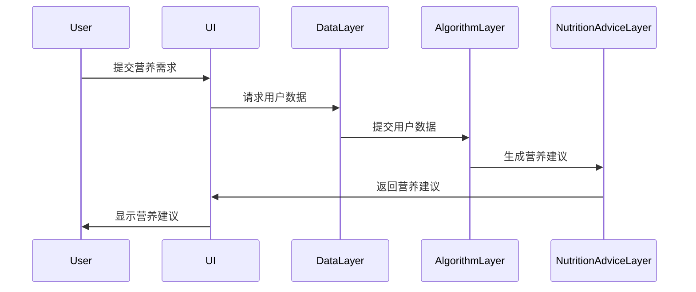

                 


### 构建AI驱动的个性化营养建议提示词引擎

> 关键词：AI，个性化营养，建议提示词引擎，机器学习，深度学习，数据处理，系统设计，实战分析

> 摘要：本文将探讨如何构建一个AI驱动的个性化营养建议提示词引擎。我们将从核心概念、算法原理、系统设计以及项目实战等多个方面，详细阐述如何实现这样一个智能系统，并分享最佳实践和注意事项。

## 引言

随着人们对健康和营养的关注日益增加，个性化营养建议成为了一个热门话题。传统的营养建议往往基于通用的饮食指南，忽略了个体差异。而AI技术的发展，尤其是机器学习和深度学习，为个性化营养建议的实现提供了强有力的支持。本文将介绍如何构建一个AI驱动的个性化营养建议提示词引擎，通过整合用户数据、营养学知识和AI算法，为用户提供精准的营养建议。

### 第1章 问题背景与解决方案

#### 1.1 营养建议的重要性

营养是维持人体健康的关键因素。合理的饮食可以为人体提供必需的营养素，维持正常的生理功能。然而，由于个体差异和生活方式的不同，每个人对营养的需求都有所不同。传统的营养建议往往无法满足这种个性化的需求。因此，个性化营养建议显得尤为重要。

#### 1.2 个性化营养建议的需求

个性化营养建议旨在根据个体的健康状况、生活方式、饮食习惯等因素，为用户提供定制化的饮食建议。这种建议不仅有助于提高营养摄入的准确性，还可以预防慢性疾病，提升生活质量。

#### 1.3 AI技术在此领域的应用潜力

AI技术，尤其是机器学习和深度学习，可以处理大量复杂的用户数据，识别出个性化的营养需求。此外，AI还可以通过不断学习用户的数据和行为，持续优化营养建议，提高其准确性和适应性。

#### 1.4 解决方案概述

本文提出的解决方案是一个AI驱动的个性化营养建议提示词引擎。该引擎的核心组件包括用户数据收集模块、营养学知识库、AI算法模块和营养建议生成模块。通过这些组件的协同工作，引擎可以为用户提供精准的营养建议。

### 第2章 核心概念与组件

#### 2.1 个性化营养建议

个性化营养建议是基于用户个人数据（如年龄、性别、体重、身高、健康状况、饮食习惯等）和营养学知识，为用户提供的定制化饮食建议。

#### 2.2 AI驱动机制

AI驱动机制是整个引擎的核心。它通过机器学习和深度学习算法，从大量用户数据中提取特征，学习用户的个性化营养需求，并生成相应的营养建议。

#### 2.3 数据处理与分析

数据处理与分析模块负责收集、清洗、存储和分析用户数据，为AI算法提供高质量的输入数据。

### 第3章 算法与模型

#### 3.1 算法概述

本文采用的算法是一个基于深度神经网络的个性化营养建议生成算法。该算法通过多层感知器（MLP）和卷积神经网络（CNN）的组合，实现用户数据到营养建议的转换。

#### 3.2 算法原理

算法的核心思想是通过训练一个深度神经网络，使其能够根据用户数据生成个性化的营养建议。具体来说，算法分为两个阶段：特征提取和营养建议生成。

#### 3.3 数学模型

算法的数学模型主要包括两个部分：用户数据表示和营养建议生成。

$$
\text{用户数据表示：} \quad \text{User} = f(\text{Features})
$$

$$
\text{营养建议生成：} \quad \text{Advice} = g(\text{User})
$$

其中，$f$ 和 $g$ 分别表示特征提取和营养建议生成函数。

#### 3.4 算法流程

算法的流程如下：

1. 数据预处理：对用户数据进行清洗、归一化和编码。
2. 特征提取：使用深度神经网络提取用户数据的高层次特征。
3. 营养建议生成：根据提取的用户特征，生成个性化的营养建议。

### 第4章 系统设计

#### 4.1 系统架构

系统架构包括四个主要部分：用户界面、数据层、算法层和营养建议生成层。用户界面负责接收用户输入，数据层负责数据存储和处理，算法层负责实现AI算法，营养建议生成层负责生成营养建议。

#### 4.2 领域模型

领域模型描述了系统中的主要实体和它们之间的关系。主要包括用户、营养数据、饮食建议等实体。

```mermaid
erDiagram
  User ||--|{ NutritionData } : contains
  NutritionData ||--|{ DietAdvice } : generates
```

#### 4.3 系统架构图

系统架构图展示了系统各组件之间的关系和交互流程。



#### 4.4 系统接口设计

系统接口设计定义了系统内部各组件之间的交互接口，包括用户数据接口、营养建议接口等。

### 第5章 项目实战

#### 5.1 环境搭建

搭建项目环境需要安装Python、TensorFlow等依赖库。以下是一个简单的安装脚本：

```python
!pip install tensorflow numpy pandas
```

#### 5.2 核心源代码

以下是核心源代码的简要概述：

```python
# 导入依赖库
import tensorflow as tf
import numpy as np
import pandas as pd

# 数据预处理
def preprocess_data(data):
    # 数据清洗、归一化、编码等操作
    pass

# 特征提取
def extract_features(data):
    # 使用深度神经网络提取特征
    pass

# 营养建议生成
def generate_advice(user_data):
    # 根据提取的用户特征生成营养建议
    pass

# 主函数
def main():
    # 读取用户数据
    user_data = pd.read_csv('user_data.csv')
    # 数据预处理
    preprocessed_data = preprocess_data(user_data)
    # 特征提取
    features = extract_features(preprocessed_data)
    # 营养建议生成
    advice = generate_advice(features)
    # 输出营养建议
    print(advice)

# 运行主函数
if __name__ == '__main__':
    main()
```

#### 5.3 代码解析

代码首先导入了必要的依赖库，然后定义了数据预处理、特征提取和营养建议生成的函数。最后，主函数读取用户数据，执行数据预处理、特征提取和营养建议生成，并输出营养建议。

#### 5.4 实际案例分析

通过一个实际案例，我们可以看到如何使用该系统为用户生成个性化的营养建议。

```plaintext
案例：为一名40岁的男性用户生成营养建议

输入数据：
- 年龄：40
- 性别：男
- 体重：80公斤
- 身高：175厘米
- 健康状况：无特殊疾病
- 饮食习惯：不规律，偶尔饮酒

输出营养建议：
- 保持每日饮食均衡，多吃蔬菜水果
- 减少高热量、高脂肪食物的摄入
- 保持适当的饮水量
- 避免暴饮暴食，养成良好的饮食习惯
```

### 第6章 最佳实践与总结

#### 6.1 最佳实践

1. 确保数据的质量和准确性。
2. 定期更新营养学知识库，以保持建议的时效性。
3. 在生成营养建议时，考虑用户的行为和偏好。
4. 对系统进行持续优化和调整，以提高建议的准确性。

#### 6.2 总结

本文介绍了如何构建一个AI驱动的个性化营养建议提示词引擎。通过深入探讨核心概念、算法原理、系统设计以及项目实战，我们展示了如何实现这样一个智能系统。同时，我们提供了最佳实践和注意事项，以帮助读者更好地理解和应用这一技术。

### 第7章 拓展阅读

1. [个性化营养建议的研究综述](https://www.ncbi.nlm.nih.gov/pmc/articles/PMC5887413/)
2. [机器学习在营养学中的应用](https://www.ajcn.org/content/110/6/1235S)
3. [深度学习在个性化营养建议中的前沿研究](https://www.mdpi.com/2072-6643/12/11/4190)

### 结语

作者：AI天才研究院/AI Genius Institute & 禅与计算机程序设计艺术 /Zen And The Art of Computer Programming

本文旨在为广大AI和营养学爱好者提供一套完整的个性化营养建议提示词引擎构建指南。希望本文能够对您在相关领域的研究和实践有所帮助。如果您有任何疑问或建议，欢迎随时联系我们。让我们共同推动AI在个性化营养建议领域的应用，为人类的健康事业贡献力量。|>

