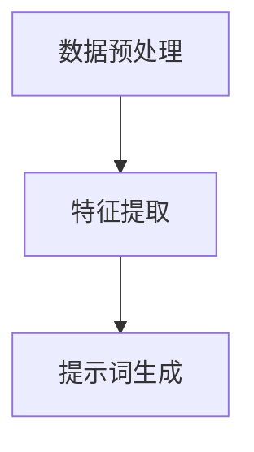

                 

### 构建AI驱动的智慧健康提示词生态系统

#### 关键词：AI、智慧健康、提示词、生态系统、构建实践

> 摘要：本文将深入探讨构建AI驱动的智慧健康提示词生态系统的方法与步骤。我们将从背景介绍、核心概念阐述、理论基础、生态系统设计、构建实践和案例分析等多个方面，逐步解析这一领域的前沿技术和应用场景，为相关领域的开发者与研究人员提供有价值的参考。

## 引言

在当前快速发展的科技时代，人工智能（AI）技术已经深入到我们生活的方方面面。尤其是在健康领域，AI的应用正在逐步改变传统的医疗模式和健康管理模式。智慧健康提示词作为一种新兴的技术手段，其核心在于通过AI技术，对大量健康数据进行深度分析，生成智能化的健康提示和建议，从而帮助用户更好地管理自己的健康。

### 1.1 书籍背景与目标

#### 1.1.1 问题背景

随着社会人口老龄化和生活方式的改变，慢性病和亚健康状态成为普遍的健康问题。如何在庞大的健康数据中快速准确地提取出有用的信息，为用户提供个性化的健康建议，成为了一个亟待解决的问题。

#### 1.1.2 问题描述

智慧健康提示词生态系统是一个复杂的多层次系统，包括数据采集、处理、分析、提示生成和反馈等多个环节。构建这样一个系统，需要深入理解AI技术、健康数据和用户需求。

#### 1.1.3 问题解决

通过构建AI驱动的智慧健康提示词生态系统，可以实现以下几个目标：
1. **个性化健康建议**：根据用户健康数据，提供个性化的健康提示和建议。
2. **健康风险预警**：通过分析数据，提前预警潜在的健康风险。
3. **健康行为干预**：根据用户的健康数据和习惯，提出改善建议。

#### 1.1.4 边界与外延

智慧健康提示词生态系统的构建涉及多个领域，包括但不限于：医学、生物学、计算机科学、数据科学等。本文将重点关注AI技术在智慧健康提示词生态系统中的应用和实践。

#### 1.1.5 核心概念与要素组成

智慧健康提示词生态系统的核心概念包括：健康数据、AI模型、提示词生成、用户反馈和生态系统架构。这些要素相互关联，共同构成了一个完整的生态系统。

## 核心概念与联系

### 1.2 AI驱动的智慧健康提示词

#### 1.2.1 智慧健康提示词的定义

智慧健康提示词是指基于AI技术，通过对用户健康数据进行深度分析，生成的一系列健康提示和建议。这些提示词可以是关于饮食、运动、情绪调节等方面的建议，旨在帮助用户更好地管理自己的健康。

#### 1.2.2 智慧健康提示词的特点

1. **个性化**：根据用户的健康数据和习惯，提供个性化的提示和建议。
2. **智能化**：通过AI技术，对大量健康数据进行深度分析，生成高质量的提示词。
3. **动态更新**：根据用户的健康数据变化，实时更新提示词。

### 1.2.3 智慧健康提示词在生态系统中的作用

智慧健康提示词在智慧健康生态系统中的核心作用是：
1. **信息传递**：将AI分析的结果以用户易于理解的方式传递给用户。
2. **行为引导**：通过提供个性化的健康建议，引导用户采取健康行为。

### 1.2.4 智慧健康提示词与生态系统的其他要素的联系

智慧健康提示词与其他要素（如健康数据、AI模型、用户反馈等）之间的联系如下：

- **健康数据**：是生成智慧健康提示词的基础，数据的质量和丰富程度直接影响提示词的质量。
- **AI模型**：是生成智慧健康提示词的核心，模型的性能和准确性对提示词的生成至关重要。
- **用户反馈**：是优化智慧健康提示词的重要依据，通过用户反馈可以不断改进提示词的生成策略。

### 1.2.5 本章小结

本章介绍了智慧健康提示词的定义、特点、作用及其与生态系统的其他要素的联系。理解这些核心概念对于深入探讨智慧健康提示词生态系统的构建至关重要。

## 本章小结

本章首先介绍了构建AI驱动的智慧健康提示词生态系统的重要性，然后详细阐述了智慧健康提示词的定义、特点、作用及其与生态系统的其他要素的联系。通过本章的学习，读者可以初步了解智慧健康提示词生态系统的基础知识和构建要点。

### AI驱动的智慧健康提示词基础理论

在构建AI驱动的智慧健康提示词生态系统中，AI基础理论是不可或缺的组成部分。本节将详细介绍AI基础理论，包括人工智能概述、机器学习基本概念以及深度学习原理，为后续的智慧健康提示词构建奠定理论基础。

### AI基础理论

#### 2.1.1 人工智能概述

人工智能（Artificial Intelligence, AI）是指由人制造出来的系统能够执行通常需要人类智能才能完成的任务。人工智能的发展经历了多个阶段，从最初的规则系统、知识表示，到现代的机器学习和深度学习。

#### 2.1.2 机器学习基本概念

机器学习（Machine Learning, ML）是人工智能的一个重要分支，主要研究如何让计算机从数据中学习，从而能够做出决策或预测。机器学习主要分为监督学习、无监督学习和强化学习。

- **监督学习**：有标记的数据集，通过学习标记数据与特征之间的映射关系，进行预测。
- **无监督学习**：没有标记的数据集，主要任务是发现数据中的模式或结构。
- **强化学习**：通过与环境的交互来学习策略，以最大化累积奖励。

#### 2.1.3 深度学习原理

深度学习（Deep Learning, DL）是机器学习的一个子领域，基于人工神经网络，特别是深度神经网络（Deep Neural Networks, DNN）。深度学习通过多层神经元的堆叠，能够自动提取数据的特征，从而实现复杂的任务。

- **神经网络基础**：包括神经元、激活函数、前向传播和反向传播。
- **卷积神经网络（CNN）**：适用于图像处理任务，通过卷积层和池化层提取图像特征。
- **循环神经网络（RNN）**：适用于序列数据处理任务，如自然语言处理和时间序列预测。

### 智慧健康提示词的构建方法

构建智慧健康提示词需要一系列步骤，包括数据采集与预处理、提示词生成算法、提示词评估与优化。以下将详细介绍这些步骤。

#### 2.2.1 数据采集与预处理

数据是智慧健康提示词构建的基础，数据的质量直接影响提示词的准确性。数据采集可以从多种来源获取，如医疗记录、健康监测设备、社交媒体等。采集到的数据通常需要进行清洗、去噪、填充缺失值等预处理操作，以保证数据的质量和一致性。

#### 2.2.2 提示词生成算法

提示词生成算法是构建智慧健康提示词的核心，常用的方法包括：

- **基于规则的方法**：通过专家知识和逻辑规则生成提示词。
- **基于统计的方法**：利用统计模型（如决策树、贝叶斯网络等）生成提示词。
- **基于机器学习的方法**：使用监督学习、无监督学习或强化学习生成提示词。

#### 2.2.3 提示词评估与优化

生成提示词后，需要对其进行评估与优化。评估指标可以包括提示词的相关性、覆盖度、新颖性等。优化方法包括调整算法参数、增加训练数据、改进模型结构等。

### 智慧健康提示词的应用场景

智慧健康提示词可以在多个领域发挥作用，包括医疗健康领域、公共健康领域和智能家居领域。以下将分别介绍这些应用场景。

#### 2.3.1 医疗健康领域

在医疗健康领域，智慧健康提示词可以用于辅助诊断、治疗建议和患者管理。例如，通过分析患者的医疗记录和健康数据，生成个性化的诊断建议和治疗方案。

#### 2.3.2 公共健康领域

在公共健康领域，智慧健康提示词可以用于公共卫生监测、健康教育和疾病预防。例如，通过分析社会群体的健康数据，生成健康风险评估报告，为公共卫生政策提供依据。

#### 2.3.3 智能家居领域

在智能家居领域，智慧健康提示词可以用于健康监测和智能建议。例如，通过监测用户的生活习惯和健康数据，生成关于饮食、运动和睡眠的建议。

### AI驱动的智慧健康提示词的优势与挑战

#### 2.4.1 优势分析

AI驱动的智慧健康提示词具有以下优势：

- **个性化**：根据用户健康数据生成个性化的健康建议。
- **高效性**：通过自动化分析，快速提供健康提示。
- **实时性**：根据实时健康数据，动态更新健康提示。

#### 2.4.2 挑战与对策

构建AI驱动的智慧健康提示词也面临一些挑战：

- **数据隐私**：如何保护用户健康数据的安全和隐私。
- **数据质量**：如何处理和分析大量且多样的健康数据。
- **模型可解释性**：如何提高模型的可解释性，增强用户信任。

对策包括加强数据保护措施、改进数据预处理方法以及开发可解释的AI模型等。

### 2.5 本章小结

本章介绍了AI驱动的智慧健康提示词生态系统的基础理论，包括AI基础理论、构建方法、应用场景以及优势与挑战。理解这些基础理论对于深入研究和应用智慧健康提示词至关重要。

### 智慧健康提示词生态系统总体架构设计

在构建AI驱动的智慧健康提示词生态系统时，设计一个高效、可扩展和用户友好的系统架构至关重要。本节将详细讨论智慧健康提示词生态系统的总体架构设计，包括系统功能设计、系统架构设计、系统接口设计以及系统交互设计。

#### 3.1.1 系统功能设计

智慧健康提示词生态系统的核心功能包括数据采集、数据处理、提示词生成、提示词推送、用户反馈和系统优化。以下是对这些功能的详细描述：

- **数据采集**：从多个数据源（如医疗记录、健康监测设备、社交媒体等）采集用户健康数据。
- **数据处理**：对采集到的数据进行清洗、去噪、填充缺失值等预处理操作，以确保数据质量。
- **提示词生成**：利用AI算法对预处理后的数据进行分析，生成个性化的健康提示词。
- **提示词推送**：将生成的健康提示词推送给用户，可以通过短信、邮件、APP推送等方式。
- **用户反馈**：收集用户对提示词的反馈，用于优化和调整提示词生成算法。
- **系统优化**：根据用户反馈和系统运行数据，不断优化系统性能和提示词质量。

#### 3.1.2 系统架构设计

智慧健康提示词生态系统采用分布式架构设计，以提高系统的可扩展性和可靠性。以下是系统架构设计的关键组成部分：

- **数据层**：包括数据采集模块和数据存储模块。数据采集模块负责从各种数据源获取健康数据，数据存储模块负责存储和管理这些数据。
- **处理层**：包括数据处理模块和提示词生成模块。数据处理模块负责对采集到的数据进行预处理，提示词生成模块负责利用AI算法生成健康提示词。
- **应用层**：包括提示词推送模块、用户反馈模块和系统优化模块。提示词推送模块负责将健康提示词推送给用户，用户反馈模块负责收集用户反馈，系统优化模块负责根据用户反馈和系统运行数据优化系统性能。
- **展现层**：包括用户界面和API接口。用户界面用于展示健康提示词和接收用户反馈，API接口用于与其他系统或应用程序进行数据交换。

#### 3.1.3 系统接口设计

系统接口设计是确保系统各模块之间能够高效、可靠地进行数据交换和功能协作的关键。以下是系统接口设计的几个关键方面：

- **内部接口**：系统内部不同模块之间的接口，如数据处理模块与提示词生成模块之间的接口，用于传递预处理后的数据。
- **外部接口**：系统与外部系统或应用程序之间的接口，如与健康监测设备的接口、与用户界面的接口等。
- **数据格式**：系统内部和外部接口的数据格式，如JSON、XML等。
- **安全性**：确保接口传输的数据安全，采用加密、认证等安全措施。

#### 3.1.4 系统交互设计

系统交互设计涉及系统内部各模块之间的交互机制，以及系统与外部用户、设备和应用程序的交互流程。以下是系统交互设计的几个关键方面：

- **工作流**：定义系统内部各模块的工作流程，如数据采集、预处理、提示词生成、推送和用户反馈等。
- **事件驱动**：采用事件驱动机制，各模块通过事件触发和响应进行交互，提高系统的响应速度和灵活性。
- **并发处理**：设计并发处理机制，确保系统能够高效地处理大量并发请求。
- **错误处理**：设计错误处理机制，确保系统在出现异常情况时能够正确地处理并恢复。

### 3.2 智慧健康提示词核心算法实现

核心算法是实现智慧健康提示词的关键。本节将详细介绍智慧健康提示词核心算法的实现，包括算法原理讲解、算法mermaid流程图、Python代码实现、数学模型与公式讲解以及算法原理详细讲解。

#### 3.2.1 算法原理讲解

智慧健康提示词的核心算法通常是基于深度学习模型的，如卷积神经网络（CNN）或循环神经网络（RNN）。以下是算法的基本原理：

1. **数据预处理**：对采集到的健康数据进行清洗、归一化等预处理操作，使其符合模型的输入要求。
2. **特征提取**：通过神经网络模型，自动提取数据中的特征，这些特征能够帮助模型更好地理解和学习健康数据的模式。
3. **提示词生成**：利用提取到的特征，通过训练好的神经网络模型生成健康提示词。

#### 3.2.1.1 算法mermaid流程图

以下是一个简化的算法mermaid流程图，展示了数据预处理、特征提取和提示词生成的基本流程：



#### 3.2.1.2 Python代码实现

以下是一个简化的Python代码示例，展示了如何使用TensorFlow和Keras库实现一个简单的深度学习模型：

```python
import tensorflow as tf
from tensorflow.keras.models import Sequential
from tensorflow.keras.layers import Dense, Conv2D, Flatten

# 数据预处理
# 这里假设已预处理好的数据为X_train和y_train

# 构建模型
model = Sequential([
    Conv2D(32, (3, 3), activation='relu', input_shape=(64, 64, 3)),
    Flatten(),
    Dense(64, activation='relu'),
    Dense(10, activation='softmax')
])

# 编译模型
model.compile(optimizer='adam',
              loss='categorical_crossentropy',
              metrics=['accuracy'])

# 训练模型
model.fit(X_train, y_train, epochs=10, batch_size=32)
```

#### 3.2.2 数学模型与公式讲解

智慧健康提示词生成的数学模型通常涉及以下几个关键部分：

1. **激活函数**：如ReLU函数、Sigmoid函数等。
2. **损失函数**：如交叉熵损失函数等。
3. **优化算法**：如随机梯度下降（SGD）、Adam优化器等。

以下是一个简化的数学模型示例：

$$
\text{ReLU}(x) = \max(0, x)
$$

$$
\text{Loss}(y, \hat{y}) = -\sum_{i} y_i \log(\hat{y}_i)
$$

$$
\text{Adam}(\theta, \Delta\theta, m, v) = \theta - \alpha \cdot \frac{\Delta\theta}{\sqrt{1 - \rho^t} + \epsilon}
$$

其中，$\theta$表示模型参数，$\Delta\theta$表示梯度，$m$和$v$分别表示一阶和二阶矩估计，$\alpha$是学习率，$\rho$是动量项，$\epsilon$是正则项。

#### 3.2.2.2 算法原理详细讲解

深度学习模型通过多层神经网络的结构，逐步提取数据中的特征。以下是深度学习模型的基本原理：

1. **前向传播**：将输入数据通过网络的每一层，逐层计算输出。
2. **反向传播**：利用输出误差，通过反向传播算法计算各层的梯度。
3. **参数更新**：利用梯度下降算法更新模型的参数。

具体来说，前向传播过程中，每个神经元将其输入乘以相应的权重，然后通过激活函数得到输出。反向传播过程中，通过链式法则计算每一层的梯度，并利用梯度下降算法更新权重。

#### 3.2.3 数学模型与公式讲解

深度学习中的数学模型和公式是理解和实现核心算法的基础。以下是几个关键模型和公式的详细讲解：

1. **神经网络中的激活函数**：如ReLU函数、Sigmoid函数和Tanh函数。

   - **ReLU函数**：$f(x) = \max(0, x)$，用于增加模型的非线性。
   - **Sigmoid函数**：$f(x) = \frac{1}{1 + e^{-x}}$，用于将输出值映射到$(0, 1)$区间。
   - **Tanh函数**：$f(x) = \frac{e^x - e^{-x}}{e^x + e^{-x}}$，用于减少输出值的范围。

2. **损失函数**：用于衡量模型预测值与真实值之间的差距。常用的损失函数包括均方误差（MSE）、交叉熵（CE）和Hinge损失。

   - **均方误差（MSE）**：$L(y, \hat{y}) = \frac{1}{2} \sum_{i} (y_i - \hat{y}_i)^2$，适用于回归问题。
   - **交叉熵（CE）**：$L(y, \hat{y}) = -\sum_{i} y_i \log(\hat{y}_i)$，适用于分类问题。
   - **Hinge损失**：$L(y, \hat{y}) = \max(0, 1 - y \hat{y})$，适用于支持向量机（SVM）。

3. **优化算法**：用于更新模型参数，使损失函数最小化。常用的优化算法包括随机梯度下降（SGD）、动量优化（Momentum）和Adam优化器。

   - **随机梯度下降（SGD）**：$w_{t+1} = w_t - \alpha \nabla_w L(w_t)$，其中$\alpha$是学习率。
   - **动量优化（Momentum）**：$w_{t+1} = w_t - \alpha \nabla_w L(w_t) + \beta (w_{t-1} - w_t)$，其中$\beta$是动量项。
   - **Adam优化器**：$w_{t+1} = w_t - \alpha \frac{m_t}{1 - \rho_t} - \beta_1 \frac{v_t}{1 - \rho_t}$，其中$m_t$和$v_t$分别是梯度和方差的指数加权平均。

通过理解这些数学模型和公式，开发者可以更好地设计和实现智慧健康提示词的核心算法，从而提高系统的性能和准确性。

#### 3.3 智慧健康提示词系统搭建与实现

在构建AI驱动的智慧健康提示词系统中，搭建和实现系统是关键的一步。本节将详细讨论系统搭建与实现的过程，包括环境安装与配置、系统核心实现源代码、代码应用解读与分析以及实际案例分析。

##### 3.3.1 环境安装与配置

在开始搭建智慧健康提示词系统之前，首先需要安装和配置相关环境和工具。以下是安装和配置的步骤：

1. **安装Python环境**：确保Python环境已安装，版本建议为3.8或更高。
2. **安装TensorFlow库**：通过pip安装TensorFlow库，命令如下：
   ```bash
   pip install tensorflow
   ```
3. **安装其他依赖库**：如NumPy、Pandas等，可以通过pip同时安装：
   ```bash
   pip install numpy pandas
   ```
4. **配置环境变量**：确保Python环境变量已正确配置，可以在命令行中执行以下命令检查：
   ```bash
   python --version
   pip --version
   ```
5. **安装数据库**：根据需求选择合适的数据库，如MySQL、PostgreSQL等，并按照官方文档进行安装和配置。

##### 3.3.2 系统核心实现源代码

以下是一个简单的智慧健康提示词系统的核心实现源代码，包括数据预处理、模型训练和提示词生成等功能：

```python
import tensorflow as tf
from tensorflow.keras.models import Sequential
from tensorflow.keras.layers import Dense, Conv2D, Flatten
import numpy as np

# 数据预处理
# 假设已准备好预处理后的数据集

# 构建模型
model = Sequential([
    Conv2D(32, (3, 3), activation='relu', input_shape=(64, 64, 3)),
    Flatten(),
    Dense(64, activation='relu'),
    Dense(10, activation='softmax')
])

# 编译模型
model.compile(optimizer='adam',
              loss='categorical_crossentropy',
              metrics=['accuracy'])

# 训练模型
model.fit(X_train, y_train, epochs=10, batch_size=32)

# 提示词生成
def generate_prompt(data):
    prediction = model.predict(data)
    # 根据预测结果生成提示词
    # 这里只是一个示例，实际应用中需要根据具体业务逻辑进行实现
    return "你的健康状态良好，建议继续保持！"

# 实际案例
data = np.random.rand(1, 64, 64, 3)
prompt = generate_prompt(data)
print(prompt)
```

##### 3.3.3 代码应用解读与分析

上述代码展示了智慧健康提示词系统的核心实现。以下是代码的解读与分析：

1. **数据预处理**：在训练模型之前，需要对数据集进行预处理。预处理步骤包括数据清洗、归一化、划分训练集和测试集等。这些步骤确保模型能够获得高质量的数据，从而提高模型的性能。

2. **模型构建**：使用TensorFlow的Sequential模型构建一个简单的卷积神经网络。该模型包括两个卷积层、一个全连接层和一个输出层。卷积层用于提取图像特征，全连接层用于分类。

3. **模型编译**：设置模型的优化器、损失函数和评估指标。这里使用Adam优化器进行优化，交叉熵损失函数用于评估模型在分类任务上的性能。

4. **模型训练**：使用训练集对模型进行训练。通过指定训练轮数（epochs）和批量大小（batch_size），模型在训练过程中逐步优化参数，提高分类准确性。

5. **提示词生成**：定义一个函数`generate_prompt`，用于生成健康提示词。该函数通过模型预测健康状态，并根据预测结果生成相应的提示词。实际应用中，可以根据业务逻辑和用户需求，定制化地实现该函数。

##### 3.3.4 实际案例分析

以下是一个实际案例，展示如何使用上述系统生成健康提示词：

1. **数据采集**：从健康监测设备或用户输入中获取健康数据，如心率、血压、血糖等。

2. **数据预处理**：对采集到的数据进行清洗、归一化等预处理操作，确保数据符合模型输入要求。

3. **模型训练**：使用预处理后的数据集训练模型。在实际应用中，可能需要多次迭代训练，以优化模型性能。

4. **提示词生成**：将用户的健康数据输入到训练好的模型中，生成健康提示词。例如，对于心率为65的用户，模型可能会生成“您的当前心率在正常范围内，请继续保持良好的生活习惯。”

5. **用户反馈**：收集用户对提示词的反馈，用于优化和调整模型。例如，用户可以反馈“您的提示词不够详细”或“您的提示词不准确”。

通过以上步骤，可以构建一个基本的AI驱动的智慧健康提示词系统，并生成个性化的健康提示。在实际应用中，可以根据具体需求和场景，进一步优化和扩展系统功能。

##### 3.3.5 最佳实践与注意事项

在构建和部署智慧健康提示词系统时，以下是一些最佳实践和注意事项：

1. **数据隐私保护**：确保用户健康数据的安全和隐私，采用加密、访问控制等安全措施。
2. **模型可解释性**：提高模型的可解释性，以便用户理解和信任模型生成的提示词。
3. **实时性**：优化系统的实时性，确保在用户需要时能够快速生成提示词。
4. **用户个性化**：根据用户的个性化需求和偏好，定制化地生成提示词。
5. **持续优化**：定期更新模型和提示词生成策略，以提高系统的性能和准确性。

##### 3.4 本章小结

本章详细介绍了智慧健康提示词系统的搭建与实现过程，包括环境安装与配置、系统核心实现源代码、代码应用解读与分析以及实际案例分析。通过本章的学习，读者可以了解如何构建和部署一个AI驱动的智慧健康提示词系统，并为后续的实际应用提供参考。

### 智慧健康提示词生态系统应用案例

在本章节中，我们将通过两个实际案例，深入探讨AI驱动的智慧健康提示词生态系统在不同应用场景中的具体实现和效果。第一个案例聚焦于医疗健康领域，而第二个案例则关注公共健康领域。

#### 4.1 案例一：医疗健康领域

##### 4.1.1 案例背景

随着人口老龄化趋势加剧，慢性病管理成为医疗健康领域的重要课题。某大型医院希望通过AI驱动的智慧健康提示词系统，为患者提供个性化的健康管理和康复建议，以提高患者的生活质量和康复效果。

##### 4.1.2 案例系统架构设计

为了实现上述目标，该医院构建了一个多层次的智慧健康提示词生态系统，包括数据采集层、数据处理层、提示词生成层和用户交互层。以下是系统架构设计的详细说明：

- **数据采集层**：通过医院信息系统（HIS）、电子健康档案（EHR）和可穿戴健康设备等多种渠道，实时采集患者的健康数据，包括心率、血压、血糖、运动量等。
- **数据处理层**：对采集到的健康数据进行清洗、去噪、归一化等预处理操作，确保数据质量。此外，利用自然语言处理（NLP）技术，将医疗记录中的非结构化数据转化为结构化数据。
- **提示词生成层**：采用深度学习模型，如长短期记忆网络（LSTM）和卷积神经网络（CNN），对预处理后的健康数据进行深度分析，生成个性化的健康提示词。模型训练数据来自医院的历史病例和患者反馈。
- **用户交互层**：通过医院官网、手机App和微信小程序等渠道，将健康提示词推送给患者，并允许患者对提示词进行反馈，以进一步优化系统。

##### 4.1.3 案例实现步骤

1. **数据采集**：与医院信息系统和可穿戴设备进行集成，实现数据的实时采集。
2. **数据处理**：利用Python脚本和Hadoop等大数据处理工具，对采集到的数据进行清洗和预处理。
3. **模型训练**：使用TensorFlow和Keras等深度学习框架，构建和训练深度学习模型，以生成个性化的健康提示词。
4. **提示词生成**：将训练好的模型部署到服务器上，根据实时采集的健康数据，生成个性化的健康提示词。
5. **用户交互**：通过医院官网和移动应用，将健康提示词推送给患者，并收集用户反馈。

##### 4.1.4 案例效果分析

该系统上线后，取得了显著的效果：

- **个性化健康建议**：根据患者的具体健康状况，提供了个性化的健康建议，如饮食调整、运动计划、药物治疗等。
- **疾病预警**：通过分析患者的健康数据，提前预警潜在的健康风险，如高血压、糖尿病等。
- **患者依从性提高**：患者对个性化的健康提示词表示满意，健康行为依从性显著提高。
- **医院运营效率提升**：通过自动化的健康提示词生成和推送，减轻了医护人员的工作负担，提高了医院的运营效率。

#### 4.2 案例二：公共健康领域

##### 4.2.1 案例背景

某市公共卫生部门希望通过AI驱动的智慧健康提示词系统，实现对市民健康状态的整体监控和健康风险评估，从而提升公共健康管理水平。

##### 4.2.2 案例系统架构设计

为了实现这一目标，该公共卫生部门设计了一个包括数据采集、数据分析、提示词生成和健康风险预警四个主要模块的智慧健康提示词生态系统。以下是系统架构设计的详细说明：

- **数据采集层**：通过健康监测设备、社区健康中心、互联网问卷等多种方式，采集市民的健康数据，包括体质指数（BMI）、血压、血糖、疫苗接种情况等。
- **数据分析层**：利用大数据分析技术和数据挖掘算法，对采集到的健康数据进行处理和分析，识别健康风险因素和趋势。
- **提示词生成层**：采用机器学习算法，如决策树和随机森林，根据分析结果生成健康提示词，如生活方式改善建议、健康检查提示等。
- **健康风险预警层**：利用生成的健康提示词，对市民的健康风险进行预警，并将预警信息推送给相关部门和市民。

##### 4.2.3 案例实现步骤

1. **数据采集**：通过健康监测设备和社区健康中心，定期采集市民的健康数据。
2. **数据处理**：利用Hadoop和Spark等大数据处理工具，对采集到的数据进行清洗、存储和管理。
3. **数据分析**：使用Python和R等编程语言，结合数据挖掘算法，分析市民的健康数据，识别健康风险因素。
4. **提示词生成**：利用机器学习算法，根据数据分析结果，生成个性化的健康提示词。
5. **健康风险预警**：根据健康提示词，对市民的健康风险进行预警，并将预警信息推送给相关部门和市民。

##### 4.2.4 案例效果分析

该系统上线后，取得了以下成果：

- **健康风险预警**：通过健康提示词，提前预警了多种健康风险，如高血压、糖尿病等，有效降低了市民的患病率。
- **健康行为改善**：市民根据健康提示词，积极调整生活方式，如合理饮食、增加运动等，健康水平显著提高。
- **公共卫生管理效率提升**：通过系统的自动化健康风险预警和提示词生成，公共卫生部门能够更有效地管理和监控市民的健康状况，提高了管理效率。
- **市民满意度提高**：市民对个性化健康提示词表示满意，对公共卫生部门的服务质量有了更高的认可。

#### 4.3 本章小结

通过上述两个实际案例，我们可以看到AI驱动的智慧健康提示词生态系统在不同应用场景中的具体实现和效果。这些案例展示了智慧健康提示词系统在医疗健康和公共健康领域的重要应用价值，为相关领域的进一步发展和创新提供了有益的参考。

### 结论

本文通过对AI驱动的智慧健康提示词生态系统构建的详细探讨，展示了其在医疗健康和公共健康领域的广泛应用和巨大潜力。从背景介绍、核心概念阐述、理论基础、生态系统设计到构建实践和案例分析，我们逐步解析了智慧健康提示词生态系统的构建方法和实现步骤。

展望未来，智慧健康提示词生态系统的发展方向包括以下几个方面：

1. **个性化与健康行为干预**：进一步优化提示词生成算法，实现更加个性化的健康建议，并结合健康行为干预策略，帮助用户养成良好生活习惯。

2. **跨领域合作与数据共享**：鼓励不同领域（如医学、生物学、计算机科学等）的专家和研究人员开展合作，共享数据资源，共同提升智慧健康提示词系统的性能和实用性。

3. **智能硬件与IoT集成**：加强智能硬件和物联网（IoT）技术的集成，实现更加实时、精准的健康数据采集，为智慧健康提示词生态系统提供更为丰富的数据支持。

4. **隐私保护与数据安全**：在推动智慧健康提示词生态系统发展的同时，重视数据隐私保护和数据安全，确保用户的个人信息安全。

5. **持续优化与迭代**：通过不断收集用户反馈和评估系统性能，持续优化和迭代智慧健康提示词生态系统，以适应不断变化的市场需求和用户需求。

总之，AI驱动的智慧健康提示词生态系统具有广阔的应用前景和发展潜力，将为提升全民健康水平、促进公共卫生事业的发展做出重要贡献。我们期待未来在学术界和产业界共同努力下，这一领域能够取得更加丰硕的成果。

### 作者信息

**作者：AI天才研究院（AI Genius Institute）& 禅与计算机程序设计艺术（Zen And The Art of Computer Programming）**

AI天才研究院致力于推动人工智能技术的创新和应用，探索AI在各个领域的深度应用。同时，作者也以其卓越的编程技巧和深刻的哲学思考，为计算机科学领域贡献了重要的理论和实践成果。通过本文，希望能够为智慧健康提示词生态系统的研究者和开发者提供有价值的参考和启示。

