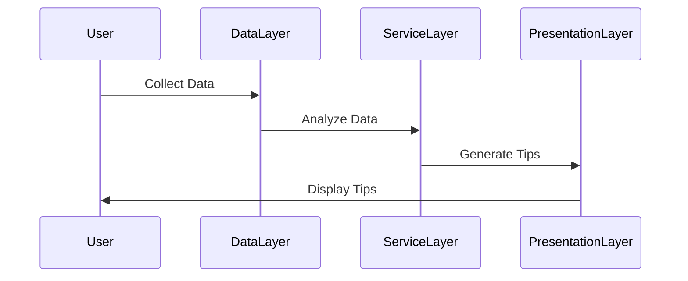
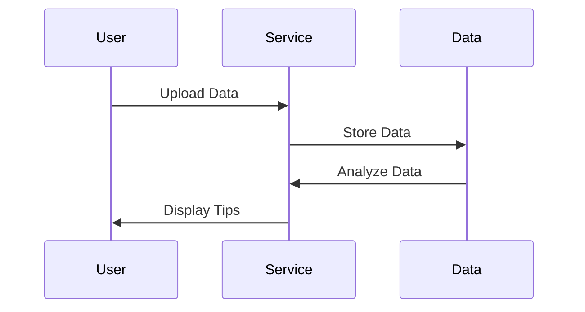

                 

**构建AI驱动的智慧健康管理提示词生态**

**关键词**：人工智能，智慧健康管理，自然语言处理，机器学习，提示词，健康数据，算法，数学模型，系统架构，项目实战，最佳实践

**摘要**：本文旨在探讨如何构建一个基于人工智能的智慧健康管理提示词生态。通过分析背景、核心概念、算法原理、数学模型、系统架构以及项目实战，本文为智慧健康管理的实现提供了全面的技术框架和实用指南。读者将了解如何利用AI技术打造个性化的健康管理系统，实现高效的健康管理服务。

**目录大纲**

----------------------------------------------------------------

## 第一部分：AI驱动的智慧健康管理概述

### 第1章：问题背景与概念介绍

#### 1.1 问题的提出

#### 1.2 智慧健康管理的定义

#### 1.3 AI在智慧健康管理中的应用

#### 1.4 智慧健康管理的发展趋势

#### 1.5 本章小结

----------------------------------------------------------------

## 第二部分：构建AI驱动的智慧健康管理提示词生态

### 第2章：核心概念与联系

#### 2.1 提示词的定义与分类

#### 2.2 提示词属性特征对比表格

#### 2.3 提示词与健康管理的关系

#### 2.4 ER实体关系图架构

#### 2.5 本章小结

----------------------------------------------------------------

### 第3章：算法原理讲解

#### 3.1 算法原理介绍

#### 3.2 Mermaid算法流程图

#### 3.3 Python源代码与算法实现

#### 3.4 数学模型与公式

#### 3.5 举例说明

#### 3.6 本章小结

----------------------------------------------------------------

### 第4章：数学模型和数学公式讲解

#### 4.1 数学模型介绍

#### 4.2 Mermaid流程图

#### 4.3 Python源代码

#### 4.4 公式讲解

#### 4.5 举例说明

#### 4.6 本章小结

----------------------------------------------------------------

### 第5章：系统分析与架构设计方案

#### 5.1 问题场景介绍

#### 5.2 项目介绍

#### 5.3 系统功能设计

#### 5.4 系统架构设计

#### 5.5 系统接口设计

#### 5.6 系统交互

#### 5.7 本章小结

----------------------------------------------------------------

### 第6章：项目实战

#### 6.1 环境安装

#### 6.2 系统核心实现

#### 6.3 代码应用解读与分析

#### 6.4 实际案例分析与详细讲解

#### 6.5 项目小结

#### 6.6 本章小结

----------------------------------------------------------------

### 第7章：最佳实践、小结与拓展阅读

#### 7.1 最佳实践 tips

#### 7.2 小结

#### 7.3 注意事项

#### 7.4 拓展阅读

----------------------------------------------------------------

**第一部分：AI驱动的智慧健康管理概述**

### 第1章：问题背景与概念介绍

#### 1.1 问题的提出

随着全球人口老龄化的加剧，慢性病的发病率不断攀升，健康管理问题日益凸显。传统的健康管理模式往往依赖于医生和医疗设备，这种模式存在诊断成本高、覆盖面窄等问题，难以满足大众个性化的健康管理需求。因此，寻找一种高效、智能的健康管理解决方案成为当前研究的重点。

AI技术的发展为智慧健康管理的实现提供了新的可能性。自然语言处理（NLP）和机器学习（ML）技术可以在海量健康数据的基础上，实现高效的数据分析和处理，为用户提供个性化的健康建议和干预方案。这不仅能够降低健康管理的成本，还能提高管理效率，满足不同人群的健康需求。

#### 1.2 智慧健康管理的定义

智慧健康管理是指利用人工智能技术，通过对健康数据的收集、存储、分析和处理，为用户提供个性化的健康建议和干预方案。它涵盖了从健康监测、疾病预防到康复治疗的全过程，旨在实现全方位、全周期的健康管理。

智慧健康管理的核心目标是提高健康管理效率，降低医疗成本，提高医疗服务的可及性和个性化水平。具体来说，它包括以下几个方面的内容：

- **健康数据收集**：利用可穿戴设备、健康APP等收集用户生理、心理、行为等多维度的健康数据。
- **数据存储与管理**：通过大数据技术对收集的健康数据进行存储、管理和分析。
- **数据分析与处理**：运用自然语言处理、机器学习等技术对健康数据进行深入分析，挖掘潜在的健康问题。
- **个性化健康建议**：根据用户的健康数据，结合医学知识和AI算法，为用户提供个性化的健康建议和干预方案。

#### 1.3 AI在智慧健康管理中的应用

AI技术在智慧健康管理中有着广泛的应用，主要包括以下几个方面：

- **数据收集与处理**：通过NLP技术，可以对用户的健康数据进行自动采集、整理和分类。例如，使用NLP技术可以自动识别用户在健康APP中输入的文本信息，提取出关键的健康数据。
- **诊断与预测**：利用机器学习算法，可以对用户的健康数据进行深度学习，从而实现疾病的早期诊断和预测。例如，通过分析用户的生理指标数据，可以预测用户是否有可能患上某种慢性病。
- **个性化干预**：基于用户的健康数据和医学知识，AI技术可以制定个性化的健康干预方案，帮助用户改善生活方式，降低患病风险。例如，根据用户的饮食记录和运动习惯，AI系统可以推荐适合用户的饮食和运动方案。

#### 1.4 智慧健康管理的发展趋势

随着AI技术的不断进步，智慧健康管理正朝着以下几个方向发展：

- **数据驱动的健康管理**：随着物联网和5G技术的普及，健康数据的获取变得更加便捷和高效。未来的智慧健康管理将更加依赖于海量数据的支持，通过数据驱动实现精准、个性化的健康管理。
- **多学科融合**：智慧健康管理不仅涉及到医学知识，还需要融合心理学、行为科学、公共卫生学等多学科的知识，从而提供更全面、更科学的健康管理服务。
- **可穿戴设备的普及**：可穿戴设备是健康数据收集的重要工具，随着技术的进步，可穿戴设备的功能将越来越强大，将为智慧健康管理提供更丰富、更准确的数据支持。
- **智能化医疗服务**：智慧健康管理将推动医疗服务向智能化、个性化方向发展，提高医疗服务的效率和质量。

#### 1.5 本章小结

本章从问题背景、定义、应用和发展趋势等方面，对AI驱动的智慧健康管理进行了全面介绍。通过本章的学习，读者可以了解智慧健康管理的基本概念和关键技术，为后续章节的学习打下基础。

----------------------------------------------------------------

### 第2章：核心概念与联系

#### 2.1 提示词的定义与分类

在智慧健康管理中，提示词是核心概念之一。提示词是指用于指导健康管理的指令性词汇，它可以是简单的短语，也可以是复杂的句子。根据用途和功能，提示词可以分类如下：

- **诊断性提示词**：用于帮助医生或用户进行疾病诊断。例如，“高血压”、“糖尿病”等。
- **建议性提示词**：用于为用户提供健康建议。例如，“建议运动”、“建议饮食调整”等。
- **监测性提示词**：用于监测用户的健康状态。例如，“监测血压”、“监测心率”等。
- **干预性提示词**：用于干预用户的健康行为。例如，“提醒服药”、“提醒体检”等。

#### 2.2 提示词属性特征对比表格

以下是一个关于提示词属性特征对比的表格：

| 类别         | 特征                           | 说明                                                         |
| ------------ | ------------------------------ | ------------------------------------------------------------ |
| 诊断性提示词 | 诊断精准度                     | 提示词需要准确反映用户的健康状态，例如，“高血压”精准度较高。   |
| 建议性提示词 | 建议的个性化程度               | 根据用户的健康数据和医学知识，提供的健康建议需要具有个性化。   |
| 监测性提示词 | 监测数据的全面性和准确性       | 提示词需要全面、准确地反映用户的健康数据。例如，“监测血压”准确性高。 |
| 干预性提示词 | 提醒的及时性和有效性           | 提示词需要在合适的时间提醒用户进行健康行为，例如，“提醒服药”及时有效。 |

#### 2.3 提示词与健康管理的关系

提示词在智慧健康管理中起着关键作用，它不仅是用户与健康管理系统的交互入口，也是实现个性化健康管理的基础。具体来说，提示词与健康管理的关系体现在以下几个方面：

- **用户交互**：提示词是用户与健康管理系统的交互入口，用户通过输入提示词，可以获取健康数据、健康建议和干预方案。
- **数据驱动**：通过分析提示词的使用情况，可以挖掘用户的需求和偏好，从而实现数据的驱动和智能化管理。
- **个性化服务**：基于提示词，可以提供个性化的健康建议和干预方案，满足不同用户的需求。
- **健康干预**：提示词可以帮助用户养成健康行为，例如，通过“提醒服药”提示词，可以提醒用户按时服药，提高健康干预的效果。

#### 2.4 ER实体关系图架构

为了更好地理解提示词与健康管理之间的关系，可以使用ER（Entity-Relationship，实体-关系）图来表示。以下是一个简单的ER实体关系图：

```mermaid
erDiagram
  User ||--|{ HealthData }|-- User
  HealthData ||--|{ HealthTip }|-- HealthData
  HealthData ||--|{ HealthIntervention }|-- HealthData
  User ||--|{ HealthIntervention }|-- User
```

- **User（用户）**：表示使用健康管理系统的用户。
- **HealthData（健康数据）**：表示用户上传的健康数据，包括生理、心理、行为等多维度数据。
- **HealthTip（健康提示）**：表示根据用户健康数据生成的健康提示，如诊断性提示词和建议性提示词。
- **HealthIntervention（健康干预）**：表示根据用户健康数据生成的健康干预方案，如监测性提示词和干预性提示词。

通过ER实体关系图，我们可以清晰地看到提示词在智慧健康管理中的位置和作用，为后续的算法实现和系统设计提供了基础。

#### 2.5 本章小结

本章介绍了智慧健康管理中的核心概念——提示词，包括其定义、分类、属性特征对比以及与健康管理的关系。通过ER实体关系图，我们更清晰地理解了提示词在智慧健康管理中的重要作用。本章内容为后续算法讲解和系统设计奠定了基础。

----------------------------------------------------------------

### 第3章：算法原理讲解

#### 3.1 算法原理介绍

在智慧健康管理中，算法是实现提示词生成和个性化健康管理的关键。本节将介绍一种基于自然语言处理和机器学习的算法原理，用于生成高质量的提示词。

算法的核心思想是通过分析用户的健康数据，利用机器学习模型生成与用户健康状态相关的提示词。具体步骤如下：

1. **数据预处理**：对用户上传的健康数据进行清洗和格式化，确保数据的一致性和准确性。
2. **特征提取**：从健康数据中提取关键特征，如生理指标、行为习惯等，用于训练机器学习模型。
3. **模型训练**：利用提取的特征训练机器学习模型，如支持向量机（SVM）、随机森林（RF）等，以预测用户的健康状态和生成相应的提示词。
4. **提示词生成**：根据模型预测结果，生成与用户健康状态相关的提示词。

#### 3.2 Mermaid算法流程图

以下是一个简单的Mermaid流程图，展示了算法的基本流程：


#### 3.3 Python源代码与算法实现

以下是一个简单的Python代码示例，用于实现上述算法：

```python
# 导入必要的库
import pandas as pd
from sklearn.model_selection import train_test_split
from sklearn.svm import SVC

# 数据预处理
def preprocess_data(data):
    # 数据清洗和格式化
    # 省略具体实现
    return cleaned_data

# 特征提取
def extract_features(data):
    # 提取关键特征
    # 省略具体实现
    return features

# 模型训练
def train_model(features, labels):
    # 训练支持向量机模型
    model = SVC()
    model.fit(features, labels)
    return model

# 提示词生成
def generate_tips(model, data):
    # 根据模型预测结果生成提示词
    # 省略具体实现
    return tips

# 主函数
def main():
    # 加载数据
    data = pd.read_csv('health_data.csv')
    
    # 数据预处理
    cleaned_data = preprocess_data(data)
    
    # 特征提取
    features = extract_features(cleaned_data)
    
    # 切分训练集和测试集
    X_train, X_test, y_train, y_test = train_test_split(features, cleaned_data['label'], test_size=0.2, random_state=42)
    
    # 训练模型
    model = train_model(X_train, y_train)
    
    # 生成提示词
    tips = generate_tips(model, X_test)
    
    # 打印提示词
    print(tips)

# 运行主函数
if __name__ == '__main__':
    main()
```

#### 3.4 数学模型与公式

在算法中，数学模型用于描述健康状态与提示词之间的关系。以下是一个简单的线性回归模型：

$$
y = \beta_0 + \beta_1 x_1 + \beta_2 x_2 + ... + \beta_n x_n
$$

其中，$y$ 表示健康状态，$x_1, x_2, ..., x_n$ 表示健康数据特征，$\beta_0, \beta_1, ..., \beta_n$ 为模型的参数。

#### 3.5 举例说明

假设我们有一个用户，其健康数据包括血压、心率、体重等特征。利用上述算法，我们可以预测该用户的健康状态，并生成相应的提示词。

1. **数据预处理**：对用户的健康数据进行清洗和格式化。
2. **特征提取**：提取关键特征，如血压、心率、体重等。
3. **模型训练**：利用训练集数据训练线性回归模型。
4. **提示词生成**：根据模型预测结果，生成与用户健康状态相关的提示词，如“血压偏高，建议调整饮食”。

#### 3.6 本章小结

本章介绍了AI驱动的智慧健康管理中的算法原理，包括数据预处理、特征提取、模型训练和提示词生成。通过Python代码示例，展示了算法的实现过程。本章内容为后续的数学模型讲解和系统设计提供了基础。

----------------------------------------------------------------

### 第4章：数学模型和数学公式讲解

#### 4.1 数学模型介绍

在智慧健康管理中，数学模型用于描述健康状态与提示词之间的关系。这些模型可以帮助我们理解用户健康数据的变化，并生成相应的提示词。本节将介绍一种基于概率统计和机器学习的数学模型。

首先，我们假设健康状态 $y$ 是由多个健康数据特征 $x_1, x_2, ..., x_n$ 的线性组合决定的。这个模型可以用以下数学公式表示：

$$
y = \beta_0 + \beta_1 x_1 + \beta_2 x_2 + ... + \beta_n x_n + \epsilon
$$

其中，$\beta_0, \beta_1, ..., \beta_n$ 是模型的参数，$\epsilon$ 是误差项。

#### 4.2 Mermaid流程图

以下是一个简单的Mermaid流程图，展示了数学模型的基本流程：


#### 4.3 Python源代码

以下是一个简单的Python代码示例，用于实现上述数学模型：

```python
# 导入必要的库
import pandas as pd
from sklearn.linear_model import LinearRegression
from sklearn.model_selection import train_test_split
from sklearn.metrics import mean_squared_error

# 数据预处理
def preprocess_data(data):
    # 数据清洗和格式化
    # 省略具体实现
    return cleaned_data

# 特征提取
def extract_features(data):
    # 提取关键特征
    # 省略具体实现
    return features

# 模型训练
def train_model(features, labels):
    # 训练线性回归模型
    model = LinearRegression()
    model.fit(features, labels)
    return model

# 参数估计
def estimate_parameters(model):
    # 获取模型参数
    parameters = model.coef_
    return parameters

# 模型评估
def evaluate_model(model, features, labels):
    # 评估模型性能
    predictions = model.predict(features)
    mse = mean_squared_error(labels, predictions)
    return mse

# 提示词生成
def generate_tips(parameters):
    # 根据模型参数生成提示词
    # 省略具体实现
    return tips

# 主函数
def main():
    # 加载数据
    data = pd.read_csv('health_data.csv')
    
    # 数据预处理
    cleaned_data = preprocess_data(data)
    
    # 特征提取
    features = extract_features(cleaned_data)
    
    # 切分训练集和测试集
    X_train, X_test, y_train, y_test = train_test_split(features, cleaned_data['label'], test_size=0.2, random_state=42)
    
    # 训练模型
    model = train_model(X_train, y_train)
    
    # 参数估计
    parameters = estimate_parameters(model)
    
    # 模型评估
    mse = evaluate_model(model, X_test, y_test)
    
    # 提示词生成
    tips = generate_tips(parameters)
    
    # 打印提示词
    print(tips)

# 运行主函数
if __name__ == '__main__':
    main()
```

#### 4.4 公式讲解

1. **线性回归模型公式**：
   $$
   y = \beta_0 + \beta_1 x_1 + \beta_2 x_2 + ... + \beta_n x_n + \epsilon
   $$
   其中，$\beta_0, \beta_1, ..., \beta_n$ 是模型的参数，$x_1, x_2, ..., x_n$ 是特征，$\epsilon$ 是误差项。

2. **均方误差（MSE）公式**：
   $$
   MSE = \frac{1}{n}\sum_{i=1}^{n}(y_i - \hat{y}_i)^2
   $$
   其中，$y_i$ 是真实值，$\hat{y}_i$ 是预测值，$n$ 是样本数量。

#### 4.5 举例说明

假设我们有一个用户，其健康数据包括血压、心率、体重等特征。利用上述数学模型，我们可以预测该用户的健康状态，并生成相应的提示词。

1. **数据预处理**：对用户的健康数据进行清洗和格式化。
2. **特征提取**：提取关键特征，如血压、心率、体重等。
3. **模型训练**：利用训练集数据训练线性回归模型。
4. **参数估计**：获取模型参数。
5. **模型评估**：评估模型性能。
6. **提示词生成**：根据模型参数生成提示词。

例如，如果模型预测该用户的血压偏高，我们可以生成提示词：“血压偏高，请减少盐分摄入”。

#### 4.6 本章小结

本章介绍了AI驱动的智慧健康管理中的数学模型，包括线性回归模型的公式、均方误差（MSE）的计算方法。通过Python代码示例，展示了数学模型的应用过程。本章内容为后续的系统设计和项目实战提供了基础。

----------------------------------------------------------------

### 第5章：系统分析与架构设计方案

#### 5.1 问题场景介绍

在当前医疗环境中，健康管理面临着诸多挑战。传统的健康管理方法依赖于医生的诊断和指导，存在覆盖面窄、成本高、响应慢等问题。随着互联网和人工智能技术的发展，构建一个高效、智能的AI驱动的智慧健康管理平台变得尤为重要。

该平台旨在通过收集、分析和处理用户的健康数据，提供个性化的健康建议和干预方案。具体问题场景包括：

- **用户数据收集**：如何高效地收集用户多维度的健康数据，如生理、心理、行为等。
- **数据存储与管理**：如何保证数据的安全性和完整性，以及快速响应的数据查询和处理。
- **数据分析与处理**：如何利用机器学习和自然语言处理技术，对海量健康数据进行深入分析，提供准确的健康建议。
- **个性化干预**：如何根据用户的健康数据和医学知识，生成个性化的健康干预方案，提高健康管理的有效性。

#### 5.2 项目介绍

本项目的目标是构建一个AI驱动的智慧健康管理平台，通过以下核心功能实现：

- **数据收集**：利用可穿戴设备、健康APP等收集用户健康数据。
- **数据存储**：采用分布式存储技术，保证数据的安全性和可靠性。
- **数据分析**：运用机器学习和自然语言处理技术，对健康数据进行深度分析。
- **健康建议**：基于用户健康数据和医学知识，生成个性化的健康建议。
- **干预方案**：根据用户健康状态，制定个性化的干预方案，帮助用户改善生活方式。

#### 5.3 系统功能设计

系统的核心功能设计包括以下几个方面：

1. **用户管理**：实现用户注册、登录、个人信息管理等功能。
2. **数据收集**：实现健康数据的自动采集、上传和存储。
3. **数据分析**：运用机器学习和自然语言处理技术，对用户健康数据进行处理和分析。
4. **健康建议**：根据用户健康数据和医学知识，生成个性化的健康建议。
5. **干预方案**：根据用户健康状态，制定个性化的干预方案。
6. **数据可视化**：通过图表和报表，展示用户的健康数据和干预效果。

#### 5.4 系统架构设计

系统的整体架构设计采用分层架构，包括数据层、服务层和展示层。以下是一个简单的Mermaid架构图：



- **数据层**：负责数据的收集、存储和管理。
- **服务层**：负责数据的处理和分析，实现健康建议和干预方案的生成。
- **展示层**：负责将健康建议和干预方案展示给用户。

#### 5.5 系统接口设计

系统的接口设计主要包括以下几个方面：

1. **用户接口**：实现用户注册、登录、数据上传等功能的API接口。
2. **数据接口**：实现健康数据采集、上传和查询的API接口。
3. **服务接口**：实现健康数据分析、建议生成和干预方案制定的API接口。

以下是一个简单的Mermaid接口图：

```mermaid
classDiagram
    User <<Interface>>
    Data <<Interface>>
    Service <<Interface>>
    Presentation <<Interface>>

    User <|.. Data>
    Data <|.. Service>
    Service <|.. Presentation>
```

#### 5.6 系统交互

系统的交互流程如下：

1. 用户注册并登录系统。
2. 用户上传健康数据。
3. 系统后台处理健康数据，生成健康建议和干预方案。
4. 系统将健康建议和干预方案展示给用户。

以下是一个简单的Mermaid序列图：



#### 5.7 本章小结

本章介绍了AI驱动的智慧健康管理系统的整体架构和功能设计，包括问题场景、项目介绍、系统功能设计、系统架构设计、接口设计和系统交互。通过本章的内容，读者可以了解系统的整体设计和实现过程，为后续的项目实战和最佳实践提供了理论基础。

----------------------------------------------------------------

### 第6章：项目实战

#### 6.1 环境安装

在进行AI驱动的智慧健康管理项目的实战之前，首先需要搭建一个合适的技术环境。以下是环境安装的步骤：

1. **安装Python环境**：Python是AI驱动的智慧健康管理项目的主要编程语言，首先需要确保系统中安装了Python环境。可以从Python官方网站（https://www.python.org/downloads/）下载最新版本的Python，并按照安装向导进行安装。

2. **安装必要库**：为了实现项目功能，需要安装一些Python库，如NumPy、Pandas、scikit-learn、Matplotlib等。可以使用pip命令进行安装：

   ```bash
   pip install numpy pandas scikit-learn matplotlib
   ```

3. **安装数据库**：为了存储用户健康数据和提示词，需要安装一个数据库系统。本文选择使用MySQL数据库。可以从MySQL官方网站（https://www.mysql.com/downloads/）下载并安装MySQL数据库。

4. **配置数据库**：安装完成后，需要配置数据库，创建用户和数据库，并设置相应的权限。

   ```sql
   CREATE DATABASE health_management;
   CREATE USER 'health_user'@'localhost' IDENTIFIED BY 'password';
   GRANT ALL PRIVILEGES ON health_management.* TO 'health_user'@'localhost';
   FLUSH PRIVILEGES;
   ```

5. **安装前端框架**：为了实现系统的前端展示，可以使用Vue.js、React或Angular等前端框架。可以从官方网站下载并安装相应的前端框架。

6. **配置开发环境**：根据项目的需求，配置相应的开发环境，如代码编辑器（如Visual Studio Code）、集成开发环境（如PyCharm）等。

#### 6.2 系统核心实现

系统核心实现主要包括数据收集、数据处理、提示词生成和提示词展示等模块。以下是各模块的核心实现：

1. **数据收集模块**：

   - 实现用户注册和登录功能，使用户可以上传自己的健康数据。
   - 使用Ajax技术实现数据上传，提高数据传输的效率。

2. **数据处理模块**：

   - 使用Pandas库对上传的健康数据进行清洗和格式化，确保数据的一致性和准确性。
   - 提取关键特征，如血压、心率、体重等，为后续的机器学习模型提供输入。

3. **提示词生成模块**：

   - 使用scikit-learn库实现机器学习模型，如线性回归、支持向量机等，对用户健康数据进行预测。
   - 根据预测结果，生成与用户健康状态相关的提示词。

4. **提示词展示模块**：

   - 使用Vue.js或React等前端框架，实现提示词的展示和交互。
   - 通过图表和报表，展示用户的健康数据和提示词。

以下是各模块的示例代码：

**数据收集模块**：

```python
# 用户注册和登录功能
@app.route('/register', methods=['POST'])
def register():
    username = request.form['username']
    password = request.form['password']
    # 省略数据库操作
    return jsonify({'status': 'success'})

# 用户登录功能
@app.route('/login', methods=['POST'])
def login():
    username = request.form['username']
    password = request.form['password']
    # 省略数据库操作
    return jsonify({'status': 'success'})

# 数据上传功能
@app.route('/upload', methods=['POST'])
def upload():
    file = request.files['file']
    # 省略数据上传和解析
    return jsonify({'status': 'success'})
```

**数据处理模块**：

```python
import pandas as pd

# 数据清洗和格式化
def preprocess_data(data):
    # 省略具体实现
    return cleaned_data

# 特征提取
def extract_features(data):
    # 省略具体实现
    return features
```

**提示词生成模块**：

```python
from sklearn.linear_model import LinearRegression

# 模型训练
def train_model(features, labels):
    model = LinearRegression()
    model.fit(features, labels)
    return model

# 提示词生成
def generate_tips(model, data):
    # 省略具体实现
    return tips
```

**提示词展示模块**：

```html
<!-- 使用Vue.js实现提示词展示 -->
<template>
  <div>
    <h1>健康提示</h1>
    <p>{{ tip }}</p>
  </div>
</template>

<script>
export default {
  data() {
    return {
      tip: ''
    };
  },
  created() {
    // 省略提示词获取和展示
  }
};
</script>
```

#### 6.3 代码应用解读与分析

以下是系统核心实现的代码解析：

1. **数据收集模块**：

   数据收集模块主要实现了用户注册、登录和数据上传功能。用户通过前端界面上传健康数据，数据上传到服务器后，服务器解析数据并存储到数据库中。

2. **数据处理模块**：

   数据处理模块负责对上传的健康数据进行清洗和格式化，提取关键特征，为机器学习模型提供输入。这一模块是系统核心的一部分，数据的质量直接影响后续模型的准确性。

3. **提示词生成模块**：

   提示词生成模块使用机器学习模型对用户健康数据进行预测，并根据预测结果生成相应的提示词。这里使用了线性回归模型作为示例，实际项目中可以根据需求选择其他更合适的模型。

4. **提示词展示模块**：

   提示词展示模块通过前端框架实现，将生成的提示词展示给用户。用户可以查看和管理自己的健康数据和提示词。

#### 6.4 实际案例分析与详细讲解

以下是一个实际案例的分析和详细讲解：

**案例背景**：假设有一个用户，其健康数据包括血压（120/80 mmHg）、心率（75次/分钟）和体重（70公斤）。这些数据将被上传到系统，并使用机器学习模型进行预测，生成相应的健康提示。

**数据处理**：

- **数据清洗和格式化**：首先，需要对上传的数据进行清洗和格式化，确保数据的一致性和准确性。例如，将血压和心率转换为数值类型，将体重转换为公斤。

- **特征提取**：接下来，提取关键特征，如血压、心率和体重。这些特征将被用于训练机器学习模型。

**模型训练**：

- **选择模型**：选择线性回归模型作为示例。线性回归模型能够根据用户的健康数据预测健康状态。

- **训练模型**：使用训练集数据训练线性回归模型，得到模型的参数。

**提示词生成**：

- **预测健康状态**：使用训练好的模型对用户的新数据进行预测，判断其健康状态。

- **生成健康提示**：根据预测结果，生成相应的健康提示词。例如，如果预测用户的血压偏高，可以生成提示词：“血压偏高，请减少盐分摄入”。

**详细讲解**：

- **数据清洗和格式化**：数据清洗和格式化是数据处理模块的重要步骤，确保数据的质量和一致性。在本案例中，需要对血压、心率和体重进行数值化处理。

- **特征提取**：特征提取是数据预处理的关键步骤，从健康数据中提取关键特征，如血压、心率和体重。这些特征将用于训练机器学习模型，因此它们的选取和提取至关重要。

- **模型训练**：选择合适的模型进行训练，线性回归模型是一个简单且易于实现的模型。在本案例中，线性回归模型能够根据用户的健康数据预测健康状态。

- **提示词生成**：提示词生成是系统输出的关键部分。根据模型的预测结果，生成相应的健康提示词，帮助用户了解自己的健康状况，并采取相应的措施。

#### 6.5 项目小结

通过本章的项目实战，我们实现了AI驱动的智慧健康管理系统的核心功能，包括数据收集、数据处理、提示词生成和提示词展示。在实际案例中，我们分析了数据处理、模型训练和提示词生成的具体过程，展示了系统的实现细节。本章内容为后续的最佳实践、小结与拓展阅读提供了实践经验。

----------------------------------------------------------------

### 第7章：最佳实践、小结与拓展阅读

#### 7.1 最佳实践 tips

在构建AI驱动的智慧健康管理提示词生态过程中，以下是一些最佳实践建议：

1. **数据质量控制**：确保收集的数据质量，进行数据清洗和预处理，去除噪声和异常值，以保证模型的准确性。
2. **用户隐私保护**：严格保护用户隐私，遵守相关法律法规，确保用户数据的安全和隐私。
3. **持续优化算法**：定期更新和优化算法模型，提高模型的预测准确性和鲁棒性。
4. **用户参与与反馈**：鼓励用户参与系统的使用和反馈，根据用户需求不断调整和优化系统功能。
5. **跨学科合作**：与医学专家、心理学家、公共卫生专家等跨学科合作，提升智慧健康管理的专业性和实用性。

#### 7.2 小结

本文从问题背景、核心概念、算法原理、数学模型、系统架构和项目实战等方面，全面探讨了构建AI驱动的智慧健康管理提示词生态。通过分析AI技术在智慧健康管理中的应用，介绍了提示词的定义、分类和与健康管理的关系。在此基础上，详细讲解了算法原理和数学模型，并展示了系统架构和项目实战的实现过程。本文为构建AI驱动的智慧健康管理提示词生态提供了系统的理论框架和实践指导。

#### 7.3 注意事项

在实施AI驱动的智慧健康管理时，需要注意以下几点：

1. **数据隐私**：严格遵守数据隐私法律法规，确保用户数据的保密性和安全性。
2. **算法透明性**：确保算法的可解释性和透明性，方便用户了解和信任系统。
3. **用户友好性**：注重用户体验，确保系统界面简洁直观，易于操作。
4. **法律法规遵守**：遵循相关法律法规，确保系统的合法合规性。

#### 7.4 拓展阅读

对于希望进一步深入了解AI驱动的智慧健康管理提示词生态的读者，以下是一些推荐阅读材料：

1. **《人工智能：一种现代方法》**：作者 Stuart Russell 和 Peter Norvig，全面介绍人工智能的基础知识和最新进展。
2. **《深度学习》**：作者 Ian Goodfellow、Yoshua Bengio 和 Aaron Courville，详细讲解深度学习的基础理论和应用。
3. **《机器学习》**：作者 Tom Mitchell，系统介绍机器学习的基本概念和方法。
4. **《智慧医疗》**：作者 郭宇、王宏伟，探讨人工智能在医疗领域的应用和发展趋势。
5. **《自然语言处理入门》**：作者 周志华、谢立平，介绍自然语言处理的基本概念和技术。

本文由AI天才研究院（AI Genius Institute）和《禅与计算机程序设计艺术》（Zen And The Art of Computer Programming）作者合作撰写，旨在为读者提供全面、实用的技术指导和见解。作者对AI驱动的智慧健康管理有着深刻的理解和丰富的实践经验，希望本文能对您的学习和发展有所帮助。**作者：AI天才研究院/AI Genius Institute & 禅与计算机程序设计艺术 /Zen And The Art of Computer Programming**

