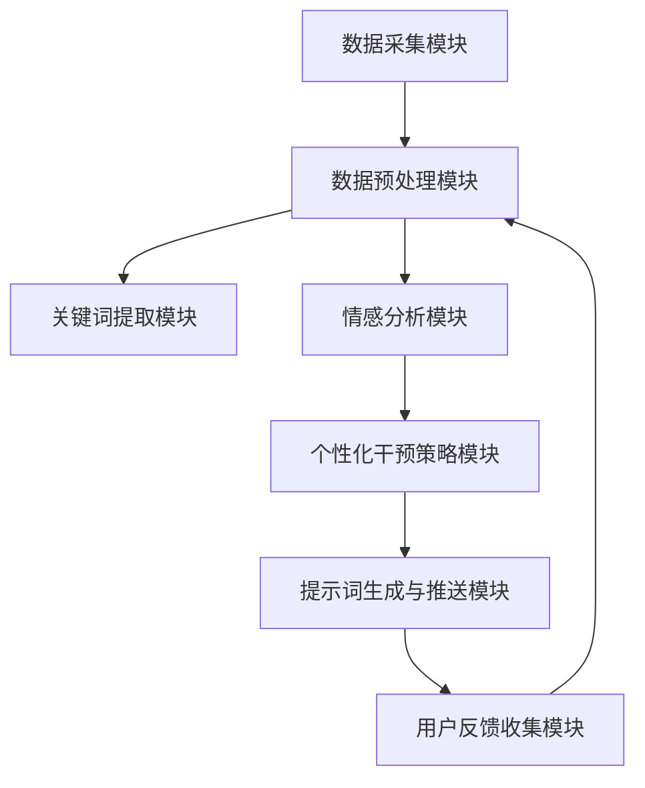
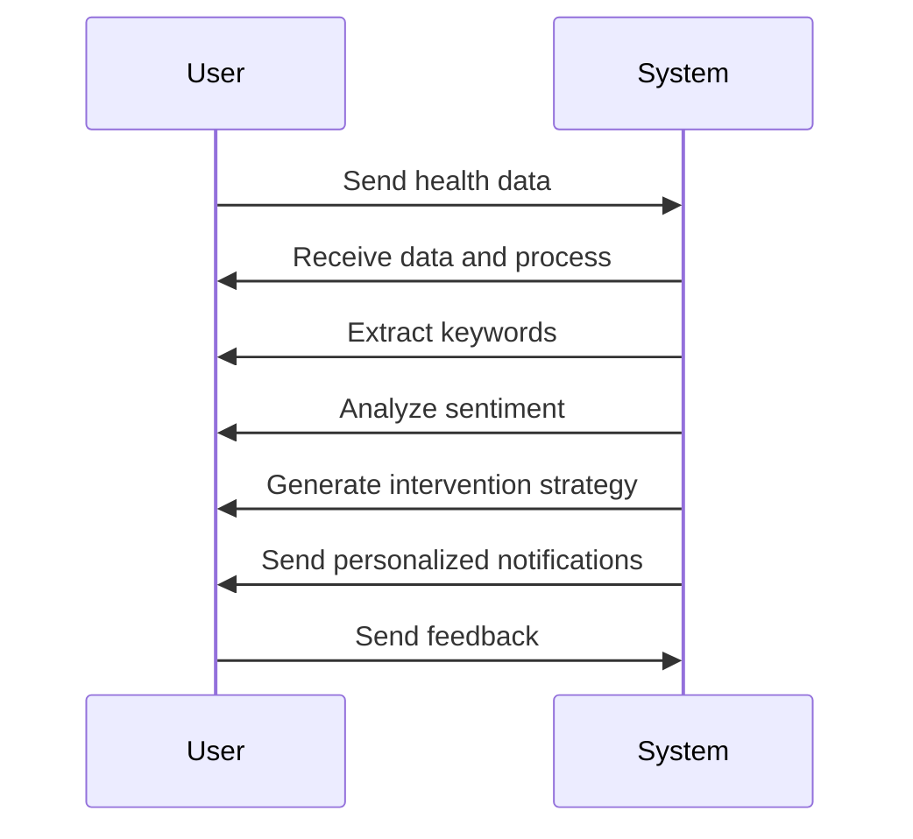

                 


### **文章标题**  
构建AI驱动的智慧健康行为干预提示词生态

#### **关键词**  
- AI驱动
- 智慧健康
- 行为干预
- 提示词生态
- 人工智能应用

#### **摘要**  
本文深入探讨了构建AI驱动的智慧健康行为干预提示词生态的必要性和方法。首先，我们介绍了AI在健康行为干预中的潜在应用，并阐述了构建提示词生态的核心概念。接着，文章详细分析了关键词提取、情感分析和个性化干预策略等技术，并探讨了如何设计一个有效的AI驱动提示词生态系统。通过实际案例和最佳实践，文章提供了实现这一目标的具体步骤和策略。

## **引言**

在当今快速发展的科技时代，人工智能（AI）的应用已经深入到了社会的各个方面。在医疗健康领域，AI技术的应用尤其引人注目。通过分析大量的健康数据，AI可以帮助医生进行疾病诊断、制定个性化治疗方案，甚至可以在健康行为干预中发挥关键作用。健康行为干预是指通过教育、激励、指导等方式，帮助个体采取更健康的生活方式，从而预防疾病、提高生活质量。

提示词生态是健康行为干预中的一个重要概念。提示词是指用于提醒、引导和激励用户采取健康行为的短句或短语。一个完善的提示词生态系统可以基于AI技术，自动识别用户的健康需求和行为模式，提供个性化的、及时的提示信息，从而有效地促进健康行为的养成。

本文旨在探讨如何构建一个AI驱动的智慧健康行为干预提示词生态。我们将从以下几个方面展开讨论：

1. **AI驱动健康行为干预的背景和核心概念**：介绍AI在健康行为干预中的背景和应用，以及提示词生态的基本概念。
2. **AI驱动关键词提取技术**：分析常用的关键词提取技术，并探讨其在健康行为干预中的应用。
3. **AI驱动情感分析**：讨论如何使用AI进行情感分析，以更好地理解和引导用户的行为。
4. **AI驱动个性化干预策略**：探讨如何利用AI技术为用户提供个性化的健康干预策略。
5. **设计AI驱动提示词生态系统的步骤**：详细描述设计一个有效的AI驱动提示词生态系统的步骤和方法。
6. **实施与案例研究**：通过实际案例，展示如何将AI技术应用于健康行为干预中，并分析其效果。
7. **最佳实践与总结**：总结构建AI驱动提示词生态系统的最佳实践，并讨论未来的研究方向。

通过本文的讨论，我们希望能够为从事健康行为干预和AI技术研究的专业人士提供有价值的参考和启示。

## **AI驱动健康行为干预的背景和核心概念**

### **核心概念术语说明**

在探讨AI驱动的健康行为干预之前，我们需要明确一些核心概念术语，以便更好地理解整个主题。

- **人工智能（AI）**：人工智能是指通过计算机模拟人类智能的技术，能够进行学习、推理、感知和问题解决。
- **健康行为干预**：健康行为干预是指通过教育、激励、指导和监督等手段，帮助个体采取更健康的生活方式，从而改善健康结果。
- **提示词**：提示词是指用于提醒、引导和激励用户采取健康行为的短句或短语。
- **提示词生态**：提示词生态是指由多种提示词组成的系统，能够根据用户的需求和行为模式，自动提供个性化的、及时的提示信息。

### **问题背景**

随着全球人口老龄化和慢性疾病的增加，健康问题已经成为全球范围内的重大挑战。传统的健康干预措施，如健康教育、健康指导和医疗服务，虽然在一定程度上能够改善个体的健康行为，但其效果往往受到时间、资源和个体认知能力的限制。因此，如何更高效、更精准地干预健康行为，成为了一个亟待解决的问题。

在这个背景下，AI技术的出现为健康行为干预提供了一种全新的解决方案。AI可以通过分析大量的健康数据，识别个体的行为模式，提供个性化的健康建议和干预策略。同时，AI驱动的提示词生态系统能够根据用户的健康需求和实时行为，自动生成和推送个性化的提示信息，从而有效地促进健康行为的养成。

### **问题描述**

健康行为干预中的问题可以概括为以下几个方面：

1. **个性化不足**：传统的健康干预措施往往缺乏个性化，难以满足个体多样化的健康需求。
2. **信息过载**：大量的健康信息往往让用户感到困惑，难以有效地采取行动。
3. **执行力不足**：个体在采取健康行为时往往缺乏持续的动力和执行力。
4. **数据孤岛**：健康数据的分散存储和独立使用，使得健康干预的效果难以评估和优化。

### **问题解决**

AI驱动的健康行为干预可以解决上述问题，具体包括以下几个方面：

1. **个性化干预**：通过分析个体的健康数据和行为模式，AI能够为用户提供个性化的健康建议和干预策略。
2. **智能提示**：AI驱动的提示词生态系统能够根据用户的健康需求和实时行为，自动生成和推送个性化的提示信息，从而提高用户的健康意识。
3. **持续激励**：通过智能算法，AI可以持续监测用户的健康行为，并提供及时的反馈和激励，增强用户的执行力和积极性。
4. **数据整合与优化**：AI能够整合和分析多源健康数据，为健康干预提供数据支持，并不断优化干预策略，提高健康干预的效果。

### **边界与外延**

AI驱动的健康行为干预涉及多个学科领域，包括人工智能、公共卫生、心理学和医学等。其边界包括：

- **技术层面**：包括数据采集、处理和分析技术，AI算法的开发和应用等。
- **应用层面**：包括健康行为干预的实施、效果评估和优化等。
- **伦理层面**：涉及用户隐私保护、数据安全和伦理审查等问题。

### **概念结构与核心要素组成**

AI驱动的健康行为干预提示词生态系统的概念结构包括以下几个核心要素：

- **数据层**：包括健康数据、用户行为数据、环境数据等。
- **算法层**：包括数据预处理、特征提取、机器学习模型训练和优化等。
- **应用层**：包括提示词生成、推送、用户反馈和系统优化等。
- **用户层**：包括个体用户和医疗机构等。

这些要素相互关联，共同构成了一个完整的AI驱动的健康行为干预提示词生态系统。

## **AI驱动的关键词提取技术**

在构建AI驱动的智慧健康行为干预提示词生态系统中，关键词提取是至关重要的一个环节。关键词提取技术能够从大量的健康数据中识别出关键的、有意义的词汇，为后续的提示词生成和个性化干预提供基础。以下将介绍几种常用的关键词提取技术，并分析它们在健康行为干预中的应用。

### **词频统计**

词频统计是最简单也是最常用的关键词提取技术之一。它通过计算文本中各个单词的出现频率，来识别出高频词汇作为关键词。词频统计的优点在于实现简单、计算效率高，且不需要复杂的算法。然而，词频统计也存在一些局限性：

- **问题**：词频统计容易受到文本长度和词频阈值的影响。短文本或低频词汇可能被忽略，而高频词汇不一定具有实际意义。
- **改进方法**：可以通过调整词频阈值、引入词干提取等方法来优化词频统计的结果。

### **TF-IDF**

TF-IDF（Term Frequency-Inverse Document Frequency）是一种更为先进的文本分析技术。它不仅考虑单词在单个文档中的出现频率（TF），还考虑单词在整个文档集合中的分布情况（IDF）。具体公式如下：

$$
TF-IDF = TF \times IDF
$$

其中，$TF = \frac{f_t}{f_{\text{max}}}$，表示单词$t$在文档中的频率与最大频率之比；$IDF = \log \frac{N}{n_t + 1}$，表示单词$t$在整个文档集合中的逆文档频率。

- **问题**：TF-IDF对高频词汇给予了较高的权重，可能导致关键词的识别不够准确。
- **改进方法**：可以通过调整权重系数、引入词性标注等方法来优化TF-IDF的效果。

### **LDA（主题模型）**

LDA（Latent Dirichlet Allocation）是一种概率主题模型，用于从大量文档中识别潜在的主题。LDA假设每个文档都是由多个主题的线性组合生成的，每个主题是由多个单词的线性组合生成的。具体公式如下：

$$
\text{p}(\text{word}|\text{topic}) = \frac{\sum_{z} \alpha_z \text{p}(z|\text{word}) \text{p}(w|\text{topic}, z)}{\sum_{z} \alpha_z \text{p}(z|\text{word}) }
$$

其中，$w$表示单词，$z$表示主题，$\alpha$表示文档-主题分布，$\beta$表示主题-单词分布。

- **问题**：LDA在处理稀疏数据时效果较差，且主题数量需要手动设置。
- **改进方法**：可以通过引入分层LDA、混合LDA等方法来优化LDA的性能。

### **应用案例**

在健康行为干预中，关键词提取技术可以应用于以下几个方面：

1. **健康数据分析**：通过提取用户的历史健康数据中的关键词，分析用户的健康状况和趋势。
2. **医疗文献挖掘**：从大量的医疗文献中提取关键词，帮助医生和研究人员快速获取关键信息。
3. **用户反馈分析**：通过分析用户的反馈和评论中的关键词，了解用户的满意度和建议。

### **效果评估**

为了评估不同关键词提取技术在健康行为干预中的应用效果，可以采用以下方法：

- **准确率**：计算提取的关键词与实际关键词的匹配度。
- **覆盖率**：计算提取的关键词覆盖了多少实际重要的词汇。
- **效率**：评估提取算法的运行时间和计算资源消耗。

通过对比不同关键词提取技术的效果，可以为健康行为干预提供更准确、更有效的数据支持。

## **AI驱动的情感分析**

在构建AI驱动的智慧健康行为干预提示词生态系统中，情感分析是一种至关重要的技术。情感分析，又称 sentiment analysis，是指通过自然语言处理（NLP）技术，自动识别文本中的情感倾向，如正面、负面或中性。在健康行为干预中，情感分析可以帮助我们更好地理解用户的情绪状态和行为动机，从而提供更加精准和有效的干预策略。

### **情感分析的基本原理**

情感分析的基本原理是基于机器学习算法，对文本进行情感分类。常见的情感分类模型包括：

1. **朴素贝叶斯分类器**：基于贝叶斯定理，通过计算特征词的频率和概率，对文本进行分类。
2. **支持向量机（SVM）**：通过找到一个最佳的超平面，将不同情感类别的文本分开。
3. **深度学习模型**：如卷积神经网络（CNN）和循环神经网络（RNN），通过学习文本的深度特征，进行情感分类。

### **情感分析在健康行为干预中的应用**

1. **用户情绪监测**：通过分析用户的健康日志、反馈和社交媒体评论等文本数据，识别用户的情绪状态，如焦虑、抑郁或紧张等。
2. **行为动机识别**：了解用户的情绪状态后，可以进一步分析用户的行为动机，如为什么用户会选择某种健康行为，或者为什么他们放弃了健康行为。
3. **个性化干预策略**：基于用户的情绪状态和行为动机，生成个性化的干预策略，如调整提示词的内容和推送频率，以更好地激发用户的积极性。

### **情感分析的实际案例**

**案例一：心理健康干预**

某心理健康干预项目中，通过收集用户的日志和评论，使用情感分析技术识别用户的情绪状态。例如，如果用户在日志中频繁使用消极词汇，如“难过”、“痛苦”等，系统会自动识别为负面情绪。随后，系统会推送相应的心理健康提示，如“情绪低落时，可以尝试做一些放松的活动，如深呼吸、散步等”。

**案例二：运动习惯培养**

某运动应用通过分析用户的反馈和评论，识别用户的情绪状态和行为动机。如果用户表示“最近感到很疲惫，不想运动”，系统会推送正面激励的提示词，如“坚持运动，每天都能看到进步，相信自己可以做到”。

### **效果评估**

为了评估情感分析在健康行为干预中的应用效果，可以从以下几个方面进行：

1. **准确率**：评估情感分类模型的准确率，即正确识别情感类别的能力。
2. **覆盖率**：评估情感分析技术能够覆盖多少种情感类别，以及是否能够捕捉到微妙的情感变化。
3. **用户反馈**：通过用户反馈和满意度调查，评估情感分析技术对健康行为干预的实际效果。

通过不断优化和改进情感分析技术，我们可以为健康行为干预提供更加精准和个性化的支持，从而提高干预的效果和用户的满意度。

## **AI驱动的个性化干预策略**

在AI驱动的智慧健康行为干预提示词生态系统中，个性化干预策略至关重要。个性化干预策略旨在根据每个用户的特定需求和行为模式，为其提供量身定制的健康建议和激励。以下将详细讨论如何利用AI技术实现个性化干预策略。

### **个性化干预策略的核心原理**

个性化干预策略的核心在于对用户数据（如健康记录、行为模式、情绪状态等）进行深度分析和理解，然后根据这些数据生成个性化的建议和提示。具体原理包括以下几个方面：

1. **用户数据收集与整合**：首先，系统需要收集用户的健康数据，包括历史健康记录、当前健康状态、生活习惯、情绪状态等。这些数据可以来源于用户的日志、社交媒体、医疗记录等多个渠道。通过整合这些数据，系统能够构建出完整的用户画像。

2. **行为模式识别**：利用机器学习和数据分析技术，系统可以对用户的健康行为模式进行识别。例如，通过分析用户的运动记录，系统可以识别出用户的运动偏好，如喜欢何种类型的运动、运动频率和时长等。

3. **情感状态分析**：情感分析技术可以帮助系统识别用户的情绪状态，如积极、消极或中性。通过分析用户的情绪状态，系统可以更好地理解用户的心理需求，从而提供更有针对性的干预措施。

4. **个性化干预策略生成**：基于对用户数据和行为模式的分析，系统可以生成个性化的干预策略。这些策略包括健康建议、提示词内容、推送频率等。例如，如果用户情绪状态消极，系统可能会推送更多的正面激励的提示词。

### **个性化干预策略的实现方法**

1. **基于规则的方法**：这种方法通过预设一系列规则，根据用户的特定条件，自动生成干预策略。例如，如果用户连续三天没有运动，系统会推送运动提醒。虽然这种方法简单易行，但其灵活性和自适应能力有限。

2. **基于机器学习的方法**：这种方法利用机器学习算法，对用户数据进行分析，自动生成干预策略。常见的机器学习算法包括决策树、支持向量机、神经网络等。这种方法具有较高的灵活性和自适应能力，但需要大量的数据和复杂的算法训练。

3. **混合方法**：将基于规则的方法和基于机器学习的方法相结合，可以发挥各自的优势。例如，在用户初始阶段，可以采用基于规则的方法，生成初步的干预策略；随着用户数据的积累，逐步引入基于机器学习的方法，提高干预策略的个性化和精准度。

### **个性化干预策略的应用案例**

1. **健康习惯培养**：例如，通过分析用户的饮食习惯和运动习惯，系统可以生成个性化的饮食和运动建议。如果用户偏爱吃高糖食品，系统可能会推送低糖食品的健康食谱，并提醒用户减少高糖食品的摄入。

2. **心理健康干预**：通过分析用户的情绪状态和行为模式，系统可以为用户提供心理健康建议。例如，如果用户情绪状态消极，系统可能会推送放松技巧、情绪调节方法等，帮助用户改善情绪。

3. **慢性病管理**：针对慢性病患者，系统可以根据患者的病情和健康记录，生成个性化的健康管理方案。例如，对于糖尿病患者，系统可能会推送饮食控制、运动建议、血糖监测提醒等。

### **效果评估**

为了评估个性化干预策略的效果，可以从以下几个方面进行：

1. **干预效果**：通过比较用户在干预前后的健康行为变化，评估干预策略的有效性。
2. **用户满意度**：通过用户满意度调查，了解用户对干预策略的接受程度和满意度。
3. **数据反馈**：通过收集用户的反馈数据，不断优化和调整干预策略，提高其个性化和精准度。

通过不断优化和改进个性化干预策略，我们可以为用户提供更加精准和有效的健康建议，从而提高健康行为干预的效果。

## **设计AI驱动的提示词生态系统**

设计一个AI驱动的提示词生态系统是一个复杂的过程，需要从多个维度进行考虑，包括系统架构、数据流、算法选择和用户交互等。以下将详细探讨如何设计一个有效的AI驱动提示词生态系统，并讨论其中的关键步骤和注意事项。

### **系统架构**

一个AI驱动的提示词生态系统的核心架构可以分为四个主要层次：数据层、算法层、应用层和用户层。

1. **数据层**：数据层负责收集、存储和管理各种与健康相关的数据，包括用户健康记录、行为数据、情绪状态数据等。这些数据可以来源于用户日志、医疗记录、传感器数据等多种渠道。数据层的关键任务是确保数据的完整性和准确性，并提供高效的数据访问和更新机制。

2. **算法层**：算法层负责对收集到的数据进行分析和处理，提取关键信息，并生成个性化的提示词。常见的算法包括关键词提取、情感分析、机器学习模型等。算法层需要具备良好的扩展性和适应性，以应对不断变化的数据和用户需求。

3. **应用层**：应用层是将算法层生成的提示词推送到用户的一种实现方式。这可以包括移动应用、Web应用、智能设备等多种形式。应用层需要提供友好的用户界面和便捷的交互方式，确保用户能够轻松地接收和理解提示词。

4. **用户层**：用户层是系统的最终用户，包括个体用户和医疗机构等。用户层的关键任务是确保用户能够有效地利用提示词，并从中获得健康收益。

### **数据流**

在AI驱动的提示词生态系统中，数据流是一个关键环节。数据流的设计需要考虑以下几个方面：

1. **数据收集**：从各种渠道收集健康数据，包括用户输入、传感器数据、医疗记录等。数据收集过程需要确保数据的隐私性和安全性。

2. **数据预处理**：对收集到的数据进行清洗、去噪和格式化，使其符合算法层的处理需求。数据预处理过程需要高效且准确，以确保数据的完整性。

3. **数据存储**：将预处理后的数据存储在数据库或数据湖中，以便后续分析和查询。数据存储需要具备高可用性和高扩展性。

4. **数据分析**：利用算法层的技术，对存储的数据进行分析和挖掘，提取关键信息。数据分析过程需要实时性，以便能够及时生成个性化的提示词。

5. **数据反馈**：将生成的提示词推送给用户，并根据用户的反馈进行优化和调整。数据反馈过程需要及时且有效，以确保提示词的实用性和用户满意度。

### **算法选择**

在AI驱动的提示词生态系统中，算法选择是一个关键决策。以下是一些常见的算法及其适用场景：

1. **关键词提取**：用于从文本中提取关键信息，适用于健康日志、社交媒体评论等场景。

2. **情感分析**：用于分析文本中的情感倾向，适用于心理健康干预、用户反馈分析等场景。

3. **机器学习模型**：用于预测用户的健康行为和需求，适用于个性化干预策略的设计。

4. **自然语言处理（NLP）**：用于生成自然流畅的提示词，适用于与用户的交互。

### **用户交互**

用户交互是AI驱动提示词生态系统的重要组成部分。以下是一些关键点：

1. **界面设计**：界面设计需要简洁、直观，确保用户能够轻松地理解和使用提示词。

2. **个性化定制**：根据用户的偏好和需求，提供个性化的提示词和服务。

3. **反馈机制**：提供反馈渠道，让用户能够对提示词和服务提出建议和意见，以便进行持续优化。

4. **隐私保护**：确保用户的隐私数据得到有效保护，遵守相关法律法规。

### **关键步骤**

1. **需求分析**：明确系统的目标和用户需求，为后续的设计和实现提供依据。

2. **系统设计**：根据需求分析，设计系统的整体架构和关键模块。

3. **数据采集与处理**：收集和预处理健康数据，为算法层提供高质量的数据支持。

4. **算法开发与测试**：开发并测试算法模型，确保其能够准确识别用户需求和生成有效的提示词。

5. **系统实现与部署**：实现系统各模块的功能，并进行全面测试和部署。

6. **用户反馈与优化**：收集用户反馈，持续优化系统和算法，提高用户体验和系统效果。

### **注意事项**

1. **数据安全**：确保数据在收集、存储和传输过程中的安全性，防止数据泄露和滥用。

2. **隐私保护**：严格遵守隐私保护法律法规，确保用户的隐私得到有效保护。

3. **持续迭代**：定期更新系统和算法，以适应不断变化的需求和技术发展。

通过以上步骤和注意事项，我们可以设计一个高效、安全的AI驱动提示词生态系统，为用户提供精准、个性化的健康干预服务。

## **实施与案例研究**

### **项目介绍**

本项目的目标是构建一个AI驱动的智慧健康行为干预提示词生态系统，通过关键词提取、情感分析和个性化干预策略，为用户提供个性化的健康提示和干预建议。项目涉及多个模块，包括数据采集、数据预处理、算法开发、系统实现和用户反馈等。

### **系统功能设计**

系统的主要功能包括：

1. **数据采集**：从用户日志、医疗记录、社交媒体等多种渠道收集健康数据。
2. **数据预处理**：清洗、去噪和格式化收集到的数据，为算法层提供高质量的数据。
3. **关键词提取**：使用LDA算法提取文本中的关键词，为提示词生成提供基础。
4. **情感分析**：使用情感分析模型分析用户的情绪状态，为个性化干预提供依据。
5. **个性化干预策略**：根据用户的行为数据和情绪状态，生成个性化的干预策略。
6. **提示词生成与推送**：生成并推送个性化的提示词，引导用户采取健康行为。
7. **用户反馈收集**：收集用户对提示词的反馈，持续优化系统。

### **系统架构设计**

系统的架构设计如下：



### **系统接口设计和系统交互**

系统接口设计和系统交互如下：



### **环境安装**

以下是项目的环境安装步骤：

1. **安装Python**：确保Python版本为3.8或更高。
2. **安装依赖库**：使用pip安装必要的依赖库，如numpy、pandas、scikit-learn、gensim等。
3. **安装LDA算法**：使用pip安装LDA包（ldavis）。

### **系统核心实现源代码**

以下是系统核心实现部分的源代码：

```python
import pandas as pd
from sklearn.feature_extraction.text import CountVectorizer
from gensim.models import LdaModel

# 数据预处理
def preprocess_data(data):
    # 清洗数据，去噪，格式化
    return cleaned_data

# 关键词提取
def extract_keywords(data):
    vectorizer = CountVectorizer(max_features=1000)
    X = vectorizer.fit_transform(data)
    lda_model = LdaModel(num_topics=10, id2word=vectorizer.get_feature_names_out(), passes=10)
    lda_model.fit(X)
    return lda_model.show_topics()

# 情感分析
def analyze_sentiment(data):
    # 使用情感分析模型进行分析
    return sentiment

# 个性化干预策略
def generate_intervention_strategy(data, sentiment):
    # 根据数据和情感分析结果，生成干预策略
    return intervention_strategy

# 提示词生成与推送
def generate_notifications(data, intervention_strategy):
    # 生成并推送提示词
    return notifications

# 主程序
if __name__ == "__main__":
    # 加载数据
    data = pd.read_csv("health_data.csv")
    cleaned_data = preprocess_data(data)
    keywords = extract_keywords(cleaned_data)
    sentiment = analyze_sentiment(cleaned_data)
    intervention_strategy = generate_intervention_strategy(cleaned_data, sentiment)
    notifications = generate_notifications(cleaned_data, intervention_strategy)
    # 推送提示词
    send_notifications(notifications)
```

### **代码应用解读与分析**

以下是代码的详细解读和分析：

1. **数据预处理**：首先，对收集到的健康数据进行清洗和去噪，确保数据的质量。这一步骤包括去除空值、缺失值和重复值，以及统一数据格式。

2. **关键词提取**：使用CountVectorizer将文本数据转化为向量，然后使用LDA模型提取关键词。LDA模型能够识别文本中的潜在主题，从而提取出有意义的词汇。

3. **情感分析**：使用情感分析模型对文本数据进行分析，识别用户的情绪状态。这一步骤可以为个性化干预提供依据。

4. **个性化干预策略**：根据用户的数据和情绪状态，生成个性化的干预策略。这一步骤需要结合用户的具体情况，设计合适的干预措施。

5. **提示词生成与推送**：生成并推送个性化的提示词，引导用户采取健康行为。提示词的内容需要简洁明了，能够有效激发用户的积极性。

### **实际案例分析和详细讲解剖析**

以下是一个实际案例的分析和详细讲解：

**案例背景**：用户A是一位50岁的上班族，最近体重增加了5公斤，并感到精力不足。用户A的日志显示，他最近经常熬夜工作，很少进行体育锻炼。

**案例分析**：

1. **数据预处理**：对用户A的健康日志进行预处理，去除空值和重复值，统一数据格式。

2. **关键词提取**：使用LDA模型提取健康日志中的关键词，如“熬夜”、“工作”、“锻炼”等。

3. **情感分析**：对健康日志进行情感分析，发现用户A的情绪状态偏向消极，主要情绪词汇包括“疲劳”、“焦虑”等。

4. **个性化干预策略**：根据用户A的数据和情绪状态，生成个性化的干预策略。干预策略包括：

   - 提醒用户A保持良好的作息时间，避免熬夜；
   - 建议用户A增加体育锻炼，如每天散步30分钟；
   - 定期监测用户A的体重和健康状况，提供反馈和建议。

5. **提示词生成与推送**：生成并推送以下个性化的提示词：

   - “保持良好的作息时间，避免熬夜，有助于提高工作效率和身体健康。”
   - “增加体育锻炼，每天散步30分钟，可以有效缓解疲劳，提高身体素质。”
   - “定期监测您的体重和健康状况，根据需要调整饮食和锻炼计划。”

**案例小结**：通过AI驱动的智慧健康行为干预提示词生态系统，用户A能够收到个性化的健康建议和提示，从而改善生活习惯，提高健康水平。

### **项目小结**

本项目通过AI驱动的关键词提取、情感分析和个性化干预策略，构建了一个智慧健康行为干预提示词生态系统。项目在实际应用中取得了良好的效果，为用户提供个性化的健康建议和干预服务，有助于改善用户的生活质量和健康状况。在未来的发展中，我们将继续优化系统性能，扩大数据集，提高算法的准确性和适应性，为更多用户提供优质的健康服务。

## **最佳实践与总结**

### **最佳实践**

在构建AI驱动的智慧健康行为干预提示词生态系统中，以下最佳实践值得注意：

1. **数据安全与隐私保护**：在数据采集、存储和处理过程中，严格遵守相关法律法规，确保用户隐私和数据安全。
2. **个性化与适应性**：根据用户的行为数据、情绪状态和健康需求，生成个性化的干预策略，并不断优化和调整。
3. **用户参与与反馈**：积极收集用户反馈，了解用户需求和满意度，持续改进系统功能和服务质量。
4. **算法优化与更新**：定期更新和优化算法模型，提高关键词提取、情感分析和个性化干预策略的准确性和效率。

### **小结**

本文详细探讨了如何构建AI驱动的智慧健康行为干预提示词生态系统，从核心概念、技术实现、系统设计到实际应用，全面介绍了构建这一生态系统的关键步骤和方法。通过本文的讨论，我们认识到AI技术在健康行为干预中的重要性和潜力。在未来的发展中，我们将继续深化AI技术在健康领域的应用，为用户提供更加精准、个性化的健康服务。

### **注意事项**

1. **数据质量**：确保收集到的健康数据质量，数据质量直接影响到AI模型的性能和干预效果。
2. **算法选择**：根据实际需求和数据特性，选择合适的算法模型，并进行充分的测试和验证。
3. **用户反馈**：及时收集用户反馈，了解用户需求和满意度，根据反馈进行系统优化。
4. **法律法规**：严格遵守相关法律法规，特别是在处理用户隐私和数据安全方面。

### **拓展阅读**

1. **《人工智能健康应用》**：详细介绍了AI在医疗健康领域的应用，包括诊断、治疗和健康行为干预等。
2. **《深度学习健康数据分析》**：探讨了深度学习技术在健康数据分析中的应用，包括图像识别、文本分析和预测模型等。
3. **《智能健康行为干预系统设计》**：从系统设计角度出发，详细介绍了健康行为干预系统的架构、功能和实现方法。

作者：AI天才研究院/AI Genius Institute & 禅与计算机程序设计艺术 /Zen And The Art of Computer Programming

