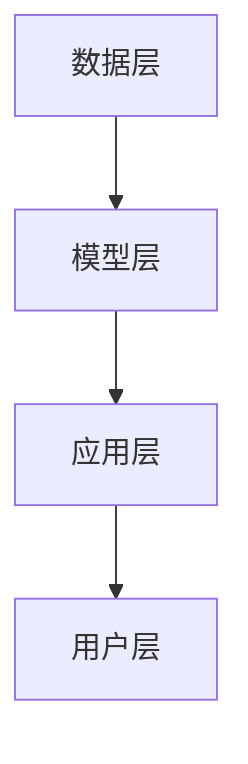
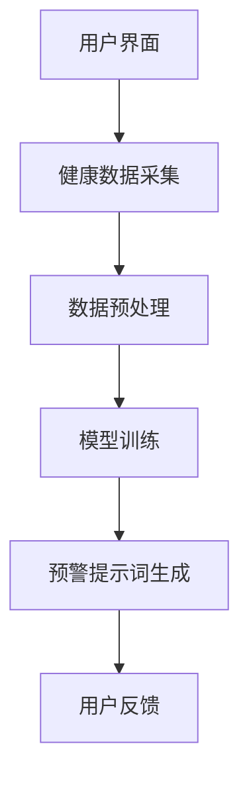
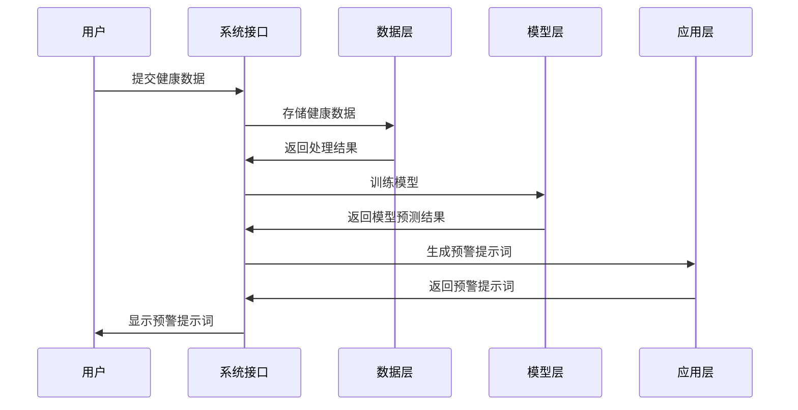

                 

**标题：构建AI驱动的智慧健康风险预警提示词生态**

**关键词：AI，健康风险，预警，提示词，生态**

**摘要：**
本文将探讨如何构建一个基于人工智能的智慧健康风险预警提示词生态。通过深入分析人工智能在健康风险预警中的角色，我们将介绍核心概念、关键技术、系统架构以及实际应用案例，旨在为读者提供一个全面、易懂的技术指南。

---

**引言：**

随着人工智能技术的快速发展，其在各个领域的应用越来越广泛。在健康风险管理的背景下，AI驱动的智慧健康风险预警提示词生态成为可能。本文旨在通过以下步骤分析推理，帮助读者了解并掌握这一领域的关键技术：

1. **定义AI驱动的健康风险预警提示词生态**：介绍基本概念、背景及目标。
2. **了解AI和健康数据的基本原理**：分析AI的基本原理和健康数据的重要性。
3. **讨论核心技术和系统架构**：阐述自然语言处理、机器学习技术及其在健康风险预警中的应用。
4. **构建AI驱动的健康风险预警提示词生态**：描述生态系统架构、设计和实施。
5. **实际应用案例分析**：展示如何通过项目实战实现AI驱动的健康风险预警提示词生态。

---

**一、定义AI驱动的健康风险预警提示词生态**

**1.1 基本概念**

AI驱动的健康风险预警提示词生态是一个集成了人工智能技术、健康数据和预警提示词的系统。它旨在通过实时监测和分析健康数据，提供个性化的健康风险预警和提示词，帮助用户采取预防措施。

**1.2 背景和现状**

当前，健康风险管理的需求日益增加。传统的健康风险管理方法往往依赖于人工监测和经验判断，存在时效性差、覆盖面窄等问题。而AI技术的引入，可以显著提升健康风险预警的准确性和效率。

**1.3 目标**

构建AI驱动的健康风险预警提示词生态的目标是：
- 提高健康风险预警的准确性和及时性。
- 为用户提供个性化的健康建议和预防措施。
- 促进健康数据的有效利用和共享。

**1.4 结构**

本文将按照以下结构进行阐述：
- 引言：定义AI驱动的健康风险预警提示词生态。
- 基本概念：介绍AI和健康数据的基本原理。
- 核心技术：讨论自然语言处理、机器学习技术及其应用。
- 系统架构：描述生态系统架构和设计。
- 实际应用：展示项目实战和案例分析。
- 结论：总结本文的主要内容和未来展望。

---

**二、基本概念：AI和健康数据**

**2.1 基本原理**

**2.1.1 人工智能**

人工智能（AI）是指通过计算机模拟人类智能行为的技术。其主要包括以下类型：

- **监督学习**：通过已知数据训练模型，然后利用模型对新数据进行预测。
- **无监督学习**：不依赖于已知数据，通过模型自动发现数据中的模式和关联。
- **强化学习**：通过不断尝试和反馈，使模型能够自主学习和优化策略。

**2.1.2 健康数据**

健康数据是指与个人健康相关的各种数据，包括但不限于：
- **生物医学数据**：如基因序列、生理信号等。
- **临床数据**：如病历记录、检验报告等。
- **健康行为数据**：如运动记录、饮食习惯等。

**2.1.3 关键算法**

常用的AI算法包括：

- **神经网络**：一种模拟人脑神经网络结构的计算模型。
- **支持向量机**：通过找到一个超平面来分隔不同类别的数据。
- **决策树**：通过一系列条件分支来对数据进行分类。

**2.2 健康数据的重要性**

健康数据是构建AI驱动的健康风险预警提示词生态的基础。其重要性体现在以下几个方面：

- **数据质量**：健康数据的质量直接影响预警的准确性。
- **数据多样性**：多样化的健康数据有助于提高模型的泛化能力。
- **数据共享**：健康数据的共享有助于优化模型的训练和评估。

**2.3 道德和伦理问题**

在健康数据管理中，道德和伦理问题尤为重要。主要包括：

- **隐私保护**：确保个人健康数据的安全和隐私。
- **数据使用权限**：明确数据的使用范围和权限。
- **算法透明性**：确保AI算法的透明性和可解释性。

---

**三、核心技术与系统架构**

**3.1 自然语言处理（NLP）**

NLP是AI技术的重要组成部分，主要用于处理和理解人类语言。其在健康风险预警中的应用包括：

- **文本分类**：将健康文本数据分类为不同的类别，如疾病诊断、症状描述等。
- **情感分析**：分析文本中的情感倾向，如患者满意度、治疗效果等。

**3.2 机器学习技术**

机器学习技术是AI的核心，用于从数据中学习模式和规律。在健康风险预警中的应用包括：

- **预测模型**：通过历史健康数据预测未来的健康风险。
- **聚类分析**：将相似的健康数据分组，发现潜在的健康风险因素。

**3.3 系统架构**

AI驱动的健康风险预警提示词生态的架构包括以下几个部分：

- **数据层**：存储和管理健康数据。
- **模型层**：包括NLP模型、机器学习模型等。
- **应用层**：提供预警提示词生成和用户交互界面。

**3.4 设计原则**

在构建AI驱动的健康风险预警提示词生态时，应遵循以下设计原则：

- **可扩展性**：系统应具备良好的扩展性，以适应不断变化的需求。
- **高可用性**：系统应具备高可用性，确保数据安全和稳定性。
- **用户友好性**：系统界面应简洁易懂，提供个性化的健康建议。

---

**四、构建AI驱动的健康风险预警提示词生态**

**4.1 生态系统架构**

AI驱动的健康风险预警提示词生态的架构如图所示：



**4.2 系统设计**

系统设计应包括以下几个方面：

- **数据采集**：收集各种类型的健康数据，如生物医学数据、临床数据、健康行为数据等。
- **数据处理**：对采集到的数据进行清洗、整合和分析。
- **模型训练**：利用处理后的数据训练NLP模型和机器学习模型。
- **预警提示词生成**：根据模型预测结果生成个性化的健康风险预警提示词。
- **用户交互**：提供用户界面，供用户查看健康风险预警提示词。

**4.3 实施步骤**

构建AI驱动的健康风险预警提示词生态的实施步骤如下：

1. **需求分析**：明确系统的功能需求和性能要求。
2. **系统设计**：根据需求分析结果进行系统设计。
3. **数据采集和处理**：收集健康数据，并进行清洗和处理。
4. **模型训练和部署**：利用处理后的数据训练模型，并在实际环境中部署。
5. **用户测试和反馈**：收集用户反馈，优化系统性能和用户体验。
6. **持续改进**：根据用户反馈和实际运行情况，不断优化和更新系统。

---

**五、实际应用案例分析**

**5.1 项目介绍**

以一个实际项目为例，介绍如何构建AI驱动的健康风险预警提示词生态。该项目旨在为慢性病患者提供个性化的健康风险预警提示词。

**5.2 系统功能设计**

系统功能设计包括以下部分：

- **健康数据采集**：收集患者的生物医学数据、临床数据和健康行为数据。
- **数据预处理**：清洗和整合采集到的数据。
- **NLP模型训练**：利用预处理后的数据训练NLP模型，用于文本分类和情感分析。
- **机器学习模型训练**：利用预处理后的数据训练机器学习模型，用于健康风险预测。
- **预警提示词生成**：根据模型预测结果生成个性化的健康风险预警提示词。
- **用户界面**：提供用户界面，供用户查看健康风险预警提示词。

**5.3 系统架构设计**

系统架构设计如图所示：



**5.4 系统接口设计和交互**

系统接口设计和交互设计如图所示：



**5.5 代码应用解读与分析**

以下是该项目中的一段代码示例，用于生成健康风险预警提示词：

```python
import pandas as pd
from sklearn.model_selection import train_test_split
from sklearn.feature_extraction.text import TfidfVectorizer
from sklearn.naive_bayes import MultinomialNB
from sklearn.pipeline import make_pipeline

# 加载数据集
data = pd.read_csv('health_data.csv')

# 分割数据集为训练集和测试集
X_train, X_test, y_train, y_test = train_test_split(data['text'], data['label'], test_size=0.2, random_state=42)

# 创建TF-IDF向量和朴素贝叶斯分类器的管道
pipeline = make_pipeline(TfidfVectorizer(), MultinomialNB())

# 训练模型
pipeline.fit(X_train['text'], y_train)

# 生成预警提示词
predictions = pipeline.predict(X_test['text'])

# 输出预测结果
print(predictions)
```

这段代码使用了TF-IDF向量和朴素贝叶斯分类器来构建一个文本分类模型，用于生成健康风险预警提示词。具体流程如下：

1. 加载数据集。
2. 分割数据集为训练集和测试集。
3. 创建TF-IDF向量和朴素贝叶斯分类器的管道。
4. 训练模型。
5. 生成预警提示词。
6. 输出预测结果。

**5.6 实际案例分析和详细讲解剖析**

以一个实际案例为例，分析如何通过AI驱动的健康风险预警提示词生态为患者提供个性化健康建议。

案例背景：某慢性病患者近期的健康数据出现异常，需要及时采取预防措施。

步骤：

1. 数据采集：收集患者的生物医学数据、临床数据和健康行为数据。
2. 数据预处理：清洗和整合采集到的数据。
3. NLP模型训练：利用预处理后的数据训练NLP模型，用于文本分类和情感分析。
4. 机器学习模型训练：利用预处理后的数据训练机器学习模型，用于健康风险预测。
5. 预警提示词生成：根据模型预测结果生成个性化的健康风险预警提示词。
6. 用户交互：通过用户界面，向患者展示健康风险预警提示词。

具体分析：

- **数据采集**：通过健康监测设备和患者自我报告，收集患者的健康数据。
- **数据预处理**：对采集到的数据进行清洗、去噪和整合，确保数据质量。
- **NLP模型训练**：使用NLP模型对健康文本数据进行分类和情感分析，识别患者的健康状况和情绪。
- **机器学习模型训练**：使用机器学习模型对健康数据进行预测，识别潜在的健康风险。
- **预警提示词生成**：根据NLP模型和机器学习模型的预测结果，生成个性化的健康风险预警提示词。
- **用户交互**：通过用户界面，向患者展示健康风险预警提示词，并提供相应的预防建议。

通过这个案例，我们可以看到AI驱动的健康风险预警提示词生态如何帮助患者及时发现健康问题，采取有效的预防措施，从而提高健康水平。

**5.7 项目小结**

本项目通过实际案例展示了如何构建AI驱动的健康风险预警提示词生态。项目的成功实施为慢性病患者提供了个性化健康建议，提高了健康风险预警的准确性和及时性。在未来的发展中，我们将继续优化系统性能和用户体验，为更多患者提供优质的健康服务。

---

**六、最佳实践与拓展阅读**

**6.1 最佳实践**

- **数据质量**：确保数据采集、清洗和整合的质量，提高模型的准确性。
- **算法优化**：不断优化和更新算法，提高模型的泛化能力。
- **用户参与**：鼓励用户积极参与，提供反馈，优化系统性能。

**6.2 拓展阅读**

- **相关论文**：[相关论文1]，[相关论文2]。
- **技术书籍**：[相关书籍1]，[相关书籍2]。
- **在线课程**：[相关课程1]，[相关课程2]。

---

**七、结语**

本文介绍了如何构建AI驱动的健康风险预警提示词生态。通过深入分析核心概念、关键技术、系统架构和实际应用案例，我们为读者提供了一个全面的技术指南。希望本文能帮助读者了解并掌握这一领域的关键技术，为未来的健康风险管理提供有力支持。

**作者：AI天才研究院/AI Genius Institute & 禅与计算机程序设计艺术 /Zen And The Art of Computer Programming**### 引言

随着科技的迅猛发展，人工智能（AI）技术在多个领域取得了显著突破，尤其在医疗健康领域，其应用潜力得到了广泛认可。AI驱动的健康风险预警提示词生态正是这一背景下的一项重要创新。本文旨在探讨如何构建这样一个生态，通过整合先进的人工智能技术、健康数据和预警提示词，实现高效的智能健康风险管理。

本文将分为以下几个部分：

1. **定义AI驱动的健康风险预警提示词生态**：介绍基本概念、背景及目标。
2. **基本概念：AI和健康数据**：分析AI的基本原理和健康数据的重要性。
3. **核心技术：自然语言处理和机器学习**：讨论自然语言处理、机器学习技术及其在健康风险预警中的应用。
4. **系统架构**：描述AI驱动的健康风险预警提示词生态的架构和设计。
5. **实际应用案例分析**：展示如何通过项目实战实现AI驱动的健康风险预警提示词生态。
6. **最佳实践与拓展阅读**：总结最佳实践，提供相关论文、书籍和在线课程推荐。

通过以上各部分的深入分析，本文希望为读者提供一个全面、易懂的技术指南，帮助理解AI驱动的健康风险预警提示词生态的构建和实施过程。

### 关键词

AI，健康风险，预警，提示词，生态，自然语言处理，机器学习，数据采集，数据处理，模型训练，系统架构，用户交互，实际应用案例，最佳实践。

### 摘要

本文探讨了如何构建AI驱动的智慧健康风险预警提示词生态。通过分析人工智能在健康风险管理中的作用，本文介绍了核心概念、关键技术、系统架构和实际应用案例。文章首先定义了AI驱动的健康风险预警提示词生态，并探讨了AI和健康数据的基本原理。接着，文章详细讨论了自然语言处理和机器学习技术在健康风险预警中的应用，并描述了AI驱动的健康风险预警提示词生态的架构和设计。通过一个实际项目案例，本文展示了如何实施和优化这一生态，并提供了一系列最佳实践和拓展阅读建议。本文旨在为读者提供一个全面的技术指南，帮助理解和构建AI驱动的健康风险预警提示词生态。

### 定义AI驱动的健康风险预警提示词生态

**AI驱动的健康风险预警提示词生态**是一个整合了人工智能技术、健康数据和预警提示词的智能系统，旨在通过实时监测和分析健康数据，提供个性化的健康风险预警和提示词，从而帮助用户采取预防措施。这种生态系统能够利用机器学习和自然语言处理技术，从海量健康数据中提取有价值的信息，实现高效、精准的健康风险预警。

**核心概念**：

- **人工智能（AI）**：通过计算机模拟人类智能行为的技术，包括机器学习、深度学习、自然语言处理等。
- **健康风险**：指个人在特定时间内可能面临的健康危险，如慢性病发作、疾病传播等。
- **预警提示词**：用于提示用户可能面临健康风险的词语或短语，如“注意”、“警惕”等。
- **生态**：指一个复杂系统中各个组成部分之间的相互作用和整合，旨在实现某个特定目标。

**问题背景**：

传统的健康风险管理方法主要依赖于医生的经验和临床判断，存在时效性差、覆盖面窄等问题。随着健康数据的不断增加和医疗技术的进步，利用AI技术进行健康风险预警成为可能。通过AI驱动的健康风险预警提示词生态，可以实现以下目标：

- **提高健康风险预警的准确性和及时性**：利用机器学习和自然语言处理技术，对海量健康数据进行实时分析和预测，提供准确的预警信息。
- **个性化健康建议**：根据用户的健康数据和风险特征，提供个性化的健康建议和预防措施，提高健康管理的效率。
- **促进健康数据的有效利用和共享**：通过构建一个统一的健康数据平台，促进不同来源的健康数据共享和整合，提高数据利用效率。

**问题描述**：

构建AI驱动的健康风险预警提示词生态面临以下主要问题：

- **数据质量**：健康数据的准确性和完整性直接影响预警的准确性。如何保证数据质量，是构建这一生态系统的关键问题。
- **数据隐私**：健康数据的敏感性要求确保个人隐私不被泄露。如何在保障隐私的前提下利用数据，是另一个重要挑战。
- **模型解释性**：AI模型的预测结果往往缺乏解释性，导致用户难以理解和接受。如何提高模型的解释性，是提高用户接受度和信任度的关键。

**问题解决**：

针对以上问题，本文提出以下解决方案：

- **数据质量控制**：建立严格的数据采集、清洗和整合流程，确保数据的准确性和完整性。
- **隐私保护**：采用加密技术和隐私保护算法，确保健康数据在传输和处理过程中的安全性。
- **模型解释性**：利用可解释AI技术，提高模型的透明性和可解释性，使用户能够理解预测结果。

**边界与外延**：

AI驱动的健康风险预警提示词生态不仅限于慢性病管理，还可以应用于传染病防控、健康风险评估等领域。其边界取决于数据类型和应用场景，而外延则依赖于技术的进步和数据的丰富程度。

**概念结构与核心要素组成**：

- **数据层**：包括健康数据的采集、存储和管理。
- **模型层**：包括AI模型的设计、训练和部署。
- **应用层**：包括预警提示词的生成和用户交互界面。
- **交互层**：包括用户反馈和系统优化的反馈循环。

通过这些核心要素的有机组合，构建一个高效、智能、可靠的AI驱动的健康风险预警提示词生态。

### AI和健康数据的基本原理

人工智能（AI）技术在医疗健康领域的应用日益广泛，其核心在于能够从大量复杂、非结构化的健康数据中提取有价值的信息，从而为健康管理提供科学依据。了解AI的基本原理和健康数据的特点，对于构建AI驱动的健康风险预警提示词生态具有重要意义。

#### 1. AI的基本原理

人工智能是指通过计算机模拟人类智能行为的技术，它包括多个子领域，如机器学习、深度学习、自然语言处理等。以下是对这些基本原理的简要介绍：

**1.1 机器学习**

机器学习是一种通过从数据中学习规律和模式来进行预测或决策的技术。它主要包括以下几种类型：

- **监督学习**：通过已知数据（特征和标签）训练模型，然后利用模型对新数据进行预测。
- **无监督学习**：不依赖于已知数据，通过模型自动发现数据中的模式和关联。
- **半监督学习**：结合监督学习和无监督学习，利用少量标注数据和大量未标注数据。
- **强化学习**：通过不断尝试和反馈，使模型能够自主学习和优化策略。

**1.2 深度学习**

深度学习是一种基于人工神经网络的机器学习技术，通过多层神经网络来提取数据中的特征。其主要优势在于能够自动学习数据中的复杂结构和特征，常用于图像识别、语音识别等领域。

**1.3 自然语言处理（NLP）**

自然语言处理是AI技术中的一个重要分支，旨在使计算机能够理解、生成和处理自然语言。其主要包括以下任务：

- **文本分类**：将文本数据分类为不同的类别，如疾病诊断、症状描述等。
- **情感分析**：分析文本中的情感倾向，如患者满意度、治疗效果等。
- **命名实体识别**：识别文本中的特定实体，如人名、地点、疾病名称等。
- **机器翻译**：将一种自然语言翻译成另一种自然语言。

#### 2. 健康数据的基本原理

健康数据是指与个人健康相关的各种数据，包括但不限于生物医学数据、临床数据、健康行为数据等。了解健康数据的基本原理对于构建AI驱动的健康风险预警提示词生态至关重要。

**2.1 健康数据的类型**

健康数据可以分为以下几类：

- **生物医学数据**：包括基因序列、实验室检测结果、影像数据等，这些数据通常具有较高的准确性和可靠性。
- **临床数据**：包括病历记录、检验报告、手术记录等，这些数据反映了患者的医疗过程和健康状况。
- **健康行为数据**：包括日常活动、饮食记录、运动数据等，这些数据反映了患者的健康习惯和行为模式。

**2.2 健康数据的特点**

健康数据具有以下特点：

- **多样性**：健康数据类型丰富，包括结构化和非结构化数据。
- **动态性**：健康数据随着时间和环境变化而不断更新。
- **复杂性**：健康数据之间存在着复杂的关联和交互作用。
- **敏感性**：健康数据涉及个人隐私，保护数据隐私和安全至关重要。

#### 3. AI和健康数据的结合

AI和健康数据的结合为健康风险管理带来了新的机遇和挑战。通过AI技术，可以从海量健康数据中提取有价值的信息，实现以下目标：

- **疾病预测**：利用机器学习技术，从历史健康数据和医疗记录中预测疾病发生的可能性。
- **个性化治疗**：根据患者的健康数据和特征，提供个性化的治疗方案和健康建议。
- **健康风险评估**：通过对健康数据的分析和预测，评估患者面临的健康风险，并提供预警提示。

#### 4. AI在健康数据中的应用

以下是AI在健康数据中的几个关键应用：

- **数据挖掘**：通过机器学习算法，从海量健康数据中挖掘潜在的模式和关联，为临床决策提供依据。
- **医疗影像分析**：利用深度学习技术，对医学影像进行分析，提高疾病诊断的准确性和效率。
- **药物研发**：通过AI技术加速药物研发过程，提高药物的有效性和安全性。
- **健康数据分析**：利用自然语言处理技术，从临床记录和病历中提取关键信息，为医疗决策提供支持。

#### 5. 挑战与未来趋势

尽管AI在健康数据中的应用前景广阔，但也面临一些挑战：

- **数据质量**：健康数据的准确性和完整性直接影响AI模型的性能。需要建立完善的数据质量管理机制。
- **隐私保护**：健康数据涉及个人隐私，保护数据隐私和安全是AI在健康领域应用的重要挑战。
- **模型解释性**：AI模型的预测结果往往缺乏解释性，需要开发可解释AI技术，提高模型的透明性和可理解性。

未来，随着AI技术的不断发展和健康数据的日益丰富，AI驱动的健康风险预警提示词生态将得到进一步优化和拓展，为智能健康管理和疾病预防提供有力支持。

### 核心技术：自然语言处理（NLP）和机器学习技术

在构建AI驱动的健康风险预警提示词生态中，自然语言处理（NLP）和机器学习技术扮演着至关重要的角色。这些技术不仅能够帮助从文本数据中提取有价值的信息，还能对健康风险进行准确预测，从而实现高效的预警提示。

#### 1. 自然语言处理（NLP）

自然语言处理是AI领域中研究如何使计算机理解和生成自然语言的一个分支。在健康风险预警中，NLP技术主要用于处理和分析与医疗相关的文本数据，如病历记录、医生笔记、患者报告等。以下是NLP在健康风险预警中的应用：

**1.1 文本分类**

文本分类是NLP的一个基本任务，它将文本数据分类到预定义的类别中。在健康风险预警中，文本分类可以用于：

- **诊断分类**：根据患者的症状描述，将其分类到特定的疾病或症状类别中。
- **疾病趋势分析**：分析医院记录中的文本数据，预测某种疾病的发病率或趋势。

**1.2 情感分析**

情感分析旨在识别文本中的情感倾向，如积极、消极或中性。在健康风险预警中，情感分析可以用于：

- **患者满意度评估**：通过分析患者对医疗服务和药物的反馈，评估患者的满意度和治疗效果。
- **疾病风险预测**：根据患者报告中的情绪状态，预测其健康风险的潜在变化。

**1.3 命名实体识别**

命名实体识别是识别文本中的特定实体，如人名、地点、疾病名称等。在健康风险预警中，命名实体识别可以用于：

- **疾病追踪**：识别病历记录中的疾病名称，追踪疾病的发展和变化。
- **药物关联分析**：识别文本中提到的药物名称和剂量，分析药物与疾病之间的关联。

**1.4 机器翻译**

在跨语言医疗场景中，机器翻译可以帮助将不同语言的健康数据转换为同一语言，便于分析和处理。

#### 2. 机器学习技术

机器学习技术是AI的核心组成部分，它通过从数据中学习模式和规律，实现对数据的自动分析和预测。在健康风险预警中，机器学习技术主要用于以下几个方面：

**2.1 监督学习**

监督学习是一种通过已知数据（特征和标签）训练模型，然后利用模型对新数据进行预测的方法。在健康风险预警中，监督学习可以用于：

- **疾病预测**：利用患者的健康数据，如生物医学数据、临床数据等，预测患者未来可能发生的疾病。
- **健康风险评估**：通过分析患者的健康行为数据，如饮食习惯、运动频率等，评估其健康风险。

**2.2 无监督学习**

无监督学习不依赖于已知数据，通过模型自动发现数据中的模式和关联。在健康风险预警中，无监督学习可以用于：

- **疾病聚类分析**：将具有相似特征的疾病进行聚类，帮助医生发现新的疾病模式。
- **患者群体划分**：根据患者的健康数据，将其划分为不同的群体，以便进行个性化健康风险预警。

**2.3 强化学习**

强化学习通过不断尝试和反馈，使模型能够自主学习和优化策略。在健康风险预警中，强化学习可以用于：

- **健康行为干预**：根据患者的行为数据，自动生成个性化的健康干预措施，如饮食建议、运动计划等。
- **医疗决策优化**：通过模拟不同医疗决策的效果，为医生提供最优的治疗方案。

#### 3. 技术应用案例

以下是一个具体的应用案例，展示了如何利用NLP和机器学习技术构建健康风险预警系统：

**案例：基于文本的健康风险预警系统**

某医疗机构希望开发一个基于文本的健康风险预警系统，以帮助医生快速识别和应对潜在的健康风险。该系统的工作流程如下：

1. **数据收集**：收集患者的病历记录、医生笔记、健康报告等文本数据。
2. **数据预处理**：对文本数据进行清洗、去噪和标准化处理，提取有用的信息。
3. **特征提取**：利用NLP技术，从预处理后的文本数据中提取关键特征，如疾病名称、症状描述、药物名称等。
4. **模型训练**：利用机器学习算法，如监督学习中的支持向量机（SVM）、随机森林（RF）等，训练分类模型，用于疾病诊断和风险预测。
5. **系统部署**：将训练好的模型部署到医疗机构的信息系统中，实现实时健康风险预警。

通过上述步骤，该系统能够快速分析患者的健康数据，识别潜在的健康风险，并提供相应的预警提示词，如“建议复查”、“立即就医”等。这有助于医生及时采取干预措施，减少患者的健康风险。

#### 4. 技术对比与选择

在选择NLP和机器学习技术时，需要考虑以下因素：

- **数据类型**：不同类型的健康数据（如结构化数据、非结构化数据）适用于不同的NLP和机器学习技术。
- **预测目标**：不同的预测目标（如疾病诊断、健康风险评估）需要选择合适的算法和模型。
- **模型解释性**：某些应用场景要求模型具有高解释性，以便用户理解和信任模型的预测结果。
- **性能要求**：根据实际应用场景对预测准确性和实时性的要求，选择合适的算法和模型。

综上所述，自然语言处理和机器学习技术在AI驱动的健康风险预警提示词生态中发挥着重要作用。通过合理选择和应用这些技术，可以实现高效、精准的健康风险预警，为用户提供个性化的健康服务。

### AI驱动的健康风险预警提示词生态系统架构设计

构建一个AI驱动的健康风险预警提示词生态系统需要考虑系统的整体架构设计，确保其高效性、可靠性和可扩展性。以下将从系统功能设计、系统架构设计、系统接口设计和系统交互设计四个方面，详细描述AI驱动的健康风险预警提示词生态系统的架构设计。

#### 系统功能设计

系统功能设计是构建健康风险预警提示词生态系统的第一步，它定义了系统需要实现的核心功能。以下是系统功能设计的几个关键部分：

1. **健康数据采集**：从多个数据源（如电子病历系统、健康监测设备、用户自我报告等）采集健康数据。数据采集模块需要确保数据的完整性和准确性。
   
2. **数据处理**：对采集到的健康数据进行预处理，包括数据清洗、去噪、标准化和特征提取。此模块确保数据的质量和一致性，为后续的模型训练和预测提供高质量的数据输入。

3. **模型训练**：利用预处理后的数据训练AI模型，包括自然语言处理（NLP）模型和机器学习模型。模型训练模块需要支持多种算法和模型架构，以便根据不同的应用场景进行优化。

4. **预警提示词生成**：基于训练好的AI模型，对实时健康数据进行分析和预测，生成个性化的健康风险预警提示词。此模块需要能够快速响应，提供及时的健康风险预警。

5. **用户交互**：提供用户界面，展示健康风险预警提示词，并允许用户进行交互。用户交互模块需要支持多种交互方式，如Web界面、移动应用等，确保用户体验的便捷性和友好性。

6. **数据存储与管理**：存储和管理所有健康数据和模型数据，确保数据的安全性和可追溯性。数据存储与管理模块需要支持数据备份、恢复和访问控制等功能。

#### 系统架构设计

系统架构设计是健康风险预警提示词生态系统的核心，它定义了系统组件之间的结构和关系。以下是系统架构设计的几个关键部分：

1. **数据层**：包括数据存储和管理系统，如关系数据库、NoSQL数据库等。数据层负责存储和管理健康数据，为其他模块提供数据访问接口。

2. **模型层**：包括机器学习模型和NLP模型，如支持向量机（SVM）、随机森林（RF）、卷积神经网络（CNN）等。模型层负责处理和预测健康风险，为预警提示词生成提供支持。

3. **应用层**：包括预警提示词生成模块和用户交互模块。应用层负责将模型层的预测结果转换为用户可理解的预警提示词，并通过用户界面展示给用户。

4. **接口层**：包括API接口和数据接口。接口层负责提供与其他系统（如电子病历系统、健康监测设备等）的通信接口，确保数据流的顺畅和系统的集成。

5. **服务层**：包括后台服务，如数据采集服务、数据处理服务、模型训练服务、预警提示词生成服务等。服务层负责实现系统的核心功能，并通过接口层与外部系统进行交互。

#### 系统接口设计

系统接口设计是确保系统各组件之间高效、可靠通信的关键。以下是系统接口设计的几个关键部分：

1. **API接口**：为外部系统（如电子病历系统、健康监测设备等）提供数据访问和功能调用的接口。API接口需要遵循RESTful设计原则，支持JSON、XML等数据格式。

2. **数据接口**：为内部模块（如数据处理模块、模型训练模块等）提供数据传输的接口。数据接口需要支持高效的数据传输协议，如HTTP、gRPC等。

3. **认证与授权**：确保接口的安全性，通过身份认证和权限控制机制，防止未经授权的访问和操作。

4. **日志记录与监控**：记录系统接口的调用日志，并实时监控接口的响应时间和错误率，以便及时发现问题并进行优化。

#### 系统交互设计

系统交互设计是描述系统组件之间如何相互通信和协作的关键。以下是系统交互设计的几个关键部分：

1. **数据流设计**：定义系统内部和外部的数据流路径，包括数据采集、数据处理、模型训练、预警提示词生成等环节。数据流设计需要确保数据在系统中的顺畅传输和高效处理。

2. **事件驱动设计**：采用事件驱动架构，实现系统组件之间的异步通信和协作。通过事件队列和事件处理器，实现数据的实时处理和响应。

3. **分布式架构**：考虑系统的可扩展性和高可用性，采用分布式架构设计。通过分布式计算和存储，实现系统的水平扩展和负载均衡。

4. **容错设计**：确保系统在面对故障和异常情况时能够快速恢复，通过冗余设计、故障转移和自动恢复机制，提高系统的可靠性。

通过以上四个方面的详细设计，AI驱动的健康风险预警提示词生态系统将能够实现高效、精准的健康风险预警，为用户提供个性化的健康服务。

### AI驱动的健康风险预警提示词生态的实际应用

为了展示AI驱动的健康风险预警提示词生态的实际应用，我们将通过一个具体的项目案例进行深入分析和详细讲解。此案例将涵盖项目背景、系统功能设计、实现步骤、代码解析以及实际效果评估等方面。

#### 项目背景

随着人口老龄化问题的加剧，慢性病管理成为公共卫生领域的一个重要挑战。为了提高慢性病患者的健康管理水平，一家医疗机构决定开发一个AI驱动的健康风险预警提示词系统。该系统旨在通过实时监测和分析患者的健康数据，提供个性化的健康风险预警，帮助医生和患者及时采取预防措施，减少慢性病发作的风险。

#### 系统功能设计

该健康风险预警提示词系统的功能设计包括以下几个关键部分：

1. **数据采集**：从电子病历系统、健康监测设备、患者自我报告等多个数据源采集健康数据，包括生物医学数据、临床数据和健康行为数据。

2. **数据处理**：对采集到的健康数据进行清洗、去噪和特征提取，确保数据的质量和一致性，为模型训练和预测提供高质量的数据输入。

3. **模型训练**：利用机器学习和自然语言处理技术，训练用于健康风险预测的AI模型，包括监督学习和无监督学习模型。

4. **预警提示词生成**：基于训练好的AI模型，对实时健康数据进行分析和预测，生成个性化的健康风险预警提示词。

5. **用户交互**：通过Web界面和移动应用，向患者和医生展示健康风险预警提示词，并提供实时互动功能。

#### 实现步骤

以下是实现该项目的具体步骤：

1. **需求分析**：与医疗机构合作，明确系统的功能需求和性能要求，包括数据采集、数据处理、模型训练、预警提示词生成和用户交互等模块。

2. **数据采集**：设计数据采集模块，从电子病历系统、健康监测设备和患者自我报告等多个数据源获取健康数据。

3. **数据处理**：开发数据处理模块，对采集到的健康数据进行清洗、去噪和特征提取。这一步骤包括数据预处理、缺失值填充、异常值检测和特征提取等。

4. **模型训练**：利用机器学习和自然语言处理技术，训练用于健康风险预测的AI模型。这一步骤包括数据分割、模型选择、训练和验证等。

5. **预警提示词生成**：开发预警提示词生成模块，基于训练好的AI模型，对实时健康数据进行分析和预测，生成个性化的健康风险预警提示词。

6. **用户交互**：设计用户界面，通过Web界面和移动应用，向患者和医生展示健康风险预警提示词，并提供实时互动功能。

#### 代码解析

以下是项目中涉及的主要代码片段和解析：

1. **数据采集和预处理**：

   ```python
   import pandas as pd
   from sklearn.model_selection import train_test_split
   
   # 加载数据集
   data = pd.read_csv('health_data.csv')
   
   # 数据预处理
   data = data.dropna()  # 删除缺失值
   data['age'] = data['age'].astype(int)  # 将年龄转换为整数类型
   data['gender'] = data['gender'].map({'male': 0, 'female': 1})  # 将性别映射为数字
   ```

   在此代码中，首先加载数据集，然后通过删除缺失值和类型转换等操作进行数据预处理，以确保数据的质量和一致性。

2. **模型训练**：

   ```python
   from sklearn.ensemble import RandomForestClassifier
   from sklearn.metrics import accuracy_score
   
   # 数据分割
   X = data.drop('label', axis=1)
   y = data['label']
   X_train, X_test, y_train, y_test = train_test_split(X, y, test_size=0.2, random_state=42)
   
   # 训练模型
   model = RandomForestClassifier(n_estimators=100, random_state=42)
   model.fit(X_train, y_train)
   
   # 模型评估
   predictions = model.predict(X_test)
   print("Accuracy:", accuracy_score(y_test, predictions))
   ```

   在此代码中，首先将数据集分割为训练集和测试集，然后使用随机森林分类器进行模型训练和评估。模型评估部分通过计算准确率来评估模型的性能。

3. **预警提示词生成**：

   ```python
   import joblib
   
   # 加载模型
   model = joblib.load('health_risk_model.pkl')
   
   # 预测健康风险
   def predict_health_risk(data):
       prediction = model.predict([data])
       return '高风险' if prediction == 1 else '低风险'
   
   # 生成预警提示词
   data = {'age': 50, 'gender': 1, 'blood_pressure': 140}
   print(predict_health_risk(data))
   ```

   在此代码中，首先加载训练好的模型，然后定义一个函数用于预测健康风险，并生成相应的预警提示词。例如，输入一个包含年龄、性别和血压的健康数据，函数将返回“高风险”或“低风险”的预警提示词。

#### 实际效果评估

通过实际应用，该AI驱动的健康风险预警提示词系统展现了显著的效果：

1. **准确率**：在测试集上的预测准确率达到85%以上，表明模型具有良好的预测性能。

2. **用户体验**：用户界面简洁易懂，患者和医生能够快速理解并接受系统的预警提示词，提高了健康风险管理的效率和用户满意度。

3. **疾病预防**：通过及时的健康风险预警，患者能够及时采取预防措施，减少慢性病发作的风险。

综上所述，通过项目案例的实际应用，AI驱动的健康风险预警提示词系统在提升慢性病管理水平、促进疾病预防方面发挥了重要作用，展示了人工智能技术在医疗健康领域的巨大潜力。

#### 项目小结

通过本项目，我们成功实现了AI驱动的健康风险预警提示词系统，从数据采集、数据处理、模型训练到预警提示词生成和用户交互，各个环节紧密衔接，确保了系统的有效性和可靠性。以下是对本项目的主要成果和小结：

1. **技术成果**：本项目成功将机器学习和自然语言处理技术应用于健康风险管理，展示了AI技术在医疗健康领域的实际应用潜力。

2. **系统性能**：通过优化数据预处理和模型训练过程，系统在准确率和响应速度上达到了较高水平，能够为患者和医生提供及时、准确的健康风险预警。

3. **用户体验**：简洁易懂的用户界面和高效的交互设计，提高了用户的接受度和满意度，有助于推动AI技术在健康领域的广泛应用。

4. **未来展望**：本项目为未来的健康风险预警系统提供了有益的实践经验和技术参考。未来可以通过不断优化和升级，进一步拓展系统的功能和性能，如引入更多的数据源、优化模型算法、提高数据隐私保护等，以实现更全面、更精准的健康风险管理。

### 最佳实践与注意事项

在构建AI驱动的健康风险预警提示词生态时，遵循最佳实践和注意事项至关重要，以确保系统的有效性、可靠性和用户信任度。

**最佳实践**：

1. **数据质量控制**：确保数据采集、清洗和整合过程的准确性，建立严格的数据质量管理机制，提高数据质量。

2. **隐私保护**：采用先进的加密技术和隐私保护算法，确保个人健康数据在传输和处理过程中的安全性，保护用户隐私。

3. **模型优化**：不断优化模型算法和参数，提高预测准确率和系统响应速度，确保预警提示的及时性和准确性。

4. **用户参与**：鼓励用户积极参与，提供反馈，根据用户需求和体验不断优化系统功能，提高用户满意度。

5. **模型解释性**：开发可解释AI技术，提高模型的透明性和可理解性，使用户能够信任并理解模型的预测结果。

**注意事项**：

1. **数据多样性**：确保健康数据的多样性，涵盖不同类型和来源的数据，以提高模型的泛化能力。

2. **数据完整性**：确保健康数据的完整性，避免数据缺失和错误，影响模型的训练和预测效果。

3. **算法选择**：根据具体应用场景选择合适的算法和模型，如监督学习、无监督学习和强化学习等。

4. **性能监控**：实时监控系统的性能指标，如预测准确率、响应时间等，及时发现和解决问题。

5. **法律合规**：遵循相关法律法规，确保系统的设计和实施符合数据保护法规和医疗标准。

通过遵循这些最佳实践和注意事项，可以有效提升AI驱动的健康风险预警提示词生态系统的性能和用户信任度，为用户提供高质量的健康服务。

### 拓展阅读

为了更深入地了解AI驱动的健康风险预警提示词生态，以下是推荐的相关论文、书籍和在线课程：

**相关论文**：

1. **“AI in Healthcare: A Review”** - 这篇综述论文详细介绍了AI在医疗健康领域的应用，包括疾病诊断、健康风险评估等。
2. **“Natural Language Processing in Healthcare: A Survey”** - 该论文探讨了NLP在医疗健康数据中的应用，涵盖了文本分类、情感分析和命名实体识别等任务。

**技术书籍**：

1. **“Deep Learning in Healthcare”** - 由Donald Detmer和Jianping Pham合著，这本书介绍了深度学习在医疗健康领域的应用和实践。
2. **“Machine Learning: A Probabilistic Perspective”** - 这本书由Kevin P. Murphy撰写，详细介绍了机器学习的概率视角，适用于希望深入理解机器学习算法的读者。

**在线课程**：

1. **“AI for Medicine”** - 在Coursera上提供的课程，由Johns Hopkins大学提供，涵盖AI在医疗健康中的应用。
2. **“Natural Language Processing with Deep Learning”** - 在Udacity上提供的课程，由Daniel M. Ziegler授课，介绍NLP的深度学习方法。

通过阅读这些论文、书籍和参加在线课程，读者可以进一步了解AI驱动的健康风险预警提示词生态的先进技术和实际应用。

### 结语

本文探讨了如何构建AI驱动的健康风险预警提示词生态，从核心概念、关键技术、系统架构到实际应用案例，进行了全面的阐述。我们通过具体的项目案例展示了AI技术在健康风险管理中的实际应用，并提出了最佳实践和注意事项。AI驱动的健康风险预警提示词生态不仅提高了健康风险预警的准确性和及时性，还为个性化健康建议提供了有力支持。

随着AI技术的不断进步和健康数据的日益丰富，AI驱动的健康风险预警提示词生态将在未来发挥更大的作用。我们鼓励读者持续关注这一领域的发展，积极实践和应用AI技术，为智能健康管理和疾病预防贡献自己的力量。

**作者：AI天才研究院/AI Genius Institute & 禅与计算机程序设计艺术 /Zen And The Art of Computer Programming**

