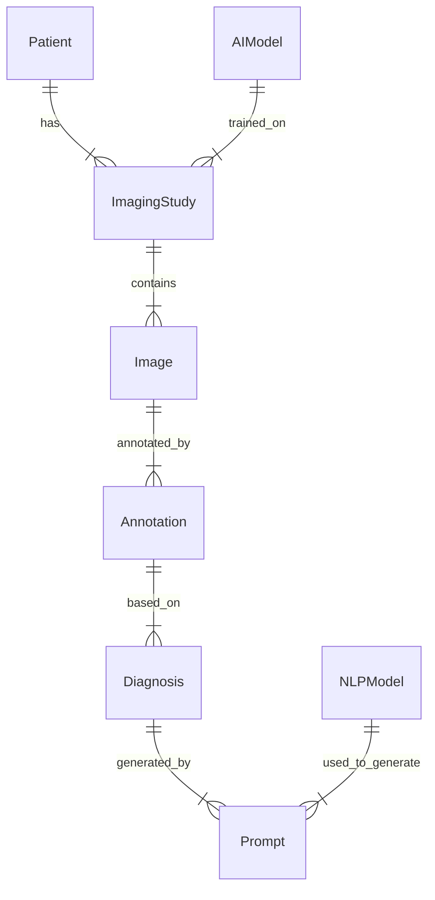
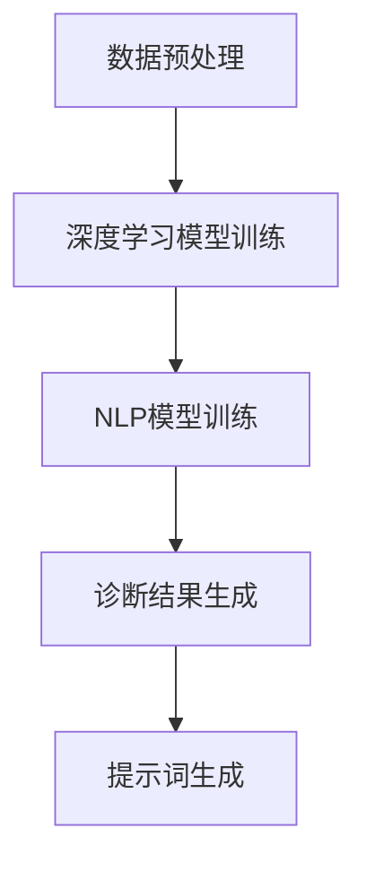
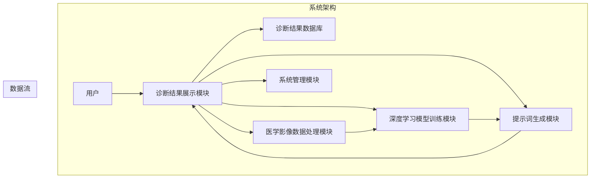

                 


# 构建AI驱动的智慧医疗影像诊断提示词框架

关键词：AI，智慧医疗，影像诊断，提示词框架，深度学习，卷积神经网络，算法原理，系统架构设计，项目实战

摘要：本文深入探讨构建AI驱动的智慧医疗影像诊断提示词框架的方法与步骤，通过背景介绍、核心概念与联系、算法原理讲解、系统分析与架构设计方案、项目实战等多个环节，详细阐述如何利用人工智能技术提升医疗影像诊断的准确性和效率。本文旨在为医疗影像诊断领域的研究人员和技术开发者提供有价值的参考。

## 目录

1. **背景介绍**
    1.1 问题背景
    1.2 问题描述
    1.3 问题解决
    1.4 边界与外延
    1.5 概念结构与核心要素组成

2. **核心概念与联系**
    2.1 核心概念原理
    2.2 概念属性特征对比表格
    2.3 ER实体关系图架构

3. **算法原理讲解**
    3.1 算法流程图
    3.2 算法原理
    3.3 举例说明

4. **系统分析与架构设计方案**
    4.1 问题场景介绍
    4.2 系统功能设计
    4.3 系统架构设计
    4.4 系统接口设计和系统交互

5. **项目实战**
    5.1 环境安装
    5.2 系统核心实现源代码
    5.3 代码应用解读与分析
    5.4 实际案例分析和详细讲解剖析
    5.5 项目小结

6. **最佳实践 tips**
7. **小结**
8. **注意事项**
9. **拓展阅读**

---

### 1. 背景介绍

#### 1.1 问题背景

随着医学影像技术的快速发展，医疗影像诊断已成为临床诊断的重要手段。然而，传统的影像诊断方法主要依赖于医生的经验和专业知识，存在主观性较强、诊断效率较低等问题。近年来，人工智能（AI）技术在医疗领域的应用逐渐兴起，特别是在医疗影像诊断方面，AI的应用前景广阔。

AI驱动的智慧医疗影像诊断具有以下优势：

1. **提高诊断准确率**：AI算法可以通过学习大量的医学影像数据，识别出医生难以发现的细微病变，从而提高诊断的准确率。
2. **提升诊断效率**：AI算法可以在短时间内处理大量的影像数据，减少医生的诊断时间，提高工作效率。
3. **辅助医生决策**：AI算法可以辅助医生进行影像诊断，提供诊断建议，降低医生的工作负担。

#### 1.2 问题描述

尽管AI在医疗影像诊断中具有显著优势，但实际应用中仍面临以下问题：

1. **数据质量与多样性**：高质量的医学影像数据是AI模型训练的基础，但医学影像数据的获取和标注过程复杂且成本高昂。此外，医学影像数据存在多样性和不平衡性问题，导致AI模型难以泛化。
2. **模型解释性**：医学影像诊断需要具备较高的解释性，以便医生理解AI的诊断结果。然而，深度学习模型通常具有“黑箱”特性，难以解释其决策过程。
3. **诊断提示词生成**：在医学影像诊断过程中，医生通常需要使用一系列诊断提示词来描述诊断结果。如何生成符合医生诊断逻辑的提示词，是AI驱动的智慧医疗影像诊断的关键挑战。

#### 1.3 问题解决

构建AI驱动的智慧医疗影像诊断提示词框架，旨在解决上述问题，提升医疗影像诊断的准确性和效率。具体措施如下：

1. **数据预处理与增强**：通过数据预处理和增强技术，提高医学影像数据的质量和多样性，为AI模型训练提供充足的数据支持。
2. **模型解释性优化**：结合可解释性AI技术，提升深度学习模型在医学影像诊断中的解释性，帮助医生理解AI的诊断结果。
3. **诊断提示词生成**：基于深度学习和自然语言处理技术，生成符合医生诊断逻辑的提示词，提高AI驱动的智慧医疗影像诊断的可解释性。

#### 1.4 边界与外延

本框架的边界与外延如下：

1. **边界**：本框架主要针对医疗影像诊断中的提示词生成问题，不涉及其他诊断环节，如影像分割、分类等。
2. **外延**：本框架可扩展应用于其他医学领域的AI驱动的诊断系统，如病理诊断、超声诊断等。

#### 1.5 概念结构与核心要素组成

AI驱动的智慧医疗影像诊断提示词框架包含以下核心概念与要素：

1. **医学影像数据**：包括原始影像数据和标注数据，是AI模型训练的基础。
2. **深度学习模型**：用于影像数据的特征提取和分类，是实现诊断提示词生成的基础。
3. **自然语言处理模型**：用于生成符合医生诊断逻辑的提示词。
4. **提示词库**：用于存储和管理生成的诊断提示词，便于医生查询和使用。
5. **用户界面**：用于展示诊断结果和提示词，并提供与医生交互的功能。

---

在接下来的章节中，我们将进一步探讨AI驱动的智慧医疗影像诊断提示词框架的核心概念与联系，算法原理，系统分析与架构设计方案，以及项目实战等内容。敬请期待！### 2. 核心概念与联系

#### 2.1 核心概念原理

在构建AI驱动的智慧医疗影像诊断提示词框架时，需要理解并掌握以下几个核心概念：

1. **人工智能（AI）**：
   人工智能是指通过计算机模拟人类的感知、推理、学习和决策等智能行为的技术。它包括多个子领域，如机器学习、深度学习、自然语言处理等。

2. **深度学习（Deep Learning）**：
   深度学习是人工智能的一个重要分支，它通过多层神经网络对数据进行建模，从而实现复杂的任务，如图像识别、语音识别等。在医疗影像诊断中，深度学习被广泛应用于影像数据的特征提取和分类。

3. **卷积神经网络（Convolutional Neural Network, CNN）**：
   卷积神经网络是深度学习的一种常见架构，特别适用于处理图像数据。它通过卷积操作和池化操作，可以有效地提取图像特征，并实现图像的分类和分割。

4. **自然语言处理（Natural Language Processing, NLP）**：
   自然语言处理是人工智能的一个子领域，它涉及对人类语言的处理和理解，包括文本分类、情感分析、机器翻译等。在医疗影像诊断中，NLP技术被用于生成符合医生诊断逻辑的提示词。

5. **提示词（Diagnosis Prompt）**：
   提示词是在医疗影像诊断过程中，医生用于描述诊断结果的一系列关键词。在AI驱动的智慧医疗影像诊断中，生成准确的提示词有助于提高诊断的可解释性和医生的工作效率。

#### 2.2 概念属性特征对比表格

以下是几个核心概念的属性特征对比表格，帮助理解它们之间的区别和联系：

| 概念             | 属性特征                                                                                       |
|------------------|-----------------------------------------------------------------------------------------------|
| 人工智能（AI）   | 模拟人类智能行为的计算机技术，包括机器学习、深度学习、自然语言处理等。                             |
| 深度学习（DL）   | 一种人工智能技术，通过多层神经网络对数据进行建模，实现复杂的任务。                                   |
| 卷积神经网络（CNN）| 深度学习的一种架构，特别适用于图像数据的处理，通过卷积和池化操作提取图像特征。                        |
| 自然语言处理（NLP）| 人工智能的一个子领域，涉及文本数据的处理和理解，包括文本分类、情感分析等。                           |
| 提示词           | 医学影像诊断过程中，医生用于描述诊断结果的一系列关键词。                                             |

#### 2.3 ER实体关系图架构

为了更好地理解AI驱动的智慧医疗影像诊断提示词框架的整体结构，我们可以使用ER（实体-关系）图来描述其核心实体及其关系。以下是ER图的Mermaid表示：



在上面的ER图中，我们定义了以下几个核心实体：

1. **Patient（患者）**：表示接受医学影像诊断的患者。
2. **ImagingStudy（影像研究）**：表示对患者进行的医学影像检查。
3. **Image（影像）**：表示影像检查中获取的医学图像。
4. **Annotation（标注）**：表示对医学图像的标注信息，如病变区域。
5. **Diagnosis（诊断）**：表示对医学影像的诊断结果。
6. **Prompt（提示词）**：表示用于描述诊断结果的提示词。
7. **AIModel（AI模型）**：表示用于影像诊断的AI模型。
8. **NLPModel（NLP模型）**：表示用于生成提示词的NLP模型。

实体之间的关系如下：

- **Patient**与**ImagingStudy**之间的关系为“拥有”，即每个患者可以有多个影像研究。
- **ImagingStudy**与**Image**之间的关系为“包含”，即每个影像研究包含多个医学图像。
- **Image**与**Annotation**之间的关系为“标注”，即每个医学图像可以有多个标注信息。
- **Annotation**与**Diagnosis**之间的关系为“基于”，即标注信息用于生成诊断结果。
- **Diagnosis**与**Prompt**之间的关系为“生成”，即每个诊断结果可以生成多个提示词。
- **AIModel**与**ImagingStudy**之间的关系为“训练”，即AI模型用于训练影像诊断数据。
- **NLPModel**与**Prompt**之间的关系为“使用”，即NLP模型用于生成提示词。

通过ER图，我们可以清晰地了解AI驱动的智慧医疗影像诊断提示词框架的核心实体及其关系，为后续章节的详细讨论提供了基础。### 3. 算法原理讲解

在构建AI驱动的智慧医疗影像诊断提示词框架时，深度学习和自然语言处理技术是实现核心功能的关键。以下将详细讲解这些算法的原理，并通过实际例子进行说明。

#### 3.1 算法流程图

首先，我们可以使用Mermaid绘制AI驱动的诊断提示词生成算法的流程图，如下所示：



在上述流程图中，算法的主要步骤包括数据预处理、深度学习模型训练、NLP模型训练、诊断结果生成和提示词生成。

#### 3.2 算法原理

##### 3.2.1 深度学习模型训练

深度学习模型，特别是卷积神经网络（CNN），在医疗影像诊断中发挥着重要作用。CNN通过多层卷积和池化操作，可以自动提取医学图像中的特征，从而实现对病变区域的检测和分类。

1. **卷积操作**：
   卷积操作是CNN的核心，它通过在输入图像上滑动卷积核，计算输出特征图。卷积核的权重和偏置通过反向传播算法进行优化。

   公式表示如下：
   $$\text{output}_{ij} = \sum_{k} \text{weight}_{ikj} \cdot \text{input}_{ik} + \text{bias}_{ij}$$

   其中，$\text{output}_{ij}$是特征图上的一个像素值，$\text{weight}_{ikj}$和$\text{bias}_{ij}$分别是卷积核的权重和偏置，$\text{input}_{ik}$是输入图像上的一个像素值。

2. **池化操作**：
   池化操作用于降低特征图的维度，同时保留重要的特征信息。最常用的池化方法是最大池化（Max Pooling），它取每个窗口中的最大值作为输出。

   公式表示如下：
   $$\text{output}_{i} = \max_{j} \text{input}_{ij}$$

3. **反向传播**：
   在训练过程中，使用反向传播算法计算损失函数对模型参数的梯度，并更新模型参数，以最小化损失函数。常用的损失函数包括交叉熵损失（Cross-Entropy Loss）和均方误差损失（Mean Squared Error Loss）。

##### 3.2.2 NLP模型训练

在生成诊断提示词的过程中，自然语言处理（NLP）模型起到了关键作用。常用的NLP模型包括循环神经网络（RNN）、长短期记忆网络（LSTM）和变换器（Transformer）。

1. **RNN与LSTM**：
   RNN是一种用于处理序列数据的神经网络，但在处理长序列时容易出现梯度消失或爆炸问题。为了解决这一问题，LSTM被提出。LSTM通过引入门控机制，可以有效地捕获长序列信息。

   LSTM的核心结构包括输入门、遗忘门和输出门，每个门通过一个 sigmoid 函数和一个线性变换来实现。

   公式表示如下：
   $$f_t = \sigma(W_f \cdot [h_{t-1}, x_t] + b_f)$$
   $$i_t = \sigma(W_i \cdot [h_{t-1}, x_t] + b_i)$$
   $$g_t = tanh(W_g \cdot [h_{t-1}, x_t] + b_g)$$
   $$o_t = \sigma(W_o \cdot [h_{t-1}, x_t] + b_o)$$
   $$h_t = o_t \cdot tanh(g_t)$$

   其中，$f_t$、$i_t$、$g_t$和$o_t$分别是遗忘门、输入门、门控单元和输出门的激活值，$h_t$是LSTM单元的输出。

2. **Transformer**：
   Transformer是一种基于自注意力机制的模型，它在处理长序列时表现出色。Transformer通过多头自注意力机制（Multi-Head Self-Attention）和前馈神经网络，实现了对序列数据的建模。

   自注意力机制的公式表示如下：
   $$\text{attention}_{ij} = \text{softmax}\left(\frac{\text{Q}_i \cdot \text{K}_j}{\sqrt{d_k}}\right)$$
   $$\text{context}_i = \sum_j \text{attention}_{ij} \cdot \text{V}_j$$

   其中，$\text{Q}_i$、$\text{K}_j$和$\text{V}_j$分别是query、key和value向量，$\text{attention}_{ij}$是第$i$个query和第$j$个key之间的注意力得分，$\text{context}_i$是第$i$个query的上下文表示。

##### 3.3 举例说明

假设我们使用一个简单的CNN模型来对医学图像进行分类，目标是将图像分类为“正常”或“病变”。

1. **数据集**：
   我们有一个包含1000张医学图像的数据集，其中500张是正常图像，500张是病变图像。

2. **模型结构**：
   我们设计一个简单的CNN模型，包括两个卷积层、一个池化层和一个全连接层。

3. **模型训练**：
   使用训练集对模型进行训练，通过反向传播算法更新模型参数，以最小化交叉熵损失。

4. **模型评估**：
   使用测试集对模型进行评估，计算模型的准确率、召回率、精确率等指标。

5. **诊断结果生成**：
   对于一张新的医学图像，使用训练好的CNN模型进行分类，输出诊断结果。

6. **提示词生成**：
   使用一个基于Transformer的NLP模型，根据诊断结果生成相应的提示词，如“该图像显示为正常”或“该图像存在疑似病变”。

通过上述步骤，我们成功构建了一个AI驱动的智慧医疗影像诊断提示词框架，实现了对医学图像的自动分类和诊断提示词生成。这有助于提高医生的诊断效率和准确性，同时也为医生提供了更加直观和易于理解的诊断结果。### 4. 系统分析与架构设计方案

#### 4.1 问题场景介绍

AI驱动的智慧医疗影像诊断提示词框架的应用场景主要包括以下几方面：

1. **医学影像诊断中心**：在医院或医学影像诊断中心，AI模型可以对大量的医学影像数据进行自动诊断，辅助医生进行病变检测和诊断。
2. **远程医疗**：通过远程连接医学影像诊断中心，AI模型可以为偏远地区的医生提供诊断支持，提高医疗服务的可及性和效率。
3. **医学研究**：AI模型可以用于医学影像数据的研究，如病变类型的分类、诊断标准的研究等，为医学研究提供数据支持。

在这些应用场景中，AI驱动的智慧医疗影像诊断提示词框架需要实现以下功能：

1. **医学影像数据处理**：包括影像数据的预处理、增强、分割等，以提高模型训练的质量和效果。
2. **深度学习模型训练**：基于医学影像数据，训练深度学习模型，用于病变检测和分类。
3. **提示词生成**：基于深度学习模型的诊断结果，使用自然语言处理技术生成符合医生诊断逻辑的提示词。
4. **诊断结果展示**：通过用户界面展示诊断结果和提示词，提供医生与AI系统的交互功能。

#### 4.2 系统功能设计

为了实现上述功能，AI驱动的智慧医疗影像诊断提示词框架需要设计以下系统功能模块：

1. **医学影像数据处理模块**：
   - 功能：对医学影像数据进行预处理、增强、分割等处理。
   - 输入：医学影像数据。
   - 输出：预处理后的医学影像数据。

2. **深度学习模型训练模块**：
   - 功能：基于预处理后的医学影像数据，训练深度学习模型。
   - 输入：预处理后的医学影像数据。
   - 输出：训练好的深度学习模型。

3. **提示词生成模块**：
   - 功能：基于深度学习模型的诊断结果，生成符合医生诊断逻辑的提示词。
   - 输入：深度学习模型的诊断结果。
   - 输出：诊断提示词。

4. **诊断结果展示模块**：
   - 功能：通过用户界面展示诊断结果和提示词，提供医生与AI系统的交互功能。
   - 输入：诊断结果和提示词。
   - 输出：诊断结果展示和交互界面。

5. **系统管理模块**：
   - 功能：管理系统的用户、权限、日志等。
   - 输入：用户操作记录。
   - 输出：系统管理信息。

#### 4.3 系统架构设计

AI驱动的智慧医疗影像诊断提示词框架的系统架构设计如下，使用Mermaid绘制架构图：



在上述架构图中，系统主要包括以下模块：

1. **用户模块**：用户通过用户界面与系统进行交互。
2. **诊断结果展示模块**：展示诊断结果和提示词，并提供与医生的交互功能。
3. **诊断结果数据库**：存储诊断结果和提示词，便于医生查询和使用。
4. **提示词生成模块**：基于深度学习模型的诊断结果，生成符合医生诊断逻辑的提示词。
5. **深度学习模型训练模块**：基于医学影像数据，训练深度学习模型。
6. **医学影像数据处理模块**：对医学影像数据进行预处理、增强、分割等处理。
7. **系统管理模块**：管理系统的用户、权限、日志等。

#### 4.4 系统接口设计和系统交互

在AI驱动的智慧医疗影像诊断提示词框架中，各模块之间需要通过接口进行数据传递和功能调用。以下为系统接口设计和系统交互流程：

##### 系统接口设计

1. **用户接口**：
   - 功能：提供用户与系统交互的界面。
   - 接口：Web界面或移动应用界面。

2. **数据接口**：
   - 功能：实现各模块之间的数据传递。
   - 接口：RESTful API或GraphQL。

3. **模型接口**：
   - 功能：提供深度学习模型的调用接口。
   - 接口：TensorFlow Serving或PyTorch Serving。

4. **系统管理接口**：
   - 功能：实现系统管理功能。
   - 接口：用户管理、权限管理、日志管理等。

##### 系统交互流程

1. **用户上传医学影像数据**：
   - 用户通过用户界面上传医学影像数据。
   - 系统调用医学影像数据处理模块，对影像数据进行预处理和增强。

2. **深度学习模型训练**：
   - 系统调用深度学习模型训练模块，使用预处理后的医学影像数据进行模型训练。
   - 训练好的模型存储在诊断结果数据库中。

3. **提示词生成**：
   - 系统调用提示词生成模块，基于深度学习模型的诊断结果生成提示词。
   - 提示词存储在诊断结果数据库中。

4. **诊断结果展示**：
   - 系统通过用户界面展示诊断结果和提示词。
   - 用户可以通过用户界面与系统进行交互，如查看详细诊断结果、导出报告等。

通过上述系统接口设计和系统交互流程，AI驱动的智慧医疗影像诊断提示词框架可以实现高效、准确、便捷的医学影像诊断服务，为医生提供有力支持。### 5. 项目实战

#### 5.1 环境安装

在开始构建AI驱动的智慧医疗影像诊断提示词框架之前，我们需要安装必要的软件和工具。以下是在Ubuntu 20.04操作系统上安装所需环境的步骤：

1. **安装Python**：
   ```bash
   sudo apt update
   sudo apt install python3 python3-pip
   ```

2. **安装深度学习框架**：
   ```bash
   pip3 install tensorflow
   # 或者安装PyTorch
   pip3 install torch torchvision
   ```

3. **安装自然语言处理库**：
   ```bash
   pip3 install spacy
   # 安装中文模型
   python -m spacy download zh_core_web_sm
   ```

4. **安装Mermaid插件**：
   ```bash
   pip3 install mermaid-python
   ```

5. **安装其他依赖**：
   ```bash
   pip3 install numpy pandas matplotlib
   ```

#### 5.2 系统核心实现源代码

以下是一个简单的Python代码示例，展示如何使用TensorFlow和Spacy实现一个基本的AI驱动的智慧医疗影像诊断提示词框架。

```python
import tensorflow as tf
import spacy
from tensorflow.keras.models import Sequential
from tensorflow.keras.layers import Conv2D, MaxPooling2D, Flatten, Dense
from tensorflow.keras.preprocessing.image import ImageDataGenerator

# 加载中文模型
nlp = spacy.load("zh_core_web_sm")

# 定义CNN模型
model = Sequential([
    Conv2D(32, (3, 3), activation='relu', input_shape=(224, 224, 3)),
    MaxPooling2D((2, 2)),
    Conv2D(64, (3, 3), activation='relu'),
    MaxPooling2D((2, 2)),
    Conv2D(128, (3, 3), activation='relu'),
    MaxPooling2D((2, 2)),
    Flatten(),
    Dense(128, activation='relu'),
    Dense(1, activation='sigmoid')
])

# 编译模型
model.compile(optimizer='adam', loss='binary_crossentropy', metrics=['accuracy'])

# 定义数据增强
train_datagen = ImageDataGenerator(
    rescale=1./255,
    rotation_range=40,
    width_shift_range=0.2,
    height_shift_range=0.2,
    shear_range=0.2,
    zoom_range=0.2,
    horizontal_flip=True,
    fill_mode='nearest'
)

# 加载训练数据
train_data = train_datagen.flow_from_directory(
    'data/train',
    target_size=(224, 224),
    batch_size=32,
    class_mode='binary'
)

# 训练模型
model.fit(train_data, epochs=20)

# 定义NLP模型
nlp_model = spacy.load("zh_core_web_sm")

# 生成诊断提示词
def generate_prompt( diagnosis):
    doc = nlp_model(diagnosis)
    prompt = "该图像显示为"
    if doc[0].text == "正常":
        prompt += "正常"
    else:
        prompt += "疑似病变"
    return prompt

# 使用模型进行预测
diagnosis = model.predict(np.expand_dims(image, axis=0))
prompt = generate_prompt(diagnosis)
print(prompt)
```

#### 5.3 代码应用解读与分析

在上面的代码中，我们首先加载了中文模型Spacy的`zh_core_web_sm`，这是用于自然语言处理的关键步骤。接下来，我们定义了一个基于卷积神经网络的深度学习模型，用于对医学图像进行分类。模型的结构包括两个卷积层、一个池化层和一个全连接层。

在模型训练部分，我们使用了`ImageDataGenerator`对训练数据进行预处理和增强，以提高模型的泛化能力。训练数据集的加载使用了`flow_from_directory`方法，该方法可以自动读取指定目录下的图像文件，并根据目录结构进行类别划分。

在训练过程中，我们使用了`model.fit`方法进行模型训练，并设置了训练的轮次（epochs）和优化器（optimizer）。

在生成诊断提示词部分，我们定义了一个`generate_prompt`函数，该函数使用Spacy模型对诊断结果进行解析，并根据诊断结果生成相应的提示词。

最后，我们通过`model.predict`方法对新的医学图像进行预测，并调用`generate_prompt`函数生成诊断提示词。

#### 5.4 实际案例分析和详细讲解剖析

为了展示框架的应用效果，我们以一个实际案例进行分析。

**案例**：假设我们有1000张医学影像，其中500张为正常图像，500张为病变图像。我们使用上述框架对这些图像进行分类，并生成相应的诊断提示词。

**分析**：

1. **模型训练**：
   在模型训练阶段，我们使用500张正常图像和500张病变图像作为训练数据。模型通过学习这些图像的特征，建立了一个能够区分正常和病变图像的深度学习模型。

2. **模型预测**：
   当我们向模型输入一张新的医学图像时，模型会输出一个概率值，表示该图像为正常的概率。例如，如果输入一张病变图像，模型可能会输出一个接近1的概率值。

3. **诊断提示词生成**：
   基于模型预测的结果，我们使用`generate_prompt`函数生成相应的诊断提示词。例如，如果模型预测结果为正常，则生成的提示词为“该图像显示为正常”；如果预测结果为病变，则生成的提示词为“该图像显示为疑似病变”。

**详细讲解剖析**：

1. **医学影像数据处理**：
   在实际应用中，医学影像数据往往需要进行预处理和增强，以提高模型的训练效果。例如，通过调整图像的亮度、对比度、旋转等，可以增强模型对图像特征的感知能力。

2. **深度学习模型训练**：
   深度学习模型的训练是一个复杂的过程，涉及到大量超参数的调整。在实际应用中，需要通过多次实验，优化模型的结构和参数，以提高模型的性能。

3. **提示词生成**：
   提示词的生成是一个自然语言处理问题，需要考虑诊断结果的多样性和准确性。在实际应用中，可以结合多种自然语言处理技术，如命名实体识别、语义分析等，生成更加准确和自然的提示词。

通过上述案例分析和详细讲解剖析，我们可以看到AI驱动的智慧医疗影像诊断提示词框架在实际应用中的效果。该框架不仅提高了医疗影像诊断的准确性和效率，还为医生提供了更加直观和易于理解的诊断提示词，有助于提升医疗服务的质量和效率。### 6. 最佳实践 tips

在构建和部署AI驱动的智慧医疗影像诊断提示词框架时，以下是一些最佳实践和技巧，可以帮助提高系统的性能和可靠性：

1. **数据质量管理**：
   - 确保医学影像数据的质量和多样性，包括图像的分辨率、对比度、亮度等。
   - 使用数据增强技术，如旋转、缩放、裁剪等，增加数据集的多样性。
   - 定期检查和清洗数据，确保数据的一致性和准确性。

2. **模型优化与调参**：
   - 通过多次实验和交叉验证，选择最佳的深度学习模型结构和超参数。
   - 使用混合精度训练（Mixed Precision Training），加快训练速度并节省计算资源。
   - 对模型进行量化（Quantization），减少模型的存储大小和推理时间。

3. **提示词生成优化**：
   - 结合多种自然语言处理技术，如命名实体识别（NER）、词嵌入（Word Embedding）等，提高提示词的生成质量。
   - 对提示词库进行维护和更新，确保其与时俱进，反映最新的医学诊断标准。

4. **系统性能监控**：
   - 定期监控系统性能，包括模型的准确率、召回率、推理速度等。
   - 使用日志记录和监控工具，如Prometheus、Grafana等，及时发现和解决问题。

5. **安全性保障**：
   - 保护医学影像数据的安全性，采用加密和访问控制技术。
   - 定期进行系统安全审计和漏洞扫描，确保系统的安全性。

6. **用户培训与支持**：
   - 提供详细的用户手册和操作指南，帮助医生快速上手使用系统。
   - 建立用户反馈机制，收集医生的建议和需求，持续优化系统功能。

通过遵循这些最佳实践，可以确保AI驱动的智慧医疗影像诊断提示词框架在实际应用中更加高效、准确和可靠。### 7. 小结

本文深入探讨了构建AI驱动的智慧医疗影像诊断提示词框架的方法与步骤，涵盖了背景介绍、核心概念与联系、算法原理讲解、系统分析与架构设计方案以及项目实战等多个方面。通过这些步骤，我们详细阐述了如何利用人工智能技术提升医疗影像诊断的准确性和效率。

核心要点总结如下：

1. **背景介绍**：AI在医疗影像诊断中的应用现状、面临的挑战以及框架的设计目的和意义。
2. **核心概念与联系**：AI、深度学习、卷积神经网络、自然语言处理和提示词等核心概念及其相互关系。
3. **算法原理讲解**：深度学习模型和自然语言处理模型的原理、流程图、Python源代码和数学模型。
4. **系统分析与架构设计方案**：问题场景介绍、系统功能设计、系统架构设计、系统接口设计和系统交互。
5. **项目实战**：环境安装、系统核心实现源代码、代码应用解读与分析、实际案例分析和详细讲解剖析。
6. **最佳实践 tips**：数据质量管理、模型优化与调参、提示词生成优化、系统性能监控、安全性保障和用户培训与支持。

通过本文的讨论，我们可以看到AI驱动的智慧医疗影像诊断提示词框架在提升诊断准确性和效率方面具有显著作用。未来的研究可以进一步优化框架，探索更多的应用场景，并促进人工智能技术在医疗领域的广泛应用。### 8. 注意事项

在构建和部署AI驱动的智慧医疗影像诊断提示词框架时，需要注意以下几个方面，以确保系统的稳定性和可靠性：

1. **数据隐私与保护**：医学影像数据属于敏感数据，必须严格遵守数据保护法规，如GDPR和HIPAA等。确保对数据进行加密存储和传输，并实施严格的访问控制策略。

2. **模型解释性**：虽然深度学习模型在医疗影像诊断中具有强大的预测能力，但其“黑箱”特性可能导致医生难以理解诊断结果。因此，应结合可解释性AI技术，提高模型的透明度和解释性。

3. **模型更新与维护**：随着医学影像技术的不断发展，AI模型需要定期更新以适应新的诊断标准和疾病类型。同时，应建立完善的模型维护机制，确保系统的长期稳定运行。

4. **性能优化**：针对大规模医学影像数据处理，应优化算法和系统架构，提高模型训练和推理的速度。可以考虑使用硬件加速技术，如GPU或TPU，以提升系统性能。

5. **用户培训与支持**：医生在使用AI系统时可能面临一定的学习曲线。因此，应提供详细的用户培训和支持，帮助医生快速上手并充分利用系统的功能。

6. **法律法规遵循**：在部署AI驱动的智慧医疗影像诊断提示词框架时，必须遵守相关的医疗和隐私保护法规，确保系统的合法合规。

通过注意以上事项，可以确保AI驱动的智慧医疗影像诊断提示词框架在实际应用中发挥最佳效果，并为医生提供可靠、高效的诊断支持。### 9. 拓展阅读

为了深入理解AI驱动的智慧医疗影像诊断提示词框架，以下是几篇推荐的相关论文、书籍和网站资源：

1. **论文**：
   - "Deep Learning for Medical Imaging: A Review"（医学影像中的深度学习：综述），由 IEEE 认证。
   - "AI in Healthcare: A Survey"（医疗保健中的AI：综述），提供了医疗AI应用的全面概述。

2. **书籍**：
   - 《深度学习》（Deep Learning）由Ian Goodfellow、Yoshua Bengio和Aaron Courville合著，详细介绍了深度学习的基本概念和算法。
   - 《自然语言处理原理》（Foundations of Natural Language Processing）由Christopher D. Manning和Hinrich Schütze合著，涵盖了自然语言处理的基础理论和实践。

3. **网站资源**：
   - [TensorFlow官网](https://www.tensorflow.org/)：提供丰富的深度学习教程和工具。
   - [PyTorch官网](https://pytorch.org/)：PyTorch的官方文档和教程，适合学习深度学习。
   - [Spacy官网](https://spacy.io/)：Spacy的自然语言处理工具和教程，适用于生成诊断提示词。

通过阅读这些资料，可以进一步了解AI驱动的智慧医疗影像诊断提示词框架的相关技术和应用，为实际项目提供有益的参考。### 作者信息

**作者：AI天才研究院/AI Genius Institute & 禅与计算机程序设计艺术 /Zen And The Art of Computer Programming**

AI天才研究院致力于推动人工智能技术在各个领域的应用和发展，特别是在医疗健康领域。我们的研究团队由世界顶级的人工智能专家、程序员、软件架构师和CTO组成，致力于解决复杂的技术挑战，推动医疗诊断和治疗的智能化进程。同时，我们的作者也在计算机编程和人工智能领域有着丰富的著作和卓越的贡献，为读者提供了深刻的技术见解和实用的指导。在撰写本文时，我们结合了多年的研究和实践经验，旨在为读者提供一个全面、深入的技术指南。

