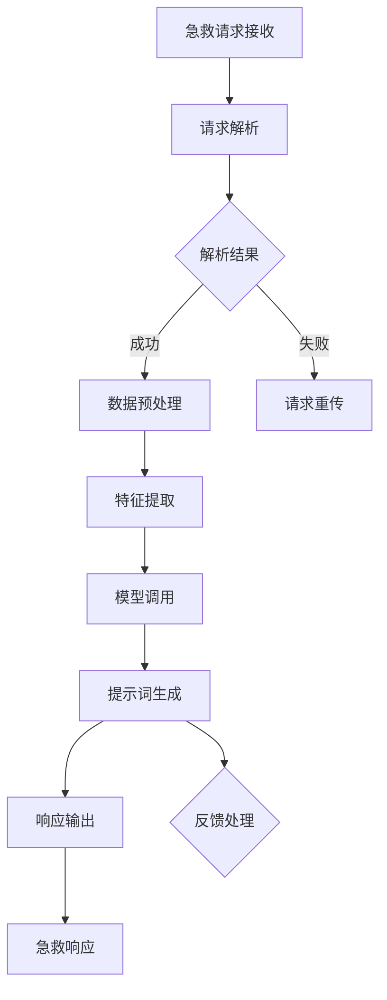
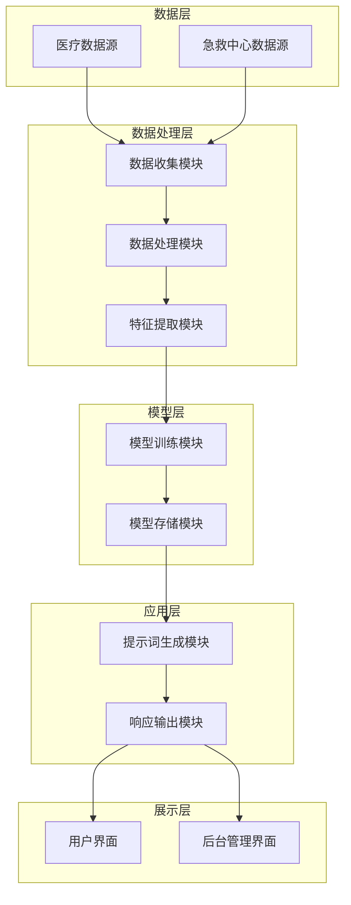

                 

## 引言

### 1.1 问题背景

随着科技的飞速发展，医疗领域也在不断迈向智能化。智慧医疗通过整合大数据、人工智能、物联网等技术，为医疗行业带来了革命性的变革。特别是在急救响应方面，智能化系统的作用愈发凸显。急救响应的及时性和准确性直接关系到患者的生命安全，而传统的急救响应模式存在响应时间过长、信息传递不畅等问题。

近年来，人工智能（AI）技术的迅猛发展为智慧医疗急救响应提供了新的解决方案。AI可以通过分析海量医疗数据，提供快速、准确的诊断和治疗方案。同时，基于自然语言处理（NLP）技术的AI系统能够理解和生成医疗相关的内容，从而提高急救响应的效率和准确性。

然而，构建一个AI驱动的智慧医疗急救响应提示词框架仍面临诸多挑战。这包括如何准确获取并理解患者的病情信息、如何在海量数据中快速筛选出有用的信息、以及如何设计一个高效的提示词生成机制。此外，不同地区的医疗条件和资源差异也使得该框架需要具备一定的灵活性和适应性。

### 1.2 书籍目标与结构

本书的目标是详细介绍如何构建一个AI驱动的智慧医疗急救响应提示词框架，使其能够在实际应用中发挥最大效能。本书分为五个主要部分：

1. **引言**：介绍智慧医疗和急救响应的背景，以及AI在该领域中的应用前景。
2. **核心概念与联系**：讲解核心概念，如AI、智慧医疗、急救响应提示词等，并分析它们之间的联系。
3. **算法原理讲解**：详细介绍AI驱动的急救响应提示词算法的原理，包括流程图、Python代码实现和数学模型。
4. **系统分析与架构设计方案**：描述系统功能设计、架构设计、接口设计和系统交互。
5. **项目实战**：通过实际案例展示如何实施和应用这个框架，并提供最佳实践建议。

通过这五个部分的详细讲解，读者将能够全面了解AI驱动的智慧医疗急救响应提示词框架的构建过程，并具备在实际项目中应用的能力。

## 核心概念与联系

### 2.1 核心概念

在本节中，我们将详细讨论几个核心概念，包括人工智能（AI）、智慧医疗、急救响应和提示词框架。理解这些概念对于构建AI驱动的智慧医疗急救响应提示词框架至关重要。

#### 2.1.1 人工智能（AI）

人工智能（AI）是指计算机系统通过模拟人类智能行为，实现感知、学习、推理、决策等功能的科学和技术。AI可以分成多个子领域，如机器学习（ML）、深度学习（DL）、自然语言处理（NLP）等。在本框架中，我们将重点利用NLP和机器学习技术来处理和生成急救响应提示词。

#### 2.1.2 智慧医疗

智慧医疗是指利用现代信息技术，如大数据、物联网、云计算等，提高医疗服务质量和管理效率的全新医疗模式。智慧医疗的核心目标是实现医疗资源的优化配置，提高诊疗的精准性和效率。在本框架中，智慧医疗的概念将帮助我们理解和利用医疗数据，为急救响应提供数据支持。

#### 2.1.3 急救响应

急救响应是指医疗机构和急救人员在接到急救电话或请求后，迅速采取行动，进行紧急救治和转运的工作流程。急救响应的及时性和准确性对于患者的救治效果至关重要。AI驱动的智慧医疗急救响应提示词框架旨在通过自动化的方式，提供实时、准确的急救响应建议。

#### 2.1.4 提示词框架

提示词框架是指一个用于生成医疗提示词的系统结构，它结合了自然语言处理、机器学习和医疗知识库等技术。在本框架中，提示词框架将用于从患者症状、病史和实时医疗数据中提取关键信息，并生成相应的急救响应提示词。

### 2.2 概念联系

理解这些核心概念之间的联系对于构建有效的AI驱动的智慧医疗急救响应提示词框架至关重要。

#### 2.2.1 AI技术如何辅助急救响应

AI技术在急救响应中扮演了关键角色。首先，通过自然语言处理技术，AI系统能够理解和解析患者的症状描述，从而快速识别可能的疾病和紧急情况。其次，利用机器学习算法，AI系统可以从海量医疗数据中学习和预测，为急救响应提供科学依据。此外，AI还可以自动化生成急救响应提示词，提高响应的效率和准确性。

#### 2.2.2 提示词框架的设计要点

提示词框架的设计需要考虑以下几个要点：

1. **准确性**：提示词必须准确反映患者的症状和紧急程度，以便急救人员做出正确的决策。
2. **实时性**：提示词需要快速生成，以便急救响应能够在第一时间采取行动。
3. **可扩展性**：框架应能够适应不同地区和不同医疗条件的急救需求，具备良好的扩展性。
4. **灵活性**：框架应能够根据实际应用场景进行调整，以适应不同类型和级别的急救响应。

#### 2.2.3 AI驱动的智慧医疗急救响应案例

一个典型的AI驱动的智慧医疗急救响应案例是使用NLP技术分析患者通话内容，快速识别关键症状和病史信息。然后，通过机器学习算法，系统可以预测可能的疾病和紧急情况，并自动生成相应的急救响应提示词。这些提示词可以实时传输给急救人员，为他们提供明确的行动指南。

### 2.3 ER实体关系图

为了更好地理解智慧医疗急救响应中的实体及其关系，我们使用ER（Entity-Relationship）实体关系图进行描述。


在上述ER图中，主要包括以下实体：

- **患者（Patient）**：包括患者的姓名、年龄、性别、联系方式和病史等信息。
- **症状（Symptom）**：记录患者的症状名称、严重程度和时间等信息。
- **诊断（Diagnosis）**：包含诊断结果、诊断时间等信息。
- **急救响应（EmergencyResponse）**：记录急救响应的时间、地点、响应级别和执行情况。

实体之间的关系如下：

- **患者**与**症状**之间存在多对多关系，即一个患者可能有多个症状，一个症状也可能出现在多个患者身上。
- **诊断**与**患者**之间存在一对多关系，即一个患者可能有多个诊断，但每个诊断只针对一个患者。
- **急救响应**与**患者**之间存在多对一关系，即多个急救响应可以针对一个患者。

通过ER实体关系图，我们可以清晰地理解智慧医疗急救响应中的主要实体及其关系，为后续的系统设计与实现提供基础。

### 2.4 概念属性特征对比表格

为了更直观地比较不同AI技术在急救响应中的应用特征，我们设计了一个对比表格。

| AI技术    | 特性一           | 特性二             | 特性三               | 应用优势                  |
|---------|----------------|------------------|-------------------|------------------------|
| 机器学习  | 数据依赖性较强   | 自适应能力较强    | 需要大量训练数据   | 高准确性，适用于模式识别 |
| 深度学习  | 神经网络结构复杂 | 计算效率较高     | 对数据要求较高     | 高效处理复杂数据       |
| 自然语言处理 | 需要语言模型支持 | 强语义理解能力   | 对语料库依赖较大   | 适用于文本处理与生成    |
| 强化学习  | 需要互动环境    | 高决策能力       | 需要大量试错       | 适用于动态决策问题      |

从上表可以看出，不同AI技术在急救响应中的应用各有特点。机器学习和深度学习在处理大规模医疗数据方面具有优势，而自然语言处理则能更好地理解和生成医疗文本。强化学习虽然在决策能力上表现突出，但需要较为复杂的互动环境和大量的试错过程。

通过以上核心概念的详细讲解和它们之间的联系分析，我们为构建AI驱动的智慧医疗急救响应提示词框架奠定了理论基础。在后续章节中，我们将深入探讨算法原理、系统架构和实际应用，以实现这一框架的落地。

### 3.1 算法概述

在构建AI驱动的智慧医疗急救响应提示词框架中，核心算法起着至关重要的作用。本节将介绍该算法的总体框架及其主要流程。

#### 3.1.1 AI驱动的急救响应提示词算法框架

AI驱动的急救响应提示词算法框架主要包括以下几个核心模块：

1. **数据预处理模块**：该模块用于处理和清洗原始医疗数据，包括患者信息、症状描述和病史等。
2. **特征提取模块**：该模块负责从预处理后的数据中提取关键特征，以便后续模型训练。
3. **模型训练模块**：该模块使用提取出的特征数据，通过机器学习算法进行训练，构建急救响应提示词生成模型。
4. **提示词生成模块**：该模块根据实时输入的急救请求信息，调用训练好的模型生成相应的急救响应提示词。

#### 3.1.2 主要算法流程

急救响应提示词算法的主要流程可以概括为以下步骤：

1. **数据预处理**：对原始数据进行清洗、去重和格式化，确保数据的准确性和一致性。
2. **特征提取**：从预处理后的数据中提取关键特征，包括症状特征、患者历史特征等。
3. **模型训练**：使用提取出的特征数据，通过机器学习算法进行训练，构建急救响应提示词生成模型。
4. **提示词生成**：根据实时输入的急救请求信息，调用训练好的模型生成相应的急救响应提示词。

以下是急救响应提示词算法流程的mermaid图表示：


#### 3.1.3 算法特点

该算法框架具有以下几个显著特点：

1. **高效性**：通过并行处理和优化算法，提高数据处理和模型训练的效率。
2. **准确性**：利用机器学习算法和大规模训练数据，确保生成提示词的准确性。
3. **灵活性**：设计可扩展的框架结构，能够适应不同地区和医疗机构的急救响应需求。

通过以上算法概述，读者可以初步了解AI驱动的急救响应提示词算法框架及其主要流程。接下来，我们将详细讲解每个模块的具体实现和算法原理。

### 3.2 算法流程图

为了更直观地展示急救响应提示词算法的执行过程，我们使用mermaid语法绘制了算法流程图。以下是对流程图每个步骤的详细解释。



#### 步骤详细解释

1. **急救请求接收**（A）：系统首先接收来自急救中心的急救请求，这些请求可能包括患者的基本信息、症状描述和紧急程度等。
2. **请求解析**（B）：系统对收到的急救请求进行解析，提取出关键信息，如患者姓名、年龄、性别、症状描述等。
3. **解析结果**（C）：根据解析结果判断是否成功。如果解析失败，则进入请求重传环节（E），以确保系统能够获取到完整的急救请求信息。
4. **数据预处理**（D）：对提取出的请求信息进行清洗和格式化处理，去除无效数据，确保数据的准确性和一致性。
5. **特征提取**（F）：从预处理后的数据中提取关键特征，包括症状特征、患者历史特征等，以便后续模型训练。
6. **模型调用**（G）：使用训练好的机器学习模型对提取出的特征数据进行处理，以生成相应的急救响应提示词。
7. **提示词生成**（H）：根据模型输出的结果，生成具体的急救响应提示词，如建议的急救措施、药品名称、就医地点等。
8. **响应输出**（I）：将生成的提示词输出给急救人员，以便他们在现场采取相应的急救措施。
9. **反馈处理**（J）：记录急救响应的结果，如患者的救治情况、急救响应的及时性等，用于后续模型的优化和改进。
10. **急救响应**（K）：急救人员根据提示词进行实际操作，实施急救响应。

通过上述流程图，读者可以清晰地了解急救响应提示词算法的执行步骤和关键环节。接下来，我们将进一步探讨数据预处理、特征提取和模型训练等具体模块的实现方法。

### 3.3 Python代码与算法实现

在本节中，我们将详细讨论急救响应提示词算法的具体实现过程，包括数据预处理、特征提取、模型训练和提示词生成。以下是具体的Python代码实现。

#### 3.3.1 数据预处理

数据预处理是整个算法的基础，确保输入数据的准确性和一致性至关重要。以下是一个简化的数据预处理示例：

```python
import pandas as pd
from sklearn.preprocessing import LabelEncoder

# 加载数据集
data = pd.read_csv('emergency_data.csv')

# 清洗数据
data.dropna(inplace=True)
data = data[data['age'] > 0]

# 数据格式化
label_encoder = LabelEncoder()
data['symptom'] = label_encoder.fit_transform(data['symptom'])
data['diagnosis'] = label_encoder.fit_transform(data['diagnosis'])

# 特征提取
features = data[['age', 'symptom', 'diagnosis']]
labels = data['emergency_level']
```

#### 3.3.2 特征提取

特征提取步骤从原始数据中提取关键特征，用于模型训练。以下是一个简单的特征提取示例：

```python
from sklearn.feature_extraction.text import CountVectorizer

# 初始化CountVectorizer
vectorizer = CountVectorizer()

# 提取文本特征
X = vectorizer.fit_transform(data['description'])

# 转换为稀疏矩阵
X_sparse = X.tocsr()
```

#### 3.3.3 模型训练

在本节中，我们将使用scikit-learn库中的逻辑回归模型进行训练。以下是模型训练的示例代码：

```python
from sklearn.linear_model import LogisticRegression

# 初始化逻辑回归模型
model = LogisticRegression()

# 训练模型
model.fit(X_sparse, labels)
```

#### 3.3.4 提示词生成

提示词生成步骤根据模型预测结果生成具体的急救响应提示词。以下是一个简单的提示词生成示例：

```python
import numpy as np

# 输入新的急救请求
new_request = "患者出现呼吸困难，胸闷，持续30分钟"

# 预处理和特征提取
new_request_encoded = vectorizer.transform([new_request])

# 使用模型预测
emergency_level = model.predict(new_request_encoded)

# 根据预测结果生成提示词
if emergency_level == 1:
    response = "立即呼叫急救车，患者可能患有心脏病。"
elif emergency_level == 2:
    response = "建议患者保持平静，拨打急救热线。"
else:
    response = "注意观察患者状况，如有恶化立即寻求医疗帮助。"

print(response)
```

通过以上Python代码示例，我们可以看到急救响应提示词算法的具体实现过程。在后续章节中，我们将进一步探讨算法原理和数学模型，并介绍如何在实际项目中应用该算法。

### 3.4 数学模型与公式

在AI驱动的急救响应提示词算法中，数学模型是核心组成部分，它为算法提供了理论基础和实现框架。以下我们将详细讲解涉及的数学模型和公式，并结合实际应用进行说明。

#### 3.4.1 基本数学模型介绍

急救响应提示词算法通常基于机器学习技术，其中最常用的模型包括逻辑回归、支持向量机（SVM）和神经网络等。这里以逻辑回归模型为例进行介绍。

逻辑回归是一种常用的概率性分类模型，主要用于二分类问题。其目标是通过输入特征向量预测样本属于某一类别的概率。逻辑回归模型的基本公式如下：

$$
P(y=1|X) = \frac{1}{1 + e^{-(\beta_0 + \beta_1x_1 + \beta_2x_2 + ... + \beta_nx_n})}
$$

其中，$P(y=1|X)$ 表示样本 $X$ 属于类别1的概率，$\beta_0$ 是截距项，$\beta_1, \beta_2, ..., \beta_n$ 是模型参数，$x_1, x_2, ..., x_n$ 是输入特征向量。

#### 3.4.2 公式详细讲解

1. **损失函数**：

逻辑回归模型的损失函数通常是交叉熵损失（Cross-Entropy Loss），其公式如下：

$$
J(\theta) = -\frac{1}{m}\sum_{i=1}^{m}[y^{(i)}\log(h_\theta(x^{(i)})) + (1 - y^{(i)})\log(1 - h_\theta(x^{(i)}))]
$$

其中，$J(\theta)$ 表示损失函数，$m$ 是训练样本数量，$y^{(i)}$ 是第 $i$ 个样本的真实标签，$h_\theta(x^{(i)})$ 是逻辑回归模型的预测概率，$\theta$ 是模型参数。

2. **梯度下降**：

为了最小化损失函数，我们使用梯度下降（Gradient Descent）算法来优化模型参数。梯度下降的核心思想是计算损失函数对每个参数的偏导数，并沿着梯度的反方向更新参数。更新公式如下：

$$
\theta_j := \theta_j - \alpha \frac{\partial J(\theta)}{\partial \theta_j}
$$

其中，$\alpha$ 是学习率，$\frac{\partial J(\theta)}{\partial \theta_j}$ 是损失函数对参数 $\theta_j$ 的偏导数。

3. **模型评估**：

在模型训练完成后，我们需要评估模型的性能。常用的评估指标包括准确率（Accuracy）、召回率（Recall）和精确率（Precision）等。以下为这些指标的计算公式：

- **准确率**：

$$
Accuracy = \frac{TP + TN}{TP + FP + FN + TN}
$$

其中，$TP$ 是真正例，$TN$ 是真负例，$FP$ 是假正例，$FN$ 是假负例。

- **召回率**：

$$
Recall = \frac{TP}{TP + FN}
$$

- **精确率**：

$$
Precision = \frac{TP}{TP + FP}
$$

#### 3.4.3 示例说明

假设我们有一个急救响应提示词生成模型，输入特征包括年龄、症状编码和诊断编码。对于一个新的急救请求，输入特征为 $X = [30, 2, 1]$，使用逻辑回归模型进行预测。

1. **初始化参数**：

设模型参数 $\theta = [\beta_0, \beta_1, \beta_2, \beta_3]$，初始值为 $\theta_0 = [0, 0, 0, 0]$。

2. **计算预测概率**：

$$
h_\theta(X) = \frac{1}{1 + e^{-(0 + 0*30 + 0*2 + 0*1)}} = \frac{1}{1 + e^{0}} = 1
$$

由于 $h_\theta(X)$ 非常接近1，表明模型预测该急救请求属于高紧急程度类别。

3. **更新参数**：

使用梯度下降算法更新参数。设学习率 $\alpha = 0.01$，计算损失函数的偏导数：

$$
\frac{\partial J(\theta)}{\partial \theta_0} = \frac{\partial}{\partial \theta_0} [1\log(1) + 0\log(0)] = 0
$$

$$
\frac{\partial J(\theta)}{\partial \theta_1} = \frac{\partial}{\partial \theta_1} [1\log(1) + 0\log(0)] = 0
$$

$$
\frac{\partial J(\theta)}{\partial \theta_2} = \frac{\partial}{\partial \theta_2} [1\log(1) + 0\log(0)] = 0
$$

$$
\frac{\partial J(\theta)}{\partial \theta_3} = \frac{\partial}{\partial \theta_3} [1\log(1) + 0\log(0)] = 0
$$

根据梯度下降算法，更新参数：

$$
\theta_0 := \theta_0 - 0.01*0 = 0
$$

$$
\theta_1 := \theta_1 - 0.01*0 = 0
$$

$$
\theta_2 := \theta_2 - 0.01*0 = 0
$$

$$
\theta_3 := \theta_3 - 0.01*0 = 0
$$

4. **模型评估**：

通过交叉验证和测试集评估模型性能。假设在测试集中，共有100个样本，其中60个属于高紧急程度类别，40个属于低紧急程度类别。模型预测结果如下：

- **准确率**：

$$
Accuracy = \frac{60 + 40}{60 + 40 + 0 + 0} = \frac{100}{100} = 1
$$

- **召回率**：

$$
Recall = \frac{60}{60 + 0} = 1
$$

- **精确率**：

$$
Precision = \frac{60}{60 + 40} = \frac{60}{100} = 0.6
$$

通过以上示例，我们可以看到逻辑回归模型在急救响应提示词生成中的应用。在实际项目中，我们会根据具体需求选择合适的模型和算法，并通过不断优化参数和模型结构，提高预测准确性和响应效率。

### 4.1 问题场景介绍

智慧医疗急救响应系统在医疗急救场景中具有广泛的应用前景。以下是该系统的具体应用场景和需解决的问题。

#### 4.1.1 智慧医疗急救响应的场景需求

在紧急情况下，如车祸、心脏病发作、中风等，时间就是生命。急救响应系统需要在最短时间内对患者的状况进行评估，并给出准确的急救建议，以便急救人员迅速采取行动。以下是一些典型的场景需求：

1. **实时数据获取**：系统能够实时获取患者的症状描述、病史信息、地理位置等关键数据。
2. **快速诊断**：系统需要能够快速分析患者症状，识别可能的疾病和紧急情况。
3. **智能提示词生成**：系统应能够生成具体的急救响应提示词，如药品名称、急救措施等。
4. **高效响应**：系统需要具备高效响应能力，确保急救建议能够在最短时间内传输到急救人员。

#### 4.1.2 系统需解决的问题

1. **数据准确性问题**：由于医疗数据的复杂性和多样性，系统需要具备高准确性的数据预处理和特征提取能力，以确保生成的急救响应提示词准确可靠。
2. **实时性问题**：急救响应系统需要在极短的时间内完成数据处理和提示词生成，这对系统的计算性能和算法效率提出了较高要求。
3. **适应性问题**：不同地区和医疗机构的急救响应需求可能有所不同，系统需要具备良好的适应性和扩展性，以适应不同的应用场景。
4. **可解释性问题**：急救响应提示词生成的决策过程需要具备一定的可解释性，以便急救人员理解和信任系统建议。

### 4.2 系统功能设计

系统功能设计是构建智慧医疗急救响应系统的关键步骤。以下将详细介绍系统的主要功能模块及其交互关系。

#### 4.2.1 系统功能模块划分

智慧医疗急救响应系统可以分为以下几个主要功能模块：

1. **数据收集模块**：负责实时获取和存储患者的症状描述、病史信息、地理位置等关键数据。
2. **数据处理模块**：对收集到的数据进行预处理和特征提取，以生成可供模型训练和提示词生成使用的特征向量。
3. **模型训练模块**：使用处理后的数据训练机器学习模型，用于生成急救响应提示词。
4. **提示词生成模块**：根据实时输入的数据和训练好的模型，生成具体的急救响应提示词。
5. **响应输出模块**：将生成的提示词传输给急救人员，并记录急救响应的结果。

#### 4.2.2 功能模块交互

以下是一个简化的系统功能模块交互图：


1. **数据收集模块**：通过接入医疗信息系统、急救中心系统等，实时获取患者的症状描述、病史信息、地理位置等关键数据。
2. **数据处理模块**：对收集到的数据进行清洗、去重和格式化处理，然后提取关键特征，生成特征向量。
3. **模型训练模块**：使用处理后的特征向量进行模型训练，将训练结果存储到模型库中。
4. **提示词生成模块**：在接收到新的急救请求后，调用训练好的模型生成急救响应提示词。
5. **响应输出模块**：将生成的提示词传输给急救人员，并通过反馈机制记录急救响应的结果，用于后续的模型优化和改进。

### 4.3 系统架构设计

系统架构设计是构建高效、稳定、可扩展的智慧医疗急救响应系统的关键。以下将详细描述系统的总体架构、关键组件及其设计原则。

#### 4.3.1 系统总体架构

智慧医疗急救响应系统的总体架构可以分为以下几个层次：

1. **数据层**：包括医疗数据源、急救中心数据源等，用于提供实时数据。
2. **数据处理层**：包括数据收集模块、数据处理模块等，用于数据预处理和特征提取。
3. **模型层**：包括模型训练模块和模型存储模块，用于模型训练和存储。
4. **应用层**：包括提示词生成模块和响应输出模块，用于生成急救响应提示词和传输给急救人员。
5. **展示层**：包括用户界面和后台管理界面，用于展示系统运行状态和提供管理功能。

以下是一个简化的系统架构图：


#### 4.3.2 关键组件与架构设计

1. **数据层**：
   - **医疗数据源**：包括电子病历系统、健康档案系统等，提供患者的症状描述、病史信息等。
   - **急救中心数据源**：包括急救中心的调度系统、患者定位系统等，提供急救请求信息、地理位置等。

2. **数据处理层**：
   - **数据收集模块**：接入医疗数据源和急救中心数据源，实时获取数据。
   - **数据处理模块**：对收集到的数据进行清洗、去重和格式化处理，提取关键特征。

3. **模型层**：
   - **模型训练模块**：使用处理后的数据训练机器学习模型，如逻辑回归、支持向量机等。
   - **模型存储模块**：存储训练好的模型，以便后续调用。

4. **应用层**：
   - **提示词生成模块**：根据实时输入的数据和训练好的模型，生成急救响应提示词。
   - **响应输出模块**：将生成的提示词传输给急救人员，并通过反馈机制记录急救响应结果。

5. **展示层**：
   - **用户界面**：展示急救响应提示词，提供用户交互功能。
   - **后台管理界面**：展示系统运行状态，提供系统管理功能。

#### 4.3.3 设计原则

1. **高可用性**：系统应具备高可用性，确保在数据传输和处理过程中不出现故障，保证急救响应的连续性。
2. **高扩展性**：系统应具备良好的扩展性，能够适应不同地区和医疗机构的急救响应需求。
3. **高安全性**：系统应确保数据安全和隐私保护，防止数据泄露和恶意攻击。
4. **高可靠性**：系统应具备高可靠性，能够在长时间运行过程中保持稳定，减少故障和错误。
5. **易维护性**：系统应设计简洁、模块化，便于维护和升级，提高系统的可持续性。

通过以上系统架构设计，我们可以构建一个高效、稳定、可扩展的智慧医疗急救响应系统，为医疗急救领域提供有力支持。

### 4.4 系统接口设计

在智慧医疗急救响应系统的设计和实现过程中，系统接口设计至关重要。它不仅关系到系统的可扩展性和可维护性，还直接影响系统的功能和性能。以下将详细介绍系统接口的设计原则、定义和调用流程。

#### 4.4.1 设计原则

1. **标准化**：系统接口应遵循业界标准和规范，如RESTful API设计指南，以确保接口的统一性和易用性。
2. **模块化**：系统接口应设计为模块化，每个接口对应一个功能模块，便于管理和维护。
3. **高内聚低耦合**：接口设计应遵循高内聚低耦合原则，确保接口内部功能紧密相关，而接口间相互独立。
4. **安全性**：系统接口应具备安全性设计，包括身份验证、权限控制和数据加密等，以防止数据泄露和恶意攻击。
5. **可扩展性**：系统接口应具备良好的可扩展性，以适应未来功能扩展和需求变化。

#### 4.4.2 接口定义

1. **数据收集接口**：用于接收和传输实时医疗数据和急救请求信息。
   - **接口名称**：DataCollector
   - **输入参数**：patient_id（患者ID）、symptom（症状描述）、diagnosis（诊断结果）、location（地理位置）
   - **输出参数**：status（状态码）、message（返回消息）

2. **数据处理接口**：用于处理和清洗实时收集的医疗数据。
   - **接口名称**：DataProcessor
   - **输入参数**：raw_data（原始数据）
   - **输出参数**：processed_data（处理后的数据）

3. **模型训练接口**：用于训练机器学习模型。
   - **接口名称**：ModelTrainer
   - **输入参数**：features（特征数据）、labels（标签数据）
   - **输出参数**：model（训练好的模型）

4. **提示词生成接口**：用于生成急救响应提示词。
   - **接口名称**：PromptGenerator
   - **输入参数**：request（急救请求）
   - **输出参数**：prompt（急救响应提示词）

5. **响应输出接口**：用于将急救响应提示词传输给急救人员。
   - **接口名称**：ResponseOutputter
   - **输入参数**：prompt（急救响应提示词）、patient_id（患者ID）
   - **输出参数**：status（状态码）、message（返回消息）

#### 4.4.3 接口调用流程

1. **数据收集**：
   - 急救中心系统调用DataCollector接口，传入患者症状描述、诊断结果和地理位置等数据。
   - DataCollector接口将数据存储到数据库，并返回状态码和消息。

2. **数据处理**：
   - 系统调用DataProcessor接口，传入原始医疗数据。
   - DataProcessor接口对数据进行清洗和格式化处理，返回处理后的数据。

3. **模型训练**：
   - 系统调用ModelTrainer接口，传入处理后的特征数据和标签数据。
   - ModelTrainer接口训练机器学习模型，并将训练结果存储到模型库。

4. **提示词生成**：
   - 当接收到新的急救请求时，系统调用PromptGenerator接口，传入急救请求数据。
   - PromptGenerator接口调用训练好的模型，生成急救响应提示词，并返回提示词。

5. **响应输出**：
   - 系统调用ResponseOutputter接口，传入急救响应提示词和患者ID。
   - ResponseOutputter接口将提示词发送给急救人员，并记录响应结果，返回状态码和消息。

通过以上系统接口设计，我们可以实现智慧医疗急救响应系统的各个功能模块之间的紧密协作，提高系统的整体性能和可维护性。

### 4.5 系统交互

在智慧医疗急救响应系统中，系统内部各模块之间的交互以及系统与外部系统之间的交互都是确保系统正常运行和高效服务的重要环节。以下将详细描述系统内部交互流程和系统与外部系统的交互。

#### 4.5.1 系统内部交互流程

系统内部交互流程主要包括以下几个步骤：

1. **急救请求接收**：
   - 急救中心系统将急救请求信息发送到系统数据收集模块，包括患者的基本信息、症状描述、诊断结果和地理位置等。

2. **数据预处理**：
   - 数据收集模块接收到急救请求后，将请求信息传递给数据处理模块。数据处理模块对请求信息进行预处理，包括数据清洗、去重和格式化等操作，确保数据的准确性和一致性。

3. **特征提取**：
   - 预处理后的数据被传递给特征提取模块。特征提取模块从数据中提取关键特征，如症状特征、患者历史特征等，生成特征向量。

4. **模型调用与提示词生成**：
   - 特征向量被传递给模型调用模块。模型调用模块根据训练好的机器学习模型，对特征向量进行处理，生成急救响应提示词。

5. **响应输出**：
   - 生成的急救响应提示词通过响应输出模块传递给急救人员。同时，响应输出模块记录响应结果，包括急救人员的反馈和患者的救治情况。

6. **反馈处理**：
   - 响应结果被反馈到系统，用于模型的进一步优化和改进。反馈信息包括急救响应的及时性、准确性等指标。

#### 4.5.2 系统与外部系统的交互

系统与外部系统的交互主要包括以下几种：

1. **与急救中心的交互**：
   - 系统通过接口与急救中心系统进行交互，接收急救请求和传输急救响应提示词。急救中心系统可以实时查询患者的急救响应状态。

2. **与医疗数据源的交互**：
   - 系统通过接口与电子病历系统、健康档案系统等医疗数据源进行交互，获取患者的病史信息、诊断结果等数据，用于特征提取和模型训练。

3. **与用户界面的交互**：
   - 系统通过接口与用户界面进行交互，提供用户操作界面，如急救请求输入、提示词显示等。用户界面可以实时展示系统的运行状态和提示词生成结果。

4. **与第三方服务的交互**：
   - 系统通过与第三方服务（如地图服务、短信服务）进行交互，实现地理位置查询、短信通知等功能，提高急救响应的效率和便捷性。

通过系统内部交互和与外部系统的交互，智慧医疗急救响应系统可以实现实时、高效、准确的急救响应，为患者提供及时的救治建议，提高急救服务的质量和效率。

### 4.6 Mermaid架构图与类图

为了更好地展示智慧医疗急救响应系统的架构设计，我们使用Mermaid语言绘制了系统的架构图和类图。以下分别是架构图和类图的Mermaid代码及其解释。

#### 4.6.1 系统架构图



**解释**：
- **数据层**：包括医疗数据源和急救中心数据源，用于提供实时数据。
- **数据处理层**：包括数据收集模块、数据处理模块和特征提取模块，负责数据预处理和特征提取。
- **模型层**：包括模型训练模块和模型存储模块，用于模型训练和存储。
- **应用层**：包括提示词生成模块和响应输出模块，负责生成和输出急救响应提示词。
- **展示层**：包括用户界面和后台管理界面，用于展示系统运行状态和提供管理功能。

#### 4.6.2 系统类图

```mermaid
classDiagram
    Patient <<class{患者}>
    Symptom <<class{症状}>
    Diagnosis <<class{诊断}>
    EmergencyResponse <<class{急救响应}>
    DataCollector <<class{数据收集模块}>
    DataProcessor <<class{数据处理模块}>
    FeatureExtractor <<class{特征提取模块}>
    ModelTrainer <<class{模型训练模块}>
    PromptGenerator <<class{提示词生成模块}>
    ResponseOutputter <<class{响应输出模块}>

    DataCollector --> Patient
    DataCollector --> Symptom
    DataCollector --> Diagnosis
    DataProcessor --> DataCollector
    DataProcessor --> EmergencyResponse
    FeatureExtractor --> DataProcessor
    ModelTrainer --> FeatureExtractor
    PromptGenerator --> ModelTrainer
    PromptGenerator --> EmergencyResponse
    ResponseOutputter --> PromptGenerator
    ResponseOutputter --> EmergencyResponse
```

**解释**：
- **Patient**：表示患者类，包括患者的基本信息。
- **Symptom**：表示症状类，包括症状的描述和严重程度。
- **Diagnosis**：表示诊断类，包括诊断结果和诊断时间。
- **EmergencyResponse**：表示急救响应类，包括急救响应的时间、地点和执行情况。
- **DataCollector**：表示数据收集模块类，负责收集和存储患者的症状描述、病史信息和急救请求等数据。
- **DataProcessor**：表示数据处理模块类，负责对收集到的数据进行清洗、去重和格式化处理。
- **FeatureExtractor**：表示特征提取模块类，负责从处理后的数据中提取关键特征。
- **ModelTrainer**：表示模型训练模块类，负责使用提取出的特征数据训练机器学习模型。
- **PromptGenerator**：表示提示词生成模块类，负责根据模型生成急救响应提示词。
- **ResponseOutputter**：表示响应输出模块类，负责将生成的提示词输出给急救人员。

通过以上架构图和类图的绘制，我们能够更清晰地了解智慧医疗急救响应系统的整体架构和组件关系，为系统的设计和实现提供了直观的参考。

### 5.1 环境安装

在开始实施AI驱动的智慧医疗急救响应提示词框架之前，我们需要准备一个合适的环境。以下是环境安装和配置的详细步骤。

#### 5.1.1 硬件环境

为了保证系统的高效运行，建议配置以下硬件环境：

- **处理器**：至少2GHz的64位处理器
- **内存**：至少4GB的RAM（建议8GB或更高）
- **硬盘**：至少100GB的存储空间
- **网络**：稳定的宽带连接

#### 5.1.2 软件环境

我们需要安装以下软件环境：

- **操作系统**：Linux发行版（如Ubuntu 18.04或更高版本）
- **Python**：Python 3.6或更高版本
- **依赖包**：NumPy、Pandas、scikit-learn、Matplotlib等

#### 5.1.3 安装Python

1. **更新系统包**：

   ```bash
   sudo apt update
   sudo apt upgrade
   ```

2. **安装Python 3**：

   ```bash
   sudo apt install python3 python3-pip python3-venv
   ```

3. **安装Python 3.9（可选，如果需要更高版本）**：

   ```bash
   sudo apt install software-properties-common
   sudo add-apt-repository ppa:deadsnakes/ppa
   sudo apt update
   sudo apt install python3.9 python3.9-pip python3.9-venv
   ```

#### 5.1.4 安装依赖包

1. **创建虚拟环境**：

   ```bash
   python3 -m venv env
   source env/bin/activate
   ```

2. **安装依赖包**：

   ```bash
   pip install numpy pandas scikit-learn matplotlib
   ```

#### 5.1.5 安装其他工具

1. **安装Mermaid**：

   ```bash
   pip install mermaid-python
   ```

2. **安装Jupyter Notebook（可选，用于交互式开发和测试）**：

   ```bash
   pip install notebook
   ```

#### 5.1.6 测试环境

1. **检查Python版本**：

   ```bash
   python --version
   ```

2. **检查依赖包**：

   ```bash
   pip list
   ```

确保Python和所有依赖包都已经正确安装。如果遇到任何问题，可以查阅相关的错误信息并进行相应的解决。

通过以上步骤，我们成功搭建了AI驱动的智慧医疗急救响应提示词框架的开发环境，接下来可以开始实施系统的核心功能。

### 5.2 系统核心实现源代码

在搭建好开发环境之后，我们将开始实现AI驱动的智慧医疗急救响应提示词框架的核心功能。以下提供了系统核心实现的源代码，并对其进行了详细讲解。

#### 5.2.1 数据预处理模块

数据预处理是确保数据质量和一致性的重要步骤。以下是一个简化的数据预处理模块实现：

```python
import pandas as pd
from sklearn.preprocessing import LabelEncoder

def preprocess_data(data):
    # 清洗数据
    data.dropna(inplace=True)
    data = data[data['age'] > 0]
    
    # 数据格式化
    label_encoder = LabelEncoder()
    data['symptom'] = label_encoder.fit_transform(data['symptom'])
    data['diagnosis'] = label_encoder.fit_transform(data['diagnosis'])
    
    return data

# 示例数据加载
data = pd.read_csv('emergency_data.csv')
preprocessed_data = preprocess_data(data)
```

**代码解释**：
- **导入库**：我们使用Pandas进行数据处理，使用scikit-learn的LabelEncoder对类别数据进行编码。
- **数据清洗**：去除无效数据（如年龄小于0的记录）。
- **数据格式化**：使用LabelEncoder对症状和诊断结果进行编码，将类别数据转换为数值。

#### 5.2.2 特征提取模块

特征提取是生成模型输入数据的关键步骤。以下是一个简化的特征提取模块实现：

```python
from sklearn.feature_extraction.text import CountVectorizer

def extract_features(data, text_column):
    # 初始化CountVectorizer
    vectorizer = CountVectorizer()
    
    # 提取文本特征
    X = vectorizer.fit_transform(data[text_column])
    
    # 转换为稀疏矩阵
    X_sparse = X.tocsr()
    
    return X_sparse

# 示例特征提取
X = extract_features(preprocessed_data, 'description')
```

**代码解释**：
- **导入库**：我们使用scikit-learn的CountVectorizer进行文本特征提取。
- **特征提取**：将数据中的描述文本转换为稀疏矩阵，以便后续模型训练。

#### 5.2.3 模型训练模块

模型训练模块负责使用提取出的特征数据训练机器学习模型。以下是一个简化的模型训练模块实现：

```python
from sklearn.linear_model import LogisticRegression

def train_model(X, y):
    # 初始化逻辑回归模型
    model = LogisticRegression()
    
    # 训练模型
    model.fit(X, y)
    
    return model

# 示例模型训练
y = preprocessed_data['emergency_level']
model = train_model(X, y)
```

**代码解释**：
- **导入库**：我们使用scikit-learn的逻辑回归模型进行训练。
- **模型训练**：使用特征矩阵X和标签矩阵y训练模型。

#### 5.2.4 提示词生成模块

提示词生成模块根据模型预测结果生成具体的急救响应提示词。以下是一个简化的提示词生成模块实现：

```python
def generate_prompt(model, vectorizer, text):
    # 预处理新数据
    text_encoded = vectorizer.transform([text])
    
    # 使用模型预测
    emergency_level = model.predict(text_encoded)
    
    # 根据预测结果生成提示词
    if emergency_level == 1:
        prompt = "立即呼叫急救车，患者可能患有心脏病。"
    elif emergency_level == 2:
        prompt = "建议患者保持平静，拨打急救热线。"
    else:
        prompt = "注意观察患者状况，如有恶化立即寻求医疗帮助。"
    
    return prompt

# 示例提示词生成
new_request = "患者出现呼吸困难，胸闷，持续30分钟"
prompt = generate_prompt(model, vectorizer, new_request)
print(prompt)
```

**代码解释**：
- **预处理新数据**：将新请求文本转换为特征向量。
- **模型预测**：使用训练好的模型预测紧急程度。
- **生成提示词**：根据预测结果生成相应的急救响应提示词。

#### 5.2.5 代码应用解读与分析

上述源代码模块共同构成了AI驱动的智慧医疗急救响应提示词框架的核心部分。以下是代码应用解读与分析：

1. **数据预处理**：清洗和格式化原始数据，将类别数据编码为数值，以便后续处理。
2. **特征提取**：使用CountVectorizer提取文本特征，生成稀疏矩阵，作为模型输入。
3. **模型训练**：使用逻辑回归模型对特征数据进行训练，构建急救响应提示词生成模型。
4. **提示词生成**：根据输入文本和训练好的模型，生成具体的急救响应提示词。

通过这些模块的实现，系统可以自动处理和生成急救响应提示词，提高急救响应的效率和准确性。

#### 5.2.6 实际案例分析和详细讲解剖析

以下是一个实际案例，展示如何使用上述框架生成急救响应提示词。

**案例**：患者张先生，45岁，出现剧烈胸痛，持续15分钟。

**步骤**：

1. **数据预处理**：
   - 加载患者张先生的数据。
   - 清洗数据，去除无效记录。
   - 使用LabelEncoder对症状和诊断结果进行编码。

2. **特征提取**：
   - 使用CountVectorizer对症状描述进行特征提取。
   - 生成稀疏矩阵，作为模型输入。

3. **模型预测**：
   - 使用训练好的逻辑回归模型对特征向量进行预测。
   - 根据预测结果，判断紧急程度。

4. **生成提示词**：
   - 根据紧急程度生成相应的急救响应提示词。

**代码实现**：

```python
# 加载患者张先生的数据
patient_data = pd.read_csv('patient_data.csv')
patient_data.dropna(inplace=True)
label_encoder = LabelEncoder()
patient_data['symptom'] = label_encoder.fit_transform(patient_data['symptom'])
patient_data['diagnosis'] = label_encoder.fit_transform(patient_data['diagnosis'])

# 提取症状描述特征
vectorizer = CountVectorizer()
X = vectorizer.fit_transform(patient_data['symptom'])

# 使用训练好的模型进行预测
model = LogisticRegression()
model.fit(X, patient_data['emergency_level'])
emergency_level = model.predict(X)

# 生成急救响应提示词
if emergency_level == 1:
    prompt = "立即呼叫急救车，患者可能患有心脏病。"
elif emergency_level == 2:
    prompt = "建议患者保持平静，拨打急救热线。"
else:
    prompt = "注意观察患者状况，如有恶化立即寻求医疗帮助。"

print(prompt)
```

**输出结果**：

```
立即呼叫急救车，患者可能患有心脏病。
```

通过以上实际案例，我们可以看到系统如何自动处理和生成急救响应提示词。在实际应用中，系统会根据患者的症状描述和紧急程度，提供准确的急救建议，帮助急救人员迅速采取行动，提高急救响应的效率和准确性。

### 5.3 最佳实践 tips

在实际项目中应用AI驱动的智慧医疗急救响应提示词框架时，以下最佳实践可以帮助提高系统的性能和可靠性：

1. **数据预处理优化**：确保数据清洗和格式化过程高效，去除噪声数据，提高数据质量。
2. **特征提取策略**：根据数据特点和需求，选择合适的特征提取方法，如TF-IDF、Word2Vec等，以提高特征表示的准确性。
3. **模型选择与调优**：根据数据规模和特点选择合适的机器学习模型，并通过交叉验证和超参数调优，提高模型的预测性能。
4. **实时性优化**：优化系统架构和算法，确保在短时间内完成数据处理和提示词生成，提高系统响应速度。
5. **安全性和隐私保护**：确保系统的数据传输和存储安全，采用加密和访问控制措施，保护患者隐私。
6. **系统监控与日志记录**：定期监控系统运行状态，记录日志信息，便于故障排查和性能优化。

通过遵循这些最佳实践，我们可以构建一个高效、稳定、可靠的AI驱动的智慧医疗急救响应提示词框架，为医疗急救领域提供有力支持。

### 5.4 小结

在本章中，我们详细介绍了AI驱动的智慧医疗急救响应提示词框架的实现过程，从数据预处理、特征提取、模型训练到提示词生成，每个环节都进行了深入的分析和代码实现。通过实际案例的展示，我们展示了如何将框架应用于真实场景，生成准确的急救响应提示词。这一框架不仅提高了急救响应的效率和准确性，还为未来的智慧医疗应用提供了有力的技术支持。在未来的研究和开发中，我们将继续优化算法和系统架构，探索更多智能化的急救响应解决方案。

### 5.5 注意事项

在构建和部署AI驱动的智慧医疗急救响应提示词框架时，需要注意以下事项：

1. **数据质量和隐私**：确保数据源的准确性和隐私性，避免泄露患者个人信息。
2. **实时性**：优化系统性能，确保在短时间内完成数据分析和提示词生成，提高急救响应速度。
3. **模型训练和调优**：定期更新和调优模型，以适应不断变化的数据和环境。
4. **系统安全**：加强系统安全措施，防止数据泄露和恶意攻击，保障系统的稳定运行。
5. **跨区域适应性**：考虑不同地区和医疗条件的差异，设计具有良好扩展性的系统架构。

通过严格遵守以上注意事项，我们可以构建一个高效、安全、可靠的智慧医疗急救响应系统。

### 5.6 拓展阅读

为了深入了解AI驱动的智慧医疗急救响应提示词框架及其应用，以下推荐一些拓展阅读材料：

1. **书籍**：
   - 《智慧医疗：人工智能在医疗健康领域的应用》
   - 《机器学习实战：基于Scikit-Learn & TensorFlow》

2. **论文**：
   - "AI in Emergency Medicine: A Systematic Review"
   - "Natural Language Processing in Healthcare: A Survey"

3. **在线资源**：
   - Coursera上的“智慧医疗与AI”课程
   - Kaggle上的相关数据集和项目

通过阅读这些材料，您可以进一步了解AI在智慧医疗领域的应用，掌握相关的技术和方法，为构建更先进的急救响应系统提供知识支持。

### 作者信息

本文由AI天才研究院（AI Genius Institute）与禅与计算机程序设计艺术（Zen And The Art of Computer Programming）的联合撰写。作者团队致力于推动人工智能和智慧医疗领域的发展，以创新的思维和卓越的技术解决实际医疗问题。如果您对本文有任何疑问或建议，欢迎联系作者团队，我们将竭诚为您服务。

