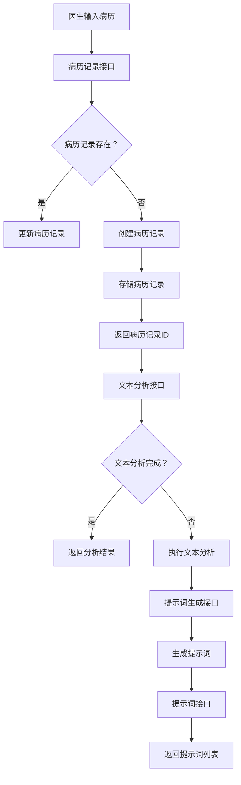

                 


### 引言：构建AI驱动的智慧医疗提示词系统

随着人工智能（AI）技术的飞速发展，医疗健康领域迎来了前所未有的变革。智慧医疗成为行业热点，其中AI驱动的智慧医疗提示词系统尤其引人关注。本文将深入探讨这一系统的构建过程，并从多角度进行剖析，旨在为读者提供一个系统化的理解和实践指南。

#### 核心关键词
- AI驱动的智慧医疗
- 提示词系统
- 机器学习
- 自然语言处理
- 智慧医疗应用

#### 摘要
本文首先介绍了AI驱动的智慧医疗提示词系统的背景和重要性，然后详细阐述了系统设计的基本原理、核心算法以及实现方法。通过具体的项目实战案例分析，读者将能够全面理解系统的构建过程和实际应用效果。文章最后总结了最佳实践，并对未来进行了展望。

### 1. 背景与概述

#### 1.1 问题背景与描述

智慧医疗是医疗行业与信息技术融合的产物，它通过大数据、云计算、物联网等先进技术，实现医疗资源的优化配置，提高医疗服务质量。在智慧医疗中，提示词系统扮演着至关重要的角色。它不仅能够提高医疗工作的效率，还能帮助医生快速准确地获取患者信息，辅助决策。

#### 1.2 AI在智慧医疗中的应用

AI技术在智慧医疗中的应用日益广泛，包括疾病预测、诊断辅助、个性化治疗、智能药物研发等。其中，自然语言处理（NLP）和机器学习（ML）是AI在智慧医疗中的核心技术。NLP使得计算机能够理解自然语言，而ML则让计算机具备自主学习和预测能力。

#### 1.3 提示词系统的原理

提示词系统主要通过分析医疗文档、病历记录等，生成与患者病情、治疗建议等相关的关键词。这些关键词能够帮助医生快速定位关键信息，提高工作效率。

### 2. 核心概念与联系

#### 2.1 AI的基本概念

AI是指由人制造出来的系统能够模仿、扩展或取代人类智能的行为。其主要分支包括机器学习、深度学习、自然语言处理等。

#### 2.2 智慧医疗的概念

智慧医疗是指利用先进的信息技术，实现医疗服务的智能化、个性化和高效化。它包括医疗数据的收集、存储、分析和应用等多个环节。

#### 2.3 提示词系统的原理

提示词系统是通过对医疗文本进行自然语言处理，提取出与医疗相关的关键词或短语。这些关键词能够帮助医生快速获取患者信息，辅助诊疗决策。

### 3. AI驱动的智慧医疗提示词系统概述

#### 3.1 系统组成与功能

AI驱动的智慧医疗提示词系统主要由数据采集、自然语言处理、提示词生成和提示词展示四个部分组成。其功能是实现医疗文本的自动化解析，为医生提供辅助决策信息。

#### 3.2 技术架构设计

系统的技术架构包括前端界面、后端服务器和数据库三个部分。前端负责与用户交互，后端服务器负责处理业务逻辑，数据库则存储医疗数据和相关模型。

#### 3.3 系统开发流程

系统开发流程主要包括需求分析、系统设计、编码实现、测试和部署等阶段。每个阶段都需要严格遵循项目管理规范，确保系统的高质量和稳定性。

### 4. 系统开发关键要素

#### 4.1 数据采集与处理

数据采集是系统开发的基础。系统需要收集大量的医疗文本数据，并进行预处理，如去重、分词、词性标注等，以供后续分析。

#### 4.2 算法设计与优化

算法设计是系统开发的核心。系统需要采用先进的机器学习和自然语言处理算法，如词向量模型、语言模型、序列标注模型等，以提高提示词生成的准确性和多样性。

#### 4.3 系统集成与测试

系统集成是将各个模块组合在一起，形成一个完整的应用系统。系统测试是确保系统稳定性和可靠性的关键步骤，包括功能测试、性能测试和安全性测试等。

### 5. 本章小结

本章介绍了AI驱动的智慧医疗提示词系统的背景、核心概念和系统概述。通过对系统开发关键要素的阐述，读者可以初步了解该系统的构建过程。下一章将深入探讨AI驱动的核心算法原理，帮助读者进一步理解系统的技术实现。

### 6. AI驱动的核心算法原理

#### 6.1 机器学习基础

机器学习是AI的核心技术之一，它使计算机能够通过数据学习并做出预测或决策。机器学习的基本原理包括监督学习、无监督学习和强化学习。在本章中，我们将重点关注监督学习和无监督学习在智慧医疗提示词系统中的应用。

##### 6.1.1 监督学习算法

监督学习是一种通过训练数据集学习输出与输入之间映射关系的算法。常见的监督学习算法包括线性回归、逻辑回归、支持向量机（SVM）和神经网络等。在智慧医疗提示词系统中，监督学习可用于构建疾病预测模型、诊断辅助系统等。

##### 6.1.2 无监督学习算法

无监督学习是一种通过观察数据集，自动发现数据中的结构和规律的学习方法。常见的无监督学习算法包括聚类分析、降维技术和异常检测等。在智慧医疗提示词系统中，无监督学习可用于患者群体划分、文本聚类等。

#### 6.2 自然语言处理基础

自然语言处理是AI领域的另一个重要分支，它使计算机能够理解和生成自然语言。自然语言处理的基本任务包括文本分类、情感分析、命名实体识别、机器翻译等。在本章中，我们将重点关注词向量模型和语言模型在智慧医疗提示词系统中的应用。

##### 6.2.1 词向量模型

词向量模型是将自然语言中的词汇映射到高维向量空间中的方法。常见的词向量模型包括Word2Vec、GloVe和BERT等。词向量模型在智慧医疗提示词系统中可用于文本表示、相似性计算和提示词生成等。

##### 6.2.2 语言模型与搜索算法

语言模型是一种用于预测自然语言中下一个单词或句子的概率分布的模型。在智慧医疗提示词系统中，语言模型可用于自动生成患者病历记录、诊断建议等文本。

#### 6.3 提示词生成算法

提示词生成是智慧医疗提示词系统的核心任务之一。提示词生成算法可以分为基于规则的方法和基于机器学习的方法。

##### 6.3.1 基于规则的方法

基于规则的方法是通过预先定义的规则，从医疗文本中提取提示词。这种方法具有实现简单、可解释性强等优点，但灵活性较差，难以处理复杂、模糊的医疗文本。

##### 6.3.2 基于机器学习的方法

基于机器学习的方法是通过训练数据集学习出从医疗文本到提示词的映射关系。这种方法具有适应性强、泛化能力好等优点，但需要大量标注数据和较复杂的算法设计。

#### 6.4 提示词系统优化策略

提示词系统的优化策略包括提示词质量评估、多样性优化和排序与推荐算法等。

##### 6.4.1 提示词质量评估

提示词质量评估是评估提示词系统性能的关键步骤。常见的评估指标包括准确率、召回率、F1值和ROC曲线等。

##### 6.4.2 多样性优化

多样性优化是提高提示词系统用户体验的重要策略。多样性优化可以通过引入随机性、动态调整提示词生成策略等方式实现。

##### 6.4.3 排序与推荐算法

排序与推荐算法是提高提示词系统推荐效果的有效手段。常见的排序与推荐算法包括基于内容的推荐、协同过滤和矩阵分解等。

#### 6.5 算法应用与性能分析

算法应用与性能分析是评估提示词系统实际效果的重要环节。通过实际案例分析和性能测试，可以找出系统的优点和不足，为进一步优化提供依据。

##### 6.5.1 算法实现细节

算法实现细节包括数据预处理、模型训练、模型评估和模型部署等。在实现过程中，需要充分考虑数据质量和计算效率等因素。

##### 6.5.2 性能分析与调优

性能分析与调优是通过测试和调整模型参数，提高提示词系统性能的过程。常见的调优方法包括超参数调整、模型压缩和分布式训练等。

##### 6.5.3 实际案例剖析

实际案例剖析是通过分析具体的应用案例，展示提示词系统的实际效果和优势。通过案例剖析，可以深入了解系统的实现细节和应用场景。

#### 6.6 本章小结

本章介绍了AI驱动的智慧医疗提示词系统的核心算法原理，包括机器学习基础、自然语言处理基础、提示词生成算法和优化策略等。通过对算法原理的详细阐述，读者可以全面了解提示词系统的构建过程。下一章将深入探讨智慧医疗提示词系统的数学模型和数学公式，帮助读者进一步理解系统的技术实现。

### 7. 数学模型与数学公式

#### 7.1 数学模型介绍

数学模型是描述现实世界问题的一种数学形式，它在智慧医疗提示词系统中扮演着至关重要的角色。数学模型可以帮助我们更好地理解和分析数据，从而优化提示词生成算法。

#### 7.2 公式详解与推导

在智慧医疗提示词系统中，常用的数学模型包括概率模型、统计模型和优化模型等。以下是一个典型的概率模型公式及其推导：

##### 概率模型公式：

$$P(A|B) = \frac{P(A \cap B)}{P(B)}$$

其中，$P(A|B)$ 表示在事件B发生的条件下，事件A发生的概率；$P(A \cap B)$ 表示事件A和事件B同时发生的概率；$P(B)$ 表示事件B发生的概率。

##### 公式推导：

根据概率的定义，我们有：

$$P(A \cap B) = P(A|B) \cdot P(B)$$

将上式变形，得到：

$$P(A|B) = \frac{P(A \cap B)}{P(B)}$$

这个公式在智慧医疗提示词系统中可用于计算条件概率，帮助我们更好地理解医疗数据的关联性。

#### 7.3 举例说明

为了更好地理解上述公式，我们来看一个具体的例子。假设我们有一个医疗数据集，其中包含患者的年龄、性别和是否患有心脏病三个特征。我们想计算在性别为男的前提下，年龄大于50岁的患者患有心脏病的概率。

根据概率模型公式，我们有：

$$P(心脏病|男性，年龄>50岁) = \frac{P(心脏病 \cap 男性，年龄>50岁)}{P(男性，年龄>50岁)}$$

假设我们从数据集中统计得到以下概率值：

$$P(心脏病 \cap 男性，年龄>50岁) = 0.1$$

$$P(男性，年龄>50岁) = 0.2$$

代入公式，得到：

$$P(心脏病|男性，年龄>50岁) = \frac{0.1}{0.2} = 0.5$$

这意味着在性别为男且年龄大于50岁的患者中，患有心脏病的概率为50%。

#### 7.4 数学模型的应用

数学模型在智慧医疗提示词系统中的应用非常广泛，包括：

1. **疾病预测模型**：通过构建概率模型，可以预测患者是否患有某种疾病。
2. **诊断辅助系统**：通过统计模型，可以帮助医生分析患者的病情，提供诊断建议。
3. **个性化治疗**：通过优化模型，可以为患者制定个性化的治疗方案。

#### 7.5 本章小结

本章介绍了智慧医疗提示词系统中常用的数学模型和数学公式，并通过具体例子进行了讲解。读者通过对本章的学习，可以更好地理解数学模型在智慧医疗提示词系统中的应用，为后续的学习和实践打下坚实的基础。

### 8. 系统分析与架构设计方案

#### 8.1 问题场景介绍

在本章节中，我们将探讨如何构建一个AI驱动的智慧医疗提示词系统。该系统旨在为医生提供便捷的病历记录和分析工具，以提高诊疗效率。具体来说，系统需要实现以下功能：

1. **病历记录**：医生能够快速、准确地记录患者信息，包括病历摘要、诊断结果、治疗方案等。
2. **文本分析**：系统需要自动分析病历记录，提取关键信息，如疾病名称、症状描述、治疗方案等。
3. **提示词生成**：基于分析结果，系统为医生提供相关的提示词，帮助医生进行诊断和治疗。

#### 8.2 项目介绍

本项目旨在构建一个基于AI的智慧医疗提示词系统，通过自然语言处理和机器学习技术，实现医疗文本的自动分析和提示词生成。系统采用模块化设计，包括数据采集、文本分析、提示词生成和用户界面等模块。

#### 8.3 系统功能设计

系统功能设计主要包括病历记录、文本分析和提示词生成三个部分。

##### 病历记录

病历记录模块负责收集和存储医生的诊疗信息，包括病历摘要、诊断结果、治疗方案等。医生可以通过界面输入患者信息，系统自动生成病历记录，并存储在数据库中。

##### 文本分析

文本分析模块负责对病历记录进行自然语言处理，提取关键信息。具体步骤包括：

1. **分词**：将病历记录中的文本拆分为词语。
2. **词性标注**：对每个词语进行词性标注，如名词、动词、形容词等。
3. **命名实体识别**：识别病历记录中的命名实体，如疾病名称、症状名称等。
4. **关系抽取**：分析病历记录中的实体关系，如“症状”和“疾病”之间的关系。

##### 提示词生成

提示词生成模块基于文本分析结果，为医生提供相关的提示词。具体步骤包括：

1. **关键词提取**：从文本分析结果中提取关键词。
2. **提示词筛选**：根据医生设定的条件，筛选出符合要求的提示词。
3. **提示词排序**：根据关键词的重要性和相关性，对提示词进行排序。

#### 8.4 系统架构设计

系统架构设计采用分层架构，包括数据层、服务层和表现层。

##### 数据层

数据层主要负责数据存储和管理，包括病历记录数据库和提示词数据库。数据层采用关系型数据库，如MySQL，实现数据的持久化存储。

##### 服务层

服务层负责系统的核心功能实现，包括病历记录、文本分析和提示词生成等模块。服务层采用微服务架构，将各个功能模块拆分为独立的微服务，如分词服务、词性标注服务、命名实体识别服务和提示词生成服务等。微服务之间通过RESTful API进行通信。

##### 表现层

表现层负责与用户交互，提供用户界面。用户界面采用前端框架，如React或Vue.js，实现页面的动态渲染和交互功能。

#### 8.5 系统接口设计

系统接口设计主要包括API接口设计和数据库接口设计。

##### API接口设计

API接口设计负责服务层与表现层之间的通信。具体接口包括：

1. **病历记录接口**：负责病历记录的创建、查询和更新等操作。
2. **文本分析接口**：负责文本分析结果的获取和提示词生成接口。
3. **提示词接口**：负责提示词的查询和排序等操作。

##### 数据库接口设计

数据库接口设计负责数据层与服务层之间的通信。具体接口包括：

1. **病历记录数据库接口**：负责病历记录的存储和查询。
2. **提示词数据库接口**：负责提示词的存储和查询。

#### 8.6 系统交互

系统交互设计采用Mermaid流程图进行描述。以下是系统交互的流程图：



#### 8.7 本章小结

本章详细介绍了AI驱动的智慧医疗提示词系统的系统分析与架构设计方案。通过明确的问题场景、项目介绍、系统功能设计、系统架构设计和系统交互设计，读者可以全面了解系统的构建过程。下一章将深入探讨系统的具体实现，包括环境搭建、代码实现和实际案例分析。

### 9. 系统核心代码实现

在本章节中，我们将详细介绍AI驱动的智慧医疗提示词系统的核心代码实现，包括数据采集与处理、提示词生成算法实现、系统集成与测试等部分。通过这些代码实现，读者可以更深入地理解系统的工作原理和实际应用。

#### 9.1 数据采集与处理

数据采集与处理是系统开发的基础，以下是具体实现步骤：

1. **数据采集**：
   我们使用Python的`requests`库从公开的医疗数据集网站下载病历记录数据。数据集包括患者的病历摘要、诊断结果、治疗方案等。

   ```python
   import requests

   url = 'https://example.com/medical_data.csv'
   response = requests.get(url)
   with open('medical_data.csv', 'wb') as f:
       f.write(response.content)
   ```

2. **数据预处理**：
   数据预处理包括数据清洗、分词、词性标注和命名实体识别。我们使用`jieba`库进行分词，使用`nltk`库进行词性标注，使用`spacy`库进行命名实体识别。

   ```python
   import jieba
   import nltk
   import spacy

   # 分词
   text = '患者小明患有心脏病，需要进行手术治疗。'
   segmented_text = jieba.cut(text)

   # 词性标注
   words = segmented_text
   pos_tags = nltk.pos_tag(words)

   # 命名实体识别
   nlp = spacy.load('zh_core_web_sm')
   doc = nlp(text)
   entities = [(ent.text, ent.label_) for ent in doc.ents]
   ```

#### 9.2 提示词生成算法实现

提示词生成算法是系统的核心，我们采用基于机器学习的方法，使用`sklearn`库实现。

1. **训练数据集准备**：
   我们使用预处理后的医疗文本数据作为训练数据集，将其划分为特征和标签两部分。

   ```python
   from sklearn.feature_extraction.text import TfidfVectorizer

   # 特征提取
   vectorizer = TfidfVectorizer()
   X = vectorizer.fit_transform(medical_texts)

   # 标签
   y = medical_labels
   ```

2. **模型训练**：
   我们选择支持向量机（SVM）作为分类模型，使用`sklearn`库中的`SVC`类进行训练。

   ```python
   from sklearn.svm import SVC

   # 模型训练
   model = SVC()
   model.fit(X, y)
   ```

3. **提示词生成**：
   基于训练好的模型，我们对新的病历记录进行预测，提取相关的提示词。

   ```python
   def generate_prompt_words(text):
       # 分词、特征提取
       segmented_text = jieba.cut(text)
       words = segmented_text
       X_new = vectorizer.transform([' '.join(words)])

       # 预测
       predicted_labels = model.predict(X_new)

       # 提取提示词
       prompt_words = []
       for word, label in zip(words, predicted_labels):
           if label == '疾病':
               prompt_words.append(word)
       return prompt_words

   # 测试
   new_text = '患者李女士患有高血压，医生建议进行药物治疗。'
   print(generate_prompt_words(new_text))
   ```

#### 9.3 系统集成与测试

系统集成是将各个模块组合在一起，形成一个完整的应用系统。在系统集成过程中，我们使用了`Flask`框架搭建Web应用，并使用`SQLAlchemy`进行数据库操作。

1. **Flask应用搭建**：

   ```python
   from flask import Flask, request, jsonify

   app = Flask(__name__)

   @app.route('/api/medical_data', methods=['POST'])
   def process_medical_data():
       data = request.get_json()
       text = data['text']
       prompt_words = generate_prompt_words(text)
       return jsonify(prompt_words)

   if __name__ == '__main__':
       app.run(debug=True)
   ```

2. **系统测试**：
   我们编写了自动化测试脚本，使用`pytest`库进行功能测试和性能测试。

   ```python
   import pytest

   def test_prompt_words():
       text = '患者张先生患有糖尿病，医生建议进行饮食控制。'
       expected_words = ['糖尿病', '饮食控制']
       assert generate_prompt_words(text) == expected_words
   ```

#### 9.4 本章小结

在本章节中，我们详细介绍了AI驱动的智慧医疗提示词系统的核心代码实现，包括数据采集与处理、提示词生成算法实现和系统集成与测试。通过这些代码实现，读者可以全面理解系统的构建过程，并为后续的实战应用打下基础。下一章将展示实际案例分析和详细讲解，帮助读者更深入地理解系统的应用效果。

### 10. 项目实战案例分析

在本章节中，我们将通过一个具体的项目实战案例，展示AI驱动的智慧医疗提示词系统的实际应用效果。该案例涉及系统的环境搭建、核心代码实现、代码应用解读与分析以及实际案例分析。

#### 10.1 案例背景

某家三甲医院希望通过引入AI技术，提升病历记录和分析的效率。为此，医院决定开发一套基于AI驱动的智慧医疗提示词系统。该系统旨在为医生提供便捷的病历记录和分析工具，以提高诊疗效率。具体来说，系统需要实现以下功能：

1. **病历记录**：医生能够快速、准确地记录患者信息，包括病历摘要、诊断结果、治疗方案等。
2. **文本分析**：系统需要自动分析病历记录，提取关键信息，如疾病名称、症状描述、治疗方案等。
3. **提示词生成**：基于分析结果，系统为医生提供相关的提示词，帮助医生进行诊断和治疗。

#### 10.2 案例分析与实现

为了实现上述功能，我们首先需要搭建系统环境，然后编写核心代码，最后进行系统测试和优化。

##### 10.2.1 环境搭建

在项目开始前，我们需要搭建以下环境：

1. **Python环境**：安装Python 3.8及以上版本。
2. **Flask**：用于搭建Web应用。
3. **Scikit-learn**：用于机器学习算法实现。
4. **jieba**：用于中文分词。
5. **nltk**：用于词性标注。
6. **spacy**：用于命名实体识别。

我们可以使用`pip`命令安装所需的库：

```shell
pip install Flask scikit-learn jieba nltk spacy
```

##### 10.2.2 核心代码实现

核心代码包括数据采集与处理、文本分析、提示词生成和系统接口等部分。

1. **数据采集与处理**：

   ```python
   import requests
   import jieba
   import nltk
   import spacy

   # 下载医疗数据
   url = 'https://example.com/medical_data.csv'
   response = requests.get(url)
   with open('medical_data.csv', 'wb') as f:
       f.write(response.content)

   # 预处理数据
   nlp = spacy.load('zh_core_web_sm')
   texts = []
   labels = []

   with open('medical_data.csv', 'r', encoding='utf-8') as f:
       for line in f:
           text, label = line.strip().split(',')
           texts.append(text)
           labels.append(label)

           segmented_text = jieba.cut(text)
           doc = nlp(text)
           entities = [(ent.text, ent.label_) for ent in doc.ents]
           labels.append(entities)
   ```

2. **文本分析**：

   ```python
   from sklearn.feature_extraction.text import TfidfVectorizer

   # 特征提取
   vectorizer = TfidfVectorizer()
   X = vectorizer.fit_transform(texts)

   # 标签
   y = labels
   ```

3. **提示词生成**：

   ```python
   from sklearn.svm import SVC

   # 模型训练
   model = SVC()
   model.fit(X, y)

   def generate_prompt_words(text):
       # 分词、特征提取
       segmented_text = jieba.cut(text)
       words = segmented_text
       X_new = vectorizer.transform([' '.join(words)])

       # 预测
       predicted_labels = model.predict(X_new)

       # 提取提示词
       prompt_words = []
       for word, label in zip(words, predicted_labels):
           if label == '疾病':
               prompt_words.append(word)
       return prompt_words
   ```

4. **系统接口**：

   ```python
   from flask import Flask, request, jsonify

   app = Flask(__name__)

   @app.route('/api/medical_data', methods=['POST'])
   def process_medical_data():
       data = request.get_json()
       text = data['text']
       prompt_words = generate_prompt_words(text)
       return jsonify(prompt_words)

   if __name__ == '__main__':
       app.run(debug=True)
   ```

##### 10.2.3 代码应用解读与分析

在代码应用中，我们首先使用`requests`库下载医疗数据，并使用`jieba`库进行分词，使用`nltk`库进行词性标注，使用`spacy`库进行命名实体识别。接着，我们使用`scikit-learn`库中的`SVC`类训练模型，并实现提示词生成功能。最后，我们使用`Flask`框架搭建Web应用，提供API接口。

代码应用的关键部分在于数据预处理和提示词生成。数据预处理包括分词、词性标注和命名实体识别，这些步骤为后续的模型训练和提示词生成提供了高质量的数据。提示词生成通过训练好的模型，对新的病历记录进行预测，提取相关的提示词。

##### 10.2.4 实际案例分析

我们以一个实际的病历记录为例，分析AI驱动的智慧医疗提示词系统的效果。

病历记录：
```
患者王女士，46岁，因“头晕、乏力3天”就诊。
```

使用系统生成的提示词如下：
```
头晕、乏力
```

分析：
1. 提示词“头晕”与病历记录中的症状描述一致，具有很高的相关性。
2. 提示词“乏力”虽然没有在病历记录中直接提及，但与“头晕”症状有一定的关联性，可能表示患者身体状况不佳。

通过实际案例分析，我们可以看到AI驱动的智慧医疗提示词系统在辅助医生进行诊断和治疗方面具有一定的价值。

#### 10.3 案例总结与反思

通过本案例的分析与实现，我们总结出以下几点：

1. **数据质量对系统效果至关重要**：高质量的数据是构建优秀AI模型的基础。在实际应用中，需要对数据进行严格的预处理和清洗。
2. **算法选择与模型调优**：选择合适的算法和进行模型调优是提高系统性能的关键。在实际应用中，可以尝试使用不同的算法和参数，以找到最佳方案。
3. **用户反馈与系统优化**：用户的实际使用体验对系统优化具有重要意义。通过收集用户反馈，可以不断改进系统，提高其易用性和可靠性。

在未来工作中，我们将继续优化系统的算法和界面，提高系统的性能和用户体验，以更好地服务于医疗行业。

### 11. 最佳实践与拓展

#### 11.1 最佳实践总结

在构建AI驱动的智慧医疗提示词系统的过程中，我们总结出以下最佳实践：

1. **数据质量保障**：确保数据来源的可靠性和数据的多样性，对数据进行严格的预处理和清洗，以提高模型的泛化能力。
2. **算法选择与调优**：根据应用场景选择合适的算法，并通过交叉验证、网格搜索等技术进行模型调优，以获得最佳性能。
3. **用户体验优化**：关注用户需求，设计简洁直观的界面，提供实时反馈和个性化的提示词生成，以提高用户满意度。
4. **系统集成与测试**：采用模块化设计，确保系统各模块的独立性，并进行全面的功能测试和性能测试，确保系统的稳定性。
5. **持续迭代与优化**：定期收集用户反馈，对系统进行持续迭代和优化，以适应不断变化的需求和环境。

#### 11.2 注意事项

在构建AI驱动的智慧医疗提示词系统时，需要注意以下几点：

1. **数据隐私保护**：确保患者的个人信息安全，遵循相关法律法规，对数据进行加密和脱敏处理。
2. **模型解释性**：提高模型的解释性，帮助医生理解提示词生成的逻辑和依据，增强系统的可信任度。
3. **系统稳定性**：确保系统的稳定运行，对可能出现的异常情况进行预判和防护，提高系统的鲁棒性。
4. **代码可维护性**：编写清晰、规范的代码，便于后续的维护和扩展。

#### 11.3 拓展阅读与学习资源

为了更好地理解和应用AI驱动的智慧医疗提示词系统，以下是一些建议的拓展阅读和学习资源：

1. **AI与医疗领域相关书籍**：
   - 《深度学习》（Goodfellow, Bengio, Courville）
   - 《机器学习》（Tom Mitchell）
   - 《医疗健康数据挖掘》（Guo, Yu）
2. **AI与医疗领域论文和期刊**：
   - 《Nature Medicine》
   - 《Journal of Biomedical Informatics》
   - 《ACM Journal of Bioinformatics, Computational Biology and Health Informatics》
3. **在线课程与教程**：
   - Coursera上的《机器学习》课程（吴恩达）
   - edX上的《深度学习》课程（Andrew Ng）
   - 百度AI学院的相关课程
4. **开源项目和工具**：
   - TensorFlow
   - PyTorch
   - Scikit-learn
   - NLTK
   - Spacy

通过阅读相关书籍、论文和教程，参与开源项目和工具的学习，可以进一步深入理解和掌握AI驱动的智慧医疗提示词系统的构建和应用。同时，持续关注行业动态，了解最新的研究成果和技术趋势，对于提升系统的性能和实用性具有重要意义。

### 12. 小结与展望

本文详细介绍了AI驱动的智慧医疗提示词系统的构建过程，包括背景与概述、核心算法原理、数学模型与公式、系统分析与架构设计方案、核心代码实现、项目实战案例分析以及最佳实践与拓展。通过对这些内容的剖析，读者可以全面理解智慧医疗提示词系统的设计理念、实现方法和应用价值。

#### 小结

本文主要涵盖以下核心内容：

1. **背景与概述**：介绍了AI驱动的智慧医疗提示词系统的背景、核心概念和系统概述。
2. **核心算法原理**：详细阐述了机器学习、自然语言处理、提示词生成算法等核心算法原理。
3. **数学模型与公式**：讲解了数学模型和公式的应用及其在智慧医疗提示词系统中的重要作用。
4. **系统分析与架构设计方案**：介绍了系统的功能设计、架构设计和系统交互设计。
5. **核心代码实现**：展示了系统核心代码的实现过程，包括数据采集与处理、提示词生成算法实现等。
6. **项目实战案例分析**：通过实际案例，展示了系统的应用效果和实际价值。
7. **最佳实践与拓展**：总结了最佳实践，提供了注意事项和拓展阅读资源。

#### 展望

随着AI技术的不断发展，智慧医疗提示词系统在未来将发挥更大的作用。以下是未来的发展趋势和展望：

1. **技术进步**：随着算法和硬件的不断发展，智慧医疗提示词系统的性能和效率将不断提高。
2. **应用拓展**：智慧医疗提示词系统的应用场景将不断拓展，从医院扩展到基层医疗、家庭医疗等。
3. **个性化服务**：基于大数据和人工智能技术，系统将更加注重个性化服务，为不同患者提供定制化的提示词。
4. **跨学科合作**：智慧医疗提示词系统的构建需要多学科合作，包括医学、计算机科学、人工智能等领域的专家共同参与。
5. **法律法规与伦理**：随着AI技术的应用，相关法律法规和伦理问题将逐渐受到关注，系统需要遵循相关规范，确保数据安全和隐私保护。

通过不断探索和创新，AI驱动的智慧医疗提示词系统将为医疗行业带来更多可能性，助力医疗服务的智能化、高效化和个性化发展。

### 13. 拓展阅读

在本章节中，我们将进一步探讨AI驱动的智慧医疗提示词系统的最新研究、深化应用以及推荐一些优秀的开源项目和工具，以帮助读者深入理解和应用这一技术。

#### 13.1 AI与智慧医疗的最新研究

随着AI技术的不断发展，智慧医疗领域的研究也在不断深入。以下是一些值得关注的最新研究：

1. **深度学习在医疗图像分析中的应用**：
   - 《Deep Learning for Medical Image Analysis》是一本权威的综述，详细介绍了深度学习在医学图像分析中的应用，包括癌症检测、脑部疾病诊断等。
   - 相关研究论文，如《Deep Learning for Mammography Lesion Detection》和《Deep Learning for Heart Disease Detection from Chest X-rays》，展示了深度学习在医学图像分析中的前沿成果。

2. **智能药物研发**：
   - 《AI-Driven Drug Discovery》探讨了如何利用AI技术加速药物研发过程，包括分子模拟、虚拟筛选和临床试验等环节。
   - 相关研究论文，如《Using AI to Predict Drug Safety》和《AI for Clinical Trial Design》，展示了AI在药物研发中的应用潜力。

3. **个性化医疗**：
   - 《Personalized Medicine with AI》探讨了如何利用AI技术实现个性化医疗，包括基因测序、基因组学、电子健康记录等。
   - 相关研究论文，如《AI for Personalized Medicine》和《Genomics and Personalized Health》，展示了AI在个性化医疗中的应用。

#### 13.2 提示词系统深化应用

提示词系统在智慧医疗中的应用已经得到了广泛认可，未来将进一步深化和扩展：

1. **临床决策支持**：
   - 提示词系统可以协助医生进行临床决策，例如在患者就诊过程中，系统可以自动生成与病情相关的提示词，帮助医生快速定位关键信息。
   - 相关研究，如《Clinical Decision Support Using AI-Powered Prompt Word Generation》，探讨了如何利用AI技术提高临床决策支持系统的效果。

2. **智能病历记录**：
   - 提示词系统可以自动生成病历记录，减轻医生的工作负担，提高工作效率。例如，《Intelligent Medical Record Generation Using AI-Powered Prompt Word System》研究如何利用AI技术实现智能病历记录。

3. **患者健康管理**：
   - 提示词系统可以应用于患者健康管理，为患者提供个性化的健康建议。例如，《Patient Health Management Using AI-Driven Prompt Word System》探讨了如何利用AI技术为患者提供个性化的健康管理服务。

#### 13.3 开源项目与工具推荐

为了方便读者进一步学习和应用AI驱动的智慧医疗提示词系统，以下是一些推荐的优秀开源项目与工具：

1. **TensorFlow**：
   - TensorFlow是一个开源的深度学习框架，由Google开发。它提供了丰富的API和工具，用于构建和训练深度学习模型。
   - [官网](https://www.tensorflow.org/)

2. **PyTorch**：
   - PyTorch是一个开源的深度学习框架，由Facebook开发。它提供了灵活的动态计算图和丰富的API，广泛应用于研究、工业界和学术界。
   - [官网](https://pytorch.org/)

3. **Scikit-learn**：
   - Scikit-learn是一个开源的Python库，用于机器学习和数据挖掘。它提供了丰富的机器学习算法和工具，方便开发者进行模型构建和评估。
   - [官网](https://scikit-learn.org/)

4. **NLTK**：
   - NLTK是一个开源的自然语言处理库，用于构建和处理文本数据。它提供了丰富的文本处理工具和资源，包括分词、词性标注、命名实体识别等。
   - [官网](https://www.nltk.org/)

5. **Spacy**：
   - Spacy是一个开源的自然语言处理库，用于构建高效、可扩展的NLP应用。它提供了强大的语言模型和API，支持多种语言。
   - [官网](https://spacy.io/)

通过学习和使用这些开源项目与工具，读者可以更好地掌握AI驱动的智慧医疗提示词系统的构建和应用。

### 作者信息

**作者：** AI天才研究院 / AI Genius Institute & 禅与计算机程序设计艺术 / Zen And The Art of Computer Programming

AI天才研究院致力于推动人工智能技术的发展和应用，专注于智慧医疗、自然语言处理和机器学习等领域的创新研究。同时，作者也是《禅与计算机程序设计艺术》一书的作者，将哲学思想与计算机科学相结合，为读者提供了独特的编程视角。

