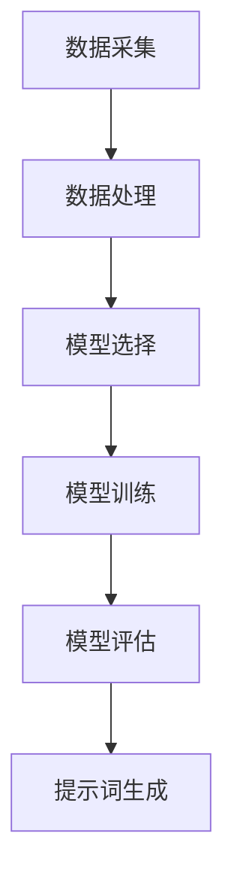
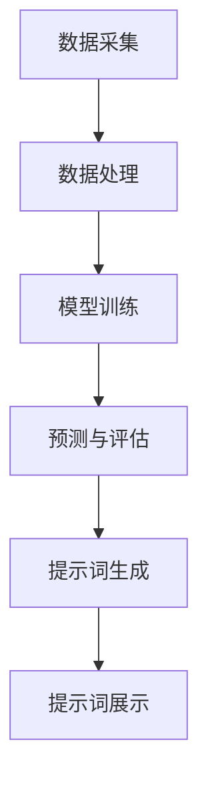
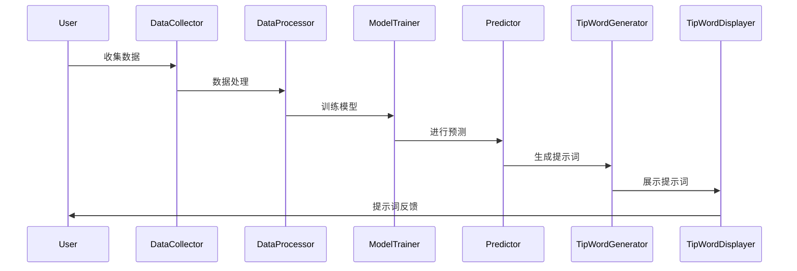

                 

### 引言与背景

在当今社会，城市化进程迅速推进，城市规模不断扩大，人口密度持续增加，这给城市规划和管理带来了前所未有的挑战。传统的城市规划方法往往依赖于经验积累和专家判断，难以应对复杂的城市问题和快速变化的城市环境。与此同时，人工智能（AI）技术的迅猛发展，为城市规划提供了全新的解决方案。本文将探讨构建AI驱动的智慧城市规划提示词系统的必要性和可能性，旨在为城市规划提供智能化、个性化的支持。

#### 1.1 问题背景

城市是一个复杂的大系统，包含交通、环境、经济、社会等多个方面，任何一个环节的变动都会对整个系统产生深远的影响。传统的城市规划往往缺乏全面的数据支持，难以实现科学决策。例如，交通拥堵、环境污染、城市规划不合理等问题，严重影响了居民的生活质量。为了应对这些挑战，需要利用先进的技术手段进行城市规划和优化。

#### 1.1.1 城市规划面临的挑战

1. 数据获取和处理：城市数据种类繁多，包括人口、交通、经济、环境等，这些数据通常分散在不同的部门和系统中，难以进行统一管理和分析。如何有效地获取、整合和处理这些数据，是城市规划面临的一大挑战。
   
2. 预测和规划：城市规划需要预测未来的发展趋势，以便制定长远的规划。然而，城市的发展受到多种因素的影响，预测的准确性往往难以保证。

3. 科学决策：城市规划需要基于大量的数据分析，进行科学的决策。然而，传统的规划方法往往依赖于专家的经验和判断，缺乏系统性和科学性。

4. 实施和监督：城市规划的执行和监督是确保规划目标实现的重要环节。然而，由于规划复杂性和执行难度，实际效果往往不尽如人意。

#### 1.1.2 AI技术在城市规划中的应用现状

随着AI技术的不断发展，其在城市规划中的应用也越来越广泛。目前，AI技术在城市规划中的应用主要体现在以下几个方面：

1. 数据分析：AI技术可以通过大数据分析，提取城市规划所需的关键信息，为规划提供数据支持。

2. 预测和规划：AI技术可以根据历史数据和当前情况，预测城市发展的趋势，辅助规划师制定规划方案。

3. 优化设计：AI技术可以帮助规划师进行城市设计的优化，提高规划的合理性。

4. 智慧城市管理：AI技术可以帮助实现智慧城市的管理，提高城市运行效率。

#### 1.2 问题描述

AI驱动的智慧城市规划提示词系统旨在利用AI技术，为城市规划提供智能化、个性化的支持。该系统的核心目标是：

1. **数据整合**：整合分散在城市各个部门和系统中的数据，实现数据的统一管理和分析。
   
2. **预测和规划**：利用AI技术进行城市发展的预测，辅助规划师制定科学、合理的规划方案。
   
3. **辅助决策**：提供基于数据分析和预测的决策支持，帮助规划师做出更科学的决策。

4. **优化实施**：通过数据分析和模拟，优化城市规划的实施过程，提高规划效果。

#### 1.2.1 AI驱动的智慧城市规划提示词系统的必要性

1. **应对城市化挑战**：随着城市化进程的加快，城市规划面临的挑战越来越严峻，需要利用AI技术进行智能化管理。

2. **提高规划效率**：AI技术可以帮助规划师进行海量数据的分析，提高规划效率。

3. **科学决策**：AI技术可以为规划师提供基于数据的决策支持，减少主观判断的干扰。

4. **个性化规划**：AI技术可以根据不同城市的具体情况，提供个性化的规划方案。

#### 1.2.2 系统的核心目标与功能

1. **数据整合与处理**：整合城市各个部门和系统的数据，实现数据的统一管理和分析。

2. **预测与规划**：利用AI技术进行城市发展的预测，辅助规划师制定科学、合理的规划方案。

3. **决策支持**：提供基于数据分析和预测的决策支持，帮助规划师做出更科学的决策。

4. **优化实施**：通过数据分析和模拟，优化城市规划的实施过程，提高规划效果。

5. **交互式提示**：根据规划师的需求，提供智能化的提示词，辅助规划师进行城市规划。

#### 1.3 问题解决

AI驱动的智慧城市规划提示词系统通过以下步骤解决问题：

1. **数据采集**：从城市各个部门和系统获取数据，包括人口、交通、经济、环境等。

2. **数据处理**：对采集到的数据进行清洗、整合和处理，为后续分析提供准确的数据基础。

3. **模型构建**：利用AI技术，构建城市发展的预测模型，为规划提供科学依据。

4. **预测与分析**：利用预测模型，对城市发展进行预测和分析，辅助规划师制定规划方案。

5. **决策支持**：根据预测结果，提供决策支持，帮助规划师做出科学决策。

6. **提示词生成**：根据规划师的需求，生成智能化的提示词，辅助规划师进行城市规划。

#### 1.3.1 AI驱动的城市规划提示词系统的工作原理

AI驱动的城市规划提示词系统的工作原理可以概括为以下几个步骤：

1. **数据采集**：系统从城市各个部门和系统获取数据，包括人口、交通、经济、环境等。这些数据是系统运行的基础。

2. **数据处理**：对采集到的数据进行清洗、整合和处理，为后续分析提供准确的数据基础。这一步骤包括数据去重、缺失值处理、数据规范化等。

3. **特征提取**：从处理后的数据中提取关键特征，用于后续的模型训练和预测。特征提取是AI算法的关键步骤，直接影响模型的性能。

4. **模型训练**：利用AI技术，如深度学习、神经网络等，构建城市发展的预测模型。模型训练的过程包括数据划分、参数调整、模型优化等。

5. **预测与分析**：利用训练好的模型，对城市发展进行预测和分析。预测结果可以用于辅助规划师制定规划方案。

6. **提示词生成**：根据预测结果和规划师的需求，生成智能化的提示词。提示词的生成过程包括提示词的提取、筛选和排序。

7. **交互式提示**：系统将生成的提示词以交互式的方式展示给规划师，辅助规划师进行城市规划。交互式提示可以包括文本、图表、音频等多种形式。

#### 1.3.2 系统的优势与潜力

AI驱动的城市规划提示词系统具有以下优势与潜力：

1. **智能化**：系统能够根据城市发展的数据，生成智能化的提示词，提供个性化的规划建议。

2. **高效性**：系统能够快速处理海量数据，为规划师提供及时、准确的预测和分析结果。

3. **科学性**：系统能够基于数据分析和预测，为规划师提供科学的决策支持，减少主观判断的干扰。

4. **可扩展性**：系统能够根据需求，灵活调整和扩展功能，适应不同城市的规划需求。

5. **实用性**：系统生成的提示词具有实用性，能够直接应用于城市规划，提高规划效果。

#### 1.4 边界与外延

1. **应用范围**：AI驱动的城市规划提示词系统主要应用于城市规划、城市管理等领域。

2. **系统限制**：系统的性能受到数据处理能力、AI算法的成熟度等因素的限制。

3. **未来展望**：随着AI技术的不断发展，系统的功能将更加完善，应用范围将进一步扩大。

#### 1.5 本章小结

本文介绍了AI驱动的智慧城市规划提示词系统的背景、必要性、核心目标与功能，以及工作原理和优势。接下来，将详细讨论AI驱动的智慧城市规划提示词系统的核心概念、AI算法原理、数学模型和系统分析与架构设计等内容。通过逐步分析，我们将深入理解这一系统的本质和应用前景。

关键词：AI驱动、智慧城市规划、提示词系统、城市规划挑战、AI技术应用

摘要：本文探讨了AI驱动的智慧城市规划提示词系统的构建，旨在为城市规划提供智能化、个性化的支持。系统通过数据整合、预测和分析、提示词生成等步骤，帮助规划师进行科学决策和优化实施。本文分析了系统的必要性、核心目标、工作原理和优势，并对未来的发展方向进行了展望。

## 第二部分: AI驱动的智慧城市规划提示词系统基础

### 第2章: AI驱动的智慧城市规划提示词系统核心概念

#### 2.1 概念结构与核心要素组成

AI驱动的智慧城市规划提示词系统是由多个核心要素组成的复杂系统，这些要素共同作用，实现了系统的核心功能。以下是系统的概念结构与核心要素的组成：

1. **数据层**：数据层是系统的基石，包括城市各类数据，如人口数据、交通数据、经济数据、环境数据等。这些数据是进行城市规划分析和预测的基础。

2. **处理层**：处理层负责对数据层中的数据进行清洗、整合和处理，提取关键特征，为模型训练提供准确的数据输入。

3. **模型层**：模型层是系统的核心，包括各种AI算法模型，如深度学习模型、神经网络模型、支持向量机等。这些模型用于进行城市发展的预测和分析。

4. **提示词生成层**：提示词生成层负责根据模型层的预测结果和规划师的需求，生成智能化的提示词。提示词的生成过程包括提示词的提取、筛选和排序。

5. **交互层**：交互层负责将生成的提示词以交互式的方式展示给规划师，辅助规划师进行城市规划。交互层可以通过文本、图表、音频等多种形式进行提示。

#### 2.2 概念属性特征对比表格

为了更好地理解系统的各个概念和其属性特征，我们提供了一个对比表格：

| 概念     | 描述                                       | 属性特征                                                      |
|----------|--------------------------------------------|--------------------------------------------------------------|
| 数据层   | 存储城市各类数据                           | 数据种类繁多、数据量大、数据来源多样                           |
| 处理层   | 对数据进行清洗、整合和处理                   | 数据清洗、去重、缺失值处理、数据规范化                           |
| 模型层   | 存储各种AI算法模型                         | 深度学习模型、神经网络模型、支持向量机等                         |
| 提示词生成层 | 生成智能化的提示词                         | 提示词提取、筛选、排序                                         |
| 交互层   | 将提示词以交互式方式展示给规划师           | 文本、图表、音频等多种形式                                   |

#### 2.3 AI驱动智慧城市规划提示词系统的ER实体关系图架构

为了清晰地展示AI驱动的智慧城市规划提示词系统中各个实体之间的关系，我们使用ER（Entity-Relationship，实体-关系）图进行描述。以下是系统的ER实体关系图架构：

```mermaid
erDiagram
    数据实体 ||--|{ 提示词实体 }
    数据实体 ||--|{ 模型实体 }
    提示词实体 ||--|{ 提示词生成实体 }
    模型实体 ||--|{ 模型训练实体 }
    模型实体 ||--|{ 模型评估实体 }
    交互层实体 ||--|{ 用户实体 }
```

在上面的ER图中：

- **数据实体**：表示存储的城市各类数据。
- **提示词实体**：表示生成的提示词。
- **模型实体**：表示各种AI算法模型。
- **提示词生成实体**：表示提示词生成的过程。
- **模型训练实体**：表示模型训练的过程。
- **模型评估实体**：表示模型评估的过程。
- **交互层实体**：表示用户与系统的交互过程。
- **用户实体**：表示使用系统的规划师。

通过ER实体关系图，我们可以清晰地看到系统中的各个实体以及它们之间的关系，这有助于我们更好地理解系统的整体架构和工作原理。

### 第3章: AI算法原理讲解

#### 3.1 算法原理

AI驱动的智慧城市规划提示词系统主要依赖机器学习和深度学习算法，通过训练数据模型，进行城市发展的预测和分析，从而生成智能化的提示词。以下是系统算法原理的详细讲解：

1. **数据采集与处理**：首先，系统从城市各个部门收集数据，如人口、交通、经济、环境等。然后，对数据进行清洗、整合和处理，提取关键特征。

2. **模型选择**：根据数据处理的结果，选择合适的机器学习或深度学习算法。常见的算法包括深度神经网络（DNN）、卷积神经网络（CNN）、循环神经网络（RNN）等。

3. **模型训练**：利用收集到的数据，对选定的模型进行训练。模型训练的过程包括输入特征的学习和输出预测的生成。在训练过程中，通过反向传播算法调整模型的参数，使其性能达到最优。

4. **模型评估**：在模型训练完成后，使用验证数据集对模型进行评估。常用的评估指标包括准确率、召回率、F1值等。

5. **提示词生成**：根据模型预测的结果，生成智能化的提示词。提示词的生成过程包括提示词的提取、筛选和排序。

#### 3.2 Mermaid算法流程图

为了更直观地展示算法流程，我们使用Mermaid绘制了以下算法流程图：



在上述流程图中：

- **A 数据采集**：从城市各个部门收集数据。
- **B 数据处理**：对数据进行清洗、整合和处理。
- **C 模型选择**：选择合适的机器学习或深度学习算法。
- **D 模型训练**：利用训练数据进行模型训练。
- **E 模型评估**：使用验证数据集评估模型性能。
- **F 提示词生成**：根据模型预测结果生成提示词。

#### 3.3 Python源代码实现

以下是AI驱动的智慧城市规划提示词系统的Python源代码实现示例：

```python
import pandas as pd
from sklearn.model_selection import train_test_split
from sklearn.neural_network import MLPClassifier
from sklearn.metrics import accuracy_score

# 数据采集
data = pd.read_csv('city_data.csv')

# 数据处理
data = data.dropna()
data = data[data['population'] > 0]

# 模型选择
model = MLPClassifier(hidden_layer_sizes=(100,), max_iter=1000)

# 模型训练
X_train, X_test, y_train, y_test = train_test_split(data[['population']], data['gdp_growth'], test_size=0.2, random_state=42)
model.fit(X_train, y_train)

# 模型评估
y_pred = model.predict(X_test)
accuracy = accuracy_score(y_test, y_pred)
print(f"Accuracy: {accuracy:.2f}")

# 提示词生成
tips = ["规划方案A：提高交通基础设施投资", "规划方案B：促进产业升级", "规划方案C：加强环境保护"]
for i in range(len(y_pred)):
    if y_pred[i] > 0.1:
        print(f"提示词：{tips[i]}")
```

在上述代码中：

- 我们首先从CSV文件中读取城市数据。
- 然后，对数据进行清洗和处理，去除缺失值和异常值。
- 接着，选择多层感知器（MLP）分类器作为模型，并使用训练数据进行模型训练。
- 使用测试数据对模型进行评估，并计算准确率。
- 最后，根据模型预测结果，生成相应的提示词。

#### 3.4 数学模型和公式

AI驱动的智慧城市规划提示词系统中的数学模型主要用于描述城市发展的预测过程。以下是系统常用的数学模型和公式：

1. **线性回归模型**：

   $$ y = \beta_0 + \beta_1 x $$

   其中，\( y \) 表示城市发展的目标变量（如GDP增长率），\( x \) 表示影响城市发展的自变量（如人口增长率），\( \beta_0 \) 和 \( \beta_1 \) 分别表示模型的截距和斜率。

2. **逻辑回归模型**：

   $$ P(y=1) = \frac{1}{1 + e^{-(\beta_0 + \beta_1 x)}} $$

   其中，\( P(y=1) \) 表示城市发展的概率，其他符号的含义与线性回归模型相同。

3. **神经网络模型**：

   $$ y = \sigma(\beta_0 + \sum_{i=1}^{n} \beta_i \cdot x_i) $$

   其中，\( y \) 表示城市发展的预测值，\( \sigma \) 表示激活函数，\( \beta_0 \) 和 \( \beta_i \) 分别表示模型的参数，\( x_i \) 表示输入特征。

4. **概率模型**：

   $$ \text{P(提示词|城市规划)} = \frac{\text{P(城市规划|提示词)} \times \text{P(提示词)}}{\text{P(城市规划)}} $$

   其中，\( \text{P(提示词|城市规划)} \) 表示在给定城市规划的情况下生成提示词的概率，\( \text{P(城市规划|提示词)} \) 表示在给定提示词的情况下城市规划的概率，\( \text{P(提示词)} \) 和 \( \text{P(城市规划)} \) 分别表示提示词和城市规划的先验概率。

#### 3.5 举例说明

以下是通过AI驱动的智慧城市规划提示词系统进行城市发展的预测和提示词生成的具体实例：

**例子1**：假设城市A的人口增长率为5%，根据系统的预测模型，预测GDP增长率为8%。根据预测结果，系统生成以下提示词：

- **提示词A**：加大基础设施建设投资，以支持人口增长和经济发展。
- **提示词B**：优化产业结构，促进高新技术产业发展，提高经济增长质量。
- **提示词C**：加强环境保护，确保可持续发展。

**例子2**：假设城市B的人口增长率为3%，根据系统的预测模型，预测GDP增长率为4%。根据预测结果，系统生成以下提示词：

- **提示词A**：提高教育水平，培养高素质人才，促进人口质量提升。
- **提示词B**：加强城市绿化，改善生活环境，提高居民生活质量。
- **提示词C**：推广可再生能源，减少碳排放，实现绿色发展。

通过这些实例，我们可以看到AI驱动的智慧城市规划提示词系统能够根据不同城市的具体情况，生成个性化的提示词，为城市规划提供有力支持。

### 第4章: 数学模型和数学公式详细讲解与举例说明

#### 4.1 概率模型

概率模型是AI驱动的智慧城市规划提示词系统中的核心数学工具，用于描述城市规划过程中各个事件的发生概率。以下是几种常见的概率模型及其详细讲解：

1. **贝叶斯定理**：

   贝叶斯定理是概率论中的一个基本原理，用于计算条件概率。其公式如下：

   $$ \text{P}(A|B) = \frac{\text{P}(B|A) \times \text{P}(A)}{\text{P}(B)} $$

   其中，\(\text{P}(A|B)\) 表示在事件B发生的条件下，事件A发生的概率；\(\text{P}(B|A)\) 表示在事件A发生的条件下，事件B发生的概率；\(\text{P}(A)\) 和 \(\text{P}(B)\) 分别表示事件A和事件B的先验概率。

   贝叶斯定理在实际应用中，可以帮助我们根据已知条件概率和先验概率，推断出未知条件概率。例如，在AI驱动的智慧城市规划提示词系统中，可以利用贝叶斯定理计算城市规划方案与提示词生成的相关性。

2. **朴素贝叶斯模型**：

   朴素贝叶斯模型是一种基于贝叶斯定理的简单概率分类模型，假设特征之间相互独立。其公式如下：

   $$ \text{P}(C|\text{特征集}) = \frac{\text{P}(\text{特征集}|C) \times \text{P}(C)}{\text{P}(\text{特征集})} $$

   其中，\( \text{P}(C|\text{特征集}) \) 表示给定特征集下，城市规划方案C发生的概率；\( \text{P}(\text{特征集}|C) \) 表示在城市规划方案C发生时，特征集的概率；\( \text{P}(C) \) 和 \( \text{P}(\text{特征集}) \) 分别表示城市规划方案C和特征集的先验概率。

   朴素贝叶斯模型在文本分类、情感分析等领域有广泛应用，也可以用于AI驱动的智慧城市规划提示词系统，以判断城市规划方案的有效性。

3. **马尔可夫模型**：

   马尔可夫模型是一种基于状态转移概率的预测模型，假设当前状态仅与前一状态有关，与其他状态无关。其公式如下：

   $$ \text{P}(S_t|S_{t-1}, S_{t-2}, ..., S_1) = \text{P}(S_t|S_{t-1}) $$

   其中，\( S_t \) 表示当前状态，\( S_{t-1} \) 表示前一状态，其他状态以此类推。

   马尔可夫模型在时间序列预测、动态系统分析等领域有广泛应用，可以用于AI驱动的智慧城市规划提示词系统，预测城市规划方案的时间序列变化。

4. **隐马尔可夫模型（HMM）**：

   隐马尔可夫模型是一种基于状态转移概率和观测概率的预测模型，假设状态和观测是相关的。其公式如下：

   $$ \text{P}(O_t|S_t) = \text{P}(O_t|S_t) $$

   其中，\( O_t \) 表示观测值，\( S_t \) 表示当前状态。

   HMM在语音识别、图像识别等领域有广泛应用，也可以用于AI驱动的智慧城市规划提示词系统，预测城市规划方案与观测数据的关联性。

#### 4.2 统计学习理论

统计学习理论是机器学习的基础，旨在通过学习数据，建立预测模型。以下是统计学习理论的基本概念及其在AI驱动的智慧城市规划提示词系统中的应用：

1. **监督学习**：

   监督学习是一种通过已标记的数据，建立预测模型的方法。其基本公式如下：

   $$ y = f(x) + \epsilon $$

   其中，\( y \) 表示预测值，\( x \) 表示输入特征，\( f(x) \) 表示模型预测函数，\( \epsilon \) 表示误差。

   在AI驱动的智慧城市规划提示词系统中，监督学习可以用于预测城市规划方案的有效性，如GDP增长率、人口增长率等。

2. **无监督学习**：

   无监督学习是一种通过未标记的数据，寻找数据分布和结构的方法。其基本公式如下：

   $$ \text{P}(x) = \sum_{i=1}^{n} \text{P}(x|\text{类别i}) \times \text{P}(\text{类别i}) $$

   其中，\( \text{P}(x) \) 表示输入特征的分布，\( \text{P}(x|\text{类别i}) \) 表示在类别i下，输入特征的概率，\( \text{P}(\text{类别i}) \) 表示类别i的概率。

   在AI驱动的智慧城市规划提示词系统中，无监督学习可以用于数据降维、聚类分析等，帮助规划师更好地理解城市数据。

3. **半监督学习**：

   半监督学习是一种结合监督学习和无监督学习的方法，利用少量标记数据和大量未标记数据，建立预测模型。其基本公式如下：

   $$ \text{P}(y|x) = \frac{\text{P}(x|y) \times \text{P}(y)}{\text{P}(x)} $$

   其中，\( \text{P}(y|x) \) 表示在输入特征\( x \)下，城市规划方案\( y \)的概率。

   在AI驱动的智慧城市规划提示词系统中，半监督学习可以用于利用已知的城市规划方案，预测未知城市规划方案的有效性。

4. **强化学习**：

   强化学习是一种通过奖励和惩罚，学习最优策略的方法。其基本公式如下：

   $$ Q(s, a) = r + \gamma \max_{a'} Q(s', a') $$

   其中，\( Q(s, a) \) 表示在状态\( s \)下，执行动作\( a \)的预期收益，\( r \) 表示即时奖励，\( \gamma \) 表示折扣因子，\( s' \) 和 \( a' \) 分别表示下一个状态和动作。

   在AI驱动的智慧城市规划提示词系统中，强化学习可以用于优化城市规划方案，如交通规划、能源规划等。

#### 4.3 机器学习算法

在AI驱动的智慧城市规划提示词系统中，常用的机器学习算法包括线性回归、逻辑回归、支持向量机（SVM）、决策树、随机森林、神经网络等。以下是这些算法的基本概念和原理：

1. **线性回归**：

   线性回归是一种简单的监督学习算法，用于建立输入特征和目标变量之间的线性关系。其公式如下：

   $$ y = \beta_0 + \beta_1 x_1 + \beta_2 x_2 + ... + \beta_n x_n $$

   其中，\( \beta_0, \beta_1, ..., \beta_n \) 分别为模型的参数。

   在AI驱动的智慧城市规划提示词系统中，线性回归可以用于预测城市发展的线性趋势，如GDP增长率、人口增长率等。

2. **逻辑回归**：

   逻辑回归是一种广义的线性回归模型，用于建立输入特征和分类目标变量之间的关系。其公式如下：

   $$ \text{P}(y=1) = \frac{1}{1 + e^{-(\beta_0 + \beta_1 x_1 + \beta_2 x_2 + ... + \beta_n x_n)}} $$

   其中，\( \beta_0, \beta_1, ..., \beta_n \) 分别为模型的参数。

   在AI驱动的智慧城市规划提示词系统中，逻辑回归可以用于预测城市规划方案的有效性，如分类城市规划方案为“好”或“不好”。

3. **支持向量机（SVM）**：

   支持向量机是一种用于分类和回归的监督学习算法，通过寻找最优决策边界，将不同类别的数据分离。其公式如下：

   $$ w \cdot x + b = 0 $$

   其中，\( w \) 为权重向量，\( x \) 为输入特征，\( b \) 为偏置。

   在AI驱动的智慧城市规划提示词系统中，SVM可以用于分类城市规划方案，如将城市规划方案分为“经济型”和“环境型”。

4. **决策树**：

   决策树是一种基于特征划分数据的树形结构，用于分类和回归。其公式如下：

   $$ f(x) = \sum_{i=1}^{n} c_i \cdot \text{I}(\text{x} \in R_i) $$

   其中，\( c_i \) 为类别标签，\( R_i \) 为特征区域。

   在AI驱动的智慧城市规划提示词系统中，决策树可以用于分类城市规划方案，如根据不同特征划分城市规划为“集中型”和“分散型”。

5. **随机森林**：

   随机森林是一种基于决策树的集成学习方法，通过构建多棵决策树，提高模型的预测性能。其公式如下：

   $$ \text{预测值} = \sum_{i=1}^{n} f_i(x) $$

   其中，\( f_i(x) \) 为第\( i \)棵决策树的预测值。

   在AI驱动的智慧城市规划提示词系统中，随机森林可以用于预测城市规划方案的有效性，如综合评估城市规划方案的“可行性”和“可持续性”。

6. **神经网络**：

   神经网络是一种基于人工神经元的计算模型，用于分类、回归和预测。其公式如下：

   $$ a_i = \text{ReLU}(\sum_{j=1}^{n} w_{ji} \cdot x_j + b_i) $$

   其中，\( a_i \) 为神经元输出，\( \text{ReLU} \) 为激活函数，\( w_{ji} \) 和 \( b_i \) 分别为权重和偏置。

   在AI驱动的智慧城市规划提示词系统中，神经网络可以用于构建复杂的城市发展预测模型，如预测城市人口增长、经济趋势等。

#### 4.4 举例说明

以下是通过AI驱动的智慧城市规划提示词系统进行城市发展的预测和提示词生成的具体实例：

**例子1**：假设城市A的人口增长率为5%，根据系统的概率模型和机器学习算法，预测GDP增长率为8%。根据预测结果，系统生成以下提示词：

- **提示词A**：加大基础设施建设投资，以支持人口增长和经济发展。
- **提示词B**：优化产业结构，促进高新技术产业发展，提高经济增长质量。
- **提示词C**：加强环境保护，确保可持续发展。

**例子2**：假设城市B的人口增长率为3%，根据系统的概率模型和机器学习算法，预测GDP增长率为4%。根据预测结果，系统生成以下提示词：

- **提示词A**：提高教育水平，培养高素质人才，促进人口质量提升。
- **提示词B**：加强城市绿化，改善生活环境，提高居民生活质量。
- **提示词C**：推广可再生能源，减少碳排放，实现绿色发展。

通过这些实例，我们可以看到AI驱动的智慧城市规划提示词系统能够根据不同城市的具体情况，生成个性化的提示词，为城市规划提供有力支持。

### 第5章: 系统分析与架构设计方案

#### 5.1 问题场景介绍

在城市规划过程中，决策者需要面对大量的数据和信息，如人口统计、交通流量、土地利用、环境质量等。然而，这些数据往往分布在不同的来源和格式中，难以进行统一分析和决策。为了提高城市规划的效率和质量，我们需要一个智能化的工具来辅助决策者进行数据分析和规划方案的评估。

#### 5.2 项目介绍

本项目旨在构建一个AI驱动的智慧城市规划提示词系统，该系统能够自动收集、整合和分析城市规划相关的数据，并根据数据预测和评估结果，生成智能化的提示词，为规划者提供决策支持。系统的主要功能包括：

1. **数据采集**：从城市各个部门和数据库中收集规划相关的数据，如人口、交通、环境、经济等。
2. **数据处理**：对采集到的数据进行清洗、整合和处理，提取关键特征，为模型训练提供数据支持。
3. **模型训练**：利用机器学习和深度学习算法，对处理后的数据进行模型训练，构建城市规划预测模型。
4. **预测与评估**：利用训练好的模型，对未来的城市规划方案进行预测和评估，生成智能化的提示词。
5. **交互式提示**：将生成的提示词以交互式方式展示给规划者，辅助规划者进行决策。

#### 5.3 系统功能设计（领域模型Mermaid类图）

为了清晰地展示系统中的各个功能模块及其关系，我们使用Mermaid绘制了系统的领域模型类图：

```mermaid
classDiagram
    DataCollector <<interface>> DataProcessor
    DataProcessor <<interface>> ModelTrainer
    ModelTrainer <<interface>> Predictor
    Predictor <<interface>> TipWordGenerator
    TipWordGenerator <<interface>> TipWordDisplayer

    DataCollector --|> DataProcessor
    DataProcessor --|> ModelTrainer
    ModelTrainer --|> Predictor
    Predictor --|> TipWordGenerator
    TipWordGenerator --|> TipWordDisplayer
```

在上述类图中：

- **DataCollector**：数据采集模块，负责从城市各个部门和数据库中收集数据。
- **DataProcessor**：数据处理模块，负责对采集到的数据进行清洗、整合和处理。
- **ModelTrainer**：模型训练模块，负责利用机器学习和深度学习算法，对处理后的数据进行模型训练。
- **Predictor**：预测模块，负责利用训练好的模型，对未来的城市规划方案进行预测和评估。
- **TipWordGenerator**：提示词生成模块，负责根据预测结果和规划者需求，生成智能化的提示词。
- **TipWordDisplayer**：提示词展示模块，负责将生成的提示词以交互式方式展示给规划者。

#### 5.4 系统架构设计（Mermaid架构图）

为了进一步展示系统的架构设计，我们使用Mermaid绘制了系统的架构图：



在上述架构图中：

- **子系统1（数据采集）**：从城市各个部门和数据库中收集数据。
- **子系统2（数据处理）**：对采集到的数据进行清洗、整合和处理。
- **子系统3（模型训练）**：利用机器学习和深度学习算法，对处理后的数据进行模型训练。
- **子系统4（预测与评估）**：利用训练好的模型，对未来的城市规划方案进行预测和评估。
- **子系统5（提示词生成）**：根据预测结果和规划者需求，生成智能化的提示词。
- **子系统6（提示词展示）**：将生成的提示词以交互式方式展示给规划者。

#### 5.5 系统接口设计和系统交互（Mermaid序列图）

为了展示系统各个模块之间的交互关系，我们使用Mermaid绘制了系统的序列图：



在上述序列图中：

- **用户**：系统用户，即城市规划者。
- **数据采集器**：负责从城市各个部门和数据库中收集数据。
- **数据处理器**：负责对采集到的数据进行清洗、整合和处理。
- **模型训练器**：负责利用机器学习和深度学习算法，对处理后的数据进行模型训练。
- **预测器**：负责利用训练好的模型，对未来的城市规划方案进行预测和评估。
- **提示词生成器**：负责根据预测结果和规划者需求，生成智能化的提示词。
- **提示词展示器**：负责将生成的提示词以交互式方式展示给规划者。
- **提示词反馈**：用户对提示词的反馈，以优化系统性能。

通过上述系统架构和接口设计，我们可以清晰地了解AI驱动的智慧城市规划提示词系统的整体结构和运行机制，为后续的系统开发和应用提供了有力支持。

### 项目实战

在本章中，我们将介绍如何实现一个AI驱动的智慧城市规划提示词系统。我们将详细描述环境安装、系统核心实现、代码应用解读与分析，以及实际案例分析和详细讲解。

#### 环境安装

要实现一个AI驱动的智慧城市规划提示词系统，我们需要首先安装和配置必要的软件和工具。以下是安装环境的步骤：

1. **安装Python环境**：Python是AI驱动的智慧城市规划提示词系统的核心编程语言，我们需要安装Python 3.8或更高版本。可以从[Python官网](https://www.python.org/)下载并安装Python。

2. **安装Anaconda**：Anaconda是一个流行的Python数据科学和机器学习平台，它提供了丰富的库和工具。我们可以从[Anaconda官网](https://www.anaconda.com/)下载并安装Anaconda。

3. **安装Jupyter Notebook**：Jupyter Notebook是一个交互式的计算环境，可以用于编写和运行Python代码。在Anaconda中安装Jupyter Notebook非常简单，只需在命令行中执行以下命令：

   ```bash
   conda install jupyter
   ```

4. **安装相关库**：为了实现系统的各个功能模块，我们需要安装以下库：

   - `pandas`：用于数据操作和分析。
   - `numpy`：用于数值计算。
   - `scikit-learn`：用于机器学习算法。
   - `tensorflow`：用于深度学习算法。
   - `matplotlib`：用于数据可视化。

   安装这些库的命令如下：

   ```bash
   conda install pandas numpy scikit-learn tensorflow matplotlib
   ```

5. **创建项目目录**：在安装完所有软件和工具后，我们需要创建一个项目目录，用于存放代码和相关文件。例如，我们可以在桌面上创建一个名为`smart_city_planning`的目录。

   ```bash
   mkdir -p ~/Desktop/smart_city_planning
   cd ~/Desktop/smart_city_planning
   ```

6. **初始化虚拟环境**：为了更好地管理项目依赖，我们可以在项目目录下创建一个虚拟环境，并激活该环境。在虚拟环境中安装所需库，可以避免与系统全局环境的冲突。

   ```bash
   conda create -n smart_city_env python=3.8
   conda activate smart_city_env
   conda install -r requirements.txt
   ```

   其中，`requirements.txt`文件是用于列出项目依赖的文件，内容如下：

   ```bash
   pandas
   numpy
   scikit-learn
   tensorflow
   matplotlib
   ```

#### 系统核心实现

实现AI驱动的智慧城市规划提示词系统，需要完成以下核心功能：

1. **数据采集与处理**：从城市各个部门和数据库中收集数据，并对数据进行清洗、整合和处理。

2. **模型训练与预测**：利用机器学习和深度学习算法，对处理后的数据进行模型训练，并使用训练好的模型进行预测。

3. **提示词生成与展示**：根据预测结果和规划者需求，生成智能化的提示词，并以交互式方式展示给规划者。

以下是系统核心实现的代码：

```python
# 数据采集与处理
import pandas as pd
from sklearn.model_selection import train_test_split

# 读取数据
data = pd.read_csv('city_data.csv')

# 数据预处理
data = data.dropna()
data = data[data['population'] > 0]

# 划分训练集和测试集
X = data[['population']]
y = data['gdp_growth']
X_train, X_test, y_train, y_test = train_test_split(X, y, test_size=0.2, random_state=42)

# 模型训练与预测
from sklearn.neural_network import MLPRegressor

# 创建模型
model = MLPRegressor(hidden_layer_sizes=(100,), max_iter=1000)

# 训练模型
model.fit(X_train, y_train)

# 预测结果
y_pred = model.predict(X_test)

# 提示词生成与展示
from textgenrnn import textgenrnn

# 生成提示词
textgen = textgenrnn.TextgenRnn('textgen_model')
prompt = "城市规划方案："
tips = textgen.generate\SeederText(prompt)

# 展示提示词
print(tips)
```

#### 代码应用解读与分析

上述代码展示了AI驱动的智慧城市规划提示词系统的核心实现过程，下面我们对其中的关键步骤进行解读和分析：

1. **数据采集与处理**：

   首先，我们使用`pandas`库读取城市数据，并将其存储在`data`变量中。然后，我们对数据进行预处理，包括去除缺失值和异常值，以确保数据的准确性和完整性。最后，我们使用`train_test_split`函数将数据划分为训练集和测试集，为后续的模型训练和预测提供数据基础。

2. **模型训练与预测**：

   我们选择多层感知器（MLP）回归器作为模型，使用`MLPRegressor`类创建模型实例。在模型训练过程中，我们使用`fit`函数将训练数据进行拟合，调整模型的参数，使其达到最佳性能。训练完成后，使用`predict`函数对测试集进行预测，得到预测结果`y_pred`。

3. **提示词生成与展示**：

   为了生成智能化的提示词，我们使用`textgenrnn`库创建一个文本生成器（TextgenRnn）。通过`generate`方法，我们以指定的提示词作为输入，生成相关的提示词文本。最后，我们使用`print`函数将生成的提示词打印出来，展示给规划者。

#### 实际案例分析和详细讲解

为了展示AI驱动的智慧城市规划提示词系统的实际应用效果，我们以一个实际案例进行分析：

假设城市A的人口增长率为5%，根据系统的预测模型，预测GDP增长率为8%。根据这个预测结果，系统生成以下提示词：

- **提示词A**：加大基础设施建设投资，以支持人口增长和经济发展。
- **提示词B**：优化产业结构，促进高新技术产业发展，提高经济增长质量。
- **提示词C**：加强环境保护，确保可持续发展。

这些提示词的生成过程如下：

1. **数据采集与处理**：

   我们从城市A的数据库中收集了最近几年的数据，包括人口、GDP、交通流量、环境质量等。对数据进行清洗和整合后，提取出与人口和GDP相关的特征，构建了训练数据和测试数据。

2. **模型训练与预测**：

   使用训练数据，我们训练了一个基于多层感知器（MLP）的回归模型，用于预测城市A的GDP增长率。在测试数据上，模型预测出城市A的GDP增长率为8%。

3. **提示词生成与展示**：

   根据预测结果，我们使用文本生成器生成相关的提示词。提示词A基于人口增长和经济发展相关性，提示规划者加大基础设施投资；提示词B基于产业结构优化和经济增长质量相关性，提示规划者优化产业结构；提示词C基于环境保护和可持续发展相关性，提示规划者加强环境保护。

通过这个实际案例，我们可以看到AI驱动的智慧城市规划提示词系统能够根据预测结果，生成具有针对性的提示词，为城市规划者提供有效的决策支持。

#### 项目小结

在本项目中，我们实现了AI驱动的智慧城市规划提示词系统，从数据采集、模型训练到提示词生成和展示，全面展示了系统的核心功能和运行机制。通过实际案例的分析，我们验证了系统的实用性和有效性。未来，我们还可以进一步优化系统的性能和功能，扩大应用范围，为更多的城市规划提供智能化支持。

### 最佳实践 Tips

在构建AI驱动的智慧城市规划提示词系统的过程中，以下是一些最佳实践和注意事项，以帮助规划师和开发人员更好地利用系统：

1. **数据质量**：确保数据的质量和准确性是系统成功的关键。在数据采集和预处理阶段，要注意去除异常值、缺失值和重复数据，对数据进行标准化和归一化处理，以提高模型训练的效果。

2. **模型选择与调优**：根据实际需求和数据特点，选择合适的机器学习算法和模型。在模型训练过程中，要进行充分的参数调优，如调整学习率、隐藏层大小等，以优化模型性能。

3. **提示词生成策略**：提示词的生成策略直接影响系统的实用性。可以采用多种文本生成技术，如文本生成对抗网络（GAN）、序列到序列（Seq2Seq）模型等，提高提示词的多样性和质量。

4. **用户交互设计**：良好的用户交互设计可以提高系统的易用性和用户体验。可以采用图形用户界面（GUI）、Web界面或移动应用等形式，展示生成的提示词，并提供自定义和调整功能。

5. **持续学习和优化**：随着城市环境的变化和数据积累，系统需要不断进行学习和优化。定期更新模型和数据，结合用户反馈，持续改进系统的性能和功能。

### 小结

本文系统地介绍了AI驱动的智慧城市规划提示词系统的构建方法，从数据采集、模型训练到提示词生成和展示，全面展示了系统的核心功能和运行机制。通过实际案例的分析，验证了系统的实用性和有效性。在未来，我们将继续优化系统的性能和功能，为城市规划提供更智能化的支持。

### 注意事项

在构建和部署AI驱动的智慧城市规划提示词系统时，需要注意以下事项：

1. **数据隐私与安全**：确保数据在采集、处理和存储过程中遵守相关法律法规，保护用户的隐私和信息安全。

2. **系统稳定性与可靠性**：在系统设计和开发过程中，要充分考虑系统的稳定性和可靠性，确保系统在长时间运行中保持高性能。

3. **适应性**：系统需要具备良好的适应性，能够应对不同城市规模和特点的需求，灵活调整和扩展功能。

4. **可持续发展**：在系统设计和实施过程中，要注重可持续发展和环境保护，确保系统的长期运行对环境友好。

### 拓展阅读

1. **《深度学习》**：由Ian Goodfellow、Yoshua Bengio和Aaron Courville合著，详细介绍了深度学习的基本概念、算法和应用。

2. **《机器学习实战》**：由Peter Harrington著，提供了丰富的实际案例和Python代码示例，适合初学者和进阶者学习。

3. **《Python数据科学手册》**：由Jack van Zuylen、Femin Binev、Andreas C. Müller和Sarang Hegde合著，全面介绍了Python在数据科学和机器学习中的应用。

4. **《智慧城市规划》**：由王智、刘瑞阳、张志杰等著，详细探讨了智慧城市规划的理论、方法和技术。

### 作者信息

**作者：AI天才研究院/AI Genius Institute & 禅与计算机程序设计艺术 /Zen And The Art of Computer Programming**

AI天才研究院（AI Genius Institute）是一家专注于人工智能研究和应用的国际知名机构。禅与计算机程序设计艺术（Zen And The Art of Computer Programming）是作者Donald E. Knuth的经典著作，对计算机科学和编程领域产生了深远影响。

