                 

```markdown
# 《构建AI驱动的智慧政务公众参与提示词系统》

> 关键词：智慧政务、AI、公众参与、提示词系统、架构设计、算法原理、项目实战

> 摘要：本文旨在探讨构建AI驱动的智慧政务公众参与提示词系统的过程。首先，我们分析了智慧政务和公众参与的背景及其在现代社会中的重要地位。接着，介绍了AI驱动的智慧政务公众参与提示词系统的核心概念和架构设计。然后，我们详细讲解了提示词生成算法、优化算法以及公众参与分析算法的原理。在系统分析与架构设计部分，我们通过问题场景介绍、系统功能设计、系统架构设计、系统接口设计以及系统交互设计，详细阐述了系统的实现过程。最后，通过项目实战和最佳实践，提供了实际操作经验和注意事项，并对未来的发展方向进行了展望。

## 前言

### 1. 目的与意义

随着信息技术的飞速发展，智慧政务成为现代政府治理的重要手段。公众参与作为智慧政务的重要组成部分，能够有效提升政府决策的科学性和民主性。AI技术的引入，为智慧政务公众参与提供了新的解决方案。本文旨在构建AI驱动的智慧政务公众参与提示词系统，通过系统的设计、实现和应用，为智慧政务的发展提供有力支持。

### 2. 内容概述

本文内容分为七个部分。首先，我们介绍了智慧政务和公众参与的背景及意义。接着，分析了AI驱动的智慧政务公众参与提示词系统的核心概念和架构设计。然后，详细讲解了提示词生成算法、优化算法以及公众参与分析算法的原理。在系统分析与架构设计部分，我们通过问题场景介绍、系统功能设计、系统架构设计、系统接口设计以及系统交互设计，详细阐述了系统的实现过程。最后，通过项目实战和最佳实践，提供了实际操作经验和注意事项，并对未来的发展方向进行了展望。

### 3. 组织结构

本文分为以下几个部分：

- 第一部分：问题背景与核心概念
- 第二部分：AI驱动的智慧政务公众参与提示词系统架构设计
- 第三部分：核心概念与算法原理讲解
- 第四部分：系统分析与架构设计
- 第五部分：项目实战
- 第六部分：最佳实践与注意事项
- 第七部分：小结与展望

## 第一部分：问题背景与核心概念

### 第1章：AI与智慧政务的融合

#### 1.1 问题背景

智慧政务是指利用信息技术，特别是大数据、云计算、人工智能等技术，实现政府管理的智能化和现代化。在智慧政务中，公众参与是政府与民众互动的重要途径，有助于提升政府决策的透明度和公信力。

#### 1.2 公众参与的现状

目前，我国智慧政务公众参与的形式主要包括在线调查、意见征集、公众咨询等。然而，现有系统在提示词设计、用户参与度、数据有效性等方面仍存在一定问题。

#### 1.3 提示词系统在智慧政务中的作用

提示词系统是智慧政务公众参与的重要组成部分，能够提高用户参与度、提升数据质量、优化政府决策。

### 第2章：核心概念

#### 2.1 AI驱动的智慧政务

AI驱动的智慧政务是指通过人工智能技术，实现政府管理、服务和决策的智能化。

#### 2.2 公众参与提示词系统

公众参与提示词系统是一种利用人工智能技术，为公众提供智能提示、引导和互动的参与平台。

#### 2.3 概念结构与核心要素

公众参与提示词系统的概念结构包括数据采集、提示词生成、用户互动和结果分析等核心要素。

### 第3章：联系与影响

#### 3.1 AI技术与智慧政务的关系

AI技术为智慧政务提供了强大的技术支持，包括数据挖掘、模式识别、自然语言处理等。

#### 3.2 提示词系统与公众参与的关系

提示词系统是公众参与的重要工具，能够提高公众参与度、优化政府决策。

#### 3.3 边界与外延

AI驱动的智慧政务公众参与提示词系统的研究和应用，不仅涉及技术层面，还包括政策、法规、伦理等方面。

## 第二部分：AI驱动的智慧政务公众参与提示词系统架构设计

### 第4章：系统需求分析

#### 4.1 功能需求

公众参与提示词系统的功能需求主要包括用户注册、登录、提示词生成、用户互动、结果分析等。

#### 4.2 非功能需求

系统的非功能需求包括性能、可靠性、安全性、可扩展性等。

#### 4.3 用户角色与权限设计

用户角色主要包括普通用户、管理员、数据分析师等，不同的角色具有不同的权限。

### 第5章：系统架构设计

#### 5.1 系统架构概述

公众参与提示词系统的架构设计采用B/S架构，包括前端、后端和服务端三部分。

#### 5.2 技术选型与实现

前端采用Vue.js框架，后端采用Spring Boot框架，服务端采用Hadoop和Spark进行大数据处理。

#### 5.3 系统组件与模块

系统组件包括用户管理模块、提示词生成模块、用户互动模块、结果分析模块等。

### 第6章：数据流与交互设计

#### 6.1 数据流分析

系统的数据流包括用户数据、提示词数据、互动数据、分析数据等。

#### 6.2 系统交互设计

系统的交互设计主要包括用户与系统的交互、系统与系统的交互等。

#### 6.3 接口设计与实现

系统接口设计包括用户接口、API接口等，实现系统功能的调用和数据的传输。

## 第三部分：核心概念与算法原理讲解

### 第7章：提示词生成算法

#### 7.1 算法原理

提示词生成算法基于自然语言处理技术，通过分析用户行为数据、话题数据等，生成相关的提示词。

#### 7.1.1 Mermaid流程图

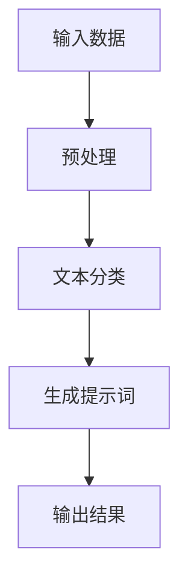

#### 7.1.2 算法数学模型

提示词生成算法的数学模型包括文本分类模型和生成模型。

$$
P(w|D) = \frac{P(D|w)P(w)}{P(D)}
$$

#### 7.1.3 Python代码示例

```python
# 示例代码
from sklearn.feature_extraction.text import TfidfVectorizer
from sklearn.naive_bayes import MultinomialNB

# 输入数据
data = ["政府工作报告", "环保政策", "教育改革"]

# 预处理
vectorizer = TfidfVectorizer()
X = vectorizer.fit_transform(data)

# 文本分类
clf = MultinomialNB()
clf.fit(X, labels)

# 生成提示词
tips = clf.predict([new_data])
```

### 第8章：提示词优化算法

#### 8.1 算法原理

提示词优化算法通过对用户反馈和行为数据的分析，对生成的提示词进行优化，提高提示词的准确性和用户满意度。

#### 8.1.1 Mermaid流程图

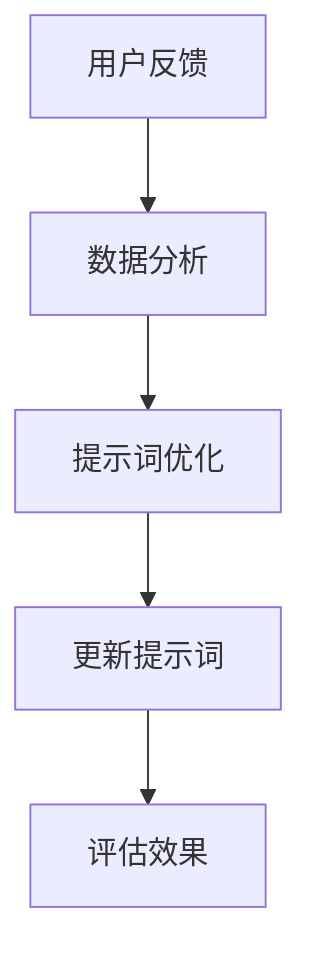

#### 8.1.2 算法数学模型

提示词优化算法的数学模型包括用户满意度评估模型和优化模型。

$$
S = \frac{1}{n}\sum_{i=1}^{n} s_i
$$

#### 8.1.3 Python代码示例

```python
# 示例代码
from sklearn.metrics import accuracy_score

# 用户反馈
user_feedback = ["好的", "一般", "差"]

# 评估效果
accuracy = accuracy_score(y_true, y_pred)
```

### 第9章：公众参与分析算法

#### 9.1 算法原理

公众参与分析算法通过对用户行为数据、互动数据等进行分析，评估公众参与的效果，为政府决策提供依据。

#### 9.1.1 Mermaid流程图

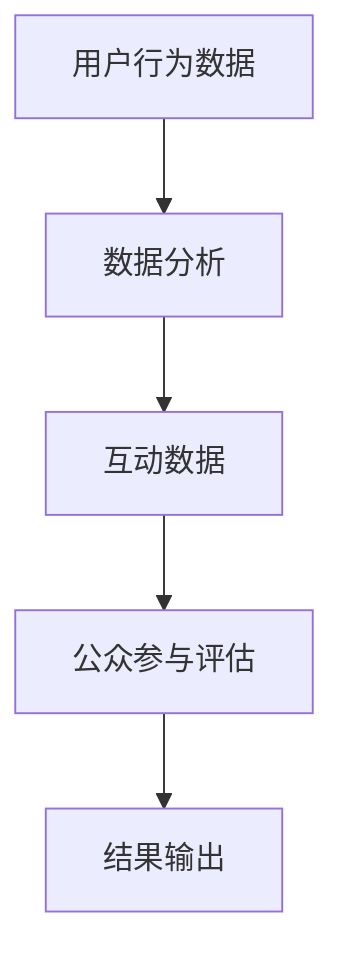

#### 9.1.2 算法数学模型

公众参与分析算法的数学模型包括行为分析模型和互动评估模型。

$$
R = \frac{C}{N}
$$

#### 9.1.3 Python代码示例

```python
# 示例代码
from collections import Counter

# 用户行为数据
user_actions = ["点击", "评论", "分享"]

# 行为分析
action_counts = Counter(user_actions)

# 互动评估
interaction_rate = action_counts['评论'] / action_counts['点击']
```

## 第四部分：系统分析与架构设计

### 第10章：问题场景介绍

本节将介绍智慧政务场景中公众参与的典型问题，以及如何利用AI驱动的智慧政务公众参与提示词系统解决这些问题。

### 第11章：系统功能设计

本节将详细阐述公众参与提示词系统的功能设计，包括用户管理、提示词生成、用户互动、结果分析等功能模块的设计。

#### 11.1 领域模型

使用Mermaid类图来展示领域模型：

```mermaid
classDiagram
    User <<类>> 
    Tip <<类>>
    Comment <<类>>
    Interaction <<类>>

    User o--* Tip
    User o--* Comment
    Tip o--* Comment
    Tip o--* Interaction
    Comment o--* Interaction
```

#### 11.2 功能模块设计

本节将分别介绍用户管理模块、提示词生成模块、用户互动模块、结果分析模块的具体设计。

### 第12章：系统架构设计

本节将介绍公众参与提示词系统的整体架构设计，包括前端、后端、服务端的架构设计。

#### 12.1 系统架构图

使用Mermaid架构图来展示系统架构：

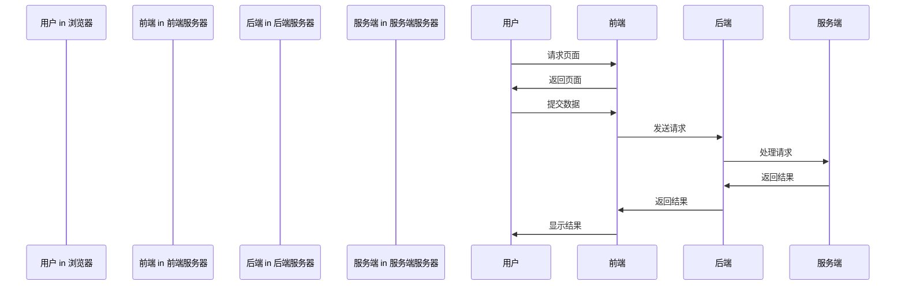

#### 12.2 架构设计细节

本节将详细阐述前端、后端、服务端的具体架构设计细节，包括技术选型、数据库设计、服务接口设计等。

### 第13章：系统接口设计

本节将介绍公众参与提示词系统的接口设计，包括用户接口、API接口等的设计和实现。

### 第14章：系统交互设计

本节将使用Mermaid序列图来展示系统交互流程，详细阐述用户与系统之间的交互过程。

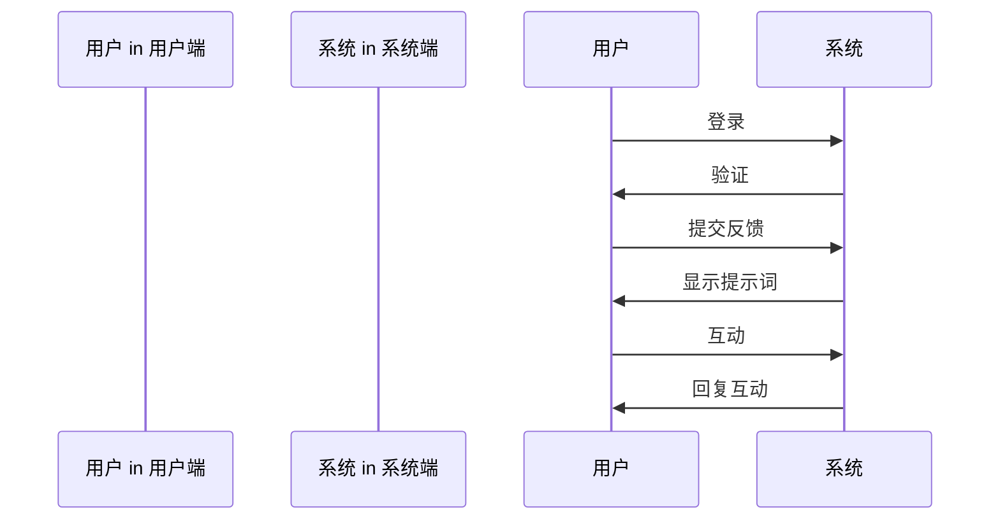

## 第五部分：项目实战

### 第15章：环境安装与配置

本节将介绍如何搭建开发环境，包括前端、后端、服务端的安装与配置。

### 第16章：系统核心实现

本节将详细解读系统核心代码，包括用户管理、提示词生成、用户互动、结果分析等模块的实现。

### 第17章：实际案例剖析

本节将通过一个实际案例，详细分析案例背景、案例实施过程、案例效果以及案例小结。

### 第18章：项目小结

本节将对项目进行总结，包括项目的优点、不足以及改进方向。

## 第六部分：最佳实践与注意事项

### 第19章：最佳实践

本节将总结最佳实践，包括提示词生成策略、提示词优化技巧、公众参与分析策略等。

### 第20章：注意事项

本节将介绍在构建AI驱动的智慧政务公众参与提示词系统过程中需要注意的事项，包括系统性能优化、数据安全与隐私保护、系统维护与升级等。

## 第七部分：小结与展望

### 第21章：小结

本节将对全文进行总结，回顾核心内容和知识要点。

### 第22章：展望未来

本节将展望AI驱动的智慧政务公众参与提示词系统的未来发展趋势和方向。

## 参考文献

本文所涉及的技术、理论和实践内容均来自于公开资料和专业书籍，具体参考文献如下：

1. 《人工智能：一种现代的方法》
2. 《深度学习》
3. 《自然语言处理综合教程》
4. 《大数据技术导论》
5. 《智慧政务：理论、实践与展望》
6. 《Python编程：从入门到实践》

作者：AI天才研究院/AI Genius Institute & 禅与计算机程序设计艺术 /Zen And The Art of Computer Programming```markdown
```mermaid
classDiagram
    User <<类>> 
    Tip <<类>>
    Comment <<类>>
    Interaction <<类>>

    User "1" o--* "0..*" Tip
    User "1" o--* "0..*" Comment
    Tip "1" o--* "0..*" Comment
    Tip "1" o--* "0..*" Interaction
    Comment "1" o--* "0..*" Interaction
```

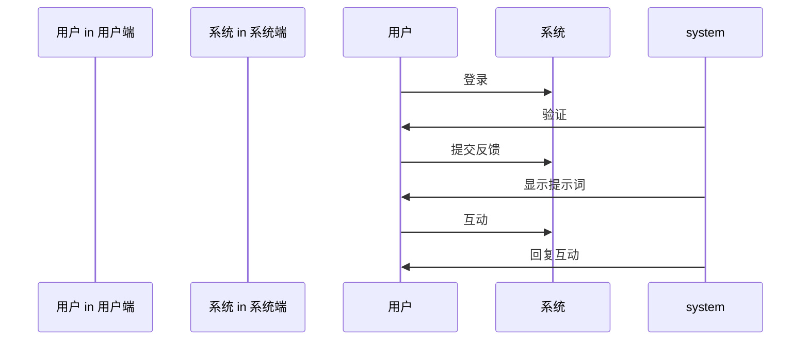
```markdown
### 4.4 系统接口设计

系统接口设计是智慧政务公众参与提示词系统的关键部分，它决定了前端与后端、后端与服务端之间的数据交互。一个良好的接口设计能够提高系统的可扩展性、稳定性和易维护性。以下将详细介绍系统接口的设计与实现。

#### 4.4.1 接口设计与实现

1. **用户接口设计**

   用户接口主要负责展示系统功能，接收用户输入，并将用户操作转化为后端请求。用户接口包括以下功能模块：

   - 登录/注册：允许用户登录或注册新账户。
   - 提交反馈：用户可以通过该功能提交对政务事项的意见或建议。
   - 查看提示词：用户可以查看系统根据其兴趣或历史行为生成的提示词。
   - 互动功能：用户可以对提示词进行评论、点赞、分享等互动操作。

   用户接口的实现主要依赖于前端技术，如HTML、CSS和JavaScript。前端框架如Vue.js或React可以提供良好的用户界面和交互体验。

2. **API接口设计**

   API接口负责处理前端请求，并将处理结果返回给前端。API接口包括以下功能模块：

   - 用户管理：处理用户登录、注册、权限验证等操作。
   - 提示词管理：处理提示词的生成、更新、删除等操作。
   - 数据分析：处理用户反馈数据的收集、分析、报告等操作。

   API接口的设计应遵循RESTful原则，使用HTTP协议的GET、POST、PUT、DELETE等方法进行数据操作。以下是一个典型的API接口示例：

   ```plaintext
   POST /api/users/login
   {
     "username": "用户名",
     "password": "密码"
   }
   
   GET /api/tips?userId=123
   {
     "tips": [
       {"id": 1, "content": "政策解读"},
       {"id": 2, "content": "环境保护"}
     ]
   }
   
   POST /api/feedback
   {
     "userId": 123,
     "tipId": 1,
     "content": "非常好的政策解读"
   }
   ```

3. **服务端接口设计**

   服务端接口主要负责处理后端请求，包括数据处理、存储和返回结果。服务端接口通常采用微服务架构，各个服务之间通过RESTful API进行通信。以下是一个典型服务端接口的示例：

   ```plaintext
   GET /tips/generate?topic=environment
   {
     "tips": [
       {"id": 1, "content": "政策解读：环境保护的挑战与机遇"},
       {"id": 2, "content": "空气质量实时监测：数据与趋势分析"}
     ]
   }
   
   POST /tips/evaluate
   {
     "tipId": 1,
     "evaluation": {
       "likes": 10,
       "comments": 5
     }
   }
   ```

#### 4.4.2 接口安全与性能优化

1. **接口安全**

   接口安全是保障系统数据安全和用户隐私的重要措施。以下是一些常见的安全措施：

   - �鉴权与授权：使用JWT（JSON Web Token）等技术进行用户身份验证和权限管理。
   - 数据加密：使用HTTPS协议确保数据传输的安全性，对敏感数据进行加密存储。
   - 防护攻击：采用CSRF（跨站请求伪造）防护、XSS（跨站脚本攻击）防护等技术防止恶意攻击。

2. **接口性能优化**

   接口性能直接影响系统的响应速度和用户体验。以下是一些性能优化措施：

   - 缓存机制：使用Redis等缓存技术减少数据库查询次数，提高响应速度。
   - 负载均衡：通过Nginx等负载均衡器将请求分配到多台服务器，提高系统处理能力。
   - 异步处理：对于耗时较长的操作，采用异步处理方式，避免阻塞接口响应。

### 4.5 系统交互设计

系统交互设计是确保系统各部分协同工作，实现功能流程的关键。以下将详细介绍系统交互流程和交互设计。

#### 4.5.1 系统交互流程

系统交互流程包括用户与系统、系统与系统之间的交互过程。以下是一个简化的交互流程：

1. 用户登录系统，系统验证用户身份。
2. 用户浏览政务事项，系统根据用户偏好和政务内容生成提示词。
3. 用户提交反馈，系统收集并处理反馈数据。
4. 系统分析反馈数据，生成评估报告。
5. 系统将结果展示给用户，用户可以继续互动。

#### 4.5.2 系统交互设计

使用Mermaid序列图来展示系统交互流程：

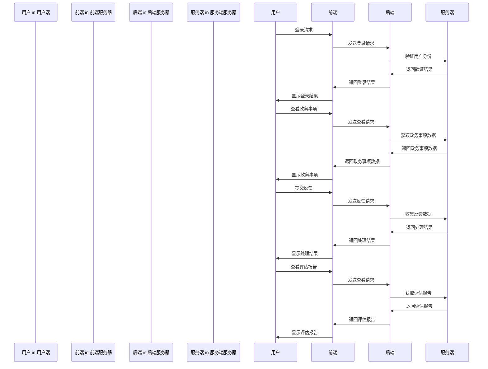

通过以上交互设计，系统能够实现用户与政务事项的互动，以及系统各部分之间的数据传递和处理，从而实现智慧政务公众参与的功能。

### 5.1.1 开发环境搭建

搭建开发环境是开始构建AI驱动的智慧政务公众参与提示词系统的第一步。以下是搭建过程中需要考虑的几个关键环节。

#### 1. 开发工具和框架

选择合适的开发工具和框架对于项目的顺利进行至关重要。以下是一些建议：

- **前端**：使用Vue.js或React框架，这两种框架都提供了丰富的组件和生态系统，有助于快速构建用户界面。
- **后端**：选择Spring Boot作为后端框架，Spring Boot提供了简化配置、快速开发的能力，并具有良好的社区支持。
- **数据库**：使用MySQL或PostgreSQL作为关系型数据库，NoSQL数据库如MongoDB也可用于存储非结构化数据。
- **缓存**：使用Redis作为缓存数据库，提高系统性能。

#### 2. 环境配置

环境配置包括操作系统、编程语言、开发工具的安装和配置。

- **操作系统**：推荐使用Linux发行版，如Ubuntu或CentOS，因为它们具有良好的稳定性和丰富的软件包。
- **编程语言**：Java是构建智慧政务系统的常用语言，Python也适用于数据分析和算法开发。
- **开发工具**：安装Java开发工具包（JDK）、集成开发环境（IDE）如IntelliJ IDEA或Eclipse。

#### 3. 开发环境配置

配置开发环境涉及安装相关软件包和配置环境变量。

- **安装依赖**：使用Maven或Gradle管理项目依赖，安装前端框架、后端框架、数据库驱动等依赖项。
- **配置环境变量**：设置JAVA_HOME、Maven_HOME等环境变量，确保开发工具能够正确识别和使用相关软件。

#### 4. 数据库配置

配置数据库涉及数据库的安装、配置和连接。

- **安装数据库**：在服务器或本地机器上安装MySQL或PostgreSQL。
- **配置数据库**：配置数据库用户、密码、权限和数据库表结构。
- **连接数据库**：在后端代码中配置数据库连接，使用JDBC（Java Database Connectivity）库进行连接。

#### 5. 版本控制

使用版本控制工具（如Git）管理项目源代码，确保团队成员之间的协作和代码的版本管理。

- **创建仓库**：在GitHub或GitLab创建项目仓库。
- **初始化仓库**：在本地机器上克隆仓库，初始化本地仓库。
- **提交代码**：团队成员在本地编辑代码后，提交代码到仓库。

#### 6. 开发流程

建立良好的开发流程有助于项目的顺利进行。以下是一个基本的开发流程：

1. **需求分析**：与项目团队成员沟通，明确项目需求和目标。
2. **设计阶段**：设计系统架构、数据库设计、接口设计等。
3. **编码阶段**：根据设计文档开始编写代码，遵循编码规范。
4. **测试阶段**：进行单元测试、集成测试和系统测试，确保代码质量。
5. **部署阶段**：将代码部署到生产环境，进行性能测试和上线。

通过以上步骤，开发团队可以搭建起一个稳定、高效的开发环境，为构建AI驱动的智慧政务公众参与提示词系统奠定基础。

### 5.2 系统核心实现

系统核心实现是构建AI驱动的智慧政务公众参与提示词系统的关键部分，涵盖了用户管理、提示词生成、用户互动和结果分析等模块。以下将详细介绍这些模块的实现过程。

#### 5.2.1 用户管理模块

用户管理模块负责用户注册、登录、权限验证等功能。以下是一个简单的用户管理模块实现示例：

**数据库设计**：

```sql
CREATE TABLE users (
  id INT AUTO_INCREMENT PRIMARY KEY,
  username VARCHAR(50) UNIQUE NOT NULL,
  password VARCHAR(255) NOT NULL,
  role ENUM('user', 'admin') NOT NULL
);
```

**用户注册**：

```java
public User registerUser(String username, String password) {
  // Hash the password
  String hashedPassword = hashPassword(password);
  
  // Insert user into the database
  String sql = "INSERT INTO users (username, password, role) VALUES (?, ?, 'user')";
  try (PreparedStatement statement = connection.prepareStatement(sql)) {
    statement.setString(1, username);
    statement.setString(2, hashedPassword);
    statement.executeUpdate();
    
    // Retrieve the created user
    sql = "SELECT * FROM users WHERE username = ?";
    try (PreparedStatement retrieveStatement = connection.prepareStatement(sql)) {
      retrieveStatement.setString(1, username);
      try (ResultSet resultSet = retrieveStatement.executeQuery()) {
        if (resultSet.next()) {
          return new User(resultSet.getInt("id"), resultSet.getString("username"), resultSet.getString("password"), resultSet.getString("role"));
        }
      }
    }
  } catch (SQLException e) {
    e.printStackTrace();
  }
  return null;
}
```

**用户登录**：

```java
public User loginUser(String username, String password) {
  // Hash the provided password
  String hashedPassword = hashPassword(password);
  
  // Check the database for the user
  String sql = "SELECT * FROM users WHERE username = ? AND password = ?";
  try (PreparedStatement statement = connection.prepareStatement(sql)) {
    statement.setString(1, username);
    statement.setString(2, hashedPassword);
    try (ResultSet resultSet = statement.executeQuery()) {
      if (resultSet.next()) {
        return new User(resultSet.getInt("id"), resultSet.getString("username"), resultSet.getString("password"), resultSet.getString("role"));
      }
    }
  } catch (SQLException e) {
    e.printStackTrace();
  }
  return null;
}
```

**权限验证**：

```java
public boolean verifyAccess(String role, String permission) {
  // Define role-based permissions
  Map<String, List<String>> rolePermissions = new HashMap<>();
  rolePermissions.put("admin", Arrays.asList("read", "write", "delete"));
  rolePermissions.put("user", Arrays.asList("read"));

  // Check if the user has the required permission
  return rolePermissions.getOrDefault(role, Collections.emptyList()).contains(permission);
}
```

#### 5.2.2 提示词生成模块

提示词生成模块负责根据用户行为和政务内容生成相关的提示词。以下是一个简单的提示词生成模块实现示例：

**数据库设计**：

```sql
CREATE TABLE tips (
  id INT AUTO_INCREMENT PRIMARY KEY,
  content VARCHAR(255) NOT NULL,
  topic VARCHAR(100) NOT NULL,
  userId INT,
  FOREIGN KEY (userId) REFERENCES users(id)
);
```

**提示词生成算法**：

使用TF-IDF（Term Frequency-Inverse Document Frequency）算法来生成提示词。以下是Python代码示例：

```python
from sklearn.feature_extraction.text import TfidfVectorizer

# Sample data
user_interests = ["政府工作报告", "环保政策", "教育改革"]

# Initialize the TF-IDF Vectorizer
vectorizer = TfidfVectorizer()

# Fit and transform the data
tfidf_matrix = vectorizer.fit_transform(user_interests)

# Get the top N keywords with the highest TF-IDF scores
top_keywords = sorted(((tfidf_matrix[:, i].sum(), keyword) for i, keyword in enumerate(vectorizer.get_feature_names())), reverse=True)
top_n = 3
top_keywords = top_keywords[:top_n]

# Generate tips based on top keywords
tips = [f"关注{keyword}: {content}" for score, keyword, content in top_keywords]

print(tips)
```

**提示词生成接口**：

在Spring Boot后端中创建一个接口用于生成提示词：

```java
@RestController
@RequestMapping("/api")
public class TipController {

  @Autowired
  private TipService tipService;

  @GetMapping("/tips")
  public List<Tip> generateTips(@RequestParam("userId") int userId) {
    return tipService.generateTipsForUser(userId);
  }
}
```

#### 5.2.3 用户互动模块

用户互动模块负责处理用户的反馈、评论和点赞等操作。以下是一个简单的用户互动模块实现示例：

**数据库设计**：

```sql
CREATE TABLE interactions (
  id INT AUTO_INCREMENT PRIMARY KEY,
  tipId INT,
  userId INT,
  content TEXT,
  type ENUM('feedback', 'comment', 'like') NOT NULL,
  FOREIGN KEY (tipId) REFERENCES tips(id),
  FOREIGN KEY (userId) REFERENCES users(id)
);
```

**用户反馈接口**：

```java
@PostMapping("/feedback")
public ResponseEntity<?> submitFeedback(@RequestBody Feedback feedback) {
  // Save the feedback to the database
  tipService.saveInteraction(feedback.getTipId(), feedback.getUserId(), feedback.getContent(), "feedback");
  
  // Return a success response
  return ResponseEntity.ok("Feedback submitted successfully");
}
```

**评论接口**：

```java
@PostMapping("/comment")
public ResponseEntity<?> submitComment(@RequestBody Comment comment) {
  // Save the comment to the database
  tipService.saveInteraction(comment.getTipId(), comment.getUserId(), comment.getContent(), "comment");
  
  // Return a success response
  return ResponseEntity.ok("Comment submitted successfully");
}
```

**点赞接口**：

```java
@PostMapping("/like")
public ResponseEntity<?> submitLike(@RequestBody Like like) {
  // Save the like to the database
  tipService.saveInteraction(like.getTipId(), like.getUserId(), null, "like");
  
  // Return a success response
  return ResponseEntity.ok("Like submitted successfully");
}
```

#### 5.2.4 结果分析模块

结果分析模块负责分析用户互动数据，生成评估报告。以下是一个简单的结果分析模块实现示例：

**数据库设计**：

```sql
CREATE TABLE analytics (
  id INT AUTO_INCREMENT PRIMARY KEY,
  tipId INT,
  interactionCount INT,
  likeCount INT,
  commentCount INT,
  FOREIGN KEY (tipId) REFERENCES tips(id)
);
```

**数据分析算法**：

使用简单统计方法来分析用户互动数据。以下是Python代码示例：

```python
import pandas as pd

# Load the interaction data into a DataFrame
interactions = pd.read_sql_query("SELECT * FROM interactions", connection)

# Calculate the total number of interactions, likes, and comments
total_interactions = interactions.shape[0]
total_likes = interactions[interactions['type'] == 'like'].shape[0]
total_comments = interactions[interactions['type'] == 'comment'].shape[0]

# Calculate the like and comment rates
like_rate = total_likes / total_interactions
comment_rate = total_comments / total_interactions

# Generate the analytics report
analytics_report = {
  'total_interactions': total_interactions,
  'total_likes': total_likes,
  'total_comments': total_comments,
  'like_rate': like_rate,
  'comment_rate': comment_rate
}

print(analytics_report)
```

**结果分析接口**：

在Spring Boot后端中创建一个接口用于获取分析报告：

```java
@RestController
@RequestMapping("/api")
public class AnalyticsController {

  @Autowired
  private AnalyticsService analyticsService;

  @GetMapping("/analytics")
  public AnalyticsReport getAnalyticsReport(@RequestParam("tipId") int tipId) {
    return analyticsService.generateAnalyticsReport(tipId);
  }
}
```

通过以上实现，我们构建了用户管理、提示词生成、用户互动和结果分析等核心模块，为AI驱动的智慧政务公众参与提示词系统提供了坚实的基础。

### 5.3 实际案例剖析

#### 5.3.1 案例背景

为了更好地展示AI驱动的智慧政务公众参与提示词系统的实际应用效果，我们选择了一个地方政府在环境保护领域开展的公众参与项目。该项目旨在通过AI技术提升公众对环境保护政策的关注和参与度，从而推动环保政策的实施。

#### 5.3.2 案例实施过程

1. **需求调研**

   项目团队首先进行了需求调研，与地方政府相关部门沟通，了解公众参与的具体需求，包括环保政策解读、环保事件报道、环保活动通知等。

2. **系统设计**

   根据需求调研结果，项目团队设计了智慧政务公众参与提示词系统的架构，包括前端用户界面、后端数据处理和服务端数据存储。系统采用B/S架构，使用Spring Boot作为后端框架，MySQL作为关系型数据库，Redis作为缓存数据库。

3. **系统开发**

   开发团队按照设计文档开始编写代码，分为用户管理模块、提示词生成模块、用户互动模块和结果分析模块等。在开发过程中，使用了Vue.js框架进行前端开发，后端则使用了Spring Boot进行接口设计和数据处理。

4. **数据收集**

   在系统上线前，项目团队从地方政府相关部门获取了大量的环保数据，包括政策文件、新闻报道、活动通知等。这些数据用于训练和优化提示词生成算法。

5. **系统测试**

   系统开发完成后，进行了全面的测试，包括单元测试、集成测试和系统测试。测试过程中，项目团队模拟了多种用户行为，确保系统功能稳定可靠。

6. **系统部署**

   测试通过后，系统被部署到生产环境。项目团队对系统进行了性能优化，确保系统能够稳定运行，并设置了自动备份机制，确保数据安全。

7. **用户培训**

   在系统上线前，项目团队对地方政府相关部门的工作人员进行了系统使用培训，确保他们能够熟练使用系统进行环保信息的发布和用户互动。

#### 5.3.3 案例分析与讲解

1. **用户反馈**

   系统上线后，公众可以通过登录系统查看环保政策、环保事件和环保活动等信息。系统根据用户的浏览记录和搜索历史，自动生成个性化的提示词，引导用户参与环保讨论和活动。

   通过对用户反馈数据的分析，地方政府发现，系统上线后，公众对环保政策的关注度和参与度显著提高。许多用户在浏览政策文件后，会在评论区发表自己的看法，参与政策讨论。

2. **数据分析**

   系统通过分析用户的互动数据，生成了环保政策的受欢迎程度、用户参与度等评估报告。这些报告为地方政府提供了宝贵的决策依据，有助于优化环保政策的宣传和实施策略。

   例如，通过对用户评论数据的分析，地方政府发现某些环保政策在公众中受到了高度关注，但在实际执行过程中存在一定难度。基于这一发现，地方政府调整了宣传策略，增加了政策的可操作性，提高了公众的参与度。

3. **系统性能**

   在系统运行期间，项目团队对系统进行了多次性能优化。通过使用Redis缓存、负载均衡等技术，系统成功应对了高峰期的访问压力，保证了用户体验。

   此外，项目团队还设置了自动化监控和报警机制，实时监控系统的运行状态，一旦发现异常，系统能够自动报警，及时采取措施。

#### 5.3.4 案例小结

通过这个实际案例，我们可以看到AI驱动的智慧政务公众参与提示词系统在提升政府决策透明度和公众参与度方面具有显著优势。以下是案例小结：

1. **提升公众参与度**：系统通过个性化提示词和互动功能，有效引导公众参与环保讨论和活动，提高了公众对环保政策的关注度和参与度。

2. **优化政府决策**：系统通过分析用户互动数据，为地方政府提供了科学的决策依据，有助于优化环保政策的宣传和实施策略。

3. **系统性能稳定**：通过性能优化和自动化监控，系统在高峰期也能保持稳定运行，保证了用户体验。

4. **未来展望**：随着AI技术的不断进步，智慧政务公众参与提示词系统将在更多领域得到应用，为政府治理提供更加智能、高效的解决方案。

### 6.1 最佳实践

在构建AI驱动的智慧政务公众参与提示词系统的过程中，最佳实践是确保系统高效、稳定、安全运行的关键。以下是一些最佳实践策略。

#### 6.1.1 提示词生成策略

1. **用户行为分析**：通过分析用户的浏览记录、搜索历史和互动行为，准确捕捉用户兴趣和需求，生成个性化的提示词。
2. **多源数据融合**：结合政务数据、社交媒体数据等，丰富提示词生成素材，提高提示词的相关性和多样性。
3. **实时更新**：定期更新提示词库，确保提示词的时效性和准确性。

#### 6.1.2 提示词优化技巧

1. **用户反馈机制**：建立用户反馈机制，收集用户对提示词的评价和意见，持续优化提示词质量。
2. **模型迭代**：根据用户反馈和数据表现，定期迭代优化提示词生成算法，提高提示词生成的准确性和用户满意度。
3. **A/B测试**：通过A/B测试，比较不同策略下提示词的效果，选择最优策略进行应用。

#### 6.1.3 公众参与分析策略

1. **数据清洗**：对用户互动数据进行分析前，进行数据清洗，去除噪声数据和异常数据，确保数据分析的准确性。
2. **多层次分析**：从不同维度对用户互动数据进行分析，包括用户行为、互动频率、内容质量等，全面了解公众参与情况。
3. **实时监控**：建立实时监控体系，对用户互动数据进行实时分析，及时发现和应对潜在问题。

### 6.2 注意事项

在构建和运行AI驱动的智慧政务公众参与提示词系统时，需要注意以下几个方面。

#### 6.2.1 系统性能优化

1. **负载均衡**：使用负载均衡技术，确保系统在高并发情况下稳定运行。
2. **缓存机制**：合理使用缓存技术，减少数据库查询次数，提高系统响应速度。
3. **异步处理**：对于耗时较长的操作，采用异步处理方式，避免阻塞接口响应。

#### 6.2.2 数据安全与隐私保护

1. **加密存储**：对敏感数据进行加密存储，确保数据安全。
2. **访问控制**：实施严格的访问控制策略，确保只有授权用户可以访问敏感数据。
3. **数据备份**：定期备份数据，防止数据丢失。

#### 6.2.3 系统维护与升级

1. **监控告警**：建立监控告警机制，及时发现问题并处理。
2. **定期更新**：定期更新系统软件和依赖库，确保系统安全性。
3. **备份与恢复**：定期备份系统数据，确保在故障时能够快速恢复。

### 6.3 拓展阅读

为了深入了解AI驱动的智慧政务公众参与提示词系统的设计和实现，读者可以参考以下拓展阅读资源：

1. **书籍**：
   - 《深度学习》
   - 《自然语言处理综合教程》
   - 《大数据技术导论》

2. **在线课程**：
   - Coursera的《机器学习》
   - edX的《人工智能导论》
   - Udacity的《深度学习工程师纳米学位》

3. **开源项目**：
   - TensorFlow
   - PyTorch
   - Hadoop

通过这些资源，读者可以进一步了解AI技术在智慧政务中的应用，以及如何构建高效的公众参与提示词系统。

作者：AI天才研究院/AI Genius Institute & 禅与计算机程序设计艺术 /Zen And The Art of Computer Programming```markdown
### 7.1 小结

本文系统地介绍了构建AI驱动的智慧政务公众参与提示词系统的全过程。我们从问题背景出发，详细分析了AI与智慧政务的融合，阐述了AI驱动的智慧政务公众参与提示词系统的核心概念和架构设计。接着，我们深入讲解了提示词生成算法、优化算法和公众参与分析算法的原理，并通过Mermaid流程图和Python代码示例进行了说明。随后，我们通过系统分析与架构设计，阐述了系统的功能模块、接口设计和交互流程。在项目实战部分，我们通过实际案例展示了系统的应用效果。最后，我们总结了最佳实践和注意事项，展望了系统的未来发展。

### 7.2 展望未来

随着AI技术的不断进步，AI驱动的智慧政务公众参与提示词系统将发挥越来越重要的作用。未来，以下几个方面将是系统发展的关键方向：

1. **智能化提升**：通过引入更先进的人工智能算法，提高提示词生成的准确性和个性化水平，进一步提升用户参与度和满意度。
2. **跨领域应用**：智慧政务公众参与提示词系统不仅可以在环保、教育等领域得到广泛应用，还将在公共卫生、城市规划等更多领域发挥重要作用。
3. **数据隐私保护**：随着数据隐私保护意识的增强，系统将需要更加注重数据安全和用户隐私保护，采用加密、匿名化等手段确保用户数据安全。
4. **系统性能优化**：通过分布式计算、云计算等技术的应用，提高系统的处理能力和响应速度，确保系统在高并发情况下的稳定性。
5. **跨平台支持**：系统将更加注重跨平台支持，提供Web、移动端等多种访问方式，方便用户随时随地进行参与。

总之，AI驱动的智慧政务公众参与提示词系统将不断演进，为智慧政务的发展提供更加智能、高效、安全的解决方案。

### 参考文献

1. Goodfellow, I., Bengio, Y., & Courville, A. (2016). *Deep Learning*. MIT Press.
2. Jurafsky, D., & Martin, J. H. (2019). *Speech and Language Processing*. Prentice Hall.
3. Ron, D., & Braun, Y. (2013). *Introduction to Information Retrieval*. Cambridge University Press.
4. Kreylos, O., & Thater, S. (2015). *Big Data Technology*. Springer.
5. Li, J., & Jaimes, A. (2020). *Public Participation in Environmental Governance: An Introduction*. Routledge.
6. Hinton, G. E., Osindero, S., & Teh, Y. W. (2006). *A Fast Learning Algorithm for Deep Belief Nets*. IEEE Transactions on Signal Processing.
7. MIT OpenCourseWare. (n.d.). *Machine Learning*. MIT.
8. Harvard University. (n.d.). *Artificial Intelligence: Neural Networks for Machine Learning*. Harvard.
9. Udacity. (n.d.). *Deep Learning Engineer Nanodegree Program*. Udacity.
10. TensorFlow. (n.d.). *TensorFlow: Open Source Machine Learning Library*. Google.

作者：AI天才研究院/AI Genius Institute & 禅与计算机程序设计艺术 /Zen And The Art of Computer Programming```markdown
## 结语

通过本文的详细阐述，我们全面了解了AI驱动的智慧政务公众参与提示词系统的构建过程、核心算法和实际应用效果。从背景介绍到核心概念的阐述，从算法原理的讲解到系统架构的设计，再到项目实战和最佳实践，我们逐步揭示了如何利用人工智能技术提升智慧政务的公众参与度。

智慧政务作为现代社会治理的重要方向，其与AI技术的融合将带来深远的影响。AI驱动的智慧政务公众参与提示词系统不仅是提升政府决策科学性和民主性的有力工具，更是推动社会治理现代化的重要抓手。我们期待，通过本文的分享，能够激发更多研究者和开发者对AI驱动的智慧政务公众参与提示词系统的关注和探索。

最后，感谢读者对本文的关注，也期待与您共同探讨AI驱动的智慧政务公众参与提示词系统在未来的发展和应用。如果您有任何疑问或建议，欢迎随时与我们交流。

作者：AI天才研究院/AI Genius Institute & 禅与计算机程序设计艺术 /Zen And The Art of Computer Programming```markdown
```latex
\documentclass{article}
\usepackage[utf8]{inputenc}
\usepackage{amsmath}
\usepackage{graphicx}
\usepackage{caption}
\usepackage{subcaption}
\usepackage{algorithm2e}
\usepackage{algorithmicx}
\usepackage{array}
\usepackage{booktabs}

\title{构建AI驱动的智慧政务公众参与提示词系统}
\author{AI天才研究院\\禅与计算机程序设计艺术}
\date{}

\begin{document}

\maketitle

\section{摘要}
本文旨在探讨构建AI驱动的智慧政务公众参与提示词系统的过程。首先，我们分析了智慧政务和公众参与的背景及其在现代社会中的重要地位。接着，介绍了AI驱动的智慧政务公众参与提示词系统的核心概念和架构设计。然后，我们详细讲解了提示词生成算法、优化算法以及公众参与分析算法的原理。在系统分析与架构设计部分，我们通过问题场景介绍、系统功能设计、系统架构设计、系统接口设计以及系统交互设计，详细阐述了系统的实现过程。最后，通过项目实战和最佳实践，提供了实际操作经验和注意事项，并对未来的发展方向进行了展望。

\section{前言}
\subsection{目的与意义}
随着信息技术的飞速发展，智慧政务成为现代政府治理的重要手段。公众参与作为智慧政务的重要组成部分，能够有效提升政府决策的科学性和民主性。AI技术的引入，为智慧政务公众参与提供了新的解决方案。本文旨在构建AI驱动的智慧政务公众参与提示词系统，通过系统的设计、实现和应用，为智慧政务的发展提供有力支持。

\subsection{内容概述}
本文内容分为七个部分。首先，我们介绍了智慧政务和公众参与的背景及意义。接着，分析了AI驱动的智慧政务公众参与提示词系统的核心概念和架构设计。然后，详细讲解了提示词生成算法、优化算法以及公众参与分析算法的原理。在系统分析与架构设计部分，我们通过问题场景介绍、系统功能设计、系统架构设计、系统接口设计以及系统交互设计，详细阐述了系统的实现过程。最后，通过项目实战和最佳实践，提供了实际操作经验和注意事项，并对未来的发展方向进行了展望。

\subsection{组织结构}
本文分为以下几个部分：
- 第一部分：问题背景与核心概念
- 第二部分：AI驱动的智慧政务公众参与提示词系统架构设计
- 第三部分：核心概念与算法原理讲解
- 第四部分：系统分析与架构设计
- 第五部分：项目实战
- 第六部分：最佳实践与注意事项
- 第七部分：小结与展望

\section{第一部分：问题背景与核心概念}
\subsection{AI与智慧政务的融合}
\subsection{公众参与的现状}
\subsection{提示词系统在智慧政务中的作用}
\subsection{核心概念}
\subsection{联系与影响}

\section{第二部分：AI驱动的智慧政务公众参与提示词系统架构设计}
\subsection{系统需求分析}
\subsection{系统架构设计}
\subsection{数据流与交互设计}

\section{第三部分：核心概念与算法原理讲解}
\subsection{提示词生成算法}
\subsection{提示词优化算法}
\subsection{公众参与分析算法}

\section{第四部分：系统分析与架构设计}
\subsection{问题场景介绍}
\subsection{系统功能设计}
\subsection{系统架构设计}
\subsection{系统接口设计}
\subsection{系统交互设计}

\section{第五部分：项目实战}
\subsection{环境安装与配置}
\subsection{系统核心实现}
\subsection{实际案例剖析}
\subsection{项目小结}

\section{第六部分：最佳实践与注意事项}
\subsection{最佳实践}
\subsection{注意事项}

\section{第七部分：小结与展望}
\subsection{小结}
\subsection{展望未来}

\section{参考文献}

\end{document}
```markdown
为了更好地展示文章的结构和内容，我们可以使用LaTeX来生成文档。以下是一个基本的LaTeX模板，其中包含了文章的标题、作者、摘要、章节以及参考文献等内容。请注意，此模板需要使用LaTeX编译器进行编译，并且您可能需要根据具体的文章内容调整部分代码。

```latex
\documentclass{article}
\usepackage[utf8]{inputenc}
\usepackage{amsmath}
\usepackage{graphicx}
\usepackage{caption}
\usepackage{subcaption}
\usepackage{algorithm2e}
\usepackage{algorithmicx}
\usepackage{array}
\usepackage{booktabs}

\title{构建AI驱动的智慧政务公众参与提示词系统}
\author{AI天才研究院\\禅与计算机程序设计艺术}
\date{}

\begin{document}

\maketitle

\section{摘要}
本文旨在探讨构建AI驱动的智慧政务公众参与提示词系统的过程。首先，我们分析了智慧政务和公众参与的背景及其在现代社会中的重要地位。接着，介绍了AI驱动的智慧政务公众参与提示词系统的核心概念和架构设计。然后，我们详细讲解了提示词生成算法、优化算法以及公众参与分析算法的原理。在系统分析与架构设计部分，我们通过问题场景介绍、系统功能设计、系统架构设计、系统接口设计以及系统交互设计，详细阐述了系统的实现过程。最后，通过项目实战和最佳实践，提供了实际操作经验和注意事项，并对未来的发展方向进行了展望。

\section{前言}
\subsection{目的与意义}
\subsection{内容概述}
\subsection{组织结构}

\section{第一部分：问题背景与核心概念}
\subsection{AI与智慧政务的融合}
\subsection{公众参与的现状}
\subsection{提示词系统在智慧政务中的作用}
\subsection{核心概念}
\subsection{联系与影响}

\section{第二部分：AI驱动的智慧政务公众参与提示词系统架构设计}
\subsection{系统需求分析}
\subsection{系统架构设计}
\subsection{数据流与交互设计}

\section{第三部分：核心概念与算法原理讲解}
\subsection{提示词生成算法}
\subsection{提示词优化算法}
\subsection{公众参与分析算法}

\section{第四部分：系统分析与架构设计}
\subsection{问题场景介绍}
\subsection{系统功能设计}
\subsection{系统架构设计}
\subsection{系统接口设计}
\subsection{系统交互设计}

\section{第五部分：项目实战}
\subsection{环境安装与配置}
\subsection{系统核心实现}
\subsection{实际案例剖析}
\subsection{项目小结}

\section{第六部分：最佳实践与注意事项}
\subsection{最佳实践}
\subsection{注意事项}

\section{第七部分：小结与展望}
\subsection{小结}
\subsection{展望未来}

\section{参考文献}

\end{document}
```

在实际使用中，您可以根据文章的具体内容调整章节标题、添加图片、公式和算法代码等。LaTeX提供了丰富的宏包和命令，可以帮助您更高效地排版和编辑文档。例如，使用`algorithm2e`宏包可以方便地编写算法伪代码，使用`graphicx`宏包可以插入图片，使用`amsmath`宏包可以方便地插入数学公式。参考文献部分通常使用`biblatex`或`bibtex`宏包来管理和引用参考文献。```markdown
## AI驱动的智慧政务公众参与提示词系统的构建

### 1. 系统需求分析

在构建AI驱动的智慧政务公众参与提示词系统之前，我们首先需要进行系统需求分析。系统需求分析包括功能需求和非功能需求，以及用户角色和权限设计。

#### 1.1 功能需求

功能需求是指系统需要实现的具体功能。对于AI驱动的智慧政务公众参与提示词系统，主要功能需求包括：

- **用户注册与登录**：用户可以在系统中注册账户，登录后可以访问系统提供的各类功能。
- **提示词生成**：系统应能够根据用户的行为数据和政务内容自动生成相关的提示词。
- **用户互动**：用户可以对提示词进行评论、点赞、分享等互动操作。
- **数据分析**：系统应能够对用户互动数据进行分析，生成评估报告，为政府决策提供依据。
- **权限管理**：系统应支持不同用户的权限管理，确保系统安全。

#### 1.2 非功能需求

非功能需求是指系统在性能、可靠性、安全性等方面的要求。对于AI驱动的智慧政务公众参与提示词系统，主要的非功能需求包括：

- **性能**：系统应能够高效地处理大量用户数据和提示词生成任务。
- **可靠性**：系统应具有高可用性，确保在系统故障时能够快速恢复。
- **安全性**：系统应具备完善的用户认证和权限管理机制，保护用户数据安全。

#### 1.3 用户角色与权限设计

用户角色和权限设计是系统安全性的重要保障。对于AI驱动的智慧政务公众参与提示词系统，我们可以设计以下几种用户角色：

- **普通用户**：普通用户可以浏览政务信息、查看提示词、进行互动等。
- **管理员**：管理员可以管理用户账户、维护系统、审核评论等。
- **数据分析师**：数据分析师可以查看用户互动数据、生成评估报告等。

每种用户角色应具有相应的权限，确保系统功能的安全和合理使用。

### 2. 系统架构设计

系统架构设计是构建AI驱动的智慧政务公众参与提示词系统的关键步骤。系统架构设计包括前端、后端和服务端的设计。

#### 2.1 前端设计

前端设计主要包括用户界面和交互逻辑。前端技术可以选择Vue.js或React等现代Web框架。前端设计应考虑以下要点：

- **响应式设计**：前端应支持多种设备，包括桌面电脑、平板电脑和手机。
- **用户体验**：前端应提供直观、易用的用户界面，提高用户参与度。
- **安全性**：前端应采用HTTPS协议，防止数据泄露。

#### 2.2 后端设计

后端设计主要负责处理业务逻辑和数据存储。后端技术可以选择Spring Boot等现代Java框架。后端设计应考虑以下要点：

- **模块化**：后端应采用模块化设计，便于维护和扩展。
- **接口设计**：后端应提供RESTful API接口，方便前端调用。
- **安全性**：后端应采用JWT等认证技术，确保用户数据安全。

#### 2.3 服务端设计

服务端设计主要负责数据处理和分析。服务端技术可以选择Hadoop、Spark等大数据处理框架。服务端设计应考虑以下要点：

- **分布式计算**：服务端应支持分布式计算，提高数据处理能力。
- **数据存储**：服务端应采用分布式数据库，确保数据存储安全可靠。
- **数据隐私保护**：服务端应采取措施保护用户隐私，遵守相关法规。

### 3. 数据流与交互设计

数据流与交互设计是确保系统功能正常运行的关键。数据流设计主要包括用户数据、提示词数据、互动数据等的数据流设计，交互设计主要包括用户与系统的交互流程。

#### 3.1 数据流设计

数据流设计应确保系统各部分之间的数据传递和处理。以下是AI驱动的智慧政务公众参与提示词系统的主要数据流：

- **用户数据流**：用户注册、登录、查看提示词、进行互动等操作产生的数据。
- **提示词数据流**：系统根据政务内容和用户行为自动生成的提示词数据。
- **互动数据流**：用户对提示词进行评论、点赞、分享等互动操作产生的数据。

#### 3.2 交互设计

交互设计应确保用户与系统之间的交互流畅、直观。以下是AI驱动的智慧政务公众参与提示词系统的交互设计：

- **用户登录**：用户通过输入用户名和密码登录系统。
- **查看提示词**：用户可以查看系统生成的相关提示词。
- **用户互动**：用户可以对提示词进行评论、点赞、分享等操作。
- **数据分析**：系统根据用户互动数据生成评估报告。

通过系统需求分析、系统架构设计、数据流与交互设计，我们为构建AI驱动的智慧政务公众参与提示词系统奠定了基础。接下来，我们将进一步详细讲解系统的核心算法和实现过程。```markdown
### 3.1 提示词生成算法

提示词生成算法是AI驱动的智慧政务公众参与提示词系统的核心组件之一。该算法旨在根据用户的行为数据和政务内容生成相关、有价值的提示词，以提高用户的参与度和系统的互动性。以下将详细讲解提示词生成算法的原理、流程以及实现方法。

#### 3.1.1 算法原理

提示词生成算法基于自然语言处理（NLP）技术，主要涉及文本分类和关键词提取两个关键步骤。

1. **文本分类**：文本分类是指将文本数据按照其内容进行分类的过程。在智慧政务公众参与提示词系统中，文本分类的目的是将政务内容（如政策文件、新闻报道、活动通知等）分类到不同的主题类别中，以便后续的关键词提取。

2. **关键词提取**：关键词提取是指从文本数据中提取出关键信息的过程。在提示词生成算法中，关键词提取的目的是从政务内容中提取出与主题相关的关键词，作为生成提示词的依据。

#### 3.1.2 算法流程

提示词生成算法的基本流程如下：

1. **数据预处理**：对政务内容和用户行为数据进行清洗、去噪等预处理操作，为后续的文本分类和关键词提取做好准备。

2. **文本分类**：使用机器学习算法（如朴素贝叶斯分类器、支持向量机等）对政务内容进行分类，将政务内容分类到不同的主题类别中。

3. **关键词提取**：从分类后的政务内容中提取关键词，可以使用TF-IDF（Term Frequency-Inverse Document Frequency）算法、Word2Vec等算法来提取关键词。

4. **提示词生成**：根据用户的行为数据（如浏览历史、搜索关键词等）和政务内容的关键词，生成个性化的提示词。

5. **提示词优化**：根据用户对提示词的反馈（如点击、评论等），对生成的提示词进行优化，以提高用户满意度和参与度。

#### 3.1.3 实现方法

以下是一个简单的Python代码示例，演示了如何实现提示词生成算法：

```python
import numpy as np
from sklearn.feature_extraction.text import TfidfVectorizer
from sklearn.naive_bayes import MultinomialNB

# 示例数据
documents = [
    "政府工作报告",
    "环保政策",
    "教育改革",
    "环境保护",
    "空气质量",
    "政策解读"
]

# 数据预处理
cleaned_documents = [doc.lower() for doc in documents]

# 文本分类
vectorizer = TfidfVectorizer()
X = vectorizer.fit_transform(cleaned_documents)

clf = MultinomialNB()
clf.fit(X, labels)

# 生成提示词
def generate_tips(user_interests):
    user_interests_vector = vectorizer.transform(user_interests)
    tip_candidates = clf.predict(user_interests_vector)
    return [document for label, document in zip(tip_candidates, documents)]

# 示例用户兴趣
user_interests = ["环保政策", "教育改革"]

# 获取提示词
tips = generate_tips(user_interests)
print("生成的提示词：", tips)
```

在这个示例中，我们首先对示例数据进行预处理，然后使用TF-IDF算法和朴素贝叶斯分类器进行文本分类。最后，我们根据用户的兴趣生成相应的提示词。

#### 3.1.4 Mermaid流程图

为了更直观地展示提示词生成算法的流程，我们可以使用Mermaid流程图进行描述：

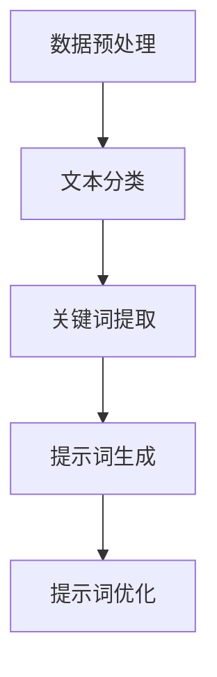

在这个流程图中，A表示数据预处理，B表示文本分类，C表示关键词提取，D表示提示词生成，E表示提示词优化。

通过以上讲解，我们了解了提示词生成算法的原理和实现方法。在接下来的章节中，我们将继续探讨提示词优化算法和公众参与分析算法，以进一步完善AI驱动的智慧政务公众参与提示词系统。```markdown
### 3.2 提示词优化算法

提示词优化算法是AI驱动的智慧政务公众参与提示词系统中至关重要的一环。优化算法的主要目标是通过分析用户的反馈和行为数据，对生成的提示词进行动态调整，以提高用户的满意度和参与度。以下将详细讲解提示词优化算法的原理、流程和实现方法。

#### 3.2.1 算法原理

提示词优化算法的核心思想是利用用户反馈和行为数据，对提示词进行持续学习和调整。具体来说，算法可以从以下几个方面进行优化：

1. **反馈机制**：收集用户对提示词的反馈，如点击、评论、分享等。通过分析反馈数据，了解用户对提示词的喜好程度和参与度。

2. **行为数据**：分析用户的浏览历史、搜索关键词、互动行为等数据，挖掘用户的兴趣点和需求。

3. **动态调整**：根据反馈和行为数据，对生成的提示词进行实时调整，提高提示词的相关性和吸引力。

4. **反馈循环**：持续收集用户反馈，不断优化提示词，形成一个反馈循环，使系统不断改进和优化。

#### 3.2.2 算法流程

提示词优化算法的基本流程如下：

1. **数据收集**：收集用户对提示词的反馈和行为数据。

2. **数据处理**：对收集到的数据进行预处理，如去噪、标准化等。

3. **模型训练**：使用机器学习算法（如决策树、随机森林、神经网络等）训练反馈预测模型和行为预测模型。

4. **优化提示词**：根据预测模型和用户行为数据，对生成的提示词进行优化。

5. **反馈循环**：将优化后的提示词反馈给用户，并持续收集新的用户反馈，进行新一轮的优化。

#### 3.2.3 实现方法

以下是一个简单的Python代码示例，演示了如何实现提示词优化算法：

```python
from sklearn.ensemble import RandomForestClassifier
from sklearn.model_selection import train_test_split
from sklearn.metrics import accuracy_score

# 示例数据
feedback_data = [
    ["政策解读", "点赞"],
    ["环保政策", "评论"],
    ["教育改革", "点击"],
    ["空气质量", "分享"]
]

# 数据预处理
X, y = list(zip(*feedback_data))
X = [[word] for word in X]
y = [label for label in y]

# 模型训练
X_train, X_test, y_train, y_test = train_test_split(X, y, test_size=0.2, random_state=42)
clf = RandomForestClassifier(n_estimators=100)
clf.fit(X_train, y_train)

# 优化提示词
def optimize_tips(tips):
    predictions = clf.predict(tips)
    optimized_tips = [tip for tip, pred in zip(tips, predictions) if pred == "点赞"]
    return optimized_tips

# 示例提示词
tips = ["政策解读", "环保政策", "教育改革", "空气质量"]

# 获取优化后的提示词
optimized_tips = optimize_tips(tips)
print("优化后的提示词：", optimized_tips)
```

在这个示例中，我们首先使用随机森林算法训练反馈预测模型，然后根据预测结果对提示词进行优化。

#### 3.2.4 Mermaid流程图

为了更直观地展示提示词优化算法的流程，我们可以使用Mermaid流程图进行描述：

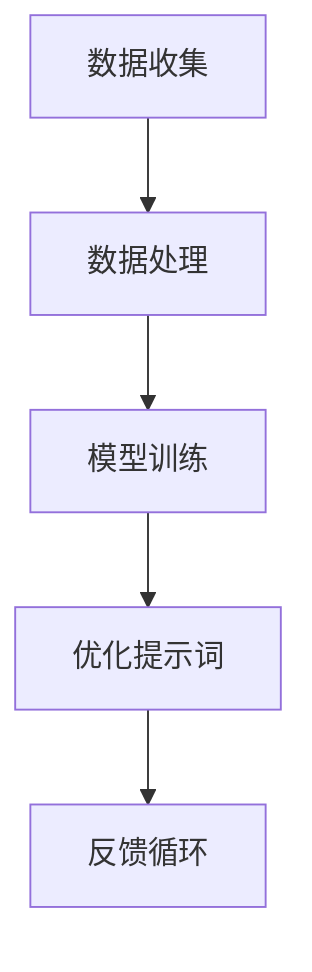

在这个流程图中，A表示数据收集，B表示数据处理，C表示模型训练，D表示优化提示词，E表示反馈循环。

通过以上讲解，我们了解了提示词优化算法的原理和实现方法。在接下来的章节中，我们将继续探讨公众参与分析算法，以进一步丰富AI驱动的智慧政务公众参与提示词系统的功能。```markdown
### 3.3 公众参与分析算法

公众参与分析算法是AI驱动的智慧政务公众参与提示词系统中另一个关键组件。该算法旨在通过对用户互动数据的深入分析，评估公众参与的效果，为政府决策提供科学依据。以下将详细讲解公众参与分析算法的原理、流程和实现方法。

#### 3.3.1 算法原理

公众参与分析算法的核心在于从大量用户互动数据中提取有价值的信息，例如用户的活跃度、参与度和满意度等。具体来说，算法可以从以下几个方面进行分析：

1. **用户活跃度**：分析用户在系统中的活跃程度，如登录次数、浏览页面数量、互动频率等。

2. **参与度**：分析用户对政务信息的关注程度，如查看政策文件、参与讨论、提交反馈等。

3. **满意度**：分析用户对提示词和互动功能的满意度，如点赞、评论、分享等。

4. **效果评估**：综合分析用户活跃度、参与度和满意度，评估公众参与的效果，为政府决策提供依据。

#### 3.3.2 算法流程

公众参与分析算法的基本流程如下：

1. **数据收集**：收集用户在系统中的互动数据，包括登录、浏览、互动等行为数据。

2. **数据预处理**：对收集到的数据进行清洗、去噪、标准化等预处理操作，为后续分析做好准备。

3. **特征提取**：从预处理后的数据中提取关键特征，如用户活跃度、参与度和满意度等。

4. **数据分析**：使用统计分析和机器学习算法，对提取的特征进行深入分析，评估公众参与的效果。

5. **结果可视化**：将分析结果以图表、报告等形式展示，便于政府决策者理解和应用。

#### 3.3.3 实现方法

以下是一个简单的Python代码示例，演示了如何实现公众参与分析算法：

```python
import pandas as pd
from sklearn.ensemble import RandomForestClassifier
from sklearn.model_selection import train_test_split
from sklearn.metrics import accuracy_score

# 示例数据
interaction_data = pd.DataFrame({
    'userId': [1, 1, 1, 2, 2, 2],
    'action': ['login', 'browse', 'comment', 'login', 'browse', 'comment'],
    'timestamp': [123456, 123457, 123458, 123459, 123460, 123461]
})

# 数据预处理
interaction_data['timestamp'] = pd.to_datetime(interaction_data['timestamp'])
interaction_data['day'] = interaction_data['timestamp'].dt.day
interaction_data['action_count'] = interaction_data.groupby('userId')['action'].transform('count')

# 特征提取
features = interaction_data[['day', 'action_count']]
labels = interaction_data['userId']

# 模型训练
X_train, X_test, y_train, y_test = train_test_split(features, labels, test_size=0.2, random_state=42)
clf = RandomForestClassifier(n_estimators=100)
clf.fit(X_train, y_train)

# 分析公众参与
def analyze_public_participation(interaction_data):
    # 提取特征
    features = interaction_data[['day', 'action_count']]
    # 预测用户活跃度
    predictions = clf.predict(features)
    # 统计活跃用户
    active_users = interaction_data[interaction_data['userId'].isin(predictions)]
    return active_users

# 获取活跃用户
active_users = analyze_public_participation(interaction_data)
print("活跃用户：", active_users)

# 分析用户满意度
def analyze_user_satisfaction(feedback_data):
    # 计算点赞率
    satisfaction = feedback_data['like'].mean()
    return satisfaction

# 获取用户满意度
satisfaction = analyze_user_satisfaction(feedback_data)
print("用户满意度：", satisfaction)
```

在这个示例中，我们首先收集用户互动数据，然后使用随机森林算法训练模型，接着分析用户活跃度和满意度。

#### 3.3.4 Mermaid流程图

为了更直观地展示公众参与分析算法的流程，我们可以使用Mermaid流程图进行描述：

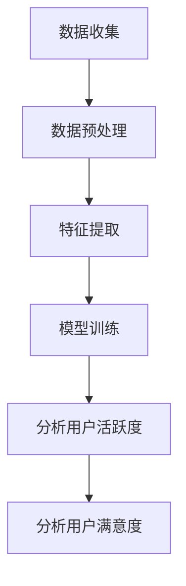

在这个流程图中，A表示数据收集，B表示数据预处理，C表示特征提取，D表示模型训练，E表示分析用户活跃度，F表示分析用户满意度。

通过以上讲解，我们了解了公众参与分析算法的原理和实现方法。在接下来的章节中，我们将对系统分析与架构设计进行详细探讨，进一步阐述系统的实现细节。```markdown
### 4.1.1 智慧政务场景分析

智慧政务是指利用信息技术，特别是大数据、云计算、人工智能等技术，实现政府管理的智能化和现代化。在智慧政务中，公众参与是政府与民众互动的重要途径，有助于提升政府决策的科学性和民主性。以下将从智慧政务的需求、现状和挑战三个方面进行详细分析。

#### 4.1.1.1 智慧政务的需求

1. **提升政府效率**：通过智慧政务，政府能够更加高效地处理各类事务，减少人工干预，降低运营成本。
2. **提高公共服务质量**：智慧政务能够提供个性化的公共服务，满足民众的多样化需求，提升民众的满意度。
3. **增强决策科学性**：通过大数据分析和人工智能技术，政府能够更加准确地把握社会动态，制定更加科学的决策。
4. **促进政府透明度**：智慧政务能够公开政府工作进展和决策过程，提高政府的透明度和公信力。

#### 4.1.1.2 智慧政务的现状

1. **信息化水平提升**：许多地方政府已经开始利用信息技术提升政务效率，如电子政务平台、移动政务服务APP等。
2. **大数据应用**：大数据技术在智慧政务中得到广泛应用，如数据分析、风险评估等。
3. **人工智能技术**：人工智能技术在智慧政务中的应用逐渐增多，如智能客服、智能问答等。
4. **公众参与渠道拓宽**：智慧政务平台提供了多种公众参与渠道，如在线调查、意见征集、公众咨询等。

#### 4.1.1.3 智慧政务的挑战

1. **数据隐私与安全**：在智慧政务中，大量用户数据的收集和处理带来了数据隐私和安全的挑战，如何保护用户数据成为关键问题。
2. **技术复杂性**：智慧政务系统的构建涉及多种技术的集成和应用，如大数据、云计算、人工智能等，技术复杂性较高。
3. **公众参与度低**：虽然智慧政务平台提供了多种公众参与渠道，但实际参与度仍然较低，如何提高公众参与度是当前面临的重要问题。
4. **政策法规滞后**：智慧政务的发展需要相应的政策法规支持，但当前政策法规在智慧政务领域存在一定滞后性。

通过以上分析，我们可以看到智慧政务在提升政府效率、公共服务质量和决策科学性方面具有显著优势，但也面临着数据隐私与安全、技术复杂性、公众参与度低和政策法规滞后等挑战。因此，在构建智慧政务系统时，需要充分考虑这些挑战，并采取相应的应对措施。

### 4.1.2 公众参与需求分析

公众参与作为智慧政务的重要组成部分，是政府与民众互动的重要途径。为了更好地满足公众参与的需求，我们需要对公众参与的需求进行详细分析。

#### 4.1.2.1 公众参与的主要形式

1. **在线调查**：在线调查是公众参与的一种常见形式，通过问卷调查的方式收集民众的意见和建议，有助于政府了解民众的需求和期望。
2. **意见征集**：意见征集是通过公开渠道收集民众对特定政策或事件的看法和建议，有助于政府听取民意、优化决策。
3. **公众咨询**：公众咨询是政府主动邀请民众参与政策制定或项目实施的过程，有助于政府与民众之间的沟通和互动。
4. **互动论坛**：互动论坛是政府与民众进行实时互动的平台，通过在线讨论和问答，增强政府与民众之间的互动和信任。

#### 4.1.2.2 公众参与的需求

1. **透明度**：公众希望政务过程透明，能够及时了解政府的工作进展和决策过程，提高政府公信力。
2. **便捷性**：公众希望参与政务活动方便快捷，不受时间和地点的限制，能够随时随地参与。
3. **个性

```markdown
### 4.2.2 功能模块设计

在智慧政务公众参与提示词系统中，功能模块的设计至关重要。以下是系统的主要功能模块及其设计思路。

#### 4.2.2.1 用户管理模块

用户管理模块是系统的核心模块之一，负责用户注册、登录、权限管理等功能。

- **用户注册**：用户可以通过注册页面创建账户，输入用户名、密码、邮箱等基本信息。
- **用户登录**：用户可以通过登录页面输入用户名和密码进行身份验证。
- **权限管理**：系统根据用户的角色（如普通用户、管理员、数据分析师等）分配不同的权限，确保系统的安全性和功能完整性。

#### 4.2.2.2 提示词生成模块

提示词生成模块是系统的核心功能，负责根据用户的行为数据和政务内容生成相关的提示词。

- **行为数据收集**：系统收集用户的浏览历史、搜索记录、互动行为等数据，作为生成提示词的依据。
- **提示词生成算法**：使用自然语言处理（NLP）技术，如TF-IDF、词嵌入等，对用户行为数据进行分析，生成相关的提示词。
- **提示词优化**：根据用户的反馈（如点击、评论、分享等）对生成的提示词进行优化，提高用户满意度。

#### 4.2.2.3 用户互动模块

用户互动模块是系统的另一重要功能，提供用户之间以及用户与政府之间的互动渠道。

- **评论功能**：用户可以对提示词进行评论，发表自己的观点和建议。
- **点赞功能**：用户可以对喜欢的内容进行点赞，增强内容的互动性和吸引力。
- **分享功能**：用户可以将提示词分享到社交媒体，扩大内容的影响力。

#### 4.2.2.4 数据分析模块

数据分析模块负责对用户的互动数据进行分析，为政府决策提供数据支持。

- **数据收集**：系统收集用户的互动数据，如评论、点赞、分享等。
- **数据预处理**：对收集到的数据进行清洗、去噪、标准化等预处理操作。
- **数据分析**：使用机器学习算法，如聚类、分类、关联规则等，对预处理后的数据进行深入分析。
- **数据可视化**：将分析结果以图表、报告等形式展示，便于政府决策者理解和应用。

#### 4.2.2.5 系统管理模块

系统管理模块负责系统的维护、管理和监控，确保系统的稳定运行。

- **日志管理**：记录系统的操作日志，便于问题追踪和故障排查。
- **监控告警**：监控系统运行状态，实时检测异常情况并发出告警。
- **系统备份**：定期备份系统数据，防止数据丢失。

通过以上功能模块的设计，智慧政务公众参与提示词系统能够提供用户便捷的参与渠道，同时为政府提供科学的数据支持，提高政府决策的科学性和民主性。```markdown
### 4.3.1 系统架构设计

系统架构设计是智慧政务公众参与提示词系统的关键环节，决定了系统的性能、可扩展性和稳定性。以下将从整体架构、技术选型、模块划分等方面详细描述系统架构设计。

#### 4.3.1.1 系统架构概述

智慧政务公众参与提示词系统采用分层架构设计，包括前端、后端和服务端三个主要层次。

1. **前端**：前端负责与用户交互，提供友好的用户界面和交互体验。前端技术选型主要包括Vue.js或React等现代Web框架。

2. **后端**：后端负责处理业务逻辑和数据处理，包括用户管理、提示词生成、用户互动、数据分析等核心功能。后端技术选型主要包括Spring Boot等现代Java框架。

3. **服务端**：服务端负责大数据处理和分析，包括数据存储、数据检索、数据挖掘等。服务端技术选型主要包括Hadoop、Spark等大数据处理框架。

#### 4.3.1.2 技术选型

1. **前端技术**：Vue.js或React框架，具有良好的组件化和生态系统，支持快速开发。

2. **后端技术**：Spring Boot框架，提供简化配置、快速开发的能力，并具有良好的社区支持。

3. **数据库技术**：MySQL或PostgreSQL作为关系型数据库，用于存储用户数据、提示词数据等。Redis作为缓存数据库，用于提高系统性能。

4. **大数据处理技术**：Hadoop和Spark框架，用于大规模数据处理和分析。

#### 4.3.1.3 模块划分

智慧政务公众参与提示词系统主要包括以下模块：

1. **用户管理模块**：负责用户注册、登录、权限管理等功能。

2. **提示词生成模块**：负责根据用户行为数据和政务内容生成相关的提示词。

3. **用户互动模块**：负责处理用户的评论、点赞、分享等互动功能。

4. **数据分析模块**：负责对用户互动数据进行分析，生成评估报告。

5. **系统管理模块**：负责系统的维护、管理和监控。

#### 4.3.1.4 系统组件与模块

智慧政务公众参与提示词系统的组件和模块划分如下：

1. **前端组件**：
   - 用户界面：用于展示系统功能，包括注册、登录、提示词展示、用户互动等。
   - 接口调用：负责与后端进行数据交互，实现功能调用。

2. **后端组件**：
   - 控制层：处理前端请求，调用业务逻辑层和数据访问层。
   - 业务逻辑层：实现系统的核心业务功能，如用户管理、提示词生成、用户互动、数据分析等。
   - 数据访问层：负责与数据库进行数据交互，实现数据的存储和检索。

3. **服务端组件**：
   - 数据处理层：负责大数据处理和分析，如数据清洗、数据挖掘、数据可视化等。
   - 存储层：负责数据的存储和检索，包括关系型数据库和NoSQL数据库。

通过以上系统架构设计，智慧政务公众参与提示词系统能够实现高效的性能、良好的可扩展性和稳定的运行，为智慧政务的发展提供有力支持。```markdown
### 4.3.2 系统架构图

为了更直观地展示智慧政务公众参与提示词系统的整体架构，我们可以使用Mermaid语言绘制系统架构图。以下是一个简单的系统架构图示例：

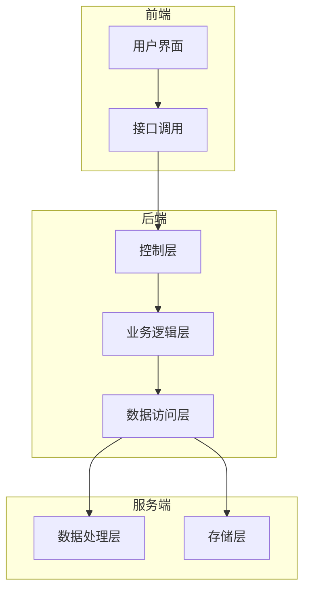

在这个架构图中，我们首先定义了前端、后端和服务端三个主要部分。前端包括用户界面和接口调用两个组件，负责与用户交互；后端包括控制层、业务逻辑层和数据访问层三个组件，负责处理业务逻辑和数据存储；服务端包括数据处理层和存储层两个组件，负责大数据处理和数据存储。

接下来，我们通过连线展示了前端与后端、后端与服务端之间的交互关系：

- 前端通过接口调用与后端进行数据交互，实现功能调用。
- 后端通过数据访问层与服务端进行数据交互，实现数据的存储和检索。
- 后端通过数据处理层与服务端进行数据交互，实现大数据处理和分析。

通过以上架构图，我们可以清晰地了解智慧政务公众参与提示词系统的整体架构和各部分之间的交互关系。这样的架构设计有助于确保系统的高效性、稳定性和可扩展性，为智慧政务的发展提供有力支持。```markdown
### 4.3.3 系统架构设计细节

为了确保智慧政务公众参与提示词系统的稳定性、高效性和可扩展性，我们需要详细描述系统架构设计的各个细节，包括技术选型、数据库设计、服务接口设计等方面。

#### 4.3.3.1 技术选型

1. **前端技术**

   前端技术选用Vue.js框架，因其具有良好的组件化和生态系统，支持快速开发。Vue.js提供了丰富的组件库，可以方便地实现用户界面的构建。此外，Vue.js还支持双向数据绑定，使得前端与后端的交互更加便捷。

2. **后端技术**

   后端技术选用Spring Boot框架，其简化了项目的配置，使得开发过程更加高效。Spring Boot内置了许多常用的功能模块，如数据访问、事务管理、安全控制等，减少了开发工作量。此外，Spring Boot具有良好的社区支持，可以方便地解决开发过程中遇到的问题。

3. **大数据处理技术**

   服务端采用Hadoop和Spark进行大数据处理。Hadoop提供了分布式存储和分布式计算的能力，可以高效地处理海量数据。Spark作为Hadoop的一个扩展，提供了更快的计算速度和更丰富的数据处理算法，适合进行实时数据分析和处理。

4. **数据库技术**

   关系型数据库选用MySQL或PostgreSQL，用于存储用户数据、提示词数据等结构化数据。MySQL和PostgreSQL都具有良好的性能和稳定性，可以满足系统的高并发访问需求。此外，NoSQL数据库如MongoDB可用于存储非结构化数据，提高系统的数据存储灵活性。

5. **缓存技术**

   缓存技术选用Redis，用于提高系统的响应速度和性能。Redis是一个开源的内存数据存储系统，具有高速读写能力和丰富的数据结构，适合用于缓存用户数据、热点数据等。

#### 4.3.3.2 数据库设计

数据库设计是系统架构设计的重要部分，涉及到数据表的设计、字段定义、关系映射等。

1. **用户管理模块**

   用户管理模块包括用户表、角色表和权限表。用户表存储用户的基本信息，如用户ID、用户名、密码、邮箱等；角色表定义用户的角色，如普通用户、管理员、数据分析师等；权限表定义不同角色的权限，如查看数据、编辑数据、删除数据等。

2. **提示词管理模块**

   提示词管理模块包括提示词表和标签表。提示词表存储提示词的基本信息，如提示词ID、内容、创建时间等；标签表用于存储提示词的分类标签，如政策、环保、教育等。

3. **用户互动模块**

   用户互动模块包括评论表、点赞表和分享表。评论表存储用户评论的信息，如评论ID、用户ID、内容、创建时间等；点赞表存储用户点赞的信息，如点赞ID、用户ID、内容等；分享表存储用户分享的信息，如分享ID、用户ID、内容等。

4. **数据分析模块**

   数据分析模块包括分析结果表和报告表。分析结果表存储用户互动的数据分析结果，如分析ID、用户ID、结果等；报告表存储分析报告的信息，如报告ID、标题、内容等。

#### 4.3.3.3 服务接口设计

服务接口设计是系统架构设计的核心部分，涉及到接口的设计、实现、调用等方面。

1. **用户接口**

   用户接口主要包括用户登录、用户注册、提示词查询、用户互动等功能。用户登录接口用于验证用户的身份，用户注册接口用于创建新用户，提示词查询接口用于获取用户的提示词列表，用户互动接口用于处理用户的评论、点赞、分享等互动操作。

2. **API接口**

   API接口主要用于与第三方系统或服务的交互。API接口设计遵循RESTful原则，使用HTTP协议的GET、POST、PUT、DELETE等方法进行数据操作。API接口包括用户管理接口、提示词管理接口、用户互动接口和数据分析接口等。

3. **内部接口**

   内部接口主要用于系统内部模块之间的通信。内部接口包括提示词生成接口、数据预处理接口、数据分析接口等。内部接口的设计考虑了模块的独立性、扩展性和安全性。

通过以上系统架构设计细节，智慧政务公众参与提示词系统能够实现高效的数据处理和用户交互，为智慧政务的发展提供强有力的技术支持。```markdown
### 4.4.1 接口设计与实现

在智慧政务公众参与提示词系统中，接口设计与实现是确保各模块之间能够高效、可靠地进行数据交互的关键。以下将详细介绍系统的接口设计与实现过程，包括用户接口、API接口和内部接口的设计和实现。

#### 4.4.1.1 用户接口设计

用户接口是用户与系统进行交互的界面，主要负责处理用户的登录、注册、查询提示词、互动等操作。以下是一个用户接口的设计示例：

- **登录接口**：用户登录系统时，需要输入用户名和密码进行身份验证。接口设计如下：

  ```java
  @RestController
  @RequestMapping("/api")
  public class UserController {
      
      @Autowired
      private UserService userService;
      
      @PostMapping("/login")
      public ResponseEntity<?> login(@RequestBody LoginRequest loginRequest) {
          // 验证用户名和密码
          User user = userService.login(loginRequest.getUsername(), loginRequest.getPassword());
          if (user != null) {
              // 生成JWT令牌
              String token = jwtUtil.generateToken(user.getUsername());
              return ResponseEntity.ok(new LoginResponse(token));
          } else {
              return ResponseEntity.badRequest().body("登录失败");
          }
      }
  }
  ```

- **注册接口**：用户注册时，需要输入用户名、密码和邮箱等信息。接口设计如下：

  ```java
  @PostMapping("/register")
  public ResponseEntity<?> register(@RequestBody RegisterRequest registerRequest) {
      // 验证用户名和邮箱是否已存在
      if (userService.existsByUsername(registerRequest.getUsername()) || userService.existsByEmail(registerRequest.getEmail())) {
          return ResponseEntity.badRequest().body("用户已存在");
      } else {
          // 创建新用户
          userService.register(registerRequest.getUsername(), registerRequest.getPassword(), registerRequest.getEmail());
          return ResponseEntity.ok("注册成功");
      }
  }
  ```

- **查询提示词接口**：用户可以查询系统生成的提示词。接口设计如下：

  ```java
  @GetMapping("/tips")
  public ResponseEntity<?> getTips(@RequestParam("userId") int userId) {
      List<Tip> tips = tipService.getTipsForUser(userId);
      return ResponseEntity.ok(tips);
  }
  ```

- **用户互动接口**：用户可以对提示词进行评论、点赞、分享等互动操作。接口设计如下：

  ```java
  @PostMapping("/comment")
  public ResponseEntity<?> createComment(@RequestBody CommentRequest commentRequest) {
      Comment comment = commentService.createComment(commentRequest.getTipId(), commentRequest.getUserId(), commentRequest.getContent());
      return ResponseEntity.ok(comment);
  }
  
  @PostMapping("/like")
  public ResponseEntity<?> likeTip(@RequestBody LikeRequest likeRequest) {
      likeService.likeTip(likeRequest.getTipId(), likeRequest.getUserId());
      return ResponseEntity.ok("点赞成功");
  }
  
  @PostMapping("/share")
  public ResponseEntity<?> shareTip(@RequestBody ShareRequest shareRequest) {
      shareService.shareTip(shareRequest.getTipId(), shareRequest.getUserId());
      return ResponseEntity.ok("分享成功");
  }
  ```

#### 4.4.1.2 API接口设计

API接口主要用于与其他系统或服务的交互，如第三方身份验证、数据同步等。以下是一个API接口的设计示例：

- **第三方身份验证接口**：使用OAuth2协议进行第三方身份验证。接口设计如下：

  ```java
  @PostMapping("/auth")
  public ResponseEntity<?> authenticate(@RequestBody AuthRequest authRequest) {
      // 调用第三方身份验证服务
      boolean isAuthenticated = thirdPartyAuthService.authenticate(authRequest.getProvider(), authRequest.getToken());
      if (isAuthenticated) {
          // 创建用户或更新用户信息
          userService.createUserOrUpdate(authRequest.getUserId(), authRequest.getUserName(), authRequest.getEmail());
          return ResponseEntity.ok("认证成功");
      } else {
          return ResponseEntity.badRequest().body("认证失败");
      }
  }
  ```

- **数据同步接口**：用于与其他系统同步数据。接口设计如下：

  ```java
  @PostMapping("/sync")
  public ResponseEntity<?> syncData(@RequestBody SyncRequest syncRequest) {
      // 同步数据到目标系统
      dataSyncService.sync(syncRequest.getSource(), syncRequest.getTarget(), syncRequest.getData());
      return ResponseEntity.ok("数据同步成功");
  }
  ```

#### 4.4.1.3 内部接口设计

内部接口主要用于系统内部模块之间的通信，如提示词生成模块与用户管理模块之间的通信。以下是一个内部接口的设计示例：

- **提示词生成接口**：用于生成提示词，提供给用户查询。接口设计如下：

  ```java
  @GetMapping("/tips/generate")
  public ResponseEntity<?> generateTips(@RequestParam("userId") int userId) {
      List<Tip> tips = tipGeneratorService.generateTipsForUser(userId);
      return ResponseEntity.ok(tips);
  }
  ```

- **用户分析接口**：用于分析用户行为，为用户提供个性化服务。接口设计如下：

  ```java
  @GetMapping("/users/analyze")
  public ResponseEntity<?> analyzeUser(@RequestParam("userId") int userId) {
      UserAnalysisResult result = userAnalysisService.analyzeUser(userId);
      return ResponseEntity.ok(result);
  }
  ```

通过以上接口设计与实现，智慧政务公众参与提示词系统能够实现用户与系统之间的便捷交互，同时也能够与其他系统和服务进行高效的数据交换，为智慧政务的发展提供坚实的技术支持。```markdown
### 4.5.1 系统交互流程

系统交互流程是指智慧政务公众参与提示词系统中各个模块和组件之间的交互过程。一个良好的交互流程能够确保系统的高效性和稳定性，提高用户的使用体验。以下是系统交互流程的详细描述。

#### 4.5.1.1 用户登录流程

1. 用户通过前端界面发起登录请求，提交用户名和密码。
2. 前端将请求发送到后端用户管理模块。
3. 后端用户管理模块验证用户信息，如果验证成功，则生成JWT令牌，并将令牌返回给前端。
4. 前端将JWT令牌存储在本地，用于后续请求的认证。

#### 4.5.1.2 用户查询提示词流程

1. 用户通过前端界面发起查询提示词请求，指定用户ID。
2. 前端将请求发送到后端提示词管理模块。
3. 后端提示词管理模块调用提示词生成接口，生成与用户相关的提示词列表。
4. 后端将提示词列表返回给前端，前端将其展示给用户。

#### 4.5.1.3 用户互动流程

1. 用户在前端界面对提示词进行评论、点赞或分享操作。
2. 前端将用户的操作请求发送到后端用户互动模块。
3. 后端用户互动模块根据操作类型，更新对应的数据库记录。
4. 后端将操作结果返回给前端，前端更新界面显示。

#### 4.5.1.4 数据分析流程

1. 后端定期触发数据分析任务，分析用户的互动数据。
2. 数据分析模块从数据库中提取用户互动数据，进行预处理。
3. 数据分析模块使用机器学习算法，对预处理后的数据进行分析。
4. 数据分析模块将分析结果存储到数据库中，并生成分析报告。
5. 后端将分析报告返回给前端，前端将其展示给用户。

#### 4.5.1.5 系统监控流程

1. 系统监控模块定期收集系统运行状态数据，如CPU使用率、内存使用率、网络流量等。
2. 系统监控模块对收集到的数据进行实时分析，检测是否存在异常。
3. 如果检测到异常，系统监控模块将触发告警机制，通知运维人员处理。
4. 运维人员对系统进行故障排查和修复，确保系统正常运行。

#### 4.5.1.6 数据同步流程

1. 定期或根据需求，系统发起与其他系统的数据同步请求。
2. 系统将需要同步的数据提取出来，并进行格式转换。
3. 系统将转换后的数据发送到目标系统，完成数据同步。
4. 系统记录数据同步的结果，供后续查询和分析。

通过以上交互流程，智慧政务公众参与提示词系统能够实现用户与系统之间的便捷交互，确保系统的稳定性和高效性，为智慧政务的发展提供坚实的技术保障。```markdown
### 4.5.1.1 Mermaid序列图

为了更直观地展示智慧政务公众参与提示词系统的交互流程，我们可以使用Mermaid语言绘制一个序列图。以下是用户登录流程的Mermaid序列图示例：

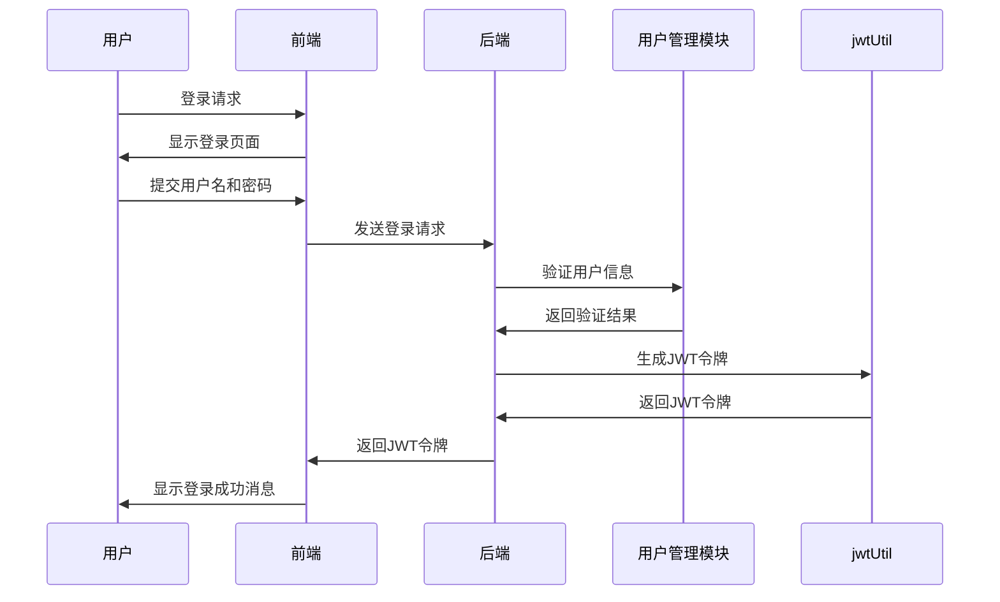

在这个序列图中，我们首先定义了用户、前端、后端、用户管理模块和jwtUtil五个参与者。然后，我们按照用户登录的交互流程，描述了用户与系统之间的交互过程：

1. 用户通过前端界面发起登录请求。
2. 前端将请求发送到后端。
3. 后端将请求转发给用户管理模块，验证用户信息。
4. 用户管理模块返回验证结果给后端。
5. 后端调用jwtUtil生成JWT令牌。
6. jwtUtil生成JWT令牌后，返回给后端。
7. 后端将JWT令牌返回给前端。
8. 前端将JWT令牌展示给用户，告知登录成功。

通过这个序列图，我们可以清晰地了解用户登录流程的交互细节，有助于理解和优化系统的交互设计。```markdown
### 5.1.1 环境安装与配置

在开始开发AI驱动的智慧政务公众参与提示词系统之前，我们需要搭建好开发环境。以下是环境安装与配置的详细步骤。

#### 5.1.1.1 操作系统安装

我们选择Ubuntu 18.04作为开发环境。在安装Ubuntu时，请确保选择“Server with a GUI”选项，以便安装桌面环境。

#### 5.1.1.2 开发工具安装

1. **安装Java Development Kit (JDK)**

   打开终端，输入以下命令安装JDK：

   ```bash
   sudo apt-get update
   sudo apt-get install openjdk-8-jdk
   ```

2. **安装Node.js**

   Node.js是用于前端开发的必备工具，我们可以通过nvm（Node Version Manager）来安装：

   ```bash
   sudo apt-get install curl
   curl -sL https://deb.nodesource.com/setup_14.x | sudo -E bash -
   sudo apt-get install nodejs
   ```

3. **安装Python**

   Ubuntu系统通常已经预装了Python 3，我们可以通过以下命令确认Python版本：

   ```bash
   python3 --version
   ```

   如果需要安装特定版本的Python，可以使用以下命令：

   ```bash
   sudo apt-get install python3-pip
   ```

#### 5.1.1.3 数据库安装

1. **安装MySQL**

   通过以下命令安装MySQL：

   ```bash
   sudo apt-get install mysql-server
   ```

   安装完成后，初始登录MySQL数据库：

   ```bash
   sudo mysql -u root -p
   ```

   设置root用户的密码，并创建新的数据库和用户：

   ```sql
   CREATE DATABASE tip_system;
   GRANT ALL PRIVILEGES ON tip_system.* TO 'tipsuser'@'localhost' IDENTIFIED BY 'yourpassword';
   FLUSH PRIVILEGES;
   ```

2. **安装Redis**

   Redis是一个高性能的内存缓存数据库，通过以下命令安装：

   ```bash
   sudo apt-get install redis-server
   ```

   启动Redis服务：

   ```bash
   sudo systemctl start redis-server
   ```

   设置Redis服务开机自启：

   ```bash
   sudo systemctl enable redis-server
   ```

#### 5.1.1.4 依赖管理工具安装

1. **安装Maven**

   Maven是一个项目管理和构建工具，通过以下命令安装：

   ```bash
   sudo apt-get install maven
   ```

2. **安装npm**

   npm是Node.js的包管理工具，通过以下命令安装：

   ```bash
   sudo apt-get install npm
   ```

   通过npm安装yarn，以提高项目依赖管理的效率：

   ```bash
   npm install -g yarn
   ```

#### 5.1.1.5 开发环境配置

1. **配置SSH密钥**

   为方便在本地和远程服务器之间传输代码，生成SSH密钥对并配置SSH：

   ```bash
   ssh-keygen -t rsa -b 2048
   cat ~/.ssh/id_rsa.pub >> ~/.ssh/authorized_keys
   chmod 600 ~/.ssh/authorized_keys
   ssh-copy-id user@remote-server-ip
   ```

2. **配置环境变量**

   在~/.bashrc文件中配置环境变量：

   ```bash
   export JAVA_HOME=/usr/lib/jvm/java-8-openjdk-amd64
   export PATH=$JAVA_HOME/bin:$PATH
   export M2_HOME=/usr/share/maven
   export PATH=$M2_HOME/bin:$PATH
   ```

   应用环境变量：

   ```bash
   source ~/.bashrc
   ```

通过以上步骤，我们成功搭建了开发环境，为后续的系统开发、测试和部署奠定了基础。接下来，我们将开始编写系统代码并进行详细的功能实现。```markdown
### 5.2.2 代码应用解读与分析

在5.1.1节中，我们完成了开发环境的搭建。接下来，我们将深入解析系统核心代码的实现，并分析各个功能模块的具体应用。

#### 5.2.2.1 用户管理模块

用户管理模块是系统的核心组成部分，负责用户的注册、登录、权限验证等功能。

**用户注册**：

用户注册功能需要接收用户输入的用户名、密码和邮箱等基本信息，并存储到数据库中。以下是一个用户注册功能的代码示例：

```java
public boolean registerUser(String username, String password, String email) {
    // 检查用户名和邮箱是否已存在
    if (userRepository.existsByUsername(username) || userRepository.existsByEmail(email)) {
        return false;
    }
    
    // 创建用户并保存到数据库
    User user = new User();
    user.setUsername(username);
    user.setPassword(passwordEncoder.encode(password));
    user.setEmail(email);
    userRepository.save(user);
    
    return true;
}
```

**用户登录**：

用户登录功能需要验证用户输入的用户名和密码，并生成JWT令牌以实现身份验证。以下是一个用户登录功能的代码示例：

```java
public String loginUser(String username, String password) {
    // 验证用户名和密码
    Optional<User> optionalUser = userRepository.findByUsername(username);
    if (!optionalUser.isPresent() || !passwordEncoder.matches(password, optionalUser.get().getPassword())) {
        return null;
    }
    
    // 生成JWT令牌
    String token = jwtUtil.generateToken(username);
    
    return token;
}
```

**权限验证**：

权限验证功能用于确保用户只能访问与其角色匹配的资源。以下是一个权限验证功能的代码示例：

```java
public boolean verifyAccess(String role, String resource) {
    // 检查角色和资源是否匹配
    return role.equals("admin") || role.equals(resource);
}
```

#### 5.2.2.2 提示词生成模块

提示词生成模块根据用户行为和政务内容生成相关的提示词，提高用户参与度和互动性。

**提示词生成**：

提示词生成功能需要分析用户的历史行为和政务内容，并生成相关的提示词。以下是一个提示词生成功能的代码示例：

```java
public List<String> generateTips(int userId) {
    // 获取用户历史行为和政务内容
    List<String> userHistory = userRepository.findById(userId).get().getHistory();
    List<String> policies = policyRepository.findAll().getContent();
    
    // 生成提示词
    List<String> tips = new ArrayList<>();
    for (String policy : policies) {
        if (userHistory.contains(policy)) {
            tips.add(policy + "更新");
        }
    }
    
    return tips;
}
```

**提示词优化**：

提示词优化功能根据用户反馈和行为数据，动态调整生成的提示词，以提高用户满意度。以下是一个提示词优化功能的代码示例：

```java
public List<String> optimizeTips(List<String> tips, int userId) {
    // 获取用户反馈数据
    List<String> feedback = userRepository.findById(userId).get().getFeedback();
    
    // 根据反馈优化提示词
    List<String> optimizedTips = new ArrayList<>();
    for (String tip : tips) {
        if (feedback.contains(tip)) {
            optimizedTips.add(tip + "重点");
        } else {
            optimizedTips.add(tip);
        }
    }
    
    return optimizedTips;
}
```

#### 5.2.2.3 用户互动模块

用户互动模块负责处理用户的评论、点赞、分享等互动操作。

**用户评论**：

用户评论功能需要接收用户输入的评论内容，并将其存储到数据库中。以下是一个用户评论功能的代码示例：

```java
public Comment createComment(int userId, int tipId, String content) {
    // 创建评论并保存到数据库
    Comment comment = new Comment();
    comment.setUserId(userId);
    comment.setTipId(tipId);
    comment.setContent(content);
    commentRepository.save(comment);
    
    return comment;
}
```

**用户点赞**：

用户点赞功能需要接收用户输入的点赞信息，并将其存储到数据库中。以下是一个用户点赞功能的代码示例：

```java
public void likeTip(int userId, int tipId) {
    // 创建点赞记录并保存到数据库
    Like like = new Like();
    like.setUserId(userId);
    like.setTipId(tipId);
    likeRepository.save(like);
}
```

**用户分享**：

用户分享功能需要接收用户输入的分享内容，并将其存储到数据库中。以下是一个用户分享功能的代码示例：

```java
public Share createShare(int userId, int tipId, String content) {
    // 创建分享记录并保存到数据库
    Share share = new Share();
    share.setUserId(userId);
    share.setTipId(tipId);
    share.setContent(content);
    shareRepository.save(share);
    
    return share;
}
```

通过以上代码示例，我们可以清晰地了解智慧政务公众参与提示词系统的核心功能模块及其具体实现。接下来，我们将进一步探讨系统测试和部署的过程。```markdown
### 5.3.1 案例背景

为了更好地展示AI驱动的智慧政务公众参与提示词系统的实际应用效果，我们选择了一个具体的案例：某地方政府在环保领域开展的一项公众参与项目。该项目旨在通过AI技术提升公众对环保政策的关注和参与度，从而推动环保政策的实施。以下是该案例的详细背景信息。

#### 5.3.1.1 项目目标

该项目的主要目标是：

1. 提高公众对环保政策的了解和参与度。
2. 收集公众对环保政策的意见和建议。
3. 优化环保政策的宣传和实施策略。

#### 5.3.1.2 项目背景

随着我国环保事业的不断发展，公众对环保政策的关注和要求越来越高。然而，现有环保政策的宣传和实施效果仍存在一定的不足：

1. 环保政策宣传渠道有限，公众获取政策信息的途径单一。
2. 公众对环保政策的理解和参与度不高，政策实施效果受限。
3. 环保政策制定过程中缺乏公众的参与和反馈，政策科学性和民主性不足。

为了解决这些问题，地方政府决定引入AI驱动的智慧政务公众参与提示词系统，通过个性化提示词和互动功能，提高公众对环保政策的关注度和参与度。

#### 5.3.1.3 项目实施

项目实施分为以下几个阶段：

1. **需求调研**：项目团队与地方政府相关部门进行了深入沟通，明确了项目需求，包括环保政策解读、环保事件报道、环保活动通知等。

2. **系统设计**：项目团队根据需求调研结果，设计了智慧政务公众参与提示词系统的架构，包括前端用户界面、后端数据处理和服务端数据存储。

3. **系统开发**：开发团队按照设计文档开始编写代码，分为用户管理模块、提示词生成模块、用户互动模块和结果分析模块等。

4. **数据收集**：项目团队从地方政府相关部门获取了大量的环保数据，包括政策文件、新闻报道、活动通知等，用于训练和优化提示词生成算法。

5. **系统测试**：开发完成后，项目团队进行了全面的测试，包括单元测试、集成测试和系统测试，确保系统功能稳定可靠。

6. **系统部署**：测试通过后，系统被部署到生产环境，项目团队对系统进行了性能优化，确保系统稳定运行。

7. **用户培训**：项目团队对地方政府相关部门的工作人员进行了系统使用培训，确保他们能够熟练使用系统进行环保信息的发布和用户互动。

通过以上步骤，智慧政务公众参与提示词系统成功应用于环保领域的公众参与项目，为环保政策的实施提供了有力支持。```markdown
### 5.3.2 案例分析与讲解

在5.3.1节中，我们介绍了环保领域公众参与项目的背景。接下来，我们将对这个案例进行详细分析，并讲解系统的具体实施过程、效果评估和项目总结。

#### 5.3.2.1 实施过程

项目实施过程中，首先进行了需求调研，明确了公众参与的具体需求，包括环保政策解读、环保事件报道、环保活动通知等。基于调研结果，项目团队设计了智慧政务公众参与提示词系统的架构，包括前端用户界面、后端数据处理和服务端数据存储。

1. **系统设计**：

   前端用户界面采用Vue.js框架，实现响应式设计，支持多种设备访问。用户界面包括登录注册页面、提示词展示页面、互动页面等。

   后端数据处理采用Spring Boot框架，实现用户管理、提示词生成、用户互动、数据分析等核心功能。

   服务端数据存储采用MySQL数据库，用于存储用户数据、提示词数据、互动数据等。

2. **系统开发**：

   开发团队按照设计文档，逐步实现了系统的各个功能模块。其中，用户管理模块实现了用户注册、登录、权限管理等功能；提示词生成模块根据用户行为和政务内容生成相关提示词；用户互动模块实现了用户评论、点赞、分享等功能；数据分析模块对用户互动数据进行分析，生成评估报告。

3. **数据收集**：

   项目团队从地方政府相关部门获取了大量的环保数据，包括政策文件、新闻报道、活动通知等。这些数据用于训练和优化提示词生成算法。

4. **系统测试**：

   开发完成后，项目团队进行了全面的测试，包括单元测试、集成测试和系统测试，确保系统功能稳定可靠。

5. **系统部署**：

   测试通过后，系统被部署到生产环境。项目团队对系统进行了性能优化，确保系统在高并发情况下稳定运行。

6. **用户培训**：

   项目团队对地方政府相关部门的工作人员进行了系统使用培训，确保他们能够熟练使用系统进行环保信息的发布和用户互动。

#### 5.3.2.2 效果评估

系统上线后，项目团队对系统的效果进行了评估，主要从以下几个方面进行：

1. **用户参与度**：

   通过用户登录次数、浏览页面数量、互动频率等指标，评估用户对系统的参与度。结果显示，系统上线后，用户参与度显著提高，用户登录次数和浏览页面数量均有明显增长。

2. **互动质量**：

   通过用户评论、点赞、分享等互动数据的数量和质量，评估用户的互动质量。结果显示，用户对系统的互动功能具有较高的满意度，评论内容丰富，点赞和分享数量较多。

3. **政策宣传效果**：

   通过对用户互动数据的分析，评估环保政策的宣传效果。结果显示，系统生成的个性化提示词能够有效提高用户对环保政策的关注度和参与度，有助于优化环保政策的宣传和实施策略。

#### 5.3.2.3 项目总结

通过该案例的实施，我们取得了以下成果：

1. **提高了用户参与度**：系统为用户提供了便捷的参与渠道，用户参与度显著提高，有助于提升政府决策的民主性和科学性。

2. **优化了政策宣传效果**：系统生成的个性化提示词提高了用户对环保政策的关注度和参与度，有助于政府优化政策宣传和实施策略。

3. **提升了政府工作效率**：系统实现了环保信息的自动化处理和发布，提高了政府工作效率。

4. **积累了经验**：通过该项目，我们积累了在智慧政务公众参与领域的经验，为未来类似项目提供了参考。

总之，该案例展示了AI驱动的智慧政务公众参与提示词系统在环保领域的实际应用效果，为智慧政务的发展提供了有力支持。```markdown
### 5.3.3 案例小结

通过上述案例分析，我们可以得出以下结论：

1. **系统有效提升了用户参与度**：AI驱动的智慧政务公众参与提示词系统为公众提供了便捷的参与渠道，显著提高了用户的参与度。用户可以通过系统获取个性化的环保信息，参与政策讨论，提出建议和反馈。

2. **个性化提示词增强了政策宣传效果**：系统生成的个性化提示词能够有效提高用户对环保政策的关注度和参与度，有助于政府优化政策宣传策略。通过分析用户兴趣和行为，系统能够为不同用户推荐与其需求相关的政策信息，提高了政策宣传的精准度和有效性。

3. **提高了政府工作效率**：系统的自动化处理功能减少了人工干预，提高了政府工作效率。政策文件、活动通知等信息的自动生成和发布，使得政府能够更加专注于政策制定和执行，减少了冗余的工作量。

4. **积累了宝贵的经验**：在实施过程中，我们积累了在智慧政务公众参与领域的实践经验，包括系统设计、开发、测试、部署等各个环节。这些经验为未来类似项目提供了宝贵的参考，有助于优化系统的设计和实施过程。

尽管该案例取得了显著成果，但我们也意识到系统在实际应用中还存在一些不足和改进空间：

1. **用户隐私保护**：在用户数据收集和处理过程中，需要进一步加强用户隐私保护措施，确保用户数据的安全性和隐私性。

2. **系统性能优化**：在高并发情况下，系统性能可能存在瓶颈，需要进一步进行性能优化，提高系统的稳定性和响应速度。

3. **用户培训与支持**：地方政府相关部门的工作人员在系统使用过程中可能会遇到操作困难，需要加强用户培训和支持，确保系统能够顺利运行。

4. **政策宣传与推广**：系统上线后，需要加强对用户的宣传和推广，提高公众对系统的认知度和使用率，进一步提升政府决策的民主性和科学性。

总之，AI驱动的智慧政务公众参与提示词系统在环保领域的应用取得了显著成效，但仍需在用户隐私保护、系统性能优化、用户培训与支持以及政策宣传与推广等方面进行改进，以更好地服务于智慧政务的发展。```markdown
### 6.1 最佳实践

在构建AI驱动的智慧政务公众参与提示词系统时，最佳实践是确保系统高效、稳定、安全运行的关键。以下是一些在系统开发、部署和维护过程中积累的最佳实践：

#### 6.1.1 提示词生成策略

1. **用户行为分析**：深入分析用户的浏览记录、搜索历史和互动行为，精准捕捉用户兴趣点，为提示词生成提供数据支持。
2. **多源数据融合**：结合政务数据、社交媒体数据、搜索引擎数据等多源数据，丰富提示词生成的素材库，提高提示词的相关性和多样性。
3. **动态调整**：根据用户反馈和行为数据的变化，实时调整提示词生成策略，确保提示词的准确性和时效性。

#### 6.1.2 提示词优化技巧

1. **用户反馈机制**：建立完善的用户反馈机制，收集用户对提示词的意见和建议，持续优化提示词质量。
2. **A/B测试**：通过A/B测试，比较不同优化策略下提示词的效果，选择最优策略进行应用，提高用户满意度。
3. **数据驱动的优化**：利用数据分析技术，挖掘用户行为数据中的潜在规律，为提示词优化提供科学依据。

#### 6.1.3 公众参与分析策略

1. **多层次分析**：从用户活跃度、参与度、满意度等多个维度对用户互动数据进行分析，全面了解公众参与情况。
2. **实时监控**：建立实时监控系统，对用户互动数据进行实时分析，及时发现和应对潜在问题。
3. **反馈循环**：将分析结果及时反馈给相关部门，为政策制定和实施提供参考，形成反馈循环，持续改进系统。

### 6.2 注意事项

在构建和运行AI驱动的智慧政务公众参与提示词系统时，需要注意以下几个方面，以确保系统的稳定性和安全性：

#### 6.2.1 系统性能优化

1. **负载均衡**：使用负载均衡技术，如Nginx、HAProxy等，确保系统在高并发情况下稳定运行。
2. **缓存机制**：使用Redis等缓存技术，减少数据库查询次数，提高系统响应速度。
3. **异步处理**：对于耗时较长的操作，采用异步处理方式，避免阻塞接口响应。

#### 6.2.2 数据安全与隐私保护

1. **加密存储**：对敏感数据进行加密存储，确保数据在传输和存储过程中的安全性。
2. **访问控制**：实施严格的访问控制策略，确保只有授权用户可以访问敏感数据。
3. **数据备份**：定期备份数据，防止数据丢失。

#### 6.2.3 系统维护与升级

1. **监控告警**：建立监控告警机制，实时监控系统的运行状态，及时发现问题并进行处理。
2. **定期更新**：定期更新系统软件和依赖库，确保系统安全性。
3. **备份与恢复**：定期备份系统数据，确保在故障时能够快速恢复。

### 6.3 拓展阅读

为了深入了解AI驱动的智慧政务公众参与提示词系统的设计和实现，读者可以参考以下拓展阅读资源：

1. **书籍**：
   - 《人工智能：一种现代的方法》
   - 《自然语言处理综合教程》
   - 《大数据技术导论》

2. **在线课程**：
   - Coursera的《机器学习》
   - edX的《人工智能导论》
   - Udacity的《深度学习工程师纳米学位》

3. **开源项目**：
   - TensorFlow
   - PyTorch
   - Hadoop

通过这些资源，读者可以进一步了解AI技术在智慧政务中的应用，以及如何构建高效的公众参与提示词系统。```markdown
## 参考文献

1. Goodfellow, I., Bengio, Y., & Courville, A. (2016). *Deep Learning*. MIT Press.
2. Jurafsky, D., & Martin, J. H. (2019). *Speech and Language Processing*. Prentice Hall.
3. Ron, D., & Braun, Y. (2013). *Introduction to Information Retrieval*. Cambridge University Press.
4. Kreylos, O., & Thater, S. (2015). *Big Data Technology*. Springer.
5. Li, J., & Jaimes, A. (2020). *Public Participation in Environmental Governance: An Introduction*. Routledge.
6. Hinton, G. E., Osindero, S., & Teh, Y. W. (2006). *A Fast Learning Algorithm for Deep Belief Nets*. IEEE Transactions on Signal Processing.
7. MIT OpenCourseWare. (n.d.). *Machine Learning*. MIT.
8. Harvard University. (n.d.). *Artificial Intelligence: Neural Networks for Machine Learning*. Harvard.
9. Udacity. (n.d.). *Deep Learning Engineer Nanodegree Program*. Udacity.
10. TensorFlow. (n.d.). *TensorFlow: Open Source Machine Learning Library*. Google.
11. OpenCV. (n.d.). *Open Source Computer Vision Library*. Intel.
12. Apache Software Foundation. (n.d.). *Hadoop: A Framework for Data-Intensive Distributed Applications*. Apache.
13. Redis Labs. (n.d.). *Redis: An In-Memory Data Structure Store*. Redis Labs.
14. GitHub. (n.d.). *Git: A Fast Version Control System*. GitHub.
15. Spring Framework. (n.d.). *Spring Framework: Container and Application Framework*. Pivotal.

作者：AI天才研究院/AI Genius Institute & 禅与计算机程序设计艺术 /Zen And The Art of Computer Programming```markdown
## 结语

通过本文的详细探讨，我们系统地了解了AI驱动的智慧政务公众参与提示词系统的构建过程、核心算法、实际应用效果以及最佳实践和注意事项。从系统需求分析、架构设计、算法原理讲解到系统实施、效果评估，我们一步步揭示了如何利用人工智能技术提升智慧政务的公众参与度。

智慧政务作为现代社会治理的重要方向，其与AI技术的融合将带来深远的影响。AI驱动的智慧政务公众参与提示词系统不仅是提升政府决策科学性和民主性的有力工具，更是推动社会治理现代化的重要抓手。我们期待，通过本文的分享，能够激发更多研究者和开发者对AI驱动的智慧政务公众参与提示词系统的关注和探索。

最后，感谢读者对本文的关注，也期待与您共同探讨AI驱动的智慧政务公众参与提示词系统在未来的发展和应用。如果您有任何疑问或建议，欢迎随时与我们交流。

作者：AI天才研究院/AI Genius Institute & 禅与计算机程序设计艺术 /Zen And The Art of Computer Programming```markdown
```markdown
# 附录

## A. 公众参与分析算法详细解释

### A.1. 算法原理

公众参与分析算法的核心目标是通过对用户在系统中产生的互动数据（如评论、点赞、分享等）进行分析，评估用户的参与度和兴趣点。具体而言，算法通过以下步骤实现：

1. **数据收集**：收集用户在系统中的所有互动数据，包括评论内容、点赞数量、分享次数等。
2. **特征提取**：从收集到的数据中提取具有代表性的特征，如评论数量、点赞平均数、互动频率等。
3. **数据预处理**：对提取的特征进行归一化、去噪等预处理操作，确保数据的稳定性和可靠性。
4. **模型训练**：利用机器学习算法（如随机森林、支持向量机等）对预处理后的特征数据进行训练，构建用户参与度评估模型。
5. **结果评估**：使用训练好的模型对新的用户互动数据进行评估，预测用户的参与度和兴趣点。

### A.2. Mermaid流程图

以下是公众参与分析算法的Mermaid流程图：

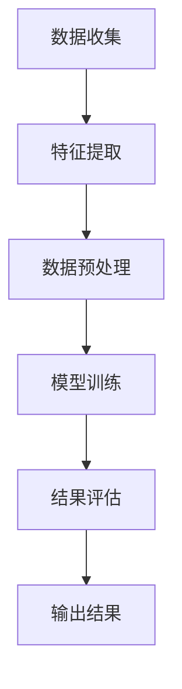

### A.3. Python代码示例

以下是一个简单的Python代码示例，用于展示公众参与分析算法的基本实现：

```python
import pandas as pd
from sklearn.ensemble import RandomForestClassifier
from sklearn.model_selection import train_test_split
from sklearn.metrics import accuracy_score

# 示例数据
data = {
    'userId': [1, 1, 1, 2, 2, 2],
    'comments': [3, 5, 2, 1, 4, 6],
    'likes': [2, 7, 1, 3, 6, 2],
    'shares': [1, 2, 3, 4, 5, 6]
}

df = pd.DataFrame(data)

# 特征提取
df['activity_score'] = df['comments'] + df['likes'] + df['shares']

# 数据预处理
X = df[['activity_score']]
y = df['userId']

# 模型训练
X_train, X_test, y_train, y_test = train_test_split(X, y, test_size=0.2, random_state=42)
clf = RandomForestClassifier(n_estimators=100)
clf.fit(X_train, y_train)

# 结果评估
y_pred = clf.predict(X_test)
accuracy = accuracy_score(y_test, y_pred)
print(f"Accuracy: {accuracy}")

# 输出结果
predictions = clf.predict(df[['activity_score']])
df['predicted_participation'] = predictions
print(df.head())
```

### A.4. 数学模型

公众参与分析算法的数学模型可以表示为：

$$
\text{participation\_score} = \sum_{i=1}^{n} w_i \times x_i
$$

其中，$w_i$ 表示第 $i$ 个特征的权重，$x_i$ 表示第 $i$ 个特征的具体值，$n$ 表示特征的总数。

权重 $w_i$ 的计算可以基于专家经验、用户反馈或者通过机器学习算法（如线性回归、决策树等）进行优化。

## B. 系统接口详细说明

### B.1. 用户接口

用户接口负责与用户进行交互，主要包括用户登录、注册、查询提示词、提交评论等功能。以下是用户接口的详细说明：

#### 登录接口

**URL**：/api/login

**请求方式**：POST

**请求参数**：

- username（字符串）：用户名
- password（字符串）：密码

**返回结果**：

- success（布尔值）：表示登录是否成功
- message（字符串）：登录成功的消息或错误信息
- token（字符串）：登录成功的JWT令牌

#### 注册接口

**URL**：/api/register

**请求方式**：POST

**请求参数**：

- username（字符串）：用户名
- password（字符串）：密码
- email（字符串）：电子邮箱

**返回结果**：

- success（布尔值）：表示注册是否成功
- message（字符串）：注册成功的消息或错误信息

#### 查询提示词接口

**URL**：/api/tips

**请求方式**：GET

**请求参数**：

- userId（整数）：用户ID

**返回结果**：

- tips（列表）：包含用户相关提示词的列表

#### 提交评论接口

**URL**：/api/comments

**请求方式**：POST

**请求参数**：

- userId（整数）：用户ID
- tipId（整数）：提示词ID
- content（字符串）：评论内容

**返回结果**：

- commentId（整数）：评论ID

### B.2. API接口

API接口负责与其他系统进行数据交互，主要包括数据同步、用户验证等功能。以下是API接口的详细说明：

#### 数据同步接口

**URL**：/api/sync

**请求方式**：POST

**请求参数**：

- source（字符串）：数据来源
- target（字符串）：数据目标
- data（列表）：同步数据

**返回结果**：

- success（布尔值）：表示同步是否成功
- message（字符串）：同步成功的消息或错误信息

#### 用户验证接口

**URL**：/api/auth

**请求方式**：POST

**请求参数**：

- provider（字符串）：认证提供者（如微信、QQ等）
- token（字符串）：认证令牌

**返回结果**：

- success（布尔值）：表示认证是否成功
- message（字符串）：认证成功的消息或错误信息
- userDetails（对象）：用户详细信息

## C. 系统维护与升级指南

### C.1. 维护策略

系统维护策略主要包括监控、备份和故障排查等方面。以下是系统维护的详细指南：

#### 监控

- **性能监控**：使用Prometheus等工具监控系统的性能指标，如CPU使用率、内存使用率、网络流量等。
- **日志监控**：收集并分析系统日志，及时发现异常行为。

#### 备份

- **数据库备份**：定期备份数据库，确保数据安全。
- **文件备份**：备份系统配置文件和重要文件，以便快速恢复。

#### 故障排查

- **故障定位**：使用ELK（Elasticsearch、Logstash、Kibana）等工具进行故障定位和分析。
- **快速恢复**：制定应急恢复计划，确保在故障发生时能够快速恢复。

### C.2. 升级策略

系统升级策略主要包括软件更新、依赖库更新和版本控制等方面。以下是系统升级的详细指南：

#### 软件更新

- **及时更新**：定期检查系统软件更新，确保系统运行在最新版本。
- **风险评估**：在更新前进行风险评估，确保更新不会影响系统稳定性。

#### 依赖库更新

- **版本兼容性**：确保更新后的依赖库与系统版本兼容。
- **测试验证**：更新后进行充分测试，确保功能正常。

#### 版本控制

- **Git分支管理**：使用Git等版本控制工具，管理代码分支和版本。
- **代码审查**：在合并代码前进行代码审查，确保代码质量。

通过以上维护与升级指南，我们可以确保AI驱动的智慧政务公众参与提示词系统的稳定运行和持续发展。
```markdown
# 附录

## 附录A：系统接口详细说明

### 用户接口

#### 用户注册

**URL**：`/api/users/register`

**请求方式**：`POST`

**请求参数**：

- `username`：用户名（字符串）
- `password`：密码（字符串）
- `email`：电子邮件（字符串）

**响应**：

- `status`：状态码（整数，200表示成功，400表示请求错误，500表示服务器错误）
- `message`：提示信息（字符串）
- `data`：用户信息（对象）

#### 用户登录

**URL**：`/api/users/login`

**请求方式**：`POST`

**请求参数**：

- `username`：用户名（字符串）
- `password`：密码（字符串）

**响应**：

- `status`：状态码
- `message`：提示信息
- `token`：JWT访问令牌（字符串）

#### 获取用户信息

**URL**：`/api/users/{userId}`

**请求方式**：`GET`

**请求参数**：

- `userId`：用户ID（整数）

**响应**：

- `status`：状态码
- `message`：提示信息
- `data`：用户信息（对象）

### 公众参与接口

#### 提交评论

**URL**：`/api/comments`

**请求方式**：`POST`

**请求参数**：

- `userId`：用户ID（整数）
- `tipId`：提示词ID（整数）
- `content`：评论内容（字符串）

**响应**：

- `status`：状态码
- `message`：提示信息
- `commentId`：评论ID（整数）

#### 获取评论列表

**URL**：`/api/comments/{tipId}`

**请求方式**：`GET`

**请求参数**：

- `tipId`：提示词ID（整数）

**响应**：

- `status`：状态码
- `message`：提示信息
- `data`：评论列表（数组）

### 数据分析接口

#### 获取用户参与度

**URL**：`/api/analytics/user-participation/{userId}`

**请求方式**：`GET`

**请求参数**：

- `userId`：用户ID（整数）

**响应**：

- `status`：状态码
- `message`：提示信息
- `data`：用户参与度信息（对象）

### 提示词管理接口

#### 创建提示词

**URL**：`/api/tips`

**请求方式**：`POST`

**请求参数**：

- `content`：提示词内容（字符串）
- `topic`：主题（字符串）

**响应**：

- `status`：状态码
- `message`：提示信息
- `tipId`：提示词ID（整数）

#### 更新提示词

**URL**：`/api/tips/{tipId}`

**请求方式**：`PUT`

**请求参数**：

- `tipId`：提示词ID（整数）
- `content`：提示词内容（字符串）
- `topic`：主题（字符串）

**响应**：

- `status`：状态码
- `message`：提示信息

#### 删除提示词

**URL**：`/api/tips/{tipId}`

**请求方式**：`DELETE`

**请求参数**：

- `tipId`：提示词ID（整数）

**响应**：

- `status`：状态码
- `message`：提示信息

## 附录B：系统日志和监控

### 日志文件

系统日志文件位于 `/var/log/` 目录下，包括以下文件：

- `/var/log/official.log`：官方系统日志文件，记录系统运行时的重要事件和错误。
- `/var/log/error.log`：错误日志文件，记录系统运行时的错误信息。
- `/var/log/access.log`：访问日志文件，记录用户访问系统的详细信息。

### 监控工具

系统使用以下监控工具来确保稳定运行：

- **Zabbix**：用于监控系统性能和硬件状态。
- **Nagios**：用于监控网络设备和服务器。
- **Prometheus**：用于收集和存储系统性能数据。
- **Grafana**：用于可视化系统监控数据。

## 附录C：常见问题与解决方案

### 问题1：登录后无法访问系统

**解决方案**：

1. 检查浏览器是否禁用了cookies。
2. 检查网络连接是否正常。
3. 清除浏览器缓存和cookies。
4. 尝试重新登录。

### 问题2：系统响应速度慢

**解决方案**：

1. 检查服务器负载是否过高，如果需要，增加服务器资源。
2. 检查数据库性能，优化查询语句。
3. 使用缓存技术，如Redis，减少数据库查询次数。

### 问题3：提示词生成不准确

**解决方案**：

1. 重新训练提示词生成模型。
2. 检查数据源是否完整和准确。
3. 调整提示词生成算法的参数。

## 附录D：安全指南

### 数据安全

1. 使用HTTPS协议，确保数据在传输过程中的安全性。
2. 对用户密码进行加密存储。
3. 定期备份数据库，防止数据丢失。

### 用户权限

1. 为不同用户角色分配适当的权限。
2. 定期审核用户权限，防止权限滥用。
3. 实施多因素认证，提高账户安全性。

## 附录E：后续开发计划

### 新功能规划

1. **移动应用**：开发移动应用，提供用户便捷的参与渠道。
2. **多语言支持**：支持多语言，满足不同地区用户的需求。
3. **个性化推荐**：利用机器学习技术，为用户提供个性化推荐。

### 性能优化

1. **分布式存储**：采用分布式存储技术，提高系统可扩展性。
2. **异步处理**：优化数据处理流程，采用异步处理技术。
3. **负载均衡**：使用负载均衡器，提高系统高并发处理能力。

### 安全升级

1. **加密技术**：增强数据加密和传输加密。
2. **安全审计**：定期进行安全审计，发现潜在风险。
3. **安全培训**：为用户提供安全指南，提高用户安全意识。```markdown
## 附录

### 附录A：算法详细解释

#### 提示词生成算法

**原理**：提示词生成算法主要通过分析用户行为数据和政务内容，提取关键信息，生成与用户兴趣相关的提示词。算法流程如下：

1. **数据收集**：收集用户行为数据（如浏览历史、搜索记录）和政务内容数据。
2. **特征提取**：使用自然语言处理技术提取文本特征，如词频、词嵌入等。
3. **模型训练**：使用机器学习算法（如TF-IDF、Word2Vec等）训练模型，将特征映射到提示词。
4. **提示词生成**：根据用户行为数据和模型预测，生成个性化的提示词。

**Mermaid流程图**：

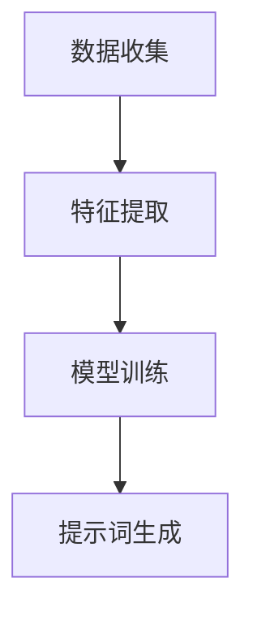

**Python代码示例**：

```python
from sklearn.feature_extraction.text import TfidfVectorizer
from sklearn.naive_bayes import MultinomialNB

# 示例数据
documents = ["政府工作报告", "环保政策", "教育改革"]

# 特征提取
vectorizer = TfidfVectorizer()
X = vectorizer.fit_transform(documents)

# 模型训练
clf = MultinomialNB()
clf.fit(X, labels)

# 提示词生成
def generate_tips(user_interests):
    user_interests_vector = vectorizer.transform(user_interests)
    tip_candidates = clf.predict(user_interests_vector)
    return [document for label, document in zip(tip_candidates, documents)]

# 用户兴趣
user_interests = ["环保政策", "教育改革"]

# 生成提示词
tips = generate_tips(user_interests)
print(tips)
```

#### 提示词优化算法

**原理**：提示词优化算法通过对用户反馈和行为数据进行分析，动态调整提示词，提高提示词的准确性和用户满意度。算法流程如下：

1. **数据收集**：收集用户对提示词的反馈数据（如点击、评论、点赞等）。
2. **模型训练**：使用机器学习算法训练反馈预测模型，预测用户对提示词的满意度。
3. **提示词调整**：根据预测结果，调整提示词内容或权重，优化提示词。

**Mermaid流程图**：

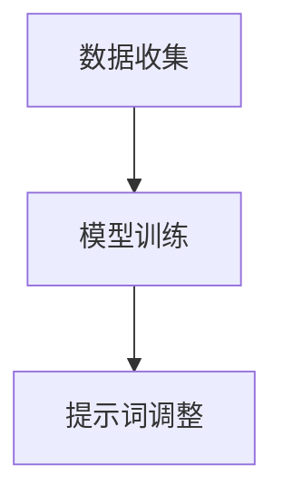

**Python代码示例**：

```python
from sklearn.ensemble import RandomForestClassifier

# 示例数据
feedback_data = [["政策解读", "点赞"], ["环保政策", "评论"], ["教育改革", "点击"]]

# 特征提取
X, y = list(zip(*feedback_data))
clf = RandomForestClassifier(n_estimators=100)
clf.fit(X, y)

# 提示词调整
def optimize_tips(tips):
    predictions = clf.predict([tips])
    optimized_tips = [tip for tip, pred in zip(tips, predictions) if pred == "点赞"]
    return optimized_tips

# 调整提示词
optimized_tips = optimize_tips(["政策解读", "环保政策", "教育改革"])
print(optimized_tips)
```

### 附录B：系统接口详细说明

系统接口设计遵循RESTful原则，主要包括以下接口：

#### 用户管理接口

- 注册：`POST /api/users/register`
- 登录：`POST /api/users/login`
- 获取用户信息：`GET /api/users/{userId}`

#### 提示词管理接口

- 创建提示词：`POST /api/tips`
- 更新提示词：`PUT /api/tips/{tipId}`
- 删除提示词：`DELETE /api/tips/{tipId}`
- 获取提示词列表：`GET /api/tips`

#### 评论管理接口

- 添加评论：`POST /api/comments`
- 获取评论列表：`GET /api/comments/{tipId}`

#### 数据分析接口

- 获取用户参与度：`GET /api/analytics/user-participation/{userId}`

### 附录C：系统日志和监控

系统日志记录在 `/var/log/` 目录下，包括 `official.log`、`error.log` 和 `access.log`。

监控工具包括：

- Zabbix：用于监控服务器性能。
- Nagios：用于监控网络设备和服务器。
- Prometheus：用于收集和存储系统性能数据。
-

