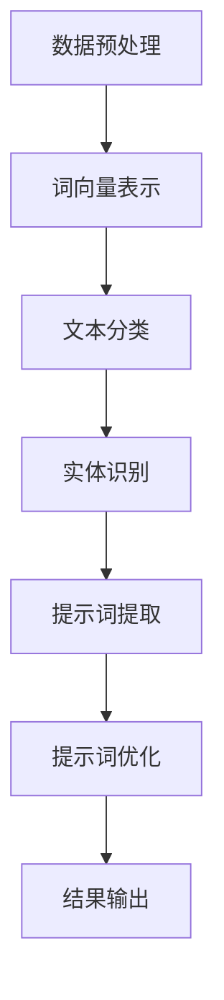
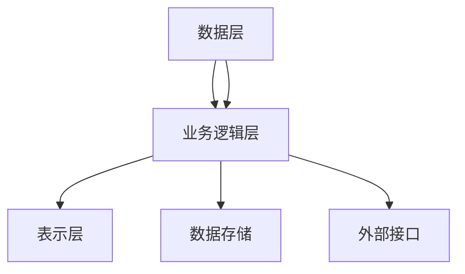
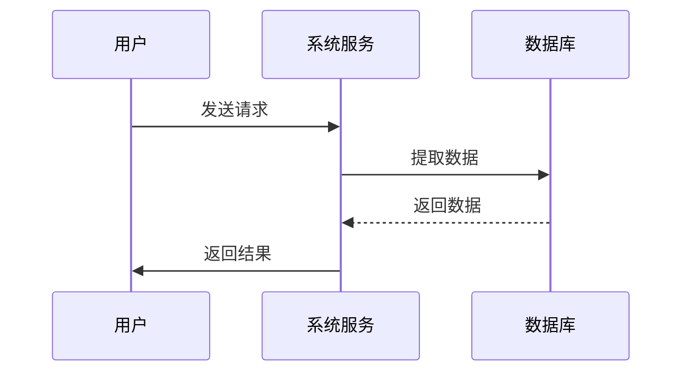

                 

# 《构建AI驱动的智慧政务决策提示词系统》

## 关键词
AI驱动、智慧政务、决策提示词、自然语言处理、系统架构设计

## 摘要
本文将探讨如何构建一个AI驱动的智慧政务决策提示词系统，详细阐述其背景、核心概念、算法原理、系统设计与实现，以及最佳实践和注意事项。通过逐步分析，我们将展示如何利用人工智能技术提升政务决策的效率和质量。

## 第一部分：背景介绍

### 1.1 智慧政务的发展趋势
智慧政务是信息时代政府治理的重要方向，通过信息技术提升政府服务和管理水平，实现政务数据的高效利用和智能决策。随着大数据、云计算、物联网等技术的发展，智慧政务逐渐成为现代化治理的必要手段。

### 1.2 决策提示词的重要性
决策提示词在政务决策中起到关键作用，它可以帮助政府官员快速获取相关信息，辅助制定科学合理的决策。有效的决策提示词能够提高政务决策的精准性和及时性，从而提升政府的治理能力。

### 1.3 AI在智慧政务中的应用
人工智能技术在智慧政务中的应用日益广泛，从数据挖掘、智能分析到自动化决策，AI正成为提升政务效率的重要工具。构建AI驱动的智慧政务决策提示词系统，是实现政务智能化的重要途径。

## 第二部分：核心概念与联系

### 2.1 AI的概念与类型
AI（人工智能）是模拟人类智能行为的计算机系统。根据实现方式，AI可分为弱AI和强AI，其中弱AI擅长特定任务，强AI具备人类智能的广泛能力。

### 2.2 智慧政务的定义与特点
智慧政务是政府利用信息技术实现治理现代化的一种形式，特点包括数据驱动、服务智能化、管理精细化等。

### 2.3 决策提示词的功能与作用
决策提示词是在决策过程中提供相关信息和建议的工具，它可以帮助决策者快速定位关键问题，提高决策的准确性和效率。

### 2.4 AI与传统政务决策的不同
| 对比项 | 传统政务决策 | AI驱动政务决策 |
| ------ | ------------ | -------------- |
| 决策方式 | 经验驱动 | 数据驱动、模型辅助 |
| 决策效率 | 低效率、周期长 | 高效率、实时性 |
| 决策准确性 | 受限于经验 | 数据支持和模型优化 |

### 2.5 AI与智慧政务决策的联系
AI与智慧政务决策的结合，可以充分发挥人工智能在数据分析和决策支持方面的优势，实现政务决策的科学化、智能化。

## 第三部分：算法原理讲解

### 3.1 自然语言处理基础
自然语言处理（NLP）是人工智能的重要分支，专注于使计算机能够理解和生成人类语言。NLP任务包括文本分类、实体识别、语义分析等。

### 3.2 常见NLP任务
在构建决策提示词系统时，常见的NLP任务包括：
- **文本分类**：将文本分类到预定义的类别中。
- **实体识别**：从文本中提取出重要的实体信息。
- **情感分析**：判断文本的情感倾向。

### 3.3 基于NLP的决策提示词生成算法
决策提示词生成算法的核心是利用NLP技术从大量文本数据中提取出有价值的信息，并将其转化为易于理解和使用的提示词。常用的算法包括：
- **词袋模型**：将文本表示为词频向量。
- **卷积神经网络（CNN）**：用于文本分类和特征提取。
- **递归神经网络（RNN）**：特别适合处理序列数据。

### 3.4 算法流程图
使用Mermaid绘制决策提示词生成算法的流程图：



### 3.5 Python代码示例
以下是一个简单的Python代码示例，展示了如何使用NLP库（如NLTK）进行文本分类：

```python
import nltk
from nltk.corpus import movie_reviews
from nltk.classify import NaiveBayesClassifier

def extract_features(words):
    return dict([(word, True) for word in words])

fileids_pos = movie_reviews.fileids('pos')
fileids_neg = movie_reviews.fileids('neg')

features_pos = [(extract_features(words), 'positive') for (words, label) in movie_reviews.open(fileids_pos)]
features_neg = [(extract_features(words), 'negative') for (words, label) in movie_reviews.open(fileids_neg)]

nltk.classify.apply_features(extract_features, movie_reviews.raw())
classifier = NaiveBayesClassifier.train(features_pos + features_neg)
print("Accuracy:", nltk.classify.accuracy(classifier, features_pos + features_neg))
```

### 3.6 算法的数学模型和公式
自然语言处理算法通常涉及概率模型和神经网络模型，以下是常见的数学模型和公式：

- **词袋模型**：$$P(\text{word}|\text{document}) = \frac{f_{\text{word}}(\text{document})}{\sum_{\text{word'} \in \text{Vocabulary}} f_{\text{word'}}(\text{document})}$$

- **卷积神经网络**：$$h_{l}(x) = \sigma(W_{l} \cdot h_{l-1} + b_{l})$$，其中$$\sigma$$是激活函数，$$W_{l}$$是权重矩阵，$$b_{l}$$是偏置项。

- **递归神经网络**：$$h_{l}(x) = \sigma(W_{l} \cdot [h_{l-1}, x] + b_{l})$$，其中$$[h_{l-1}, x]$$是拼接操作。

## 第四部分：系统分析与架构设计方案

### 4.1 系统场景与需求分析
智慧政务决策提示词系统的核心场景包括政务数据的收集、处理、分析和输出。系统需求包括：
- **数据准确性**：确保输入数据的准确性和完整性。
- **实时性**：支持实时数据处理和决策提示。
- **可扩展性**：系统能够随着数据量的增长而扩展。

### 4.2 系统功能设计
系统功能设计主要包括：
- **数据收集与预处理**：收集政务数据，并进行清洗和预处理。
- **文本分析**：利用NLP技术对文本进行分析，提取关键信息。
- **提示词生成**：根据分析结果生成决策提示词。
- **提示词优化**：对生成的提示词进行优化，提高其准确性和实用性。

### 4.3 系统架构设计
系统架构设计采用分层架构，包括数据层、业务逻辑层和表示层。具体架构如下：



### 4.4 系统接口设计与交互
系统接口设计主要包括：
- **API接口**：提供数据输入和决策提示词输出的API接口。
- **数据流**：定义数据在系统中的流动路径和处理流程。
- **用户交互**：设计用户界面，方便用户与系统进行交互。

使用Mermaid绘制系统接口设计和系统交互的序列图：



## 第五部分：项目实战

### 5.1 项目实战
在本项目中，我们将使用Python和相关的NLP库（如NLTK、spaCy）来构建一个简单的智慧政务决策提示词系统。以下是项目实战的步骤：

1. **环境安装与配置**：
   - 安装Python环境和相关库（如NLTK、spaCy）。
   - 配置数据库和数据存储。

2. **系统核心实现源代码**：
   - 编写数据收集和预处理代码。
   - 实现文本分析和决策提示词生成算法。
   - 实现提示词优化和系统接口。

3. **代码解读与分析**：
   - 对核心代码进行详细解读和分析。
   - 演示如何使用NLP库进行文本处理。

4. **实际案例分析和详细讲解剖析**：
   - 分析一个实际案例，展示系统的应用效果。
   - 对案例进行详细讲解和剖析。

### 5.2 案例分析
以某市政府的空气质量监测数据为例，分析如何使用决策提示词系统为市政府提供空气质量管理的决策支持。以下是案例分析和详细讲解：

1. **数据收集**：
   - 收集该市政府所属区域的空气质量监测数据。
   - 数据包括PM2.5、PM10、SO2、NO2等指标。

2. **数据处理**：
   - 对收集到的数据进行清洗和预处理。
   - 去除无效数据和异常值。

3. **文本分析**：
   - 使用NLP技术对空气质量监测数据进行文本分析。
   - 提取与空气质量相关的关键词和短语。

4. **决策提示词生成**：
   - 根据分析结果生成决策提示词。
   - 提示词包括空气质量级别、建议措施等。

5. **案例应用与效果评估**：
   - 将生成的决策提示词应用于实际空气质量管理。
   - 评估系统提供的决策支持效果。

## 第六部分：最佳实践与总结

### 6.1 最佳实践
- **数据质量**：确保输入数据的质量，进行充分的清洗和预处理。
- **算法优化**：根据实际情况不断优化算法，提高决策提示词的准确性和实用性。
- **用户反馈**：收集用户反馈，持续改进系统功能。

### 6.2 小结
本文详细探讨了构建AI驱动的智慧政务决策提示词系统的过程，从核心概念、算法原理到系统设计、项目实战，全面阐述了系统的构建方法。

### 6.3 注意事项
- **安全性**：确保系统的安全性，特别是数据安全和用户隐私保护。
- **持续学习**：随着技术的不断发展，保持对新技术的研究和学习。

### 6.4 拓展阅读
- **相关书籍**：《智慧政务：技术与应用》、《人工智能：一种现代的方法》
- **学术论文**：搜索相关领域的学术论文，了解最新的研究进展。

## 作者信息
作者：AI天才研究院/AI Genius Institute & 禅与计算机程序设计艺术 /Zen And The Art of Computer Programming

