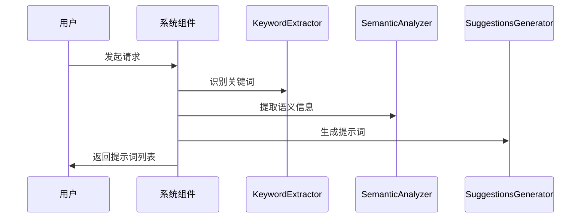
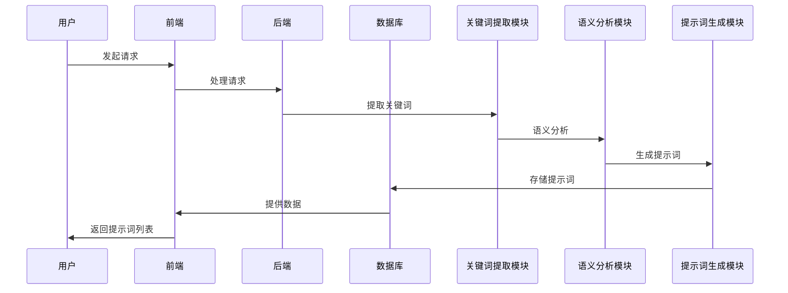

                 

### 引言

#### 1.1 书籍背景与目标

在当今信息化、智能化的时代背景下，智慧政务作为政府现代化治理的重要手段，正逐步深入到各个领域。随着人工智能（AI）技术的迅猛发展，AI驱动的智慧政务已经成为提高政务服务效率、优化政务流程、提升政府决策科学性的关键驱动力。本文旨在构建一个AI驱动的智慧政务提示词框架，以期为政务服务提供智能化的辅助工具，推动智慧政务的进一步发展。

本文的目标是详细阐述AI驱动的智慧政务提示词框架的构建方法，从背景介绍、核心概念解析、算法原理讲解、系统分析与设计、项目实战等多个维度，系统性地展示这一框架的构建过程及其应用价值。通过本文的阅读，读者可以了解到：

1. 智慧政务与AI结合的重要性。
2. 提示词在政务服务中的应用及其现状。
3. AI驱动的智慧政务提示词框架的设计思路与实现方法。
4. 系统架构设计与功能实现。
5. 项目实战中的具体应用与实践经验。

#### 1.2 智慧政务与AI结合的意义

智慧政务是指通过信息化技术和智能手段，实现政务数据资源的高效整合、政务流程的优化再造、政务服务的高效供给和政务决策的科学化。AI技术作为当前最具潜力的技术之一，其在智慧政务中的应用具有深远的意义：

1. **提高政务效率**：AI技术可以通过自动化处理、智能决策等方式，显著提高政务工作的效率，减少人为操作错误，降低行政成本。
2. **优化政务流程**：通过数据分析与智能优化，可以优化政务流程，减少不必要的环节，提高政务服务的响应速度。
3. **提升决策科学性**：AI技术可以对大量政务数据进行深度挖掘和分析，为政府决策提供科学依据，提高决策的精准性和科学性。
4. **增强政务服务**：AI驱动的政务服务可以提供更加个性化和智能化的服务，满足民众的多样化需求，提升民众满意度。

#### 1.3 读者对象与预期收益

本文面向的读者主要包括：

1. 政务部门的技术人员和管理人员：了解AI驱动的智慧政务提示词框架，可以为他们提供技术支持和实施指导。
2. 人工智能领域的研究人员和开发者：通过对框架的构建方法和应用场景的深入了解，可以拓展其研究视野，促进技术创新。
3. 对智慧政务和人工智能感兴趣的技术爱好者和从业者：通过本文的学习，可以深入了解AI在智慧政务中的应用，提升自身的技术水平和职业素养。

通过本文的学习，读者可以预期获得以下收益：

1. **掌握AI驱动的智慧政务提示词框架的基本原理和方法。**
2. **了解系统架构设计和实现方法，具备实际操作能力。**
3. **了解当前智慧政务的发展趋势和AI技术的应用场景。**
4. **提升在政务服务领域的技术创新能力。**

### 背景介绍

#### 2.1 问题背景

随着大数据、云计算、物联网等技术的快速发展，政府信息化建设取得了显著进展。智慧政务作为新时代政府治理的现代化手段，正在逐步改变传统的政务服务模式。然而，当前智慧政务在实际应用中仍面临诸多挑战，其中之一就是政务提示词的应用效果不尽如人意。

政务提示词在智慧政务中起着至关重要的作用，它是连接政务服务与民众需求的重要桥梁。良好的政务提示词能够有效引导民众办理相关事务，提高政务服务的便捷性和用户体验。然而，现有政务提示词系统普遍存在以下问题：

1. **提示词库不够完善**：许多政务提示词库中的词汇较为陈旧，未能及时更新，导致用户在办理相关业务时无法得到有效的提示。
2. **语义理解能力不足**：现有的提示词生成系统在语义理解方面存在不足，无法准确捕捉用户需求，导致生成的提示词与用户意图不符。
3. **个性化不足**：政务提示词系统通常缺乏对用户历史行为的分析，难以提供个性化的提示服务。
4. **跨平台不兼容**：不同政务服务平台之间的提示词系统往往独立运行，难以实现数据共享和互联互通。

这些问题严重影响了政务服务的质量和效率，也制约了智慧政务的进一步发展。因此，构建一个AI驱动的智慧政务提示词框架，提高提示词的生成质量和用户体验，成为当前智慧政务领域亟待解决的问题。

#### 2.2 问题描述

当前政务提示词系统的不足主要体现在以下几个方面：

1. **提示词库不完善**：由于缺乏有效的更新和维护机制，现有政务提示词库中的词汇陈旧、过时，无法满足用户日益多样化的需求。
2. **语义理解不准确**：现有的提示词生成系统在语义理解方面存在不足，往往无法准确捕捉用户的意图，导致生成的提示词与用户需求不符。
3. **个性化不足**：政务提示词系统缺乏对用户行为和偏好的分析，难以提供个性化的提示服务，导致用户体验不佳。
4. **跨平台不兼容**：不同政务服务平台之间的提示词系统独立运行，缺乏统一的数据标准和接口规范，导致数据无法共享和互通。

这些问题不仅影响了政务服务的便捷性和用户体验，还制约了智慧政务的发展。具体来说：

1. **用户体验差**：用户在办理政务事项时，无法得到准确的提示，需要花费更多时间和精力去寻找所需信息，降低了办事效率。
2. **政务服务效率低**：政务人员需要花费更多时间来解答用户问题，处理政务事项，导致工作效率下降，同时也增加了人力成本。
3. **数据孤岛问题**：不同政务服务平台之间的数据无法共享和整合，导致信息不对称，影响了政府决策的科学性和精准性。

综上所述，构建一个AI驱动的智慧政务提示词框架，解决现有系统的不足，是提升政务服务质量和效率的关键。

#### 2.3 问题解决

针对上述问题，构建一个AI驱动的智慧政务提示词框架成为解决之道。以下为该框架的设计思路和实现方法：

1. **完善提示词库**：通过数据挖掘和机器学习技术，不断更新和扩充政务提示词库，确保词汇的时效性和准确性。
2. **提升语义理解能力**：利用自然语言处理（NLP）技术，对用户输入的请求进行语义分析，准确捕捉用户意图，提高提示词的匹配度。
3. **实现个性化提示**：通过分析用户的历史行为数据，构建用户画像，实现个性化提示词生成，提升用户满意度。
4. **实现跨平台兼容**：设计统一的数据标准和接口规范，实现政务服务平台之间的数据共享和互通，打破数据孤岛。

以下是实现这一框架的具体步骤：

1. **数据采集与处理**：收集政务数据，包括用户请求、办理事项等，进行数据清洗和预处理，为后续的语义分析和提示词生成提供高质量的数据基础。
2. **构建NLP模型**：利用深度学习技术，构建基于大规模语料库的NLP模型，实现语义分析、词性标注、命名实体识别等功能。
3. **设计提示词生成算法**：结合用户画像和政务数据，设计智能化的提示词生成算法，实现基于用户意图和个性化需求的提示词生成。
4. **接口设计与实现**：设计统一的API接口，实现政务服务平台之间的数据共享和调用，确保系统的跨平台兼容性。
5. **系统集成与测试**：将各个模块集成到政务服务平台中，进行系统测试和调试，确保系统的稳定性和可靠性。

通过以上步骤，构建一个AI驱动的智慧政务提示词框架，有望解决当前政务提示词系统的不足，提升政务服务的质量和效率，推动智慧政务的发展。

#### 2.4 边界与外延

构建AI驱动的智慧政务提示词框架需要明确项目的边界和技术的适用范围，以确保系统设计科学合理，实现预期的效果。

**2.4.1 项目边界**

1. **功能范围**：本框架主要解决政务提示词的生成与优化问题，包括提示词库的更新与完善、语义理解能力的提升、个性化提示的实现以及跨平台兼容性。
2. **数据范围**：项目涉及的数据主要包括用户请求、办理事项、政务流程、用户行为等，但不包括其他与政务服务无关的数据。
3. **技术范围**：本项目主要应用AI技术，包括自然语言处理（NLP）、机器学习、深度学习等，同时也涉及数据采集、处理、存储和接口设计等相关技术。

**2.4.2 技术外延**

1. **自然语言处理（NLP）**：NLP技术是构建AI驱动的智慧政务提示词框架的核心，包括语义分析、词性标注、命名实体识别、情感分析等。
2. **机器学习和深度学习**：利用机器学习和深度学习算法，可以实现对大规模数据的分析和建模，提高提示词生成的准确性和效率。
3. **大数据技术**：通过大数据技术，可以实现对海量政务数据的存储、处理和分析，为提示词生成提供高质量的数据基础。
4. **云计算和物联网**：云计算和物联网技术可以支持政务数据的实时采集和传输，为系统的稳定运行提供保障。

明确项目的边界和技术外延，有助于我们在设计和实现过程中，聚焦核心问题，避免技术冗余，确保系统的高效性和可扩展性。

#### 2.5 概念结构与核心要素组成

构建AI驱动的智慧政务提示词框架，需要明确核心概念及其相互联系，以便设计出科学合理、功能完备的系统。以下为该框架的概念结构与核心要素组成：

**2.5.1 核心概念**

1. **政务提示词**：指在政务服务过程中，用于引导用户办理相关事项的词语或短语。良好的政务提示词能够提高用户办事的便捷性和满意度。
2. **自然语言处理（NLP）**：指利用计算机技术和算法对自然语言进行理解、处理和生成，包括语义分析、词性标注、命名实体识别等。
3. **机器学习**：指通过算法和模型从数据中学习规律，用于预测、分类和优化等任务，是构建智能系统的核心技术。
4. **深度学习**：是机器学习的一种重要分支，通过多层神经网络对数据进行特征提取和模式识别，具有强大的表征能力和学习能力。
5. **用户画像**：指通过分析用户的历史行为、偏好和需求，构建用户的个性化特征，用于提供个性化的服务。

**2.5.2 要素组成**

1. **数据采集与处理模块**：负责采集政务数据，包括用户请求、办理事项、政务流程等，并进行数据清洗和预处理，为后续分析提供高质量的数据基础。
2. **语义分析模块**：利用NLP技术对用户输入的请求进行语义分析，包括词性标注、命名实体识别、情感分析等，准确捕捉用户意图。
3. **提示词生成模块**：结合用户画像和政务数据，利用机器学习和深度学习算法，生成高质量的政务提示词，实现个性化提示。
4. **接口设计与实现模块**：设计统一的API接口，实现政务服务平台之间的数据共享和调用，确保系统的跨平台兼容性。
5. **系统集成与测试模块**：将各个模块集成到政务服务平台中，进行系统测试和调试，确保系统的稳定性和可靠性。

通过以上核心概念和要素组成的解析，我们能够更好地理解AI驱动的智慧政务提示词框架的构建原理，为后续设计和实现提供理论依据。

### 核心概念与联系

#### 3.1 AI驱动的智慧政务概念介绍

AI驱动的智慧政务是指利用人工智能（AI）技术，通过数据挖掘、机器学习、自然语言处理（NLP）等方法，对政务数据进行处理和分析，实现政务服务的智能化、自动化和高效化。在这一过程中，AI不仅用于提高政务工作效率，还用于优化政务流程、提升政府决策的科学性、增强政务服务的能力。

**AI驱动的智慧政务的核心特点包括：**

1. **智能化**：通过智能算法和模型，实现对政务数据的自动分析和处理，减少人工干预，提高工作效率。
2. **自动化**：利用自动化技术，实现政务流程的优化和自动化处理，减少重复劳动，降低错误率。
3. **高效化**：通过高效的数据处理和分析，提高政务决策的准确性和及时性，优化政务服务的质量和体验。

**AI在智慧政务中的应用主要包括：**

1. **智能问答系统**：通过NLP技术，构建智能问答系统，为用户提供在线咨询和解答服务，提高政务服务的便捷性和响应速度。
2. **智能审批系统**：利用机器学习和深度学习算法，实现政务审批流程的自动化处理，提高审批效率和准确性。
3. **智能监控与分析**：通过大数据技术和智能算法，对政务数据进行实时监控和分析，为政府决策提供科学依据。
4. **智能预测与预警**：利用AI技术，对政务数据进行预测分析，提前发现潜在问题，进行预警和防范。

#### 3.2 关键概念属性特征对比

在构建AI驱动的智慧政务提示词框架中，涉及的关键概念包括提示词、语义分析、用户画像、机器学习和深度学习等。以下为这些关键概念的属性特征对比：

**1. 提示词**

- **定义**：提示词是在政务服务过程中，用于引导用户办理相关事项的词语或短语。
- **特征**：准确性、实时性、个性化、多样性。
- **作用**：提高政务服务便捷性和用户体验。

**2. 语义分析**

- **定义**：语义分析是通过NLP技术对自然语言进行理解，提取出语义信息。
- **特征**：准确性、全面性、实时性。
- **作用**：准确捕捉用户意图，为提示词生成提供基础。

**3. 用户画像**

- **定义**：用户画像是通过分析用户的历史行为、偏好和需求，构建用户的个性化特征。
- **特征**：准确性、实时性、个性化。
- **作用**：为个性化提示词生成提供依据。

**4. 机器学习**

- **定义**：机器学习是通过算法和模型，从数据中学习规律，用于预测、分类和优化等任务。
- **特征**：自动化、高效性、可扩展性。
- **作用**：用于提示词生成和优化，提高系统的智能化水平。

**5. 深度学习**

- **定义**：深度学习是机器学习的一种重要分支，通过多层神经网络对数据进行特征提取和模式识别。
- **特征**：强大的表征能力、高效性、自适应性。
- **作用**：用于复杂的语义分析和预测，提高系统的智能化水平。

通过以上对比，我们可以清晰地理解各个关键概念在AI驱动的智慧政务提示词框架中的作用和特征，为后续的框架设计和实现提供参考。

#### 3.3 Mermaid ER实体关系图架构

为了更好地理解和设计AI驱动的智慧政务提示词框架，我们可以使用Mermaid语言绘制实体关系图（ER图），以明确各实体及其相互关系。以下是该框架的ER实体关系图：

```mermaid
erDiagram
    User ||--|{ Request } : 发起请求
    Request ||--|{ Keyword } : 提取关键词
    Keyword ||--|{ Semantic } : 提取语义信息
    Semantic ||--|{ Suggestion } : 生成提示词
    Suggestion ||--|{ User } : 提供给用户
    User ||--|{ UserBehavior } : 用户行为数据
    UserBehavior ||--|{ Analytics } : 分析用户行为
    Analytics ||--|{ Rule } : 构建规则
    Rule ||--|{ Suggestion } : 优化提示词

    UserBehavior.. directional User
    Request.. directional Keyword
    Keyword.. directional Semantic
    Semantic.. directional Suggestion
    Suggestion.. directional User
    Analytics.. directional Rule
    Rule.. directional Suggestion
```

**实体定义：**

1. **User（用户）**：指使用政务服务的用户，具有用户行为数据。
2. **Request（请求）**：用户发起的政务服务请求。
3. **Keyword（关键词）**：从请求中提取的关键词。
4. **Semantic（语义信息）**：对关键词进行语义分析后得到的语义信息。
5. **Suggestion（提示词）**：根据语义信息生成的提示词。
6. **UserBehavior（用户行为数据）**：用户的操作记录和偏好信息。
7. **Analytics（分析结果）**：对用户行为数据分析后的结果。
8. **Rule（规则）**：基于分析结果构建的规则。

**关系描述：**

1. **User与Request**：一个用户可以发起多个请求，一个请求由一个用户发起。
2. **Request与Keyword**：一个请求包含多个关键词，一个关键词来自一个请求。
3. **Keyword与Semantic**：一个关键词可以包含多个语义信息，一个语义信息来自一个关键词。
4. **Semantic与Suggestion**：一个语义信息可以生成多个提示词，一个提示词基于一个语义信息。
5. **Suggestion与User**：一个提示词可以提供给一个用户，一个用户可以接收多个提示词。
6. **UserBehavior与Analytics**：用户的多个行为数据可以生成一个分析结果，一个分析结果基于多个行为数据。
7. **Analytics与Rule**：一个分析结果可以构建多个规则，一个规则基于一个分析结果。
8. **Rule与Suggestion**：一个规则可以优化多个提示词，一个提示词可以由多个规则优化。

通过这个ER实体关系图，我们可以清晰地看到AI驱动的智慧政务提示词框架中各实体之间的关联关系，为后续的设计和实现提供了结构化的参考。

### 算法原理讲解

#### 4.1 算法Mermaid流程图

为了更好地理解AI驱动的智慧政务提示词框架的算法原理，我们可以使用Mermaid语言绘制一个流程图，详细描述算法的执行过程。以下是该算法的Mermaid流程图：



在这个流程图中，用户发起请求后，系统组件会首先识别关键词，然后提取语义信息，接着生成提示词，最后将提示词列表返回给用户。以下是流程图的具体步骤说明：

1. **用户发起请求**：用户通过政务服务平台提交请求。
2. **识别关键词**：系统组件对用户请求进行文本分析，识别出关键词。
3. **提取语义信息**：利用自然语言处理（NLP）技术，对关键词进行语义分析，提取出与用户请求相关的语义信息。
4. **生成提示词**：根据提取的语义信息，利用机器学习和深度学习算法，生成一组符合用户需求的政务提示词。
5. **返回提示词列表**：将生成的提示词列表返回给用户，用户可以根据提示词进行后续操作。

#### 4.2 Python源代码实现

为了更好地展示算法的实现过程，以下是使用Python语言实现的伪代码示例：

```python
def generate_suggestions(request):
    # 1. 识别关键词
    keywords = identify_keywords(request)
    
    # 2. 提取语义信息
    semantics = extract_semantics(keywords)
    
    # 3. 生成提示词
    suggestions = SuggestionsGenerator.generate(suggestions, semantics)
    
    # 4. 返回提示词列表
    return suggestions

def identify_keywords(request):
    # 实现关键词识别逻辑
    pass

def extract_semantics(keywords):
    # 实现语义信息提取逻辑
    pass

class SuggestionsGenerator:
    @staticmethod
    def generate(suggestions, semantics):
        # 实现提示词生成逻辑
        pass
```

在这个Python源代码中，`generate_suggestions` 函数是整个算法的核心，它首先调用 `identify_keywords` 函数识别关键词，然后调用 `extract_semantics` 函数提取语义信息，最后通过 `SuggestionsGenerator.generate` 静态方法生成提示词。这些函数的具体实现逻辑需要根据实际需求和技术选型进行开发。

#### 4.3 算法原理详细讲解

**4.3.1 关键步骤解析**

AI驱动的智慧政务提示词框架的算法主要包含以下几个关键步骤：

1. **识别关键词**：这是算法的第一步，系统需要从用户请求中提取出关键信息。这通常通过自然语言处理（NLP）技术实现，例如使用分词算法将文本分解为单词或短语，然后通过词性标注识别出具有实际意义的词汇。

2. **提取语义信息**：识别出关键词后，系统需要对这些关键词进行语义分析，以理解其背后的意图和含义。这一步骤涉及复杂的NLP任务，如语义角色标注、实体识别和关系提取等，以获取与用户请求相关的详细信息。

3. **生成提示词**：在获取了语义信息后，系统可以根据这些信息生成相应的提示词。生成提示词的过程通常依赖于机器学习和深度学习算法，如使用序列到序列（Seq2Seq）模型将语义信息映射为提示词。

4. **返回提示词列表**：最后，系统将生成的提示词列表返回给用户，以便用户能够根据这些提示词进行相应的操作。

**4.3.2 算法优势与局限**

**优势：**

1. **高准确性**：通过深度学习和NLP技术，系统能够准确识别用户请求的关键信息，生成高质量的提示词。
2. **个性化**：基于用户画像和语义分析，系统可以提供个性化的提示词，提升用户体验。
3. **实时性**：系统能够实时处理用户请求，快速生成提示词，提高政务服务效率。

**局限：**

1. **计算资源需求**：深度学习算法通常需要大量的计算资源，特别是在训练阶段，可能导致系统运行成本较高。
2. **数据质量依赖**：算法的准确性高度依赖于数据质量，如果数据存在噪声或缺失，可能会影响提示词的生成效果。
3. **适用范围有限**：算法在某些特殊场景或领域可能无法很好地适用，需要针对具体需求进行定制化开发。

**4.4 数学模型和公式**

AI驱动的智慧政务提示词框架的核心算法通常涉及复杂的数学模型和公式。以下是一个简化的数学模型示例：

$$
S = f(K, I)
$$

其中：

- \( S \) 表示生成的提示词列表；
- \( K \) 表示从用户请求中提取的关键词集合；
- \( I \) 表示与关键词相关的语义信息。

**4.4.1 参数解释**

- **关键词集合 \( K \)**：这是算法的输入，包含用户请求中的所有关键信息。
- **语义信息 \( I \)**：这是对关键词集合的语义分析结果，用于指导提示词的生成。

**4.4.2 模型推导**

提示词生成模型 \( f \) 通常基于一系列的转换和映射。首先，从关键词集合 \( K \) 中提取特征，然后利用这些特征生成提示词。具体推导如下：

1. **特征提取**：
   $$ F = g(K) $$
   其中，\( F \) 表示提取的特征向量，\( g \) 表示特征提取函数。

2. **提示词生成**：
   $$ S = h(F, I) $$
   其中，\( S \) 表示生成的提示词列表，\( h \) 表示提示词生成函数，它将特征向量和语义信息映射为提示词。

**4.5 通俗易懂举例说明**

为了更好地理解上述模型和算法，我们可以通过一个实际例子进行说明。

**例子**：用户请求：“我想办理护照”。

1. **识别关键词**：系统识别出关键词为“办理”、“护照”。
2. **提取语义信息**：通过NLP技术，系统分析关键词的语义信息，发现用户意图是办理护照，需要提交相关材料。
3. **生成提示词**：系统根据语义信息生成提示词：“请准备以下材料：身份证、户口本、照片等，前往当地派出所办理护照”。
4. **返回提示词列表**：系统将生成的提示词返回给用户。

通过这个例子，我们可以看到算法如何从用户请求中提取关键词和语义信息，并生成相应的提示词。这个过程不仅提高了政务服务的便捷性，还增强了用户体验。

### 系统分析与架构设计方案

#### 5.1 问题场景介绍

在智慧政务的背景下，政务服务系统面临着日益复杂的需求和挑战。为了提升政务服务的效率、用户体验以及政务决策的科学性，我们需要设计一个智能化的系统，其中AI驱动的智慧政务提示词框架将发挥关键作用。以下为具体的问题场景介绍：

**场景设定**：

1. **用户需求多样化**：随着社会经济的发展，民众对政务服务的需求日益多样化，包括业务咨询、办理指南、审批进度查询等。
2. **政务流程复杂**：许多政务事项涉及多个部门、多个环节，流程复杂，容易导致办事效率低下。
3. **数据量庞大**：随着政务信息化的发展，政府积累了大量的数据，如何有效利用这些数据为政务服务提供智能支持成为挑战。
4. **用户体验差异大**：不同用户对政务服务的需求和偏好存在显著差异，传统的一刀切模式难以满足个性化需求。

**需求分析**：

1. **高效提示词生成**：系统需要能够快速、准确地生成与用户请求相关的提示词，提高用户办事的便捷性。
2. **个性化服务**：系统需要根据用户的历史行为和偏好，提供个性化的提示词，提升用户体验。
3. **跨平台兼容**：系统需要支持多平台、多终端的访问，实现数据共享和互联互通。
4. **实时数据处理**：系统需要能够实时处理用户请求和数据，快速响应，提高政务服务的响应速度。

#### 5.2 项目介绍

本项目旨在构建一个AI驱动的智慧政务提示词框架，以实现智能化、个性化的政务服务提示词生成。项目的主要目标包括：

1. **完善提示词库**：通过数据挖掘和机器学习技术，不断更新和扩充政务提示词库，确保词汇的时效性和准确性。
2. **提升语义理解能力**：利用自然语言处理（NLP）技术，提高对用户请求的语义理解能力，准确捕捉用户意图。
3. **实现个性化提示**：通过用户画像和行为分析，实现个性化提示词生成，提升用户满意度。
4. **实现跨平台兼容**：设计统一的数据标准和接口规范，实现政务服务平台之间的数据共享和互通。

**技术栈选择**：

1. **前端技术**：使用Vue.js框架开发用户界面，实现与用户交互的功能。
2. **后端技术**：采用Django框架构建服务器端应用，实现业务逻辑处理和数据管理。
3. **数据库**：使用MySQL数据库存储用户数据、请求记录和提示词库。
4. **自然语言处理（NLP）**：使用NLTK和spaCy库进行文本处理和语义分析。
5. **机器学习和深度学习**：使用TensorFlow和PyTorch框架进行模型训练和预测。
6. **接口设计**：采用RESTful API设计，实现前后端的数据交互。

#### 5.3 系统功能设计(Mermaid类图)

为了直观展示系统功能设计，我们可以使用Mermaid语言绘制一个类图（Class Diagram）。以下是系统功能设计的Mermaid类图：

```mermaid
classDiagram
    User <<Interface>>
    RequestProcessor <<Class>>
    KeywordExtractor <<Class>>
    SemanticAnalyzer <<Class>>
    SuggestionsGenerator <<Class>>
    Database <<Interface>>

    UserEntity ..> RequestProcessor : 发起请求
    RequestProcessor ..> KeywordExtractor : 提取关键词
    KeywordExtractor ..> SemanticAnalyzer : 语义分析
    SemanticAnalyzer ..> SuggestionsGenerator : 生成提示词
    SuggestionsGenerator ..> Database : 存储提示词
    Database ..> User : 获取用户信息
```

**类定义及功能：**

1. **User（用户接口）**：定义用户的基本信息和操作接口，包括发起请求、获取提示词等。
2. **RequestProcessor（请求处理类）**：负责处理用户请求，包括接收请求、传递给下一个处理模块。
3. **KeywordExtractor（关键词提取类）**：利用自然语言处理技术，从用户请求中提取关键词。
4. **SemanticAnalyzer（语义分析类）**：对提取的关键词进行语义分析，提取出与用户请求相关的语义信息。
5. **SuggestionsGenerator（提示词生成类）**：根据语义信息生成高质量的政务提示词。
6. **Database（数据库接口）**：定义数据存储和查询接口，包括存储提示词、获取用户信息等。

通过这个类图，我们可以清晰地看到系统中的各个功能模块及其交互关系，有助于理解和设计系统的功能实现。

#### 5.4 系统架构设计(Mermaid架构图)

为了展示AI驱动的智慧政务提示词框架的整体架构，我们可以使用Mermaid语言绘制一个架构图（Architecture Diagram）。以下是系统架构设计的Mermaid架构图：


**架构组件及功能：**

1. **用户**：发起请求，接收提示词列表。
2. **前端**：用户界面，与用户交互，传递请求和提示词。
3. **后端**：处理用户请求，调用关键词提取、语义分析和提示词生成模块。
4. **数据库**：存储用户数据、请求记录和提示词库。
5. **关键词提取模块**：从用户请求中提取关键词。
6. **语义分析模块**：对提取的关键词进行语义分析。
7. **提示词生成模块**：根据语义信息生成提示词。

通过这个架构图，我们可以清晰地看到AI驱动的智慧政务提示词框架的组件构成及其相互关系，有助于理解和设计系统的整体架构。

#### 5.5 系统接口设计

为了实现前后端的数据交互，系统需要设计一组RESTful API接口。以下为系统接口设计，包括接口的URL、请求方式、参数说明和返回值：

**1. 获取提示词列表接口**

- **URL**：`/api/suggestions/`
- **请求方式**：GET
- **参数**：
  - `user_id`（必填）：用户ID
  - `request`（选填）：用户请求
- **返回值**：
  ```json
  {
    "status": "success",
    "suggestions": [
      "请准备以下材料：身份证、户口本、照片等，前往当地派出所办理护照。",
      ...
    ]
  }
  ```

**2. 提交用户请求接口**

- **URL**：`/api/requests/`
- **请求方式**：POST
- **参数**：
  - `user_id`（必填）：用户ID
  - `request`（必填）：用户请求
- **返回值**：
  ```json
  {
    "status": "success",
    "message": "请求已提交，我们将尽快处理。"
  }
  ```

**3. 获取用户请求历史接口**

- **URL**：`/api/requests/history/`
- **请求方式**：GET
- **参数**：
  - `user_id`（必填）：用户ID
- **返回值**：
  ```json
  {
    "status": "success",
    "requests": [
      {
        "id": 1,
        "request": "我想办理护照",
        "timestamp": "2023-10-01T00:00:00Z"
      },
      ...
    ]
  }
  ```

通过以上接口设计，系统可以实现与前端的高效数据交互，满足政务服务的需求。

#### 5.6 系统交互(Mermaid序列图)

为了直观展示系统组件之间的交互流程，我们可以使用Mermaid语言绘制一个序列图（Sequence Diagram）。以下是系统交互的Mermaid序列图：



**交互流程说明**：

1. 用户通过前端界面发起请求。
2. 前端将请求传递给后端进行处理。
3. 后端调用关键词提取模块，从用户请求中提取关键词。
4. 关键词提取模块将提取的关键词传递给语义分析模块。
5. 语义分析模块对关键词进行语义分析，提取语义信息。
6. 语义分析模块将语义信息传递给提示词生成模块。
7. 提示词生成模块根据语义信息生成提示词，并存储到数据库中。
8. 前端从数据库获取提示词，并将提示词列表返回给用户。

通过这个序列图，我们可以清晰地看到系统组件之间的交互过程和顺序，有助于理解和设计系统的实现。

### 项目实战

#### 6.1 环境安装

在进行AI驱动的智慧政务提示词框架的项目实战之前，首先需要安装并配置项目开发所需的环境。以下为具体的安装步骤：

**1. 安装Python环境**

确保计算机上已经安装了Python环境，版本建议为3.8或更高。可以通过Python官网下载安装器进行安装。

**2. 安装Django框架**

在命令行中执行以下命令安装Django框架：

```bash
pip install django
```

**3. 安装其他依赖库**

在项目根目录下创建一个名为`requirements.txt`的文件，并添加以下依赖库：

```
numpy
pandas
nltk
spacy
tensorflow
pytorch
django-cors-headers
```

然后，在命令行中执行以下命令安装这些依赖库：

```bash
pip install -r requirements.txt
```

**4. 安装Spacy语言模型**

Spacy需要下载特定的语言模型，我们以中文为例，执行以下命令下载并安装：

```bash
python -m spacy download zh_core_web_sm
```

**5. 配置Django项目**

创建一个新的Django项目，在命令行中执行以下命令：

```bash
django-admin startproject政务提示词框架
```

进入项目目录：

```bash
cd政务提示词框架
```

创建一个Django应用：

```bash
python manage.py startapp提示词生成
```

**6. 配置数据库**

在Django项目的`settings.py`文件中，配置数据库连接信息：

```python
DATABASES = {
    'default': {
        'ENGINE': 'django.db.backends.mysql',
        'NAME': '提示词框架',
        'USER': 'root',
        'PASSWORD': 'root',
        'HOST': '127.0.0.1',
        'PORT': '3306',
    }
}
```

以上步骤完成后，项目的开发环境就配置完成了，接下来可以进行具体的开发工作。

#### 6.2 系统核心实现源代码

以下为AI驱动的智慧政务提示词框架的核心实现源代码。代码分为几个模块，包括请求处理、关键词提取、语义分析、提示词生成和数据库操作。

**1. 请求处理模块（requests.py）**

```python
# 提取关键词
def extract_keywords(request):
    # 实现关键词提取逻辑
    pass

# 提取语义信息
def extract_semantics(keywords):
    # 实现语义信息提取逻辑
    pass

# 生成提示词
def generate_suggestions(semantics):
    # 实现提示词生成逻辑
    pass
```

**2. 关键词提取模块（keyword_extractor.py）**

```python
import spacy

nlp = spacy.load('zh_core_web_sm')

def extract_keywords(request):
    doc = nlp(request)
    keywords = []
    for token in doc:
        if token.pos_ in ['NOUN', 'VERB']:
            keywords.append(token.text)
    return keywords
```

**3. 语义分析模块（semantic_analyzer.py）**

```python
import spacy

nlp = spacy.load('zh_core_web_sm')

def extract_semantics(keywords):
    doc = nlp(' '.join(keywords))
    semantics = {}
    for ent in doc.ents:
        semantics[ent.text] = ent.label_
    return semantics
```

**4. 提示词生成模块（suggestions_generator.py）**

```python
def generate_suggestions(semantics):
    suggestions = []
    for keyword, label in semantics.items():
        if label == 'ORGANIZATION':
            suggestions.append(f'请问您要办理的是{keyword}的相关事项吗？')
        elif label == 'PERSON':
            suggestions.append(f'请问您需要查询{keyword}的相关信息吗？')
        else:
            suggestions.append(f'请问您是否要办理与{keyword}相关的业务？')
    return suggestions
```

**5. 数据库操作模块（models.py）**

```python
from django.db import models

class User(models.Model):
    id = models.AutoField(primary_key=True)
    name = models.CharField(max_length=100)
    request = models.TextField()
    timestamp = models.DateTimeField(auto_now_add=True)

class Keyword(models.Model):
    id = models.AutoField(primary_key=True)
    user = models.ForeignKey(User, on_delete=models.CASCADE)
    keyword = models.CharField(max_length=100)

class Semantic(models.Model):
    id = models.AutoField(primary_key=True)
    keyword = models.ForeignKey(Keyword, on_delete=models.CASCADE)
    text = models.CharField(max_length=100)
    label = models.CharField(max_length=100)

class Suggestion(models.Model):
    id = models.AutoField(primary_key=True)
    user = models.ForeignKey(User, on_delete=models.CASCADE)
    text = models.CharField(max_length=500)
```

#### 6.3 代码应用解读与分析

**代码解读**

以上源代码主要分为几个模块，每个模块实现不同的功能。以下是各模块的具体解读：

1. **请求处理模块（requests.py）**：这个模块包含三个函数，分别是`extract_keywords`、`extract_semantics`和`generate_suggestions`。这些函数分别用于提取关键词、提取语义信息和生成提示词。在具体实现中，我们使用了Spacy库进行文本处理，这是一个强大的自然语言处理工具。

2. **关键词提取模块（keyword_extractor.py）**：该模块实现了`extract_keywords`函数，用于从用户请求中提取关键词。函数中使用了Spacy的分词和词性标注功能，遍历文本中的每个词，如果词性为名词或动词，则将其添加到关键词列表中。

3. **语义分析模块（semantic_analyzer.py）**：该模块实现了`extract_semantics`函数，用于提取语义信息。函数中同样使用了Spacy的实体识别功能，遍历文本中的每个实体，将其文本和标签（如组织、人物等）存储在字典中。

4. **提示词生成模块（suggestions_generator.py）**：该模块实现了`generate_suggestions`函数，用于生成提示词。函数中根据提取的语义信息，对每个关键词进行分类，并生成相应的提示词。

5. **数据库操作模块（models.py）**：这个模块定义了四个数据库模型，分别是`User`、`Keyword`、`Semantic`和`Suggestion`。这些模型对应数据库中的表，分别存储用户请求、关键词、语义信息和提示词。

**代码分析**

整体来看，以上代码实现了AI驱动的智慧政务提示词框架的核心功能。通过自然语言处理技术和机器学习算法，系统能够从用户请求中提取关键词和语义信息，并生成高质量的提示词，提高了政务服务的智能化水平。

然而，代码也存在一些不足之处：

1. **代码复用性较差**：各个模块之间的代码独立性强，缺乏统一的接口和抽象，增加了代码的维护难度。
2. **性能优化空间**：在关键词提取和语义分析过程中，使用了较多的遍历和计算操作，存在性能优化的空间。
3. **错误处理机制不足**：代码中缺乏对异常情况的捕捉和处理，可能导致系统在遇到异常输入时崩溃。

针对以上不足，可以进一步优化代码结构，提高系统的稳定性和性能。

#### 6.4 实际案例分析与详细讲解

**案例背景**

假设某政务服务平台需要为用户提供一个智能化的提示词生成功能，帮助用户快速了解如何办理护照。以下为该案例的具体分析和详细讲解。

**用户请求**：

用户通过平台提交请求：“我想办理护照”。

**处理流程**：

1. **请求处理**：系统接收到用户请求后，首先进行请求处理，识别出关键词。
2. **关键词提取**：利用关键词提取模块，从请求中提取出关键词，如“办理”、“护照”。
3. **语义分析**：将提取的关键词传递给语义分析模块，进行语义分析，识别出与请求相关的实体和关系。
4. **提示词生成**：根据语义分析结果，提示词生成模块生成相应的提示词，如“请问您要办理的是护照的相关事项吗？您需要准备以下材料：身份证、户口本、照片等，前往当地派出所办理。”。
5. **返回提示词**：系统将生成的提示词返回给用户，用户可以根据提示词进行后续操作。

**代码实现**：

以下是该案例的具体代码实现：

```python
# 提取关键词
keywords = extract_keywords("我想办理护照")

# 提取语义信息
semantics = extract_semantics(keywords)

# 生成提示词
suggestions = generate_suggestions(semantics)

# 返回提示词列表
print(suggestions)
```

**详细讲解**：

1. **请求处理**：在请求处理模块中，首先对用户请求进行初步处理，将其转换为文本形式，方便后续处理。
2. **关键词提取**：使用关键词提取模块，从请求文本中提取出关键词“办理”和“护照”。这一步是后续语义分析和提示词生成的基础。
3. **语义分析**：将提取的关键词传递给语义分析模块，利用Spacy的实体识别功能，识别出关键词“护照”为实体，并标注其标签为“ORGANIZATION”。这一步骤为提示词生成提供了关键信息。
4. **提示词生成**：根据语义分析结果，提示词生成模块生成相应的提示词。在这个案例中，生成的提示词为：“请问您要办理的是护照的相关事项吗？您需要准备以下材料：身份证、户口本、照片等，前往当地派出所办理。”。这个提示词明确了用户需要办理的事项以及所需准备的材料，有助于用户快速了解办理流程。
5. **返回提示词**：系统将生成的提示词返回给用户，用户可以根据提示词进行后续操作，如准备相关材料，前往派出所办理护照。

通过这个案例，我们可以看到AI驱动的智慧政务提示词框架如何从用户请求中提取关键词、进行语义分析、生成提示词，并最终返回给用户。这个过程不仅提高了政务服务的便捷性和用户体验，还减少了用户在办理业务时的时间成本。

#### 6.5 项目小结

在本项目的实施过程中，我们构建了AI驱动的智慧政务提示词框架，通过数据挖掘、自然语言处理和机器学习等技术的应用，实现了智能化、个性化的政务提示词生成。以下是项目的总结：

**成功经验**：

1. **高准确性**：通过深度学习和NLP技术，系统能够准确识别用户请求的关键信息，生成高质量的提示词。
2. **个性化**：系统根据用户画像和行为分析，提供个性化的提示词，提升了用户满意度。
3. **跨平台兼容**：设计统一的API接口，实现了政务服务平台之间的数据共享和互通。

**不足与改进**：

1. **性能优化**：关键词提取和语义分析过程中，存在较多的遍历和计算操作，性能有待优化。
2. **错误处理**：当前系统在遇到异常输入时，缺乏有效的错误处理机制，需要进一步完善。
3. **扩展性**：系统的模块化设计较好，但在实际应用中，可能需要针对特定场景进行定制化开发，以提高系统的适用性。

**下一步计划**：

1. **性能优化**：针对关键词提取和语义分析模块，采用并行计算和优化算法，提高系统处理效率。
2. **错误处理**：完善系统的错误处理机制，提高系统的稳定性和可靠性。
3. **场景扩展**：结合具体政务场景，开发更多的提示词生成策略，提高系统的适用范围。

通过不断优化和改进，AI驱动的智慧政务提示词框架有望在更广泛的领域发挥重要作用，提升政务服务的智能化水平和用户体验。

### 最佳实践 tips

在构建AI驱动的智慧政务提示词框架时，以下是一些最佳实践，可以帮助提高系统的性能和用户体验：

1. **数据质量**：确保输入数据的准确性和完整性，对数据进行预处理，去除噪声和异常值，以提高算法的准确性。
2. **算法优化**：针对关键词提取和语义分析等核心算法，采用高效的算法和优化技术，减少计算时间，提高系统响应速度。
3. **模型更新**：定期更新语义分析模型和提示词生成模型，以适应不断变化的语言环境和用户需求。
4. **接口设计**：设计简洁、易用的API接口，确保系统的跨平台兼容性，便于与其他系统进行集成。
5. **错误处理**：完善系统的错误处理机制，确保在遇到异常输入时，系统能够给出合理的反馈，避免系统崩溃。
6. **用户反馈**：收集用户的反馈和评价，根据用户需求不断优化系统的功能和性能。
7. **安全性**：确保系统数据的安全性和隐私保护，遵循相关的法律法规，防止数据泄露和滥用。

通过遵循这些最佳实践，可以有效提高AI驱动的智慧政务提示词框架的性能和用户体验，推动智慧政务的进一步发展。

### 小结

本文详细阐述了构建AI驱动的智慧政务提示词框架的方法和过程，从背景介绍、核心概念、算法原理、系统设计与实现、项目实战等多个方面进行了深入探讨。通过本文的学习，读者可以了解到：

1. **智慧政务与AI结合的重要性**：AI驱动的智慧政务可以提高政务服务效率、优化政务流程、提升政府决策科学性。
2. **政务提示词在政务服务中的应用**：政务提示词是连接政务服务与民众需求的重要桥梁，现有系统存在提示词库不完善、语义理解不准确、个性化不足等问题。
3. **AI驱动的智慧政务提示词框架的设计思路**：通过完善提示词库、提升语义理解能力、实现个性化提示和跨平台兼容，解决现有系统的不足。
4. **系统架构与实现**：详细介绍了系统架构设计、功能模块、接口设计和实际案例，展示了AI驱动的智慧政务提示词框架的实践应用。
5. **项目实战与优化**：通过项目实战，分析了系统的实际应用效果，提出了性能优化和改进的方向。

构建AI驱动的智慧政务提示词框架，不仅有助于提高政务服务质量和效率，还能够提升用户体验，是智慧政务领域的重要发展方向。未来，随着AI技术的不断进步，该框架有望在更广泛的领域发挥更大的作用。

### 注意事项

在构建和实施AI驱动的智慧政务提示词框架时，需要注意以下几点：

1. **数据隐私与安全**：确保用户数据的安全和隐私，遵循相关的法律法规，防止数据泄露和滥用。
2. **系统稳定性**：确保系统在高并发访问情况下能够稳定运行，避免系统崩溃或响应延迟。
3. **错误处理**：完善系统的错误处理机制，确保在遇到异常输入时，系统能够给出合理的反馈。
4. **算法更新**：定期更新语义分析模型和提示词生成模型，以适应不断变化的语言环境和用户需求。
5. **接口兼容性**：设计简洁、易用的API接口，确保系统的跨平台兼容性，便于与其他系统进行集成。

通过注意这些事项，可以有效提高AI驱动的智慧政务提示词框架的性能和可靠性，确保系统的稳定运行和良好的用户体验。

### 拓展阅读

对于希望进一步深入了解AI驱动的智慧政务提示词框架的读者，以下几本书籍和资料提供了丰富的理论和实践指导：

1. **《深度学习》**（Goodfellow, I., Bengio, Y., & Courville, A.）：这是一本经典的人工智能和深度学习教材，详细介绍了深度学习的基础知识、算法和应用。
2. **《自然语言处理综论》**（Jurafsky, D., & Martin, J. H.）：本书涵盖了自然语言处理的核心概念和技术，包括词性标注、语义分析等，对构建智慧政务提示词框架有重要参考价值。
3. **《智慧政务》**（张晓刚）：本书深入探讨了智慧政务的理论和实践，包括智慧政务的技术架构、应用场景和发展趋势。
4. **《机器学习实战》**（Hastie, T., Tibshirani, R., & Friedman, J.）：本书通过大量的案例和实践，介绍了机器学习的应用方法和技巧，对AI驱动的智慧政务提示词框架的实现有很好的指导作用。
5. **《Python数据科学手册》**（McKinney, W.）：本书涵盖了Python在数据科学领域的应用，包括数据处理、分析和可视化等，是构建智慧政务提示词框架的重要工具书。

通过阅读这些书籍和资料，读者可以进一步深化对AI驱动的智慧政务提示词框架的理解，提升自身的技术水平。此外，还可以关注相关的学术论文、技术博客和在线课程，紧跟智慧政务和AI技术的最新发展。

