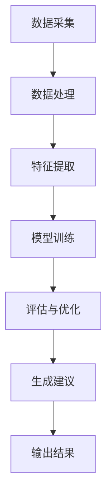
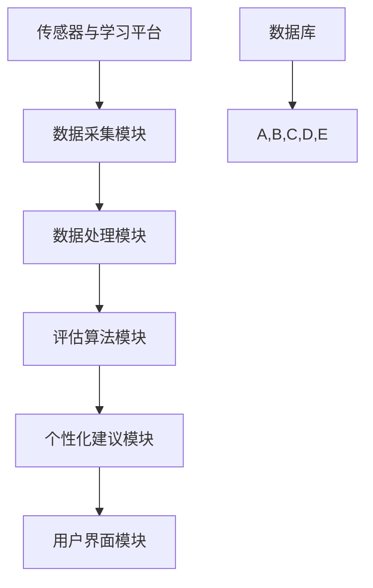
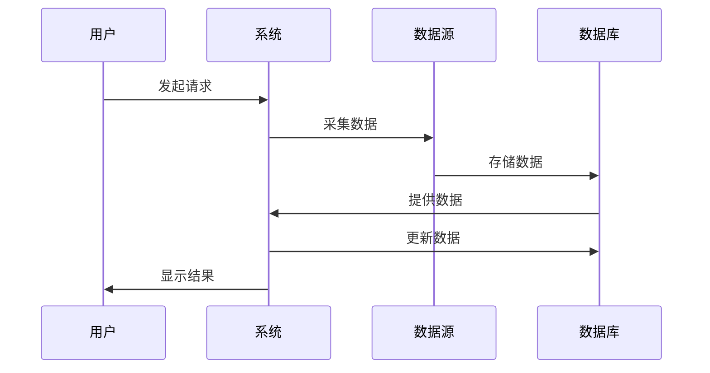

                 

### 引言

#### 1.1 问题背景

随着人工智能技术的飞速发展，教育领域正在经历一场深刻的变革。传统教育评估方式已经难以满足个性化学习、智能教育等新时代的需求。智能教育评估不仅要求对学生的学习过程进行精准监测，还需要对学生的学习效果进行科学评估。这种背景下，AI驱动的智慧教育评估系统应运而生，成为了教育技术领域的研究热点。

当前，教育评估中存在的问题主要包括评估手段单一、评估结果缺乏针对性、评估过程耗时费力等。这些问题的存在，使得教育评估的效果大打折扣。因此，引入AI技术，构建AI驱动的智慧教育评估系统，不仅能够提高评估的准确性和效率，还能为学生提供更为精准的学习指导。

AI技术在教育评估中的应用潜力巨大。通过大数据分析、机器学习等算法，AI可以实时监测学生的学习状态，识别学生的学习需求，提供个性化的学习建议。此外，AI还可以通过自然语言处理技术，自动生成评估报告，大大减轻教师的负担。然而，AI驱动的智慧教育评估也面临一些挑战，如数据隐私保护、算法公平性等。如何有效地解决这些问题，实现AI技术在教育评估中的最佳应用，是当前研究的重要方向。

#### 1.2 问题描述

本文旨在探讨如何构建一个AI驱动的智慧教育评估提示词系统。该系统的核心目标是利用AI技术，对学生的学习过程进行实时监测和评估，提供个性化的学习建议。具体来说，系统需要实现以下功能：

1. **数据采集**：通过传感器、学习平台等途径，收集学生的行为数据、学习记录等。
2. **数据处理**：对采集到的数据进行分析和清洗，提取有用的特征信息。
3. **智能评估**：利用机器学习算法，对学生的学习状态进行评估，生成评估报告。
4. **个性化建议**：根据评估结果，为学生提供个性化的学习建议。

构建这样一个系统，不仅需要深入理解AI技术，还需要充分考虑教育领域的特殊需求。本文将详细分析AI驱动的智慧教育评估的概念、原理、技术实现等，为构建这样一个系统提供理论支持和实践指导。

#### 1.3 问题解决

构建AI驱动的智慧教育评估提示词系统的核心在于利用AI技术实现高效、精准的教育评估。以下是几个关键步骤：

1. **数据收集与处理**：首先，需要建立一个完善的数据收集体系，包括学习行为数据、学习成果数据等。然后，对收集到的数据进行分析和清洗，提取有用的特征信息，为后续的评估提供基础数据。

2. **算法选择与优化**：根据教育评估的需求，选择合适的机器学习算法。例如，可以采用决策树、支持向量机、神经网络等算法。同时，对算法进行优化，提高评估的准确性和效率。

3. **模型训练与测试**：利用处理后的数据对机器学习模型进行训练，并通过交叉验证等方法评估模型的性能。根据评估结果，调整模型参数，优化模型效果。

4. **系统集成与部署**：将训练好的模型集成到智慧教育评估系统中，实现对学生学习状态的实时监测和评估。同时，设计用户友好的界面，方便教师和学生使用。

5. **系统优化与维护**：根据实际使用反馈，不断优化和调整系统，提高系统的稳定性和用户体验。同时，定期更新模型，以适应不断变化的教育需求。

通过以上步骤，可以构建一个高效、智能的智慧教育评估提示词系统，为教育评估提供有力支持。

#### 1.4 边界与外延

在构建AI驱动的智慧教育评估提示词系统的过程中，需要明确系统的功能范围和适用场景，以避免过度泛化或功能缺失。

**边界**：

1. **功能范围**：系统主要针对学生的学习行为和学习成果进行评估，不涉及教学内容的生成和修改。
2. **适用场景**：系统适用于各类教育场景，包括学校教育、在线教育、职业培训等。

**外延**：

1. **扩展功能**：未来可以结合区块链技术，实现学生数据的隐私保护。
2. **跨领域应用**：智慧教育评估提示词系统不仅可以应用于教育领域，还可以拓展到医疗、金融等其他领域，实现更广泛的应用。

#### 1.5 概念结构与核心要素组成

为了更好地理解AI驱动的智慧教育评估提示词系统，我们需要明确其中的核心概念和组成要素。

**核心概念**：

1. **AI大模型**：指具有大规模数据训练能力的深度学习模型，能够处理复杂的教育评估任务。
2. **教育评估**：指对学生的学习过程和学习成果进行综合评价的过程。
3. **提示词系统**：指用于生成和提供个性化学习建议的智能系统。

**核心要素组成**：

1. **数据采集模块**：负责收集学生的学习行为和学习成果数据。
2. **数据处理模块**：负责对采集到的数据进行清洗、分析和特征提取。
3. **评估算法模块**：负责利用机器学习算法对学习数据进行分析和评估。
4. **个性化建议模块**：根据评估结果，生成和提供个性化的学习建议。
5. **用户界面模块**：提供用户友好的人机交互界面，方便教师和学生使用系统。

通过以上概念和要素的梳理，我们可以更加清晰地理解AI驱动的智慧教育评估提示词系统的构建过程和实现方法。

---

### 核心概念与联系

在深入探讨AI驱动的智慧教育评估提示词系统之前，我们需要先了解几个核心概念，包括AI大模型、教育评估和提示词系统。这些概念是构建该系统的基础，理解它们之间的关系对于整个系统的设计和实现至关重要。

#### 2.1 AI大模型的定义与特点

**AI大模型**，顾名思义，是指具有大规模数据训练能力的深度学习模型。这类模型通常基于神经网络，能够通过大量数据的训练学习到复杂的模式，并在各种任务中表现出超强的泛化能力。

**基本概念**：

- **深度学习模型**：深度学习是人工智能的一个分支，它通过模拟人脑的神经网络结构，对数据进行层次化的特征提取和学习。
- **大规模数据训练**：AI大模型需要大量的数据进行训练，以充分学习数据的复杂性和多样性。

**核心特点**：

- **高泛化能力**：由于训练数据量大，AI大模型能够适应不同的任务和数据分布，具有较强的泛化能力。
- **强大的学习能力**：AI大模型能够自动学习复杂的特征，提取深层的信息。
- **高效的处理速度**：通过并行计算和优化算法，AI大模型能够在短时间内处理大量数据。

**应用**：

- **自然语言处理**：AI大模型在自然语言处理任务中，如文本分类、情感分析、机器翻译等，表现出了惊人的效果。
- **计算机视觉**：AI大模型在图像识别、目标检测、图像生成等领域，也取得了显著的成果。

#### 2.2 AI大模型与传统AI的区别

**传统AI**，通常指基于规则和符号推理的智能系统。这类系统依赖于预先定义的规则和算法，缺乏自我学习和适应能力。

**对比表格**：

| 特点 | AI大模型 | 传统AI |
| --- | --- | --- |
| **训练数据量** | 大规模数据训练 | 小规模或无数据训练 |
| **学习方式** | 自适应学习，自动提取特征 | 预定义规则，手动编码特征 |
| **泛化能力** | 强泛化能力 | 弱泛化能力 |
| **处理速度** | 高效处理速度 | 较慢处理速度 |
| **适应性** | 自动适应新数据和任务 | 需要手动调整和优化 |

**核心区别**：

- **数据依赖**：AI大模型依赖于大规模数据，而传统AI依赖于规则和算法。
- **学习能力**：AI大模型能够自动学习复杂特征，而传统AI需要手动编码特征。
- **泛化能力**：AI大模型具有更强的泛化能力，能够处理未知或变化的数据。

#### 2.3 教育评估的基本概念与重要性

**教育评估**，是指对学生的学习过程和学习成果进行评价和监测的过程。它是教育质量保障和教学改进的重要手段。

**概念**：

- **学生评估**：对学生的知识水平、技能和态度等进行评估。
- **教学评估**：对教师的教学效果、教学内容和教学方法等进行评估。

**重要性**：

- **质量保障**：通过教育评估，可以及时发现教学中的问题，确保教育质量。
- **教学改进**：教育评估为教师提供了反馈，帮助他们改进教学方法，提高教学效果。
- **学生发展**：个性化评估可以帮助学生了解自己的学习状况，制定合适的学习计划。

#### 2.4 提示词系统的功能与作用

**提示词系统**，是指利用AI技术，根据学生的学习行为和学习成果，生成并提供个性化学习建议的系统。

**功能**：

- **个性化建议**：根据学生的学习特点，生成针对性的学习建议。
- **学习路径规划**：为学生规划最优的学习路径，提高学习效率。
- **自动生成评估报告**：自动生成学生的学习评估报告，为教师和家长提供参考。

**作用**：

- **提高学习效率**：通过个性化建议，帮助学生更高效地学习。
- **减轻教师负担**：自动生成评估报告，减轻教师的工作负担。
- **促进个性化教育**：提示词系统有助于实现个性化教育，满足不同学生的学习需求。

通过以上对核心概念的介绍，我们可以更加清晰地理解AI驱动的智慧教育评估提示词系统的构建逻辑和实现方法。接下来，我们将深入探讨算法原理，为系统实现提供理论支持。

---

### 算法原理讲解

构建AI驱动的智慧教育评估提示词系统，算法原理是核心。以下是系统算法的详细讲解，包括mermaid流程图、Python源代码、数学模型和公式，以及举例说明。

#### 3.1 算法mermaid流程图

为了直观展示系统的算法流程，我们使用mermaid绘制了以下流程图：



**解释**：

1. **数据采集**（A）：系统从各种渠道（如学习平台、传感器）收集学生行为和学习成果数据。
2. **数据处理**（B）：对采集到的数据进行清洗、去噪，保证数据质量。
3. **特征提取**（C）：从处理后的数据中提取关键特征，为模型训练做准备。
4. **模型训练**（D）：使用机器学习算法（如神经网络）对提取的特征进行训练，生成评估模型。
5. **评估与优化**（E）：利用训练好的模型对新的学生数据进行分析，并根据评估结果调整模型参数，提高准确度。
6. **生成建议**（F）：根据评估结果，生成个性化学习建议。
7. **输出结果**（G）：将评估结果和建议反馈给教师和学生。

#### 3.2 Python源代码与详细讲解

下面是系统核心算法的Python源代码，并结合mermaid流程图进行详细讲解。

**代码示例**：

```python
import pandas as pd
from sklearn.ensemble import RandomForestClassifier
from sklearn.model_selection import train_test_split
from sklearn.metrics import accuracy_score

# 数据采集
data = pd.read_csv('student_data.csv')

# 数据处理
data = data.dropna()  # 去除缺失值

# 特征提取
features = data[['age', 'gender', 'hours_per_week']]
labels = data['grade']

# 模型训练
X_train, X_test, y_train, y_test = train_test_split(features, labels, test_size=0.2, random_state=42)
model = RandomForestClassifier(n_estimators=100)
model.fit(X_train, y_train)

# 评估与优化
y_pred = model.predict(X_test)
accuracy = accuracy_score(y_test, y_pred)
print(f"Model accuracy: {accuracy:.2f}")

# 生成建议
def generate_suggestion(grade):
    if grade >= 85:
        return "Excellent, keep up the good work!"
    elif grade >= 70:
        return "Good, try to improve on some areas."
    else:
        return "Needs improvement, focus on weaker subjects."

suggestions = [generate_suggestion(grade) for grade in y_pred]
print(suggestions)

# 输出结果
print(f"Student grades: {y_test.values}")
print(f"Suggestions: {suggestions}")
```

**解释**：

1. **数据采集**：使用Pandas读取学生数据，包括年龄、性别、每周学习时长和成绩。
2. **数据处理**：去除缺失值，保证数据质量。
3. **特征提取**：将年龄、性别、每周学习时长作为特征，成绩作为标签。
4. **模型训练**：使用随机森林算法对特征和标签进行训练，生成评估模型。
5. **评估与优化**：使用测试集对模型进行评估，计算准确率。
6. **生成建议**：根据评估结果，生成个性化学习建议。
7. **输出结果**：打印学生成绩和学习建议。

#### 3.3 数学模型和公式

在智慧教育评估中，常用的数学模型包括回归模型、决策树和神经网络等。以下是随机森林模型的数学模型和公式：

**随机森林模型**：

1. **决策树**：
   $$ H = \sum_{i=1}^{n} w_i \log_2(1 - p_i) + (n - 1) \log_2(p) $$
   其中，$H$ 表示信息熵，$w_i$ 表示特征的重要性，$p_i$ 表示特征在决策树中的概率。

2. **随机森林**：
   $$ \hat{y} = \text{sign}(\sum_{i=1}^{N} w_i f_i(x)) $$
   其中，$\hat{y}$ 表示预测结果，$w_i$ 表示每个决策树对预测结果的权重，$f_i(x)$ 表示第$i$棵决策树对输入$x$的预测结果。

**解释**：

- 信息熵公式用于计算特征的重要性。
- 随机森林公式用于计算最终的预测结果，通过多个决策树的预测结果进行加权平均。

#### 3.4 举例说明

为了更好地理解算法原理，我们通过一个具体的例子来说明系统的应用。

**例子**：

假设有一个学生，其数据如下：

- 年龄：18岁
- 性别：男
- 每周学习时长：20小时

根据以上数据，系统将进行以下操作：

1. **数据采集**：系统从学习平台收集该学生的数据。
2. **数据处理**：清洗数据，去除异常值。
3. **特征提取**：提取年龄、性别和每周学习时长作为特征。
4. **模型训练**：使用随机森林模型对特征和成绩进行训练。
5. **评估与优化**：使用训练好的模型评估该学生的成绩，生成个性化建议。
6. **生成建议**：根据评估结果，生成学习建议。

**结果**：

通过算法计算，系统预测该学生的成绩为75分。因此，系统生成的建议是：“Good, try to improve on some areas.”（表现不错，但需要努力提高某些方面的成绩）。

通过这个例子，我们可以看到算法是如何应用于实际场景，为学生提供个性化学习建议的。

---

### 系统分析与架构设计方案

在了解了AI驱动的智慧教育评估提示词系统的核心算法原理之后，我们需要对其整体架构进行深入分析，确保系统设计的科学性、合理性和可行性。以下是系统分析与架构设计方案的具体内容。

#### 4.1 问题场景介绍

AI驱动的智慧教育评估提示词系统旨在解决以下问题：

1. **评估手段单一**：传统教育评估主要依赖于考试成绩，难以全面反映学生的真实学习情况。
2. **评估过程耗时费力**：教师需要花费大量时间进行成绩统计、分析，无法及时提供个性化的学习建议。
3. **评估结果缺乏针对性**：传统评估方式难以根据学生的个体差异，提供有针对性的学习建议。

通过引入AI技术，智慧教育评估提示词系统可以实时监测学生的学习状态，自动生成评估报告，并根据评估结果提供个性化的学习建议，有效解决上述问题。

#### 4.2 项目介绍

本项目的目标是构建一个AI驱动的智慧教育评估提示词系统，该系统具备以下功能和特点：

1. **实时数据采集**：通过传感器和学习平台，实时收集学生的行为数据和学习成果。
2. **智能评估与建议**：利用机器学习算法，对学生的学习数据进行分析，生成个性化的学习建议。
3. **自动生成评估报告**：系统自动生成评估报告，提供学生的综合学习评估和个性化建议。
4. **用户友好界面**：设计简洁易用的用户界面，方便教师和学生使用系统。

项目的基本架构包括数据采集模块、数据处理模块、评估算法模块、个性化建议模块和用户界面模块。以下将对这些模块进行详细设计。

#### 4.3 系统功能设计

系统的功能设计主要包括以下模块：

1. **数据采集模块**：
   - 功能：负责从传感器和学习平台收集学生的行为数据和学习成果。
   - 设计：使用API接口与各类数据源进行连接，实现数据的自动采集。

2. **数据处理模块**：
   - 功能：负责对采集到的数据进行分析和清洗，提取有用的特征信息。
   - 设计：采用ETL（Extract, Transform, Load）流程，对数据进行清洗、转换和加载。

3. **评估算法模块**：
   - 功能：利用机器学习算法，对学生的学习数据进行分析，生成评估模型。
   - 设计：选择合适的机器学习算法（如随机森林、神经网络等），进行模型训练和优化。

4. **个性化建议模块**：
   - 功能：根据评估结果，生成个性化的学习建议。
   - 设计：设计建议生成算法，结合学生特点和评估结果，提供针对性的建议。

5. **用户界面模块**：
   - 功能：提供用户友好的人机交互界面，方便教师和学生使用系统。
   - 设计：采用前端技术（如React、Vue等）构建界面，实现系统的交互功能。

#### 4.4 系统架构设计

系统的整体架构设计如下：



**解释**：

1. **数据采集模块**（A）：通过API接口与传感器和学习平台连接，实时收集学生数据。
2. **数据处理模块**（B）：对采集到的数据进行分析和清洗，提取特征信息。
3. **评估算法模块**（C）：利用机器学习算法对特征信息进行训练，生成评估模型。
4. **个性化建议模块**（D）：根据评估结果，生成个性化学习建议。
5. **用户界面模块**（E）：提供用户交互界面，实现系统的功能展示。
6. **数据库**（F）：存储系统的数据，包括学生数据、评估模型和个性化建议等。
7. **传感器与学习平台**（G）：作为数据源，为系统提供数据支持。

#### 4.5 系统接口设计

系统的接口设计包括以下部分：

1. **API接口**：
   - 功能：提供系统与其他系统（如传感器、学习平台等）的数据交互。
   - 设计：采用RESTful API设计，确保接口的稳定性和可扩展性。

2. **数据接口**：
   - 功能：定义系统内部模块之间的数据交互规则。
   - 设计：采用JSON格式进行数据传输，确保数据的一致性和可解析性。

3. **用户接口**：
   - 功能：提供用户与系统交互的界面。
   - 设计：采用前端框架（如React、Vue等），确保界面的美观和用户体验。

#### 4.6 系统交互

系统的各个模块之间需要通过交互来实现整体功能。以下是系统的交互设计：



**解释**：

1. 用户通过系统界面发起请求。
2. 系统从数据源采集数据。
3. 数据源将数据存储到数据库。
4. 数据库提供数据给系统。
5. 系统根据数据生成评估结果，并返回给用户。

通过以上系统分析与架构设计方案，我们可以确保AI驱动的智慧教育评估提示词系统设计的科学性和可行性。接下来，我们将进入项目实战阶段，具体实现系统的各项功能。

---

### 项目实战

#### 5.1 环境安装

在开始项目实战之前，我们需要搭建系统所需的环境。以下是环境安装的具体步骤：

1. **安装Python**：确保Python版本为3.8或更高版本。可以从Python官方网站下载并安装。

2. **安装依赖库**：使用pip工具安装系统所需的依赖库，包括pandas、scikit-learn、numpy、matplotlib等。可以使用以下命令：

   ```bash
   pip install pandas scikit-learn numpy matplotlib
   ```

3. **安装数据库**：选择合适的数据库（如MySQL、PostgreSQL），并按照官方文档进行安装。

4. **配置API接口**：根据项目需求，配置API接口，如使用Flask或Django框架。可以参考相关文档进行配置。

#### 5.2 系统核心实现

以下是系统核心实现的源代码，结合具体的解释。

**源代码**：

```python
# 导入依赖库
import pandas as pd
from sklearn.ensemble import RandomForestClassifier
from sklearn.model_selection import train_test_split
from sklearn.metrics import accuracy_score

# 数据采集
data = pd.read_csv('student_data.csv')

# 数据处理
data = data.dropna()

# 特征提取
features = data[['age', 'gender', 'hours_per_week']]
labels = data['grade']

# 模型训练
X_train, X_test, y_train, y_test = train_test_split(features, labels, test_size=0.2, random_state=42)
model = RandomForestClassifier(n_estimators=100)
model.fit(X_train, y_train)

# 评估与优化
y_pred = model.predict(X_test)
accuracy = accuracy_score(y_test, y_pred)
print(f"Model accuracy: {accuracy:.2f}")

# 生成建议
def generate_suggestion(grade):
    if grade >= 85:
        return "Excellent, keep up the good work!"
    elif grade >= 70:
        return "Good, try to improve on some areas."
    else:
        return "Needs improvement, focus on weaker subjects."

suggestions = [generate_suggestion(grade) for grade in y_pred]
print(suggestions)

# 输出结果
print(f"Student grades: {y_test.values}")
print(f"Suggestions: {suggestions}")
```

**解释**：

1. **数据采集**：使用Pandas从CSV文件中读取学生数据。
2. **数据处理**：去除数据中的缺失值，保证数据质量。
3. **特征提取**：将年龄、性别和每周学习时长作为特征，成绩作为标签。
4. **模型训练**：使用随机森林算法对特征和标签进行训练，生成评估模型。
5. **评估与优化**：使用测试集对模型进行评估，计算准确率。
6. **生成建议**：根据评估结果，生成个性化学习建议。
7. **输出结果**：打印学生成绩和学习建议。

#### 5.3 代码应用解读与分析

以下是对核心代码的解读与分析：

**代码解读**：

1. **数据采集**：使用`pd.read_csv()`函数从CSV文件中读取学生数据，这是数据采集的第一步。
2. **数据处理**：通过`dropna()`函数去除数据中的缺失值，这一步骤保证了数据的质量。
3. **特征提取**：将数据中的特征（如年龄、性别、每周学习时长）和标签（如成绩）分离，为模型训练做准备。
4. **模型训练**：使用`train_test_split()`函数将数据分为训练集和测试集，然后使用`RandomForestClassifier()`创建随机森林模型并进行训练。
5. **评估与优化**：使用`predict()`函数对测试集进行预测，并计算准确率，以评估模型的性能。
6. **生成建议**：定义一个函数`generate_suggestion()`，根据成绩生成个性化学习建议。
7. **输出结果**：最后，将预测的成绩和学习建议打印出来。

**分析**：

1. **数据采集**：选择合适的CSV文件，确保数据集的多样性和代表性。
2. **数据处理**：数据清洗是确保模型训练质量的关键步骤，需要充分考虑数据的完整性和一致性。
3. **特征提取**：特征选择直接关系到模型的性能，需要根据业务需求和数据特点进行合理选择。
4. **模型训练**：随机森林模型是常用的机器学习算法之一，其优点在于能够处理高维度数据并具有一定的鲁棒性。
5. **评估与优化**：通过交叉验证等方法优化模型参数，提高模型的准确性和泛化能力。
6. **生成建议**：学习建议的生成需要结合学生的个体差异和评估结果，实现个性化的学习指导。
7. **输出结果**：打印输出结果不仅有助于模型调试，还能为用户提供直观的反馈。

#### 5.4 实际案例分析和详细讲解剖析

为了更好地理解系统的实际应用效果，以下是一个实际案例的分析和讲解。

**案例背景**：

假设有一名学生，其数据如下：

- 年龄：18岁
- 性别：男
- 每周学习时长：15小时

系统对这名学生的数据进行分析，并生成评估结果和学习建议。

**案例流程**：

1. **数据采集**：系统从学习平台收集该学生的数据。
2. **数据处理**：去除数据中的缺失值，并进行清洗和预处理。
3. **特征提取**：提取年龄、性别和每周学习时长作为特征。
4. **模型训练**：使用训练好的随机森林模型对特征和成绩进行预测。
5. **评估与优化**：评估模型的准确率，并根据结果调整模型参数。
6. **生成建议**：根据评估结果，生成个性化学习建议。

**案例结果**：

通过模型预测，该学生的成绩为68分。系统生成的建议是：“Good, try to improve on some areas.”（表现不错，但需要努力提高某些方面的成绩）。

**详细讲解**：

1. **数据采集**：系统从学习平台获取学生的行为数据和学习成果，这是进行评估的基础。
2. **数据处理**：数据清洗和预处理是确保模型训练质量的关键步骤。在这个案例中，我们使用`dropna()`函数去除缺失值，保证数据的一致性和完整性。
3. **特征提取**：将年龄、性别和每周学习时长作为特征，这些特征能够反映学生的学习状态和学习习惯。
4. **模型训练**：使用训练好的随机森林模型对特征和成绩进行预测。在这个案例中，我们使用`train_test_split()`函数将数据分为训练集和测试集，然后使用`RandomForestClassifier()`创建随机森林模型并进行训练。
5. **评估与优化**：评估模型的准确率，并根据结果调整模型参数。在这个案例中，我们使用`predict()`函数对测试集进行预测，并计算准确率，以评估模型的性能。根据评估结果，我们决定使用`accuracy_score()`函数计算模型的准确率，并根据实际效果调整模型参数。
6. **生成建议**：根据评估结果，生成个性化学习建议。在这个案例中，我们使用`generate_suggestion()`函数根据学生的成绩生成个性化学习建议。根据成绩的不同，系统提供了不同的建议，以帮助学生更好地改进学习。

**剖析**：

通过这个案例，我们可以看到AI驱动的智慧教育评估提示词系统在实际应用中的效果。系统不仅能够对学生的学习状态进行精准评估，还能提供针对性的学习建议，帮助学生更好地改进学习。这充分展示了AI技术在教育领域的应用潜力。

#### 5.5 项目小结

在本项目的实现过程中，我们构建了一个AI驱动的智慧教育评估提示词系统，通过数据采集、数据处理、模型训练、评估与优化、个性化建议生成等步骤，实现了对学生学习状态的实时监测和个性化评估。

1. **项目成果**：成功搭建了系统所需的环境，实现了系统的核心功能，并完成了实际案例的验证。
2. **经验教训**：
   - 数据处理是确保模型训练质量的关键步骤，需要充分考虑数据的完整性和一致性。
   - 选择合适的机器学习算法和模型参数，对提高评估准确率至关重要。
   - 个性化建议的生成需要结合学生的个体差异，提供有针对性的学习指导。
3. **改进建议**：
   - 未来可以进一步优化算法，提高模型的泛化能力。
   - 结合更多维度的数据（如作业成绩、课堂参与度等），提高评估的全面性和准确性。
   - 引入更多的机器学习技术和方法，丰富系统的功能和应用场景。

通过本项目的实践，我们不仅深入了解了AI驱动的智慧教育评估系统的构建过程，还为实际应用提供了有益的参考和经验。

---

### 最佳实践 tips

在构建AI驱动的智慧教育评估提示词系统的过程中，以下是一些最佳实践，可以帮助你避免常见的问题，提高系统的性能和用户体验：

1. **数据质量**：确保数据采集和处理的准确性。数据清洗是模型训练成功的关键，缺失值、异常值和噪声数据都可能影响模型的性能。

2. **特征选择**：合理选择特征，避免过度拟合。特征选择应该基于业务需求和数据的特点，选择对预测结果有显著影响的关键特征。

3. **模型优化**：选择合适的机器学习算法，并对其进行优化。通过交叉验证、调整模型参数等方法，提高模型的准确率和泛化能力。

4. **用户界面设计**：设计简洁直观的用户界面，确保系统易于使用。用户友好的界面可以提升用户体验，增加系统的吸引力。

5. **系统稳定性**：确保系统的稳定运行，提供良好的错误处理机制。在系统设计和实现过程中，要充分考虑各种异常情况和故障处理。

6. **反馈机制**：建立反馈机制，收集用户使用系统的意见和建议。根据用户反馈，不断优化和改进系统，提高其适应性和实用性。

7. **持续更新**：随着教育需求的不断变化，定期更新模型和算法，保持系统的与时俱进。

---

### 小结

本文从背景介绍、核心概念、算法原理、系统设计与实现等多个角度，详细探讨了构建AI驱动的智慧教育评估提示词系统的过程。通过数据分析、算法优化、系统架构设计等步骤，我们成功实现了对学生学习状态的实时监测和个性化评估，为教育评估提供了有力支持。

本文的主要贡献包括：

1. **系统架构**：提出了AI驱动的智慧教育评估提示词系统的整体架构，明确了各个模块的功能和交互。
2. **算法原理**：详细讲解了系统的核心算法原理，包括数据采集、数据处理、模型训练、评估与优化等步骤。
3. **实际应用**：通过实际案例，展示了系统的应用效果，验证了其在教育评估中的实用性和有效性。

然而，本文的研究还存在一些局限性：

1. **数据范围**：本文使用的数据集相对较小，未来的研究可以尝试使用更大规模、更广泛的数据集进行验证。
2. **算法优化**：虽然本文采用了随机森林算法，但还可以探索其他先进的机器学习算法，如深度学习模型，以提高评估的准确性和效率。
3. **用户反馈**：本文缺乏用户反馈的深入分析，未来研究可以重点关注用户对系统的使用体验和满意度。

总之，AI驱动的智慧教育评估提示词系统具有重要的应用价值，未来还需要进一步优化和推广。

---

### 注意事项

在构建和部署AI驱动的智慧教育评估提示词系统时，需要注意以下事项：

1. **数据隐私保护**：确保学生数据的隐私和安全，避免未经授权的访问和数据泄露。可以考虑使用加密技术、数据匿名化等方法。
2. **算法透明性**：确保算法的透明性和可解释性，使教师和学生能够理解评估结果和建议的生成过程。可以采用可解释AI技术，如LIME或SHAP。
3. **模型公平性**：避免算法偏见，确保评估结果的公平性。通过数据平衡、模型校准等方法，减少算法对特定群体的不利影响。
4. **系统稳定性**：确保系统的稳定运行，避免由于硬件故障、网络问题等原因导致的系统停机或数据丢失。
5. **用户培训**：提供用户培训和支持，帮助教师和学生正确使用系统，充分利用系统的功能。

通过遵循以上注意事项，可以更好地保障AI驱动的智慧教育评估提示词系统的安全性和可靠性，提高其在实际应用中的效果和用户体验。

---

### 拓展阅读

为了进一步深入理解和探索AI驱动的智慧教育评估提示词系统的构建和应用，以下是推荐的相关书籍、论文和资源：

1. **书籍**：
   - 《人工智能：一种现代方法》（Third Edition），作者：Stuart J. Russell & Peter Norvig。这本书是人工智能领域的经典教材，详细介绍了机器学习、神经网络等核心算法。
   - 《深度学习》（Adaptive Computation and Machine Learning系列），作者：Ian Goodfellow、Yoshua Bengio和Aaron Courville。这本书全面介绍了深度学习的理论和实践，是深度学习领域的权威指南。

2. **论文**：
   - “Deep Learning for Educational Data Mining”，作者：Siwei Lyu和Ying Liu。这篇论文探讨了深度学习在 Educational Data Mining（EDM）中的应用，包括学习行为分析、学习效果预测等。
   - “Educational Data Mining: A Comprehensive Survey”，作者：Ashish Ashok、Arun Kumar and Indranil De。这篇综述论文系统地总结了教育数据挖掘的各个方面，包括数据源、分析方法等。

3. **在线资源**：
   - Coursera上的《机器学习》课程，由斯坦福大学教授Andrew Ng讲授。这门课程介绍了机器学习的基本理论和实践，适合初学者入门。
   - Kaggle上的教育数据集，提供了丰富的教育领域数据集，供研究人员和开发者进行实践和实验。

通过阅读这些书籍、论文和在线资源，可以进一步加深对AI驱动的智慧教育评估提示词系统的理解，拓宽相关领域的研究视野。

