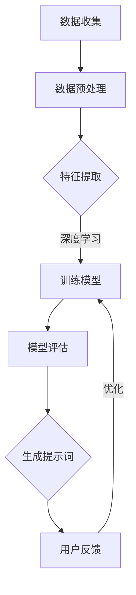

                 

## 构建AI驱动的智慧旅游个性化体验提示词引擎：让我们一步步深入思考

### 背景介绍与问题定义

在当今数字化时代，智慧旅游正逐渐成为旅游业的重要组成部分。智慧旅游不仅仅是利用互联网和移动设备来提供信息，更是通过大数据、人工智能等技术手段，为游客提供个性化、智能化的旅游体验。然而，现有的旅游信息服务系统往往难以满足用户日益多样化的需求，个性化体验提示词引擎的构建因此显得尤为重要。

首先，我们需要明确什么是个性化体验提示词引擎。它是一种利用人工智能技术，根据用户的兴趣、历史行为和实时反馈，自动生成针对个人需求的提示词的系统。这些提示词可以是旅游路线建议、餐饮推荐、活动提醒等，旨在为用户提供更加精准、个性化的服务。

然而，构建这样的系统并非易事。我们需要解决的问题包括：

1. **数据采集与处理**：如何收集并处理大量用户数据，包括用户的行为、偏好、地理位置等。
2. **算法选择与优化**：选择适合的算法模型，如深度学习、推荐系统等，并对其进行优化，以提高系统的准确性和效率。
3. **用户体验设计**：如何设计一个直观、易用的用户界面，让用户能够轻松理解并使用提示词引擎。
4. **系统性能与稳定性**：如何在保证系统性能的同时，确保其稳定运行，不会因为数据量大或用户访问频率高而出现问题。

### 核心概念与联系

为了构建AI驱动的智慧旅游个性化体验提示词引擎，我们需要理解几个核心概念，包括人工智能、个性化推荐系统、自然语言处理等。

#### 1. 人工智能（AI）

人工智能是计算机科学的一个分支，旨在创建智能机器，使其能够执行通常需要人类智能才能完成的任务。在智慧旅游领域，AI技术可以帮助我们分析用户行为，预测用户需求，从而提供个性化的旅游服务。

#### 2. 个性化推荐系统

个性化推荐系统是AI的一个应用领域，它通过分析用户的历史数据和行为，为用户推荐个性化的内容。在旅游领域，个性化推荐系统可以基于用户的兴趣和偏好，推荐旅游景点、酒店、餐饮等信息。

#### 3. 自然语言处理（NLP）

自然语言处理是AI的一个重要分支，它涉及到让计算机理解和处理人类语言。在个性化体验提示词引擎中，NLP技术可以帮助我们将用户的自然语言输入转换为计算机可以处理的数据，从而更好地理解用户的需求。

### AI驱动的个性化体验提示词引擎的工作原理

AI驱动的个性化体验提示词引擎通常包括以下几个步骤：

1. **数据采集**：从各种渠道（如社交媒体、旅游网站、移动应用程序等）收集用户数据。
2. **数据预处理**：对收集到的数据进行清洗、去重、转换等处理，以便用于后续分析。
3. **特征提取**：从预处理后的数据中提取特征，如用户的行为模式、偏好等。
4. **模型训练**：使用机器学习算法，如深度学习、决策树、推荐系统等，对提取的特征进行训练，以建立预测模型。
5. **提示词生成**：根据用户输入和模型预测，生成个性化的旅游提示词。
6. **用户反馈**：收集用户对提示词的反馈，用于模型优化和用户体验改进。

### 个性化体验提示词引擎的属性特征对比

在构建个性化体验提示词引擎时，我们需要考虑不同算法的优缺点，包括：

- **深度学习**：具有强大的特征提取和模式识别能力，但在处理小数据集时可能表现不佳。
- **推荐系统**：在处理大量用户数据时非常有效，但可能需要大量的计算资源和时间。
- **自然语言处理**：能够理解和处理自然语言，但可能需要大量的标注数据。

通过对比不同算法的属性特征，我们可以选择最适合我们需求的算法，以构建高效的个性化体验提示词引擎。

### AI驱动的个性化体验提示词引擎与传统AI的区别

与传统AI系统相比，AI驱动的个性化体验提示词引擎具有以下几个显著区别：

1. **自适应能力**：传统AI系统通常是基于预设规则和静态数据集进行设计的，而AI驱动的引擎可以根据用户的行为和反馈不断学习和优化。
2. **用户互动**：传统AI系统通常缺乏与用户的互动，而AI驱动的引擎可以通过自然语言处理技术，与用户进行实时互动，提供更加个性化的服务。
3. **实时性**：传统AI系统可能在处理实时数据时存在延迟，而AI驱动的引擎可以实时分析用户数据，并提供即时的个性化建议。

### 概念结构与核心要素组成

个性化体验提示词引擎的概念结构可以概括为以下几个核心要素：

1. **用户数据**：包括用户的基本信息、历史行为、偏好等。
2. **特征提取**：从用户数据中提取关键特征，用于模型训练。
3. **算法模型**：选择合适的机器学习算法，如深度学习、推荐系统等。
4. **提示词生成**：根据用户输入和模型预测，生成个性化的旅游提示词。
5. **用户反馈**：收集用户对提示词的反馈，用于模型优化和用户体验改进。

这些核心要素相互作用，共同构成了一个高效的个性化体验提示词引擎。

### 总结

构建AI驱动的智慧旅游个性化体验提示词引擎是一个复杂的过程，需要深入理解核心概念、算法原理、系统架构和实际应用。通过一步步的分析和思考，我们可以更好地理解这个系统的构建过程，并为其设计提供有力的支持。

接下来，我们将进一步探讨AI驱动的个性化体验提示词引擎的算法原理，包括机器学习、深度学习和推荐系统的基本概念和应用，以及如何使用这些算法来构建高效的引擎。

## 核心概念与联系：AI驱动的个性化体验提示词引擎原理

### 人工智能（AI）的基本概念

人工智能（Artificial Intelligence，简称AI）是计算机科学的一个分支，旨在使机器能够执行通常需要人类智能才能完成的任务。AI的应用领域广泛，包括语音识别、图像识别、自然语言处理、智能推荐系统等。在智慧旅游领域，AI技术可以帮助分析用户行为、预测用户需求，从而提供个性化的旅游服务。

#### 人工智能的主要分类

1. **基于规则的系统（Rule-Based Systems）**：这类系统通过预设的规则进行逻辑推理，适用于处理结构化数据。
2. **统计学习（Statistical Learning）**：通过分析历史数据，从数据中学习规律，适用于处理大规模、非结构化数据。
3. **基于实例的学习（Instance-Based Learning）**：通过存储和检索先前解决过的类似问题，适用于处理新问题的解决。
4. **基于模型的学习（Model-Based Learning）**：通过构建数学模型，对数据进行建模和预测。

#### 智能旅游中的人工智能应用

在智慧旅游领域，人工智能的应用主要体现在以下几个方面：

1. **用户行为分析**：通过分析用户在旅游平台上的行为数据，如浏览历史、搜索记录、消费行为等，了解用户的兴趣和需求。
2. **智能推荐系统**：基于用户行为数据和个性化需求，为用户提供旅游路线、景点推荐、酒店预订等个性化服务。
3. **语音识别与自然语言处理**：通过语音识别和自然语言处理技术，实现用户的语音指令理解和智能回复。
4. **图像识别与分类**：通过图像识别技术，自动识别和分类旅游景点的图片，为用户提供更加丰富的视觉信息。

### 个性化推荐系统的基本概念

个性化推荐系统（Personalized Recommendation System）是人工智能在智慧旅游中的一个重要应用。其核心目标是根据用户的历史行为和偏好，为用户推荐个性化的旅游产品和服务。

#### 个性化推荐系统的工作原理

1. **协同过滤（Collaborative Filtering）**：通过分析用户之间的相似性，为用户推荐其他用户喜欢的旅游产品。
2. **基于内容的推荐（Content-Based Filtering）**：通过分析旅游产品的特征和用户的历史偏好，为用户推荐具有相似特征的产品。
3. **混合推荐（Hybrid Recommender System）**：结合协同过滤和基于内容的推荐，以实现更好的推荐效果。

#### 个性化推荐系统的优缺点

**优点**：

1. **个性化**：能够根据用户的行为和偏好，提供高度个性化的推荐，提高用户满意度。
2. **自适应**：系统能够实时学习和调整推荐策略，以适应用户的需求变化。
3. **效率高**：通过自动化推荐，提高旅游服务效率和用户体验。

**缺点**：

1. **数据依赖**：需要大量的用户行为数据，对于新用户或数据不足的情况，推荐效果可能较差。
2. **计算复杂度高**：协同过滤和混合推荐系统通常需要大量的计算资源，对于大规模用户和数据集，可能存在性能问题。
3. **冷启动问题**：对于新用户，系统缺乏足够的历史行为数据，难以提供个性化的推荐。

### 自然语言处理（NLP）的基本概念

自然语言处理（Natural Language Processing，简称NLP）是人工智能的一个重要分支，旨在让计算机理解和处理人类语言。在个性化体验提示词引擎中，NLP技术可以帮助理解和分析用户的自然语言输入，从而提供更加智能化的服务。

#### NLP的主要任务

1. **分词（Tokenization）**：将文本分解为词或短语，以便进行后续处理。
2. **词性标注（Part-of-Speech Tagging）**：对文本中的每个词进行词性标注，如名词、动词、形容词等。
3. **句法分析（Syntactic Parsing）**：分析句子的结构，理解句子中词汇之间的语法关系。
4. **语义分析（Semantic Analysis）**：理解句子的语义含义，如实体识别、情感分析等。
5. **文本生成（Text Generation）**：根据特定的任务或场景，生成符合语法和语义规则的文本。

#### NLP在个性化体验提示词引擎中的应用

1. **用户输入解析**：通过NLP技术，理解用户的自然语言输入，提取关键信息，如景点名称、活动类型等。
2. **提示词生成**：基于用户输入和系统模型，生成符合用户需求的个性化提示词。
3. **智能回复**：通过NLP技术，实现与用户的智能对话，提供实时、个性化的服务。

### AI驱动的个性化体验提示词引擎与传统AI的区别

与传统AI系统相比，AI驱动的个性化体验提示词引擎具有以下几个显著区别：

1. **自适应能力**：传统AI系统通常基于预设规则和数据集进行设计，而AI驱动的引擎可以通过机器学习和深度学习技术，不断学习和优化，以适应用户需求的变化。
2. **用户互动**：传统AI系统通常缺乏与用户的互动，而AI驱动的引擎可以通过自然语言处理技术，与用户进行实时互动，提供更加个性化的服务。
3. **实时性**：传统AI系统可能在处理实时数据时存在延迟，而AI驱动的引擎可以实时分析用户数据，并提供即时的个性化建议。

### 个性化体验提示词引擎的概念结构与核心要素

个性化体验提示词引擎的概念结构主要包括以下几个核心要素：

1. **用户数据**：包括用户的基本信息、行为数据、偏好等。
2. **特征提取**：从用户数据中提取关键特征，用于模型训练。
3. **算法模型**：选择适合的机器学习算法，如深度学习、推荐系统等。
4. **提示词生成**：根据用户输入和模型预测，生成个性化的旅游提示词。
5. **用户反馈**：收集用户对提示词的反馈，用于模型优化和用户体验改进。

这些核心要素相互作用，共同构成了一个高效的个性化体验提示词引擎。

### 总结

通过上述分析，我们可以看到，AI驱动的个性化体验提示词引擎是一个复杂的系统，它结合了人工智能、个性化推荐系统和自然语言处理等多个技术领域。理解这些核心概念和其相互联系，是构建高效、智能的个性化体验提示词引擎的关键。接下来，我们将进一步探讨AI驱动的个性化体验提示词引擎的算法原理，包括机器学习、深度学习和推荐系统的具体应用和实现。

## 算法原理讲解：深度学习、推荐系统与自然语言处理

### 深度学习在个性化体验提示词引擎中的应用

深度学习（Deep Learning）是机器学习的一个分支，通过多层神经网络对数据进行学习，能够自动提取特征并发现数据中的复杂模式。在构建个性化体验提示词引擎时，深度学习技术具有以下应用：

#### 深度学习的核心概念

1. **神经网络（Neural Networks）**：神经网络由多个相互连接的神经元组成，每个神经元都是一个简单的函数单元。
2. **多层神经网络（Multilayer Neural Networks）**：多层神经网络通过增加隐藏层，能够提取更复杂的特征。
3. **反向传播算法（Backpropagation）**：反向传播算法用于计算神经网络参数的梯度，并用于模型优化。

#### 深度学习在个性化体验提示词引擎中的具体应用

1. **用户行为分析**：通过深度学习模型，可以从用户的历史行为数据中提取特征，如用户在旅游平台上的浏览记录、搜索关键词、消费行为等，从而更好地理解用户的需求。
2. **推荐系统**：深度学习可以用于构建推荐系统，通过学习用户的历史行为和偏好，为用户推荐个性化的旅游景点、餐饮、住宿等信息。
3. **图像识别与分类**：深度学习模型，如卷积神经网络（CNN），可以自动识别和分类旅游景点的图片，为用户提供更加丰富的视觉信息。

### 推荐系统的工作原理

推荐系统（Recommender System）是一种用于预测用户可能感兴趣的项目的方法，如商品、电影、音乐、新闻等。在个性化体验提示词引擎中，推荐系统可以基于用户的兴趣和偏好，为用户推荐个性化的旅游产品和服务。

#### 推荐系统的核心算法

1. **协同过滤（Collaborative Filtering）**：协同过滤通过分析用户之间的相似性，为用户推荐其他用户喜欢的项目。
   - **用户基于的协同过滤（User-Based Collaborative Filtering）**：通过计算用户之间的相似度，为用户推荐相似用户喜欢的项目。
   - **物品基于的协同过滤（Item-Based Collaborative Filtering）**：通过计算物品之间的相似度，为用户推荐与用户已购买或评价的物品相似的物品。

2. **基于内容的推荐（Content-Based Filtering）**：基于内容的推荐通过分析项目的特征和用户的历史偏好，为用户推荐具有相似特征的项目。

3. **混合推荐（Hybrid Recommender System）**：混合推荐系统结合协同过滤和基于内容的推荐，以实现更好的推荐效果。

#### 推荐系统在个性化体验提示词引擎中的具体应用

1. **旅游路线推荐**：根据用户的兴趣和偏好，推荐符合用户需求的旅游路线。
2. **餐饮推荐**：基于用户的口味和饮食偏好，推荐附近的餐饮场所。
3. **活动推荐**：根据用户的兴趣和地理位置，推荐符合用户兴趣的活动。

### 自然语言处理（NLP）的基本概念

自然语言处理（Natural Language Processing，简称NLP）是人工智能的一个分支，旨在使计算机能够理解和处理人类语言。在个性化体验提示词引擎中，NLP技术可以帮助理解和分析用户的自然语言输入，从而提供更加智能化的服务。

#### NLP的主要任务

1. **分词（Tokenization）**：将文本分解为词或短语，以便进行后续处理。
2. **词性标注（Part-of-Speech Tagging）**：对文本中的每个词进行词性标注，如名词、动词、形容词等。
3. **句法分析（Syntactic Parsing）**：分析句子的结构，理解句子中词汇之间的语法关系。
4. **语义分析（Semantic Analysis）**：理解句子的语义含义，如实体识别、情感分析等。
5. **文本生成（Text Generation）**：根据特定的任务或场景，生成符合语法和语义规则的文本。

#### NLP在个性化体验提示词引擎中的具体应用

1. **用户输入解析**：通过NLP技术，理解用户的自然语言输入，提取关键信息，如景点名称、活动类型等。
2. **提示词生成**：基于用户输入和系统模型，生成符合用户需求的个性化提示词。
3. **智能回复**：通过NLP技术，实现与用户的智能对话，提供实时、个性化的服务。

### 算法mermaid流程图示例

为了更好地理解上述算法的原理，我们可以使用mermaid绘制算法的流程图。以下是一个基于深度学习的推荐系统的mermaid流程图示例：

### 算法原理详细讲解

#### 数据收集

数据收集是构建个性化体验提示词引擎的第一步。我们需要从多个渠道收集用户数据，包括用户的基本信息、行为数据、偏好数据等。这些数据可以来自旅游平台、社交媒体、用户反馈等。

#### 数据预处理

收集到的数据通常是杂乱无章的，因此需要进行预处理。预处理步骤包括数据清洗、去重、转换等。数据清洗是指去除数据中的噪声和错误，如删除重复记录、处理缺失值等。数据转换是指将数据转换为适合模型训练的格式，如将文本数据转换为词向量。

#### 特征提取

特征提取是从预处理后的数据中提取关键特征，用于模型训练。特征提取的目的是从原始数据中提取有用的信息，以提高模型的准确性和效率。在个性化体验提示词引擎中，常见的特征包括用户的历史行为、偏好、地理位置等。

#### 训练模型

训练模型是使用深度学习算法，如卷积神经网络（CNN）、循环神经网络（RNN）等，对提取的特征进行训练。模型训练的目的是通过学习用户的行为和偏好，建立一个能够预测用户需求的模型。

#### 模型评估

模型评估是评估模型性能的过程。常用的评估指标包括准确率、召回率、F1分数等。通过评估模型性能，我们可以了解模型的准确性、召回率和泛化能力。

#### 提示词生成

基于用户输入和训练好的模型，我们可以生成个性化的提示词。提示词可以是旅游路线建议、餐饮推荐、活动提醒等，旨在为用户提供个性化的服务。

#### 用户反馈

收集用户对提示词的反馈，用于模型优化和用户体验改进。用户反馈可以帮助我们了解模型的不足之处，从而进行模型优化和调整。

### 算法原理的数学模型和公式

在构建个性化体验提示词引擎时，我们通常需要使用数学模型和公式来描述算法的原理和实现。以下是一个简单的数学模型和公式示例：

$$
P(y|X) = \sigma(\theta^T X)
$$

其中，\(P(y|X)\)表示在特征\(X\)下预测标签\(y\)的概率，\(\sigma\)表示sigmoid函数，\(\theta\)表示模型的参数。

### 算法原理举例说明

假设我们有一个旅游用户，他喜欢历史和文化景点。我们可以使用深度学习算法，如卷积神经网络（CNN），来提取用户的历史行为和偏好特征。通过训练，模型可以学会识别用户喜欢的历史和文化景点的特征，并生成相应的提示词，如“您可能喜欢故宫博物院”或“推荐参观长城”。

### 总结

通过以上讲解，我们可以看到，构建AI驱动的个性化体验提示词引擎涉及多个技术领域，包括深度学习、推荐系统和自然语言处理。理解这些算法原理和应用，是构建高效、智能的个性化体验提示词引擎的关键。接下来，我们将进一步探讨个性化体验提示词引擎的数学模型和公式，以及如何使用这些模型和公式来优化和改进系统性能。

## 数学模型和数学公式

### 基础数学概念

在构建AI驱动的个性化体验提示词引擎时，理解一些基础数学概念是非常重要的。这些概念包括概率论、数理统计和最优化理论。以下是对这些概念的基本介绍。

#### 概率论

概率论是研究随机事件的数学分支。在个性化体验提示词引擎中，概率论用于模型预测和评估。例如，我们可以使用贝叶斯定理来计算给定某些特征的情况下标签出现的概率。

贝叶斯定理公式如下：

$$
P(A|B) = \frac{P(B|A)P(A)}{P(B)}
$$

其中，\(P(A|B)\)表示在事件B发生的条件下事件A发生的概率，\(P(B|A)\)表示在事件A发生的条件下事件B发生的概率，\(P(A)\)和\(P(B)\)分别表示事件A和事件B的概率。

#### 数理统计

数理统计是用于分析数据、估计参数和进行假设检验的数学工具。在个性化体验提示词引擎中，数理统计用于数据预处理、特征提取和模型评估。

常用的统计量包括均值、方差、标准差等。例如，均值的计算公式如下：

$$
\bar{x} = \frac{1}{n}\sum_{i=1}^{n} x_i
$$

其中，\(\bar{x}\)表示均

