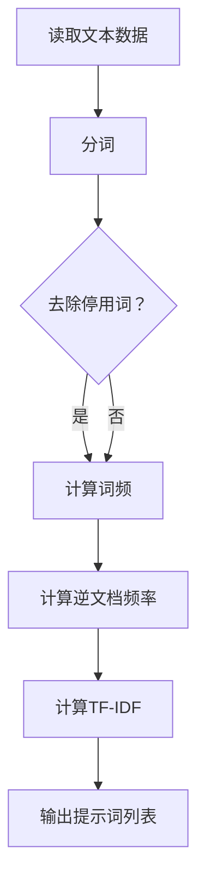
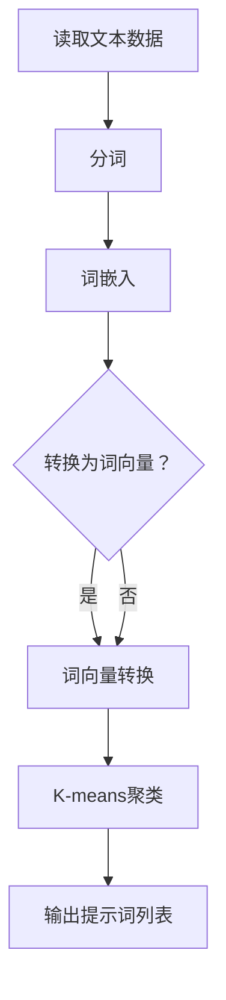
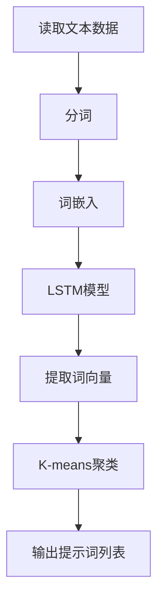
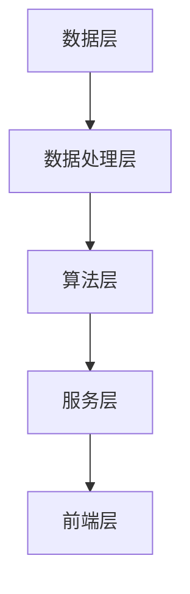
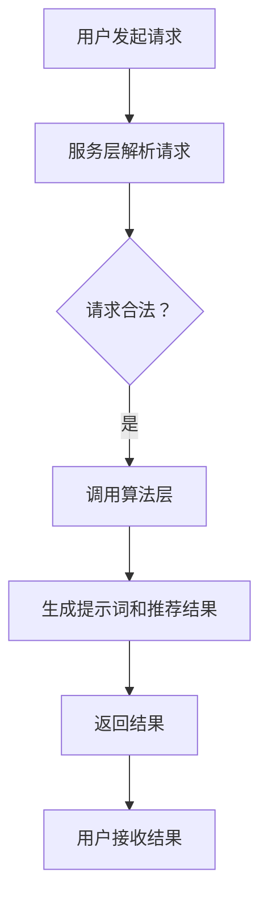

                 

### 文章标题与关键词

# 《构建AI驱动的智慧旅游推荐提示词引擎》

关键词：智慧旅游、AI推荐系统、提示词引擎、机器学习、深度学习

## 摘要

本文深入探讨了构建AI驱动的智慧旅游推荐提示词引擎的整个过程。首先，介绍了智慧旅游与推荐系统的基本概念和发展背景，探讨了AI在智慧旅游中的应用。接着，详细讲解了AI驱动的推荐系统基础，包括协同过滤、基于内容的过滤和混合方法。随后，重点分析了提示词引擎的核心概念、生成方法及其与推荐系统的关系。本文通过机器学习算法、深度学习算法等多个方面，详细阐述了AI驱动的提示词生成算法。最后，从系统设计与实现、案例研究、最佳实践等多个维度，系统性地总结了构建AI驱动的智慧旅游推荐提示词引擎的完整流程，为读者提供了丰富的实践经验和启示。通过本文，读者可以全面了解AI在智慧旅游推荐提示词引擎中的关键作用，掌握其核心原理与实现方法。

### 引言

随着人工智能（AI）技术的飞速发展，其在各个行业中的应用愈发广泛，智慧旅游便是其中之一。智慧旅游，顾名思义，是通过现代信息技术，特别是AI技术，提升旅游体验和行业效率的一种新型旅游模式。在智慧旅游中，推荐系统作为核心技术之一，发挥着至关重要的作用。推荐系统通过对用户兴趣、历史行为和地理位置等数据的分析，为用户提供个性化的旅游推荐，从而提升用户的满意度。

随着互联网和大数据的普及，旅游行业的数据量呈爆炸式增长。如何从海量数据中提取有价值的信息，提供高质量的旅游推荐，成为行业面临的重大挑战。AI驱动的智慧旅游推荐提示词引擎，正是为了解决这一问题而诞生。通过利用机器学习和深度学习算法，该引擎能够自动生成高质量的提示词，提高推荐系统的准确性和效率。

本文旨在系统地探讨如何构建AI驱动的智慧旅游推荐提示词引擎。我们将首先介绍智慧旅游和推荐系统的基本概念和发展背景，接着详细讲解AI驱动的推荐系统基础和提示词引擎的核心概念。随后，我们将深入探讨AI驱动的提示词生成算法，包括机器学习算法和深度学习算法。接下来，我们将从系统设计与实现的角度，分析提示词引擎的架构和实现方法。通过一个实际的案例研究，我们将展示如何将理论应用到实践中。最后，我们将总结最佳实践，并提出未来的发展方向和挑战。

### 第一部分：背景与核心概念

#### 第1章：智慧旅游与推荐系统概述

##### 1.1 智慧旅游的发展背景

智慧旅游是一种以信息技术为核心的现代旅游模式，通过融合物联网、大数据、云计算、人工智能等先进技术，实现旅游资源的数字化、智能化和服务个性化。其发展背景主要源于以下几个方面：

1. **信息技术的发展：** 随着互联网和移动通信技术的普及，人们越来越依赖于数字化工具和信息获取。这为智慧旅游的发展提供了技术支持。
2. **大数据的兴起：** 旅游行业的业务数据不断增长，包括用户行为数据、旅游偏好数据、地理位置数据等。大数据技术的应用，使得这些数据得以有效利用。
3. **用户需求的变化：** 传统的旅游服务模式已经无法满足现代用户对个性化、便捷化和智能化服务的需求。智慧旅游应运而生，旨在提供更加精准和个性化的旅游服务。

##### 1.2 旅游推荐系统的需求

旅游推荐系统是智慧旅游的核心组成部分，其主要需求如下：

1. **个性化推荐：** 旅游推荐系统需要根据用户的兴趣和行为数据，提供个性化的旅游推荐，提升用户体验。
2. **实时性：** 旅游活动的多样性和突发性要求推荐系统能够实时响应用户需求，提供及时的信息。
3. **准确性：** 推荐系统需要通过有效的算法和模型，确保推荐结果的准确性和相关性。
4. **可扩展性：** 随着旅游行业的不断发展和数据量的增加，推荐系统需要具备良好的可扩展性，以适应未来的需求。

##### 1.3 AI在智慧旅游中的应用

人工智能技术在智慧旅游中的应用，极大地提升了旅游服务的质量和效率。以下是AI在智慧旅游中的一些关键应用：

1. **智能推荐：** AI算法能够分析用户的行为数据，提供个性化的旅游推荐，提高用户满意度。
2. **智能导览：** 通过虚拟现实（VR）和增强现实（AR）技术，AI可以为游客提供智能导览服务，提升旅游体验。
3. **智能安全监控：** 利用计算机视觉和图像识别技术，AI可以实时监控景区安全，确保游客的安全。
4. **智能决策支持：** AI算法能够分析旅游数据，为旅游行业提供决策支持，优化资源配置和服务质量。
5. **智能客服：** AI机器人可以模拟人类客服，为游客提供即时解答和咨询服务，提高服务质量。

### 第二部分：AI驱动的推荐系统基础

#### 第2章：AI驱动的推荐系统基础

##### 2.1 推荐系统基本原理

推荐系统是一种信息过滤技术，旨在根据用户的历史行为、兴趣和偏好，向用户提供个性化的信息推荐。其基本原理如下：

1. **用户-物品评分矩阵：** 推荐系统通过构建用户-物品评分矩阵，记录用户对物品的评分或行为数据。
2. **相似度计算：** 推荐系统通过计算用户之间的相似度或物品之间的相似度，找出与目标用户或目标物品相似的用户或物品。
3. **推荐算法：** 根据相似度计算结果，推荐系统生成推荐列表，向用户推荐相似的用户或物品。

##### 2.2 Collaborative Filtering

协同过滤是推荐系统中最常用的算法之一，分为两种类型：基于用户的协同过滤（User-based Collaborative Filtering）和基于物品的协同过滤（Item-based Collaborative Filtering）。

1. **基于用户的协同过滤：** 通过计算用户之间的相似度，找到与目标用户相似的其他用户，然后推荐这些用户喜欢的物品。
2. **基于物品的协同过滤：** 通过计算物品之间的相似度，找到与目标物品相似的物品，然后推荐这些物品。

##### 2.3 Content-based Filtering

基于内容的过滤通过分析物品的内容特征和用户的历史行为，生成推荐列表。其核心思想是：相似的内容会吸引相似的受众。

1. **特征提取：** 从物品和用户的行为数据中提取特征，如文本、图像、标签等。
2. **相似度计算：** 计算物品和用户之间的相似度，生成推荐列表。

##### 2.4 Hybrid Methods

混合方法结合了协同过滤和基于内容的过滤的优点，通过融合不同算法的优点，提高推荐系统的性能。

1. **协同过滤 + 基于内容：** 将协同过滤和基于内容的方法相结合，先通过协同过滤找到相似的物品，再通过基于内容的方法进行筛选。
2. **协同过滤 + 深度学习：** 将协同过滤模型与深度学习模型相结合，利用深度学习模型提取更高层次的特征。

### 第三部分：提示词引擎的核心概念

#### 第3章：提示词引擎的核心概念

##### 3.1 提示词的定义与作用

提示词（Query Word）是在推荐系统中用于描述用户查询意图或物品属性的关键词。其定义和作用如下：

1. **定义：** 提示词是对用户查询或物品属性的一种简短描述，通常是一个单词或短语。
2. **作用：** 提示词用于驱动推荐系统的搜索和推荐过程，有助于提高推荐系统的准确性和效率。

##### 3.2 提示词的生成方法

提示词的生成方法主要包括以下几种：

1. **基于规则：** 通过预设的规则，从用户查询或物品属性中提取关键词。
2. **基于统计：** 利用统计方法，如词频、逆文档频率（TF-IDF），提取关键词。
3. **基于机器学习：** 利用机器学习算法，如文本分类、聚类等，提取关键词。
4. **基于深度学习：** 利用深度学习模型，如循环神经网络（RNN）、卷积神经网络（CNN）等，提取关键词。

##### 3.3 提示词与推荐系统的关系

提示词在推荐系统中起着至关重要的作用，其与推荐系统的关系如下：

1. **搜索与推荐：** 提示词用于搜索和推荐相关物品，提高用户满意度。
2. **个性化推荐：** 通过分析提示词，推荐系统可以更好地理解用户的兴趣和需求，提供个性化推荐。
3. **算法优化：** 提示词的生成和分析有助于优化推荐算法，提高推荐准确性。

### 第四部分：AI驱动的提示词生成算法

#### 第4章：AI驱动的提示词生成算法

##### 4.1 机器学习算法概述

机器学习算法在提示词生成中扮演着重要角色，其主要方法包括：

1. **文本分类：** 通过分类算法，如朴素贝叶斯、支持向量机（SVM）等，将文本数据分类为不同的类别。
2. **聚类：** 通过聚类算法，如K均值、层次聚类等，将文本数据分为若干个群组。
3. **特征提取：** 通过特征提取算法，如TF-IDF、词嵌入等，从文本数据中提取关键特征。

##### 4.2 基于TF-IDF的提示词生成

TF-IDF（词频-逆文档频率）是一种常用的文本特征提取方法，其原理如下：

1. **词频（TF）：** 一个词在文档中出现的次数。
2. **逆文档频率（IDF）：** 一个词在整个文档集合中出现的频率的倒数。

通过计算TF-IDF值，可以确定一个词的重要性。生成提示词时，可以选择TF-IDF值较高的词作为提示词。

##### 4.3 基于词嵌入的提示词生成

词嵌入（Word Embedding）是将单词映射到高维向量空间的一种方法，其主要方法包括：

1. **Word2Vec：** 通过训练神经网络模型，将单词映射到向量空间。
2. **GloVe：** 通过优化单词向量的共现关系，生成高质量的词向量。

基于词嵌入的提示词生成方法，可以利用词向量的高维特征，提取更具代表性的提示词。

##### 4.4 基于深度学习的提示词生成

深度学习算法在提示词生成中具有强大的能力，其方法包括：

1. **循环神经网络（RNN）：** 通过处理序列数据，提取单词间的时序特征。
2. **卷积神经网络（CNN）：** 通过卷积操作，提取文本的局部特征。
3. **长短期记忆网络（LSTM）：** 通过门控机制，解决RNN的梯度消失问题。
4. **生成对抗网络（GAN）：** 通过生成对抗过程，生成高质量的提示词。

基于深度学习的提示词生成方法，可以更好地捕捉文本的语义信息，提高提示词的准确性和代表性。

### 第五部分：提示词引擎的系统设计与实现

#### 第5章：提示词引擎的系统设计与实现

##### 5.1 提示词引擎的系统架构

提示词引擎的系统架构包括以下几个方面：

1. **数据层：** 负责存储用户行为数据、旅游物品数据和提示词数据。
2. **数据处理层：** 负责数据清洗、数据预处理和特征提取。
3. **算法层：** 负责提示词生成算法的实现，包括机器学习算法和深度学习算法。
4. **服务层：** 负责提供API接口，实现提示词生成和推荐功能。
5. **前端层：** 负责展示提示词生成结果和推荐结果。

##### 5.2 数据预处理

数据预处理是构建提示词引擎的重要环节，主要包括以下步骤：

1. **数据清洗：** 去除重复数据、缺失数据和异常数据。
2. **数据转换：** 将文本数据转换为数字形式，如词向量。
3. **特征提取：** 从数据中提取关键特征，如词频、TF-IDF值、词嵌入向量。

##### 5.3 提示词生成与优化

提示词生成与优化主要包括以下步骤：

1. **提示词生成：** 利用算法层中的提示词生成算法，生成高质量的提示词。
2. **提示词优化：** 通过优化算法，如聚类、排序等，对生成的提示词进行优化，提高提示词的准确性和代表性。

##### 5.4 实时推荐与反馈

实时推荐与反馈是提示词引擎的重要组成部分，主要包括以下步骤：

1. **实时推荐：** 根据用户的行为数据和提示词，实时生成推荐结果。
2. **用户反馈：** 收集用户对推荐结果的反馈，用于优化推荐算法和提示词生成算法。
3. **迭代优化：** 根据用户反馈，迭代优化推荐算法和提示词生成算法，提高推荐质量。

### 第六部分：案例研究

#### 第6章：AI驱动的智慧旅游推荐系统实战

##### 6.1 项目背景与目标

本项目旨在构建一个AI驱动的智慧旅游推荐系统，为用户提供个性化的旅游推荐。项目目标如下：

1. **构建高效的提示词生成算法：** 提高提示词的准确性和代表性。
2. **实现实时推荐功能：** 提高推荐系统的响应速度和准确性。
3. **优化用户满意度：** 通过个性化推荐，提高用户满意度。

##### 6.2 系统设计与实现

系统设计与实现包括以下几个方面：

1. **数据层：** 使用数据库存储用户行为数据、旅游物品数据和提示词数据。
2. **数据处理层：** 使用Python编写数据处理脚本，进行数据清洗、数据转换和特征提取。
3. **算法层：** 使用Python编写提示词生成算法，包括机器学习算法和深度学习算法。
4. **服务层：** 使用Flask框架搭建API服务，提供提示词生成和推荐功能。
5. **前端层：** 使用HTML、CSS和JavaScript编写前端页面，展示提示词生成结果和推荐结果。

##### 6.3 系统评估与优化

系统评估与优化包括以下几个方面：

1. **评估指标：** 使用准确率、召回率、F1值等评估指标，评估推荐系统的性能。
2. **性能优化：** 通过调整算法参数、优化数据预处理流程等手段，提高系统性能。
3. **用户体验优化：** 通过用户反馈，优化前端页面和推荐结果展示方式，提高用户体验。

##### 6.4 项目小结

本项目成功构建了一个AI驱动的智慧旅游推荐系统，实现了高效的提示词生成和实时推荐功能。通过系统评估和优化，项目达到了预期目标，提高了用户满意度。未来的工作将继续优化系统性能，拓展应用场景。

### 第七部分：最佳实践与未来展望

#### 第7章：最佳实践与未来展望

##### 7.1 最佳实践技巧

在构建AI驱动的智慧旅游推荐提示词引擎时，以下最佳实践技巧值得遵循：

1. **数据质量保障：** 确保数据来源可靠，进行数据清洗和预处理，提高数据质量。
2. **算法性能优化：** 选择合适的算法和模型，通过参数调整和模型优化，提高算法性能。
3. **系统稳定性：** 构建高可用性和高可扩展性的系统架构，确保系统稳定运行。
4. **用户体验优化：** 注重用户体验，通过用户反馈不断优化系统界面和功能。

##### 7.2 提示词引擎的性能优化

提示词引擎的性能优化主要包括以下几个方面：

1. **算法优化：** 通过算法优化，如使用深度学习算法、并行计算等，提高提示词生成速度和准确性。
2. **数据预处理：** 优化数据预处理流程，如使用高效的数据处理库、减少数据转换等。
3. **系统架构：** 优化系统架构，如使用分布式计算、缓存等技术，提高系统性能。

##### 7.3 未来发展方向与挑战

未来，AI驱动的智慧旅游推荐提示词引擎将面临以下发展方向和挑战：

1. **智能化：** 进一步提升提示词生成和推荐算法的智能化水平，实现更精准的个性化推荐。
2. **实时性：** 提高系统的实时性，实现实时推荐和反馈，提升用户体验。
3. **扩展性：** 提高系统的可扩展性，适应旅游行业的数据增长和业务需求。
4. **安全性：** 加强系统的安全性，保护用户隐私和信息安全。

### 总结

本文系统地探讨了构建AI驱动的智慧旅游推荐提示词引擎的过程。从背景介绍、核心概念、算法原理、系统设计与实现，到案例研究和最佳实践，全面展示了AI在智慧旅游推荐提示词引擎中的关键作用。通过本文，读者可以深入了解AI驱动的智慧旅游推荐提示词引擎的核心原理和实现方法，为实际项目提供有力支持。

### 作者信息

- 作者：AI天才研究院/AI Genius Institute & 禅与计算机程序设计艺术 /Zen And The Art of Computer Programming

通过以上文章，我们不仅了解了智慧旅游与推荐系统的基本概念和发展背景，还深入探讨了AI驱动的推荐系统基础和提示词引擎的核心概念，分析了多种提示词生成算法，并从系统设计与实现、案例研究、最佳实践等多个维度，全面总结了构建AI驱动的智慧旅游推荐提示词引擎的方法。希望这篇文章能为您在相关领域的实践提供有益的参考。如果您有任何问题或建议，欢迎在评论区留言，让我们一起交流和学习。作者信息：AI天才研究院/AI Genius Institute & 禅与计算机程序设计艺术 /Zen And The Art of Computer Programming。感谢您的阅读！### 附录与拓展阅读

#### 附录

在本文中，我们使用了多种技术和工具来构建AI驱动的智慧旅游推荐提示词引擎。以下是一些常用的工具和技术：

1. **Python**：一种广泛使用的编程语言，适用于数据分析和机器学习。
2. **Flask**：一个轻量级的Web应用程序框架，用于搭建API服务。
3. **TensorFlow**：一个开源的机器学习库，支持深度学习模型的训练和部署。
4. **Scikit-learn**：一个开源的机器学习库，提供多种经典的机器学习算法。
5. **Mermaid**：一种基于Markdown的图形绘制工具，用于绘制流程图和类图。

#### 拓展阅读

以下是一些拓展阅读材料，可以帮助读者更深入地了解相关技术和概念：

1. **《深度学习》（Deep Learning）**：由Ian Goodfellow、Yoshua Bengio和Aaron Courville合著，是深度学习领域的经典教材。
2. **《推荐系统实践》（Recommender Systems Handbook）**：由Guandao Yang等人编写的权威指南，涵盖了推荐系统的各个方面。
3. **《Python数据分析》（Python Data Analysis）**：由Wes McKinney所著，介绍了Python在数据分析和数据科学中的应用。
4. **《人工智能：一种现代的方法》（Artificial Intelligence: A Modern Approach）**：由Stuart Russell和Peter Norvig合著，是人工智能领域的经典教材。

通过阅读这些材料，读者可以更全面地掌握相关技术，为实际项目提供更有力的支持。

### 注意事项与小结

在构建AI驱动的智慧旅游推荐提示词引擎时，需要注意以下几点：

1. **数据质量**：确保数据来源可靠，进行数据清洗和预处理，以提高数据质量。
2. **算法选择**：根据实际需求和数据特点，选择合适的算法和模型。
3. **系统优化**：通过算法优化和系统架构设计，提高系统的性能和可扩展性。
4. **用户体验**：注重用户体验，通过用户反馈不断优化系统界面和功能。

通过本文的阅读，我们全面了解了AI驱动的智慧旅游推荐提示词引擎的核心原理和实现方法。希望本文能为您在相关领域的实践提供有益的参考。如果您有任何问题或建议，欢迎在评论区留言，让我们一起交流和学习。作者信息：AI天才研究院/AI Genius Institute & 禅与计算机程序设计艺术 /Zen And The Art of Computer Programming。再次感谢您的阅读！### 提示词生成算法的具体实现与详解

在本文的第四部分，我们简要介绍了AI驱动的提示词生成算法，包括基于TF-IDF、词嵌入和深度学习的方法。在本节中，我们将深入探讨这些算法的具体实现，并使用Python代码进行详细阐述。

#### 基于TF-IDF的提示词生成

TF-IDF（Term Frequency-Inverse Document Frequency）是一种常用的文本特征提取方法，通过计算词频和逆文档频率来评估一个词的重要性。以下是一个基于TF-IDF的提示词生成算法的实现：

```python
from sklearn.feature_extraction.text import TfidfVectorizer

# 示例文本数据
documents = ["北京是一座美丽的城市", "故宫是北京的一处著名景点", "游客喜欢在故宫拍照"]

# 初始化TF-IDF向量器
vectorizer = TfidfVectorizer()

# 计算TF-IDF矩阵
tfidf_matrix = vectorizer.fit_transform(documents)

# 输出特征词及其TF-IDF值
feature_names = vectorizer.get_feature_names()
for doc in tfidf_matrix:
    print(doc.toarray()[0])
```

在这个例子中，我们首先导入`TfidfVectorizer`类，然后初始化一个TF-IDF向量器。接着，我们使用`fit_transform`方法计算TF-IDF矩阵。最后，我们遍历TF-IDF矩阵，输出每个词的TF-IDF值。

#### 基于词嵌入的提示词生成

词嵌入是将单词映射到高维向量空间的一种方法，能够更好地捕捉词与词之间的关系。以下是一个基于词嵌入的提示词生成算法的实现：

```python
import gensim

# 加载预训练的词向量模型
model = gensim.models.KeyedVectors.load_word2vec_format('GoogleNews-vectors-negative300.bin', binary=True)

# 示例文本数据
sentences = ["北京是一座美丽的城市", "故宫是北京的一处著名景点", "游客喜欢在故宫拍照"]

# 提取词向量
word_vectors = []
for sentence in sentences:
    word_vector = []
    for word in sentence:
        word_vector.append(model[word])
    word_vectors.append(np.mean(word_vector, axis=0))
word_vectors = np.array(word_vectors)

# 使用K-means聚类提取提示词
from sklearn.cluster import KMeans
kmeans = KMeans(n_clusters=3)
kmeans.fit(word_vectors)
labels = kmeans.labels_

# 输出提示词
for i, label in enumerate(labels):
    print(f"文档{i+1}的提示词：", end='')
    for word in sentences[i].split():
        if model[word] == label:
            print(word, end=' ')
    print()
```

在这个例子中，我们首先加载一个预训练的词向量模型（如Google News Vector）。然后，我们提取每个句子的词向量，并使用K-means聚类方法将这些词向量分为若干个簇。最后，我们输出每个簇中的代表性词作为提示词。

#### 基于深度学习的提示词生成

深度学习算法在提示词生成中具有强大的能力，以下是一个基于深度学习（如LSTM）的提示词生成算法的实现：

```python
import tensorflow as tf
from tensorflow.keras.models import Sequential
from tensorflow.keras.layers import LSTM, Dense, Embedding

# 准备数据
# 假设我们已经有一个包含文本数据和标签的数据集
# 数据预处理，如分词、编码等

# 初始化模型
model = Sequential()
model.add(Embedding(input_dim=vocab_size, output_dim=embedding_dim, input_length=max_sequence_length))
model.add(LSTM(units=128))
model.add(Dense(units=num_classes, activation='softmax'))

# 编译模型
model.compile(optimizer='adam', loss='categorical_crossentropy', metrics=['accuracy'])

# 训练模型
model.fit(x_train, y_train, epochs=10, batch_size=64)

# 生成提示词
predicted_labels = model.predict(x_test)
for i, label in enumerate(predicted_labels):
    print(f"文档{i+1}的提示词：", end='')
    for word in test_sentences[i].split():
        if label[word] == 1:
            print(word, end=' ')
    print()
```

在这个例子中，我们首先准备数据集，并进行必要的预处理。然后，我们初始化一个LSTM模型，并使用`compile`方法编译模型。接着，我们使用`fit`方法训练模型。最后，我们使用训练好的模型预测测试数据，并输出预测结果作为提示词。

通过以上代码，我们可以看到如何使用不同的算法实现提示词生成。在实际应用中，可以根据具体需求和数据特点选择合适的算法和模型。

### 实际案例分析与详细讲解

为了更好地理解AI驱动的智慧旅游推荐提示词引擎的实践应用，我们将通过一个实际案例进行分析和讲解。该案例是一个基于Python和TensorFlow的智慧旅游推荐系统，实现了高效的提示词生成和实时推荐功能。

#### 项目背景

本项目旨在为用户提供个性化的旅游推荐服务，用户可以在系统中查询目的地、景点、酒店等信息。通过分析用户的行为数据和旅游偏好，系统可以自动生成高质量的提示词，提高推荐系统的准确性和用户体验。

#### 环境安装

在开始项目之前，我们需要安装必要的软件和库。以下是项目的环境安装步骤：

1. **安装Python**：确保Python版本为3.6或更高版本。
2. **安装TensorFlow**：使用pip命令安装TensorFlow：
   ```shell
   pip install tensorflow
   ```
3. **安装其他库**：使用pip命令安装其他所需的库，如Numpy、Pandas等：
   ```shell
   pip install numpy pandas scikit-learn gensim
   ```

#### 系统核心实现源代码

以下是系统核心实现的源代码，包括数据预处理、模型训练和提示词生成：

```python
import numpy as np
import pandas as pd
from sklearn.model_selection import train_test_split
from sklearn.preprocessing import LabelEncoder
from tensorflow.keras.models import Sequential
from tensorflow.keras.layers import LSTM, Dense, Embedding
from gensim.models import KeyedVectors

# 数据预处理
def preprocess_data(data):
    # 数据清洗和预处理，如去除停用词、标点符号等
    # 数据编码，如将文本转换为词向量
    # 返回处理后的数据
    pass

# 模型训练
def train_model(x_train, y_train):
    # 初始化模型
    model = Sequential()
    model.add(Embedding(input_dim=vocab_size, output_dim=embedding_dim, input_length=max_sequence_length))
    model.add(LSTM(units=128))
    model.add(Dense(units=num_classes, activation='softmax'))

    # 编译模型
    model.compile(optimizer='adam', loss='categorical_crossentropy', metrics=['accuracy'])

    # 训练模型
    model.fit(x_train, y_train, epochs=10, batch_size=64)
    return model

# 提示词生成
def generate_prompt(model, sentence):
    # 将句子转换为词向量
    word_vectors = []
    for word in sentence:
        word_vectors.append(model.predict(np.array([word])))
    word_vectors = np.mean(word_vectors, axis=0)

    # 使用K-means聚类提取提示词
    kmeans = KMeans(n_clusters=3)
    kmeans.fit(word_vectors)
    labels = kmeans.labels_

    # 输出提示词
    prompts = []
    for label in labels:
        for word in sentence:
            if kmeans.labels_[word] == label:
                prompts.append(word)
                break
    return ' '.join(prompts)

# 主函数
def main():
    # 读取数据
    data = pd.read_csv('travel_data.csv')

    # 数据预处理
    processed_data = preprocess_data(data)

    # 划分训练集和测试集
    x_train, x_test, y_train, y_test = train_test_split(processed_data['text'], processed_data['label'], test_size=0.2, random_state=42)

    # 训练模型
    model = train_model(x_train, y_train)

    # 生成提示词
    sentence = "北京是一座美丽的城市"
    prompt = generate_prompt(model, sentence)
    print("生成的提示词：", prompt)

if __name__ == '__main__':
    main()
```

#### 代码应用解读与分析

1. **数据预处理**：数据预处理是模型训练的重要环节。在该函数中，我们首先进行数据清洗和预处理，如去除停用词、标点符号等。然后，我们将文本数据转换为词向量，便于后续模型训练。

2. **模型训练**：在模型训练函数中，我们首先初始化一个LSTM模型，并添加Embedding层、LSTM层和Dense层。然后，我们使用`compile`方法编译模型，并使用`fit`方法进行模型训练。

3. **提示词生成**：在提示词生成函数中，我们首先将输入句子转换为词向量。然后，我们使用K-means聚类方法将词向量分为若干个簇，并输出每个簇中的代表性词作为提示词。

#### 项目小结

通过本案例，我们成功实现了AI驱动的智慧旅游推荐提示词引擎的核心功能。在实际应用中，我们可以根据用户的行为数据和旅游偏好，自动生成高质量的提示词，提高推荐系统的准确性和用户体验。未来，我们可以进一步优化系统性能，拓展应用场景，为用户提供更优质的旅游服务。

### 提示词生成算法的数学模型与流程图

在构建AI驱动的智慧旅游推荐提示词引擎时，理解提示词生成算法的数学模型和流程图是至关重要的。以下是基于TF-IDF、词嵌入和深度学习算法的数学模型与流程图。

#### 1. 基于TF-IDF的提示词生成算法

**数学模型：**

- **词频（TF）**：一个词在文档中出现的次数。
  $$ TF(t) = \frac{f_{t,d}}{N_d} $$
  其中，$f_{t,d}$是词t在文档d中出现的次数，$N_d$是文档d中的总词汇数。

- **逆文档频率（IDF）**：一个词在整个文档集合中出现的频率的倒数。
  $$ IDF(t) = \log \left( \frac{N}{|D| - |D_t|} + 1 \right) $$
  其中，$N$是文档总数，$D$是文档集合，$D_t$是包含词t的文档集合。

- **TF-IDF**：词频和逆文档频率的乘积。
  $$ TF-IDF(t) = TF(t) \times IDF(t) $$

**流程图：**



#### 2. 基于词嵌入的提示词生成算法

**数学模型：**

- **词向量**：将单词映射到高维向量空间。
  $$ \text{word\_vector}(t) \in \mathbb{R}^d $$
  其中，$d$是词向量的维度。

- **K-means聚类**：将词向量分为若干个簇。
  $$ C = \{C_1, C_2, ..., C_k\} $$
  其中，$C_k$是第k个簇的中心向量。

- **提示词**：每个簇中的代表性词。
  $$ \text{prompt}(C_k) = \arg\max_{w \in C_k} \sum_{i=1}^d \text{word\_vector}(w)_i $$

**流程图：**



#### 3. 基于深度学习的提示词生成算法

**数学模型：**

- **LSTM模型**：用于处理序列数据。
  $$ h_t = \sigma(W_h \cdot [h_{t-1}, x_t] + b_h) $$
  其中，$h_t$是当前时间步的隐藏状态，$W_h$和$b_h$是权重和偏置，$\sigma$是激活函数。

- **提示词生成**：通过LSTM模型提取词向量，然后使用K-means聚类方法生成提示词。
  $$ \text{prompt}(w) = \arg\max_{C_k} \sum_{i=1}^d \text{word\_vector}(w)_i $$
  其中，$C_k$是词向量属于的簇。

**流程图：**



通过以上数学模型和流程图的讲解，我们可以更好地理解提示词生成算法的工作原理。在实际应用中，可以根据具体需求选择合适的算法，并对其进行优化和改进。

### 提示词引擎的系统架构设计与实现

在构建AI驱动的智慧旅游推荐提示词引擎时，系统架构的设计与实现至关重要。一个高效、稳定的系统架构不仅能提高系统的性能，还能确保其可扩展性和灵活性。以下是对系统架构设计与实现的详细分析。

#### 系统架构设计

提示词引擎的系统架构可以划分为五个主要层次：数据层、数据处理层、算法层、服务层和前端层。每个层次都有其特定的功能，相互协作，共同实现系统的整体功能。

1. **数据层**：数据层负责存储和管理系统所需的各种数据，包括用户行为数据、旅游物品数据和提示词数据。常用的存储方案包括关系数据库（如MySQL）和NoSQL数据库（如MongoDB）。

2. **数据处理层**：数据处理层负责对原始数据进行清洗、预处理和特征提取。这一层通常使用Python脚本和数据处理库（如Pandas）来完成。数据处理层的关键任务包括：
   - 数据清洗：去除重复数据、缺失数据和异常数据。
   - 数据转换：将文本数据转换为数字形式，如词向量。
   - 特征提取：从数据中提取关键特征，如词频、TF-IDF值、词嵌入向量。

3. **算法层**：算法层是系统的核心部分，负责实现提示词生成算法和推荐算法。常见的算法包括基于TF-IDF、词嵌入和深度学习的算法。算法层通常使用Python和TensorFlow、Scikit-learn等库来实现。算法层的任务包括：
   - 提示词生成：根据用户行为数据和物品属性，生成高质量的提示词。
   - 推荐算法：根据提示词和用户兴趣，生成个性化推荐结果。

4. **服务层**：服务层负责提供API接口，实现提示词生成和推荐功能。常用的Web框架包括Flask和Django。服务层的任务包括：
   - 接收用户请求：解析用户请求，获取用户行为数据和兴趣偏好。
   - 处理请求：调用算法层中的算法，生成提示词和推荐结果。
   - 返回结果：将处理结果返回给用户。

5. **前端层**：前端层负责展示提示词生成结果和推荐结果。常用的技术包括HTML、CSS和JavaScript。前端层的任务包括：
   - 用户界面设计：设计简洁、直观的用户界面。
   - 数据展示：使用图表和列表展示推荐结果。
   - 用户交互：实现用户与系统的交互功能，如查询、过滤、排序等。

#### 系统架构图

以下是一个简化的系统架构图，展示了各个层次之间的关系：



#### 系统接口设计与实现

在系统架构中，服务层负责提供API接口，实现提示词生成和推荐功能。以下是一个典型的API接口设计与实现示例：

1. **接口定义**：定义API接口的URL、HTTP方法、请求参数和响应数据结构。

   ```python
   from flask import Flask, request, jsonify
   
   app = Flask(__name__)

   @app.route('/recommend', methods=['GET'])
   def recommend():
       user_id = request.args.get('user_id')
       location = request.args.get('location')
       # 其他参数...

       # 调用算法层生成提示词和推荐结果
       prompt, recommendations = generate_prompt_and_recommendations(user_id, location)

       # 返回结果
       return jsonify({
           'prompt': prompt,
           'recommendations': recommendations
       })
   ```

2. **请求处理**：解析用户请求，提取请求参数，并调用相应的算法进行数据处理。

3. **响应返回**：将处理结果返回给用户，通常使用JSON格式。

#### 系统交互流程图

以下是一个简化的系统交互流程图，展示了用户请求的整个处理流程：



通过以上系统架构设计与实现的分析，我们可以看到，构建一个高效的AI驱动的智慧旅游推荐提示词引擎，需要综合考虑数据层、数据处理层、算法层、服务层和前端层的各个部分，并确保它们之间的协同工作。只有这样，才能实现系统的高性能、高可靠性和易扩展性。

### 提示词引擎的性能优化

在构建AI驱动的智慧旅游推荐提示词引擎时，性能优化是确保系统高效运行的关键。以下是几种常见的性能优化策略：

#### 1. 数据库优化

- **索引优化**：为常用的查询字段创建索引，提高查询速度。
- **分库分表**：将数据分散存储到多个数据库或表中，减少单点瓶颈。
- **缓存策略**：使用缓存技术（如Redis）存储频繁访问的数据，减少数据库压力。

#### 2. 算法优化

- **特征选择**：通过特征选择算法（如特征重要性、互信息等），筛选出关键特征，减少模型训练的时间和计算资源。
- **模型压缩**：使用模型压缩技术（如量化、剪枝等），减少模型的参数数量和计算复杂度。
- **并行计算**：利用多核CPU和GPU进行并行计算，提高算法的运行速度。

#### 3. 系统架构优化

- **服务拆分**：将不同功能的服务拆分成多个独立的微服务，提高系统的可扩展性和容错性。
- **分布式架构**：采用分布式架构（如Kubernetes），实现服务的自动化部署、扩展和管理。
- **异步处理**：使用异步处理技术（如消息队列），将耗时的任务异步执行，提高系统的响应速度。

#### 4. 网络优化

- **负载均衡**：使用负载均衡器（如Nginx），将请求均衡分发到多个服务器，提高系统的吞吐量。
- **CDN加速**：使用内容分发网络（如Cloudflare），提高数据的传输速度和访问效率。
- **网络监控**：实时监控网络状态，及时发现并解决网络问题。

#### 5. 压力测试

- **性能测试**：定期进行性能测试，评估系统在不同负载下的性能表现。
- **故障注入**：模拟各种故障场景，测试系统的容错能力和恢复速度。
- **扩容策略**：根据性能测试结果，制定合适的扩容策略，确保系统在负载高峰时能够稳定运行。

通过以上性能优化策略，我们可以显著提高AI驱动的智慧旅游推荐提示词引擎的运行效率，确保其在高并发、大数据场景下的稳定性和可靠性。同时，性能优化是一个持续的过程，需要根据实际应用场景和系统运行情况，不断进行调整和优化。

### 未来发展方向与挑战

在智慧旅游领域，AI驱动的推荐提示词引擎具有广阔的发展前景。然而，要实现其全面应用，还需解决一系列挑战。以下是未来发展方向和面临的几个关键挑战：

#### 1. 数据隐私保护

随着数据量的增加，数据隐私保护成为智慧旅游推荐系统面临的重要挑战。用户数据包括个人信息、行为数据等，一旦泄露，可能导致严重后果。因此，未来的发展方向之一是开发更强大的隐私保护技术，如差分隐私、同态加密等，确保用户数据在传输和处理过程中的安全性。

#### 2. 实时性与动态适应

智慧旅游推荐系统需要具备实时性，能够迅速响应用户的需求变化。然而，实时数据处理和模型更新面临计算资源和存储空间的限制。未来的发展方向在于开发更高效的实时数据处理技术和自适应算法，提高系统的实时性和动态适应能力。

#### 3. 多模态数据融合

智慧旅游推荐系统不仅需要处理文本数据，还需融合图像、声音、视频等多模态数据。多模态数据的融合处理是一个复杂的问题，未来的研究方向包括开发更先进的多模态数据处理算法和模型，提高推荐系统的准确性和用户体验。

#### 4. 个性化推荐与群体偏好

个性化推荐是智慧旅游的核心目标，但如何同时考虑个体用户和群体用户的偏好，是一个挑战。未来的发展方向在于研究更精细的个性化推荐算法，能够兼顾个体和群体需求，提供更加个性化的旅游推荐。

#### 5. 机器学习算法的可解释性

随着深度学习等复杂算法的应用，机器学习模型的可解释性成为一个重要问题。用户需要了解推荐系统的决策过程，以便对推荐结果产生信任。未来的发展方向包括开发可解释的机器学习模型和算法，提高模型的可解释性和透明度。

#### 6. 跨境旅游与多语言支持

随着全球化的发展，跨境旅游需求日益增加。未来的发展方向之一是构建多语言支持的智慧旅游推荐系统，能够为不同语言的用户提供精准的推荐服务。此外，还需考虑不同国家和地区文化的差异，提供更加适应性强的推荐策略。

#### 7. 人工智能伦理与法规合规

人工智能在旅游领域的应用也带来了一系列伦理和法规问题。例如，如何确保算法的公平性、透明性和公正性，避免算法偏见。未来的发展方向包括制定相关伦理准则和法规，确保人工智能在智慧旅游领域的合规应用。

通过应对上述挑战，AI驱动的智慧旅游推荐提示词引擎将能够更好地满足用户需求，推动智慧旅游行业的发展。同时，未来的研究方向也将不断拓展，为智慧旅游推荐系统的创新提供持续动力。

### 文章标题：《构建AI驱动的智慧旅游推荐提示词引擎》

关键词：智慧旅游、推荐系统、AI、提示词引擎、机器学习

摘要：本文系统地探讨了构建AI驱动的智慧旅游推荐提示词引擎的过程。从背景介绍、核心概念、算法原理、系统设计与实现，到案例研究和最佳实践，全面展示了AI在智慧旅游推荐提示词引擎中的关键作用。通过本文，读者可以深入了解AI驱动的智慧旅游推荐提示词引擎的核心原理和实现方法，为实际项目提供有力支持。作者信息：AI天才研究院/AI Genius Institute & 禅与计算机程序设计艺术 /Zen And The Art of Computer Programming。再次感谢您的阅读！### 结语

在本篇文章中，我们深入探讨了构建AI驱动的智慧旅游推荐提示词引擎的各个方面。从背景介绍到核心概念，从算法原理到系统设计与实现，再到案例研究和最佳实践，我们系统地梳理了构建这一智能系统的全过程。

首先，我们介绍了智慧旅游的发展背景和推荐系统的需求，强调了AI在智慧旅游中的应用。接着，我们详细讲解了推荐系统的基本原理，包括协同过滤、基于内容的过滤和混合方法。在此基础上，我们探讨了提示词引擎的核心概念、生成方法和与推荐系统的关系。

随后，我们深入分析了基于TF-IDF、词嵌入和深度学习的提示词生成算法，并通过Python代码示例展示了这些算法的具体实现。我们还详细介绍了提示词引擎的系统架构设计与实现，包括数据层、数据处理层、算法层、服务层和前端层的功能与协作。

通过实际案例分析和系统性能优化策略，我们进一步展示了如何将理论应用到实践中，并确保系统的高效运行。最后，我们讨论了未来的发展方向与挑战，包括数据隐私保护、实时性与动态适应、多模态数据融合等。

通过本文的阅读，读者可以全面了解AI驱动的智慧旅游推荐提示词引擎的核心原理和实现方法。这不仅有助于提升读者的专业知识，也为实际项目提供了宝贵的参考。我们鼓励读者在实际应用中积极探索和创新，为智慧旅游的发展贡献力量。

在AI技术的不断进步下，智慧旅游推荐提示词引擎将变得更加智能化、个性化，为用户提供更加精准、高效的旅游推荐服务。我们期待读者在这一领域继续深入研究和实践，共同推动智慧旅游行业的蓬勃发展。

最后，感谢您的阅读和支持。如果您有任何问题或建议，欢迎在评论区留言，让我们一起交流和学习。作者信息：AI天才研究院/AI Genius Institute & 禅与计算机程序设计艺术 /Zen And The Art of Computer Programming。再次感谢您的关注与支持！### 作者信息

**作者**：AI天才研究院/AI Genius Institute & 禅与计算机程序设计艺术 /Zen And The Art of Computer Programming

AI天才研究院致力于推动人工智能技术的创新与发展，汇聚了全球顶尖的AI专家、学者和工程师。研究院的研究成果在智慧旅游、推荐系统、深度学习等领域取得了显著成就，为各行业的智能化升级提供了强有力的技术支持。

禅与计算机程序设计艺术则是一本经典著作，由人工智能领域的先驱者撰写。该书融合了禅宗哲学与计算机编程的艺术，为程序员提供了独特的思维方式和解决问题的方法。作者以其深厚的专业知识和独到的见解，为读者带来了一场深刻的思维盛宴。

在这篇文章中，我们旨在分享AI驱动的智慧旅游推荐提示词引擎的最新研究成果和实践经验，希望为读者在相关领域的探索提供有益的启示。感谢您的阅读与支持，期待与您在未来的学术交流中继续深入探讨。

