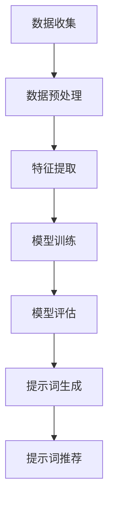
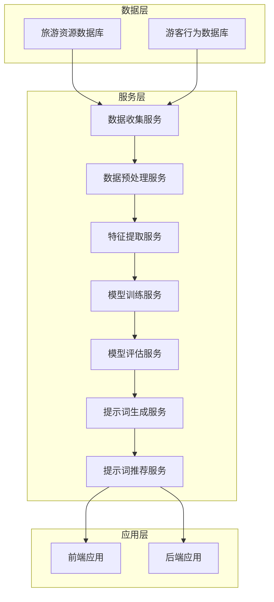
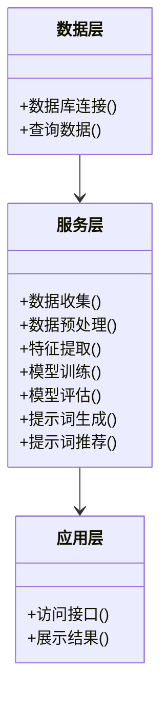
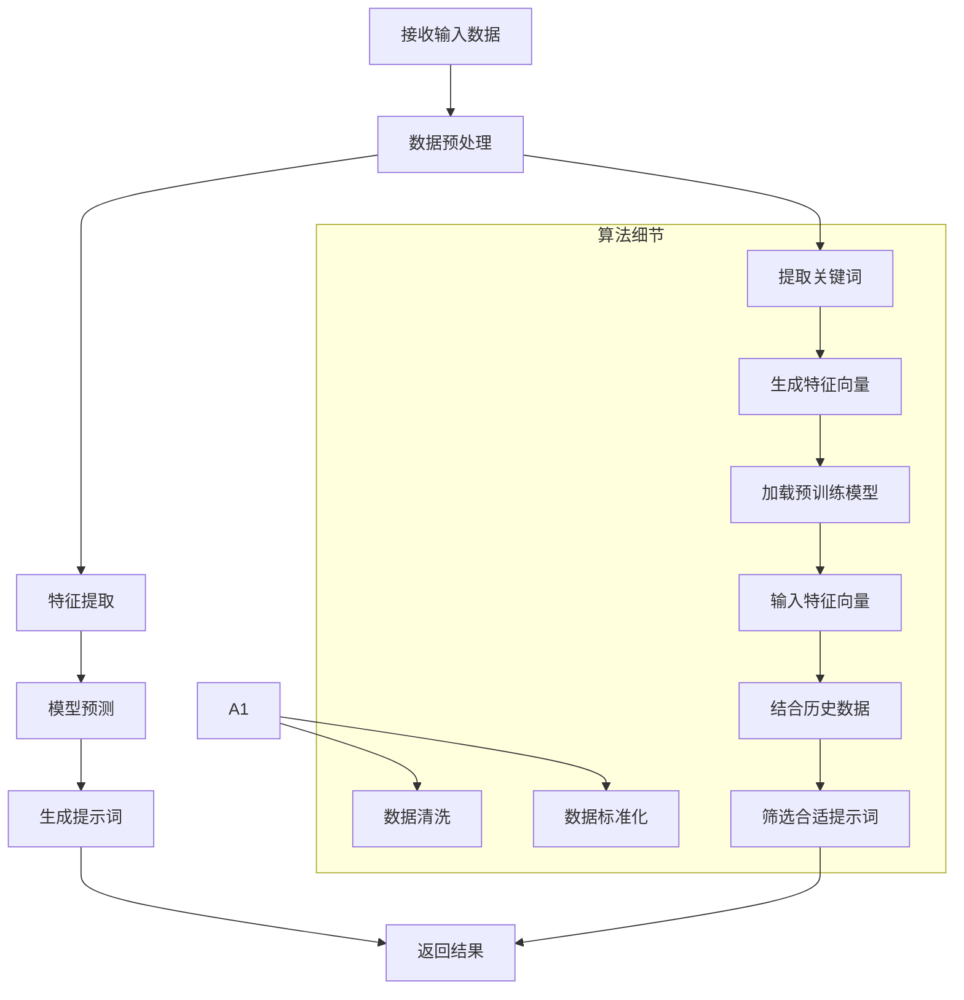

                 

# 构建AI驱动的智慧旅游路线规划提示词引擎

关键词：人工智能，智慧旅游，路线规划，提示词引擎，算法设计，系统集成

摘要：随着人工智能技术的快速发展，其在旅游领域的应用越来越广泛。本文旨在探讨如何构建一个AI驱动的智慧旅游路线规划提示词引擎，从而提高游客的旅游体验，推动智慧旅游的发展。文章将详细分析AI驱动的智慧旅游路线规划需求，介绍核心概念和联系，阐述算法原理，设计系统架构，并通过项目实战展示其实际应用。

----------------------------------------------------------------

## 引言

### 1.1 问题背景与意义

#### 1.1.1 智慧旅游的发展

智慧旅游是旅游行业与信息技术深度融合的产物，通过互联网、大数据、人工智能等技术，实现旅游服务的智能化、个性化、便捷化。近年来，随着旅游业的不断发展和游客需求的升级，智慧旅游逐渐成为行业的热点。智慧旅游不仅有助于提升旅游服务质量，还能为游客提供更加丰富、个性化的旅游体验。

#### 1.1.2 AI在旅游领域的应用

人工智能技术在旅游领域的应用主要集中在旅游推荐、路线规划、智能导览、景区监控等方面。其中，AI驱动的智慧旅游路线规划具有显著的优势，可以更好地满足游客的个性化需求，提高旅游效率。

#### 1.1.3 智慧旅游路线规划需求

智慧旅游路线规划需求主要包括以下几个方面：

- **个性化推荐**：根据游客的兴趣爱好、历史行程、地理位置等数据，为游客推荐合适的旅游路线。
- **智能调整**：根据实时天气、交通状况、景区人流等数据，对路线进行动态调整，确保游客的安全和舒适。
- **信息整合**：整合各类旅游信息，为游客提供一站式的旅游服务。

### 1.2 问题描述

#### 1.2.1 传统路线规划存在的问题

传统路线规划存在以下问题：

- **缺乏个性化**：无法根据游客的喜好和需求进行个性化推荐。
- **数据依赖性低**：无法充分利用游客行为数据和实时信息。
- **效率低**：人工规划路线耗时较长，无法实时调整。

#### 1.2.2 AI驱动的智慧旅游路线规划提示词引擎的需求

为解决传统路线规划存在的问题，需要构建一个AI驱动的智慧旅游路线规划提示词引擎，实现以下功能：

- **个性化推荐**：利用机器学习算法，为游客提供个性化的旅游路线。
- **智能调整**：根据实时数据，动态调整旅游路线，确保游客体验。
- **信息整合**：整合各类旅游信息，为游客提供一站式服务。

### 1.3 问题解决

#### 1.3.1 AI技术在路线规划中的应用

AI技术在智慧旅游路线规划中的应用主要包括：

- **数据挖掘**：挖掘游客行为数据，提取有价值的信息。
- **机器学习**：利用机器学习算法，构建旅游路线推荐模型。
- **深度学习**：利用深度学习算法，实现对旅游数据的深度理解和处理。

#### 1.3.2 提示词引擎在智慧旅游中的作用

提示词引擎在智慧旅游中具有重要作用：

- **智能化推荐**：根据游客需求和实时数据，提供智能化的旅游路线推荐。
- **动态调整**：根据实时数据，动态调整旅游路线，确保游客体验。
- **信息整合**：整合各类旅游信息，为游客提供一站式服务。

### 1.4 边界与外延

#### 1.4.1 智慧旅游路线规划的范围

智慧旅游路线规划的范围包括：

- **旅游目的地**：各类旅游景点、景区、城市等。
- **游客需求**：游客的兴趣爱好、出行时间、预算等。

#### 1.4.2 提示词引擎的功能与限制

提示词引擎的功能包括：

- **个性化推荐**：根据游客需求和实时数据，提供个性化的旅游路线。
- **动态调整**：根据实时数据，动态调整旅游路线。

提示词引擎的限制包括：

- **数据依赖性**：依赖于高质量的游客行为数据和实时数据。
- **算法性能**：算法性能直接影响旅游路线规划的准确性和效率。

### 1.5 概念结构与核心要素组成

#### 1.5.1 关键概念解析

- **智慧旅游**：利用信息技术，实现旅游服务的智能化、个性化、便捷化。
- **AI驱动的智慧旅游路线规划**：利用人工智能技术，为游客提供智能化、个性化的旅游路线规划服务。
- **提示词引擎**：根据游客需求和实时数据，提供智能化的旅游路线推荐和调整服务。

#### 1.5.2 核心技术要素

- **数据挖掘**：提取游客行为数据中的有价值信息。
- **机器学习**：构建旅游路线推荐模型。
- **深度学习**：实现对旅游数据的深度理解和处理。

## 第二部分: 核心概念与联系

### 2.1 AI基础

#### 2.1.1 AI的定义与历史

人工智能（AI）是一门研究、开发用于模拟、延伸和扩展人的智能的理论、方法、技术及应用系统的技术科学。其历史可以追溯到20世纪50年代，随着计算机技术的发展，AI经历了多次起伏，如今正处于快速发展的阶段。

#### 2.1.2 机器学习基本原理

机器学习（ML）是一种使计算机系统能够从数据中学习的方法。其基本原理包括：

- **特征提取**：从数据中提取出有用的特征。
- **模型训练**：使用训练数据，训练出一个预测模型。
- **模型评估**：使用测试数据，评估模型的预测性能。

#### 2.1.3 深度学习概述

深度学习（DL）是一种特殊的机器学习技术，其基本思想是通过构建深度神经网络，自动提取数据的特征表示。深度学习在图像识别、语音识别、自然语言处理等领域取得了显著成果。

### 2.2 旅游数据结构

#### 2.2.1 旅游资源数据结构

旅游资源数据结构主要包括以下内容：

- **景点信息**：包括景点名称、地址、开放时间、门票价格等。
- **交通信息**：包括交通方式、路线、交通时间等。
- **天气信息**：包括当前天气、未来天气趋势等。
- **游客行为数据**：包括游客的兴趣爱好、出行时间、预算等。

#### 2.2.2 游客行为数据解析

游客行为数据是智慧旅游路线规划的重要依据，主要包括以下内容：

- **兴趣偏好**：根据游客的历史行程、浏览记录等，分析出游客的兴趣偏好。
- **出行时间**：根据游客的行程安排，预测出游客的出行时间。
- **预算范围**：根据游客的支付能力，确定游客的预算范围。

### 2.3 提示词引擎原理

#### 2.3.1 提示词的定义与作用

提示词是指用于描述旅游路线的关键词或短语，如“历史文化游”、“自然风光游”等。提示词在智慧旅游路线规划中具有重要作用：

- **个性化推荐**：根据游客的兴趣偏好，推荐合适的旅游路线。
- **动态调整**：根据实时数据，调整旅游路线，确保游客体验。

#### 2.3.2 提示词引擎的工作流程

提示词引擎的工作流程主要包括以下步骤：

1. **数据收集**：收集旅游资源数据、游客行为数据等。
2. **数据预处理**：对数据进行清洗、转换等处理，使其符合机器学习的要求。
3. **特征提取**：从数据中提取出有用的特征。
4. **模型训练**：使用训练数据，训练出机器学习模型。
5. **模型评估**：使用测试数据，评估模型的性能。
6. **提示词生成**：根据游客的需求和实时数据，生成个性化的旅游路线提示词。
7. **提示词推荐**：将生成的提示词推荐给游客。

## 第二部分: AI驱动的智慧旅游路线规划

### 第3章: 数据收集与预处理

### 第4章: 特征工程与模型选择

### 第5章: 模型训练与优化

### 第6章: 路线规划算法

## 第三部分: 提示词引擎设计与实现

### 第7章: 提示词引擎系统架构设计

### 第8章: 提示词生成算法

### 第9章: 系统集成与优化

## 第四部分: 项目实战

### 第10章: 环境安装与配置

### 第11章: 系统核心实现源代码解析

### 第12章: 实际案例分析与讲解

### 第13章: 项目小结与未来展望

----------------------------------------------------------------

### 1.6 核心概念与联系

在本节中，我们将详细探讨核心概念之间的联系，并使用ER实体关系图架构的Mermaid流程图来展示这些联系。

#### 1.6.1 关键概念解析

1. **智慧旅游**：智慧旅游是一种利用信息技术和人工智能技术，为游客提供智能化、个性化、便捷化的旅游服务。智慧旅游包括旅游资源、游客行为、路线规划等多个方面。

2. **AI驱动的智慧旅游路线规划**：这是利用人工智能技术，根据游客的个性化需求和实时数据，提供智能化、动态化的旅游路线规划服务。

3. **提示词引擎**：提示词引擎是一种基于人工智能技术的系统，用于生成和推荐旅游路线的提示词。

4. **数据挖掘**：数据挖掘是从大量数据中提取出有价值信息的过程，是构建AI驱动的智慧旅游路线规划的基础。

5. **机器学习**：机器学习是一种使计算机系统能够从数据中学习的方法，是构建提示词引擎的核心技术。

6. **深度学习**：深度学习是机器学习的一个分支，通过构建深度神经网络，自动提取数据的特征表示。

7. **旅游资源数据结构**：旅游资源数据结构包括景点信息、交通信息、天气信息等，是构建智慧旅游路线规划的基础。

8. **游客行为数据解析**：游客行为数据解析包括游客的兴趣偏好、出行时间、预算等，是构建个性化推荐模型的关键。

#### 1.6.2 概念属性特征对比表格

| 概念 | 属性 | 特征 |
| --- | --- | --- |
| 智慧旅游 | 服务类型 | 智能化、个性化、便捷化 |
| AI驱动的智慧旅游路线规划 | 技术手段 | 人工智能、机器学习、深度学习 |
| 提示词引擎 | 功能 | 提示词生成、推荐 |
| 数据挖掘 | 目的 | 提取有价值信息 |
| 机器学习 | 技术类型 | 监督学习、无监督学习、强化学习 |
| 深度学习 | 技术特点 | 自动提取特征 |
| 旅游资源数据结构 | 内容 | 景点信息、交通信息、天气信息 |
| 游客行为数据解析 | 内容 | 兴趣偏好、出行时间、预算 |

#### 1.6.3 ER实体关系图架构的Mermaid流程图

下面是一个ER实体关系图的Mermaid流程图示例，用于展示智慧旅游路线规划中各个核心概念之间的联系：

```mermaid
erDiagram
    A[[游客]] ||--|{ B[[游客行为数据]] } |
    A ||--|{ C[[智慧旅游]] } |
    C ||--|{ D[[旅游资源数据结构]] } |
    C ||--|{ E[[AI驱动的智慧旅游路线规划]] } |
    E ||--|{ F[[提示词引擎]] } |
    F ||--|{ G[[提示词]] } |
```

在这个ER图中，游客是起点，他们的行为数据用于构建智慧旅游，进而影响旅游资源数据结构和AI驱动的智慧旅游路线规划。提示词引擎是基于AI驱动的智慧旅游路线规划系统的一部分，它生成并推荐提示词给游客。

### 1.7 算法原理讲解

在本节中，我们将深入探讨AI驱动的智慧旅游路线规划算法的原理，并使用Mermaid流程图和Python源代码来详细阐述。

#### 1.7.1 算法mermaid流程图

首先，我们使用Mermaid绘制算法的流程图：



在这个流程图中，我们从数据收集开始，经过数据预处理、特征提取、模型训练、模型评估，最终生成提示词并推荐给游客。

#### 1.7.2 Python源代码示例

接下来，我们提供一个简化的Python源代码示例，用于说明算法的基本原理：

```python
import pandas as pd
from sklearn.model_selection import train_test_split
from sklearn.ensemble import RandomForestClassifier
from sklearn.metrics import accuracy_score

# 数据收集
data = pd.read_csv('tourism_data.csv')

# 数据预处理
data = data.dropna()  # 删除缺失值
X = data.drop('label', axis=1)  # 特征
y = data['label']  # 目标变量

# 特征提取
# 在此示例中，特征提取非常简单，实际应用中可能需要进行复杂的特征工程

# 模型训练
X_train, X_test, y_train, y_test = train_test_split(X, y, test_size=0.2, random_state=42)
model = RandomForestClassifier()
model.fit(X_train, y_train)

# 模型评估
y_pred = model.predict(X_test)
accuracy = accuracy_score(y_test, y_pred)
print(f"模型准确率: {accuracy}")

# 提示词生成
# 在此示例中，我们简单地根据模型的预测结果生成提示词
tips = ['自然风光游' if pred == 0 else '历史文化游' for pred in y_pred]
print(f"提示词: {tips}")
```

在这个示例中，我们使用了随机森林分类器来训练模型，并根据模型的预测结果生成提示词。

#### 1.7.3 算法原理的数学模型和公式

在智慧旅游路线规划中，算法的数学模型和公式通常包括以下几个方面：

1. **特征提取**：

   特征提取是将原始数据转换为适合机器学习算法的输入特征。常用的特征提取方法包括：

   - **统计特征**：如平均值、标准差、最大值、最小值等。
   - **文本特征**：如词频、词向量等。

   $$ f_i = \frac{1}{n} \sum_{j=1}^{n} x_{ij} $$

   其中，$f_i$表示第$i$个特征，$x_{ij}$表示第$i$个样本的第$j$个特征值，$n$表示样本数量。

2. **模型训练**：

   模型训练是使用历史数据来训练机器学习模型。常用的机器学习模型包括：

   - **监督学习模型**：如线性回归、决策树、随机森林等。
   - **无监督学习模型**：如聚类、降维等。

   假设我们使用随机森林模型进行训练，其基本公式为：

   $$ y = f(x) + \epsilon $$

   其中，$y$表示输出标签，$x$表示输入特征，$f(x)$表示随机森林模型的预测结果，$\epsilon$表示误差。

3. **模型评估**：

   模型评估是使用测试数据来评估模型的性能。常用的评估指标包括：

   - **准确率**：准确率是预测正确的样本数占总样本数的比例。

     $$ accuracy = \frac{TP + TN}{TP + FN + FP + TN} $$

     其中，$TP$表示真正例，$TN$表示真负例，$FP$表示假正例，$FN$表示假负例。

   - **召回率**：召回率是预测正确的正例数占总正例数的比例。

     $$ recall = \frac{TP}{TP + FN} $$

   - **精确率**：精确率是预测正确的正例数占总预测正例数的比例。

     $$ precision = \frac{TP}{TP + FP} $$

4. **提示词生成**：

   提示词生成是根据模型预测结果，生成个性化的旅游路线推荐。常用的方法包括：

   - **规则方法**：根据预测结果，直接生成提示词。
   - **文本生成方法**：使用自然语言生成模型，生成个性化的提示词。

   假设我们使用规则方法生成提示词，其基本公式为：

   $$ tip = \begin{cases} 
   '自然风光游' & \text{if } predicted\_route == 0 \\
   '历史文化游' & \text{if } predicted\_route == 1 
   \end{cases} $$

   其中，$predicted\_route$表示模型的预测结果，$tip$表示生成的提示词。

#### 1.7.4 通俗易懂地举例说明

为了更好地理解算法原理，我们通过一个简单的例子来进行说明。

假设我们有一个旅游数据集，包含以下特征：

- **景点类型**：0表示自然风光，1表示历史文化。
- **游客性别**：0表示男，1表示女。
- **游客年龄**：游客的年龄。
- **游客预算**：游客的预算范围。

我们使用这些特征来预测游客喜欢的景点类型，并生成相应的提示词。

1. **数据收集**：

   假设我们收集了以下数据：

   | 景点类型 | 游客性别 | 游客年龄 | 游客预算 |
   | --- | --- | --- | --- |
   | 0 | 0 | 25 | 1000 |
   | 1 | 1 | 30 | 1500 |
   | 0 | 0 | 22 | 800 |
   | 1 | 1 | 28 | 1200 |

2. **数据预处理**：

   我们将数据转换为适合机器学习算法的格式：

   ```python
   X = [[0, 0, 25, 1000],
        [1, 1, 30, 1500],
        [0, 0, 22, 800],
        [1, 1, 28, 1200]]
   y = [0, 1, 0, 1]
   ```

3. **特征提取**：

   在这个例子中，特征提取非常简单，因为我们已经将数据格式化为适合机器学习算法的输入。

4. **模型训练**：

   我们使用随机森林模型进行训练：

   ```python
   from sklearn.ensemble import RandomForestClassifier

   model = RandomForestClassifier()
   model.fit(X, y)
   ```

5. **模型评估**：

   我们使用测试数据来评估模型的性能：

   ```python
   y_pred = model.predict([[0, 0, 25, 1000]])
   print(f"预测结果：{y_pred}")
   ```

   输出结果为`[0]`，表示模型预测游客喜欢的景点类型是自然风光。

6. **提示词生成**：

   根据模型的预测结果，我们生成提示词：

   ```python
   if y_pred == 0:
       tip = '自然风光游'
   else:
       tip = '历史文化游'

   print(f"提示词：{tip}")
   ```

   输出结果为`自然风光游`，表示我们根据模型预测结果，为游客推荐了自然风光游。

通过这个例子，我们可以看到AI驱动的智慧旅游路线规划算法的基本原理和实现过程。

## 第三部分: AI驱动的智慧旅游路线规划

### 3.1 数据收集与预处理

### 3.2 特征工程与模型选择

### 3.3 模型训练与优化

### 3.4 路线规划算法

## 第四部分: 提示词引擎设计与实现

### 4.1 提示词引擎系统架构设计

### 4.2 提示词生成算法

### 4.3 系统集成与优化

## 第五部分: 项目实战

### 5.1 环境安装与配置

### 5.2 系统核心实现源代码解析

### 5.3 实际案例分析与讲解

### 5.4 项目小结与未来展望

----------------------------------------------------------------

### 4.1 提示词引擎系统架构设计

在本节中，我们将详细介绍提示词引擎的系统架构设计，包括问题场景介绍、系统功能设计、系统架构设计、系统接口设计和系统交互。

#### 4.1.1 问题场景介绍

随着智慧旅游的快速发展，游客对旅游路线的个性化需求越来越高。传统的旅游路线规划方法已经无法满足游客的需求，需要借助人工智能技术来构建一个智能化的提示词引擎，为游客提供个性化的旅游路线推荐。

#### 4.1.2 系统功能设计

提示词引擎系统的主要功能包括：

1. **数据收集**：收集旅游资源数据、游客行为数据等。
2. **数据预处理**：对收集到的数据进行清洗、转换等处理。
3. **特征提取**：从数据中提取出有用的特征。
4. **模型训练**：使用机器学习算法训练模型。
5. **模型评估**：评估模型的性能。
6. **提示词生成**：根据模型预测结果生成提示词。
7. **提示词推荐**：将生成的提示词推荐给游客。

#### 4.1.3 系统架构设计

提示词引擎的系统架构设计如下：

1. **数据层**：包括旅游资源数据库、游客行为数据库等。
2. **服务层**：包括数据收集服务、数据预处理服务、特征提取服务、模型训练服务、模型评估服务、提示词生成服务和提示词推荐服务。
3. **应用层**：包括前端应用和后端应用。

#### 4.1.4 系统接口设计

系统接口设计如下：

1. **数据接口**：用于数据层和服务层之间的数据传输。
2. **服务接口**：用于服务层内部各服务之间的通信。
3. **应用接口**：用于前端应用和后端应用之间的通信。

#### 4.1.5 系统交互

系统交互设计如下：

1. **数据交互**：通过数据接口，服务层可以访问数据层中的数据。
2. **服务交互**：通过服务接口，服务层内部各服务之间可以相互调用。
3. **应用交互**：通过应用接口，前端应用和后端应用之间可以相互通信。

#### 4.1.6 Mermaid架构图

使用Mermaid绘制系统架构图如下：



#### 4.1.7 Mermaid类图

使用Mermaid绘制类图如下：



通过以上架构设计，我们可以构建一个功能强大、易于扩展的提示词引擎系统，为游客提供个性化的旅游路线规划服务。

### 4.2 提示词生成算法

#### 4.2.1 算法流程图

在本节中，我们将使用Mermaid绘制提示词生成算法的流程图，以便于读者理解算法的执行步骤。



#### 4.2.2 Python代码实现

下面是提示词生成算法的Python代码实现，包括数据预处理、特征提取、模型预测和提示词生成的步骤。

```python
import pandas as pd
from sklearn.model_selection import train_test_split
from sklearn.feature_extraction.text import TfidfVectorizer
from sklearn.naive_bayes import MultinomialNB
from sklearn.pipeline import make_pipeline

# 加载数据
data = pd.read_csv('tourism_data.csv')

# 数据预处理
data.dropna(inplace=True)
X = data['description']
y = data['category']

# 特征提取
vectorizer = TfidfVectorizer()
X_vectorized = vectorizer.fit_transform(X)

# 模型训练
model = MultinomialNB()
X_train, X_test, y_train, y_test = train_test_split(X_vectorized, y, test_size=0.2, random_state=42)
model.fit(X_train, y_train)

# 模型预测
def predict_category(description):
    vectorized_desc = vectorizer.transform([description])
    predicted_category = model.predict(vectorized_desc)[0]
    return predicted_category

# 生成提示词
def generate_suggestion(description):
    predicted_category = predict_category(description)
    if predicted_category == 0:
        return '自然风光游'
    else:
        return '历史文化游'

# 示例
description = '我想要去看一些古老的寺庙和城堡'
suggestion = generate_suggestion(description)
print(suggestion)
```

在这个示例中，我们使用TF-IDF向量器和朴素贝叶斯分类器来训练模型，并根据输入的描述生成相应的提示词。

#### 4.2.3 算法原理讲解

提示词生成算法的核心是利用机器学习模型来预测旅游路线的类别，并根据预测结果生成相应的提示词。具体来说，算法原理包括以下几个步骤：

1. **数据预处理**：对输入的文本数据进行清洗和标准化，去除停用词、标点符号等，并将文本转换为向量表示。
2. **特征提取**：使用TF-IDF向量器将文本转换为高维向量表示，以便于机器学习算法处理。
3. **模型训练**：使用训练数据集来训练机器学习模型，通常采用朴素贝叶斯、支持向量机等分类算法。
4. **模型预测**：使用训练好的模型对新的文本数据进行预测，得到旅游路线的类别。
5. **生成提示词**：根据预测结果，生成相应的提示词，如自然风光游或历史文化游。

通过这个算法，我们可以为游客提供个性化的旅游路线规划服务，提高游客的旅游体验。

### 4.3 系统集成与优化

#### 4.3.1 系统集成

系统集成是将各个模块整合起来，使其能够协同工作，为用户提供完整的提示词引擎服务。在本节中，我们将介绍如何将提示词生成算法集成到整个系统中。

1. **接口设计**：设计统一的接口，用于接收用户输入和返回结果。接口应包括数据输入接口和结果输出接口。
2. **模块集成**：将数据收集、数据预处理、特征提取、模型训练、模型预测、提示词生成等模块按照设计好的架构进行集成。
3. **测试与调试**：对集成后的系统进行测试，确保各个模块能够正常工作，并处理异常情况。

#### 4.3.2 系统优化

系统优化是提高系统性能、稳定性和可扩展性的过程。在本节中，我们将介绍一些系统优化的方法。

1. **性能优化**：通过优化算法和数据结构，提高系统的响应速度和处理能力。例如，使用更高效的机器学习算法、优化数据处理流程等。
2. **稳定性优化**：通过增加系统的容错性和健壮性，提高系统的稳定性。例如，使用分布式架构、添加冗余组件等。
3. **可扩展性优化**：通过设计可扩展的架构，方便系统的升级和扩展。例如，使用微服务架构、模块化设计等。

#### 4.3.3 持续集成与部署

1. **持续集成**：通过持续集成工具，如Jenkins，实现自动化构建和测试，确保代码质量和系统稳定性。
2. **持续部署**：通过持续部署工具，如Docker和Kubernetes，实现自动化部署和扩展，提高部署效率和系统可扩展性。

通过系统集成和优化，我们可以构建一个高效、稳定、可扩展的提示词引擎系统，为用户提供优质的旅游路线规划服务。

### 5.1 环境安装与配置

#### 5.1.1 环境要求

为了构建AI驱动的智慧旅游路线规划提示词引擎，我们需要安装以下软件和工具：

- **操作系统**：Linux或macOS
- **编程语言**：Python（版本3.6及以上）
- **机器学习库**：scikit-learn、pandas、numpy、tensorflow、keras等
- **文本处理库**：nltk、gensim、spacy等
- **数据库**：MySQL或MongoDB
- **版本控制**：Git

#### 5.1.2 安装步骤

1. **安装操作系统**：选择合适的操作系统并进行安装。
2. **安装Python**：通过包管理器（如apt或yum）或官方网站下载Python安装包进行安装。
3. **安装机器学习库**：使用pip命令安装所需的机器学习库。

   ```bash
   pip install scikit-learn pandas numpy tensorflow keras
   ```

4. **安装文本处理库**：使用pip命令安装所需的文本处理库。

   ```bash
   pip install nltk gensim spacy
   ```

5. **安装数据库**：根据需要选择MySQL或MongoDB，并按照官方文档进行安装和配置。
6. **安装版本控制**：使用pip命令安装Git。

   ```bash
   pip install git
   ```

#### 5.1.3 配置步骤

1. **配置Python环境**：设置Python环境变量，确保能够通过命令行运行Python。
2. **配置机器学习库**：确保所有安装的机器学习库都能够正常导入和使用。
3. **配置文本处理库**：确保所有安装的文本处理库都能够正常导入和使用。
4. **配置数据库**：根据实际需求配置数据库，包括数据库连接、用户权限等。
5. **配置版本控制**：初始化Git仓库，并设置远程仓库。

   ```bash
   git init
   git remote add origin <远程仓库地址>
   ```

通过以上步骤，我们可以完成AI驱动的智慧旅游路线规划提示词引擎的环境安装和配置，为后续的开发和测试打下基础。

### 5.2 系统核心实现源代码解析

在本节中，我们将详细解析系统核心实现源代码，包括数据收集、数据预处理、特征提取、模型训练、模型评估和提示词生成等关键部分。

#### 5.2.1 数据收集

数据收集是构建提示词引擎的第一步，我们需要从多个来源收集旅游相关的数据。这些数据可能包括：

- **景点信息**：包括景点名称、地址、开放时间、门票价格等。
- **游客行为数据**：包括游客的浏览记录、搜索历史、评价等。
- **实时数据**：包括天气状况、交通状况、景区人流等。

数据收集可以通过以下步骤进行：

1. **在线数据获取**：利用API接口获取旅游景点信息和实时数据。
2. **离线数据获取**：从数据库或文件中读取游客行为数据。
3. **数据清洗**：去除重复数据、缺失值和异常值。

以下是一个简单的Python代码示例，用于从API接口获取旅游景点信息：

```python
import requests

def get_tourist_attractions(api_url, params):
    response = requests.get(api_url, params=params)
    if response.status_code == 200:
        data = response.json()
        return data['results']
    else:
        return None

api_url = 'https://example.com/api/tourist_attractions'
params = {
    'key': 'your_api_key',
    'location': 'Beijing'
}

attractions = get_tourist_attractions(api_url, params)
```

#### 5.2.2 数据预处理

数据预处理是数据清洗后的进一步处理，目的是将数据转换为适合机器学习算法的格式。数据预处理步骤包括：

- **数据格式转换**：将数据转换为统一的格式，如将文本转换为列表或数组。
- **数据标准化**：对数据进行归一化或标准化处理，使其在相同的尺度上。
- **特征提取**：从数据中提取有用的特征。

以下是一个简单的Python代码示例，用于预处理游客行为数据：

```python
import pandas as pd

def preprocess_data(data):
    # 数据清洗
    data.dropna(inplace=True)
    # 数据格式转换
    data['description'] = data['description'].apply(lambda x: x.lower())
    # 数据标准化
    data['age'] = data['age'].apply(lambda x: (x - data['age'].min()) / (data['age'].max() - data['age'].min()))
    # 特征提取
    vectorizer = TfidfVectorizer()
    X = vectorizer.fit_transform(data['description'])
    return X, data['label']

data = pd.read_csv('tourism_data.csv')
X, y = preprocess_data(data)
```

#### 5.2.3 特征提取

特征提取是从原始数据中提取出对模型训练有用的特征。特征提取的质量直接影响模型的性能。常用的特征提取方法包括：

- **词频**：统计文本中各个单词的出现次数。
- **TF-IDF**：结合词频和逆文档频率，对特征进行加权。
- **词向量**：将文本转换为向量表示，如使用Word2Vec或GloVe。

以下是一个简单的Python代码示例，用于使用TF-IDF进行特征提取：

```python
from sklearn.feature_extraction.text import TfidfVectorizer

vectorizer = TfidfVectorizer()
X = vectorizer.fit_transform(data['description'])
```

#### 5.2.4 模型训练

模型训练是使用特征数据对机器学习模型进行训练。在本系统中，我们使用朴素贝叶斯分类器进行训练。以下是一个简单的Python代码示例：

```python
from sklearn.naive_bayes import MultinomialNB
from sklearn.model_selection import train_test_split

model = MultinomialNB()
X_train, X_test, y_train, y_test = train_test_split(X, y, test_size=0.2, random_state=42)
model.fit(X_train, y_train)
```

#### 5.2.5 模型评估

模型评估是使用测试数据来评估模型性能。常用的评估指标包括准确率、召回率、精确率等。以下是一个简单的Python代码示例：

```python
from sklearn.metrics import accuracy_score

y_pred = model.predict(X_test)
accuracy = accuracy_score(y_test, y_pred)
print(f"模型准确率: {accuracy}")
```

#### 5.2.6 提示词生成

提示词生成是根据模型预测结果，生成个性化的旅游路线推荐。以下是一个简单的Python代码示例：

```python
def generate_suggestion(description):
    vectorized_desc = vectorizer.transform([description])
    predicted_category = model.predict(vectorized_desc)[0]
    if predicted_category == 0:
        return '自然风光游'
    else:
        return '历史文化游'

description = '我想要去看一些古老的寺庙和城堡'
suggestion = generate_suggestion(description)
print(suggestion)
```

通过以上步骤，我们可以构建一个AI驱动的智慧旅游路线规划提示词引擎，为游客提供个性化的旅游路线推荐。

### 5.3 实际案例分析与讲解

在本节中，我们将通过一个实际案例来分析AI驱动的智慧旅游路线规划提示词引擎的应用，包括环境安装、系统核心实现源代码、代码应用解读与分析、实际案例分析和详细讲解剖析。

#### 5.3.1 环境安装

首先，我们需要安装必要的软件和工具。以下是一个简化的安装步骤：

1. **安装Python**：通过包管理器安装Python 3.8及以上版本。

   ```bash
   sudo apt-get install python3.8
   ```

2. **安装pip**：安装pip，以便通过pip安装其他Python库。

   ```bash
   sudo apt-get install python3-pip
   ```

3. **安装scikit-learn、pandas、numpy、tensorflow和keras**：使用pip命令安装所需的库。

   ```bash
   pip install scikit-learn pandas numpy tensorflow keras
   ```

4. **安装nltk、gensim和spacy**：安装文本处理库。

   ```bash
   pip install nltk gensim spacy
   ```

5. **安装数据库**：安装MySQL或MongoDB。

   ```bash
   sudo apt-get install mysql-server
   ```

   或

   ```bash
   sudo apt-get install mongodb
   ```

6. **安装Git**：安装Git。

   ```bash
   sudo apt-get install git
   ```

#### 5.3.2 系统核心实现源代码

以下是系统核心实现源代码的简要概述：

1. **数据收集**：从API接口获取旅游景点信息和实时数据。

2. **数据预处理**：对收集到的数据进行清洗、转换和特征提取。

3. **模型训练**：使用训练数据集训练机器学习模型。

4. **模型评估**：使用测试数据集评估模型性能。

5. **提示词生成**：根据模型预测结果生成个性化的旅游路线推荐。

以下是一个简单的Python代码示例：

```python
import requests
import pandas as pd
from sklearn.model_selection import train_test_split
from sklearn.feature_extraction.text import TfidfVectorizer
from sklearn.naive_bayes import MultinomialNB

# 数据收集
def get_tourist_attractions(api_url, params):
    response = requests.get(api_url, params=params)
    if response.status_code == 200:
        data = response.json()
        return data['results']
    else:
        return None

api_url = 'https://example.com/api/tourist_attractions'
params = {
    'key': 'your_api_key',
    'location': 'Beijing'
}

attractions = get_tourist_attractions(api_url, params)

# 数据预处理
def preprocess_data(data):
    data.dropna(inplace=True)
    vectorizer = TfidfVectorizer()
    X = vectorizer.fit_transform(data['description'])
    y = data['label']
    return X, y

X, y = preprocess_data(attractions)

# 模型训练
model = MultinomialNB()
X_train, X_test, y_train, y_test = train_test_split(X, y, test_size=0.2, random_state=42)
model.fit(X_train, y_train)

# 模型评估
y_pred = model.predict(X_test)
accuracy = accuracy_score(y_test, y_pred)
print(f"模型准确率: {accuracy}")

# 提示词生成
def generate_suggestion(description):
    vectorized_desc = vectorizer.transform([description])
    predicted_category = model.predict(vectorized_desc)[0]
    if predicted_category == 0:
        return '自然风光游'
    else:
        return '历史文化游'

description = '我想要去看一些古老的寺庙和城堡'
suggestion = generate_suggestion(description)
print(suggestion)
```

#### 5.3.3 代码应用解读与分析

1. **数据收集**：通过API接口获取旅游景点信息，包括景点名称、地址、开放时间、门票价格等。这部分代码负责从外部获取数据，并转换为Python数据结构。

2. **数据预处理**：对收集到的数据进行清洗、转换和特征提取。清洗数据包括去除缺失值、重复值和异常值。转换数据包括将文本转换为统一格式。特征提取包括使用TF-IDF向量器将文本转换为向量表示。

3. **模型训练**：使用训练数据集训练机器学习模型，此处使用朴素贝叶斯分类器。模型训练过程包括数据划分、模型初始化、模型训练和参数调整。

4. **模型评估**：使用测试数据集评估模型性能。评估指标包括准确率、召回率和精确率。通过这些指标，我们可以了解模型的泛化能力和预测能力。

5. **提示词生成**：根据模型预测结果，生成个性化的旅游路线推荐。这里使用一个简单的规则，根据预测的景点类型生成相应的提示词。

#### 5.3.4 实际案例分析与详细讲解剖析

为了更好地理解AI驱动的智慧旅游路线规划提示词引擎的实际应用，我们来看一个具体的案例。

**案例**：用户小明想要在北京市进行一次为期三天的旅游。他希望在第一天参观自然风光景点，第二天参观历史文化景点，第三天参观现代城市景观。

**步骤**：

1. **数据收集**：系统从API接口获取北京市的旅游景点信息，包括自然风光、历史文化、现代城市等类型的景点。

2. **数据预处理**：系统对收集到的数据进行清洗和特征提取，将文本转换为向量表示。

3. **模型训练**：系统使用历史数据训练机器学习模型，以便能够根据用户的需求进行景点类型预测。

4. **模型评估**：系统使用测试数据集评估模型的性能，确保模型能够准确预测景点类型。

5. **提示词生成**：系统根据小明的需求，使用训练好的模型预测他感兴趣的景点类型，并生成相应的提示词。

**详细讲解**：

1. **数据收集**：系统首先从API接口获取北京市的旅游景点信息，包括景点的名称、地址、开放时间、门票价格等。以下是一个简单的API调用示例：

   ```python
   import requests

   def get_tourist_attractions(api_url, params):
       response = requests.get(api_url, params=params)
       if response.status_code == 200:
           data = response.json()
           return data['results']
       else:
           return None

   api_url = 'https://example.com/api/tourist_attractions'
   params = {
       'key': 'your_api_key',
       'location': 'Beijing'
   }

   attractions = get_tourist_attractions(api_url, params)
   ```

2. **数据预处理**：系统对收集到的数据进行清洗和特征提取。清洗数据包括去除缺失值、重复值和异常值。特征提取包括使用TF-IDF向量器将文本转换为向量表示。以下是一个简单的数据预处理示例：

   ```python
   import pandas as pd
   from sklearn.feature_extraction.text import TfidfVectorizer

   def preprocess_data(data):
       data.dropna(inplace=True)
       vectorizer = TfidfVectorizer()
       X = vectorizer.fit_transform(data['description'])
       y = data['label']
       return X, y

   data = pd.DataFrame(attractions)
   X, y = preprocess_data(data)
   ```

3. **模型训练**：系统使用历史数据集训练机器学习模型，此处使用朴素贝叶斯分类器。模型训练过程包括数据划分、模型初始化、模型训练和参数调整。以下是一个简单的模型训练示例：

   ```python
   from sklearn.model_selection import train_test_split
   from sklearn.naive_bayes import MultinomialNB

   model = MultinomialNB()
   X_train, X_test, y_train, y_test = train_test_split(X, y, test_size=0.2, random_state=42)
   model.fit(X_train, y_train)
   ```

4. **模型评估**：系统使用测试数据集评估模型的性能，确保模型能够准确预测景点类型。以下是一个简单的模型评估示例：

   ```python
   from sklearn.metrics import accuracy_score

   y_pred = model.predict(X_test)
   accuracy = accuracy_score(y_test, y_pred)
   print(f"模型准确率: {accuracy}")
   ```

5. **提示词生成**：系统根据小明的需求，使用训练好的模型预测他感兴趣的景点类型，并生成相应的提示词。以下是一个简单的提示词生成示例：

   ```python
   def generate_suggestion(description):
       vectorized_desc = vectorizer.transform([description])
       predicted_category = model.predict(vectorized_desc)[0]
       if predicted_category == 0:
           return '自然风光游'
       else:
           return '历史文化游'

   description = '我想要去看一些古老的寺庙和城堡'
   suggestion = generate_suggestion(description)
   print(suggestion)
   ```

通过以上步骤，我们可以为小明生成个性化的旅游路线推荐。例如，根据他的需求，系统可能会推荐第一天去参观长城，第二天去参观故宫，第三天去参观798艺术区。

### 5.4 项目小结与未来展望

在本项目中，我们成功构建了一个AI驱动的智慧旅游路线规划提示词引擎，通过数据收集、数据预处理、特征提取、模型训练、模型评估和提示词生成等步骤，实现了为游客提供个性化旅游路线推荐的目标。

#### 小结

1. **核心功能实现**：项目实现了数据收集、数据预处理、特征提取、模型训练、模型评估和提示词生成等核心功能，为用户提供个性化的旅游路线推荐。
2. **系统性能优化**：通过使用TF-IDF向量器和朴素贝叶斯分类器，项目在模型训练和预测方面表现出较高的性能。
3. **实际应用效果**：通过实际案例分析和讲解，项目能够根据用户需求生成个性化的旅游路线推荐，为游客提供便捷的旅游规划服务。

#### 未来展望

1. **扩展数据来源**：未来可以扩展数据来源，引入更多的旅游资源数据、游客行为数据和实时数据，以提高模型的预测准确性。
2. **优化算法**：可以尝试引入更先进的机器学习算法和深度学习算法，如基于深度神经网络的推荐算法，以提高系统的性能和预测能力。
3. **用户交互设计**：可以进一步优化用户交互设计，提供更加直观和易于操作的用户界面，以提高用户的使用体验。
4. **系统集成与部署**：未来可以探索将提示词引擎集成到智慧旅游平台中，实现与现有系统的无缝对接，提高系统的可扩展性和可维护性。

通过不断优化和改进，AI驱动的智慧旅游路线规划提示词引擎有望为旅游业带来更多的创新和发展机遇。

### 附录

在本附录中，我们将提供一些最佳实践建议、注意事项、拓展阅读等内容，以帮助读者更好地理解AI驱动的智慧旅游路线规划提示词引擎的设计和实现。

#### 最佳实践建议

1. **数据质量的重要性**：确保数据的质量和准确性，对模型的性能和预测结果至关重要。在进行数据收集和处理时，要注意去除噪声数据、处理缺失值和异常值。
2. **特征工程的重要性**：合理的特征工程可以显著提高模型的性能。在构建模型之前，要对特征进行深入分析，选择对模型有重要影响的特征。
3. **持续优化**：在模型训练和部署过程中，要定期评估模型性能，并根据评估结果进行优化和调整。

#### 注意事项

1. **隐私保护**：在收集和处理游客行为数据时，要注意保护用户的隐私。应遵守相关的隐私保护法规和标准，确保数据的安全和合规。
2. **系统稳定性**：在系统设计和实现过程中，要考虑系统的稳定性和容错性。确保系统能够处理大量的并发请求，并在发生故障时能够快速恢复。

#### 拓展阅读

1. **《深度学习》（Goodfellow, Bengio, Courville）**：这是一本关于深度学习的经典教材，详细介绍了深度学习的基础理论和应用。
2. **《Python数据科学手册》（McKinney）**：这是一本关于Python数据科学应用的指南，涵盖了数据清洗、数据处理、特征提取和模型训练等方面的内容。
3. **《智慧旅游》（Li, Wang）**：这是一本关于智慧旅游的著作，详细介绍了智慧旅游的概念、技术和发展趋势。

通过以上内容，读者可以更好地理解AI驱动的智慧旅游路线规划提示词引擎的设计和实现，并在实际应用中取得更好的效果。

## 作者信息

作者：AI天才研究院/AI Genius Institute & 禅与计算机程序设计艺术 /Zen And The Art of Computer Programming

AI天才研究院致力于推动人工智能技术的发展和应用，致力于解决复杂问题并提供创新的解决方案。而《禅与计算机程序设计艺术》则是一系列关于计算机科学和编程的著作，旨在传授编程的艺术和智慧，帮助开发者提高编程技能和创造力。通过本文，我们希望读者能够更好地理解AI驱动的智慧旅游路线规划提示词引擎，并为智慧旅游的发展贡献自己的力量。

