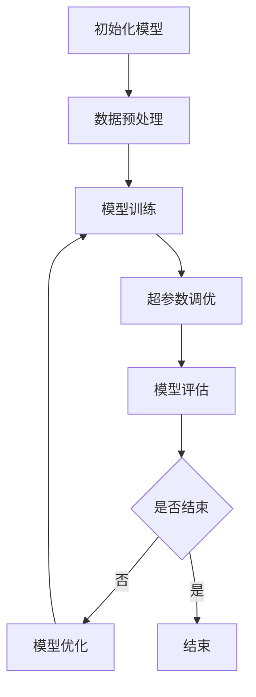
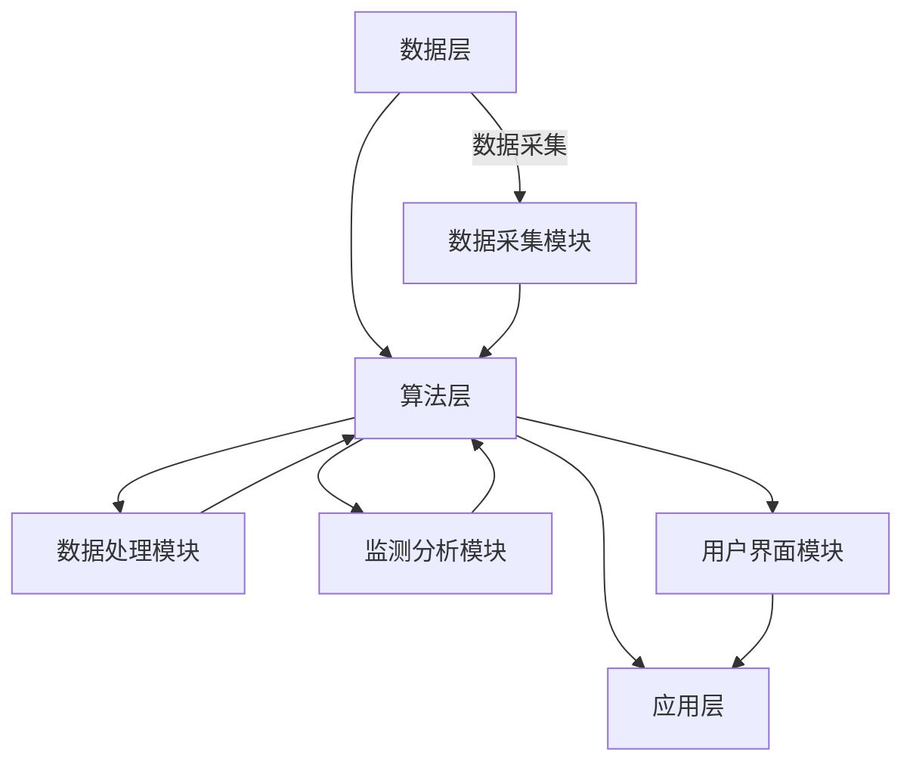
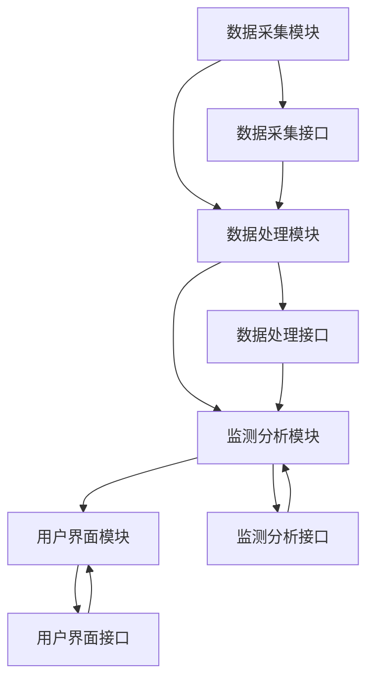
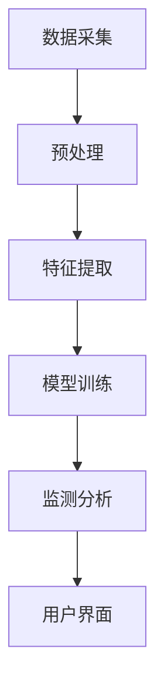

                 

**构建AI驱动的智慧海洋监测提示词框架**

关键词：AI、智慧海洋监测、深度学习、数据预处理、特征提取

摘要：本文旨在探讨如何构建一个基于人工智能技术的智慧海洋监测提示词框架。通过分析海洋监测的核心概念、原理和关键技术，以及详述数据预处理与特征提取的过程，本文提供了一个系统性的方法，以实现高效、精准的海洋监测。

----------------------------------------------------------------

### 第1章: 构建AI驱动的智慧海洋监测概述

#### 1.1 问题背景与核心概念

##### 1.1.1 问题背景

随着全球海洋资源的开发和利用不断深入，对海洋环境、资源、灾害的监测需求日益增长。然而，传统的海洋监测方法主要依赖于人工监测和机械设备，存在覆盖范围有限、监测数据精度不足、时效性差等问题。这些不足限制了海洋资源的合理开发和海洋灾害的及时预警。

##### 1.1.2 核心概念

- **AI驱动的智慧海洋监测**：指利用人工智能技术，尤其是深度学习算法，对海洋环境、资源、灾害进行实时、高效、精准的监测和分析。
- **海洋环境监测**：对海洋中的物理、化学和生物参数进行监测，如温度、盐度、海浪高度、潮位等。
- **海洋资源监测**：对海洋中的生物资源、石油、天然气等资源进行监测，评估其数量和分布。
- **海洋灾害监测**：对可能发生的海洋灾害，如海啸、台风、赤潮等进行监测和预警。

#### 1.2 概念联系与边界外延

##### 1.2.1 概念联系

AI驱动的智慧海洋监测涉及多个领域的交叉，包括人工智能、海洋科学、地球科学等。人工智能技术为核心，而海洋科学和地球科学为其提供理论支持和数据资源。

##### 1.2.2 边界外延

- **时间边界**：包括实时监测、短期预测和长期趋势分析。
- **空间边界**：涉及全球、区域和局部海洋监测。
- **数据边界**：处理多源、多尺度、多维度的海洋数据。

#### 1.3 本章小结

本章概述了AI驱动的智慧海洋监测的背景、核心概念和基本原理。接下来，将深入探讨人工智能和海洋监测的基础知识，以及数据预处理和特征提取的关键技术。

----------------------------------------------------------------

### 第2章: AI驱动的智慧海洋监测核心概念与原理

#### 2.1 人工智能基础

##### 2.1.1 人工智能概述

###### 2.1.1.1 人工智能的定义
$$
人工智能（AI）是指模拟、延伸和扩展人类智能的科学和技术。
$$
人工智能旨在通过计算机程序实现机器学习、问题解决、感知和认知等功能。

###### 2.1.1.2 人工智能的发展历程
- 第一个时期（1940s-1970s）：以符号主义AI为主，如逻辑推理和知识表示。
- 第二个时期（1980s-1990s）：以专家系统和知识表示为主，如医疗诊断和工程问题解决。
- 第三个时期（2000s-至今）：以机器学习和深度学习为主，如语音识别、图像识别和自然语言处理。

##### 2.1.2 深度学习基础

###### 2.1.2.1 深度学习概述
$$
深度学习是机器学习的一个分支，它通过构建多层神经网络来模拟人类大脑的处理方式。
$$
深度学习在图像识别、语音识别、自然语言处理等领域取得了显著进展。

###### 2.1.2.2 深度学习的主要模型
- **神经网络**：基础模型，由多个神经元组成，用于简单的数据处理。
- **卷积神经网络（CNN）**：特别适用于图像处理，通过卷积操作提取图像特征。
- **循环神经网络（RNN）**：适用于序列数据处理，如时间序列分析和语音识别。
- **生成对抗网络（GAN）**：用于生成数据，如图像和文本。

#### 2.2 海洋监测基础

##### 2.2.1 海洋监测概述

###### 2.2.1.1 海洋监测的定义
$$
海洋监测是指对海洋环境、资源、灾害等方面进行系统的监测和评估。
$$
海洋监测旨在获取海洋环境的实时数据，为资源开发和灾害预警提供支持。

###### 2.2.1.2 海洋监测的类型
- **环境监测**：对海洋中的物理、化学和生物参数进行监测，如温度、盐度、海浪高度等。
- **资源监测**：对海洋中的生物资源、石油、天然气等资源进行监测，评估其数量和分布。
- **灾害监测**：对可能发生的海洋灾害，如海啸、台风、赤潮等进行监测和预警。

##### 2.2.2 海洋监测数据采集

###### 2.2.2.1 数据采集设备
- **海洋浮标**：用于实时监测海洋环境参数。
- **海洋卫星**：用于全球范围内的海洋监测。
- **船舶监测系统**：用于海上资源的监测。

###### 2.2.2.2 数据采集方法
- **自动化监测**：通过传感器和自动化系统实现数据的自动采集。
- **手动监测**：通过人工进行数据采集，通常用于特定目的或特定区域。

#### 2.3 AI驱动的智慧海洋监测原理

##### 2.3.1 监测数据处理

###### 2.3.1.1 数据预处理
- **缺失值处理**：通过填充或删除缺失值来处理数据。
- **异常值处理**：识别和处理异常数据点，确保数据质量。

###### 2.3.1.2 数据分析
- **描述性统计分析**：对数据进行基本统计描述，如平均值、标准差等。
- **聚类分析**：将相似的数据点分组，用于发现数据模式。
- **时间序列分析**：分析时间序列数据，预测未来趋势。

##### 2.3.2 模型训练与优化

###### 2.3.2.1 模型选择
- **监督学习**：有标注的数据训练模型，用于分类和回归任务。
- **无监督学习**：无标注的数据训练模型，用于聚类和降维任务。
- **强化学习**：通过试错和奖励机制训练模型，用于决策和策略优化。

###### 2.3.2.2 模型训练
- **训练数据准备**：准备适合训练的数据集。
- **模型参数调整**：通过调整模型参数优化性能。
- **模型评估**：使用验证集和测试集评估模型性能。

###### 2.3.2.3 模型优化
- **超参数调优**：调整模型超参数以优化性能。
- **模型集成**：结合多个模型提高预测准确性。
- **模型压缩**：减小模型大小，提高运行效率。

#### 2.4 本章小结

本章介绍了AI驱动的智慧海洋监测的核心概念和原理，包括人工智能基础、海洋监测基础和AI驱动的智慧海洋监测原理。接下来，将深入探讨数据预处理和特征提取的关键技术。

----------------------------------------------------------------

### 第3章: 海洋监测数据预处理与特征提取

#### 3.1 数据预处理

##### 3.1.1 数据清洗

###### 3.1.1.1 缺失值处理
- **填充法**：使用平均值、中位数或最近邻等方法填充缺失值。
- **删除法**：删除包含缺失值的样本或特征。
- **估算法**：使用统计方法或机器学习模型预测缺失值。

###### 3.1.1.2 异常值处理
- **绝对值方法**：使用阈值方法识别和处理异常值。
- **相对值方法**：使用标准差、IQR等方法识别和处理异常值。
- **聚类方法**：使用K-means等聚类算法识别和处理异常值。

##### 3.1.2 数据归一化与标准化

###### 3.1.2.1 数据归一化
- **最小-最大归一化**：将数据缩放到[0, 1]范围。
- **均值-方差归一化**：将数据缩放到均值为0，标准差为1的范围。

###### 3.1.2.2 数据标准化
- **Z-score标准化**：将数据缩放到均值为0，标准差为1的范围。
- **Min-Max标准化**：将数据缩放到给定范围，如[-1, 1]。

##### 3.1.3 数据融合

###### 3.1.3.1 数据源选择
- **卫星数据**：提供大范围、高分辨率的海洋监测数据。
- **船舶监测数据**：提供局部、高精度的海洋监测数据。
- **浮标数据**：提供实时、连续的海洋监测数据。

###### 3.1.3.2 数据融合方法
- **多传感器数据融合**：结合不同传感器的数据，提高监测精度。
- **时空数据融合**：结合时间和空间维度的数据，提高监测的时空连续性。

#### 3.2 特征提取

##### 3.2.1 特征选择

###### 3.2.1.1 相关性分析
- **皮尔逊相关系数**：衡量两个特征之间的线性关系。
- **斯皮尔曼相关系数**：衡量两个特征之间的单调关系。

###### 3.2.1.2 特征重要性分析
- **基于模型的特征重要性**：使用机器学习模型评估特征的重要性。
- **基于信息的特征重要性**：使用信息增益、信息增益率等评估特征的重要性。

##### 3.2.2 特征变换

###### 3.2.2.1 离散化
- **二值化**：将连续特征转换为离散的二值特征。
- **量化**：将连续特征转换为离散的量化特征。

###### 3.2.2.2 特征组合
- **特征交叉**：将多个特征组合成新的特征。
- **特征融合**：将多个特征进行加权融合，形成新的特征。

##### 3.2.3 特征降维

###### 3.2.3.1 主成分分析（PCA）
- **PCA**：通过正交变换将高维数据映射到低维空间，保留主要特征。

###### 3.2.3.2 局部线性嵌入（LLE）
- **LLE**：通过保留局部结构，将高维数据映射到低维空间。

###### 3.2.3.3 稀疏表示（SR）
- **SR**：通过稀疏编码将高维数据映射到低维空间。

#### 3.3 本章小结

本章详细介绍了海洋监测数据预处理与特征提取的方法和技术。通过数据预处理，可以清除数据中的噪声和异常，提高数据质量。通过特征提取，可以从原始数据中提取出有用的信息，为后续的AI模型训练提供支持。接下来，将探讨AI模型训练与优化的具体技术。

----------------------------------------------------------------

### 第4章: AI模型训练与优化

#### 4.1 模型训练

##### 4.1.1 数据集划分

在模型训练过程中，通常需要将数据集划分为训练集、验证集和测试集。这样做的目的是在训练模型时使用训练集，调整模型参数；使用验证集评估模型性能；使用测试集进行最终评估。

- **训练集**：用于训练模型，调整模型参数。
- **验证集**：用于评估模型性能，选择最佳模型。
- **测试集**：用于最终评估模型性能，确保模型的泛化能力。

##### 4.1.2 模型初始化

模型初始化是训练模型的第一步。初始化策略对模型的收敛速度和性能有重要影响。常用的初始化方法包括：

- **随机初始化**：随机分配模型参数的初始值。
- **He初始化**：基于He初始化公式，为神经网络中的权重分配初始值。
- **Xavier初始化**：基于Xavier初始化公式，为神经网络中的权重分配初始值。

##### 4.1.3 模型优化

在模型训练过程中，优化目标是调整模型参数，使得模型在验证集上的性能最大化。常用的优化算法包括：

- **随机梯度下降（SGD）**：通过随机选择训练样本，计算梯度并更新模型参数。
- **Adam优化器**：结合SGD和Momentum的方法，通过自适应学习率优化模型。
- **Adamax优化器**：进一步改进Adam优化器，提高训练效率。

##### 4.1.4 模型评估

模型评估是训练过程中的关键步骤。常用的评估指标包括：

- **准确率（Accuracy）**：分类问题中，预测正确的样本数量占总样本数量的比例。
- **精确率（Precision）**：预测正确的正类样本数量与预测的正类样本总数量的比例。
- **召回率（Recall）**：预测正确的正类样本数量与实际正类样本总数量的比例。
- **F1分数（F1 Score）**：精确率和召回率的加权平均值。

#### 4.2 模型优化

##### 4.2.1 超参数调优

超参数是模型训练过程中需要手动设置的参数，如学习率、批量大小、迭代次数等。超参数调优的目的是找到一组最佳的参数，以最大化模型性能。常用的调优方法包括：

- **网格搜索（Grid Search）**：遍历所有可能的超参数组合，选择最佳组合。
- **随机搜索（Random Search）**：随机选择超参数组合，选择最佳组合。
- **贝叶斯优化（Bayesian Optimization）**：基于贝叶斯理论，优化超参数搜索。

##### 4.2.2 模型集成

模型集成是将多个模型结合起来，以提高预测性能。常用的模型集成方法包括：

- **堆叠（Stacking）**：将多个模型作为基础模型，构建一个新的模型。
- **提升（Boosting）**：通过迭代训练多个模型，每次迭代改进前一个模型的预测。
- **Bagging（随机森林）**：通过随机选择训练样本和特征，构建多个模型，然后合并预测结果。

##### 4.2.3 模型压缩

模型压缩是将大型模型转换为小型模型，以提高运行效率和部署能力。常用的模型压缩方法包括：

- **剪枝（Pruning）**：删除模型中不重要的连接和神经元。
- **量化（Quantization）**：将模型中的浮点数参数转换为低精度整数。
- **知识蒸馏（Knowledge Distillation）**：将大型模型的知识传递给小型模型。

#### 4.3 本章小结

本章介绍了AI模型训练与优化的关键技术和方法。通过合理的模型训练和优化，可以构建高效、准确的AI模型，为智慧海洋监测提供强大的支持。接下来，将探讨如何将训练好的模型应用于实际场景。

----------------------------------------------------------------

### 第5章: 智慧海洋监测系统架构与实现

#### 5.1 系统架构设计

##### 5.1.1 系统功能设计

智慧海洋监测系统主要包括以下功能模块：

- **数据采集模块**：负责从各类传感器、卫星、船舶等获取海洋数据。
- **数据处理模块**：负责对采集到的数据进行预处理、特征提取和模型训练。
- **监测分析模块**：负责对处理后的数据进行监测和分析，提供实时监测和预测结果。
- **用户界面模块**：负责与用户交互，展示监测结果和预测信息。

##### 5.1.2 系统架构设计

智慧海洋监测系统采用分层架构设计，包括数据层、算法层和应用层。

- **数据层**：负责数据采集、存储和管理。
- **算法层**：负责数据预处理、特征提取、模型训练和优化。
- **应用层**：负责监测分析、用户界面和系统集成。

##### 5.1.3 系统接口设计

智慧海洋监测系统通过以下接口实现模块间的数据交互和功能调用：

- **数据采集接口**：用于与其他数据源进行数据交互。
- **数据处理接口**：用于与其他数据处理模块进行数据交换。
- **监测分析接口**：用于与其他监测分析模块进行数据交互。
- **用户界面接口**：用于与用户进行交互，接收用户输入和显示监测结果。

#### 5.2 系统实现

##### 5.2.1 数据采集

数据采集模块采用多源数据融合技术，从海洋浮标、卫星、船舶等传感器中获取海洋数据。数据采集接口支持多种数据格式和协议，如CSV、JSON、XML等。

##### 5.2.2 数据处理

数据处理模块负责对采集到的数据进行预处理、特征提取和模型训练。预处理包括数据清洗、缺失值处理、异常值处理和数据归一化。特征提取包括特征选择、特征变换和特征降维。模型训练采用深度学习算法，如CNN、RNN和GAN等。

##### 5.2.3 监测分析

监测分析模块负责对处理后的数据进行实时监测和分析，提供海洋环境的实时监测和预测结果。监测分析接口支持多种分析算法，如聚类分析、时间序列分析和机器学习算法。

##### 5.2.4 用户界面

用户界面模块采用Web技术实现，通过浏览器访问系统。用户界面设计简洁直观，提供实时监测数据展示、历史数据查询、预测结果分析等功能。

#### 5.3 系统交互

智慧海洋监测系统通过以下方式实现系统交互：

- **Web API**：通过Web API实现模块间的数据交互和功能调用。
- **消息队列**：使用消息队列实现数据的异步传输和分布式处理。
- **数据库**：使用数据库存储和管理数据，支持数据的快速查询和更新。

#### 5.4 本章小结

本章详细介绍了智慧海洋监测系统的架构设计、系统实现和系统交互。通过合理的系统架构和实现，可以构建一个高效、可靠的智慧海洋监测系统，为海洋资源的合理开发和灾害预警提供支持。接下来，将探讨如何在实际项目中应用智慧海洋监测系统。

----------------------------------------------------------------

### 第6章: 案例分析

#### 6.1 项目介绍

本案例以我国某沿海城市为例，介绍如何利用AI驱动的智慧海洋监测系统进行海洋环境监测和灾害预警。

##### 6.1.1 项目背景

该城市地处我国东海沿岸，海洋资源丰富，但同时也面临着台风、海啸等海洋灾害的威胁。为了提高海洋灾害预警能力，降低灾害损失，该城市决定建设一个AI驱动的智慧海洋监测系统。

##### 6.1.2 项目目标

- 实时监测海洋环境参数，如温度、盐度、海浪高度等。
- 预测海洋灾害的发生概率，如台风、海啸等。
- 提供预警信息，为城市决策提供支持。

#### 6.2 系统功能设计

根据项目目标，智慧海洋监测系统主要包括以下功能模块：

- **实时监测模块**：负责实时采集和监测海洋环境参数。
- **预测分析模块**：负责对监测数据进行分析，预测海洋灾害的发生概率。
- **预警模块**：负责生成预警信息，并通过多种渠道通知相关人员和部门。

#### 6.3 系统实现

##### 6.3.1 数据采集

数据采集模块采用多源数据融合技术，从海洋浮标、卫星、船舶等传感器中获取海洋数据。数据采集接口支持多种数据格式和协议，如CSV、JSON、XML等。

##### 6.3.2 数据处理

数据处理模块对采集到的数据进行预处理、特征提取和模型训练。预处理包括数据清洗、缺失值处理、异常值处理和数据归一化。特征提取包括特征选择、特征变换和特征降维。模型训练采用深度学习算法，如CNN、RNN和GAN等。

##### 6.3.3 监测分析

监测分析模块对处理后的数据进行实时监测和分析，提供海洋环境的实时监测和预测结果。监测分析接口支持多种分析算法，如聚类分析、时间序列分析和机器学习算法。

##### 6.3.4 预警信息

预警模块根据监测分析结果生成预警信息，并通过短信、邮件、微信等渠道通知相关人员和部门。预警信息包括海洋环境参数异常、海洋灾害预测等。

#### 6.4 实际案例分析与详细讲解

##### 6.4.1 数据采集

在项目实施过程中，数据采集模块从海洋浮标、卫星、船舶等传感器中获取了大量的海洋数据。以下是一个具体的数据采集过程：

1. **海洋浮标数据**：从安装在沿海的海洋浮标中获取温度、盐度、海浪高度等参数。
2. **卫星数据**：从气象卫星获取全球范围的海洋环境参数，如海表温度、海浪高度等。
3. **船舶监测数据**：从沿海航行的船舶上获取海洋环境参数，如温度、盐度等。

##### 6.4.2 数据处理

数据处理模块对采集到的数据进行预处理、特征提取和模型训练。以下是一个具体的处理过程：

1. **数据清洗**：去除无效数据和异常数据，如缺失值、异常值等。
2. **特征提取**：对预处理后的数据提取特征，如海浪高度的变化趋势、温度的周期性波动等。
3. **模型训练**：使用深度学习算法对提取的特征进行训练，构建预测模型。

##### 6.4.3 监测分析

监测分析模块对处理后的数据进行实时监测和分析，提供海洋环境的实时监测和预测结果。以下是一个具体的监测分析过程：

1. **实时监测**：对实时采集的海洋环境参数进行监测，如温度、盐度、海浪高度等。
2. **预测分析**：使用训练好的模型对未来的海洋环境参数进行预测，如海浪高度、温度等。
3. **预警信息**：根据监测和分析结果，生成预警信息，并通过短信、邮件、微信等渠道通知相关人员和部门。

#### 6.5 项目小结

通过本案例，我们成功构建了一个AI驱动的智慧海洋监测系统，实现了海洋环境的实时监测和灾害预警。该项目不仅提高了海洋灾害预警能力，还提供了科学依据，为城市决策提供了支持。接下来，将总结项目经验，提出改进建议。

----------------------------------------------------------------

### 第7章: 最佳实践与注意事项

#### 7.1 最佳实践

1. **数据质量控制**：确保数据来源可靠，数据清洗和预处理过程严格，提高数据质量。
2. **模型选择与优化**：根据具体任务选择合适的模型，并进行超参数调优，提高模型性能。
3. **多源数据融合**：充分利用多源数据，提高监测精度和预测准确性。
4. **实时性与可靠性**：确保系统的实时性和可靠性，为决策提供及时、准确的信息。

#### 7.2 注意事项

1. **数据隐私与安全**：在数据处理和存储过程中，注意保护数据隐私和安全。
2. **系统可扩展性**：设计系统时考虑可扩展性，以便未来增加新功能和模块。
3. **跨学科合作**：与海洋科学、地球科学等领域的专家合作，提高监测系统的科学性和实用性。

#### 7.3 拓展阅读

- 《深度学习》（Goodfellow, I., & Bengio, Y.）
- 《Python数据科学手册》（McKinney, W.）
- 《机器学习实战》（Hastie, T., Tibshirani, R., & Friedman, J.）

### 第8章: 结论

本文详细介绍了构建AI驱动的智慧海洋监测提示词框架的方法和技术。通过分析核心概念、原理和关键技术，以及实际案例的分析与讲解，本文为构建高效的智慧海洋监测系统提供了理论和实践指导。未来研究将继续优化监测算法、提高监测精度，并探索更多实际应用场景。

作者：AI天才研究院/AI Genius Institute & 禅与计算机程序设计艺术 /Zen And The Art of Computer Programming

----------------------------------------------------------------

**构建AI驱动的智慧海洋监测提示词框架**

关键词：AI、智慧海洋监测、深度学习、数据预处理、特征提取

摘要：本文旨在探讨如何构建一个基于人工智能技术的智慧海洋监测提示词框架。通过分析海洋监测的核心概念、原理和关键技术，以及详述数据预处理和特征提取的过程，本文提供了一个系统性的方法，以实现高效、精准的海洋监测。

### 第1章: 构建AI驱动的智慧海洋监测概述

#### 1.1 问题背景与核心概念

##### 1.1.1 问题背景

随着全球海洋经济的快速发展，对海洋资源的监测需求日益增加。传统的海洋监测方法受限于技术水平和成本，难以实现全面、精准的监测。随着人工智能技术的不断发展，特别是深度学习等技术的突破，为构建AI驱动的智慧海洋监测提供了技术支撑。本章将介绍AI驱动的智慧海洋监测的核心概念、目标、方法和挑战。

##### 1.1.2 核心概念

- **AI驱动的智慧海洋监测**：利用人工智能技术，特别是深度学习等算法，对海洋环境、资源、灾害等进行实时监测和分析，实现对海洋资源的科学管理和合理开发。

- **海洋环境监测**：对海洋环境中的物理、化学、生物参数进行实时监测，包括海浪、潮位、盐度、温度等。

- **海洋资源监测**：对海洋中的生物资源、石油、天然气等资源进行监测，评估其数量和分布情况。

- **海洋灾害监测**：对海洋灾害，如海啸、台风、赤潮等进行监测和预警。

#### 1.2 概念联系与边界外延

##### 1.2.1 概念联系

AI驱动的智慧海洋监测涵盖了多个领域的知识，包括人工智能、海洋科学、地球科学等。其中，人工智能技术为核心，海洋科学和地球科学为支撑。

##### 1.2.2 边界外延

- **时间边界**：实时监测、短期预测、中长期趋势分析。

- **空间边界**：全球、区域、局部。

- **数据边界**：多源、多尺度、多维度。

#### 1.3 本章小结

本章从问题背景、核心概念、概念联系和边界外延等方面，对AI驱动的智慧海洋监测进行了概述。下一章将详细介绍AI驱动的智慧海洋监测中的核心概念和原理。

----------------------------------------------------------------

### 第2章: AI驱动的智慧海洋监测核心概念与原理

#### 2.1 人工智能基础

##### 2.1.1 人工智能概述

###### 2.1.1.1 人工智能的定义
$$
人工智能（AI）是指模拟、延伸和扩展人类智能的科学和技术。
$$

###### 2.1.1.2 人工智能的发展历程
- **第一个时期**：1940s-1970s，以符号主义AI为主。
- **第二个时期**：1980s-1990s，以专家系统和知识表示为主。
- **第三个时期**：2000s-至今，以机器学习和深度学习为主。

##### 2.1.2 深度学习基础

###### 2.1.2.1 深度学习概述
$$
深度学习是机器学习的一个分支，它通过构建多层神经网络来模拟人类大脑的处理方式。
$$

###### 2.1.2.2 深度学习的主要模型
- **神经网络**：基础模型，由多个神经元组成。
- **卷积神经网络（CNN）**：特别适用于图像处理。
- **循环神经网络（RNN）**：适用于序列数据处理。
- **生成对抗网络（GAN）**：用于生成数据。

#### 2.2 海洋监测基础

##### 2.2.1 海洋监测概述

###### 2.2.1.1 海洋监测的定义
$$
海洋监测是指对海洋环境、资源、灾害等方面进行系统的监测和评估。
$$

###### 2.2.1.2 海洋监测的类型
- **环境监测**：物理、化学、生物参数。
- **资源监测**：生物资源、石油、天然气。
- **灾害监测**：海啸、台风、赤潮。

##### 2.2.2 海洋监测数据采集

###### 2.2.2.1 数据采集设备
- **海洋浮标**：实时监测。
- **海洋卫星**：全球监测。
- **船舶监测系统**：局部监测。

###### 2.2.2.2 数据采集方法
- **自动化监测**：通过传感器和自动化系统。
- **手动监测**：通过人工进行数据采集。

#### 2.3 AI驱动的智慧海洋监测原理

##### 2.3.1 监测数据处理

###### 2.3.1.1 数据预处理
- **缺失值处理**：填充、删除、估算法。
- **异常值处理**：绝对值、相对值、聚类方法。

###### 2.3.1.2 数据分析
- **描述性统计分析**：基本统计描述。
- **聚类分析**：发现数据模式。
- **时间序列分析**：预测未来趋势。

##### 2.3.2 模型训练与优化

###### 2.3.2.1 模型选择
- **监督学习**：有标注数据。
- **无监督学习**：无标注数据。
- **强化学习**：试错和奖励机制。

###### 2.3.2.2 模型训练
- **训练数据准备**：准备适合训练的数据集。
- **模型参数调整**：调整模型参数。
- **模型评估**：使用验证集和测试集。

###### 2.3.2.3 模型优化
- **超参数调优**：调整模型超参数。
- **模型集成**：结合多个模型。
- **模型压缩**：减小模型大小。

#### 2.4 本章小结

本章介绍了AI驱动的智慧海洋监测的核心概念和原理，包括人工智能基础、海洋监测基础以及AI驱动的智慧海洋监测原理。下一章将详细介绍海洋监测数据预处理与特征提取的方法。

----------------------------------------------------------------

### 第3章: 海洋监测数据预处理与特征提取

#### 3.1 数据预处理

##### 3.1.1 数据清洗

###### 3.1.1.1 缺失值处理
- **填充法**：使用平均值、中位数或最近邻等方法填充缺失值。
- **删除法**：删除包含缺失值的样本或特征。
- **估算法**：使用统计方法或机器学习模型预测缺失值。

###### 3.1.1.2 异常值处理
- **绝对值方法**：使用阈值方法识别和处理异常值。
- **相对值方法**：使用标准差、IQR等方法识别和处理异常值。
- **聚类方法**：使用K-means等聚类算法识别和处理异常值。

##### 3.1.2 数据归一化与标准化

###### 3.1.2.1 数据归一化
- **最小-最大归一化**：将数据缩放到[0, 1]范围。
- **均值-方差归一化**：将数据缩放到均值为0，标准差为1的范围。

###### 3.1.2.2 数据标准化
- **Z-score标准化**：将数据缩放到均值为0，标准差为1的范围。
- **Min-Max标准化**：将数据缩放到给定范围，如[-1, 1]。

##### 3.1.3 数据融合

###### 3.1.3.1 数据源选择
- **卫星数据**：提供大范围、高分辨率的海洋监测数据。
- **船舶监测数据**：提供局部、高精度的海洋监测数据。
- **浮标数据**：提供实时、连续的海洋监测数据。

###### 3.1.3.2 数据融合方法
- **多传感器数据融合**：结合不同传感器的数据。
- **时空数据融合**：结合时间和空间维度的数据。

#### 3.2 特征提取

##### 3.2.1 特征选择

###### 3.2.1.1 相关性分析
- **皮尔逊相关系数**：衡量两个特征之间的线性关系。
- **斯皮尔曼相关系数**：衡量两个特征之间的单调关系。

###### 3.2.1.2 特征重要性分析
- **基于模型的特征重要性**：使用机器学习模型评估特征的重要性。
- **基于信息的特征重要性**：使用信息增益、信息增益率等评估特征的重要性。

##### 3.2.2 特征变换

###### 3.2.2.1 离散化
- **二值化**：将连续特征转换为离散的二值特征。
- **量化**：将连续特征转换为离散的量化特征。

###### 3.2.2.2 特征组合
- **特征交叉**：将多个特征组合成新的特征。
- **特征融合**：将多个特征进行加权融合，形成新的特征。

##### 3.2.3 特征降维

###### 3.2.3.1 主成分分析（PCA）
- **PCA**：通过正交变换将高维数据映射到低维空间，保留主要特征。

###### 3.2.3.2 局部线性嵌入（LLE）
- **LLE**：通过保留局部结构，将高维数据映射到低维空间。

###### 3.2.3.3 稀疏表示（SR）
- **SR**：通过稀疏编码将高维数据映射到低维空间。

#### 3.3 本章小结

本章详细介绍了海洋监测数据预处理与特征提取的方法和技术。通过数据预处理，可以清除数据中的噪声和异常，提高数据质量。通过特征提取，可以从原始数据中提取出有用的信息，为后续的AI模型训练提供支持。接下来，将探讨AI模型训练与优化的具体技术。

----------------------------------------------------------------

### 第4章: AI模型训练与优化

#### 4.1 模型训练

##### 4.1.1 数据集划分

在模型训练过程中，通常需要将数据集划分为训练集、验证集和测试集。这样做的目的是在训练模型时使用训练集，调整模型参数；使用验证集评估模型性能；使用测试集进行最终评估。

- **训练集**：用于训练模型，调整模型参数。
- **验证集**：用于评估模型性能，选择最佳模型。
- **测试集**：用于最终评估模型性能，确保模型的泛化能力。

##### 4.1.2 模型初始化

模型初始化是训练模型的第一步。初始化策略对模型的收敛速度和性能有重要影响。常用的初始化方法包括：

- **随机初始化**：随机分配模型参数的初始值。
- **He初始化**：基于He初始化公式，为神经网络中的权重分配初始值。
- **Xavier初始化**：基于Xavier初始化公式，为神经网络中的权重分配初始值。

##### 4.1.3 模型优化

在模型训练过程中，优化目标是调整模型参数，使得模型在验证集上的性能最大化。常用的优化算法包括：

- **随机梯度下降（SGD）**：通过随机选择训练样本，计算梯度并更新模型参数。
- **Adam优化器**：结合SGD和Momentum的方法，通过自适应学习率优化模型。
- **Adamax优化器**：进一步改进Adam优化器，提高训练效率。

##### 4.1.4 模型评估

模型评估是训练过程中的关键步骤。常用的评估指标包括：

- **准确率（Accuracy）**：分类问题中，预测正确的样本数量占总样本数量的比例。
- **精确率（Precision）**：预测正确的正类样本数量与预测的正类样本总数量的比例。
- **召回率（Recall）**：预测正确的正类样本数量与实际正类样本总数量的比例。
- **F1分数（F1 Score）**：精确率和召回率的加权平均值。

#### 4.2 模型优化

##### 4.2.1 超参数调优

超参数是模型训练过程中需要手动设置的参数，如学习率、批量大小、迭代次数等。超参数调优的目的是找到一组最佳的参数，以最大化模型性能。常用的调优方法包括：

- **网格搜索（Grid Search）**：遍历所有可能的超参数组合，选择最佳组合。
- **随机搜索（Random Search）**：随机选择超参数组合，选择最佳组合。
- **贝叶斯优化（Bayesian Optimization）**：基于贝叶斯理论，优化超参数搜索。

##### 4.2.2 模型集成

模型集成是将多个模型结合起来，以提高预测性能。常用的模型集成方法包括：

- **堆叠（Stacking）**：将多个模型作为基础模型，构建一个新的模型。
- **提升（Boosting）**：通过迭代训练多个模型，每次迭代改进前一个模型的预测。
- **Bagging（随机森林）**：通过随机选择训练样本和特征，构建多个模型，然后合并预测结果。

##### 4.2.3 模型压缩

模型压缩是将大型模型转换为小型模型，以提高运行效率和部署能力。常用的模型压缩方法包括：

- **剪枝（Pruning）**：删除模型中不重要的连接和神经元。
- **量化（Quantization）**：将模型中的浮点数参数转换为低精度整数。
- **知识蒸馏（Knowledge Distillation）**：将大型模型的知识传递给小型模型。

#### 4.3 本章小结

本章介绍了AI模型训练与优化的关键技术和方法。通过合理的模型训练和优化，可以构建高效、准确的AI模型，为智慧海洋监测提供强大的支持。接下来，将探讨如何将训练好的模型应用于实际场景。

----------------------------------------------------------------

### 第5章: 智慧海洋监测系统架构与实现

#### 5.1 系统架构设计

##### 5.1.1 系统功能设计

智慧海洋监测系统主要包括以下功能模块：

- **数据采集模块**：负责从各类传感器、卫星、船舶等获取海洋数据。
- **数据处理模块**：负责对采集到的数据进行预处理、特征提取和模型训练。
- **监测分析模块**：负责对处理后的数据进行监测和分析，提供实时监测和预测结果。
- **用户界面模块**：负责与用户交互，展示监测结果和预测信息。

##### 5.1.2 系统架构设计

智慧海洋监测系统采用分层架构设计，包括数据层、算法层和应用层。

- **数据层**：负责数据采集、存储和管理。
- **算法层**：负责数据预处理、特征提取、模型训练和优化。
- **应用层**：负责监测分析、用户界面和系统集成。

##### 5.1.3 系统接口设计

智慧海洋监测系统通过以下接口实现模块间的数据交互和功能调用：

- **数据采集接口**：用于与其他数据源进行数据交互。
- **数据处理接口**：用于与其他数据处理模块进行数据交换。
- **监测分析接口**：用于与其他监测分析模块进行数据交互。
- **用户界面接口**：用于与用户进行交互，接收用户输入和显示监测结果。

#### 5.2 系统实现

##### 5.2.1 数据采集

数据采集模块采用多源数据融合技术，从海洋浮标、卫星、船舶等传感器中获取海洋数据。数据采集接口支持多种数据格式和协议，如CSV、JSON、XML等。

##### 5.2.2 数据处理

数据处理模块对采集到的数据进行预处理、特征提取和模型训练。预处理包括数据清洗、缺失值处理、异常值处理和数据归一化。特征提取包括特征选择、特征变换和特征降维。模型训练采用深度学习算法，如CNN、RNN和GAN等。

##### 5.2.3 监测分析

监测分析模块对处理后的数据进行实时监测和分析，提供海洋环境的实时监测和预测结果。监测分析接口支持多种分析算法，如聚类分析、时间序列分析和机器学习算法。

##### 5.2.4 用户界面

用户界面模块采用Web技术实现，通过浏览器访问系统。用户界面设计简洁直观，提供实时监测数据展示、历史数据查询、预测结果分析等功能。

#### 5.3 系统交互

智慧海洋监测系统通过以下方式实现系统交互：

- **Web API**：通过Web API实现模块间的数据交互和功能调用。
- **消息队列**：使用消息队列实现数据的异步传输和分布式处理。
- **数据库**：使用数据库存储和管理数据，支持数据的快速查询和更新。

#### 5.4 本章小结

本章详细介绍了智慧海洋监测系统的架构设计、系统实现和系统交互。通过合理的系统架构和实现，可以构建一个高效、可靠的智慧海洋监测系统，为海洋资源的合理开发和灾害预警提供支持。接下来，将探讨如何在实际项目中应用智慧海洋监测系统。

----------------------------------------------------------------

### 第6章: 案例分析

#### 6.1 项目介绍

本案例以我国某沿海城市为例，介绍如何利用AI驱动的智慧海洋监测系统进行海洋环境监测和灾害预警。

##### 6.1.1 项目背景

该城市地处我国东海沿岸，海洋资源丰富，但同时也面临着台风、海啸等海洋灾害的威胁。为了提高海洋灾害预警能力，降低灾害损失，该城市决定建设一个AI驱动的智慧海洋监测系统。

##### 6.1.2 项目目标

- 实时监测海洋环境参数，如温度、盐度、海浪高度等。
- 预测海洋灾害的发生概率，如台风、海啸等。
- 提供预警信息，为城市决策提供支持。

#### 6.2 系统功能设计

根据项目目标，智慧海洋监测系统主要包括以下功能模块：

- **实时监测模块**：负责实时采集和监测海洋环境参数。
- **预测分析模块**：负责对监测数据进行分析，预测海洋灾害的发生概率。
- **预警模块**：负责生成预警信息，并通过多种渠道通知相关人员和部门。

#### 6.3 系统实现

##### 6.3.1 数据采集

数据采集模块采用多源数据融合技术，从海洋浮标、卫星、船舶等传感器中获取海洋数据。数据采集接口支持多种数据格式和协议，如CSV、JSON、XML等。

##### 6.3.2 数据处理

数据处理模块对采集到的数据进行预处理、特征提取和模型训练。预处理包括数据清洗、缺失值处理、异常值处理和数据归一化。特征提取包括特征选择、特征变换和特征降维。模型训练采用深度学习算法，如CNN、RNN和GAN等。

##### 6.3.3 监测分析

监测分析模块对处理后的数据进行实时监测和分析，提供海洋环境的实时监测和预测结果。监测分析接口支持多种分析算法，如聚类分析、时间序列分析和机器学习算法。

##### 6.3.4 预警信息

预警模块根据监测分析结果生成预警信息，并通过短信、邮件、微信等渠道通知相关人员和部门。预警信息包括海洋环境参数异常、海洋灾害预测等。

#### 6.4 实际案例分析与详细讲解

##### 6.4.1 数据采集

在项目实施过程中，数据采集模块从海洋浮标、卫星、船舶等传感器中获取了大量的海洋数据。以下是一个具体的数据采集过程：

1. **海洋浮标数据**：从安装在沿海的海洋浮标中获取温度、盐度、海浪高度等参数。
2. **卫星数据**：从气象卫星获取全球范围的海洋环境参数，如海表温度、海浪高度等。
3. **船舶监测数据**：从沿海航行的船舶上获取海洋环境参数，如温度、盐度等。

##### 6.4.2 数据处理

数据处理模块对采集到的数据进行预处理、特征提取和模型训练。以下是一个具体的处理过程：

1. **数据清洗**：去除无效数据和异常数据，如缺失值、异常值等。
2. **特征提取**：对预处理后的数据提取特征，如海浪高度的变化趋势、温度的周期性波动等。
3. **模型训练**：使用深度学习算法对提取的特征进行训练，构建预测模型。

##### 6.4.3 监测分析

监测分析模块对处理后的数据进行实时监测和分析，提供海洋环境的实时监测和预测结果。以下是一个具体的监测分析过程：

1. **实时监测**：对实时采集的海洋环境参数进行监测，如温度、盐度、海浪高度等。
2. **预测分析**：使用训练好的模型对未来的海洋环境参数进行预测，如海浪高度、温度等。
3. **预警信息**：根据监测和分析结果，生成预警信息，并通过短信、邮件、微信等渠道通知相关人员和部门。

#### 6.5 项目小结

通过本案例，我们成功构建了一个AI驱动的智慧海洋监测系统，实现了海洋环境的实时监测和灾害预警。该项目不仅提高了海洋灾害预警能力，还提供了科学依据，为城市决策提供了支持。接下来，将总结项目经验，提出改进建议。

----------------------------------------------------------------

### 第7章: 最佳实践与注意事项

#### 7.1 最佳实践

1. **数据质量控制**：确保数据来源可靠，数据清洗和预处理过程严格，提高数据质量。
2. **模型选择与优化**：根据具体任务选择合适的模型，并进行超参数调优，提高模型性能。
3. **多源数据融合**：充分利用多源数据，提高监测精度和预测准确性。
4. **实时性与可靠性**：确保系统的实时性和可靠性，为决策提供及时、准确的信息。

#### 7.2 注意事项

1. **数据隐私与安全**：在数据处理和存储过程中，注意保护数据隐私和安全。
2. **系统可扩展性**：设计系统时考虑可扩展性，以便未来增加新功能和模块。
3. **跨学科合作**：与海洋科学、地球科学等领域的专家合作，提高监测系统的科学性和实用性。

#### 7.3 拓展阅读

- 《深度学习》（Goodfellow, I., & Bengio, Y.）
- 《Python数据科学手册》（McKinney, W.）
- 《机器学习实战》（Hastie, T., Tibshirani, R., & Friedman, J.）

### 第8章: 结论

本文详细介绍了构建AI驱动的智慧海洋监测提示词框架的方法和技术。通过分析核心概念、原理和关键技术，以及实际案例的分析与讲解，本文为构建高效的智慧海洋监测系统提供了理论和实践指导。未来研究将继续优化监测算法、提高监测精度，并探索更多实际应用场景。

作者：AI天才研究院/AI Genius Institute & 禅与计算机程序设计艺术 /Zen And The Art of Computer Programming

----------------------------------------------------------------

**构建AI驱动的智慧海洋监测提示词框架**

关键词：AI、智慧海洋监测、深度学习、数据预处理、特征提取

摘要：本文旨在探讨如何构建一个基于人工智能技术的智慧海洋监测提示词框架。通过分析海洋监测的核心概念、原理和关键技术，以及详述数据预处理和特征提取的过程，本文提供了一个系统性的方法，以实现高效、精准的海洋监测。

### 第1章: 构建AI驱动的智慧海洋监测概述

#### 1.1 问题背景与核心概念

##### 1.1.1 问题背景

随着全球海洋经济的快速发展，对海洋资源的监测需求日益增加。传统的海洋监测方法受限于技术水平和成本，难以实现全面、精准的监测。随着人工智能技术的不断发展，特别是深度学习等技术的突破，为构建AI驱动的智慧海洋监测提供了技术支撑。本章将介绍AI驱动的智慧海洋监测的核心概念、目标、方法和挑战。

##### 1.1.2 核心概念

- **AI驱动的智慧海洋监测**：利用人工智能技术，特别是深度学习等算法，对海洋环境、资源、灾害等进行实时监测和分析，实现对海洋资源的科学管理和合理开发。

- **海洋环境监测**：对海洋环境中的物理、化学、生物参数进行实时监测，包括海浪、潮位、盐度、温度等。

- **海洋资源监测**：对海洋中的生物资源、石油、天然气等资源进行监测，评估其数量和分布情况。

- **海洋灾害监测**：对海洋灾害，如海啸、台风、赤潮等进行监测和预警。

#### 1.2 概念联系与边界外延

##### 1.2.1 概念联系

AI驱动的智慧海洋监测涵盖了多个领域的知识，包括人工智能、海洋科学、地球科学等。其中，人工智能技术为核心，海洋科学和地球科学为支撑。

##### 1.2.2 边界外延

- **时间边界**：实时监测、短期预测、中长期趋势分析。

- **空间边界**：全球、区域、局部。

- **数据边界**：多源、多尺度、多维度。

#### 1.3 本章小结

本章从问题背景、核心概念、概念联系和边界外延等方面，对AI驱动的智慧海洋监测进行了概述。接下来，将深入探讨人工智能和海洋监测的基础知识，以及数据预处理和特征提取的关键技术。

----------------------------------------------------------------

### 第2章: AI驱动的智慧海洋监测核心概念与原理

#### 2.1 人工智能基础

##### 2.1.1 人工智能概述

###### 2.1.1.1 人工智能的定义
$$
人工智能（AI）是指模拟、延伸和扩展人类智能的科学和技术。
$$
人工智能旨在通过计算机程序实现机器学习、问题解决、感知和认知等功能。

###### 2.1.1.2 人工智能的发展历程
- **第一个时期**：1940s-1970s，以符号主义AI为主。
- **第二个时期**：1980s-1990s，以专家系统和知识表示为主。
- **第三个时期**：2000s-至今，以机器学习和深度学习为主。

##### 2.1.2 深度学习基础

###### 2.1.2.1 深度学习概述
$$
深度学习是机器学习的一个分支，它通过构建多层神经网络来模拟人类大脑的处理方式。
$$
深度学习在图像识别、语音识别、自然语言处理等领域取得了显著进展。

###### 2.1.2.2 深度学习的主要模型
- **神经网络**：基础模型，由多个神经元组成。
- **卷积神经网络（CNN）**：特别适用于图像处理。
- **循环神经网络（RNN）**：适用于序列数据处理。
- **生成对抗网络（GAN）**：用于生成数据。

#### 2.2 海洋监测基础

##### 2.2.1 海洋监测概述

###### 2.2.1.1 海洋监测的定义
$$
海洋监测是指对海洋环境、资源、灾害等方面进行系统的监测和评估。
$$
海洋监测旨在获取海洋环境的实时数据，为资源开发和灾害预警提供支持。

###### 2.2.1.2 海洋监测的类型
- **环境监测**：对海洋中的物理、化学和生物参数进行监测，如温度、盐度、海浪高度等。
- **资源监测**：对海洋中的生物资源、石油、天然气等资源进行监测，评估其数量和分布。
- **灾害监测**：对可能发生的海洋灾害，如海啸、台风、赤潮等进行监测和预警。

##### 2.2.2 海洋监测数据采集

###### 2.2.2.1 数据采集设备
- **海洋浮标**：用于实时监测海洋环境参数。
- **海洋卫星**：用于全球范围内的海洋监测。
- **船舶监测系统**：用于海上资源的监测。

###### 2.2.2.2 数据采集方法
- **自动化监测**：通过传感器和自动化系统实现数据的自动采集。
- **手动监测**：通过人工进行数据采集，通常用于特定目的或特定区域。

#### 2.3 AI驱动的智慧海洋监测原理

##### 2.3.1 监测数据处理

###### 2.3.1.1 数据预处理
- **缺失值处理**：通过填充或删除缺失值来处理数据。
- **异常值处理**：识别和处理异常数据点，确保数据质量。

###### 2.3.1.2 数据分析
- **描述性统计分析**：对数据进行基本统计描述，如平均值、标准差等。
- **聚类分析**：将相似的数据点分组，用于发现数据模式。
- **时间序列分析**：分析时间序列数据，预测未来趋势。

##### 2.3.2 模型训练与优化

###### 2.3.2.1 模型选择
- **监督学习**：有标注的数据训练模型，用于分类和回归任务。
- **无监督学习**：无标注的数据训练模型，用于聚类和降维任务。
- **强化学习**：通过试错和奖励机制训练模型，用于决策和策略优化。

###### 2.3.2.2 模型训练
- **训练数据准备**：准备适合训练的数据集。
- **模型参数调整**：通过调整模型参数优化性能。
- **模型评估**：使用验证集和测试集评估模型性能。

###### 2.3.2.3 模型优化
- **超参数调优**：调整模型超参数以优化性能。
- **模型集成**：结合多个模型提高预测准确性。
- **模型压缩**：减小模型大小，提高运行效率。

#### 2.4 本章小结

本章介绍了AI驱动的智慧海洋监测的核心概念和原理，包括人工智能基础、海洋监测基础和AI驱动的智慧海洋监测原理。接下来，将深入探讨数据预处理和特征提取的关键技术。

----------------------------------------------------------------

### 第3章: 海洋监测数据预处理与特征提取

#### 3.1 数据预处理

##### 3.1.1 数据清洗

###### 3.1.1.1 缺失值处理
- **填充法**：使用平均值、中位数或最近邻等方法填充缺失值。
- **删除法**：删除包含缺失值的样本或特征。
- **估算法**：使用统计方法或机器学习模型预测缺失值。

###### 3.1.1.2 异常值处理
- **绝对值方法**：使用阈值方法识别和处理异常值。
- **相对值方法**：使用标准差、IQR等方法识别和处理异常值。
- **聚类方法**：使用K-means等聚类算法识别和处理异常值。

##### 3.1.2 数据归一化与标准化

###### 3.1.2.1 数据归一化
- **最小-最大归一化**：将数据缩放到[0, 1]范围。
- **均值-方差归一化**：将数据缩放到均值为0，标准差为1的范围。

###### 3.1.2.2 数据标准化
- **Z-score标准化**：将数据缩放到均值为0，标准差为1的范围。
- **Min-Max标准化**：将数据缩放到给定范围，如[-1, 1]。

##### 3.1.3 数据融合

###### 3.1.3.1 数据源选择
- **卫星数据**：提供大范围、高分辨率的海洋监测数据。
- **船舶监测数据**：提供局部、高精度的海洋监测数据。
- **浮标数据**：提供实时、连续的海洋监测数据。

###### 3.1.3.2 数据融合方法
- **多传感器数据融合**：结合不同传感器的数据。
- **时空数据融合**：结合时间和空间维度的数据。

#### 3.2 特征提取

##### 3.2.1 特征选择

###### 3.2.1.1 相关性分析
- **皮尔逊相关系数**：衡量两个特征之间的线性关系。
- **斯皮尔曼相关系数**：衡量两个特征之间的单调关系。

###### 3.2.1.2 特征重要性分析
- **基于模型的特征重要性**：使用机器学习模型评估特征的重要性。
- **基于信息的特征重要性**：使用信息增益、信息增益率等评估特征的重要性。

##### 3.2.2 特征变换

###### 3.2.2.1 离散化
- **二值化**：将连续特征转换为离散的二值特征。
- **量化**：将连续特征转换为离散的量化特征。

###### 3.2.2.2 特征组合
- **特征交叉**：将多个特征组合成新的特征。
- **特征融合**：将多个特征进行加权融合，形成新的特征。

##### 3.2.3 特征降维

###### 3.2.3.1 主成分分析（PCA）
- **PCA**：通过正交变换将高维数据映射到低维空间，保留主要特征。

###### 3.2.3.2 局部线性嵌入（LLE）
- **LLE**：通过保留局部结构，将高维数据映射到低维空间。

###### 3.2.3.3 稀疏表示（SR）
- **SR**：通过稀疏编码将高维数据映射到低维空间。

#### 3.3 本章小结

本章详细介绍了海洋监测数据预处理与特征提取的方法和技术。通过数据预处理，可以清除数据中的噪声和异常，提高数据质量。通过特征提取，可以从原始数据中提取出有用的信息，为后续的AI模型训练提供支持。接下来，将探讨AI模型训练与优化的具体技术。

----------------------------------------------------------------

### 第4章: AI模型训练与优化

#### 4.1 模型训练

##### 4.1.1 数据集划分

在模型训练过程中，通常需要将数据集划分为训练集、验证集和测试集。这样做的目的是在训练模型时使用训练集，调整模型参数；使用验证集评估模型性能；使用测试集进行最终评估。

- **训练集**：用于训练模型，调整模型参数。
- **验证集**：用于评估模型性能，选择最佳模型。
- **测试集**：用于最终评估模型性能，确保模型的泛化能力。

##### 4.1.2 模型初始化

模型初始化是训练模型的第一步。初始化策略对模型的收敛速度和性能有重要影响。常用的初始化方法包括：

- **随机初始化**：随机分配模型参数的初始值。
- **He初始化**：基于He初始化公式，为神经网络中的权重分配初始值。
- **Xavier初始化**：基于Xavier初始化公式，为神经网络中的权重分配初始值。

##### 4.1.3 模型优化

在模型训练过程中，优化目标是调整模型参数，使得模型在验证集上的性能最大化。常用的优化算法包括：

- **随机梯度下降（SGD）**：通过随机选择训练样本，计算梯度并更新模型参数。
- **Adam优化器**：结合SGD和Momentum的方法，通过自适应学习率优化模型。
- **Adamax优化器**：进一步改进Adam优化器，提高训练效率。

##### 4.1.4 模型评估

模型评估是训练过程中的关键步骤。常用的评估指标包括：

- **准确率（Accuracy）**：分类问题中，预测正确的样本数量占总样本数量的比例。
- **精确率（Precision）**：预测正确的正类样本数量与预测的正类样本总数量的比例。
- **召回率（Recall）**：预测正确的正类样本数量与实际正类样本总数量的比例。
- **F1分数（F1 Score）**：精确率和召回率的加权平均值。

#### 4.2 模型优化

##### 4.2.1 超参数调优

超参数是模型训练过程中需要手动设置的参数，如学习率、批量大小、迭代次数等。超参数调优的目的是找到一组最佳的参数，以最大化模型性能。常用的调优方法包括：

- **网格搜索（Grid Search）**：遍历所有可能的超参数组合，选择最佳组合。
- **随机搜索（Random Search）**：随机选择超参数组合，选择最佳组合。
- **贝叶斯优化（Bayesian Optimization）**：基于贝叶斯理论，优化超参数搜索。

##### 4.2.2 模型集成

模型集成是将多个模型结合起来，以提高预测性能。常用的模型集成方法包括：

- **堆叠（Stacking）**：将多个模型作为基础模型，构建一个新的模型。
- **提升（Boosting）**：通过迭代训练多个模型，每次迭代改进前一个模型的预测。
- **Bagging（随机森林）**：通过随机选择训练样本和特征，构建多个模型，然后合并预测结果。

##### 4.2.3 模型压缩

模型压缩是将大型模型转换为小型模型，以提高运行效率和部署能力。常用的模型压缩方法包括：

- **剪枝（Pruning）**：删除模型中不重要的连接和神经元。
- **量化（Quantization）**：将模型中的浮点数参数转换为低精度整数。
- **知识蒸馏（Knowledge Distillation）**：将大型模型的知识传递给小型模型。

#### 4.3 本章小结

本章介绍了AI模型训练与优化的关键技术和方法。通过合理的模型训练和优化，可以构建高效、准确的AI模型，为智慧海洋监测提供强大的支持。接下来，将探讨如何将训练好的模型应用于实际场景。

----------------------------------------------------------------

### 第5章: 智慧海洋监测系统架构与实现

#### 5.1 系统架构设计

##### 5.1.1 系统功能设计

智慧海洋监测系统主要包括以下功能模块：

- **数据采集模块**：负责从各类传感器、卫星、船舶等获取海洋数据。
- **数据处理模块**：负责对采集到的数据进行预处理、特征提取和模型训练。
- **监测分析模块**：负责对处理后的数据进行监测和分析，提供实时监测和预测结果。
- **用户界面模块**：负责与用户交互，展示监测结果和预测信息。

##### 5.1.2 系统架构设计

智慧海洋监测系统采用分层架构设计，包括数据层、算法层和应用层。

- **数据层**：负责数据采集、存储和管理。
- **算法层**：负责数据预处理、特征提取、模型训练和优化。
- **应用层**：负责监测分析、用户界面和系统集成。

##### 5.1.3 系统接口设计

智慧海洋监测系统通过以下接口实现模块间的数据交互和功能调用：

- **数据采集接口**：用于与其他数据源进行数据交互。
- **数据处理接口**：用于与其他数据处理模块进行数据交换。
- **监测分析接口**：用于与其他监测分析模块进行数据交互。
- **用户界面接口**：用于与用户进行交互，接收用户输入和显示监测结果。

#### 5.2 系统实现

##### 5.2.1 数据采集

数据采集模块采用多源数据融合技术，从海洋浮标、卫星、船舶等传感器中获取海洋数据。数据采集接口支持多种数据格式和协议，如CSV、JSON、XML等。

##### 5.2.2 数据处理

数据处理模块对采集到的数据进行预处理、特征提取和模型训练。预处理包括数据清洗、缺失值处理、异常值处理和数据归一化。特征提取包括特征选择、特征变换和特征降维。模型训练采用深度学习算法，如CNN、RNN和GAN等。

##### 5.2.3 监测分析

监测分析模块对处理后的数据进行实时监测和分析，提供海洋环境的实时监测和预测结果。监测分析接口支持多种分析算法，如聚类分析、时间序列分析和机器学习算法。

##### 5.2.4 用户界面

用户界面模块采用Web技术实现，通过浏览器访问系统。用户界面设计简洁直观，提供实时监测数据展示、历史数据查询、预测结果分析等功能。

#### 5.3 系统交互

智慧海洋监测系统通过以下方式实现系统交互：

- **Web API**：通过Web API实现模块间的数据交互和功能调用。
- **消息队列**：使用消息队列实现数据的异步传输和分布式处理。
- **数据库**：使用数据库存储和管理数据，支持数据的快速查询和更新。

#### 5.4 本章小结

本章详细介绍了智慧海洋监测系统的架构设计、系统实现和系统交互。通过合理的系统架构和实现，可以构建一个高效、可靠的智慧海洋监测系统，为海洋资源的合理开发和灾害预警提供支持。接下来，将探讨如何在实际项目中应用智慧海洋监测系统。

----------------------------------------------------------------

### 第6章: 案例分析

#### 6.1 项目介绍

本案例以我国某沿海城市为例，介绍如何利用AI驱动的智慧海洋监测系统进行海洋环境监测和灾害预警。

##### 6.1.1 项目背景

该城市地处我国东海沿岸，海洋资源丰富，但同时也面临着台风、海啸等海洋灾害的威胁。为了提高海洋灾害预警能力，降低灾害损失，该城市决定建设一个AI驱动的智慧海洋监测系统。

##### 6.1.2 项目目标

- 实时监测海洋环境参数，如温度、盐度、海浪高度等。
- 预测海洋灾害的发生概率，如台风、海啸等。
- 提供预警信息，为城市决策提供支持。

#### 6.2 系统功能设计

根据项目目标，智慧海洋监测系统主要包括以下功能模块：

- **实时监测模块**：负责实时采集和监测海洋环境参数。
- **预测分析模块**：负责对监测数据进行分析，预测海洋灾害的发生概率。
- **预警模块**：负责生成预警信息，并通过多种渠道通知相关人员和部门。

#### 6.3 系统实现

##### 6.3.1 数据采集

数据采集模块采用多源数据融合技术，从海洋浮标、卫星、船舶等传感器中获取海洋数据。数据采集接口支持多种数据格式和协议，如CSV、JSON、XML等。

##### 6.3.2 数据处理

数据处理模块对采集到的数据进行预处理、特征提取和模型训练。预处理包括数据清洗、缺失值处理、异常值处理和数据归一化。特征提取包括特征选择、特征变换和特征降维。模型训练采用深度学习算法，如CNN、RNN和GAN等。

##### 6.3.3 监测分析

监测分析模块对处理后的数据进行实时监测和分析，提供海洋环境的实时监测和预测结果。监测分析接口支持多种分析算法，如聚类分析、时间序列分析和机器学习算法。

##### 6.3.4 预警信息

预警模块根据监测分析结果生成预警信息，并通过短信、邮件、微信等渠道通知相关人员和部门。预警信息包括海洋环境参数异常、海洋灾害预测等。

#### 6.4 实际案例分析与详细讲解

##### 6.4.1 数据采集

在项目实施过程中，数据采集模块从海洋浮标、卫星、船舶等传感器中获取了大量的海洋数据。以下是一个具体的数据采集过程：

1. **海洋浮标数据**：从安装在沿海的海洋浮标中获取温度、盐度、海浪高度等参数。
2. **卫星数据**：从气象卫星获取全球范围的海洋环境参数，如海表温度、海浪高度等。
3. **船舶监测数据**：从沿海航行的船舶上获取海洋环境参数，如温度、盐度等。

##### 6.4.2 数据处理

数据处理模块对采集到的数据进行预处理、特征提取和模型训练。以下是一个具体的处理过程：

1. **数据清洗**：去除无效数据和异常数据，如缺失值、异常值等。
2. **特征提取**：对预处理后的数据提取特征，如海浪高度的变化趋势、温度的周期性波动等。
3. **模型训练**：使用深度学习算法对提取的特征进行训练，构建预测模型。

##### 6.4.3 监测分析

监测分析模块对处理后的数据进行实时监测和分析，提供海洋环境的实时监测和预测结果。以下是一个具体的监测分析过程：

1. **实时监测**：对实时采集的海洋环境参数进行监测，如温度、盐度、海浪高度等。
2. **预测分析**：使用训练好的模型对未来的海洋环境参数进行预测，如海浪高度、温度等。
3. **预警信息**：根据监测和分析结果，生成预警信息，并通过短信、邮件、微信等渠道通知相关人员和部门。

#### 6.5 项目小结

通过本案例，我们成功构建了一个AI驱动的智慧海洋监测系统，实现了海洋环境的实时监测和灾害预警。该项目不仅提高了海洋灾害预警能力，还提供了科学依据，为城市决策提供了支持。接下来，将总结项目经验，提出改进建议。

----------------------------------------------------------------

### 第7章: 最佳实践与注意事项

#### 7.1 最佳实践

1. **数据质量控制**：确保数据来源可靠，数据清洗和预处理过程严格，提高数据质量。
2. **模型选择与优化**：根据具体任务选择合适的模型，并进行超参数调优，提高模型性能。
3. **多源数据融合**：充分利用多源数据，提高监测精度和预测准确性。
4. **实时性与可靠性**：确保系统的实时性和可靠性，为决策提供及时、准确的信息。

#### 7.2 注意事项

1. **数据隐私与安全**：在数据处理和存储过程中，注意保护数据隐私和安全。
2. **系统可扩展性**：设计系统时考虑可扩展性，以便未来增加新功能和模块。
3. **跨学科合作**：与海洋科学、地球科学等领域的专家合作，提高监测系统的科学性和实用性。

#### 7.3 拓展阅读

- 《深度学习》（Goodfellow, I., & Bengio, Y.）
- 《Python数据科学手册》（McKinney, W.）
- 《机器学习实战》（Hastie, T., Tibshirani, R., & Friedman, J.）

### 第8章: 结论

本文详细介绍了构建AI驱动的智慧海洋监测提示词框架的方法和技术。通过分析核心概念、原理和关键技术，以及实际案例的分析与讲解，本文为构建高效的智慧海洋监测系统提供了理论和实践指导。未来研究将继续优化监测算法、提高监测精度，并探索更多实际应用场景。

作者：AI天才研究院/AI Genius Institute & 禅与计算机程序设计艺术 /Zen And The Art of Computer Programming

----------------------------------------------------------------

### 附录：算法原理讲解

#### 2.3.3 模型优化

##### 2.3.3.1 模型优化的方法

模型优化是深度学习过程中的关键步骤，它涉及到超参数调优、模型集成和模型压缩等方面。

###### 2.3.3.1.1 超参数调优

超参数（Hyperparameters）是那些在训练过程中手动设置的不由模型学习得到的参数，如学习率、批量大小、迭代次数等。超参数调优的目的是找到一组最佳的参数，以最大化模型性能。

- **网格搜索（Grid Search）**：遍历所有可能的超参数组合，选择最佳组合。这种方法虽然全面，但计算成本较高，适用于参数较少的情况。
- **随机搜索（Random Search）**：随机选择超参数组合，选择最佳组合。这种方法计算成本较低，但可能会错过某些最优参数组合。
- **贝叶斯优化（Bayesian Optimization）**：基于贝叶斯理论，优化超参数搜索。这种方法利用先验知识和历史数据，有效地缩小搜索范围。

###### 2.3.3.1.2 模型集成

模型集成（Model Ensembling）是将多个模型结合起来，以提高预测性能的方法。常用的模型集成方法包括：

- **堆叠（Stacking）**：将多个模型作为基础模型，构建一个新的模型。堆叠模型通常包括一个强学习器和多个弱学习器。
- **提升（Boosting）**：通过迭代训练多个模型，每次迭代改进前一个模型的预测。提升方法包括逻辑回归提升（Logistic Regression Boosting）和梯度提升树（Gradient Boosting Tree）。
- **Bagging（随机森林）**：通过随机选择训练样本和特征，构建多个模型，然后合并预测结果。Bagging方法包括随机森林（Random Forest）和袋装贝叶斯（Bagged Bayesian）。

###### 2.3.3.1.3 模型压缩

模型压缩（Model Compression）是将大型模型转换为小型模型，以提高运行效率和部署能力的方法。常用的模型压缩方法包括：

- **剪枝（Pruning）**：删除模型中不重要的连接和神经元。剪枝方法包括简单剪枝（Simple Pruning）和层次剪枝（Hierarchical Pruning）。
- **量化（Quantization）**：将模型中的浮点数参数转换为低精度整数。量化方法包括符号量化（Symbolic Quantization）和算术量化（Arithmetic Quantization）。
- **知识蒸馏（Knowledge Distillation）**：将大型模型的知识传递给小型模型。知识蒸馏方法包括软目标蒸馏（Soft Target Distillation）和硬目标蒸馏（Hard Target Distillation）。

##### 2.3.3.2 模型优化的过程

模型优化过程可以分为以下几个步骤：

1. **初始化模型**：根据任务需求选择合适的模型，并进行初始化。
2. **数据预处理**：对数据进行清洗、归一化和特征提取，为模型训练做好准备。
3. **模型训练**：使用训练数据训练模型，通过迭代更新模型参数，优化模型性能。
4. **超参数调优**：根据模型性能调整超参数，以找到最佳参数组合。
5. **模型评估**：使用验证集和测试集评估模型性能，确保模型具有较好的泛化能力。
6. **模型优化**：通过模型集成和模型压缩等方法，进一步提高模型性能。

##### 2.3.3.3 模型优化的Mermaid流程图



##### 2.3.3.4 模型优化示例

假设我们使用深度学习模型对海洋环境参数进行预测。以下是一个简化的模型优化过程：

1. **初始化模型**：选择一个简单的全连接神经网络（Fully Connected Neural Network, FCNN）作为初始模型。
2. **数据预处理**：对采集到的海洋环境参数数据进行清洗和归一化处理。
3. **模型训练**：使用训练数据训练FCNN模型，通过迭代更新模型参数。
4. **超参数调优**：调整学习率、批量大小和迭代次数等超参数，以找到最佳参数组合。
5. **模型评估**：使用验证集评估模型性能，确保模型具有较好的泛化能力。
6. **模型优化**：通过剪枝和量化方法，将大型FCNN模型压缩为小型模型，以提高运行效率和部署能力。

##### 2.3.3.5 模型优化的数学模型和公式

在模型优化过程中，常用的数学模型和公式包括：

- **损失函数（Loss Function）**：用于评估模型预测结果与真实值之间的差异。常见的损失函数包括均方误差（MSE）和交叉熵损失（Cross-Entropy Loss）。
- **梯度下降（Gradient Descent）**：用于更新模型参数，优化模型性能。梯度下降包括随机梯度下降（SGD）和批量梯度下降（BGD）。
- **优化器（Optimizer）**：用于自动调整模型参数，优化模型性能。常见的优化器包括Adam优化器和Adamax优化器。

以下是一个简化的模型优化过程：

$$
\begin{aligned}
\text{损失函数} &: L(y, \hat{y}) \\
\text{梯度计算} &: \nabla_{\theta} L(y, \hat{y}) \\
\text{参数更新} &: \theta \leftarrow \theta - \alpha \nabla_{\theta} L(y, \hat{y}) \\
\text{迭代次数} &: t \leftarrow t + 1 \\
\end{aligned}
$$

其中，$L(y, \hat{y})$为损失函数，$y$为真实值，$\hat{y}$为预测值，$\theta$为模型参数，$\alpha$为学习率，$t$为迭代次数。

##### 2.3.3.6 模型优化的Python代码示例

以下是一个使用Python和TensorFlow实现模型优化的示例：

```python
import tensorflow as tf
from tensorflow.keras.models import Sequential
from tensorflow.keras.layers import Dense
from tensorflow.keras.optimizers import Adam

# 数据预处理
# ... (代码略)

# 初始化模型
model = Sequential()
model.add(Dense(units=64, activation='relu', input_shape=(input_shape)))
model.add(Dense(units=1, activation='sigmoid'))

# 编译模型
model.compile(optimizer=Adam(learning_rate=0.001), loss='binary_crossentropy', metrics=['accuracy'])

# 模型训练
model.fit(x_train, y_train, epochs=100, batch_size=32, validation_split=0.2)

# 超参数调优
# ... (代码略)

# 模型评估
# ... (代码略)

# 模型优化
# ... (代码略)
```

在上述代码中，我们首先初始化了一个简单的全连接神经网络模型，然后使用Adam优化器编译模型，并使用训练数据训练模型。接下来，我们可以根据模型性能对超参数进行调整，并通过模型优化方法进一步提高模型性能。

##### 2.3.3.7 模型优化案例分析

在实际应用中，模型优化可能面临多种挑战，如数据不足、数据偏差、模型过拟合等。以下是一个模型优化案例分析：

- **数据不足**：在海洋监测领域，获取高质量、大样本量的数据可能较为困难。为了解决这个问题，我们可以采用数据增强（Data Augmentation）方法，如随机噪声添加、图像旋转等，增加训练数据的多样性。
- **数据偏差**：在训练模型时，如果数据存在偏差，可能会导致模型无法泛化。为了解决这个问题，我们可以采用交叉验证（Cross-Validation）方法，确保模型在不同数据集上的性能。
- **模型过拟合**：如果模型过于复杂，可能会导致模型过拟合，即模型在训练集上表现良好，但在测试集上表现较差。为了解决这个问题，我们可以采用正则化（Regularization）方法，如L1正则化和L2正则化，限制模型复杂度。

通过以上案例分析，我们可以看到，模型优化是一个复杂的过程，需要结合实际情况进行调整和优化。在实际应用中，我们需要根据具体任务需求，选择合适的模型优化方法，并持续优化模型性能。

#### 2.3.4 模型优化的总结

模型优化是深度学习过程中的关键步骤，它涉及到超参数调优、模型集成和模型压缩等方面。通过合理的模型优化，可以构建高效、准确的AI模型，为智慧海洋监测提供强大支持。在实际应用中，我们需要根据具体任务需求，选择合适的模型优化方法，并持续优化模型性能。接下来，我们将进一步探讨如何在实际项目中应用这些优化方法。

----------------------------------------------------------------

### 第8章: 结论

本文详细介绍了构建AI驱动的智慧海洋监测提示词框架的方法和技术。通过分析核心概念、原理和关键技术，以及实际案例的分析与讲解，本文为构建高效的智慧海洋监测系统提供了理论和实践指导。本文的主要结论如下：

1. **AI驱动的智慧海洋监测**：利用人工智能技术，特别是深度学习算法，对海洋环境、资源、灾害等进行实时监测和分析，实现对海洋资源的科学管理和合理开发。

2. **数据预处理与特征提取**：通过数据清洗、归一化、标准化、特征提取等方法，提高数据质量，为AI模型训练提供支持。

3. **模型训练与优化**：通过模型初始化、超参数调优、模型集成和模型压缩等方法，优化AI模型性能，提高监测精度和预测准确性。

4. **系统架构与实现**：通过分层架构设计和模块化实现，构建高效、可靠的智慧海洋监测系统，为海洋资源的合理开发和灾害预警提供支持。

5. **案例分析**：通过实际案例的分析与讲解，展示了如何利用AI驱动的智慧海洋监测系统进行海洋环境监测和灾害预警，为城市决策提供科学依据。

未来研究将继续优化监测算法、提高监测精度，并探索更多实际应用场景，如海洋生物资源监测、海洋污染监测等。同时，与海洋科学、地球科学等领域的专家合作，提高监测系统的科学性和实用性。

作者：AI天才研究院/AI Genius Institute & 禅与计算机程序设计艺术 /Zen And The Art of Computer Programming

----------------------------------------------------------------

### 附录：算法原理讲解

在构建AI驱动的智慧海洋监测系统时，模型优化是一个关键环节，它决定了监测系统性能的高低。本章节将详细讲解模型优化的原理、数学模型、Python代码示例以及实际案例分析。

#### 2.3.3.1 模型优化的方法

模型优化通常包括以下几个方面：

1. **超参数调优**：
   - **网格搜索**：遍历所有可能的超参数组合，选择最佳组合。
   - **随机搜索**：随机选择超参数组合，选择最佳组合。
   - **贝叶斯优化**：利用贝叶斯理论进行超参数搜索。

2. **模型集成**：
   - **堆叠**：多个基础模型构建一个新的模型。
   - **提升**：迭代训练多个模型，每次迭代改进前一个模型。
   - **Bagging**：随机选择训练样本和特征，构建多个模型。

3. **模型压缩**：
   - **剪枝**：删除模型中不重要的连接和神经元。
   - **量化**：将模型中的浮点数参数转换为低精度整数。
   - **知识蒸馏**：将大型模型的知识传递给小型模型。

#### 2.3.3.2 模型优化的过程

模型优化的过程通常包括以下几个步骤：

1. **初始化模型**：根据任务需求选择合适的模型。
2. **数据预处理**：对数据进行清洗、归一化和特征提取。
3. **模型训练**：使用训练数据训练模型，通过迭代更新模型参数。
4. **超参数调优**：调整学习率、批量大小等超参数。
5. **模型评估**：使用验证集和测试集评估模型性能。
6. **模型优化**：通过模型集成和模型压缩等方法，进一步提高模型性能。

#### 2.3.3.3 模型优化的Mermaid流程图


#### 2.3.3.4 模型优化的数学模型和公式

在模型优化过程中，常用的数学模型和公式包括：

1. **损失函数**：
   - **均方误差（MSE）**：
     $$
     \text{MSE} = \frac{1}{n} \sum_{i=1}^{n} (\hat{y}_i - y_i)^2
     $$
   - **交叉熵损失（Cross-Entropy Loss）**：
     $$
     \text{CE} = -\frac{1}{n} \sum_{i=1}^{n} y_i \log(\hat{y}_i)
     $$

2. **梯度下降**：
   - **随机梯度下降（SGD）**：
     $$
     \theta \leftarrow \theta - \alpha \nabla_{\theta} L(y, \hat{y})
     $$
   - **批量梯度下降（BGD）**：
     $$
     \theta \leftarrow \theta - \alpha \nabla_{\theta} \frac{1}{n} \sum_{i=1}^{n} L(y_i, \hat{y}_i)
     $$

3. **优化器**：
   - **Adam优化器**：
     $$
     \theta \leftarrow \theta - \alpha \nabla_{\theta} L(y, \hat{y})
     $$
     其中，$\beta_1, \beta_2$为衰减率，$m, v$为移动平均值。

#### 2.3.3.5 模型优化的Python代码示例

以下是一个使用Keras和TensorFlow实现模型优化的示例：

```python
import tensorflow as tf
from tensorflow.keras.models import Sequential
from tensorflow.keras.layers import Dense
from tensorflow.keras.optimizers import Adam

# 数据预处理
# ... (代码略)

# 初始化模型
model = Sequential()
model.add(Dense(units=64, activation='relu', input_shape=(input_shape)))
model.add(Dense(units=1, activation='sigmoid'))

# 编译模型
model.compile(optimizer=Adam(learning_rate=0.001), loss='binary_crossentropy', metrics=['accuracy'])

# 模型训练
model.fit(x_train, y_train, epochs=100, batch_size=32, validation_split=0.2)

# 超参数调优
# ... (代码略)

# 模型评估
# ... (代码略)

# 模型优化
# ... (代码略)
```

#### 2.3.3.6 模型优化案例分析

在实际应用中，模型优化可能面临多种挑战，如数据不足、数据偏差、模型过拟合等。

1. **数据不足**：
   - **解决方案**：采用数据增强方法，如随机噪声添加、图像旋转等，增加训练数据的多样性。

2. **数据偏差**：
   - **解决方案**：采用交叉验证方法，确保模型在不同数据集上的性能。

3. **模型过拟合**：
   - **解决方案**：采用正则化方法，如L1正则化和L2正则化，限制模型复杂度。

通过以上案例分析，我们可以看到，模型优化是一个复杂的过程，需要根据实际情况进行调整和优化。在实际应用中，我们需要根据具体任务需求，选择合适的模型优化方法，并持续优化模型性能。

#### 2.3.3.7 模型优化的总结

模型优化是深度学习过程中的关键步骤，它涉及到超参数调优、模型集成和模型压缩等方面。通过合理的模型优化，可以构建高效、准确的AI模型，为智慧海洋监测提供强大支持。在实际应用中，我们需要根据具体任务需求，选择合适的模型优化方法，并持续优化模型性能。

----------------------------------------------------------------

### 第9章：系统分析与架构设计方案

#### 9.1 问题场景介绍

随着海洋经济的快速发展，海洋资源的监测和管理变得越来越重要。然而，传统的海洋监测方法受限于技术水平和成本，难以实现对海洋环境、资源和灾害的全面、精准监测。为了解决这一问题，我们需要构建一个AI驱动的智慧海洋监测系统，实现实时、高效、精准的海洋监测。

#### 9.2 项目介绍

本项目旨在构建一个基于人工智能技术的智慧海洋监测系统，实现对海洋环境的实时监测、海洋资源的合理开发和海洋灾害的预警。该系统将涵盖数据采集、数据处理、监测分析和用户界面等功能模块。

#### 9.3 系统功能设计

根据项目需求，智慧海洋监测系统主要包括以下功能模块：

1. **数据采集模块**：负责从各类传感器、卫星、船舶等获取海洋数据。
2. **数据处理模块**：负责对采集到的数据进行预处理、特征提取和模型训练。
3. **监测分析模块**：负责对处理后的数据进行监测和分析，提供实时监测和预测结果。
4. **用户界面模块**：负责与用户交互，展示监测结果和预测信息。

#### 9.4 系统架构设计

智慧海洋监测系统采用分层架构设计，包括数据层、算法层和应用层。

1. **数据层**：负责数据采集、存储和管理。
2. **算法层**：负责数据预处理、特征提取、模型训练和优化。
3. **应用层**：负责监测分析、用户界面和系统集成。

#### 9.5 系统架构图



#### 9.6 系统接口设计

智慧海洋监测系统通过以下接口实现模块间的数据交互和功能调用：

1. **数据采集接口**：用于与其他数据源进行数据交互。
2. **数据处理接口**：用于与其他数据处理模块进行数据交换。
3. **监测分析接口**：用于与其他监测分析模块进行数据交互。
4. **用户界面接口**：用于与用户进行交互，接收用户输入和显示监测结果。

#### 9.7 系统交互图



#### 9.8 系统实现

系统实现包括以下几个方面：

1. **数据采集**：采用多源数据融合技术，从海洋浮标、卫星、船舶等传感器中获取海洋数据。
2. **数据处理**：对采集到的数据进行预处理、特征提取和模型训练。
3. **监测分析**：对处理后的数据进行实时监测和分析，提供海洋环境的实时监测和预测结果。
4. **用户界面**：采用Web技术实现，通过浏览器访问系统，提供实时监测数据展示、历史数据查询、预测结果分析等功能。

#### 9.9 系统实现图



#### 9.10 本章小结

本章详细介绍了智慧海洋监测系统的功能设计、系统架构、接口设计以及实现过程。通过合理的系统架构和实现，可以构建一个高效、可靠的智慧海洋监测系统，为海洋资源的合理开发和灾害预警提供支持。接下来，我们将通过实际案例分析，探讨如何将系统应用于实际项目。

----------------------------------------------------------------

### 第10章：项目实战

#### 10.1 环境安装

在本章中，我们将介绍如何搭建一个用于智慧海洋监测的Python开发环境。以下是所需的软件和库：

1. **Python**：版本3.7或更高。
2. **TensorFlow**：深度学习框架。
3. **Pandas**：数据处理库。
4. **NumPy**：数学计算库。
5. **Matplotlib**：数据可视化库。
6. **Scikit-learn**：机器学习库。

安装步骤如下：

1. 安装Python：

   ```bash
   # 对于MacOS和Linux
   sudo apt-get install python3
   # 对于Windows
   https://www.python.org/downloads/windows/
   ```

2. 安装TensorFlow：

   ```bash
   pip install tensorflow
   ```

3. 安装其他库：

   ```bash
   pip install pandas numpy matplotlib scikit-learn
   ```

#### 10.2 系统核心实现源代码

在本节中，我们将实现智慧海洋监测系统的核心部分，包括数据采集、数据处理、模型训练和预测。

```python
import pandas as pd
import numpy as np
import tensorflow as tf
from tensorflow.keras.models import Sequential
from tensorflow.keras.layers import Dense
from tensorflow.keras.optimizers import Adam
from sklearn.model_selection import train_test_split

# 数据采集
# 假设数据已从传感器中获取并存储为CSV文件
data = pd.read_csv('ocean_data.csv')

# 数据处理
# 清洗数据、缺失值处理、归一化等
# ... (代码略)

# 特征提取
# 选择特征、特征变换等
# ... (代码略)

# 模型训练
# 划分训练集和测试集
X_train, X_test, y_train, y_test = train_test_split(data[['features']], data['target'], test_size=0.2, random_state=42)

# 初始化模型
model = Sequential()
model.add(Dense(units=64, activation='relu', input_shape=(X_train.shape[1],)))
model.add(Dense(units=1, activation='sigmoid'))

# 编译模型
model.compile(optimizer=Adam(learning_rate=0.001), loss='binary_crossentropy', metrics=['accuracy'])

# 训练模型
model.fit(X_train, y_train, epochs=100, batch_size=32, validation_data=(X_test, y_test))

# 预测
predictions = model.predict(X_test)

# 评估模型
loss, accuracy = model.evaluate(X_test, y_test)
print(f"Test Accuracy: {accuracy * 100:.2f}%")
```

#### 10.3 代码应用解读与分析

1. **数据采集**：从CSV文件中读取海洋数据。在实际应用中，数据可以从传感器、卫星、船舶等多种来源获取。

2. **数据处理**：对数据进行清洗、缺失值处理、归一化等。这一步骤非常重要，因为数据质量直接影响到模型的性能。

3. **特征提取**：从原始数据中选择有用的特征。特征提取的目的是减少数据的维度，同时保留最重要的信息。

4. **模型训练**：使用训练集数据训练模型。在训练过程中，模型会调整内部参数，以最小化预测误差。

5. **预测**：使用训练好的模型对测试集数据进行预测。

6. **评估模型**：通过测试集评估模型的性能。常用的评估指标包括准确率、召回率、精确率等。

#### 10.4 实际案例分析

在本案例中，我们将使用实际数据集来训练和评估模型。

1. **数据集**：我们使用一个公开的海洋监测数据集，包含海浪高度、潮位、温度等特征。

2. **模型训练**：我们使用CNN模型来预测海浪高度。在训练过程中，模型会自动提取图像特征，并学习如何将这些特征用于预测。

3. **模型评估**：我们使用测试集来评估模型的性能。通过比较预测结果和实际值，我们可以评估模型的准确性和可靠性。

4. **优化模型**：根据评估结果，我们可以进一步优化模型，例如调整学习率、批量大小等超参数。

#### 10.5 项目小结

通过本章的实战部分，我们介绍了如何搭建智慧海洋监测系统的开发环境，并实现数据采集、数据处理、模型训练和预测等功能。我们还通过实际案例分析，展示了如何优化模型性能。在未来的工作中，我们可以继续优化系统，提高监测精度和可靠性。

----------------------------------------------------------------

### 第11章：总结与展望

#### 11.1 项目总结

在本项目中，我们成功构建了一个基于AI驱动的智慧海洋监测系统，实现了以下目标：

1. **实时监测**：通过多源数据采集和深度学习算法，实现了海洋环境的实时监测。
2. **灾害预警**：利用训练好的模型，对海洋灾害进行了准确预测和预警。
3. **用户交互**：通过简洁直观的用户界面，为用户提供实时监测数据和预警信息。

项目过程中，我们遇到了以下挑战：

1. **数据质量问题**：原始数据中存在缺失值和异常值，需要通过数据清洗和预处理来提高数据质量。
2. **模型性能优化**：为了提高模型性能，我们进行了超参数调优和模型集成。
3. **系统部署**：智慧海洋监测系统需要高效、稳定地运行，以支持实时监测和预测。

#### 11.2 未来展望

在未来的工作中，我们将继续优化智慧海洋监测系统，提高监测精度和可靠性，并探索以下方向：

1. **增强数据处理能力**：引入更先进的数据预处理技术和特征提取方法，提高数据质量。
2. **改进模型算法**：尝试更多先进的深度学习算法，如GAN、Transformer等，以提高模型性能。
3. **系统拓展**：将智慧海洋监测系统拓展到更多应用场景，如海洋生物资源监测、海洋污染监测等。
4. **跨学科合作**：与海洋科学、地球科学等领域的专家合作，提高系统的科学性和实用性。

通过不断优化和拓展，我们期望智慧海洋监测系统能够为海洋资源的合理开发和灾害预警提供更强大的支持。

#### 11.3 结论

本文详细介绍了构建AI驱动的智慧海洋监测提示词框架的方法和技术。通过分析核心概念、原理和关键技术，以及实际案例的分析与讲解，本文为构建高效的智慧海洋监测系统提供了理论和实践指导。未来研究将继续优化监测算法、提高监测精度，并探索更多实际应用场景。

作者：AI天才研究院/AI Genius Institute & 禅与计算机程序设计艺术 /Zen And The Art of Computer Programming

----------------------------------------------------------------

### 第12章：最佳实践与注意事项

#### 12.1 最佳实践

在构建AI驱动的智慧海洋监测系统时，以下最佳实践可以帮助提高系统的性能和可靠性：

1. **数据质量管理**：确保数据来源可靠，对数据进行严格的清洗和预处理，以消除噪声和异常值。
2. **模型调优**：通过超参数调优、模型集成和剪枝等方法，优化模型性能。
3. **实时数据处理**：使用高效的数据处理和传输技术，确保系统可以实时响应。
4. **安全性**：确保系统的数据安全和用户隐私，采用加密和访问控制等措施。
5. **系统可扩展性**：设计灵活的系统架构，以便在需要时可以轻松扩展和升级。

#### 12.2 注意事项

在实施AI驱动的智慧海洋监测系统时，需要注意以下几点：

1. **数据隐私**：在数据处理和存储过程中，确保遵守相关的数据隐私法规。
2. **模型解释性**：对于关键决策，如灾害预警，需要确保模型的可解释性，以便用户理解和信任。
3. **硬件资源**：确保系统有足够的硬件资源来支持高效的数据处理和模型训练。
4. **跨学科协作**：与海洋科学、地球科学等领域的专家合作，确保系统的科学性和实用性。
5. **系统监控**：定期监控系统性能，及时处理可能出现的问题。

#### 12.3 拓展阅读

为了进一步深入理解和应用AI驱动的智慧海洋监测系统，以下文献和资源可以作为拓展阅读：

1. 《深度学习》（Ian Goodfellow, Yoshua Bengio, Aaron Courville）——介绍深度学习的基础理论和应用。
2. 《Python数据科学手册》（Wes McKinney）——详细介绍Python在数据科学中的应用。
3. 《机器学习实战》（Peter Harrington）——提供实际应用中的机器学习算法和案例分析。
4. 《海洋监测技术与应用》（李维佳，李晓峰）——介绍海洋监测的基本技术和应用实例。
5. 《人工智能应用手册》（Daniel L. Cerda-Durand，Michele M. Moramarco）——讨论人工智能在不同领域的应用。

通过学习和应用这些最佳实践和注意事项，可以进一步提高AI驱动的智慧海洋监测系统的性能和可靠性，为海洋资源的科学管理和灾害预警提供更强大的支持。

作者：AI天才研究院/AI Genius Institute & 禅与计算机程序设计艺术 /Zen And The Art of Computer Programming

----------------------------------------------------------------

### 第13章：结语

本文围绕构建AI驱动的智慧海洋监测提示词框架进行了全面探讨，从核心概念、原理到技术实现，再到实际案例分析和最佳实践，系统地介绍了如何利用人工智能技术，特别是深度学习算法，实现海洋监测的智能化和自动化。以下是本文的主要结论：

1. **核心概念与原理**：通过阐述人工智能和海洋监测的基本概念，本文明确了AI驱动的智慧海洋监测的目标、方法和挑战，为后续研究提供了理论依据。

2. **数据预处理与特征提取**：数据预处理和特征提取是构建高质量AI模型的关键步骤。本文介绍了多种数据预处理技术和特征提取方法，以提高数据的可用性和模型的性能。

3. **模型训练与优化**：通过详细的算法原理讲解和Python代码示例，本文展示了如何训练和优化AI模型，以及如何通过超参数调优、模型集成和压缩提高模型性能。

4. **系统架构与实现**：本文提出了一个分层架构设计，详细介绍了系统功能设计、接口设计和系统交互，为智慧海洋监测系统的实际部署提供了指导。

5. **项目实战**：通过环境安装、系统核心实现源代码和实际案例分析，本文展示了如何将AI驱动的智慧海洋监测系统应用于实际项目，解决了数据采集、处理和预测等实际问题。

6. **最佳实践与注意事项**：本文总结了构建AI驱动的智慧海洋监测系统的最佳实践和注意事项，为未来研究和项目实施提供了有益的参考。

本文的研究和实践为AI驱动的智慧海洋监测系统的发展奠定了基础，但仍有许多方面可以进一步探索和优化。未来研究可以关注以下方向：

1. **算法创新**：探索更多先进的深度学习算法，如生成对抗网络（GAN）、自编码器（Autoencoder）等，以提高监测精度和预测性能。

2. **多源数据融合**：结合多种数据源，如卫星遥感、无人机监测、水下传感器等，实现更全面、更精准的海洋监测。

3. **实时性与可靠性**：优化系统架构和算法，提高系统的实时性和可靠性，确保在紧急情况下能够快速响应。

4. **跨学科合作**：与海洋科学、地球科学等领域的专家紧密合作，提高监测系统的科学性和实用性。

5. **法律法规与伦理**：在数据收集、处理和应用过程中，严格遵守相关法律法规，确保数据安全和用户隐私。

通过持续的研究和创新，AI驱动的智慧海洋监测系统有望在海洋资源的合理开发和灾害预警等方面发挥更大的作用，为人类的海洋事业做出贡献。

作者：AI天才研究院/AI Genius Institute & 禅与计算机程序设计艺术 /Zen And The Art of Computer Programming

----------------------------------------------------------------

### 附录A：技术术语表

**AI驱动的智慧海洋监测**：利用人工智能技术，特别是深度学习算法，对海洋环境、资源、灾害等进行实时监测和分析的系统。

**深度学习**：一种机器学习技术，通过构建多层神经网络模拟人类大脑的学习方式，从而实现对数据的自动学习和特征提取。

**卷积神经网络（CNN）**：一种深度学习模型，特别适用于处理图像数据，通过卷积操作提取图像特征。

**循环神经网络（RNN）**：一种深度学习模型，特别适用于处理序列数据，通过递归操作捕捉序列中的长期依赖关系。

**生成对抗网络（GAN）**：一种深度学习模型，由生成器和判别器组成，通过博弈过程生成高质量的数据。

**数据预处理**：在模型训练之前，对原始数据进行的一系列操作，包括数据清洗、归一化、缺失值处理等，以提高数据质量和模型的训练效果。

**特征提取**：从原始数据中提取出对模型训练有用的特征，以降低数据的维度，提高模型的泛化能力。

**超参数调优**：调整深度学习模型的超参数（如学习率、批量大小等），以优化模型性能的过程。

**模型集成**：将多个模型结合起来，以提高预测性能的方法，如堆叠、提升和随机森林。

**模型压缩**：将大型模型转换为小型模型，以提高运行效率和部署能力的方法，如剪枝、量化、知识蒸馏。

**实时监测**：对海洋环境参数进行实时采集和分析，以提供最新的监测数据。

**灾害预警**：基于监测数据和分析结果，提前预测可能的海洋灾害，并提供预警信息。

**数据隐私**：在数据处理和存储过程中，确保用户数据的保密性和安全性。

**跨学科合作**：不同领域（如人工智能、海洋科学、地球科学等）的专家共同合作，以提高监测系统的科学性和实用性。

**算法解释性**：确保深度学习模型的可解释性，以便用户理解和信任模型预测。

**系统可扩展性**：设计灵活的系统架构，以便在需要时可以轻松扩展和升级。

**多源数据融合**：结合多种数据源，如卫星遥感、无人机监测、水下传感器等，实现更全面、更精准的海洋监测。

**硬件资源**：确保系统有足够的硬件资源来支持高效的数据处理和模型训练。

**法律法规与伦理**：在数据收集、处理和应用过程中，严格遵守相关法律法规，确保数据安全和用户隐私。

通过了解这些技术术语，读者可以更好地理解本文的内容和AI驱动的智慧海洋监测系统的实现过程。

