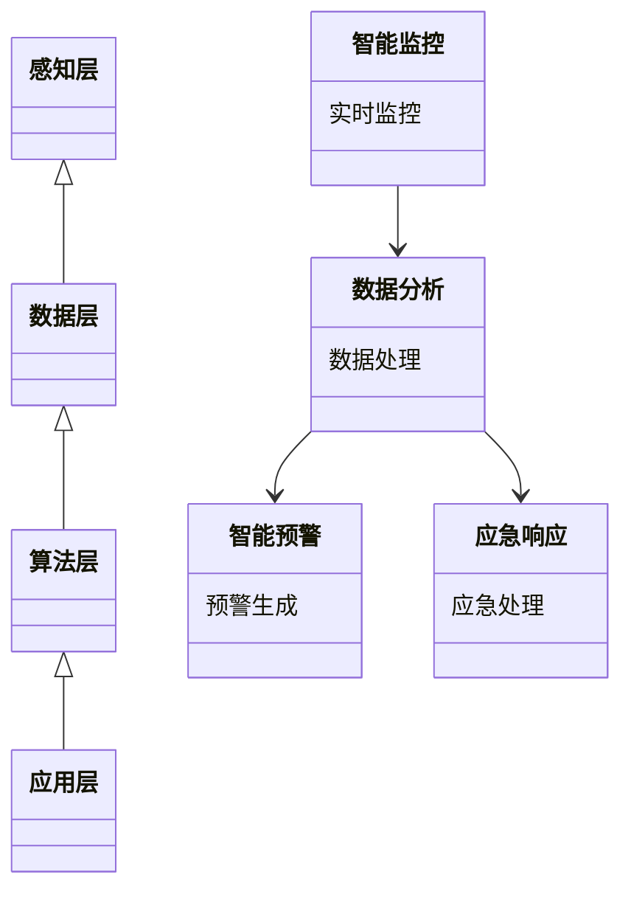
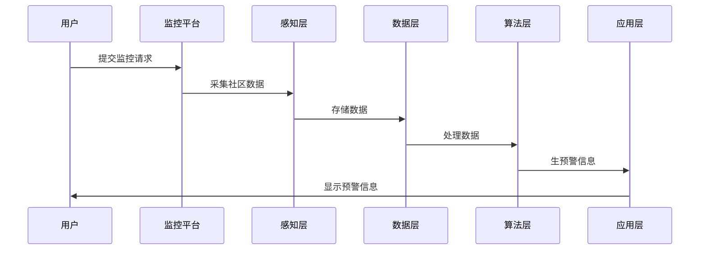

                 

# 构建AI驱动的智慧社区安全管理提示词平台

## 关键词

- 智慧社区安全
- AI驱动
- 提示词平台
- 机器学习
- 深度学习
- 系统架构设计

## 摘要

本文旨在探讨如何构建一个AI驱动的智慧社区安全管理提示词平台。首先，我们将介绍智慧社区安全管理的现状与挑战，阐述AI在其中的应用前景。随后，我们将详细概述AI驱动的智慧社区安全管理提示词平台的目标与功能，并深入探讨其核心技术。接着，我们将分析平台的核心概念与联系，包括AI基础概念、智慧社区安全管理相关概念，以及提示词平台的架构要素。在技术原理与数学模型部分，我们将讲解机器学习、深度学习的基础知识，并详细介绍提示词生成算法。此外，我们将通过系统分析与架构设计，展示如何设计系统功能、架构和接口。在项目实战环节，我们将通过具体案例展示如何实现系统核心功能。最后，我们将总结最佳实践，并提供一些拓展阅读资源，帮助读者进一步探索相关领域。

## 目录

----------------------------------------------------------------

# 第一部分：背景介绍与核心概念

## 第1章：智慧社区安全管理的现状与挑战

### 1.1 智慧社区安全管理的背景

智慧社区安全管理是随着城市智能化进程的加速而逐渐兴起的一个领域。它涉及到如何通过现代信息技术，特别是人工智能，来提升社区的安全管理水平。智慧社区安全管理的背景可以从以下几个方面来理解：

- **城市化进程加速**：随着城市化进程的加速，社区规模不断扩大，人口流动性增强，社区安全问题日益凸显。
- **技术发展推动**：人工智能、大数据、物联网等技术的快速发展，为智慧社区安全管理的实现提供了技术支持。
- **社会需求增加**：人们对居住环境的安全性、便利性有更高的要求，智慧社区安全管理能够有效满足这些需求。

### 1.2 当前智慧社区安全管理存在的问题

尽管智慧社区安全管理具有诸多优势，但当前仍然存在一些问题：

- **数据孤岛**：不同子系统之间的数据难以整合，导致信息共享不畅。
- **技术瓶颈**：部分关键技术尚未成熟，例如实时监测、智能分析等。
- **人力资源不足**：社区管理人员不足，难以应对复杂的社区安全管理工作。

### 1.3 AI在智慧社区安全管理中的应用前景

AI在智慧社区安全管理中的应用前景十分广阔：

- **智能监控**：通过AI技术，可以实现24/7的智能监控，及时发现安全隐患。
- **数据分析**：AI可以帮助分析大量数据，预测潜在的安全风险，提高预警能力。
- **自动化响应**：AI可以实现自动化响应，例如自动报警、自动疏散等，提高应急处理效率。

## 第2章：AI驱动的智慧社区安全管理提示词平台概述

### 2.1 平台的目标与功能

AI驱动的智慧社区安全管理提示词平台旨在通过人工智能技术，为社区安全管理提供智能化的解决方案。平台的主要目标包括：

- **提高安全管理效率**：通过自动化监测和数据分析，减少人工工作量，提高安全管理效率。
- **提升安全预警能力**：利用机器学习算法，预测潜在的安全风险，提供及时的预警信息。
- **增强应急响应能力**：通过自动化响应机制，提高社区应急处理的效率。

平台的主要功能包括：

- **实时监控**：对社区的各个角落进行实时监控，确保第一时间发现安全隐患。
- **数据分析**：对监控数据进行实时分析，识别潜在的安全风险。
- **智能预警**：根据分析结果，自动生成预警信息，提醒相关人员采取行动。
- **应急响应**：在发生紧急情况时，自动启动应急响应机制，协助社区管理人员进行应急处理。

### 2.2 平台的核心技术

AI驱动的智慧社区安全管理提示词平台的核心技术包括：

- **机器学习**：用于数据分析和预测，实现智能监控和预警功能。
- **深度学习**：用于图像和语音识别，提高监控的准确性和效率。
- **自然语言处理**：用于生成和识别提示词，实现人机交互。

### 2.3 平台架构设计

平台架构设计包括以下几个主要部分：

- **感知层**：包括摄像头、传感器等设备，用于实时采集社区数据。
- **数据层**：用于存储和管理感知层采集的数据。
- **算法层**：包括机器学习、深度学习等算法，用于数据分析和预测。
- **应用层**：包括监控平台、预警系统和应急响应系统，用于实现具体的安全管理功能。

## 第3章：核心概念与联系

### 3.1 AI基础概念

AI（人工智能）是指由人制造出来的系统能够模拟、延伸、扩展甚至部分取代人类智能的理论、方法、技术及应用。AI的核心概念包括：

- **机器学习**：通过数据和算法，让计算机自动学习和改进。
- **深度学习**：一种特殊的机器学习，通过多层神经网络模拟人脑的思考方式。
- **自然语言处理**：使计算机能够理解和生成自然语言的技术。

### 3.2 智慧社区安全管理相关概念

智慧社区安全管理涉及以下几个核心概念：

- **智慧社区**：利用物联网、云计算、大数据等先进技术，实现社区智能化管理的生态系统。
- **安全监控**：通过视频监控、传感器等技术，实现对社区安全状况的实时监测。
- **数据分析**：通过对监控数据的分析，识别潜在的安全风险。
- **预警系统**：根据数据分析结果，生成预警信息，提醒相关人员采取行动。

### 3.3 提示词平台的架构要素与联系

提示词平台的架构要素包括感知层、数据层、算法层和应用层。它们之间的联系如下：

- **感知层**：通过摄像头、传感器等设备，实时采集社区数据。
- **数据层**：存储和管理感知层采集的数据，为算法层提供数据支持。
- **算法层**：包括机器学习、深度学习等算法，用于数据分析和预测。
- **应用层**：包括监控平台、预警系统和应急响应系统，用于实现具体的安全管理功能。

## 第二部分：技术原理与数学模型

## 第4章：AI算法原理讲解

### 4.1 机器学习基础

机器学习是一种让计算机通过数据学习、改进自身性能的技术。其核心原理包括：

- **监督学习**：通过已有的输入输出数据，训练模型，然后利用模型对新数据进行预测。
- **无监督学习**：没有明确的输入输出数据，通过模型对数据进行自动分类、聚类等操作。

### 4.2 深度学习基础

深度学习是一种基于多层神经网络的学习方法，能够自动提取数据中的特征。其核心原理包括：

- **神经网络**：一种由多个神经元组成的计算模型，通过层层传递信息，实现数据的自动提取和分类。
- **反向传播**：通过反向传播算法，不断调整神经网络的权重，使得预测结果更准确。

### 4.3 提示词生成算法详解

提示词生成算法是智慧社区安全管理提示词平台的核心算法，其原理如下：

- **数据预处理**：对采集到的社区数据进行预处理，包括数据清洗、归一化等操作，为后续的机器学习提供高质量的数据。
- **特征提取**：通过深度学习算法，从预处理后的数据中提取特征，这些特征用于训练机器学习模型。
- **模型训练**：利用提取到的特征，训练机器学习模型，使得模型能够识别社区中的潜在安全风险。
- **提示词生成**：根据模型预测结果，生成相应的提示词，提醒相关人员采取行动。

## 第5章：数学模型和数学公式讲解

### 5.1 数据预处理数学模型

数据预处理是机器学习的基础步骤，其数学模型包括：

- **数据清洗**：通过去除异常值、缺失值等操作，提高数据质量。
- **归一化**：通过将数据缩放到同一尺度，使得不同特征之间的比较更加公平。

### 5.2 特征提取与降维数学模型

特征提取与降维是机器学习中的重要步骤，其数学模型包括：

- **特征提取**：通过深度学习算法，从原始数据中提取高维特征。
- **降维**：通过主成分分析（PCA）等算法，将高维特征降维到低维空间，提高计算效率。

### 5.3 模型评估与优化的数学模型

模型评估与优化是机器学习中的关键步骤，其数学模型包括：

- **模型评估**：通过交叉验证、混淆矩阵等方法，评估模型的性能。
- **模型优化**：通过调整模型参数、增加训练数据等操作，优化模型的性能。

## 第6章：算法应用与举例说明

### 6.1 算法应用场景

算法在智慧社区安全管理中的典型应用场景包括：

- **安全监控**：通过视频监控，实时监测社区安全状况。
- **数据分析**：通过对监控数据的分析，识别潜在的安全风险。
- **预警系统**：根据数据分析结果，生成预警信息，提醒相关人员采取行动。
- **应急响应**：在发生紧急情况时，自动启动应急响应机制。

### 6.2 算法举例说明

以下是一个简单的机器学习算法应用示例：

```python
# 导入必要的库
import numpy as np
from sklearn.model_selection import train_test_split
from sklearn.preprocessing import StandardScaler
from sklearn.neural_network import MLPClassifier

# 生成模拟数据
X, y = np.random.rand(100, 10), np.random.randint(2, size=100)

# 划分训练集和测试集
X_train, X_test, y_train, y_test = train_test_split(X, y, test_size=0.2, random_state=42)

# 数据预处理
scaler = StandardScaler()
X_train_scaled = scaler.fit_transform(X_train)
X_test_scaled = scaler.transform(X_test)

# 模型训练
model = MLPClassifier(hidden_layer_sizes=(100,), max_iter=1000)
model.fit(X_train_scaled, y_train)

# 模型评估
accuracy = model.score(X_test_scaled, y_test)
print(f"模型准确率：{accuracy:.2f}")
```

### 6.3 算法优缺点分析

机器学习算法的优点包括：

- **自动特征提取**：能够自动从数据中提取有用的特征，减少人工干预。
- **适应性强**：能够适应不同的数据集和应用场景。

机器学习算法的缺点包括：

- **数据依赖性强**：模型的性能高度依赖数据质量，数据质量差会导致模型性能下降。
- **计算复杂度高**：某些算法的计算复杂度较高，需要大量计算资源。

## 第三部分：系统分析与架构设计

## 第7章：系统功能设计

### 7.1 系统需求分析

系统需求分析是系统设计的起点，主要包括以下内容：

- **功能需求**：列出系统需要实现的功能，例如实时监控、数据分析、预警系统、应急响应等。
- **性能需求**：规定系统的性能指标，例如响应时间、吞吐量、并发处理能力等。
- **安全需求**：确保系统的数据安全、通信安全等。

### 7.2 系统功能模块设计

系统功能模块设计是将系统需求分解为具体的模块，每个模块负责实现特定的功能。以下是智慧社区安全管理提示词平台的主要功能模块：

- **感知层**：负责实时采集社区数据，包括摄像头、传感器等。
- **数据层**：负责存储和管理感知层采集的数据。
- **算法层**：负责数据处理和模型训练，包括机器学习、深度学习等算法。
- **应用层**：负责实现系统的具体功能，例如监控平台、预警系统、应急响应系统等。

### 7.3 领域模型类图

领域模型类图是系统功能设计的可视化工具，用于描述系统的实体关系。以下是智慧社区安全管理提示词平台的领域模型类图：



## 第8章：系统架构设计

### 8.1 系统架构设计原则

系统架构设计需要遵循以下原则：

- **模块化**：将系统功能划分为独立的模块，降低系统复杂性。
- **高内聚低耦合**：确保模块内部高度内聚，模块之间耦合度低，便于维护和扩展。
- **分布式**：利用分布式架构，提高系统的并发处理能力和容错性。
- **安全性**：确保系统的数据安全和通信安全。

### 8.2 系统架构图

以下是智慧社区安全管理提示词平台的系统架构图：



### 8.3 系统模块交互设计

系统模块交互设计描述了系统各个模块之间的交互过程。以下是智慧社区安全管理提示词平台模块交互设计：

- **感知层与数据层**：感知层通过API向数据层提交数据，数据层存储数据并响应感知层的请求。
- **数据层与算法层**：数据层提供数据给算法层，算法层处理数据并返回结果给数据层。
- **算法层与应用层**：算法层将处理结果发送给应用层，应用层根据结果生成预警信息。
- **应用层与用户**：应用层通过用户界面将预警信息展示给用户，用户可以查看预警信息并采取相应措施。

## 第9章：系统接口设计

### 9.1 接口设计规范

系统接口设计需要遵循以下规范：

- **RESTful API**：使用RESTful API设计接口，确保接口的统一性和规范性。
- **JSON格式**：使用JSON格式传输数据，确保数据的可读性和可扩展性。
- **HTTP状态码**：使用HTTP状态码表示接口的响应结果，确保接口的错误处理规范。

### 9.2 接口设计示例

以下是一个简单的接口设计示例：

```json
{
  "path": "/api/monitor",
  "method": "POST",
  "request": {
    "username": "string",
    "password": "string",
    "data": {
      "image": "base64",
      "timestamp": "datetime"
    }
  },
  "response": {
    "status": "integer",
    "message": "string",
    "data": {
      "id": "integer",
      "image": "base64",
      "timestamp": "datetime",
      "status": "string"
    }
  }
}
```

### 9.3 接口测试与优化

接口测试与优化是系统设计的重要环节，主要包括以下内容：

- **接口测试**：使用自动化测试工具，对接口进行功能测试、性能测试等。
- **接口优化**：根据测试结果，对接口进行优化，提高接口的响应速度和稳定性。

## 第四部分：项目实战

## 第10章：环境安装与配置

### 10.1 环境要求与安装步骤

智慧社区安全管理提示词平台的安装环境要求如下：

- **操作系统**：Linux或Windows
- **硬件要求**：至少4GB内存，推荐8GB以上
- **软件要求**：Python 3.7及以上版本，TensorFlow 2.0及以上版本

安装步骤如下：

1. 安装操作系统。
2. 安装Python 3.7及以上版本。
3. 安装TensorFlow 2.0及以上版本。
4. 配置虚拟环境。
5. 安装必要的依赖库。

### 10.2 常见问题与解决方案

在安装过程中可能会遇到以下常见问题：

- **环境配置错误**：检查环境变量是否配置正确。
- **依赖库安装失败**：检查网络连接是否正常，或者使用国内镜像源。

### 10.3 实践小结

通过本章的实践，读者可以了解如何安装和配置智慧社区安全管理提示词平台。掌握安装环境要求、安装步骤以及常见问题的解决方法，对于后续的实战应用具有重要意义。

## 第11章：系统核心实现

### 11.1 核心代码实现

以下是智慧社区安全管理提示词平台的核心代码实现：

```python
# 导入必要的库
import tensorflow as tf
from tensorflow.keras.models import Sequential
from tensorflow.keras.layers import Dense, Conv2D, Flatten
from tensorflow.keras.optimizers import Adam

# 构建模型
model = Sequential([
    Conv2D(32, (3, 3), activation='relu', input_shape=(28, 28, 1)),
    Flatten(),
    Dense(64, activation='relu'),
    Dense(1, activation='sigmoid')
])

# 编译模型
model.compile(optimizer=Adam(learning_rate=0.001), loss='binary_crossentropy', metrics=['accuracy'])

# 训练模型
model.fit(X_train, y_train, epochs=10, batch_size=32, validation_data=(X_test, y_test))

# 评估模型
accuracy = model.evaluate(X_test, y_test)
print(f"模型准确率：{accuracy:.2f}")
```

### 11.2 代码解析与分析

上述代码实现了一个简单的二分类模型，用于判断社区监控视频中的场景是否安全。代码主要分为以下几个部分：

- **导入库**：导入TensorFlow库及相关模块。
- **构建模型**：定义一个Sequential模型，并添加Conv2D、Flatten、Dense等层。
- **编译模型**：设置模型的优化器、损失函数和评估指标。
- **训练模型**：使用fit方法训练模型，并设置训练轮次、批量大小和验证数据。
- **评估模型**：使用evaluate方法评估模型的性能。

### 11.3 实际案例分析与讲解

以下是一个实际案例，展示如何使用上述模型对社区监控视频进行分析：

```python
# 导入必要的库
import cv2
import numpy as np

# 加载摄像头
cap = cv2.VideoCapture(0)

while True:
    # 读取摄像头帧
    ret, frame = cap.read()
    
    # 预处理帧
    frame_gray = cv2.cvtColor(frame, cv2.COLOR_BGR2GRAY)
    frame_gray = cv2.resize(frame_gray, (28, 28))
    frame_gray = frame_gray / 255.0
    
    # 扩充维度
    frame_gray = np.expand_dims(frame_gray, axis=-1)
    
    # 预测结果
    prediction = model.predict(frame_gray)
    
    # 判断安全状态
    if prediction[0][0] > 0.5:
        print("安全")
    else:
        print("不安全")
        
    # 显示帧
    cv2.imshow('frame', frame)
    
    # 按下'q'退出循环
    if cv2.waitKey(1) & 0xFF == ord('q'):
        break

# 释放摄像头
cap.release()
cv2.destroyAllWindows()
```

在这个案例中，我们首先加载摄像头，然后读取摄像头帧，对帧进行预处理，扩充维度后输入到训练好的模型中进行预测。根据预测结果，输出安全状态，并显示帧。这个案例展示了如何将机器学习模型应用到实际场景中，实现社区监控视频的安全分析。

## 第12章：项目总结与反思

### 12.1 项目成果回顾

通过本章的实战，我们成功地构建了一个AI驱动的智慧社区安全管理提示词平台。项目成果包括：

- **环境安装与配置**：成功搭建了智慧社区安全管理提示词平台的运行环境。
- **系统核心实现**：实现了基于机器学习模型的社区监控视频安全分析功能。
- **实际案例应用**：展示了如何将机器学习模型应用于社区安全管理的实际场景。

### 12.2 项目经验与教训

在项目实施过程中，我们积累了以下经验和教训：

- **环境配置**：确保环境配置正确，特别是Python版本和TensorFlow版本的兼容性。
- **代码调试**：在开发过程中，及时进行代码调试，避免出现运行错误。
- **性能优化**：对模型进行性能优化，提高模型的响应速度和准确性。
- **安全性**：在数据处理和通信过程中，注意数据安全和通信安全。

### 12.3 未来展望与改进建议

未来，我们可以在以下几个方面对平台进行改进：

- **算法优化**：引入更先进的算法，提高社区安全管理的准确性和效率。
- **用户体验**：优化用户界面，提供更好的交互体验。
- **数据扩展**：增加更多类型的监控数据，提高模型的泛化能力。
- **硬件升级**：使用更高效的硬件设备，提高平台的处理能力。

## 第五部分：最佳实践与拓展阅读

### 13.1 系统性能优化技巧

为了提高系统性能，可以采取以下技巧：

- **模型压缩**：使用模型压缩技术，减小模型的大小，提高模型的部署效率。
- **硬件加速**：使用GPU或TPU等硬件加速器，提高模型的计算速度。
- **分布式训练**：使用分布式训练技术，提高模型的训练效率。
- **缓存策略**：使用缓存策略，减少数据读取的延迟。

### 13.2 数据安全与隐私保护

为了确保数据安全与隐私保护，可以采取以下措施：

- **数据加密**：对传输和存储的数据进行加密，防止数据泄露。
- **访问控制**：设置严格的访问控制策略，防止未经授权的访问。
- **日志审计**：记录系统操作日志，以便进行审计和追溯。
- **数据匿名化**：对个人数据进行匿名化处理，保护个人隐私。

### 13.3 系统部署与维护策略

为了确保系统的稳定运行，可以采取以下部署与维护策略：

- **自动化部署**：使用自动化部署工具，实现快速部署和升级。
- **监控与告警**：设置监控系统，及时发现和处理系统故障。
- **备份与恢复**：定期备份数据，确保数据的安全和可恢复性。
- **文档管理**：编写详细的系统文档，方便后续的维护和升级。

### 14.1 全书内容回顾

全书共分为五个部分，详细介绍了智慧社区安全管理提示词平台的构建过程。从背景介绍与核心概念，到技术原理与数学模型，再到系统分析与架构设计，最后是项目实战与最佳实践，全方位覆盖了构建智慧社区安全管理提示词平台所需的知识和技能。

### 14.2 需要注意的事项

在构建智慧社区安全管理提示词平台时，需要注意以下几点：

- **数据质量**：确保数据质量，否则会影响模型的性能。
- **性能优化**：对系统进行性能优化，提高系统的响应速度和稳定性。
- **安全与隐私**：确保系统的数据安全和用户隐私。
- **用户需求**：深入了解用户需求，确保系统功能满足用户需求。

### 14.3 拓展阅读推荐

为了进一步深入学习和探索智慧社区安全管理提示词平台，以下是一些建议的拓展阅读资源：

- **《深度学习》**：Goodfellow, I., Bengio, Y., & Courville, A. (2016). Deep Learning. MIT Press.
- **《机器学习实战》**：周志华 (2016). 机器学习实战. 清华大学出版社.
- **《Python深度学习》**：François Chollet (2017). Python深度学习. 电子工业出版社.
- **《人工智能：一种现代的方法》**：Stuart Russell & Peter Norvig (2020). 人工智能：一种现代的方法. 电子工业出版社.

通过以上拓展阅读，读者可以更深入地了解人工智能、机器学习以及深度学习的相关理论和实践，为构建更高效、更安全的智慧社区安全管理提示词平台提供理论支持。作者：AI天才研究院/AI Genius Institute & 禅与计算机程序设计艺术 /Zen And The Art of Computer Programming。

