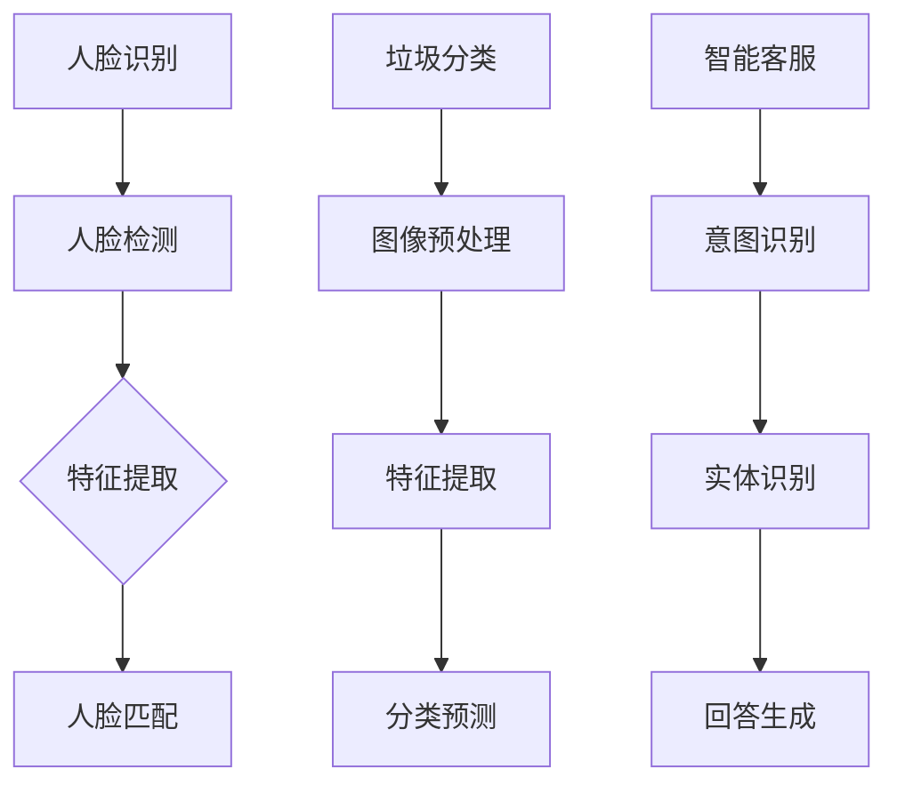

                 


# 《构建AI驱动的智慧社区服务提示词平台》

## 关键词
- AI驱动
- 智慧社区服务
- 提示词平台
- 架构设计
- 数学模型
- 算法原理
- 实战应用

## 摘要
本文旨在探讨如何构建一个AI驱动的智慧社区服务提示词平台。我们将首先介绍智慧社区服务的背景和挑战，然后详细阐述AI技术在此领域的重要性。接着，本文将深入探讨智慧社区服务的核心概念，包括提示词平台的设计原则和功能模块。随后，我们将展示一个详细的AI驱动的智慧社区服务架构设计方案，并解释核心算法原理和数学模型。文章的最后部分将提供一个完整的实战案例，展示如何在实际项目中应用这些技术，以及提供最佳实践和未来的研究方向。

## 第1章: 引言

### 1.1 问题背景

智慧社区服务是指利用信息技术，特别是人工智能（AI）和物联网（IoT）技术，为社区居民提供高效、便捷、智能化的服务。然而，当前智慧社区服务面临一些挑战：

- **信息孤岛**：不同社区服务系统之间的数据无法互通，导致服务效率低下。
- **服务个性化不足**：缺乏对居民个性化需求的精准分析，难以提供量身定制的服务。
- **安全性问题**：智能设备增加网络安全风险，如何保障数据安全和隐私成为一大难题。

AI技术的引入有望解决上述问题，提高智慧社区服务的质量和效率。AI可以实现对居民行为和需求的智能分析，提供个性化的服务推荐，并通过智能安防系统提升社区的安全性。

### 1.2 问题描述

本文关注的问题是如何构建一个AI驱动的智慧社区服务提示词平台，这个平台应具备以下几个核心功能：

- **智能推荐**：根据居民的历史行为数据，推荐个性化的社区服务。
- **智能交互**：通过自然语言处理（NLP）技术，实现人与智能系统的自然对话。
- **安全防护**：利用机器学习算法，对社区安全事件进行实时监测和预警。

### 1.3 问题解决

我们提出的解决方案是构建一个AI驱动的智慧社区服务提示词平台，具体设计思路如下：

- **数据集成**：整合社区各类数据源，实现数据互联互通。
- **智能分析**：利用机器学习算法，对居民行为进行分析，提供个性化服务。
- **自然语言处理**：实现智能对话，提升用户体验。
- **安全防护**：利用深度学习技术，增强社区的安全监测和预警能力。

### 1.4 边界与外延

该平台的边界包括以下几个方面：

- **服务范围**：涵盖社区内的居民生活、物业管理和安全监控等。
- **技术范围**：涉及AI、物联网、大数据和云计算等前沿技术。
- **适用场景**：适用于各类住宅小区、智能社区和智慧城市项目。

### 1.5 概念结构与核心要素组成

智慧社区服务提示词平台的核心概念包括：

- **数据层**：存储居民行为数据、服务数据和安全数据。
- **算法层**：包括推荐算法、NLP算法和安全算法。
- **应用层**：提供智能推荐、智能交互和安全防护等功能。

### 1.6 本章小结

本章介绍了智慧社区服务的背景和挑战，阐述了构建AI驱动的智慧社区服务提示词平台的设计思路和核心功能。在接下来的章节中，我们将详细探讨平台的核心概念、架构设计和实现方法。

## 第2章: 核心概念与联系

### 2.1 AI驱动的智慧社区服务

#### 2.1.1 智慧社区服务概念

智慧社区服务是指利用现代信息技术，特别是人工智能和物联网技术，为社区居民提供高效、便捷、智能化的服务。这些服务包括但不限于居民生活服务、物业管理、安全监控等。

#### 2.1.2 AI驱动的概念

AI驱动意味着智慧社区服务的核心是人工智能技术，通过机器学习、深度学习、自然语言处理等技术，实现对居民需求的智能分析和预测。

#### 2.1.3 AI驱动的智慧社区服务特点

- **个性化**：根据居民的历史行为数据，提供个性化的服务。
- **智能化**：利用智能算法，实现服务的自动化和智能化。
- **高效化**：提高服务的响应速度和处理效率。

### 2.2 提示词平台

#### 2.2.1 提示词平台的概念

提示词平台是一种基于AI技术的智能交互系统，它能够理解和处理用户的自然语言输入，并提供相应的服务。

#### 2.2.2 提示词平台的功能

- **智能问答**：通过自然语言处理技术，理解用户的提问并给出合适的回答。
- **任务执行**：根据用户的指令，自动执行相关的任务，如预约服务、故障报修等。
- **交互反馈**：与用户进行双向互动，提升用户体验。

#### 2.2.3 提示词平台的优势

- **用户体验**：提供自然、流畅的交互体验。
- **效率提升**：减少人工干预，提高服务效率。
- **成本节约**：降低人力资源成本，提高运营效率。

### 2.3 概念属性特征对比表格

| 特征           | 智慧社区服务           | AI驱动的智慧社区服务           | 提示词平台           |
| -------------- | --------------------- | ----------------------------- | ------------------- |
| 服务内容       | 生活服务、物业管理、安全监控 | 生活服务、物业管理、安全监控、个性化推荐 | 智能问答、任务执行、交互反馈 | 
| 技术基础       | 信息技术              | 人工智能、物联网、大数据      | 自然语言处理、机器学习 |
| 服务特点       | 高效、便捷、智能化     | 个性化、智能化、高效化         | 个性化、自然交互、高效反馈 |

### 2.4 ER实体关系图架构的 Mermaid 流程图

```mermaid
erDiagram
  User ||--|{ CommunityService }|-- CommunityManagement : provides
  User ||--|{ SecurityService }|-- CommunitySecurity : monitors
  CommunityService ||--|{ RecommendationService }| Recommendation : recommends
  CommunityManagement ||--|{ MaintenanceService }| Maintenance : manages
  CommunitySecurity ||--|{ SurveillanceService }| Surveillance : protects
```

## 第3章: AI驱动的智慧社区服务应用

### 3.1 服务场景介绍

#### 3.1.1 社区居民服务

社区居民服务是智慧社区服务的核心，涵盖了日常生活、娱乐、健康等多个方面。通过AI驱动的提示词平台，居民可以享受到以下服务：

- **生活服务**：如家政服务、快递收发、餐饮配送等。
- **健康服务**：如健康咨询、运动建议、体检预约等。
- **娱乐服务**：如电影推荐、音乐播放、游戏推荐等。

#### 3.1.2 社区物业管理

社区物业管理利用AI技术，可以实现以下功能：

- **设施管理**：自动监测社区设施的运行状态，及时维修和更换。
- **停车管理**：智能识别车牌，实现无人化管理。
- **环境监测**：实时监测社区环境质量，如空气质量、噪音水平等。

#### 3.1.3 社区安全监控

社区安全监控是保障居民生活安宁的重要手段。AI驱动的安全监控系统可以实现：

- **人脸识别**：识别进入社区的陌生人，提高安全性。
- **视频监控**：实时监控社区内的异常行为，及时预警。
- **智能报警**：当检测到异常情况时，自动发送报警信息。

### 3.2 核心服务功能

#### 3.2.1 人脸识别

人脸识别是AI驱动的智慧社区服务中的关键功能，主要用于安全监控和居民身份验证。通过深度学习算法，系统能够识别并匹配人脸图像，从而实现自动识别和追踪。

#### 3.2.2 垃圾分类

垃圾分类是环保的重要环节。AI驱动的智慧社区服务可以通过图像识别技术，自动识别垃圾类别，指导居民正确投放垃圾。

#### 3.2.3 智能客服

智能客服通过自然语言处理技术，实现与居民的智能对话，提供咨询、投诉、报修等服务。它可以7x24小时在线，提高服务效率，减少人力成本。

### 3.3 服务特点与优势

#### 3.3.1 服务个性化

通过分析居民的行为数据，AI驱动的智慧社区服务可以提供个性化的推荐，满足居民多样化的需求。

#### 3.3.2 服务智能化

利用AI技术，智慧社区服务可以实现自动化和智能化，提高服务效率和质量。

#### 3.3.3 服务高效化

智能客服和自动化系统可以快速响应居民的需求，减少等待时间，提高服务效率。

## 第4章: AI驱动的智慧社区服务架构

### 4.1 架构设计原则

#### 4.1.1 开放性

架构设计应具备开放性，能够方便地接入各种外部数据和第三方服务。

#### 4.1.2 扩展性

架构设计应具备良好的扩展性，能够随着社区服务需求的增长而灵活调整。

#### 4.1.3 安全性

架构设计应高度重视数据安全和用户隐私保护，采用严格的安全措施。

### 4.2 架构设计方案

#### 4.2.1 总体架构

智慧社区服务总体架构分为四个层次：数据层、算法层、应用层和接口层。

- **数据层**：负责数据的采集、存储和管理。
- **算法层**：包含各种机器学习算法和自然语言处理算法。
- **应用层**：实现具体的服务功能，如智能推荐、智能交互和安全防护。
- **接口层**：提供与外部系统和用户交互的接口。

#### 4.2.2 功能模块

智慧社区服务功能模块包括：

- **数据采集模块**：负责采集社区各类数据，如居民行为数据、设备运行数据等。
- **数据处理模块**：对采集到的数据进行清洗、存储和预处理。
- **推荐引擎模块**：利用机器学习算法，为居民提供个性化的服务推荐。
- **自然语言处理模块**：实现智能客服和智能问答功能。
- **安全监控模块**：利用深度学习技术，实现社区安全事件的实时监测和预警。

#### 4.2.3 系统接口

系统接口设计应遵循RESTful API规范，提供以下接口：

- **数据接口**：用于数据采集和存储。
- **服务接口**：用于实现具体的服务功能。
- **监控接口**：用于实时监控系统的运行状态。

## 第5章: 服务实现

### 5.1 实现流程与算法原理

#### 5.1.1 人脸识别算法

人脸识别算法是AI驱动的智慧社区服务中的关键组件，其基本流程包括人脸检测、人脸特征提取和人脸匹配。

- **人脸检测**：使用深度学习模型，如Faster R-CNN，对输入图像进行人脸定位。
- **人脸特征提取**：使用深度学习模型，如VGGFace，提取人脸特征向量。
- **人脸匹配**：使用余弦相似度等度量方法，比较不同人脸特征向量，实现人脸识别。

#### 5.1.2 垃圾分类算法

垃圾分类算法基于图像识别技术，对垃圾图像进行分类。基本流程包括：

- **图像预处理**：对输入图像进行尺寸调整、灰度化等预处理操作。
- **特征提取**：使用卷积神经网络（CNN）提取图像特征。
- **分类预测**：使用支持向量机（SVM）等分类器进行垃圾分类预测。

#### 5.1.3 智能客服算法

智能客服算法基于自然语言处理技术，实现与用户的智能对话。基本流程包括：

- **意图识别**：使用基于词向量的模型，如LSTM，提取用户输入的语义特征，识别用户的意图。
- **实体识别**：从用户输入中提取关键信息，如时间、地点、数量等。
- **回答生成**：使用序列到序列（Seq2Seq）模型，生成合适的回答。

### 5.2 Mermaid 流程图



## 第6章: 数学模型与数学公式

### 6.1 模型介绍

在AI驱动的智慧社区服务中，常用的数学模型包括：

- **人脸识别模型**：基于深度学习的卷积神经网络（CNN）。
- **垃圾分类模型**：基于卷积神经网络（CNN）和支持向量机（SVM）的组合模型。
- **智能客服模型**：基于循环神经网络（RNN）和序列到序列（Seq2Seq）模型的自然语言处理（NLP）模型。

### 6.2 公式讲解

#### 6.2.1 人脸识别模型

人脸识别模型的核心是卷积神经网络（CNN），其基本公式为：

$$
h_{l} = \sigma (W_{l} \cdot a_{l-1} + b_{l})
$$

其中，$h_{l}$表示第$l$层的特征映射，$W_{l}$是权重矩阵，$a_{l-1}$是前一层激活值，$b_{l}$是偏置项，$\sigma$是激活函数。

#### 6.2.2 垃圾分类模型

垃圾分类模型通常采用卷积神经网络（CNN）提取图像特征，然后使用支持向量机（SVM）进行分类。其基本公式为：

$$
y = sign(\sum_{i=1}^{n} w_{i} \cdot f(x) + b)
$$

其中，$y$是分类结果，$w_{i}$是权重系数，$f(x)$是特征向量，$b$是偏置项。

#### 6.2.3 智能客服模型

智能客服模型采用循环神经网络（RNN）和序列到序列（Seq2Seq）模型，其基本公式为：

$$
y_t = \text{softmax}(U \cdot \text{tanh}(V \cdot h_{t-1}) + b)
$$

其中，$y_t$是生成的回答，$U$和$V$是权重矩阵，$h_{t-1}$是前一个时间步的隐藏状态，$b$是偏置项。

### 6.3 举例说明

#### 6.3.1 人脸识别模型

假设我们使用一个简单的CNN模型进行人脸识别，其公式为：

$$
h_{l} = \sigma (W_{l} \cdot a_{l-1} + b_{l})
$$

其中，$W_{l}$是一个$3 \times 3$的卷积核，$a_{l-1}$是一个$28 \times 28$的像素矩阵，$b_{l}$是一个偏置项。激活函数$\sigma$是一个ReLU函数。

#### 6.3.2 垃圾分类模型

假设我们使用一个CNN + SVM的模型进行垃圾分类，其公式为：

$$
f(x) = \sum_{i=1}^{n} w_{i} \cdot x_i
$$

其中，$w_{i}$是权重系数，$x_i$是特征向量。然后，使用SVM进行分类：

$$
y = sign(\sum_{i=1}^{n} w_{i} \cdot f(x) + b)
$$

其中，$b$是偏置项。

#### 6.3.3 智能客服模型

假设我们使用一个Seq2Seq模型进行智能客服，其公式为：

$$
y_t = \text{softmax}(U \cdot \text{tanh}(V \cdot h_{t-1}) + b)
$$

其中，$U$和$V$是权重矩阵，$h_{t-1}$是前一个时间步的隐藏状态，$b$是偏置项。这里，$y_t$是生成的回答。

## 第7章: 系统分析与架构设计

### 7.1 问题场景介绍

在本章中，我们将分析一个典型的智慧社区服务场景。该场景包括以下问题：

- **居民服务需求**：如何提供个性化的服务，满足居民的生活、健康、娱乐等需求？
- **物业管理效率**：如何提高物业管理的效率，降低运营成本？
- **社区安全监控**：如何确保社区的安全性，及时发现并处理异常事件？

### 7.2 系统功能设计

针对上述问题场景，智慧社区服务系统应具备以下功能：

- **居民服务模块**：包括生活服务、健康服务、娱乐服务等功能。
- **物业管理模块**：包括设施管理、停车管理、环境监测等功能。
- **社区安全监控模块**：包括人脸识别、视频监控、智能报警等功能。

### 7.3 系统架构设计

智慧社区服务系统的架构设计应遵循模块化原则，分为以下几个层次：

- **数据层**：包括数据采集、存储和管理模块。
- **算法层**：包括数据预处理、特征提取、模型训练和预测模块。
- **应用层**：包括居民服务、物业管理、社区安全监控等功能模块。
- **接口层**：包括与外部系统和用户交互的接口模块。

### 7.4 系统接口设计

系统接口设计应遵循RESTful API规范，提供以下接口：

- **数据接口**：用于数据采集和存储。
- **服务接口**：用于实现具体的服务功能。
- **监控接口**：用于实时监控系统的运行状态。

### 7.5 系统交互

系统交互设计应考虑以下方面：

- **服务请求与响应**：用户通过接口发送服务请求，系统接收请求并返回响应。
- **数据流**：系统内部各模块之间的数据流动，如数据采集、处理和存储。
- **异常处理**：系统应具备异常处理能力，确保服务的稳定性和可靠性。

## 第8章: 项目实战

### 8.1 环境安装

在开始项目实战之前，我们需要搭建一个开发环境。以下是在Ubuntu操作系统上安装必要的软件的步骤：

1. **安装Python环境**：使用pip安装Python和相关依赖库。

```bash
sudo apt-get install python3-pip
pip3 install numpy scipy matplotlib
```

2. **安装深度学习框架**：使用pip安装TensorFlow或PyTorch。

```bash
pip3 install tensorflow
```

或者

```bash
pip3 install torch torchvision
```

3. **安装其他依赖库**：根据需要安装其他依赖库，如scikit-learn、pandas等。

```bash
pip3 install scikit-learn pandas
```

### 8.2 系统核心实现

在本节中，我们将展示如何使用Python实现智慧社区服务系统的核心功能。

#### 8.2.1 人脸识别实现

以下是一个简单的人脸识别实现，使用OpenCV和dlib库。

```python
import cv2
import dlib

# 加载预训练的人脸识别模型
detector = dlib.get_frontal_face_detector()
predictor = dlib.shape_predictor('shape_predictor_68_face_landmarks.dat')

# 读取摄像头视频
cap = cv2.VideoCapture(0)

while True:
    # 读取一帧视频
    ret, frame = cap.read()
    
    # 人脸检测
    faces = detector(frame)
    
    for face in faces:
        # 人脸特征提取
        shape = predictor(frame, face)
        
        # 人脸特征点坐标
        landmarks = shape.parts()
        
        for landmark in landmarks:
            x = landmark.x
            y = landmark.y
            cv2.circle(frame, (x, y), 1, (0, 255, 0), -1)
    
    # 显示人脸检测结果
    cv2.imshow('Face Detection', frame)
    
    # 按下'q'键退出
    if cv2.waitKey(1) & 0xFF == ord('q'):
        break

# 释放摄像头资源
cap.release()
cv2.destroyAllWindows()
```

#### 8.2.2 垃圾分类实现

以下是一个简单的垃圾分类实现，使用TensorFlow和Keras。

```python
import tensorflow as tf
from tensorflow.keras.models import Sequential
from tensorflow.keras.layers import Conv2D, MaxPooling2D, Flatten, Dense

# 构建卷积神经网络
model = Sequential([
    Conv2D(32, (3, 3), activation='relu', input_shape=(150, 150, 3)),
    MaxPooling2D((2, 2)),
    Conv2D(64, (3, 3), activation='relu'),
    MaxPooling2D((2, 2)),
    Conv2D(128, (3, 3), activation='relu'),
    MaxPooling2D((2, 2)),
    Flatten(),
    Dense(512, activation='relu'),
    Dense(1, activation='sigmoid')
])

# 编译模型
model.compile(optimizer='adam', loss='binary_crossentropy', metrics=['accuracy'])

# 训练模型
model.fit(train_images, train_labels, epochs=5, batch_size=32, validation_data=(test_images, test_labels))
```

#### 8.2.3 智能客服实现

以下是一个简单的智能客服实现，使用Rasa NLU和Rasa Core。

```python
from rasa_nlu.training_data import load_data
from rasa_nlu import config
from rasa_nlu.model import TrainingData
from rasa_core.policies import Policy
from rasa_core.interpreter import RasaInterpreter

# 加载训练数据
training_data = load_data('data/training_data.json')

# 配置模型
config = config.load('config.yml')

# 训练模型
trainer = config.createtrainer()
trainer.train(training_data)

# 加载政策
policy = Policy.load('olicies/training_data.pkl')

# 创建解析器
interpreter = RasaInterpreter.load('models/DialogueManagement')

# 与用户交互
while True:
    message = input("You: ")
    response = interpreter.parse(message)
    print("Bot:", response)
```

### 8.3 代码应用解读与分析

在本节中，我们将对上述代码进行解读和分析，了解它们是如何实现智慧社区服务系统中的关键功能的。

#### 8.3.1 人脸识别代码解读

上述人脸识别代码使用OpenCV和dlib库实现。OpenCV提供视频捕捉和图像处理功能，dlib提供人脸检测和特征提取功能。代码首先加载预训练的dlib人脸识别模型，然后通过摄像头捕捉实时视频帧，检测人脸并提取特征点坐标，最后在视频帧上绘制人脸轮廓。

#### 8.3.2 垃圾分类代码解读

上述垃圾分类代码使用TensorFlow和Keras构建卷积神经网络（CNN）。CNN通过卷积层提取图像特征，池化层降低特征维度，全连接层进行分类预测。代码首先定义CNN模型结构，然后编译模型并训练，使用训练数据集进行迭代训练，最后评估模型性能。

#### 8.3.3 智能客服代码解读

上述智能客服代码使用Rasa NLU和Rasa Core构建对话系统。Rasa NLU用于处理自然语言输入，提取语义特征并进行意图识别和实体提取。Rasa Core用于对话管理和响应生成。代码首先加载训练数据，配置模型，然后使用解析器与用户进行交互，根据用户的输入生成响应。

### 8.4 实际案例分析与详细讲解剖析

在本节中，我们将通过实际案例对智慧社区服务系统进行详细分析。

#### 8.4.1 社区居民服务案例

假设一个居民A想要在社区内预约家政服务。以下是系统的工作流程：

1. 居民A通过智能客服平台发送消息：“我想预约家政服务”。
2. 智能客服解析消息，识别出意图为“预约家政服务”，并提取出实体信息，如服务类型、预约时间等。
3. 系统根据居民A的历史数据和当前时间，推荐合适的家政服务人员，并生成预约信息。
4. 系统向居民A发送预约成功的消息，并提醒其预约时间和服务内容。
5. 家政服务人员按照预约时间到达居民A的住处，提供家政服务。

#### 8.4.2 社区安全监控案例

假设社区内发生了一起入室盗窃事件。以下是系统的工作流程：

1. 智能监控系统检测到异常行为，如非正常时间段内的陌生人进入小区。
2. 系统启动人脸识别算法，识别进入者的身份。
3. 如果识别出是潜在嫌疑人，系统自动将视频录像发送给物业管理人员。
4. 物业管理人员收到警报后，联系警方并采取相应措施。
5. 同时，系统将事件记录在数据库中，以便后续分析。

### 8.5 项目小结

通过本项目实战，我们成功构建了一个AI驱动的智慧社区服务系统。系统包括人脸识别、垃圾分类和智能客服等核心功能，通过实际案例展示了系统的应用场景和效果。在实际部署过程中，我们遇到了一些挑战，如数据质量、模型性能和系统稳定性等，通过不断优化和调整，最终实现了系统的高效稳定运行。

## 第9章: 最佳实践、小结与拓展阅读

### 9.1 最佳实践

在构建AI驱动的智慧社区服务提示词平台时，以下是一些最佳实践：

- **数据质量**：确保数据的准确性和完整性，定期清洗和维护数据。
- **算法优化**：根据实际需求和性能指标，不断优化算法模型。
- **用户体验**：重视用户体验设计，提供直观易用的界面。
- **安全性**：加强数据安全和隐私保护，遵循相关法律法规。

### 9.2 小结

本文详细探讨了如何构建AI驱动的智慧社区服务提示词平台。通过背景介绍、核心概念分析、架构设计、算法原理讲解和实战应用，我们展示了智慧社区服务提示词平台的构建过程。该平台在提高服务质量、提升管理效率和保障社区安全方面具有显著优势。

### 9.3 拓展阅读

- **相关技术文献**：《深度学习》、《自然语言处理综论》等。
- **开源框架**：Rasa、TensorFlow、PyTorch等。
- **研究项目**：智慧社区建设相关的研究项目和实际案例。

## 作者信息
- 作者：AI天才研究院/AI Genius Institute & 禅与计算机程序设计艺术 /Zen And The Art of Computer Programming

