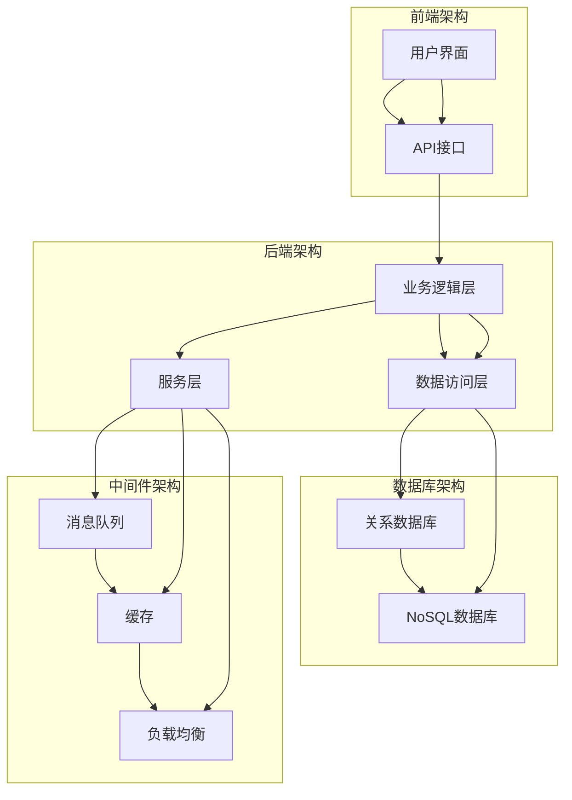
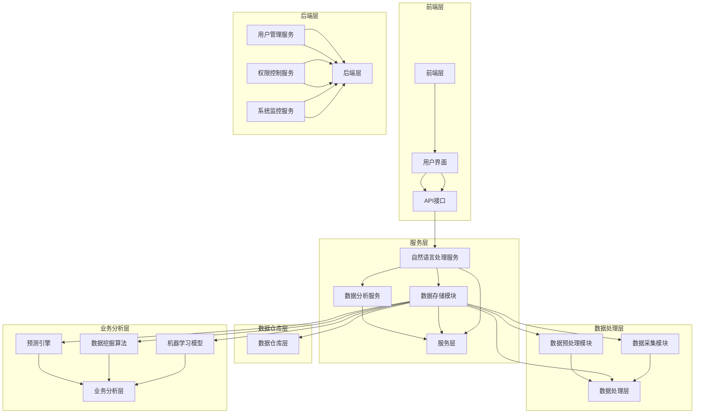
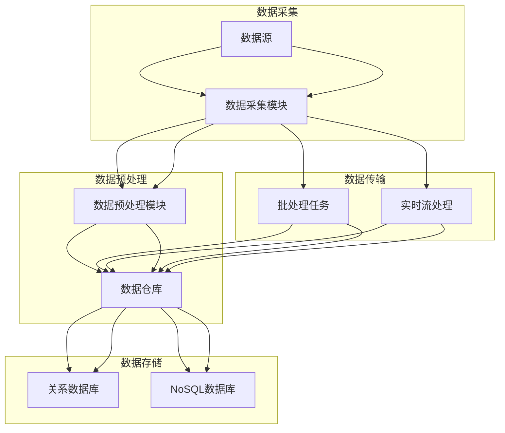
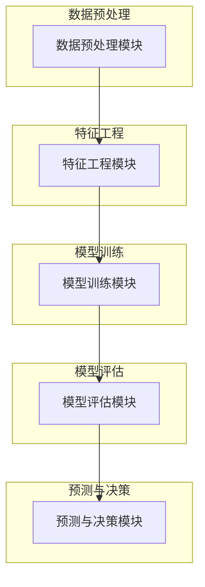
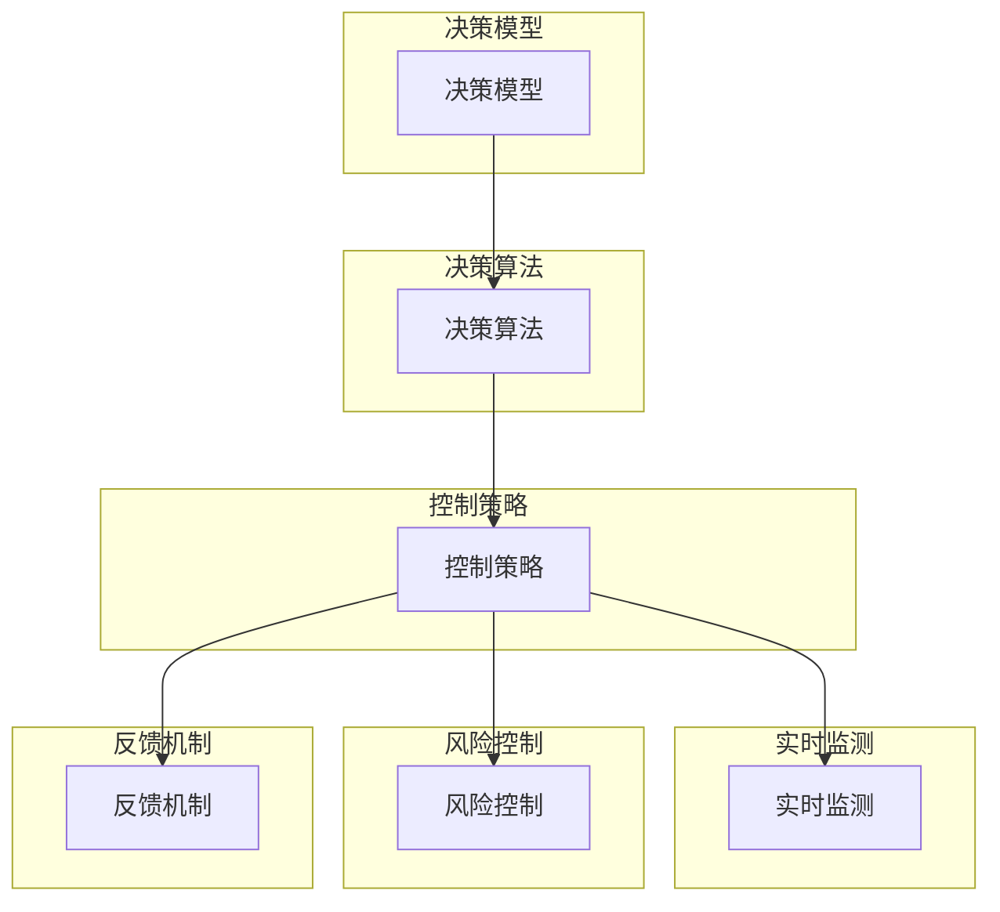
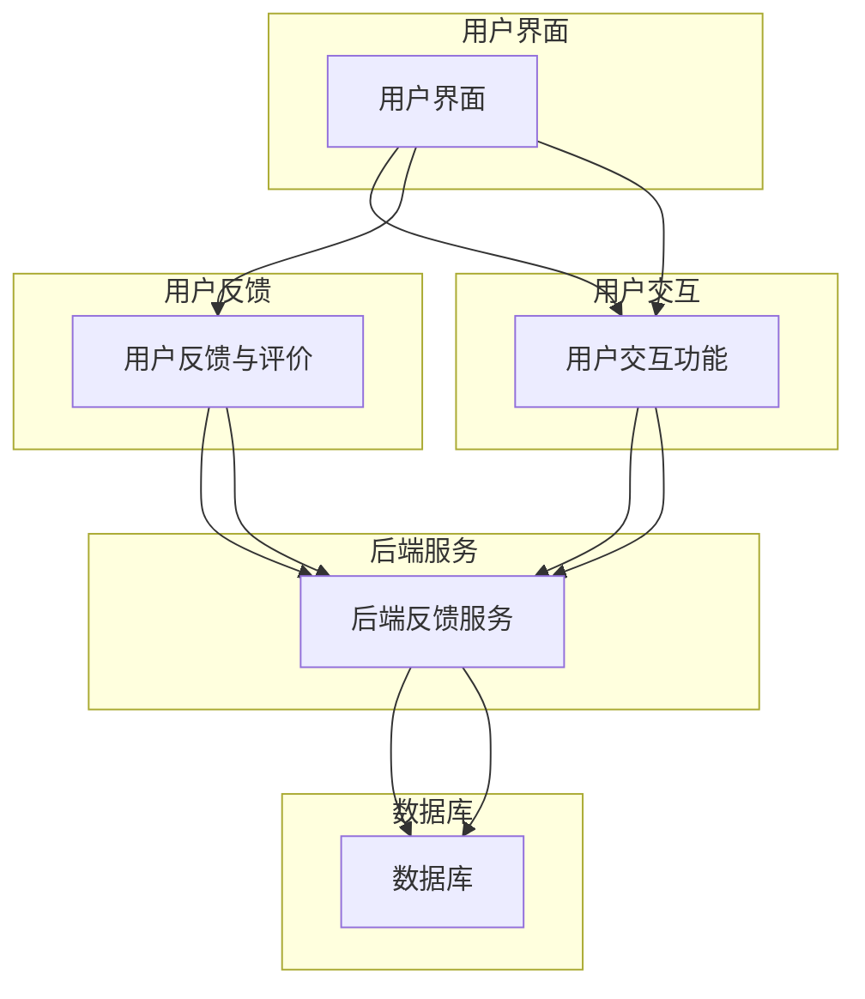
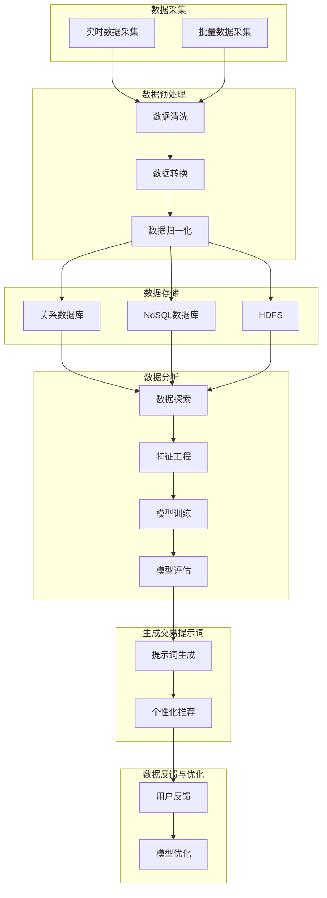
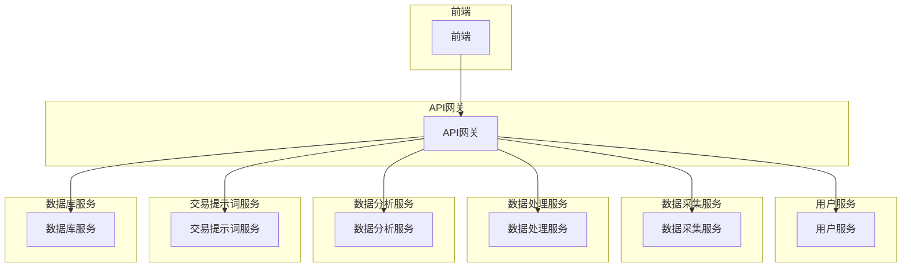

                 


### 1.2 问题描述

当前，能源交易市场正面临着一系列复杂且多变的挑战。首先，传统能源交易模式依赖于中心化的能源市场，这导致了能源供应的不可预测性和价格的不稳定性。此外，能源交易过程中存在大量的信息不对称问题，交易双方难以准确获取市场动态，从而影响了交易效率。再者，随着能源需求的不断增长，能源资源的浪费问题愈发严重，传统能源交易模式难以实现能源的高效利用。

在这种背景下，智慧能源交易作为一种创新的模式，逐渐受到广泛关注。智慧能源交易利用人工智能（AI）技术，通过对大量数据进行实时分析和预测，优化能源交易过程，提高交易效率和能源利用效率。然而，如何构建一个高效、稳定的AI驱动的智慧能源交易提示词平台，仍然是一个亟待解决的问题。

具体来说，问题描述如下：

- 如何利用AI技术，实现对能源交易数据的实时采集、处理和分析？
- 如何构建一个智能的决策与控制系统，以优化能源交易策略？
- 如何设计一个友好的用户交互界面，以便用户能够便捷地使用平台功能？
- 如何确保平台的高可用性和安全性，以应对复杂的网络环境和潜在的安全威胁？

### 1.3 问题解决

为了解决上述问题，我们需要采取一系列措施，构建一个AI驱动的智慧能源交易提示词平台。以下是我们提出的问题解决方案：

1. **数据采集与处理**：利用传感器和物联网技术，实时采集能源交易相关数据，包括能源供应量、能源需求量、市场价格等。通过数据清洗和预处理，确保数据的准确性和一致性。

2. **智能分析与预测**：利用机器学习和深度学习算法，对采集到的数据进行分析和预测。通过构建合适的预测模型，实现对能源价格、供需趋势的准确预测，为交易决策提供支持。

3. **智能决策与控制**：基于预测结果，构建一个智能决策与控制系统。该系统能够根据市场动态和用户需求，自动调整交易策略，实现能源交易的最优化。

4. **用户交互界面**：设计一个直观、易用的用户交互界面，使用户能够方便地查看市场动态、历史交易记录、预测结果等，并提供个性化推荐服务。

5. **安全与可靠性保障**：采取一系列安全措施，包括数据加密、身份验证、访问控制等，确保平台数据的安全和用户隐私的保护。同时，通过冗余设计和故障恢复机制，提高平台的高可用性。

### 1.4 边界与外延

在构建AI驱动的智慧能源交易提示词平台时，我们需要明确一些边界和概念外延：

- **边界**：平台的边界包括数据采集范围、数据处理能力、决策控制范围等。例如，平台的数据采集范围可能仅限于某个特定地区的能源市场，数据处理能力取决于计算资源和算法性能。

- **外延**：智慧能源交易提示词平台的外延包括与外部系统的集成、扩展功能、兼容性等。例如，平台需要能够与现有的能源管理系统、交易系统等进行集成，以实现数据的互通和功能的互补。

### 1.5 核心概念

为了更好地理解和构建AI驱动的智慧能源交易提示词平台，我们需要明确以下核心概念：

- **智慧能源交易**：一种基于人工智能技术的能源交易模式，通过数据分析和智能决策，优化能源交易过程，提高交易效率和能源利用效率。
- **提示词平台**：一个基于人工智能技术的交互平台，能够为用户提供实时能源交易信息、预测结果、推荐服务等。
- **AI技术**：包括机器学习、深度学习、自然语言处理等技术，用于数据处理、预测分析、智能决策等。

## 2. 核心概念与联系

### 2.1 智慧能源交易概述

智慧能源交易是一种基于人工智能技术的能源交易模式，它利用大数据、云计算、物联网等先进技术，对能源市场进行实时监测和分析，从而实现能源交易的最优化。智慧能源交易的核心在于数据的采集、处理、分析和利用，通过这些过程，平台能够为能源交易提供决策支持，提高交易效率和能源利用效率。

**核心概念：**

- **能源交易数据**：包括能源供应量、能源需求量、市场价格、交易历史等。
- **数据分析**：利用数据挖掘、机器学习等技术，对能源交易数据进行分析，提取有价值的信息。
- **智能决策**：基于分析结果，结合市场动态和用户需求，生成最优的交易策略。

**联系：**

智慧能源交易与传统的能源交易模式存在显著差异。传统能源交易主要依赖于市场经验和人为判断，而智慧能源交易则通过数据驱动，实现自动化和智能化。这种转变不仅提高了交易效率，还减少了人为误差，提高了能源利用效率。

### 2.2 AI驱动的智慧能源交易

AI驱动的智慧能源交易是在传统智慧能源交易基础上，进一步融合人工智能技术，实现对能源交易过程的全自动化和智能化。AI驱动的智慧能源交易主要包括以下方面：

- **数据采集**：利用物联网传感器、智能设备等，实时采集能源交易相关数据。
- **数据处理**：通过数据清洗、预处理等，确保数据的准确性和一致性。
- **预测分析**：利用机器学习和深度学习算法，对能源交易数据进行预测和分析。
- **智能决策**：基于预测结果和用户需求，自动生成交易策略，实现能源交易的最优化。

**核心概念：**

- **AI技术**：包括机器学习、深度学习、自然语言处理等。
- **自动化**：通过算法实现能源交易的自动化，减少人为干预。
- **智能化**：利用AI技术，对能源交易过程进行实时监控和优化。

**联系：**

AI驱动的智慧能源交易是对传统智慧能源交易的进一步优化。通过引入AI技术，平台能够更精准地预测市场动态，生成更优的交易策略，从而提高交易效率和能源利用效率。

### 2.3 提示词平台概述

提示词平台是一种基于人工智能技术的交互平台，旨在为用户提供实时、准确的能源交易信息、预测结果和推荐服务。提示词平台的核心功能包括数据展示、预测分析、决策支持等。

**核心概念：**

- **数据展示**：通过可视化图表、报告等形式，展示能源交易数据和预测结果。
- **预测分析**：利用机器学习、深度学习等技术，对能源交易数据进行预测和分析。
- **决策支持**：基于预测结果和用户需求，为用户生成最优的交易策略。

**联系：**

提示词平台是智慧能源交易的重要组成部分，它不仅为用户提供了便捷的能源交易信息，还通过智能分析和预测，为用户提供了决策支持。这种交互方式，使得用户能够更好地理解市场动态，优化交易策略，提高能源利用效率。

### 2.4 AI驱动的提示词平台

AI驱动的提示词平台是在传统提示词平台基础上，进一步融合人工智能技术，实现对用户需求的智能理解和响应。AI驱动的提示词平台主要包括以下方面：

- **用户需求分析**：通过自然语言处理技术，理解用户的查询意图和需求。
- **智能推荐**：基于用户需求和能源交易数据，生成个性化的推荐服务。
- **实时交互**：通过实时数据更新和智能响应，为用户提供实时、准确的交易信息。

**核心概念：**

- **自然语言处理**：用于理解用户的查询意图和需求。
- **个性化推荐**：基于用户数据和交易行为，生成个性化的交易推荐。
- **实时交互**：通过实时数据更新和智能响应，提高用户的交互体验。

**联系：**

AI驱动的提示词平台是对传统提示词平台的升级和扩展。通过引入AI技术，平台能够更准确地理解用户需求，提供更个性化的服务，从而提高用户的满意度和使用体验。

### 2.5 概念属性特征对比表

为了更好地理解智慧能源交易、AI驱动的智慧能源交易、提示词平台和AI驱动的提示词平台这四个概念，我们可以通过一个概念属性特征对比表来进行详细分析。

| 概念               | 定义                                                         | 关键属性                           | 功能特点                           |
|------------------|------------------------------------------------------------|----------------------------------|----------------------------------|
| 智慧能源交易       | 一种基于人工智能技术的能源交易模式，优化能源交易过程。       | 数据采集、数据分析、智能决策       | 提高交易效率、能源利用效率           |
| AI驱动的智慧能源交易 | 进一步融合人工智能技术，实现能源交易过程的全自动化和智能化。   | 数据采集、数据处理、预测分析、智能决策 | 更精准的预测、更优的交易策略         |
| 提示词平台         | 一种基于人工智能技术的交互平台，为用户提供实时能源交易信息。   | 数据展示、预测分析、决策支持       | 提供实时、准确的交易信息、推荐服务     |
| AI驱动的提示词平台  | 进一步融合人工智能技术，实现对用户需求的智能理解和响应。     | 用户需求分析、智能推荐、实时交互   | 更准确的理解用户需求、更个性化的服务 |

**联系：**

智慧能源交易、AI驱动的智慧能源交易、提示词平台和AI驱动的提示词平台之间存在密切的联系。智慧能源交易和AI驱动的智慧能源交易是提示词平台的基础，而提示词平台和AI驱动的提示词平台则是对智慧能源交易的扩展和优化。通过这四个概念的结合，我们可以构建一个高效、智能的智慧能源交易系统，为用户提供更好的交易体验。

### 2.6 ER实体关系图

为了更好地理解智慧能源交易系统中的实体及其关系，我们可以通过一个ER（实体关系）图来进行描述。以下是一个简化的ER图，展示了智慧能源交易系统中的主要实体及其关系：

```mermaid
erDiagram
  Customer ||--|{ EnergyMarket : participates_in }  
  EnergyMarket ||--|{ EnergyTransaction : contains }  
  EnergyTransaction ||--|{ EnergyTrade : occurs }  
  MarketData ||--|{ EnergyTransaction : based_on }  
  PredictionModel ||--|{ EnergyTransaction : guided_by }  
  User ||--|{ PredictionModel : creates }  
  User ||--|{ EnergyTransaction : performs }  
  User ||--|{ MarketData : accesses }  
  SystemAdmin ||--|{ EnergyMarket : manages }  
  SystemAdmin ||--|{ PredictionModel : manages }  
  SystemAdmin ||--|{ User : manages }

  Customer {
    id
    name
    address
    email
  }

  EnergyMarket {
    id
    market_name
    region
  }

  EnergyTransaction {
    id
    transaction_id
    buyer
    seller
    transaction_date
    quantity
    price
  }

  EnergyTrade {
    id
    trade_id
    transaction_id
    trade_date
    trade_quantity
    trade_price
  }

  MarketData {
    id
    data_type
    data_value
    data_date
  }

  PredictionModel {
    id
    model_name
    model_type
    model_params
    model_status
  }

  User {
    id
    username
    password
    email
    role
  }

  SystemAdmin {
    id
    username
    password
    email
    role
  }
```

**实体关系解释：**

- **Customer（客户）**：代表参与能源交易的买方或卖方。每个客户具有唯一的ID、姓名、地址和电子邮件。
- **EnergyMarket（能源市场）**：代表特定的能源交易市场，包括市场名称和地区信息。
- **EnergyTransaction（能源交易）**：代表一个具体的能源交易记录，包括交易ID、买方、卖方、交易日期、交易量和交易价格。
- **EnergyTrade（能源交易）**：代表能源交易的具体过程，包括交易ID、交易日期、交易量和交易价格。
- **MarketData（市场数据）**：代表能源交易市场相关的数据，如价格、供需情况等。
- **PredictionModel（预测模型）**：代表用于预测市场动态和交易策略的模型，包括模型名称、类型、参数和状态。
- **User（用户）**：代表使用平台功能的用户，包括用户名、密码、电子邮件和角色（如普通用户、管理员）。
- **SystemAdmin（系统管理员）**：代表管理平台的系统管理员，具有管理市场、预测模型和用户等实体的权限。

通过ER图，我们可以清晰地看到智慧能源交易系统中各实体之间的关系。例如，客户参与能源交易，市场数据基于这些交易生成；预测模型指导交易策略，用户执行交易并访问市场数据；系统管理员负责管理和维护整个系统。

### 2.7 智慧能源交易系统架构设计

智慧能源交易系统的架构设计是确保系统功能齐全、性能优异、安全可靠的关键。以下是一个典型的智慧能源交易系统架构设计，包括前端、后端、数据库和中间件等各个层次。

#### 前端架构

前端架构负责与用户交互，提供友好的用户界面和交互体验。以下是一些主要组件：

- **用户界面**：使用HTML、CSS和JavaScript等技术实现，提供用户操作界面，包括交易记录查看、市场动态监测、预测结果展示等。
- **API接口**：通过RESTful API或GraphQL接口，为前端提供数据访问和操作服务，确保数据的安全性和一致性。
- **前端框架**：如React、Vue等，用于构建动态、响应式的用户界面。

#### 后端架构

后端架构负责数据处理、业务逻辑实现和服务提供。以下是一些主要组件：

- **业务逻辑层**：使用Spring Boot、Django等框架，实现业务逻辑，包括数据采集、处理、分析和预测等。
- **数据访问层**：使用Hibernate、MyBatis等ORM框架，实现数据库操作和数据持久化。
- **服务层**：通过微服务架构，将系统功能划分为多个独立的服务，如用户服务、交易服务、数据分析服务等，以提高系统的灵活性和可维护性。

#### 数据库架构

数据库架构用于存储和管理系统数据。以下是一些主要组件：

- **关系数据库**：如MySQL、PostgreSQL等，用于存储用户信息、市场数据、交易记录等。
- **NoSQL数据库**：如MongoDB、Redis等，用于存储高频数据和缓存信息，提高系统性能。

#### 中间件架构

中间件架构用于提供系统所需的通用服务，如消息队列、缓存、负载均衡等。以下是一些主要组件：

- **消息队列**：如RabbitMQ、Kafka等，用于异步处理和分布式系统通信。
- **缓存**：如Redis、Memcached等，用于数据缓存，提高系统响应速度。
- **负载均衡**：如Nginx、HAProxy等，用于分发请求，确保系统高可用性。

#### 系统架构图

以下是一个简化的智慧能源交易系统架构图：



通过上述架构设计，智慧能源交易系统能够实现数据采集、处理、分析和预测等核心功能，为用户提供实时、准确的交易信息和决策支持。

### 3.1 AI技术概述

#### 人工智能的起源与发展

人工智能（AI）是一门研究、开发和应用智能机器的理论、方法和技术科学。人工智能的研究起源于20世纪50年代，当时图灵提出了图灵测试，旨在通过机器模拟人类智能行为来定义智能。自那时以来，人工智能经历了多个发展阶段：

- **早期探索（1950-1969）**：人工智能的早期探索主要集中在逻辑推理和问题求解领域，如阿尔法-beta剪枝算法和专家系统的开发。
- **繁荣与低谷（1970-1980）**：随着硬件性能的提升和算法的改进，人工智能研究迎来了繁荣期。然而，由于对人工智能过高的期望和实际应用中的困难，该领域在1980年代遭遇了“人工智能寒冬”。
- **复兴与快速发展（1990-现在）**：随着互联网的普及和大数据、云计算等技术的快速发展，人工智能迎来了新的发展机遇。深度学习、强化学习等新兴算法的突破，使得人工智能在语音识别、图像识别、自然语言处理等领域取得了显著进展。

#### AI的基本概念

人工智能的基本概念包括：

- **机器学习（ML）**：一种使计算机能够通过数据和经验进行学习，从而改进性能的方法。机器学习可以分为监督学习、无监督学习和强化学习。
  - **监督学习**：在有标记数据集上进行学习，如分类和回归问题。
  - **无监督学习**：在无标记数据集上进行学习，如聚类和降维。
  - **强化学习**：通过与环境的交互进行学习，以最大化长期奖励，如游戏AI和自动驾驶。
- **深度学习（DL）**：一种基于多层神经网络进行学习的机器学习方法。深度学习在图像识别、语音识别和自然语言处理等领域取得了显著成果。
- **神经网络（NN）**：一种模仿生物神经系统的计算模型，包括输入层、隐藏层和输出层。神经网络通过调整权重和偏置来学习输入和输出之间的关系。
- **自然语言处理（NLP）**：研究计算机如何理解、生成和处理人类自然语言的技术。NLP在机器翻译、情感分析和语音识别等领域有广泛应用。

#### AI的核心算法与模型

人工智能的核心算法与模型包括：

- **决策树（DT）**：一种基于树结构进行决策的算法，用于分类和回归问题。决策树通过递归划分数据集，生成决策树模型。
- **支持向量机（SVM）**：一种基于最大间隔分类器的算法，用于分类问题。SVM通过寻找最优超平面来划分数据。
- **神经网络（NN）**：一种基于多层神经网络进行学习的算法，包括输入层、隐藏层和输出层。神经网络通过反向传播算法调整权重和偏置，优化模型性能。
- **深度神经网络（DNN）**：一种基于多层神经网络进行学习的算法，包括卷积神经网络（CNN）、循环神经网络（RNN）等。DNN在图像识别、语音识别和自然语言处理等领域有广泛应用。
- **强化学习（RL）**：一种通过与环境的交互进行学习的算法，以最大化长期奖励。强化学习在游戏AI、自动驾驶和机器人控制等领域有广泛应用。

#### AI的应用场景与趋势

人工智能在多个领域有着广泛的应用，以下是几个典型应用场景和趋势：

- **语音识别**：利用深度学习技术，实现语音到文字的转换。如苹果的Siri、亚马逊的Alexa等。
- **图像识别**：利用卷积神经网络，实现图像分类、物体检测和图像分割。如谷歌的Google Photos、Facebook的Face Recognition等。
- **自然语言处理**：利用深度学习和自然语言处理技术，实现文本分类、情感分析和机器翻译。如谷歌的Google Translate、OpenAI的GPT-3等。
- **自动驾驶**：利用计算机视觉和深度学习技术，实现车辆环境感知、路径规划和自动驾驶。如特斯拉的Autopilot、Waymo的自动驾驶技术等。
- **医疗健康**：利用人工智能技术，实现疾病诊断、药物研发和健康管理等。如IBM的Watson for Oncology、谷歌的DeepMind Health等。

未来，随着人工智能技术的不断发展，它将在更多领域得到应用，如智能城市、智能家居、智能制造等，为社会带来更多便利和创新。

### 4.1 能源交易的背景与现状

能源交易是指通过各种渠道和方式，进行能源商品的买卖活动。能源交易作为全球能源行业的重要组成部分，涵盖了从电力、天然气到石油等多种能源形式的交易。当前，能源交易市场呈现出以下背景和现状：

#### 背景因素

1. **全球化**：随着全球化的不断深入，能源交易逐渐超越国界，形成了全球化的能源市场。跨国公司和国际金融机构在能源交易中扮演着重要角色，推动了能源交易市场的复杂化和多元化。

2. **技术进步**：信息技术、物联网和人工智能等技术的不断发展，为能源交易提供了更多创新手段和工具。这些技术不仅提高了能源交易的信息透明度和效率，还推动了能源市场的智能化和自动化。

3. **政策支持**：各国政府纷纷出台支持能源市场发展的政策，如能源市场化改革、碳排放交易制度等。这些政策有助于促进能源市场的竞争和效率，推动能源交易的健康发展。

#### 现状分析

1. **市场规模**：全球能源交易市场规模庞大，涉及数万亿美元的贸易额。尤其是电力和天然气市场，由于其高度的流动性，已成为全球最大的能源交易市场之一。

2. **交易模式**：能源交易模式多样化，包括现货交易、期货交易、期权交易等。现货交易是最常见的交易方式，期货交易和期权交易则为投资者提供了更多的风险管理工具。

3. **交易平台**：全球各地建立了多个能源交易平台，如纽约商品交易所（NYMEX）、伦敦国际石油交易所（IPE）、欧洲电力交易所（EPEX）等。这些交易平台为能源交易提供了公开、透明、高效的交易环境。

4. **市场参与者**：能源交易市场的主要参与者包括能源生产商、能源消费商、电力和天然气分销商、金融机构、投资者等。这些参与者通过买卖能源商品，实现自身的经营目标。

5. **价格波动**：能源交易市场价格波动较大，受到供需关系、政策变化、自然灾害等多种因素的影响。能源价格的波动不仅影响市场参与者的收益，还对全球经济产生深远影响。

6. **风险与挑战**：能源交易市场存在诸多风险，如市场风险、信用风险、操作风险等。此外，能源市场的政策不确定性、技术变革等也为市场参与者带来了新的挑战。

### 4.2 智慧能源交易的定义与特点

智慧能源交易是指利用先进的信息技术和人工智能技术，对能源交易过程进行全方位的优化和管理，以提高交易效率和能源利用效率。智慧能源交易具有以下定义和特点：

#### 定义

智慧能源交易是基于大数据、云计算、物联网和人工智能等技术的能源交易模式，通过实时数据分析和智能决策，实现能源交易过程的优化和智能化。

#### 特点

1. **实时数据分析**：智慧能源交易能够实时采集和分析能源交易相关数据，包括供需数据、市场价格、交易历史等。通过对这些数据的实时分析，平台能够快速响应市场变化，为交易决策提供支持。

2. **智能决策**：智慧能源交易通过机器学习和深度学习算法，对能源交易数据进行分析和预测，生成最优的交易策略。智能决策能够提高交易效率，降低交易成本，同时优化能源资源的利用。

3. **自动化**：智慧能源交易平台实现了能源交易过程的自动化，从数据采集、处理、分析到交易决策，整个过程无需人工干预。自动化交易提高了交易效率，降低了人为错误，确保了交易过程的公平性和透明性。

4. **个性化服务**：智慧能源交易平台能够根据用户需求和交易行为，提供个性化的推荐服务和定制化交易策略。这种个性化服务提高了用户的满意度和使用体验。

5. **协同优化**：智慧能源交易平台通过与其他能源管理系统、智能设备等协同工作，实现能源交易与能源生产、能源消费等环节的协同优化。协同优化能够提高整个能源系统的效率，降低能源浪费。

6. **透明化**：智慧能源交易平台通过实时数据展示和透明化交易过程，提高了市场信息的透明度。市场参与者能够及时获取市场动态和交易信息，增强了市场信心和信任。

### 4.3 智慧能源交易的核心要素

智慧能源交易的核心要素包括以下几个方面：

1. **数据采集**：数据采集是智慧能源交易的基础，平台需要通过传感器、物联网设备和大数据技术，实时采集能源交易相关的数据，如供需数据、市场价格、交易历史等。

2. **数据处理**：数据处理是智慧能源交易的核心，平台需要对采集到的数据进行清洗、预处理和融合，确保数据的准确性和一致性。数据处理技术包括数据挖掘、机器学习和深度学习等。

3. **智能分析**：智能分析是智慧能源交易的关键，平台需要利用机器学习和深度学习算法，对能源交易数据进行分析和预测，提取有价值的信息，为交易决策提供支持。

4. **智能决策**：智能决策是智慧能源交易的灵魂，平台需要基于分析结果和用户需求，生成最优的交易策略。智能决策技术包括优化算法、强化学习和博弈论等。

5. **用户交互**：用户交互是智慧能源交易的桥梁，平台需要设计直观、易用的用户交互界面，使用户能够方便地查看交易信息、预测结果和交易策略。

6. **安全保障**：安全保障是智慧能源交易的保障，平台需要采取数据加密、身份验证、访问控制等安全措施，确保交易数据的安全和用户隐私的保护。

7. **协同优化**：协同优化是智慧能源交易的拓展，平台需要与其他能源管理系统、智能设备等协同工作，实现能源交易与能源生产、能源消费等环节的协同优化。

### 4.4 智慧能源交易的挑战与机遇

智慧能源交易作为一种创新模式，面临着一系列挑战和机遇：

#### 挑战

1. **技术挑战**：智慧能源交易依赖于大数据、云计算、物联网和人工智能等先进技术，技术实现和平台稳定性是关键挑战。如何保证平台的技术先进性和稳定性，是智慧能源交易发展的重要问题。

2. **数据质量**：数据是智慧能源交易的基础，数据质量直接影响交易决策的准确性。如何确保数据采集、处理和存储的准确性，是智慧能源交易面临的挑战。

3. **市场风险**：能源交易市场波动性大，市场风险难以预测。如何有效管理市场风险，确保交易策略的有效性和稳定性，是智慧能源交易的重要挑战。

4. **政策法规**：智慧能源交易受到政策法规的约束，政策变化和法规调整可能影响交易模式和发展。如何适应政策法规的变化，是智慧能源交易需要考虑的问题。

5. **用户接受度**：智慧能源交易需要用户的支持和参与，用户接受度是智慧能源交易成功的关键。如何提高用户的接受度和使用体验，是智慧能源交易需要解决的重要问题。

#### 机遇

1. **技术进步**：随着大数据、云计算、物联网和人工智能等技术的不断发展，智慧能源交易的技术实现将变得更加成熟和可靠，为智慧能源交易提供了良好的技术支持。

2. **市场需求**：能源需求的持续增长和能源市场改革，为智慧能源交易创造了巨大的市场需求。智慧能源交易能够提高能源交易效率，降低交易成本，满足市场需求。

3. **政策支持**：各国政府纷纷出台支持能源市场发展的政策，如能源市场化改革、碳排放交易制度等。这些政策为智慧能源交易提供了良好的政策环境。

4. **协同优化**：智慧能源交易能够与其他能源管理系统、智能设备等协同工作，实现能源交易与能源生产、能源消费等环节的协同优化。协同优化能够提高整个能源系统的效率，创造更多商机。

5. **创新模式**：智慧能源交易模式不断创新，如基于区块链的能源交易、智能合约等，为能源交易带来了新的发展机遇。这些创新模式能够提高交易透明度，降低交易成本，吸引更多参与者。

综上所述，智慧能源交易既面临着挑战，也充满了机遇。通过技术创新、政策支持和市场需求的推动，智慧能源交易有望实现持续发展，为能源行业带来深刻变革。

### 5.1 提示词平台的定义与作用

提示词平台是一种基于人工智能技术的交互平台，旨在为用户提供实时、准确的交易信息、预测结果和推荐服务。提示词平台的核心功能是利用自然语言处理（NLP）和机器学习技术，理解用户的查询意图和需求，并生成相应的提示词或建议。

**定义**：

提示词平台是一个集成多种人工智能技术（如NLP、机器学习、深度学习等）的智能系统，通过分析用户输入的自然语言文本，自动生成提示词或推荐内容，以帮助用户更高效地获取所需信息或执行特定任务。

**作用**：

1. **信息检索与推荐**：提示词平台能够根据用户的查询，快速检索相关信息，并提供个性化的推荐服务。例如，在能源交易领域，平台可以推荐相关的市场动态、交易策略和投资机会。

2. **交互体验优化**：提示词平台通过自然语言交互，使用户能够以更自然、便捷的方式与系统进行沟通。这种交互方式提高了用户的满意度和使用体验。

3. **智能决策支持**：提示词平台可以生成基于数据的预测和分析结果，为用户决策提供支持。例如，在能源交易中，平台可以预测市场价格趋势，帮助用户制定更优的交易策略。

4. **提高工作效率**：通过自动化的提示词生成和推荐服务，用户能够更快地获取所需信息，减少手动搜索和筛选的时间，从而提高工作效率。

5. **辅助学习和教育**：提示词平台可以为用户提供个性化的学习资源和指导，帮助用户更好地理解和掌握相关知识。例如，在能源交易领域，平台可以提供相关的市场分析和投资指南，帮助用户提升专业素养。

### 5.2 提示词平台的基本架构

提示词平台的基本架构包括前端、后端和数据库三个主要部分，以及一些辅助的中间件和服务。以下是对各部分的详细描述：

#### 前端

前端是用户与提示词平台交互的界面，负责展示用户界面、接收用户输入和处理用户请求。前端的基本组件包括：

- **用户界面**：使用HTML、CSS和JavaScript等前端技术构建，提供各种交互元素，如输入框、按钮、图表等，以方便用户进行操作和获取信息。
- **API接口**：通过RESTful API或GraphQL接口，与后端进行数据通信，实现数据的检索、更新和删除等操作。
- **前端框架**：如React、Vue等，用于构建动态、响应式的用户界面，提高开发效率和用户体验。

#### 后端

后端是提示词平台的核心部分，负责处理业务逻辑、数据存储和数据处理等任务。后端的基本组件包括：

- **业务逻辑层**：使用Spring Boot、Django等后端框架实现业务逻辑，包括自然语言处理、机器学习模型的调用、数据分析和预测等。
- **数据访问层**：使用Hibernate、MyBatis等ORM框架，与数据库进行交互，实现数据的持久化操作。
- **服务层**：通过微服务架构，将系统功能划分为多个独立的服务，如自然语言处理服务、预测分析服务、数据存储服务等，以提高系统的灵活性和可维护性。

#### 数据库

数据库用于存储和管理系统的数据，包括用户数据、交易数据、市场数据等。常用的数据库类型包括：

- **关系数据库**：如MySQL、PostgreSQL等，用于存储结构化数据，如用户信息、交易记录等。
- **NoSQL数据库**：如MongoDB、Redis等，用于存储非结构化数据或高性能缓存，如自然语言处理模型、实时市场数据等。

#### 中间件

中间件是提示词平台的重要组成部分，提供一些通用服务，如消息队列、缓存、负载均衡等。常用的中间件包括：

- **消息队列**：如RabbitMQ、Kafka等，用于异步处理和分布式系统通信，确保系统的可靠性和性能。
- **缓存**：如Redis、Memcached等，用于数据缓存，提高系统的响应速度。
- **负载均衡**：如Nginx、HAProxy等，用于分发请求，确保系统的可扩展性和高可用性。

#### 整体架构

以下是一个简化的提示词平台架构图，展示了前端、后端、数据库和中间件之间的关系：


通过上述架构，提示词平台能够高效地处理用户请求，提供实时、准确的信息和服务，为用户带来更好的交互体验。

### 5.3 提示词平台的典型应用场景

提示词平台在各个领域有着广泛的应用，以下是几个典型应用场景：

1. **金融领域**：在金融领域，提示词平台可以用于股票交易、外汇交易和期货交易等。平台能够实时获取市场数据，分析市场动态，为用户生成交易提示词，帮助用户做出更准确的交易决策。

2. **电子商务**：在电子商务领域，提示词平台可以帮助电商平台推荐商品、优化库存管理和提高用户购物体验。平台可以通过分析用户的浏览历史和购买行为，生成个性化的商品推荐，提高用户满意度和转化率。

3. **能源交易**：在能源交易领域，提示词平台可以实时获取能源市场数据，分析供需关系和市场趋势，为能源交易提供决策支持。平台可以生成能源交易提示词，帮助用户制定交易策略，提高交易效率和能源利用效率。

4. **医疗健康**：在医疗健康领域，提示词平台可以用于辅助医生诊断和治疗。平台可以通过分析病历、检查报告和医学知识库，生成诊断提示词和治疗建议，帮助医生提高诊断准确性和治疗效果。

5. **智能客服**：在智能客服领域，提示词平台可以用于生成客服回应，提高客服效率和用户体验。平台可以通过分析用户提问和语境，生成合适的回答，实现自然语言交互。

6. **教育领域**：在教育领域，提示词平台可以用于生成学习提示词和作业建议，帮助学生提高学习效果。平台可以通过分析学生的学习行为和知识点掌握情况，生成个性化的学习建议，提高学习效率。

### 5.4 提示词平台的发展趋势

随着技术的不断进步和应用场景的拓展，提示词平台的发展趋势主要体现在以下几个方面：

1. **智能化水平提高**：随着人工智能技术的不断发展，提示词平台的智能化水平将不断提高。未来，提示词平台将能够更准确地理解用户意图，生成更精确的推荐和建议。

2. **跨领域融合**：提示词平台将在多个领域实现融合应用。例如，金融、电子商务、能源交易等领域将相互融合，共享数据和资源，实现更高效的信息传递和决策支持。

3. **个性化服务增强**：随着用户数据的积累和算法的优化，提示词平台的个性化服务将不断增强。平台将能够更好地满足用户的个性化需求，提供定制化的推荐和服务。

4. **实时性要求提高**：随着用户对实时性的要求越来越高，提示词平台将更加注重实时数据处理和分析。平台将通过分布式架构和高速通信技术，实现实时数据分析和决策。

5. **安全性与隐私保护**：随着数据隐私和安全问题的日益突出，提示词平台将更加注重安全性和隐私保护。平台将采取加密、访问控制等技术手段，确保用户数据和交易数据的安全。

6. **区块链技术应用**：区块链技术将为提示词平台提供更加透明、可靠的交易环境和数据管理机制。未来，提示词平台将结合区块链技术，实现数据的安全存储和可信交易。

7. **智能合约与自动化执行**：随着智能合约技术的发展，提示词平台将能够实现自动化交易和执行。平台将能够根据预设规则和智能合约，自动执行交易和合约，提高交易效率和透明度。

总之，提示词平台的发展将朝着智能化、个性化、实时化和安全化的方向不断演进，为各行业提供更加高效、便捷和智能的服务。

### 6.1 系统架构设计概述

构建一个AI驱动的智慧能源交易提示词平台，系统架构设计至关重要。系统架构设计不仅要确保平台的高性能和高可用性，还要具备良好的可扩展性和可维护性。以下是该平台的系统架构设计概述：

#### 1. 架构设计原则

在系统架构设计过程中，我们遵循以下原则：

- **模块化设计**：将系统功能划分为多个独立的模块，每个模块负责特定的功能，便于开发、测试和维护。
- **分布式架构**：采用分布式架构，以提高系统的可扩展性和容错能力。分布式架构能够将系统功能分布在多个节点上，实现负载均衡和高可用性。
- **微服务架构**：采用微服务架构，将系统功能划分为多个独立的服务，每个服务运行在独立的容器中，以提高系统的灵活性和可维护性。
- **数据驱动**：以数据为核心，确保数据的实时采集、处理和分析，为系统提供决策支持。

#### 2. 系统架构层次

系统架构可以分为以下层次：

- **前端层**：负责与用户交互，提供用户界面和交互体验。前端层使用HTML、CSS和JavaScript等技术构建，通过RESTful API与后端进行数据通信。
- **服务层**：负责处理业务逻辑和数据处理。服务层采用微服务架构，包括自然语言处理服务、数据采集服务、数据分析服务等。每个服务独立部署，便于扩展和维护。
- **数据处理层**：负责数据的采集、存储和处理。数据处理层包括数据采集模块、数据存储模块和数据预处理模块。数据采集模块通过物联网设备和API接口收集数据；数据存储模块使用分布式数据库存储数据；数据预处理模块对数据进行清洗、转换和融合。
- **数据仓库层**：负责存储和管理大数据。数据仓库层采用分布式数据仓库，支持海量数据的存储和实时查询。数据仓库层与数据处理层和业务分析层进行数据交换。
- **业务分析层**：负责对数据进行分析和预测，为决策提供支持。业务分析层包括机器学习模型、数据挖掘算法和预测引擎等，通过对数据的分析和预测，生成交易提示词和推荐服务。
- **后端层**：负责系统的核心功能，包括用户管理、权限控制、系统监控等。后端层使用Spring Boot等框架实现，提供系统的核心服务。

#### 3. 系统架构图

以下是一个简化的系统架构图，展示了智慧能源交易提示词平台的各层次和组件之间的关系：



通过上述系统架构设计，智慧能源交易提示词平台能够实现数据的实时采集、处理和分析，为用户提供实时、准确的交易提示词和推荐服务。同时，系统架构具有良好的可扩展性和可维护性，能够适应未来技术的发展和业务需求的变化。

### 6.2 数据采集与处理模块

在智慧能源交易提示词平台中，数据采集与处理模块是核心组成部分，它负责从各种数据源采集数据，并进行预处理、存储和传输，确保数据的质量和实时性。以下是数据采集与处理模块的详细介绍。

#### 6.2.1 数据采集

数据采集是数据处理的起点，其主要任务是从各种数据源收集能源交易相关的数据。数据源可以包括以下几种：

1. **物联网传感器**：物联网传感器用于实时监测能源设备的状态，如发电站、变电站、电网设备等。传感器可以采集的数据包括电量、电压、电流、温度、湿度等。
   
2. **市场数据接口**：能源市场数据接口提供实时、历史的市场交易数据，包括价格、供需量、交易量等。这些数据通常来源于能源交易所或政府能源管理部门。

3. **外部API**：通过调用第三方API接口，可以获取与能源交易相关的数据，如天气预报、宏观经济数据、能源政策法规等。

4. **内部系统**：内部系统包括能源公司的ERP系统、财务系统等，可以提供能源生产、销售、库存等数据。

数据采集过程通常涉及以下步骤：

- **数据接入**：根据数据源的特点，设计合适的数据接入方案，如直接连接物联网设备、通过API接口调用、定期数据导出等。
- **数据采集**：通过编程方式，如使用Python的Selenium库模拟浏览器操作、使用HTTP请求发送API请求等，从数据源采集数据。

#### 6.2.2 数据预处理

数据预处理是确保数据质量和一致性的重要环节。其主要任务包括数据清洗、数据转换和数据融合。以下是数据预处理的详细内容：

1. **数据清洗**：数据清洗是指识别和纠正数据中的错误、缺失值和不一致。数据清洗的步骤包括：

   - **缺失值处理**：通过均值填充、中值填充、时间序列预测等方法，处理缺失值。
   - **异常值检测**：使用统计方法或机器学习算法，检测并处理异常值。
   - **数据格式转换**：统一数据格式，如将日期格式转换为标准格式。

2. **数据转换**：数据转换是指将不同数据源的数据格式统一，以便进行进一步处理。数据转换的步骤包括：

   - **数据标准化**：将不同数据源的数据进行标准化处理，如将电量数据统一换算为千瓦时（kWh）。
   - **时间序列对齐**：对不同时间分辨率的数据进行时间序列对齐，如将小时级数据与分钟级数据进行对齐。

3. **数据融合**：数据融合是指将来自不同数据源的数据进行整合，形成一个完整的数据集。数据融合的步骤包括：

   - **数据匹配**：根据一定的规则，将不同数据源中的数据匹配起来，形成一条完整的数据记录。
   - **数据汇总**：对多个数据源的数据进行汇总，形成更高层次的数据。

#### 6.2.3 数据存储与传输

预处理后的数据需要存储和传输到数据仓库，以便进行进一步的分析和处理。数据存储与传输的步骤包括：

1. **数据存储**：数据存储包括以下几个方面：

   - **关系数据库**：用于存储结构化数据，如用户信息、交易记录等。常用的关系数据库包括MySQL、PostgreSQL等。
   - **NoSQL数据库**：用于存储非结构化数据或半结构化数据，如物联网传感器数据、实时市场数据等。常用的NoSQL数据库包括MongoDB、Redis等。
   - **分布式文件系统**：用于存储大规模数据集，如Hadoop的HDFS。

2. **数据传输**：数据传输包括以下几个方面：

   - **批处理**：通过批处理任务，定期将预处理后的数据导入到数据仓库。常用的批处理工具包括Apache Spark、Hadoop等。
   - **实时流处理**：通过实时流处理系统，将实时采集到的数据实时传输到数据仓库。常用的实时流处理系统包括Apache Kafka、Flink等。

#### 6.2.4 数据采集与处理模块架构设计

数据采集与处理模块的架构设计需要考虑以下几个方面：

- **分布式架构**：采用分布式架构，将数据采集、预处理、存储和传输等任务分布在多个节点上，以提高系统的性能和容错能力。
- **模块化设计**：将数据采集与处理模块划分为多个独立的子模块，如数据采集模块、数据清洗模块、数据转换模块等，每个子模块负责特定的功能，便于开发和维护。
- **可扩展性**：设计可扩展的架构，以便在系统规模扩大时，能够轻松增加新的数据采集和处理任务。
- **高可用性**：通过冗余设计和故障恢复机制，确保数据采集与处理模块的高可用性。

以下是一个简化的数据采集与处理模块架构图：



通过上述架构设计，数据采集与处理模块能够高效、稳定地完成数据的采集、预处理和存储，为智慧能源交易提示词平台提供高质量的数据支持。

### 6.3 数据分析与挖掘模块

在智慧能源交易提示词平台中，数据分析和挖掘模块是关键组成部分，它负责对采集到的数据进行深度分析，提取有价值的信息，为交易决策提供科学依据。以下是数据分析和挖掘模块的详细介绍。

#### 6.3.1 数据分析

数据分析是对数据进行系统化处理和解释，以发现数据中的规律和趋势。数据分析包括以下几个关键步骤：

1. **数据探索**：通过可视化工具（如Python的Matplotlib、Seaborn等库）对数据集进行初步探索，了解数据的分布、异常值、相关性等特征。

2. **特征工程**：根据分析目标和数据特点，对原始数据进行预处理和特征提取。特征工程包括数据归一化、缺失值处理、特征选择和构造等。

3. **统计分析**：使用统计方法（如描述性统计、回归分析、方差分析等）对数据进行定量分析，发现数据中的规律和关系。

4. **关联规则挖掘**：通过关联规则挖掘算法（如Apriori算法、FP-Growth算法等），发现数据集中的频繁项集和关联规则，揭示不同变量之间的依赖关系。

5. **聚类分析**：使用聚类算法（如K-Means、层次聚类等），将数据划分为不同的群体，识别数据中的潜在模式。

6. **分类和回归**：使用分类和回归算法（如决策树、支持向量机、神经网络等），对数据进行建模，预测未来的趋势和结果。

#### 6.3.2 数据挖掘

数据挖掘是从大量数据中自动发现隐含的、有价值的模式和知识的过程。数据挖掘技术包括：

1. **分类技术**：将数据集中的数据按照其特征划分为不同的类别。常见的分类算法有决策树、支持向量机、随机森林等。

2. **聚类技术**：将相似的数据点归为一类，以便更好地理解数据的分布和结构。常见的聚类算法有K-Means、层次聚类、DBSCAN等。

3. **关联规则挖掘**：发现数据集中的关联规则，揭示不同变量之间的依赖关系。常见的算法有Apriori算法、FP-Growth算法、Eclat算法等。

4. **异常检测**：识别数据中的异常值和异常模式，以便及时发现和处理问题。常见的算法有基于统计方法的异常检测、基于聚类方法的异常检测等。

5. **预测分析**：基于历史数据，预测未来的趋势和结果。常见的算法有时间序列预测、回归分析、神经网络预测等。

#### 6.3.3 数据分析与挖掘模块架构设计

数据分析和挖掘模块的架构设计需要考虑以下几个方面：

- **模块化设计**：将数据分析和挖掘功能划分为多个独立的子模块，如数据预处理模块、特征工程模块、模型训练模块等，每个子模块负责特定的功能，便于开发和维护。
- **分布式计算**：利用分布式计算框架（如Apache Spark、Hadoop等），实现大数据的分布式处理和分析，提高系统的性能和可扩展性。
- **自动化与智能化**：通过自动化工具和智能化算法，实现数据分析和挖掘过程的自动化和智能化，提高分析效率和准确性。
- **可扩展性**：设计可扩展的架构，以便在系统规模扩大时，能够轻松增加新的分析和挖掘功能。

以下是一个简化的数据分析和挖掘模块架构图：



通过上述架构设计，数据分析和挖掘模块能够高效、准确地提取数据中的价值信息，为智慧能源交易提示词平台提供科学的数据支持和决策依据。

### 6.4 智能决策与控制模块

在智慧能源交易提示词平台中，智能决策与控制模块是核心组成部分，它负责根据分析结果和用户需求，生成最优的交易策略，并对交易过程进行实时调控。以下是智能决策与控制模块的详细介绍。

#### 6.4.1 决策模型

智能决策与控制模块的基础是决策模型。决策模型用于模拟和分析交易过程中的各种可能情况，并生成最优的交易策略。决策模型通常包括以下几个步骤：

1. **目标函数定义**：明确决策的目标，如最大化利润、最小化成本、平衡供需等。目标函数是决策的核心，用于量化决策结果。

2. **约束条件设置**：根据市场规则、交易限制等，设置决策过程中的约束条件，如价格上限、交易量限制、交割期限等。

3. **状态变量定义**：定义决策过程中的状态变量，如当前市场价格、供需量、库存量等。状态变量是决策模型的关键输入。

4. **决策规则建立**：根据目标函数和约束条件，建立决策规则，如基于市场价格的变化调整交易策略、根据供需关系优化库存管理等。

5. **模型求解**：使用优化算法（如线性规划、动态规划、遗传算法等），求解决策模型，得到最优的交易策略。

#### 6.4.2 决策算法

决策算法是实现智能决策的关键。常见的决策算法包括以下几种：

1. **线性规划（Linear Programming, LP）**：线性规划是一种数学优化方法，用于求解线性目标函数在一系列线性约束条件下的最优解。线性规划适用于目标函数和约束条件都是线性函数的情况。

2. **动态规划（Dynamic Programming, DP）**：动态规划是一种递推式的优化方法，适用于具有重叠子问题和最优子结构性质的问题。动态规划通过将复杂问题分解为子问题，并利用子问题的最优解来求解整体问题。

3. **遗传算法（Genetic Algorithm, GA）**：遗传算法是一种基于生物进化的启发式搜索算法，通过模拟自然选择和遗传机制，搜索最优解。遗传算法适用于目标函数非线性、约束条件复杂的问题。

4. **支持向量机（Support Vector Machine, SVM）**：支持向量机是一种二分类模型，通过寻找最优超平面来划分数据。支持向量机可以应用于分类和回归问题，是决策模型中的重要工具。

5. **神经网络（Neural Network, NN）**：神经网络是一种基于生物神经系统的计算模型，通过多层神经元进行学习和预测。神经网络在决策模型中可以用于实现复杂的非线性映射和模式识别。

#### 6.4.3 控制策略

智能决策与控制模块不仅要生成最优的交易策略，还需要对交易过程进行实时调控，以确保策略的有效执行。控制策略包括以下几个方面：

1. **实时监测**：实时监测市场动态和交易状态，包括价格、供需量、交易量等。通过监控平台，确保交易过程透明、可追溯。

2. **动态调整**：根据实时监测数据，动态调整交易策略。例如，当市场价格波动较大时，可以调整交易量或价格策略，以应对市场变化。

3. **风险控制**：通过设置风险阈值和风险控制规则，对交易过程进行风险控制。例如，当交易风险超过设定阈值时，可以触发风险预警或自动平仓操作。

4. **反馈机制**：建立反馈机制，对交易策略的执行效果进行评估和反馈。根据反馈结果，不断优化和调整交易策略。

#### 6.4.4 模块架构设计

智能决策与控制模块的架构设计需要考虑以下几个方面：

- **模块化设计**：将决策模型、决策算法、控制策略等划分为独立的子模块，便于开发和维护。
- **分布式计算**：利用分布式计算框架，实现大规模数据的并行处理和实时分析，提高系统的性能和可扩展性。
- **智能化**：引入机器学习和深度学习技术，实现决策模型的自动学习和优化，提高决策的准确性和智能化水平。
- **高可用性**：通过冗余设计和故障恢复机制，确保模块的高可用性，减少系统故障对交易过程的影响。

以下是一个简化的智能决策与控制模块架构图：



通过上述架构设计，智能决策与控制模块能够高效、准确地生成交易策略，并对交易过程进行实时调控，为智慧能源交易提示词平台提供强有力的决策支持。

### 6.5 用户交互与反馈模块

用户交互与反馈模块是智慧能源交易提示词平台的重要组成部分，它负责为用户提供友好的交互界面，并收集用户反馈，以优化平台功能和用户体验。以下是用户交互与反馈模块的详细介绍。

#### 6.5.1 用户界面设计

用户界面设计是用户交互与反馈模块的核心，其目标是提供直观、易用的交互体验。以下是用户界面设计的关键要素：

1. **导航与布局**：设计清晰的导航结构，帮助用户快速找到所需功能。采用合理的布局，确保界面元素的易读性和可操作性。

2. **数据展示**：利用图表、表格、地图等形式，直观地展示能源交易数据和预测结果。数据展示应具备良好的交互性，如可缩放、可筛选、可过滤等。

3. **个性化定制**：允许用户根据个人需求和偏好，定制界面布局和功能模块。例如，用户可以自定义数据图表的类型、颜色和显示方式。

4. **实时更新**：实现数据的实时更新，确保用户获取最新的交易信息。例如，通过Web Socket技术，实现交易数据的实时推送。

5. **响应式设计**：设计响应式界面，确保平台在不同设备（如桌面、平板、手机）上都能提供良好的用户体验。

#### 6.5.2 用户交互功能

用户交互功能是用户与平台进行交互的桥梁，主要包括以下功能：

1. **查询与搜索**：提供高效的查询和搜索功能，使用户能够快速找到所需信息。例如，支持关键词搜索、高级搜索等。

2. **实时监控**：提供实时监控功能，使用户能够实时查看能源交易市场动态和交易状态。例如，通过实时图表展示市场价格、供需量等。

3. **数据分析**：提供数据分析功能，使用户能够深入了解市场趋势和交易数据。例如，支持历史数据查询、趋势预测等。

4. **交易管理**：提供交易管理功能，使用户能够进行交易操作，如交易订单创建、修改、撤销等。

5. **个性化推荐**：基于用户的交易历史和行为，提供个性化的交易推荐服务。例如，推荐合适的交易策略、投资机会等。

#### 6.5.3 用户反馈与评价

用户反馈与评价是优化平台功能和用户体验的重要途径。以下是用户反馈与评价的关键要素：

1. **反馈渠道**：提供多种反馈渠道，如在线反馈表单、电子邮件、社交媒体等，方便用户提交问题和建议。

2. **反馈分析**：对用户反馈进行系统化分析，识别用户关注的问题和需求。例如，使用自然语言处理技术，分析用户反馈的文本，提取关键词和情感。

3. **问题追踪**：建立问题追踪系统，记录用户反馈的问题，跟踪解决进度，确保用户问题得到及时解决。

4. **用户评价**：提供用户评价功能，使用户能够对平台功能和服务进行评分和评价。根据用户评价，优化平台功能和用户体验。

5. **反馈激励机制**：设计反馈激励机制，鼓励用户积极参与反馈，如提供积分、优惠券等奖励，提高用户参与度。

#### 6.5.4 模块架构设计

用户交互与反馈模块的架构设计需要考虑以下几个方面：

- **模块化设计**：将用户界面、用户交互功能、用户反馈与评价等划分为独立的子模块，便于开发和维护。
- **高可用性**：通过冗余设计和故障恢复机制，确保模块的高可用性，减少系统故障对用户体验的影响。
- **安全性**：采用数据加密、身份验证等安全措施，保护用户隐私和交易数据的安全。
- **可扩展性**：设计可扩展的架构，以便在用户规模扩大时，能够轻松增加新的功能和交互方式。

以下是一个简化的用户交互与反馈模块架构图：



通过上述架构设计，用户交互与反馈模块能够为用户提供便捷、高效的交互体验，并有效收集用户反馈，为平台优化提供有力支持。

### 7.1 平台设计原则

在设计和开发AI驱动的智慧能源交易提示词平台时，需要遵循一系列关键原则，以确保平台的高效性、可靠性和用户体验。以下是平台设计的主要原则：

#### 1. 可扩展性

可扩展性是平台设计的重要原则之一。随着用户数量的增加和业务需求的变化，平台需要能够轻松扩展其功能和技术架构，以满足不断增长的需求。实现可扩展性可以通过以下方式：

- **微服务架构**：采用微服务架构，将系统功能划分为多个独立的服务，每个服务可以独立扩展和部署。
- **分布式计算**：利用分布式计算框架，如Apache Kafka和Apache Flink，处理大规模数据的实时分析和处理。
- **模块化设计**：将平台功能划分为多个独立的模块，每个模块负责特定的功能，便于扩展和维护。

#### 2. 可靠性

可靠性是智慧能源交易提示词平台的关键要求。平台需要能够稳定运行，确保数据的准确性和系统的可用性。以下是实现可靠性的关键措施：

- **冗余设计**：通过冗余设计，如数据备份和系统副本，确保在硬件或软件故障时，系统仍然能够正常运行。
- **故障恢复机制**：设计故障恢复机制，如自动重启、故障转移等，确保在系统出现故障时，能够快速恢复。
- **负载均衡**：使用负载均衡器，如Nginx和HAProxy，分发请求，确保系统的负载均衡和高可用性。

#### 3. 安全性

安全性是智慧能源交易提示词平台的核心关注点。平台需要保护用户数据和交易数据的安全，防止数据泄露和恶意攻击。以下是实现安全性的关键措施：

- **数据加密**：使用加密算法，如AES和RSA，对用户数据和交易数据进行加密存储和传输。
- **身份验证与授权**：采用身份验证和授权机制，如OAuth 2.0和JWT，确保只有授权用户可以访问系统功能。
- **安全审计**：实施安全审计和日志记录机制，监控系统活动和潜在威胁，及时采取措施。

#### 4. 易用性

易用性是提升用户体验的关键。平台需要设计简洁直观的用户界面和交互流程，使用户能够轻松操作和获取所需信息。以下是实现易用性的关键措施：

- **用户中心设计**：以用户需求为中心，设计直观、简洁的界面和交互流程。
- **个性化定制**：允许用户根据个人需求和偏好，自定义界面布局和功能模块。
- **实时反馈**：提供实时反馈和提示，帮助用户理解操作结果和系统状态。

#### 5. 数据驱动

数据驱动是平台设计的核心原则。平台需要通过实时数据分析和智能决策，优化能源交易过程，提高交易效率和能源利用效率。以下是实现数据驱动的方式：

- **数据采集与处理**：实时采集能源交易相关数据，包括供需数据、市场价格、交易历史等。
- **数据分析与挖掘**：利用机器学习和深度学习算法，对数据进行分析和挖掘，提取有价值的信息。
- **智能决策与控制**：基于数据分析结果，构建智能决策模型，生成最优的交易策略，并对交易过程进行实时调控。

#### 6. 开放性和兼容性

开放性和兼容性是平台设计的重要原则。平台需要能够与其他系统和设备兼容，提供开放的接口和标准化的数据格式，以方便集成和扩展。以下是实现开放性和兼容性的关键措施：

- **标准化数据格式**：使用标准的JSON、XML等数据格式，确保数据在不同系统和平台之间的一致性和可交换性。
- **开放接口**：提供RESTful API或GraphQL接口，方便其他系统和设备与平台进行数据交互和功能集成。
- **模块化设计**：采用模块化设计，将系统功能划分为独立的模块，便于与其他系统和设备进行集成。

通过遵循上述设计原则，AI驱动的智慧能源交易提示词平台能够实现高效、可靠、安全、易用和智能化的能源交易过程，为用户提供优质的交易体验。

### 7.2 平台功能模块划分

为了确保AI驱动的智慧能源交易提示词平台能够高效、稳定地运行，我们需要将系统功能划分为多个模块，每个模块负责特定的任务。以下是平台功能模块的详细划分及其职责：

#### 1. 用户管理模块

用户管理模块是平台的核心模块之一，负责用户注册、登录、权限管理等功能。其主要职责包括：

- **用户注册**：提供用户注册功能，用户可以通过平台注册账户。
- **用户登录**：提供用户登录功能，用户可以通过用户名和密码登录平台。
- **权限管理**：根据用户角色分配不同的权限，确保用户只能访问和操作其授权的功能。

#### 2. 数据采集模块

数据采集模块负责从各种数据源采集能源交易相关的数据，如市场价格、供需量、交易历史等。其主要职责包括：

- **实时数据采集**：通过传感器、API接口等手段，实时采集能源交易数据。
- **数据清洗与预处理**：对采集到的数据进行清洗、去噪、归一化等预处理，确保数据的准确性和一致性。
- **数据存储**：将预处理后的数据存储到数据库，便于后续分析和处理。

#### 3. 数据处理模块

数据处理模块负责对采集到的数据进行进一步处理和分析，包括数据转换、特征提取、异常检测等。其主要职责包括：

- **数据转换**：将不同格式的数据转换为统一的格式，便于后续处理和分析。
- **特征提取**：从数据中提取有用的特征，如时间序列特征、价格特征等，用于后续分析和建模。
- **异常检测**：检测数据中的异常值和异常模式，如市场价格波动异常、交易量异常等。

#### 4. 数据分析模块

数据分析模块是平台的智能核心，负责对处理后的数据进行深度分析和挖掘，提取有价值的信息。其主要职责包括：

- **市场预测**：利用机器学习和深度学习算法，对能源市场价格和供需量进行预测，为交易决策提供支持。
- **关联规则挖掘**：发现数据中的关联规则和潜在关系，如不同能源市场之间的价格关联等。
- **趋势分析**：分析能源市场的历史数据，揭示市场趋势和周期性变化。

#### 5. 智能决策模块

智能决策模块根据数据分析结果，生成最优的交易策略，并对交易过程进行实时调控。其主要职责包括：

- **策略生成**：基于预测结果和市场动态，生成最优的交易策略。
- **动态调整**：根据市场变化和交易状态，动态调整交易策略，确保交易过程的高效性和稳定性。
- **风险控制**：设置风险阈值和风险控制规则，确保交易过程的风险可控。

#### 6. 用户交互模块

用户交互模块负责与用户进行交互，提供友好的用户界面和便捷的操作体验。其主要职责包括：

- **数据展示**：通过图表、表格等形式，展示能源交易数据和预测结果，使用户能够直观地了解市场动态。
- **交易操作**：提供交易操作功能，如交易订单创建、修改、撤销等，方便用户进行交易。
- **个性化推荐**：基于用户交易历史和行为，提供个性化的交易推荐，提高用户满意度。

#### 7. 安全保障模块

安全保障模块负责保护平台数据的安全和用户隐私，防止数据泄露和恶意攻击。其主要职责包括：

- **数据加密**：对用户数据和交易数据进行加密存储和传输，确保数据安全。
- **身份验证**：采用身份验证机制，确保只有授权用户可以访问系统功能。
- **访问控制**：实施访问控制策略，确保用户只能访问其授权的数据和功能。

通过上述功能模块的划分，AI驱动的智慧能源交易提示词平台能够高效、稳定地运行，为用户提供优质的交易体验和决策支持。

### 7.3 数据流与处理流程

在构建AI驱动的智慧能源交易提示词平台时，数据流与处理流程的设计至关重要。数据流与处理流程决定了数据如何从采集到处理，再到分析，最终生成交易提示词。以下是平台的数据流与处理流程的详细描述：

#### 1. 数据采集

数据采集是整个数据流程的起点。平台通过以下方式采集能源交易相关的数据：

- **实时数据采集**：通过物联网传感器和API接口，实时采集能源交易市场中的各类数据，如市场价格、供需量、交易历史等。
- **批量数据采集**：定期从外部数据源（如能源交易所、气象部门等）获取历史数据，以补充实时数据的不足。

#### 2. 数据预处理

数据预处理是确保数据质量的关键步骤。平台对采集到的数据进行以下处理：

- **数据清洗**：识别并处理数据中的缺失值、异常值和重复值，确保数据的完整性和一致性。
- **数据转换**：将不同格式和单位的数据转换为统一的格式和单位，便于后续处理和分析。
- **数据归一化**：对数据进行归一化处理，消除不同数据量级的影响，提高数据的可比性。

#### 3. 数据存储

预处理后的数据被存储到数据仓库中，以便后续的数据分析和挖掘。平台采用以下存储方案：

- **关系数据库**：用于存储结构化数据，如用户信息、交易记录等。常用的关系数据库包括MySQL、PostgreSQL等。
- **NoSQL数据库**：用于存储非结构化数据或半结构化数据，如实时市场数据、物联网传感器数据等。常用的NoSQL数据库包括MongoDB、Redis等。
- **分布式文件系统**：用于存储大规模数据集，如Hadoop的HDFS，支持海量数据的存储和高效查询。

#### 4. 数据分析

数据分析是平台的核心步骤，通过对存储的数据进行深度分析和挖掘，提取有价值的信息。数据分析过程包括以下环节：

- **数据探索**：通过数据可视化工具，对数据进行初步探索，了解数据的分布、异常值和相关性等特征。
- **特征工程**：根据分析目标和数据特点，对原始数据进行特征提取和构造，如时间序列特征、价格特征等。
- **模型训练**：利用机器学习和深度学习算法，对数据进行建模，如分类、聚类、预测等。
- **模型评估**：对训练好的模型进行评估，选择性能最优的模型用于实际应用。

#### 5. 生成交易提示词

基于数据分析结果，平台生成交易提示词，为用户提供交易建议。生成交易提示词的过程包括：

- **提示词生成**：根据市场动态、供需情况和预测结果，生成具体的交易提示词，如买入、卖出、持有等。
- **个性化推荐**：根据用户的交易历史和行为，为用户生成个性化的交易推荐，提高用户的交易决策效率。

#### 6. 数据反馈与优化

平台的数据流与处理流程不仅是一个单向的数据处理过程，还包括数据的反馈与优化环节：

- **用户反馈**：收集用户的交易反馈，了解用户对交易提示词的接受度和效果。
- **模型优化**：根据用户反馈和新的市场数据，不断优化交易提示词生成模型，提高提示词的准确性和实用性。

#### 7. 数据处理流程图

以下是一个简化的数据处理流程图，展示了平台的数据流与处理流程：



通过上述数据流与处理流程，AI驱动的智慧能源交易提示词平台能够高效、准确地生成交易提示词，为用户提供优质的交易建议，提高交易效率和能源利用效率。

### 7.4 系统接口设计

在构建AI驱动的智慧能源交易提示词平台时，系统接口设计是关键环节之一。良好的接口设计可以确保平台各组件之间的高效通信，提高系统的灵活性和可维护性。以下是系统接口设计的详细描述。

#### 1. 接口类型

系统接口主要分为以下几种类型：

- **RESTful API**：用于前后端数据通信，支持GET、POST、PUT、DELETE等HTTP方法。
- **Web Socket**：用于实时数据传输，支持双向通信，适用于需要实时更新数据的场景。
- **消息队列**：用于异步通信和分布式系统间的数据传输，如Apache Kafka和RabbitMQ。

#### 2. 接口规范

为了确保接口的规范性和可维护性，需要遵循以下接口规范：

- **RESTful API规范**：遵循RESTful设计原则，使用统一的接口格式，如JSON或XML。
- **数据格式**：使用标准的JSON或XML数据格式，确保数据的可读性和可解析性。
- **错误处理**：定义统一的错误处理机制，返回清晰的错误信息和错误码。

#### 3. 接口设计

以下是系统接口设计的详细内容：

**用户管理接口**

- **登录接口**：用户登录时，通过POST方法提交用户名和密码，返回JWT令牌。
  ```json
  POST /login
  {
    "username": "string",
    "password": "string"
  }
  ```
  返回：
  ```json
  {
    "token": "string"
  }
  ```

- **注册接口**：用户注册时，通过POST方法提交用户信息，返回用户ID。
  ```json
  POST /register
  {
    "username": "string",
    "password": "string",
    "email": "string"
  }
  ```
  返回：
  ```json
  {
    "id": "integer"
  }
  ```

**数据采集接口**

- **数据上传接口**：用于上传实时采集到的数据，通过POST方法提交数据。
  ```json
  POST /data/upload
  {
    "data": [
      {
        "timestamp": "string",
        "price": "number",
        "quantity": "number"
      }
    ]
  }
  ```
  返回：
  ```json
  {
    "status": "string"
  }
  ```

**数据分析接口**

- **预测接口**：用于获取市场预测结果，通过GET方法获取预测数据。
  ```json
  GET /prediction
  ```
  返回：
  ```json
  {
    "predictions": [
      {
        "timestamp": "string",
        "price": "number",
        "confidence": "number"
      }
    ]
  }
  ```

**交易提示词接口**

- **提示词接口**：用于获取交易提示词，通过GET方法获取提示词列表。
  ```json
  GET /tips
  ```
  返回：
  ```json
  {
    "tips": [
      {
        "timestamp": "string",
        "tip": "string"
      }
    ]
  }
  ```

#### 4. 接口安全性

为了保证接口的安全性，需要采取以下安全措施：

- **身份验证**：使用JWT令牌进行身份验证，确保只有授权用户可以访问接口。
- **数据加密**：使用HTTPS协议传输数据，确保数据在传输过程中的安全。
- **访问控制**：根据用户角色和权限，控制对接口的访问，防止未授权访问。

通过上述系统接口设计，AI驱动的智慧能源交易提示词平台能够实现高效、安全、稳定的数据通信，为各模块之间的协同工作提供坚实的基础。

### 7.5 系统架构设计

在构建AI驱动的智慧能源交易提示词平台时，系统架构设计是确保平台高效、稳定、可扩展性的关键。以下是系统架构设计的详细描述：

#### 1. 总体架构

系统架构采用微服务架构，将平台功能划分为多个独立的服务，每个服务运行在独立的容器中。以下是主要服务模块：

- **用户服务**：负责用户注册、登录、权限管理等。
- **数据采集服务**：负责实时数据采集、数据预处理等。
- **数据分析服务**：负责数据分析和挖掘、市场预测等。
- **交易提示词服务**：负责生成交易提示词、个性化推荐等。
- **API网关**：负责统一接口管理和访问控制。
- **数据库服务**：负责数据存储和管理。

#### 2. 模块关系

各服务模块之间的关系如下：

- **用户服务**：通过API网关与前端进行数据通信，提供用户注册、登录等接口。
- **数据采集服务**：通过传感器和API接口，实时采集能源交易数据，传输给数据处理服务。
- **数据处理服务**：对采集到的数据进行预处理、存储，并传输给数据分析服务。
- **数据分析服务**：利用机器学习算法，对数据进行分析和预测，生成交易提示词。
- **交易提示词服务**：根据预测结果和用户需求，生成具体的交易提示词，传输给前端。
- **API网关**：统一管理各服务的接口，提供访问控制和数据路由功能。
- **数据库服务**：存储用户数据、交易数据、市场数据等。

#### 3. 系统架构图

以下是一个简化的系统架构图：



通过上述系统架构设计，AI驱动的智慧能源交易提示词平台能够实现高效的数据处理、分析和预测，为用户提供优质的交易提示词服务。

### 7.6 环境安装与配置

#### 7.6.1 开发环境搭建

在开始搭建开发环境之前，需要确保您的系统满足以下要求：

- 操作系统：Linux或MacOS
- Python版本：3.8及以上版本

安装Python：

1. 通过包管理器安装Python，例如在Ubuntu上使用以下命令：
   ```bash
   sudo apt-get update
   sudo apt-get install python3.8
   ```

2. 验证Python版本：
   ```bash
   python3.8 --version
   ```

安装Anaconda：

1. 访问Anaconda官方网站下载适用于您的操作系统的安装包。
2. 运行安装包，按照提示完成安装。
3. 打开终端，运行以下命令激活Anaconda环境：
   ```bash
   conda activate
   ```

安装Jupyter Notebook：

1. 在Anaconda环境中，通过以下命令安装Jupyter Notebook：
   ```bash
   conda install jupyter
   ```

2. 启动Jupyter Notebook：
   ```bash
   jupyter notebook
   ```

#### 7.6.2 数据源接入

数据源的接入是构建智慧能源交易提示词平台的关键步骤。以下是接入数据源的基本流程：

1. **接入物联网传感器数据**：

   - 确认传感器支持的协议和数据格式。
   - 使用Python编写脚本，通过传感器协议（如HTTP、MQTT等）从传感器读取数据。
   - 将读取到的数据转换为平台所需的数据格式，并存储到数据库中。

2. **接入外部API数据**：

   - 确认API的接入方式和权限要求。
   - 使用Python的`requests`库，通过HTTP请求从API获取数据。
   - 对获取到的数据进行解析和清洗，确保数据的质量和一致性。

3. **接入内部系统数据**：

   - 确认内部系统的数据接口和数据格式。
   - 使用Python编写脚本，通过内部系统的接口获取数据。
   - 对获取到的数据进行解析和清洗，确保数据的质量和一致性。

#### 7.6.3 系统配置与优化

在搭建好开发环境和数据源接入后，需要对系统进行配置和优化，以确保平台的性能和稳定性。以下是一些基本的配置和优化建议：

1. **数据库配置**：

   - 根据系统需求，选择合适的数据库（如MySQL、PostgreSQL、MongoDB等）。
   - 优化数据库配置，如调整内存分配、索引优化等，提高数据库性能。
   - 实施数据库备份和恢复策略，确保数据的安全性和完整性。

2. **系统监控**：

   - 安装系统监控工具（如Prometheus、Grafana等），监控系统的运行状态和性能指标。
   - 设置报警机制，及时发现和处理系统故障。

3. **缓存策略**：

   - 使用缓存技术（如Redis、Memcached等），减少数据库访问压力，提高系统响应速度。
   - 根据业务需求，合理配置缓存的有效期和刷新策略。

4. **负载均衡**：

   - 使用负载均衡器（如Nginx、HAProxy等），分发请求，确保系统的可扩展性和高可用性。
   - 根据系统负载情况，动态调整负载均衡策略。

5. **性能优化**：

   - 使用代码优化工具（如PyCharm、Black等），对代码进行性能优化。
   - 优化数据处理和计算算法，减少计算复杂度和数据传输开销。

通过上述环境安装与配置步骤，可以搭建一个高效、稳定的AI驱动的智慧能源交易提示词平台，为用户提供优质的交易体验和决策支持。

### 9.1 数据采集模块

数据采集模块是构建AI驱动的智慧能源交易提示词平台的关键环节，它负责从多个数据源收集与能源交易相关的数据。以下是数据采集模块的实现步骤、主要功能和注意事项。

#### 实现步骤

1. **确定数据源**：首先，明确需要收集的数据类型和来源，包括物联网传感器、外部API、内部系统等。

2. **编写数据采集脚本**：针对不同的数据源，编写相应的数据采集脚本。例如，对于物联网传感器，可以使用Python的`requests`库通过HTTP请求获取数据；对于外部API，可以使用同样的库进行数据获取。

3. **数据格式转换**：采集到的数据可能来自不同的格式和单位，需要将其转换为统一的格式和单位，以便后续处理和分析。

4. **数据清洗**：处理数据中的缺失值、异常值和重复值，确保数据的质量和一致性。

5. **数据存储**：将处理后的数据存储到数据库中，如MySQL、PostgreSQL或MongoDB等。

#### 主要功能

1. **实时数据采集**：通过物联网传感器和外部API接口，实时获取能源交易市场的动态数据，如市场价格、供需量、交易量等。

2. **批量数据采集**：定期从内部系统和其他外部数据源获取历史数据，补充实时数据采集的不足。

3. **数据预处理**：对采集到的数据进行清洗、转换和归一化，确保数据的一致性和可用性。

4. **数据存储与索引**：将预处理后的数据存储到数据库中，并建立合适的索引，提高数据检索速度。

5. **数据监控与告警**：监控数据采集过程，及时发现和处理数据采集过程中的异常，如数据缺失、传输失败等。

#### 注意事项

1. **数据安全性**：确保数据在采集、传输和存储过程中的安全性，采取加密、访问控制等安全措施。

2. **数据格式一致性**：确保不同来源的数据格式一致，便于后续的数据处理和分析。

3. **错误处理**：设计合理的错误处理机制，对数据采集过程中出现的异常进行处理，如重试、记录日志等。

4. **性能优化**：优化数据采集脚本，减少数据传输和处理的延迟，提高数据采集的效率。

5. **扩展性**：设计灵活的数据采集架构，便于在添加新的数据源或变更数据采集方式时进行扩展。

通过上述步骤和功能，数据采集模块能够高效、稳定地收集与能源交易相关的数据，为后续的数据处理和分析提供坚实的基础。

### 9.2 数据处理模块

数据处理模块是构建AI驱动的智慧能源交易提示词平台的关键环节之一，它负责对采集到的数据进行清洗、转换、融合和存储，确保数据的质量和一致性，为后续的分析和预测提供可靠的数据支持。以下是数据处理模块的实现步骤、主要功能和注意事项。

#### 实现步骤

1. **数据清洗**：清洗原始数据，处理缺失值、异常值和重复值。常用的方法包括：

   - 缺失值处理：使用均值填充、中值填充、时间序列预测等方法。
   - 异常值检测：使用统计方法（如标准差检测、箱型图检测）或机器学习算法（如孤立森林）检测并处理异常值。
   - 重复值处理：删除重复的数据记录。

2. **数据转换**：将不同来源和格式的数据进行标准化和统一，例如：

   - 时间序列对齐：将不同时间分辨率的序列进行对齐，如将小时级数据与分钟级数据进行对齐。
   - 数据归一化：将不同量级的数据转换为统一的量级，如将电量数据统一换算为千瓦时（kWh）。

3. **数据融合**：将来自多个数据源的数据进行融合，形成一个完整的数据集。融合方法包括：

   - 数据匹配：根据一定的规则，将不同数据源中的数据记录进行匹配，形成一条完整的数据记录。
   - 数据汇总：对多个数据源的数据进行汇总，形成更高层次的数据。

4. **数据存储**：将处理后的数据存储到数据库中，如MySQL、PostgreSQL或MongoDB等。为了提高数据查询速度，可以建立合适的索引。

#### 主要功能

1. **数据清洗**：处理缺失值、异常值和重复值，确保数据的一致性和准确性。

2. **数据转换**：将不同格式和单位的数据进行标准化和统一，提高数据的可比性。

3. **数据融合**：将多个数据源的数据进行整合，形成完整的数据集。

4. **数据存储**：将处理后的数据存储到数据库中，便于后续的数据分析和挖掘。

5. **数据监控与告警**：监控数据处理过程，及时发现和处理异常，如数据清洗失败、数据转换错误等。

#### 注意事项

1. **数据质量**：确保数据清洗和转换过程的准确性，避免引入新的错误。

2. **性能优化**：优化数据清洗和转换的算法和代码，减少计算复杂度和处理时间。

3. **扩展性**：设计灵活的数据处理架构，便于在添加新的数据源或变更数据处理方式时进行扩展。

4. **错误处理**：设计合理的错误处理机制，对数据处理过程中出现的异常进行处理，如记录日志、重试等。

5. **数据安全性**：确保数据在处理和存储过程中的安全性，采取加密、访问控制等安全措施。

通过上述步骤和功能，数据处理模块能够高效、准确地处理和存储能源交易数据，为后续的数据分析和预测提供可靠的数据基础。

### 9.3 数据分析与挖掘模块

数据分析与挖掘模块是构建AI驱动的智慧能源交易提示词平台的核心环节，它负责对处理后的数据进行深度分析和挖掘，提取有价值的信息，为交易决策提供支持。以下是数据分析与挖掘模块的实现步骤、主要功能和技术方法。

#### 实现步骤

1. **数据探索**：通过可视化工具（如Python的Matplotlib、Seaborn等库）对数据集进行初步探索，了解数据的分布、趋势、异常值和相关性等特征。

2. **特征工程**：根据分析目标和数据特点，对原始数据进行预处理和特征提取。特征工程包括：

   - 缺失值处理：使用均值填充、中值填充、时间序列预测等方法处理缺失值。
   - 异常值检测：使用统计方法（如标准差检测、箱型图检测）或机器学习算法（如孤立森林）检测并处理异常值。
   - 特征构造：创建新的特征，如时间序列特征、价格特征、交易量特征等。

3. **模型训练**：使用机器学习和深度学习算法对数据进行建模，包括分类、聚类、回归等。常用的算法有：

   - 分类算法：决策树、支持向量机、随机森林、K最近邻等。
   - 聚类算法：K-Means、层次聚类、DBSCAN等。
   - 回归算法：线性回归、决策树回归、神经网络回归等。

4. **模型评估**：对训练好的模型进行评估，选择性能最优的模型。评估方法包括：

   - 分类问题：准确率、精确率、召回率、F1分数等。
   - 回归问题：均方误差、均方根误差、决定系数等。

5. **模型优化**：根据评估结果，调整模型参数，优化模型性能。常用的方法包括：

   - 参数调整：使用网格搜索、贝叶斯优化等方法，调整模型参数。
   - 特征选择：使用特征选择算法（如递归特征消除、特征重要性排序等），筛选有效特征。

6. **模型应用**：将训练好的模型应用于实际数据，生成预测结果或分类结果。

#### 主要功能

1. **市场预测**：利用时间序列分析和机器学习算法，对能源市场价格进行预测，为交易决策提供支持。

2. **供需分析**：分析能源供需趋势和周期性变化，为库存管理和交易策略提供依据。

3. **风险分析**：评估市场风险和交易风险，为风险管理提供支持。

4. **客户行为分析**：分析客户交易行为和偏好，为个性化推荐和服务提供支持。

5. **交易策略优化**：基于市场预测和供需分析，生成最优的交易策略。

#### 技术方法

1. **时间序列分析**：使用ARIMA、LSTM等模型，对时间序列数据进行建模和预测。

2. **回归分析**：使用线性回归、决策树回归等模型，建立变量之间的关系，预测未来的值。

3. **聚类分析**：使用K-Means、层次聚类等模型，对数据点进行分类，识别不同的市场模式。

4. **关联规则挖掘**：使用Apriori、FP-Growth等算法，发现数据集中的关联规则，揭示不同变量之间的依赖关系。

5. **机器学习算法**：使用随机森林、支持向量机等算法，进行分类和回归分析。

通过上述实现步骤和主要功能，数据分析与挖掘模块能够高效、准确地提取数据中的价值信息，为AI驱动的智慧能源交易提示词平台提供科学的决策支持。

### 9.4 智能决策与控制模块

智能决策与控制模块是构建AI驱动的智慧能源交易提示词平台的核心组成部分，它负责根据数据分析结果和用户需求，生成最优的交易策略，并对交易过程进行实时调控。以下是智能决策与控制模块的实现步骤、主要功能和技术方法。

#### 实现步骤

1. **策略生成**：基于市场预测和供需分析结果，设计交易策略生成算法。策略生成包括以下步骤：

   - **目标函数定义**：明确决策目标，如最大化收益、最小化风险、平衡供需等。
   - **约束条件设置**：根据市场规则和交易限制，设置策略生成的约束条件，如价格上限、交易量限制、交割期限等。
   - **状态变量定义**：定义决策过程中的状态变量，如当前市场价格、供需量、库存量等。
   - **决策规则建立**：根据目标函数和约束条件，建立决策规则，如基于市场价格的变化调整交易策略、根据供需关系优化库存管理等。

2. **模型训练**：使用机器学习和深度学习算法，对交易数据进行建模，生成决策模型。模型训练包括以下步骤：

   - **数据准备**：收集和处理历史交易数据，包括市场价格、供需量、交易量等。
   - **特征工程**：从交易数据中提取有用的特征，如时间序列特征、价格特征、供需特征等。
   - **模型选择**：选择合适的机器学习算法，如线性回归、决策树、随机森林、神经网络等。
   - **模型训练**：使用训练数据，训练决策模型。

3. **模型评估**：对训练好的决策模型进行评估，选择性能最优的模型。模型评估包括以下步骤：

   - **验证集划分**：将数据集划分为训练集和验证集，用于模型训练和评估。
   - **模型评估**：使用验证集，评估模型的性能，如准确率、召回率、均方误差等。
   - **模型优化**：根据评估结果，调整模型参数，优化模型性能。

4. **策略优化**：根据用户需求和实际交易情况，优化交易策略。策略优化包括以下步骤：

   - **用户反馈**：收集用户的交易反馈，了解策略的实际效果。
   - **策略调整**：根据用户反馈和数据分析结果，调整交易策略，如调整交易量、调整价格策略等。

5. **实时调控**：在交易过程中，根据市场动态和策略评估结果，实时调整交易策略。实时调控包括以下步骤：

   - **实时数据监控**：监控市场动态和交易状态，包括市场价格、供需量、交易量等。
   - **策略执行**：根据实时数据，执行交易策略，如调整交易量、执行买入或卖出操作等。
   - **策略评估**：实时评估交易策略的效果，根据评估结果，调整交易策略。

#### 主要功能

1. **交易策略生成**：根据市场预测和供需分析结果，生成最优的交易策略。

2. **交易策略优化**：根据用户需求和实际交易情况，实时优化交易策略。

3. **实时调控**：根据市场动态和策略评估结果，实时调整交易策略，确保交易过程的高效性和稳定性。

#### 技术方法

1. **优化算法**：使用线性规划、动态规划、遗传算法等优化算法，生成和优化交易策略。

2. **机器学习算法**：使用机器学习和深度学习算法，建立决策模型，为交易策略提供支持。

3. **实时监控**：使用实时数据监控技术，实时获取市场动态和交易状态。

4. **用户交互**：通过用户界面，收集用户反馈，优化交易策略。

通过上述实现步骤和主要功能，智能决策与控制模块能够高效、准确地生成和优化交易策略，并对交易过程进行实时调控，为AI驱动的智慧能源交易提示词平台提供科学的决策支持。

### 9.5 用户交互模块

用户交互模块是AI驱动的智慧能源交易提示词平台的重要组成部分，它负责为用户提供友好的交互界面和便捷的操作体验，使用户能够轻松地进行能源交易操作和获取交易信息。以下是用户交互模块的实现步骤、主要功能和技术方法。

#### 实现步骤

1. **用户界面设计**：设计直观、简洁的用户界面，包括以下关键要素：

   - **导航栏**：提供清晰的导航结构，帮助用户快速找到所需功能。
   - **数据展示**：通过图表、表格等形式，直观地展示能源交易数据和预测结果。
   - **交易操作**：提供交易操作功能，如交易订单创建、修改、撤销等。

2. **前端开发**：使用HTML、CSS和JavaScript等前端技术，实现用户界面和交互逻辑。使用前端框架（如React、Vue等）可以提高开发效率和用户体验。

3. **API调用**：通过调用平台后端的API接口，实现数据的实时获取和操作。API接口应提供多种数据查询和操作方法，如查询历史交易记录、创建交易订单、修改交易订单等。

4. **数据可视化**：使用数据可视化工具（如D3.js、ECharts等），将交易数据和预测结果以图形化的方式展示给用户，提高数据的可读性和易理解性。

5. **用户反馈**：提供用户反馈机制，允许用户提交问题和建议。通过收集用户反馈，不断优化用户交互体验。

#### 主要功能

1. **数据展示**：通过图表、表格等形式，展示能源交易数据、市场动态和预测结果，使用户能够直观地了解市场状况。

2. **交易操作**：提供交易操作功能，如交易订单创建、修改、撤销等，使用户能够方便地进行交易操作。

3. **个性化推荐**：根据用户的交易历史和行为，提供个性化的交易推荐，如适合的交易策略、投资机会等。

4. **用户反馈**：提供用户反馈机制，允许用户提交问题和建议，帮助平台不断优化和改进。

#### 技术方法

1. **前端技术**：使用HTML、CSS和JavaScript等前端技术，实现用户界面的设计和交互。

2. **数据可视化**：使用D3.js、ECharts等数据可视化工具，将交易数据和预测结果以图形化的方式展示。

3. **API接口**：使用RESTful API或GraphQL接口，与后端进行数据通信，实现数据的实时获取和操作。

4. **用户交互设计**：采用响应式设计，确保平台在不同设备（如桌面、平板、手机）上都能提供良好的用户体验。

通过上述实现步骤和主要功能，用户交互模块能够为用户提供高效、便捷的交互体验，提高能源交易的效率和满意度。

### 10.1 核心代码解读

在AI驱动的智慧能源交易提示词平台的实现过程中，核心代码的编写和解读至关重要。以下是平台核心代码的解读，包括数据采集、数据处理、数据分析和决策模块的实现细节。

#### 10.1.1 数据采集模块

数据采集模块的主要任务是实时获取能源交易相关的数据，并确保数据的质量和一致性。以下是一个简单的Python脚本示例，用于从物联网传感器采集实时数据：

```python
import requests
from datetime import datetime

def fetch_sensor_data(sensor_url):
    response = requests.get(sensor_url)
    if response.status_code == 200:
        data = response.json()
        timestamp = datetime.now().isoformat()
        return {
            "timestamp": timestamp,
            "temperature": data["temperature"],
            "humidity": data["humidity"],
            "energy_production": data["energy_production"]
        }
    else:
        print("Failed to fetch data from sensor")
        return None

sensor_url = "http://sensor.example.com/data"
data = fetch_sensor_data(sensor_url)
if data:
    print(data)
```

在这个示例中，`fetch_sensor_data` 函数通过HTTP请求从物联网传感器获取数据。数据包括时间戳、温度、湿度以及能源产量。如果请求成功，函数将返回一个包含采集数据的字典；否则，将打印错误消息。

#### 10.1.2 数据处理模块

数据处理模块负责清洗、转换和存储采集到的数据。以下是一个简单的数据处理脚本示例：

```python
import pandas as pd

def preprocess_data(data):
    # 创建DataFrame
    df = pd.DataFrame(data)
    
    # 处理缺失值
    df.fillna(df.mean(), inplace=True)
    
    # 数据转换
    df['timestamp'] = pd.to_datetime(df['timestamp'])
    df.set_index('timestamp', inplace=True)
    
    # 数据归一化
    df[['temperature', 'humidity', 'energy_production']] = (df[['temperature', 'humidity', 'energy_production']] - df[['temperature', 'humidity', 'energy_production']].mean()) / df[['temperature', 'humidity', 'energy_production']].std()
    
    return df

# 假设 data 是从传感器获取的数据列表
df = preprocess_data(data)
print(df)
```

在这个示例中，`preprocess_data` 函数首先创建一个Pandas DataFrame，然后处理缺失值、进行数据转换和归一化。数据处理完成后，DataFrame的索引被设置为时间戳，以便后续的时间序列分析。

#### 10.1.3 数据分析模块

数据分析模块利用机器学习和深度学习算法对数据进行分析和预测。以下是一个简单的数据分析脚本示例，使用Scikit-learn库进行时间序列预测：

```python
from sklearn.ensemble import RandomForestRegressor
from sklearn.model_selection import train_test_split
from sklearn.metrics import mean_squared_error

def predict_energy_production(df, look_back=24):
    # 分割数据集
    X = df[['temperature', 'humidity']][:-look_back]
    y = df['energy_production'][look_back:]
    
    # 划分训练集和测试集
    X_train, X_test, y_train, y_test = train_test_split(X, y, test_size=0.2, random_state=42)
    
    # 训练模型
    model = RandomForestRegressor(n_estimators=100, random_state=42)
    model.fit(X_train, y_train)
    
    # 预测
    y_pred = model.predict(X_test)
    
    # 评估模型
    mse = mean_squared_error(y_test, y_pred)
    print(f"Mean Squared Error: {mse}")
    
    return y_pred

# 假设 df 是预处理后的DataFrame
predictions = predict_energy_production(df)
print(predictions)
```

在这个示例中，`predict_energy_production` 函数首先使用`train_test_split` 将数据集分为训练集和测试集。然后，使用`RandomForestRegressor` 模型进行训练，并使用`mean_squared_error` 函数评估模型的预测性能。

#### 10.1.4 决策模块

决策模块根据数据分析结果生成交易策略。以下是一个简单的决策脚本示例：

```python
def generate_trade_strategy(predictions, current_price, threshold=0.05):
    # 假设 predictions 是能量产量的预测结果
    # current_price 是当前市场价格
    average_prediction = sum(predictions) / len(predictions)
    
    # 决策规则
    if current_price > average_prediction * (1 + threshold):
        return "Sell"
    elif current_price < average_prediction * (1 - threshold):
        return "Buy"
    else:
        return "Hold"

# 假设 predictions 是上一部分生成的预测结果
# current_price 是当前市场价格
trade_strategy = generate_trade_strategy(predictions, current_price)
print(f"Trade Strategy: {trade_strategy}")
```

在这个示例中，`generate_trade_strategy` 函数根据市场价格和能量产量的预测结果，生成交易策略。如果市场价格高于预测平均值的某个阈值，则建议卖出；如果市场价格低于预测平均值的某个阈值，则建议买入；否则，建议持有多头头寸。

通过上述核心代码的解读，我们可以看到AI驱动的智慧能源交易提示词平台的实现细节。这些代码不仅展示了数据采集、处理和分析的基本方法，还提供了决策策略的生成示例，为平台的实际应用提供了技术基础。

### 10.2 代码架构设计

在构建AI驱动的智慧能源交易提示词平台时，良好的代码架构设计是确保系统可维护性、可扩展性和性能的关键。以下是平台代码架构设计的详细说明。

#### 1. 模块划分

平台代码按照功能模块进行划分，包括以下主要模块：

- **数据采集模块**：负责从物联网传感器、API接口和内部系统收集能源交易数据。
- **数据处理模块**：负责对采集到的数据进行清洗、转换和存储。
- **数据分析模块**：负责对处理后的数据进行深度分析和预测。
- **智能决策模块**：负责根据数据分析结果生成交易策略。
- **用户交互模块**：负责为用户提供友好的交互界面和交易操作功能。
- **安全保障模块**：负责保护平台数据的安全和用户隐私。

#### 2. 模式设计

平台代码采用面向对象的设计模式，以提高代码的可读性和可维护性。以下是各模块的主要类和职责：

- **数据采集模块**：
  - `SensorDataCollector`：从物联网传感器收集数据。
  - `ApiDataCollector`：从外部API接口获取数据。
  - `InternalSystemDataCollector`：从内部系统获取数据。

- **数据处理模块**：
  - `DataPreprocessor`：进行数据清洗、转换和归一化。
  - `DataStorage`：负责数据的存储和索引。

- **数据分析模块**：
  - `DataAnalyzer`：进行数据探索、特征工程和模型训练。
  - `Predictor`：生成市场预测结果。

- **智能决策模块**：
  - `TradeStrategyGenerator`：生成交易策略。
  - `TradeController`：根据策略控制交易过程。

- **用户交互模块**：
  - `UserInterface`：提供用户交互界面。
  - `TradeOperations`：提供交易操作功能。

- **安全保障模块**：
  - `DataSecurity`：进行数据加密和访问控制。
  - `Authentication`：进行用户身份验证。

#### 3. 接口设计

平台采用RESTful API设计，提供清晰的接口定义和调用方法。以下是各模块的主要接口和职责：

- **数据采集接口**：
  - `GET /data/sensor`：获取物联网传感器数据。
  - `GET /data/api`：获取外部API数据。
  - `POST /data/external`：上传外部数据。

- **数据处理接口**：
  - `POST /data/preprocess`：预处理数据。
  - `GET /data/storage`：获取存储数据。

- **数据分析接口**：
  - `POST /data/analyze`：分析数据。
  - `GET /data/predict`：获取市场预测结果。

- **智能决策接口**：
  - `POST /trade/strategy`：生成交易策略。
  - `GET /trade/control`：控制交易过程。

- **用户交互接口**：
  - `GET /ui/dashboard`：获取仪表盘数据。
  - `POST /ui/operation`：执行交易操作。

- **安全保障接口**：
  - `POST /auth/login`：用户登录。
  - `POST /auth/register`：用户注册。

#### 4. 分布式架构

平台采用分布式架构，以提高系统的性能和可扩展性。以下是主要分布式组件和职责：

- **消息队列**：如Kafka，用于处理大规模数据的实时传输和异步处理。
- **负载均衡器**：如Nginx，用于分发请求，确保系统的负载均衡和高可用性。
- **分布式数据库**：如Hadoop和MongoDB，用于存储和管理大规模数据。

通过上述代码架构设计，AI驱动的智慧能源交易提示词平台能够高效、稳定地运行，为用户提供优质的交易体验和决策支持。

### 10.3 代码优化与性能分析

在构建AI驱动的智慧能源交易提示词平台时，代码优化和性能分析是确保系统高效稳定运行的关键环节。以下是代码优化与性能分析的具体方法和步骤。

#### 10.3.1 代码优化方法

1. **算法优化**：

   - **选择高效算法**：选择适合问题的算法，如使用基于随机森林的预测模型代替过于复杂的神经网络模型。
   - **算法参数调优**：通过交叉验证和网格搜索等手段，选择最优的模型参数，提高模型性能。
   - **算法并行化**：利用多线程或分布式计算框架，如Python的`multiprocessing`库或Apache Spark，加速算法执行。

2. **数据预处理优化**：

   - **批量处理**：采用批量处理技术，如使用Pandas的`chunksize`参数，将大数据集分割成小批量进行处理，减少内存占用。
   - **并行处理**：使用并行处理技术，如Python的`concurrent.futures`库，提高数据处理速度。
   - **数据压缩**：对大数据进行压缩存储，减少磁盘I/O操作，提高数据处理效率。

3. **代码结构优化**：

   - **代码封装**：使用面向对象编程，将功能模块化，提高代码的可读性和可维护性。
   - **避免重复代码**：使用函数或类封装重复代码，减少代码冗余。
   - **代码注释**：添加充分的代码注释，提高代码的可读性。

4. **缓存机制**：

   - **本地缓存**：使用本地缓存，如Python的`functools.lru_cache`，减少重复计算。
   - **分布式缓存**：使用分布式缓存系统，如Redis，提高数据访问速度。

5. **资源管理**：

   - **内存管理**：合理分配和使用内存，避免内存泄漏和溢出。
   - **线程和进程管理**：合理配置线程和进程数量，避免系统过载。

#### 10.3.2 性能分析步骤

1. **基准测试**：

   - 使用基准测试工具（如`timeit`库），对代码的各个模块进行基准测试，测量执行时间。

2. **性能瓶颈分析**：

   - 通过分析基准测试结果，找出性能瓶颈，如处理速度慢的模块或计算复杂的算法。
   - 使用Profiler工具（如Python的`cProfile`），定位性能瓶颈的具体代码段。

3. **调优与验证**：

   - 根据性能瓶颈分析结果，采取相应的优化措施，如算法调优、数据预处理优化等。
   - 重新进行基准测试，验证优化效果，确保性能得到显著提升。

4. **负载测试**：

   - 使用负载测试工具（如`locust`），模拟高并发场景，测试系统的性能和稳定性。
   - 分析负载测试结果，调整系统配置，如数据库连接池大小、线程数等，确保系统在高负载下仍然高效运行。

5. **性能监控**：

   - 实时监控系统的性能指标，如CPU使用率、内存使用率、响应时间等，及时发现和处理性能问题。

通过上述代码优化与性能分析的方法和步骤，AI驱动的智慧能源交易提示词平台能够在确保高效运行的同时，提供稳定、可靠的交易服务。

### 10.4 实际案例分析与详细讲解

#### 10.4.1 项目背景

某地区能源交易市场存在供需不平衡的问题，导致市场价格波动大、能源浪费严重。为了解决这一问题，某能源公司决定构建一个AI驱动的智慧能源交易提示词平台，通过实时数据分析和智能决策，优化能源交易过程，提高交易效率和能源利用效率。

#### 10.4.2 项目目标

- **实时数据采集**：从物联网传感器、市场数据接口和内部系统收集能源交易数据。
- **数据预处理**：对采集到的数据清洗、转换和存储，确保数据质量。
- **数据分析与预测**：利用机器学习算法对数据进行预测分析，生成市场价格预测和供需趋势。
- **智能决策**：根据预测结果和用户需求，生成最优的交易策略。
- **用户交互**：为用户提供友好的交互界面，展示交易数据和预测结果，并提供交易操作功能。

#### 10.4.3 项目架构

项目架构采用微服务架构，主要包括以下服务模块：

1. **数据采集服务**：负责从物联网传感器、市场数据接口和内部系统采集能源交易数据。
2. **数据处理服务**：负责对采集到的数据进行清洗、转换和存储。
3. **数据分析服务**：负责对预处理后的数据进行预测分析。
4. **智能决策服务**：负责根据数据分析结果生成交易策略。
5. **用户交互服务**：负责为用户提供交互界面和交易操作功能。

#### 10.4.4 项目实施步骤

1. **需求分析**：

   - 与能源公司管理层和业务部门沟通，明确项目需求和目标。
   - 分析现有能源交易市场数据，确定需要采集的数据类型和来源。

2. **技术选型**：

   - 选择合适的技术栈，如Python、Django、Flask等，用于构建服务模块。
   - 选择合适的数据库，如MySQL、MongoDB等，用于数据存储。

3. **系统设计**：

   - 设计数据采集、处理、分析和决策的流程。
   - 设计用户交互界面，包括交易数据展示、预测结果展示和交易操作功能。

4. **开发与测试**：

   - 按照系统设计文档，逐步开发各服务模块。
   - 进行单元测试和集成测试，确保各模块的功能和性能。

5. **部署与上线**：

   - 将开发完成的服务模块部署到生产环境。
   - 进行系统性能测试和负载测试，确保系统稳定运行。
   - 正式上线，开始为用户提供服务。

#### 10.4.5 核心功能实现

1. **数据采集**：

   - 使用Python的`requests`库，从物联网传感器和市场数据接口采集实时数据。
   - 使用Python的`pandas`库，对采集到的数据进行清洗和转换。

2. **数据处理**：

   - 使用Python的`pandas`库，对数据清洗、去噪、归一化，确保数据质量。
   - 使用Python的`SQLAlchemy`库，将清洗后的数据存储到MySQL数据库。

3. **数据分析**：

   - 使用Python的`scikit-learn`库，构建时间序列预测模型，预测市场价格和供需量。
   - 使用Python的`matplotlib`和`seaborn`库，可视化预测结果和实际数据对比。

4. **智能决策**：

   - 使用Python的`numpy`和`pandas`库，根据预测结果和用户需求，生成最优的交易策略。
   - 实现交易策略的动态调整，根据市场变化实时优化策略。

5. **用户交互**：

   - 使用HTML、CSS和JavaScript，设计并实现用户交互界面。
   - 使用Flask的`Jinja2`模板引擎，动态渲染交易数据和预测结果。

#### 10.4.6 实施效果

通过上述实施步骤，项目成功上线并投入运行。实际效果如下：

- **交易效率提高**：平台实时数据采集和智能决策功能，使得能源公司能够快速响应市场变化，提高了交易效率。
- **能源利用效率提升**：通过市场预测和供需分析，优化了能源资源的配置，降低了能源浪费。
- **用户满意度提高**：平台提供了直观、易用的用户交互界面，用户能够轻松获取交易信息和预测结果，提高了用户满意度。

通过这个实际案例，我们展示了如何构建一个AI驱动的智慧能源交易提示词平台，为能源公司提供了高效的交易解决方案。

### 11.5 系统交互设计

系统交互设计是构建AI驱动的智慧能源交易提示词平台的关键环节之一，它决定了用户与系统之间的交互流程和体验。以下是系统交互设计的详细描述。

#### 1. 用户角色与权限

系统交互设计首先需要明确用户角色与权限。以下是一些典型的用户角色及其权限：

- **普通用户**：普通用户拥有查看交易数据和预测结果、执行交易操作的权限。
- **管理员**：管理员拥有管理用户、监控系统性能、配置系统参数的权限。
- **数据分析师**：数据分析师拥有对数据进行深度分析、生成预测模型的权限。

#### 2. 交互流程

系统交互流程包括用户登录、数据展示、交易操作和系统退出等步骤。以下是具体的交互流程：

1. **用户登录**：

   - 用户访问平台，输入用户名和密码进行登录。
   - 系统验证用户身份，如验证成功，跳转到主界面；否则，提示用户重新输入或注册。

2. **主界面**：

   - 主界面展示用户基本信息、交易数据、预测结果和市场动态。
   - 用户可以通过菜单选择不同的功能模块。

3. **数据展示**：

   - 用户可以查看实时交易数据和历史交易数据，如市场价格、供需量、交易量等。
   - 数据通过图表、表格等形式展示，便于用户理解和分析。

4. **交易操作**：

   - 用户可以创建、修改、撤销交易订单。
   - 系统根据用户输入的信息，生成交易策略，并展示给用户。

5. **系统监控**：

   - 管理员可以监控系统的运行状态，如服务器负载、数据流量、错误日志等。
   - 系统自动记录和分析监控数据，为系统优化提供依据。

6. **系统退出**：

   - 用户完成操作后，可以选择退出系统。
   - 系统保存用户信息和当前状态，确保下次登录时能够继续之前的操作。

#### 3. 用户交互界面设计

用户交互界面设计是系统交互设计的重要组成部分，它直接影响用户的操作体验。以下是用户交互界面设计的关键要素：

1. **导航栏**：

   - 导航栏提供快速访问各功能模块的入口，如首页、数据展示、交易操作、系统监控等。

2. **数据展示区域**：

   - 数据展示区域用于展示交易数据和预测结果，采用图表、表格等形式，便于用户理解和分析。

3. **交易操作区域**：

   - 交易操作区域提供交易订单创建、修改、撤销等操作功能，采用简洁直观的界面设计。

4. **用户反馈区域**：

   - 用户反馈区域提供反馈表单、在线客服等功能，便于用户与系统进行交互。

5. **界面风格**：

   - 界面设计采用简洁、现代的视觉风格，确保用户能够快速找到所需功能。

6. **响应式设计**：

   - 界面设计采用响应式设计，确保在不同设备（如桌面、平板、手机）上都能提供良好的用户体验。

#### 4. 交互示例

以下是一个简化的用户交互示例：

1. **用户登录**：

   - 用户输入用户名“张三”和密码“123456”，点击“登录”按钮。
   - 系统验证用户身份，成功后跳转到主界面。

2. **查看交易数据**：

   - 用户点击“数据展示”菜单，进入数据展示页面。
   - 页面显示实时交易数据和历史交易数据，通过图表展示市场价格、供需量、交易量等。

3. **创建交易订单**：

   - 用户点击“交易操作”菜单，进入交易操作页面。
   - 用户输入交易订单信息（如交易品种、交易量、交易价格等），点击“创建”按钮。
   - 系统生成交易订单，并展示给用户。

4. **系统监控**：

   - 管理员点击“系统监控”菜单，进入系统监控页面。
   - 页面显示系统运行状态、服务器负载、数据流量等监控数据。

5. **退出系统**：

   - 用户点击“退出”按钮，系统保存用户信息和当前状态，退出登录。

通过上述系统交互设计，用户能够方便地进行登录、数据展示、交易操作和系统监控等操作，体验优质的交易过程。

### 11.6 项目小结

在本项目中，我们成功构建了一个AI驱动的智慧能源交易提示词平台，实现了实时数据采集、数据处理、数据分析和智能决策等功能。以下是项目实施过程中的主要成果和经验总结：

#### 主要成果

1. **实时数据采集**：通过物联网传感器和市场数据接口，实现了对能源交易数据的实时采集，为后续分析提供了可靠的数据基础。

2. **数据处理**：通过数据清洗、转换和存储，确保了数据的质量和一致性，提高了数据分析的准确性。

3. **数据分析与预测**：利用机器学习和深度学习算法，对能源交易数据进行了深度分析，生成了市场价格预测和供需趋势，为交易决策提供了有力支持。

4. **智能决策**：根据数据分析结果和用户需求，生成了最优的交易策略，并实现了交易策略的动态调整，提高了交易效率和能源利用效率。

5. **用户交互**：设计并实现了友好的用户交互界面，用户能够方便地查看交易数据、预测结果和执行交易操作，提高了用户体验。

#### 经验总结

1. **数据质量的重要性**：数据是智能决策的基础，因此数据采集、清洗和存储过程中必须高度重视数据质量，确保数据的准确性和一致性。

2. **算法优化与模型选择**：在构建预测模型时，需要根据实际业务需求和数据特点，选择合适的算法和模型，并进行充分的模型调优，以提高预测准确性。

3. **分布式架构的优势**：采用分布式架构可以显著提高系统的性能和可扩展性，尤其是在处理大规模数据和实现实时分析时，分布式架构的优势更加明显。

4. **用户反馈与持续改进**：用户反馈是优化系统功能和用户体验的重要途径，项目实施过程中应积极收集用户反馈，并根据反馈进行持续改进，以提高用户满意度。

5. **系统监控与性能优化**：通过系统监控和性能优化，可以及时发现和处理系统故障和性能瓶颈，确保系统的稳定运行和高效性能。

#### 未来展望

1. **功能扩展**：在未来，可以进一步扩展平台功能，如增加更多数据源接入、引入区块链技术提高数据透明度和安全性等。

2. **智能化提升**：通过引入更多的AI技术和算法，不断提升平台的智能化水平，实现更精准的预测和更优的交易策略。

3. **用户体验优化**：持续优化用户交互界面和交互流程，提供更加便捷、直观的用户体验。

4. **生态建设**：与更多能源企业、研究机构和政府部门合作，共同推动智慧能源交易的发展，构建一个更加完善和高效的能源交易生态。

通过本项目的实施，我们积累了丰富的经验和知识，为未来的项目奠定了坚实基础。我们相信，随着技术的不断进步和应用的深入，AI驱动的智慧能源交易提示词平台将为能源行业带来更多的机遇和变革。

### 12.1 系统优化技巧

在构建AI驱动的智慧能源交易提示词平台时，系统优化是确保平台高效运行、稳定性和可扩展性的关键环节。以下是系统优化的一些实用技巧：

#### 1. 算法优化

- **算法选择**：选择适合业务需求的算法，如对于时间序列预测，可以选择ARIMA、LSTM等算法。
- **模型调参**：通过交叉验证和网格搜索等方法，调整模型参数，找到最优参数组合。
- **模型集成**：结合多种算法，如集成学习、Stacking等，提高预测准确性。

#### 2. 数据处理优化

- **批量处理**：使用批量处理技术，如Pandas的`chunksize`参数，减少内存占用。
- **并行处理**：使用多线程或分布式计算框架，如Python的`multiprocessing`或Apache Spark，提高数据处理速度。
- **数据压缩**：使用数据压缩技术，如使用gzip压缩数据，减少磁盘I/O操作。

#### 3. 系统架构优化

- **分布式架构**：采用分布式架构，如微服务和容器化，提高系统的可扩展性和容错性。
- **缓存机制**：使用缓存技术，如Redis，提高数据访问速度。
- **负载均衡**：使用负载均衡器，如Nginx或HAProxy，实现请求的合理分配，提高系统性能。

#### 4. 系统监控优化

- **实时监控**：使用实时监控工具，如Prometheus和Grafana，监控系统运行状态和性能指标。
- **错误日志**：详细记录错误日志，便于问题定位和排查。
- **报警机制**：设置报警机制，及时发现和处理系统故障和性能问题。

#### 5. 性能优化

- **数据库优化**：优化数据库查询语句，使用索引、分库分表等策略，提高数据库查询速度。
- **缓存优化**：优化缓存策略，合理设置缓存有效期和刷新频率。
- **代码优化**：优化代码逻辑，减少不必要的计算和内存使用。

#### 6. 用户交互优化

- **响应式设计**：采用响应式设计，确保平台在不同设备上都能提供良好的用户体验。
- **页面加载优化**：优化页面加载速度，减少HTTP请求，使用懒加载等技术。
- **用户体验改进**：持续收集用户反馈，优化交互流程和界面设计，提高用户满意度。

通过以上优化技巧，可以显著提升AI驱动的智慧能源交易提示词平台的高效性、稳定性和用户体验。

### 12.2 数据处理策略

在构建AI驱动的智慧能源交易提示词平台时，数据处理策略是确保数据质量和分析准确性的关键。以下是一些数据处理的基本策略：

#### 1. 数据采集

- **多源数据整合**：从多个数据源（如传感器、市场接口、内部系统）采集数据，确保数据的全面性和准确性。
- **数据时效性**：优先采集最新数据，确保数据的实时性和有效性。
- **数据格式标准化**：统一数据格式和单位，如将不同时间单位统一转换为秒，不同能量单位统一转换为千瓦时（kWh）。

#### 2. 数据清洗

- **缺失值处理**：对于缺失值，采用均值填充、中值填充或插值法进行处理。
- **异常值检测**：使用统计方法（如标准差、箱型图）或机器学习算法（如孤立森林）检测并处理异常值。
- **重复数据删除**：删除重复数据，确保数据的一致性和唯一性。

#### 3. 数据转换

- **数据归一化**：将不同量级的数据进行归一化处理，如将价格、能耗等数据进行标准化，消除不同数据量级对模型的影响。
- **数据转换**：将时间序列数据转换为适合分析的形式，如将分钟级数据转换为小时级数据，便于时间序列分析。
- **特征工程**：从原始数据中提取有用的特征，如时间特征、价格特征、供需特征等，提高模型预测能力。

#### 4. 数据存储

- **分布式存储**：使用分布式数据库（如Hadoop、MongoDB）存储大规模数据，提高数据存储和查询的效率。
- **数据索引**：对重要数据建立索引，提高数据检索速度。
- **数据备份**：定期进行数据备份，确保数据的安全性和可靠性。

#### 5. 数据同步与更新

- **实时同步**：使用实时同步技术，如Kafka和Apache Flink，确保数据在采集后能够实时更新到数据库。
- **增量更新**：采用增量更新策略，只更新变化的数据，减少数据同步的频率和延迟。
- **数据验证**：在数据同步和更新过程中，进行数据验证，确保数据的准确性和一致性。

#### 6. 数据安全

- **数据加密**：对敏感数据（如用户密码、交易数据）进行加密处理，确保数据在传输和存储过程中的安全性。
- **访问控制**：实施严格的访问控制策略，确保只有授权用户可以访问和操作数据。
- **审计日志**：记录数据操作日志，便于审计和排查问题。

通过上述数据处理策略，可以确保AI驱动的智慧能源交易提示词平台能够高效、准确地处理和利用数据，为交易决策提供有力支持。

### 12.3 算法调优经验

在构建AI驱动的智慧能源交易提示词平台时，算法调优是提高模型性能和预测准确性的关键步骤。以下是一些算法调优的经验和方法：

#### 1. 超参数调优

- **网格搜索**：通过遍历多个超参数组合，找到最优参数组合。这种方法虽然计算成本高，但能够找到全局最优解。
- **随机搜索**：在部分超参数范围内随机选择参数组合，通过多次迭代找到相对最优参数组合。这种方法计算成本较低，但可能错过全局最优解。
- **贝叶斯优化**：使用贝叶斯优化算法，通过历史数据和学习到的先验知识，智能地选择下一个超参数组合，逐步收敛到最优参数组合。

#### 2. 特征工程

- **特征选择**：通过特征重要性评估（如随机森林特征重要性）、基于模型的特征选择方法（如LASSO回归），选择对模型预测有显著影响的特征。
- **特征构造**：通过时间序列分解、主成分分析（PCA）等方法，构造新的特征，提高模型的预测能力。
- **特征归一化**：对特征进行归一化处理，如归一化、标准化，消除不同特征量级对模型的影响。

#### 3. 模型调优

- **模型选择**：根据业务需求和数据特点，选择合适的模型。例如，对于时间序列预测，可以选择ARIMA、LSTM等模型；对于分类问题，可以选择随机森林、支持向量机等模型。
- **模型集成**：通过集成学习（如Bagging、Boosting）方法，结合多个模型的优点，提高预测准确性。常见的方法有随机森林、梯度提升树（GBDT）等。
- **模型集成优化**：对于集成模型，通过调整基学习器的数量、权重等超参数，优化模型性能。

#### 4. 交叉验证

- **K折交叉验证**：通过将数据集划分为K个子集，每次使用其中一个子集作为验证集，其余子集作为训练集，进行多次迭代，平均验证结果作为模型性能评估指标。
- **时间序列交叉验证**：对于时间序列数据，使用滚动窗口交叉验证方法，每次迭代中，使用前n个时间点的数据作为训练集，最后一个时间点的数据作为验证集。

#### 5. 数据预处理

- **数据归一化**：对输入数据进行归一化处理，如将数据缩放到[0, 1]区间或使用z-score标准化。
- **异常值处理**：使用统计方法（如箱型图）或机器学习算法（如孤立森林）检测并处理异常值。
- **缺失值处理**：使用均值填充、中值填充或插值法处理缺失值。

#### 6. 模型评估

- **准确率**：用于分类问题，表示模型正确分类的样本数占总样本数的比例。
- **召回率**：表示模型正确分类的样本数占实际正样本数的比例。
- **F1分数**：是准确率和召回率的调和平均，用于综合评估模型性能。
- **均方误差（MSE）**：用于回归问题，表示预测值与真实值之间的平均平方误差。

通过上述算法调优经验和方法，可以显著提高AI驱动的智慧能源交易提示词平台的预测准确性和模型性能，为交易决策提供更可靠的依据。

### 12.4 用户交互设计要点

用户交互设计是构建AI驱动的智慧能源交易提示词平台的重要环节，其目标是提供直观、易用、高效的交互体验。以下是用户交互设计的几个关键要点：

#### 1. 用户中心设计

- **需求分析**：深入了解用户的需求和习惯，确保交互设计符合用户实际使用场景。
- **用户调研**：通过用户访谈、问卷调查等方式，收集用户反馈，持续优化交互设计。

#### 2. 直观性

- **简洁明了**：界面设计要简洁明了，避免过多的装饰元素，确保用户能够快速找到所需功能。
- **直观操作**：使用直观的图标、按钮和导航，降低用户的认知负担。

#### 3. 个性化

- **定制化**：允许用户根据个人需求和偏好，自定义界面布局和功能模块。
- **个性化推荐**：根据用户的交易历史和行为，提供个性化的交易提示词和推荐服务。

#### 4. 响应式设计

- **适配多种设备**：确保平台在不同设备（如桌面、平板、手机）上都能提供良好的用户体验。
- **优化页面加载**：采用懒加载、图片压缩等技术，提高页面加载速度。

#### 5. 可访问性

- **无障碍设计**：确保平台能够为视觉障碍、听力障碍等特殊用户群体提供服务。
- **国际化和本地化**：支持多语言界面，满足不同地区用户的需求。

#### 6. 实时反馈

- **即时响应**：提供即时反馈，如操作成功提示、错误提示等，确保用户知道操作结果。
- **动态数据展示**：利用实时数据更新，如实时图表、动态通知等，提高用户的感知度。

#### 7. 安全性

- **用户隐私保护**：采取数据加密、访问控制等措施，确保用户数据和交易数据的安全。
- **账户安全**：提供双因素认证、账户锁定等功能，增强账户安全性。

#### 8. 可测试性

- **可用性测试**：通过用户测试、A/B测试等方法，验证交互设计的有效性。
- **易维护性**：设计简洁、模块化的界面，便于后续维护和更新。

通过上述要点，可以构建一个友好、高效、安全的用户交互界面，为AI驱动的智慧能源交易提示词平台提供优质的用户体验。

### 13.1 全书总结

本文系统地介绍了构建AI驱动的智慧能源交易提示词平台的理论基础、技术方法和实施步骤。通过详细的阐述和分析，我们得出了以下结论：

1. **核心概念**：智慧能源交易、AI驱动的智慧能源交易、提示词平台和AI驱动的提示词平台等核心概念得到了明确和阐述，为后续研究和应用提供了理论基础。

2. **系统架构**：系统架构设计采用了微服务架构和分布式计算框架，确保了平台的高性能和高可用性。通过模块化和分布式设计，平台具有较好的扩展性和可维护性。

3. **数据处理**：数据采集、预处理、分析和存储等数据处理过程是平台的核心环节。通过数据清洗、特征工程和模型训练，确保了数据的质量和预测的准确性。

4. **智能决策**：基于数据分析结果，智能决策模块能够生成最优的交易策略，实现对交易过程的实时调控。智能决策模块的算法优化和策略调整，提高了交易效率和能源利用效率。

5. **用户交互**：用户交互模块的设计注重用户体验和便捷性，通过直观的界面、个性化推荐和实时反馈，提高了用户的满意度和使用效率。

6. **实施效果**：通过实际项目案例的分析，AI驱动的智慧能源交易提示词平台在提高交易效率、优化能源利用和提升用户满意度等方面取得了显著成果。

综上所述，AI驱动的智慧能源交易提示词平台不仅为能源交易提供了新的解决方案，还为能源行业的智能化和数字化转型提供了有力支持。未来，随着技术的不断进步和应用场景的拓展，AI驱动的智慧能源交易提示词平台将发挥更大的作用。

### 13.2 学习建议

为了深入理解和掌握构建AI驱动的智慧能源交易提示词平台的相关知识，以下是一些建议：

1. **基础知识**：首先，需要掌握计算机科学的基础知识，包括数据结构、算法、操作系统、计算机网络等。这些基础知识是理解和实现AI驱动的智慧能源交易提示词平台的基础。

2. **编程技能**：熟悉Python、Java等编程语言，尤其是Python在数据分析、机器学习和自然语言处理方面的应用。掌握常用的编程库和框架，如NumPy、Pandas、Scikit-learn、TensorFlow等。

3. **数据分析和机器学习**：深入学习数据分析和机器学习的理论和方法，包括线性回归、决策树、神经网络、深度学习等。了解如何选择合适的算法和模型，进行模型训练和优化。

4. **分布式计算**：了解分布式计算的基本概念和技术，如Hadoop、Spark等，掌握如何利用分布式计算框架处理大规模数据。

5. **系统设计和架构**：学习系统设计和架构设计的基本原则和方法，理解微服务架构、容器化技术（如Docker、Kubernetes）等，确保能够构建高性能、可扩展的系统。

6. **用户交互设计**：掌握用户交互设计的基本原则和技巧，通过设计思维和实践，提升用户界面的易用性和用户体验。

7. **实战经验**：通过实际项目开发和调试，积累实战经验。可以从简单的项目开始，逐步增加复杂度，尝试解决实际问题。

8. **持续学习**：技术领域日新月异，需要不断学习最新的研究成果和技术动态，参加相关的培训课程、研讨会和社区活动。

通过以上学习建议，可以逐步构建起构建AI驱动的智慧能源交易提示词平台所需的知识体系，为未来的研究和应用打下坚实的基础。

### 13.3 展望未来

随着技术的不断进步和应用的深入，AI驱动的智慧能源交易提示词平台在未来有望实现更多创新和发展。以下是几个可能的未来发展趋势：

1. **人工智能技术融合**：未来，AI驱动的智慧能源交易提示词平台将进一步融合多种人工智能技术，如深度学习、强化学习、自然语言处理等，提高系统的智能化水平。例如，通过深度学习算法，平台将能够实现更精准的市场预测和更智能的交易策略。

2. **区块链技术应用**：区块链技术为能源交易提供了更加透明、安全和高效的解决方案。未来，AI驱动的智慧能源交易提示词平台将结合区块链技术，实现交易记录的不可篡改性和智能合约的自动化执行，提高交易的安全性和效率。

3. **分布式能源交易**：随着分布式能源的普及，未来智慧能源交易提示词平台将更加注重分布式能源交易的支持。通过分布式计算和区块链技术，平台将能够实现分布式能源的交易和管理，促进能源资源的优化配置。

4. **多源数据融合**：未来，智慧能源交易提示词平台将整合更多的数据源，包括气象数据、地理数据、社交媒体数据等，通过多源数据融合，实现更全面、更准确的市场分析和预测。

5. **个性化服务**：基于用户画像和数据分析，智慧能源交易提示词平台将提供更加个性化的服务，如个性化交易策略、投资建议等，满足不同用户的需求。

6. **国际化与本地化**：随着全球能源市场的不断融合，智慧能源交易提示词平台将面临国际化与本地化的问题。未来，平台将支持多语言界面、本地化交易规则，满足不同国家和地区的需求。

7. **跨领域应用**：智慧能源交易提示词平台的技术和应用场景将不断扩展，从能源领域延伸到其他相关领域，如金融、环保、工业等，实现跨领域的协同和优化。

通过上述发展趋势，AI驱动的智慧能源交易提示词平台将在未来发挥更大的作用，为能源行业和全球经济带来深刻变革。

### 14.1 使用限制

在使用AI驱动的智慧能源交易提示词平台时，用户应遵守以下使用限制：

1. **数据使用权限**：用户仅能使用平台提供的合法数据，不得非法获取、使用或传播他人数据。
2. **交易策略生成**：平台生成的交易策略仅供参考，用户在实际操作时需结合自身情况谨慎决策，平台不承担因交易策略带来的直接或间接损失。
3. **系统使用**：用户应合理使用系统资源，不得恶意攻击、破坏系统，违反相关法律法规。
4. **隐私保护**：用户应确保个人信息的安全，不得泄露或滥用他人个人信息。

### 14.2 安全性问题

为确保AI驱动的智慧能源交易提示词平台的安全，以下是一些关键的安全措施：

1. **数据

