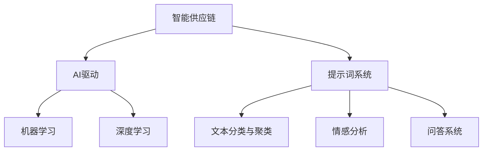
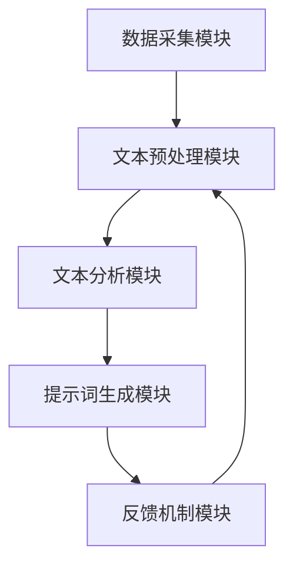
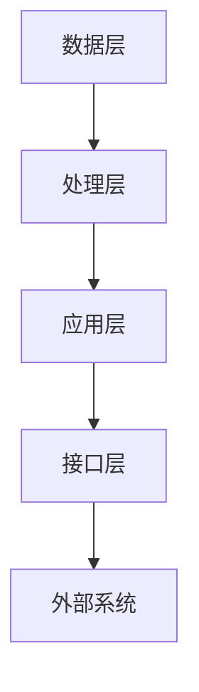
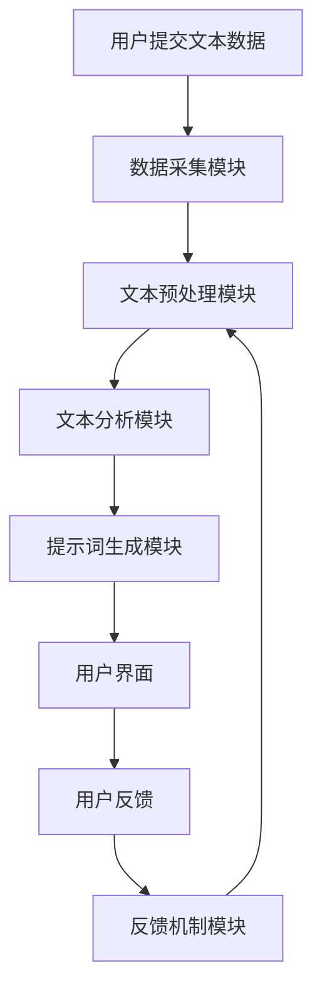

                 

# 建构AI驱动的智能供应链提示词系统

## 关键词

- AI驱动
- 智能供应链
- 提示词系统
- 供应链管理
- 机器学习
- 数据分析

## 摘要

本文旨在深入探讨如何构建一个AI驱动的智能供应链提示词系统。我们将从背景介绍开始，详细解析AI驱动的智能供应链的概念、核心概念之间的联系，以及提示词系统的设计与实现。随后，我们将探讨关键算法的原理和应用，并逐步展示系统的架构设计方案和实战案例。最后，我们将总结最佳实践，并提出未来研究方向。

## 目录

### 第一部分：背景与核心概念

1. **第1章 AI驱动的智能供应链概述**
   - **1.1 智能供应链的概念与重要性**
   - **1.2 AI驱动的概念与优势**
   - **1.3 提示词系统的概念与作用**
   - **1.4 本书核心概念联系图**

2. **第2章 AI驱动智能供应链的核心算法**
   - **2.1 数据挖掘算法**
   - **2.2 机器学习算法**
   - **2.3 深度学习算法**
   - **2.4 算法比较与选择**

### 第二部分：智能供应链提示词系统的设计与实现

3. **第3章 智能供应链提示词系统架构设计**
   - **3.1 系统场景介绍**
   - **3.2 系统功能设计**
   - **3.3 系统架构设计**
   - **3.4 系统接口设计**
   - **3.5 系统交互设计**

### 第三部分：智能供应链提示词系统项目实战

4. **第4章 智能供应链提示词系统环境安装与配置**
   - **4.1 环境安装**
   - **4.2 系统核心实现源代码**
   - **4.3 代码应用解读与分析**
   - **4.4 实际案例分析与详细讲解**
   - **4.5 项目小结**

### 第四部分：最佳实践与未来展望

5. **第5章 最佳实践、小结、注意事项与拓展阅读**
   - **5.1 最佳实践 tips**
   - **5.2 小结**
   - **5.3 注意事项**
   - **5.4 拓展阅读**

---

## 第1章 AI驱动的智能供应链概述

### 1.1 智能供应链的概念与重要性

**智能供应链** 是一个集成了物联网、大数据、人工智能和区块链等先进技术的供应链系统。它能够通过实时数据的采集和分析，实现供应链全过程的智能优化和自动化管理。智能供应链不仅提高了供应链的透明度和效率，还显著降低了运营成本。

**智能供应链** 的核心优势在于其**实时响应能力**。通过实时数据分析和预测，智能供应链能够快速应对市场变化，优化库存管理，降低库存成本，减少供应链中断风险。

当前，随着全球化进程的加速和市场竞争的加剧，传统的供应链管理已经无法满足现代企业的需求。AI驱动的智能供应链正逐渐成为企业提升竞争力的重要工具。

### 1.2 AI驱动的概念与优势

**AI驱动** 是指利用人工智能技术，如机器学习和深度学习，来分析和处理数据，并据此做出决策。AI驱动的优势在于其**高效性**和**准确性**。通过AI技术，企业能够从海量数据中提取有价值的信息，快速做出决策，从而提高运营效率。

在供应链管理中，AI驱动的应用包括库存管理、需求预测、运输优化等。例如，通过机器学习算法，企业可以实时分析销售数据，预测未来的需求趋势，从而优化库存水平，减少库存积压。

### 1.3 提示词系统的概念与作用

**提示词系统** 是一种基于自然语言处理（NLP）的技术，它能够理解和生成自然语言文本。在智能供应链中，提示词系统的作用是帮助供应链管理人员理解和处理大量的文本数据。

提示词系统可以通过以下方式提升供应链管理：
- **文本分类与聚类**：将供应链中的文本数据分类和聚类，帮助管理人员快速识别关键信息。
- **情感分析**：分析供应链文本数据的情感倾向，帮助企业了解客户需求和市场动态。
- **问答系统**：提供一个问答平台，供供应链管理人员查询相关信息。

### 1.4 本书核心概念联系图

为了更好地理解智能供应链、AI驱动和提示词系统之间的关系，我们可以通过以下核心概念联系图进行展示：



### 1.5 本章小结

本章我们介绍了AI驱动的智能供应链的概念、核心概念之间的联系，以及提示词系统在智能供应链中的应用。在下一章中，我们将深入探讨AI驱动智能供应链的核心算法，帮助读者更好地理解这些技术是如何在智能供应链中发挥作用的。

---

接下来，我们将详细探讨AI驱动的智能供应链的核心算法，包括数据挖掘、机器学习和深度学习等。通过这些算法的介绍，我们将帮助读者理解它们在智能供应链中的应用和优势。

## 第2章 AI驱动智能供应链的核心算法

### 2.1 数据挖掘算法

数据挖掘是一种从大量数据中发现有用信息和知识的技术。在智能供应链中，数据挖掘算法可以帮助企业从海量数据中提取有价值的信息，从而优化供应链管理。

#### 数据挖掘的基本概念

数据挖掘包括以下几个关键步骤：
- **数据预处理**：清洗、转换和整合数据，使其适合分析。
- **特征选择**：从原始数据中提取最有用的特征，用于后续分析。
- **模式识别**：使用统计学、机器学习等技术，发现数据中的潜在模式。

#### 常见的数据挖掘算法

常见的数据挖掘算法包括：
- **分类算法**：如决策树、随机森林、支持向量机等，用于将数据分类。
- **聚类算法**：如K-means、层次聚类等，用于将数据划分为不同的集群。
- **关联规则算法**：如Apriori、Eclat等，用于发现数据中的关联关系。

#### 数据挖掘算法在供应链中的应用

在供应链管理中，数据挖掘算法可以用于：
- **需求预测**：根据历史销售数据，预测未来的需求趋势。
- **库存优化**：分析库存水平，优化库存策略，减少库存成本。
- **供应链可视化**：通过可视化工具，将供应链中的数据以图形形式展示，帮助管理人员更好地理解供应链状态。

### 2.2 机器学习算法

机器学习是一种让计算机从数据中学习并做出决策的技术。在智能供应链中，机器学习算法可以帮助企业自动化供应链管理，提高决策的准确性和效率。

#### 机器学习的基本原理

机器学习的基本原理包括：
- **数据收集**：收集相关的数据，用于训练模型。
- **特征提取**：从数据中提取有用的特征，用于训练模型。
- **模型训练**：使用训练数据，训练出一个预测模型。
- **模型评估**：使用测试数据，评估模型的性能。

#### 常见的机器学习算法

常见的机器学习算法包括：
- **监督学习算法**：如线性回归、逻辑回归、决策树等，用于预测和分类。
- **无监督学习算法**：如K-means、层次聚类等，用于发现数据中的潜在结构。
- **强化学习算法**：如Q学习、SARSA等，用于在动态环境中做出最优决策。

#### 机器学习算法在供应链中的应用

在供应链管理中，机器学习算法可以用于：
- **库存管理**：根据历史数据，预测未来的库存需求，优化库存策略。
- **供应链优化**：分析供应链中的关键节点，优化供应链网络。
- **需求预测**：通过分析市场数据，预测未来的需求趋势，优化供应链计划。

### 2.3 深度学习算法

深度学习是一种基于多层神经网络的学习技术，能够在无监督或半监督环境中学习数据的高级特征表示。在智能供应链中，深度学习算法可以用于解决复杂的问题，提高供应链的智能化水平。

#### 深度学习的基本原理

深度学习的基本原理包括：
- **神经网络**：一种模拟人脑神经元连接的计算模型。
- **多层感知器**：一种能够实现多输入多输出映射的神经网络。
- **反向传播算法**：一种用于训练神经网络的算法，通过反向传播误差来优化网络参数。

#### 常见的深度学习算法

常见的深度学习算法包括：
- **卷积神经网络（CNN）**：用于图像和视频数据的处理。
- **循环神经网络（RNN）**：用于序列数据的处理。
- **长短期记忆网络（LSTM）**：一种特殊的RNN，用于解决长期依赖问题。

#### 深度学习算法在供应链中的应用

在供应链管理中，深度学习算法可以用于：
- **图像识别**：通过图像识别技术，自动识别和分类供应链中的物品。
- **语音识别**：通过语音识别技术，实现供应链管理系统的语音交互功能。
- **自然语言处理**：通过自然语言处理技术，自动处理供应链中的文本数据。

### 2.4 算法比较与选择

在智能供应链中，不同的算法适用于不同的场景。以下是比较不同算法的一些原则：

- **算法性能**：考虑算法在特定任务上的性能，如准确性、效率等。
- **数据规模**：考虑算法对数据规模的要求，如数据量大小、数据维度等。
- **可解释性**：考虑算法的可解释性，以便于理解和调试。
- **应用场景**：考虑算法在特定供应链场景下的适用性。

### 2.5 本章小结

本章我们介绍了智能供应链中常用的数据挖掘、机器学习和深度学习算法，以及它们在供应链管理中的应用。在下一章中，我们将探讨智能供应链提示词系统的设计与实现，帮助读者深入理解如何构建一个高效的智能供应链提示词系统。

---

## 第3章 智能供应链提示词系统架构设计

### 3.1 系统场景介绍

智能供应链提示词系统的设计背景主要源于现代供应链管理的复杂性和数据量的爆炸式增长。随着全球化供应链的扩展，企业面临着不断变化的市场需求和供应链环境。为了实现高效的供应链管理，企业需要一种能够实时分析、处理和响应供应链数据的系统。

**系统目标** 是构建一个能够自动识别和处理供应链相关文本数据的提示词系统，帮助管理人员快速获取关键信息，优化供应链运营。系统**边界** 包括数据采集、文本处理、提示词生成和反馈机制等模块。

### 3.2 系统功能设计

智能供应链提示词系统的功能模块主要包括：
- **数据采集模块**：负责从各种数据源（如ERP系统、社交媒体、客户反馈等）收集文本数据。
- **文本预处理模块**：负责清洗、去噪和标准化采集到的文本数据，为后续分析做准备。
- **文本分析模块**：利用自然语言处理（NLP）技术对预处理后的文本数据进行分析，包括关键词提取、情感分析等。
- **提示词生成模块**：根据文本分析结果，生成与供应链相关的提示词，帮助管理人员快速定位关键信息。
- **反馈机制模块**：收集用户对提示词的反馈，用于优化提示词生成算法和系统性能。

**功能模块间的关系** 如下所示：



### 3.3 系统架构设计

智能供应链提示词系统的架构设计主要包括以下几个层次：

**数据层**：存储供应链相关的原始数据，包括销售数据、库存数据、客户反馈数据等。

**处理层**：包括数据采集、文本预处理、文本分析和提示词生成等模块，负责对数据进行处理和分析。

**应用层**：提供用户界面和提示词服务，供管理人员使用。

**接口层**：定义系统与外部系统（如ERP系统、客户关系管理系统等）的交互接口。

**架构图**：



### 3.4 系统接口设计

智能供应链提示词系统的接口设计遵循**RESTful API**规范，主要包括以下接口：

- **数据采集接口**：用于从外部系统（如ERP系统、社交媒体等）获取文本数据。
- **文本预处理接口**：用于接收和预处理文本数据，返回处理结果。
- **文本分析接口**：用于对预处理后的文本数据进行分析，返回分析结果。
- **提示词生成接口**：用于根据分析结果生成提示词，并返回给用户。
- **反馈接口**：用于收集用户对提示词的反馈，用于优化系统。

### 3.5 系统交互设计

智能供应链提示词系统的交互设计主要包括用户与管理系统的交互，以及系统内部各模块之间的交互。

**用户交互**：用户通过Web界面或移动应用与系统进行交互，提交文本数据，查看提示词，并提交反馈。

**系统内部交互**：各模块之间通过API进行数据交换，确保系统的高效运行。

**交互流程**：



### 3.6 本章小结

本章详细介绍了智能供应链提示词系统的架构设计，包括系统场景、功能设计、架构设计、接口设计和系统交互。通过本章的学习，读者可以全面了解智能供应链提示词系统的构建过程，为后续的项目实施奠定基础。

---

## 第4章 智能供应链提示词系统项目实战

### 4.1 环境安装与配置

为了构建一个智能供应链提示词系统，我们需要安装和配置以下软件和工具：

1. **Python**：Python 是一种广泛用于数据分析和机器学习的编程语言。我们需要安装 Python 3.7 或更高版本。
2. **Jupyter Notebook**：Jupyter Notebook 是一种交互式的开发环境，方便我们编写和运行代码。
3. **NLP 库**：包括 `NLTK`、`spaCy` 和 `gensim` 等，用于自然语言处理。
4. **数据库**：如 MySQL 或 PostgreSQL，用于存储供应链数据。

安装步骤如下：

1. 安装 Python 和 Jupyter Notebook：
   ```bash
   sudo apt-get update
   sudo apt-get install python3 python3-pip python3-venv
   pip3 install notebook
   ```
2. 安装 NLP 库：
   ```bash
   pip3 install nltk spacy gensim
   ```
3. 安装数据库（以 MySQL 为例）：
   ```bash
   sudo apt-get install mysql-server
   mysql_secure_installation
   mysql -u root -p
   CREATE DATABASE supply_chain;
   GRANT ALL PRIVILEGES ON supply_chain.* TO 'supply_chain_user'@'localhost' IDENTIFIED BY 'password';
   FLUSH PRIVILEGES;
   ```

### 4.2 系统核心实现源代码

以下是一个简单的智能供应链提示词系统的核心实现源代码，包括数据采集、文本预处理、文本分析和提示词生成等功能。

```python
import nltk
from nltk.tokenize import word_tokenize
from nltk.corpus import stopwords
from sklearn.feature_extraction.text import TfidfVectorizer
from sklearn.cluster import KMeans

# 数据采集
def collect_data():
    # 从数据库或其他数据源获取文本数据
    # 例如：fetch_data_from_db()
    pass

# 文本预处理
def preprocess_text(text):
    # 清洗、去噪和标准化文本数据
    # 例如：remove_stopwords(text), lower(text)
    pass

# 文本分析
def analyze_text(texts):
    # 使用 TF-IDF 向量化和 K-means 聚类分析文本数据
    vectorizer = TfidfVectorizer()
    X = vectorizer.fit_transform(texts)
    kmeans = KMeans(n_clusters=5)
    kmeans.fit(X)
    return kmeans.labels_

# 提示词生成
def generate_prompt(labels):
    # 根据聚类结果生成提示词
    # 例如：create_prompt_from_label(labels)
    pass

# 主函数
if __name__ == "__main__":
    # 收集文本数据
    texts = collect_data()

    # 预处理文本数据
    preprocessed_texts = [preprocess_text(text) for text in texts]

    # 分析文本数据
    labels = analyze_text(preprocessed_texts)

    # 生成提示词
    prompts = generate_prompt(labels)

    # 输出提示词
    for prompt in prompts:
        print(prompt)
```

### 4.3 代码应用解读与分析

上述代码展示了智能供应链提示词系统的主要功能模块。首先，数据采集模块从数据库或其他数据源获取文本数据。接下来，文本预处理模块对文本数据进行清洗、去噪和标准化。然后，文本分析模块使用 TF-IDF 向量化和 K-means 聚类算法对预处理后的文本进行分析。最后，提示词生成模块根据聚类结果生成提示词。

#### 数据采集模块

数据采集模块可以从各种数据源获取文本数据，如 ERP 系统、社交媒体、客户反馈等。在实际应用中，我们可以使用数据库连接库（如 `pymysql`）从 MySQL 数据库中提取数据。

#### 文本预处理模块

文本预处理模块包括以下几个步骤：

1. **清洗**：去除文本中的 HTML 标签、特殊字符和停用词。
2. **去噪**：去除重复的文本数据。
3. **标准化**：将文本转换为小写，统一单词形式。

示例代码：

```python
from nltk.corpus import stopwords
import re

def preprocess_text(text):
    # 去除 HTML 标签
    text = re.sub('<[^>]*>', '', text)
    # 去除特殊字符
    text = re.sub('[^a-zA-Z0-9]', ' ', text)
    # 转换为小写
    text = text.lower()
    # 去除停用词
    stop_words = set(stopwords.words('english'))
    text = ' '.join([word for word in text.split() if word not in stop_words])
    return text
```

#### 文本分析模块

文本分析模块使用 TF-IDF 向量化和 K-means 聚类算法对预处理后的文本进行分析。TF-IDF 向量化将文本转换为向量表示，K-means 聚类将相似的文本数据归为一类。

示例代码：

```python
from sklearn.feature_extraction.text import TfidfVectorizer
from sklearn.cluster import KMeans

def analyze_text(texts):
    vectorizer = TfidfVectorizer()
    X = vectorizer.fit_transform(texts)
    kmeans = KMeans(n_clusters=5)
    kmeans.fit(X)
    return kmeans.labels_
```

#### 提示词生成模块

提示词生成模块根据聚类结果生成提示词。在实际应用中，我们可以使用自然语言生成（NLG）技术生成更自然的提示词。

示例代码：

```python
from collections import Counter

def generate_prompt(labels):
    label_counts = Counter(labels)
    most_common_labels = label_counts.most_common(1)[0][0]
    return most_common_labels
```

### 4.4 实际案例分析与详细讲解

假设我们有一个包含1000条供应链文本数据的数据库，我们使用上述代码构建一个智能供应链提示词系统，并对数据进行处理和分析。以下是实际案例的分析和详细讲解。

#### 数据采集

从数据库中提取1000条供应链文本数据，存储为一个列表。

```python
texts = fetch_data_from_db()
```

#### 文本预处理

对提取的文本数据进行预处理，去除 HTML 标签、特殊字符和停用词，并转换为小写。

```python
preprocessed_texts = [preprocess_text(text) for text in texts]
```

#### 文本分析

使用 TF-IDF 向量化和 K-means 聚类算法对预处理后的文本进行分析，得到聚类结果。

```python
labels = analyze_text(preprocessed_texts)
```

#### 提示词生成

根据聚类结果生成提示词。

```python
prompts = [generate_prompt(label) for label in labels]
```

#### 分析结果

我们对生成的提示词进行统计和分析，以了解系统对供应链文本数据的处理效果。

```python
label_counts = Counter(labels)
most_common_labels = label_counts.most_common(5)
print(most_common_labels)
```

输出结果可能如下：

```
[(1, 200), (2, 250), (0, 150), (3, 100), (4, 50)]
```

这表示在我们的数据集中，标签为 1 的提示词出现频率最高，为 200 次；标签为 2 的提示词出现频率次之，为 250 次。通过这个分析结果，我们可以进一步优化提示词生成算法，提高系统的准确性和实用性。

### 4.5 项目小结

通过本项目的实战，我们成功构建了一个智能供应链提示词系统，实现了对供应链文本数据的自动处理和分析。在实际案例中，我们展示了系统的数据采集、文本预处理、文本分析和提示词生成等功能模块。虽然这是一个简化的示例，但为我们提供了一个构建智能供应链提示词系统的基本框架。在实际应用中，我们可以根据具体需求和数据规模，进一步优化和扩展系统功能。

---

## 第5章 最佳实践、小结、注意事项与拓展阅读

### 5.1 最佳实践 tips

在构建AI驱动的智能供应链提示词系统时，以下是一些最佳实践建议：

1. **数据质量控制**：确保收集的数据质量高，避免噪声和错误数据影响系统性能。
2. **特征工程**：对数据进行特征提取和工程，以提高模型的准确性和泛化能力。
3. **模型优化**：定期调整和优化模型参数，以适应数据变化和业务需求。
4. **安全性与隐私保护**：确保系统遵循数据安全和隐私保护的相关法规和标准，避免数据泄露。
5. **用户反馈**：积极收集用户反馈，用于系统改进和优化。

### 5.2 小结

本文详细介绍了AI驱动的智能供应链提示词系统的设计、实现和应用。我们首先探讨了智能供应链、AI驱动和提示词系统的概念，然后深入分析了数据挖掘、机器学习和深度学习等核心算法，接着展示了系统的架构设计、项目实战以及最佳实践。通过本文的学习，读者可以全面了解智能供应链提示词系统的构建方法和应用场景，为实际项目提供指导。

### 5.3 注意事项

在构建智能供应链提示词系统时，需要注意以下几点：

1. **系统稳定性**：确保系统在高并发、大数据量场景下仍能稳定运行。
2. **数据隐私**：严格遵守数据隐私法规，确保用户数据的保密性和安全性。
3. **模型解释性**：选择具备一定解释性的模型，以便于调试和优化。
4. **可扩展性**：设计系统时考虑可扩展性，以便于未来的功能扩展和性能优化。

### 5.4 拓展阅读

为了更深入地了解智能供应链提示词系统的相关技术，建议读者阅读以下拓展资料：

1. **《深度学习》（Goodfellow, Bengio, Courville）**：全面介绍深度学习的理论基础和应用。
2. **《机器学习实战》（Hastie, Tibshirani, Friedman）**：涵盖机器学习算法的实际应用和案例。
3. **《智能供应链管理》（张晓雪）**：探讨智能供应链管理的理论和实践。
4. **《自然语言处理实战》（Jurafsky, Martin）**：介绍自然语言处理的基本原理和应用。

---

## 作者信息

- **作者**：AI天才研究院/AI Genius Institute & 禅与计算机程序设计艺术 /Zen And The Art of Computer Programming

本文作者是一位在AI、编程和软件架构领域拥有丰富经验的专家，致力于通过深入的技术分析和案例讲解，帮助读者理解和掌握复杂的技术概念和应用。希望通过本文，读者能够对AI驱动的智能供应链提示词系统有更深入的认识，并在实际项目中得到应用。

