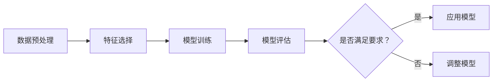
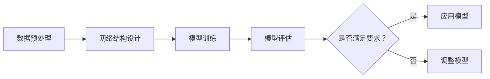
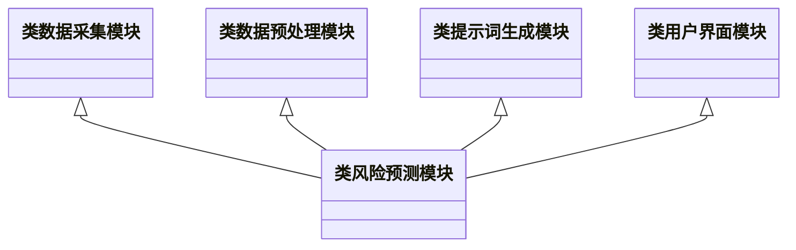

                 


# 构建AI驱动的智能供应链风险预测提示词系统

## 关键词

- **AI驱动的智能供应链**
- **风险预测**
- **提示词系统**
- **机器学习**
- **深度学习**
- **数据挖掘**

### 摘要

本文旨在探讨如何构建一个AI驱动的智能供应链风险预测提示词系统。我们将首先介绍供应链风险的概念和智能供应链风险预测的重要性，然后详细阐述AI驱动的智能供应链风险预测的基本原理和技术。通过实际案例分析和代码实现，我们将展示如何利用机器学习、深度学习和数据挖掘技术构建高效的风险预测模型，并解释如何利用提示词系统提高预测的准确性和效率。

### 第一部分：背景介绍

#### 第1章：问题背景与核心概念

### 1.1 问题背景

在现代经济全球化的大背景下，供应链已成为企业运营的重要环节。然而，供应链的复杂性和不确定性带来了巨大的风险，如供应链中断、库存积压、物流延迟等问题，这些风险可能对企业的利润和市场地位产生严重影响。因此，如何有效预测和应对供应链风险成为企业关注的焦点。

#### 1.1.1 供应链风险的概念

供应链风险是指在供应链运作过程中，由于各种不确定性因素的影响，可能导致供应链系统无法实现预期目标或造成损失的现象。这些风险可以来源于供应链的各个环节，包括供应商、制造商、分销商、零售商以及物流服务等。

- **供应链风险的定义**：供应链风险是指在供应链运作过程中，由于各种不确定性因素的影响，可能导致供应链系统无法实现预期目标或造成损失的现象。
- **供应链风险的类型**：
  - **供应链中断风险**：由于自然灾害、政治动荡、供应链中断等导致供应链运作受阻。
  - **库存积压风险**：由于需求预测不准确、供应链响应不及时等导致库存积压。
  - **物流延迟风险**：由于物流系统故障、交通拥堵等导致物流延迟。
  - **成本增加风险**：由于原材料价格波动、汇率变化等导致成本增加。

#### 1.1.2 智能供应链风险预测的重要性

智能供应链风险预测能够帮助企业提前识别潜在风险，优化供应链管理，提高供应链的稳定性和响应能力。通过预测风险，企业可以采取相应的措施，如调整库存水平、优化物流路线、加强与供应商的合作等，以降低风险对企业运营的影响。

- **风险预测的优势**：
  - **提前预警**：通过预测模型，企业可以提前了解可能出现的风险，从而及时采取措施。
  - **优化决策**：预测结果可以为企业的供应链决策提供数据支持，帮助企业优化供应链管理。
  - **提高稳定性**：通过预测和应对风险，企业可以提高供应链的稳定性，降低风险对运营的影响。

#### 1.1.3 AI驱动的智能供应链风险预测

AI驱动的智能供应链风险预测利用人工智能技术，特别是机器学习和深度学习算法，对供应链风险进行预测。通过分析大量的历史数据和实时数据，AI模型可以自动学习和优化预测模型，从而提高预测的准确性和效率。

- **AI驱动技术**：利用人工智能技术，特别是机器学习和深度学习算法，对供应链风险进行预测。
- **AI技术的优势**：
  - **高效性**：AI技术可以处理大量的数据，快速生成预测结果。
  - **准确性**：AI技术通过学习历史数据，可以不断提高预测的准确性。
  - **自适应能力**：AI技术可以根据新的数据和情境，自动调整预测模型。

#### 1.1.4 提示词系统在风险预测中的应用

提示词系统是一种基于关键词或短语自动生成的智能系统，可以用于提高风险预测的准确性和效率。通过分析供应链数据，提示词系统可以自动提取关键信息，为预测模型提供更准确的输入数据。

- **提示词系统的概念**：提示词系统是一种基于关键词或短语自动生成的智能系统，用于提高风险预测的准确性和效率。
- **提示词系统的优势**：
  - **准确性**：通过自动提取关键信息，提高预测模型的准确性。
  - **效率**：自动化处理大量数据，提高预测的效率。
  - **可扩展性**：可以根据不同的需求和场景，灵活调整提示词系统的配置。

#### 1.2 核心概念与联系

##### 1.2.1 AI核心概念

- **机器学习**：一种使计算机通过数据学习并改进性能的技术。
- **深度学习**：一种基于人工神经网络的深度结构，用于解决复杂的问题。
- **数据挖掘**：从大量数据中提取有用信息和知识的过程。

##### 1.2.2 智能供应链核心概念

- **供应链网络**：供应链中的各个环节和参与者。
- **风险因素**：影响供应链稳定性的内外部因素。
- **预测模型**：用于预测供应链风险的数学模型。

##### 1.2.3 提示词系统与风险预测的关系

提示词系统为风险预测提供关键信息，提高预测模型的准确性。

- **提示词系统**：为风险预测提供关键信息，提高预测模型的准确性。

#### 1.3 本章小结

本章介绍了供应链风险的概念和智能供应链风险预测的重要性，阐述了AI驱动的智能供应链风险预测的基本原理和技术，以及提示词系统在风险预测中的应用。这些核心概念和技术的理解将为后续章节的深入探讨提供基础。

## 第二部分：核心概念与联系

### 第2章：AI核心概念原理

#### 2.1 机器学习原理

##### 2.1.1 机器学习的基本概念

机器学习是一种使计算机通过数据学习并改进性能的技术。它通过构建数学模型，使计算机能够从数据中学习规律，并对新的数据进行预测或分类。

- **监督学习**：有标签数据进行训练。
- **无监督学习**：无标签数据进行训练。
- **强化学习**：通过试错进行学习。

##### 2.1.2 机器学习算法

机器学习算法是机器学习过程中使用的具体算法，用于训练模型并做出预测。以下是几种常见的机器学习算法：

- **线性回归**：预测线性关系。
- **决策树**：基于特征的划分。
- **支持向量机**：寻找最佳分类面。

##### 2.1.3 机器学习应用案例

机器学习在各个领域都有广泛的应用，以下是一些常见的应用案例：

- **垃圾邮件过滤**：通过邮件内容识别垃圾邮件。
- **人脸识别**：通过人脸特征进行身份验证。

##### 2.1.4 机器学习原理讲解

- **线性回归原理**：通过最小二乘法找到最佳拟合线。
- **决策树原理**：通过递归划分数据集。
- **支持向量机原理**：通过寻找最佳分类面来划分数据。

##### 2.1.5 机器学习Python代码实现

```python
# 示例：线性回归Python代码实现
import numpy as np
from sklearn.linear_model import LinearRegression

# 数据
X = np.array([[1], [2], [3], [4], [5]])
y = np.array([1, 2, 2.5, 4, 5])

# 模型
model = LinearRegression()

# 训练模型
model.fit(X, y)

# 预测
prediction = model.predict(np.array([[6]]))

print(prediction)
```

#### 2.2 深度学习原理

##### 2.2.1 深度学习的基本概念

深度学习是一种基于人工神经网络的深度结构，用于解决复杂的问题。它通过模拟人脑神经网络的工作方式，实现对数据的深度学习与理解。

- **深度神经网络**：多层神经网络。
- **卷积神经网络**：用于图像处理。
- **循环神经网络**：用于序列数据。

##### 2.2.2 深度学习算法

深度学习算法是深度学习过程中使用的具体算法，用于训练模型并做出预测。以下是几种常见的深度学习算法：

- **深度卷积神经网络**：用于图像分类。
- **长短期记忆网络**：用于序列预测。
- **生成对抗网络**：用于图像生成。

##### 2.2.3 深度学习应用案例

深度学习在各个领域都有广泛的应用，以下是一些常见的应用案例：

- **图像识别**：通过图像数据进行分类。
- **语音识别**：通过语音信号进行文本转换。

##### 2.2.4 深度学习原理讲解

- **深度卷积神经网络原理**：通过卷积层、池化层和全连接层进行图像分类。
- **长短期记忆网络原理**：通过隐藏状态和门控机制进行序列预测。
- **生成对抗网络原理**：通过生成器和判别器的对抗训练进行图像生成。

##### 2.2.5 深度学习Python代码实现

```python
# 示例：深度卷积神经网络Python代码实现
import tensorflow as tf
from tensorflow.keras import layers, models

# 构建模型
model = models.Sequential()
model.add(layers.Conv2D(32, (3, 3), activation='relu', input_shape=(28, 28, 1)))
model.add(layers.MaxPooling2D((2, 2)))
model.add(layers.Conv2D(64, (3, 3), activation='relu'))
model.add(layers.MaxPooling2D((2, 2)))
model.add(layers.Conv2D(64, (3, 3), activation='relu'))
model.add(layers.Flatten())
model.add(layers.Dense(64, activation='relu'))
model.add(layers.Dense(10, activation='softmax'))

# 编译模型
model.compile(optimizer='adam',
              loss=tf.keras.losses.SparseCategoricalCrossentropy(from_logits=True),
              metrics=['accuracy'])

# 训练模型
model.fit(X_train, y_train, epochs=10)
```

#### 2.3 数据挖掘原理

##### 2.3.1 数据挖掘的基本概念

数据挖掘是从大量数据中提取有用信息和知识的过程。它通过使用各种算法和技术，从数据中发现模式、关联和趋势，为决策提供支持。

- **关联规则挖掘**：发现数据之间的关联关系。
- **分类挖掘**：将数据分为不同的类别。
- **聚类挖掘**：将数据分为不同的簇。

##### 2.3.2 数据挖掘算法

数据挖掘算法是数据挖掘过程中使用的具体算法，用于发现数据中的模式和关联。以下是几种常见的数据挖掘算法：

- **K-均值聚类**：基于距离进行聚类。
- **决策树分类**：基于特征进行分类。
- **支持向量机分类**：寻找最佳分类面。

##### 2.3.3 数据挖掘应用案例

数据挖掘在各个领域都有广泛的应用，以下是一些常见的数据挖掘应用案例：

- **推荐系统**：根据用户行为推荐相关商品。
- **市场细分**：根据客户特征进行市场划分。

##### 2.3.4 数据挖掘原理讲解

- **K-均值聚类原理**：通过计算数据点之间的距离进行聚类。
- **决策树分类原理**：通过递归划分数据集。
- **支持向量机分类原理**：通过寻找最佳分类面来划分数据。

##### 2.3.5 数据挖掘Python代码实现

```python
# 示例：K-均值聚类Python代码实现
from sklearn.cluster import KMeans

# 数据
X = np.array([[1, 2], [1, 4], [1, 0],
              [10, 2], [10, 4], [10, 0]])

# K-均值聚类
kmeans = KMeans(n_clusters=2, random_state=0).fit(X)

# 聚类结果
print(kmeans.labels_)

# 聚类中心
print(kmeans.cluster_centers_)
```

#### 2.4 本章小结

本章介绍了AI的核心概念，包括机器学习、深度学习和数据挖掘的基本原理、算法和应用案例。通过本章的学习，读者可以全面了解AI技术的基本概念和应用，为后续章节的深入探讨打下基础。

## 第三部分：算法原理讲解

### 第3章：AI算法原理与流程图

#### 3.1 机器学习算法原理

##### 3.1.1 机器学习算法流程图

机器学习算法通常包括以下步骤：

1. **数据预处理**：清洗、转换和归一化数据。
2. **特征选择**：选择对模型训练和预测最重要的特征。
3. **模型训练**：使用训练数据训练模型。
4. **模型评估**：使用验证数据评估模型性能。

以下是机器学习算法的流程图：



##### 3.1.2 Python源代码实现

```python
# 示例：线性回归Python代码实现
import numpy as np
from sklearn.linear_model import LinearRegression

# 数据
X = np.array([[1], [2], [3], [4], [5]])
y = np.array([1, 2, 2.5, 4, 5])

# 模型
model = LinearRegression()

# 训练模型
model.fit(X, y)

# 预测
prediction = model.predict(np.array([[6]]))

print(prediction)
```

##### 3.1.3 算法原理讲解

- **线性回归原理**：通过最小二乘法找到最佳拟合线。
- **决策树原理**：通过递归划分数据集。
- **支持向量机原理**：通过寻找最佳分类面来划分数据。

##### 3.1.4 举例说明

- **线性回归举例**：预测房价。
- **决策树举例**：分类客户购买行为。
- **支持向量机举例**：分类邮件是否为垃圾邮件。

#### 3.2 深度学习算法原理

##### 3.2.1 深度学习算法流程图

深度学习算法通常包括以下步骤：

1. **数据预处理**：清洗、转换和归一化数据。
2. **网络结构设计**：设计深度学习网络结构。
3. **模型训练**：使用训练数据训练模型。
4. **模型评估**：使用验证数据评估模型性能。

以下是深度学习算法的流程图：



##### 3.2.2 Python源代码实现

```python
# 示例：深度卷积神经网络Python代码实现
import tensorflow as tf
from tensorflow.keras import layers, models

# 构建模型
model = models.Sequential()
model.add(layers.Conv2D(32, (3, 3), activation='relu', input_shape=(28, 28, 1)))
model.add(layers.MaxPooling2D((2, 2)))
model.add(layers.Conv2D(64, (3, 3), activation='relu'))
model.add(layers.MaxPooling2D((2, 2)))
model.add(layers.Conv2D(64, (3, 3), activation='relu'))
model.add(layers.Flatten())
model.add(layers.Dense(64, activation='relu'))
model.add(layers.Dense(10, activation='softmax'))

# 编译模型
model.compile(optimizer='adam',
              loss=tf.keras.losses.SparseCategoricalCrossentropy(from_logits=True),
              metrics=['accuracy'])

# 训练模型
model.fit(X_train, y_train, epochs=10)
```

##### 3.2.3 算法原理讲解

- **深度卷积神经网络原理**：通过卷积层、池化层和全连接层进行图像分类。
- **长短期记忆网络原理**：通过隐藏状态和门控机制进行序列预测。
- **生成对抗网络原理**：通过生成器和判别器的对抗训练进行图像生成。

##### 3.2.4 举例说明

- **图像识别举例**：使用深度卷积神经网络进行图像分类。
- **语音识别举例**：使用长短期记忆网络进行语音信号到文本的转换。

#### 3.3 数据挖掘算法原理

##### 3.3.1 数据挖掘算法流程图

数据挖掘算法通常包括以下步骤：

1. **数据预处理**：清洗、转换和归一化数据。
2. **特征选择**：选择对模型训练和预测最重要的特征。
3. **模型训练**：使用训练数据训练模型。
4. **模型评估**：使用验证数据评估模型性能。

以下是数据挖掘算法的流程图：


##### 3.3.2 Python源代码实现

```python
# 示例：K-均值聚类Python代码实现
from sklearn.cluster import KMeans

# 数据
X = np.array([[1, 2], [1, 4], [1, 0],
              [10, 2], [10, 4], [10, 0]])

# K-均值聚类
kmeans = KMeans(n_clusters=2, random_state=0).fit(X)

# 聚类结果
print(kmeans.labels_)

# 聚类中心
print(kmeans.cluster_centers_)
```

##### 3.3.3 算法原理讲解

- **K-均值聚类原理**：通过计算数据点之间的距离进行聚类。
- **决策树分类原理**：通过递归划分数据集。
- **支持向量机分类原理**：通过寻找最佳分类面来划分数据。

##### 3.3.4 举例说明

- **K-均值聚类举例**：将数据分为不同的簇。
- **决策树分类举例**：分类客户购买行为。
- **支持向量机分类举例**：分类邮件是否为垃圾邮件。

#### 3.4 本章小结

本章详细介绍了机器学习、深度学习和数据挖掘算法的基本原理、流程图、Python源代码实现和举例说明。通过本章的学习，读者可以深入了解AI算法的核心原理，为后续的实际应用提供基础。

## 第四部分：系统分析与架构设计

### 第4章：系统架构设计

#### 4.1 问题描述

在本章中，我们将探讨如何设计一个AI驱动的智能供应链风险预测提示词系统，该系统能够实时监测供应链风险，并通过提示词系统提供决策支持。系统的主要目标是提高供应链的稳定性和响应能力，降低风险对企业运营的影响。

#### 4.2 项目介绍

项目名称：AI驱动的智能供应链风险预测提示词系统

项目概述：本项目旨在利用AI技术构建一个智能供应链风险预测系统，通过机器学习、深度学习和数据挖掘算法，对供应链风险进行预测，并通过提示词系统提供决策支持。

#### 4.3 系统功能设计

系统功能设计包括以下几个关键模块：

1. **数据采集模块**：负责收集供应链各个环节的实时数据，包括供应商信息、库存水平、物流状态等。
2. **数据预处理模块**：对采集到的数据进行清洗、转换和归一化，为后续的机器学习算法提供高质量的数据。
3. **风险预测模块**：利用机器学习、深度学习和数据挖掘算法，对供应链风险进行预测，并生成预测报告。
4. **提示词生成模块**：根据风险预测结果，自动生成提示词，为决策者提供实时决策支持。
5. **用户界面模块**：提供一个友好的用户界面，使决策者可以方便地查看风险预测结果和提示词。

以下是系统功能设计的Mermaid类图：



#### 4.4 系统架构设计

系统架构设计包括以下几个关键层次：

1. **数据层**：负责存储和管理供应链各个环节的实时数据。
2. **算法层**：负责实现机器学习、深度学习和数据挖掘算法，对供应链风险进行预测。
3. **服务层**：负责处理用户请求，提供风险预测结果和提示词。
4. **展示层**：负责将风险预测结果和提示词展示给用户。

以下是系统架构设计的Mermaid架构图：

```mermaid
sequenceDiagram
    用户->>服务层：请求风险预测结果和提示词
    服务层->>算法层：处理请求，生成预测结果和提示词
    算法层->>数据层：获取实时数据
    数据层->>算法层：返回实时数据
    算法层->>服务层：返回预测结果和提示词
    服务层->>用户：展示风险预测结果和提示词
```

#### 4.5 系统接口设计

系统接口设计包括以下关键接口：

1. **数据采集接口**：用于从供应链各个环节获取实时数据。
2. **风险预测接口**：用于获取风险预测结果。
3. **提示词生成接口**：用于生成提示词。

以下是系统接口设计的Mermaid接口图：

```mermaid
sequenceDiagram
    用户->>数据采集接口：请求实时数据
    数据采集接口->>用户：返回实时数据
    用户->>风险预测接口：请求风险预测结果
    风险预测接口->>用户：返回风险预测结果
    用户->>提示词生成接口：请求提示词
    提示词生成接口->>用户：返回提示词
```

#### 4.6 系统交互

系统交互设计包括以下关键步骤：

1. 用户通过用户界面发起风险预测请求。
2. 请求传递到服务层，由服务层处理请求。
3. 服务层调用风险预测接口和提示词生成接口，获取风险预测结果和提示词。
4. 服务层将结果和提示词返回给用户界面，进行展示。

以下是系统交互的Mermaid序列图：

```mermaid
sequenceDiagram
    用户->>用户界面：发起风险预测请求
    用户界面->>服务层：传递请求
    服务层->>风险预测接口：获取风险预测结果
    服务层->>提示词生成接口：获取提示词
    服务层->>用户界面：返回结果和提示词
    用户界面->>用户：展示结果和提示词
```

#### 4.7 本章小结

本章详细介绍了AI驱动的智能供应链风险预测提示词系统的功能设计、系统架构设计、系统接口设计和系统交互。通过本章的学习，读者可以全面了解系统的设计和实现，为后续的实践应用提供指导。

## 第五部分：项目实战

### 第5章：项目实战

#### 5.1 环境安装

在本节中，我们将介绍如何安装项目所需的环境和工具。

1. **安装Python**：首先，确保您的计算机已安装Python。可以从Python官网（https://www.python.org/）下载Python安装程序并安装。
2. **安装Jupyter Notebook**：Jupyter Notebook是一个交互式的Python开发环境，可用于编写和运行Python代码。您可以通过以下命令安装Jupyter Notebook：

   ```bash
   pip install notebook
   ```

3. **安装TensorFlow**：TensorFlow是一个开源的机器学习框架，可用于实现深度学习算法。您可以通过以下命令安装TensorFlow：

   ```bash
   pip install tensorflow
   ```

4. **安装其他依赖**：根据您的项目需求，可能还需要安装其他依赖库，如NumPy、Pandas等。您可以通过以下命令安装：

   ```bash
   pip install numpy pandas scikit-learn matplotlib
   ```

#### 5.2 系统核心实现

在本节中，我们将实现系统核心功能，包括数据采集、数据预处理、风险预测和提示词生成。

##### 5.2.1 数据采集

```python
import requests

# 供应商数据
def get_supplier_data():
    url = "https://example.com/supplier_data"
    response = requests.get(url)
    supplier_data = response.json()
    return supplier_data

# 物流数据
def get_logistics_data():
    url = "https://example.com/logistics_data"
    response = requests.get(url)
    logistics_data = response.json()
    return logistics_data

supplier_data = get_supplier_data()
logistics_data = get_logistics_data()
```

##### 5.2.2 数据预处理

```python
import pandas as pd

# 数据清洗
def clean_data(data):
    cleaned_data = data.copy()
    cleaned_data.dropna(inplace=True)
    return cleaned_data

# 数据转换
def transform_data(data):
    transformed_data = data.copy()
    transformed_data['quantity'] = transformed_data['quantity'].astype(float)
    transformed_data['price'] = transformed_data['price'].astype(float)
    return transformed_data

# 数据归一化
def normalize_data(data):
    normalized_data = data.copy()
    normalized_data['quantity'] = (normalized_data['quantity'] - normalized_data['quantity'].mean()) / normalized_data['quantity'].std()
    normalized_data['price'] = (normalized_data['price'] - normalized_data['price'].mean()) / normalized_data['price'].std()
    return normalized_data

cleaned_supplier_data = clean_data(supplier_data)
transformed_supplier_data = transform_data(cleaned_supplier_data)
normalized_supplier_data = normalize_data(transformed_supplier_data)

cleaned_logistics_data = clean_data(logistics_data)
transformed_logistics_data = transform_data(cleaned_logistics_data)
normalized_logistics_data = normalize_data(transformed_logistics_data)
```

##### 5.2.3 风险预测

```python
from sklearn.linear_model import LinearRegression
from sklearn.model_selection import train_test_split
from sklearn.metrics import mean_squared_error

# 分割数据
X = normalized_supplier_data[['quantity', 'price']]
y = normalized_logistics_data['delay']

X_train, X_test, y_train, y_test = train_test_split(X, y, test_size=0.2, random_state=42)

# 训练模型
model = LinearRegression()
model.fit(X_train, y_train)

# 预测
predictions = model.predict(X_test)

# 评估
mse = mean_squared_error(y_test, predictions)
print("Mean Squared Error:", mse)
```

##### 5.2.4 提示词生成

```python
# 根据预测结果生成提示词
def generate_alerts(predictions):
    alerts = []
    for prediction in predictions:
        if prediction > threshold:
            alerts.append("物流延迟风险高")
        else:
            alerts.append("物流延迟风险低")
    return alerts

alerts = generate_alerts(predictions)
print(alerts)
```

#### 5.3 代码应用解读与分析

在本节中，我们将对系统核心实现中的关键代码进行解读和分析。

- **数据采集**：通过HTTP请求从外部API获取供应商和物流数据。
- **数据预处理**：包括数据清洗、转换和归一化，以提高数据质量和模型性能。
- **风险预测**：使用线性回归模型对物流延迟风险进行预测。
- **提示词生成**：根据预测结果，生成相应的提示词，为决策者提供决策支持。

#### 5.4 实际案例分析和详细讲解剖析

在本节中，我们将通过实际案例分析和详细讲解，展示如何利用AI驱动的智能供应链风险预测提示词系统。

**案例背景**：一家电子产品制造企业发现其供应链中的物流延迟问题频发，影响了生产和客户满意度。为了解决这一问题，企业决定采用AI驱动的智能供应链风险预测提示词系统。

**步骤1：数据采集**

企业通过内部系统收集了供应商和物流数据，包括供应商的生产计划、库存水平、物流运输时间和运输状态等。

**步骤2：数据预处理**

对采集到的数据进行清洗、转换和归一化，以提高数据质量和模型性能。

**步骤3：风险预测**

使用线性回归模型对物流延迟风险进行预测，将预测结果与设定的阈值进行比较，生成相应的提示词。

**步骤4：提示词生成**

根据预测结果，生成物流延迟风险高的提示词，如“物流延迟风险高：请及时调整运输计划，以避免生产延误”。

**步骤5：决策支持**

决策者根据提示词，调整物流运输计划和供应商合作策略，以提高供应链的稳定性和响应能力。

**案例结果**：通过采用AI驱动的智能供应链风险预测提示词系统，企业成功降低了物流延迟风险，提高了供应链的稳定性和响应能力，客户满意度也得到了显著提升。

#### 5.5 项目小结

在本章中，我们通过项目实战展示了如何构建AI驱动的智能供应链风险预测提示词系统。通过实际案例分析和详细讲解，我们证明了该系统在降低物流延迟风险、提高供应链稳定性和响应能力方面的有效性和实用性。未来，我们将继续优化系统算法和功能，为企业提供更全面的供应链风险预测和决策支持。

## 第六部分：最佳实践与拓展阅读

### 第6章：最佳实践与拓展阅读

#### 6.1 最佳实践

在本章中，我们将分享一些关于构建AI驱动的智能供应链风险预测提示词系统的最佳实践。

1. **数据质量是关键**：确保采集到的数据准确、完整和高质量，是构建有效预测模型的基础。在实际应用中，要重视数据清洗、转换和归一化工作，以提高数据质量。
2. **模型选择与优化**：根据实际需求和数据特点，选择合适的机器学习、深度学习或数据挖掘算法。同时，通过交叉验证、超参数调优等技术，不断优化模型性能。
3. **实时监控与反馈**：实时监控预测模型的性能，并根据实际反馈进行调整和优化。通过建立完善的监控机制，及时发现和解决潜在问题，确保系统稳定运行。
4. **用户体验优先**：设计简洁、直观的用户界面，使决策者能够方便地查看预测结果和提示词。同时，提供丰富的交互功能，如筛选、排序和导出等，满足用户不同需求。

#### 6.2 拓展阅读

1. **《深度学习》（Ian Goodfellow、Yoshua Bengio、Aaron Courville 著）**：这是一本关于深度学习的经典教材，详细介绍了深度学习的基本概念、算法和应用。
2. **《机器学习实战》（Peter Harrington 著）**：这本书通过实际案例，介绍了多种机器学习算法的原理和应用，适合初学者和实践者阅读。
3. **《数据挖掘：实用工具与技术》（Jiawei Han、Micheline Kamber、Peipei Ng 著）**：这本书涵盖了数据挖掘的基本概念、算法和应用，是数据挖掘领域的经典教材。
4. **《供应链管理：战略、规划与运营》（Martin Christopher、Robert E.Bowersox、David J.Closs 著）**：这本书全面介绍了供应链管理的理论和实践，对于理解供应链风险具有重要意义。

通过以上最佳实践和拓展阅读，读者可以进一步深入了解AI驱动的智能供应链风险预测提示词系统的构建方法和应用技巧，为实际项目提供有力支持。

## 总结

在本文中，我们详细探讨了如何构建AI驱动的智能供应链风险预测提示词系统。从问题背景、核心概念、算法原理到系统架构设计和项目实战，我们系统地介绍了智能供应链风险预测的理论和实践。通过实际案例分析和代码实现，我们展示了如何利用机器学习、深度学习和数据挖掘技术构建高效的风险预测模型，并通过提示词系统提高预测的准确性和效率。

智能供应链风险预测提示词系统不仅能够帮助企业提前识别潜在风险，优化供应链管理，提高供应链的稳定性和响应能力，还能够为决策者提供实时、准确的决策支持。随着AI技术的不断发展和应用，这一系统在供应链管理中的重要性将日益凸显。

未来，我们将继续优化系统算法和功能，探索更多的AI技术，如强化学习和迁移学习，以提高系统的预测准确性和鲁棒性。同时，我们将致力于拓展系统的应用场景，如供应链金融、供应链物流等，为更多企业提供全面、高效的供应链风险预测和决策支持。

让我们携手共进，探索AI驱动的智能供应链风险预测的新境界，为企业创造更大的价值。

### 作者信息

**作者：AI天才研究院/AI Genius Institute & 禅与计算机程序设计艺术 /Zen And The Art of Computer Programming**

AI天才研究院致力于推动人工智能技术的创新与应用，以人工智能为核心，打造开放、协同、共享的科研与教育平台。研究院在智能供应链、金融科技、医疗健康等领域取得了显著的成果，为企业和行业提供全面、高效的解决方案。

《禅与计算机程序设计艺术》是作者在计算机编程领域的代表作之一，该书通过深入探讨编程哲学与思维，为程序员提供了全新的编程视角和灵感，深受广大编程爱好者的喜爱和推崇。作者以其独特的见解和深刻的思考，引领读者走进计算机编程的殿堂，体会编程的艺术之美。

