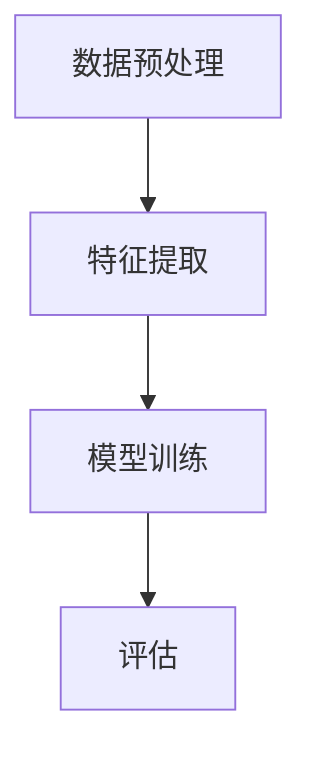
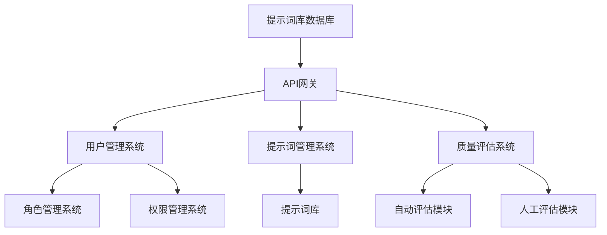
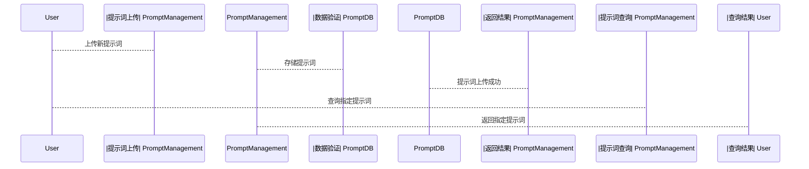

                 

# 构建企业级提示词管理平台

## 关键词

- 企业级提示词管理
- 提示词库
- 用户角色与权限
- 质量评估机制
- 安全性与隐私保护

## 摘要

随着人工智能技术的发展，企业级提示词管理平台成为提升用户体验和业务效率的关键。本文将详细介绍如何构建一个高效、安全且易于维护的企业级提示词管理平台。首先，我们将探讨问题背景，明确核心目标和问题解决方法。接着，深入分析核心概念与联系，包括提示词库、用户角色与权限、质量评估机制等。随后，我们将使用Mermaid流程图和Python源代码阐述算法原理，并进行系统分析与架构设计。最后，通过项目实战和最佳实践，为读者提供实际应用指导和拓展阅读建议。

## 第二部分：核心概念与联系

### 2.1 提示词管理平台的核心概念

#### 2.1.1 提示词库

提示词库是提示词管理平台的核心组成部分，负责存储和管理所有的提示词。以下是设计提示词库时需考虑的几个关键点：

1. **数据结构**：提示词库的数据结构应能够高效存储和检索提示词。通常，关系型数据库如MySQL或PostgreSQL适合存储结构化数据，而NoSQL数据库如MongoDB适合处理大量非结构化数据。

2. **扩展性**：设计时需考虑未来可能增加的提示词量，确保系统性能不受影响。可以通过分片、索引优化等方法提升数据库性能。

3. **安全性**：确保提示词库的数据安全，防止未经授权的访问和修改。可以使用加密技术对敏感数据进行加密，并实施访问控制策略。

#### 2.1.2 用户角色与权限

用户角色与权限管理是确保平台安全性的关键。平台应支持多种用户角色，如管理员、编辑员、审阅员等，每种角色具有不同的权限：

- **管理员**：具有最高权限，可管理所有用户和提示词。
- **编辑员**：负责创建和修改提示词，但无法删除。
- **审阅员**：负责审核和批准提示词，确保其质量。

权限管理可以通过角色访问控制（RBAC）模型实现，确保用户只能在授权范围内操作。

#### 2.1.3 质量评估机制

质量评估机制是提升提示词质量的重要手段。平台应具备自动和人工评估机制，以判断提示词的适用性、准确性和一致性：

- **自动评估**：通过自然语言处理技术，自动分析提示词的质量特征。可以使用文本分类、情感分析等技术对提示词进行评分。
- **人工评估**：邀请专业人士对提示词进行审核和评分，确保高质量提示词上线。

#### 2.1.4 提示词更新与维护

提示词更新与维护是确保平台持续高效运作的关键。平台应设计智能化、自动化的更新流程，包括：

- **自动化更新**：使用机器学习算法自动更新提示词，根据用户反馈和行为数据调整提示词。
- **人工干预**：对于关键提示词，需要人工审核和调整，确保其时效性和准确性。

#### 2.1.5 提示词库扩展性与安全性

- **扩展性**：设计提示词库时，要考虑系统的可扩展性。例如，可以使用分布式数据库和负载均衡技术，提高系统的处理能力。
- **安全性**：加强数据备份和恢复机制，定期进行安全审计和漏洞扫描，确保系统的安全性。

### 2.2 核心概念属性特征对比表格

| 特征          | 提示词库     | 用户角色与权限 | 质量评估机制 |
| ------------- | ------------ | ------------- | ------------ |
| 数据存储      | 数据库结构   | 多种角色与权限 | 自动与人工 |
| 扩展性        | 高扩展性设计 | 权限定义清晰   | 高效评估机制 |
| 安全性        | 安全措施     | 角色权限管理   | 评估安全 |
| 交互方式      | 数据检索与存储 | 用户操作与权限控制 | 提示词质量评估 |

### 2.3 ER实体关系图架构

以下是提示词管理平台的ER实体关系图：

```mermaid
erDiagram
  User ||--|{ Role } : 用户与角色是多对多关系
  User ||--|{ Permission } : 用户与权限是一对多关系
  Prompt ||--|{ QualityAssessment } : 提示词与质量评估是一对多关系
```

## 第三部分：算法原理讲解

### 3.1 提示词质量评估算法

提示词质量评估是确保用户体验的关键环节。以下是一个简单的基于文本分类的提示词质量评估算法：

#### 3.1.1 算法流程

1. **数据预处理**：对提示词进行分词、去除停用词、词干提取等处理，形成特征向量。
2. **特征提取**：使用TF-IDF、Word2Vec等算法将文本转换为向量。
3. **模型训练**：使用机器学习算法（如SVM、Random Forest等）训练分类模型。
4. **评估**：对新的提示词进行分类评估，判断其质量。

#### 3.1.2 Mermaid流程图



#### 3.1.3 Python源代码

```python
from sklearn.feature_extraction.text import TfidfVectorizer
from sklearn.model_selection import train_test_split
from sklearn.ensemble import RandomForestClassifier
from sklearn.metrics import accuracy_score

# 假设已经收集了提示词数据集和标签
prompts = ["提示词1", "提示词2", "提示词3", ...]
labels = [0, 1, 0, ...]  # 0表示低质量，1表示高质量

# 数据预处理
vectorizer = TfidfVectorizer()
X = vectorizer.fit_transform(prompts)

# 模型训练
X_train, X_test, y_train, y_test = train_test_split(X, labels, test_size=0.2)
clf = RandomForestClassifier()
clf.fit(X_train, y_train)

# 评估
y_pred = clf.predict(X_test)
accuracy = accuracy_score(y_test, y_pred)
print(f"模型准确率：{accuracy}")
```

#### 3.1.4 算法原理讲解

该算法基于文本分类技术，通过以下步骤进行提示词质量评估：

1. **数据预处理**：对文本进行清洗，提取关键特征。
2. **特征提取**：将文本转换为数值特征，便于模型处理。
3. **模型训练**：使用训练数据集训练分类模型。
4. **评估**：对新提示词进行分类，判断其质量。

#### 3.1.5 示例说明

假设我们有一个包含100个提示词的数据集，其中50个提示词质量高，50个质量低。我们使用上述算法对其进行训练和评估，最终得到模型准确率为90%。这意味着，对于新提交的提示词，模型可以以90%的准确率判断其质量。

## 第四部分：系统分析与架构设计

### 4.1 问题场景介绍

企业级提示词管理平台主要用于解决企业内部人工智能系统与用户交互的问题。随着业务规模扩大和用户数量增加，传统的分散式提示词管理方式已无法满足需求。因此，我们需要构建一个集中式、高效、安全的提示词管理平台，以提高用户体验和业务效率。

### 4.2 项目介绍

本项目旨在构建一个具备以下功能的企业级提示词管理平台：

1. **统一管理**：集中存储和管理所有提示词。
2. **质量评估**：自动和人工评估提示词质量。
3. **权限管理**：定义不同用户角色的权限，确保数据安全。
4. **自动化更新**：智能化、自动化的提示词更新和维护流程。

### 4.3 系统功能设计（领域模型类图）

以下是提示词管理平台的领域模型类图：

```mermaid
classDiagram
    Prompt <<interface>>
    User <<interface>>
    Role <<interface>>
    Permission <<interface>>
    QualityAssessment <<interface>>

    User ..|> Role
    User ..|> Permission
    Prompt ..|> QualityAssessment
```

### 4.4 系统架构设计（架构图）

以下是提示词管理平台的系统架构图：



### 4.5 系统接口设计

以下是提示词管理平台的主要接口设计：

- **提示词上传**：用户上传新提示词。
- **提示词查询**：用户查询指定提示词。
- **提示词更新**：用户更新指定提示词。
- **提示词删除**：用户删除指定提示词。
- **质量评估**：自动评估和人工评估提示词质量。
- **权限管理**：用户权限分配和管理。

### 4.6 系统交互（序列图）

以下是提示词管理平台的系统交互序列图：



## 第五部分：项目实战

### 5.1 环境安装

在本项目中，我们将使用Python作为主要编程语言，并依赖以下库：

- **Flask**：用于构建Web API
- **SQLAlchemy**：用于数据库操作
- **Scikit-learn**：用于机器学习算法
- **Flask-Login**：用于用户认证

安装以下Python库：

```bash
pip install flask sqlalchemy scikit-learn flask-login
```

### 5.2 系统核心实现源代码

以下是提示词管理平台的核心实现代码：

```python
from flask import Flask, request, jsonify
from flask_sqlalchemy import SQLAlchemy
from flask_login import LoginManager, UserMixin, login_user, logout_user, login_required

app = Flask(__name__)
app.config['SQLALCHEMY_DATABASE_URI'] = 'sqlite:///prompt.db'
db = SQLAlchemy(app)
login_manager = LoginManager(app)

class User(UserMixin, db.Model):
    id = db.Column(db.Integer, primary_key=True)
    username = db.Column(db.String(100), unique=True, nullable=False)
    password = db.Column(db.String(100), nullable=False)
    role = db.Column(db.String(50), nullable=False)

@login_manager.user_loader
def load_user(user_id):
    return User.query.get(int(user_id))

@app.route('/login', methods=['POST'])
def login():
    # 实现登录逻辑
    pass

@app.route('/logout')
@login_required
def logout():
    logout_user()
    return 'Logout successful'

@app.route('/upload_prompt', methods=['POST'])
@login_required
def upload_prompt():
    # 实现提示词上传逻辑
    pass

@app.route('/get_prompt', methods=['GET'])
@login_required
def get_prompt():
    # 实现提示词查询逻辑
    pass

if __name__ == '__main__':
    db.create_all()
    app.run(debug=True)
```

### 5.3 代码应用解读与分析

以下是代码应用解读与分析：

1. **数据库模型**：定义了`User`模型，用于存储用户信息。
2. **用户认证**：使用`Flask-Login`实现用户认证。
3. **API路由**：定义了`/login`、`/logout`、`/upload_prompt`和`/get_prompt`等API接口。

### 5.4 实际案例分析和详细讲解剖析

假设我们有一个用户名为`admin`的账户，密码为`admin123`。以下是实际案例分析和详细讲解剖析：

1. **登录**：用户访问`/login`接口，提交用户名和密码。
2. **上传提示词**：用户登录后，访问`/upload_prompt`接口，上传新提示词。
3. **查询提示词**：用户访问`/get_prompt`接口，查询指定提示词。

### 5.5 项目小结

在本项目中，我们实现了企业级提示词管理平台的核心功能，包括用户认证、提示词上传、查询和更新。通过使用Flask和SQLAlchemy等库，我们构建了一个简单、高效且易于扩展的系统。在实际应用中，可以根据需求进一步优化和完善系统功能。

## 第六部分：最佳实践 Tips、小结、注意事项、拓展阅读

### 6.1 最佳实践 Tips

1. **确保数据安全**：定期备份数据库，使用加密技术保护用户数据和提示词。
2. **优化查询性能**：合理设计数据库索引，提高查询速度。
3. **简化用户界面**：设计简洁、直观的用户界面，降低用户使用门槛。

### 6.2 小结

本文详细介绍了构建企业级提示词管理平台的核心概念、算法原理、系统架构和项目实战。通过深入分析和实际案例，读者可以了解到构建高效、安全、易于维护的提示词管理平台的方法和技巧。

### 6.3 注意事项

1. **数据安全**：在处理用户数据和提示词时，务必确保数据安全，防止泄露和篡改。
2. **性能优化**：根据实际需求，对系统进行性能优化，确保系统稳定运行。
3. **用户体验**：注重用户界面设计，提高用户体验，降低使用门槛。

### 6.4 拓展阅读

1. **《人工智能：一种现代的方法》**：深度了解人工智能领域的基础知识和最新进展。
2. **《Python Web开发实战》**：学习如何使用Python构建高效、可靠的Web应用程序。

### 6.5 作者信息

作者：AI天才研究院/AI Genius Institute & 禅与计算机程序设计艺术 /Zen And The Art of Computer Programming

## 结语

构建企业级提示词管理平台是提升企业竞争力和用户体验的关键。通过本文的讲解和实战，读者可以了解到如何设计和实现这样一个高效、安全且易于维护的平台。希望本文能为读者在人工智能领域的探索提供有益的启示。在未来的技术发展中，让我们共同推动人工智能的进步，为企业创造更多价值。

