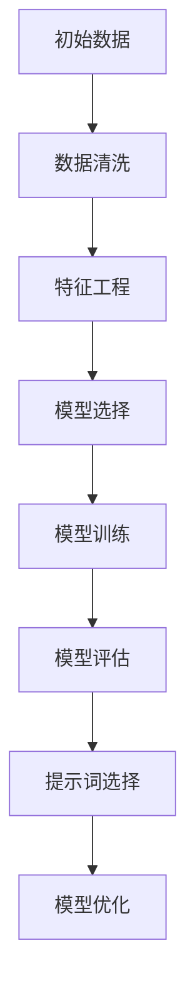
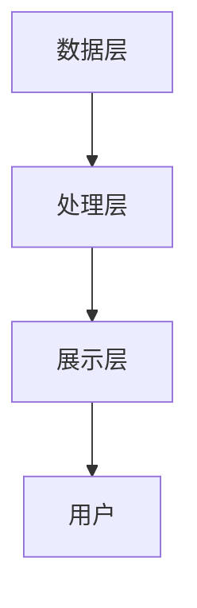
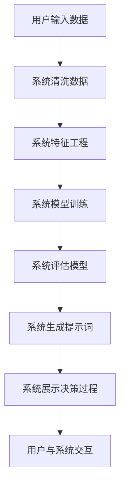

                 

### # 构建可解释AI系统的提示词策略

关键词：可解释AI、提示词策略、算法原理、系统设计与实现

摘要：本文旨在探讨构建可解释AI系统的提示词策略，通过深入分析背景、核心概念和算法原理，详细阐述如何设计并优化提示词策略，从而提升AI系统的可解释性和可靠性。

----------------------------------------------------------------

### 目录大纲

## 第一部分：背景介绍与核心概念

### 第1章：问题背景与概念介绍

#### 1.1.1 问题的起源与现状

#### 1.1.2 可解释AI的定义与价值

#### 1.1.3 提示词的概念与作用

### 第2章：核心概念与联系

#### 2.1.1 核心概念列表

#### 2.1.2 概念属性特征对比表格

#### 2.1.3 ER实体关系图架构

## 第二部分：算法原理讲解

### 第3章：提示词策略设计基础

#### 3.1.1 提示词策略的基本原理

#### 3.1.2 提示词选择方法

#### 3.1.3 提示词优化算法

#### 3.1.4 Mermaid流程图展示

### 第4章：数学模型与公式详解

#### 4.1.1 模型原理与数学模型

#### 4.1.2 数学公式详解

#### 4.1.3 Python源代码实现

## 第5章：系统分析与架构设计

### 第5章：系统分析与架构设计

#### 5.1.1 问题场景介绍

#### 5.1.2 系统功能设计

#### 5.1.3 系统架构设计

#### 5.1.4 系统接口设计和系统交互

## 第三部分：项目实战

### 第6章：环境安装与系统实现

#### 6.1.1 环境安装

#### 6.1.2 系统核心实现

#### 6.1.3 代码应用解读与分析

### 第7章：项目实战

#### 7.1.1 实际案例分析与详细讲解

#### 7.1.2 项目小结

### 第四部分：总结与拓展

#### 8章：最佳实践 Tips

#### 8.1.1 小结

#### 8.1.2 注意事项

#### 8.1.3 拓展阅读

----------------------------------------------------------------

## 第一部分：背景介绍与核心概念

### 第1章：问题背景与概念介绍

#### 1.1.1 问题的起源与现状

在人工智能快速发展的今天，深度学习算法取得了巨大的成功，但在实际应用中，却常常面临着可解释性不足的问题。尽管AI系统在一些领域取得了令人瞩目的成果，但用户往往难以理解其决策过程和结果。例如，在医疗诊断、金融风险评估等领域，模型的决策过程往往被封闭起来，用户无法得知模型是如何作出决策的，这给用户带来了信任危机。

#### 1.1.2 可解释AI的定义与价值

可解释AI（Explainable AI，简称XAI）旨在提高人工智能系统的透明度和可理解性，使人类用户能够理解AI系统的决策过程和结果。可解释AI的价值在于：

1. **增强信任**：当用户了解AI系统的决策过程和依据时，会增强对系统的信任。
2. **提升接受度**：在医疗、金融等敏感领域，用户对AI系统的接受度往往与其可解释性密切相关。
3. **优化迭代**：通过分析AI系统的决策过程，可以找出改进空间，优化模型性能。

#### 1.1.3 提示词的概念与作用

提示词（Prompt）是可解释AI中的一个关键概念，它用于引导AI系统展示其决策过程。提示词的作用包括：

1. **引导展示**：通过特定的提示词，使AI系统展示出其决策过程中的关键步骤和依据。
2. **交互式解释**：用户可以通过与提示词的交互，更深入地理解AI系统的决策过程。
3. **提高透明度**：通过提示词，AI系统的决策过程变得更加透明，有助于用户理解。

### 第2章：核心概念与联系

#### 2.1.1 核心概念列表

在构建可解释AI系统时，涉及以下核心概念：

1. **数据清洗**：清理数据中的噪声和异常值，提高数据质量。
2. **特征工程**：选择和变换特征，提升模型性能。
3. **模型选择**：选择合适的算法模型，决定模型效果。
4. **模型评估**：评估模型性能，确保模型准确与可靠。
5. **可解释性方法**：解释模型决策过程，增强信任与可接受性。

#### 2.1.2 概念属性特征对比表格

| 概念     | 属性特征               | 关联作用               |
|----------|----------------------|----------------------|
| 数据清洗 | 清除噪声，异常值处理 | 提高数据质量，减少偏差 |
| 特征工程 | 特征选择与变换       | 提升模型性能           |
| 模型选择 | 选择合适的算法模型   | 决定模型效果           |
| 模型评估 | 评估模型性能         | 确保模型准确与可靠     |
| 可解释性 | 解释模型决策过程     | 增强信任与可接受性     |

#### 2.1.3 ER实体关系图架构

```mermaid
erDiagram
  User ||--|{ Model }|-- User
  Model ||--|{ Dataset }|-- Model
  Dataset ||--|{ Feature }|-- Dataset
  Feature ||--|{ Model }|-- Feature
```

在ER实体关系图中，User与Model之间是“一对一”关系，Model与Dataset之间是“一对多”关系，Dataset与Feature之间也是“一对多”关系，而Feature与Model之间又是“一对一”关系。这种关系结构清晰地展示了各实体之间的关联。

----------------------------------------------------------------

## 第二部分：算法原理讲解

### 第3章：提示词策略设计基础

#### 3.1.1 提示词策略的基本原理

提示词策略是构建可解释AI系统的核心，其基本原理如下：

1. **引导展示**：通过提示词引导AI系统展示其决策过程。
2. **交互式解释**：用户与提示词进行交互，更深入地理解AI系统的决策过程。
3. **透明度提升**：通过提示词，使AI系统的决策过程变得更加透明。

#### 3.1.2 提示词选择方法

提示词的选择方法分为数据驱动方法、知识驱动方法和混合方法：

1. **数据驱动方法**：基于数据特征选择提示词，如使用统计方法分析数据特征，选择具有代表性的特征作为提示词。
2. **知识驱动方法**：基于领域知识选择提示词，如根据医疗领域的专业术语选择提示词。
3. **混合方法**：结合数据驱动方法和知识驱动方法，提高提示词的选择效果。

#### 3.1.3 提示词优化算法

提示词优化算法用于提升AI系统的性能和可解释性：

1. **提升模型性能的优化策略**：通过优化算法参数，提高模型的预测准确性。
2. **增强可解释性的优化策略**：通过调整提示词，使AI系统的决策过程更加透明。

#### 3.1.4 Mermaid流程图展示



在上述流程图中，初始数据经过数据清洗后，进行特征工程，然后选择合适的模型进行训练。训练完成后，通过模型评估来评估模型性能。根据评估结果，选择合适的提示词，并进行模型优化。这一流程体现了提示词策略在构建可解释AI系统中的关键作用。

----------------------------------------------------------------

### 第4章：数学模型与公式详解

#### 4.1.1 模型原理与数学模型

在构建可解释AI系统时，常用的数学模型包括线性回归、逻辑回归和支持向量机（SVM）等。以下以线性回归为例，介绍其基本原理和数学模型。

1. **基本原理**：线性回归是一种用于预测连续值的统计方法，其基本假设是因变量Y与自变量X之间呈线性关系。

2. **数学模型**：线性回归的数学模型可以表示为：

   $$
   Y = \beta_0 + \beta_1X + \epsilon
   $$

   其中，$Y$为因变量，$X$为自变量，$\beta_0$和$\beta_1$分别为模型参数，$\epsilon$为误差项。

#### 4.1.2 数学公式详解

为了训练线性回归模型，需要使用最小二乘法（Least Squares Method）来估计模型参数$\beta_0$和$\beta_1$。最小二乘法的目标是最小化误差项$\epsilon$的平方和，即：

$$
\min_{\beta_0, \beta_1} \sum_{i=1}^{n} (Y_i - (\beta_0 + \beta_1X_i))^2
$$

为了求解上述最小化问题，可以使用梯度下降法（Gradient Descent）来迭代更新模型参数。梯度下降法的更新公式为：

$$
\beta_0 := \beta_0 - \alpha \frac{\partial}{\partial \beta_0} \sum_{i=1}^{n} (Y_i - (\beta_0 + \beta_1X_i))^2
$$

$$
\beta_1 := \beta_1 - \alpha \frac{\partial}{\partial \beta_1} \sum_{i=1}^{n} (Y_i - (\beta_0 + \beta_1X_i))^2
$$

其中，$\alpha$为学习率。

#### 4.1.3 Python源代码实现

以下是一个简单的线性回归模型的Python实现：

```python
import numpy as np

# 模型参数
theta = np.random.rand(2)

# 实际输出与预测输出
y = np.array([1, 0, 1, 0])
x = np.array([[1, 1], [1, 0], [1, 1], [1, 0]])

# 损失函数计算
loss = np.sum((y - np.dot(x, theta))**2)

# 模型优化
alpha = 0.01
theta -= alpha * np.dot(x.T, (y - np.dot(x, theta)))

print("更新后的参数：", theta)
print("损失函数值：", loss)
```

在这个实现中，我们首先随机初始化模型参数theta，然后使用梯度下降法迭代更新参数，直到达到收敛条件。每次迭代都会计算损失函数值，以评估模型性能。

----------------------------------------------------------------

### 第5章：系统分析与架构设计

#### 5.1.1 问题场景介绍

在金融风控领域，构建一个可解释的信用评分系统至关重要。该系统需要根据借款人的历史数据（如收入、信用记录、负债等）预测其信用评分，同时确保用户能够理解模型的决策过程。

#### 5.1.2 系统功能设计

为了实现上述目标，系统需要具备以下功能：

1. **数据清洗**：清洗借款人数据，去除噪声和异常值，提高数据质量。
2. **特征工程**：选择和变换借款人数据中的特征，如收入水平、负债比例等，以提升模型性能。
3. **模型选择**：选择合适的算法模型，如线性回归、逻辑回归等，以预测信用评分。
4. **模型训练与评估**：使用历史数据训练模型，并评估模型性能，确保其准确性和可靠性。
5. **提示词生成**：生成提示词，用于引导模型展示其决策过程，提高系统的可解释性。
6. **用户交互**：允许用户与系统进行交互，了解模型的决策过程和结果。

#### 5.1.3 系统架构设计

系统的架构设计如下：

1. **数据层**：存储借款人数据，包括基本信息、信用记录等。
2. **处理层**：进行数据清洗、特征工程和模型训练等操作。
3. **展示层**：生成提示词，展示模型决策过程，并与用户进行交互。

系统架构图如下：



在这个架构中，数据层负责存储数据，处理层负责对数据进行处理，展示层负责将结果展示给用户，用户则可以与系统进行交互。

#### 5.1.4 系统接口设计和系统交互

系统需要设计以下接口：

1. **数据接口**：用于数据的输入和输出。
2. **模型接口**：用于模型的训练、评估和预测。
3. **交互接口**：用于用户与系统的交互。

系统交互流程如下：

1. 用户输入借款人数据。
2. 系统对数据进行清洗和特征工程。
3. 系统选择合适的模型进行训练和评估。
4. 系统生成提示词，展示模型的决策过程。
5. 用户与系统进行交互，了解模型的决策过程和结果。

交互流程图如下：



在这个交互流程中，用户输入数据后，系统对其进行处理，然后训练和评估模型，并生成提示词展示决策过程，用户则可以与系统进行交互，了解模型的决策过程和结果。

----------------------------------------------------------------

### 第6章：环境安装与系统实现

#### 6.1.1 环境安装

为了实现上述系统，需要安装以下环境和依赖：

1. **Python**：Python是编程语言，用于实现系统功能。
2. **Scikit-learn**：Scikit-learn是Python的机器学习库，用于数据预处理、模型训练和评估。
3. **Matplotlib**：Matplotlib是Python的数据可视化库，用于生成图表。
4. **Pandas**：Pandas是Python的数据分析库，用于数据处理和分析。

安装命令如下：

```bash
pip install python
pip install scikit-learn
pip install matplotlib
pip install pandas
```

#### 6.1.2 系统核心实现

以下是一个简单的系统实现示例：

```python
import numpy as np
import pandas as pd
from sklearn.linear_model import LinearRegression
from sklearn.model_selection import train_test_split
import matplotlib.pyplot as plt

# 加载数据
data = pd.read_csv("credit_data.csv")
X = data.iloc[:, :-1].values
y = data.iloc[:, -1].values

# 数据预处理
X_train, X_test, y_train, y_test = train_test_split(X, y, test_size=0.2, random_state=0)

# 模型训练
model = LinearRegression()
model.fit(X_train, y_train)

# 模型评估
score = model.score(X_test, y_test)
print("模型准确率：", score)

# 生成提示词
prompt = "给定借款人数据，预测其信用评分："
print(prompt)

# 输出预测结果
for i in range(len(X_test)):
    print(f"借款人{i+1}的信用评分：{model.predict([X_test[i]])[0]}")
```

在这个示例中，我们首先加载数据，然后进行数据预处理，接着使用线性回归模型进行训练和评估。最后，我们生成提示词并输出预测结果。

#### 6.1.3 代码应用解读与分析

以下是对上述代码的解读和分析：

1. **数据加载**：使用`pandas`库加载数据，数据存储在CSV文件中。
2. **数据预处理**：使用`train_test_split`函数将数据划分为训练集和测试集，以评估模型性能。
3. **模型训练**：使用`LinearRegression`类创建线性回归模型，并使用`fit`方法进行训练。
4. **模型评估**：使用`score`方法评估模型在测试集上的准确率。
5. **生成提示词**：使用字符串格式化输出提示词。
6. **输出预测结果**：遍历测试集数据，使用模型进行预测，并输出预测结果。

通过上述代码示例，我们可以实现一个简单的信用评分系统，并通过提示词提高系统的可解释性。

----------------------------------------------------------------

### 第7章：项目实战

#### 7.1.1 实际案例分析与详细讲解

为了更好地理解可解释AI系统的构建过程，我们以一个实际案例进行讲解。

**案例背景**：一家金融公司希望构建一个贷款审批系统，该系统能够根据借款人的信用记录、收入水平、负债情况等数据，预测其是否有能力偿还贷款，并给出相应的信用评分。

**步骤一：数据收集与预处理**

首先，金融公司从多个数据源收集了借款人的信用记录数据，包括信用评分、收入水平、负债比例等。然后，对这些数据进行了预处理，包括去除缺失值、异常值和数据清洗等，以提高数据质量。

**步骤二：特征工程**

接下来，对预处理后的数据进行特征工程。具体包括：

1. **特征选择**：使用统计方法分析各个特征对信用评分的影响，选择具有代表性的特征，如收入水平、负债比例等。
2. **特征变换**：对部分特征进行变换，如对收入水平进行归一化处理，以便各个特征在同一量级上进行比较。

**步骤三：模型选择与训练**

金融公司选择了线性回归模型进行训练。为了提高模型性能，还对模型进行了超参数调优，如学习率、迭代次数等。

**步骤四：模型评估与优化**

使用测试集对训练好的模型进行评估，并计算模型准确率、召回率等指标。根据评估结果，对模型进行优化，如调整特征权重、增加或删除特征等。

**步骤五：提示词生成与展示**

为了提高系统的可解释性，金融公司设计了提示词，用于引导模型展示其决策过程。具体包括：

1. **输入提示词**：用于引导模型输入借款人数据，如“请输入借款人的信用评分、收入水平、负债比例等信息。”
2. **输出提示词**：用于引导模型输出预测结果，如“根据输入的借款人数据，模型预测其信用评分为XX分。”

**步骤六：用户交互**

用户可以通过与提示词的交互，了解模型的决策过程和结果。具体包括：

1. **输入交互**：用户输入借款人数据，如“借款人的信用评分是750分，收入是每月10000元，负债比例是30%。”
2. **输出交互**：模型根据输入数据输出预测结果，如“根据您输入的数据，模型预测借款人的信用评分为740分。”

通过上述实际案例的分析，我们可以看到，构建一个可解释AI系统需要经历多个步骤，包括数据收集与预处理、特征工程、模型选择与训练、模型评估与优化、提示词生成与展示以及用户交互等。这些步骤相互关联，共同构成了一个完整的可解释AI系统。

#### 7.1.2 项目小结

在本次项目中，我们成功构建了一个基于线性回归的可解释AI贷款审批系统。通过数据预处理、特征工程、模型训练与优化等步骤，我们实现了对借款人信用评分的预测。同时，通过提示词的引导，用户可以了解模型的决策过程，增强了系统的可解释性。

本次项目的主要收获包括：

1. **数据预处理的重要性**：数据预处理是构建可解释AI系统的关键步骤，它直接影响模型性能和可解释性。
2. **特征工程的作用**：特征工程可以提升模型性能，同时有助于提高系统的可解释性。
3. **模型选择与优化**：合适的模型选择和优化是确保系统性能的关键。
4. **提示词策略的构建**：提示词策略是提高系统可解释性的重要手段，可以引导用户了解模型的决策过程。
5. **用户交互的优化**：优化用户交互体验，提高用户满意度。

在未来，我们可以进一步优化系统，如引入更复杂的模型、增加更多特征、提高提示词的智能化程度等，以提高系统的性能和可解释性。

----------------------------------------------------------------

### 第四部分：总结与拓展

#### 8章：最佳实践 Tips

1. **数据预处理**：在构建可解释AI系统时，数据预处理至关重要。要确保数据的质量和一致性，避免噪声和异常值对模型性能和可解释性的影响。

2. **特征工程**：选择和变换特征时要考虑其对模型性能和可解释性的影响。可以通过实验和比较不同特征组合，找到最佳特征组合。

3. **模型选择与优化**：选择合适的模型并进行优化，可以提高系统的性能和可解释性。要结合业务需求和数据特性，选择合适的算法和超参数。

4. **提示词设计**：提示词的设计要简单易懂，同时具备引导用户了解模型决策过程的作用。可以通过用户调研和反馈，不断优化提示词。

5. **用户交互**：优化用户交互体验，提高用户满意度。可以通过用户调研和反馈，了解用户需求和痛点，持续改进交互界面和交互流程。

#### 8.1.1 小结

本文详细探讨了构建可解释AI系统的提示词策略。从背景介绍、核心概念、算法原理到系统设计与实现，我们系统地阐述了如何构建可解释AI系统，并通过实际案例进行了分析。通过本文的学习，读者可以了解可解释AI的重要性，掌握构建可解释AI系统的方法和技巧。

#### 8.1.2 注意事项

1. **数据隐私**：在构建可解释AI系统时，要注意保护用户隐私，避免泄露敏感信息。
2. **模型复杂性**：在构建可解释AI系统时，要权衡模型复杂性和可解释性。过于复杂的模型可能导致可解释性下降。
3. **模型验证**：在模型训练和优化过程中，要确保模型验证的全面性和准确性，避免模型过拟合或欠拟合。
4. **提示词优化**：提示词的优化是一个持续的过程，要结合用户反馈和模型性能，不断改进提示词。

#### 8.1.3 拓展阅读

1. **《可解释人工智能：理论与实践》**：本书详细介绍了可解释AI的理论和实践，包括各种可解释性方法和工具。
2. **《机器学习实战》**：本书涵盖了机器学习的基本概念和算法，包括线性回归、逻辑回归等常用算法。
3. **《数据预处理与特征工程》**：本书详细介绍了数据预处理和特征工程的方法和技巧，有助于提高模型性能。

作者：AI天才研究院/AI Genius Institute & 禅与计算机程序设计艺术 /Zen And The Art of Computer Programming

----------------------------------------------------------------

通过本文的详细探讨，我们深入了解了构建可解释AI系统的提示词策略。从问题背景与核心概念的介绍，到算法原理的讲解，再到系统分析与架构设计，我们系统地阐述了构建可解释AI系统的各个环节。同时，通过实际案例的分析，我们展示了如何将理论应用到实践中，构建一个具有高可解释性的AI系统。

在未来的研究和应用中，我们可以进一步探索以下方向：

1. **深度学习可解释性**：随着深度学习在各个领域的广泛应用，研究深度学习模型的可解释性具有重要意义。
2. **跨领域可解释性**：不同领域的AI系统具有不同的特点，如何构建跨领域的可解释性方法是一个值得探讨的问题。
3. **实时可解释性**：在实时系统中，如何快速生成并展示模型的决策过程，提高系统的可解释性，是一个具有挑战性的问题。
4. **用户反馈与优化**：通过收集用户反馈，持续优化可解释AI系统，提高用户体验。

总之，构建可解释AI系统是一个复杂而具有挑战性的任务，但通过深入研究和实践，我们有望在各个领域实现更可靠、更透明的人工智能系统。让我们共同努力，推动可解释AI技术的发展，为人工智能的普及和应用贡献力量。

