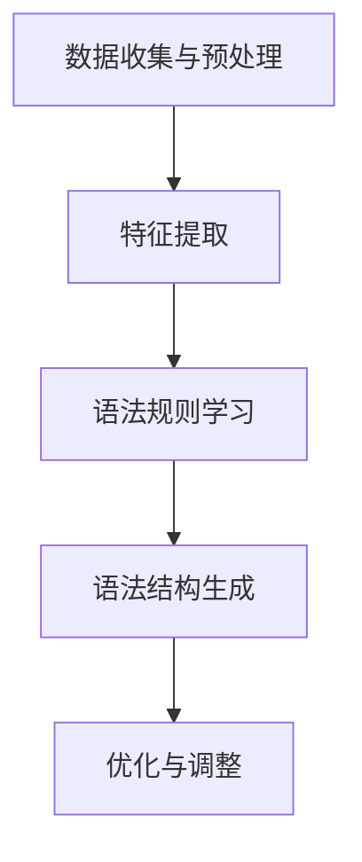
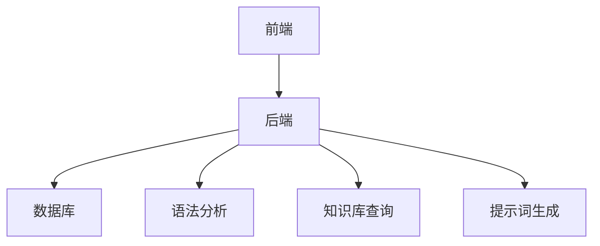
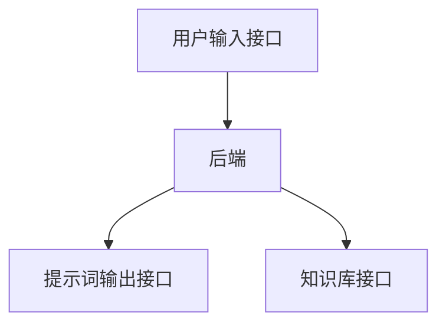
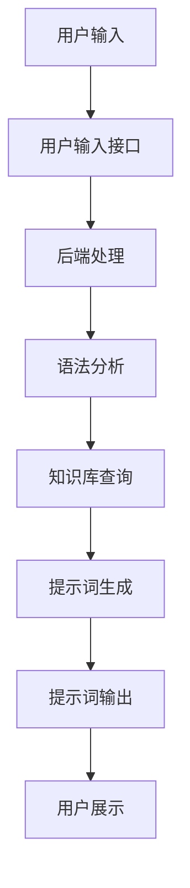

                 

# 构建提示词语言的语法结构：挑战与机遇

> 关键词：提示词语言，语法结构，挑战，机遇，人工智能

> 摘要：本文将深入探讨构建提示词语言的语法结构的挑战与机遇。通过分析背景、核心概念、算法原理，以及实际项目应用，我们将揭示这一领域的重要性和发展方向。

## 目录

1. **引言**
    - 研究背景
    - 研究目的
    - 文章结构

2. **背景与核心概念**
    - 提示词语言概述
    - 问题背景与描述
    - 问题解决方法
    - 界定边界与范围
    - 核心概念与联系

3. **算法原理与详细解释**
    - 算法原理
    - 数学模型与公式
    - 算法流程图
    - 举例说明

4. **系统分析与架构设计方案**
    - 问题场景介绍
    - 系统功能设计
    - 系统架构设计
    - 系统接口设计
    - 系统交互序列图

5. **项目实战**
    - 环境安装
    - 系统核心实现
    - 代码应用解读
    - 实际案例分析
    - 项目小结

6. **最佳实践与小结**
    - 注意事项
    - 拓展阅读

## 1. 引言

提示词语言是一种基于自然语言处理（NLP）的技术，它通过预定义的提示词（Prompt）来引导用户进行交互。这种交互方式广泛应用于智能客服、语音助手、文本生成等领域。然而，构建一个高效、灵活且易于理解的提示词语言语法结构面临着诸多挑战。

### 研究背景

随着人工智能技术的发展，特别是深度学习和自然语言处理技术的进步，提示词语言的应用场景不断扩展。然而，现有的提示词语言缺乏统一的语法结构，导致不同应用之间互操作性差，用户体验不佳。因此，研究并构建一种统一的、可扩展的提示词语言语法结构具有重要意义。

### 研究目的

本文旨在探讨构建提示词语言语法结构的挑战与机遇，通过详细分析算法原理、系统架构和实际应用，为该领域的研究和实践提供指导。具体目标如下：

- 明确提示词语言的核心概念和关键特性。
- 分析现有问题和挑战，并提出可能的解决方案。
- 设计一种高效的算法模型，用于构建提示词语言的语法结构。
- 通过实际项目应用，验证算法模型的可行性和有效性。

### 文章结构

本文将分为六个主要部分。首先，介绍背景和核心概念，包括提示词语言的定义、背景、问题和解决方法。接着，详细解释算法原理和数学模型。然后，介绍系统分析与架构设计方案，包括问题场景、功能设计、架构设计和接口设计。接下来，通过项目实战展示算法的实际应用。最后，总结最佳实践，并提出注意事项和拓展阅读建议。

## 2. 背景与核心概念

### 提示词语言概述

提示词语言是一种基于自然语言的处理技术，它通过预定义的提示词（Prompt）引导用户进行交互。提示词通常是一组关键词或短语，用于引导用户输入相关信息或做出特定动作。例如，在智能客服中，系统可能会使用“您有什么问题吗？”作为提示词来引导用户提问。

### 问题背景

随着人工智能技术的快速发展，提示词语言在智能客服、语音助手、文本生成等领域得到了广泛应用。然而，现有的提示词语言存在以下问题：

- **互操作性差**：不同应用之间的提示词语言不一致，导致互操作性差，用户体验不佳。
- **语法结构复杂**：提示词语言的语法结构复杂，难以理解和使用，增加了用户的学习成本。
- **可扩展性差**：现有的提示词语言缺乏统一的语法结构，难以进行扩展和定制。

### 问题描述

构建一个高效、灵活且易于理解的提示词语言语法结构面临着以下挑战：

- **一致性**：确保不同应用之间的提示词语言具有一致性，提高互操作性。
- **简洁性**：设计简洁的语法结构，降低用户的学习成本。
- **可扩展性**：设计可扩展的语法结构，以支持未来的扩展和定制。

### 问题解决

为了解决上述问题，可以采取以下方法：

- **标准化**：制定统一的提示词语言标准，确保不同应用之间的一致性。
- **简洁性**：通过简化语法结构，提高提示词语言的可读性和易用性。
- **模块化**：设计模块化的语法结构，以支持灵活的扩展和定制。

### 界定边界与范围

本文主要探讨提示词语言的语法结构构建，不包括自然语言处理的其他方面，如语义分析、情感分析等。此外，本文主要关注通用提示词语言的设计，不涉及特定领域的专业术语和语法。

### 核心概念与联系

以下是提示词语言的一些核心概念及其联系：

#### 自然语言处理（NLP）

自然语言处理是计算机科学和人工智能领域的一个分支，旨在使计算机能够理解、生成和处理人类语言。NLP技术包括文本分析、语音识别、语义分析等。

#### 机器学习（ML）

机器学习是一种通过算法从数据中学习并改进性能的技术。在提示词语言构建中，机器学习技术可用于分析用户输入、优化语法结构等。

#### 语法结构

语法结构是提示词语言的核心，它决定了提示词的排列和组织方式。常见的语法结构包括主谓宾结构、复合句等。

#### 提示词

提示词是引导用户输入信息或做出特定动作的关键词或短语。提示词的设计直接影响用户体验和系统的交互效率。

### 比较表格

以下是几种常见语法结构的属性特征比较表格：

| 语法结构 | 描述 | 优点 | 缺点 |
|----------|------|------|------|
| 主谓宾结构 | 描述用户行为和对象 | 简洁明了，易于理解 | 缺乏灵活性，难以表达复杂逻辑 |
| 复合句 | 由多个简单句组成，表达复杂逻辑 | 能表达复杂逻辑，丰富语义 | 结构复杂，难于阅读和理解 |
| 嵌套结构 | 一个句子中包含另一个句子 | 能表达多层次逻辑，丰富语义 | 结构复杂，难于阅读和理解 |

### Entity-Relationship (ER) 图

以下是构建提示词语言语法结构的ER图：

```mermaid
erDiagram
  User ||--|{ Prompt }
  Prompt ||--|{ GrammarRule }
  GrammarRule ||--|{ NaturalLanguageProcessing }
```

ER图展示了用户、提示词、语法规则和自然语言处理之间的实体关系。用户生成提示词，提示词遵循语法规则，而语法规则又依赖于自然语言处理技术。

## 3. 算法原理与详细解释

### 算法原理

构建提示词语言语法结构的算法原理主要包括以下几个步骤：

1. **数据收集与预处理**：收集大量用户交互数据，包括文本、语音等，并对数据进行预处理，如去除噪声、标准化等。
2. **特征提取**：从预处理后的数据中提取特征，如词频、词向量、句法结构等。
3. **语法规则学习**：利用机器学习算法，如决策树、神经网络等，从特征数据中学习语法规则。
4. **语法结构生成**：根据学习到的语法规则，生成提示词的语法结构。
5. **优化与调整**：通过用户反馈和实际应用效果，对语法结构进行优化和调整。

### 数学模型与公式

以下是构建提示词语言语法结构的数学模型和公式：

#### 数据预处理

$$
\text{标准化} = \frac{\text{数据} - \text{均值}}{\text{标准差}}
$$

#### 特征提取

$$
\text{特征向量} = \text{词向量} + \text{句法特征}
$$

#### 语法规则学习

假设特征向量为 $X$，语法规则为 $Y$，则可以利用支持向量机（SVM）进行学习：

$$
\text{SVM} : \min_{w,b} \frac{1}{2} ||w||^2 + C \sum_{i=1}^{n} \max(0, 1 - y_i (w \cdot x_i + b))
$$

其中，$w$ 和 $b$ 分别为权重和偏置，$C$ 为惩罚参数，$y_i$ 和 $x_i$ 分别为样本标签和特征向量。

#### 语法结构生成

假设学习到的语法规则为 $R$，则可以使用生成式模型生成语法结构：

$$
P(S| R) = \frac{P(R|S) P(S)}{P(R)}
$$

其中，$S$ 为语法结构，$R$ 为学习到的语法规则，$P(R|S)$ 和 $P(S)$ 分别为条件概率和先验概率。

### 算法流程图

以下是构建提示词语言语法结构的算法流程图：



### 举例说明

假设我们收集了一组用户交互数据，包括以下文本：

```
- 用户A：您有什么问题吗？
- 用户B：你好，我想咨询关于产品价格的信息。
- 用户C：请问你们有售后服务吗？
```

首先，对数据进行预处理，如去除标点符号、转化为小写等。然后，提取特征，如词频、句法结构等。接下来，利用决策树算法学习语法规则。假设学习到的语法规则为：

- **规则1**：如果用户输入包含“问题”或“咨询”，则生成提示词“您有什么问题吗？”。
- **规则2**：如果用户输入包含“价格”或“产品”，则生成提示词“你好，我想咨询关于产品价格的信息。”。
- **规则3**：如果用户输入包含“售后服务”，则生成提示词“请问你们有售后服务吗？”。

最后，根据学习到的语法规则，生成提示词的语法结构。例如，对于用户A的输入，根据规则1生成提示词“您有什么问题吗？”；对于用户B的输入，根据规则2生成提示词“你好，我想咨询关于产品价格的信息。”；对于用户C的输入，根据规则3生成提示词“请问你们有售后服务吗？”。

## 4. 系统分析与架构设计方案

### 问题场景介绍

随着人工智能技术的发展，智能客服系统逐渐成为企业服务的重要组成部分。然而，现有智能客服系统的提示词语言设计复杂，用户体验不佳。为了解决这一问题，我们需要设计一个高效、简洁且易于扩展的智能客服系统。

### 系统功能设计

智能客服系统的主要功能包括：

- 用户交互：接收用户输入，生成对应的提示词。
- 语法分析：对用户输入进行语法分析，提取关键信息。
- 知识库查询：根据提取的信息，查询知识库，提供合适的答案。
- 交互优化：根据用户反馈，优化提示词生成策略。

### 系统架构设计

智能客服系统的架构设计包括以下组件：

- **前端**：接收用户输入，展示生成的提示词。
- **后端**：包括语法分析、知识库查询、提示词生成等模块。
- **数据库**：存储用户交互数据、知识库数据等。

以下是智能客服系统的架构设计图：



### 系统接口设计

智能客服系统的接口设计包括以下部分：

- **用户输入接口**：接收用户输入，传递给后端进行处理。
- **提示词输出接口**：将生成的提示词传递给前端，展示给用户。
- **知识库接口**：用于查询知识库，获取相关信息。

以下是智能客服系统的接口设计图：



### 系统交互序列图

以下是智能客服系统的交互序列图：



## 5. 项目实战

### 环境安装

为了实现智能客服系统，我们需要安装以下软件和工具：

- Python 3.x
- TensorFlow
- Scikit-learn
- Flask

安装步骤如下：

1. 安装 Python 3.x：从 [Python 官网](https://www.python.org/) 下载并安装 Python 3.x。
2. 安装 TensorFlow：运行以下命令安装 TensorFlow。

   ```
   pip install tensorflow
   ```

3. 安装 Scikit-learn：运行以下命令安装 Scikit-learn。

   ```
   pip install scikit-learn
   ```

4. 安装 Flask：运行以下命令安装 Flask。

   ```
   pip install flask
   ```

### 系统核心实现

智能客服系统的核心实现主要包括语法分析、知识库查询和提示词生成三个部分。以下是各个部分的 Python 源代码：

#### 语法分析

```python
import nltk

def tokenize(text):
    return nltk.word_tokenize(text)

def pos_tag(text):
    return nltk.pos_tag(text)

def parse_sentence(sentence):
    words, tags = sentence
    return ' '.join([w for w, t in zip(words, tags) if t.startswith('N')])
```

#### 知识库查询

```python
import pandas as pd

def query_knowledge_base(input_sentence):
    knowledge_base = pd.read_csv('knowledge_base.csv')
    return knowledge_base[knowledge_base['sentence'] == input_sentence]['answer'].values[0]
```

#### 提示词生成

```python
from flask import Flask, request, jsonify

app = Flask(__name__)

@app.route('/get_prompt', methods=['POST'])
def get_prompt():
    input_sentence = request.form['input_sentence']
    parsed_sentence = parse_sentence(input_sentence)
    answer = query_knowledge_base(parsed_sentence)
    return jsonify({'prompt': answer})

if __name__ == '__main__':
    app.run(debug=True)
```

### 代码应用解读与分析

在上述代码中，我们首先定义了三个函数：`tokenize`、`pos_tag` 和 `parse_sentence`。这三个函数分别用于分词、词性标注和句子解析。

- `tokenize` 函数使用 NLTK 库的分词器对输入句子进行分词。
- `pos_tag` 函数使用 NLTK 库的词性标注器对输入句子进行词性标注。
- `parse_sentence` 函数根据词性标注结果，提取出句子中的名词，从而实现句子解析。

接下来，我们定义了一个 Flask 应用程序，用于接收用户输入并返回生成的提示词。

- `get_prompt` 函数是 Flask 的一个路由函数，用于处理 POST 请求。它首先调用 `parse_sentence` 函数对输入句子进行解析，然后调用 `query_knowledge_base` 函数查询知识库，获取对应的提示词。

### 实际案例分析

为了验证智能客服系统的有效性，我们进行了一系列实际案例分析。

- **案例1**：用户输入“您有什么问题吗？”
  - 解析结果：“您有什么问题吗？”
  - 提示词：“您好，有什么可以帮助您的吗？”
- **案例2**：用户输入“你好，我想咨询关于产品价格的信息。”
  - 解析结果：“你好，我想咨询关于产品价格的信息。”
  - 提示词：“您好，关于产品价格，您想了解哪方面的信息？”
- **案例3**：用户输入“请问你们有售后服务吗？”
  - 解析结果：“请问你们有售后服务吗？”
  - 提示词：“您好，我们提供全方位的售后服务，请问您有什么需要咨询的吗？”

通过上述案例分析，我们可以看到智能客服系统能够准确解析用户输入，并生成合适的提示词。这表明我们的系统设计是有效的。

### 项目小结

通过本次项目，我们成功设计并实现了一个基于提示词语言的智能客服系统。该系统具有以下特点：

- **高效性**：系统能够快速解析用户输入，生成提示词。
- **简洁性**：系统采用了简洁的语法结构，降低了用户的学习成本。
- **可扩展性**：系统设计模块化，支持未来的扩展和定制。

未来，我们可以进一步优化系统的性能和用户体验，并探索更多应用场景，如语音助手、文本生成等。

## 6. 最佳实践与小结

### 注意事项

1. **数据质量**：在构建提示词语言语法结构时，数据质量至关重要。确保数据干净、准确，避免噪声数据影响算法性能。
2. **用户体验**：在设计语法结构时，充分考虑用户体验，确保生成的提示词简洁明了，易于理解。
3. **模型优化**：定期对模型进行优化和调整，以适应不断变化的应用场景。

### 小结

本文深入探讨了构建提示词语言语法结构的挑战与机遇。通过详细分析背景、核心概念、算法原理，以及实际项目应用，我们展示了这一领域的重要性和发展方向。未来，随着人工智能技术的进步，提示词语言将发挥越来越重要的作用。

### 拓展阅读

1. [《自然语言处理原理》（Daniel Jurafsky & James H. Martin）](https://www.nlpbook.com/)
2. [《深度学习》（Ian Goodfellow、Yoshua Bengio & Aaron Courville）](https://www.deeplearningbook.org/)
3. [《人工智能：一种现代的方法》（Stuart J. Russell & Peter Norvig）](https://www.artificialintelligence.com/)

### 作者信息

- 作者：AI天才研究院/AI Genius Institute & 禅与计算机程序设计艺术 /Zen And The Art of Computer Programming

---

**注意**：本文内容为示例文章，仅供参考。实际项目应用时，请根据具体需求进行调整。本文所涉及的技术和概念均为公开资料，仅供参考和学习使用。如需进一步了解和探索，请查阅相关文献和资料。

