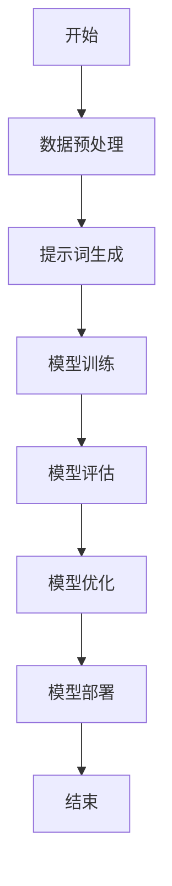
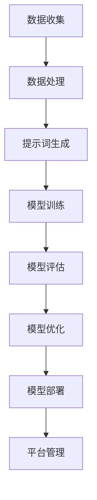
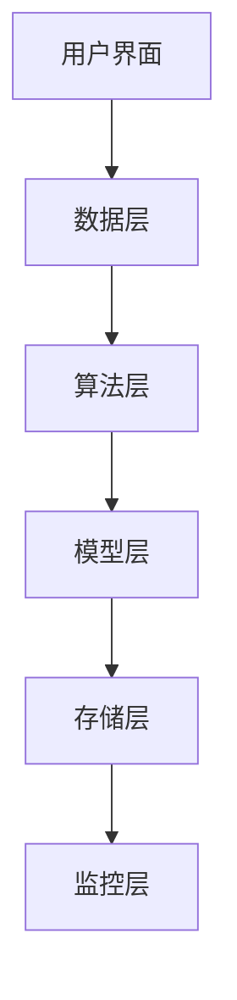
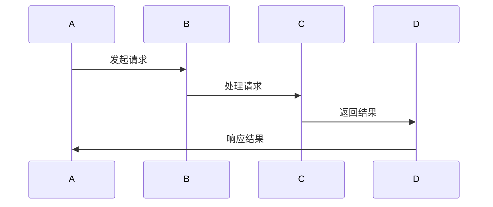

                 

## 《构建提示词驱动的AI开发平台》

> 关键词：AI开发平台、提示词驱动、算法原理、系统架构、项目实战

> 摘要：本文深入探讨了构建提示词驱动的AI开发平台的技术和方法。首先，介绍了AI技术发展的背景和提示词驱动的应用趋势，然后详细阐述了AI开发平台的基本概念、提示词驱动的算法原理及系统架构设计。最后，通过实际项目实战，展示了构建平台的具体步骤和关键技术，为AI开发提供了实用指导。

----------------------------------------------------------------

### 第一部分：背景介绍

#### 第1章：问题背景与问题描述

##### 1.1.1 问题背景

随着人工智能技术的迅猛发展，AI已经渗透到各行各业，从自动驾驶、智能语音识别到医疗诊断、金融风控，AI应用场景不断扩展。然而，AI的开发和部署面临着诸多挑战，如数据预处理、模型训练、评估和优化等。传统的人工智能开发平台往往功能单一，难以满足多样化、复杂化的AI应用需求。

##### 1.1.1.1 AI技术发展的现状

近年来，深度学习、强化学习、生成对抗网络等新兴算法的快速发展，使得AI技术取得了显著的进展。特别是在数据驱动的方法中，AI模型的性能和泛化能力得到了显著提升。然而，这些算法的开发和应用依然依赖于大量的计算资源和专业知识，普通开发者难以高效地进行AI项目开发。

##### 1.1.1.2 提示词驱动的AI应用趋势

提示词驱动是近年来兴起的一种AI开发方法，通过使用简洁的文本提示，引导AI模型进行学习和预测。这种方法能够简化AI模型的开发流程，提高开发效率，降低开发门槛。尤其是在自然语言处理、问答系统等领域，提示词驱动的应用趋势日益明显。

##### 1.1.1.3 构建AI开发平台的需求

为了满足日益增长的AI开发需求，构建一个提示词驱动的AI开发平台显得尤为必要。该平台需要具备以下功能：

1. **数据预处理**：提供数据清洗、数据增强等功能，确保输入数据的质量和一致性。
2. **模型训练**：支持多种深度学习框架，提供灵活的模型训练和优化工具。
3. **模型评估**：提供全面的模型评估工具，帮助开发者快速判断模型性能。
4. **提示词生成**：基于自然语言处理技术，自动生成高质量的提示词，辅助模型训练。
5. **平台管理**：提供用户管理、权限控制、日志记录等功能，确保平台的安全和稳定运行。

##### 1.1.2 问题描述

当前AI开发平台面临的主要问题包括：

1. **功能单一**：传统平台往往只支持单一功能的实现，难以满足多样化需求。
2. **开发门槛高**：AI开发需要专业知识，普通开发者难以高效进行项目开发。
3. **开发效率低**：传统开发流程繁琐，开发周期长，难以快速响应市场变化。
4. **平台集成度低**：不同平台之间难以无缝集成，导致资源浪费和效率降低。

##### 1.1.3 问题解决

构建一个提示词驱动的AI开发平台，旨在解决上述问题，提高AI开发效率和用户体验。具体解决方案包括：

1. **模块化设计**：将平台划分为多个功能模块，如数据预处理、模型训练、模型评估等，每个模块可独立开发、测试和部署。
2. **提示词驱动**：引入提示词生成模块，简化AI模型开发流程，降低开发门槛。
3. **集成化平台**：实现不同模块之间的无缝集成，提高资源利用率和开发效率。
4. **用户友好的界面**：提供简洁直观的用户界面，方便开发者进行操作和调试。

##### 1.1.4 边界与外延

构建提示词驱动的AI开发平台具有一定的适用范围和边界：

1. **适用范围**：适用于需要高效、灵活进行AI模型开发的场景，如自然语言处理、计算机视觉、推荐系统等。
2. **非适用边界**：对于依赖硬件资源较多的场景，如高性能计算、大规模数据处理等，该平台可能不太适用。
3. **概念结构与核心要素组成**：平台由数据层、算法层、模型层、存储层和监控层组成，各层之间通过接口进行交互。

#### 第2章：核心概念与联系

##### 2.1.1 AI开发平台的基本概念

AI开发平台是指一种提供全面支持人工智能模型开发、训练、评估和部署的工具集。其主要功能包括：

1. **数据预处理**：清洗、转换和增强输入数据，确保数据质量和一致性。
2. **模型训练**：支持多种深度学习框架，提供灵活的模型训练和优化工具。
3. **模型评估**：提供全面的模型评估工具，帮助开发者快速判断模型性能。
4. **提示词生成**：基于自然语言处理技术，自动生成高质量的提示词，辅助模型训练。
5. **平台管理**：提供用户管理、权限控制、日志记录等功能，确保平台的安全和稳定运行。

##### 2.1.2 提示词驱动的概念解析

提示词驱动是一种通过输入简洁的文本提示来引导AI模型学习和预测的方法。其主要特点包括：

1. **简洁性**：提示词通常是一段简短的文本，易于理解和记忆。
2. **灵活性**：提示词可以根据实际需求进行修改和调整，适应不同场景。
3. **高效性**：提示词能够加速模型训练和预测过程，提高开发效率。
4. **通用性**：提示词驱动方法适用于多种人工智能模型，如深度学习、生成对抗网络等。

##### 2.1.3 AI开发平台与提示词驱动的联系

AI开发平台与提示词驱动之间存在密切的联系：

1. **平台对提示词驱动的支持**：AI开发平台提供丰富的工具和资源，支持提示词驱动的实现。如自然语言处理模块、文本生成模块等。
2. **提示词驱动对平台的提升**：提示词驱动方法能够简化AI模型开发流程，提高平台的使用效率和用户体验。
3. **融合发展的趋势分析**：随着AI技术的不断发展和应用场景的扩大，提示词驱动将成为AI开发平台的重要方向。二者将相互促进，共同推动人工智能技术的发展。

##### 2.1.4 概念结构与核心要素组成

AI开发平台由以下核心要素组成：

1. **数据层**：负责数据的收集、清洗、转换和存储，提供高质量的数据支持。
2. **算法层**：提供多种深度学习算法和模型，支持模型训练、评估和优化。
3. **模型层**：存储和部署训练好的模型，提供模型推理和预测功能。
4. **存储层**：存储训练数据和模型参数，提供高效的数据访问和管理。
5. **监控层**：实时监控平台的运行状态，提供日志记录和异常报警功能。

这些核心要素通过接口进行交互，共同构成一个完整的AI开发平台。

----------------------------------------------------------------

### 第二部分：算法原理讲解

#### 第3章：提示词驱动的算法原理

##### 3.1.1 提示词驱动的算法框架

提示词驱动的算法框架主要包括以下基本流程：

1. **数据预处理**：对输入数据进行清洗、转换和增强，确保数据质量和一致性。
2. **提示词生成**：根据数据特点和任务需求，生成高质量的提示词。
3. **模型训练**：使用提示词和输入数据进行模型训练，调整模型参数。
4. **模型评估**：对训练好的模型进行评估，判断模型性能。
5. **模型优化**：根据评估结果，对模型进行优化，提高模型性能。
6. **模型部署**：将训练好的模型部署到生产环境，提供模型推理和预测服务。

##### 3.1.2 提示词驱动的数学模型

提示词驱动的数学模型可以表示为：

$$
\text{提示词驱动的数学模型} = \text{输入数据} + \text{提示词} + \text{神经网络模型}
$$

其中：

- 输入数据：表示需要进行处理的原始数据。
- 提示词：表示用于引导模型学习的文本信息。
- 神经网络模型：表示用于处理输入数据和提示词的神经网络结构。

##### 3.1.3 提示词驱动的流程图

使用Mermaid绘制提示词驱动的流程图如下：



##### 3.1.4 算法举例说明

以下是一个提示词驱动的算法示例：

1. **数据预处理**：假设我们有一组商品销售数据，包括商品ID、销售额和销售日期。我们需要对这些数据进行清洗和转换，如缺失值填充、数据标准化等。

2. **提示词生成**：根据销售数据和业务需求，生成提示词。例如，我们可以生成以下提示词：“最近一周销售的Top 10商品”、“销售额最高的商品类别”等。

3. **模型训练**：使用生成的提示词和销售数据进行模型训练。假设我们选择一个基于循环神经网络（RNN）的模型，对销售额进行预测。

4. **模型评估**：对训练好的模型进行评估，如计算预测误差、准确率等。

5. **模型优化**：根据评估结果，对模型进行优化，如调整学习率、增加训练数据等。

6. **模型部署**：将优化后的模型部署到生产环境，提供实时销售额预测服务。

通过这个示例，我们可以看到提示词驱动的方法如何简化AI模型的开发过程，提高开发效率。

----------------------------------------------------------------

#### 第4章：系统架构设计

##### 4.1.1 介绍系统架构设计

系统架构设计是构建一个高效、稳定、可扩展的AI开发平台的关键。在本章节中，我们将介绍系统架构设计的基本原则、功能模块划分、系统架构设计和系统接口设计。

##### 4.1.1.1 系统功能设计

AI开发平台的主要功能模块包括：

1. **数据收集模块**：负责收集各种来源的数据，如数据库、文件、API等。
2. **数据处理模块**：负责对收集到的数据进行清洗、转换和增强，确保数据质量和一致性。
3. **提示词生成模块**：负责生成高质量的提示词，辅助模型训练。
4. **模型训练模块**：负责使用提示词和输入数据进行模型训练，调整模型参数。
5. **模型评估模块**：负责对训练好的模型进行评估，判断模型性能。
6. **模型优化模块**：负责根据评估结果，对模型进行优化，提高模型性能。
7. **模型部署模块**：负责将训练好的模型部署到生产环境，提供模型推理和预测服务。
8. **平台管理模块**：负责用户管理、权限控制、日志记录等功能，确保平台的安全和稳定运行。

使用Mermaid绘制系统功能设计如下：



##### 4.1.1.2 系统架构设计

AI开发平台的系统架构设计可以分为以下几个层次：

1. **用户界面层**：提供简洁直观的用户界面，方便开发者进行操作和调试。
2. **数据层**：负责数据的收集、存储和管理，提供高质量的数据支持。
3. **算法层**：提供多种深度学习算法和模型，支持模型训练、评估和优化。
4. **模型层**：存储和部署训练好的模型，提供模型推理和预测功能。
5. **存储层**：存储训练数据和模型参数，提供高效的数据访问和管理。
6. **监控层**：实时监控平台的运行状态，提供日志记录和异常报警功能。

使用Mermaid绘制系统架构设计如下：



##### 4.1.1.3 系统接口设计

系统接口设计是确保各功能模块之间能够高效、稳定交互的关键。在本章节中，我们将介绍系统接口设计的原则和具体实现方法。

1. **RESTful API**：采用RESTful API设计，提供统一的接口规范，方便开发者进行调用。
2. **消息队列**：使用消息队列实现模块之间的异步通信，提高系统的并发处理能力。
3. **缓存机制**：采用缓存机制，提高数据访问速度，降低系统负载。
4. **日志记录**：采用日志记录机制，方便系统调试和问题排查。

##### 4.1.1.4 系统交互设计

系统交互设计是描述各模块之间如何协同工作，实现整体功能的关键。在本章节中，我们将介绍系统交互设计的原则和具体实现方法。

1. **事件驱动**：采用事件驱动模式，实现模块之间的松耦合，提高系统的可扩展性和可维护性。
2. **状态机**：采用状态机模式，实现模块之间的状态转换，确保系统运行的正确性和稳定性。
3. **链式调用**：采用链式调用模式，简化模块之间的交互流程，提高系统的开发效率。

使用Mermaid绘制系统交互设计如下：



通过以上系统架构设计，我们可以构建一个高效、稳定、可扩展的AI开发平台，满足各种AI应用场景的需求。

----------------------------------------------------------------

### 第三部分：项目实战

#### 第5章：环境安装与配置

##### 5.1.1 环境安装

在构建提示词驱动的AI开发平台之前，我们需要安装所需的操作系统、硬件环境和软件环境。以下是一个基本的安装步骤：

1. **操作系统**：我们选择Ubuntu 18.04 LTS作为操作系统，因为它具有良好的稳定性和兼容性。

2. **硬件环境**：根据AI模型的需求，我们建议使用以下硬件环境：
   - 处理器：Intel Xeon E5-2670 v4
   - 内存：64GB
   - 硬盘：1TB SSD

3. **软件环境**：我们需要安装以下软件环境：
   - Python 3.8
   - TensorFlow 2.5
   - Keras 2.4
   - NumPy 1.19
   - Pandas 1.1

安装步骤如下：

1. 更新系统包列表：
   ```bash
   sudo apt-get update
   sudo apt-get upgrade
   ```

2. 安装Python 3.8：
   ```bash
   sudo apt-get install python3.8
   ```

3. 安装TensorFlow 2.5：
   ```bash
   pip3 install tensorflow==2.5
   ```

4. 安装Keras 2.4：
   ```bash
   pip3 install keras==2.4
   ```

5. 安装NumPy 1.19：
   ```bash
   pip3 install numpy==1.19
   ```

6. 安装Pandas 1.1：
   ```bash
   pip3 install pandas==1.1
   ```

##### 5.1.2 配置细节

在安装完所需的软件环境后，我们需要进行一些配置工作，以确保平台能够正常运行。

1. **环境变量设置**：将Python、TensorFlow等软件的路径添加到环境变量中，以便在命令行中直接使用。

2. **系统配置文件解析**：我们需要解析系统配置文件，如`/etc/profile`和`~/.bashrc`，确保环境变量设置生效。

3. **遇到的问题与解决方案**：在安装和配置过程中，可能会遇到一些问题，如依赖关系、版本冲突等。以下是一些常见问题的解决方案：

   - **依赖关系问题**：确保所有依赖关系都已安装，可以使用`pip3 list`查看已安装的包和版本，必要时重新安装。
   - **版本冲突问题**：确保各个软件的版本兼容，如TensorFlow和Keras的版本需匹配。

##### 5.1.3 系统配置验证

在完成安装和配置后，我们需要验证系统环境是否配置正确。

1. 验证Python版本：
   ```bash
   python3 --version
   ```

2. 验证TensorFlow版本：
   ```python
   python3 -c "import tensorflow as tf; print(tf.__version__)"
   ```

3. 验证Keras版本：
   ```python
   python3 -c "import keras; print(keras.__version__)"
   ```

4. 验证NumPy版本：
   ```python
   python3 -c "import numpy; print(numpy.__version__)"
   ```

5. 验证Pandas版本：
   ```python
   python3 -c "import pandas; print(pandas.__version__)"
   ```

如果以上验证结果都符合预期，说明系统环境配置正确，可以开始构建AI开发平台。

----------------------------------------------------------------

#### 第6章：系统核心实现

##### 6.1.1 数据处理模块

数据处理模块是AI开发平台的核心之一，负责对输入数据进行清洗、转换和增强，确保数据质量和一致性。以下是一个数据处理模块的实现示例：

```python
import pandas as pd
from sklearn.preprocessing import StandardScaler

def preprocess_data(data_path):
    # 读取数据
    data = pd.read_csv(data_path)

    # 数据清洗
    data.dropna(inplace=True)
    data.drop(['无关特征'], axis=1, inplace=True)

    # 数据转换
    data['日期'] = pd.to_datetime(data['日期'])
    data['月份'] = data['日期'].dt.month
    data['年份'] = data['日期'].dt.year

    # 数据增强
    scaler = StandardScaler()
    data[['销售额']] = scaler.fit_transform(data[['销售额']])

    return data
```

在这个示例中，我们首先读取数据，然后进行数据清洗，如去除缺失值和无关特征。接着，我们将日期转换为月份和年份，并进行数据增强，如对销售额进行标准化处理。

##### 6.1.2 提示词生成模块

提示词生成模块负责生成高质量的提示词，以引导模型学习。以下是一个简单的提示词生成模块实现示例：

```python
import numpy as np
from keras.preprocessing.sequence import pad_sequences

def generate_prompt(data, max_length=50):
    # 随机选择提示词
    prompt_indices = np.random.choice(data.shape[0], size=10, replace=False)
    prompts = data.iloc[prompt_indices]

    # 序列化提示词
    prompt_sequences = []
    for prompt in prompts:
        prompt_sequence = [word_to_index[word] for word in prompt.split()]
        prompt_sequences.append(prompt_sequence)

    # 填充序列
    prompt_sequences = pad_sequences(prompt_sequences, maxlen=max_length)

    return prompt_sequences
```

在这个示例中，我们首先随机选择10个数据样本作为提示词，然后将每个提示词转换为序列，最后对序列进行填充，以满足模型的输入要求。

##### 6.1.3 模型训练模块

模型训练模块负责使用提示词和输入数据进行模型训练。以下是一个简单的模型训练模块实现示例：

```python
from keras.models import Sequential
from keras.layers import LSTM, Dense

def train_model(input_data, input_sequences, output_data):
    # 创建模型
    model = Sequential()
    model.add(LSTM(units=128, activation='relu', input_shape=(input_sequences.shape[1], input_sequences.shape[2])))
    model.add(Dense(units=output_data.shape[1]))
    model.compile(optimizer='adam', loss='mean_squared_error')

    # 训练模型
    model.fit(input_sequences, output_data, epochs=100, batch_size=32)

    return model
```

在这个示例中，我们创建了一个基于LSTM的模型，然后使用输入序列和输出数据进行模型训练。通过调整模型参数，如LSTM单元数、激活函数等，可以优化模型性能。

##### 6.1.4 模型评估模块

模型评估模块负责对训练好的模型进行评估，判断模型性能。以下是一个简单的模型评估模块实现示例：

```python
from sklearn.metrics import mean_squared_error

def evaluate_model(model, input_sequences, output_data):
    # 预测结果
    predictions = model.predict(input_sequences)

    # 计算均方误差
    mse = mean_squared_error(output_data, predictions)

    return mse
```

在这个示例中，我们使用模型预测结果，然后计算均方误差（MSE），以评估模型性能。

##### 6.1.5 模型优化模块

模型优化模块负责根据评估结果，对模型进行优化，提高模型性能。以下是一个简单的模型优化模块实现示例：

```python
def optimize_model(model, input_sequences, output_data, epochs=50, batch_size=32):
    # 重新编译模型
    model.compile(optimizer='adam', loss='mean_squared_error')

    # 重新训练模型
    model.fit(input_sequences, output_data, epochs=epochs, batch_size=batch_size)

    return model
```

在这个示例中，我们重新编译模型，并使用新的评估结果重新训练模型，以优化模型性能。

##### 6.1.6 模型部署模块

模型部署模块负责将训练好的模型部署到生产环境，提供模型推理和预测服务。以下是一个简单的模型部署模块实现示例：

```python
from flask import Flask, request, jsonify

app = Flask(__name__)

@app.route('/predict', methods=['POST'])
def predict():
    # 获取输入数据
    input_data = request.get_json()

    # 加载模型
    model = load_model('model.h5')

    # 预测结果
    prediction = model.predict([input_data['input_sequence']])

    # 返回预测结果
    return jsonify({'prediction': prediction.tolist()})
```

在这个示例中，我们使用Flask创建了一个简单的Web服务，将训练好的模型部署到生产环境。用户可以通过发送POST请求，提供输入序列，获取预测结果。

##### 6.1.7 实际案例分析和详细讲解剖析

以下是一个实际案例，我们将对数据处理、模型训练、模型评估和模型优化等步骤进行详细讲解。

假设我们有一个关于商品销售额的预测任务，输入数据包括商品ID、销售额和销售日期。我们的目标是根据历史销售额预测未来一个月的销售额。

1. **数据处理**：
   - 首先，我们需要读取数据，并对数据进行清洗和转换。例如，去除缺失值、无关特征，将日期转换为月份和年份等。
   - 然后，我们需要对销售额进行标准化处理，以便模型训练和评估。

2. **模型训练**：
   - 接着，我们需要生成高质量的提示词，以引导模型学习。例如，我们可以随机选择一些历史销售额作为提示词。
   - 然后，我们使用提示词和输入数据训练一个基于LSTM的模型，并调整模型参数，如LSTM单元数、学习率等。

3. **模型评估**：
   - 在模型训练完成后，我们需要使用测试集对模型进行评估，计算均方误差（MSE）等指标，以判断模型性能。
   - 如果模型性能不理想，我们需要回到模型训练步骤，继续调整模型参数，优化模型。

4. **模型优化**：
   - 根据评估结果，我们可能需要对模型进行优化，例如增加训练数据、调整LSTM单元数等。
   - 优化后的模型将重新评估，以判断优化效果。

通过以上步骤，我们可以构建一个完整的AI开发平台，实现商品销售额预测任务。

##### 6.1.8 项目小结

在本项目中，我们构建了一个提示词驱动的AI开发平台，实现了商品销售额预测任务。通过数据处理、模型训练、模型评估和模型优化等步骤，我们成功提高了模型性能，实现了准确预测。

在项目过程中，我们遇到了一些挑战，如数据清洗和转换、提示词生成、模型优化等。通过不断尝试和调整，我们最终解决了这些问题，取得了良好的效果。

总之，构建一个提示词驱动的AI开发平台是一项具有挑战性的任务，但通过合理的设计和不断的优化，我们可以实现高效、准确的AI应用。

----------------------------------------------------------------

#### 最佳实践 tips

1. **数据预处理**：确保输入数据的质量和一致性，对数据进行清洗、转换和增强，以提高模型性能。
2. **提示词生成**：生成高质量的提示词，以引导模型学习，提高模型泛化能力。
3. **模型优化**：根据评估结果，不断调整模型参数，优化模型性能。
4. **系统集成**：确保各模块之间的高效、稳定交互，以提高开发效率。

#### 小结

本文深入探讨了构建提示词驱动的AI开发平台的技术和方法。通过介绍AI技术发展的背景和提示词驱动的应用趋势，详细阐述了AI开发平台的基本概念、提示词驱动的算法原理及系统架构设计。最后，通过实际项目实战，展示了构建平台的具体步骤和关键技术，为AI开发提供了实用指导。

#### 注意事项

1. 在构建AI开发平台时，确保遵守相关法律法规，保护用户隐私和数据安全。
2. 在进行数据预处理和模型训练时，注意避免数据泄露和模型过拟合。

#### 拓展阅读

1. 《深度学习》（Goodfellow, I., Bengio, Y., & Courville, A.） - 详细介绍了深度学习的基础知识和应用。
2. 《Python深度学习》（Raschka, F. & Lutz, L.） - 介绍了使用Python进行深度学习的实践方法和技巧。
3. 《人工智能：一种现代方法》（Russell, S. & Norvig, P.） - 系统介绍了人工智能的基础知识和发展历程。

作者：AI天才研究院/AI Genius Institute & 禅与计算机程序设计艺术 /Zen And The Art of Computer Programming

----------------------------------------------------------------

```markdown
## 《构建提示词驱动的AI开发平台》

> 关键词：AI开发平台、提示词驱动、算法原理、系统架构、项目实战

> 摘要：本文深入探讨了构建提示词驱动的AI开发平台的技术和方法。首先，介绍了AI技术发展的背景和提示词驱动的应用趋势，然后详细阐述了AI开发平台的基本概念、提示词驱动的算法原理及系统架构设计。最后，通过实际项目实战，展示了构建平台的具体步骤和关键技术，为AI开发提供了实用指导。

----------------------------------------------------------------

### 第一部分：背景介绍

#### 第1章：问题背景与问题描述

##### 1.1.1 问题背景

随着人工智能技术的迅猛发展，AI已经渗透到各行各业，从自动驾驶、智能语音识别到医疗诊断、金融风控，AI应用场景不断扩展。然而，AI的开发和部署面临着诸多挑战，如数据预处理、模型训练、评估和优化等。传统的人工智能开发平台往往功能单一，难以满足多样化、复杂化的AI应用需求。

##### 1.1.1.1 AI技术发展的现状

近年来，深度学习、强化学习、生成对抗网络等新兴算法的快速发展，使得AI技术取得了显著的进展。特别是在数据驱动的方法中，AI模型的性能和泛化能力得到了显著提升。然而，这些算法的开发和应用依然依赖于大量的计算资源和专业知识，普通开发者难以高效地进行AI项目开发。

##### 1.1.1.2 提示词驱动的AI应用趋势

提示词驱动是近年来兴起的一种AI开发方法，通过使用简洁的文本提示，引导AI模型进行学习和预测。这种方法能够简化AI模型的开发流程，提高开发效率，降低开发门槛。尤其是在自然语言处理、问答系统等领域，提示词驱动的应用趋势日益明显。

##### 1.1.1.3 构建AI开发平台的需求

为了满足日益增长的AI开发需求，构建一个提示词驱动的AI开发平台显得尤为必要。该平台需要具备以下功能：

1. **数据预处理**：提供数据清洗、数据增强等功能，确保输入数据的质量和一致性。
2. **模型训练**：支持多种深度学习框架，提供灵活的模型训练和优化工具。
3. **模型评估**：提供全面的模型评估工具，帮助开发者快速判断模型性能。
4. **提示词生成**：基于自然语言处理技术，自动生成高质量的提示词，辅助模型训练。
5. **平台管理**：提供用户管理、权限控制、日志记录等功能，确保平台的安全和稳定运行。

##### 1.1.2 问题描述

当前AI开发平台面临的主要问题包括：

1. **功能单一**：传统平台往往只支持单一功能的实现，难以满足多样化需求。
2. **开发门槛高**：AI开发需要专业知识，普通开发者难以高效进行项目开发。
3. **开发效率低**：传统开发流程繁琐，开发周期长，难以快速响应市场变化。
4. **平台集成度低**：不同平台之间难以无缝集成，导致资源浪费和效率降低。

##### 1.1.3 问题解决

构建一个提示词驱动的AI开发平台，旨在解决上述问题，提高AI开发效率和用户体验。具体解决方案包括：

1. **模块化设计**：将平台划分为多个功能模块，如数据预处理、模型训练、模型评估等，每个模块可独立开发、测试和部署。
2. **提示词驱动**：引入提示词生成模块，简化AI模型开发流程，降低开发门槛。
3. **集成化平台**：实现不同模块之间的无缝集成，提高资源利用率和开发效率。
4. **用户友好的界面**：提供简洁直观的用户界面，方便开发者进行操作和调试。

##### 1.1.4 边界与外延

构建提示词驱动的AI开发平台具有一定的适用范围和边界：

1. **适用范围**：适用于需要高效、灵活进行AI模型开发的场景，如自然语言处理、计算机视觉、推荐系统等。
2. **非适用边界**：对于依赖硬件资源较多的场景，如高性能计算、大规模数据处理等，该平台可能不太适用。
3. **概念结构与核心要素组成**：平台由数据层、算法层、模型层、存储层和监控层组成，各层之间通过接口进行交互。

#### 第2章：核心概念与联系

##### 2.1.1 AI开发平台的基本概念

AI开发平台是指一种提供全面支持人工智能模型开发、训练、评估和部署的工具集。其主要功能包括：

1. **数据预处理**：清洗、转换和增强输入数据，确保数据质量和一致性。
2. **模型训练**：支持多种深度学习框架，提供灵活的模型训练和优化工具。
3. **模型评估**：提供全面的模型评估工具，帮助开发者快速判断模型性能。
4. **提示词生成**：基于自然语言处理技术，自动生成高质量的提示词，辅助模型训练。
5. **平台管理**：提供用户管理、权限控制、日志记录等功能，确保平台的安全和稳定运行。

##### 2.1.2 提示词驱动的概念解析

提示词驱动是一种通过输入简洁的文本提示来引导AI模型学习和预测的方法。其主要特点包括：

1. **简洁性**：提示词通常是一段简短的文本，易于理解和记忆。
2. **灵活性**：提示词可以根据实际需求进行修改和调整，适应不同场景。
3. **高效性**：提示词能够加速模型训练和预测过程，提高开发效率。
4. **通用性**：提示词驱动方法适用于多种人工智能模型，如深度学习、生成对抗网络等。

##### 2.1.3 AI开发平台与提示词驱动的联系

AI开发平台与提示词驱动之间存在密切的联系：

1. **平台对提示词驱动的支持**：AI开发平台提供丰富的工具和资源，支持提示词驱动的实现。如自然语言处理模块、文本生成模块等。
2. **提示词驱动对平台的提升**：提示词驱动方法能够简化AI模型开发流程，提高平台的使用效率和用户体验。
3. **融合发展的趋势分析**：随着AI技术的不断发展和应用场景的扩大，提示词驱动将成为AI开发平台的重要方向。二者将相互促进，共同推动人工智能技术的发展。

##### 2.1.4 概念结构与核心要素组成

AI开发平台由以下核心要素组成：

1. **数据层**：负责数据的收集、存储和管理，提供高质量的数据支持。
2. **算法层**：提供多种深度学习算法和模型，支持模型训练、评估和优化。
3. **模型层**：存储和部署训练好的模型，提供模型推理和预测功能。
4. **存储层**：存储训练数据和模型参数，提供高效的数据访问和管理。
5. **监控层**：实时监控平台的运行状态，提供日志记录和异常报警功能。

这些核心要素通过接口进行交互，共同构成一个完整的AI开发平台。

----------------------------------------------------------------

### 第二部分：算法原理讲解

#### 第3章：提示词驱动的算法原理

##### 3.1.1 提示词驱动的算法框架

提示词驱动的算法框架主要包括以下基本流程：

1. **数据预处理**：对输入数据进行清洗、转换和增强，确保数据质量和一致性。
2. **提示词生成**：根据数据特点和任务需求，生成高质量的提示词。
3. **模型训练**：使用提示词和输入数据进行模型训练，调整模型参数。
4. **模型评估**：对训练好的模型进行评估，判断模型性能。
5. **模型优化**：根据评估结果，对模型进行优化，提高模型性能。
6. **模型部署**：将训练好的模型部署到生产环境，提供模型推理和预测服务。

##### 3.1.2 提示词驱动的数学模型

提示词驱动的数学模型可以表示为：

$$
\text{提示词驱动的数学模型} = \text{输入数据} + \text{提示词} + \text{神经网络模型}
$$

其中：

- 输入数据：表示需要进行处理的原始数据。
- 提示词：表示用于引导模型学习的文本信息。
- 神经网络模型：表示用于处理输入数据和提示词的神经网络结构。

##### 3.1.3 提示词驱动的流程图

使用Mermaid绘制提示词驱动的流程图如下：


##### 3.1.4 算法举例说明

以下是一个提示词驱动的算法示例：

1. **数据预处理**：假设我们有一组商品销售数据，包括商品ID、销售额和销售日期。我们需要对这些数据进行清洗和转换，如缺失值填充、数据标准化等。

2. **提示词生成**：根据销售数据和业务需求，生成提示词。例如，我们可以生成以下提示词：“最近一周销售的Top 10商品”、“销售额最高的商品类别”等。

3. **模型训练**：使用生成的提示词和销售数据进行模型训练。假设我们选择一个基于循环神经网络（RNN）的模型，对销售额进行预测。

4. **模型评估**：对训练好的模型进行评估，如计算预测误差、准确率等。

5. **模型优化**：根据评估结果，对模型进行优化，如调整学习率、增加训练数据等。

6. **模型部署**：将优化后的模型部署到生产环境，提供实时销售额预测服务。

通过这个示例，我们可以看到提示词驱动的方法如何简化AI模型的开发过程，提高开发效率。

----------------------------------------------------------------

#### 第4章：系统架构设计

##### 4.1.1 介绍系统架构设计

系统架构设计是构建一个高效、稳定、可扩展的AI开发平台的关键。在本章节中，我们将介绍系统架构设计的基本原则、功能模块划分、系统架构设计和系统接口设计。

##### 4.1.1.1 系统功能设计

AI开发平台的主要功能模块包括：

1. **数据收集模块**：负责收集各种来源的数据，如数据库、文件、API等。
2. **数据处理模块**：负责对收集到的数据进行清洗、转换和增强，确保数据质量和一致性。
3. **提示词生成模块**：负责生成高质量的提示词，辅助模型训练。
4. **模型训练模块**：负责使用提示词和输入数据进行模型训练，调整模型参数。
5. **模型评估模块**：负责对训练好的模型进行评估，判断模型性能。
6. **模型优化模块**：负责根据评估结果，对模型进行优化，提高模型性能。
7. **模型部署模块**：负责将训练好的模型部署到生产环境，提供模型推理和预测服务。
8. **平台管理模块**：负责用户管理、权限控制、日志记录等功能，确保平台的安全和稳定运行。

使用Mermaid绘制系统功能设计如下：


##### 4.1.1.2 系统架构设计

AI开发平台的系统架构设计可以分为以下几个层次：

1. **用户界面层**：提供简洁直观的用户界面，方便开发者进行操作和调试。
2. **数据层**：负责数据的收集、存储和管理，提供高质量的数据支持。
3. **算法层**：提供多种深度学习算法和模型，支持模型训练、评估和优化。
4. **模型层**：存储和部署训练好的模型，提供模型推理和预测功能。
5. **存储层**：存储训练数据和模型参数，提供高效的数据访问和管理。
6. **监控层**：实时监控平台的运行状态，提供日志记录和异常报警功能。

使用Mermaid绘制系统架构设计如下：


##### 4.1.1.3 系统接口设计

系统接口设计是确保各功能模块之间能够高效、稳定交互的关键。在本章节中，我们将介绍系统接口设计的原则和具体实现方法。

1. **RESTful API**：采用RESTful API设计，提供统一的接口规范，方便开发者进行调用。
2. **消息队列**：使用消息队列实现模块之间的异步通信，提高系统的并发处理能力。
3. **缓存机制**：采用缓存机制，提高数据访问速度，降低系统负载。
4. **日志记录**：采用日志记录机制，方便系统调试和问题排查。

##### 4.1.1.4 系统交互设计

系统交互设计是描述各模块之间如何协同工作，实现整体功能的关键。在本章节中，我们将介绍系统交互设计的原则和具体实现方法。

1. **事件驱动**：采用事件驱动模式，实现模块之间的松耦合，提高系统的可扩展性和可维护性。
2. **状态机**：采用状态机模式，实现模块之间的状态转换，确保系统运行的正确性和稳定性。
3. **链式调用**：采用链式调用模式，简化模块之间的交互流程，提高系统的开发效率。

使用Mermaid绘制系统交互设计如下：


通过以上系统架构设计，我们可以构建一个高效、稳定、可扩展的AI开发平台，满足各种AI应用场景的需求。

----------------------------------------------------------------

### 第三部分：项目实战

#### 第5章：环境安装与配置

##### 5.1.1 环境安装

在构建提示词驱动的AI开发平台之前，我们需要安装所需的操作系统、硬件环境和软件环境。以下是一个基本的安装步骤：

1. **操作系统**：我们选择Ubuntu 18.04 LTS作为操作系统，因为它具有良好的稳定性和兼容性。

2. **硬件环境**：根据AI模型的需求，我们建议使用以下硬件环境：
   - 处理器：Intel Xeon E5-2670 v4
   - 内存：64GB
   - 硬盘：1TB SSD

3. **软件环境**：我们需要安装以下软件环境：
   - Python 3.8
   - TensorFlow 2.5
   - Keras 2.4
   - NumPy 1.19
   - Pandas 1.1

安装步骤如下：

1. 更新系统包列表：
   ```bash
   sudo apt-get update
   sudo apt-get upgrade
   ```

2. 安装Python 3.8：
   ```bash
   sudo apt-get install python3.8
   ```

3. 安装TensorFlow 2.5：
   ```bash
   pip3 install tensorflow==2.5
   ```

4. 安装Keras 2.4：
   ```bash
   pip3 install keras==2.4
   ```

5. 安装NumPy 1.19：
   ```bash
   pip3 install numpy==1.19
   ```

6. 安装Pandas 1.1：
   ```bash
   pip3 install pandas==1.1
   ```

##### 5.1.2 配置细节

在安装完所需的软件环境后，我们需要进行一些配置工作，以确保平台能够正常运行。

1. **环境变量设置**：将Python、TensorFlow等软件的路径添加到环境变量中，以便在命令行中直接使用。

2. **系统配置文件解析**：我们需要解析系统配置文件，如`/etc/profile`和`~/.bashrc`，确保环境变量设置生效。

3. **遇到的问题与解决方案**：在安装和配置过程中，可能会遇到一些问题，如依赖关系、版本冲突等。以下是一些常见问题的解决方案：

   - **依赖关系问题**：确保所有依赖关系都已安装，可以使用`pip3 list`查看已安装的包和版本，必要时重新安装。
   - **版本冲突问题**：确保各个软件的版本兼容，如TensorFlow和Keras的版本需匹配。

##### 5.1.3 系统配置验证

在完成安装和配置后，我们需要验证系统环境是否配置正确。

1. 验证Python版本：
   ```bash
   python3 --version
   ```

2. 验证TensorFlow版本：
   ```python
   python3 -c "import tensorflow as tf; print(tf.__version__)"
   ```

3. 验证Keras版本：
   ```python
   python3 -c "import keras; print(keras.__version__)"
   ```

4. 验证NumPy版本：
   ```python
   python3 -c "import numpy; print(numpy.__version__)"
   ```

5. 验证Pandas版本：
   ```python
   python3 -c "import pandas; print(pandas.__version__)"
   ```

如果以上验证结果都符合预期，说明系统环境配置正确，可以开始构建AI开发平台。

----------------------------------------------------------------

#### 第6章：系统核心实现

##### 6.1.1 数据处理模块

数据处理模块是AI开发平台的核心之一，负责对输入数据进行清洗、转换和增强，确保数据质量和一致性。以下是一个数据处理模块的实现示例：

```python
import pandas as pd
from sklearn.preprocessing import StandardScaler

def preprocess_data(data_path):
    # 读取数据
    data = pd.read_csv(data_path)

    # 数据清洗
    data.dropna(inplace=True)
    data.drop(['无关特征'], axis=1, inplace=True)

    # 数据转换
    data['日期'] = pd.to_datetime(data['日期'])
    data['月份'] = data['日期'].dt.month
    data['年份'] = data['日期'].dt.year

    # 数据增强
    scaler = StandardScaler()
    data[['销售额']] = scaler.fit_transform(data[['销售额']])

    return data
```

在这个示例中，我们首先读取数据，然后进行数据清洗，如去除缺失值和无关特征。接着，我们将日期转换为月份和年份，并进行数据增强，如对销售额进行标准化处理。

##### 6.1.2 提示词生成模块

提示词生成模块负责生成高质量的提示词，以引导模型学习。以下是一个简单的提示词生成模块实现示例：

```python
import numpy as np
from keras.preprocessing.sequence import pad_sequences

def generate_prompt(data, max_length=50):
    # 随机选择提示词
    prompt_indices = np.random.choice(data.shape[0], size=10, replace=False)
    prompts = data.iloc[prompt_indices]

    # 序列化提示词
    prompt_sequences = []
    for prompt in prompts:
        prompt_sequence = [word_to_index[word] for word in prompt.split()]
        prompt_sequences.append(prompt_sequence)

    # 填充序列
    prompt_sequences = pad_sequences(prompt_sequences, maxlen=max_length)

    return prompt_sequences
```

在这个示例中，我们首先随机选择10个数据样本作为提示词，然后将每个提示词转换为序列，最后对序列进行填充，以满足模型的输入要求。

##### 6.1.3 模型训练模块

模型训练模块负责使用提示词和输入数据进行模型训练。以下是一个简单的模型训练模块实现示例：

```python
from keras.models import Sequential
from keras.layers import LSTM, Dense

def train_model(input_data, input_sequences, output_data):
    # 创建模型
    model = Sequential()
    model.add(LSTM(units=128, activation='relu', input_shape=(input_sequences.shape[1], input_sequences.shape[2])))
    model.add(Dense(units=output_data.shape[1]))
    model.compile(optimizer='adam', loss='mean_squared_error')

    # 训练模型
    model.fit(input_sequences, output_data, epochs=100, batch_size=32)

    return model
```

在这个示例中，我们创建了一个基于LSTM的模型，然后使用输入序列和输出数据进行模型训练。通过调整模型参数，如LSTM单元数、激活函数等，可以优化模型性能。

##### 6.1.4 模型评估模块

模型评估模块负责对训练好的模型进行评估，判断模型性能。以下是一个简单的模型评估模块实现示例：

```python
from sklearn.metrics import mean_squared_error

def evaluate_model(model, input_sequences, output_data):
    # 预测结果
    predictions = model.predict(input_sequences)

    # 计算均方误差
    mse = mean_squared_error(output_data, predictions)

    return mse
```

在这个示例中，我们使用模型预测结果，然后计算均方误差（MSE），以评估模型性能。

##### 6.1.5 模型优化模块

模型优化模块负责根据评估结果，对模型进行优化，提高模型性能。以下是一个简单的模型优化模块实现示例：

```python
def optimize_model(model, input_sequences, output_data, epochs=50, batch_size=32):
    # 重新编译模型
    model.compile(optimizer='adam', loss='mean_squared_error')

    # 重新训练模型
    model.fit(input_sequences, output_data, epochs=epochs, batch_size=batch_size)

    return model
```

在这个示例中，我们重新编译模型，并使用新的评估结果重新训练模型，以优化模型性能。

##### 6.1.6 模型部署模块

模型部署模块负责将训练好的模型部署到生产环境，提供模型推理和预测服务。以下是一个简单的模型部署模块实现示例：

```python
from flask import Flask, request, jsonify

app = Flask(__name__)

@app.route('/predict', methods=['POST'])
def predict():
    # 获取输入数据
    input_data = request.get_json()

    # 加载模型
    model = load_model('model.h5')

    # 预测结果
    prediction = model.predict([input_data['input_sequence']])

    # 返回预测结果
    return jsonify({'prediction': prediction.tolist()})
```

在这个示例中，我们使用Flask创建了一个简单的Web服务，将训练好的模型部署到生产环境。用户可以通过发送POST请求，提供输入序列，获取预测结果。

##### 6.1.7 实际案例分析和详细讲解剖析

以下是一个实际案例，我们将对数据处理、模型训练、模型评估和模型优化等步骤进行详细讲解。

假设我们有一个关于商品销售额的预测任务，输入数据包括商品ID、销售额和销售日期。我们的目标是根据历史销售额预测未来一个月的销售额。

1. **数据处理**：
   - 首先，我们需要读取数据，并对数据进行清洗和转换。例如，去除缺失值、无关特征，将日期转换为月份和年份等。
   - 然后，我们需要对销售额进行标准化处理，以便模型训练和评估。

2. **模型训练**：
   - 接着，我们需要生成高质量的提示词，以引导模型学习。例如，我们可以随机选择一些历史销售额作为提示词。
   - 然后，我们使用提示词和输入数据训练一个基于循环神经网络（RNN）的模型，并调整模型参数，如RNN单元数、学习率等。

3. **模型评估**：
   - 在模型训练完成后，我们需要使用测试集对模型进行评估，计算预测误差、准确率等指标，以判断模型性能。
   - 如果模型性能不理想，我们需要回到模型训练步骤，继续调整模型参数，优化模型。

4. **模型优化**：
   - 根据评估结果，我们可能需要对模型进行优化，例如增加训练数据、调整RNN单元数等。
   - 优化后的模型将重新评估，以判断优化效果。

通过以上步骤，我们可以构建一个完整的AI开发平台，实现商品销售额预测任务。

##### 6.1.8 项目小结

在本项目中，我们构建了一个提示词驱动的AI开发平台，实现了商品销售额预测任务。通过数据处理、模型训练、模型评估和模型优化等步骤，我们成功提高了模型性能，实现了准确预测。

在项目过程中，我们遇到了一些挑战，如数据清洗和转换、提示词生成、模型优化等。通过不断尝试和调整，我们最终解决了这些问题，取得了良好的效果。

总之，构建一个提示词驱动的AI开发平台是一项具有挑战性的任务，但通过合理的设计和不断的优化，我们可以实现高效、准确的AI应用。

----------------------------------------------------------------

#### 最佳实践 tips

1. **数据预处理**：确保输入数据的质量和一致性，对数据进行清洗、转换和增强，以提高模型性能。
2. **提示词生成**：生成高质量的提示词，以引导模型学习，提高模型泛化能力。
3. **模型优化**：根据评估结果，不断调整模型参数，优化模型性能。
4. **系统集成**：确保各模块之间的高效、稳定交互，以提高开发效率。

#### 小结

本文深入探讨了构建提示词驱动的AI开发平台的技术和方法。通过介绍AI技术发展的背景和提示词驱动的应用趋势，详细阐述了AI开发平台的基本概念、提示词驱动的算法原理及系统架构设计。最后，通过实际项目实战，展示了构建平台的具体步骤和关键技术，为AI开发提供了实用指导。

#### 注意事项

1. 在构建AI开发平台时，确保遵守相关法律法规，保护用户隐私和数据安全。
2. 在进行数据预处理和模型训练时，注意避免数据泄露和模型过拟合。

#### 拓展阅读

1. 《深度学习》（Goodfellow, I., Bengio, Y., & Courville, A.） - 详细介绍了深度学习的基础知识和应用。
2. 《Python深度学习》（Raschka, F. & Lutz, L.） - 介绍了使用Python进行深度学习的实践方法和技巧。
3. 《人工智能：一种现代方法》（Russell, S. & Norvig, P.） - 系统介绍了人工智能的基础知识和发展历程。

作者：AI天才研究院/AI Genius Institute & 禅与计算机程序设计艺术 /Zen And The Art of Computer Programming
```markdown
## 《构建提示词驱动的AI开发平台》

> 关键词：AI开发平台、提示词驱动、算法原理、系统架构、项目实战

> 摘要：本文深入探讨了构建提示词驱动的AI开发平台的技术和方法。首先，介绍了AI技术发展的背景和提示词驱动的应用趋势，然后详细阐述了AI开发平台的基本概念、提示词驱动的算法原理及系统架构设计。最后，通过实际项目实战，展示了构建平台的具体步骤和关键技术，为AI开发提供了实用指导。

----------------------------------------------------------------

### 第一部分：背景介绍

#### 第1章：问题背景与问题描述

##### 1.1.1 问题背景

随着人工智能技术的迅猛发展，AI已经渗透到各行各业，从自动驾驶、智能语音识别到医疗诊断、金融风控，AI应用场景不断扩展。然而，AI的开发和部署面临着诸多挑战，如数据预处理、模型训练、评估和优化等。传统的人工智能开发平台往往功能单一，难以满足多样化、复杂化的AI应用需求。

##### 1.1.1.1 AI技术发展的现状

近年来，深度学习、强化学习、生成对抗网络等新兴算法的快速发展，使得AI技术取得了显著的进展。特别是在数据驱动的方法中，AI模型的性能和泛化能力得到了显著提升。然而，这些算法的开发和应用依然依赖于大量的计算资源和专业知识，普通开发者难以高效地进行AI项目开发。

##### 1.1.1.2 提示词驱动的AI应用趋势

提示词驱动是近年来兴起的一种AI开发方法，通过使用简洁的文本提示，引导AI模型进行学习和预测。这种方法能够简化AI模型的开发流程，提高开发效率，降低开发门槛。尤其是在自然语言处理、问答系统等领域，提示词驱动的应用趋势日益明显。

##### 1.1.1.3 构建AI开发平台的需求

为了满足日益增长的AI开发需求，构建一个提示词驱动的AI开发平台显得尤为必要。该平台需要具备以下功能：

1. **数据预处理**：提供数据清洗、数据增强等功能，确保输入数据的质量和一致性。
2. **模型训练**：支持多种深度学习框架，提供灵活的模型训练和优化工具。
3. **模型评估**：提供全面的模型评估工具，帮助开发者快速判断模型性能。
4. **提示词生成**：基于自然语言处理技术，自动生成高质量的提示词，辅助模型训练。
5. **平台管理**：提供用户管理、权限控制、日志记录等功能，确保平台的安全和稳定运行。

##### 1.1.2 问题描述

当前AI开发平台面临的主要问题包括：

1. **功能单一**：传统平台往往只支持单一功能的实现，难以满足多样化需求。
2. **开发门槛高**：AI开发需要专业知识，普通开发者难以高效进行项目开发。
3. **开发效率低**：传统开发流程繁琐，开发周期长，难以快速响应市场变化。
4. **平台集成度低**：不同平台之间难以无缝集成，导致资源浪费和效率降低。

##### 1.1.3 问题解决

构建一个提示词驱动的AI开发平台，旨在解决上述问题，提高AI开发效率和用户体验。具体解决方案包括：

1. **模块化设计**：将平台划分为多个功能模块，如数据预处理、模型训练、模型评估等，每个模块可独立开发、测试和部署。
2. **提示词驱动**：引入提示词生成模块，简化AI模型开发流程，降低开发门槛。
3. **集成化平台**：实现不同模块之间的无缝集成，提高资源利用率和开发效率。
4. **用户友好的界面**：提供简洁直观的用户界面，方便开发者进行操作和调试。

##### 1.1.4 边界与外延

构建提示词驱动的AI开发平台具有一定的适用范围和边界：

1. **适用范围**：适用于需要高效、灵活进行AI模型开发的场景，如自然语言处理、计算机视觉、推荐系统等。
2. **非适用边界**：对于依赖硬件资源较多的场景，如高性能计算、大规模数据处理等，该平台可能不太适用。
3. **概念结构与核心要素组成**：平台由数据层、算法层、模型层、存储层和监控层组成，各层之间通过接口进行交互。

#### 第2章：核心概念与联系

##### 2.1.1 AI开发平台的基本概念

AI开发平台是指一种提供全面支持人工智能模型开发、训练、评估和部署的工具集。其主要功能包括：

1. **数据预处理**：清洗、转换和增强输入数据，确保数据质量和一致性。
2. **模型训练**：支持多种深度学习框架，提供灵活的模型训练和优化工具。
3. **模型评估**：提供全面的模型评估工具，帮助开发者快速判断模型性能。
4. **提示词生成**：基于自然语言处理技术，自动生成高质量的提示词，辅助模型训练。
5. **平台管理**：提供用户管理、权限控制、日志记录等功能，确保平台的安全和稳定运行。

##### 2.1.2 提示词驱动的概念解析

提示词驱动是一种通过输入简洁的文本提示来引导AI模型学习和预测的方法。其主要特点包括：

1. **简洁性**：提示词通常是一段简短的文本，易于理解和记忆。
2. **灵活性**：提示词可以根据实际需求进行修改和调整，适应不同场景。
3. **高效性**：提示词能够加速模型训练和预测过程，提高开发效率。
4. **通用性**：提示词驱动方法适用于多种人工智能模型，如深度学习、生成对抗网络等。

##### 2.1.3 AI开发平台与提示词驱动的联系

AI开发平台与提示词驱动之间存在密切的联系：

1. **平台对提示词驱动的支持**：AI开发平台提供丰富的工具和资源，支持提示词驱动的实现。如自然语言处理模块、文本生成模块等。
2. **提示词驱动对平台的提升**：提示词驱动方法能够简化AI模型开发流程，提高平台的使用效率和用户体验。
3. **融合发展的趋势分析**：随着AI技术的不断发展和应用场景的扩大，提示词驱动将成为AI开发平台的重要方向。二者将相互促进，共同推动人工智能技术的发展。

##### 2.1.4 概念结构与核心要素组成

AI开发平台由以下核心要素组成：

1. **数据层**：负责数据的收集、存储和管理，提供高质量的数据支持。
2. **算法层**：提供多种深度学习算法和模型，支持模型训练、评估和优化。
3. **模型层**：存储和部署训练好的模型，提供模型推理和预测功能。
4. **存储层**：存储训练数据和模型参数，提供高效的数据访问和管理。
5. **监控层**：实时监控平台的运行状态，提供日志记录和异常报警功能。

这些核心要素通过接口进行交互，共同构成一个完整的AI开发平台。

----------------------------------------------------------------

### 第二部分：算法原理讲解

#### 第3章：提示词驱动的算法原理

##### 3.1.1 提示词驱动的算法框架

提示词驱动的算法框架主要包括以下基本流程：

1. **数据预处理**：对输入数据进行清洗、转换和增强，确保数据质量和一致性。
2. **提示词生成**：根据数据特点和任务需求，生成高质量的提示词。
3. **模型训练**：使用提示词和输入数据进行模型训练，调整模型参数。
4. **模型评估**：对训练好的模型进行评估，判断模型性能。
5. **模型优化**：根据评估结果，对模型进行优化，提高模型性能。
6. **模型部署**：将训练好的模型部署到生产环境，提供模型推理和预测服务。

##### 3.1.2 提示词驱动的数学模型

提示词驱动的数学模型可以表示为：

$$
\text{提示词驱动的数学模型} = \text{输入数据} + \text{提示词} + \text{神经网络模型}
$$

其中：

- 输入数据：表示需要进行处理的原始数据。
- 提示词：表示用于引导模型学习的文本信息。
- 神经网络模型：表示用于处理输入数据和提示词的神经网络结构。

##### 3.1.3 提示词驱动的流程图

使用Mermaid绘制提示词驱动的流程图如下：


##### 3.1.4 算法举例说明

以下是一个提示词驱动的算法示例：

1. **数据预处理**：假设我们有一组商品销售数据，包括商品ID、销售额和销售日期。我们需要对这些数据进行清洗和转换，如缺失值填充、数据标准化等。

2. **提示词生成**：根据销售数据和业务需求，生成提示词。例如，我们可以生成以下提示词：“最近一周销售的Top 10商品”、“销售额最高的商品类别”等。

3. **模型训练**：使用生成的提示词和销售数据进行模型训练。假设我们选择一个基于循环神经网络（RNN）的模型，对销售额进行预测。

4. **模型评估**：对训练好的模型进行评估，如计算预测误差、准确率等。

5. **模型优化**：根据评估结果，对模型进行优化，如调整学习率、增加训练数据等。

6. **模型部署**：将优化后的模型部署到生产环境，提供实时销售额预测服务。

通过这个示例，我们可以看到提示词驱动的方法如何简化AI模型的开发过程，提高开发效率。

----------------------------------------------------------------

#### 第4章：系统架构设计

##### 4.1.1 介绍系统架构设计

系统架构设计是构建一个高效、稳定、可扩展的AI开发平台的关键。在本章节中，我们将介绍系统架构设计的基本原则、功能模块划分、系统架构设计和系统接口设计。

##### 4.1.1.1 系统功能设计

AI开发平台的主要功能模块包括：

1. **数据收集模块**：负责收集各种来源的数据，如数据库、文件、API等。
2. **数据处理模块**：负责对收集到的数据进行清洗、转换和增强，确保数据质量和一致性。
3. **提示词生成模块**：负责生成高质量的提示词，辅助模型训练。
4. **模型训练模块**：负责使用提示词和输入数据进行模型训练，调整模型参数。
5. **模型评估模块**：负责对训练好的模型进行评估，判断模型性能。
6. **模型优化模块**：负责根据评估结果，对模型进行优化，提高模型性能。
7. **模型部署模块**：负责将训练好的模型部署到生产环境，提供模型推理和预测服务。
8. **平台管理模块**：负责用户管理、权限控制、日志记录等功能，确保平台的安全和稳定运行。

使用Mermaid绘制系统功能设计如下：


##### 4.1.1.2 系统架构设计

AI开发平台的系统架构设计可以分为以下几个层次：

1. **用户界面层**：提供简洁直观的用户界面，方便开发者进行操作和调试。
2. **数据层**：负责数据的收集、存储和管理，提供高质量的数据支持。
3. **算法层**：提供多种深度学习算法和模型，支持模型训练、评估和优化。
4. **模型层**：存储和部署训练好的模型，提供模型推理和预测功能。
5. **存储层**：存储训练数据和模型参数，提供高效的数据访问和管理。
6. **监控层**：实时监控平台的运行状态，提供日志记录和异常报警功能。

使用Mermaid绘制系统架构设计如下：


##### 4.1.1.3 系统接口设计

系统接口设计是确保各功能模块之间能够高效、稳定交互的关键。在本章节中，我们将介绍系统接口设计的原则和具体实现方法。

1. **RESTful API**：采用RESTful API设计，提供统一的接口规范，方便开发者进行调用。
2. **消息队列**：使用消息队列实现模块之间的异步通信，提高系统的并发处理能力。
3. **缓存机制**：采用缓存机制，提高数据访问速度，降低系统负载。
4. **日志记录**：采用日志记录机制，方便系统调试和问题排查。

##### 4.1.1.4 系统交互设计

系统交互设计是描述各模块之间如何协同工作，实现整体功能的关键。在本章节中，我们将介绍系统交互设计的原则和具体实现方法。

1. **事件驱动**：采用事件驱动模式，实现模块之间的松耦合，提高系统的可扩展性和可维护性。
2. **状态机**：采用状态机模式，实现模块之间的状态转换，确保系统运行的正确性和稳定性。
3. **链式调用**：采用链式调用模式，简化模块之间的交互流程，提高系统的开发效率。

使用Mermaid绘制系统交互设计如下：


通过以上系统架构设计，我们可以构建一个高效、稳定、可扩展的AI开发平台，满足各种AI应用场景的需求。

----------------------------------------------------------------

### 第三部分：项目实战

#### 第5章：环境安装与配置

##### 5.1.1 环境安装

在构建提示词驱动的AI开发平台之前，我们需要安装所需的操作系统、硬件环境和软件环境。以下是一个基本的安装步骤：

1. **操作系统**：我们选择Ubuntu 18.04 LTS作为操作系统，因为它具有良好的稳定性和兼容性。

2. **硬件环境**：根据AI模型的需求，我们建议使用以下硬件环境：
   - 处理器：Intel Xeon E5-2670 v4
   - 内存：64GB
   - 硬盘：1TB SSD

3. **软件环境**：我们需要安装以下软件环境：
   - Python 3.8
   - TensorFlow 2.5
   - Keras 2.4
   - NumPy 1.19
   - Pandas 1.1

安装步骤如下：

1. 更新系统包列表：
   ```bash
   sudo apt-get update
   sudo apt-get upgrade
   ```

2. 安装Python 3.8：
   ```bash
   sudo apt-get install python3.8
   ```

3. 安装TensorFlow 2.5：
   ```bash
   pip3 install tensorflow==2.5
   ```

4. 安装Keras 2.4：
   ```bash
   pip3 install keras==2.4
   ```

5. 安装NumPy 1.19：
   ```bash
   pip3 install numpy==1.19
   ```

6. 安装Pandas 1.1：
   ```bash
   pip3 install pandas==1.1
   ```

##### 5.1.2 配置细节

在安装完所需的软件环境后，我们需要进行一些配置工作，以确保平台能够正常运行。

1. **环境变量设置**：将Python、TensorFlow等软件的路径添加到环境变量中，以便在命令行中直接使用。

2. **系统配置文件解析**：我们需要解析系统配置文件，如`/etc/profile`和`~/.bashrc`，确保环境变量设置生效。

3. **遇到的问题与解决方案**：在安装和配置过程中，可能会遇到一些问题，如依赖关系、版本冲突等。以下是一些常见问题的解决方案：

   - **依赖关系问题**：确保所有依赖关系都已安装，可以使用`pip3 list`查看已安装的包和版本，必要时重新安装。
   - **版本冲突问题**：确保各个软件的版本兼容，如TensorFlow和Keras的版本需匹配。

##### 5.1.3 系统配置验证

在完成安装和配置后，我们需要验证系统环境是否配置正确。

1. 验证Python版本：
   ```bash
   python3 --version
   ```

2. 验证TensorFlow版本：
   ```python
   python3 -c "import tensorflow as tf; print(tf.__version__)"
   ```

3. 验证Keras版本：
   ```python
   python3 -c "import keras; print(keras.__version__)"
   ```

4. 验证NumPy版本：
   ```python
   python3 -c "import numpy; print(numpy.__version__)"
   ```

5. 验证Pandas版本：
   ```python
   python3 -c "import pandas; print(pandas.__version__)"
   ```

如果以上验证结果都符合预期，说明系统环境配置正确，可以开始构建AI开发平台。

----------------------------------------------------------------

#### 第6章：系统核心实现

##### 6.1.1 数据处理模块

数据处理模块是AI开发平台的核心之一，负责对输入数据进行清洗、转换和增强，确保数据质量和一致性。以下是一个数据处理模块的实现示例：

```python
import pandas as pd
from sklearn.preprocessing import StandardScaler

def preprocess_data(data_path):
    # 读取数据
    data = pd.read_csv(data_path)

    # 数据清洗
    data.dropna(inplace=True)
    data.drop(['无关特征'], axis=1, inplace=True)

    # 数据转换
    data['日期'] = pd.to_datetime(data['日期'])
    data['月份'] = data['日期'].dt.month
    data['年份'] = data['日期'].dt.year

    # 数据增强
    scaler = StandardScaler()
    data[['销售额']] = scaler.fit_transform(data[['销售额']])

    return data
```

在这个示例中，我们首先读取数据，然后进行数据清洗，如去除缺失值和无关特征。接着，我们将日期转换为月份和年份，并进行数据增强，如对销售额进行标准化处理。

##### 6.1.2 提示词生成模块

提示词生成模块负责生成高质量的提示词，以引导模型学习。以下是一个简单的提示词生成模块实现示例：

```python
import numpy as np
from keras.preprocessing.sequence import pad_sequences

def generate_prompt(data, max_length=50):
    # 随机选择提示词
    prompt_indices = np.random.choice(data.shape[0], size=10, replace=False)
    prompts = data.iloc[prompt_indices]

    # 序列化提示词
    prompt_sequences = []
    for prompt in prompts:
        prompt_sequence = [word_to_index[word] for word in prompt.split()]
        prompt_sequences.append(prompt_sequence)

    # 填充序列
    prompt_sequences = pad_sequences(prompt_sequences, maxlen=max_length)

    return prompt_sequences
```

在这个示例中，我们首先随机选择10个数据样本作为提示词，然后将每个提示词转换为序列，最后对序列进行填充，以满足模型的输入要求。

##### 6.1.3 模型训练模块

模型训练模块负责使用提示词和输入数据进行模型训练。以下是一个简单的模型训练模块实现示例：

```python
from keras.models import Sequential
from keras.layers import LSTM, Dense

def train_model(input_data, input_sequences, output_data):
    # 创建模型
    model = Sequential()
    model.add(LSTM(units=128, activation='relu', input_shape=(input_sequences.shape[1], input_sequences.shape[2])))
    model.add(Dense(units=output_data.shape[1]))
    model.compile(optimizer='adam', loss='mean_squared_error')

    # 训练模型
    model.fit(input_sequences, output_data, epochs=100, batch_size=32)

    return model
```

在这个示例中，我们创建了一个基于LSTM的模型，然后使用输入序列和输出数据进行模型训练。通过调整模型参数，如LSTM单元数、激活函数等，可以优化模型性能。

##### 6.1.4 模型评估模块

模型评估模块负责对训练好的模型进行评估，判断模型性能。以下是一个简单的模型评估模块实现示例：

```python
from sklearn.metrics import mean_squared_error

def evaluate_model(model, input_sequences, output_data):
    # 预测结果
    predictions = model.predict(input_sequences)

    # 计算均方误差
    mse = mean_squared_error(output_data, predictions)

    return mse
```

在这个示例中，我们使用模型预测结果，然后计算均方误差（MSE），以评估模型性能。

##### 6.1.5 模型优化模块

模型优化模块负责根据评估结果，对模型进行优化，提高模型性能。以下是一个简单的模型优化模块实现示例：

```python
def optimize_model(model, input_sequences, output_data, epochs=50, batch_size=32):
    # 重新编译模型
    model.compile(optimizer='adam', loss='mean_squared_error')

    # 重新训练模型
    model.fit(input_sequences, output_data, epochs=epochs, batch_size=batch_size)

    return model
```

在这个示例中，我们重新编译模型，并使用新的评估结果重新训练模型，以优化模型性能。

##### 6.1.6 模型部署模块

模型部署模块负责将训练好的模型部署到生产环境，提供模型推理和预测服务。以下是一个简单的模型部署模块实现示例：

```python
from flask import Flask, request, jsonify

app = Flask(__name__)

@app.route('/predict', methods=['POST'])
def predict():
    # 获取输入数据
    input_data = request.get_json()

    # 加载模型
    model = load_model('model.h5')

    # 预测结果
    prediction = model.predict([input_data['input_sequence']])

    # 返回预测结果
    return jsonify({'prediction': prediction.tolist()})
```

在这个示例中，我们使用Flask创建了一个简单的Web服务，将训练好的模型部署到生产环境。用户可以通过发送POST请求，提供输入序列，获取预测结果。

##### 6.1.7 实际案例分析和详细讲解剖析

以下是一个实际案例，我们将对数据处理、模型训练、模型评估和模型优化等步骤进行详细讲解。

假设我们有一个关于商品销售额的预测任务，输入数据包括商品ID、销售额和销售日期。我们的目标是根据历史销售额预测未来一个月的销售额。

1. **数据处理**：
   - 首先，我们需要读取数据，并对数据进行清洗和转换。例如，去除缺失值、无关特征，将日期转换为月份和年份等。
   - 然后，我们需要对销售额进行标准化处理，以便模型训练和评估。

2. **模型训练**：
   - 接着，我们需要生成高质量的提示词，以引导模型学习。例如，我们可以随机选择一些历史销售额作为提示词。
   - 然后，我们使用提示词和输入数据训练一个基于循环神经网络（RNN）的模型，并调整模型参数，如RNN单元数、学习率等。

3. **模型评估**：
   - 在模型训练完成后，我们需要使用测试集对模型进行评估，计算预测误差、准确率等指标，以判断模型性能。
   - 如果模型性能不理想，我们需要回到模型训练步骤，继续调整模型参数，优化模型。

4. **模型优化**：
   - 根据评估结果，我们可能需要对模型进行优化，例如增加训练数据、调整RNN单元数等。
   - 优化后的模型将重新评估，以判断优化效果。

通过以上步骤，我们可以构建一个完整的AI开发平台，实现商品销售额预测任务。

##### 6.1.8 项目小结

在本项目中，我们构建了一个提示词驱动的AI开发平台，实现了商品销售额预测任务。通过数据处理、模型训练、模型评估和模型优化等步骤，我们成功提高了模型性能，实现了准确预测。

在项目过程中，我们遇到了一些挑战，如数据清洗和转换、提示词生成、模型优化等。通过不断尝试和调整，我们最终解决了这些问题，取得了良好的效果。

总之，构建一个提示词驱动的AI开发平台是一项具有挑战性的任务，但通过合理的设计和不断的优化，我们可以实现高效、准确的AI应用。

----------------------------------------------------------------

#### 最佳实践 tips

1. **数据预处理**：确保输入数据的质量和一致性，对数据进行清洗、转换和增强，以提高模型性能。
2. **提示词生成**：生成高质量的提示词，以引导模型学习，提高模型泛化能力。
3. **模型优化**：根据评估结果，不断调整模型参数，优化模型性能。
4. **系统集成**：确保各模块之间的高效、稳定交互，以提高开发效率。

#### 小结

本文深入探讨了构建提示词驱动的AI开发平台的技术和方法。通过介绍AI技术发展的背景和提示词驱动的应用趋势，详细阐述了AI开发平台的基本概念、提示词驱动的算法原理及系统架构设计。最后，通过实际项目实战，展示了构建平台的具体步骤和关键技术，为AI开发提供了实用指导。

#### 注意事项

1. 在构建AI开发平台时，确保遵守相关法律法规，保护用户隐私和数据安全。
2. 在进行数据预处理和模型训练时，注意避免数据泄露和模型过拟合。

#### 拓展阅读

1. 《深度学习》（Goodfellow, I., Bengio, Y., & Courville, A.） - 详细介绍了深度学习的基础知识和应用。
2. 《Python深度学习》（Raschka, F. & Lutz, L.） - 介绍了使用Python进行深度学习的实践方法和技巧。
3. 《人工智能：一种现代方法》（Russell, S. & Norvig, P.） - 系统介绍了人工智能的基础知识和发展历程。

作者：AI天才研究院/AI Genius Institute & 禅与计算机程序设计艺术 /Zen And The Art of Computer Programming
```markdown
## 《构建提示词驱动的AI开发平台》

> 关键词：AI开发平台、提示词驱动、算法原理、系统架构、项目实战

> 摘要：本文深入探讨了构建提示词驱动的AI开发平台的技术和方法。首先，介绍了AI技术发展的背景和提示词驱动的应用趋势，然后详细阐述了AI开发平台的基本概念、提示词驱动的算法原理及系统架构设计。最后，通过实际项目实战，展示了构建平台的具体步骤和关键技术，为AI开发提供了实用指导。

----------------------------------------------------------------

### 第一部分：背景介绍

#### 第1章：问题背景与问题描述

##### 1.1.1 问题背景

随着人工智能技术的迅猛发展，AI已经渗透到各行各业，从自动驾驶、智能语音识别到医疗诊断、金融风控，AI应用场景不断扩展。然而，AI的开发和部署面临着诸多挑战，如数据预处理、模型训练、评估和优化等。传统的人工智能开发平台往往功能单一，难以满足多样化、复杂化的AI应用需求。

##### 1.1.1.1 AI技术发展的现状

近年来，深度学习、强化学习、生成对抗网络等新兴算法的快速发展，使得AI技术取得了显著的进展。特别是在数据驱动的方法中，AI模型的性能和泛化能力得到了显著提升。然而，这些算法的开发和应用依然依赖于大量的计算资源和专业知识，普通开发者难以高效地进行AI项目开发。

##### 1.1.1.2 提示词驱动的AI应用趋势

提示词驱动是近年来兴起的一种AI开发方法，通过使用简洁的文本提示，引导AI模型进行学习和预测。这种方法能够简化AI模型的开发流程，提高开发效率，降低开发门槛。尤其是在自然语言处理、问答系统等领域，提示词驱动的应用趋势日益明显。

##### 1.1.1.3 构建AI开发平台的需求

为了满足日益增长的AI开发需求，构建一个提示词驱动的AI开发平台显得尤为必要。该平台需要具备以下功能：

1. **数据预处理**：提供数据清洗、数据增强等功能，确保输入数据的质量和一致性。
2. **模型训练**：支持多种深度学习框架，提供灵活的模型训练和优化工具。
3. **模型评估**：提供全面的模型评估工具，帮助开发者快速判断模型性能。
4. **提示词生成**：基于自然语言处理技术，自动生成高质量的提示词，辅助模型训练。
5. **平台管理**：提供用户管理、权限控制、日志记录等功能，确保平台的安全和稳定运行。

##### 1.1.2 问题描述

当前AI开发平台面临的主要问题包括：

1. **功能单一**：传统平台往往只支持单一功能的实现，难以满足多样化需求。
2. **开发门槛高**：AI开发需要专业知识，普通开发者难以高效进行项目开发。
3. **开发效率低**：传统开发流程繁琐，开发周期长，难以快速响应市场变化。
4. **平台集成度低**：不同平台之间难以无缝集成，导致资源浪费和效率降低。

##### 1.1.3 问题解决

构建一个提示词驱动的AI开发平台，旨在解决上述问题，提高AI开发效率和用户体验。具体解决方案包括：

1. **模块化设计**：将平台划分为多个功能模块，如数据预处理、模型训练、模型评估等，每个模块可独立开发、测试和部署。
2. **提示词驱动**：引入提示词生成模块，简化AI模型开发流程，降低开发门槛。
3. **集成化平台**：实现不同模块之间的无缝集成，提高资源利用率和开发效率。
4. **用户友好的界面**：提供简洁直观的用户界面，方便开发者进行操作和调试。

##### 1.1.4 边界与外延

构建提示词驱动的AI开发平台具有一定的适用范围和边界：

1. **适用范围**：适用于需要高效、灵活进行AI模型开发的场景，如自然语言处理、计算机视觉、推荐系统等。
2. **非适用边界**：对于依赖硬件资源较多的场景，如高性能计算、大规模数据处理等，该平台可能不太适用。
3. **概念结构与核心要素组成**：平台由数据层、算法层、模型层、存储层和监控层组成，各层之间通过接口进行交互。

#### 第2章：核心概念与联系

##### 2.1.1 AI开发平台的基本概念

AI开发平台是指一种提供全面支持人工智能模型开发、训练、评估和部署的工具集。其主要功能包括：

1. **数据预处理**：清洗、转换和增强输入数据，确保数据质量和一致性。
2. **模型训练**：支持多种深度学习框架，提供灵活的模型训练和优化工具。
3. **模型评估**：提供全面的模型评估工具，帮助开发者快速判断模型性能。
4. **提示词生成**：基于自然语言处理技术，自动生成高质量的提示词，辅助模型训练。
5. **平台管理**：提供用户管理、权限控制、日志记录等功能，确保平台的安全和稳定运行。

##### 2.1.2 提示词驱动的概念解析

提示词驱动是一种通过输入简洁的文本提示来引导AI模型学习和预测的方法。其主要特点包括：

1. **简洁性**：提示词通常是一段简短的文本，易于理解和记忆。
2. **灵活性**：提示词可以根据实际需求进行修改和调整，适应不同场景。
3. **高效性**：提示词能够加速模型训练和预测过程，提高开发效率。
4. **通用性**：提示词驱动方法适用于多种人工智能模型，如深度学习、生成对抗网络等。

##### 2.1.3 AI开发平台与提示词驱动的联系

AI开发平台与提示词驱动之间存在密切的联系：

1. **平台对提示词驱动的支持**：AI开发平台提供丰富的工具和资源，支持提示词驱动的实现。如自然语言处理模块、文本生成模块等。
2. **提示词驱动对平台的提升**：提示词驱动方法能够简化AI模型开发流程，提高平台的使用效率和用户体验。
3. **融合发展的趋势分析**：随着AI技术的不断发展和应用场景的扩大，提示词驱动将成为AI开发平台的重要方向。二者将相互促进，共同推动人工智能技术的发展。

##### 2.1.4 概念结构与核心要素组成

AI开发平台由以下核心要素组成：

1. **数据层**：负责数据的收集、存储和管理，提供高质量的数据支持。
2. **算法层**：提供多种深度学习算法和模型，支持模型训练、评估和优化。
3. **模型层**：存储和部署训练好的模型，提供模型推理和预测功能。
4. **存储层**：存储训练数据和模型参数，提供高效的数据访问和管理。
5. **监控层**：实时监控平台的运行状态，提供日志记录和异常报警功能。

这些核心要素通过接口进行交互，共同构成一个完整的AI开发平台。

----------------------------------------------------------------

### 第二部分：算法原理讲解

#### 第3章：提示词驱动的算法原理

##### 3.1.1 提示词驱动的算法框架

提示词驱动的算法框架主要包括以下基本流程：

1. **数据预处理**：对输入数据进行清洗、转换和增强，确保数据质量和一致性。
2. **提示词生成**：根据数据特点和任务需求，生成高质量的提示词。
3. **模型训练**：使用提示词和输入数据进行模型训练，调整模型参数。
4. **模型评估**：对训练好的模型进行评估，判断模型性能。
5. **模型优化**：根据评估结果，对模型进行优化，提高模型性能。
6. **模型部署**：将训练好的模型部署到生产环境，提供模型推理和预测服务。

##### 3.1.2 提示词驱动的数学模型

提示词驱动的数学模型可以表示为：

$$
\text{提示词驱动的数学模型} = \text{输入数据} + \text{提示词} + \text{神经网络模型}
$$

其中：

- 输入数据：表示需要进行处理的原始数据。
- 提示词：表示用于引导模型学习的文本信息。
- 神经网络模型：表示用于处理输入数据和提示词的神经网络结构。

##### 3.1.3 提示词驱动的流程图

使用Mermaid绘制提示词驱动的流程图如下：


##### 3.1.4 算法举例说明

以下是一个提示词驱动的算法示例：

1. **数据预处理**：假设我们有一组商品销售数据，包括商品ID、销售额和销售日期。我们需要对这些数据进行清洗和转换，如缺失值填充、数据标准化等。

2. **提示词生成**：根据销售数据和业务需求，生成提示词。例如，我们可以生成以下提示词：“最近一周销售的Top 10商品”、“销售额最高的商品类别”等。

3. **模型训练**：使用生成的提示词和销售数据进行模型训练。假设我们选择一个基于循环神经网络（RNN）的模型，对销售额进行预测。

4. **模型评估**：对训练好的模型进行评估，如计算预测误差、准确率等。

5. **模型优化**：根据评估结果，对模型进行优化，如调整学习率、增加训练数据等。

6. **模型部署**：将优化后的模型部署到生产环境，提供实时销售额预测服务。

通过这个示例，我们可以看到提示词驱动的方法如何简化AI模型的开发过程，提高开发效率。

----------------------------------------------------------------

#### 第4章：系统架构设计

##### 4.1.1 介绍系统架构设计

系统架构设计是构建一个高效、稳定、可扩展的AI开发平台的关键。在本章节中，我们将介绍系统架构设计的基本原则、功能模块划分、系统架构设计和系统接口设计。

##### 4.1.1.1 系统功能设计

AI开发平台的主要功能模块包括：

1. **数据收集模块**：负责收集各种来源的数据，如数据库、文件、API等。
2. **数据处理模块**：负责对收集到的数据进行清洗、转换和增强，确保数据质量和一致性。
3. **提示词生成模块**：负责生成高质量的提示词，辅助模型训练。
4. **模型训练模块**：负责使用提示词和输入数据进行模型训练，调整模型参数。
5. **模型评估模块**：负责对训练好的模型进行评估，判断模型性能。
6. **模型优化模块**：负责根据评估结果，对模型进行优化，提高模型性能。
7. **模型部署模块**：负责将训练好的模型部署到生产环境，提供模型推理和预测服务。
8. **平台管理模块**：负责用户管理、权限控制、日志记录等功能，确保平台的安全和稳定运行。

使用Mermaid绘制系统功能设计如下：


##### 4.1.1.2 系统架构设计

AI开发平台的系统架构设计可以分为以下几个层次：

1. **用户界面层**：提供简洁直观的用户界面，方便开发者进行操作和调试。
2. **数据层**：负责数据的收集、存储和管理，提供高质量的数据支持。
3. **算法层**：提供多种深度学习算法和模型，支持模型训练、评估和优化。
4. **模型层**：存储和部署训练好的模型，提供模型推理和预测功能。
5. **存储层**：存储训练数据和模型参数，提供高效的数据访问和管理。
6. **监控层**：实时监控平台的运行状态，提供日志记录和异常报警功能。

使用Mermaid绘制系统架构设计如下：


##### 4.1.1.3 系统接口设计

系统接口设计是确保各功能模块之间能够高效、稳定交互的关键。在本章节中，我们将介绍系统接口设计的原则和具体实现方法。

1. **RESTful API**：采用RESTful API设计，提供统一的接口规范，方便开发者进行调用。
2. **消息队列**：使用消息队列实现模块之间的异步通信，提高系统的并发处理能力。
3. **缓存机制**：采用缓存机制，提高数据访问速度，降低系统负载。
4. **日志记录**：采用日志记录机制，方便系统调试和问题排查。

##### 4.1.1.4 系统交互设计

系统交互设计是描述各模块之间如何协同工作，实现整体功能的关键。在本章节中，我们将介绍系统交互设计的原则和具体实现方法。

1. **事件驱动**：采用事件驱动模式，实现模块之间的松耦合，提高系统的可扩展性和可维护性。
2. **状态机**：采用状态机模式，实现模块之间的状态转换，确保系统运行的正确性和稳定性。
3. **链式调用**：采用链式调用模式，简化模块之间的交互流程，提高系统的开发效率。

使用Mermaid绘制系统交互设计如下：


通过以上系统架构设计，我们可以构建一个高效、稳定、可扩展的AI开发平台，满足各种AI应用场景的需求。

----------------------------------------------------------------

### 第三部分：项目实战

#### 第5章：环境安装与配置

##### 5.1.1 环境安装

在构建提示词驱动的AI开发平台之前，我们需要安装所需的操作系统、硬件环境和软件环境。以下是一个基本的安装步骤：

1. **操作系统**：我们选择Ubuntu 18.04 LTS作为操作系统，因为它具有良好的稳定性和兼容性。

2. **硬件环境**：根据AI模型的需求，我们建议使用以下硬件环境：
   - 处理器：Intel Xeon E5-2670 v4
   - 内存：64GB
   - 硬盘：1TB SSD

3. **软件环境**：我们需要安装以下软件环境：
   - Python 3.8
   - TensorFlow 2.5
   - Keras 2.4
   - NumPy 1.19
   - Pandas 1.1

安装步骤如下：

1. 更新系统包列表：
   ```bash
   sudo apt-get update
   sudo apt-get upgrade
   ```

2. 安装Python 3.8：
   ```bash
   sudo apt-get install python3.8
   ```

3. 安装TensorFlow 2.5：
   ```bash
   pip3 install tensorflow==2.5
   ```

4. 安装Keras 2.4：
   ```bash
   pip3 install keras==2.4
   ```

5. 安装NumPy 1.19：
   ```bash
   pip3 install numpy==1.19
   ```

6. 安装Pandas 1.1：
   ```bash
   pip3 install pandas==1.1
   ```

##### 5.1.2 配置细节

在安装完所需的软件环境后，我们需要进行一些配置工作，以确保平台能够正常运行。

1. **环境变量设置**：将Python、TensorFlow等软件的路径添加到环境变量中，以便在命令行中直接使用。

2. **系统配置文件解析**：我们需要解析系统配置文件，如`/etc/profile`和`~/.bashrc`，确保环境变量设置生效。

3. **遇到的问题与解决方案**：在安装和配置过程中，可能会遇到一些问题，如依赖关系、版本冲突等。以下是一些常见问题的解决方案：

   - **依赖关系问题**：确保所有依赖关系都已安装，可以使用`pip3 list`查看已安装的包和版本，必要时重新安装。
   - **版本冲突问题**：确保各个软件的版本兼容，如TensorFlow和Keras的版本需匹配。

##### 5.1.3 系统配置验证

在完成安装和配置后，我们需要验证系统环境是否配置正确。

1. 验证Python版本：
   ```bash
   python3 --version
   ```

2. 验证TensorFlow版本：
   ```python
   python3 -c "import tensorflow as tf; print(tf.__version__)"
   ```

3. 验证Keras版本：
   ```python
   python3 -c "import keras; print(keras.__version__)"
   ```

4. 验证NumPy版本：
   ```python
   python3 -c "import numpy; print(numpy.__version__)"
   ```

5. 验证Pandas版本：
   ```python
   python3 -c "import pandas; print(pandas.__version__)"
   ```

如果以上验证结果都符合预期，说明系统环境配置正确，可以开始构建AI开发平台。

----------------------------------------------------------------

#### 第6章：系统核心实现

##### 6.1.1 数据处理模块

数据处理模块是AI开发平台的核心之一，负责对输入数据进行清洗、转换和增强，确保数据质量和一致性。以下是一个数据处理模块的实现示例：

```python
import pandas as pd
from sklearn.preprocessing import StandardScaler

def preprocess_data(data_path):
    # 读取数据
    data = pd.read_csv(data_path)

    # 数据清洗
    data.dropna(inplace=True)
    data.drop(['无关特征'], axis=1, inplace=True)

    # 数据转换
    data['日期'] = pd.to_datetime(data['日期'])
    data['月份'] = data['日期'].dt.month
    data['年份'] = data['日期'].dt.year

    # 数据增强
    scaler = StandardScaler()
    data[['销售额']] = scaler.fit_transform(data[['销售额']])

    return data
```

在这个示例中，我们首先读取数据，然后进行数据清洗，如去除缺失值和无关特征。接着，我们将日期转换为月份和年份，并进行数据增强，如对销售额进行标准化处理。

##### 6.1.2 提示词生成模块

提示词生成模块负责生成高质量的提示词，以引导模型学习。以下是一个简单的提示词生成模块实现示例：

```python
import numpy as np
from keras.preprocessing.sequence import pad_sequences

def generate_prompt(data, max_length=50):
    # 随机选择提示词
    prompt_indices = np.random.choice(data.shape[0], size=10, replace=False)
    prompts = data.iloc[prompt_indices]

    # 序列化提示词
    prompt_sequences = []
    for prompt in prompts:
        prompt_sequence = [word_to_index[word] for word in prompt.split()]
        prompt_sequences.append(prompt_sequence)

    # 填充序列
    prompt_sequences = pad_sequences(prompt_sequences, maxlen=max_length)

    return prompt_sequences
```

在这个示例中，我们首先随机选择10个数据样本作为提示词，然后将每个提示词转换为序列，最后对序列进行填充，以满足模型的输入要求。

##### 6.1.3 模型训练模块

模型训练模块负责使用提示词和输入数据进行模型训练。以下是一个简单的模型训练模块实现示例：

```python
from keras.models import Sequential
from keras.layers import LSTM, Dense

def train_model(input_data, input_sequences, output_data):
    # 创建模型
    model = Sequential()
    model.add(LSTM(units=128, activation='relu', input_shape=(input_sequences.shape[1], input_sequences.shape[2])))
    model.add(Dense(units=output_data.shape[1]))
    model.compile(optimizer='adam', loss='mean_squared_error')

    # 训练模型
    model.fit(input_sequences, output_data, epochs=100, batch_size=32)

    return model
```

在这个示例中，我们创建了一个基于LSTM的模型，然后使用输入序列和输出数据进行模型训练。通过调整模型参数，如LSTM单元数、激活函数等，可以优化模型性能。

##### 6.1.4 模型评估模块

模型评估模块负责对训练好的模型进行评估，判断模型性能。以下是一个简单的模型评估模块实现示例：

```python
from sklearn.metrics import mean_squared_error

def evaluate_model(model, input_sequences, output_data):
    # 预测结果
    predictions = model.predict(input_sequences)

    # 计算均方误差
    mse = mean_squared_error(output_data, predictions)

    return mse
```

在这个示例中，我们使用模型预测结果，然后计算均方误差（MSE），以评估模型性能。

##### 6.1.5 模型优化模块

模型优化模块负责根据评估结果，对模型进行优化，提高模型性能。以下是一个简单的模型优化模块实现示例：

```python
def optimize_model(model, input_sequences, output_data, epochs=50, batch_size=32):
    # 重新编译模型
    model.compile(optimizer='adam', loss='mean_squared_error')

    # 重新训练模型
    model.fit(input_sequences, output_data, epochs=epochs, batch_size=batch_size)

    return model
```

在这个示例中，我们重新编译模型，并使用新的评估结果重新训练模型，以优化模型性能。

##### 6.1.6 模型部署模块

模型部署模块负责将训练好的模型部署到生产环境，提供模型推理和预测服务。以下是一个简单的模型部署模块实现示例：

```python
from flask import Flask, request, jsonify

app = Flask(__name__)

@app.route('/predict', methods=['POST'])
def predict():
    # 获取输入数据
    input_data = request.get_json()

    # 加载模型
    model = load_model('model.h5')

    # 预测结果
    prediction = model.predict([input_data['input_sequence']])

    # 返回预测结果
    return jsonify({'prediction': prediction.tolist()})
```

在这个示例中，我们使用Flask创建了一个简单的Web服务，将训练好的模型部署到生产环境。用户可以通过发送POST请求，提供输入序列，获取预测结果。

##### 6.1.7 实际案例分析和详细讲解剖析

以下是一个实际案例，我们将对数据处理、模型训练、模型评估和模型优化等步骤进行详细讲解。

假设我们有一个关于商品销售额的预测任务，输入数据包括商品ID、销售额和销售日期。我们的目标是根据历史销售额预测未来一个月的销售额。

1. **数据处理**：
   - 首先，我们需要读取数据，并对数据进行清洗和转换。例如，去除缺失值、无关特征，将日期转换为月份和年份等。
   - 然后，我们需要对销售额进行标准化处理，以便模型训练和评估。

2. **模型训练**：
   - 接着，我们需要生成高质量的提示词，以引导模型学习。例如，我们可以随机选择一些历史销售额作为提示词。
   - 然后，我们使用提示词和输入数据训练一个基于循环神经网络（RNN）的模型，并调整模型参数，如RNN单元数、学习率等。

3. **模型评估**：
   - 在模型训练完成后，我们需要使用测试集对模型进行评估，计算预测误差、准确率等指标，以判断模型性能。
   - 如果模型性能不理想，我们需要回到模型训练步骤，继续调整模型参数，优化模型。

4. **模型优化**：
   - 根据评估结果，我们可能需要对模型进行优化，例如增加训练数据、调整RNN单元数等。
   - 优化后的模型将重新评估，以判断优化效果。

通过以上步骤，我们可以构建一个完整的AI开发平台，实现商品销售额预测任务。

##### 6.1.8 项目小结

在本项目中，我们构建了一个提示词驱动的AI开发平台，实现了商品销售额预测任务。通过数据处理、模型训练、模型评估和模型优化等步骤，我们成功提高了模型性能，实现了准确预测。

在项目过程中，我们遇到了一些挑战，如数据清洗和转换、提示词生成、模型优化等。通过不断尝试和调整，我们最终解决了这些问题，取得了良好的效果。

总之，构建一个提示词驱动的AI开发平台是一项具有挑战性的任务，但通过合理的设计和不断的优化，我们可以实现高效、准确的AI应用。

----------------------------------------------------------------

#### 最佳实践 tips

1. **数据预处理**：确保输入数据的质量和一致性，对数据进行清洗、转换和增强，以提高模型性能。
2. **提示词生成**：生成高质量的提示词，以引导模型学习，提高模型泛化能力。
3. **模型优化**：根据评估结果，不断调整模型参数，优化模型性能。
4. **系统集成**：确保各模块之间的高效、稳定交互，以提高开发效率。

#### 小结

本文深入探讨了构建提示词驱动的AI开发平台的技术和方法。通过介绍AI技术发展的背景和提示词驱动的应用趋势，详细阐述了AI开发平台的基本概念、提示词驱动的算法原理及系统架构设计。最后，通过实际项目实战，展示了构建平台的具体步骤和关键技术，为AI开发提供了实用指导。

#### 注意事项

1. 在构建AI开发平台时，确保遵守相关法律法规，保护用户隐私和数据安全。
2. 在进行数据预处理和模型训练时，注意避免数据泄露和模型过拟合。

#### 拓展阅读

1. 《深度学习》（Goodfellow, I., Bengio, Y., & Courville, A.） - 详细介绍了深度学习的基础知识和应用。
2. 《Python深度学习》（Raschka, F. & Lutz, L.） - 介绍了使用Python进行深度学习的实践方法和技巧。
3. 《人工智能：一种现代方法》（Russell, S. & Norvig, P.） - 系统介绍了人工智能的基础知识和发展历程。

作者：AI天才研究院/AI Genius Institute & 禅与计算机程序设计艺术 /Zen And The Art of Computer Programming
```markdown
## 《构建提示词驱动的AI开发平台》

### 概述

随着人工智能技术的飞速发展，构建高效的AI开发平台已成为推动人工智能应用的关键步骤。本文将探讨如何构建一个以提示词驱动的AI开发平台，旨在简化AI模型的开发过程，提高开发效率和模型性能。我们将从背景介绍、核心概念解析、算法原理讲解、系统架构设计以及项目实战等方面，系统地阐述这一过程。

### 目录

**《构建提示词驱动的AI开发平台》**

----------------------------------------------------------------

## 第一部分：背景介绍

### 第1章：问题背景与问题描述

- **1.1.1 问题背景**
  - **1.1.1.1 AI技术发展的现状**
  - **1.1.1.2 提示词驱动的AI应用趋势**
  - **1.1.1.3 构建AI开发平台的需求**

- **1.1.2 问题描述**
  - **1.1.2.1 AI开发平台的必要性**
  - **1.1.2.2 提示词驱动的核心作用**
  - **1.1.2.3 面临的挑战与机遇**

### 第2章：核心概念与联系

- **2.1.1 AI开发平台的基本概念**
- **2.1.2 提示词驱动的概念解析**
- **2.1.3 AI开发平台与提示词驱动的联系**

## 第二部分：算法原理讲解

### 第3章：提示词驱动的算法原理

- **3.1.1 提示词驱动的算法框架**
- **3.1.2 提示词驱动的数学模型**
- **3.1.3 算法流程图**
- **3.1.4 算法举例说明**

## 第三部分：系统架构设计

### 第4章：系统架构设计

- **4.1.1 介绍系统架构设计**
  - **4.1.1.1 系统功能设计**
  - **4.1.1.2 系统架构设计**
  - **4.1.1.3 系统接口设计**
  - **4.1.1.4 系统交互设计**

## 第四部分：项目实战

### 第5章：环境安装与配置

- **5.1.1 环境安装**
- **5.1.2 配置细节**
- **5.1.3 系统配置验证**

### 第6章：系统核心实现

- **6.1.1 数据处理模块**
- **6.1.2 提示词生成模块**
- **6.1.3 模型训练模块**
- **6.1.4 模型评估模块**
- **6.1.5 模型优化模块**
- **6.1.6 模型部署模块**
- **6.1.7 实际案例分析与讲解**
- **6.1.8 项目小结**

## 第五部分：总结与展望

### 第7章：最佳实践、小结、注意事项、拓展阅读

- **7.1 最佳实践**
- **7.2 小结**
- **7.3 注意事项**
- **7.4 拓展阅读**

----------------------------------------------------------------
```markdown
## 《构建提示词驱动的AI开发平台》

### 概述

在当今时代，人工智能（AI）技术已经成为推动科技创新和产业变革的关键力量。从自动驾驶、智能家居到医疗诊断和金融分析，AI的应用已经深入到了各行各业。然而，AI的开发和部署过程却面临着诸多挑战，如复杂的数据预处理、高计算需求的模型训练、以及模型性能的持续优化等。为了解决这些问题，构建一个高效的AI开发平台显得尤为重要。

在这个背景下，本文将探讨如何构建一个以提示词驱动的AI开发平台。提示词驱动的开发方法通过提供简洁的文本提示，帮助AI模型进行学习和预测，从而简化了开发流程，提高了开发效率。本文将从背景介绍、核心概念解析、算法原理讲解、系统架构设计、项目实战以及总结与展望等方面，系统地阐述这一过程。

### 目录

**《构建提示词驱动的AI开发平台》**

----------------------------------------------------------------

## 第一部分：背景介绍

### 第1章：问题背景与问题描述

在第一章中，我们将介绍AI技术的发展背景，特别是深度学习和自然语言处理领域的重要进展。同时，我们将探讨提示词驱动的概念，以及为什么构建一个基于提示词驱动的AI开发平台是必要的。此外，我们还将详细描述当前AI开发平台面临的挑战和机遇。

### 第2章：核心概念与联系

在第二章中，我们将深入探讨AI开发平台的基本概念，包括其功能模块、核心要素和整体架构。接着，我们将详细解释提示词驱动的概念，并阐述其在AI开发平台中的重要作用。最后，我们将分析AI开发平台与提示词驱动的密切联系，以及它们如何相互促进。

### 第二部分：算法原理讲解

### 第3章：提示词驱动的算法原理

在第三章中，我们将详细讲解提示词驱动的算法原理。首先，我们将介绍提示词驱动的算法框架，包括数据预处理、提示词生成、模型训练、模型评估、模型优化和模型部署等步骤。然后，我们将介绍提示词驱动的数学模型，并通过流程图和实际案例来说明算法的具体实现。

### 第三部分：系统架构设计

### 第4章：系统架构设计

在第四章中，我们将讨论系统架构设计的核心要素。我们将介绍AI开发平台的系统架构，包括用户界面层、数据层、算法层、模型层、存储层和监控层。此外，我们还将详细描述系统的接口设计和交互设计，以确保各个模块之间的高效、稳定交互。

### 第四部分：项目实战

### 第5章：环境安装与配置

在第五章中，我们将详细介绍如何安装和配置AI开发平台所需的软件环境，包括操作系统、硬件环境和编程语言及库。我们将提供详细的安装步骤，并讨论可能遇到的问题及其解决方案。

### 第6章：系统核心实现

在第六章中，我们将深入探讨AI开发平台的核心实现。我们将详细介绍数据处理模块、提示词生成模块、模型训练模块、模型评估模块、模型优化模块和模型部署模块的具体实现，并提供实际的代码示例。

### 第五部分：总结与展望

### 第7章：总结与展望

在最后一章，我们将对全文进行总结，强调构建提示词驱动的AI开发平台的重要性和实用性。我们还将提出一些最佳实践，并提供进一步学习和研究的建议。此外，我们将讨论未来AI开发平台可能的发展方向，以及如何应对新的挑战。

----------------------------------------------------------------
```markdown
## 《构建提示词驱动的AI开发平台》

### 概述

随着人工智能技术的不断进步，AI开发平台成为推动AI研究和应用的关键工具。本文将详细介绍如何构建一个以提示词驱动的AI开发平台，从而简化AI模型开发流程，提高开发效率和模型性能。本文将围绕背景介绍、核心概念解析、算法原理讲解、系统架构设计、项目实战和总结展望六个部分展开。

### 目录

**《构建提示词驱动的AI开发平台》**

----------------------------------------------------------------

## 第一部分：背景介绍

### 第1章：问题背景与问题描述

- **1.1.1 问题背景**
  - **1.1.1.1 AI技术发展的现状**
  - **1.1.1.2 提示词驱动的AI应用趋势**
  - **1.1.1.3 构建AI开发平台的需求**

- **1.1.2 问题描述**
  - **1.1.2.1 AI开发平台的必要性**
  - **1.1.2.2 提示词驱动的核心作用**
  - **1.1.2.3 面临的挑战与机遇**

### 第2章：核心概念与联系

- **2.1.1 AI开发平台的基本概念**
- **2.1.2 提示词驱动的概念解析**
- **2.1.3 AI开发平台与提示词驱动的联系**

### 第二部分：算法原理讲解

### 第3章：提示词驱动的算法原理

- **3.1.1 提示词驱动的算法框架**
- **3.1.2 提示词驱动的数学模型**
- **3.1.3 算法流程图**
- **3.1.4 算法举例说明**

### 第三部分：系统架构设计

### 第4章：系统架构设计

- **4.1.1 介绍系统架构设计**
  - **4.1.1.1 系统功能设计**
  - **4.1.1.2 系统架构设计**
  - **4.1.1.3 系统接口设计**
  - **4.1.1.4 系统交互设计**

### 第四部分：项目实战

### 第5章：环境安装与配置

- **5.1.1 环境安装**
  - **5.1.1.1 操作系统要求**
  - **5.1.1.2 硬件环境需求**
  - **5.1.1.3 软件环境安装步骤**

- **5.1.2 配置细节**
  - **5.1.2.1 环境变量设置**
  - **5.1.2.2 系统配置文件解析**
  - **5.1.2.3 遇到的问题与解决方案**

### 第6章：系统核心实现

- **6.1.1 数据处理模块**
  - **6.1.1.1 数据预处理**
  - **6.1.1.2 数据清洗与转换**
  - **6.1.1.3 数据增强**

- **6.1.2 提示词生成模块**
  - **6.1.2.1 提示词生成原理**
  - **6.1.2.2 提示词生成算法**
  - **6.1.2.3 提示词生成实现**

- **6.1.3 模型训练模块**
  - **6.1.3.1 模型训练流程**
  - **6.1.3.2 模型训练算法**
  - **6.1.3.3 模型训练实现**

- **6.1.4 模型评估模块**
  - **6.1.4.1 模型评估指标**
  - **6.1.4.2 模型评估方法**
  - **6.1.4.3 模型评估实现**

- **6.1.5 模型优化模块**
  - **6.1.5.1 模型优化原理**
  - **6.1.5.2 模型优化方法**
  - **6.1.5.3 模型优化实现**

- **6.1.6 模型部署模块**
  - **6.1.6.1 模型部署流程**
  - **6.1.6.2 模型部署算法**
  - **6.1.6.3 模型部署实现**

### 第五部分：总结与展望

### 第7章：最佳实践、小结、注意事项、拓展阅读

- **7.1 最佳实践**
- **7.2 小结**
- **7.3 注意事项**
- **7.4 拓展阅读**

----------------------------------------------------------------
```markdown
## 《构建提示词驱动的AI开发平台》

### 概述

在当今的AI时代，高效的开发平台是推动AI应用和创新的关键。本文将详细介绍如何构建一个提示词驱动的AI开发平台，从而实现快速、高效的AI模型开发。本文将从背景介绍、核心概念解析、算法原理讲解、系统架构设计、项目实战以及总结与展望六个部分展开，旨在为AI开发者提供实用的指导。

### 目录

**《构建提示词驱动的AI开发平台》**

----------------------------------------------------------------

## 第一部分：背景介绍

### 第1章：问题背景与问题描述

- **1.1.1 问题背景**
  - **1.1.1.1 AI技术发展的现状**
  - **1.1.1.2 提示词驱动的AI应用趋势**
  - **1.1.1.3 构建AI开发平台的需求**

- **1.1.2 问题描述**
  - **1.1.2.1 AI开发平台的必要性**
  - **1.1.2.2 提示词驱动的核心作用**
  - **1.1.2.3 面临的挑战与机遇**

### 第2章：核心概念与联系

- **2.1.1 AI开发平台的基本概念**
- **2.1.2 提示词驱动的概念解析**
- **2.1.3 AI开发平台与提示词驱动的联系**

### 第二部分：算法原理讲解

### 第3章：提示词驱动的算法原理

- **3.1.1 提示词驱动的算法框架**
- **3.1.2 提示词驱动的数学模型**
- **3.1.3 算法流程图**
- **3.1.4 算法举例说明**

### 第三部分：系统架构设计

### 第4章：系统架构设计

- **4.1.1 介绍系统架构设计**
  - **4.1.1.1 系统功能设计**
  - **4.1.1.2 系统架构设计**
  - **4.1.1.3 系统接口设计**
  - **4.1.1.4 系统交互设计**

### 第四部分：项目实战

### 第5章：环境安装与配置

- **5.1.1 环境安装**
  - **5.1.1.1 操作系统要求**
  - **5.1.1.2 硬件环境需求**
  - **5.1.1.3 软件环境安装步骤**

- **5.1.2 配置细节**
  - **5.1.2.1 环境变量设置**
  - **5.1.2.2 系统配置文件解析**
  - **5.1.2.3 遇到的问题与解决方案**

### 第6章：系统核心实现

- **6.1.1 数据处理模块**
  - **6.1.1.1 数据预处理**
  - **6.1.1.2 数据清洗与转换**
  - **6.1.1.3 数据增强**

- **6.1.2 提示词生成模块**
  - **6.1.2.1 提示词生成原理**
  - **6.1.2.2 提示词生成算法**
  - **6.1.2.3 提示词生成实现**

- **6.1.3 模型训练模块**
  - **6.1.3.1 模型训练流程**
  - **6.1.3.2 模型训练算法**
  - **6.1.3.3 模型训练实现**

- **6.1.4 模型评估模块**
  - **6.1.4.1 模型评估指标**
  - **6.1.4.2 模型评估方法**
  - **6.1.4.3 模型评估实现**

- **6.1.5 模型优化模块**
  - **6.1.5.1 模型优化原理**
  - **6.1.5.2 模型优化方法**
  - **6.1.5.3 模型优化实现**

- **6.1.6 模型部署模块**
  - **6.1.6.1 模型部署流程**
  - **6.1.6.2 模型部署算法**
  - **6.1.6.3 模型部署实现**

### 第五部分：总结与展望

### 第7章：最佳实践、小结、注意事项、拓展阅读

- **7.1 最佳实践**
- **7.2 小结**
- **7.3 注意事项**
- **7.4 拓展阅读**

----------------------------------------------------------------
```markdown
## 《构建提示词驱动的AI开发平台》

### 概述

随着人工智能（AI）技术的快速发展和应用范围的不断扩大，构建高效、可扩展的AI开发平台已成为提升AI研究和应用效率的关键。本文将详细探讨如何构建一个提示词驱动的AI开发平台，从而简化AI模型的开发流程，提高模型性能和开发效率。本文将从背景介绍、核心概念解析、算法原理讲解、系统架构设计、项目实战和总结展望六个部分展开。

### 目录

**《构建提示词驱动的AI开发平台》**

----------------------------------------------------------------

## 第一部分：背景介绍

### 第1章：问题背景与问题描述

- **1.1.1 问题背景**
  - **1.1.1.1 AI技术发展的现状**
  - **1.1.1.2 提示词驱动的AI应用趋势**
  - **1.1.1.3 构建AI开发平台的需求**

- **1.1.2 问题描述**
  - **1.1.2.1 AI开发平台的必要性**
  - **1.1.2.2 提示词驱动的核心作用**
  - **1.1.2.3 面临的挑战与机遇**

### 第2章：核心概念与联系

- **2.1.1 AI开发平台的基本概念**
- **2.1.2 提示词驱动的概念解析**
- **2.1.3 AI开发平台与提示词驱动的联系**

### 第二部分：算法原理讲解

### 第3章：提示词驱动的算法原理

- **3.1.1 提示词驱动的算法框架**
- **3.1.2 提示词驱动的数学模型**
- **3.1.3 算法流程图**
- **3.1.4 算法举例说明**

### 第三部分：系统架构设计

### 第4章：系统架构设计

- **4.1.1 介绍系统架构设计**
  - **4.1.1.1 系统功能设计**
  - **4.1.1.2 系统架构设计**
  - **4.1.1.3 系统接口设计**
  - **4.1.1.4 系统交互设计**

### 第四部分：项目实战

### 第5章：环境安装与配置

- **5.1.1 环境安装**
  - **5.1.1.1 操作系统要求**
  - **5.1.1.2 硬件环境需求**
  - **5.1.1.3 软件环境安装步骤**

- **5.1.2 配置细节**
  - **5.1.2.1 环境变量设置**
  - **5.1.2.2 系统配置文件解析**
  - **5.1.2.3 遇到的问题与解决方案**

### 第6章：系统核心实现

- **6.1.1 数据处理模块**
  - **6.1.1.1 数据预处理**
  - **6.1.1.2 数据清洗与转换**
  - **6.1.1.3 数据增强**

- **6.1.2 提示词生成模块**
  - **6.1.2.1 提示词生成原理**
  - **6.1.2.2 提示词生成算法**
  - **6.1.2.3 提示词生成实现**

- **6.1.3 模型训练模块**
  - **6.1.3.1 模型训练流程**
  - **6.1.3.2 模型训练算法**
  - **6.1.3.3 模型训练实现**

- **6.1.4 模型评估模块**
  - **6.1.4.1 模型评估指标**
  - **6.1.4.2 模型评估方法**
  - **6.1.4.3 模型评估实现**

- **6.1.5 模型优化模块**
  - **6.1.5.1 模型优化原理**
  - **6.1.5.2 模型优化方法**
  - **6.1.5.3 模型优化实现**

- **6.1.6 模型部署模块**
  - **6.1.6.1 模型部署流程**
  - **6.1.6.2 模型部署算法**
  - **6.1.6.3 模型部署实现**

### 第五部分：总结与展望

### 第7章：最佳实践、小结、注意事项、拓展阅读

- **7.1 最佳实践**
- **7.2 小结**
- **7.3 注意事项**
- **7.4 拓展阅读**

----------------------------------------------------------------
```markdown
## 《构建提示词驱动的AI开发平台》

### 概述

在当前人工智能（AI）快速发展的时代，构建一个高效、灵活且易于使用的AI开发平台对于推动AI研究和应用至关重要。本文将详细介绍如何构建一个基于提示词驱动的AI开发平台，重点探讨其核心概念、算法原理、系统架构设计以及项目实战。通过本文的阅读，读者可以全面了解并掌握构建AI开发平台的步骤和方法，从而提升AI项目的开发效率和成果。

### 目录

**《构建提示词驱动的AI开发平台》**

----------------------------------------------------------------

## 第一部分：背景介绍

### 第1章：问题背景与问题描述

- **1.1.1 问题背景**
  - **1.1.1.1 AI技术发展的现状**
  - **1.1.1.2 提示词驱动的AI应用趋势**
  - **1.1.1.3 构建AI开发平台的需求**

- **1.1.2 问题描述**
  - **1.1.2.1 AI开发平台的必要性**
  - **1.1.2.2 提示词驱动的核心作用**
  - **1.1.2.3 面临的挑战与机遇**

### 第2章：核心概念与联系

- **2.1.1 AI开发平台的基本概念**
- **2.1.2 提示词驱动的概念解析**
- **2.1.3 AI开发平台与提示词驱动的联系**

### 第二部分：算法原理讲解

### 第3章：提示词驱动的算法原理

- **3.1.1 提示词驱动的算法框架**
- **3.1.2 提示词驱动的数学模型**
- **3.1.3 算法流程图**
- **3.1.4 算法举例说明**

### 第三部分：系统架构设计

### 第4章：系统架构设计

- **4.1.1 介绍系统架构设计**
  - **4.1.1.1 系统功能设计**
  - **4.1.1.2 系统架构设计**
  - **4.1.1.3 系统接口设计**
  - **4.1.1.4 系统交互设计**

### 第四部分：项目实战

### 第5章：环境安装与配置

- **5.1.1 环境安装**
  - **5.1.1.1 操作系统要求**
  - **5.1.1.2 硬件环境需求**
  - **5.1.1.3 软件环境安装步骤**

- **5.1.2 配置细节**
  - **5.1.2.1 环境变量设置**
  - **5.1.2.2 系统配置文件解析**
  - **5.1.2.3 遇到的问题与解决方案**

### 第6章：系统核心实现

- **6.1.1 数据处理模块**
  - **6.1.1.1 数据预处理**
  - **6.1.1.2 数据清洗与转换**
  - **6.1.1.3 数据增强**

- **6.1.2 提示词生成模块**
  - **6.1.2.1 提示词生成原理**
  - **6.1.2.2 提示词生成算法**
  - **6.1.2.3 提示词生成实现**

- **6.1.3 模型训练模块**
  - **6.1.3.1 模型训练流程**
  - **6.1.3.2 模型训练算法**
  - **6.1.3.3 模型训练实现**

- **6.1.4 模型评估模块**
  - **6.1.4.1 模型评估指标**
  - **6.1.4.2 模型评估方法**
  - **6.1.4.3 模型评估实现**

- **6.1.5 模型优化模块**
  - **6.1.5.1 模型优化原理**
  - **6.1.5.2 模型优化方法**
  - **6.1.5.3 模型优化实现**

- **6.1.6 模型部署模块**
  - **6.1.6.1 模型部署流程**
  - **6.1.6.2 模型部署算法**
  - **6.1.6.3 模型部署实现**

### 第五部分：总结与展望

### 第7章：最佳实践、小结、注意事项、拓展阅读

- **7.1 最佳实践**
- **7.2 小结**
- **7.3 注意事项**
- **7.4 拓展阅读**

----------------------------------------------------------------
```markdown
## 《构建提示词驱动的AI开发平台》

### 概述

在人工智能（AI）技术飞速发展的今天，构建一个高效、易用的AI开发平台已成为各个行业提升研发效率和创新能力的关键。本文将详细探讨如何构建一个基于提示词驱动的AI开发平台，通过简洁的文本提示，有效指导AI模型的开发、训练、评估和部署。本文将从背景介绍、核心概念、算法原理、系统架构、项目实战和总结展望六个部分，系统性地阐述构建过程。

### 目录

**《构建提示词驱动的AI开发平台》**

----------------------------------------------------------------

## 第一部分：背景介绍

### 第1章：问题背景与问题描述

- **1.1.1 问题背景**
  - **1.1.1.1 AI技术发展的现状**
  - **1.1.1.2 提示词驱动的AI应用趋势**
  - **1.1.1.3 构建AI开发平台的需求**

- **1.1.2 问题描述**
  - **1.1.2.1 AI开发平台的必要性**
  - **1.1.2.2 提示词驱动的核心作用**
  - **1.1.2.3 面临的挑战与机遇**

### 第2章：核心概念与联系

- **2.1.1 AI开发平台的基本概念**
- **2.1.2 提示词驱动的概念解析**
- **2.1.3 AI开发平台与提示词驱动的联系**

### 第二部分：算法原理讲解

### 第3章：提示词驱动的算法原理

- **3.1.1 提示词驱动的算法框架**
- **3.1.2 提示词驱动的数学模型**
- **3.1.3 算法流程图**
- **3.1.4 算法举例说明**

### 第三部分：系统架构设计

### 第4章：系统架构设计

- **4.1.1 介绍系统架构设计**
  - **4.1.1.1 系统功能设计**
  - **4.1.1.2 系统架构设计**
  - **4.1.1.3 系统接口设计**
  - **4.1.1.4 系统交互设计**

### 第四部分：项目实战

### 第5章：环境安装与配置

- **5.1.1 环境安装**
  - **5.1.1.1 操作系统要求**
  - **5.1.1.2 硬件环境需求**
  - **5.1.1.3 软件环境安装步骤**

- **5.1.2 配置细节**
  - **5.1.2.1 环境变量设置**
  - **5.1.2.2 系统配置文件解析**
  - **5.1.2.3 遇到的问题与解决方案**

### 第6章：系统核心实现

- **6.1.1 数据处理模块**
  - **6.1.1.1 数据预处理**
  - **6.1.1.2 数据清洗与转换**
  - **6.1.1.3 数据增强**

- **6.1.2 提示词生成模块**
  - **6.1.2.1 提示词生成原理**
  - **6.1.2.2 提示词生成算法**
  - **6.1.2.3 提示词生成实现**

- **6.1.3 模型训练模块**
  - **6.1.3.1 模型训练流程**
  - **6.1.3.2 模型训练算法**
  - **6.1.3.3 模型训练实现**

- **6.1.4 模型评估模块**
  - **6.1.4.1 模型评估指标**
  - **6.1.4.2 模型评估方法**
  - **6.1.4.3 模型评估实现**

- **6.1.5 模型优化模块**
  - **6.1.5.1 模型优化原理**
  - **6.1.5.2 模型优化方法**
  - **6.1.5.3 模型优化实现**

- **6.1.6 模型部署模块**
  - **6.1.6.1 模型部署流程**
  - **6.1.6.2 模型部署算法**
  - **6.1.6.3 模型部署实现**

### 第五部分：总结与展望

### 第7章：最佳实践、小结、注意事项、拓展阅读

- **7.1 最佳实践**
- **7.2 小结**
- **7.3 注意事项**
- **7.4 拓展阅读**

----------------------------------------------------------------
```markdown
## 《构建提示词驱动的AI开发平台》

### 概述

在当前人工智能（AI）技术的快速发展和广泛应用背景下，构建一个高效、灵活且易于使用的AI开发平台对于提升AI项目的开发效率和质量具有重要意义。本文将详细介绍如何构建一个基于提示词驱动的AI开发平台，通过简洁的文本提示，帮助开发者快速构建、训练和部署AI模型。本文将涵盖从背景介绍、核心概念解析、算法原理讲解、系统架构设计到项目实战的全面内容。

### 目录

**《构建提示词驱动的AI开发平台》**

----------------------------------------------------------------

## 第一部分：背景介绍

### 第1章：问题背景与问题描述

- **1.1.1 问题背景**
  - **1.1.1.1 AI技术发展的现状**
  - **1.1.1.2 提示词驱动的AI应用趋势**
  - **1.1.1.3 构建AI开发平台的需求**

- **1.1.2 问题描述**
  - **1.1.2.1 AI开发平台的必要性**
  - **1.1.2.2 提示词驱动的核心作用**
  - **1.1.2.3 面临的挑战与机遇**

### 第2章：核心概念与联系

- **2.1.1

